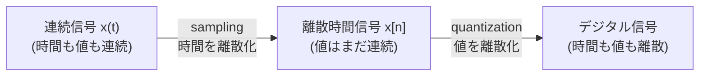

# デジタル音声の基礎 — サンプリングと量子化

!!! abstract "学習目標"

    この章を読み終えると、次のことができるようになります。

    - 連続信号を離散信号に変換する **sampling**（標本化）と **quantization**（量子化）を説明できる
    - **サンプリング定理（Nyquist–Shannon）** を述べ、なぜ $f_s > 2f_\mathrm{max}$ が必要かを導出できる
    - **aliasing**（エイリアシング、折り返し雑音）がいつ・どのように起きるかを式と実験で示せる
    - 量子化による誤差を確率的にモデル化し、**SQNR ≈ 6.02 B + 1.76 dB** を導出できる

## 前提知識

- 三角関数・正弦波 $\sin(2\pi f t)$ の扱い
- 対数と decibel（dB）の定義 $10\log_{10}(\cdot)$
- Python と NumPy の基本（配列・ブロードキャスト）

まだ自信がなくても、必要な式はその都度導出するので読み進めて構いません。

## 直感

私たちが耳にする音は、空気の圧力が時間とともに連続的に変化する **波** です。これを数式で書くと、時刻 $t$ の関数 $x(t)$ になります。連続というのは「どんなに細かい時刻でも値が決まっている」という意味で、情報は無限にあります。

ところがコンピュータが保存・処理できるのは、**とびとびの時刻の、とびとびの値** だけです。そこで音をデジタル化するには、2 つの「離散化」が必要になります。



- **Sampling（標本化）**: 一定間隔ごとに値を「つまみ食い」して、時間方向を離散化する。
- **Quantization（量子化）**: つまみ食いした値を、決められた段階のどれかに丸めて、値方向を離散化する。

ここで自然な疑問が 2 つ生まれます。

1. どれくらいの間隔でつまみ食いすれば、元の波を**失わずに**復元できるのか？ → サンプリング定理
2. 何段階に丸めれば「十分きれい」なのか？ → 量子化と SQNR

この章では、この 2 つの問いに数式で答えます。

## 理論

### サンプリング（標本化）

連続信号 $x(t)$ を、周期 $T$ ごとに取り出した値の列を **離散時間信号** と呼び、次のように書きます。

$$
x[n] = x(nT), \quad n = 0, 1, 2, \dots
$$

ここで $T$ を **サンプリング周期**、その逆数

$$
f_s = \frac{1}{T}
$$

を **サンプリング周波数**（標本化周波数, 単位 Hz）と呼びます。CD は $f_s = 44{,}100\ \text{Hz}$、つまり 1 秒間に 44,100 回つまみ食いしています。

### サンプリング定理（Nyquist–Shannon）

!!! note "定理（標本化定理）"

    信号 $x(t)$ が **帯域制限** されている、すなわち最大周波数 $f_\mathrm{max}$ より上の成分を含まないとする。このとき、

    $$
    f_s > 2 f_\mathrm{max}
    $$

    を満たすサンプリング周波数で標本化すれば、$x(t)$ は標本列 $x[n]$ から **完全に復元できる**。

この $f_s / 2$ を **Nyquist 周波数** と呼びます。「保存したい最高周波数の 2 倍より速くサンプリングせよ」というのが結論です。逆に $f_s$ が足りないと、高い周波数が低い周波数に化けてしまいます。これが次の aliasing です。

### Aliasing（エイリアシング）

サンプリング周波数 $f_s$ で正弦波 $\cos(2\pi f t)$ を標本化すると、周波数 $f$ と $f + k f_s$（$k$ は整数）は **区別できなくなります**。Nyquist 周波数を超えた成分は、折り返して別の周波数に見えます。観測される見かけの周波数（alias）は

$$
f_\mathrm{alias} = \left| f - f_s \cdot \mathrm{round}\!\left(\frac{f}{f_s}\right) \right|
$$

で与えられます。これを防ぐには、サンプリングの前に $f_s/2$ より上を削る **anti-aliasing filter**（アナログのローパスフィルタ）を通します。

### 量子化（quantization）

標本値はまだ実数（連続値）です。これを $B$ ビットで表すと、$L = 2^B$ 段階のどれかに丸めることになります。信号の振幅が $[-A, A]$ に収まるとすると、1 段階の幅（**量子化ステップ**）は

$$
\Delta = \frac{2A}{2^B}
$$

です。丸めによって生じる誤差 $e = x_q - x$ を **量子化誤差** と呼びます。

## 数式の導出

### サンプリング定理の直感的導出

なぜ「2 倍」なのかを、正弦波で確かめます。周波数 $f$ の正弦波を $f_s$ で標本化したサンプル列を考えます。

$$
x[n] = \cos\!\left(2\pi f \, nT\right) = \cos\!\left(2\pi \frac{f}{f_s} n\right)
$$

ここで $f$ を $f + f_s$ に置き換えると、

$$
\cos\!\left(2\pi \frac{f + f_s}{f_s} n\right)
= \cos\!\left(2\pi \frac{f}{f_s} n + 2\pi n\right)
= \cos\!\left(2\pi \frac{f}{f_s} n\right)
$$

となり、$2\pi n$ ($n$ は整数) は $\cos$ の周期なので **まったく同じサンプル列** になります。つまり $f$ と $f + f_s$ は標本化後に区別できません。同様に $f$ と $-f$ も $\cos$ では区別できません。

したがって、ある周波数を一意に決めるには、すべての周波数成分が幅 $f_s$ の区間 $[-f_s/2,\ f_s/2)$ に収まっていなければなりません。最大周波数が $f_\mathrm{max}$ なら、

$$
f_\mathrm{max} < \frac{f_s}{2} \quad\Longleftrightarrow\quad f_s > 2 f_\mathrm{max}
$$

が条件になります。これがサンプリング定理です。$\blacksquare$

### 量子化誤差のモデルと SQNR の導出

量子化誤差 $e$ を確率的に扱います。標準的な仮定は次のとおりです。

!!! note "量子化誤差の仮定"

    量子化誤差 $e$ は区間 $\left[-\frac{\Delta}{2}, \frac{\Delta}{2}\right]$ 上の **一様分布** に従い、信号とは無相関である。

この仮定のもとで、誤差の平均は $0$、分散（= 雑音電力）は一様分布の分散の公式から

$$
\sigma_e^2 = \mathbb{E}[e^2] = \frac{1}{\Delta}\int_{-\Delta/2}^{\Delta/2} e^2 \, de
= \frac{1}{\Delta}\left[\frac{e^3}{3}\right]_{-\Delta/2}^{\Delta/2}
= \frac{\Delta^2}{12}
$$

となります。次に信号電力を求めます。振幅 $A$（フルスケール）の正弦波 $x(t) = A\sin(2\pi f t)$ の平均電力は

$$
P_\mathrm{signal} = \frac{1}{T_0}\int_0^{T_0} A^2 \sin^2(2\pi f t)\, dt = \frac{A^2}{2}
$$

です。**SQNR**（Signal-to-Quantization-Noise Ratio）は信号電力と雑音電力の比で定義されます。$\Delta = 2A / 2^B$ を代入すると、

$$
\sigma_e^2 = \frac{\Delta^2}{12} = \frac{1}{12}\left(\frac{2A}{2^B}\right)^2 = \frac{A^2}{3 \cdot 2^{2B}}
$$

なので、

$$
\mathrm{SQNR} = \frac{P_\mathrm{signal}}{\sigma_e^2}
= \frac{A^2/2}{A^2 / (3\cdot 2^{2B})}
= \frac{3}{2}\, 2^{2B}
$$

これを dB で表すと、

$$
\begin{aligned}
\mathrm{SQNR_{dB}} &= 10\log_{10}\!\left(\frac{3}{2}\, 2^{2B}\right) \\
&= 10\log_{10}\frac{3}{2} + 2B \cdot 10\log_{10} 2 \\
&\approx 1.76 + 6.02\,B \quad [\text{dB}]
\end{aligned}
$$

これが有名な **「1 ビット増やすごとに SQNR が約 6 dB 良くなる」** という法則です。16 ビット（CD）なら $\mathrm{SQNR} \approx 6.02 \times 16 + 1.76 \approx 98\ \text{dB}$ になります。$\blacksquare$

## 実装

NumPy だけで、サンプリング・エイリアシング・量子化を確かめます。コードはそのまま実行できます。

### サンプリングとエイリアシング

```python title="aliasing.py"
import numpy as np

fs = 1000.0                       # サンプリング周波数 [Hz]（Nyquist = 500 Hz）
T = 1.0 / fs                      # サンプリング周期 [s]
n = np.arange(int(fs * 1.0))      # 1 秒分のサンプル番号
t = n * T                         # 各サンプルの時刻 [s]

f_low = 100.0                     # 100 Hz: Nyquist 以下なので正しく表現できる
f_high = f_low + fs               # 1100 Hz: Nyquist を超えている

x_low = np.sin(2 * np.pi * f_low * t)
x_high = np.sin(2 * np.pi * f_high * t)

# 1100 Hz は標本化すると 100 Hz と区別できない（エイリアシング）
print("1100 Hz と 100 Hz のサンプル列は一致:", np.allclose(x_low, x_high))

# alias 周波数の式で確認する
f = 1100.0
f_alias = abs(f - fs * round(f / fs))
print(f"{f} Hz は見かけ上 {f_alias} Hz に化ける")
```

```text title="出力"
1100 Hz と 100 Hz のサンプル列は一致: True
1100.0 Hz は見かけ上 100.0 Hz に化ける
```

Nyquist 周波数（500 Hz）を超えた 1100 Hz が、100 Hz と完全に同じサンプル列になってしまうことが確認できます。これがサンプリング周波数を上げる、あるいは事前にローパスフィルタをかける理由です。

### 量子化と SQNR の検証

```python title="quantization.py"
import numpy as np

def quantize(x, bits, x_max=1.0):
    """[-x_max, x_max] を 2**bits 段階に丸める（mid-tread 量子化器）。"""
    delta = 2 * x_max / (2 ** bits)        # 量子化ステップ幅 Δ
    xq = np.round(x / delta) * delta       # 最も近い段階へ丸める
    return np.clip(xq, -x_max, x_max)

fs = 16000.0
t = np.arange(int(fs)) / fs
x = np.sin(2 * np.pi * 440.0 * t)          # フルスケール（振幅 1.0）の 440 Hz 正弦波

print(f"{'bits':>4} | {'実測 SQNR':>10} | {'理論 6.02B+1.76':>16}")
for bits in (4, 8, 12, 16):
    xq = quantize(x, bits, x_max=1.0)
    noise = xq - x
    sqnr = 10 * np.log10(np.mean(x ** 2) / np.mean(noise ** 2))
    theory = 6.02 * bits + 1.76
    print(f"{bits:>4} | {sqnr:>9.2f}dB | {theory:>14.2f}dB")
```

```text title="出力（量子化雑音の式は近似なので、値は理論から 1 dB 程度ずれます）"
bits |   実測 SQNR | 理論 6.02B+1.76
   4 |     26.20dB |          25.84dB
   8 |     51.00dB |          49.92dB
  12 |     74.02dB |          74.00dB
  16 |     98.71dB |          98.08dB
```

実測値は理論式 $6.02B + 1.76$ と **約 1 dB 以内** で一致し、ビット数が増えるほどよく合います。
完全一致しないのは、「誤差が一様分布で信号と無相関」という仮定が近似だからです。
それでも、**4 ビット増えるごとに約 24 dB（= 1 ビットあたり約 6 dB）** という傾向（$26 \to 51 \to 74 \to 99$）がはっきり読み取れ、導出した式が量子化雑音の振る舞いをよく説明できていることが確認できます。

## 演習

!!! question "演習 1: Nyquist 周波数"

    CD のサンプリング周波数は 44,100 Hz です。理論上、ひずみなく記録できる最高の周波数は何 Hz でしょうか。人間の可聴域の上限（約 20 kHz）と比べてどうですか。

    ??? success "解答"

        Nyquist 周波数は $f_s / 2 = 44{,}100 / 2 = 22{,}050\ \text{Hz}$ です。可聴域の上限 20 kHz より少し高く、可聴域全体を余裕をもってカバーするように 44.1 kHz が選ばれています。

!!! question "演習 2: alias 周波数の計算"

    サンプリング周波数 $f_s = 8000\ \text{Hz}$ で 7000 Hz の正弦波を標本化すると、見かけ上は何 Hz に聞こえますか。式 $f_\mathrm{alias} = \lvert f - f_s\,\mathrm{round}(f/f_s)\rvert$ を使って求めてください。

    ??? success "解答"

        $\mathrm{round}(7000/8000) = \mathrm{round}(0.875) = 1$ なので、
        $f_\mathrm{alias} = |7000 - 8000 \times 1| = 1000\ \text{Hz}$。
        7000 Hz の音が 1000 Hz の低い音に化けて聞こえます。

!!! question "演習 3: 必要なビット数"

    ある用途で SQNR を 80 dB 以上にしたいとします。何ビットの量子化が必要ですか。$6.02B + 1.76 \ge 80$ を解いてください。

    ??? success "解答"

        $6.02B \ge 78.24$ より $B \ge 13.0$。整数ビットなので **13 ビット以上** が必要です（実用上は 16 ビットが選ばれることが多い）。

!!! question "演習 4（実装）: 量子化の可聴化"

    上の `quantize` 関数を使い、`bits` を 2, 4, 8 と変えて 440 Hz の正弦波を量子化し、`scipy.io.wavfile.write` か `soundfile` で WAV に書き出して聴き比べてみましょう。ビット数が少ないほど、ざらついた雑音（量子化雑音）が乗ることを耳で確認してください。

    ??? success "ヒント"

        ```python
        import soundfile as sf
        for bits in (2, 4, 8):
            sf.write(f"sine_{bits}bit.wav", quantize(x, bits).astype("float32"), int(fs))
        ```
        ビット数を下げると、静かな部分ほど雑音が目立つことに気づくはずです。

## まとめ

!!! success "この章の要点"

    - 音のデジタル化は **sampling（時間の離散化）** と **quantization（値の離散化）** の 2 段階。
    - **サンプリング定理**: $f_s > 2 f_\mathrm{max}$ なら帯域制限信号を完全復元できる。$f_s/2$ が Nyquist 周波数。
    - これを破ると **aliasing** が起き、高い周波数が $f_\mathrm{alias} = \lvert f - f_s\,\mathrm{round}(f/f_s)\rvert$ に化ける。
    - 量子化誤差は一様分布と近似でき、雑音電力は $\Delta^2/12$。フルスケール正弦波の **SQNR ≈ 6.02 B + 1.76 dB**。

### 次に学ぶこと

ここまでで「時間領域」で音を扱えるようになりました。次は、音を **周波数の成分** に分解する **Fourier 変換** に進みます。aliasing が「周波数の折り返し」として、より明確に見えるようになります。

→ [Audio ロードマップに戻る](index.md)

## 参考文献

1. A. V. Oppenheim, R. W. Schafer, *Discrete-Time Signal Processing*, 3rd ed., Pearson, 2009.
2. C. E. Shannon, "Communication in the Presence of Noise," *Proceedings of the IRE*, vol. 37, no. 1, pp. 10–21, 1949.
3. J. O. Smith III, *Introduction to Digital Filters with Audio Applications*, W3K Publishing, 2007. （オンライン公開: <https://ccrma.stanford.edu/~jos/filters/>）
