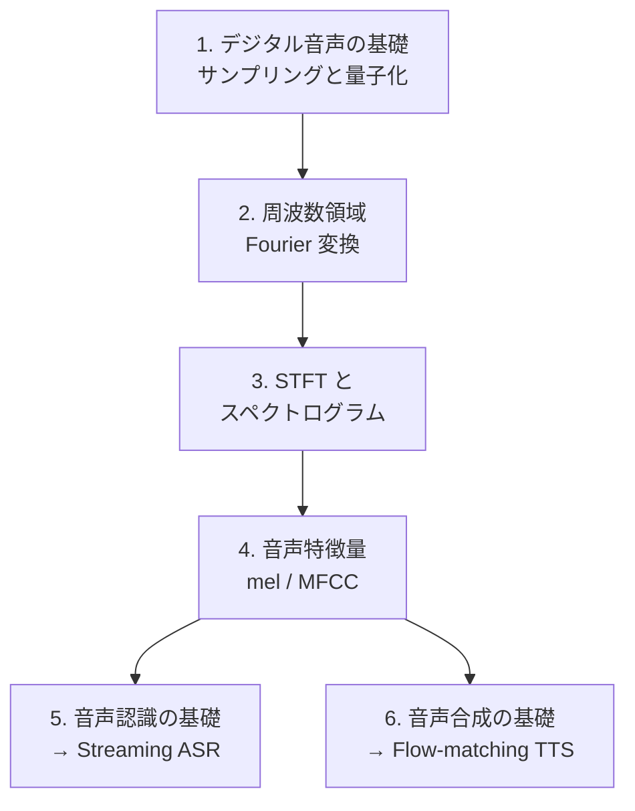

# Audio（音声・音響）

音をコンピュータで扱うための基礎から、信号処理、機械学習による音声認識・合成までを体系的に学びます。

!!! abstract "この分野で身につくこと"

    - 音をデジタルで表現する仕組み（sampling, quantization）を説明できる
    - 時間領域・周波数領域を行き来して信号を分析できる（Fourier 変換, STFT）
    - 音声特徴量（spectrogram, MFCC など）を自分で計算できる
    - 音声認識・音声合成の基本的な仕組みを理解する

## North Star（最終目標）

この分野を学び切った先で「自力で学習でき、新しいアーキも提案できる」状態を目指します。

1. **Streaming ASR** — 低遅延で逐次に音声を認識する（CTC / RNN-T / chunk-wise attention）
2. **Flow-matching TTS** — 非自己回帰・数ステップで音声を合成する（F5-TTS 系）
3. **Streaming TTS（CALM / Kyutai 系）** — テキストと音声を単一モデルで同時に流す

!!! tip "LLM 出身者向けの近道"

    Transformer・自己回帰デコード・トークナイザの知識はそのまま使えます。音声で新しいのは主に 2 点
    ——「**連続音声のトークン化／特徴量化**」と「**ストリーミング遅延**」。ここに時間を集中させます。

## 前提知識

- 高校〜大学初年度の微積分・線形代数
- Python の基本（NumPy で配列を扱える程度）

## ロードマップ

各ステージは **学ぶ（理論）/ 橋渡し（既知との接続）/ 作る（最小実装）** で進めます。

### 1. デジタル音声の基礎 ✅ Ready

- **学ぶ**: サンプリング・Nyquist・aliasing・量子化・SQNR
- **橋渡し**: 「波形 = 非常に長い 1 次元数列」。LLM のトークン列より桁違いに長く冗長 —— だから次章以降で周波数領域へ移して圧縮する、という動機の出発点
- **作る**: NumPy でサンプリング／エイリアシング／量子化を実装し、理論式を実測で確かめる

→ [デジタル音声の基礎を読む](01-digital-audio-basics.md)

### 2. 周波数領域 — Fourier 変換 🚧 Planned

- **学ぶ**: DFT / FFT / 振幅と位相
- **橋渡し**: aliasing が「周波数の折り返し」として明確に見える
- **作る**: 正弦波の重ね合わせを FFT で分解して可視化

## 章一覧

| # | 章 | 状態 |
| --- | --- | --- |
| 1 | [デジタル音声の基礎 — サンプリングと量子化](01-digital-audio-basics.md) | ✅ 公開 |
| 2 | 周波数領域 — Fourier 変換 | 🚧 予定 |
| 3 | 短時間 Fourier 変換とスペクトログラム | 🚧 予定 |
| 4 | 音声特徴量 — mel / MFCC | 🚧 予定 |
| 5 | 音声認識の基礎 → Streaming ASR | 🚧 予定 |
| 6 | 音声合成の基礎 → Flow-matching TTS | 🚧 予定 |

!!! note "章は順次追加されます"

    「次は◯◯の章を書いて」と指示すると、統一フォーマットで新しい章が追加されます。
