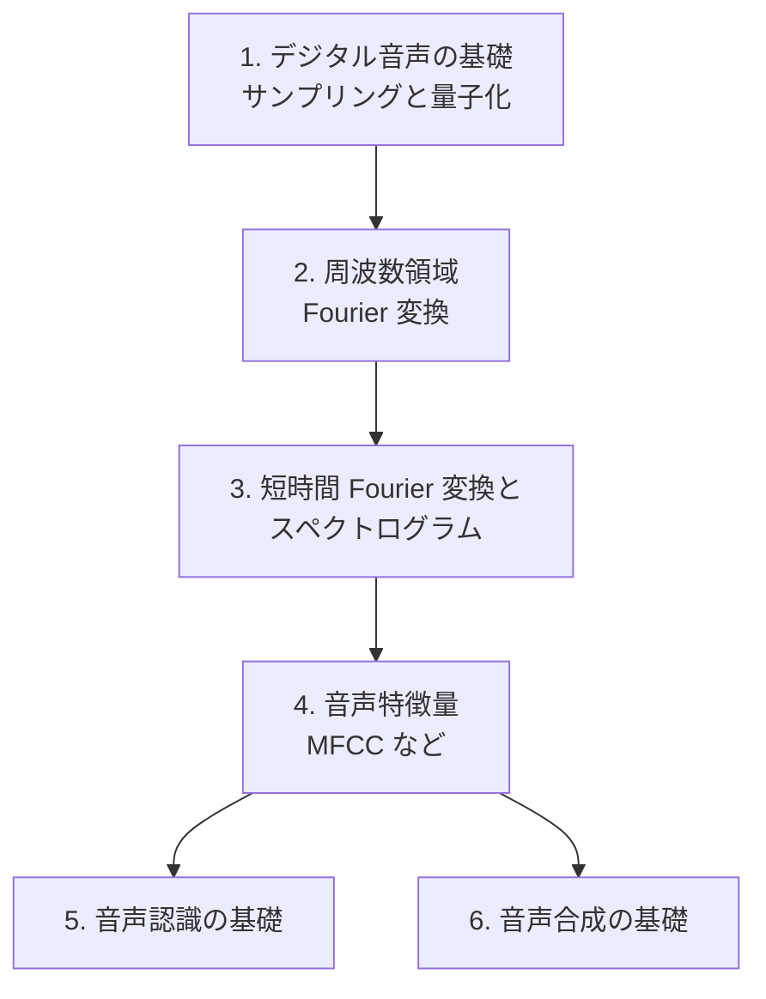

# Audio（音声・音響）

音をコンピュータで扱うための基礎から、信号処理、機械学習による音声認識・合成までを体系的に学びます。

!!! abstract "この分野で身につくこと"

    - 音をデジタルで表現する仕組み（sampling, quantization）を説明できる
    - 時間領域・周波数領域を行き来して信号を分析できる（Fourier 変換, STFT）
    - 音声特徴量（spectrogram, MFCC など）を自分で計算できる
    - 音声認識・音声合成の基本的な仕組みを理解する

## 前提知識

- 高校〜大学初年度の微積分・線形代数
- Python の基本（NumPy で配列を扱える程度）

## ロードマップ

## 章一覧

| # | 章 | 状態 |
| --- | --- | --- |
| 1 | [デジタル音声の基礎 — サンプリングと量子化](01-digital-audio-basics.md) | ✅ 公開 |
| 2 | 周波数領域 — Fourier 変換 | 🚧 予定 |
| 3 | 短時間 Fourier 変換とスペクトログラム | 🚧 予定 |
| 4 | 音声特徴量 — MFCC | 🚧 予定 |
| 5 | 音声認識の基礎 | 🚧 予定 |
| 6 | 音声合成の基礎 | 🚧 予定 |

!!! note "章は順次追加されます"

    「次は◯◯の章を書いて」と指示すると、統一フォーマットで新しい章が追加されます。
