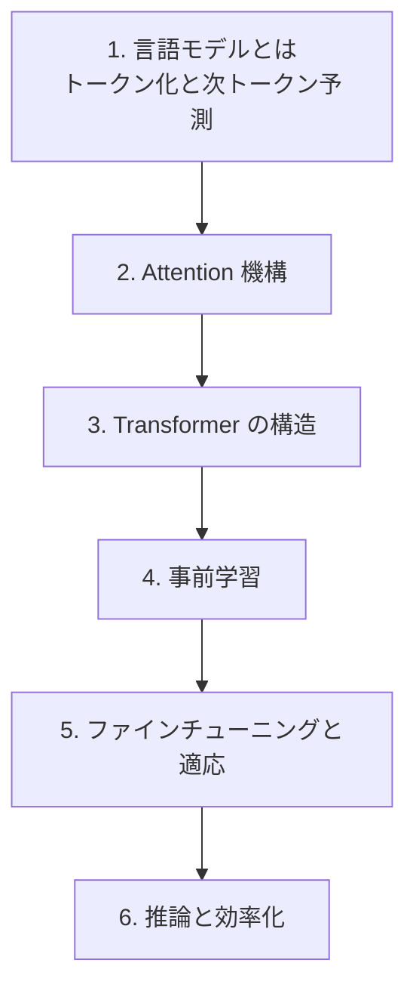

# LLM（大規模言語モデル）

大規模言語モデルを支える技術を、Transformer の基礎から事前学習・適応・推論最適化まで体系的に学びます。

!!! abstract "この分野で身につくこと"

    - Transformer の各構成要素（attention, FFN, 正規化）を説明・実装できる
    - 言語モデルの学習目的（次トークン予測）と評価指標を理解する
    - 事前学習・ファインチューニング・指示チューニングの違いを説明できる
    - 推論時の効率化（KV cache, 量子化など）の基本を理解する

## 前提知識

- 線形代数・微積分・確率の基礎
- 深層学習の基礎（多層パーセプトロン、誤差逆伝播）
- Python と PyTorch の基礎

## ロードマップ

## 章一覧

| # | 章 | 状態 |
| --- | --- | --- |
| 1 | 言語モデルとは — トークン化と次トークン予測 | 🚧 予定 |
| 2 | Attention 機構 | 🚧 予定 |
| 3 | Transformer の構造 | 🚧 予定 |
| 4 | 事前学習 | 🚧 予定 |
| 5 | ファインチューニングと適応 | 🚧 予定 |
| 6 | 推論と効率化 | 🚧 予定 |

!!! note "章は順次追加されます"

    「次は◯◯の章を書いて」と指示すると、統一フォーマットで新しい章が追加されます。
