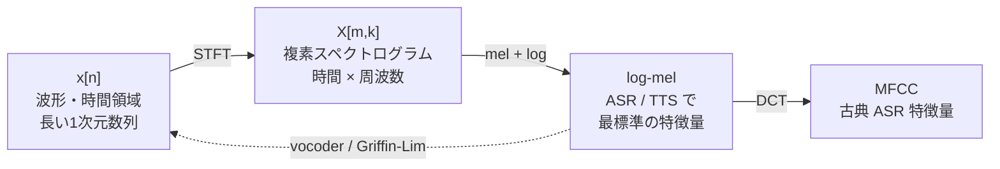

# 周波数領域とスペクトル特徴量

:::abstract[学習目標]
この章を読み終えると、次のことができるようになります。

- **DFT / STFT** の式を述べ、なぜ波形全体の DFT では時間情報が消え、短い窓で区切る STFT が必要かを説明できる
- STFT のパラメータ（`n_fft` / `hop` / `window`）から **フレームレートと周波数 bin 数** を計算し、時間 ↔ 周波数解像度のトレードオフを説明できる
- **メルフィルタバンク** $M$ を「入力に依存しない固定行列」として NumPy で構築し、log-mel spectrogram を計算する手順を再現できる
- **MFCC** と log-mel の関係（DCT 1 回ぶんの差）を述べ、**位相を捨てた特徴量から波形へ戻す**（Griffin-Lim / vocoder）難しさを説明できる
:::

## 前提知識

- [章 01：デジタル音声の基礎](/audio/01-digital-audio-basics/) の **sampling**（標本化）・Nyquist 周波数・PCM。この章はその続きで、すでに得た数値列 $x[n]$ を周波数領域へ移します。
- 三角関数と複素指数 $e^{j\theta} = \cos\theta + j\sin\theta$（オイラーの公式）
- 対数と decibel（dB）の定義 $10\log_{10}(\cdot)$、微積分（総和・積分の基本）
- Python と NumPy の基本（配列・ブロードキャスト・`np.linspace`）

まだ自信がなくても、必要な式はその都度説明するので読み進めて構いません。

## 直感

同じ「ラ（440 Hz）」でも、声で出すか楽器で弾くかで波形の形はまるで違います。ところが **周波数成分** に分解して見ると、共通する構造（基本周波数とその倍音）が浮かび上がります。人間の聴覚も、内耳の蝸牛で音を**周波数ごとに分解**してから脳へ送っています。だから周波数表現は知覚に近く、機械学習の入力としてもよく効きます。

章 01 で得た波形 $x[n]$ は「非常に長い 1 次元数列」でした。1 秒の 16 kHz mono がすでに 16,000 個 ── LLM のトークン列より桁違いに長く、しかも情報密度は低く冗長です。ナマ波形を直接 Transformer に食わせるのは長すぎます。そこで波形を**周波数領域へ移してダウンサンプル**し、扱いやすい特徴量に圧縮します。これがこの章すべての動機です。

## 全体像

音声処理の背骨は、この往復ひとつに尽きます。実線が**分析方向**（ASR の前処理）、破線が**合成方向**（TTS の出口）です。波形 16,000 個/秒 が、STFT を経て 100 フレーム/秒 × 80 次元へと圧縮されていきます。



*順方向（実線）＝分析：波形を STFT で複素スペクトログラムにし、メルフィルタバンクと log で log-mel に圧縮、さらに DCT をかければ MFCC。逆方向（破線）＝合成：log-mel から波形を vocoder または Griffin-Lim で復元する。ここが位相を捨てた状態から音を作り直す難所（§6）です。*

LLM の処理と並べると、各ステップの役割が見えます。音声には「連続特徴量（log-mel）」と「離散トークン（neural codec）」の 2 つの道があり、どちらを選ぶかが ASR / TTS のアーキ全体を決めます。

:::note[LLM ↔ Speech]
| LLM | 音声（連続） | 音声（離散） |
| --- | --- | --- |
| 文字列 | 波形 $x[n]$ | 波形 $x[n]$ |
| トークナイズ | STFT → mel | neural codec (RVQ) |
| 埋め込み列 | log-mel フレーム列 | codec トークン列 |
| デトークナイズ | vocoder | codec デコーダ |
:::

この章では連続特徴量の道（STFT → mel → log-mel → MFCC → 逆変換）をたどり、最後に離散トークンの道へ橋を架けます。なお波形を得るところまで（サンプリング・量子化・Nyquist・PCM）は章 01 で詳説したので、ここでは前提として扱います。

## なぜ周波数領域か：フーリエ変換

- 同じ「ラ（440 Hz）」でも波形の形は声 / 楽器で違いますが、**周波数成分**で見ると構造が見えます。
- 人間の聴覚も内耳（蝸牛）で**周波数分解**しています。だから周波数表現は知覚に近く、学習に効きます。
- **離散フーリエ変換（DFT, Discrete Fourier Transform）**：長さ $N$ の波形を $N$ 個の複素数（各周波数 bin の振幅と位相）へ変換します。

$$X[k]=\sum_{n=0}^{N-1} x[n]\, e^{-j 2\pi k n / N}$$

記号の意味を確認します。$x[n]$ は入力波形の $n$ 番目のサンプル（$n = 0 \dots N-1$、計 $N$ 個）。$k$ は周波数 bin の番号（$k = 0 \dots N-1$）で、$k$ 番目の bin は周波数 $k \cdot f_s / N$ に対応します。$e^{-j 2\pi k n / N}$ は周波数 $k$ の複素正弦波で、これと波形の内積を取ることで「波形に周波数 $k$ の成分がどれだけ含まれるか」を測っています。

- $|X[k]|$ = その周波数の強さ（**マグニチュード**, magnitude）、$\angle X[k]$ = **位相**（phase）。**FFT**（Fast Fourier Transform）は DFT の高速計算アルゴリズム（計算量 $O(N \log N)$）で、結果は DFT と同一です。
- 問題：DFT は波形**全体**を 1 枚の周波数像にします → **時間情報が消える**（いつ何の音が鳴ったか分からない）。音声は時間変化が本質です。たとえば「あいうえお」全体を 1 回 DFT すると、5 つの母音の成分が混ざって「いつ『あ』が鳴ったか」は復元できません。そこで「短い窓で区切って FFT」します → STFT。

## STFT：短時間フーリエ変換（主役）

波形を**少しずつずらした短い窓**で切り、各窓に FFT をかけます。結果は時間 × 周波数の 2 次元・複素数です。

$$X[m,k]=\sum_{n} x[n]\, w[n-mH]\, e^{-j 2\pi k n / N}$$

ここで $m$ は**時間フレーム**の番号（窓を $m$ 個ぶんずらした位置）、$k$ は周波数 bin の番号、$w[\cdot]$ は窓関数、$H$ はホップ長です。$w[n - mH]$ は「$m$ 番目のフレーム位置に窓を置いて波形を切り出す」操作で、これを掛けてから FFT をかけるのが DFT との違いです。各記号の典型値を表にまとめます。

| 記号 | 名前 | 典型値（16 kHz） | 意味 |
| --- | --- | --- | --- |
| `N` (n_fft) | FFT サイズ / 窓長 | 400–1024 | 1 窓のサンプル数。周波数 bin 数 = N/2 + 1 |
| `H` (hop) | ホップ長 | 160 (=10 ms) | 窓をずらす量。フレームレート = fs/H |
| `w[·]` | 窓関数 | Hann | 窓端の不連続を抑え、スペクトル漏れを減らす |
| `win_length` | 実効窓長 | ≤ n_fft | 窓関数を当てる長さ |

フレームレートと周波数 bin 数は、これらのパラメータから決まります。

$$\text{fps}=\frac{f_s}{H}, \qquad \text{bins}=\frac{N}{2}+1$$

- **フレーム**（frame）= 1 窓ぶんの分析結果（時間軸 $m$ の 1 ステップ）=「音声版トークン位置」。$H = 160$ なら 1 秒 = 100 フレーム。**ここで波形 16,000 個 → 100 フレームに圧縮**されます。bin 数は $N = 400$ なら $400/2 + 1 = 201$、実数信号の FFT は対称なので前半 $N/2 + 1$ 本だけ保持すれば十分です。

### 時間 ↔ 周波数 解像度のトレードオフ（不確定性原理）

- 窓を長く → 周波数解像度↑（細かい音程が見える）／時間解像度↓（いつ鳴ったか曖昧）。
- 窓を短く → 逆。音声は子音（短時間）と母音（定常）が混在するので、**中庸**（25 ms 窓・10 ms ホップ）が定番です。
- **窓関数**：矩形窓だと窓端のジャンプが偽の高周波（**スペクトル漏れ**, spectral leakage）を生みます。Hann / Hamming 窓で端を滑らかに 0 へ落とすことで、これを抑えます。

:::note[直感]
STFT =「音楽の楽譜」を機械的に作る操作です。横が時間、縦が音の高さ、濃さが強さに対応します。
:::

## スペクトログラム：複素数からパワーへ

- STFT は複素数です。**マグニチュード** $|X[m,k]|$ = 各時刻・各周波数の強さ = **スペクトログラム**（spectrogram）。**パワースペクトログラム**（power spectrogram）= $|X|^2$。
- **位相** $\angle X[m,k]$ は ASR では捨てられます。が、**合成（TTS）では位相復元が課題**になります（§6）。

$$\text{dB}=10\log_{10}\!\left(|X|^2+\varepsilon\right)$$

振幅は桁が大きく変わり、知覚も対数的なので dB で圧縮します。log の前に小さな floor $\varepsilon$（例 `1e-10`）を足して $\log(0) = -\infty$ を防ぎます。

## メルスケール：人間の聴覚に合わせる

- 人間は低域の差に敏感で、高域は鈍いです（周波数知覚が**対数的**）。線形周波数のままだと低域の情報が薄くなります。
- **メル尺度**（mel scale）：知覚上の等間隔を作る写像です。

$$\mathrm{mel}(f)=2595\,\log_{10}\!\left(1+\frac{f}{700}\right)$$

- **メルフィルタバンク**（mel filterbank）：線形周波数の $|X|^2$（$N/2+1$ bin）を、メル軸上で等間隔の**三角フィルタ**（典型 80 本）で重み付け和して圧縮します。行列 1 個 $M$（形 `[n_mels, N/2+1]`）を掛けるだけです。

$$\mathrm{mel}=M\,|X|^2$$

:::warning[添字の注意]
ここの $m$ は**メルフィルタの番号** $m = 0 \dots n\_mels-1$（例 0…79、計 80 本）です。§STFT の $X[m,k]$ の $m$ は**時間フレーム**の番号で**別物**です。$k$ は両方とも周波数 bin の番号 $k = 0 \dots N/2$ で共通です。$M[m,k]$ = $m$ 行目（$m$ 番目のフィルタ）× $k$ 列目（$k$ 番目の bin）の重み、を表します。
:::

- 周波数 bin 201（または 513）→ **80 次元**へ削減。低域に細かく、高域に粗く割り当てられます。
- **log-mel spectrogram** = $\log(\mathrm{mel} + \varepsilon)$。**これが現代 ASR / TTS で最も標準的な入出力**です。形は `[n_mels, フレーム数]`（例 `[80, 100]`/秒）。Whisper も log-mel 入力です。多くの flow-matching TTS（F5-TTS 等）は log-mel を生成し、別の vocoder で波形化します。

:::note[LLM ↔ Speech]
log-mel の 1 フレーム（80 次元ベクトル）≒ 1 トークンの埋め込みです。ASR は「埋め込み列 → テキスト」、TTS は「テキスト → 埋め込み列 → 波形」と対応づけられます。
:::

### M はどうやって作るか（入力に依存しない固定行列）

$M$（形 `[n_mels, N/2+1]`）は `sr` / `n_fft` / `n_mels` / `fmin` / `fmax` の**パラメータだけ**から決まります。三角フィルタをメル軸上で等間隔に並べ、FFT bin の周波数で高さを読むだけ ── **音声データは一切出てきません**。だから 1 回計算して全フレーム・全入力で使い回す定数行列になります。手順は次の 4 ステップです。

1. **FFT bin の中心周波数**を出す（= $M$ の列に対応、$N/2+1$ 本）。
2. **境界点をメル軸で等間隔**に $n\_mels+2$ 個取り、Hz に戻す（mel で等間隔 → Hz では**低域が密・高域が粗**）。
3. 連続する 3 点を **左 $f_L$ / 中心 $f_C$ / 右 $f_R$** とする**三角形**を作る（隣のフィルタと中心が半分ずつ重なる）。
4. 各三角形を **FFT bin の周波数で評価** → 行列要素 $M[m,k]$。

<figure>
  <canvas id="mel-fbank" width="1600" height="440" aria-hidden="true"></canvas>
  <figcaption class="fig-cap"><span>各三角フィルタ＝周波数ごとの重み（中心で1・両端0・隣と半分重なる）</span><span>低域は密・高域は粗（メル間隔）</span></figcaption>
</figure>

*縦＝重み、横＝周波数（単位 Hz）。色付きの 1 本が「そのバンドのエネルギーを重み付き和で拾う窓」です。$\mathrm{mel}[m]$ は各 bin のパワーにこの高さを掛けて足したものになります。*

ステップ 1：FFT bin の中心周波数を出します。

$$f_k = k\cdot\frac{sr}{\texttt{n\_fft}},\quad k=0,1,\dots,N/2$$

ステップ 2：境界点をメル軸で等間隔に取り、逆関数 mel2hz で Hz に戻します。

$$\mathrm{mel2hz}(m)=700\left(10^{m/2595}-1\right)$$

ステップ 3・4：連続 3 点 $f_L / f_C / f_R$（= `hz_points[m]`, `[m+1]`, `[m+2]`）から三角フィルタを作り、各 bin の周波数で評価します。

$$\mathrm{tri}_m(f)=\begin{cases}\dfrac{f-f_L}{f_C-f_L} & f_L\le f\le f_C\\[2mm]\dfrac{f_R-f}{f_R-f_C} & f_C< f\le f_R\\[1mm]0 & \text{それ以外}\end{cases}$$

上式の上段が左肩（上り）、中段が右肩（下り）です。行列要素は各三角フィルタを FFT bin の周波数 $f_k$ で評価した値になります（音声非依存）。

$$M[m,k]=\mathrm{tri}_m(f_k)$$

コードにするとライブラリ（`torchaudio` / `librosa`）の中身そのものです。`min(上り, 下り)` を取って負をクリップすると三角形になります。

```python title="mel_filterbank.py"
import numpy as np

# sr=16000, n_fft=400, n_mels=80, fmin=0, fmax=8000
def hz2mel(f): return 2595.0 * np.log10(1.0 + f / 700.0)
def mel2hz(m): return 700.0 * (10.0 ** (m / 2595.0) - 1.0)

def mel_filterbank(sr, n_fft, n_mels, fmin, fmax):
    bins = np.arange(n_fft // 2 + 1) * sr / n_fft            # ① bin 中心周波数 [Hz]
    pts  = mel2hz(np.linspace(hz2mel(fmin), hz2mel(fmax), n_mels + 2))  # ②③ 境界点
    M = np.zeros((n_mels, len(bins)))
    for m in range(n_mels):                                  # ④⑤
        l, c, r = pts[m], pts[m+1], pts[m+2]
        up   = (bins - l) / (c - l)        # 左肩（上り）
        down = (r - bins) / (r - c)        # 右肩（下り）
        M[m] = np.clip(np.minimum(up, down), 0, None)
    return M   # [n_mels, n_fft/2+1] = [80, 201] 固定行列

if __name__ == "__main__":
    M = mel_filterbank(16000, 400, 80, 0, 8000)
    print("M の形:", M.shape)
    # メル間隔の証拠：低域フィルタは少数の bin、高域フィルタは多数の bin にまたがる
    print("フィルタ 0（低域）が拾う bin 数:", int((M[0] > 0).sum()))
    print("フィルタ 79（高域）が拾う bin 数:", int((M[79] > 0).sum()))
```

```text title="出力"
M の形: (80, 201)
フィルタ 0（低域）が拾う bin 数: 1
フィルタ 79（高域）が拾う bin 数: 14
```

低域フィルタが拾う bin はごく少数、高域フィルタは多くの bin にまたがる ── これがメル間隔（低域は密・高域は粗）の数値的な証拠です。

:::warning[流派の差：正規化]
素のままだと高域フィルタは幅が広く面積が大きいため、フィルタ間でエネルギーが不公平になります。**HTK 流**は正規化しません（上のコード）。**Slaney 流**（librosa 既定）は各フィルタを $2/(f_R-f_L)$ 倍して面積を揃えます。`torchaudio` は `MelScale(norm=..., mel_scale=...)` で選べます。どちらでも「固定行列」である点は変わりません。
:::

:::note[LLM ↔ Speech]
$M$ は**学習しない**「人間が設計した固定トークナイザ」です。対して neural codec（§7）のコードブックは**データから学習する**トークナイザです。$M$ も学習可能にする研究（SincNet / LEAF 等の learnable filterbank）もありますが、標準の log-mel では固定です。
:::

## MFCC：古典 ASR の特徴量（教養として）

- log-mel に**離散コサイン変換（DCT, Discrete Cosine Transform）**をかけ、低次の係数（典型 13 個）だけ残したもの = **MFCC**（Mel-Frequency Cepstral Coefficients）。DCT で次元間の相関を落とし、低次に概形（声道の形＝音色）を集約します。「ケプストラム」（cepstrum）の一種です。
- GMM-HMM 時代の主役でした。深層学習時代は **log-mel を直接使う**のが主流です（DCT で情報を捨てる必要がないため）。ただし前処理ライブラリやデータセットで今も出会うので、log-mel との関係（DCT 1 回ぶんの差）は押さえておきましょう。

## 逆変換：特徴量から波形へ（TTS の出口）

ASR は「波形 → 特徴量 → テキスト」で片道です。**TTS は特徴量 → 波形に戻す**必要があり、ここに音声特有の難所があります。

:::warning[位相問題]
log-mel（やマグニチュード）は**位相を捨てています**。波形再構成には位相が要りますが、ありません。これが TTS 出口の本質的な難しさです。
:::

- **Griffin-Lim**：マグニチュードから位相を**反復推定**する古典手法です。「ISTFT → STFT して位相だけ採用 → 元のマグニチュードに差し替え」を数十回ループします。動きますが音は機械的でくぐもります。**理解と動作確認用**です。
- **ニューラルボコーダ**（neural vocoder）：log-mel → 波形 を学習で解きます（HiFi-GAN, BigVGAN, Vocos）。現代 TTS の品質はほぼここで決まります。mel を作る部分（音響モデル）と波形化（vocoder）を**分離**するのが典型構成です。
- **codec 経由 / E2E**：mel を経由せず、§7 の離散コーデックで波形に戻す系統もあります（VALL-E, Kyutai 系）。

## 連続 vs 離散：次章への橋渡し

mel は「連続特徴量」です。もう 1 つの道が「**離散トークン**」で、これが LLM 知識を最大に活かせる入口になります。

- **ベクトル量子化（VQ, Vector Quantization）**：連続ベクトルを、学習したコードブック（有限個の代表ベクトル）の最近傍 ID に置換します → **離散トークン化**。
- **残差ベクトル量子化（RVQ, Residual Vector Quantization）**：1 個の codebook では粗いので、量子化誤差（残差）を次の codebook でさらに量子化…を数段重ねます。1 フレームが「複数トークン」で表現されます。EnCodec / SoundStream / DAC / **Mimi** の中核です。
- これにより**音声が「離散トークン列」になり、TTS が VALL-E のような「音声トークンの言語モデリング」に化けます**。Kyutai の DSM / Moshi はこの離散トークン列を、テキストと同じ土俵で streaming に扱います。

:::note[このフェーズのゴール]
「波形 ⇄ STFT ⇄ mel ⇄ 波形」の往復を**手で実装して耳で確認**できることが目標です。その上で次のフェーズでは「波形 ⇄ codec トークン ⇄ 波形」を学習済みモデルで体感し、連続 / 離散の 2 系統を腹落ちさせます。
:::

## 演習

::::question[演習 1: フレームレートと bin 数]
16 kHz の音声を `n_fft = 400`、`hop = 160` で STFT します。(a) 1 秒あたり何フレームになりますか。(b) 周波数 bin は何本ですか。(c) 各 bin の周波数間隔は何 Hz ですか。

:::details[解答]
(a) フレームレート $= f_s / H = 16000 / 160 = 100$ フレーム/秒。

(b) bin 数 $= N/2 + 1 = 400/2 + 1 = 201$ 本。

(c) bin 間隔 $= f_s / N = 16000 / 400 = 40\ \text{Hz}$。bin $k$ は周波数 $40k\ \text{Hz}$ に対応し、$k=200$ で Nyquist 周波数 $8000\ \text{Hz}$ に届きます。
:::
::::

::::question[演習 2: メルフィルタが固定行列である理由]
メルフィルタバンク行列 $M$ は、なぜ音声データを 1 つも見ずに作れるのでしょうか。また、$M$ を「1 回計算して使い回す」ことが許されるのはなぜですか。

:::details[解答]
$M$ の各要素 $M[m,k] = \mathrm{tri}_m(f_k)$ は、FFT bin の中心周波数 $f_k$（`sr` と `n_fft` だけで決まる）と、メル軸上で等間隔に置いた三角フィルタの境界（`n_mels` / `fmin` / `fmax` だけで決まる）から計算されます。式のどこにも波形 $x[n]$ や $|X|^2$ は登場しません。つまり $M$ はパラメータだけで決まる定数行列です。同じ `sr` / `n_fft` / `n_mels` / `fmin` / `fmax` を使う限り、すべてのフレーム・すべての入力で同じ $M$ を掛けるので、1 回計算して使い回せます。
:::
::::

## まとめ

:::success[この章の要点]
- **DFT** は波形全体を 1 枚の周波数像にするため時間情報が消える。短い窓で区切って FFT する **STFT** が音声の主役で、結果は時間 × 周波数の複素数 $X[m,k]$。
- STFT のパラメータからフレームレート $= f_s/H$、周波数 bin 数 $= N/2+1$ が決まる。窓を長くすると周波数解像度が上がり時間解像度が下がる（不確定性原理）。
- **メルフィルタバンク** $M$ は音声に依存しない固定行列。$|X|^2$ に掛けて log を取った **log-mel** が現代 ASR / TTS の標準入出力。
- **MFCC** は log-mel に DCT をかけた古典特徴量。log-mel は**位相を捨てている**ため、波形へ戻す（Griffin-Lim / vocoder）のが TTS 出口の難所。
:::

### 次に学ぶこと

ここまでで「連続特徴量（log-mel）」の道を最後までたどりました。次章では、もう 1 つの道 ── 波形を**離散トークン**に変える **neural codec（VQ / RVQ）** に進みます。LLM の知識を最大に活かせる「音声トークンの言語モデリング」への入口です。

→ [Audio ロードマップに戻る](/audio/)

## 用語ミニ辞典

| 用語 | 一言 |
| --- | --- |
| DFT / FFT | 波形 → 周波数（複素数）への変換。FFT は DFT の高速計算 $O(N\log N)$ |
| `n_fft` | FFT / 窓のサンプル数。周波数 bin = n_fft/2+1 |
| `hop_length` | 窓のずらし幅。フレームレート = fs/hop |
| window（Hann 等） | 窓端を滑らかにしスペクトル漏れを抑える |
| STFT | 短時間フーリエ変換。時間 × 周波数の複素スペクトログラム |
| spectrogram | 時間 × 周波数の強さ（$|X|^2$ 等） |
| mel filterbank | 線形周波数 → メル軸へ三角フィルタで圧縮（典型 80 本）。固定行列 |
| log-mel | log(mel)。現代 ASR / TTS の標準入出力 |
| MFCC | log-mel に DCT。古典 ASR 特徴量 |
| Griffin-Lim | マグニチュードから位相を反復推定して波形化 |
| vocoder | mel → 波形 を学習で解くネット（HiFi-GAN 等） |
| VQ / RVQ | 連続 → 離散トークン化。neural codec の核（次章） |

## 次のアクション

全体像のチェーンを `torchaudio` でコードで一周して定着させます（実装は薄くてよい・GPU 不要でログインノードで完結）。**最小の写経 → 動かす → 小実験** を 1 セットで。

1. **写経**：上の `mel_filterbank.py` を写して実行し、`M.shape` が `(80, 201)` になること、低域フィルタが拾う bin 数 < 高域フィルタが拾う bin 数 になることを自分の目で確認する。
2. **動かす**：LibriSpeech のサンプル 1 つを読み込み、STFT → power → mel filterbank → log-mel を計算し、スペクトログラムを画像保存する。
3. **小実験（逆変換）**：log-mel から Griffin-Lim で波形を復元し、元波形と聴き比べる（位相を捨てた劣化を体感する）。さらに `n_fft` / `hop` / `n_mels` を変えて、時間 ↔ 周波数解像度のトレードオフを目と耳で確認する。

## 参考文献

1. A. V. Oppenheim, R. W. Schafer, *Discrete-Time Signal Processing*, 3rd ed., Pearson, 2009.
2. D. W. Griffin, J. S. Lim, "Signal Estimation from Modified Short-Time Fourier Transform," *IEEE Transactions on Acoustics, Speech, and Signal Processing*, vol. 32, no. 2, pp. 236–243, 1984.
3. A. Radford, J. W. Kim, T. Xu, G. Brockman, C. McLeavey, I. Sutskever, "Robust Speech Recognition via Large-Scale Weak Supervision" (Whisper), arXiv:2212.04356, 2022.
4. J. Kong, J. Kim, J. Bae, "HiFi-GAN: Generative Adversarial Networks for Efficient and High Fidelity Speech Synthesis," *NeurIPS*, 2020.
