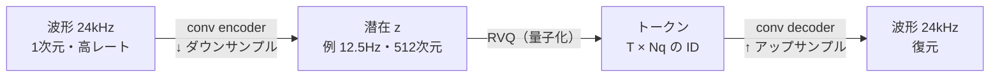
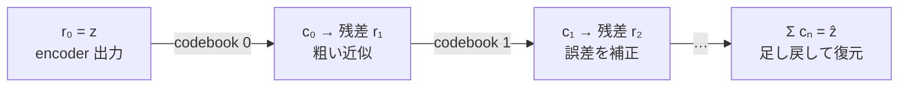
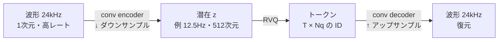
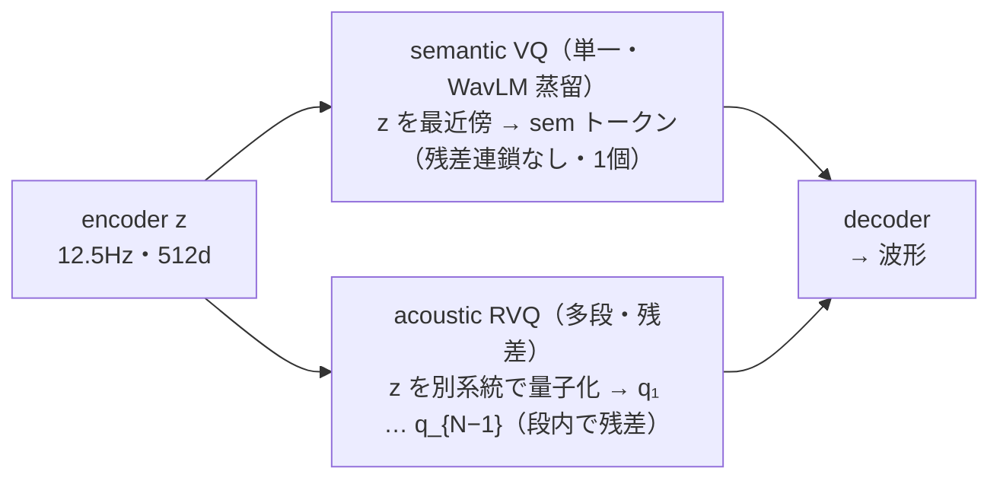

# ニューラル音声コーデック

:::abstract[学習目標]
この章を読み終えると、次のことができるようになります。

- **VQ**（ベクトル量子化）の最近傍ルックアップ・STE・commitment / codebook 損失・codebook collapse を説明できる
- **RVQ**（残差ベクトル量子化）が「1 フレーム = $N_q$ トークン」を生む仕組みを残差チェーンで追える
- **frame rate / token rate / bitrate** を式から計算し、言語モデルの系列長への影響を評価できる
- **semantic / acoustic** トークンの違いが「推論時の計算」ではなく「訓練時の損失」で生まれることを説明できる
:::

## 前提知識

- 章 01 の **sampling・quantization・PCM** ([デジタル音声の基礎](/audio/01-digital-audio-basics/))
- 章 02 の **log-mel スペクトログラム** ([周波数と特徴量](/audio/02-frequency-and-features/)) —— 再構成損失（マルチスケール mel 損失）で使います
- 深層学習の基礎（誤差逆伝播、勾配、損失関数）
- **autoencoder**（encoder で圧縮し decoder で復元する構造）の考え方

まだ自信がなくても、必要な概念はその都度補うので読み進めて構いません。

## 直感

波形を **離散トークン列** に変える学習器、それが neural audio codec です。これができた瞬間、TTS は「音声トークンの言語モデリング」に化け、**LLM の道具がそのまま使える** ようになります。

連続な特徴量（log-mel）を扱う章 02 の経路に対して、この章は **離散トークン** の経路を扱います。音声を「有限語彙のトークン列」に落とせれば、次トークン予測も cross-entropy 損失も Transformer デコーダもサンプリングも、テキスト LLM の道具立てがそのまま転用できます。VALL-E / Moshi / Kyutai DSM はこの発想で成立しています。

## 全体像

### なぜ離散化するのか

章 02 までで見た通り、音声をモデルに入れる形式は **連続特徴量（log-mel）** と **離散トークン（codec）** の 2 系統があります。この章は後者 —— **ニューラル音声コーデック** を扱います。

- **動機**：音声を「有限語彙のトークン列」にできれば、**次トークン予測**・**cross-entropy 損失**・**Transformer デコーダ**・**サンプリング** —— LLM の全道具がそのまま流用できます。VALL-E / Moshi / Kyutai DSM はこれで成立しています。
- **圧縮も兼ねる**：codec は元々「低ビットレートで高音質に音声を送る」通信用途の技術です。副産物として得られる離散トークンが、言語モデルの語彙になりました。
- **vocoder 不要の経路**：log-mel 経路は別途 vocoder で波形化が要ります（章 02）。codec はデコーダが波形まで戻すので、生成 → 波形が一気通貫です。

LLM の道具立てと音声コーデックの各部品は、次のように対応します。

:::note[LLM ↔ Speech]
| LLM | 音声コーデック |
| --- | --- |
| トークナイザ | encoder + 量子化器 |
| 語彙 (vocab) | コードブック (codebook) |
| トークン ID | 最近傍コードのインデックス |
| デトークナイズ | decoder（波形まで戻す） |
| 1 位置 = 1 トークン | 1 フレーム = **複数** トークン（RVQ・後述） |
:::

最後の行が音声特有の捻りです。テキストは 1 位置 1 トークンですが、音声は 1 フレームに複数トークンが積み重なります。これが後段の言語モデル設計を難しくします（後述の「Phase 03/04 への橋渡し」）。

### コーデックの往復

codec は **encoder → 量子化器（RVQ） → decoder** を end-to-end 学習したオートエンコーダです。波形を一旦低レート潜在へ畳み込みで圧縮し、量子化し、波形へ戻します。



往路（encoder → 量子化）が波形をトークンに変える「トークナイザ」、復路（decoder）がトークンを波形に戻す「デトークナイザ」です。以降の節で、量子化器の中身（VQ・RVQ）と損失、そして semantic / acoustic の分離を順に降りていきます。

## VQ：ベクトル量子化

離散化の核です。連続ベクトルを、学習した **コードブック**（有限個の代表ベクトル＝コードワード）の **最近傍** で置き換え、その **インデックス** を出します。

$$q(z)=\arg\min_{i}\ \lVert z - e_i\rVert \qquad (e_i = i\text{ 番目のコードワード})$$

ここで $z$ は encoder が出した連続な潜在ベクトル、$e_i$ はコードブックの $i$ 番目のコードワード、$q(z)$ が返すのは「$z$ に最も近いコードワードのインデックス $i$」です。出力されるトークン ID はこの $i$ です。

<figure>
  <canvas id="vq-snap" width="1600" height="900" aria-hidden="true"></canvas>
  <figcaption class="fig-cap"><span>連続な潜在ベクトル（点）が最寄りのコードワード（◆）へ丸められる</span><span>色＝割り当て先のコード＝トークンID</span></figcaption>
</figure>

### 学習の3つのハマりどころ

VQ を「学習できる層」にするには、順に 3 つの問題を潰す必要があります。素朴に実装すると **encoder が一切学習しない** か、**語彙が死ぬ** からです。

**① 勾配が通らない（→ Straight-Through Estimator）**

量子化 $z \to e_i$（$i$ = 最近傍）は **階段関数** です。出力はコードワード上でカクカク一定なので、微分はほぼ至る所 0、境界では未定義です。このまま誤差逆伝播すると **encoder に届く勾配が 0 になり、encoder が永遠に学習しません**。

解決が **STE**（Straight-Through Estimator）です。順伝播は量子化値 $e_i$ を使い、逆伝播では量子化を **恒等写像とみなして** 勾配を $e_i$ から $z$ へ素通しします（$\partial L/\partial z := \partial L/\partial e_i$）。実装は 1 行のトリックで書けます。

```python
z_q = z + (e_i - z).detach()
# 順伝播: z + (e_i - z) = e_i （量子化値）
# 逆伝播: (e_i - z) は勾配を持たない → 勾配は z にだけ流れる
```

「コードワードは $z$ の近くにあるはず」という前提で恒等近似する、**バイアスはあるが実用上動く** 近似です。崩壊しないよう ② が要ります。

**② コードブック自体をどう学習するか（commitment / codebook 損失）**

STE は勾配を encoder へ **素通し** するので、その経路ではコードワード $e_i$ に勾配が一切届きません。だから語彙（コードブック）を別の損失で明示的に動かします。

$$L_{\text{vq}}=\underbrace{\lVert \mathrm{sg}[z]-e\rVert^2}_{\text{codebook 損失}}+\beta\underbrace{\lVert z-\mathrm{sg}[e]\rVert^2}_{\text{commitment 損失}}$$

ここで $\mathrm{sg}[\cdot]$ は stop-gradient（その項を定数とみなして勾配を止める）を表します。

- **codebook 損失** $\lVert \mathrm{sg}[z] - e\rVert^2$：$z$ を止めて **コードワード $e$ をデータ（encoder 出力）の方へ引き寄せます**。＝語彙をデータ分布に適合させます（オンライン k-means 的）。
- **commitment 損失** $\beta\lVert z - \mathrm{sg}[e]\rVert^2$：$e$ を止めて **encoder 出力 $z$ を選んだコードの方へ引き寄せます**。これが無いと $z$ がコードブックから際限なく離れ、選ばれるコードが毎回変わって学習が振動します。$\beta$ は 0.25 程度が定番です。
- **EMA 更新**：codebook 損失の代わりに、各コードを「そのコードに割り当てられた $z$ たちの指数移動平均」で直接更新する流派（VQ-VAE-2 / SoundStream / EnCodec）。勾配より安定するので実務ではこちらが多いです。

**③ コードブック崩壊（codebook collapse）**

大きなコードブックを置くと、**ごく一部のコードしか使われず、残りが死ぬ** 現象が起きやすくなります。一度も選ばれないコードは勾配も EMA 更新も受けない → その場に固まる → ますます選ばれない、という **「金持ち優遇」の悪循環（dead codes）** です。結果、実効語彙が小さくなり音質が頭打ちになります。対策は次の通りです。

- **dead code の再初期化（random restart）**：一定期間使われないコードを、現在バッチの encoder 出力で置き換えます（SoundStream / DAC）。
- **コード因子化 + L2 正規化**：低次元へ射影し $z$・$e$ を L2 正規化してから距離を測ります（DAC）。距離が素直になり使用が分散します。
- **k-means 初期化 / 使用率トラッキング付き EMA**。
- **FSQ にして崩壊を構造的に回避**（後述の「系譜と最新動向」）：学習コードブックを捨て、各次元を固定段数に丸めるだけ → 死にコードが原理的に生じません。

②③ は表裏です。崩壊しやすい一枚岩の巨大コードブックを避けるために、RVQ は「小さなコードブックを多段（次節）」で積む、という設計選択にもつながっています。

:::note[LLM ↔ Speech]
VQ = 「埋め込み空間に固定の語彙ベクトルを置き、各点を最寄りの単語に丸める」操作です。$e_i$ が単語ベクトル、$i$ がトークン ID。①②③ は要するに「**微分できないトークナイザを、それでも勾配で学習させる**」ための工夫です。VQ-VAE がこの原型です。
:::

## RVQ：残差ベクトル量子化

1 個のコードブックでは粗すぎます（語彙を巨大にしないと高音質になりません）。そこで **量子化の誤差（＝残差）を、次のコードブックでさらに量子化** …を数段重ねます。これが **RVQ** です。

:::note[直感：丸めて、誤差を次で埋める]
「7.43 を、限られた数のセットだけで表す」のと同じです。

① ざっくり用 {0,5,10} → 最寄りは **5**。残差 = 7.43 − 5 = **2.43**
② こまかめ {0,1,2,3,4} → 最寄りは **2**。残差 = 2.43 − 2 = **0.43**
③ もっと細かく {0,0.1,…} → **0.4**。残差 = 0.03

足すと `5 + 2 + 0.4 = 7.4 ≈ 7.43`。段を進むほど精密になります。RVQ はこれをベクトルでやるだけ。この例の **段数は 3 = $N_q$**、各段で選んだ値が **そのフレームの 3 トークン** です。
:::

$$r_0=z,\qquad c_n=q_n(r_n),\qquad r_{n+1}=r_n-c_n$$

読み方：$r_0$ は encoder 出力そのもの。各段 $n$ で「今の残差 $r_n$ をコードブック $q_n$ で丸めて $c_n$ を得る」→「残差を $r_n - c_n$ に更新」。これを $N_q$ 回（$n = 0 \dots N_q-1$）繰り返します。

:::warning[$N_q$ とは]
$N_q$ = **段数** = **コードブックの数** = **残差を補正する回数** です。各段が ID を 1 つ出すので **1 フレーム = $N_q$ トークン**。$N_q$ を増やす → 残差が小さく高音質 → だがトークン数もビットレートも増えます（後述のトレードオフ）。各段のコードブック $q_0 \dots q_{N_q-1}$ は **別々に学習** されます（段ごとに「埋める誤差の大きさ」が違うため）。
:::

復元は単純に **足し戻すだけ** です：$\hat{z} = c_0 + c_1 + \dots + c_{N_q-1}$。途中の段までしか使わなければ「粗いが低ビットレート」になります（可変ビットレート＝段数を可変にできる）。



段を進むほど残差が小さくなり、近似が精密化します。各段 1 トークン → 1 フレームで $N_q$ 個のトークンになります。

### 1 フレーム = 複数トークン（重要）

時間軸 $T$ フレーム × 量子化段 $N_q$ 段 の **2 次元のトークン表** になります。下は Mimi 風（$N_q = 8$、先頭 = semantic）のイメージです（時刻 t0–t5 に縮小）。**各列が 1 フレーム**で、その列に縦 $N_q$ 個のトークンが積まれます。teal の行が semantic、その下が acoustic の残差段（q1 → q7 と進むほど細かい誤差を補正）。

<div class="tb-tgrid" style="grid-template-columns: 2.4rem repeat(6, minmax(2.2rem, 1fr));">
<span class="head"></span><span class="head">t0</span><span class="head">t1</span><span class="head">t2</span><span class="head">t3</span><span class="head">t4</span><span class="head">t5</span>
<span class="head">sem</span><span class="sem">6</span><span class="sem">13</span><span class="sem">20</span><span class="sem">27</span><span class="sem">34</span><span class="sem">41</span>
<span class="head">q1</span><span>19</span><span>26</span><span>33</span><span>40</span><span>47</span><span>54</span>
<span class="head">q2</span><span>32</span><span>39</span><span>46</span><span>53</span><span>60</span><span>67</span>
<span class="head">q3</span><span>45</span><span>52</span><span>59</span><span>66</span><span>73</span><span>80</span>
<span class="head">q4</span><span>58</span><span>65</span><span>72</span><span>79</span><span>86</span><span>93</span>
<span class="head">q5</span><span>71</span><span>78</span><span>85</span><span>92</span><span>99</span><span>7</span>
<span class="head">q6</span><span>84</span><span>91</span><span>98</span><span>6</span><span>13</span><span>20</span>
<span class="head">q7</span><span>97</span><span>5</span><span>12</span><span>19</span><span>26</span><span>33</span>
</div>

*各セルがトークン ID。縦 1 列が 1 フレーム = 同時刻に積まれる $N_q$ 個のトークン。*

テキストの「1 次元トークン列」と違い、各時刻に縦 $N_q$ 個積まれます。言語モデルに食わせるには、この 2 次元をどう 1 次元に並べるか（flatten / delay pattern）という設計が要ります（後述の「Phase 03/04 への橋渡し」）。

## コーデックの全体像：量子化付きオートエンコーダ

codec = **encoder → 量子化器（RVQ） → decoder** を end-to-end 学習したオートエンコーダです（全体像の Mermaid 図を再掲）。波形を一旦低レート潜在へ畳み込みで圧縮し、量子化し、波形へ戻します。



### 損失：再構成だけでは不十分

- **再構成損失**：波形 L1/L2 ＋ **マルチスケール mel 損失**（複数解像度のスペクトログラム差）。章 02 の知識がここで効きます。
- **敵対的損失 (GAN)**：マルチスケール / マルチ周期の判別器で「本物らしさ」を上げます。これが無いと籠った音になります（vocoder と同じ事情・章 02）。
- **VQ 損失**：commitment / codebook（前述の VQ の節）。

:::note[直感]
「波形を最小ビットで送って、聞いて違和感なく戻す」を学習で解いた結果、中間に都合よく **離散トークン列** が現れます。圧縮器とトークナイザは同じものの裏表です。
:::

## フレームレート・ビットレート・トークンレート

codec を評価・選定するときの 3 つの数です。言語モデルの **系列長** に直結するので最重要です。

$$\text{tokens/s}=f_{\text{frame}}\times N_q \qquad \text{bps}=f_{\text{frame}}\times N_q\times \log_2(\text{codebook size})$$

ここで $f_{\text{frame}}$ はフレームレート（1 秒あたりのフレーム数, Hz）、$N_q$ は RVQ の段数、codebook size は 1 段あたりのコードワード数です。$\log_2(\text{codebook size})$ は「1 トークンを表すのに必要なビット数」です。

例：フレームレート 12.5Hz・語彙 2048・段数 8 → $12.5 \times 8 \times \log_2(2048) = 12.5 \times 8 \times 11 \approx 1100$ bps $\approx 1.1$ kbps。トークンは $12.5 \times 8 = 100$ tokens/s です。

- **フレームレートを下げる**（50Hz → 12.5Hz）と、同じ秒数でも系列が短くなり **LM が長文脈を扱いやすく** なります。が、下げすぎると音質・話速の表現が苦しくなります。**低フレームレート化** が近年（2025–26）の主戦場です。
- **段数 $N_q$ を増やす** と音質↑ / ビットレート↑ / トークン数↑。LM 側の負担とのトレードオフです。

:::note[LLM ↔ Speech]
「フレームレート」は音声版のトークン密度です。テキストの「1 単語 = 1 トークン」に対し、音声は「1 秒 = 100 トークン」のように **桁違いに多い**。だから音声 LM は文脈長との戦いになり、低フレームレート codec が効きます。
:::

## semantic vs acoustic トークン

音声トークンには質の違う 2 種類がある、という見方が現代の鍵です。

- **semantic（意味）トークン**：何を喋っているか＝音素・言語内容に近い。自己教師あり表現（HuBERT / WavLM 等）から得られ、テキストに近い「中身」。
- **acoustic（音響）トークン**：声色・話者性・細かい音響ディテール＝「どう聞こえるか」。再構成の高音質に効く。

:::note[Mimi（Kyutai）の設計 — 2025–26 時点]
24kHz 入力 → **12.5Hz** 潜在へ、合計約 **1.1kbps**、完全 streaming（遅延 ≈ 80ms）。Moshi / Kyutai DSM の土台です。要は **split RVQ**：semantic を 1 本の RVQ の先頭段に置くと acoustic の音質が落ちたため、**semantic と acoustic を分離** しました。
:::

### semantic は「残差チェーンの外」にある独立ブランチ（split RVQ）

よくある誤解が「semantic = RVQ の 0 段目」です。実物の Mimi では、semantic は **残差の連鎖に入らない別の枝** です。encoder 出力 $z$ から、semantic 用の **単一 VQ** と acoustic 用の **RVQ** が **並列** に走り、decoder が両方を合わせて波形に戻します。



だから「sem は encoder 出力を最初に最近傍で丸めた 1 トークン、残差は無関係」で正しいのです。残差はあくまで **acoustic 側の段を駆動する** ためのものです。

### 「semantic」って何が意味なのか

ここでの semantic は NLP の「意味」ほど高尚ではなく、実際は **音素・内容に強く相関する表現** くらいの意味です。なぜそう呼べるかというと、**自己教師あり音声モデル（HuBERT / WavLM）** の表現を使うからです。これらは「マスクした区間を当てる」事前学習で、内部表現が **音韻内容と強く相関する** ことが知られています。だからそれに寄せたトークンを「semantic」と呼ぶ慣習です。

### semantic / acoustic の違いは「訓練の損失」で生まれる

もう一つの核心：**推論時の量子化はどちらも同じ最近傍ルックアップ**（VQ・RVQ の節）で、計算の仕組みに差はありません。違いは **訓練時にかける損失** だけです。

| ブランチ | 入力 | 量子化 | 訓練時の損失 | 育つ語彙 |
| --- | --- | --- | --- | --- |
| **sem**（semantic VQ） | encoder 出力 z | 単一 VQ・1 トークン（残差なし） | 再構成 **+ WavLM 蒸留** | **semantic**（内容） |
| `q₁ … q_{N−1}`（acoustic RVQ） | z（並列） | 多段 RVQ・段内で残差を最近傍 | 再構成のみ | **acoustic**（音響ディテール） |

$$L=\left(L_{\text{recon}}+L_{\text{GAN}}+L_{\text{VQ}}\right)+\lambda\, d_{\cos}\!\left(q_{\text{sem}},\,\mathrm{WavLM}(x)\right)$$

ここで $\lambda$ は蒸留損失の重み、$d_{\cos}$ は cosine 距離、$q_{\text{sem}}$ は semantic VQ の出力、$\mathrm{WavLM}(x)$ は入力 $x$ に対する WavLM 特徴です。蒸留項は **semantic VQ にだけ** 効きます。

- **sem（semantic）**：再構成損失に加え **蒸留損失**。事前学習済み **WavLM を教師** に、semantic VQ の出力を WavLM 特徴へ cosine 距離などで近づける → その codebook が「内容を表す語彙」に育ちます。
- **q₁ … （acoustic）**：蒸留なし。再構成損失だけで、声色などの音響ディテールを表す語彙に育ちます。

つまり「sem が semantic になる」のは計算式のせいではなく、**そのブランチにだけ WavLM 蒸留をかけて訓練した結果** です。学習が終われば推論時は全部ただの最近傍で、codebook が内容寄り／音響寄りに組織化されているだけです。

この semantic / acoustic 分離が、後段の TTS・対話モデルで「内容は LM で、音色はデコーダで」という役割分担を可能にします。DualCodec など「semantic を明示強化した低フレームレート codec」も 2025 に多数あります（下記）。実装前に原典（Moshi 論文）で配線の細部を確認すること。

## 系譜と最新動向

| codec | 所属/年 | 特徴 |
| --- | --- | --- |
| **SoundStream** | Google '21 | RVQ ニューラル codec の原型。streaming・可変ビットレート |
| **EnCodec** | Meta '22 | RVQ・24/48kHz。VALL-E が採用し音声 LM 時代を開く |
| **DAC** | Descript '24 | 高音質。factorized + L2 正規化コードで崩壊対策。≥50Hz・≥4kbps 寄り |
| **Mimi** | Kyutai '24 | 12.5Hz・1.1kbps・semantic 蒸留・streaming。Moshi/DSM の核 |

### 2025–26 の流れ（実装前に必ず最新を再確認）

- **低フレームレート化**：DualCodec / FlexiCodec など ≤12.5Hz、さらに ≤10Hz（TaDiCodec, TASTE）。LM の文脈長を稼ぐためです。
- **single codebook 化**：WavTokenizer / BigCodec / TS3-Codec / Single-Codec。RVQ の「1 フレーム複数トークン」問題を避け、LM 連携を単純化（1 フレーム 1 トークン）します。低ビットレートだが高フレームレート寄りなものも多いです。
- **FSQ（Finite Scalar Quantization）**：コードブックを学習せず各次元を固定段数に丸めます。**codebook 崩壊が起きにくく** 実装も単純。VQ の代替として採用が増加しています。
- **semantic 強化**：SACodec ほか、意味情報を明示的に持たせて TTS / 対話に効かせる方向。

:::warning[注意]
この領域は数か月で塗り替わります。上の固有名は 2025–26 時点の地図にすぎません。各稿の実装前に Context7 / WebSearch で最新版・SOTA を引き直すこと（CLAUDE.md の方針）。
:::

## ストリーミング：causal 畳み込み

本プロジェクトの主題は streaming です。codec も **未来を見ずに** 逐次処理できる必要があります。

- **causal convolution**：畳み込みを過去側だけにパディングし、出力 $t$ が入力 $\le t$ のみに依存するようにします（未来を覗かない）。これで encoder / decoder が左から順に動きます。
- **フレーム遅延 = 実効レイテンシ**：Mimi は 12.5Hz＝1 フレーム 80ms なので、最小遅延も ≈80ms。フレームレートと遅延は表裏です。
- 非 streaming codec（双方向 attention 等）は高音質だがオンライン生成に使えません。streaming TTS / ASR では causal 設計が前提です。

:::note[LLM ↔ Speech]
causal conv は、LLM の **causal mask**（未来トークンを見ない）と同じ役割を畳み込みでやっているものです。「逐次生成できる＝因果性を守る」は両者共通の制約です。
:::

## Phase 03/04 への橋渡し

離散トークンが手に入ると、TTS が言語モデリングに化けます。次稿以降の伏線です。

- **VALL-E 系（03）**：テキスト条件付きで codec トークンを **自己回帰生成** → decoder で波形。「TTS = 音声トークンの LM」。
- **1 フレーム $N_q$ トークンをどう並べるか**：素朴に flatten すると系列が $N_q$ 倍に伸びます。**delay pattern**（段ごとに時間をずらして並べ、各ステップで全段を並列予測）が定石です。MusicGen / Moshi の RQ-Transformer など。
- **Moshi / Kyutai DSM（06）**：Mimi のトークン列を、テキストと同じ土俵で **streaming** に扱う全二重対話モデル。本プロジェクトの最終目標（目標③）です。
- **flow-matching（05）** は別路線：離散トークンではなく連続（mel / 潜在）を生成します。離散 LM 路線と連続 flow 路線の **2 系統** を、04–05 で対比します。

:::note[Phase 02 のゴール]
「波形 ⇄ codec トークン ⇄ 波形」を学習済みモデル（EnCodec / Mimi 等）で encode → decode し、**トークン列・段数・フレームレート・semantic/acoustic** を自分の目で確認できること。これで連続（章 02）/ 離散（この章）の 2 系統が腹落ちします。
:::

## 演習

::::question[演習 1: トークンレートとビットレートの計算]
あるコーデックがフレームレート 50Hz・語彙サイズ 1024・段数 $N_q = 4$ だとします。(a) トークンレート（tokens/s）と (b) ビットレート（bps）を求めてください。さらに (c) このコーデックと「12.5Hz・語彙 2048・段数 8」のコーデックを言語モデルの系列長の観点で比べてください。

:::details[解答]
式 $\text{tokens/s}=f_{\text{frame}}\times N_q$、$\text{bps}=f_{\text{frame}}\times N_q\times \log_2(\text{codebook size})$ を使います。

(a) $50 \times 4 = 200$ tokens/s。

(b) $\log_2(1024) = 10$ なので、$50 \times 4 \times 10 = 2000$ bps $= 2.0$ kbps。

(c) 12.5Hz・2048・8 のコーデックは $12.5 \times 8 = 100$ tokens/s。本問のコーデックは 200 tokens/s なので **2 倍長い系列** を生みます。フレームレートが高いほど、同じ秒数の音声でも LM が扱うトークン数が増え、長文脈の処理が苦しくなります。低フレームレート化が効くのはこのためです。
:::
::::

::::question[演習 2: semantic と acoustic の違いはどこから来るか]
Mimi の split RVQ で、semantic トークンと acoustic トークンは「推論時の計算の仕組み」が違うから区別される —— これは正しいですか。正しくないなら、何が両者を分けているのかを説明してください。

:::details[解答]
正しくありません。**推論時の量子化はどちらも同じ最近傍ルックアップ** で、計算の仕組みに差はありません。両者を分けるのは **訓練時にかける損失** です。semantic VQ には再構成損失に加えて **WavLM を教師とする蒸留損失**($\lambda\, d_{\cos}(q_{\text{sem}}, \mathrm{WavLM}(x))$) がかかるため、その codebook が「内容（音素）を表す語彙」に育ちます。acoustic RVQ は蒸留なし・再構成損失だけなので、声色などの音響ディテールを表す語彙に育ちます。学習後はどちらも単なる最近傍で、codebook が内容寄り／音響寄りに組織化されているだけです。なお semantic は残差チェーンの 0 段目ではなく、$z$ から並列に分岐した独立ブランチである点にも注意してください。
:::
::::

## まとめ

:::success[この章の要点]
- **VQ** は連続ベクトルを最近傍コードの ID に丸める量子化。微分できないので **STE** で勾配を素通しし、**commitment / codebook 損失**（または EMA）でコードブックを学習し、**codebook collapse** を再初期化などで防ぐ。
- **RVQ** は残差を多段コードブックで量子化する。**1 フレーム = $N_q$ トークン** という音声特有の 2 次元トークン表が生まれる。復元は各段の足し戻し。
- codec = **encoder → RVQ → decoder** のオートエンコーダ。損失は再構成（L1/L2 + マルチスケール mel）+ GAN + VQ。
- **token rate $= f_{\text{frame}} \times N_q$**、**bps $= f_{\text{frame}} \times N_q \times \log_2(\text{codebook size})$**。フレームレートが LM の系列長を左右する。
- **semantic / acoustic** の違いは推論時の計算ではなく **訓練時の損失（WavLM 蒸留の有無）** で生まれる。Mimi は split RVQ で両者を並列分岐させる。
:::

### 次に学ぶこと

離散トークンが手に入ると、TTS が「音声トークンの言語モデリング」（VALL-E 系）に化けます —— これは目標①以降の **TTS 章（予定）** で扱い、1 フレーム $N_q$ トークンをどう 1 次元に並べるか（delay pattern）が中心になります。ロードマップ上は次章でいったん **音声認識 (ASR)** に進み、可変長の音声フレームを可変長テキストへ写す 3 つの流儀（CTC・RNN-T・attention）と streaming を学びます。

→ [音声認識 (ASR) とストリーミング](/audio/04-asr/)

## 用語ミニ辞典

| 用語 | 一言 |
| --- | --- |
| codebook | 有限個の代表ベクトル（コードワード）＝音声版の語彙 |
| VQ | 連続ベクトルを最近傍コードの ID に丸める量子化 |
| STE | Straight-Through Estimator。量子化の勾配を素通しする近似 |
| commitment loss | 潜在をコードに引き寄せる損失。codebook 学習を安定化 |
| codebook collapse | 一部コードしか使われず語彙が死ぬ問題 |
| RVQ | 残差を多段コードブックで量子化。1 フレーム $N_q$ トークン |
| FSQ | 学習なしの固定スカラ量子化。崩壊しにくい VQ 代替 |
| frame rate | 1 秒あたりフレーム数（例 12.5Hz）。LM 系列長を左右 |
| bitrate | frame rate × $N_q$ × $\log_2$(codebook size) |
| semantic token | 内容・音素寄り（HuBERT/WavLM 由来） |
| acoustic token | 声色・音響ディテール寄り（再構成品質） |
| delay pattern | 段ごとに時間をずらして $N_q$ トークンを LM に並べる定石 |
| causal conv | 未来を見ない畳み込み。streaming の前提 |

## 次のアクション

理論先行なら次稿 **03 ASR**（CTC/RNN-T/Conformer とストリーミング）へ。実装で固めるなら、学習済み **EnCodec / Mimi** で encode→decode してトークンを覗く小実験（GPU はあれば速いが CPU でも可）。

1. **写経**：学習済み **EnCodec / Mimi** をロードし、短い音声を encode → トークン列（$T \times N_q$ の ID）を取り出す。
2. **動かす**：そのトークンを decode して波形に戻し、元波形と聞き比べる。段数 $N_q$ を途中で打ち切ると音質がどう落ちるか（可変ビットレート）を確かめる。
3. **小実験**：トークン列の形（$T$ と $N_q$）、フレームレート、semantic / acoustic の段の対応を自分の目で確認する。これで連続（章 02）/ 離散（この章）の 2 系統が腹落ちする。

## 参考文献

1. N. Zeghidour, A. Luebs, A. Omran, J. Skoglund, M. Tagliasacchi, "SoundStream: An End-to-End Neural Audio Codec," *IEEE/ACM Transactions on Audio, Speech, and Language Processing*, 2021. arXiv:2107.03312.
2. A. Défossez, J. Copet, G. Synnaeve, Y. Adi, "High Fidelity Neural Audio Compression (EnCodec)," 2022. arXiv:2210.13438.
3. R. Kumar, P. Seetharaman, A. Luebs, I. Kumar, K. Kumar, "High-Fidelity Audio Compression with Improved RVQGAN (DAC)," *NeurIPS*, 2023. arXiv:2306.06546.
4. A. Défossez, L. Mazaré, M. Orsini, A. Royer, P. Pérez, H. Jégou, E. Grave, N. Zeghidour, "Moshi: a speech-text foundation model for real-time dialogue (Mimi codec)," Kyutai, 2024. arXiv:2410.00037.
5. A. van den Oord, O. Vinyals, K. Kavukcuoglu, "Neural Discrete Representation Learning (VQ-VAE)," *NeurIPS*, 2017. arXiv:1711.00937.
6. F. Mentzer, D. Minnen, E. Agustsson, M. Tschannen, "Finite Scalar Quantization: VQ-VAE Made Simple (FSQ)," *ICLR*, 2024. arXiv:2309.15505.
