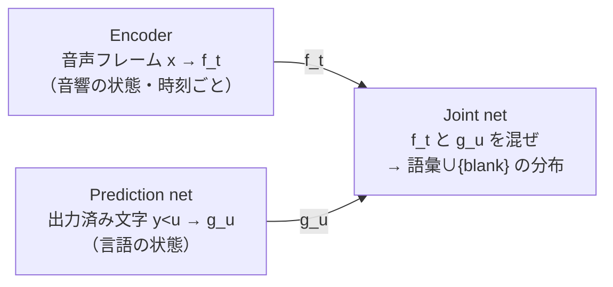
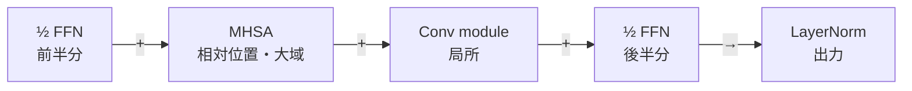

# 音声認識 (ASR) とストリーミング

:::abstract[学習目標]
この章を読み終えると、次のことができるようになります。

- ASR の核心である **アライメント問題**（音声フレームと文字の未知の対応）を説明できる
- **CTC** / **RNN-T (transducer)** / **attention (AED)** の3系統を、構成・同期方式・内部 LM・streaming 適性で **比較** できる
- **Conformer** がなぜ conv と self-attention の両方を持つかを述べ、streaming 化に必要な改造を **列挙** できる
- ストリーミングにおける **遅延↔精度** のトレードオフを、アルゴリズム遅延と emission delay の2層に分けて **説明** できる
- **WER / CER / RTF** と streaming 特有の遅延指標を **使い分け** られる
:::

## 前提知識

- 章01 [デジタル音声の基礎](/audio/01-digital-audio-basics/)：1秒 = 100 フレーム（10 ms フレーム）という時間分解能
- 章02 [周波数と特徴量](/audio/02-frequency-and-features/)：**log-mel** スペクトログラム（ASR エンコーダの標準入力）と causal mask の発想
- seq2seq / attention の基礎：encoder-decoder、cross-attention、自己回帰デコード、KV cache

LLM 出身の読者なら、翻訳（seq2seq）の経験がほぼそのまま橋渡しになります。差分だけを丁寧に積み上げます。

## 直感

私たちが解きたいのは、**可変長の音声フレーム列を、可変長のテキストへ** 変換することです。ところがここに翻訳とは違う難所があります。それが **アライメント問題** —— どのフレームがどの文字に対応するのか分からないまま学習しなければならない、という問題です。

この1つの難所を「どう解くか」で、ASR の主要手法が3つに分かれます。そして同じ選択が、そのまま **streaming（逐次処理）への向き不向き** を決めます。本章のゴールは、この3つの流儀と、低遅延ストリーミング ASR の作り方を一望することです。これは音声ロードマップの **目標①（streaming ASR）** の骨格にあたります。

## 全体像

ASR は **音声フレーム列 → テキスト列** の seq2seq です。だが翻訳と違う難所があります。

- **長さが大きく違う**：1秒 = 100 フレーム（章01）に対し、テキストは数文字。入力が圧倒的に長い・疎。
- **アライメントが未知**：「どのフレームが "C" でどこから "A" か」の対応（境界）は学習データに付いていない。**音声と文字の対応を、教師なしで内部的に解く**必要がある。
- **単調 (monotonic)**：翻訳は語順が入れ替わるが、音声→文字は**時間順が保たれる**（後ろの文字が前のフレームに対応しない）。この制約が ASR 特有の手法を生む。

:::note[LLM ↔ Speech]
翻訳 (seq2seq) の経験はほぼ流用できます —— が、翻訳は **soft で非単調**なアライメントを attention に任せます。ASR は **単調**かつ **入力が桁違いに長い**。この2点が、CTC / transducer という「アライメントを明示的に畳む」手法を生みました。
:::

解き方は大きく3系統です。**CTC**・**RNN-T (transducer)**・**attention (seq2seq)**。違いは「アライメントをどう扱うか」と「出力同士の依存をモデル化するか」にあります。以降の節で1つずつ降りていきます。

## CTC：blank で畳むアライメント

**CTC (Connectionist Temporal Classification)** は **encoder のみ** です。各フレームで「文字 or **blank（空白）** `␣`」を独立に予測し、ルールで畳んでテキストにします。

### 畳み込みルール B：重複を1つに → blank を除去

各フレームの予測列を、次の2段階で畳みます。

`␣ C C ␣ A A A ␣ T ␣`

↓ 連続重複を1つに、blank を消す

→ **C A T**

blank は「ここは文字を出さない/直前の文字を引き伸ばす」役です。同じ文字を2回出したいとき（例 "LL"）は間に blank を挟みます（`L␣L`）。1つのテキストに対応する**フレーム列（アライメント）は無数**にあります。

CTC は、その無数のアライメントを**すべて足し合わせて**（周辺化して）テキストの確率にします。ここで $B^{-1}(y)$ は「畳むと $y$ になる全経路」の集合です。

$$P(y\mid x)=\sum_{a\in B^{-1}(y)}\ \prod_{t=1}^{T} p_t(a_t\mid x)$$

- この巨大な和は **forward-backward 動的計画法**で効率的に計算します（HMM と同じ発想）。これが CTC 損失です。
- **条件付き独立の仮定**：各フレームの予測が互いに独立（$\prod p_t$）。＝**出力同士の依存（言語モデル）を内部に持たない**。"the" の後に "cat" が来やすい、を学べません。
- だから精度を上げるには**外部 LM** との合成（beam search + n-gram/Neural LM）が要ります。
- **frame-synchronous**：1フレーム1予測。**streaming と相性が良い**（encoder が causal なら即出せる）が、独立仮定ぶん単体精度は RNN-T に劣りがちです。

:::note[LLM ↔ Speech]
CTC = 「encoder の各位置で語彙+blank を分類するだけ」。デコーダ（=内部 LM）が無いので軽くて速い。LLM でいう「言語モデル無しのトークン分類器」。blank は長さ調整用の特殊トークンです。
:::

### forward-backward を 1 ステップ歩く（例：CAT）

「効率的に計算」の中身を具体的に開きます。$B^{-1}(y)$ の経路数は $T$ について**指数的に増える**（後述）のに、なぜ多項式時間で和が取れるのか。鍵は **前向き変数 $\alpha_t(s)$ という部分和を、隣のセルから使い回す**ことです。

まずターゲット `CAT` を、CTC の作法で **文字の間と両端に blank `_` を挿入**した拡張ラベル列にします。

$$
\ell = [\,\_,\ \mathrm{C},\ \_,\ \mathrm{A},\ \_,\ \mathrm{T},\ \_\,]
\qquad(s = 0,1,2,3,4,5,6,\ \text{長さ } 2|y|+1 = 7)
$$

ここで $s$ は**拡張ラベル上の位置**（縦軸）、$t$ は**入力フレーム**（横軸・$t=0\dots T-1$）です。各セル $(t,s)$ を「フレーム $t$ までで、拡張ラベルの位置 $s$ まで消化した全経路の確率の和」= $\alpha_t(s)$ とします。下は $T=6$ フレームの trellis で、**緑のセルが 1 本のアライメント** `_ C _ A _ T`（= 畳むと `CAT`）の通り道です。RNN-T の格子（横 = 時間 $t$・縦 = 出力）と同じ読み方で、CTC では縦が「blank を挟んだ拡張ラベル位置 $s$」になります。

t0t1t2t3t4t5
_ (s0)______
C (s1)CCCCCC
_ (s2)______
A (s3)AAAAAA
_ (s4)______
T (s5)TTTTTT
_ (s6)______

*横 = フレーム $t$ / 縦 = 拡張ラベル位置 $s$（blank `_` を文字間と両端に挿入）。ティールのセルが 1 本のアライメント `_C_A_T`（畳むと `CAT`）。各セルの値が前向き変数 $\alpha_t(s)$。終点は最後の文字 `T (s5)` か末尾 blank `_ (s6)` のどちらか。*

緑の経路を歩くと、$t$ が 1 進むごとに「同じ位置に留まる（横移動 = blank か同じ文字の引き伸ばし）」か「次の位置へ下りる（縦移動 = 次のラベルを出す）」を選びます。`_(s0) → C(s1) → _(s2) → A(s3) → _(s4) → T(s5)` と各フレームでちょうど 1 つ下りた例です。

#### 前向き漸化式：部分和を隣から使い回す

セル $(t,s)$ へ来る直前にいられた位置は**たかだか 3 つ**です——同じ位置 $s$（留まる）、1 つ上 $s-1$（前のラベルから下りる）、2 つ上 $s-2$（前の文字から blank を飛ばして下りる）。そこで前向き変数は次の漸化式で**隣のセルの部分和を足すだけ**で求まります。

$$
\alpha_t(s) = \bigl(\alpha_{t-1}(s) + \alpha_{t-1}(s-1) + [\,\alpha_{t-1}(s-2)\,]\bigr)\, y_t(\ell_s)
$$

記号の意味を全部定義します。

- $\alpha_t(s)$ = フレーム $t$ までで拡張ラベル位置 $s$ に到達する**全経路の確率の和**（部分和）。これが「使い回す値」。
- $y_t(\ell_s)$ = フレーム $t$ で、位置 $s$ のラベル $\ell_s$（文字 or blank）を出す確率。encoder の softmax 出力の 1 成分です。**$t$ ごとに変わる観測**（trellis の縦 1 列ぶんの分布）。
- $\alpha_{t-1}(s)$ = 同じ位置に**留まった**（横移動）経路ぶん。
- $\alpha_{t-1}(s-1)$ = 1 つ上から**下りてきた**経路ぶん。
- $[\,\alpha_{t-1}(s-2)\,]$ = **角括弧は条件付き**。**$\ell_s$ が文字 かつ $\ell_{s-2}\neq\ell_s$ のときだけ**足します（2 つ上の文字から blank を 1 個スキップして下りる）。$\ell_s$ が blank のとき、または直前と同じ文字が連続する（`LL` のような）ときは、**blank を飛ばすと畳んだとき文字が消えてしまう**ので、この項は**禁止**です。

読み方：右辺の括弧が「この位置 $s$ に来られた経路の部分和（最大 3 通りの入口を合算）」、それに「今フレームでこのラベルを出す確率 $y_t(\ell_s)$」を掛ける。**$2^T$ 通りに展開せず、隣のセルの和を 1 回足すだけ**で、その位置に至る全経路ぶんが入っているのがポイントです。

最後に、テキスト `CAT` の総確率は終点 2 セルの和です。

$$
P(y\mid x) = \alpha_{T-1}\!\bigl(|\ell|-1\bigr) + \alpha_{T-1}\!\bigl(|\ell|-2\bigr)
$$

（末尾 blank `_ (s6)` で終わる経路と、最後の文字 `T (s5)` で終わる経路の両方を足す）。

:::note[なぜ「効率的」と言えるのか——$2^T$ を部分和で畳む]
$T$ フレーム各々で「進む / 留まる」を選ぶと、アライメント経路は素朴には $O(2^T)$ オーダーで爆発します（$T=6$ でも数十通り、実際の $T=$ 数百では天文学的）。それを 1 本ずつ確率計算して足したら永遠に終わりません。

forward-backward DP は、**同じ位置 $(t,s)$ を通る経路たちの確率を $\alpha_t(s)$ という 1 個の部分和にまとめ、次のフレームではそれを隣のセルへ使い回す**ことで、和を**指数 → $O(T\cdot|\ell|)$ の多項式**に畳みます。LLM の自己回帰でいう「過去の計算を KV cache で使い回す」のと同じ精神——**部分結果の再利用**です。HMM の forward algorithm（章のアナロジー元）とも同型で、blank の遷移規則ぶんだけ遷移が CTC 用に制限されています。
:::

## RNN-T / Transducer：出力依存を入れた streaming の本命

**RNN-T (RNN Transducer)** は CTC の弱点（出力が互いに独立）を埋めます。CTC が encoder だけだったのに対し、**「音響」担当と「言語」担当を別ネットワークで持ち、毎ステップ合流させる**のが要点です。部品は3つあります。

### ① Encoder（transcription net）→ $f_t$：音響の状態

$f_t$ は encoder の出力ベクトルです。入力の音声フレーム（log-mel など、章01）を受け、**時刻 $t$ 付近で何が鳴っているか**を表す高次表現にします。中身は Conformer（後述）などが定番です。

- **音声だけに依存**：$f_t = \mathrm{Encoder}(x_1 \dots x_t)$（streaming なら $\le t$ のみ、+わずかな look-ahead）。文字情報は一切入りません。
- **時刻 $t$ でインデックス**。音声が $T$ フレームなら $f_1 \dots f_T$ の **$T$ 個**。
- BERT の各位置の隠れ状態の音声版、と思えばよいです。「そのフレームの音響的な意味」。

### ② Prediction network（predictor）→ $g_u$：言語の状態

$g_u$ は prediction network の出力ベクトルです。**これまでに出力した文字列だけ**を入力に、**次に何の文字が来そうか**の言語的な状態を作ります。元論文は LSTM、今は小さな Transformer や stateless 版もあります。

- **文字（ラベル）だけに依存・音声は見ない**：$g_u = \mathrm{Pred}(y_0 \dots y_{u-1})$（$y_0$=&lt;sos&gt;）。＝**テキストに対する自己回帰 LM** そのもの。
- **出力位置 $u$ でインデックス**（時刻 $t$ とは別軸）。これまで $u$ 個の文字を出していれば $g_u$ はその $u$ 個から計算されます。
- 新しい文字を出すたびに predictor に食わせて状態を更新します（LLM の自己回帰デコードと全く同じ・KV cache が効く）。

:::warning[$f_t$ と $g_u$ の違い（ここが肝）]
|  | $f_t$（encoder） | $g_u$（prediction） |
| --- | --- | --- |
| 何から作る | **音声** $x_{\le t}$ | **出力済み文字** $y_{<u}$ |
| 見るもの | 音響（言語は見ない） | 言語（音声は見ない） |
| 軸 | 時刻 $t$（$T$ 個） | 出力位置 $u$（$U+1$ 個） |
| 役割 | 「今の音」 | 「次に来そうな文字」 |

音響と言語を**別々に**持つのが RNN-T の設計です。両者が出会う唯一の場所が ③ joint net です。
:::

### ③ Joint network：音響 × 言語 を毎セルで混ぜる

各セル $(t, u)$ で $f_t$ と $g_u$ を足し合わせ（小さな全結合+tanh）、**語彙 $\cup$ {blank} の分布**にします。

$$z_{t,u}=W_o\,\tanh\!\left(W_f f_t + W_g g_u + b\right),\qquad P(k\mid t,u)=\mathrm{softmax}(z_{t,u})$$

$g_u$ が「これまで出した文字列」を条件に入れる ＝ CTC に無かった**出力同士の依存（内部 LM）**です。これが精度向上の源で、RNN-T が**本番 streaming ASR の支配的アーキ**になった理由です。注意：joint は attention ではなく単なる加算なので軽く、streaming できます（decoder が全入力に attention する後述の AED との決定的差）。

### 格子をどう歩くか（例：CAT）

$(t, u)$ = 「$t$ フレーム消費し、$u$ 文字出した」状態です。joint の出力で次の一手が決まります。

- **blank を出す** → $(t, u) \to (t+1, u)$：時刻を進める（文字は出さない）。$g_u$ は据え置き。
- **文字 $k$ を出す** → $(t, u) \to (t, u+1)$：文字を出力し、時刻は据え置き。出した $k$ を predictor に入れて $g_{u+1}$ に更新。

<figure>
  <canvas id="rnnt-lattice" width="1500" height="800" aria-hidden="true"></canvas>
  <figcaption class="fig-cap">横=時間フレーム t / 縦=出力トークン u。緑の経路が1つのアライメント→=blank(時間を進める) / ↑=文字を出力</figcaption>
</figure>

上図の経路を歩くと、次のようになります。

1. $(0,0)$: joint$(f_0, g_0$=&lt;sos&gt;$)$ → **blank** → $(1,0)$ → また blank → $(2,0)$
2. $(2,0)$: joint$(f_2, g_0)$ → **"C"** → $(2,1)$。predictor に C を入れ $g_1$ 更新
3. $(2,1)$: joint$(f_2, g_1$="C"$)$ → blank → $(3,1)$ → blank → $(4,1)$
4. $(4,1)$: joint$(f_4, g_1)$ → **"A"** → $(4,2)$。$g_2$ 更新 … 同様に **"T"** まで
5. 残りを blank で消化し $t=T$ に到達 → 出力 **"CAT"**

- 1フレームで**複数文字も出せる**（縦移動の連続）。CTC の「1フレーム1ラベル」より柔軟です。
- 学習はこの格子上の**全経路を forward-backward で周辺化**します（CTC の2次元版）。これが RNN-T 損失です。
- **frame-synchronous で自然に streaming**：時刻 $t$ の計算は $f_t$（現フレームまで）と $g_u$（出力済み文字）だけに依存し、未来を見ません。だから低遅延です。

:::note[LLM ↔ Speech]
prediction net = **文字列の自己回帰 LM**（KV cache も同じ役割）、encoder = 音響特徴抽出、joint = 両者を毎セルで混ぜる薄い層。RNN-T = 「**音響を条件にした streaming な言語モデル**」。TDT など改良版もあります（後述「最新動向」）。
:::

## Attention seq2seq：精度の王・streaming の難物

**AED (Attention Encoder-Decoder)** / LAS / **Whisper**。翻訳と同じ encoder-decoder で、**cross-attention がアライメントを暗黙に学ぶ**のが特徴です。

$$P(y\mid x)=\prod_{u=1}^{U} p\!\left(y_u\mid y_{<u},\,c_u\right),\qquad c_u=\sum_t \alpha_{u,t}\,h_t$$

ここで $\alpha_{u,t}$ は出力文字 $u$ が入力フレーム $t$ をどれだけ見るかの cross-attention 重み、$c_u$ はその重み付き和（context vector）、$h_t$ は encoder の出力です。文字を1つ出すたびに、**入力全体**を参照して context $c_u$ を作ります。

<figure>
  <canvas id="attn-heat" width="1400" height="700" aria-hidden="true"></canvas>
  <figcaption class="fig-cap">cross-attention 重み（ASR では概ね対角＝単調）横=入力フレーム t / 縦=出力文字 u</figcaption>
</figure>

- **出力依存もアライメントも decoder が丸ごと学ぶ** → オフラインで最高精度（Whisper が代表）。外部 LM 無しでも強い。
- **label-synchronous**：文字を出すたびに**入力全体**へ attention。→ 原則**全フレームが揃ってから**動く＝**streaming が苦手**。
- attention は系列長に対し**二乗**コスト。長音声・オンデバイスに不利。
- streaming 化には **monotonic attention / MoChA / chunk-wise attention** 等で「未来を見ない/塊ごとに見る」制約を入れます（後述「ストリーミング化」）。

:::note[LLM ↔ Speech]
これは**翻訳の encoder-decoder そのもの**です。decoder = 条件付き LM、cross-attention = 入力参照。LLM の知識が最も素直に効くが、「全入力を見る」前提が streaming と衝突する、というのが ASR 特有の悩みです。
:::

## 3系統の比較

|  | CTC | RNN-T | Attention (AED) |
| --- | --- | --- | --- |
| 構成 | encoder のみ | encoder + pred + joint | encoder-decoder |
| 同期 | frame 同期 | frame 同期 | label 同期 |
| 出力依存（内部 LM） | **なし**（条件付き独立） | **あり**（pred net） | **あり**（decoder） |
| streaming 適性 | ◎ 容易 | **◎ 本命** | △ 工夫が要る |
| 外部 LM | ほぼ必須 | 任意（あれば向上） | 任意 |
| オフライン精度 | ○ | ◎ | **◎ 最高** |
| 代表 | Wav2Vec2-CTC | Parakeet, Conformer-T | Whisper, Canary |

:::note[使い分け]
低遅延 streaming → **RNN-T**（or CTC）。最高精度のオフライン書き起こし → **attention (Whisper)**。実務では **CTC/RNN-T を1パス目、attention で2パス目に再採点**するハイブリッド (two-pass) も定番です。本プロジェクトの主題は streaming なので主役は RNN-T です。
:::

## Conformer：支配的なエンコーダ

3系統すべてに encoder が要ります。標準は **Conformer**（conv + self-attention）。なぜ両方が要るのか、ブロックの中身、ダウンサンプル、streaming 化の改造まで掘ります。

### なぜ conv と attention の両方か

- **self-attention は大域が得意・局所が苦手**：任意の2フレームを直接結べる（文全体の文脈）が、「隣接フレームの滑らかな連続性」を全位置との内積で表すのは非効率。
- **畳み込みは局所が得意・大域が苦手**：固定カーネルで隣接を効率よく拾うが、受容野がカーネル幅に縛られ文全体の文脈に届かない。
- 音声は**局所（フォルマント遷移・調音の連続性）と大域（文脈・話者の一貫性）の両方**が効きます。だから2つを1ブロックに同居させた Conformer が、純 Transformer encoder より一貫して低 WER です。

### Conformer ブロックの中身（macaron 構造）

1ブロック = 4サブモジュールの「サンドイッチ」です。各サブモジュールは残差接続で繋ぎます。

- **½-step FFN を前後に2つ（macaron）**：attention を 2 つの FFN で挟む構造。Transformer の FFN 1 個より表現力が上がる経験則（中身は下の「½ FFN とは何か」で詳説）。
- **MHSA + 相対位置エンコーディング**：絶対位置でなく**位置の差**で効かせる（Transformer-XL 流）。音声は長さがバラバラなので相対位置の方が汎化する —— **LLM の RoPE と同じ動機**。
- **Conv module の内部パイプライン**：`pointwise → GLU → depthwise conv → BatchNorm → Swish → pointwise`。**depthwise conv** はチャネル独立で軽く、隣接フレームの局所時間パターンを拾う担当。

### ½ FFN とは何か（half-step FFN）

まず **FFN（feed-forward network・位置ごとの全結合）** が何かをはっきりさせます。Transformer や Conformer の各ブロックには、attention とは別に、**各フレームを独立に通す 2 層の MLP** が入っています。

$$\mathrm{FFN}(x) = W_2\,\sigma(W_1 x + b_1) + b_2$$

- 次元を $d \to d_{ff}$（例 $d_{ff}=4d$）に広げ、活性化（Conformer は **Swish**）を通し、$d_{ff} \to d$ に戻す。
- **位置ごと（frame-wise）に独立**に適用する。attention が「フレーム**間**（位置方向）を混ぜる」のに対し、FFN は「各フレーム**内**のチャネル（特徴）を混ぜる」担当。役割が直交している。これは **LLM の Transformer ブロックの FFN とまったく同じもの**。

次が躓きどころの「**½（half-step）**」。素の Transformer ブロックは FFN が **1 個**で、残差に**等倍**で足します。

$$x \leftarrow x + \mathrm{FFN}(x)$$

Conformer は FFN を **2 個**（attention の**前**と**後**）に置き、それぞれの出力を **½ 倍**してから足します。

$$x \leftarrow x + \tfrac{1}{2}\,\mathrm{FFN}_{\text{pre}}(x)\quad(\text{前})\,,\qquad\qquad x \leftarrow x + \tfrac{1}{2}\,\mathrm{FFN}_{\text{post}}(x)\quad(\text{後})$$

:::warning[「半分」の意味を取り違えない]
「½」は **FFN モジュールの中身が小さい／半分になる**という意味では**ありません**（$W_1, W_2$ は普通サイズ）。**残差接続への足し込みを 0.5 倍する（half-step）** という意味です。前後で 2 回・各 0.5 倍なので、足し込まれる総量は「FFN 1 個ぶん」に近いですが、その 1 個ぶんを **attention の前後に半歩ずつ分けて配置**するのがポイントです。
:::

**なぜ前後に挟むと良いのか（macaron の由来）。** Transformer ブロックを「微分方程式を数値的に解く 1 ステップ」とみなす見方があります（Macaron Net, Lu et al. 2019）。その 1 ステップを「FFN を丸ごと 1 回」ではなく「**半歩の FFN → attention → 半歩の FFN**」と前後対称に分割（Strang splitting 的）すると、同じ計算量でも近似がきれいになり、経験的に WER が下がります。形が **ビスケット 2 枚（½ FFN）で具（attention）を挟んだマカロン**に見えるのが名前の由来です。

:::note[LLM ↔ Speech]
FFN は LLM の Transformer ブロックにある FFN と同一（位置ごとのチャネル混合）。Conformer はそれを **0.5 倍 × 2（前後）** に置き換えただけ。「attention＝位置を混ぜる／FFN＝チャネルを混ぜる」という役割分担も LLM と共通です。
:::

### FastConformer：ダウンサンプルで $O(L^2)$ を殺す

self-attention は系列長 $L$ に対し**計算・メモリが $O(L^2)$** です。章01 のフレームは 10 ms＝100 fps と細かく ASR には冗長です。だからフロントの subsampling で間引きます。

$$\text{cost}\propto L^2,\qquad L\to \frac{L}{r}\ \Rightarrow\ \text{cost}\times\frac{1}{r^2}$$

- **標準 Conformer**：stride-2 conv ×2 で **4×** ダウンサンプル（→ 40 ms フレーム）。
- **FastConformer**：depthwise-separable conv で **8×**（→ 80 ms フレーム）。$L$ が半分 → attention コスト約 1/4。長音声・streaming で効き、NVIDIA Parakeet/Canary/Nemotron の土台です。

### streaming 化に必要な改造（見落とされがち）

「未来を見ない」を成立させるには、attention だけでなく**全サブモジュールから未来参照を消す**必要があります。

- **attention を causal/chunk 化**（後述「ストリーミング化」）。これは分かりやすい。
- **depthwise conv も causal に**：カーネル幅 $k$ の conv は通常 $(k-1)/2$ フレーム**未来を覗く**。streaming では左詰めパディング（causal conv）にするか右文脈を制限する。放置すると「未来を見ない」が静かに破れます。
- **BatchNorm → LayerNorm**：BatchNorm はバッチ/系列全体の統計を使う＝**未来や他発話の情報が漏れる**。streaming では各フレーム内で閉じる LayerNorm に替えます。

:::note[LLM ↔ Speech]
Conformer = 「Transformer に conv モジュールを足したもの」。相対位置 ≈ RoPE の動機。streaming 化とは要するに **MHSA・conv・正規化のすべてから「未来を覗く経路」を塞ぐ**作業、と一言で掴めます。
:::

## ストリーミング化：遅延 ↔ 精度

本プロジェクトの主題です。すべては **「各時刻が未来をどれだけ参照するか（right context / look-ahead）」** に帰着します。未来を見ないほど低遅延、見るほど高精度です。

### 未来参照を絞る3手法

<figure>
  <canvas class="narrow" id="chunk-mask" width="1100" height="1100" aria-hidden="true"></canvas>
  <figcaption class="fig-cap">chunk attention mask：塊内＋過去は参照可（濃=同塊/淡=過去）、未来は不可</figcaption>
</figure>

- **causal attention**：query $t$ は key $\le t$ のみ。look-ahead 0 ＝ 最小遅延だが、各フレームが右文脈ゼロなので精度は最も厳しい。LLM の causal mask と同一（章02・codec と同根）。
- **chunk-wise attention**：系列を大きさ $C$ の塊に区切り、**塊内の全フレーム + 過去の塊**を参照、未来の塊は不可（図のブロック対角）。ここが肝 —— 塊の**最後**のフレームは look-ahead 0 だが、**最初**のフレームは塊が揃うまで待つので、**平均遅延 ≈ $C/2$、最大 ≈ $C$**。精度↔遅延のバランス点。
- **look-ahead（右文脈）**：数フレームだけ未来を許す。精度↑・遅延↑。chunk と組み合わせて微調整します。

### cache-aware 推論：encoder の KV キャッシュ

塊ごとに推論するとき、過去の塊を毎回再計算するのは無駄です（同じフレームを何度も encoder に通すことになる）。動作はこうなります。

1. 新しい塊が到着 → **その塊のフレームだけ** encoder に通す。
2. attention の過去 key/value と、conv module の過去フレーム活性を**キャッシュから供給**（再計算しない）。
3. 出力（$f_t$）を出し、今の塊の key/value・conv 活性をキャッシュに追記。

＝ **LLM の KV cache を encoder 側でやる**発想です。重複計算ゼロで計算量と実効遅延を同時に下げます。FastConformer-RNNT の肝で、causal conv（前述）があるからこそ「過去活性だけ」で正しく続けられます。

### 学習：可変チャンクで1モデルを多遅延対応に

推論時に塊サイズで遅延を選べるよう、学習時に**チャンクサイズ/右文脈をランダムに変えて**訓練します（dynamic chunk training）。さらに offline（全文脈）と streaming（限定文脈）を**同一モデルで両対応**させる手法も（Parakeet-unified）。1回学習すれば、推論時に「低遅延モード/高精度モード」を切り替えられます。

:::warning[遅延の正体：2層ある]
実効遅延＝アルゴリズム遅延 + emission delay。混同しやすい。

| 層 | 正体 |
| --- | --- |
| **アルゴリズム遅延** | look-ahead + chunk サイズ + ダウンサンプル率（章01・Conformer）が積み上がる**構造的な下限**（例 240 ms）。設計で決まる。 |
| **emission delay（放出遅延）** | transducer は「もう少し音を聞いてから確信して文字を出す」方を学びがち。**アルゴリズム遅延を小さくしても、実際の文字放出が遅れる**。対策が **FastEmit** 等の正則化（blank を出し続けることにペナルティを与え、早く放出させる）。 |

誤解しやすい点：アルゴリズム遅延を 0 にしても観測遅延は 0 になりません —— emission delay が上に乗ります。
:::

## 最新動向（2025–26）

- **FastConformer-Transducer が streaming の業界標準**。NVIDIA **Parakeet**（TDT/unified）・**Canary**（多言語・翻訳）・**Nemotron-ASR-Streaming**（cache-aware FastConformer + RNNT、多言語 0.6B）。後者は1モデルで 40 言語＋5 段階レイテンシの実例 → 章09 [ケーススタディ：Nemotron 3.5 ASR](/audio/09-nemotron-streaming-asr/) で実装まで読みます。
- **TDT (Token-and-Duration Transducer)**：前述の RNN-T は blank で時刻を**1つずつ**しか進められず、無音区間で blank を延々と出して joint 評価を浪費します。TDT は文字と同時に「**何フレーム進むか（duration $d$）**」も予測し、$(t,u)\to(t+d,u+1)$ と**一気に飛ぶ**。joint 評価回数が激減 → 高速・低 emission delay。
- **cache-aware streaming**：前述の通り新規チャンクのみ計算し過去をキャッシュ再利用。重複計算ゼロで低遅延。
- **offline と streaming の統合学習**：chunk マスク + Dynamic Chunked Conv で1モデルが両対応（Parakeet-unified, 〜240 ms）。推論時に遅延を選べる。
- **Whisper 系**はオフライン高精度の定番だが attention（前述）で非 streaming。streaming 用途は transducer 系が主。
- **Kyutai STT**：**Delayed Streams Modeling** で streaming 認識。テキストも音声も「遅延付きストリーム」として同じ枠組みで扱う。本プロジェクトの目標③（Moshi/DSM）と地続き。

:::warning[注意]
固有名・数値は 2025–26 時点。実装前に Context7 / WebSearch で最新版を引き直してください（CLAUDE.md 方針）。
:::

## 評価指標

ASR の主指標は **WER (Word Error Rate)** です。$S$=置換, $D$=削除, $I$=挿入, $N$=正解語数として、

$$\mathrm{WER}=\frac{S+D+I}{N}$$

- **WER の出し方**：仮説と正解を**編集距離 (Levenshtein) で最小コスト整列**し、その整列から S/D/I を数えます。挿入が多いと **100% を超える**ことがあります（誤り数が正解語数を上回るため）。
- **CER（文字単位）**：日本語/中国語は語境界が曖昧なので文字単位で測ります。トークナイズ（分かち書き）の揺れに左右されません。
- **RTF (Real-Time Factor)**：処理時間 ÷ 音声長。&lt;1 でリアルタイム超。バッチ無し・1ストリームで測るのが streaming では誠実です。

### streaming 特有の遅延指標（WER だけでは足りない）

- **アルゴリズム遅延 vs emission（放出）遅延**（前述）：前者は設計上の下限、後者はモデルが確信するまで待つぶん。**実際にユーザーが感じるのは両者の和**です。
- **partial latency / final latency**：途中結果（partial）が出るまでと、確定（final）までは別。UX 上は partial が速いと体感が良いです。
- **分布で見る**：平均でなく P50 / P90 等の分位点で報告するのが実務です（最悪ケースが効く）。

## 演習

::::question[演習 1: $f_t$ と $g_u$ の区別]
RNN-T で、入力音声が $T=200$ フレーム、これまでに出力した文字が $u=5$ 文字あるとします。(a) encoder 出力 $f_t$ は全部で何個ありますか。(b) prediction network 出力 $g_u$ はいま何文字を入力に計算されますか。(c) joint network が混ぜるのは具体的にどのベクトルとどのベクトルですか。

:::details[解答]
(a) $f_t$ は時刻 $t$ でインデックスされ、$T=200$ フレームなら $f_1 \dots f_{200}$ の **200 個**。音声だけに依存します。
(b) $g_u$ は出力済み文字列だけを入力に計算されるので、いまは $y_0$=&lt;sos&gt; を含む **5 文字（$y_0 \dots y_4$）** から $g_5$ が作られます（音声は見ません）。
(c) joint は各セル $(t,u)$ で **$f_t$（音響）と $g_u$（言語）** を足し合わせ、語彙 $\cup$ {blank} の分布を出します。両者が出会う唯一の場所が joint です。
:::
::::

::::question[演習 2: chunk サイズと遅延]
chunk-wise attention で塊サイズ $C$ を使うとします。(a) 塊の最初のフレームと最後のフレームで、待ち時間（look-ahead）はそれぞれどうなりますか。(b) 平均遅延と最大遅延はおよそいくつですか。(c) アルゴリズム遅延を 0 に近づけても観測遅延が 0 にならないのはなぜですか。

:::details[解答]
(a) 塊の**最後**のフレームは塊がすでに揃っているので look-ahead 0、**最初**のフレームは塊が揃うまで待つので最大 $C$ 待ちます。
(b) 塊内で均すと **平均遅延 ≈ $C/2$、最大 ≈ $C$**。これが精度↔遅延のバランス点になります。
(c) 観測遅延は「アルゴリズム遅延 + emission delay」の2層だからです。transducer は確信してから文字を出す方を学びがちで、構造的下限を 0 にしても放出遅延が上に乗ります（対策が FastEmit 等の正則化）。
:::
::::

## まとめ

:::success[この章の要点]
- ASR の核心は **アライメント問題**（音声フレームと文字の未知・単調な対応を教師なしで解く）。この解き方が3系統を分ける。
- **CTC**＝encoder のみ・条件付き独立・全経路を周辺化（軽いが外部 LM が要る）。**RNN-T**＝encoder + prediction + joint で出力依存を持ち、frame 同期で **streaming の本命**。**attention (AED)**＝encoder-decoder・label 同期で **オフライン最高精度だが streaming は難物**。
- **Conformer** は conv（局所）と self-attention（大域）を1ブロックに同居させる ASR 標準エンコーダ。streaming 化は MHSA・conv・正規化のすべてから「未来を覗く経路」を塞ぐ作業。
- ストリーミングの遅延は **アルゴリズム遅延 + emission delay** の2層。chunk サイズで遅延↔精度を選び、cache-aware 推論で重複計算を排除する。
- 評価は **WER / CER / RTF** に加え、streaming では **partial/final latency を P50/P90 の分布**で見る。
:::

### 次に学ぶこと

ここまでで **目標①（streaming ASR）** の骨格 —— アライメント問題、3系統の選択、Conformer、遅延↔精度のトレードオフ —— が手に入りました。次は、この逆向き（テキスト→音声）にあたる合成 (TTS) へ進み、章02 の codec トークンを使った生成につなげていきます。

→ [Audio ロードマップに戻る](/audio/)

## 用語ミニ辞典

| 用語 | 一言 |
| --- | --- |
| alignment | どのフレームがどの文字か、の対応。ASR の核心難所 |
| blank ␣ | 「文字を出さない」特殊トークン。長さ調整に使う |
| CTC | encoder のみ・条件付き独立・全経路を周辺化。軽快 |
| RNN-T | enc+pred+joint。出力依存あり・streaming 本命 |
| prediction net | 出力済み文字列のラベル LM（自己回帰） |
| AED / attention | encoder-decoder・label 同期・最高精度・非 streaming 寄り |
| Conformer | conv + attention のエンコーダ。ASR 標準 backbone |
| FastConformer | 積極ダウンサンプルの Conformer。streaming 標準 |
| chunk attention | 塊単位で参照。塊サイズ=遅延 |
| cache-aware | 過去文脈を再利用し重複計算を排除 |
| TDT | token と duration を同時予測する transducer 改良 |
| WER / CER | 語/文字単位の誤り率（編集距離） |
| RTF | 処理時間÷音声長。&lt;1 でリアルタイム |

## 次のアクション

理論を手で定着させる。**最小の写経 → 動かす → 小実験** を1セットで（音声ロードマップ Phase 03 の導線）。

1. LibriSpeech サブセットで、**log-mel（章01）→ Conformer/小エンコーダ → CTC** の最小 ASR を学習する（非 streaming）。
2. 同じ encoder を **causal / chunk-wise** に変えて**ストリーミング推論**化する。**遅延↔WER** のトレードオフを自分で測る。
3. 余力があれば **RNN-T**（prediction + joint）を足し、CTC との精度差を体感する。

ここまでで**目標①（streaming ASR）**の骨格が手に入ります。次稿 04 TTS その1（トークンベース/VALL-E）で、章02 の codec トークンを使った合成へ。学習が始まるので Slurm（H200）を使います。

## 参考文献

1. A. Graves, S. Fernández, F. Gomez, J. Schmidhuber, "Connectionist Temporal Classification: Labelling Unsegmented Sequence Data with Recurrent Neural Networks," *ICML*, 2006.（CTC 原論文）
2. A. Graves, "Sequence Transduction with Recurrent Neural Networks," *ICML Representation Learning Workshop*, 2012.（RNN-T / transducer 原論文）
3. A. Gulati et al., "Conformer: Convolution-augmented Transformer for Speech Recognition," *Interspeech*, 2020.
4. D. Rekesh et al., "Fast Conformer with Linearly Scalable Attention for Efficient Speech Recognition," NVIDIA, *ASRU*, 2023.（FastConformer）
5. A. Radford et al., "Robust Speech Recognition via Large-Scale Weak Supervision," OpenAI, 2022.（Whisper）
6. J. Yu et al., "FastEmit: Low-latency Streaming ASR with Sequence-level Emission Regularization," *ICASSP*, 2021.
7. NVIDIA NeMo, Parakeet / Canary / Nemotron-ASR-Streaming（2025–26 時点。実装前に最新版を再確認）。
8. Kyutai, "Delayed Streams Modeling" / Kyutai STT（streaming 音声認識、2025）。
9. Y. Lu et al., "Understanding and Improving Transformer From a Multi-Particle Dynamic System Point of View," 2019.（Macaron Net・½-step FFN の由来）
