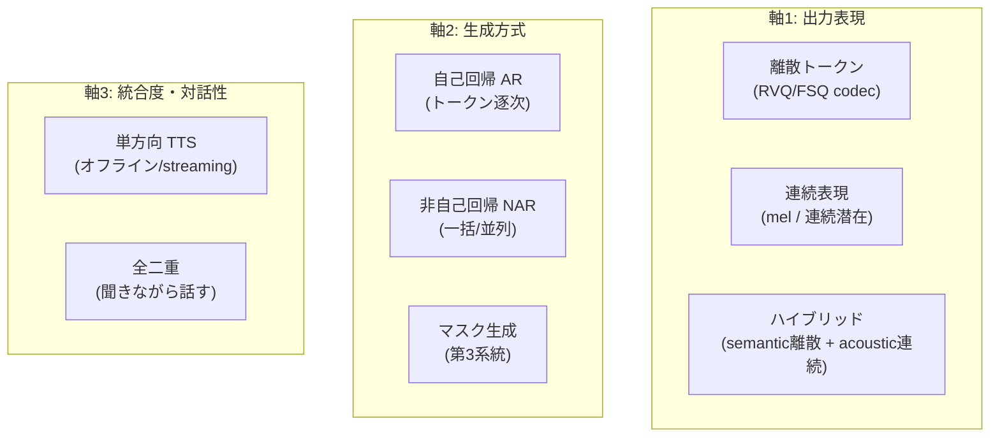
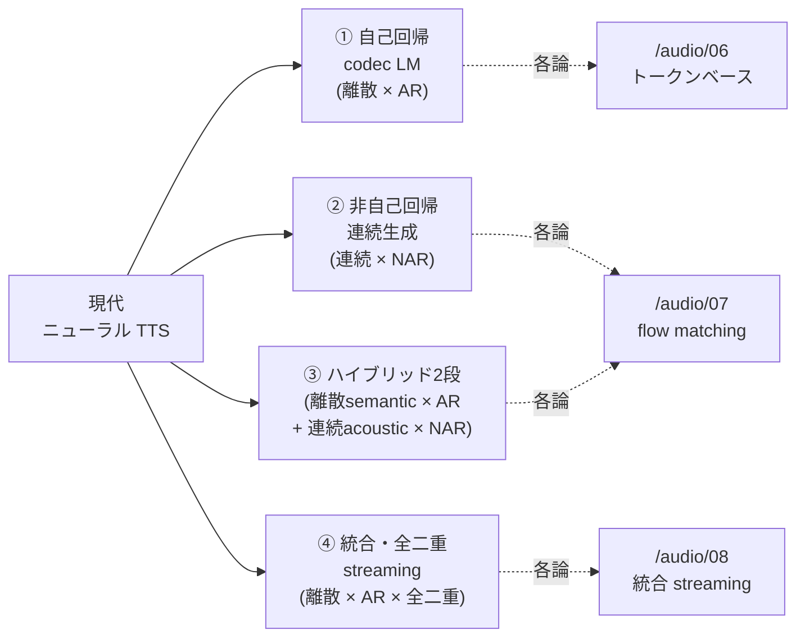

# 現代 TTS の全体地図 — 分類と研究トレンド

:::abstract[学習目標]
この章を読み終えると、次のことができるようになります。

- 現代 TTS を **3つの分類軸**（出力表現＝離散/連続、生成方式＝AR/NAR、統合度＝単方向/全二重）で **整理** できる
- **自己回帰 codec LM** / **非自己回帰 連続生成** / **ハイブリッド2段** / **統合・全二重 streaming** の4ブランチを、定義と代表例で **区別** できる
- VALL-E から Moshi/DSM までの代表研究を **時系列に並べ**、各研究が「どの軸のどの課題を解いたか」を **対応づけ** られる
- 2024–26 の主要トレンド（ゼロショットクローン・低遅延 streaming・低フレームレート codec・離散/連続の収束）を **列挙** し、なぜその方向へ進んだかを **説明** できる
- これから学ぶ各論（06 トークンベース / 07 flow matching / 08 統合 streaming）が地図のどこに位置するかを **指し示せる**
:::

## 前提知識

- 章03 [ニューラル音声コーデック](/audio/03-neural-audio-codecs/)：**RVQ**（残差ベクトル量子化）で波形を離散トークン列に変える仕組み・semantic / acoustic トークンの分離・streaming codec。本章の「離散トークン」はすべてこれが土台です。
- 章02 [周波数領域とスペクトル特徴量](/audio/02-frequency-and-features/)：**log-mel** スペクトログラム（連続表現の代表）と vocoder で波形へ戻す変換チェーン。本章の「連続表現」はこれを指します。
- 章04 [音声認識 (ASR) とストリーミング](/audio/04-asr/)：AR / NAR・frame-synchronous・streaming・遅延↔精度のトレードオフ。TTS は ASR の **逆向き**（テキスト→音声）で、同じ語彙がそのまま効きます。
- seq2seq / 自己回帰デコード / 言語モデリングの基礎（LLM の経験がそのまま橋渡しになります）。

LLM 出身の読者は、本章を **「TTS という生成タスクを、どんな生成器の上に載せるか」の設計空間の地図** として読むと早いです。テキスト LLM で「AR か diffusion か」「離散トークンか連続埋め込みか」を選ぶのと同じ問いを、音声で解いています。

## 直感

章06〜08 では TTS の各論（トークンベース・flow matching・統合 streaming）を1つずつ深掘りします。でもその前に、**地図** が要ります。「いま読んでいる手法が、全体のどこにいるのか」が分からないまま個別論文を読むと、似て非なるモデルが洪水のように押し寄せて溺れます。

この章の役割は1つ —— **現代ニューラル TTS の設計空間を、少数の軸で切って、各ブランチに名前を付ける** ことです。地図さえあれば、新しいモデルが出てきても「ああ、これは離散×AR の VALL-E 系の派生だな」「これは連続×NAR の flow matching 系か」と即座に座標を打てます。

鍵になる問いはたった3つです。

1. **何を生成するか** —— 離散トークンか、連続表現か。
2. **どう生成するか** —— 1個ずつ逐次（AR）か、まとめて並列（NAR）か。
3. **どこまで統合するか** —— テキスト→音声の単方向 TTS か、聞きながら話す全二重の対話モデルの一機能か。

この3軸の組合せが、そのまま現代 TTS の主要ブランチになります。本章でその地図を描き切ります。

## 全体像

まず、3つの分類軸を1枚で一望します。各軸は独立で、組合せがブランチを決めます。



次に、この3軸の組合せから生まれる **4つの主要ブランチ** と、それぞれの各論章への対応を一望します。



3軸と4ブランチの対応を表で固定します。**ブランチは軸の点ではなく領域** です（例：ハイブリッドは「離散×AR」と「連続×NAR」を2段で繋ぐ）。

| ブランチ | 出力表現 | 生成方式 | 統合度 | 代表例 | 各論章 |
| --- | --- | --- | --- | --- | --- |
| ① 自己回帰 codec LM | 離散 | AR（+NAR補完） | 単方向 | VALL-E, VALL-E 2, XTTS | [06](/audio/06-token-based-tts/) |
| ② 非自己回帰 連続生成 | 連続 | NAR（flow/diffusion） | 単方向 | Voicebox, E2/F5-TTS, NaturalSpeech 2/3 | [07](/audio/07-flow-matching-tts/) |
| ③ ハイブリッド2段 | 離散semantic + 連続acoustic | AR → NAR | 単方向（streaming可） | CosyVoice 2, Seed-TTS, Spark-TTS | [06](/audio/06-token-based-tts/)・[07](/audio/07-flow-matching-tts/) |
| ④ 統合・全二重 streaming | 離散 | AR | **全二重** | Moshi, Kyutai DSM, Sesame CSM | [08](/audio/08-unified-streaming-tts/) |

:::note[LLM ↔ Speech]
この3軸は、テキスト生成でも見たことがあるはずです。「離散 vs 連続」＝トークン生成 vs 連続埋め込み拡散、「AR vs NAR」＝GPT 流逐次デコード vs diffusion/並列デコード、「統合度」＝単発生成 vs エージェント的な多ストリーム同時処理。**TTS は、テキスト LLM で確立した設計選択を音声という連続信号に持ち込む試み** だと捉えると、地図が一気に読みやすくなります。
:::

:::warning[「ブランチ＝モデルの箱」ではない]
4ブランチは互いに排他的な箱**ではありません**。むしろ2024–26 の潮流は **ブランチ間の収束** です。①の弱点（離散化による音響損失）を②が補い、両者を繋いだのが③、③の AR 部分を全二重対話へ拡張したのが④、という連続したスペクトラムです。「このモデルはどのブランチ"だけ"か」と問うのではなく、「3軸のどこに座標を打つか」と読んでください。
:::

## 理論：4ブランチを定義する

ここから各ブランチを、定義 → 動作（誰が何を入力に何を出力するか）→ 代表例 → 課題、の順で1つずつ降ります。

### 分類軸を厳密化する

ブランチに入る前に、3軸の各値の意味を確定させます。**この定義が地図の座標系** です。

**軸1：出力表現（何を生成するか）。** 生成器が直接予測する対象です。

- **離散トークン**：ニューラルコーデック（章03）の RVQ / FSQ が吐く整数 ID 列。語彙が有限なので **softmax で分類でき、LLM の機構（事前学習・in-context learning・サンプリング）がそのまま載る**。代償は量子化による情報損失（知覚上重要な音響細部が落ちる）。
- **連続表現**：mel スペクトログラム（章02）や連続潜在ベクトル。量子化しないので音響細部を保つが、**分類問題にできない**ので回帰（拡散/flow で「ノイズ→データ」の写像を学ぶ）になる。
- **ハイブリッド**：内容を担う **semantic トークン（離散）** と、音響を担う **acoustic 表現（連続 mel/latent）** を分業させる。両者のいいとこ取り。

:::warning[「離散か連続か」は codec の選択であって生成方式とは独立]
出力表現（軸1）と生成方式（軸2）を混同しないでください。離散トークンでも NAR でマスク生成できます（MaskGCT）し、連続表現を AR で出すこともできます。よくある誤解は「離散＝AR、連続＝NAR」と決めつけること。**多数派の組合せがそうなだけ** で、軸は独立です。
:::

**軸2：生成方式（どう生成するか）。** 出力要素の生成順序です。

- **自己回帰（AR）**：$y_u$ を $y_{<u}$ に条件づけて1個ずつ予測。系列長が柔軟・in-context で話者/韻律を模倣しやすい・streaming に強い。代償は逐次生成ゆえの不安定性（繰り返し・脱落・無限ループ）。
- **非自己回帰（NAR）**：全要素をまとめて並列生成。拡散/flow matching が代表で、ノイズから連続表現を一括生成。高忠実だが、生成順序の自由度がない。
- **マスク生成**：一部をマスクして反復的に埋める第3系統（MaskGCT）。AR でも diffusion でもない。

**軸3：統合度・対話性（どこまで統合するか）。** TTS が単独タスクか、音声対話モデルの一機能か。

- **単方向 TTS**：テキスト → 音声の一方向。オフライン合成も低遅延 streaming もここ。
- **全二重（full-duplex）**：ユーザ音声とシステム音声の2ストリームを常時並行モデル化し、**聞きながら話す**（割り込み・相槌対応）。TTS は「音声を出す機能」としてこの中に埋め込まれる。

### ブランチ① 自己回帰 codec 言語モデル系（VALL-E 系）

:::note[定義]
TTS を「連続信号の回帰」ではなく **「離散トークンの言語モデリング」** として定式化する系統。ニューラルコーデックの RVQ で音声を離散トークン列に符号化し、Transformer 言語モデルでテキスト条件付きにそのトークン列を予測する。GPT 流の大規模事前学習と in-context learning を音声合成へ持ち込み、3秒程度の参照音声だけで未知話者の声を再現する **ゼロショット話者クローン** を実現したのが核心。
:::

**動作（誰が・何を入力に・何を出力するか）。** 標準構成は **AR+NAR 二段** です。

1. **AR モデル**：テキスト＋3秒の参照音声（acoustic prompt）を入力に、RVQ の **第1コードブック**（粗い音響）を **時刻ごとに逐次** 生成する。これが「音響を条件にした言語モデル」の本体。
2. **NAR モデル**：AR が出した第1層を条件に、**第2層以降の細部コード** を時刻ごとに **並列** 補完する（逐次でない＝速い）。
3. codec デコーダ（章03）が全コードブックから波形を復元する。

なぜ二段か。RVQ は第1層が音韻・粗い音響、上位層が細部残差を担う **階層構造**（章03）です。だから粗い情報＝逐次依存が強い第1層は AR で、細部＝並列でも崩れない上位層は NAR で、と役割分担すると品質と速度が両立します。

**学習時 vs 推論時。** 学習時は正解音声を codec で離散化し、テキスト条件で次トークン予測の損失を取ります（teacher forcing、章04 と同じ）。推論時は参照音声を prompt に与え、AR が第1層を自己回帰サンプリング、NAR が残りを補完します。**ゼロショットクローンは "学習時に話者埋め込みを別途学ぶのではなく、推論時に参照音声を文脈に置くだけ" で達成される** —— これが in-context learning たる所以です。

**代表例。**

| モデル | 何を足したか |
| --- | --- |
| VALL-E (2023, Microsoft) | 系統の起点。EnCodec RVQ・AR+NAR・60K 時間で事前学習・3秒プロンプトでクローン |
| VALL-E X (2023) | 多言語・言語横断クローン（声を保ったまま別言語）と音声→音声翻訳へ拡張 |
| VALL-E 2 (2024) | Repetition Aware Sampling と Grouped Code Modeling で LibriSpeech/VCTK 上 **human parity** を初主張 |
| BASE TTS (2024, Amazon) | 約10億パラメータ・10万時間で **創発的能力**（LLM 流スケーリング） |
| XTTS (2024, Coqui) | 16言語・オープンソースで普及した多言語ゼロショットクローン |
| HALL-E (ICLR 2025) | MReQ で 8Hz まで低フレームレート化し最大180秒の長尺合成を安定化 |

**課題（これが派生研究を駆動した）。** ①逐次生成の不安定性（繰り返し・脱落・無限ループ）→ RALL-E の CoT 韻律予測・VALL-E R の単調アライメント。②高フレームレートによる長尺合成の困難 → HALL-E の低フレームレート化。③多言語化 → VALL-E X。④離散化による音響損失 → これがブランチ②への重心移動を生んだ。

:::note[LLM ↔ Speech]
ブランチ①は **「音声トークン上の GPT」** です。テキスト LLM の次トークン予測を、語彙を codec トークンに差し替えただけ。in-context learning（few-shot プロンプト）が「3秒の参照音声で声を真似る」に対応し、繰り返し・ループといった失敗モードも LLM のそれと同根です。詳細は [06 トークンベース TTS](/audio/06-token-based-tts/) で深掘りします。
:::

### ブランチ② 非自己回帰 連続生成系（Diffusion / Flow Matching）

:::note[定義]
トークンを逐次予測する AR 型と対照的に、mel スペクトログラムや連続潜在表現を **「ノイズから一括で」** 生成する非自己回帰系統。中核は、ノイズ分布をデータ分布へ運ぶ ODE/SDE を学習すること。第一世代の拡散型（NaturalSpeech 2 等）が AR codec LM に匹敵する品質を達成し、第二世代の **Flow Matching**（Lipman 2022）が主流化した。
:::

**動作。** flow matching は「ノイズ $x_0 \sim \mathcal{N}(0,I)$ をデータ $x_1$（mel）へ運ぶ速度場 $v_\theta$」を学びます。

1. 学習時：時刻 $t \in [0,1]$ とデータ $x_1$ をサンプルし、補間点 $x_t=(1-t)x_0+t x_1$ での目標速度 $x_1-x_0$ を回帰する（シミュレーションフリー＝ODE を解かずに学習）。
2. 推論時：$x_0$ から出発し、$\frac{dx}{dt}=v_\theta(x_t,t,\text{条件})$ を Euler 法で数ステップ積分して $x_1$（mel）を得る。
3. vocoder（章02）が mel から波形を復元。

**なぜ「少ステップで速い」か。** ここが核心です。最適輸送（OT）パスや Rectified Flow を使うと **生成軌道がほぼ直線** になります。直線軌道は Euler 法の離散化誤差がほぼゼロなので、ODE を **少ステップ（時に1ステップ）** で解いても品質が落ちません。拡散の「曲がった軌道」は多ステップ必須だったのに対し、これが flow matching の速度優位の本質です。

**アーキテクチャ単純化競争。** この系統のもう1つの主戦場は「部品を捨てる」ことです。E2-TTS は **duration model も G2P もアライメントも持たず**、文字列をフィラートークンで音声長まで埋めて flow matching で穴埋め（text-infilling）するだけで人間レベルに到達しました。F5-TTS はそれを DiT+ConvNeXt+Sway Sampling で高速・高品質化（RTF 0.15）し、MIT ライセンス公開で事実上の定番になりました。

**代表例。**

| モデル | 何を足したか |
| --- | --- |
| Flow Matching (Lipman 2022) | シミュレーションフリー学習の理論的土台。OT パスで軌道を直線化 |
| Rectified Flow (Liu 2022) | reflow で軌道を反復直線化、1ステップ生成の源流 |
| NaturalSpeech 2 (2023) | RVQ codec の連続潜在を潜在拡散で生成、44K 時間、歌声まで一般化 |
| NaturalSpeech 3 (ICML 2024) | FACodec で content/prosody/timbre/acoustic を分解し factorized diffusion |
| Voicebox (NeurIPS 2023, Meta) | 音声インフィリングを FM で学習、VALL-E 比最大20倍高速、50K 時間 |
| E2-TTS (SLT 2024) | duration/G2P/アライメントを全廃しフィラー穴埋め＋FM だけで人間レベル |
| F5-TTS (2024) | DiT+ConvNeXt+Sway Sampling で RTF 0.15、MIT 公開で定番 |
| MeanFlow (2025) と派生 | 平均速度場で1ステップ生成、少ステップ最前線 |

**課題と研究焦点。** さらなる少ステップ化（Consistency FM・MeanFlow・蒸留・離散 FM）で NFE（関数評価回数）を 1–2 に圧縮しつつ品質を保つこと。

:::note[LLM ↔ Speech]
ブランチ②は **「音声版の画像拡散/flow モデル」** です。テキスト LLM の自己回帰とは対極で、Stable Diffusion 系の「ノイズから一括生成」を音声 mel に適用したもの。ただし TTS では条件（テキスト・話者）付き生成かつ「単調アライメント」が効くので、画像より構造が素直です。詳細は [07 flow matching TTS](/audio/07-flow-matching-tts/) で。
:::

### ブランチ③ ハイブリッド2段（AR semantic + flow/diffusion acoustic）

:::note[定義]
2024–26 に世界的主流となった構成。**(1)** テキストから LLM バックボーンが低レート **semantic トークン** を自己回帰生成 → **(2)** flow matching / diffusion ベースの NAR モデルが、その semantic トークンと話者プロンプトを条件に **acoustic 表現**（mel/latent）を生成 → vocoder で波形化する coarse-to-fine の2段。
:::

**なぜこれが主流になったか（地図の中心）。** ①と②の長所が相補的だからです。

| 担当 | ①の長所（AR） | ②の長所（flow/diffusion） |
| --- | --- | --- |
| 何が得意 | 柔軟な系列長・in-context 話者/韻律模倣・streaming | 連続的な音響変動の高忠実度生成 |
| ハイブリッドでの役割 | 第1段：内容（semantic）を AR 生成 | 第2段：音響（acoustic）を NAR 生成 |

つまり **「内容は AR の柔軟さで、音響は flow の忠実度で」** という分業。①が苦手な音響細部を②が、②が苦手な柔軟な系列長・streaming を①が補います。

**動作。** Qwen2.5/Qwen3 等の **事前学習 LLM を専用 text encoder なしで semantic 生成器に流用** するのが今風です。

1. 第1段（AR）：事前学習 LLM が、テキストから semantic トークン列を逐次生成（章03 の semantic トークン）。
2. 第2段（NAR）：chunk-aware causal flow matching が、semantic トークン＋話者プロンプトを条件に mel を生成。**chunk-aware causal** にすることで sub-100ms streaming を実現。
3. vocoder が波形化。

**代表例。**

| モデル | 何を足したか |
| --- | --- |
| CosyVoice 2 (2024, Alibaba) | Qwen2.5-0.5B が semantic を AR 生成 → chunk-aware causal FM、FSQ で利用率100%、sub-100ms、streaming/非streaming 統合。**事実上のリファレンス** |
| Seed-TTS (2024, ByteDance) | 大規模 AR + token diffusion、自己蒸留と RL で頑健性、評価基盤 Seed-TTS-eval が業界標準に |
| Spark-TTS / BiCodec (2025) | BiCodec で semantic + 固定長 global（話者）トークンに分解、Qwen2.5-0.5B が CoT 付き生成 |
| IndexTTS2 (2025) | 正確な時間長制御と感情制御、Qwen3 ファインチューニングのテキスト記述 soft instruction |
| VoXtream (2025) | 完全 AR full-stream、初期遅延 GPU 102ms / full-stream 74ms |
| MaskGCT (ICLR 2025) | マスク生成型の **第3系統**（AR でも diffusion でもない）、明示的 duration 不要 |

:::warning[MaskGCT は「ハイブリッド」ではなく「第3系統」]
MaskGCT を上表に置いたのは「2段構成で semantic→acoustic を繋ぐ」点が近いからですが、生成方式（軸2）は AR でも diffusion でもない **マスク生成** です。地図上は③の隣に置く独立した点として扱うのが正確。「ハイブリッド＝必ず AR+flow」と思い込まないでください。
:::

:::note[LLM ↔ Speech]
ブランチ③は **「LLM が下書き（semantic）を書き、拡散モデルが清書（acoustic）する」** 分業です。テキスト LLM でいえば、プランナー LLM が骨子を出し、別モジュールが仕上げる二段構成に対応。事前学習 LLM（Qwen）をそのまま流用する点も、LLM エコシステムを音声に持ち込む典型例です。各論は [06](/audio/06-token-based-tts/)（AR semantic 側）と [07](/audio/07-flow-matching-tts/)（flow acoustic 側）にまたがります。
:::

### ブランチ④ 統合・全二重 streaming（Moshi・Kyutai DSM 系）

:::note[定義]
「テキストを書いてから音声を合成する」従来パイプライン（ASR→LLM→TTS のカスケード）を解体し、**テキストと音声トークンを同一の自己回帰 Transformer で時間整合的に同時生成** する系統。TTS は単独タスクではなく、音声基盤モデル・spoken dialogue の **一機能** として組み込まれる。中核は Kyutai の Moshi（2024）。
:::

**動作（Moshi を例に）。** 4つの部品が組み合わさります。

1. **Mimi codec**：24kHz 音声を **12.5Hz・1.1kbps** へ圧縮する完全 streaming RVQ codec。WavLM への semantic 蒸留で semantic+acoustic を単一 codec に統合（章03 の semantic/acoustic 分離の発展形）。
2. **RQ-Transformer**：時間方向の大きな **Temporal Transformer** が時刻 $s$ の文脈埋め込みを出し、深さ方向の小さな **Depth Transformer** がその時刻の K 個のサブトークン（複数 RVQ 階層）を生成。時刻 S と深さ K を独立に扱える。
3. **Inner Monologue（内なる独白）**：発話する音声トークンの直前に、それに時間整合したテキストトークンを予測させる。テキストを音声の「足場」にして言語品質を底上げし、副産物として streaming ASR/TTS も同一モデルで実現。
4. **2ストリーム全二重設計**：ユーザ音声とシステム音声を独立ストリームとして常時並行モデル化 → 割り込み・相槌を扱える。実測 ~200ms でターン制を持たない会話。

**Delayed Streams Modeling (DSM) への一般化。** Moshi の経験則を、Hibiki（同時音声翻訳, ICML 2025）を経て DSM（2025）が一般理論化しました。DSM の核心は **「時間整合した複数ストリーム間に適切な遅延を入れるだけで、TTS / STT / 翻訳を単一 decoder-only に統一できる」** こと。遅延の付け方がタスクを規定します（音声→テキスト遅延なら STT、逆なら TTS）。

**代表例。**

| モデル | 何を足したか |
| --- | --- |
| Moshi (＋Mimi) (2024, Kyutai) | 初の実時間・全二重 spoken LLM、実測 ~200ms、本領域の事実上の基準点、オープンソース |
| Kyutai DSM (2025) | 遅延設計だけで TTS/STT/翻訳を単一 decoder-only に統一する一般定式化 |
| Kyutai TTS / STT (2025) | DSM 由来の実用モデル、TTS 1.6B で ~220ms 遅延、Rust/MLX で on-device |
| Hibiki (ICML 2025, Kyutai) | 同時音声→音声翻訳、contextual alignment、Hibiki-M はスマホ実時間 |
| Sesame CSM (2025) | Llama バックボーン＋小型 audio decoder で Mimi コードを interleave 生成 |
| GLM-4-Voice / LLaMA-Omni 2 / SpeechGPT | 半二重ターン制 omni 対話モデル群 |

:::warning[「CALM」という確立した全二重モデルは存在しない]
全二重対話領域で **『CALM』という名の確立した単一の代表的全二重モデルは確認できません**（"CALM" は別文脈の音声論文に使われる略語）。本章では CALM を、interleaved speech-text / conversational speech model という **位置づけ概念**（GLM-4-Voice・LLaMA-Omni・SpeechGPT などの半二重ターン制 omni 対話モデル群）として扱います。固有名として断定的に引用しないでください。
:::

:::warning[半二重と全二重を取り違えない]
「音声入出力がある＝全二重」ではありません。

| | 半二重（ターン制） | 全二重 |
| --- | --- | --- |
| 動作 | 聞く→話すを交互 | 聞きながら話す（同時） |
| 割り込み・相槌 | 扱えない | 扱える |
| 代表 | SpeechGPT, LLaMA-Omni, GLM-4-Voice | Moshi, CSM 系 |

SpeechGPT 系は音声入出力を持ちますが基本ターン制（半二重）です。真の全二重は2ストリームを常時並行モデル化する Moshi/CSM 系のみ。
:::

:::note[LLM ↔ Speech]
ブランチ④は **「音声で動くエージェント的 LLM」** です。単発の生成（プロンプト→応答）から、複数ストリームを同時に処理し続ける常駐モデルへ、という方向は、テキスト LLM がチャットからエージェントへ向かった流れと重なります。Inner Monologue は「音声を出す前に頭の中でテキストを考える」＝LLM の chain-of-thought の音声版。詳細は [08 統合 streaming TTS](/audio/08-unified-streaming-tts/) で深掘りします。
:::

## 代表研究の年表

地図に時間軸を入れます。各研究が「どの軸のどの課題を解いたか」を併記します。

| 年 | マイルストーン | 解いた課題・軸 |
| --- | --- | --- |
| 2022 | **Flow Matching**（Lipman）・**Rectified Flow**（Liu）登場（いずれも ICLR 2023） | 連続生成（軸1）の理論的土台。直線軌道で少ステップ化の根拠 |
| 2023-01 | **VALL-E**（Microsoft） | 離散×AR（ブランチ①）の起点。TTS を回帰→トークン生成へ転換、3秒クローン |
| 2023 | **VALL-E X** / **SpeechX** | ①の多言語化・汎用化（雑音抑圧・音声編集を単一 codec LM に統一） |
| 2023 | **NaturalSpeech 2** / **Matcha-TTS** / **Voicebox** | 連続×NAR（ブランチ②）を実用域へ。Voicebox は拡散比最大20倍高速 |
| 2023 | **SpeechGPT** | 離散音声トークン×LLM の omni 対話系譜（半二重）を開始 |
| 2024-02/06 | **BASE TTS**（創発）/ **VALL-E 2**（human parity）/ **Seed-TTS**（産業規模） | ①のスケーリングと頑健性。Seed-TTS-eval が業界標準に |
| 2024-06/10 | **E2-TTS** / **F5-TTS** / **NaturalSpeech 3** / **XTTS** | ②のアーキテクチャ単純化（duration/G2P/アライメント全廃）と普及 |
| 2024 | **Moshi (＋Mimi)** / **CosyVoice 2** | ④の全二重を初実現（~200ms）／③のハイブリッドが sub-100ms streaming で主流化 |
| 2025 | **Spark-TTS** / **IndexTTS2** / **VoXtream** / **MaskGCT** / **HALL-E** | ③の制御性・低遅延・長尺。マスク生成第3系統 |
| 2025 | **Hibiki** → **DSM** → **Kyutai TTS/STT** / **Sesame CSM** | ④の一般理論化（遅延設計で TTS/STT/翻訳を統一）と会話的音声生成 |
| 2025–26 | 少ステップ化（MeanFlow 派生）・低フレームレート codec・omni/全二重評価ベンチ・on-device | 離散と連続の収束、評価標準化、効率化が焦点 |

:::warning[固有名・数値の扱い]
本章の固有名・年・会議・数値（遅延 ms、フレームレート Hz、パラメータ数等）は **2025–26 時点で確認できた範囲** です。研究領域の進展が速いため、**実装前に Context7 / WebSearch で最新版を再確認** してください（CLAUDE.md 方針）。確認できなかった事項（例：CALM の固有名）は本文中で明示的に断っています。
:::

## 研究トレンド（2024–26）

地図の上で「いま全体がどちらへ動いているか」を6つの潮流で論じます。

### トレンド1：パラダイム収斂 ——「TTS = 言語モデリング」

VALL-E 以降、**「TTS＝（ニューラルコーデックトークン上の）言語モデリング」** が共通土台になりました。生成側は (a) AR codec LM、(b) NAR diffusion/flow、(c) マスク生成 の3系統に整理され、**(a)+(b) のハイブリッド（ブランチ③）が 2024–26 の主流** です。地図の4ブランチは、この収斂の現れです。

### トレンド2：ハイブリッド2段の支配

前述の通り、AR semantic + flow/diffusion acoustic（CosyVoice 2 / Seed-TTS / Spark-TTS / IndexTTS2 / VoXtream / Voxtral TTS）が支配的になりました。**AR の柔軟性と flow/diffusion の高忠実度を相補的に統合** できるのが理由です。事前学習 LLM（Qwen2.5/Qwen3）を semantic 生成器に流用する流れも、このブランチを後押ししています。

### トレンド3：ゼロショット voice cloning の常態化と human parity

数秒プロンプトのクローンが **標準機能化** しました。VALL-E 2 / CosyVoice 2 / Seed-TTS が human-parity / human-indistinguishable を主張しています。

:::warning[human parity は「特定ベンチでの主張」]
human parity は **特定ベンチマーク（LibriSpeech/VCTK 等）で頑健性・自然性・話者類似度が人間録音に並ぶ** という到達指標であり、「あらゆる場面で人間と区別できない」という意味ではありません。論文の主張は評価条件込みで読んでください。
:::

### トレンド4：離散量子化からの脱却と Flow Matching への重心移動

離散化が **知覚上重要な音響細部を失う** 点が問題視され、連続表現・flow-matching・半/擬似自己回帰が台頭しました。最適輸送パス / Rectified Flow の直線軌道が「少ステップで速い」根拠を与え、E2/F5-TTS のアーキテクチャ単純化（duration 予測器・G2P・アライメント全廃）が続きました。**2024–26 の主戦場はさらなる少ステップ化** —— Consistency FM・MeanFlow による1ステップ生成・蒸留・離散 FM で NFE を 1–2 に圧縮しつつ品質を保つ研究です。

### トレンド5：低フレームレート・semantic+acoustic 統合 codec

codec のフレームレートが **50Hz→25Hz→12.5Hz（Mimi）→≤10Hz** と下がり続けています。WavLM への semantic 蒸留で意味/音響を単一 codec に統合し、**FSQ（Finite Scalar Quantization）** で利用率100%・話者漏れ低減を達成。トークン列が短くなると LLM の負荷と遅延が下がるので、低遅延 streaming（トレンド6）の前提になっています。

:::note[なぜフレームレート低減が効くか]
codec のフレームレートが高いとトークン列が長大化し、AR が分単位の音声を安定生成できません（章04 の「系列長 $L^2$ コスト」と同根）。低フレームレート化はトークン数を直接減らすので、AR の負荷・遅延・長尺安定性が同時に改善します。Mimi の 12.5Hz は「1秒＝12.5トークン」で、初期の 50Hz codec の1/4です。
:::

### トレンド6：パイプライン解体と全二重 streaming への移行

ASR→LLM→TTS のカスケードから、テキストと音声を同一自己回帰モデルで同時生成する end-to-end 統合へ移りました。半二重ターン制（SpeechGPT/LLaMA-Omni/GLM-4-Voice）から、聞きながら話す全二重（Moshi/CSM 系）へ。**Inner Monologue と acoustic delay が品質と低遅延を両立**（Moshi ~200ms, Kyutai TTS ~220ms, VoXtream 初期遅延 74ms, CosyVoice 2 sub-100ms）させています。個別タスクは Moshi→Hibiki→DSM と進み、**遅延設計だけで TTS/STT/翻訳を1アーキで扱う** 一般枠組みへ収束しました。

:::success[トレンドを1行で]
**離散と連続が収束（③ハイブリッドで合流）し、生成は少ステップ・低フレームレート・低遅延へ、形態は単方向 TTS から全二重 streaming へ** —— これが 2024–26 の地図の動きです。評価は WER/SIM/MOS と Seed-TTS-eval で標準化し、オープンソース化が再現性とエコシステムを加速しています。
:::

## 数式の導出：3軸を1つの確率モデルで束ねる

分類の章なので導出は軽くします。4ブランチが結局 **同じ生成モデルの異なる因子分解** であることを1つの式で確認します。

TTS は条件 $c$（テキスト・話者プロンプト）の下で音声表現 $\mathbf{y}$ の分布 $P(\mathbf{y}\mid c)$ をモデル化する問題です。ブランチの違いは、この $\mathbf{y}$ を何にして、$P$ をどう因子分解するかに尽きます。

**ブランチ①（離散×AR）** は $\mathbf{y}$ を codec トークン列 $C=(c_1,\dots,c_K)$（$K$ コードブック）とし、自己回帰で因子分解します。

$$P(C\mid c)=\underbrace{\prod_{t=1}^{T} p\!\left(c_1^{t}\mid c_1^{<t}, c\right)}_{\text{AR 段（第1層・逐次）}}\ \cdot\ \underbrace{\prod_{k=2}^{K}\prod_{t=1}^{T} p\!\left(c_k^{t}\mid c_{<k}^{t}, c\right)}_{\text{NAR 段（上位層・並列）}}$$

ここで $c_k^t$ は第 $k$ コードブック・時刻 $t$ のトークン、$T$ はフレーム数、$c$ は条件。第1層だけ $c_1^{<t}$（過去）に依存＝AR、上位層は同時刻の下位層 $c_{<k}^t$ にのみ依存＝NAR（時刻方向は並列）。

**ブランチ②（連続×NAR）** は $\mathbf{y}$ を連続表現 $x_1$（mel）とし、ノイズ $x_0$ からの ODE で生成します。確率は速度場 $v_\theta$ を通じて暗黙に定義され、学習は条件付き flow matching 損失で行います。

$$\mathcal{L}_{\mathrm{CFM}}=\mathbb{E}_{t,\,x_1,\,x_0}\big\|\,v_\theta(x_t,t,c) - (x_1-x_0)\,\big\|^2,\qquad x_t=(1-t)x_0+t x_1$$

ここで $x_0\sim\mathcal{N}(0,I)$、$x_1\sim p_{\text{data}}$、$x_t$ は OT 線形補間、目標速度は定数 $x_1-x_0$。生成は $\frac{dx}{dt}=v_\theta(x_t,t,c)$ を $t:0\to1$ で積分。

**ブランチ③（ハイブリッド）** は $\mathbf{y}$ を「semantic トークン列 $S$」と「acoustic 表現 $A$」に分け、①の AR で $S$ を、②の flow で $A$ を生成する2段に因子分解します。

$$P(\mathbf{y}\mid c)=\underbrace{\prod_{i=1}^{T_s} p\!\left(s_i\mid s_{<i}, c\right)}_{\text{(1) semantic を AR 生成}}\ \cdot\ \underbrace{P_{\mathrm{flow}}\!\left(A\mid S, c\right)}_{\text{(2) acoustic を NAR 生成}}$$

**ブランチ④（統合・全二重）** は、これに2つ目のストリーム（ユーザ音声 $U$）と遅延 $\delta$ を足し、$\mathbf{y}$ を「テキスト $w$ ＋音声トークン $a$」の時間整合した同時生成にします。

$$P(\mathbf{y}\mid U)=\prod_{t} p\!\left(w_t,\,a_t \mid w_{<t},\,a_{<t},\,U_{\le t-\delta}\right)$$

遅延 $\delta$ がタスク（音声→テキストなら STT、逆なら TTS）を規定する —— これが DSM の核心でした。

4ブランチはすべて $P(\mathbf{y}\mid c)$ の因子分解の違いに過ぎない、と確認できました。これが地図の数学的な背骨です。$\blacksquare$

## 実装：学習済みモデルで地図を俯瞰する

分類の章なので、実装は **既存の学習済みモデルを俯瞰して触る** 最小手順に留めます。各ブランチの代表を1つずつ呼び出し、「同じ TTS でもインターフェースがどう違うか」を体感します。

:::warning[実行前の前提]
以下は **学習済みモデルの推論** です。実際の重みダウンロードには各モデルのライセンス確認とそれなりの GPU/メモリが要ります。ここでは **API の形（何を入力に何が返るか）** を読むのが目的なので、まず擬似的に「地図の座標」を出力するコードで全体像を掴みます。各モデルの正確なインストール手順は実装前に公式 README を参照してください。
:::

```python title="tts_landscape_map.py"
"""4ブランチの代表モデルを「地図の座標」として一覧する最小スクリプト。
実際の推論ではなく、各ブランチのインターフェース（入力・出力・統合度）を
1つのデータ構造で対比し、分類軸を手で確認するのが目的。"""

from dataclasses import dataclass


@dataclass
class TTSModel:
    name: str
    output: str       # 軸1: discrete / continuous / hybrid
    generation: str   # 軸2: AR / NAR / mask
    duplex: str       # 軸3: one-way / full-duplex
    inputs: str       # 推論時の入力
    chapter: str      # 各論章


# 各ブランチの代表を1つずつ。座標（output, generation, duplex）が
# そのまま地図上の位置になる。
MODELS = [
    TTSModel("VALL-E",      "discrete",   "AR",   "one-way",
             "text + 3s ref audio", "06"),
    TTSModel("F5-TTS",      "continuous", "NAR",  "one-way",
             "text + ref audio (filler-padded)", "07"),
    TTSModel("CosyVoice 2", "hybrid",     "AR+NAR", "one-way(stream)",
             "text + ref audio (LLM semantic -> flow mel)", "06/07"),
    TTSModel("Moshi",       "discrete",   "AR",   "full-duplex",
             "user audio stream (+ inner monologue text)", "08"),
]


def coordinate(m: TTSModel) -> str:
    """3軸の座標を1行に。地図のどこにいるかを示す。"""
    return f"({m.output:>10}, {m.generation:>6}, {m.duplex})"


if __name__ == "__main__":
    print(f"{'model':<12} {'軸(出力, 生成, 統合度)':<34} {'各論':<6} 入力")
    print("-" * 88)
    for m in MODELS:
        print(f"{m.name:<12} {coordinate(m):<34} ch{m.chapter:<5} {m.inputs}")
```

```text title="出力"
model        軸(出力, 生成, 統合度)              各論   入力
----------------------------------------------------------------------------------------
VALL-E       (  discrete,     AR, one-way)        ch06    text + 3s ref audio
F5-TTS       (continuous,    NAR, one-way)        ch07    text + ref audio (filler-padded)
CosyVoice 2  (    hybrid, AR+NAR, one-way(stream)) ch06/07 text + ref audio (LLM semantic -> flow mel)
Moshi        (  discrete,     AR, full-duplex)    ch08    user audio stream (+ inner monologue text)
```

この出力から地図の3軸が読めます。同じ「ゼロショット TTS」でも、**VALL-E は3秒参照音声でクローン、F5-TTS はフィラー埋めの text-infilling、CosyVoice 2 は LLM が semantic を出して flow が mel を作る2段、Moshi はユーザ音声ストリームを聞きながら話す** —— 入力インターフェースそのものがブランチを語っています。各論章では、この座標の中身（どう学習し・どう推論するか）を1つずつ展開します。

## 演習

::::question[演習 1: モデルを地図に配置する]
次の3つのモデルを、本章の3軸（出力表現＝離散/連続/ハイブリッド、生成方式＝AR/NAR/マスク、統合度＝単方向/全二重）で座標づけし、4ブランチのどれに属するか答えてください。(a) E2-TTS、(b) Seed-TTS、(c) Sesame CSM。また、(d) MaskGCT が「ハイブリッド2段」に単純分類できない理由を述べてください。

:::details[解答]
(a) **E2-TTS**：連続（mel）× NAR（flow matching）× 単方向 → **ブランチ②（非自己回帰 連続生成）**。duration/G2P/アライメントを全廃しフィラー穴埋め＋FM だけで生成する、②の単純化の代表。

(b) **Seed-TTS**：ハイブリッド（semantic 離散 + acoustic 連続）× AR+diffusion × 単方向 → **ブランチ③（ハイブリッド2段）**。大規模 AR transformer が speech トークンを出し、token diffusion が coarse-to-fine で音響に変換。

(c) **Sesame CSM**：離散（Mimi コード）× AR（interleave 生成）× 全二重（開発中）→ **ブランチ④（統合・全二重 streaming）**。Llama バックボーン＋小型 audio decoder で Mimi の RVQ コードを生成し、テキストと音声を interleave。

(d) **MaskGCT** は生成方式（軸2）が AR でも diffusion でもない **マスク生成** だからです。2段で semantic→acoustic を繋ぐ構造はハイブリッドに似ますが、各段が「一部をマスクして反復的に埋める」第3系統なので、「AR semantic + flow acoustic」というハイブリッドの定義には収まりません。地図上は③の隣に置く独立した点として扱います。
:::
::::

::::question[演習 2: なぜハイブリッドが主流になったか]
2024–26 にブランチ③（AR semantic + flow/diffusion acoustic）が世界的主流になりました。(a) AR 単独（ブランチ①）と NAR 単独（ブランチ②）が、それぞれ何が得意で何が苦手かを1つずつ挙げてください。(b) ハイブリッドがその苦手をどう相補するか説明してください。(c) 事前学習 LLM（Qwen 等）を流用できることが、なぜこのブランチを後押ししたか述べてください。

:::details[解答]
(a) **AR（①）**：柔軟な系列長・in-context での話者/韻律模倣・streaming 適性が得意。逐次生成ゆえの不安定性（繰り返し・脱落・無限ループ）と、離散化による音響細部の損失が苦手。**NAR（②）**：連続的な音響変動の高忠実度生成が得意。生成順序の自由度がなく、柔軟な系列長や streaming が苦手（一括生成が基本）。

(b) ハイブリッドは **内容（semantic）を AR で、音響（acoustic）を flow/diffusion で** 分業します。①の苦手な「音響細部」を②の高忠実度生成が補い、②の苦手な「柔軟な系列長・streaming」を①の AR が補う。coarse-to-fine（粗→細）で両者の長所だけを取り出す構成です。

(c) 第1段（semantic 生成）は本質的に **テキスト条件付きの離散トークン言語モデリング** なので、事前学習済みの LLM（Qwen2.5/Qwen3）を **専用 text encoder なしでそのまま流用** できます。LLM の事前学習知識・多言語性・スケーリングをタダで持ち込めるため、開発コストが下がり、多言語ゼロショット性能が底上げされました。これがブランチ③を加速させました。
:::
::::

## まとめ

:::success[この章の要点]
- 現代 TTS は **3つの軸**（出力＝離散/連続、生成＝AR/NAR、統合度＝単方向/全二重）で整理でき、その組合せが4ブランチを決める。
- **① 自己回帰 codec LM**（離散×AR・VALL-E 系）＝TTS を言語モデリング化しゼロショットクローンを確立。**② 非自己回帰 連続生成**（連続×NAR・flow matching）＝ノイズから一括生成、直線軌道で少ステップ高速化。**③ ハイブリッド2段**（AR semantic + flow acoustic）＝両者の長所を相補し **2024–26 の主流**。**④ 統合・全二重 streaming**（Moshi/DSM）＝テキストと音声を同一 AR モデルで同時生成、聞きながら話す。
- 4ブランチは排他的な箱ではなく **同じ $P(\mathbf{y}\mid c)$ の因子分解の違い**。潮流は離散と連続の**収束**（③で合流）。
- トレンドは **ゼロショットクローンの常態化・少ステップ化・低フレームレート codec・低遅延 streaming・パイプライン解体（全二重へ）・評価標準化**。
- **CALM は確立した単一の全二重モデルではなく**、interleaved speech-text / conversational speech model という位置づけ概念（半二重 omni 対話モデル群）として扱うのが正確。
:::

### 次に学ぶこと

地図が手に入りました。次は **ブランチ① 自己回帰 codec LM** を深掘りします。章03 の codec トークンを使い、VALL-E がどう「TTS を言語モデリング」に化けさせ、3秒の参照音声でゼロショットクローンを実現するか —— AR+NAR 二段の中身を、学習時/推論時に分けて1つずつ展開します。

→ [第06章 トークンベース TTS（VALL-E 系）](/audio/06-token-based-tts/) へ。

→ [Audio ロードマップに戻る](/audio/)

## 用語ミニ辞典

| 用語 | 一言 |
| --- | --- |
| 離散トークン / 連続表現 | 軸1。codec の整数 ID 列 か、mel/連続潜在か |
| AR / NAR | 軸2。逐次1個ずつ生成 か、一括並列生成か |
| 全二重 (full-duplex) | 軸3。聞きながら話す（割り込み・相槌対応）。半二重＝ターン制 |
| codec LM (VALL-E 系) | ブランチ①。離散トークン上の言語モデルとして TTS を解く |
| flow matching | ブランチ②の中核。ノイズ→データの直線軌道 ODE を回帰、少ステップ生成 |
| ハイブリッド2段 | ブランチ③。AR が semantic、flow/diffusion が acoustic を生成 |
| semantic / acoustic トークン | 内容を担う離散トークン / 音響を担う表現（章03） |
| ゼロショット voice cloning | 数秒の参照音声から未知話者の声を in-context で再現 |
| Inner Monologue | 音声に先行してテキストを予測し言語品質を底上げ（Moshi） |
| DSM (Delayed Streams Modeling) | 遅延設計だけで TTS/STT/翻訳を単一 decoder-only に統一 |
| Mimi | 12.5Hz・1.1kbps の streaming codec。semantic+acoustic 統合 |
| FSQ | Finite Scalar Quantization。利用率100%・話者漏れ低減 |
| human parity | 特定ベンチで人間録音に並ぶとする到達指標（万能保証ではない） |
| WER / SIM / MOS | 内容正確性 / 話者類似度 / 自然性の標準評価指標 |

## 次のアクション

地図を手で定着させる。**最小の写経 → 動かす → 小実験** を1セットで。

1. **写経**：上の `tts_landscape_map.py` をそのまま打ち、4ブランチの座標一覧を出力する。各モデルの (output, generation, duplex) が地図のどこかを指で追う。
2. **動かす**：オープンソースで触りやすい代表を1つ選んで推論する（例：**F5-TTS**＝ブランチ②、MIT ライセンス）。参照音声＋テキストを入れて波形が返るインターフェースを体感し、「連続×NAR」が実際にどう呼び出されるか確かめる。
3. **小実験**：別ブランチの代表（例：**CosyVoice 2**＝ブランチ③）も呼び出し、F5-TTS との **入力・出力・遅延** の違いを表に書く。「ハイブリッド2段が streaming で何が違うか」を自分の言葉でまとめる。

ここまでで現代 TTS の **地図** が手に入ります。次稿 06（トークンベース TTS）で、ブランチ①の中身（VALL-E の AR+NAR 二段）へ降ります。学習を伴うので Slurm（H200）を使います。

## 参考文献

1. C. Wang et al., "Neural Codec Language Models are Zero-Shot Text to Speech Synthesizers" (VALL-E), Microsoft, *arXiv:2301.02111*, 2023.
2. S. Chen et al., "VALL-E 2: Neural Codec Language Models are Human Parity Zero-Shot Text to Speech Synthesizers," Microsoft, *arXiv:2406.05370*, 2024.
3. Y. Lipman et al., "Flow Matching for Generative Modeling," *ICLR*, 2023（*arXiv:2210.02747*, 2022）.
4. X. Liu et al., "Flow Straight and Fast: Learning to Generate and Transfer Data with Rectified Flow," *ICLR*, 2023（*arXiv:2209.03003*, 2022）.
5. M. Le et al., "Voicebox: Text-Guided Multilingual Universal Speech Generation at Scale," Meta, *NeurIPS*, 2023.
6. S. E. Eskimez et al., "E2-TTS: Embarrassingly Easy Fully Non-Autoregressive Zero-Shot TTS," Microsoft, *SLT*, 2024.
7. Y. Chen et al., "F5-TTS: A Fairytaler that Fakes Fluent and Faithful Speech with Flow Matching," *arXiv:2410.06885*, 2024.
8. Z. Du et al., "CosyVoice 2: Scalable Streaming Speech Synthesis with Large Language Models," Alibaba, *arXiv:2412.10117*, 2024.
9. P. Anastassiou et al., "Seed-TTS: A Family of High-Quality Versatile Speech Generation Models," ByteDance, *arXiv:2406.02430*, 2024.
10. A. Défossez et al., "Moshi: a speech-text foundation model for real-time dialogue," Kyutai, *arXiv:2410.00037*, 2024.
11. N. Zeghidour, A. Défossez et al., "Delayed Streams Modeling," Kyutai, *arXiv:2509.08753*, 2025.
12. Y. Geng et al., "Mean Flows for One-step Generative Modeling," *arXiv:2505.13447*, 2025.
13. 各モデルの固有名・数値は 2025–26 時点。実装前に公式 README / Context7 / WebSearch で最新版を再確認してください。
