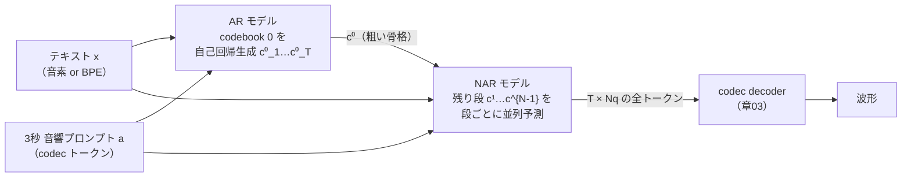

# トークンベース TTS — 音声トークンの言語モデリング (VALL-E 系)

:::abstract[学習目標]
この章を読み終えると、次のことができるようになります。

- 章03で得た **離散音声トークン** を使って、TTS が「次トークン予測」に化ける仕組みを **説明** できる
- VALL-E の **AR+NAR 二段構成**（AR が codebook 0 を自己回帰生成・NAR が残り段を段ごとに並列予測）を、入力・出力・条件まで **図解** できる
- AR の因子分解 $\prod_t P(c_t\mid c_{<t},x,a)$ と NAR の段ごと分解 $P(c^{(j)}\mid c^{(<j)},x,a)$ を **導出** し、両者がどこで時間方向 / 段方向を担うかを **区別** できる
- 2 次元トークンの並べ方（**flatten / delay pattern / VALL-E の AR+NAR**）を、系列長・並列度・依存関係で **比較** できる
- 自己回帰サンプリングの最小トイを **実装** し、繰り返し・無限ループという失敗モードと VALL-E 2 の対策を **結びつけ** られる
:::

## 前提知識

- 章03 [ニューラル音声コーデック](/audio/03-neural-audio-codecs/)：**RVQ で 1 フレーム = $N_q$ トークン**になること、**codebook 0（先頭段）が粗い骨格・上位段が細部残差**を担う階層性、**frame rate × $N_q$ = token rate**。この章の全前提です。
- 章04 [音声認識 (ASR) とストリーミング](/audio/04-asr/)：自己回帰デコード・cross-attention・KV cache・単調 (monotonic) アライメント。ASR は「音声→テキスト」、本章はその**逆向き（テキスト→音声）**で、同じ道具がほぼ反転して効きます。
- LLM の基礎：次トークン予測・cross-entropy 損失・Transformer デコーダ・温度付きサンプリング・KV cache。本章はこれらを**そのまま**音声へ持ち込みます。

LLM 出身の読者にとって、この章は **音声分野でいちばん地続きの章**です。新しい概念はほぼ無く、「音声トークンの 2 次元性をどう 1 次元の自己回帰に流し込むか」という一点だけが音声特有です。

## 直感

章03で、波形が **離散トークン列** になりました。この瞬間に何が起きるか —— それがこの章の主役です。

音声が「有限語彙のトークン列」になったなら、**TTS は「音声トークンを当てる言語モデル」になります**。テキスト LLM が「次の単語トークン」を予測するのと同じく、音声 LM は「次の音声トークン」を予測すればよい。すると、LLM のために磨かれた道具立て —— **次トークン予測・cross-entropy 損失・Transformer デコーダ・温度付きサンプリング・KV cache** —— が、**改造ほぼ無しで** TTS に流れ込みます。これが 2023 年の **VALL-E**（Microsoft）が起こしたパラダイム転換です。

VALL-E のキャッチコピーは論文題名そのもの —— *"Neural Codec Language Models are Zero-Shot Text to Speech Synthesizers"*（ニューラル codec 言語モデルはゼロショット TTS である）。**「TTS を回帰問題ではなく言語モデリングとして解く」**と言い切ったのが核心です。

そしてもう 1 つの果実が **ゼロショット話者クローン**です。LLM が「数例の文脈（in-context learning）」で新しいタスクに即応するのと同じ理屈で、VALL-E は **3 秒程度の参照音声**をプロンプトに与えるだけで、その人の声色・韻律・収録環境を保ったまま任意のテキストを喋らせます。話者ごとの再学習は要りません。「数秒の音響プロンプト = in-context の few-shot 例」と読み替えれば、LLM の知識がそのまま腑に落ちます。

:::note[なぜ「回帰」でなく「言語モデリング」が効くのか]
章02 の路線（mel スペクトログラムを連続値として回帰）も TTS を作れます。が、連続回帰は L2 損失が「平均的でぼやけた」出力に引っ張られやすく、声の細部が潰れがちでした。**離散トークンの分類（cross-entropy）**にすると、出力は「語彙の中のどれか」を選ぶ問題になり、サンプリングで多様な細部を保てます。LLM が文章生成で回帰でなく分類（次トークン予測）を選んだのと同じ理由です。連続路線の逆襲が次章 [flow-matching TTS](/audio/07-flow-matching-tts/) になります。
:::

## 全体像

本章で辿る構造を、テキスト LLM との対応で一望します。順方向（合成）と、その学習が何を最小化するかを先に掴んでください。



要点を 3 つ。

1. **入力は 2 つ**：合成したいテキスト $x$ と、声を真似たい話者の **3 秒の音響プロンプト $a$**（章03 の codec で先にトークン化済み）。
2. **2 段モデル**：**AR モデル**が RVQ の **codebook 0（時間方向に $T$ 個）を自己回帰で**生成し、**NAR モデル**が残りの段 $1 \dots N_q-1$ を**段ごとに並列で**埋めます。
3. **出力は章03 の codec へ戻す**：$T \times N_q$ の全トークンが揃ったら、章03 の **decoder が波形に戻す**。生成と波形化が一気通貫（vocoder 不要）。

LLM との対応表で橋を架けます。

:::note[LLM ↔ トークンベース TTS]
| LLM（テキスト生成） | トークンベース TTS（VALL-E） |
| --- | --- |
| 語彙 = サブワード | 語彙 = codec の codebook（章03） |
| プロンプト（文脈） | テキスト $x$ ＋ 3秒音響プロンプト $a$ |
| in-context few-shot 学習 | ゼロショット話者クローン（プロンプトで声を指定） |
| 次トークン予測 + cross-entropy | 音声トークンの次トークン予測 + cross-entropy |
| 自己回帰デコード + KV cache | **AR モデル**（codebook 0 を逐次生成）+ KV cache |
| —（1 次元なので不要） | **NAR モデル**（2 次元の残り段を並列で埋める） |
:::

最後の 2 行が音声特有の捻りです。テキストは 1 位置 1 トークンなので自己回帰 1 本で済みますが、音声は **1 フレームに $N_q$ トークンが縦積み**（章03）。この 2 次元をどう 1 次元の生成に流し込むかが設計の分かれ目で、VALL-E は「**時間方向だけ AR・段方向は NAR**」という答えを出しました。なぜその割り当てなのかを、以降で残差の階層性に遡って導きます。

## 理論

### なぜ codebook 0 だけ AR で、残りは NAR なのか

ここが章全体の心臓です。**RVQ の残差階層**（章03）を思い出してください。

- **codebook 0（第 1 段）= 粗い骨格**：最初の最近傍で、音韻・大まかな音響の「内容の背骨」を担う。**ここを間違うと何を喋っているかが崩れる**。
- **codebook 1 … $N_q-1$（上位段）= 細部残差**：声色や微細な音響ディテールを段階的に補正する。**内容は既に決まっており、品質を上げる役**。

この非対称性が、そのまま **AR / NAR の割り当て**を決めます。

- **codebook 0 は AR（自己回帰）にする**：内容の骨格は「前のフレームに強く依存」します（音素の連なり・話速・韻律は前後の文脈で決まる）。だから時間方向の依存を**逐次に**捉える自己回帰が向く。間違いが許されない背骨だからこそ、1 トークンずつ条件づけて慎重に生成します。
- **codebook 1 … は NAR（非自己回帰）にする**：内容（= codebook 0）が既に全フレーム決まっていれば、上位段は「その骨格の細部をどう埋めるか」という**相対的に局所的な補正**です。**同じ段の全フレームを並列に一気に**予測してよい。$N_q$ が 8 段あっても、AR を $N_q$ 回まわすのは遅すぎる —— NAR で段ごとに並列化すれば、追加コストは「段数 $N_q-1$ 回のフォワード」だけで済みます。

:::warning[NAR の「並列」は段方向であって時間方向ではない（最重要の誤解）]
NAR モデルが並列に予測するのは、**1 つの段 $j$ の中の全時刻 $t=1\dots T$** です。**時間方向（フレームの連なり）の依存を担っているのは AR モデルの codebook 0** であり、NAR ではありません。

- ✅ 正しい：「**時間方向**は AR（codebook 0）が逐次に解く。**段方向**を NAR が段 1→2→…→$N_q-1$ と進めるが、各段の**内部は全時刻を並列**に出す」
- ❌ 誤り：「NAR が時間方向も並列に生成する」「NAR だけで音声全体が出る」

NAR は時間軸を新しく作りません。**AR がすでに敷いた $T$ フレームの骨格の上に、細部の層を重ね塗りする**だけです。段は並列、フレームは AR 由来 —— この区別を取り違えると、後の delay pattern との比較で混乱します。
:::

:::warning[codebook 0 が「内容」・残り段が「音質」]
もう 1 つ縛っておきます。**codebook 0 = 内容の骨格（何を喋るか）**、**残り段 = 音質・音響ディテール（どう聞こえるか）**です。だから AR で codebook 0 を生成し損ねると「別の言葉になる」失敗（WER 悪化）になり、NAR の上位段がいい加減だと「内容は合っているが音がこもる」失敗（音質劣化）になります。失敗の種類が層で分かれることを覚えておくと、後でモデルのデバッグ観点が掴めます。
:::

### AR モデル：codebook 0 を自己回帰生成する

**入力**：テキスト $x$（音素列または BPE）と、3 秒音響プロンプト $a$ の **codebook 0 トークン列**。
**出力**：合成したい区間の codebook 0 トークン列 $c^{0}_{1} \dots c^{0}_{T}$ を、**1 フレームずつ左から**。
**いつ・何を使い回すか**：テキスト LLM とまったく同じ自己回帰デコードで、KV cache が効きます。1 トークン出すたびにそれを次ステップの条件に追加し、過去の key/value はキャッシュから供給します（章04 の prediction net と同じ理屈）。

学習時と推論時で、条件に入る codebook 0 の**出どころが変わる**点に注意します（teacher forcing / exposure bias、章04 と同じ構図）。

| | 学習時 | 推論時 |
| --- | --- | --- |
| 条件 $c^{0}_{<t}$ の出どころ | **正解**の codebook 0（teacher forcing） | **自分が直前に生成した**トークン |
| 損失 | 各時刻の cross-entropy（並列に計算可） | なし（生成のみ） |
| 失敗モード | —— | 誤りが累積（exposure bias）→ 繰り返し・脱落・無限ループ |

この推論時の失敗モードが、後述の VALL-E 2 の **Repetition Aware Sampling** を生んだ動機です（実装の節で実際に再現します）。

### NAR モデル：残り段を段ごとに並列予測する

**入力**：テキスト $x$、音響プロンプト $a$（全段）、そして **AR が出した codebook 0** ＋ **これまでに NAR が埋めた段 $< j$**。
**出力**：段 $j$ の**全時刻 $t=1\dots T$ を一括で** $c^{j}_{1}\dots c^{j}_{T}$。
**動作の順序**：段を $j=1, 2, \dots, N_q-1$ と**順番に**進めます。各段では全時刻を並列に出しますが、**段と段の間には依存があります**（段 $j$ は段 $0\dots j-1$ を条件に取る）。だから「全段を一度に」ではなく「段ごとに $N_q-1$ 回フォワード」です。

:::note[なぜ段方向には依存を残すのか]
RVQ は残差を積む構造（章03）でした。段 $j$ が補正するのは「段 $0\dots j-1$ を足し戻した後に残る誤差」です。だから段 $j$ の正しい値は**下位段の値に依存**します。ここを独立と仮定すると CTC（章04）と同じ「条件付き独立の罠」に落ち、品質が落ちます。VALL-E は**段方向の依存だけは残し、時間方向だけ並列化する**という折衷を選びました。AR の codebook 0（時間依存・段は 1 つ）と NAR の上位段（段依存・時間は並列）は、ちょうど依存の向きが直交しています。
:::

VALL-E では AR と NAR は**別々の Transformer**として実装されます（重み共有しない流儀が標準）。NAR は段インデックス $j$ を埋め込みなどで条件に受け取り、「いまどの段を埋めているか」を知ります。

#### NAR 推論を 1 ステップ歩く（$T=3,\ N_q=3$）

「段ごとに並列」を具体的な数で 1 ステップ追います。AR がすでに段 0 を出し終え、

$$
c^{(0)} = [\,5,\ 2,\ 7\,]
$$

（時刻 $t=0,1,2$ の codebook 0 トークンが順に 5, 2, 7）に確定したとします。残るは段 1 と段 2 です。NAR の動作は次の通り。

1. **段 1 を埋める（1 回目のフォワード）。** NAR に「テキスト $x$ ＋ 音響プロンプト $a$ ＋ 確定済みの段 0 全体 $c^{(0)}=[5,2,7]$ ＋ 段インデックス $j=1$」を渡します。NAR は **3 時刻ぶんのロジットを 1 回のフォワードで同時に**出し、各時刻を独立に argmax（or サンプル）して段 1 の全時刻を**一括確定**します。たとえば
   $$
   c^{(1)} = [\,11,\ 4,\ 19\,]
   $$
   時刻 $t=0$ の `11`・$t=1$ の `4`・$t=2$ の `19` は、**互いを条件に取らず**（段内は条件付き独立）、共通の条件 $(x,a,c^{(0)},j{=}1)$ だけから同時に出ます。これが「段内は時間並列」の正体です。

2. **段 2 を埋める（2 回目のフォワード）。** 今度は条件に **段 0 と段 1 の両方**（$c^{(<2)}=[c^{(0)},c^{(1)}]$）と段インデックス $j=2$ を渡します。また 3 時刻ぶんを 1 回で出し、一括確定します。
   $$
   c^{(2)} = [\,3,\ 28,\ 9\,]
   $$

これで $T\times N_q = 3\times3 = 9$ トークンが全部埋まりました。NAR が回したフォワードは段数ぶんの **$N_q-1 = 2$ 回だけ**（AR の段 0 は 3 回逐次）。各回で 3 トークンを並列に出すので、時間方向には一切ループしていません。

:::warning[何を条件に「一括」できるのか]
段 1 を一括に出せたのは、**段 0 が全時刻すでに確定している**からです。NAR は「段 0 が敷いた骨格 $[5,2,7]$ の上に、各時刻の細部を独立に重ねる」ので、時刻どうしの相談が要りません。逆に**段 2 は段 1 の確定を待ってから**でないと出せません（段方向の依存）。だから「段 1 と段 2 を同時に一括」はできず、**段の間だけは逐次・段の中だけ並列**——この非対称が NAR の設計そのものです。
:::

### ゼロショット話者クローンの正体

3 秒音響プロンプト $a$ は、**AR と NAR の両方で「プロンプト（接頭辞）」として条件に入ります**。LLM が few-shot 例を文脈先頭に置くのと同じく、音響プロンプトを系列の先頭に置くだけ。モデルは「この声色・この収録環境に続く自然な音声」を補完しようとし、結果として**プロンプトの話者性が合成区間にコピー**されます。

- **学習時**：1 つの発話を「前半 = プロンプト / 後半 = 予測対象」に割り、後半の codec トークンを当てるよう訓練する。これだけで、推論時に未知話者の 3 秒を与えても「続きを話者性ごと補完する」能力が育ちます（in-context learning の獲得）。
- **推論時**：未知話者の 3 秒 $a$ ＋ 喋らせたいテキスト $x$ を渡す。話者ごとの fine-tune は不要。

:::note[LLM ↔ Speech]
ゼロショット話者クローン = **音響プロンプトを使った in-context learning**。LLM が「例: …／例: …／本番:」と文脈で few-shot するのと同型です。声の埋め込みを別途学習する話者条件づけ（speaker embedding 方式）とは違い、VALL-E は**プロンプトを系列に置くだけ**で済ませます —— これが「ゼロショット」たる所以です。
:::

## 数式の導出

記号を固定します。$x$ = テキスト（音素 / BPE）、$a$ = 3 秒音響プロンプト（codec トークン）、$c_t$ = 時刻 $t$ のフレームの全 $N_q$ トークン、$c^{(j)} = (c^{(j)}_1,\dots,c^{(j)}_T)$ = 段 $j$ の全時刻トークン、$c^{(j)}_t$ = 時刻 $t$・段 $j$ の 1 トークン。$T$ = フレーム数、$N_q$ = 段数。VALL-E では段 0 を AR、段 $1\dots N_q-1$ を NAR が担います。

### AR 段の因子分解

codebook 0 の系列 $c^{(0)}_{1:T}$ を、テキスト $x$ と音響プロンプト $a$ に条件づけて生成します。自己回帰の連鎖律（chain rule）を時間方向に展開します。

ある時刻までの同時分布は、1 つ前までの条件付き分布の積に必ず分解できます（確率の連鎖律、近似なし）。

$$P(c^{(0)}_{1:T}\mid x, a)=\prod_{t=1}^{T} P\!\left(c^{(0)}_t\mid c^{(0)}_{<t},\, x,\, a\right)$$

各因子 $P(c^{(0)}_t\mid c^{(0)}_{<t}, x, a)$ を、Transformer デコーダが出す softmax 分布でモデル化します。これは**テキスト LLM の自己回帰そのもの**で、$x,a$ が文脈、$c^{(0)}_{<t}$ が「これまで生成した音声トークン」です。

学習は各時刻の **cross-entropy（負の対数尤度）**の最小化です。正解トークンを $c^{(0)\star}_t$ として、

$$\mathcal{L}_{\text{AR}}=-\sum_{t=1}^{T}\log P\!\left(c^{(0)\star}_t\mid c^{(0)\star}_{<t},\, x,\, a\right)$$

teacher forcing なので $c^{(0)\star}_{<t}$ は**正解**を使い、全時刻の損失を**並列に**計算できます（推論は逐次・学習は並列、章04 と同じ）。$\blacksquare$

### NAR 段の段ごと分解

残りの段を、段方向の連鎖律で分解します。段 $j$ は、テキスト・プロンプト・**下位の全段** $c^{(<j)}=(c^{(0)},\dots,c^{(j-1)})$ に条件づきます。

$$P(c^{(1)},\dots,c^{(N_q-1)}\mid x,a)=\prod_{j=1}^{N_q-1} P\!\left(c^{(j)}\mid c^{(<j)},\, x,\, a\right)$$

ここが AR と決定的に違う点 —— **段 $j$ の内部（時刻方向）は条件付き独立**と仮定します。つまり、

$$P\!\left(c^{(j)}\mid c^{(<j)}, x, a\right)=\prod_{t=1}^{T} P\!\left(c^{(j)}_t\mid c^{(<j)},\, x,\, a\right)$$

右辺の積は**全時刻を並列に評価できる**（$c^{(j)}_t$ どうしが互いを条件に取らない）。これが NAR の「段内は並列」の数式的な正体です。**時間方向の依存は左辺に現れず、$c^{(<j)}$ を通じて間接的に（=AR が敷いた骨格を介して）しか入りません**。

:::warning[条件付き独立はどこにかかるか]
独立を仮定したのは **同じ段 $j$ の時刻どうし**だけです。**段どうし（$j$ 方向）は独立にしていません**（$c^{(<j)}$ を条件に取る）。CTC（章04）は「全時刻が独立」で言語モデルを内部に持てませんでしたが、NAR は「段方向の依存」と「AR が担う時間方向の依存」を残すことで、その弱点を回避しています。並列化したのは段内の時間方向だけ、という限定が肝です。
:::

学習は段ごとの cross-entropy の和です。段 $j$ を埋めるとき、条件 $c^{(<j)\star}$ には**正解の下位段**を使います（teacher forcing）。

$$\mathcal{L}_{\text{NAR}}=-\sum_{j=1}^{N_q-1}\sum_{t=1}^{T}\log P\!\left(c^{(j)\star}_t\mid c^{(<j)\star},\, x,\, a\right)$$

全体の学習目的は $\mathcal{L}=\mathcal{L}_{\text{AR}}+\mathcal{L}_{\text{NAR}}$（実装上は AR・NAR を別モデルとして個別に最小化）。**どちらも cross-entropy** —— 連続値回帰でなく、LLM と同じ分類損失で TTS を学習している点を再確認してください。$\blacksquare$

### 全体の同時分布

2 つを合わせると、$T\times N_q$ トークン全体の同時分布は次のように書けます（章03 の「全 RVQ を分解」と整合）。

$$P(c_{1:T}\mid x, a)=\underbrace{\prod_{t=1}^{T} P\!\left(c^{(0)}_t\mid c^{(0)}_{<t}, x, a\right)}_{\text{AR：時間方向}}\ \times\ \underbrace{\prod_{j=1}^{N_q-1}\prod_{t=1}^{T} P\!\left(c^{(j)}_t\mid c^{(<j)}, x, a\right)}_{\text{NAR：段方向（段内は時間並列）}}$$

左の積が**時間軸**を、右の積が**段軸**を走査します。2 次元のトークン表（章03）を、AR が縦 1 行（codebook 0 を時間方向に）・NAR が残り行（段方向に下りながら各行を一括）で埋める、と読めます。$\blacksquare$

## 2 次元トークンの並べ方：3 つの流儀

VALL-E の AR+NAR は「2 次元 ($T \times N_q$) をどう生成順に流すか」の**1 つの答え**にすぎません。代表的な並べ方を対比します。これは章03 の「1 フレーム $N_q$ トークンをどう 1 次元に並べるか」の続きで、後段（次章以降）の設計を理解する地図になります。

### ① flatten（素朴に 1 列に伸ばす）

全トークンを $(t,j)$ の順で 1 本の系列に並べ、**全部を 1 つの AR** で生成します（時刻 1 の全段 → 時刻 2 の全段 → …、または段優先）。

- **長所**：実装が単純。完全な自己回帰で依存を全部捉えられる。
- **短所**：系列長が **$T \times N_q$ 倍**に膨らむ。$N_q=8$ なら 8 倍。章03 で見た通り音声は元々トークン密度が高いので、これは致命的に遅い・長文脈に弱い。

### ② delay pattern（段ごとに時間をずらす・MusicGen）

各段を**時間方向に少しずつ遅延**させて並べ、各生成ステップで**全段を 1 トークンずつ並列**に出します。段 $j$ を $j$ フレーム遅らせると、ステップ $t$ では「時刻 $t$ の段 0・時刻 $t-1$ の段 1・…」が同時に予測対象になり、**各段が常に下位段の確定値を見られる**ように整流されます。MusicGen（Meta, 音楽生成）が代表で、Moshi の RQ-Transformer も近い発想です。

- **長所**：系列長は **$T + (N_q-1)$**（ほぼ $T$）に抑えつつ、1 つの AR で段間依存も扱える。flatten の $N_q$ 倍長を避ける定石。
- **短所**：遅延ぶんの整流ロジックが要る。段数が多いと初期の遅延が無駄フレームになる。

### ③ VALL-E の AR+NAR（時間 AR・段 NAR）

本章の主役。**codebook 0 だけ時間方向に AR**、**残り段は段方向に NAR で並列**。

- **長所**：AR の系列長は $T$（codebook 0 だけ）に抑えられ、上位段は NAR で並列。内容の背骨だけ慎重に・細部は速く、という役割分担が明快。
- **短所**：AR と NAR で**2 つのモデル**が要る。NAR の段内独立仮定ぶん、delay pattern より段間の細かい相関は弱くなりうる。

:::note[対比表：2 次元トークンの並べ方]
| 並べ方 | 生成モデル | 実効系列長 | 時間方向 | 段方向 | 代表 |
| --- | --- | --- | --- | --- | --- |
| **flatten** | AR 1 本 | $T\times N_q$（最長） | AR | AR | （素朴な baseline） |
| **delay pattern** | AR 1 本（並列ヘッド） | $T+(N_q-1)$ | AR | 遅延で整流・並列 | MusicGen, Moshi 系 |
| **VALL-E AR+NAR** | AR + NAR の 2 本 | $T$（AR は段 0 のみ） | **AR**（段 0） | **NAR**（並列） | VALL-E |

共通の狙いは「**flatten の $N_q$ 倍長を避けつつ、段間の依存をどこかで残す**」こと。違いは「どこを AR にし、どこを並列にするか」の配分です。
:::

### 生成順を絵で見る（$T=3,\ N_q=3$ の同じ表を 3 通りに埋める）

言葉だけだと「どの軸を並列にしたか」がぼやけます。**同じ $T\times N_q$ のトークン表**（横 = 時刻 $t$、縦 = 段 $q$）を、3 つの並べ方が**どの順番で**埋めるかを並べて見ます。各セルの数字は **生成（確定）される順番**、色は **AR で逐次に出すもの（オレンジ）** と **NAR で並列に出すもの（ティール）**、`PAD` は delay で生じる **無駄フレーム（その時刻にはまだ出すべき中身が無い穴）** です。

**① flatten**：全 9 トークンを 1 本の AR で 1 個ずつ。系列長 $T\times N_q=9$。すべてオレンジ（全部逐次）。ここでは「時刻 → 段」の順（t0 の全段 → t1 の全段 → …）で番号を振ります。

<div class="tb-tgrid" style="grid-template-columns: 2.4rem repeat(3, minmax(2.6rem, 1fr));">
<span class="head"></span><span class="head">t0</span><span class="head">t1</span><span class="head">t2</span>
<span class="head">q0</span><span style="background:rgba(221,106,43,0.15);border-color:var(--accent-2);color:var(--accent-2);font-weight:700">1</span><span style="background:rgba(221,106,43,0.15);border-color:var(--accent-2);color:var(--accent-2);font-weight:700">4</span><span style="background:rgba(221,106,43,0.15);border-color:var(--accent-2);color:var(--accent-2);font-weight:700">7</span>
<span class="head">q1</span><span style="background:rgba(221,106,43,0.15);border-color:var(--accent-2);color:var(--accent-2);font-weight:700">2</span><span style="background:rgba(221,106,43,0.15);border-color:var(--accent-2);color:var(--accent-2);font-weight:700">5</span><span style="background:rgba(221,106,43,0.15);border-color:var(--accent-2);color:var(--accent-2);font-weight:700">8</span>
<span class="head">q2</span><span style="background:rgba(221,106,43,0.15);border-color:var(--accent-2);color:var(--accent-2);font-weight:700">3</span><span style="background:rgba(221,106,43,0.15);border-color:var(--accent-2);color:var(--accent-2);font-weight:700">6</span><span style="background:rgba(221,106,43,0.15);border-color:var(--accent-2);color:var(--accent-2);font-weight:700">9</span>
</div>

*オレンジ = AR（逐次）。9 ステップすべて 1 本の自己回帰。番号 = 生成順。*

**② delay pattern**：段 $q$ を **$q$ フレーム右にずらす**。生成ステップ $s$ では「縦 1 列ぶん（時刻のずれた全段）を 1 トークンずつ並列ヘッドで」出します。段 $q$ の時刻 $t$ は**ステップ $s=t+q$** で確定。だから各ステップ内では「下位段はすでに過去ステップで確定済み」になるよう整流されます。左下と右上に `PAD`（その時刻×段にはまだ/もう中身が無い穴）が階段状に空きます。番号 = ステップ $s$。

<div class="tb-tgrid" style="grid-template-columns: 2.4rem repeat(5, minmax(2.6rem, 1fr));">
<span class="head"></span><span class="head">s0</span><span class="head">s1</span><span class="head">s2</span><span class="head">s3</span><span class="head">s4</span>
<span class="head">q0</span><span style="background:rgba(221,106,43,0.15);border-color:var(--accent-2);color:var(--accent-2);font-weight:700">0</span><span style="background:rgba(221,106,43,0.15);border-color:var(--accent-2);color:var(--accent-2);font-weight:700">1</span><span style="background:rgba(221,106,43,0.15);border-color:var(--accent-2);color:var(--accent-2);font-weight:700">2</span><span style="color:var(--hair)">PAD</span><span style="color:var(--hair)">PAD</span>
<span class="head">q1</span><span style="color:var(--hair)">PAD</span><span style="background:rgba(221,106,43,0.15);border-color:var(--accent-2);color:var(--accent-2);font-weight:700">1</span><span style="background:rgba(221,106,43,0.15);border-color:var(--accent-2);color:var(--accent-2);font-weight:700">2</span><span style="background:rgba(221,106,43,0.15);border-color:var(--accent-2);color:var(--accent-2);font-weight:700">3</span><span style="color:var(--hair)">PAD</span>
<span class="head">q2</span><span style="color:var(--hair)">PAD</span><span style="color:var(--hair)">PAD</span><span style="background:rgba(221,106,43,0.15);border-color:var(--accent-2);color:var(--accent-2);font-weight:700">2</span><span style="background:rgba(221,106,43,0.15);border-color:var(--accent-2);color:var(--accent-2);font-weight:700">3</span><span style="background:rgba(221,106,43,0.15);border-color:var(--accent-2);color:var(--accent-2);font-weight:700">4</span>
</div>

*横軸は**生成ステップ $s$**（時刻 $t$ ではない）。各列（同一 $s$）の数字が同じ = その 1 ステップで全段を**並列ヘッド**で同時に出す。段が下がるほど右へ 1 つずれ、対角線状に流れる。実効系列長は $T+(N_q-1)=5$（$\approx T$）。*

**③ VALL-E の AR+NAR**：段 0 だけ **AR で時間方向に逐次**（オレンジ 1→2→3）。段 0 が全時刻確定したら、段 1 を **NAR で全時刻一括**（ティール、同じステップ番号 `N1`）、続けて段 2 を一括（`N2`）。AR の系列長は $T=3$、NAR は段数ぶん $N_q-1=2$ 回フォワードするだけ。

<div class="tb-tgrid" style="grid-template-columns: 2.4rem repeat(3, minmax(2.6rem, 1fr));">
<span class="head"></span><span class="head">t0</span><span class="head">t1</span><span class="head">t2</span>
<span class="head">q0</span><span style="background:rgba(221,106,43,0.15);border-color:var(--accent-2);color:var(--accent-2);font-weight:700">1</span><span style="background:rgba(221,106,43,0.15);border-color:var(--accent-2);color:var(--accent-2);font-weight:700">2</span><span style="background:rgba(221,106,43,0.15);border-color:var(--accent-2);color:var(--accent-2);font-weight:700">3</span>
<span class="head">q1</span><span class="sem">N1</span><span class="sem">N1</span><span class="sem">N1</span>
<span class="head">q2</span><span class="sem">N2</span><span class="sem">N2</span><span class="sem">N2</span>
</div>

*オレンジ = AR（段 0 を時間方向に逐次、$T=3$ ステップ）。ティール = NAR（段ごとに全時刻を**並列**、`N1`→`N2` の 2 回だけ）。同じ `N1` が横一列＝段 1 の全時刻を 1 フォワードで一括に出す、の意味。*

3 枚を見比べると違いが一目で出ます。**flatten は全マスに別々の番号**（逐次 9 ステップ）、**delay は対角線にずれて PAD の穴が階段状**（並列ヘッドだが系列は実質 $T$）、**VALL-E は段 0 だけ番号が時間方向に走り、上位段は横一列が同じ番号**（段内は完全並列）。「どこを AR の逐次にし、どこを並列に畳むか」の配分の違いが、そのまま埋め方の絵に出ています。

:::warning[delay と NAR を混同しない]
delay pattern は**全段が 1 つの AR の中で**時間をずらして生成されます（段方向もある意味 AR）。VALL-E の NAR は**段方向を別モデルで一括**に出します。「並列っぽい」点は似ていますが、delay は時間 AR の中で段をずらすだけ、NAR は段ごとに全時刻を独立出力する別モデル —— 並列化している軸が違います（delay = 段を時間にずらして 1 本に畳む / NAR = 段内の時間を並列に畳む）。
:::

## 頑健性の改良（VALL-E 2 系）と系譜

自己回帰 codec LM は、**逐次生成ゆえの不安定性**を抱えます。exposure bias（前述）により、推論時に一度妙なトークンを引くと、**繰り返し・脱落・無限ループ**へ滑り込みます。実装の節で実際にこの「無限ループ」を再現しますが、対策の流れを先に整理します。

- **VALL-E 2（2024, Microsoft）**：2 つの改良で **LibriSpeech / VCTK 上で「人間同等 (human parity)」を初めて主張**しました（あくまで特定ベンチでの主張）。
  - **Repetition Aware Sampling（繰り返し考慮サンプリング）**：直近の復号履歴の**繰り返し率**を見て、繰り返しが多ければ nucleus sampling から random sampling へ切り替え、無限ループを脱出させる。
  - **Grouped Code Modeling（コードのグループ化）**：codebook 0 トークンを数個ずつまとめて系列長を短縮し、推論を速く・長系列を安定化。
- **VALL-E X（2023）**：多言語・**言語横断クローン**（声を保ったまま別言語）と音声→音声翻訳へ拡張。
- **SpeechX（2023）**：task-dependent prompting で TTS・雑音抑圧・音声編集を**単一 codec LM に統一**（汎用音声変換器化）。
- **RALL-E / VALL-E R（2024）**：chain-of-thought 的に韻律（ピッチ・継続長）を中間予測 / 単調アライメント導入で、繰り返し・脱落を緩和。
- **HALL-E（ICLR 2025）**：低フレームレート化（最低 8Hz）で**最大 180 秒の長尺合成**を安定化。高フレームレートだとトークン列が長大化し AR が分単位を安定生成できない、という章03 由来の壁への対処。
- **BASE TTS（2024, Amazon）**：約 10 億パラメータ・10 万時間で、LLM 流のスケーリングによる**創発的能力**を観測。
- **XTTS（2024, Coqui）**：16 言語・オープンソースで普及した多言語ゼロショットクローン。

:::warning[固有名・数値は 2025–26 時点。実装前に最新を再確認]
上の年・パラメータ数・「human parity」等の主張は **2025–26 時点**の地図です。この領域は数か月で塗り替わり、離散 LM 路線から**連続生成（flow-matching）路線**やハイブリッド 2 段（AR semantic + flow acoustic, CosyVoice 2 / Seed-TTS 等）へ重心が移っています。実装前に必ず原典・最新 SOTA を引き直してください（CLAUDE.md 方針）。本章は「VALL-E という起点の論理」を固めることに集中し、最新実装の細部は追いません。
:::

## 実装

重い学習は不要です。VALL-E の AR 段の**心臓部だけ** —— 「カテゴリカル系列の自己回帰サンプリング」—— を numpy の最小トイで取り出します。本物の Transformer / codec の代わりに、**直前トークンに依存する固定の遷移行列**で「次トークン分布」を返させ、$P(c_t\mid c_{<t})$ のループだけを純粋に体感します。狙いは 2 つ：(1) AR の因子分解がコードでどう見えるか、(2) 低温度・greedy で**繰り返し・無限ループ**が本当に出ること（VALL-E 2 の Repetition Aware Sampling の動機）を自分の目で見ること。

```python title="ar_toy.py"
import numpy as np

# 「カテゴリカル系列の自己回帰サンプリング」最小トイ。
# 目的: VALL-E の AR 段 = P(c_t | c_<t, x, a) を、本物の codec/LM 抜きで体感する。
# c_t は codebook 0 のトークン (語彙 V)。条件 (x, a) の代わりに「直前トークンに依存する
# 遷移行列 A」を固定で置き、Transformer の代わりにこの A が次トークン分布を返す。
# これで「次トークン分布 → サンプリング → 系列を伸ばす」という AR ループだけを純粋に取り出す。

rng = np.random.default_rng(0)        # 再現性のため seed 固定
V = 6                                 # codebook 0 の語彙サイズ（トークン種類数）
T = 12                                # 生成するフレーム数（時間方向の長さ）

# 遷移行列 A[i, j] = P(次トークン = j | 直前トークン = i)。
# 本来は Transformer デコーダが c_<t と (x,a) から出すロジット。ここでは固定行列で代用。
logits = rng.normal(size=(V, V))
A = np.exp(logits)
A = A / A.sum(axis=1, keepdims=True)  # 各行を確率分布に正規化（行和=1）

def softmax_sample(p, temperature=1.0):
    # temperature でサンプリングの鋭さを変える（LLM と同じ）。
    # logits に戻して T で割り、再 softmax してから categorical サンプル。
    logp = np.log(p + 1e-12) / temperature
    p2 = np.exp(logp - logp.max())
    p2 = p2 / p2.sum()
    return rng.choice(len(p2), p=p2), p2

def generate(temperature=1.0, prompt=(0,)):
    # prompt = 3秒音響プロンプト a の代役（最初の数トークンを与えて続きを生成）。
    seq = list(prompt)
    for t in range(len(prompt), T):
        prev = seq[-1]                # AR: 直前までの系列に条件づける（ここでは直前1個に縮約）
        p = A[prev]                   # 次トークン分布 P(c_t | c_<t)
        nxt, _ = softmax_sample(p, temperature)
        seq.append(nxt)               # サンプルを系列に追加 → 次ステップの条件に使い回す
    return seq

# 系列の対数尤度 = Σ_t log P(c_t | c_<t)。AR 因子分解そのもの。
def seq_logprob(seq):
    lp = 0.0
    for t in range(1, len(seq)):
        lp += np.log(A[seq[t-1], seq[t]] + 1e-12)
    return lp

for temp in (0.3, 1.0):
    s = generate(temperature=temp, prompt=(0,))
    print(f"temp={temp}: seq={s}  logP={seq_logprob(s):.3f}")

# greedy（temperature→0 相当）= 各ステップで最尤トークンを取る決定的デコード
greedy = [0]
for t in range(1, T):
    greedy.append(int(A[greedy[-1]].argmax()))
print(f"greedy : seq={greedy}  logP={seq_logprob(greedy):.3f}")
```

`uv run --with numpy python ar_toy.py` の実測出力です（seed 固定なので再現します）。

```text title="出力"
temp=0.3: seq=[0, 2, 5, 5, 3, 3, 3, 3, 3, 3, 3, 1]  logP=-13.135
temp=1.0: seq=[0, 3, 0, 5, 5, 2, 5, 1, 0, 0, 2, 5]  logP=-17.820
greedy : seq=[0, 2, 1, 0, 2, 1, 0, 2, 1, 0, 2, 1]  logP=-13.035
```

読み解きます。

- **temp=0.3（低温度）**：途中から `3, 3, 3, 3, 3, 3` と**同じトークンを繰り返し**ています。これが VALL-E が実音声で起こす「**繰り返し（無音や同じ音の引き伸ばし）**」の縮図です。
- **greedy（決定的）**：`0, 2, 1, 0, 2, 1, …` と**完全な無限ループ**に落ちています。最尤だけ追うと、遷移行列の「いちばん濃い循環」に吸い込まれる —— exposure bias で推論が同じ罠を何度も踏む様子そのものです。
- **temp=1.0**：多様だが、対数尤度（`logP`）は低い（=各ステップの確率は分散）。多様性と安定性のトレードオフが数字で見えます。

:::note[トイと VALL-E 2 の対応]
この `3,3,3...` や `0,2,1,0,2,1` を実際に脱出させるのが **Repetition Aware Sampling**です。「直近 $K$ トークンの繰り返し率を見て、閾値を超えたらサンプリング方式を切り替える」—— トイで言えば「`3` が連続したら `A[3]` の nucleus でなく一様ランダムに振る」操作に当たります。繰り返しという失敗モードが**自己回帰サンプリングの構造的な性質**であること、その対策が**サンプリング側の工夫**であることが、これで腑に落ちます。
:::

:::tip[概念スケルトン：本物に寄せるなら]
本物に近づけるには、(1) `A[prev]` を「学習済み codec トークンで訓練した Transformer デコーダの softmax」に差し替え、(2) 条件にテキスト $x$ と 3 秒プロンプト $a$ を加え、(3) この AR で得た codebook 0 を固定して、NAR モデルで段 $1\dots N_q-1$ を埋め、(4) 章03 の codec decoder に通して波形化、という 4 ステップになります。学習済み codec（EnCodec / Mimi）を使えば codec 部分は学習不要で、AR/NAR の Transformer だけ訓練すれば動きます。
:::

## 演習

::::question[演習 1: AR と NAR の役割分担]
VALL-E で、合成区間が $T=300$ フレーム・段数 $N_q=8$ だとします。(a) AR モデルが自己回帰で逐次生成するトークンは全部で何個ですか。(b) NAR モデルは何回フォワードを回し、各回で何個のトークンを並列に出しますか。(c) 「NAR は時間方向も並列に生成する」は正しいですか。正しくなければ何が時間方向を担っているか答えてください。

:::details[解答]
(a) AR は **codebook 0 だけ**を時間方向に逐次生成します。$T=300$ なので **300 個**（$c^{(0)}_1\dots c^{(0)}_{300}$）。段は 1 つ（段 0）だけです。

(b) NAR は段 $j=1\dots 7$ を順に埋めるので **7 回**フォワードを回します。各回（各段）で**全時刻 $T=300$ を並列**に出すので、1 回あたり **300 個**。合計 $7\times300=2100$ 個を、AR の 300 個逐次よりはるかに少ない 7 回のフォワードで生成します。

(c) **正しくありません。** NAR が並列化しているのは「**同じ段の中の時刻方向**」だけです。**時間方向のフレームの連なり（内容の骨格）を担っているのは AR の codebook 0** です。NAR は AR がすでに敷いた 300 フレームの上に、上位段の細部を段ごとに重ね塗りするだけで、新しい時間軸を作りません。
:::
::::

::::question[演習 2: 並べ方と繰り返し]
(a) flatten・delay pattern・VALL-E AR+NAR の 3 つを、AR が背負う実効系列長で短い順に並べてください（$T$ フレーム・$N_q$ 段）。(b) 実装トイで greedy デコードが `0,2,1,0,2,1,...` の無限ループに落ちたのはなぜですか。(c) VALL-E 2 はこの種の繰り返しにどう対処しますか。それは「並べ方」の工夫ですか「サンプリング」の工夫ですか。

:::details[解答]
(a) **VALL-E AR+NAR（$T$）< delay pattern（$T+N_q-1\approx T$）< flatten（$T\times N_q$）**。VALL-E の AR は段 0 だけなので $T$、delay はほぼ $T$、flatten は全段を 1 列に伸ばすので $N_q$ 倍。flatten が最も長く、音声の高トークン密度では実用的でありません。

(b) greedy は各ステップで**最尤トークンだけ**を取るため、遷移行列 $A$ の「最も確率の濃い循環」に吸い込まれます。`0→2→1→0` が局所的に最尤の閉路になっていると、そこから二度と出られません。これは exposure bias（推論時に自分の出力を条件に使う）と決定性が組み合わさった、自己回帰の構造的な失敗です。

(c) **Repetition Aware Sampling** で対処します。直近の復号履歴の繰り返し率を監視し、閾値を超えたら nucleus sampling から random sampling へ切り替えてループを脱出させます。これは 2 次元トークンの「並べ方」ではなく、**サンプリング（デコード）側の工夫**です（並べ方は flatten/delay/AR+NAR の話、こちらは生成時にどう次トークンを選ぶかの話）。
:::
::::

## まとめ

:::success[この章の要点]
- 章03で音声が**離散トークン列**になった瞬間、TTS は「**音声トークンの言語モデリング**」に化け、LLM の道具（次トークン予測・cross-entropy・Transformer デコーダ・サンプリング・KV cache）がそのまま効く。これが **VALL-E** の核心。
- **AR+NAR 二段構成**：**AR モデル**が **codebook 0（内容の骨格）を時間方向に自己回帰生成**、**NAR モデル**が **残り段（音質）を段ごとに並列予測**。RVQ の残差階層（粗→細）が、この役割分担の根拠。
- 数式は AR の時間方向因子分解 $\prod_t P(c^{(0)}_t\mid c^{(0)}_{<t},x,a)$ と NAR の段方向分解 $\prod_j P(c^{(j)}\mid c^{(<j)},x,a)$。**NAR の並列は段内の時間方向だけ**で、時間方向の依存は AR が担う。学習はどちらも **cross-entropy**。
- **ゼロショット話者クローン** = 3 秒音響プロンプトを系列に置く **in-context learning**。話者ごとの再学習が要らない。
- 2 次元トークンの並べ方は **flatten / delay pattern / VALL-E AR+NAR** の 3 流儀。狙いは「flatten の $N_q$ 倍長を避けつつ段間依存を残す」こと。
- 自己回帰は **繰り返し・無限ループ**という失敗モードを構造的に持ち（トイで再現した）、**VALL-E 2 の Repetition Aware Sampling** がサンプリング側で対処する。
:::

### 次に学ぶこと

ここまでで**離散トークンを自己回帰で当てる路線（VALL-E 系）**の論理が手に入りました。が、この路線には弱点もあります —— 離散量子化は知覚上重要な音響細部を捨てがちで、自己回帰は逐次生成ゆえに遅く・不安定。そこで次章は**真逆のアプローチ**、連続表現を**ノイズから一括生成**する **flow-matching TTS**（F5-TTS / CosyVoice 系）へ進みます。離散 LM 路線（この章）と連続生成路線（次章）の **2 系統**を対比することで、現代 TTS の地図が完成します。

→ [Flow-matching TTS（連続生成路線）](/audio/07-flow-matching-tts/)

## 用語ミニ辞典

| 用語 | 一言 |
| --- | --- |
| VALL-E | TTS を codec トークンの言語モデリングとして解く起点（2023, Microsoft） |
| AR モデル | codebook 0（内容の骨格）を時間方向に自己回帰生成する Transformer |
| NAR モデル | 残り段（音質）を段ごとに全時刻並列で予測する Transformer |
| codebook 0 | RVQ 第 1 段。内容の背骨。間違うと「別の言葉」になる |
| 音響プロンプト $a$ | 真似たい声の 3 秒 codec トークン。in-context で話者を指定 |
| ゼロショット話者クローン | 再学習なしで 3 秒の声を真似る。プロンプト = few-shot 例 |
| flatten | 2 次元トークンを 1 列に伸ばす。系列長が $N_q$ 倍に膨らむ |
| delay pattern | 段を時間方向にずらして 1 本の AR に畳む（MusicGen / Moshi） |
| exposure bias | 推論時に自分の出力を条件に使うことで誤りが累積する現象 |
| Repetition Aware Sampling | 繰り返し率を見てサンプリング方式を切替え、ループを脱出（VALL-E 2） |
| human parity | 特定ベンチで人間録音に並ぶとされる主張（VALL-E 2） |

## 次のアクション

理論を手で定着させる。**最小の写経 → 動かす → 小実験** を 1 セットで。

1. **写経**：上の `ar_toy.py` をそのまま写経し、`uv run --with numpy python ar_toy.py` で実行する。`temp=0.3` の繰り返しと greedy の無限ループが、実測どおり再現することを自分の目で確認する。
2. **動かす**：`Repetition Aware Sampling` を簡易実装する —— 直近 $K$ トークンに同じ値が閾値以上出たら、その 1 ステップだけ `A[prev]` でなく一様分布からサンプルするよう `generate` を改造し、greedy/低温度のループが解けることを観測する。
3. **小実験**：余力があれば、学習済み **EnCodec / Mimi**（章03）で短い音声を encode し、codebook 0 トークン列だけを取り出して「これが AR が当てる対象」だと体感する。さらに NAR 段（codebook 1…）を 0 で潰すと音質がどう落ちるか（= NAR の担当が音質であること）を decode して聞き比べる。

## 参考文献

1. C. Wang, S. Chen, Y. Wu, Z. Zhang, L. Zhou, S. Liu, Z. Chen, Y. Liu, H. Wang, J. Li, L. He, S. Zhao, F. Wei, "Neural Codec Language Models are Zero-Shot Text to Speech Synthesizers (VALL-E)," 2023. arXiv:2301.02111.
2. S. Chen et al., "VALL-E 2: Neural Codec Language Models are Human Parity Zero-Shot Text to Speech Synthesizers," 2024. arXiv:2406.05370.（Repetition Aware Sampling / Grouped Code Modeling）
3. Z. Zhang et al., "Speak Foreign Languages with Your Own Voice: Cross-Lingual Neural Codec Language Modeling (VALL-E X)," 2023. arXiv:2303.03926.
4. X. Wang et al., "SpeechX: Neural Codec Language Model as a Versatile Speech Transformer," 2023. arXiv:2308.06873.
5. J. Copet, F. Kreuk, I. Gat, T. Remez, D. Kant, G. Synnaeve, Y. Adi, A. Défossez, "Simple and Controllable Music Generation (MusicGen)," *NeurIPS*, 2023. arXiv:2306.05284.（delay pattern）
6. Y. Song et al., "HALL-E: Hierarchical Neural Codec Language Model for Minute-Long Zero-Shot Text-to-Speech Synthesis," *ICLR*, 2025. arXiv:2410.04380.
7. M. Łajszczak et al., "BASE TTS: Lessons from building a billion-parameter Text-to-Speech model on 100K hours of data," Amazon, 2024. arXiv:2402.08093.
8. E. Casanova et al., "XTTS: a Massively Multilingual Zero-Shot Text-to-Speech Model," Coqui, *Interspeech*, 2024. arXiv:2406.04904.
9. （2025–26 時点。固有名・数値・human parity 等の主張は実装前に最新版で再確認すること。CLAUDE.md 方針。）
