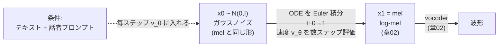
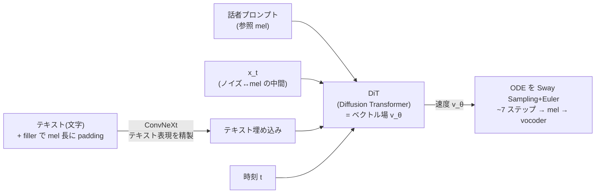

# 連続生成 TTS — diffusion から flow matching へ（F5-TTS 系）

:::abstract[学習目標]
この章を読み終えると、次のことができるようになります。

- **Conditional Flow Matching (CFM)** を、OT 直線経路 $x_t=(1-t)x_0+t x_1$・定数の目標速度 $x_1-x_0$・回帰損失の3点に分けて**説明**できる
- ネットワークが出力するのは mel ではなく **速度（ベクトル場）**であること、推論は ODE の **Euler 積分**で $x_0\to x_1$（mel）を運ぶことを**区別**できる
- **diffusion（曲がった多ステップ）と flow matching（直線・少ステップ）の違い**を、軌道の形と必要ステップ数で**対比**できる
- **F5-TTS** が完全非自己回帰・DiT がベクトル場・text infilling で duration/alignment 不要・Sway Sampling で約7ステップになる仕組みを**列挙**できる
- numpy だけの 2D トイで CFM を学習し、**損失が下がること**と**少ステップ Euler でデータに近づくこと**を**実測**で確かめられる
:::

## 前提知識

- 章02 [周波数とスペクトル特徴量](/audio/02-frequency-and-features/)：**log-mel** spectrogram（この章の生成ターゲット）と、mel から波形へ戻す **vocoder**（この章の出口）
- 章06 [トークンベース TTS（VALL-E 系）](/audio/06-token-based-tts/)：TTS を「離散 codec トークンの自己回帰生成」として解く流儀。この章は**その対極**——連続表現を**一括（非自己回帰）**で生成する——を扱います
- 確率の基礎：ガウス分布 $\mathcal N(0,I)$、期待値 $\mathbb E[\cdot]$、サンプリング
- 微積分の基礎：常微分方程式（ODE）$dx/dt=v$ と、それを Euler 法で数値的に解くこと

LLM 出身の読者へ。章06 の VALL-E は「次トークンを自己回帰で当てる」LLM そのものでした。この章は**生成のパラダイムが変わります**。「ノイズを少しずつデータへ動かす連続な流れ」を学ぶので、自己回帰の直感はいったん脇に置いてください。代わりに「**ノイズ画像を1枚、数ステップで絵に変える image diffusion**」を思い浮かべると橋が架かります。

## 直感

章06 の VALL-E 系は、音声を **codec トークン**に離散化し、テキストを条件に**1トークンずつ自己回帰**で予測しました。これは強力ですが、(1) 逐次生成ゆえの不安定さ（繰り返し・脱落）、(2) 離散化で**知覚上重要な音響の細部が落ちる**、という弱点を抱えます。

別の発想があります。音声を離散化せず、**連続な log-mel をまるごと一気に作る**。テキストと話者プロンプトを条件に、**ランダムノイズから mel へ「流して」運ぶ**——これが非自己回帰・連続生成 TTS です。逐次ループが無いので並列に速く、連続表現なので細部が落ちません。

問題は「どう運ぶか」です。素朴には「ノイズ → mel」を1発で当てたいですが、分布が複雑すぎて1発回帰は難しい。そこで **時間 $t$ を $0\to1$ と刻み、ノイズを少しずつデータへ動かす連続な流れ（flow）**を学びます。最初に流行ったのが **diffusion**、いま主流になったのが **flow matching** です。両者の差は一言、「**運ぶ道がまっすぐか曲がっているか**」。まっすぐな道なら少ないステップで着くので速い——これがこの章の心臓です。本章は音声ロードマップの **目標②（flow-matching TTS）** にあたります。

## 全体像

非自己回帰・連続生成 TTS の往復を1枚で見ます。**実線が推論（生成）方向**、注記が**学習でやること**です。



学習時と推論時で**やることが反転**します。ここを最初に掴むのが肝心です。

| | 学習時（training） | 推論時（inference） |
| --- | --- | --- |
| 入力 | データ $x_1$（本物の mel）とノイズ $x_0$ の**両方** | ノイズ $x_0$ **だけ** |
| 何をする | 経路上の点 $x_t$ で**速度を回帰**（教師あり） | 速度を頼りに ODE を**積分して $x_1$ を作る** |
| ネットの役割 | 目標速度 $x_1-x_0$ を**当てる** | 学んだ速度場で**ノイズを運ぶ** |
| $x_1$ は | **既知**（教師信号） | **未知**（これを生成する） |

:::warning[ネットワークは mel を出力しません]
最大の誤解です。速度場ネットワーク $v_\theta$ が出すのは **mel そのものではなく「速度（ベクトル場）」**——「いまこの点 $x_t$ を、どの向きにどれだけ動かせばデータへ近づくか」です。mel は、その速度に従って **ODE を時刻 $0\to1$ まで積分した結果**として初めて現れます。「ネットが mel を吐く」ではなく「ネットが運び方を教え、積分が mel を作る」。この一文を取り違えると全部ずれます。
:::

解き方の本筋は2系統です。**diffusion**（曲がった経路・多ステップ）と **flow matching**（直線経路・少ステップ）。以降、flow matching を主役に、diffusion との差を対比しながら降りていきます。

## 理論

### 連続な流れ（flow）とベクトル場

まず「流れ」を定義します。各時刻 $t\in[0,1]$ と各点 $x$ に**速度ベクトル** $v_t(x)$ を割り当てた場 $v$（**ベクトル場**, vector field）を考えます。点 $x$ をこの速度に従って動かす規則が ODE です。

$$\frac{d}{dt}\,x_t = v_t(x_t),\qquad x_0\sim p_0$$

- $x_t$：時刻 $t$ における点の位置。$x$ と同じ形（TTS なら log-mel と同じ `[n_mels, フレーム数]` の連続テンソル）。
- $v_t(x_t)$：時刻 $t$・位置 $x_t$ での**速度**。「次の一瞬でどっちへどれだけ動くか」。これをニューラルネット $v_\theta$ で表します。
- $p_0$：出発点の分布。**標準ガウス $\mathcal N(0,I)$** にとります（サンプリングが容易だから）。
- ゴール：$t=0$ で $p_0=\mathcal N(0,I)$、$t=1$ で $p_1=p_\text{data}$（本物の mel の分布）になるような $v$ を学ぶこと。

:::note[LLM ↔ flow]
LLM のデコードは「離散トークンを1つずつ」進める**離散時間・自己回帰**でした。flow は「連続ベクトルを少しずつ」動かす**連続時間・非自己回帰**です。共通点は「条件（テキスト）を毎ステップ見ながら反復する」こと。違いは、動かす対象が**離散トークン**か**連続な点**か、ステップが**系列方向**か**ノイズ→データの時間方向 $t$**か、です。
:::

### 中心の難所と、それを回避するトリック（CFM）

学びたいのは「$\mathcal N(0,I)$ 全体を $p_\text{data}$ 全体へ運ぶ」ベクトル場 $u_t(x)$（**周辺ベクトル場**, marginal vector field）です。これを直接回帰する素朴な損失は

$$\mathcal L_\text{FM}(\theta)=\mathbb E_{t,\,x\sim p_t}\big\|v_\theta(x,t)-u_t(x)\big\|^2$$

ですが、**$u_t(x)$ を計算できません**。「点 $x$ を通る全経路を足し合わせた平均速度」で、全データにわたる積分が必要だからです。ここが diffusion/flow 系すべての関門でした。

突破口が **Conditional Flow Matching (CFM)** です。アイデアは「**1個のデータ点 $x_1$ に条件づけた経路なら、速度を手で書ける**」。各 $x_1$ に対し「ノイズ $x_0$ から $x_1$ へ向かう経路」を1本決め、その**条件付き速度** $u_t(x\mid x_1)$ を回帰します。

$$\mathcal L_\text{CFM}(\theta)=\mathbb E_{t,\,x_1\sim p_\text{data},\,x\sim p_t(\cdot\mid x_1)}\big\|v_\theta(x,t)-u_t(x\mid x_1)\big\|^2$$

決定的な事実（Lipman 2022 の核心定理）：**$\mathcal L_\text{FM}$ と $\mathcal L_\text{CFM}$ は $\theta$ について同じ勾配を持つ**。だから計算できない $u_t(x)$ を、計算できる $u_t(x\mid x_1)$ で置き換えてよい。証明の骨子は数式の節で導きます。

:::note[なぜ「条件付き」で済むのか（直感）]
$x$ を通る経路は無数にありますが、回帰の最適解は「その点を通る全経路の**平均速度**」になります。$x_1$ をランダムに引いて条件付き速度を当て続ければ、ネットは自動的にその**平均**を学ぶ——だから「全経路の平均（＝計算できない $u_t(x)$）」を、明示的に計算せずに獲得できます。LLM の cross-entropy が「正解トークン1個」を教えるだけで分布全体を学ぶのと同じ構図です。
:::

### OT 直線経路：道をまっすぐにする

経路の決め方には自由度があります。flow-matching TTS の定番が **最適輸送（OT, optimal transport）に対応する直線経路**です。ノイズ $x_0\sim\mathcal N(0,I)$ とデータ $x_1$ を**まっすぐ線形補間**します。

$$x_t=(1-t)\,x_0+t\,x_1,\qquad x_0\sim\mathcal N(0,I),\ \ x_1\sim p_\text{data}$$

- $t=0$ で $x_0$（ノイズ）、$t=1$ で $x_1$（データ）。途中は2点を結ぶ**直線**上を等速で進みます。
- この経路の速度は時間微分で出ます。$x_t$ を $t$ で微分すると $-x_0+x_1$。

$$u_t(x_t\mid x_1)=\frac{d}{dt}\,x_t=x_1-x_0$$

ここが効きます。**目標速度が $x_1-x_0$ という $t$ に依らない定数**になる。経路が直線だから「向きと速さが途中で変わらない」のです。CFM 損失は具体的に

$$\boxed{\ \mathcal L=\mathbb E_{t,\,x_0,\,x_1}\big\|v_\theta(x_t,t)-(x_1-x_0)\big\|^2\ }$$

「ノイズとデータを引いた差ベクトルを、経路上の点で当てる」だけ。実装は驚くほど単純です（後述）。なお、Rectified Flow（Liu 2022）も同じ直線補間 $X_t=(1-t)X_0+tX_1$ と目標 $X_1-X_0$ を使い、本質的に等価です。

:::warning[目標速度が「定数」とは、どの意味で定数か]
$x_1-x_0$ が**定数**なのは「**1本の経路（$x_0,x_1$ を固定）の上では、時刻 $t$ に依らず速度が一定**」という意味です。**経路が違えば速度は違います**（$x_0,x_1$ が変われば $x_1-x_0$ も変わる）。だからネット $v_\theta(x_t,t)$ は「いる場所 $x_t$ と時刻 $t$ から、その点を通る経路たちの**平均の差ベクトル**」を出す非自明な関数です。「全部同じベクトルを出す」わけではありません。
:::

### diffusion との違い：曲がった道 vs まっすぐな道

diffusion も「ノイズ→データの流れ」を学びます。何が違うのか。diffusion は経路を**ノイズを徐々に加える（または除く）拡散過程**で定義するため、ノイズ→データの軌道が**曲がります**。曲がった道は、Euler 法のような直線近似でショートカットすると大きく外れるので、**多ステップ（数十〜数百回）**刻まないと正確に辿れません。

flow matching の OT 経路は**最初から直線**。直線なら Euler 法（各ステップで現在の速度方向へ直進）の**離散化誤差がほぼゼロ**。だから**少ステップ（時に1ステップ）**で着きます。

| | diffusion | flow matching（OT 経路） |
| --- | --- | --- |
| 経路の定義 | 拡散過程（ノイズ付加/除去） | ノイズ→データの**直線補間** |
| 軌道の形 | **曲がっている** | **まっすぐ** |
| 目標 | スコア（or ノイズ）を予測 | **速度** $x_1-x_0$ を予測 |
| Euler の離散化誤差 | 大きい（曲線を直線で近似） | **ほぼゼロ**（直線を直線で近似） |
| 必要ステップ数 (NFE) | 多い（数十〜数百） | **少ない**（数〜十数、時に1） |
| 学習 | ノイズ準位ごとの denoising 回帰 | 速度の回帰（シミュレーションフリー） |

:::warning[flow matching は diffusion の「特殊形」ではありません]
よくある誤解。「flow matching は diffusion を少しいじったもの」ではありません。**逆**です。Flow Matching は「任意の確率経路に沿ったベクトル場を回帰する」より一般の枠組みで、**diffusion を特殊ケースとして含みます**（diffusion 経路を選べば diffusion 相当になる）。そのうえで flow matching は、diffusion が選べなかった **OT 直線経路**を選べる。だから「diffusion の特殊形」ではなく「**まっすぐな経路を直接学ぶ、より広い枠組み**」と捉えてください。
:::

### TTS への接続：何を条件に、何を生成するか

ここまでは「ノイズ→データ」一般論でした。TTS にするには、ベクトル場を**条件付き** $v_\theta(x_t,t,c)$ にします。

- 生成ターゲット $x_1$ = **log-mel spectrogram**（章02）。形は `[n_mels, フレーム数]` の連続テンソル。
- 条件 $c$ = **テキスト**（何を喋るか）＋ **話者プロンプト**（数秒の参照音声、誰の声か）。**毎ステップ** $v_\theta$ に入れます。
- 出口：生成した mel を **vocoder（章02）**に通して波形にします。flow matching が作るのは mel まで、波形は vocoder の担当——この分業を忘れないこと。

学習と推論の流れを並べます。

1. **学習**：本物の mel $x_1$ とそのテキスト・話者を用意 → ノイズ $x_0$ と時刻 $t$ をサンプル → $x_t=(1-t)x_0+tx_1$ を作る → $v_\theta(x_t,t,c)$ が $x_1-x_0$ を当てるよう回帰。$x_1$ が**教師信号**として使われる（teacher forcing 的）。
2. **推論**：ノイズ $x_0\sim\mathcal N(0,I)$ から開始 → 条件 $c$ を入れて $v_\theta$ を数ステップ評価し ODE を Euler 積分 → $t=1$ で $x_1$（mel）→ vocoder で波形。$x_1$ は**最初は未知**で、積分の結果として現れる。

:::note[学習時 vs 推論時（最重要の差）]
学習時は $x_1$（正解 mel）が**手元にあり**、それを使って経路 $x_t$ を作り速度を教えます。推論時は $x_1$ が**無い**——ノイズだけから、学んだ速度場を信じて積分し $x_1$ を**作り出します**。「正解を見ながら速度を覚える（学習）」→「正解なしで速度を頼りに進む（推論）」。ASR/LLM の teacher forcing と exposure bias の対応物がここにもあります。
:::

## 数式の導出

CFM の核心定理「**$\mathcal L_\text{FM}$ と $\mathcal L_\text{CFM}$ の勾配が一致する**」を、なぜそうなるかまで辿ります。これがあるから「計算できない $u_t(x)$」を「計算できる $u_t(x\mid x_1)$」に置換できます。

**設定。** 各データ $x_1$ に条件付き確率経路 $p_t(x\mid x_1)$ と条件付き速度 $u_t(x\mid x_1)$ を定めます（OT なら $x_t=(1-t)x_0+tx_1$ で誘導される分布と、速度 $x_1-x_0$）。周辺分布と周辺速度を

$$p_t(x)=\int p_t(x\mid x_1)\,p_\text{data}(x_1)\,dx_1,\qquad u_t(x)=\int u_t(x\mid x_1)\,\frac{p_t(x\mid x_1)\,p_\text{data}(x_1)}{p_t(x)}\,dx_1$$

で定義します。$u_t(x)$ は「点 $x$ を通る経路たちの、$x$ で条件づけた**平均速度**」です（積分が重く、直接は計算できない）。

**ステップ1：二乗を展開する。** FM 損失の被積分を展開します（$t$ と $x\sim p_t$ の期待値の中身）。

$$\big\|v_\theta(x,t)-u_t(x)\big\|^2=\|v_\theta\|^2-2\,\langle v_\theta,\,u_t(x)\rangle+\|u_t(x)\|^2$$

$\theta$ に依存するのは第1項と第2項だけ（第3項は定数）。同様に CFM 損失も

$$\big\|v_\theta(x,t)-u_t(x\mid x_1)\big\|^2=\|v_\theta\|^2-2\,\langle v_\theta,\,u_t(x\mid x_1)\rangle+\|u_t(x\mid x_1)\|^2$$

第1項 $\|v_\theta\|^2$ は両者で**同一**（$x\sim p_t$ の期待値で一致）。問題はクロス項です。

**ステップ2：クロス項が一致することを示す。** FM 側のクロス項の期待値を、$u_t(x)$ の定義を代入して書き下します。

$$\mathbb E_{x\sim p_t}\big[\langle v_\theta(x,t),\,u_t(x)\rangle\big]=\int p_t(x)\Big\langle v_\theta,\ \int u_t(x\mid x_1)\frac{p_t(x\mid x_1)p_\text{data}(x_1)}{p_t(x)}dx_1\Big\rangle dx$$

$p_t(x)$ が約分されます。

$$=\iint \big\langle v_\theta(x,t),\,u_t(x\mid x_1)\big\rangle\,p_t(x\mid x_1)\,p_\text{data}(x_1)\,dx_1\,dx=\mathbb E_{x_1,\,x\sim p_t(\cdot\mid x_1)}\big[\langle v_\theta,\,u_t(x\mid x_1)\rangle\big]$$

これは **CFM 側のクロス項そのもの**です。よって両損失は「$\theta$ に依存する部分（$\|v_\theta\|^2$ とクロス項）」が完全に一致し、差は $\theta$ に依らない定数（第3項）だけ。したがって

$$\nabla_\theta\,\mathcal L_\text{FM}(\theta)=\nabla_\theta\,\mathcal L_\text{CFM}(\theta)$$

**ステップ3：OT 経路を代入する。** $x_t=(1-t)x_0+tx_1$ なら $u_t(x_t\mid x_1)=x_1-x_0$。$x\sim p_t(\cdot\mid x_1)$ のサンプルは $x_0\sim\mathcal N(0,I)$ を引いて $x_t$ を作るだけ。最終的に実装する損失は

$$\mathcal L=\mathbb E_{t\sim U(0,1),\,x_0\sim\mathcal N(0,I),\,x_1\sim p_\text{data}}\big\|v_\theta\big((1-t)x_0+tx_1,\ t\big)-(x_1-x_0)\big\|^2$$

計算できない $u_t(x)$ は消え、**サンプリングできる量だけ**が残りました。これが「シミュレーションフリー（ODE を解かずに学習できる）」の正体です。$\blacksquare$

:::warning[損失は 0 まで下がりません]
$\mathcal L$ の最小値は **0 ではありません**。最適解は $v_\theta(x_t,t)=\mathbb E[x_1-x_0\mid x_t,t]$（条件付き平均）ですが、同じ $x_t$ を通る経路は複数あり、$x_1-x_0$ はその平均のまわりに**ばらつきます**。この**条件付き分散**が下限として残ります（後の実装で、損失が 0 でなく一定値に**プラトー**するのを実測します）。「損失が下がりきらない＝失敗」ではありません。
:::

## 推論：ODE を Euler で積分する

学んだ $v_\theta$ で、ノイズから mel を作ります。ODE $dx/dt=v_\theta(x_t,t,c)$ を $t:0\to1$ で**前進 Euler 法**で解きます。ステップ数 $N$、刻み幅 $\Delta t=1/N$ として

$$x_{t+\Delta t}=x_t+\Delta t\cdot v_\theta(x_t,\,t,\,c)$$

を $N$ 回繰り返すだけです。

1. $x\leftarrow x_0\sim\mathcal N(0,I)$、$t\leftarrow 0$
2. $v\leftarrow v_\theta(x,t,c)$（条件 $c$ を入れて速度を1回評価）
3. $x\leftarrow x+\Delta t\cdot v$、$t\leftarrow t+\Delta t$
4. $t<1$ なら 2 へ。$t=1$ で $x$ が mel $x_1$

**NFE（Number of Function Evaluations）** = この $v_\theta$ 評価回数 = $N$。直線経路なら $N$ が小さくても誤差が小さい——これが「少ステップで速い」の実体です。実時間係数 **RTF（処理時間÷音声長）** は NFE にほぼ比例するので、ステップを減らすほど RTF が下がります。

:::tip[Classifier-Free Guidance (CFG)]
推論時、条件あり $v_\theta(x,t,c)$ と条件なし $v_\theta(x,t,\varnothing)$ を線形結合し $\tilde v=(1+w)v_\theta(x,t,c)-w\,v_\theta(x,t,\varnothing)$ とすると、テキスト追従と話者類似度が上がります（$w$ は guidance 強度）。代償として NFE が **2倍**になります（条件あり/なしを各ステップ評価）。LLM の温度や CFG 画像生成と同じ「条件への効き具合のつまみ」です。
:::

## F5-TTS：この枠組みの実装（2024）

ここまでの理論を、ほぼそのまま製品レベルにしたのが **F5-TTS**（Chen ら, 2024）です。MIT ライセンスで公開され、flow-matching TTS の事実上の定番になりました。要点を分解します。



- **完全非自己回帰（NAR）**。系列を1パスで処理し、逐次ループが無い。VALL-E の繰り返し・脱落（章06）が原理的に起きません。
- **DiT がベクトル場**。バックボーンは **Diffusion Transformer**（U-Net でなく Transformer）。入力は「現在の点 $x_t$ ＋ 時刻 $t$ ＋ テキスト埋め込み ＋ 話者プロンプト」、出力は**速度 $v_\theta$**。前述どおり mel ではなく速度を出す点に注意。
- **text infilling で duration/alignment 不要**。これが効きます。従来 TTS は「各文字が何フレーム続くか（duration）」を別モデルで予測し、文字とフレームの**アライメント**を取っていました。F5-TTS は前身 **E2-TTS** の発想を継ぎ、**文字列を filler トークンで mel の長さまで水増しし、「穴埋め（infilling）」として mel を生成**します。どの文字がどこに対応するかは DiT が**自分で**学ぶので、**duration 予測器も G2P もアライメント探索も要りません**（章04 の ASR が苦労したアライメント問題を、TTS 側は infilling で回避する形です）。
- **ConvNeXt でテキストを整える**。文字埋め込みを ConvNeXt ブロックで前処理し、DiT が使いやすい表現に精製します。
- **Sway Sampling で約7ステップ**。Euler 積分の**時刻の刻み方**を工夫する推論時テクニック。$t$ を等間隔でなく、生成が難しい序盤（$t$ が小さくノイズが支配的な領域）に評価点を寄せる（sway させる）ことで、**少ない NFE でも品質を保ちます**。これで **約7ステップ・RTF ~0.03** 級（GPU・1ストリーム条件下の概数）を達成します。

:::note[F5-TTS の系譜（2025–26 時点・実装前に最新を再確認）]
Flow Matching の理論は **Lipman 2022 / Rectified Flow（Liu 2022）**。TTS への最初期適用が **Matcha-TTS（OT-CFM, 2023）**、大規模化が **Voicebox（Meta, 2023, FM で音声 infilling）**。アライメント全廃の **E2-TTS（Microsoft, 2024）**を、DiT＋ConvNeXt＋Sway Sampling で高速・高品質化したのが **F5-TTS（2024）**。RTF や所要ステップ数は実装・ハード・設定で大きく変わるので、**概数**として読み、実装前に原典・最新版を引き直してください（CLAUDE.md 方針）。
:::

### streaming への布石：chunk-aware causal flow matching

この章の flow matching は「mel 全体を一括生成」する**非ストリーミング**です。一方 **CosyVoice 2**（Alibaba, 2024）は、LM が semantic トークンを自己回帰生成し、**chunk-aware causal flow matching** が音響を生成する2段ハイブリッドで、**塊（chunk）ごとに因果的に**mel を作って低遅延 streaming を実現します。「未来を見ない（causal）」「塊単位で出す（chunk）」は章04 の streaming ASR と同じ発想です。この streaming 化は次章で扱います。

## 実装

理論を numpy だけで確かめます。重い TTS は動かさず、**2D トイ**で CFM の本質——(1) **損失が下がる**、(2) **少ステップ Euler でデータに近づく**——を**実測**します。mel の代わりに 2D の点、テキスト条件は省いた最小形です。

```python title="cfm_toy.py"
import numpy as np

rng = np.random.default_rng(0)

# ---- データ分布 x1: 2D の2クラスタ(簡単なターゲット) ----
centers = np.array([[2.0, 1.0], [-2.0, -1.0]])
def sample_data(n):
    k = rng.integers(0, 2, size=n)
    return centers[k] + 0.35 * rng.standard_normal((n, 2))

# ---- 速度場 v_theta: 小さな MLP (numpy 手書き) ----
# 入力 (x_t[2], t[1]) -> 出力 速度[2]。mel の代わりに 2D 点を出す
D_in, D_h, D_out = 3, 64, 2
def init_params():
    s = 1.0 / np.sqrt(D_h)
    return {
        "W1": rng.standard_normal((D_in, D_h)) / np.sqrt(D_in), "b1": np.zeros(D_h),
        "W2": rng.standard_normal((D_h, D_h)) * s,              "b2": np.zeros(D_h),
        "W3": rng.standard_normal((D_h, D_out)) * s,            "b3": np.zeros(D_out),
    }

def forward(p, x, t):
    h0 = np.concatenate([x, t], axis=1)         # [x_t, t] を結合して入力に
    z1 = h0 @ p["W1"] + p["b1"]; a1 = np.tanh(z1)
    z2 = a1 @ p["W2"] + p["b2"]; a2 = np.tanh(z2)
    v  = a2 @ p["W3"] + p["b3"]                  # 出力は速度(mel ではない)
    return v, (h0, z1, a1, z2, a2)

def backward(p, cache, dv):                      # 損失の勾配を手計算で逆伝播
    h0, z1, a1, z2, a2 = cache
    g = {}
    g["W3"] = a2.T @ dv; g["b3"] = dv.sum(0)
    dz2 = (dv @ p["W3"].T) * (1 - a2**2)
    g["W2"] = a1.T @ dz2; g["b2"] = dz2.sum(0)
    dz1 = (dz2 @ p["W2"].T) * (1 - a1**2)
    g["W1"] = h0.T @ dz1; g["b1"] = dz1.sum(0)
    return g

# ---- 学習: CFM 損失を最小化 ----
p = init_params()
N, lr = 512, 0.02
run_avg = None
print("=== CFM 損失の推移(直近500stepの移動平均) ===")
for step in range(1, 4001):
    x1 = sample_data(N)                  # データ x1
    x0 = rng.standard_normal((N, 2))     # ノイズ x0~N(0,I)
    t  = rng.uniform(0, 1, size=(N, 1))  # 時刻 t~U(0,1)
    xt = (1 - t) * x0 + t * x1           # OT 直線経路上の点
    target = x1 - x0                     # 目標速度 = 定数(この経路上で t に依らない)
    v, cache = forward(p, xt, t)
    diff = v - target
    loss = np.mean(np.sum(diff**2, axis=1))      # CFM 損失
    g = backward(p, cache, (2.0 / N) * diff)     # d loss / d v = 2(v-target)/N
    for k in p:
        p[k] -= lr * g[k]                         # 勾配降下
    run_avg = loss if run_avg is None else 0.99 * run_avg + 0.01 * loss
    if step == 1 or step % 500 == 0:
        print(f"step {step:5d}  loss(移動平均) = {run_avg:.4f}")

# ---- 推論: ODE dx/dt=v を前進 Euler で積分 (t:0->1) ----
def euler_sample(p, x0, n_steps):
    x, dt = x0.copy(), 1.0 / n_steps
    for i in range(n_steps):
        t = np.full((x.shape[0], 1), i * dt)
        v, _ = forward(p, x, t)          # 速度を1回評価 = NFE 1回ぶん
        x = x + dt * v                   # その向きへ dt だけ直進
    return x

def mean_dist_to_centers(x):             # 生成点が本物の中心にどれだけ近いか
    d = np.sqrt(((x[:, None, :] - centers[None, :, :]) ** 2).sum(-1))
    return d.min(1).mean()

x0_eval = rng.standard_normal((2000, 2))
print("\n=== Euler ステップ数(=NFE) vs 生成品質(最寄り中心までの平均距離) ===")
for ns in [1, 2, 4, 8, 16, 32]:
    xg = euler_sample(p, x0_eval, ns)
    print(f"steps={ns:3d}  平均距離 = {mean_dist_to_centers(xg):.4f}")
print(f"\n(参考) 真のデータ自身の中心までの平均距離 = "
      f"{mean_dist_to_centers(sample_data(2000)):.4f}  <- 下限の目安")
```

実行は次のとおり。**実測出力**を併記します（乱数 seed 固定なので再現します）。

```bash title="実行"
uv run --with numpy python cfm_toy.py
```

```text title="出力（実測）"
=== CFM 損失の推移(直近500stepの移動平均) ===
step     1  loss(移動平均) = 7.2146
step   500  loss(移動平均) = 3.7926
step  1000  loss(移動平均) = 3.6129
step  1500  loss(移動平均) = 3.5365
step  2000  loss(移動平均) = 3.5143
step  2500  loss(移動平均) = 3.5310
step  3000  loss(移動平均) = 3.4496
step  3500  loss(移動平均) = 3.4428
step  4000  loss(移動平均) = 3.4730

=== Euler ステップ数(=NFE) vs 生成品質(最寄り中心までの平均距離) ===
steps=  1  平均距離 = 2.0448
steps=  2  平均距離 = 0.9302
steps=  4  平均距離 = 0.5056
steps=  8  平均距離 = 0.4346
steps= 16  平均距離 = 0.4170
steps= 32  平均距離 = 0.4131

(参考) 真のデータ自身の中心までの平均距離 = 0.4386  <- 下限の目安
```

読み取れること（理論どおり）。

- **CFM 損失が下がる**：$7.21\to 3.47$ へ単調に減り、その後**プラトー**します。0 に行かないのは前述の**条件付き分散の下限**のため（同じ $x_t$ を通る $x_1-x_0$ がばらつく）。実際、最適速度＝条件付き平均からの残差分散を別途見積もると **≈3.34** で、プラトー値とほぼ一致します。「下がりきらない＝失敗」ではない、を実測が裏づけます。
- **少ステップで近づく**：1 ステップでは平均距離 2.04（まだ遠い）、しかし **2→4→8 で 0.93→0.51→0.43** と急速に縮み、**8 ステップで真のデータの下限 0.44 にほぼ到達**します。それ以上ステップを増やしても 0.41 でほとんど変わりません。**直線経路だから少ステップで十分**——F5-TTS が約7ステップで済むのと同じ理屈が、このトイで再現されています。

:::note[トイ ↔ 本物の TTS]
このトイの「2D の点」を「`[n_mels, フレーム数]` の log-mel」に、「2クラスタ」を「本物の音声 mel の分布」に、「条件なし」を「テキスト＋話者プロンプト」に置き換え、MLP を DiT にすれば、構造は F5-TTS とまったく同じです。**損失（$x_1-x_0$ の回帰）も推論（Euler 積分）も1行も変わりません**。違いは規模と条件付けだけ。
:::

## 演習

::::question[演習 1: 目標速度と Euler 1 ステップ]
OT 経路 $x_t=(1-t)x_0+tx_1$ を使う CFM を考えます。ある経路で $x_0=(1,0)$、$x_1=(4,3)$ とします。(a) この経路上の目標速度 $u_t$ を求めなさい。(b) それは $t$ に依存しますか。(c) もし学習が完璧で $v_\theta(x_t,t)=u_t$ を返すなら、$x_0$ から **1 ステップ**の Euler 積分（$N=1,\ \Delta t=1$）で得られる点はどこですか。(d) 一般の曲がった経路では、なぜ 1 ステップでは正しい終点に着かないのですか。

:::details[解答]
(a) $u_t=\dfrac{d}{dt}x_t=x_1-x_0=(4,3)-(1,0)=(3,3)$。
(b) **依存しません**。OT 経路は直線で、速度は経路上で一定（$x_1-x_0$ は $t$ を含まない）。
(c) 1 ステップ Euler は $x_0+\Delta t\cdot v=(1,0)+1\cdot(3,3)=(4,3)=x_1$。**1 ステップで正確に終点に到達**します（直線を直線で近似するので誤差ゼロ）。
(d) 曲がった経路では速度が途中で**向きを変える**のに、Euler 1 ステップは「出発点の速度方向へまっすぐ」進むだけなので、カーブを突き抜けて終点を外します。正確に辿るには細かく刻む（多ステップ）必要があり、これが diffusion が多ステップを要する理由です。
:::
::::

::::question[演習 2: ネットは何を出すか・学習と推論の差]
flow-matching TTS について答えなさい。(a) 推論時、ネットワーク $v_\theta$ が各ステップで出力するのは mel ですか、速度ですか。mel はどこで得られますか。(b) 学習時に必要な入力と、推論時に必要な入力はそれぞれ何ですか（$x_0,x_1$ のどちらが要るか）。(c) F5-TTS が duration 予測器もアライメントも持たずに済むのはなぜですか。

:::details[解答]
(a) 出力は**速度（ベクトル場）**です。mel ではありません。mel は、その速度に従って ODE を $t:0\to1$ まで **Euler 積分した結果**として $t=1$ で得られます（さらに vocoder で波形に）。
(b) **学習時**：データ $x_1$（本物の mel）と ノイズ $x_0$ の**両方**が要る（$x_t=(1-t)x_0+tx_1$ を作り、目標 $x_1-x_0$ を教えるため）。**推論時**：ノイズ $x_0$ **だけ**。$x_1$ はこれから生成する未知の量です。
(c) **text infilling** だからです。文字列を filler トークンで mel の長さまで水増しし、mel を「穴埋め」として一括生成するので、「各文字が何フレーム続くか（duration）」「どの文字がどのフレームか（alignment）」を DiT が内部で学びます。だから別の duration 予測器も G2P もアライメント探索も不要になります。
:::
::::

## まとめ

:::success[この章の要点]
- 非自己回帰・連続生成 TTS は、音声を離散化せず **ノイズ $x_0\sim\mathcal N(0,I)$ から log-mel $x_1$ を一括で「流して」運ぶ**。逐次ループが無く速く、連続表現なので細部が落ちない。
- **CFM** の核心は3点：OT **直線経路** $x_t=(1-t)x_0+tx_1$、**定数の目標速度** $x_1-x_0$、その**回帰損失** $\|v_\theta(x_t,t)-(x_1-x_0)\|^2$。計算できない周辺速度を、計算できる条件付き速度で置換できる（勾配が一致）。
- ネットが出すのは **mel でなく速度**。mel は ODE を **Euler 積分**して初めて現れる。推論は $dx/dt=v_\theta$ を $t:0\to1$ で積分するだけ。
- **diffusion は曲がった道で多ステップ、flow matching は OT 直線で少ステップ**（Euler の離散化誤差がほぼゼロ）。flow matching は diffusion の特殊形ではなく、**より広い枠組み**。
- **F5-TTS**：完全 NAR・DiT がベクトル場・**text infilling で duration/alignment 不要**・ConvNeXt でテキスト・**Sway Sampling で約7ステップ・RTF ~0.03**（概数）。
- numpy トイで、**CFM 損失が下がり（7.21→3.47, 条件付き分散の床でプラトー）**、**少ステップ Euler でデータに近づく（8 ステップで下限に到達）**ことを実測で確認した。
:::

### 次に学ぶこと

ここまでで **目標②（flow-matching TTS）** の骨格——CFM の3点・速度と ODE 積分・diffusion との直線/曲線の差・F5-TTS——が手に入りました。ただしこの章の生成は「mel 全体を一括」する**非ストリーミング**です。次章では、テキストと音声を**単一モデルで同時に流す** streaming・全二重対話（Moshi / CosyVoice 2 の chunk-aware causal flow matching / Kyutai DSM）へ進みます。章04 の streaming ASR と、この章の flow matching が、そこで1本に合流します。

→ [統合・streaming TTS（Moshi / DSM 系）](/audio/08-unified-streaming-tts/)

→ [Audio ロードマップに戻る](/audio/)

## 用語ミニ辞典

| 用語 | 一言 |
| --- | --- |
| flow / ベクトル場 | 各時刻・各点に速度を割り当てた場。点を ODE で動かす |
| Flow Matching (FM) | ODE を解かず、目標ベクトル場を回帰で学ぶ枠組み |
| Conditional FM (CFM) | データ1点に条件づけ、計算可能な条件付き速度を回帰 |
| OT 直線経路 | $x_t=(1-t)x_0+tx_1$。ノイズ↔データの線形補間 |
| 目標速度 $x_1-x_0$ | OT 経路上で定数になる、回帰の教師信号 |
| Rectified Flow | OT と等価な直線補間＋差ベクトル回帰の別名系統 |
| ODE / Euler 積分 | $dx/dt=v$ を $x_{t+\Delta t}=x_t+\Delta t\,v$ で解く |
| NFE | $v_\theta$ の評価回数 ≈ ステップ数。RTF を左右 |
| diffusion | 曲がった経路・多ステップの先行系統（FM が包含） |
| DiT | Diffusion Transformer。F5-TTS のベクトル場本体 |
| text infilling | 文字を filler で水増しし mel を穴埋め生成。duration/alignment 不要 |
| Sway Sampling | Euler の時刻刻みを偏らせ少ステップで高品質に |
| RTF | 処理時間÷音声長。<1 でリアルタイム超 |
| vocoder | mel → 波形（章02）。FM の出口 |

## 次のアクション

理論を手で定着させる。**最小の写経 → 動かす → 小実験** を1セットで（音声ロードマップ 目標②の導線）。

1. 上の `cfm_toy.py` を**写経して動かす**。`uv run --with numpy python cfm_toy.py` で、損失が $7.21\to 3.47$ へ下がり、8 ステップで平均距離が下限に達することを自分の目で確認する。
2. **小実験①（経路を曲げる）**：`xt` の作り方を直線から曲線（例 $x_t=(1-t)x_0+tx_1+t(1-t)\cdot c$、$c$ は固定ベクトル）に変え、目標速度をその時間微分に直す。**少ステップでの精度が悪化**し、ステップを増やさないと届かなくなることを確認する（diffusion が多ステップを要する理由の体感）。
3. **小実験②（条件付け）**：2クラスタにラベル $c\in\{0,1\}$ を与え、`forward` の入力に $c$ を足して**条件付き** $v_\theta(x_t,t,c)$ にする。推論時に $c$ を指定して**狙ったクラスタだけ**を生成できることを確認する（テキスト条件付き TTS の最小版）。

ここまでで **目標②（flow-matching TTS）** の骨格が手に入ります。次章 08 で、この flow matching を streaming・全二重対話（Moshi / DSM）へ接続します。

## 参考文献

1. Y. Lipman, R. T. Q. Chen, H. Ben-Hamu, M. Nickel, M. Le, "Flow Matching for Generative Modeling," *ICLR*, 2023.（arXiv 2210.02747・CFM / OT 経路の理論的土台）
2. X. Liu, C. Gong, Q. Liu, "Flow Straight and Fast: Learning to Generate and Transfer Data with Rectified Flow," *ICLR*, 2023.（arXiv 2209.03003・Rectified Flow / reflow）
3. S. Mehta et al., "Matcha-TTS: A fast TTS architecture with conditional flow matching," *ICASSP*, 2024.（arXiv 2309.03199・OT-CFM を音響モデルへ）
4. M. Le et al., "Voicebox: Text-Guided Multilingual Universal Speech Generation at Scale," *NeurIPS*, 2023.（arXiv 2306.15687・FM で音声 infilling）
5. S. E. Eskimez et al., "E2 TTS: Embarrassingly Easy Fully Non-Autoregressive Zero-Shot TTS," *SLT*, 2024.（arXiv 2406.18009・duration/G2P/alignment 全廃）
6. Y. Chen et al., "F5-TTS: A Fairytaler that Fakes Fluent and Faithful Speech with Flow Matching," 2024.（arXiv 2410.06885・DiT + ConvNeXt + Sway Sampling）
7. Z. Du et al., "CosyVoice 2: Scalable Streaming Speech Synthesis with Large Language Models," 2024.（arXiv 2412.10117・chunk-aware causal flow matching）
8. 固有名・RTF・ステップ数は 2025–26 時点の概数。実装前に Context7 / WebSearch で最新版を再確認（CLAUDE.md 方針）。
