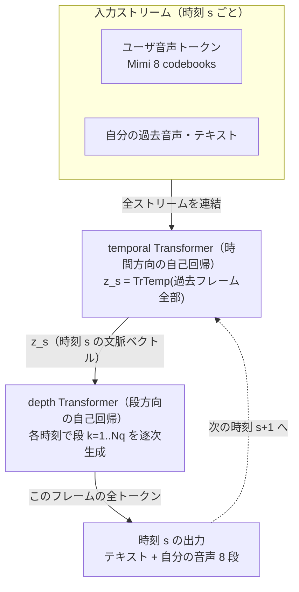
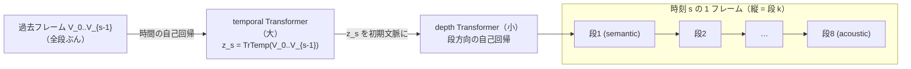

# 音声テキスト統合・全二重 streaming TTS — Moshi と Delayed Streams Modeling

:::abstract[学習目標]
この章を読み終えると、次のことができるようになります。

- **全二重 (full-duplex)** が半二重ターン制と何が違うか、ユーザ音声とシステム音声の **2 ストリーム同時モデル化** で **説明** できる
- **RQ-Transformer** の temporal Transformer と depth Transformer が「1 フレーム = $N_q$ トークン」（章03）の **時間×段の 2 次元** をどう分解するかを **導出** できる
- **Inner Monologue** と **acoustic delay $\tau$** が、品質と低遅延をどう両立させるかを **説明** できる
- **Delayed Streams Modeling (DSM)** が、ストリーム間の遅延を変えるだけで TTS / ASR / 翻訳を同じ枠組みから導くことを **示せる**
- 章01–07 を束ね、自分で新しい音声アーキを **提案する** 視点を持つ
:::

## 前提知識

- 章03 [ニューラル音声コーデック](/audio/03-neural-audio-codecs/)：**Mimi**（24kHz 入力 → 12.5Hz・約 1.1kbps・8 codebooks＝1 semantic + 7 acoustic・80ms/フレーム・causal streaming）、**1 フレーム = $N_q$ トークン**の 2 次元、semantic/acoustic は訓練損失で分かれる、**delay pattern** の発想
- 章04 [音声認識 (ASR) とストリーミング](/audio/04-asr/)：frame-synchronous な streaming、アライメントの単調性、**Delayed Streams Modeling** で ASR を解く Kyutai STT への言及
- 章06 [トークンベース TTS（VALL-E 系）](/audio/06-token-based-tts/)：音声合成を「codec トークンの自己回帰生成」として解く枠組み、AR が第1段・NAR が上位段という分担
- 章07 [Flow-matching TTS](/audio/07-flow-matching-tts/)：非自己回帰で連続音響を生成する系統（本章の AR 統合系と対比する相方）

LLM 出身の読者なら、本章の主役 **RQ-Transformer は「2 つの自己回帰を入れ子にした構造」** と捉えると一気に見通せます。テキスト LLM の自己回帰デコードと KV cache の知識がほぼそのまま効きます。差分だけを積み上げます。

## 直感

ここまでの章は、音声を **入力 → 出力の片道** で扱ってきました。ASR（章04）は音声→テキストの片道、TTS（章06・07）はテキスト→音声の片道です。間に人間がいて「喋り終わったら聞く / 聞き終わったら喋る」と **交代 (ターン制)** する前提でした。

ところが人間どうしの会話はそうではありません。**相手が喋っている最中に「うん」と相槌を打ち、言い終わる前に割り込み、被せて話す。** 聞くことと話すことが同時に走っています。これが **全二重 (full-duplex)** です。これを機械でやるには、もはや「ASR して LLM に渡して TTS する」という直列パイプライン（カスケード）では間に合いません。各段の遅延が積み上がり、相手の発話の途中で反応する余地が消えるからです。

そこで発想を転換します。**テキストも音声も、ユーザの声も自分の声も、すべて「時刻ごとに並ぶトークンのストリーム」とみなし、1 個の自己回帰モデルで同時に流す。** これが本章の主役 **Moshi**（Kyutai, 2024）の設計であり、それを一般化した **Delayed Streams Modeling (DSM)** です。そして驚くべきことに、この枠組みは TTS を解くためだけのものではありません。**ストリーム間の遅延の付け方を変えるだけで、同じモデルが TTS にも ASR にも翻訳にもなる。** 本章は音声ロードマップの **目標③（streaming TTS / 全二重対話）** ——分野全体の capstone——にあたります。

## 全体像

順方向（テキスト＋ユーザ音声 → システム音声）と、その中身（時間方向と段方向の 2 つの自己回帰）を先に一望します。



この章の見どころは 4 つです。順に降りていきます。

1. **multi-stream（全二重の器）**：ユーザ音声・システム音声・テキストを **K 本のストリーム**として並べ、1 モデルで同時生成する。
2. **RQ-Transformer（1 フレーム $N_q$ トークンの捌き方）**：時間方向の大きな temporal Transformer と、段方向の小さな depth Transformer で 2 次元を分解する。
3. **Inner Monologue + acoustic delay（品質と遅延の両立）**：音声の前にテキストを予測し、音声トークンを少し遅らせる。
4. **DSM（統一理論）**：遅延設計だけで TTS / ASR / 翻訳を 1 アーキに畳む。

:::note[LLM ↔ Speech：全体マップ]
テキスト LLM は「1 次元のトークン列を 1 個の自己回帰でなめる」。本章のモデルは「**複数ストリーム × 1 フレーム $N_q$ トークン** の 2 次元を、**時間の自己回帰（temporal）の中に段の自己回帰（depth）を入れ子**にしてなめる」。LLM の `next-token prediction` を 2 軸に拡張したもの、と掴めば全体が見えます。
:::

## 理論

### multi-stream：全二重を「ストリームの束」で表す

カスケード（ASR→LLM→TTS）を解体し、すべてを時刻 $s$ で揃ったトークンの束として扱います。Moshi の構成は **K = 17 ストリーム**です。内訳は次の通り。

| ストリーム群 | 本数 | 中身 | 誰が作る |
| --- | --- | --- | --- |
| text | 1 | 自分の発話の Inner Monologue テキスト | モデル（生成） |
| 自分（Moshi）の音声 | 8 | Mimi の 8 codebooks（1 semantic + 7 acoustic） | モデル（生成） |
| ユーザの音声 | 8 | Mimi の 8 codebooks（マイク入力を Mimi で符号化） | 入力（観測） |

これを $K = 2Q + 1 = 17$ と書きます。$Q = 8$ は Mimi の codebook 数（章03 の $N_q$）、$2Q$ は「自分 + ユーザ」の 2 話者ぶん、$+1$ は text です。

- **全二重の正体**：ユーザ音声 8 ストリームを**常時入力として観測しながら**、自分の音声 8 + text 1 を**同時に生成**します。だから「聞きながら話す」が成立します。ユーザが黙れば自分が話し、ユーザが割り込めばその音声トークンが入力に乗り、モデルは即座に応答を変えられます。
- **ターン制 (半二重) との差**：半二重（SpeechGPT / GLM-4-Voice / LLaMA-Omni 系）は「ユーザのターンが終わるまで待ってから自分のターン」。全二重は **2 話者ぶんのストリームを並行モデル化**するので、待ちが原理的に存在しません。

:::warning[「2 ストリーム」と「2 次元トークン」を混同しない]
本章には **2 種類の "複数"** が登場します。混ざると一気に分からなくなります。

| | multi-stream（話者・モダリティ方向） | 1 フレーム $N_q$ トークン（段方向） |
| --- | --- | --- |
| 何が複数か | text / 自分音声 / ユーザ音声 という **役割の違うストリーム** | 同じ音声を表す **RVQ の 8 段**（章03） |
| 本数 | $K = 17$ | $Q = 8$（音声 1 本あたり） |
| 解く道具 | ストリームを連結して 1 列に | **RQ-Transformer の depth** が段方向を回す |

「ユーザ音声」という 1 つのストリームの中身も、実は Mimi の 8 段トークンです。つまり全体は **(ストリーム数) × (段数) × (時間)** の 3 次元。これを 2 つの Transformer で捌くのが次節です。
:::

### RQ-Transformer：時間×段を 2 つの自己回帰に分解する

章03 で見た通り、音声 1 フレームは縦に $N_q$ 個のトークンが積まれた **2 次元**（時間 $s$ × 段 $k$）です。これを 1 次元に素朴 flatten すると系列が $N_q$ 倍に伸び、12.5Hz × 8 = 100 トークン/秒 が効いてきて長文脈が苦しくなります。**RQ-Transformer** は、この 2 次元を **2 つの Transformer** で分担して解きます。



役割を、誰が・いつ・何を入力に・何を出力するかで切り分けます。

**① temporal Transformer（時間方向・大きいモデル）**

時刻 $s$ の文脈ベクトル $z_s$ を作ります。

$$z_s = \mathrm{TrTemp}(V_0, \dots, V_{s-1})$$

- $V_j$ は時刻 $j$ の **フレーム全体の埋め込み**（その時刻の全段・全ストリームのトークンを 1 つにまとめたもの）。$V_0$ は開始記号。
- $z_s$ は「時刻 $s$ で何を喋るべきか」の**時間方向の文脈**。**過去フレームだけ**に依存し、時刻 $s$ の中身（段）はまだ見ません。
- **誰が・いつ**：会話が 1 フレーム（80ms）進むたびに 1 回呼ばれます。Mimi が 12.5Hz なので **1 秒に 12.5 回**。これが計算の主役で、Moshi では 7B 規模の大きな Transformer です。

**② depth Transformer（段方向・小さいモデル）**

$z_s$ を起点に、その時刻の $N_q$ 段を **段方向に自己回帰**で 1 段ずつ生成します。第 $k$ 段のロジット $l_{s,k}$ は次で作られます。

$$l_{s,1} = \mathrm{Lin}(z_s), \qquad l_{s,k} = \mathrm{TrDepth}(z_s, V_{s,1}, \dots, V_{s,k-1}) \ \ (k \ge 2)$$

- $V_{s,k}$ は時刻 $s$ で**すでに確定した段 $k$ のトークンの埋め込み**。第1段は $z_s$ だけから線形写像（$\mathrm{Lin}$）で出し、第2段以降は「$z_s$ + 同じ時刻のここまでの段」を入力に depth Transformer が出します。
- **誰が・いつ**：temporal が $z_s$ を出した直後、その 1 時刻の中で $N_q = 8$ 回ループします。小さいモデルなので 8 回回しても安い。
- **何を使い回すか**：$z_s$ は 8 段すべてで共有される「時間文脈の足場」。depth は段ごとの細部（semantic→acoustic の残差順）だけを担当します。

:::warning[depth Transformer は時間ではなく「段」を回す]
最大の誤解はここです。**depth Transformer は時刻 $s$ を進めません。** 時刻は temporal が進めます。depth は **同じ時刻 $s$ の中で、段 $k=1 \to 2 \to \dots \to 8$ を縦に降りる**だけのループです。
章03 の RVQ を思い出してください——段1（semantic）→段2→…と**残差を細かくしていく順序**でした。depth はまさにその順に段を自己回帰生成します。「時間軸の Transformer がもう 1 つある」のではなく、「**1 フレームの中の縦方向を捌く小さな Transformer**」です。
:::

なぜこの 2 段分解が要るのか。素朴 flatten で 1 個の Transformer に $100$ トークン/秒を全部なめさせると、(a) 系列が $N_q$ 倍で長文脈が重い、(b) 時間方向の長距離依存（会話の文脈）と段方向の短距離依存（同フレーム内の残差）を **1 個の attention で混ぜる**のが非効率、という二重苦になります。RQ-Transformer は **時間（長距離・大モデル）と段（短距離・小モデル）を役割分担**することで、12.5Hz の実時間生成を計算効率よく回します。$S$（時刻数）と $K$（段数）を独立に増減できるのも利点です。

:::note[LLM ↔ Speech：入れ子の自己回帰]
temporal = 「フレーム列の自己回帰 LM」（KV cache が効く・LLM そのもの）。depth = 「1 フレーム内の段の自己回帰 LM」（毎フレーム状態リセットして 8 段だけ回す小さな LM）。**外側の自己回帰の各ステップの中に、内側の自己回帰が丸ごと 1 回走る**——二重ループです。
:::

### Inner Monologue：音声の前にテキストを予測する

音声トークンだけを自己回帰生成させると、言語的な一貫性（何を喋っているか）が崩れやすい。音声トークンは音響的には密ですが、「文として筋が通っているか」を表す信号が薄いからです。**Inner Monologue（内なる独白）** はこれを解きます。

仕組みは単純です。**発声すべき音声トークンの前に、それに時間整合したテキストトークンを予測させる。** モデルはまず「次に何という単語を言うか」をテキストで決め、それを足場にして音声トークンを生成します。テキストが音声の **意味的な台本（scaffold）** になり、言語品質が大きく上がります。

:::warning[Inner Monologue のテキストは「出力字幕」ではない]
誤解しやすい点：このテキストは**画面に出す字幕でも、最終成果物でもありません**。あくまで **音声生成を助けるための内部状態（生成の足場）** です。モデルが自分の発話を「先に言葉で考えてから声にする」ための内なる独白であって、捨ててもよいし、副産物として streaming ASR/TTS に使い回すこともできる、という位置づけです。「テキストを出すために音声を作る」のではなく「**良い音声を作るためにテキストで足場を組む**」——向きが逆です。
:::

副産物として、このテキスト–音声の整合は **同じ 1 モデルで TTS（テキスト→音声）も ASR（音声→テキスト）も**実現します。テキストを与えて音声を出させれば TTS、音声を与えてテキストを読ませれば ASR。これが次の DSM への伏線です。

### acoustic delay $\tau$：段ごとに時間をずらす

もう 1 つの鍵が **acoustic delay** です。章03 で触れた **delay pattern** の具体形です。

同じ時刻 $s$ の段 1（semantic）と段 8（acoustic）を**完全に同時刻**に出させると、音響の細部（acoustic）が意味（semantic）より先に確定してしまい、生成が不安定になります。そこで **acoustic トークンを semantic より $\tau$ ステップ遅らせます**（$\tau \in \{1, 2\}$ が実用）。semantic で「何の音か」を先に決め、その数フレーム後に acoustic で「どう響くか」を埋める、という時間差をつけるわけです。

- $\tau$ を入れると、各時刻のフレームは「今のフレームの semantic」と「$\tau$ フレーム前の acoustic」が混在した斜めの並びになります（delay pattern）。
- **学習時 vs 推論時**：訓練時はテキストも音声も正解列が全部あるので、遅延を入れた並びを teacher forcing で一括に学べます。推論時は左から 1 フレームずつ生成し、$\tau$ ぶんの遅れを保ったまま streaming で出します。**設計（遅延量）は両者で同一**——ここが DSM の効く理由です。

Moshi の遅延の内訳は概算で次の通りです。

$$\text{遅延} \approx \underbrace{80\,\text{ms}}_{\text{Mimi フレーム}} + \underbrace{80\,\text{ms}}_{\text{acoustic delay}} = 160\,\text{ms（理論）},\quad \text{実測} \approx 200\,\text{ms}$$

### Delayed Streams Modeling：遅延設計が「タスク」を決める

ここまでの部品——multi-stream・Inner Monologue・acoustic delay——を貫く一般原理が **Delayed Streams Modeling (DSM)**（Kyutai, 2025）です。主張は次の一文に尽きます。

> **時間整合した複数ストリームの間に「適切な遅延」を入れるだけで、任意の入力組合せから任意出力を streaming 生成できる。遅延の付け方がタスク（TTS / ASR / 翻訳）を決める。**

直感はこうです。2 つのストリーム（例：テキスト $X$ と音声 $Y$）を考え、片方を条件、もう片方を生成対象とします。

- **TTS**：テキスト $X$ を条件、音声 $Y$ を生成。**音声を遅延**させる → 各時刻でテキストが先に出揃い、それを足場に音声を作る。
- **ASR**：音声 $X$ を条件、テキスト $Y$ を生成。**テキストを遅延**させる → 音声を先に聞いてから書き起こす。
- **同時翻訳（Hibiki, 2025）**：ソース音声を条件、ターゲット音声を生成。遅延を「十分な文脈が溜まるまで待つ」よう学習で調整（contextual alignment）。

**同じ decoder-only モデル、同じ学習目的。違うのは『どちらのストリームを何ステップ遅らせるか』だけ。** これが「個別タスクを統一理論化した」と言われる所以です。

## 数式の導出

### 時間×段の同時分布の因子分解

multi-stream を含むフレーム列の同時分布を、temporal と depth の 2 つの自己回帰に因子分解します。1 フレームのトークン束を $V_s = (a_{s,1}, \dots, a_{s,N_q})$（段 $k$ のトークン $a_{s,k}$、ここでは 1 ストリームぶんで代表）と書きます。系列全体の確率は、自己回帰の連鎖則で時間方向に展開できます。

$$P(V) = \prod_{s=1}^{S} P(V_s \mid V_{<s})$$

各フレーム内をさらに段方向の連鎖則で展開します。時刻 $s$ の各段は「過去フレーム全部 + 同フレームのここまでの段」に条件づきます。

$$P(V_s \mid V_{<s}) = \prod_{k=1}^{N_q} P\big(a_{s,k} \mid a_{s,<k},\, V_{<s}\big)$$

ここで RQ-Transformer の分業を代入します。過去フレームへの依存 $V_{<s}$ を **temporal が要約**して $z_s = \mathrm{TrTemp}(V_0,\dots,V_{s-1})$ にまとめ、同フレームの段方向の依存 $a_{s,<k}$ を **depth が担当**します。

$$P\big(a_{s,k} \mid a_{s,<k},\, V_{<s}\big) = P\big(a_{s,k} \mid a_{s,<k},\, z_s\big) = \mathrm{softmax}\big(l_{s,k}\big)$$

ロジット $l_{s,k}$ は前述の通り、第1段は線形、第2段以降は depth Transformer です。

$$l_{s,1} = \mathrm{Lin}(z_s), \qquad l_{s,k} = \mathrm{TrDepth}\big(z_s,\, V_{s,1}, \dots, V_{s,k-1}\big)\ (k \ge 2)$$

これで全系列の対数尤度が、温度方向と段方向の二重ループで書けました。$z_s$ という 1 本のベクトルが、巨大な過去文脈を depth 側へ橋渡しする**唯一の通り道**である点が、計算効率の核心です。$\blacksquare$

### 遅延 $\tau$ の導入

acoustic delay は、段 $k$ のトークンを時間方向に $\tau_k$ だけずらして並べる写像です。元の格子 $a_{s,k}$ に対し、遅延後の格子 $\tilde a$ を次で定めます。

$$\tilde a_{s,k} = a_{\,s - \tau_k,\,k}, \qquad \tau_k = \begin{cases} 0 & k \in \{\text{text, semantic}\} \\ \tau & k \in \{\text{acoustic 段}\} \end{cases}$$

semantic と text は遅延 0、acoustic 段は一律 $\tau$（実用 $\tau \in \{1,2\}$）。モデルは**この遅延後の格子 $\tilde a$ を、通常の自己回帰で学習・生成**します。時刻 $s$ のフレームを出す時、acoustic 段は実質「$\tau$ フレーム前の音」を埋めるので、semantic が先に決まる構造が自動的に保証されます。$\blacksquare$

### DSM の条件付き目的関数

DSM の一般形を、ストリーム $X$（条件）から $Y$（生成）への遅延 $\tau$ つき条件付き分布として書きます。時刻 $t$ の出力 $y_t$ は「遅延ぶん先まで見た条件 $X$」と「過去の自分の出力 $Y$」に依存します。

$$q_\tau(Y \mid X) = \prod_{t} q_\tau\big(y_t \mid X_{\le t+\tau},\, Y_{<t}\big)$$

ここで $X_{\le t+\tau}$ は「現時刻より $\tau$ ステップ先まで観測した条件ストリーム」、$Y_{<t}$ は「これまで生成した出力」です。遅延 $\tau$ がタスクを決めます。

- $\tau > 0$ で **$Y$ を遅らせる**（条件 $X$ を先読みできる）→ $X$=テキスト, $Y$=音声 なら **TTS**。
- 役割を入れ替え $X$=音声, $Y$=テキスト なら **ASR**（テキストを遅らせて音声を先に聞く）。
- $\tau$ を文脈量で学習的に決めれば **同時翻訳**。

単一の $q_\tau$ で 3 タスクが書けました。Moshi はこの $X, Y$ を **17 本のストリームに一般化**し、ユーザ音声を $X$、自分の音声＋テキストを $Y$ とした全二重会話として実装したもの、と整理できます。$\blacksquare$

## 実装

実モデル（Moshi の temporal 7B + depth + Mimi）は重く、ここでは動かせません。代わりに **DSM の心臓部——「2 ストリームを遅延つきでインターリーブし、各時刻でどれだけ先読みできるか」——を NumPy の最小トイで実測**します。RQ-Transformer の重み計算ではなく、**遅延がもたらすデータの並び**を体で掴むのが狙いです。

```python title="dsm_toy.py"
import numpy as np

# DSM の核：2 ストリームを「遅延つき」でインターリーブする最小トイ。
# ストリーム A（テキスト）, ストリーム B（音声トークン）を時間整合させ、
# B を A に対して tau フレーム遅延させて 1 本の系列に並べる（acoustic delay の縮図）。

np.random.seed(0)

T = 6                      # 時間ステップ数
tau = 1                    # 音声を tau フレーム遅延（inner monologue: テキストが先）
PAD = -1                   # まだ生成されていない位置（遅延で生じる穴）

# 各時刻のテキストトークン（語彙 0..99）と音声トークン（語彙 100..199）を仮に作る
text = np.array([10, 11, 12, 13, 14, 15])          # 時刻 t の「内なる独白」テキスト
audio = np.array([110, 111, 112, 113, 114, 115])   # 時刻 t に発声すべき音声トークン

# 遅延適用：音声ストリームを右へ tau ずらす（先頭 tau 個は PAD で埋める）
audio_delayed = np.full(T, PAD, dtype=int)
audio_delayed[tau:] = audio[:T - tau]

# 各時刻 t で「テキスト t」と「遅延音声 t」を縦に積む（= multi-stream の 1 フレーム）
frame_stack = np.stack([text, audio_delayed], axis=0)  # shape (2 streams, T)

print("=== 時刻ごとの 2 ストリーム（行0=text, 行1=audio[delay tau=%d]) ===" % tau)
print(frame_stack)

# decoder-only に食わせる「インターリーブ 1 次元列」（各時刻で text→audio の順に flatten）
flat = []
for t in range(T):
    flat.append(("txt", t, int(frame_stack[0, t])))
    a = int(frame_stack[1, t])
    flat.append(("aud", t, a if a != PAD else None))
print("\n=== flatten（各時刻 text→audio）。audio=None は遅延による空位置 ===")
for tag, t, v in flat:
    print(f"  t={t} {tag}: {v}")

# DSM の条件付き確認：時刻 t の音声 y_t は、テキスト x_{<=t} と過去音声 y_{<t} に依存。
# 遅延 tau のおかげで、音声 t を出す時点でテキスト t はすでに観測済み（足場になっている）。
print("\n=== 各時刻で音声を出すとき参照できるテキスト先読み量 ===")
for t in range(T):
    # audio_delayed[t] が指す元の音声は audio[t-tau]。それを出す時、text[t] まで観測済み。
    src = t - tau
    if src < 0:
        print(f"  t={t}: 音声まだ無し（遅延の穴）")
    else:
        print(f"  t={t}: audio[{src}] を出力。観測済みテキスト = text[0..{t}]（{t-src} ステップ先読み）")
```

実行（`uv run --with numpy python dsm_toy.py`）すると、次の実測出力が得られます。

```text title="出力"
=== 時刻ごとの 2 ストリーム（行0=text, 行1=audio[delay tau=1]) ===
[[ 10  11  12  13  14  15]
 [ -1 110 111 112 113 114]]

=== flatten（各時刻 text→audio）。audio=None は遅延による空位置 ===
  t=0 txt: 10
  t=0 aud: None
  t=1 txt: 11
  t=1 aud: 110
  t=2 txt: 12
  t=2 aud: 111
  t=3 txt: 13
  t=3 aud: 112
  t=4 txt: 14
  t=4 aud: 113
  t=5 txt: 15
  t=5 aud: 114

=== 各時刻で音声を出すとき参照できるテキスト先読み量 ===
  t=0: 音声まだ無し（遅延の穴）
  t=1: audio[0] を出力。観測済みテキスト = text[0..1]（1 ステップ先読み）
  t=2: audio[1] を出力。観測済みテキスト = text[0..2]（1 ステップ先読み）
  t=3: audio[2] を出力。観測済みテキスト = text[0..3]（1 ステップ先読み）
  t=4: audio[3] を出力。観測済みテキスト = text[0..5]（1 ステップ先読み）
```

読み取りどころ。(1) 音声行の先頭が `-1`（PAD）になっている——これが **acoustic delay の "穴"** で、最初の $\tau$ フレームは音声がまだ無く、テキストだけが先行します。(2) flatten 列で各時刻 `txt → aud` の順に並ぶ——これが **Inner Monologue**（テキストが音声の足場として先に来る）の最小形です。(3) 音声 `audio[k]` を出す時、テキストは常に 1 ステップ先まで観測済み——**遅延が「テキストで考えてから声にする」を構造的に保証**しています。$\tau$ を 2 に増やせば先読み量が増え、品質は上がるが遅延も増える、というトレードオフがそのまま数字に出ます。

:::tip[この後どう発展するか]
この PAD の穴を埋めながら左から 1 列ずつ生成すれば streaming TTS、テキストと音声の役割を入れ替えれば ASR——コードの `text` と `audio` を入れ替えるだけで切り替わります。実モデルではこの 1 列 1 列を RQ-Transformer（temporal→depth）が埋めます。「次のアクション」で実際に役割を入れ替えてみてください。
:::

## 演習

::::question[演習 1: temporal と depth の分業]
Moshi の RQ-Transformer で、Mimi の段数を $N_q = 8$、ある会話が $S = 100$ フレーム（80ms × 100 = 8 秒）だとします。(a) temporal Transformer は全部で何回呼ばれますか。(b) depth Transformer の段ループは、会話全体で延べ何回回りますか。(c) $z_s$ は何のために存在し、depth はそれをどう使いますか。(d) 「depth Transformer がもう 1 つの時間軸を回している」という理解はなぜ誤りですか。

:::details[解答]
(a) temporal は **1 フレームにつき 1 回**。$S = 100$ フレームなら **100 回**です（過去フレームを要約して $z_s$ を出す）。
(b) depth は各時刻で段 $k=1 \dots 8$ を回すので **1 フレームにつき 8 回**。会話全体では $100 \times 8 = \textbf{800 回}$。ただし depth は temporal より小さいモデルなので、回数が多くても計算は軽い設計です。
(c) $z_s = \mathrm{TrTemp}(V_0,\dots,V_{s-1})$ は **時刻 $s$ の時間方向の文脈ベクトル**で、巨大な過去文脈を depth 側へ橋渡しする唯一の通り道です。depth は **8 段すべてで同じ $z_s$ を共有**し、それを起点に段方向（semantic→acoustic）の自己回帰を回します（第1段は $\mathrm{Lin}(z_s)$、第2段以降は $z_s$ + 同フレームのここまでの段）。
(d) depth は**時刻 $s$ を進めません**。時刻を進めるのは temporal です。depth は **同じ時刻 $s$ の中で段 $k$ を縦に降りるだけ**——章03 の RVQ の残差順（semantic→acoustic）をなぞる段方向の自己回帰であって、第 2 の時間軸ではありません。
:::
::::

::::question[演習 2: 遅延設計でタスクを切り替える]
DSM の条件付き $q_\tau(y_t \mid X_{\le t+\tau}, Y_{<t})$ を使います。(a) $X$ をテキスト、$Y$ を音声とし $Y$ を $\tau > 0$ 遅らせると何のタスクになり、なぜ品質が上がりますか。(b) 同じモデルで ASR を実現するには、何をどう変えますか。(c) Moshi の実測遅延 ~200ms の内訳を、章03 の Mimi の値も使って説明してください。(d) acoustic delay を $\tau = 0$ にすると何が起きると予想されますか。

:::details[解答]
(a) $X$=テキスト・$Y$=音声で **音声を遅延**させると **TTS**。各時刻で条件テキスト $X_{\le t+\tau}$ を**先読み**できるため、「次に言う単語」を足場（Inner Monologue）にしてから音声を作れます。意味が先に確定するので言語品質が安定します。
(b) **役割を入れ替える**だけです。$X$=音声・$Y$=テキストとし、**テキストを遅延**させる（音声を先に聞いてから書き起こす）と **ASR** になります。モデル本体・学習目的は同じで、遅延の付け方を変えるだけ——これが DSM の主張です。
(c) 概算で $\underbrace{80\,\text{ms}}_{\text{Mimi の 1 フレーム（章03）}} + \underbrace{80\,\text{ms}}_{\text{acoustic delay}} = 160\,\text{ms}$ が理論下限。実装上のオーバーヘッドが乗って **実測 ~200ms** になります。Mimi が 12.5Hz＝80ms/フレームの causal streaming codec であることが効いています。
(d) semantic（何の音か）と acoustic（どう響くか）が**完全同時刻**に確定を強いられ、音響の細部が意味より先に決まりうるため、**生成が不安定化**すると予想されます。だから実用では $\tau \in \{1,2\}$ を入れ、semantic を先に決めてから acoustic を埋めます。
:::
::::

## まとめ

:::success[この章の要点]
- **全二重**は「ユーザ音声 8 + 自分の音声 8 + text 1 = K=17 ストリーム」を 1 モデルで同時生成すること。半二重ターン制と違い、聞きながら話せる（割り込み・相槌）。
- **RQ-Transformer** は「1 フレーム $N_q$ トークン」（章03）の時間×段の 2 次元を、**temporal（時間方向・大）が $z_s$ を出し、depth（段方向・小）が $z_s$ を起点に段 $k$ を自己回帰**、と 2 つの Transformer で分解する。depth は時間でなく段を回す。
- **Inner Monologue** は音声の前にテキストを予測する内部の足場（出力字幕ではない）。**acoustic delay $\tau \in \{1,2\}$** は semantic を先に・acoustic を後に決めさせ、品質と安定を両立。Moshi は実測 ~200ms。
- **DSM** は $q_\tau(y_t \mid X_{\le t+\tau}, Y_{<t})$ の遅延 $\tau$ を変えるだけで TTS / ASR / 翻訳を 1 アーキに統一する。Hibiki（同時翻訳）はその一例。
- これで音声分野の **目標③** に到達。章01–07 の道具（サンプリング→特徴量→codec→ASR→TTS）がすべてここに合流する。
:::

### 系譜と最新動向（2025–26 時点・実装前に最新を再確認）

- **Moshi（＋Mimi）（Kyutai, 2024）**：初の実時間・全二重 spoken LLM、実測 ~200ms。本領域の事実上の基準点で、オープンソース。
- **Hibiki（ICML 2025, Kyutai）**：同時音声→音声翻訳。十分な文脈が溜まった分だけ逐次翻訳する contextual alignment が特徴。軽量版はスマホで実時間。
- **Delayed Streams Modeling（DSM, 2025, Kyutai）**：Moshi/Hibiki の経験則を一般定式化。遅延設計だけで TTS/STT/翻訳を単一 decoder-only に統一。
- **Kyutai TTS / STT（2025）**：DSM 由来の実用モデル。TTS 1.6B で ~160–200ms 級の低遅延 streaming、Rust/MLX で on-device も。
- **Sesame CSM（2025）**：Llama バックボーン + 小型 audio decoder で Mimi コードを interleave 生成。会話的音声生成の代表。
- **CALM（interleaved speech-text の位置づけ概念）**：text token と speech latent を単一モデルで同時処理する考え方の総称。本領域で「CALM」という名の確立した単一モデルは断定しづらく、概念ラベルとして扱うのが安全です。

:::warning[固有名・数値の扱い]
モデル名・パラメータ数・遅延の値は **2025–26 時点**の概数です。Moshi の K=17 ストリーム構成・Mimi の 12.5Hz / 1.1kbps / 8 codebooks（1 semantic + 7 acoustic）/ 80ms は章03 で検証済みの値ですが、後続モデル（Kyutai TTS の規模・遅延、CSM の構成）は更新が速いので、実装前に原典（Moshi 論文 arXiv:2410.00037、DSM の Kyutai 公開資料）と最新リリースを再確認してください。
:::

### 次に学ぶこと

ここで音声ロードマップの **3 つの目標がすべて揃いました**——目標①（streaming ASR・章04）、目標②（flow-matching TTS・章07）、目標③（本章の全二重 streaming TTS）。そして本章で見た DSM は、その 3 つが**実は同じ枠組みの遅延違い**だったことを明かします。

最後に視点を一段上げます。ここまでの章は、

1. **サンプリング・量子化**（章01）で音を数列にし、
2. **周波数・特徴量**（章02）で扱いやすい表現にし、
3. **codec**（章03）で離散トークンにし、
4. **ASR**（章04）で音声→テキスト、**TTS**（章06・07）でテキスト→音声、
5. そして本章で **すべてを 1 つの自己回帰 multi-stream モデルに畳んだ**。

この道具立てが手に入った今、**「自分なら次に何を変えるか」を設計できる**はずです。たとえば——ストリームをもう 1 本足して視覚（omni 化）を入れたら? acoustic delay を文脈で動的に学習させたら? depth を flow-matching（章07）に差し替えたら? 章ごとの部品を組み替えて**新しいアーキを自分で提案する**——それがこの分野を「学び切った」状態であり、North Star です。

→ [Audio ロードマップに戻る](/audio/)

## 用語ミニ辞典

| 用語 | 一言 |
| --- | --- |
| 全二重 (full-duplex) | 聞きながら話す。2 話者ストリームを同時モデル化 |
| 半二重 (half-duplex) | ターン制。喋り終わってから聞く |
| multi-stream | text / 自分音声 / ユーザ音声を K 本のストリームで束ねる（Moshi は K=17） |
| RQ-Transformer | temporal（時間）+ depth（段）の 2 つの Transformer で 2 次元トークンを捌く |
| temporal Transformer | 時間方向の自己回帰。$z_s = \mathrm{TrTemp}(V_{<s})$ を出す大モデル |
| depth Transformer | 段方向の自己回帰。$z_s$ を起点に段 $k$ を逐次生成する小モデル |
| $z_s$ | 時刻 $s$ の時間文脈ベクトル。8 段で共有する足場 |
| Inner Monologue | 音声の前にテキストを予測する内部の足場（字幕ではない） |
| acoustic delay $\tau$ | acoustic 段を semantic より $\tau$ ステップ遅らせる（$\tau\in\{1,2\}$） |
| delay pattern | 段ごとに時間をずらす並べ方（章03）。acoustic delay はその具体形 |
| DSM | 遅延設計だけで TTS/ASR/翻訳を 1 アーキに統一する定式化 |
| Mimi | 12.5Hz・1.1kbps・8 codebooks の streaming codec（章03） |
| Hibiki | DSM 系の同時音声翻訳（2025） |

## 次のアクション

理論を手で定着させる。**最小の写経 → 動かす → 小実験** を 1 セットで。

1. **写経**：上の `dsm_toy.py` をそのまま打ち、`uv run --with numpy python dsm_toy.py` で実行する。出力の「音声行の先頭 `-1`（遅延の穴）」と「flatten が `txt→aud` の順」を、本文の説明と突き合わせて確認する。
2. **動かす**：`tau` を `1 → 2 → 3` と変え、(a) 遅延の穴がいくつ増えるか、(b) 各時刻の「先読みステップ数」がどう変わるかを観察する。$\tau$ が増えると先読み（=品質の足場）が増えるが、最初に音声が出るまでの遅延も増える——品質↔遅延のトレードオフを数字で体感する。
3. **小実験**：コード内の `text` と `audio` の役割を**入れ替える**（音声を条件・テキストを遅延）。同じコードが **TTS から ASR に変わる**ことを確認する。これが DSM の「遅延設計だけでタスクが決まる」の最小再現です。さらに余力があれば、`frame_stack` を 2 行から 3 行（ユーザ音声ストリームを追加）に拡張し、K を増やした multi-stream の並びを作ってみる。

ここまでで音声分野の **目標③** が手に入り、章01–07 の部品が 1 つに合流します。次は実モデル（Moshi / Kyutai TTS）の公開実装を読み、本章のトイがどの関数に対応するかを対応づけると理解が一段深まります（学習を回すなら Slurm / GPU を使います）。

## 参考文献

1. A. Défossez, L. Mazaré, M. Orsini, A. Royer, P. Pérez, H. Jégou, E. Grave, N. Zeghidour, "Moshi: a speech-text foundation model for real-time dialogue," Kyutai, 2024. arXiv:2410.00037.（Moshi・Mimi・RQ-Transformer・Inner Monologue・全二重の原典）
2. Kyutai, "Delayed Streams Modeling," 2025. arXiv:2509.08753.（遅延設計だけで TTS/STT/翻訳を統一する一般定式化）
3. Kyutai, "Hibiki: High-Fidelity Simultaneous Speech-To-Speech Translation," *ICML*, 2025.（DSM 系の同時音声翻訳・contextual alignment）
4. D. Lee, C. Kim, S. Kim, M. Cho, W. Han, "Autoregressive Image Generation using Residual Quantization (RQ-VAE / RQ-Transformer)," *CVPR*, 2022.（RQ-Transformer の原型・temporal+depth 分解）
5. Sesame AI Labs, "Conversational Speech Model (CSM)," 2025.（Llama + 小型 audio decoder で Mimi コードを interleave 生成）
6. Kyutai, Kyutai TTS / STT（2025–26 時点。規模・遅延は実装前に最新版を再確認）。
7. T. A. Nguyen et al., "Generative Spoken Dialogue Language Modeling (dGSLM)," *TACL*, 2023.（2 話者ストリームの並行モデル化の先行例）
