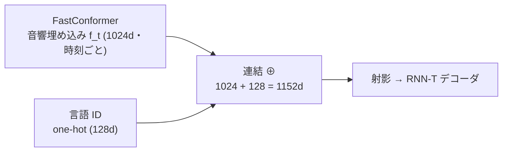

# ケーススタディ：Nemotron 3.5 多言語ストリーミング ASR

:::abstract[学習目標]
この章を読み終えると、次のことができるようになります。

- `nvidia/nemotron-3.5-asr-streaming-0.6b` の構成を、章04 の **cache-aware FastConformer + RNN-T** の語彙で **説明** できる
- **言語 ID 条件付け**（128 次元 one-hot の連結）が「1 モデルで 40 言語」をどう実現するかを **述べ**、複数モデル方式と **比較** できる
- `att_context_size` の 2 数字（左＝キャッシュ／右＝look-ahead）を区別し、レイテンシ $=(r{+}1)\times 80\,\text{ms}$ を **導出** できる
- cache-aware が「同じ精度でより多くの同時ストリーム」を生む **スループット経済性** を計算で **見積もれる**
- 40 ロケールの **3 層分類** と、アンサンブル擬似ラベルによる **学習レシピ** を説明できる
:::

## 前提知識

- 章04 [音声認識 (ASR) とストリーミング](/audio/04-asr/)：**この章の土台**。CTC / RNN-T / Conformer / FastConformer / chunk attention / cache-aware 推論 / emission delay をすべて使います。未読ならまずこちらを。
- 章01 [デジタル音声の基礎](/audio/01-digital-audio-basics/)：フレーム＝時間分解能（10 ms フレーム → 8× ダウンサンプルで 80 ms）。
- 章02 [周波数と特徴量](/audio/02-frequency-and-features/)：log-mel（エンコーダ入力）。

この章は新しい理論を導入しません。**章04 の理論を、実在する 1 モデルに「適用して読む」**のが目的です。LLM 出身の読者には、言語 ID 条件付け（タスクトークン／system prompt）と KV cache のアナロジーがそのまま効きます。

## 直感

章04 で「streaming ASR は RNN-T + cache-aware FastConformer が本命」と学びました。では、**それを本気で実装するとどんなモデルになるのか**。本章はその答え合わせです。

題材は NVIDIA の **Nemotron 3.5 ASR**（2026 年公開、6 億パラメータ）。狙いどころが明快で、章04 の概念がほぼ 1 対 1 で姿を現します。

- **1 モデルで 40 言語ロケール** —— 言語ごとにモデルを持たず、**言語 ID をプロンプトのように与える**。
- **1 モデルで 5 段階のレイテンシ** —— 再学習なしに `att_context_size` だけで 80 ms〜1120 ms を切り替える（章04 の dynamic chunk training の成果物）。
- **小さいのに大量に捌ける** —— 0.6B と Parakeet 1.1B の半分以下なのに、同じ GPU で **十数倍**の同時ストリームを処理する（cache-aware が重複計算を消すから）。

理論を「知っている」状態から、「実モデルの設計判断を読める」状態へ上がるのがゴールです。

## 全体像

入力から出力まで、章04 の部品がそのまま並びます。


章04 との対応はこうです。

| Nemotron 3.5 ASR の部品 | 章04 のどこ |
| --- | --- |
| Cache-Aware FastConformer ×24 | 「FastConformer」「cache-aware 推論」 |
| RNN-T デコーダ | 「RNN-T / Transducer」 |
| `att_context_size`（5 段階） | 「ストリーミング化：遅延↔精度」「dynamic chunk training」 |
| 言語 ID 条件付け（⊕ 128d） | **本章の新顔**（章04 は単言語前提） |
| 句読点・大文字化を内蔵 | 後段の整形を不要にする実務上の工夫 |

:::note[なぜこの章が要るのか]
章04 は「streaming ASR の作り方」を一般論で展開しました。本章は、その一般論が **実モデルでどんな具体値・具体設計になるか**（言語条件付けの次元、レイテンシの刻み方、スループットの桁）を埋めます。理論と実装の間の「最後の 1 マイル」です。
:::

## 理論

### 1. モデルの正体（スペック）

まず素性を 1 枚にまとめます（数値は 2026-06 時点のモデルカード基準。実装前に再確認してください）。

| 項目 | 値 |
| --- | --- |
| パラメータ数 | 約 6 億（0.6B） |
| エンコーダ | Cache-Aware FastConformer ×24 層（8× ダウンサンプル＝80 ms フレーム） |
| デコーダ | RNN-T（transducer） |
| 言語 | 40 言語ロケール（言語 ID 条件付け） |
| レイテンシ | 80 / 160 / 320 / 560 / 1120 ms（`att_context_size` で切替） |
| 出力 | テキスト＋句読点＋大文字化（後処理不要） |
| ランタイム | NeMo 26.06+ ／ 入力はモノラル音声 |
| ライセンス | OpenMDW-1.1（オープンウェイト） |

英語専用版 `nemotron-speech-streaming-en-0.6b` を**多言語へ拡張**したもの、という出自が要点です。骨格（FastConformer-RNNT）は据え置き、**言語 ID 条件付けを足して 40 ロケールに広げた**のがこのモデルです。

骨格にあたる基盤論文のアーキテクチャ図を引用します。共有エンコーダの上に 2 つのデコーダを載せて学習します。

<figure>
  
  <figcaption class="fig-cap"><span>基盤論文の Hybrid CTC/RNN-T 構成。共有 FastConformer エンコーダ＋2 デコーダを損失混合で学習。Nemotron は推論時に <strong>RNN-T 枝</strong>を使う。</span><span>出典: V. Noroozi et al., <a href="https://arxiv.org/abs/2312.17279">arXiv:2312.17279</a> / <a href="https://creativecommons.org/licenses/by/4.0/">CC BY 4.0</a>（リサイズして掲載）</span></figcaption>
</figure>

### 2. 言語 ID 条件付け：1 モデルで 40 言語

多言語 ASR には大きく 2 つの作り方があります。

- **言語ごとに別モデル**：精度は出しやすいが、40 言語＝40 個の重みを配備・運用することになる。
- **1 モデルを言語で条件付け**：1 つの重みに「いま何語か」を教えて切り替える。Nemotron はこちら。

条件付けの実体は素朴です。エンコーダが出す**音響埋め込み** $f_t$（1024 次元）に、**言語 ID の one-hot ベクトル**（128 次元）を**連結**し、まとめてデコーダ側へ射影します。



記号を全部定義します。

- $f_t$：エンコーダ出力。**時刻 $t$ ごと**に 1 本（$T$ フレームなら $T$ 本）、各 1024 次元。「そのフレームの音響的意味」（章04 の $f_t$ と同じもの）。
- 言語ベクトル $\mathbf{l}\in\{0,1\}^{128}$：**指定した 1 言語の位置だけ 1**、ほかは 0 の one-hot。**時刻に依存しない固定値**で、発話全体で同じものを毎フレームに連結します。
- 連結結果：$[\,f_t\,;\,\mathbf{l}\,]\in\mathbb{R}^{1152}$。これを射影してデコーダの条件に使います。

:::warning[言語 ID は「自動で当たる」とは限らない]
言語 ID は基本的に**こちらが与えるプロンプト**です（`target_lang="ja-JP"` のように指定）。`target_lang=auto` を選んだときだけモデルが推定します。「録音を入れれば勝手に言語判定して書き起こす」のがデフォルト挙動**ではありません** —— 既定は「指定した言語で書き起こす」。指定が当たっていれば精度は上がり、外れていれば下がります。
:::

:::note[LLM ↔ Speech]
言語 ID の one-hot は、LLM の **タスクトークン／system prompt** とほぼ同じ役割です。「同じ重みに、いまのモード（言語）を教えて挙動を切り替える」。重みを増やさずに条件分岐を入れる、という発想が共通しています。one-hot は「埋め込みテーブルを引く前の生のインデックス表現」だと思えば橋が架かります。
:::

**なぜ連結で足りるのか。** 音響 $f_t$ だけでは「同じ音」が言語によって別の文字に対応しうる（音素体系・正書法が違う）ため曖昧です。そこに「いま日本語」という固定の手掛かりを毎フレーム添えると、デコーダは**言語ごとの語彙・綴り規則に正しく寄せられます**。1 本のベクトルを連結するだけ＝計算コストはほぼゼロ、というのが「1 モデルで 40 言語」を成立させる軽さの源です。

### 3. 5 段階レイテンシ：`att_context_size` の 2 つの数字

Nemotron は推論時の `att_context_size = [左, 右]` を変えるだけで、再学習なしにレイテンシを 5 段階で選べます。**2 つの数字の役割がまったく違う**ので、ここを取り違えないことが肝心です。

| 設定 | `att_context_size` | アルゴリズム遅延 | 左文脈（キャッシュ） |
| --- | --- | --- | --- |
| 80 ms | `[56, 0]` | 80 ms | 56 フレーム ≈ 4.48 s |
| 160 ms | `[56, 1]` | 160 ms | 56 フレーム ≈ 4.48 s |
| 320 ms | `[56, 3]` | 320 ms | 56 フレーム ≈ 4.48 s |
| 560 ms | `[56, 6]` | 560 ms | 56 フレーム ≈ 4.48 s |
| 1120 ms | `[56, 13]` | 1120 ms | 56 フレーム ≈ 4.48 s |

- **左の数 $L_c=56$（固定）**：各フレームが参照できる**過去**の長さ（＝キャッシュする左文脈）。これは**もう届いている音**なので、**遅延には効きません**。56 フレーム × 80 ms ≈ 4.48 秒ぶんの文脈を常に見ています。
- **右の数 $r$（可変）**：各フレームが参照する**未来**の長さ（look-ahead）。未来は**待たないと得られない**ので、**ここだけがレイテンシに直結**します。

:::warning[左 56 を「遅延 4.48 秒」と読まない]
`[56, 0]` は遅延 **80 ms** です。左の 56 は過去（キャッシュ済み）なので待ち時間に入りません。レイテンシを決めるのは**右の $r$ だけ**。「左が大きい＝遅い」と誤読しないでください。左を増やすと（精度に効く文脈は増えるが）遅延は増えません。増やすと遅延が増えるのは右です。
:::

「右（未来）をどう絞るか」は基盤論文の look-ahead 設計そのものです。下図がその要点です。

<figure>
  
  <figcaption class="fig-cap"><span>(a) Regular は層を重ねるほど未来参照が膨らみ遅延増。(b) Chunked は「同じチャンク＋過去」だけに制限し look-ahead を一定に保つ。Nemotron の右コンテキスト r はこの chunk-aware look-ahead。</span><span>出典: V. Noroozi et al., <a href="https://arxiv.org/abs/2312.17279">arXiv:2312.17279</a> / <a href="https://creativecommons.org/licenses/by/4.0/">CC BY 4.0</a>（リサイズして掲載）</span></figcaption>
</figure>

精度との関係は素直で、**右（未来）を多く待つほど WER が下がります**。

<figure>
  <canvas id="nemotron-latency-wer" width="1400" height="700" aria-hidden="true"></canvas>
  <figcaption class="fig-cap"><span>遅延↔精度：チャンクを大きく（=待つ）ほど WER が下がる</span><span>FLEURS transcription-ready 平均 / 公開値は 80・320・1120ms の 3 点</span></figcaption>
</figure>

これは章04 の「chunk サイズで遅延↔精度を選ぶ」「dynamic chunk training で 1 モデルを多遅延対応に」が、そのまま 5 つの動作点として製品化されたものです。**学習時に右文脈をランダムに振って訓練した**から、推論時に右を選ぶだけで使い分けられます。

### 4. cache-aware が生むスループット経済性

「0.6B で Parakeet 1.1B の 17 倍の同時ストリーム」という数字（H100 1 枚）は、半分が**モデルが小さいから**、もう半分が**cache-aware だから**です。後者を分解します。

章04 で見たとおり、**buffered streaming は新しいチャンクが来るたびに過去ぶんも含む窓を丸ごと再エンコード**します。重複計算が積もり、しかも self-attention は窓長の**二乗**で効きます。**cache-aware は過去の活性をキャッシュから供給し、各フレームを 1 回だけ**処理します。同じ精度のまま計算が減る ＝ **同じ GPU でより多くの利用者を捌ける**（＝スループット）。

そのキャッシュの中身（何を保持し、何を再計算しないか）を示したのが基盤論文の下図です。

<figure>
  
  <figcaption class="fig-cap"><span>連続チャンクのキャッシュ機構。橙＝キャッシュ（過去の活性）、黒＝現在チャンク、青＝畳み込み、灰＝自己注意。過去を再計算せず供給するのが、本章のスループットの源。</span><span>出典: V. Noroozi et al., <a href="https://arxiv.org/abs/2312.17279">arXiv:2312.17279</a> / <a href="https://creativecommons.org/licenses/by/4.0/">CC BY 4.0</a>（リサイズして掲載）</span></figcaption>
</figure>

<figure>
  <canvas id="nemotron-throughput" width="1400" height="760" aria-hidden="true"></canvas>
  <figcaption class="fig-cap"><span>同時ストリーム数（H100 1 枚・グループ内で正規化）</span><span>80ms 設定で約 17x / 1120ms 設定で約 6x</span></figcaption>
</figure>

:::warning[「17× は小さいからだ」と単純化しない]
0.6B が 1.1B より速いのは当然ですが、それだけなら高々 2 倍弱です。十数倍まで開くのは、**buffered の重複計算を cache-aware が消す**ことが効いているからです。低遅延（小チャンク）ほど buffered の再計算頻度が上がるので、**80 ms 設定で差が最大（17×）**、待てる 1120 ms 設定では差が縮む（6×）—— この向きが「重複計算の排除が効いている」証拠です。数式は次節で出します。
:::

### 5. 40 ロケールの 3 層分類

40 ロケールは一律ではなく、品質で 3 層に分けて公開されています。「全部が実運用品質」という誤解を避けるための正直な区分です。

| 層 | 数 | 位置づけ | 例 |
| --- | --- | --- | --- |
| Transcription-ready | 19 | そのまま実運用できる | 英・西・仏・伊・葡・独・露・アラビア・ヒンディー・日・韓・越 ほか |
| Broad-coverage | 13 | 広くカバーするが中品質 | ポーランド・スウェーデン・チェコ・北京語・フィンランド ほか |
| Adaptation-ready | 8 | 微調整前提の初期対応 | ギリシャ・リトアニア・ヘブライ・タイ・スロベニア ほか |

Adaptation-ready 層は**少量の追加学習で大きく伸びる**のが売りで、公開値では 80 ms 設定でギリシャ語が WER 35%→24%、ブルガリア語が 22%→15% に改善します。「1 モデルで全部最高」ではなく「**1 モデルで広く・足りなければ層ごとに適応**」という現実的な設計です。

### 6. 学習レシピ：アンサンブル擬似ラベル

40 言語ぶんの**人手書き起こし**を揃えるのは非現実的です。Nemotron は公開＋社内データ（10k〜1M 時間規模）に対し、**擬似ラベル（pseudo-label）**を大量に使います。

- 書き起こしラベル：人手に加え、**Canary・Parakeet・Whisper・FunASR のアンサンブル**で自動生成。
- 句読点・大文字化：**Qwen3-32B**（LLM）で付与。だから推論時に後段整形が要りません。
- データ源：NVIDIA Granary、Multilingual LibriSpeech、Mozilla Common Voice、FLEURS、VoxPopuli/Europarl、Riva 社内データ ほか。

:::note[LLM ↔ Speech]
「強いモデル群で正解を作り、軽いモデルに蒸留する」のは LLM の合成データ／蒸留と同じ発想です。ASR では複数 ASR の**多数決アンサンブル**で擬似ラベルの誤りを下げ、句読点だけ LLM に任せる、という分業になっているのが面白いところ。**学習時にだけ重いモデルを使い、推論は 0.6B で軽い**——典型的な「学習時 vs 推論時」の非対称です。
:::

## 数式の導出

### レイテンシは右コンテキストだけで決まる

1 エンコーダフレームは、章01 の 10 ms フレームを FastConformer が 8× ダウンサンプルした **80 ms** です。

$$
\tau_{\text{frame}} = 10\,\text{ms} \times 8 = 80\,\text{ms}
$$

`att_context_size = [L_c, r]` のうち、現在フレームを確定するには「現在フレーム＋右 $r$ フレームの未来」が揃う必要があります（左 $L_c$ は過去＝既着なので待たない）。揃えるべきフレーム数は $r+1$ なので、

$$
\tau_{\text{latency}} = (r + 1)\,\tau_{\text{frame}} = (r+1)\times 80\,\text{ms}
$$

$r=0,1,3,6,13$ を代入すると $80,160,320,560,1120\,\text{ms}$ となり、公開設定に一致します。$\blacksquare$

### buffered vs cache-aware の self-attention コスト

ストリーム全体を $T$ フレーム、1 チャンクを $C$ フレーム、左文脈（キャッシュ）を $L_c$ フレームとします。ステップ数は $T/C$。

**buffered**：毎ステップ、窓 $W=L_c+C$ を丸ごと再エンコード。self-attention は窓長の二乗。

$$
\text{Cost}_{\text{buf}} \propto \frac{T}{C}\,(L_c + C)^2
$$

**cache-aware**：毎ステップ、新規 $C$ クエリが $(L_c+C)$ キーに注意（過去は再計算しない）。

$$
\text{Cost}_{\text{cache}} \propto \frac{T}{C}\,C\,(L_c + C) = T\,(L_c + C)
$$

比をとると、

$$
\frac{\text{Cost}_{\text{buf}}}{\text{Cost}_{\text{cache}}} = \frac{(L_c+C)^2 / C}{(L_c+C)} = \frac{L_c + C}{C}
$$

$L_c=56,\ C=8$ なら $\dfrac{56+8}{8}=8$ 倍。$\blacksquare$

:::warning[この 8× は「源泉」であって製品の 17× そのものではない]
上の簡易モデルは **重複計算の排除という効果だけ**を取り出したものです。実測の 17× は、これに加えて「0.6B vs 1.1B の小型化」「実装最適化」などが乗った総合値です。式が示すのは**比が $C$ に反比例する＝チャンクが小さい（低遅延）ほど cache-aware の優位が開く**という向きで、これが「80 ms で 17×・1120 ms で 6×」の傾向と一致します。
:::

## 実装

まず、上の理論値を**手元で実測**します（GPU 不要・NumPy のみ）。`att_context_size` → レイテンシ、buffered vs cache-aware、言語 ID 連結の 3 つを確かめます。

```python title="nemotron_recipe.py"
import numpy as np

FRAME_MS = 80  # FastConformer は 8x ダウンサンプル → 1 エンコーダフレーム = 80ms

# --- 1) att_context_size の右コンテキスト r → アルゴリズム遅延 ---
print("=== att_context_size -> レイテンシ ===")
configs = [("80ms", [56, 0]), ("160ms", [56, 1]), ("320ms", [56, 3]),
           ("560ms", [56, 6]), ("1120ms", [56, 13])]
for name, (left, right) in configs:
    latency = (right + 1) * FRAME_MS          # 現フレーム + 右 r フレーム
    left_ctx_s = left * FRAME_MS / 1000        # 左コンテキスト（キャッシュ長）
    print(f"  {name:>7} att_context_size={[left,right]}  "
          f"遅延=(r+1)x80={latency:>4}ms  左文脈={left}フレーム≈{left_ctx_s:.2f}s")

# --- 2) バッファ式 vs キャッシュ式：自己注意の総計算量（簡易モデル）---
print("\n=== self-attention 総コスト（簡易モデル, 任意単位）===")
T = 1000          # ストリーム全体のフレーム数
C = 8             # 1 チャンク = 8 フレーム
Lc = 56           # キャッシュする左文脈フレーム数（att_context_size の左 56）
steps = T // C
# バッファ式: 毎ステップ、窓 W=Lc+C を丸ごと再エンコード。注意は O(W^2)。
W = Lc + C
buffered = steps * (W ** 2)
# キャッシュ式: 毎ステップ、新規 C クエリが (Lc+C) キーに注意。O(C*(Lc+C))。過去は再計算しない。
cache_aware = steps * (C * (Lc + C))
print(f"  ステップ数 = T/C = {steps}")
print(f"  buffered     ∝ steps * (Lc+C)^2     = {buffered:,}")
print(f"  cache-aware  ∝ steps * C*(Lc+C)     = {cache_aware:,}")
print(f"  削減率 buffered/cache-aware         = {buffered/cache_aware:.1f}x")

# --- 3) 言語 ID 条件付け：音響埋め込み ⊕ 言語 one-hot ---
print("\n=== language-ID 条件付け（連結）===")
D_ac, D_lang = 1024, 128
acoustic = np.zeros(D_ac)          # エンコーダ出力（時刻ごと）の 1 フレーム例
lang_id = 12                        # 例: ある言語のインデックス
lang_vec = np.zeros(D_lang); lang_vec[lang_id] = 1.0   # one-hot
fused = np.concatenate([acoustic, lang_vec])
print(f"  音響 {acoustic.shape[0]}d ⊕ 言語 {lang_vec.shape[0]}d = {fused.shape[0]}d "
      f"(one-hot の非ゼロ要素数={int(lang_vec.sum())})")
```

```text title="出力"
=== att_context_size -> レイテンシ ===
     80ms att_context_size=[56, 0]  遅延=(r+1)x80=  80ms  左文脈=56フレーム≈4.48s
    160ms att_context_size=[56, 1]  遅延=(r+1)x80= 160ms  左文脈=56フレーム≈4.48s
    320ms att_context_size=[56, 3]  遅延=(r+1)x80= 320ms  左文脈=56フレーム≈4.48s
    560ms att_context_size=[56, 6]  遅延=(r+1)x80= 560ms  左文脈=56フレーム≈4.48s
   1120ms att_context_size=[56, 13]  遅延=(r+1)x80=1120ms  左文脈=56フレーム≈4.48s

=== self-attention 総コスト（簡易モデル, 任意単位）===
  ステップ数 = T/C = 125
  buffered     ∝ steps * (Lc+C)^2     = 512,000
  cache-aware  ∝ steps * C*(Lc+C)     = 64,000
  削減率 buffered/cache-aware         = 8.0x

=== language-ID 条件付け（連結）===
  音響 1024d ⊕ 言語 128d = 1152d (one-hot の非ゼロ要素数=1)
```

理論値（$(r{+}1)\times 80$、$(L_c{+}C)/C=8$、$1024{+}128{=}1152$）がそのまま出ました。

実モデルを動かすときは NeMo からロードします（**重み配布＋GPU が必要**。下は API の使い方で、この章では未実行）。

```python title="run_nemotron.py（要 NeMo 26.06+ ・GPU）"
import nemo.collections.asr as nemo_asr

asr_model = nemo_asr.models.ASRModel.from_pretrained(
    model_name="nvidia/nemotron-3.5-asr-streaming-0.6b"
)

# 言語を指定（または target_lang="auto" で自動判定）
# att_context_size で遅延を切替： [56,0]=80ms … [56,13]=1.12s
# NeMo の streaming 推論スクリプトに target_lang と att_context_size を渡す
```

## 演習

::::question[演習 1: `att_context_size` を読む]
ある設定が `att_context_size = [56, 6]` でした。(a) アルゴリズム遅延は何 ms ですか。(b) 各フレームは過去・未来をそれぞれ何秒ぶん参照しますか。(c) 「左を 56 → 112 に増やすと遅延はどうなるか」を答えてください。

:::details[解答]
(a) 右 $r=6$ なので $\tau=(6+1)\times 80 = \mathbf{560\,ms}$。
(b) 未来＝右 $r=6$ フレーム ＝ $6\times 80 = 480\,\text{ms}$。過去＝左 $L_c=56$ フレーム ＝ $56\times 80 = 4480\,\text{ms} \approx 4.48\,\text{s}$。
(c) 左（過去）は**既に届いている音**なので**遅延は変わりません**（560 ms のまま）。増えるのは参照できる過去文脈の量（精度に効きうる）と、保持するキャッシュのメモリだけです。遅延を増やすのは右だけ、が要点です。
:::
::::

::::question[演習 2: cache-aware の効きどころ]
簡易モデル $\text{Cost}_{\text{buf}}/\text{Cost}_{\text{cache}} = (L_c+C)/C$ を使います。$L_c=56$ 固定で、(a) チャンク $C=4$ と (b) $C=28$ のとき、それぞれ削減率は何倍ですか。(c) この結果は「低遅延ほど cache-aware が効く」という主張をなぜ裏づけますか。

:::details[解答]
(a) $(56+4)/4 = \mathbf{15}$ 倍。
(b) $(56+28)/28 = \mathbf{3}$ 倍。
(c) チャンク $C$ が小さいほど削減率 $(L_c+C)/C$ が大きくなります。**小チャンク＝低遅延**なので、低遅延設定ほど buffered の再計算頻度が上がり、それを消す cache-aware の優位が開く、という向きです。製品の「80 ms で 17×・1120 ms で 6×」と同じ傾向で、差が小型化だけでなく重複計算の排除から来ていることを示します。
:::
::::

::::question[演習 3: 言語条件付けの設計判断]
「40 言語を 1 モデルで」を、(a) 言語ごとに別モデルを 40 個持つ方式と比べて、長所・短所を 1 つずつ挙げてください。(b) 言語 ID を間違って指定（例：日本語音声に `target_lang="ko-KR"`）するとどうなると考えられますか。

:::details[解答]
(a) 長所：配備・運用するのが 1 つの重みで済む（更新・メモリ・サービング即応性）。さらに低資源言語が高資源言語の表現を**共有**できる（正の転移）。短所：1 モデルに全言語を詰めるため、特定言語に特化した別モデルより、その言語単体の上限精度では劣りうる（容量の取り合い）。
(b) デコーダが「韓国語の語彙・綴り規則」に寄せて復号するため、音は日本語なのに韓国語的な出力に引っ張られ **WER が悪化**します。言語 ID は出力分布を切り替える強い条件なので、指定ミスは精度に直結します（自信がなければ `target_lang=auto`）。
:::
::::

## まとめ

:::success[この章の要点]
- Nemotron 3.5 ASR は、章04 の **cache-aware FastConformer + RNN-T** をそのまま実装した 0.6B モデル。新顔は**言語 ID 条件付け**だけ。
- **言語 ID（128d one-hot）を音響 1024d に連結**して 1 モデルで 40 ロケール。LLM のタスクトークン／system prompt と同じ「重みを増やさず条件分岐」。既定は**指定言語**で書き起こし（auto は任意）。
- `att_context_size = [左, 右]` の **右だけがレイテンシ**（$\tau=(r{+}1)\times 80\,\text{ms}$）。左 56 は過去＝キャッシュで遅延に効かない。1 モデルで 5 段階。
- cache-aware の削減率は簡易モデルで $(L_c+C)/C$。**チャンクが小さい（低遅延）ほど効く**ので、80 ms で差が最大（17×）・1120 ms で縮む（6×）。
- 40 ロケールは **3 層**（19 ready / 13 broad / 8 adaptation）。学習は **ASR アンサンブル擬似ラベル＋LLM で句読点**、という学習時 vs 推論時の非対称。
:::

### 次に学ぶこと

これで **目標①（streaming ASR）** が「理論（章04）→ 実モデル（本章）」までつながりました。ここから先は逆向き（テキスト→音声）の合成 (TTS) です。streaming の発想は TTS でも生き、最終的に章08 の**全二重 streaming**（聞きながら話す）へ収束します。

→ [Audio ロードマップに戻る](/audio/) ／ 理論の復習は [章04 ASR](/audio/04-asr/)

## 用語ミニ辞典

| 用語 | 一言 |
| --- | --- |
| Nemotron 3.5 ASR | NVIDIA の 0.6B 多言語 streaming ASR（cache-aware FastConformer + RNN-T） |
| 言語 ID 条件付け | 言語の one-hot を音響埋め込みに連結し 1 モデルで多言語化 |
| `att_context_size` | `[左=キャッシュ, 右=look-ahead]`。右だけが遅延に効く |
| look-ahead（右文脈） | 各フレームが見る未来フレーム数。遅延 $=(r{+}1)\times 80$ ms |
| 同時ストリーム数 | 1 GPU が並行処理できる音声本数（スループット指標） |
| 擬似ラベル | 強いモデル群の出力を正解として学習に使う合成ラベル |
| 3 層分類 | ready / broad / adaptation の品質区分（19/13/8） |
| OpenMDW-1.1 | このモデルのオープンウェイト・ライセンス |

## 次のアクション

理論を手で定着させる。**最小の写経 → 動かす → 小実験** を 1 セットで。

1. **写経**：上の `nemotron_recipe.py` を打って `uv run --with numpy python nemotron_recipe.py` で動かし、3 つの出力が本文と一致することを確認する。
2. **動かす**：`configs` に `("240ms", [56, 2])` を足し、遅延が $(2{+}1)\times 80 = 240$ ms と出るか確かめる（公開設定外でも式は同じ）。
3. **小実験**：簡易コストモデルで $L_c$ を 56→112 に変え、チャンク $C=4,8,28$ で削減率がどう動くか表にする。「低遅延ほど cache-aware が効く」を自分の数字で再現する。
4. 余力があれば、GPU 環境で `run_nemotron.py` を実走し、`att_context_size` を変えて実遅延と体感 WER のトレードオフを確かめる。

## 参考文献

1. NVIDIA, "nvidia/nemotron-3.5-asr-streaming-0.6b," Hugging Face モデルカード, 2026.（本章の一次情報。数値は 2026-06 時点）
2. NVIDIA, "nvidia/nemotron-speech-streaming-en-0.6b," Hugging Face, 2026.（英語版・元モデル）
3. V. Noroozi, S. Majumdar, A. Kumar, J. Balam, B. Ginsburg, "Stateful FastConformer with Cache-based Inference for Streaming Automatic Speech Recognition," *ICASSP*, 2024. [arXiv:2312.17279](https://arxiv.org/abs/2312.17279).（cache-aware streaming の基盤。本章の look-ahead・アーキ・キャッシュ機構の 3 図はこの arXiv 版から [CC BY 4.0](https://creativecommons.org/licenses/by/4.0/) のもとリサイズして掲載）
4. D. Rekesh et al., "Fast Conformer with Linearly Scalable Attention for Efficient Speech Recognition," NVIDIA, *ASRU*, 2023. arXiv:2305.05084.（FastConformer・8× ダウンサンプル）
5. 章04 [音声認識 (ASR) とストリーミング](/audio/04-asr/)（理論の土台。CTC/RNN-T/Conformer/cache-aware/TDT/emission delay）
