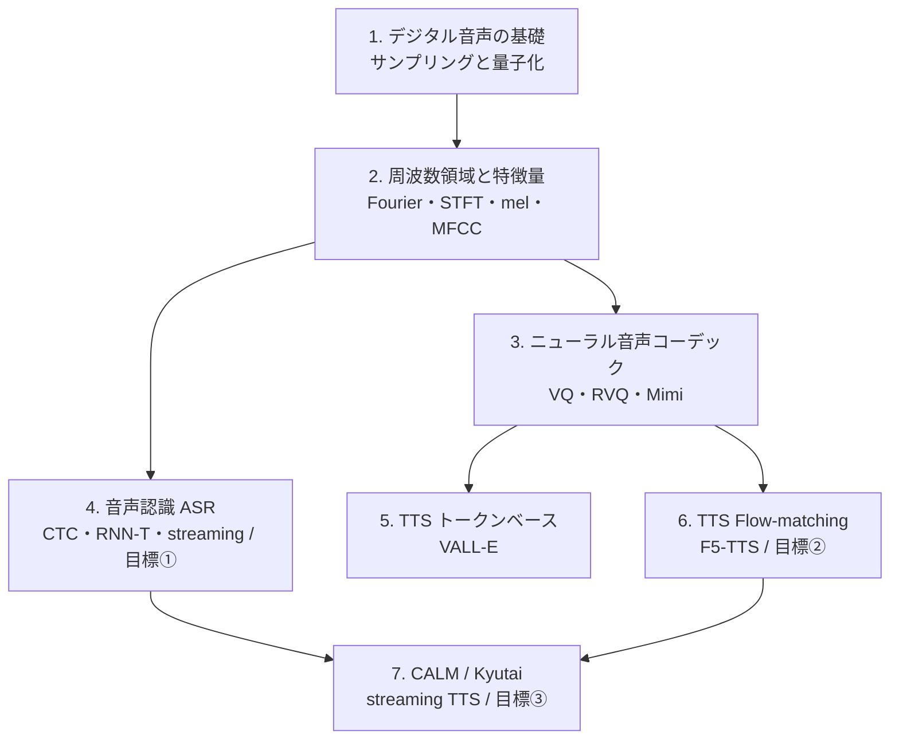

# Audio（音声・音響）

音をコンピュータで扱うための基礎から、信号処理、機械学習による音声認識・合成までを体系的に学びます。

:::abstract[この分野で身につくこと]
- 音をデジタルで表現する仕組み（sampling, quantization）を説明できる
- 時間領域・周波数領域を行き来して信号を分析できる（Fourier 変換, STFT）
- 音声特徴量（spectrogram, MFCC など）を自分で計算できる
- 音声認識・音声合成の基本的な仕組みを理解する
:::

## North Star（最終目標）

この分野を学び切った先で「自力で学習でき、新しいアーキも提案できる」状態を目指します。

1. **Streaming ASR** — 低遅延で逐次に音声を認識する（CTC / RNN-T / chunk-wise attention）
2. **Flow-matching TTS** — 非自己回帰・数ステップで音声を合成する（F5-TTS 系）
3. **Streaming TTS（CALM / Kyutai 系）** — テキストと音声を単一モデルで同時に流す

:::tip[LLM 出身者向けの近道]
Transformer・自己回帰デコード・トークナイザの知識はそのまま使えます。音声で新しいのは主に 2 点
——「**連続音声のトークン化／特徴量化**」と「**ストリーミング遅延**」。ここに時間を集中させます。
:::

## 前提知識

- 高校〜大学初年度の微積分・線形代数
- Python の基本（NumPy で配列を扱える程度）

## ロードマップ

各ステージは **学ぶ（理論）/ 橋渡し（既知との接続）/ 作る（最小実装）** で進めます。

### 1. デジタル音声の基礎 ✅ Ready

- **学ぶ**: サンプリング・Nyquist・aliasing・量子化・SQNR
- **橋渡し**: 「波形 = 非常に長い 1 次元数列」。LLM のトークン列より桁違いに長く冗長 → 周波数領域へ移して圧縮する動機
- **作る**: NumPy でサンプリング／エイリアシング／量子化を実装し、理論式を実測で確認

→ [読む](/audio/01-digital-audio-basics/)

### 2. 周波数領域とスペクトル特徴量 ✅ Ready

- **学ぶ**: DFT/FFT・STFT・スペクトログラム・メルフィルタバンク・log-mel・MFCC・Griffin-Lim/vocoder
- **橋渡し**: 「STFT→mel = トークナイザ」「log-mel フレーム = 埋め込み」「vocoder = デトークナイザ」
- **作る**: torchaudio / NumPy で 波形 ⇄ STFT ⇄ mel ⇄ 波形 を一周

→ [読む](/audio/02-frequency-and-features/)

### 3. ニューラル音声コーデック ✅ Ready

- **学ぶ**: VQ・RVQ・FSQ・EnCodec/SoundStream/DAC/Mimi・frame/bit rate・semantic↔acoustic
- **橋渡し**: 「音声 = 離散トークン列」→ TTS が言語モデリングに化ける入口（VALL-E / Moshi）
- **作る**: 学習済み codec で encode→decode し、トークン列を可視化

→ [読む](/audio/03-neural-audio-codecs/)

### 4. 音声認識 ASR ✅ Ready ／ 目標①

- **学ぶ**: アライメント問題・CTC・RNN-T(transducer)・attention・Conformer/FastConformer・chunk streaming・遅延↔精度
- **橋渡し**: prediction net = ラベルの自己回帰 LM、causal mask = streaming の前提（codec と同根）
- **作る**: LibriSpeech サブセットで CTC を学習 → streaming 推論化し、遅延↔WER を測る

→ [読む](/audio/04-asr/)

### 5–7. TTS と streaming 対話 🚧 Planned / 🎯 Capstone

- **5. トークンベース TTS（VALL-E 系）** 🚧 — codec トークン + 自己回帰 LM
- **6. Flow-matching TTS（F5-TTS / CosyVoice）** 🎯 目標② — 非自己回帰・数ステップ生成
- **7. CALM / Kyutai streaming TTS（Moshi / DSM）** 🎯 目標③ — テキストも音声も streaming

## 章一覧

| # | 章 | 状態 |
| --- | --- | --- |
| 1 | [デジタル音声の基礎 — サンプリングと量子化](/audio/01-digital-audio-basics/) | ✅ 公開 |
| 2 | [周波数領域とスペクトル特徴量](/audio/02-frequency-and-features/) | ✅ 公開 |
| 3 | [ニューラル音声コーデック](/audio/03-neural-audio-codecs/) | ✅ 公開 |
| 4 | [音声認識 (ASR) とストリーミング](/audio/04-asr/) | ✅ 公開 |
| 5 | TTS その1 — トークンベース（VALL-E 系） | 🚧 予定 |
| 6 | TTS その2 — Flow-matching（F5-TTS 系） | 🎯 目標② |
| 7 | CALM / Kyutai 系 streaming TTS | 🎯 目標③ |

:::note[章は順次追加されます]
「次は◯◯の章を書いて」と指示すると、統一フォーマットで新しい章が追加されます。
:::
