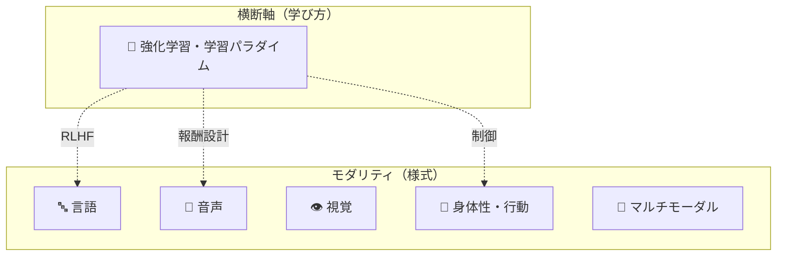
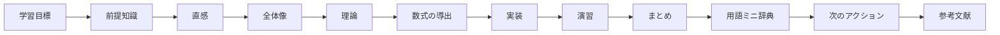

# Textbook

このテキストは、AI を **モダリティ（入出力の様式）を主軸**に体系的に学びます。
各モダリティを **同じ構成・同じ品質** で書き、まず「全体地図（分類）」を描いてから各論に降ります。

:::tip[このテキストの読み方]
- **モダリティで分類。** 「言語」「音声」「視覚」「身体性」「マルチモーダル」が縦軸。
- **手法は横断軸。** 強化学習などの学習パラダイムはモダリティに直交し、各モダリティから参照される。
- **わかりやすさ最優先。** まず直感、その後で理論・数式・実装。専門用語は英語のまま。
:::

## モダリティ × 横断手法

## モダリティ一覧

  

    <h3>🔤 言語（LLM）</h3>
    
トークン列の言語モデリング。Transformer・事前学習・適応・推論最適化・推論モデル/エージェント。

    
<a href="/llm/">→ ロードマップ</a>

  

  

    <h3>🎵 音声（Audio）</h3>
    
波形 ⇄ 特徴量 ⇄ トークン。ASR と TTS（自己回帰 / flow matching / 全二重 streaming）。<b>全8章 公開</b>。

    
<a href="/audio/">→ ロードマップ</a>

  

  

    <h3>👁 視覚（Vision）</h3>
    
画像・動画の理解と生成。CNN/ViT、拡散モデル、表現学習。

    
<a href="/vision/">→ ロードマップ</a>

  

  

    <h3>🦾 身体性・行動（Physical AI）</h3>
    
ロボット・制御・知覚・sim-to-real。物理世界で動く AI の知能。

    
<a href="/physical-ai/">→ ロードマップ</a>

  

  

    <h3>🔀 マルチモーダル</h3>
    
モダリティ横断。vision-language・audio-language・any-to-any。

    
<a href="/multimodal/">→ ロードマップ</a>

  

  

    <h3>🎯 強化学習（横断）</h3>
    
モダリティに直交する「学び方」。MDP から深層強化学習、RLHF・制御まで。

    
<a href="/reinforcement-learning/">→ ロードマップ</a>

  

## 各章の構成（フルセット）

どのモダリティのどの章も、次の流れで書かれています。

品質の心臓部は [`AUTHORING.md`](https://github.com/ksterx/textbook/blob/main/AUTHORING.md) の **§2「説明の深さ基準」**。
完成済みの **[音声モダリティ](/audio/)（全8章）** がお手本です。
