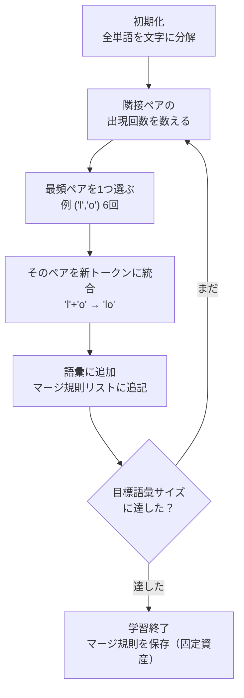
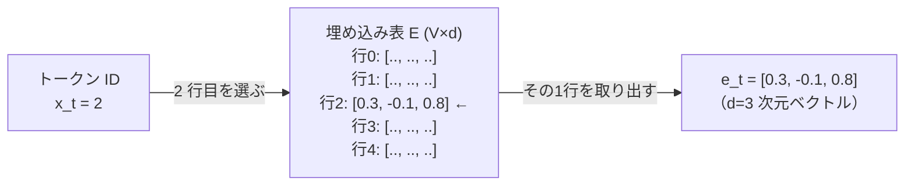
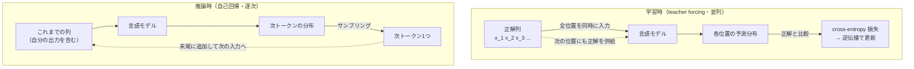
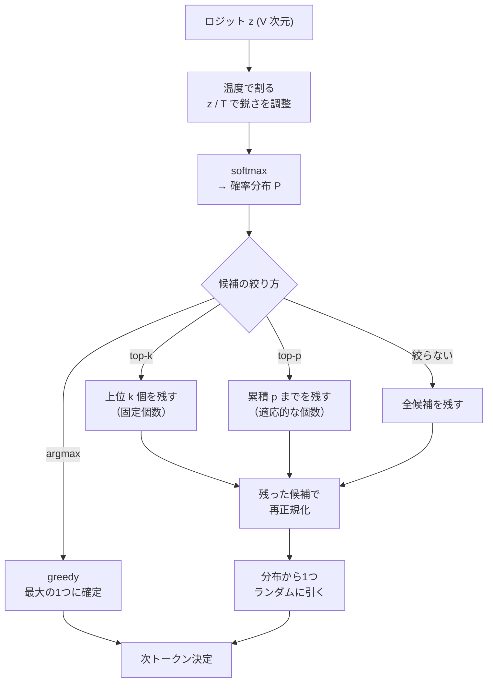

# 言語モデルとトークン化

:::abstract[学習目標]
この章を読み終えると、次のことができるようになります。

- **言語モデル＝次トークン予測** であることを、確率の連鎖則から **説明** できる
- テキストを **トークン**に割る理由と、**BPE/サブワード**の作り方（最頻ペアの反復マージ）を **説明** できる
- **語彙・埋め込み・出力 softmax** が「ID ↔ ベクトル ↔ 確率」をどう橋渡しするかを **図示** できる
- 学習目的の **cross-entropy（次トークンの負の対数尤度）** を書き下し、**perplexity** と関係づけられる
- **温度・top-k・top-p** サンプリングが分布をどう変えるかを **使い分け** られる
- 上記すべてを numpy の最小 LM で **実装・実行** できる
:::

## 前提知識

- 深層学習の基礎（多層パーセプトロン、softmax、誤差逆伝播）
- 確率の基礎（条件付き確率、連鎖則、対数尤度）
- 音声の章を読んでいれば橋渡しが効きます：[ニューラル音声コーデック](/audio/03-neural-audio-codecs/) で「連続信号を離散トークンに割る」発想を、[トークンベース TTS](/audio/06-token-based-tts/) で「音声トークンを言語モデルで予測する」発想を見ています。**本章の言語モデルは、その原型そのもの**です。

この章は言語（LLM）モダリティの第1章です。Transformer の中身（[次章 Attention](/llm/02-attention/)）に入る前に、**そもそも言語モデルが何を予測しているのか**を確定させます。

## 直感

スマホの予測変換を思い浮かべてください。「今日は良い」と打つと「天気」が候補に出ます。これがまさに**言語モデル**です。やっていることは1つだけ —— **これまでの文字列を見て、次に来るトークンを当てる**。

大規模言語モデル（LLM）も、規模が桁違いなだけで、本質は同じです。GPT も Claude も Llama も、訓練時にやっているのは「次のトークンを当てる」一点に尽きます。文章を書く・要約する・コードを書く・対話する —— これらはすべて「次トークン予測」の積み重ねから**創発**します。

具体的に追ってみます。「日本の首都は」という入力に LLM が「東京」と答えるとき、内部では1トークンずつこう進みます。

1. 「日本の首都は」を見て、次トークンの分布を出す → "東" が最も高い → "東" を選ぶ
2. 「日本の首都は東」を見て、次を出す → "京" が最も高い → "京" を選ぶ
3. 「日本の首都は東京」を見て、次を出す → "。" や文末が高い → 生成終了

「東京」という答えは、一度に出てきたのではなく、**「東」を選んでから、それを含めて読み直して「京」を選ぶ**という2ステップの積み重ねです。要約も対話も、長さが違うだけで、この「読んで → 次の1トークンを選んで → 末尾に足して → また読む」の繰り返しに過ぎません。この素朴なループが本章の主役で、図にすると後述の生成ループそのものになります。

この章のゴールは、その「次トークン予測」を、入口から出口まで一気通貫で理解することです。具体的には4つの問いに答えます。

1. テキストをどう**トークン**という単位に割るか（トークン化・BPE）
2. トークンをどう**ベクトル**にするか（語彙・埋め込み）
3. ベクトルからどう**次トークンの確率**を出すか（出力 softmax）
4. その予測の良し悪しをどう測り、どう**生成**に使うか（cross-entropy・サンプリング）

中身のネットワーク（Transformer）は次章に譲り、本章では**その前後（トークン化と確率出力）**を固めます。ここが曖昧なまま attention に進むと、必ず迷子になります。

## 全体像

言語モデルは **テキスト → トークン列 → 確率 → トークン → テキスト** というパイプラインです。順方向（生成）と逆方向（学習）を先に一望します。


| 段階 | 入力 | 出力 | この章で扱う |
| --- | --- | --- | --- |
| トークン化 | 文字列 | トークン ID 列 | ◎（BPE） |
| 埋め込み | トークン ID | ベクトル | ◎ |
| 系列モデル | ベクトル列 | ロジット | △（中身は次章） |
| 出力 softmax | ロジット | 確率分布 | ◎ |
| サンプリング | 確率分布 | 次トークン | ◎（温度/top-k/top-p） |
| 学習目的 | 予測 vs 正解 | 損失 | ◎（cross-entropy） |

**順方向（推論・生成）**：左から右へ。これまでのトークンを入力に、次トークンの分布を出し、1つ選び、また入力に戻す（**自己回帰**）。
**逆方向（学習）**：正解の次トークンと予測分布を **cross-entropy** で比べ、誤差を逆伝播して埋め込み表とネットワークを更新する。

:::note[LLM ↔ Speech]
この図は、音声の [トークンベース TTS](/audio/06-token-based-tts/) と**同じ骨格**です。あちらは「音声波形 → codec トークン → 言語モデルで次トークン予測 → 音声」。こちらは「テキスト → サブワードトークン → 言語モデルで次トークン予測 → テキスト」。**トークン化の対象が波形か文字かの違いだけ**で、中央の「離散トークン列の次トークン予測」はまったく同じ枠組みです。だから音声も言語も、同じ Transformer で扱えます。
:::

## 理論

### 1. 言語モデルとは何か —— 連鎖則による分解

言語モデルとは、**トークン列に確率を割り当てるモデル**です。トークン列を $x = (x_1, x_2, \dots, x_T)$ とします。ここで各記号の定義を厳密にします。

- $x_t$：時刻（位置）$t$ のトークン **ID**。語彙の中の1つを指す整数（後述の語彙でインデックスされる）。$t$ は $1$ から系列長 $T$ まで。
- $x_{<t}$：位置 $t$ より**前**のトークン列 $(x_1, \dots, x_{t-1})$。これが「これまでの文脈（context）」。
- $T$：系列の長さ（トークン数）。文によって変わる可変長。

列全体の確率は、**確率の連鎖則**でそのまま分解できます。

$$P(x_1, \dots, x_T) = \prod_{t=1}^{T} P(x_t \mid x_{<t})$$

この式が言語モデルのすべてです。「列の確率」は「各位置で、それまでを条件に次トークンが出る確率」の積に等しい。つまり**言語モデルを作る ＝ $P(x_t \mid x_{<t})$ を作る**ことに帰着します。これが「言語モデル＝次トークン予測」の正体です。

:::warning[誤解の先回り：言語モデルは「文を丸ごと」出力しない]
「LLM が文章を生成する」と聞くと、文を一括で吐くように感じますが、**実際は1トークンずつ**です。位置 $t$ では「次の1トークンの分布」しか出しません。文章はそれを $T$ 回繰り返した**結果**です。この「1ステップ＝1トークン」を取り違えると、後述のサンプリングや KV cache（次章以降）が理解できなくなります。
:::

### 2. なぜ「トークン」に割るのか

$P(x_t \mid x_{<t})$ を計算するには、テキストを**離散の単位**に区切らねばなりません。区切り方には3つの素朴な候補があります。

| 単位 | 語彙サイズ | 系列長 | 未知語 | 問題 |
| --- | --- | --- | --- | --- |
| **単語** | 巨大（数十万〜） | 短い | 弱い（未知語が出る） | 語彙が爆発、活用形を別扱い |
| **文字** | 極小（数十〜数百） | 非常に長い | 強い（任意の語を綴れる） | 系列が長く、意味の単位が小さすぎ |
| **サブワード** | 中（数万） | 中 | 強い | —— **ちょうど良い** |

**サブワード (subword)** は両極端のいいとこ取りです。よく出る語（"the", "cat"）は1トークン、珍しい語（"lowest"）は複数の断片（"lowe" + "s" + "t"）に割る。これにより、

- 語彙サイズを数万に抑えつつ（単語ほど爆発しない）、
- 任意の文字列を**必ず表現できる**（文字に落とせるので未知語が原理的に出ない）、
- 系列長も現実的（文字ほど長くならない）。

現代の LLM はほぼすべてサブワードを使います。その代表的な作り方が **BPE** です。

:::note[LLM ↔ Speech]
これは音声の codec が「連続波形を有限個のコードに量子化する」のと同じ動機です。連続/巨大な空間を、有限で扱いやすい**離散トークン**に落とす。音声は信号処理（残差量子化）で、テキストは統計（頻度マージ）で離散化します。
:::

### 3. BPE（Byte Pair Encoding）—— 最頻ペアを反復マージ

**BPE** はもともとデータ圧縮の手法で、NLP に転用されました（Sennrich et al., 2016）。アルゴリズムは驚くほど単純です。

1. **初期化**：すべての単語を**文字**の列に分解する（語彙＝文字の集合）。
2. **カウント**：コーパス全体で、**隣り合うトークンのペア**の出現回数を数える。
3. **マージ**：最も頻出するペアを1つの新しいトークンに統合し、語彙に加える。
4. **2〜3を繰り返す**（あらかじめ決めた語彙サイズに達するまで）。

この「カウント → 最頻ペアを選ぶ → マージ → 語彙に追加」を**目標語彙サイズに達するまでぐるぐる回す**のが BPE 学習の正体です。1周ごとに語彙が1つ増え、長く頻出する塊が1トークンに育っていきます。



この図のループ部分（カウント→選ぶ→マージ）が、実装節の `for step in range(3):` にそのまま対応します。`range(3)` は「3周だけ回す」＝3マージで止める、という意味です。

ここで動作を厳密に追います。誰が・いつ・何をするか。

- **学習時（トークナイザの構築）**：上の手順でコーパスを走査し、**マージ規則の順序付きリスト**（「'l'+'o'→'lo' を最初に、次に 'lo'+'w'→'low'…」）を作る。これは**1回だけ**やって保存する固定資産。
- **推論時（テキストをトークン化）**：新しいテキストに対し、保存したマージ規則を**学習時と同じ順序で**適用していく。学習時に作った規則しか使わない。

:::warning[誤解の先回り：マージ規則は「データ依存の固定値」]
BPE のマージ規則は、コーパスから**学習して決まる**が、いったん決まれば**固定**です。モデルの重み（勾配で更新される）とは別物で、**訓練中ずっと変わりません**。「トークナイザは前処理であって、ニューラルネットの学習対象ではない」—— ここを混同しないこと。語彙と埋め込み表のサイズはトークナイザが先に確定させ、その後にモデルが学習します。
:::

学習時（規則を作る）と推論時（規則を使う）の役割の違いを、表で並べて固めます。

| | 学習時（トークナイザ構築） | 推論時（テキストをトークン化） |
| --- | --- | --- |
| 入力 | コーパス全体 | 1本の新しいテキスト |
| やること | 最頻ペアを探してマージ規則を**作る** | 保存済み規則を**適用する**だけ |
| 頻度カウント | する（毎周コーパスを走査） | しない（新テキストの頻度は見ない） |
| 規則の順序 | 頻度順に決まっていく | 学習時と**同じ順序**で適用 |
| 出力 | マージ規則の順序付きリスト（固定資産） | トークン ID 列 |
| 回数 | コーパスにつき1回だけ | テキストごとに毎回 |

具体例を1ステップずつ歩きます。コーパスが `low, lower, lowest, low, low, lower` のとき：

- 初期：`['l','o','w']`, `['l','o','w','e','r']`, … （全部バラバラの文字）
- ペアを数えると `('l','o')` が **6回**で最頻 → マージして `'lo'` を作る
- 次に `('lo','w')` が **6回**で最頻 → マージして `'low'`
- 次に `('low','e')` が **3回** → マージして `'lowe'`

3回マージ後、"low" は1トークン `['low']`、"lowest" は `['lowe','s','t']` になります。**頻出語ほど少ないトークン**になる、これが BPE の効果です。実装節で実際に動かします。

:::warning[誤解の先回り：マージの順序は入れ替えられない]
推論時に新しい単語をトークン化するときは、学習で得た規則を**学習時と同じ順序で**適用しなければなりません。上の例なら、まず `'l'+'o'→'lo'` を試し、次に `'lo'+'w'→'low'`… と進めます。順序を変えると、同じ文字列が別のトークン列に割れてしまう。だから BPE のマージ規則は単なる「ペアの集合」ではなく**順序付きリスト**として保存されます。「どのペアを」だけでなく「どの順で」までが規則の一部です。
:::

### 4. 語彙と埋め込み —— ID をベクトルにする

トークン化が終わると、各トークンには**語彙 (vocabulary)** 上の **ID**（0 から $V-1$ の整数）が振られます。$V$ は語彙サイズ。

しかしニューラルネットは整数 ID をそのまま扱えません（ID 5 が ID 3 の「1.67 倍」という意味はない）。そこで **埋め込み (embedding)** で、各 ID を**密なベクトル**に変換します。

$$\mathbf{e}_t = \mathbf{E}[x_t, :] \in \mathbb{R}^{d}$$

記号を全定義します。

- $\mathbf{E}$：**埋め込み表**。サイズ $V \times d$ の行列。**行 $i$＝語彙の $i$ 番目のトークンのベクトル**、列＝$d$ 次元の埋め込み空間の各軸。要素 $\mathbf{E}[i, j]$ は「トークン $i$ の第 $j$ 成分」。
- $x_t$：位置 $t$ のトークン ID（どの行を引くかを決める）。
- $d$：埋め込み次元（モデルの隠れ次元。例 768, 4096）。
- $\mathbf{e}_t$：位置 $t$ のトークンの埋め込みベクトル。

動作は「**表引き (lookup)**」です。ID $x_t$ で表 $\mathbf{E}$ の該当行を1行取り出すだけ。$V$ 個のトークンそれぞれに $d$ 次元のベクトルが対応し、表全体で $V \times d$ 個のパラメータを持ちます。

この「ID で行を引く」動作を図にします。語彙サイズ $V=5$・埋め込み次元 $d=3$ の小さな例で、ID `2` を引く様子です。



ポイントは、**ID は「何番目の行を引くか」を指すだけ**で、ID の数値そのものに大小の意味はないことです（ID 2 が ID 1 の「2倍」ではない）。意味は、引いてきたベクトル $\mathbf{e}_t$ の中身が担います。そのベクトルの中身を学習で育てるのが、次に述べる埋め込み表の役割です。

:::warning[誤解の先回り：埋め込み表は「学習する」、トークナイザは「学習しない」]
紛らわしいですが、§3 のマージ規則（固定）と違い、**埋め込み表 $\mathbf{E}$ は勾配で学習されます**。最初はランダムに初期化され、訓練を通じて「似た意味のトークンが近いベクトルになる」ように更新されます。つまり：**トークナイザ（どう割るか）＝学習しない固定の前処理／埋め込み（割った後どんなベクトルにするか）＝学習するパラメータ**。この境界が言語モデルの入口の肝です。
:::

### 5. 出力 softmax —— ベクトルを確率にする

系列モデル（Transformer など、中身は次章）は、各位置の埋め込み列を受けて、その位置の**ロジット (logits)** ベクトル $\mathbf{z}_t \in \mathbb{R}^{V}$ を出力します。$\mathbf{z}_t$ は語彙と同じ $V$ 次元で、$z_{t,i}$ は「位置 $t$ の次トークンが語彙 $i$ である**生スコア**（まだ確率ではない）」です。

これを確率分布に変えるのが **softmax** です。

$$P(x_t = i \mid x_{<t}) = \frac{e^{z_{t,i}}}{\sum_{j=1}^{V} e^{z_{t,j}}}$$

- 分子 $e^{z_{t,i}}$：トークン $i$ のスコアの指数。指数を取るのは、(1) どんなロジット（負でも）も**正**にして確率にできるようにし、(2) スコア差を**乗法的**に拡大するためです。
- 分母 $\sum_j e^{z_{t,j}}$：全語彙にわたる正規化定数（合計を 1 にするため）。
- 結果は $V$ 個の非負の値で、和が 1 ＝ **確率分布**。

具体例を1ステップ歩きます。語彙 $V=3$ でロジットが $\mathbf{z} = (2, 1, 0)$ のとき：

- 指数を取る：$e^2 \approx 7.39,\ e^1 \approx 2.72,\ e^0 = 1$
- 合計（正規化定数）：$7.39 + 2.72 + 1 = 11.11$
- 各々を割る：$P \approx (0.67,\ 0.24,\ 0.09)$（和は 1）

ロジットの差が **1** ずつでも、確率は $0.67 : 0.24 : 0.09$ と大きく開きます。指数のおかげで「少しスコアが高いトークン」が確率では大きく勝つ —— これが softmax の効き方です。

これで $P(x_t \mid x_{<t})$ が手に入りました。§1 で「言語モデル＝これを作ること」と言った、まさにその出力です。

:::warning[誤解の先回り：ロジットは確率ではない]
ロジット $z_{t,i}$ は softmax を**通す前**の生スコアで、負の値も取れば、合計が 1 にもなりません。「ロジットが大きい＝確率が高い」の順序は保たれますが、ロジットそのものを確率と読んではいけません。確率に変えるのは softmax を通した後だけです。逆に、softmax は**順序を変えない**（最大ロジットが最大確率になる）ので、greedy（argmax）だけならロジットのまま選んでも結果は同じになります。
:::

:::note[入口と出口で語彙が2回登場する]
語彙サイズ $V$ は、入口（埋め込み表の行数 $V \times d$）と出口（ロジットの次元 $V$）の**両方**に現れます。多くのモデルは入口の埋め込み表と出口の射影行列を**共有**します（weight tying）。「ID→ベクトル」と「ベクトル→ID のスコア」は表裏一体だからです。
:::

### 6. 学習目的 —— cross-entropy（次トークンの負の対数尤度）

では、この $P$ をどう学習するか。目標は「正解の次トークンに高い確率を与える」ことです。これを**1つの損失**にまとめます。

正解列 $x = (x_1, \dots, x_T)$ が与えられたとき、§1 の連鎖則より、この列の対数尤度は $\sum_t \log P(x_t \mid x_{<t})$。これを**最大化**したい ＝ 符号を反転して**最小化**するのが言語モデルの損失です。

$$\mathcal{L} = -\sum_{t=1}^{T} \log P(x_t \mid x_{<t})$$

これは**正解トークンに対する softmax 出力の負の対数**を全位置で足したもので、分類でおなじみの **cross-entropy** に一致します（正解が one-hot なので、cross-entropy は「正解クラスの $-\log P$」に潰れる）。

動作を学習時と推論時で分けます。

| | 学習時 | 推論時（生成） |
| --- | --- | --- |
| 入力 $x_{<t}$ | **正解列**を与える（teacher forcing） | **自分が前ステップで出した**トークン |
| 各位置の処理 | 全位置を**並列**に予測し損失を計算 | 1トークンずつ**逐次**に生成 |
| 出力の使い道 | 正解との cross-entropy を逆伝播 | サンプリングして次入力に回す |

:::warning[誤解の先回り：訓練と本番で「入力の出どころ」が変わる]
学習時は、各位置で**常に正解の文脈** $x_{<t}$ を見せます（**teacher forcing**）。モデルが途中で間違えても、次の位置には正解が与えられる。ところが推論時は、モデルが**自分の出力**を次の入力に使います。だから訓練では見なかった「自分のミスを含む文脈」に本番で出会う —— これが **exposure bias** です。次トークン予測モデル共通の落とし穴で、音声の自己回帰生成（[トークンベース TTS](/audio/06-token-based-tts/)）でもまったく同じ問題が起きます。
:::

この「入力の出どころが変わる」を、データの流れで対比します。学習は正解列をまとめて並列に流せる（実線＝正解の供給）のに対し、推論は**自分の出力を次の入力に巻き戻す**ループ（点線＝自己回帰のフィードバック）になります。



学習時の供給線（点線）は**正解列**から来ますが、推論時の供給線（点線）は**自分の出力**から来ます。この供給元の違いが exposure bias の正体です。学習では一度も「自分のミスを含む文脈」を入力として経験しないのに、本番ではそれが入力になる、という食い違いです。

損失と直感を結ぶ指標が **perplexity（困惑度）** です。

$$\mathrm{PPL} = \exp\!\left(\frac{1}{T}\sum_{t=1}^{T} -\log P(x_t \mid x_{<t})\right) = \exp(\bar{\mathcal{L}})$$

perplexity は「モデルが次トークンで**実質何択で迷っているか**」を表します。PPL=5 なら「平均5択で迷う」くらいの不確実さ。完璧なら 1、一様ランダムなら $V$。損失（nats 単位の平均 cross-entropy）の指数を取るだけです。

なぜ「実質何択」と読めるのか。$V$ 択を**完全に一様**に迷っている場合、各トークンの確率は $1/V$、平均損失は $-\log(1/V) = \log V$、よって $\mathrm{PPL} = \exp(\log V) = V$ です。つまり「$V$ 個から一様に迷う状態」がちょうど $\mathrm{PPL}=V$ に対応します。だから一般のモデルでも $\mathrm{PPL}$ を「**何個から一様に迷うのと同じ難しさか**」という有効選択肢数として読めるわけです。完璧に当てる（確率1）なら $\mathrm{PPL}=\exp(0)=1$、これが下限です。

| 状態 | 各トークンの確率 | 平均損失 | perplexity |
| --- | --- | --- | --- |
| 完璧に予測（確率1） | $1$ | $0$ | $1$（迷いなし） |
| 2択を一様に迷う | $1/2$ | $\log 2 \approx 0.69$ | $2$ |
| 5択を一様に迷う | $1/5$ | $\log 5 \approx 1.61$ | $5$ |
| $V$ 択を一様に迷う（最悪） | $1/V$ | $\log V$ | $V$（上限） |

### 7. サンプリング —— 分布から1トークンを選ぶ

推論時、$P(x_t \mid x_{<t})$ という分布から実際に1トークンを**選ぶ**方法がいくつかあります。

**(a) greedy（argmax）**：最大確率のトークンを常に選ぶ。決定的だが、同じ文を繰り返したり単調になりがち。

**(b) 温度サンプリング (temperature)**：ロジットを温度 $T$ で割ってから softmax する。

$$P(x_t = i) = \frac{e^{z_i / T}}{\sum_{j} e^{z_j / T}}$$

- $T$：温度。$T \to 0$ で分布が**鋭く**なり greedy に近づく（確信が強い＝保守的）。$T = 1$ は素の分布。$T > 1$ で分布が**平ら**になり多様だが乱雑（リスクが高い）。
- 直感：$z_i / T$ で、$T$ が小さいほどスコアの差が拡大されて勝者総取りに、$T$ が大きいほど差が縮んで横並びに近づく。

**(c) top-k サンプリング**：確率上位 $k$ 個のトークンだけ残し、その中で再正規化してサンプル。裾の低確率トークン（変な候補）を切り捨てる。

**(d) top-p（核 / nucleus）サンプリング**：確率の高い順に足していって**累積確率が $p$ を超える最小集合**だけ残し、その中でサンプル。$k$ を固定する top-k と違い、**分布の鋭さに応じて候補数が自動で変わる**（確信が強い場面では少数、曖昧な場面では多数を残す）。

これらが分布に対して**どの順で何をするか**を、1ステップの流れ図にまとめます。実務の定番（温度 → top-p → サンプル）はこの経路を辿ります。



図の通り、**温度は「分布の形を変える」つまみ**（softmax の前に効く）で、**top-k / top-p は「候補集合を絞る」フィルタ**（softmax の後に効く）です。役割の層が違うので、両方を重ねられます。greedy だけは分布から引かず、最大の1つに確定する（ランダム性ゼロ）枝です。

| 手法 | 残す候補 | 多様性 | 暴走リスク | 使いどころ |
| --- | --- | --- | --- | --- |
| greedy | 1（最大） | 最小 | 反復に陥りやすい | 確定的な答えが欲しい時 |
| 温度のみ | 全部（重み変化） | $T$ で調整 | $T$ 大で裾を引きやすい | 全体の鋭さ調整 |
| top-k | 上位 $k$ 個 | 中 | 低（裾を切る） | 安定生成 |
| top-p | 累積 $p$ まで | 中（適応的） | 低（裾を切る） | **実務の定番** |

実務では「温度 + top-p」を組み合わせるのが一般的です（まず温度で鋭さを決め、top-p で裾を刈る）。

## 数式の導出

### softmax 温度が分布のエントロピーを単調に動かす

「$T$ を上げると分布が平らになる」を、エントロピーで定量化します。温度つき確率を $p_i(T) = \dfrac{e^{z_i/T}}{\sum_j e^{z_j/T}}$ とします。

**極限の確認。** $T \to 0^+$ を考えます。最大ロジットを $z_{\max}$ とすると、$e^{z_i/T} = e^{z_{\max}/T} \cdot e^{(z_i - z_{\max})/T}$ と書け、$z_i < z_{\max}$ の項は $(z_i - z_{\max})/T \to -\infty$ で 0 に潰れます。よって

$$\lim_{T \to 0^+} p_i(T) = \begin{cases} 1 & (i = \arg\max_j z_j) \\ 0 & (\text{それ以外}) \end{cases}$$

つまり $T \to 0$ は **greedy（argmax）** に一致します。逆に $T \to \infty$ では $z_i / T \to 0$ なので全項が等しくなり、

$$\lim_{T \to \infty} p_i(T) = \frac{1}{V} \quad (\text{一様分布})$$

**単調性の確認。** Shannon エントロピー $H(T) = -\sum_i p_i(T) \log p_i(T)$ は、$T$ について（ロジットが一定でない限り）**単調増加**します。直感の導出は次の通りです。$\beta = 1/T$（逆温度）とおくと $p_i \propto e^{\beta z_i}$ で、これは統計力学の Boltzmann 分布と同形です。$\beta$ を下げる（＝$T$ を上げる）ほど分布は平らになり、エントロピーは増える。境界では

$$H(T \to 0^+) = 0 \ (\text{1点に集中}), \qquad H(T \to \infty) = \log V \ (\text{一様で最大})$$

の間を、$T$ とともに $0$ から $\log V$ へ滑らかに増加します。

**結論。** 温度 $T$ は、分布を「鋭い（低エントロピー・保守的）」から「平ら（高エントロピー・多様）」へ連続的に動かす1つのつまみです。$T<1$ で確信を強め、$T>1$ で多様性を増す —— サンプリング設計の土台がこれです。$\blacksquare$

（実装節で、同じトークンの分布のエントロピーが $T=0.5 \to 1.0 \to 2.0$ で実際に増えることを実測します。）

## 実装

numpy だけで、文字レベルの「次トークン予測」言語モデルを最小構成で作ります。中身のネットワークは使わず、**カウント（bigram）でロジットを作る**ことで、トークン化・softmax・cross-entropy・サンプリング・BPE のすべてを一気に確かめます。

```python title="toy_lm.py"
import numpy as np

# ====== トークン化（文字レベル）======
corpus = "the cat sat on the mat. the cat ate the rat. a fat cat sat."
vocab = sorted(set(corpus))               # 語彙＝出現文字。ソートで決定的に
stoi = {c: i for i, c in enumerate(vocab)} # 文字→ID
itos = {i: c for i, c in enumerate(vocab)} # ID→文字
V = len(vocab)
print(f"語彙サイズ V = {V}, 語彙 = {vocab}")

# ====== 言語モデル＝次トークン予測（カウントで作る）======
# C[i,j] = 「文字 i の次に文字 j が来た回数」。これが最小の bigram LM。
C = np.zeros((V, V))
for a, b in zip(corpus[:-1], corpus[1:]):
    C[stoi[a], stoi[b]] += 1
logits = np.log(C + 1.0)   # +1 はスムージング。log を取りロジットとみなす

def softmax(z, T=1.0):
    z = z / T
    z = z - z.max(axis=-1, keepdims=True)  # 数値安定化（最大値を引く）
    e = np.exp(z)
    return e / e.sum(axis=-1, keepdims=True)

# 'c' の次に来やすい文字（"cat" なので 'a' が最大のはず）
p = softmax(logits[stoi['c']])
top = np.argsort(p)[::-1][:3]
print("P(next | 'c') 上位3:", [(itos[j], round(float(p[j]), 3)) for j in top])

# ====== cross-entropy 損失 = 次トークン予測の良さ ======
# L = mean_t [ -log P(x_t | x_<t) ]。bigram なので x_<t = 直前1文字。
nll = np.mean([-np.log(softmax(logits[stoi[a]])[stoi[b]])
               for a, b in zip(corpus[:-1], corpus[1:])])
print(f"平均 cross-entropy = {nll:.3f} nats/文字, perplexity = {np.exp(nll):.2f}")

# ====== 温度サンプリング：分布の鋭さを変える ======
ti = stoi['t']
order = np.argsort(logits[ti])[::-1][:3]
print("\n't' の次トークン分布（温度で鋭さが変わる）:")
for T in [0.5, 1.0, 2.0]:
    p = softmax(logits[ti], T=T)
    ent = float(-(p * np.log(p + 1e-12)).sum())  # 分布のエントロピー
    cells = "  ".join(f"'{itos[j]}':{p[j]:.3f}" for j in order)
    print(f"  T={T}: {cells}  (entropy={ent:.3f})")

# ====== 生成（温度を変えて文字列を作る・自己回帰）======
def generate(start, n, T=1.0, seed=0):
    rng = np.random.default_rng(seed)  # seed 固定で再現可能に
    out, cur = list(start), stoi[start[-1]]
    for _ in range(n):
        nxt = rng.choice(V, p=softmax(logits[cur], T=T))  # 分布からサンプル
        out.append(itos[nxt]); cur = nxt                   # 出力を次入力へ
    return "".join(out)

print("\n't' から40文字生成（seed=0 固定）:")
for T in [0.5, 1.0, 1.5]:
    print(f"  T={T}: {generate('t', 40, T=T)!r}")

# ====== top-k / top-p（核）サンプリングの候補数 ======
p = softmax(logits[stoi[' ']])
order = np.argsort(p)[::-1]
cum = np.cumsum(p[order])
print(f"\n' ' の次トークン: 全{V}候補 / top-k=3={[itos[i] for i in order[:3]]}"
      f" / top-p=0.9 で残る候補数={int(np.searchsorted(cum, 0.9)+1)}")

# ====== 簡単な BPE マージ（サブワードの直感）======
words = "low lower lowest low low lower".split()
toks = [list(w) for w in words]   # 初期は文字バラバラ
for step in range(3):
    pc = {}                        # 隣接ペアの出現回数
    for t in toks:
        for pair in zip(t[:-1], t[1:]):
            pc[pair] = pc.get(pair, 0) + 1
    best = max(pc, key=pc.get)     # 最頻ペアをマージ
    new = []
    for t in toks:
        m, i = [], 0
        while i < len(t):
            if i < len(t) - 1 and (t[i], t[i+1]) == best:
                m.append(t[i] + t[i+1]); i += 2
            else:
                m.append(t[i]); i += 1
        new.append(m)
    toks = new
    print(f"BPE マージ{step+1}: {best[0]!r}+{best[1]!r} -> {(best[0]+best[1])!r} ({pc[best]}回)")
print("最終トークン列:", {w: t for w, t in zip(words, toks)})
```

実行結果（`uv run --with numpy python toy_lm.py` の実測値）:

```text title="出力"
語彙サイズ V = 13, 語彙 = [' ', '.', 'a', 'c', 'e', 'f', 'h', 'm', 'n', 'o', 'r', 's', 't']
P(next | 'c') 上位3: [('a', 0.25), ('t', 0.062), ('s', 0.062)]
平均 cross-entropy = 1.611 nats/文字, perplexity = 5.01

't' の次トークン分布（温度で鋭さが変わる）:
  T=0.5: ' ':0.400  'h':0.278  '.':0.178  (entropy=1.618)
  T=1.0: ' ':0.231  'h':0.192  '.':0.154  (entropy=2.269)
  T=2.0: ' ':0.143  'h':0.131  '.':0.117  (entropy=2.496)

't' から40文字生成（seed=0 固定）:
  T=0.5: 'te a the oso t sat. f atfhetshe e scathra'
  T=1.0: 'the  ssmomtn t ratfcc athhetthmne rhecst.'
  T=1.5: 'the  ssmomto s rathee arnmetthmne rhefstc'

' ' の次トークン: 全13候補 / top-k=3=['t', 'c', 's'] / top-p=0.9 で残る候補数=11
BPE マージ1: 'l'+'o' -> 'lo' (6回)
BPE マージ2: 'lo'+'w' -> 'low' (6回)
BPE マージ3: 'low'+'e' -> 'lowe' (3回)
最終トークン列: {'low': ['low'], 'lower': ['lowe', 'r'], 'lowest': ['lowe', 's', 't']}
```

読み取れること（理論との対応）:

- **次トークン予測が効いている**：`'c'` の次は `'a'` が確率 0.25 で最大。"cat" を3回含むコーパスを反映した、まさに「次に来やすい文字」です。
- **温度がエントロピーを動かす**：同じ `'t'` の分布で、$T=0.5$ のとき entropy=1.618（鋭い）→ $T=2.0$ で 2.496（平ら）。導出節の単調性が**実測で確認**できました。
- **生成の質と温度**：$T=0.5$（低温）では "the", "sat", "cat" など学習語の断片が出やすく、$T=1.5$ では崩れます（bigram なので元々弱いが、傾向は明確）。
- **top-p は適応的**：`' '` の次は分布が平らで、累積 0.9 に達するのに 11/13 候補が必要。鋭い分布ならもっと少数で済みます。
- **BPE が頻出語をまとめる**：6回出る "low" が3マージで1トークンに、3回の "lowest" は `['lowe','s','t']` に。**頻度が高いほど短いトークン**という BPE の本質が出ています。

## 演習

::::question[演習 1: 言語モデル＝次トークン予測と cross-entropy]
語彙が $V=4$（トークン A, B, C, D）の言語モデルを考えます。あるコーパスは "A B A B A B" の1列（長さ $T=6$）だけです。bigram（直前1トークン条件）で、スムージングなしのカウントから次トークン分布を作るとします。

(a) "A" の次トークン分布 $P(\cdot \mid \text{A})$ と "B" の次トークン分布 $P(\cdot \mid \text{B})$ を答えてください。
(b) この列の cross-entropy 損失 $\mathcal{L} = -\sum_t \log P(x_t \mid x_{<t})$ はいくつですか（最初のトークン A は条件が無いので無視し、$t=2$ から数える）。
(c) その平均損失から perplexity を求めてください。

:::details[解答]
(a) "A" の後には常に "B"、"B" の後には常に "A" しか来ません。カウントは A→B が3回、B→A が2回だけ。よって
$$P(\text{B} \mid \text{A}) = 1.0, \quad P(\text{A} \mid \text{B}) = 1.0$$
他は 0。**完全に決定的**な分布です。

(b) $t=2$ 以降の各位置で、正解トークンの確率は常に 1.0。よって各項 $-\log P = -\log 1 = 0$。合計して
$$\mathcal{L} = -\sum_{t=2}^{6} \log 1 = 0$$
損失はゼロ。「次が完全に当たる」ので当然です。

(c) 平均損失も 0 なので $\mathrm{PPL} = \exp(0) = 1$。**perplexity 1 ＝「1択で迷いがない」**＝完璧な予測。これが perplexity の下限です（一様ランダムなら上限 $V=4$）。
:::
::::

::::question[演習 2: 温度サンプリングの極限と top-p]
ロジットが $\mathbf{z} = (2, 1, 0)$ の3トークン分布を考えます。

(a) 温度 $T \to 0^+$ と $T \to \infty$ で、この分布はそれぞれ何になりますか。
(b) $T=1$ のとき softmax 確率を求めてください（$e \approx 2.718$ を使い、小数第2位まで）。
(c) (b) の分布に top-p（$p=0.7$）を適用すると、残る候補は何個ですか。

:::details[解答]
(a) 導出節の極限より：
- $T \to 0^+$：最大ロジット（$z_1=2$）の1点に集中 → $(1, 0, 0)$（**greedy** に一致）。
- $T \to \infty$：全項が等しくなり一様分布 → $(1/3, 1/3, 1/3)$。

(b) $T=1$ では $e^2 \approx 7.39$, $e^1 \approx 2.72$, $e^0 = 1$。和は $\approx 11.11$。よって
$$P \approx (7.39/11.11,\ 2.72/11.11,\ 1/11.11) \approx (0.67,\ 0.24,\ 0.09)$$

(c) top-p は確率の高い順に累積が $p$ を超える最小集合を残します。順に足すと：第1候補で 0.67（まだ 0.7 未満）→ 第2候補を足して $0.67+0.24=0.91$（0.7 を超えた）。よって**2個**（第1・第2候補）を残し、第3候補（0.09）は切り捨てます。確信が中程度なので、適応的に2候補が残った形です。
:::
::::

## まとめ

:::success[この章の要点]
- **言語モデル＝次トークン予測**。連鎖則で列の確率を $\prod_t P(x_t \mid x_{<t})$ に分解し、各位置の「次の1トークンの分布」を作るのがすべて。
- テキストは **サブワード**に割る（**BPE** ＝最頻ペアの反復マージ）。語彙サイズ・系列長・未知語耐性のバランス点。マージ規則は**学習して決まるが固定**の前処理。
- **語彙→埋め込み表（学習する）→ ロジット → softmax** で「ID ↔ ベクトル ↔ 確率」を橋渡し。トークナイザは固定、埋め込みは学習、という境界が肝。
- 学習目的は **cross-entropy** $\mathcal{L}=-\sum_t \log P(x_t \mid x_{<t})$（次トークンの負の対数尤度）。**perplexity** $=\exp(\bar{\mathcal{L}})$ は「実質何択で迷うか」。
- 学習時は **teacher forcing**（正解文脈）、推論時は**自分の出力**を入力に回す（自己回帰）。この差が **exposure bias**。
- 生成は **温度・top-k・top-p** で分布を調整。温度は分布のエントロピーを連続的に動かすつまみ。
:::

### 次に学ぶこと

ここまでで、言語モデルの**入口（トークン化・埋め込み）と出口（softmax・cross-entropy・サンプリング）**が固まりました。残っているのは、図の中央にあった「系列モデル（ベクトル列 → ロジット）」の中身です。それを担うのが **attention** です。

次章では、$x_{<t}$ という文脈をどう1つのベクトルに凝縮して次トークンを予測するか —— その心臓部である自己注意（self-attention）を、本章の「次トークン予測」を解く道具として一から組み立てます。

→ [2. Attention 機構](/llm/02-attention/)

## 用語ミニ辞典

| 用語 | 一言 |
| --- | --- |
| 言語モデル (LM) | トークン列に確率を割り当てる＝次トークン予測 $P(x_t \mid x_{<t})$ |
| トークン | テキストを区切った最小単位（文字・単語・サブワード） |
| サブワード | 頻出語は1つ・珍語は断片に割る中間単位。LLM の標準 |
| BPE | 最頻の隣接ペアを反復マージして語彙を作る方式 |
| 語彙 (vocabulary) | トークンの集合。サイズ $V$。各トークンに ID |
| 埋め込み (embedding) | トークン ID を $d$ 次元の密ベクトルにする学習表 |
| ロジット (logits) | softmax 前の生スコア（$V$ 次元） |
| softmax | ロジットを確率分布に正規化する関数 |
| cross-entropy | 次トークンの負の対数尤度。LM の学習損失 |
| perplexity | $\exp(\text{平均損失})$。実質何択で迷うかの指標 |
| 自己回帰 | 自分の出力を次の入力に回して逐次生成すること |
| teacher forcing | 学習時に正解文脈を与える方式 |
| exposure bias | 訓練（正解文脈）と本番（自分の出力）の食い違い |
| 温度 (temperature) | ロジットを割る値。分布の鋭さ＝多様性のつまみ |
| top-k / top-p | 上位 $k$ 個 / 累積 $p$ までに候補を絞るサンプリング |

## 次のアクション

理論を手で定着させる。**最小の写経 → 動かす → 小実験** を1セットで。

1. 上の `toy_lm.py` を写経し、`uv run --with numpy python toy_lm.py` で実行して、出力が一致することを確認する。
2. **コーパスを自分の好きな短文に差し替える**。語彙サイズ $V$・perplexity・生成結果がどう変わるか観察する（コーパスが長く多様なほど PPL が上がる＝予測が難しくなる、を体感）。
3. **bigram を trigram に拡張**する（カウントを「直前2文字 → 次」に変える）。perplexity が下がり、生成文がより「らしく」なることを確かめる。さらに余力があれば、温度を固定して **top-k / top-p を実際に適用するサンプラ**を書き、生成の崩れ方を比べる。

ここまでで「次トークン予測としての言語モデル」が手に馴染みます。次章 02 Attention で、この予測器の中央（文脈をベクトルに凝縮する部分）を Transformer の心臓 —— 自己注意 —— に置き換えます。

## 参考文献

1. R. Sennrich, B. Haddow, A. Birch, "Neural Machine Translation of Rare Words with Subword Units," *ACL*, 2016.（BPE のサブワード応用）
2. T. Kudo, J. Richardson, "SentencePiece: A simple and language independent subword tokenizer and detokenizer for Neural Text Processing," *EMNLP (System Demonstrations)*, 2018.（言語非依存トークナイザ）
3. T. Kudo, "Subword Regularization: Improving Neural Network Translation Models with Multiple Subword Candidates," *ACL*, 2018.（Unigram LM 分割）
4. A. Radford et al., "Language Models are Unsupervised Multitask Learners," OpenAI Technical Report, 2019.（GPT-2・バイトレベル BPE による次トークン予測）
5. A. Holtzman, J. Buys, L. Du, M. Forbes, Y. Choi, "The Curious Case of Neural Text Degeneration," *ICLR*, 2020.（top-p / nucleus サンプリング）
6. T. Brown et al., "Language Models are Few-Shot Learners," *NeurIPS*, 2020.（GPT-3・次トークン予測のスケーリングと in-context learning）
7. C. E. Shannon, "A Mathematical Theory of Communication," *Bell System Technical Journal*, 1948.（エントロピー・perplexity の基礎）
