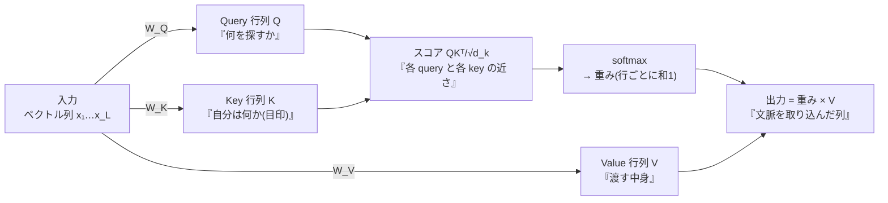
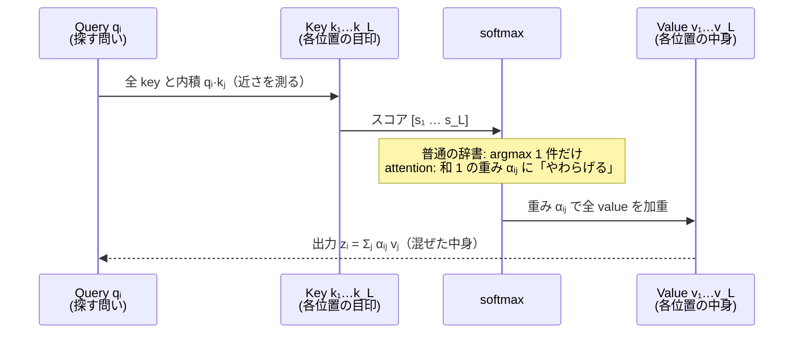
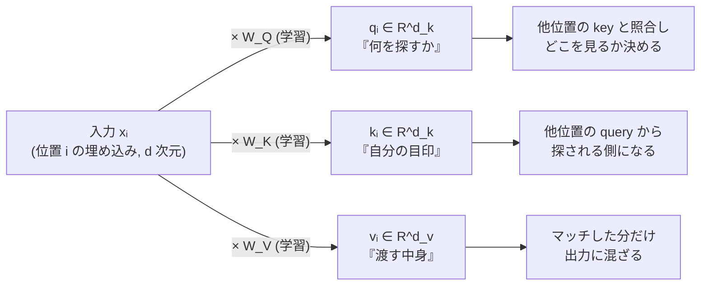
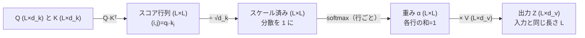
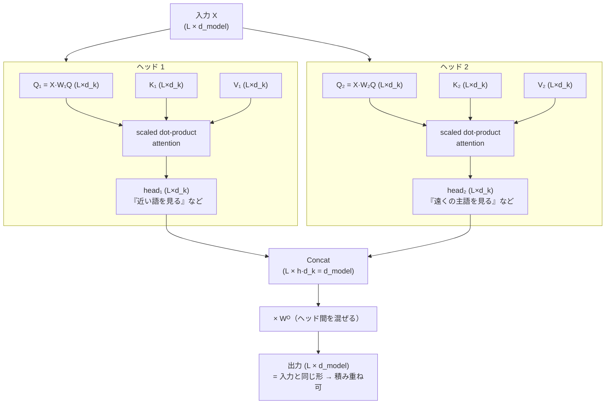
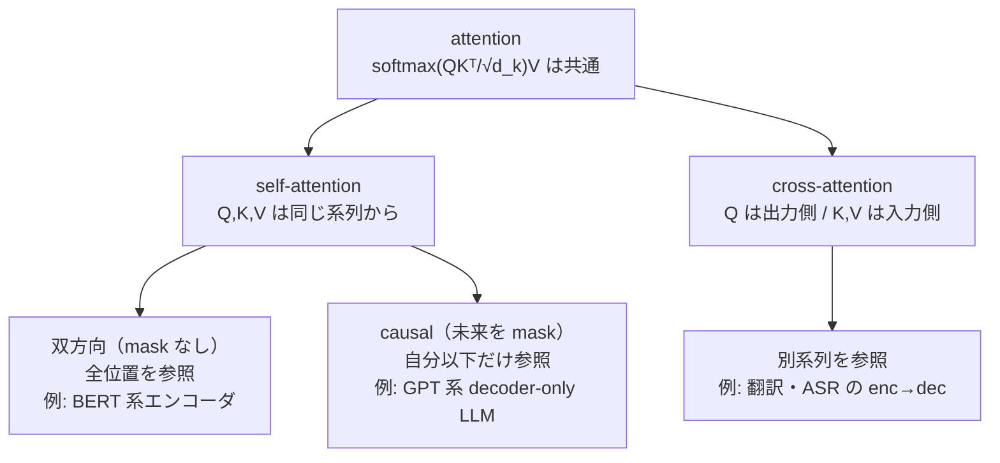
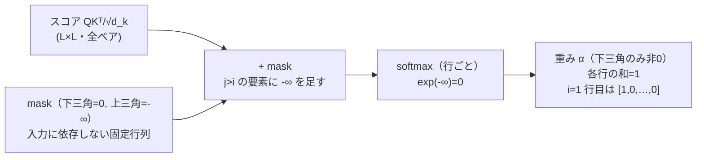
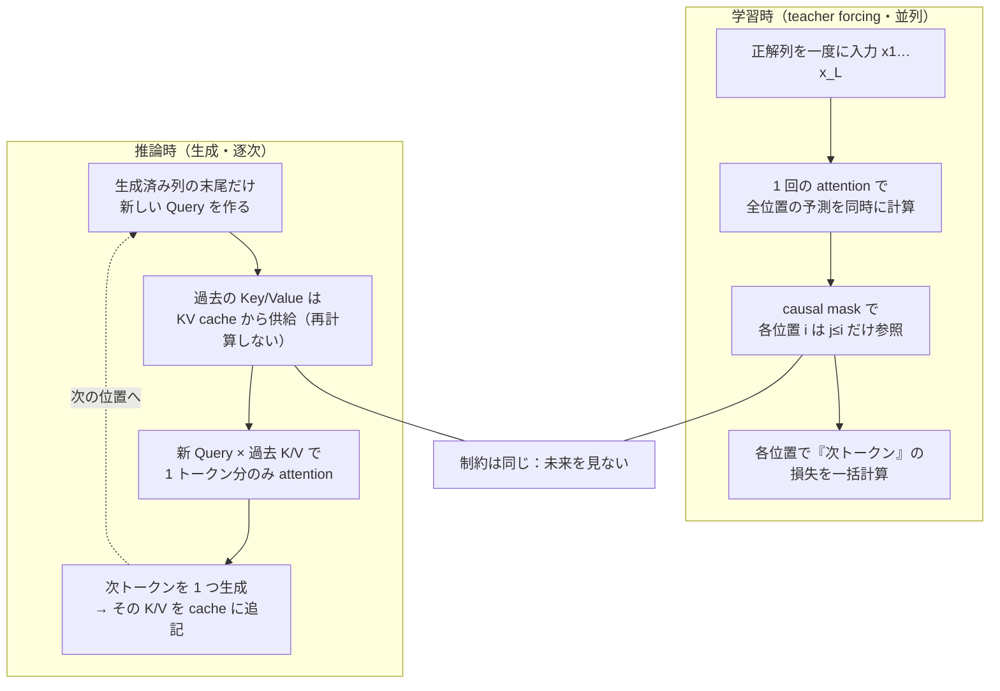
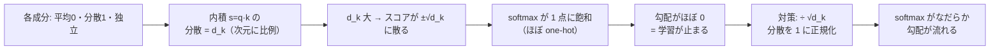

# Attention 機構

:::abstract[学習目標]
この章を読み終えると、次のことができるようになります。

- attention が解く問題 —— **任意の2位置を直接結ぶ**動的な情報のやり取り —— を、RNN/CNN と対比して**説明**できる
- **Query / Key / Value** が**別々の射影**から作られ、それぞれ別の役割を担うことを**述べ**られる
- **scaled dot-product attention** の式を**書き下し**、**なぜ $\sqrt{d_k}$ で割るか**を分散の議論から**導出**できる
- **multi-head** がなぜ1つの大きな attention より良いかを**説明**し、ヘッドの分割・結合を**追え**る
- **self-attention** と **cross-attention**、**causal mask**（未来を見ない）の違いを**区別**できる
- scaled dot-product attention と causal mask を **numpy で実装**し、重みと出力を確認できる
:::

## 前提知識

- 章01 [言語モデルとトークン化](/llm/01-language-model-and-tokenization/)：トークン列を埋め込みベクトル列 $x_1 \dots x_L$ にする流れと、**次トークン予測**（自己回帰）という学習目的
- 線形代数：行列積・内積・転置。ベクトルの内積が「向きの近さ（類似度）」を測ることに慣れていると一番効きます
- softmax：実数ベクトルを「和が 1 の確率分布」に変換する関数（本章で式を再掲します）

音声 ASR の章を読んだ方へ：ASR の cross-attention（章 [音声認識 (ASR)](/audio/04-asr/) の $\alpha_{u,t}$）と、その causal/chunk 化は、**本章で学ぶ attention とまったく同じ機構**です。本章はその一般形を、テキストの文脈で一から積み上げます。

## 直感

言語を理解するには、**離れた語どうしを結ぶ**必要があります。「その**動物**は道を渡らなかった。それが疲れていたからだ」—— 「それ」が指すのは「動物」です。両者は文の中で離れています。

この「離れた位置を結ぶ」を、従来の系列モデルは苦手にしていました。

- **RNN**（再帰）：情報を**1つずつ隣へ**バケツリレーします。語 $i$ と語 $j$ を結ぶには $|i-j|$ ステップかかり、遠いほど信号が薄れます（**長距離依存が弱い**）。しかも逐次処理なので**並列化できない**。
- **CNN**（畳み込み）：固定幅のカーネルで**近傍だけ**を見ます。遠い語に届かせるには層を何段も積む必要があります（**受容野がカーネル幅に縛られる**）。

attention の発想は単純です。**どの位置も、他の全位置を直接見て、関係の強い相手から情報を引いてくる。** 距離がいくつ離れていても「1 ホップ」で結べます。しかも各位置の計算は独立なので、**全位置を一気に並列計算**できます。

3 つの系列モデルが「位置 $i$ と位置 $j$ をどう結ぶか」を、1 枚で対比しておきます。

```mermaid
flowchart TB
  subgraph RNN["RNN（再帰）"]
    direction LR
    r1["x₁"] --> r2["x₂"] --> r3["x₃"] --> r4["x₄"]
  end
  subgraph CNN["CNN（畳み込み・幅3）"]
    direction LR
    c1["x₁"] -.近傍のみ.-> c2["x₂"] -.-> c3["x₃"] -.-> c4["x₄"]
  end
  subgraph ATT["attention（全結合・動的）"]
    direction LR
    a1["x₁"] a2["x₂"] a3["x₃"] a4["x₄"]
    a1 <--> a2
    a1 <--> a3
    a1 <--> a4
    a2 <--> a3
    a2 <--> a4
    a3 <--> a4
  end
  RNN --> note1["x₁→x₄ は 3 ステップ<br/>逐次・並列化×"]
  CNN --> note2["近傍 k 個のみ<br/>遠くは層を積む"]
  ATT --> note3["全ペアを 1 ホップ<br/>重みは入力ごとに動的・並列◯"]
```

3 つの違いを表にすると、attention が「何を捨てて何を得たか」がはっきりします。

| 観点 | RNN（再帰） | CNN（畳み込み） | attention |
| --- | --- | --- | --- |
| 位置 $i,j$ を結ぶ距離 | $\lvert i-j\rvert$ ステップ | 層を積めば届く（1 層は幅 $k$） | 常に **1 ホップ** |
| どこを見るか | 隣（前の隠れ状態） | **固定**の近傍 $k$ 個 | **入力依存で動的**に選ぶ |
| 長距離依存 | 弱い（信号が薄れる） | 受容野に縛られる | 強い（全位置を直接） |
| 並列化 | できない（逐次） | できる | **できる**（各位置独立） |
| 計算量（系列長 $L$） | $O(L)$・逐次 | $O(L \cdot k)$ | $O(L^2)$（全ペア） |

attention は「全ペアを見る」ぶん計算量が $L^2$ に増えますが、その代わりに**距離に縛られず・並列に・入力ごとに結線を変えられる**という三拍子を手に入れます。長系列での $O(L^2)$ をどう削るかは、次章以降（KV cache・効率化）の主題になります。

これが Transformer の心臓部です。本章では「どの位置を見るか」をどう決め（Query/Key）、「何を引いてくるか」をどう作り（Value）、なぜ $\sqrt{d_k}$ で割り、なぜ複数ヘッドに分け、どうやって「未来を見ない」を実現するか —— を一枚ずつ剥がしていきます。

:::note[LLM の文脈での位置づけ]
attention は次章 [Transformer の構造](/llm/03-transformer/) の中核部品です。Transformer は「attention（位置**間**を混ぜる）＋ FFN（各位置**内**のチャネルを混ぜる）」を残差で積み重ねた構造で、本章はその前半「位置間を混ぜる」だけを取り出して深掘りします。
:::

## 全体像

attention は **1 つの系列の各位置を、他の位置の情報で更新する**操作です。入力は埋め込みベクトル列、出力は同じ長さの「文脈を取り込んだ」ベクトル列です。



3 段階で読みます。

1. **3 つの役割を作る（射影）**：入力 $x$ から、3 つの**別々の**重み行列 $W_Q, W_K, W_V$ で **Query**（探す側の問い合わせ）、**Key**（探される側の目印）、**Value**（実際に渡す中身）を作る。
2. **重みを決める（スコア → softmax）**：各 Query と各 Key の内積で「近さ」を測り、$\sqrt{d_k}$ で割って softmax にかけ、**和が 1 の重み**にする。
3. **情報を集める（重み付き和）**：その重みで Value を混ぜ、各位置の出力にする。

| 部品 | 図書館のたとえ | 役割 |
| --- | --- | --- |
| Query $q$ | 探している本の**問い合わせ内容** | 「自分は何を知りたいか」 |
| Key $k$ | 各棚に貼られた**ラベル** | 「自分はどんな情報か（目印）」 |
| Value $v$ | 棚に入っている**本の中身** | 「マッチしたら渡す実体」 |
| スコア $q \cdot k$ | 問い合わせとラベルの**一致度** | どの棚を見るか決める |

「問い合わせ（Query）をラベル（Key）と照合して、合った棚の中身（Value）を取り出す」—— attention はこの**ソフトな辞書引き**です。普通の辞書は完全一致した 1 件だけを返しますが、attention は**全件に重みを付けて混ぜて**返します（だから "soft"）。

普通の辞書（ハッシュ）と attention を「位置 $i$ が値を引く」流れで並べると、違いは「1 件だけ返すか／全件を重み付きで混ぜるか」の一点に集約されます。



:::tip[「ハードな辞書引き」を soft にした、と読む]
普通の辞書は「キーが完全一致した 1 件」だけを返します。これを微分可能にするため、attention は「一致度（内積）」を softmax で**和 1 の重み**に変え、**全件を重みで混ぜて**返します。$\arg\max$（どれか 1 件）を、なめらかな**重み付き平均**で近似した、と見ると本質がつかめます。重みがほぼ one-hot に尖れば普通の辞書引きに、なだらかなら「複数の棚を少しずつ混ぜる」になります。
:::

## 理論

### Query / Key / Value —— なぜ 3 つに分けるか

入力の各位置 $i$ には埋め込みベクトル $x_i \in \mathbb{R}^{d}$ があります（$d$ はモデル次元、章01 の埋め込み出力）。ここから3つの役割を**別々の線形射影**で作ります。

$$q_i = x_i W_Q,\qquad k_i = x_i W_K,\qquad v_i = x_i W_V$$

- $W_Q \in \mathbb{R}^{d \times d_k}$、$W_K \in \mathbb{R}^{d \times d_k}$、$W_V \in \mathbb{R}^{d \times d_v}$ は**学習されるパラメータ行列**。データから勾配で決まります（固定値ではない）。
- $q_i, k_i \in \mathbb{R}^{d_k}$、$v_i \in \mathbb{R}^{d_v}$。$d_k$ は Query/Key の次元、$d_v$ は Value の次元（多くの実装で $d_k = d_v$）。
- 全位置をまとめて行列で書くと、$X \in \mathbb{R}^{L \times d}$（$L$ 行＝トークン数、各行が 1 トークンの埋め込み）に対し $Q = X W_Q$、$K = X W_K$、$V = X W_V$。$Q \in \mathbb{R}^{L \times d_k}$ の **$i$ 行目が位置 $i$ の Query**です。

同じ入力 $x_i$ が、3 つの別々の重み行列を通って 3 つの別物になる流れを 1 枚にします。**分岐が 3 本ある**こと、各分岐で**役割が枝分かれ**することがポイントです。



:::warning[Q/K/V は同じ $x$ から作るが、別物・別役割]
self-attention では Q・K・V は**同じ入力 $x$** から作られます。ここで「じゃあ 3 つは同じでは？」と早合点しがちですが、**通る重み行列 $W_Q, W_K, W_V$ が別々**なので、3 つは**別のベクトル**になり、**別の役割**を担います。

- $q_i$ は「位置 $i$ が**何を探したいか**」。
- $k_i$ は「位置 $i$ は**何という目印か**（他から探されたときの自分の顔）」。
- $v_i$ は「位置 $i$ が**マッチしたとき渡す中身**」。

もし $W_Q = W_K$ なら、スコア $q_i \cdot k_j = (x_i W)(x_j W)^\top$ は $i,j$ について対称になり、「A が B を見る」と「B が A を見る」を**区別できなく**なります。文法では「主語が動詞を探す」と「動詞が主語を探す」は非対称です。**3 つを別射影にすることで、この非対称性と役割分担を表現できる**のが要点です。
:::

### scaled dot-product attention の定義

位置 $i$ の出力 $z_i$ は、「$q_i$ と各 $k_j$ の近さ」で決めた重み $\alpha_{ij}$ を使った Value の重み付き和です。

$$\alpha_{ij} = \frac{\exp\!\big(q_i \cdot k_j / \sqrt{d_k}\big)}{\sum_{j'} \exp\!\big(q_i \cdot k_{j'} / \sqrt{d_k}\big)},\qquad z_i = \sum_{j} \alpha_{ij}\, v_j$$

- $q_i \cdot k_j$ は**内積**＝Query と Key の「向きの近さ」。大きいほど「位置 $i$ は位置 $j$ を見るべき」。
- $\sqrt{d_k}$ で割るのが **scaled**。理由は次節で導出します（一言でいうと softmax の飽和を防ぐため）。
- softmax で「各 $i$ について和が 1 の重み $\alpha_{i\cdot}$」にする。$\alpha_{ij}$ は「位置 $i$ の出力を作るとき、位置 $j$ の Value をどれだけ混ぜるか」。
- $z_i$ は位置 $i$ の**文脈を取り込んだ出力**。入力 $x_i$ と同じ「位置 $i$」のスロットに収まりますが、中身は他位置の情報で更新されています。

全位置をまとめて行列で書くと、本章の主役の式になります。

$$\mathrm{Attention}(Q,K,V) = \mathrm{softmax}\!\left(\frac{QK^\top}{\sqrt{d_k}}\right) V$$

ここで $QK^\top \in \mathbb{R}^{L \times L}$ は**スコア行列**で、**$(i,j)$ 要素が $q_i \cdot k_j$**（位置 $i$ の Query と位置 $j$ の Key の近さ）。softmax は**各行について**かけます（行＝Query の位置、列＝見にいく Key の位置、各行の和が 1）。最後に $V \in \mathbb{R}^{L \times d_v}$ を掛けて出力 $\in \mathbb{R}^{L \times d_v}$ を得ます。

行列の形（shape）が「掛けるたびにどう変わるか」を追うと、各ステップが何をしているか取り違えずに済みます。



:::warning[スコア行列の行と列を取り違えない]
$QK^\top$ の **$(i,j)$ 要素は「query 位置 $i$ × key 位置 $j$」**です。softmax は**行方向**（各 $i$ について全 $j$ を正規化）。
「列を正規化する」のではありません。各 query 位置が「自分はどの key を見るか」を和 1 で配分する、と読みます。次の実装でも、出力した重み行列の**各行の和が 1.0** になっていることで確認できます。
:::

### static な構造 vs dynamic な動作

ここが attention の効きどころです。**何が固定で、何が入力ごとに変わるか**を切り分けます。

| 要素 | 固定 / 学習 | 入力ごとに変わるか |
| --- | --- | --- |
| 重み行列 $W_Q, W_K, W_V$ | 学習で決まる**パラメータ**（推論時は固定） | 変わらない |
| 重み $\alpha_{ij}$（attention の重み） | パラメータではない | **入力 $x$ ごとに毎回計算し直す** |

畳み込みのカーネルは「どの位置を見るか」が**固定**です（常に隣 $k$ フレーム）。attention は「どの位置を見るか」を表す $\alpha_{ij}$ を、**そのときの入力から動的に計算**します。「それ」が出てきたら、その文脈に合わせて「動物」に高い重みを振る —— この**入力依存の動的な結線**が、固定カーネルにはできない attention の強みです。

### multi-head attention —— 1 つの大きな attention より複数の小さな attention

1 組の $W_Q, W_K, W_V$ だと、attention は**1 種類の「近さ」**しか測れません。でも言語の関係は多様です（係り受け・共参照・語の意味的近さ…）。そこで **$h$ 個の独立な attention（ヘッド）を並列に走らせ**、それぞれに別の関係を学ばせます。

$$
\mathrm{head}_i = \mathrm{Attention}(Q W_i^Q,\, K W_i^K,\, V W_i^V),\qquad i = 1 \dots h
$$

$$
\mathrm{MultiHead}(Q,K,V) = \mathrm{Concat}(\mathrm{head}_1, \dots, \mathrm{head}_h)\, W^O
$$

動作を 1 ステップずつ追います。

1. **分割**：各ヘッド $i$ は自分専用の射影 $W_i^Q, W_i^K, W_i^V$ を持つ。普通は次元を分けて $d_k = d_{\text{model}} / h$（例：$d_{\text{model}} = 8$, $h = 2$ なら各ヘッド $d_k = 4$）。**総計算量を 1 ヘッドと同程度に保ったまま** $h$ 種類の関係を見られる。
2. **各ヘッドで attention**：上の scaled dot-product を $h$ 回、独立に計算。ヘッドごとに**違う場所に重みが集まる**（あるヘッドは隣を、別のヘッドは遠くの主語を見る、など）。
3. **結合**：$h$ 個の出力（各 $\mathbb{R}^{L \times d_k}$）を最後の次元で**連結**して $\mathbb{R}^{L \times h d_k} = \mathbb{R}^{L \times d_{\text{model}}}$ に戻す。
4. **射影**：連結結果に出力射影 $W^O \in \mathbb{R}^{d_{\text{model}} \times d_{\text{model}}}$ を掛け、ヘッドどうしの情報を混ぜて最終出力にする。

この「分割 → 各ヘッドで attention → 連結 → 射影」のデータの流れを、$h=2$ で図にします。入力と出力の形がどちらも $\mathbb{R}^{L \times d_{\text{model}}}$ で**揃う**ことに注目してください（だから何層でも積める）。



:::note[なぜ「分割」がタダで効くか]
$h$ ヘッドにしても、$d_k = d_{\text{model}}/h$ と次元を割るので、$Q K^\top$ の計算量は 1 ヘッド（$d_k = d_{\text{model}}$）のときと同程度です。つまり**ほぼ同じ計算量で表現の多様性だけ増やせる**。これが multi-head が標準になった理由です。
:::

### self-attention と cross-attention

ここまでは Q・K・V を**同じ系列**から作る **self-attention**でした。Q・K・V の**出どころ**を変えると役割が変わります。

| 種類 | Query の出どころ | Key/Value の出どころ | 用途 |
| --- | --- | --- | --- |
| **self-attention** | 系列 A | 系列 A（同じ） | 系列内で文脈を混ぜる。Transformer の各層の主役 |
| **cross-attention** | 系列 B（出力側） | 系列 A（入力側） | 別系列を参照する。翻訳・ASR の encoder→decoder |

cross-attention の典型は翻訳や ASR です。デコーダ（出力テキスト側）が Query を出し、エンコーダ（入力側）が Key/Value を出して、「今出す語は入力のどこを見るべきか」を決めます。ASR の章で見た $\alpha_{u,t}$（出力文字 $u$ が入力フレーム $t$ をどれだけ見るか）は、まさに cross-attention の重みでした。

「どこから Q/K/V を作るか」と「未来を見てよいか」の 2 軸で、attention の使われ方を 1 枚の分類ツリーにまとめます。**式はどれも同じ** $\mathrm{softmax}(QK^\top/\sqrt{d_k})V$ で、変わるのは Q/K/V の出どころと mask だけです。



現代の **decoder-only LLM**（GPT 系）は、上のツリーの **causal self-attention** の枝を**積み重ねた**ものです。本章の残りはこの causal self-attention に焦点を当てます。

### causal mask —— 未来を見ない

言語モデルは「左から右へ、次のトークンを予測する」自己回帰モデルです（章01）。位置 $i$ のトークンを予測するとき、**位置 $i$ より後ろ（未来）のトークンを見てはいけません**。見たら答えを盗み見ることになります。

self-attention は素のままだと**全位置を見ます**（双方向）。そこで、**未来の位置への重みを 0 にする** mask をかけます。具体的には、スコア行列 $QK^\top$ の「$j > i$（未来）」の要素を $-\infty$ に置き換えてから softmax します。$\exp(-\infty) = 0$ なので、softmax 後にその位置の重みは**ちょうど 0** になります。

$$
\mathrm{mask}_{ij} =
\begin{cases}
0 & j \le i \quad(\text{過去と自分：参照可}) \\
-\infty & j > i \quad(\text{未来：遮断})
\end{cases}
,\qquad
\alpha_{i\cdot} = \mathrm{softmax}\big(\tfrac{q_i \cdot k_\cdot}{\sqrt{d_k}} + \mathrm{mask}_{i\cdot}\big)
$$

これで重み行列は**下三角**だけが非ゼロになります（各位置は自分以下しか見ない）。最初のトークン（$i=1$）は自分しか見られないので、重みは $[1, 0, \dots, 0]$ になります —— あとで実装で確認します。

mask が「スコア行列 → softmax → 重み」のどこに、どう効くかを 1 枚で追います。$-\infty$ を足してから softmax する、という順序が肝です。



:::warning[causal mask は学習時も推論時も未来を遮断する]
「causal mask は学習のときだけのトリックで、推論では要らない」と誤解しがちですが**逆です。両方で未来を遮断します。**

- **学習時**：全トークンを一度に入力し、各位置で「次のトークン」を**並列に**予測します（teacher forcing）。このとき mask が無いと、位置 $i$ の予測が未来 $i+1, i+2, \dots$ を見てしまい、カンニングになります。だから mask が**必須**。
- **推論時**：トークンを 1 つずつ生成します。そもそも未来のトークンはまだ存在しないので、自然に「過去だけ」を見ます。実装上は KV cache（過去の Key/Value を保持）で、新しい位置の Query を過去の Key/Value とだけ照合します。これは**学習時の causal mask と同じ「未来を見ない」制約**を、生成の形で実現したものです。

学習と推論で**計算の形は違う**（並列 vs 逐次）が、**「未来を見ない」という制約は両方で同じ**。ここを取り違えると、学習で mask を外して情報を漏らす、というバグを生みます。
:::

学習時（全位置を一度に・mask で並列）と推論時（1 トークンずつ・KV cache で逐次）の動作を、同じ「未来を見ない」制約のもとで対比します。



| 観点 | 学習時 | 推論（生成）時 |
| --- | --- | --- |
| データの出どころ | 正解列（teacher forcing） | 自分が生成したトークン |
| 計算の形 | 全位置を**並列**に 1 回 | 1 トークンずつ**逐次** |
| 「未来を見ない」の実現 | causal mask（$j>i$ を $-\infty$） | 未来はまだ存在しない＋KV cache |
| 過去の Key/Value | 毎回まとめて計算 | **cache を使い回す**（再計算しない） |
| mask は要るか | **必須**（無いとカンニング） | 構造上自然に満たされる |

:::warning[学習と推論で「文脈の出どころ」がずれる —— exposure bias]
学習時は常に**正解**を文脈に入れて次を予測します（teacher forcing）。しかし推論時は**自分の生成**を文脈に入れます。途中で 1 つ誤ると、その誤りが次の文脈に入り、ずれが雪だるま式に増えうる —— これを **exposure bias** と呼びます。causal mask 自体はこのずれを生みませんが、「学習と本番でデータの出どころが変わる」点は、章01 の自己回帰デコードと共通の注意点です。本章の範囲では「mask の制約は同じ／文脈の中身（正解 vs 生成）が違う」と切り分けて押さえてください。
:::

## 数式の導出：なぜ $\sqrt{d_k}$ で割るのか

scaled dot-product attention の "scaled"、つまり $\sqrt{d_k}$ で割る理由を、**スコアの分散**から導きます。これは天下りに見えて、attention が機能するための要です。

導出の道筋を先に 1 枚で見ておきます。**「分散が $d_k$ に比例 → softmax 飽和 → 勾配消失 → $\sqrt{d_k}$ で割って分散 1 に戻す」**という流れです。



**設定。** Query $q$ と Key $k$ はそれぞれ $d_k$ 次元のベクトルとし、各成分 $q_1 \dots q_{d_k}$, $k_1 \dots k_{d_k}$ が**互いに独立で、平均 0・分散 1** に正規化されているとします（学習初期はこれに近い）。

$$\mathbb{E}[q_m] = 0,\quad \mathrm{Var}[q_m] = 1,\quad \mathbb{E}[k_m] = 0,\quad \mathrm{Var}[k_m] = 1,\quad q_m \perp k_n$$

**ステップ 1：内積の平均。** スコアは内積 $s = q \cdot k = \sum_{m=1}^{d_k} q_m k_m$。各項の期待値は、独立性から

$$\mathbb{E}[q_m k_m] = \mathbb{E}[q_m]\,\mathbb{E}[k_m] = 0 \cdot 0 = 0$$

よって $\mathbb{E}[s] = \sum_{m=1}^{d_k} \mathbb{E}[q_m k_m] = 0$。スコアの平均は 0。

**ステップ 2：1 項の分散。** 各項 $q_m k_m$ の分散を求めます。平均が 0 なので $\mathrm{Var}[q_m k_m] = \mathbb{E}[(q_m k_m)^2] = \mathbb{E}[q_m^2]\,\mathbb{E}[k_m^2]$（独立性）。ここで $\mathbb{E}[q_m^2] = \mathrm{Var}[q_m] + (\mathbb{E}[q_m])^2 = 1 + 0 = 1$、同様に $\mathbb{E}[k_m^2] = 1$。よって

$$\mathrm{Var}[q_m k_m] = 1 \cdot 1 = 1$$

**ステップ 3：和の分散。** $d_k$ 個の項は互いに独立なので、分散は足し算できます。

$$\mathrm{Var}[s] = \mathrm{Var}\!\left[\sum_{m=1}^{d_k} q_m k_m\right] = \sum_{m=1}^{d_k} \mathrm{Var}[q_m k_m] = d_k$$

**つまり、生のスコア $s = q \cdot k$ の分散は次元 $d_k$ に比例して大きくなります。** $d_k = 64$ なら標準偏差は $\sqrt{64} = 8$。スコアが $\pm 8$ 程度に散らばります。

**ステップ 4：なぜそれが問題か。** softmax はスコアの**差**に指数で反応します。スコアの 1 つが他より大きく突出すると、softmax はそこに**ほぼ全部の重みを集め**、出力がほぼ one-hot になります。これを **softmax の飽和**と呼びます。飽和した softmax は、ほとんどの入力に対して勾配がほぼ 0 になり（出力がほぼ定数 0 または 1）、**学習が進みません**（勾配消失）。

**ステップ 5：解決。** スコアを $\sqrt{d_k}$ で割れば、分散を $d_k$ で割れて 1 に正規化できます。

$$\mathrm{Var}\!\left[\frac{s}{\sqrt{d_k}}\right] = \frac{1}{(\sqrt{d_k})^2}\,\mathrm{Var}[s] = \frac{1}{d_k} \cdot d_k = 1$$

これで $d_k$ がいくつでも、スコアの分散は **常に 1 程度**に保たれます。softmax が飽和せず、適度になだらかな重み分布になり、勾配が流れます。**だから $\sqrt{d_k}$ で割る。** $\blacksquare$

導出で出てきた量を一覧にしておきます。何が定数で何が確率変数か、$d_k$ にどう依存するかが一目で分かります。

| 量 | 平均 | 分散 | $d_k$ 依存 |
| --- | --- | --- | --- |
| 1 成分の積 $q_m k_m$ | 0 | 1 | しない |
| 生の内積 $s = q\cdot k$ | 0 | $d_k$ | **比例して増える** |
| スケール後 $s/\sqrt{d_k}$ | 0 | **1** | しない（常に 1） |

:::note[なぜ $\sqrt{d_k}$ で割り、$d_k$ で割らないか]
正規化したいのは**分散**ですが、スコア自身（標準偏差スケールの量）に対して効かせたいので、**標準偏差 $\sqrt{d_k}$ で割る**のが正解です。$d_k$ で割ると割りすぎてスコアが潰れます。「分散を 1 にしたいなら標準偏差で割る」と覚えます。
:::

## 実装

scaled dot-product attention と causal mask を numpy だけで書きます。上の理論（重みの行和が 1、causal で上三角が 0、$\sqrt{d_k}$ で分散が正規化される）を**実測**で確かめます。

```python title="attention.py"
import numpy as np

np.random.seed(0)

def softmax(z, axis=-1):
    # 数値安定化: 各行の最大値を引いてから exp する（overflow を防ぐため）
    z = z - z.max(axis=axis, keepdims=True)
    e = np.exp(z)
    return e / e.sum(axis=axis, keepdims=True)

def scaled_dot_product_attention(Q, K, V, mask=None):
    # Q:(Lq,dk) K:(Lk,dk) V:(Lk,dv)。スコアを sqrt(dk) で割って分散を正規化する
    dk = Q.shape[-1]
    scores = (Q @ K.T) / np.sqrt(dk)        # (Lq, Lk): 各 query と各 key の類似度
    if mask is not None:
        # mask が 0 の位置（未来）を -inf にして softmax 後に 0 重みへ落とす
        scores = np.where(mask == 0, -np.inf, scores)
    weights = softmax(scores, axis=-1)       # (Lq, Lk): 各行が和 1 の重み
    out = weights @ V                        # (Lq, dv): 重み付き和
    return out, weights

# 4 トークン・d_k = d_v = 8 のトイ系列（self-attention なので Q,K,V は同じ系列から作る）
L, dk, dv = 4, 8, 8
x = np.random.randn(L, dk)

# Q/K/V は別々の射影。役割が違うことを示すため別の重み行列を使う
Wq = np.random.randn(dk, dk) * 0.5
Wk = np.random.randn(dk, dk) * 0.5
Wv = np.random.randn(dk, dv) * 0.5
Q, K, V = x @ Wq, x @ Wk, x @ Wv

# --- causal mask なし（双方向 self-attention） ---
out_full, w_full = scaled_dot_product_attention(Q, K, V)

# --- causal mask あり（各 query は自分以下の位置だけ参照） ---
causal = np.tril(np.ones((L, L)))            # 下三角が 1（過去+自分）, 上三角が 0（未来）
out_causal, w_causal = scaled_dot_product_attention(Q, K, V, mask=causal)

np.set_printoptions(precision=3, suppress=True)
print("causal mask (1=参照可, 0=遮断):")
print(causal.astype(int))
print("\n[双方向] attention 重み (行=query, 列=key):")
print(w_full)
print("各行の和:", w_full.sum(axis=1))
print("\n[causal] attention 重み (上三角=未来=0 になっている):")
print(w_causal)
print("各行の和:", w_causal.sum(axis=1))

# sqrt(dk) で割らないと分散が dk 倍に膨らむことの確認
raw = Q @ K.T
print("\nスコア分散: 割らない=%.2f / sqrt(dk)で割る=%.2f (理論上 1/dk 倍)"
      % (raw.var(), (raw / np.sqrt(dk)).var()))
```

```text title="出力"
causal mask (1=参照可, 0=遮断):
[[1 0 0 0]
 [1 1 0 0]
 [1 1 1 0]
 [1 1 1 1]]

[双方向] attention 重み (行=query, 列=key):
[[0.04  0.672 0.219 0.069]
 [0.156 0.3   0.212 0.333]
 [0.008 0.108 0.823 0.062]
 [0.007 0.625 0.33  0.039]]
各行の和: [1. 1. 1. 1.]

[causal] attention 重み (上三角=未来=0 になっている):
[[1.    0.    0.    0.   ]
 [0.342 0.658 0.    0.   ]
 [0.008 0.115 0.877 0.   ]
 [0.007 0.625 0.33  0.039]]
各行の和: [1. 1. 1. 1.]

スコア分散: 割らない=21.74 / sqrt(dk)で割る=2.72 (理論上 1/dk 倍)
```

読み取れることが3つあります。

1. **重みの各行の和が 1.0**。softmax を行方向にかけているので、各 query 位置は「どの key を見るか」を和 1 で配分しています（理論の主張どおり）。
2. **causal で上三角がちょうど 0**。1 行目（最初のトークン）は $[1, 0, 0, 0]$ —— 自分しか見ません。2 行目は過去 2 つに重みが割れ、未来は 0。**未来が確実に遮断**されています。
3. **分散の正規化**。生のスコアの分散 $21.74$ が、$\sqrt{d_k}$ で割ると $2.72$ に（おおむね $1/d_k = 1/8$ 倍）。理論の導出と一致します。

ここで、双方向と causal の重み行列が「どの三角を使うか」で対比できます。同じ Q/K/V でも、mask の有無で**参照範囲だけ**が変わり、softmax の正規化（行和 1）は両方とも保たれていることに注目してください。

| 行（query 位置 $i$） | 双方向（mask なし） | causal（mask あり） |
| --- | --- | --- |
| $i=1$ | 全 4 列に重み | $[1,0,0,0]$（自分のみ） |
| $i=2$ | 全 4 列に重み | 列 1–2 のみ非0、列 3–4 は 0 |
| $i=3$ | 全 4 列に重み | 列 1–3 のみ非0、列 4 は 0 |
| $i=4$ | 全 4 列に重み | 全 4 列（最終行は未来なし、両者一致） |
| 各行の和 | $1.0$ | $1.0$ |

次に **multi-head** と、**softmax の飽和**（$\sqrt{d_k}$ で割らないと何が起きるか）を確認します。

```python title="multihead.py"
import numpy as np

np.random.seed(0)

def softmax(z, axis=-1):
    z = z - z.max(axis=axis, keepdims=True)
    e = np.exp(z)
    return e / e.sum(axis=axis, keepdims=True)

def sdpa(Q, K, V, mask=None):
    dk = Q.shape[-1]
    s = (Q @ K.T) / np.sqrt(dk)
    if mask is not None:
        s = np.where(mask == 0, -np.inf, s)
    w = softmax(s)
    return w @ V, w

# d_model=8 を h=2 ヘッドに分割（各ヘッド d_k=4）
L, d_model, h = 4, 8, 2
dk = d_model // h
x = np.random.randn(L, d_model)
causal = np.tril(np.ones((L, L)))

heads = []
for i in range(h):
    Wq = np.random.randn(d_model, dk) * 0.5
    Wk = np.random.randn(d_model, dk) * 0.5
    Wv = np.random.randn(d_model, dk) * 0.5
    head_out, _ = sdpa(x @ Wq, x @ Wk, x @ Wv, mask=causal)
    heads.append(head_out)

concat = np.concatenate(heads, axis=-1)   # (L, h*dk) = (L, d_model)
Wo = np.random.randn(d_model, d_model) * 0.5
mh_out = concat @ Wo

np.set_printoptions(precision=3, suppress=True)
print("各ヘッド出力 shape:", [hd.shape for hd in heads])
print("concat shape:", concat.shape, "-> Wo で射影 -> 最終 shape:", mh_out.shape)

# softmax の飽和: スコアの分散が大きいと 1 点に張り付く（勾配が消える）
small = np.array([1.0, 2.0, 0.5, 1.5])      # 適度なばらつき
large = small * 8                            # sqrt(dk) で割らない世界を模擬（分散 64 倍）
print("\nsoftmax(適度):", np.round(softmax(small), 3))
print("softmax(過大):", np.round(softmax(large), 3), " <- ほぼ one-hot（飽和）")
```

```text title="出力"
各ヘッド出力 shape: [(4, 4), (4, 4)]
concat shape: (4, 8) -> Wo で射影 -> 最終 shape: (4, 8)

softmax(適度): [0.167 0.455 0.102 0.276]
softmax(過大): [0.    0.982 0.    0.018]  <- ほぼ one-hot（飽和）
```

- **shape の流れ**：2 ヘッドがそれぞれ $(4, 4)$ を出し、連結で $(4, 8) = (L, d_{\text{model}})$ に戻り、$W^O$ で混ぜて最終 $(4, 8)$。入力と同じ形に戻る = **何層でも積み重ねられる**ことを意味します（次章の Transformer ブロック）。
- **飽和の実証**：同じスコアでも 8 倍にスケールするだけで、softmax が $[0, 0.982, 0, 0.018]$ とほぼ one-hot に張り付きます。これが「$\sqrt{d_k}$ で割らないと起きること」です。飽和した分布は勾配がほぼ 0 になり、学習が止まります。理論の導出（ステップ 4）が、数値で目に見えました。

## 演習

::::question[演習 1: causal mask とスコア行列]
4 トークンの causal self-attention を考えます。(a) スコア行列 $QK^\top$ の $(i,j)$ 要素は何を表しますか。(b) causal mask をかけた後、softmax 前にどの位置が $-\infty$ になりますか。(c) 最初のトークン（$i=1$）の attention 重みベクトルはどうなりますか。理由も述べてください。

:::details[解答]
(a) $(i,j)$ 要素は $q_i \cdot k_j$、すなわち **query 位置 $i$ と key 位置 $j$ の内積（近さ）** です。「位置 $i$ が位置 $j$ をどれだけ見たいか」のスコア（softmax 前）。

(b) $j > i$ の位置、つまり**スコア行列の上三角（対角より右上）**が $-\infty$ になります。未来の位置です。$\exp(-\infty)=0$ なので softmax 後の重みがちょうど 0 になり、未来が遮断されます。

(c) $[1, 0, 0, 0]$ になります。$i=1$ は自分（位置 1）しか見られず（$j>1$ は全部 $-\infty$）、残った候補が位置 1 だけなので、softmax は唯一の要素に重み 1 を割り当てます。実装の出力でも 1 行目が `[1. 0. 0. 0.]` でした。
:::
::::

::::question[演習 2: なぜ $\sqrt{d_k}$ で割るか]
Query/Key の各成分が独立に平均 0・分散 1 だとします。(a) 内積 $s = q \cdot k$（$d_k$ 次元）の分散はいくつですか。(b) $d_k = 64$ のとき、スコアの標準偏差はおよそいくつですか。それが大きいと softmax に何が起きますか。(c) $\sqrt{d_k}$ で割ると分散はいくつになりますか。$d_k$ で割ってはいけないのはなぜですか。

:::details[解答]
(a) $\mathrm{Var}[s] = d_k$。各項 $q_m k_m$ が独立で分散 1、それが $d_k$ 個足されるので分散も $d_k$ 倍になります（導出のステップ 1–3）。

(b) 標準偏差は $\sqrt{64} = 8$。スコアが $\pm 8$ 程度に散らばると、softmax は最大要素に**ほぼ全重みを集めて飽和**し、出力がほぼ one-hot になります。飽和した softmax は勾配がほぼ 0 で、学習が進みません（勾配消失）。実装の `softmax(過大)` がまさにこれで、$[0, 0.982, 0, 0.018]$ でした。

(c) $\mathrm{Var}[s/\sqrt{d_k}] = d_k / (\sqrt{d_k})^2 = d_k/d_k = 1$。分散がちょうど 1 に正規化されます。$d_k$ で割ると $\mathrm{Var} = d_k/d_k^2 = 1/d_k$ と**割りすぎて**スコアが潰れ、今度は全位置がほぼ均等な重み（情報を選べない）になります。正規化したいのは分散なので、スコア（標準偏差スケール）に対しては**標準偏差 $\sqrt{d_k}$ で割る**のが正解です。
:::
::::

::::question[演習 3: self / cross / causal の使い分け]
次の 3 つの場面で、Query・Key/Value の出どころと、causal mask の要否を答えてください。(a) GPT 系 decoder-only LLM が次トークンを予測する層。(b) 翻訳のデコーダが入力文（エンコーダ出力）を参照する層。(c) BERT のように文全体を一度に読んで各語の表現を作る層。3 つに共通する式は何ですか。

:::details[解答]
共通する式はどれも $\mathrm{Attention}(Q,K,V) = \mathrm{softmax}\big(\frac{QK^\top}{\sqrt{d_k}}\big)V$ です。変わるのは **Q/K/V の出どころと mask だけ**。

(a) **causal self-attention**：Q・K・V はすべて**同じ系列**（生成中のテキスト）から作り、**causal mask が必須**（未来を見るとカンニング）。本章の主役で、これを積み重ねたのが GPT 系。

(b) **cross-attention**：Q は**デコーダ側**（出力テキスト）、K/V は**エンコーダ側**（入力文）から作ります。別系列を参照するので入力文側の mask は不要（入力文は全部見てよい。ただしデコーダ自身の self-attention 層は別途 causal）。

(c) **双方向 self-attention**：Q・K・V は同じ系列（入力文）から作り、**mask なし**（未来も含め全位置を参照してよい）。BERT 系エンコーダがこれ。次トークン予測ではなく、文全体の文脈で各語を表現します。
:::
::::

## まとめ

:::success[この章の要点]
- attention は**任意の2位置を 1 ホップで直接結ぶ**動的な機構。RNN（逐次・遠距離が弱い）や CNN（固定近傍）の弱点を、入力依存の重み $\alpha_{ij}$ で克服する。
- **Query / Key / Value は同じ入力から別々の射影 $W_Q, W_K, W_V$ で作られ、役割が違う**（探す問い／目印／渡す中身）。この別射影が「A→B」と「B→A」の非対称性を表現する。
- 中核の式は $\mathrm{Attention}(Q,K,V) = \mathrm{softmax}\big(\frac{QK^\top}{\sqrt{d_k}}\big)V$。$\sqrt{d_k}$ で割るのは、内積の分散が $d_k$ に比例して膨らみ softmax が飽和するのを防ぐため（分散を 1 に正規化）。
- **multi-head** は $h$ 個の小さな attention を並列に走らせ、ほぼ同じ計算量で多様な関係を捉える。出力は連結 → $W^O$ で射影し、入力と同じ形に戻る（積み重ね可能）。
- **causal mask** は未来（$j>i$）のスコアを $-\infty$ にして遮断する。**学習時も推論時も未来を見ない** —— 学習は並列・推論は逐次と形は違うが、制約は同じ。
:::

### 次に学ぶこと

ここまでで Transformer の心臓部 —— 位置**間**を混ぜる attention —— が手に入りました。次章 [Transformer の構造](/llm/03-transformer/) では、この attention を、各位置**内**のチャネルを混ぜる FFN・残差接続・正規化・位置符号化と組み合わせて、**1 つの完全な Transformer ブロック**を組み上げ、それを積み重ねて言語モデルにします。本章の causal self-attention が、その decoder-only LLM の骨格になります。

→ [LLM ロードマップに戻る](/llm/)

## 用語ミニ辞典

| 用語 | 一言 |
| --- | --- |
| attention | 各位置が他の全位置を見て、関係の強い相手から情報を引く機構 |
| Query / Key / Value | 探す問い／目印／渡す中身。同じ入力から別射影で作る |
| scaled dot-product | スコア $QK^\top$ を $\sqrt{d_k}$ で割って softmax する attention の標準形 |
| $\sqrt{d_k}$ で割る | 内積の分散（$=d_k$）を 1 に正規化し softmax の飽和を防ぐ |
| softmax の飽和 | スコアが散らばりすぎ、重みがほぼ one-hot に張り付き勾配が消える現象 |
| attention 重み $\alpha_{ij}$ | 位置 $i$ が位置 $j$ をどれだけ見るか。入力ごとに動的に計算 |
| multi-head | $h$ 個の attention を並列に走らせ多様な関係を捉える |
| self-attention | Q・K・V を同じ系列から作る。Transformer 各層の主役 |
| cross-attention | Q を出力側・K/V を入力側から作る。翻訳・ASR で別系列を参照 |
| causal mask | 未来（$j>i$）のスコアを $-\infty$ にして遮断。自己回帰の必須部品 |
| exposure bias | 学習は正解・推論は自己生成を文脈に使うずれ。誤りが連鎖しうる |

## 次のアクション

理論を手で定着させる。**最小の写経 → 動かす → 小実験** を1セットで。

1. 上の `attention.py` をそのまま写経し、`uv run --with numpy python attention.py` で実行する。出力の**各行の和が 1.0** であること、causal で上三角が 0 になることを自分の目で確認する。
2. $d_k$ を 8 → 64 に変え、`raw.var()` がどう変わるか測る。**$\sqrt{d_k}$ で割った後の分散はほぼ一定**に保たれることを確かめる（飽和を防ぐ効果の実感）。
3. 余力があれば、`multihead.py` のヘッド数 $h$ を 2 → 4 に増やし、各ヘッドの重み行列を `print` して**ヘッドごとに重みの集まる位置が違う**ことを観察する。次章の Transformer ブロックへの足がかりになる。

## 参考文献

1. A. Vaswani, N. Shazeer, N. Parmar, J. Uszkoreit, L. Jones, A. N. Gomez, Ł. Kaiser, I. Polosukhin, "Attention Is All You Need," *NeurIPS*, 2017.（Transformer・scaled dot-product / multi-head attention の原論文）
2. D. Bahdanau, K. Cho, Y. Bengio, "Neural Machine Translation by Jointly Learning to Align and Translate," *ICLR*, 2015.（attention の起源・additive attention）
3. J. Alammar, "The Illustrated Transformer," 2018.（attention の視覚的な定番解説）
4. N. Shazeer, "Fast Transformer Decoding: One Write-Head is All You Need," 2019.（Multi-Query Attention・KV cache 削減の起点。次章以降の伏線）
5. J. Ainslie et al., "GQA: Training Generalized Multi-Query Transformer Models from Multi-Head Checkpoints," *EMNLP*, 2023.（multi-head と KV キャッシュ削減の橋渡し）
