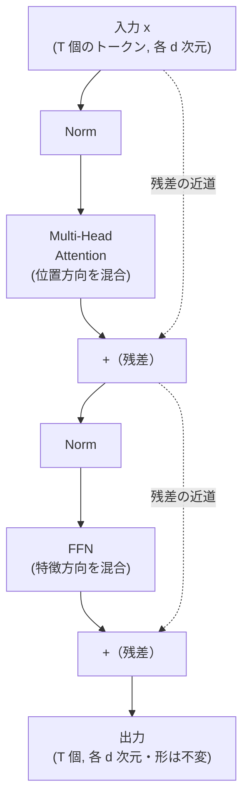
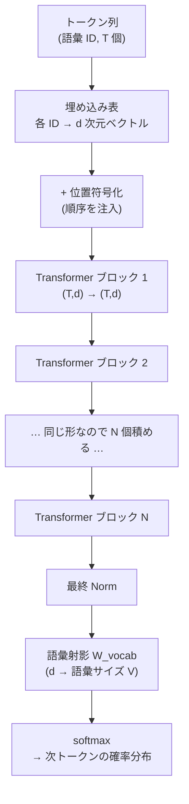
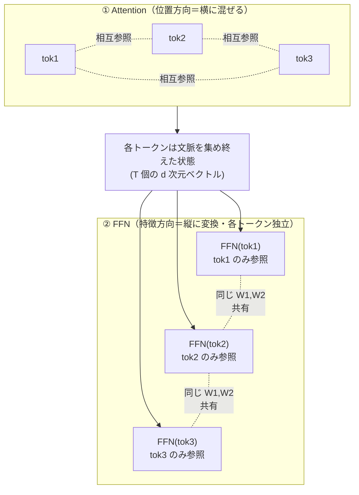
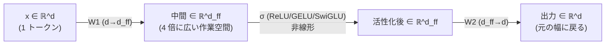
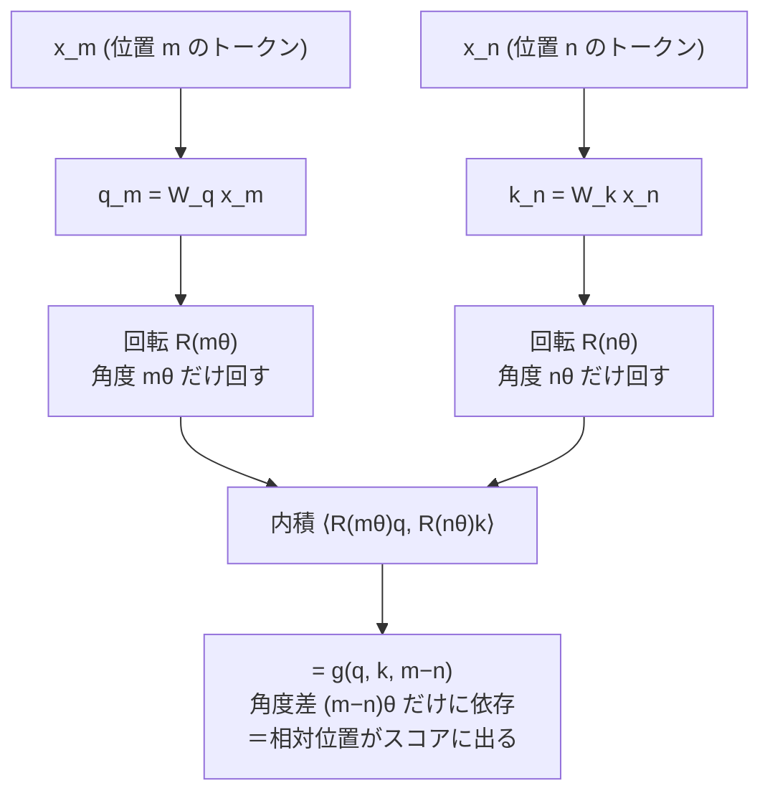
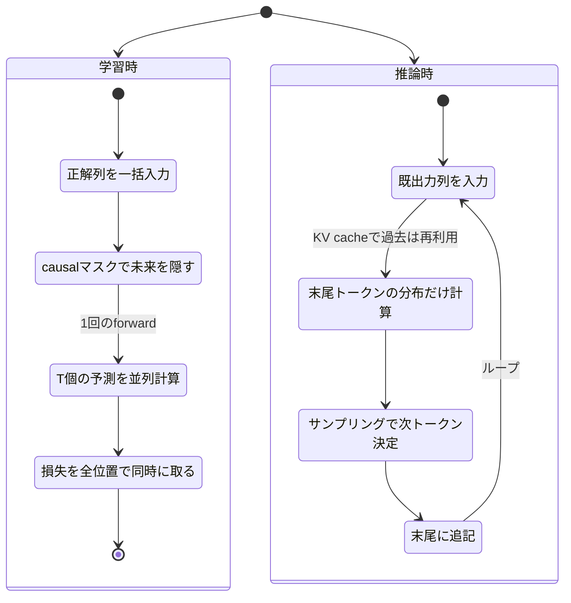
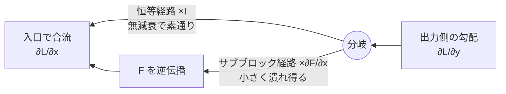

# Transformer の構造

:::abstract[学習目標]
この章を読み終えると、次のことができるようになります。

- **Transformer ブロック**を 4 部品（multi-head attention・位置ごとの FFN・残差接続・正規化）に分解して**説明**できる
- **残差 + 正規化**の式 $x \leftarrow x + \mathrm{Attn}(\mathrm{Norm}(x))$ を、なぜこの形か（勾配が流れる・恒等写像から始まる）まで含めて**導出**できる
- **pre-norm vs post-norm**・**LayerNorm vs RMSNorm** を、安定性・計算量の観点で**比較**できる
- **位置符号化**を「なぜ要るか」から始め、絶対位置と **RoPE（回転位置埋め込み）**の発想を**区別**できる
- **decoder-only**（causal mask 付き）構成が現代 LLM の標準形である理由を**述べ**、numpy で 1 ブロックの forward を**実装**できる
:::

## 前提知識

- 章02 [Attention 機構](/llm/02-attention/)：scaled dot-product attention $\mathrm{softmax}(QK^\top/\sqrt{d_k})V$、multi-head、causal mask、KV cache。本章は attention を **1 つの完成部品**として受け取り、その「外側の配線」を扱います。
- 深層学習の基礎：残差接続（ResNet）、誤差逆伝播、勾配消失・爆発。
- 音声側の橋渡しとして章04 [音声認識 (ASR) とストリーミング](/audio/04-asr/)：Conformer ブロック（½ FFN macaron・残差・正規化）。**Conformer は本章の Transformer ブロックに conv モジュールを足したもの**です。最後にこの対比で締めます。

LLM 出身の読者にとって、本章は「すでに知っている部品を、正しい順番で配線する」回です。新しい概念は **位置符号化**と **正規化の配置**の 2 点に絞られます。

## 直感

章02 で attention という強力な部品を手に入れました。しかし attention 単体では言語モデルは作れません。3 つの穴があるからです。

1. **深く積めない。** attention を何十層も素朴に重ねると、勾配が消えるか暴れて学習が崩れます。深さは性能の源なので、これは致命的です。
2. **位置が分からない。** attention は集合演算です。「猫が魚を食べた」と「魚が猫を食べた」を**同じ**に見ます（語の集合が同じだから）。語順を教える仕組みが要ります。
3. **チャネル方向の変換がない。** attention は「どのトークンを見るか」（位置方向の混合）はやりますが、「各トークンの中身をどう変換するか」（特徴方向の混合）はやりません。

穴2 を具体例で歩いてみましょう。attention のスコアは Query と Key の内積で決まります。位置符号化が無ければ、トークン「猫」の埋め込みは文中のどこにあっても**同じベクトル**です。すると「猫が魚を食べた」と「魚が猫を食べた」では、登場する語ベクトルの集合 $\{\text{猫}, \text{が}, \text{魚}, \text{を}, \text{食べた}\}$ が**完全に一致**し、attention が計算するスコア行列も（並べ替えを除いて）同じ値になります。つまり attention にとって 2 文は区別できません —— 主語と目的語が入れ替わっても気づけない。これでは言語モデルとして致命的なので、**「猫は 1 番目、魚は 3 番目」という位置情報を注入する**仕組みが要る、というのが穴2 です。

これら 3 つの穴と部品の対応を先に表で掴んでおきます。

| 穴 | 何が足りないか | 埋める部品 | 一言 |
| --- | --- | --- | --- |
| 穴1 | 深く積むと勾配が壊れる | 残差接続 + 正規化 | 勾配の「素通り路」を作る |
| 穴2 | 語順が分からない（集合演算） | 位置符号化 | 順序を埋め込みに注入 |
| 穴3 | 各トークン内の変換が無い | 位置ごとの FFN | 集めた文脈を加工する |

**Transformer ブロック**は、この 3 つを 3 つの部品でちょうど埋めます —— **残差接続 + 正規化**（穴1）、**位置符号化**（穴2）、**位置ごとの FFN**（穴3）。この章のゴールは、attention をこれらで包んで「深く積める 1 ブロック」を組み立て、それを numpy で実際に動かすことです。これが現代 LLM のほぼすべて（GPT・Llama・Qwen・DeepSeek など、ベンダを問わず）が共有する骨格です。

## 全体像

Transformer ブロックは **2 つのサブブロックの直列**です。前半が attention、後半が FFN。どちらも「正規化してから処理し、結果を元の入力に足し戻す（残差）」という同じ形をしています。



順方向（forward）はこの図を上から下へ流れるだけです。逆方向（backward・勾配）は、点線の「残差の近道」を通って**減衰せずに**入力まで戻れる —— ここが深く積める鍵で、後で式で確かめます。

ブロックを 1 個通っても**テンソルの形 $(T, d)$ は変わりません**。だから同じブロックを $N$ 個積み重ねられます（GPT-3 なら 96 層）。入口でトークン埋め込みに**位置符号化**を足し、出口の最終層で語彙への射影 + softmax を載せれば、次トークン予測器の完成です。この「埋め込み → $N$ 層のブロック → 語彙射影」という外側の組み立ては、次の図で一望できます。



この図で大事なのは、中央の $N$ 個のブロックが**すべて同じ入出力形 $(T,d)$ を持つ**ことです。各ブロックの内部パラメータは別々（共有しない）ですが、**インターフェース（形）が共通**なので機械的に積み増せます。これがスケーリング（章04）を可能にする土台です。位置符号化を足すのは**入口で 1 回だけ**（絶対位置の場合）か、各ブロックの attention 内で毎回（RoPE の場合）—— この違いは後述の位置符号化の節で詳しく扱います。

| 段階 | 入力 | 出力 | パラメータ | 何回起きるか |
| --- | --- | --- | --- | --- |
| 埋め込み | 語彙 ID（整数）$T$ 個 | $(T, d)$ | 埋め込み表 $V \times d$ | 入口で 1 回 |
| 位置符号化（絶対） | $(T, d)$ | $(T, d)$ | $p_m$（固定 or 学習） | 入口で 1 回 |
| ブロック × $N$ | $(T, d)$ | $(T, d)$ | 各ブロック独立 | $N$ 回 |
| 語彙射影 + softmax | $(T, d)$ | $(T, V)$ | $W_{\text{vocab}}$ $d \times V$ | 出口で 1 回 |

| 部品 | 何を混ぜるか | 章02 との関係 |
| --- | --- | --- |
| Multi-Head Attention | **位置方向**（トークン間） | 章02 の成果物。本章では部品として使う |
| FFN（位置ごと） | **特徴方向**（各トークン内のチャネル） | 本章で追加 |
| 残差 + Norm | 深さを可能にする「配線」 | 本章で追加 |
| 位置符号化 | 順序情報の注入 | 本章で追加 |

:::note[LLM ↔ Speech]
このブロック構造は音声章の **Conformer とほぼ同型**です。Conformer は「½ FFN → MHSA → Conv → ½ FFN」という macaron 構造でした（[章04](/audio/04-asr/)）。Transformer ブロックはそこから **Conv モジュールを抜き、FFN を 1 個に戻した**もの、と見ると両者が一望できます。逆に言えば **Conformer = Transformer + conv**。章の最後で正確に対比します。
:::

## 理論

### 部品1：multi-head attention（おさらいと記号の確定）

章02 の成果物をそのまま使います。入力 $X \in \mathbb{R}^{T \times d}$（$T$ 個のトークン、各 $d$ 次元）に対し、

$$\mathrm{Attention}(Q,K,V)=\mathrm{softmax}\!\left(\frac{QK^{\top}}{\sqrt{d_k}}\right)V,\qquad Q=XW^Q,\ K=XW^K,\ V=XW^V$$

を $h$ 個のヘッドで並列に行い、連結して出力射影 $W^O$ を掛けます。本章で押さえるべきは **役割**だけです —— **attention は「位置方向（トークン間）を混ぜる」**。トークン $i$ の出力は、全トークン $j$ の値 $V_j$ を重み $\alpha_{ij}$ で混ぜたものです。各トークンの**中身（チャネル）の非線形変換はしません**。それは次の FFN の仕事です。

:::warning[記号の衝突に注意：$d$・$d_k$・$d_{ff}$]
本章には次元を表す記号が複数出ます。混同しないでください。

| 記号 | 意味 | 典型値 |
| --- | --- | --- |
| $d$（= $d_{\text{model}}$） | ブロックを貫く「モデル次元」。入力・出力・残差はすべてこの幅 | 768, 4096 |
| $d_k$（= $d_{\text{head}}$） | 1 ヘッド内の次元。$d_k = d/h$ | 64, 128 |
| $d_{ff}$ | FFN の中間で一時的に広げる幅。通常 $d_{ff} = 4d$ | 3072, 16384 |

$d$ は**ブロックを通して不変**（残差が足せるよう）。$d_{ff}$ は FFN の**内部だけ**で広がり、出口で $d$ に戻ります。
:::

### 部品2：位置ごとの FFN（feed-forward network）

FFN は **各トークンを独立に通す 2 層の MLP** です。

$$\mathrm{FFN}(x) = W_2\,\sigma(W_1 x + b_1) + b_2$$

ここで $x \in \mathbb{R}^{d}$ は **1 トークン**の表現、$W_1 \in \mathbb{R}^{d_{ff}\times d}$ が次元を $d \to d_{ff}$ に広げ、活性化 $\sigma$（古典は ReLU/GELU、現代は SwiGLU）を通し、$W_2 \in \mathbb{R}^{d\times d_{ff}}$ が $d_{ff} \to d$ に戻します。

- **「位置ごと（position-wise）」の意味**：同じ $W_1, W_2$ を**全トークンに別々に**適用します。トークン $i$ の FFN 出力は $x_i$ **だけ**から決まり、$x_{j\ne i}$ を一切見ません。だから FFN は位置間を混ぜない —— **混ぜるのは各トークン内のチャネル（特徴）だけ**です。
- **役割の直交**：attention が「フレーム**間**を混ぜる（誰を見るか）」のに対し、FFN は「各トークン**内**の特徴を変換する（見た情報をどう料理するか）」。この 2 つで初めて「文脈を集めて → 加工する」が完成します。
- **なぜ $4d$ に広げるか**：広げた中間空間で非線形変換に「作業スペース」を与えるためです。パラメータの大半（多くのモデルで全体の約 2/3）はこの FFN にあり、知識の貯蔵庫とも言われます。

この「attention は横（トークン間）に混ぜ、FFN は縦（各トークン内）に変換する」という直交を、データの流れで描くと一目で掴めます。



図の通り、attention の段ではトークン同士が線で結ばれて**互いを参照**しますが、FFN の段ではどのトークンも**自分自身しか見ません**（横の線が無い）。ただし重み $W_1, W_2$ は全トークンで**共有**されます（破線）。これが「同じ MLP を $T$ 回、各トークンに独立適用する」という position-wise の意味です。`for t in range(T): out[t] = mlp(x[t])` をベクトル化したもの、と思えば正確です。

FFN 内部の次元の動き（$d \to d_{ff} \to d$ と広げて戻す砂時計の逆）も図にしておきます。



入口で $d \to d_{ff}$ に**広げ**、広い空間で非線形 $\sigma$ を効かせ、出口で $d_{ff} \to d$ に**戻す**。戻すからこそ残差 $x + \mathrm{FFN}(x)$ が形を合わせて足せます。

**活性化 $\sigma$ の世代交代。** FFN の非線形の選び方も進化しました。長い箇条書きにせず表で対比します。

| 活性化 | 式の要点 | 代表 | 特徴 |
| --- | --- | --- | --- |
| ReLU | $\max(0, z)$ | 原典 Transformer | 単純・高速。負側を完全に殺す |
| GELU | $z\,\Phi(z)$（$\Phi$ は正規分布の累積） | BERT, GPT-2/3 | 滑らかでゼロ近傍の勾配が安定 |
| SwiGLU | $(\,W_1 x \odot \mathrm{Swish}(W_g x)\,)$ をゲートに | Llama, PaLM, 現代標準 | ゲート機構で表現力↑。$W$ が 1 つ増えるぶん中間幅を $\tfrac{2}{3}$ に縮めて総パラメータを揃える |

SwiGLU は**ゲート付き**（入力自身で「どの成分を通すか」を制御）なので、同じパラメータ量でも素の ReLU/GELU より一貫して性能が良く、現代 LLM の標準です。本章のトイ実装では理解を優先して ReLU を使いますが、骨格（広げて → 非線形 → 戻す）は同一です。

:::note[LLM ↔ Speech]
この FFN は音声章 [章04](/audio/04-asr/) の Conformer の FFN と**完全に同じもの**です。Conformer はこれを「0.5 倍 × 2（前後）」に分けて attention を挟みました（macaron）。Transformer は前か後ろに **1 個・等倍**で置くだけ。「attention＝位置を混ぜる／FFN＝チャネルを混ぜる」という役割分担はモダリティを問わず共通です。
:::

### 部品3：残差接続 + 正規化（深さを可能にする配線）

ここが本章の心臓です。attention も FFN も、**生では使いません**。必ず「正規化 → 処理 → 残差で足し戻す」で包みます。現代の標準（pre-norm）はこう書けます。

$$
x \leftarrow x + \mathrm{Attn}(\mathrm{Norm}(x))\qquad\text{（attention サブブロック）}
$$

$$
x \leftarrow x + \mathrm{FFN}(\mathrm{Norm}(x))\qquad\text{（FFN サブブロック）}
$$

この形が持つ意味を分解します。

- **残差 $x + (\cdots)$ の役割**：出力を「入力 $x$ そのもの ＋ 変化分」にします。変化分の重みを 0 に初期化すれば、ブロックは**恒等写像**から学習を始められます。深いネットワークでも「何もしない層」を積むのは無害なので、安全に深くできます（ResNet と同じ）。
- **正規化 $\mathrm{Norm}$ の役割**：各トークンのベクトルを毎回スケールし直し、値が層を経るごとに膨張/縮小するのを防ぎます。これがないと深い積み重ねで数値が暴走します。
- **`Norm` を残差の「枝の中」に置く（pre-norm）**：上の式では Norm が **Attn/FFN への入力にだけ**掛かり、残差の近道 $x$ には掛かりません。だから逆伝播のとき、勾配は Norm を経ずに近道をまっすぐ戻れます（後で導出）。

:::warning[pre-norm と post-norm を取り違えない]
**正規化をどこに置くか**で 2 流派があります。式の形が似ているので注意してください。

| | post-norm（原典 2017） | pre-norm（現代の標準） |
| --- | --- | --- |
| 式 | $x \leftarrow \mathrm{Norm}(x + \mathrm{Attn}(x))$ | $x \leftarrow x + \mathrm{Attn}(\mathrm{Norm}(x))$ |
| Norm の位置 | 残差を**足した後**（外側） | 残差の**枝の中**（内側） |
| 残差の近道 | Norm を**通る** | Norm を**通らない**（純粋な恒等路） |
| 深いモデルの安定性 | 不安定（warmup 必須・崩れやすい） | 安定（深く積める） |

原典の Transformer は post-norm でしたが、24 層を超えるあたりから学習が不安定になります。現代の大規模 LLM はほぼ例外なく **pre-norm**（GPT-2 以降の標準）です。本章の式・実装も pre-norm を採ります。
:::

### LayerNorm vs RMSNorm

`Norm` の中身も世代交代しました。古典は **LayerNorm**、現代の標準は **RMSNorm** です。

$$\mathrm{LayerNorm}(x)=\frac{x-\mu}{\sqrt{\sigma^{2}+\epsilon}}\odot\gamma+\beta,\qquad \mu=\frac{1}{d}\sum_i x_i,\ \ \sigma^2=\frac{1}{d}\sum_i (x_i-\mu)^2$$

$$\mathrm{RMSNorm}(x)=\frac{x}{\sqrt{\frac{1}{d}\sum_{i=1}^{d}x_i^{2}+\epsilon}}\odot g$$

- LayerNorm は **平均を引いて中心化（re-centering）し、標準偏差で割ってスケール（re-scaling）**します。学習パラメータは $\gamma$（ゲイン）と $\beta$（バイアス）。
- RMSNorm は **中心化を省き、二乗平均平方根（RMS）で割るだけ**。$\mu$ も $\beta$ も計算しません。学習パラメータはゲイン $g$ のみ。
- **なぜ省いてよいか**：「Transformer の安定化に効いているのは re-scaling であって re-centering ではない」という経験的観察が根拠です（Zhang & Sennrich 2019）。平均の計算・減算を省くぶん **7〜64% 高速**で、性能は同等。Llama 系をはじめ現代 LLM の標準正規化になりました。

ここで $\odot$ は要素ごとの積、$g \in \mathbb{R}^d$ はチャネルごとのゲイン、$\epsilon$ はゼロ除算を防ぐ小さな定数（例 $10^{-6}$）です。**正規化はトークンごと**に（各 $d$ 次元ベクトルの中で）行い、トークン間や batch を跨ぎません —— だから streaming でも安全、という性質は音声章の causal 化の議論と同根です。

2 つの正規化の違いを 1 枚に整理します。

| 観点 | LayerNorm（古典） | RMSNorm（現代標準） |
| --- | --- | --- |
| 中心化（$x-\mu$, re-centering） | **する**（平均を引く） | **しない**（省く） |
| スケール（÷ 標準偏差 or RMS, re-scaling） | する（÷ $\sqrt{\sigma^2+\epsilon}$） | する（÷ RMS） |
| 学習パラメータ | ゲイン $\gamma$ ＋ バイアス $\beta$ | ゲイン $g$ のみ |
| 計算する統計 | 平均 $\mu$ と分散 $\sigma^2$ | 二乗平均（RMS）だけ |
| 速度 | 基準 | 約 7〜64% 高速 |
| 正規化の単位 | トークンごと（$d$ 次元内） | トークンごと（$d$ 次元内） |
| 代表 | 原典 Transformer, BERT, GPT-2 | Llama, Qwen, DeepSeek |

:::warning[正規化は「batch ごと」でも「系列ごと」でもない]
LayerNorm / RMSNorm の「Layer」は紛らわしい名前ですが、**正規化は 1 トークンの $d$ 次元ベクトルの中だけで完結**します。batch 内の他サンプルも、系列内の他トークンも一切見ません。これは画像で使う BatchNorm（batch 全体の統計を使う）と決定的に違う点で、だからこそ batch サイズ 1 でも streaming でも安全に動きます。音声章で「Conformer を streaming 化するとき BatchNorm → LayerNorm に替える」と書いたのは、まさにこの「他サンプル・未来を覗かない」性質が欲しいからでした。
:::

### 位置符号化：絶対 vs RoPE

attention は集合演算で順序を見ません（直感の穴2）。順序を教える方法が **位置符号化（positional encoding）**です。

**絶対位置符号化（原典）。** 各位置 $m$ に固有のベクトル $p_m \in \mathbb{R}^d$ を用意し、入力埋め込みに足します：$x_m \leftarrow \mathrm{emb}(\text{token}_m) + p_m$。$p_m$ は固定の sin/cos（原典）でも学習パラメータ（GPT-2）でもよい。素朴で分かりやすいですが弱点があります —— 「位置 5 と位置 7 の**差が 2**」という相対関係を、attention が内積から読み取りにくい。また訓練で見た最大長を超えると $p_m$ が未定義で、**外挿が苦手**です。

**RoPE（Rotary Position Embedding・回転位置埋め込み）。** 現代の標準。発想は「位置を**足す**のでなく、Query/Key ベクトルを位置に応じて**回す**」です。

$d$ 次元ベクトルを 2 次元ずつのペアに分け、ペア $j$ を位置 $m$ に比例した角度 $m\theta_j$ だけ回転させます。回転行列を $R_{\Theta,m}$ と書くと、Query と Key にそれぞれ適用してから内積を取ります：

$$f_q(x_m, m) = R_{\Theta,m}\,W_q\,x_m,\qquad f_k(x_n, n) = R_{\Theta,n}\,W_k\,x_n$$

回転の鍵は次の性質です。**位置 $m$ で回した Query と位置 $n$ で回した Key の内積は、$m$ と $n$ の差 $m-n$ だけに依存する**（絶対位置でなく相対位置が現れる）：

$$\langle f_q(x_m,m),\,f_k(x_n,n)\rangle = g(x_m, x_n,\, m-n)$$

これは回転行列の性質 $R_m^\top R_n = R_{n-m}$ から来ます（2 つの回転の合成は角度の差の回転）。

- **なぜ嬉しいか**：attention スコアに**相対位置 $m-n$ が自然に組み込まれる**。「2 つ前の語」という関係を、絶対位置に関係なく一貫して表せます。
- **外挿に強い**：回転は周期的なので、訓練長を超えた位置にも連続的に拡張できます（YaRN 等の長文脈拡張はこの周波数 $\theta_j$ を調整する手法）。
- **埋め込みでなく attention 内に作用**：絶対位置が「入力に 1 回足す」のに対し、RoPE は**各層の attention 計算の中**で Q/K に毎回作用します。

RoPE が「ベクトルを位置の角度だけ回す → 内積に角度差が現れる」という仕組みを、データの流れで描くとこうなります。



鍵は最下段です。$q$ を角度 $m\theta$、$k$ を角度 $n\theta$ だけ回してから内積を取ると、**2 つの回転が打ち消し合って差 $(m-n)\theta$ だけが残ります**（回転行列の合成 $R_m^\top R_n = R_{n-m}$）。だから絶対位置 $m, n$ そのものは内積から消え、**相対位置 $m-n$ だけが attention スコアに効く**のです。$d$ 次元を 2 次元ずつのペアに割り、ペアごとに異なる周波数 $\theta_j$（高周波＝細かい位置、低周波＝粗い位置）で回すことで、近い距離も遠い距離も同時に表現できます。

絶対位置と RoPE の違いを 1 枚の表で対比します。長い箇条書きより構造がはっきりします。

| 観点 | 絶対位置符号化 | RoPE（回転位置埋め込み） |
| --- | --- | --- |
| やること | 位置ベクトル $p_m$ を埋め込みに**足す** | Q/K を位置に応じて**回す** |
| 作用する場所 | 入口の埋め込み（**1 回**） | 各層の attention 内（毎回） |
| 作用する対象 | トークン埋め込み全体 | Query と Key（Value には掛けない） |
| attention に現れる位置 | 絶対位置（$m$ と $n$ が別々に混入） | **相対位置 $m-n$** |
| 学習パラメータ | sin/cos なら無し、GPT-2 は学習 | 無し（回転は固定・周波数 $\theta_j$ は定数） |
| 訓練長を超える外挿 | 苦手（未知位置の $p_m$ が無い） | 比較的強い（YaRN 等で拡張） |
| 代表 | 原典 Transformer, BERT, GPT-2 | Llama, Qwen, DeepSeek, 現代標準 |

:::warning[RoPE は Value には掛けない・Q/K だけ]
RoPE を「位置情報だから全部に足す絶対位置の置き換え」と捉えると間違えます。RoPE が回すのは **Query と Key だけ**で、**Value には作用しません**。理由は明快です —— 位置の差を出したいのは「どこを見るか」を決める attention **スコア**（$Q$ と $K$ の内積）であって、実際に運ぶ中身（$V$ の重み付き和）ではないからです。$V$ まで回すと、運ぶ情報そのものが位置で歪んでしまいます。「位置は**重みの決定**に効かせ、**中身**には触らない」が RoPE の設計思想です。
:::

:::warning[「足す」と「回す」を取り違えない]
絶対位置は埋め込みに位置ベクトルを**足し算**します（$x_m + p_m$）。RoPE は何も足さず、ベクトルを**回転**させるだけです（ノルムは不変、向きだけ変わる）。「RoPE も結局ベクトルに位置を足しているのでは」と思いがちですが、回転は加算ではなく**直交変換**で、長さを保ったまま角度をずらす操作です。だから RoPE はトークンの「強さ（ノルム）」を変えず、「位置という座標」だけを Q/K に書き込みます。
:::

:::note[LLM ↔ Speech]
RoPE の動機は音声章 [章04](/audio/04-asr/) の Conformer の**相対位置エンコーディング**と**同じ**です —— 「絶対位置でなく位置の差で効かせると、長さがバラバラな入力に汎化する」。Conformer は Transformer-XL 流の相対バイアス、LLM は RoPE と実装は違いますが、狙いは一致しています。
:::

### decoder-only 構成：causal mask が骨格を決める

現代 LLM の標準形は **decoder-only**（GPT 系）です。原典の Transformer は encoder-decoder（翻訳用）でしたが、**次トークン予測**という 1 つの目的に絞るなら encoder は不要で、causal mask 付きの decoder スタックだけで済みます。

- **causal mask**：トークン $i$ の attention は $j \le i$（自分と過去）だけを見る。未来を見れば次トークン予測がカンニングになるからです。実装は attention スコアの上三角に $-\infty$ を足すだけ（章02、音声章の causal attention と同一）。
- **動作（学習時 vs 推論時）**：
  - **学習時**は teacher forcing。正解の文 $T$ トークンを 1 度に入力し、causal mask のおかげで「各位置が次の語を予測する」を $T$ 個同時に並列学習できます（音声 AED の label-synchronous より効率的）。
  - **推論時**は自己回帰。1 トークン出すたびに末尾に足して再入力。過去の Key/Value は変わらないので **KV cache**（章02）で再計算を省きます。
- **なぜ decoder-only が勝ったか**：単一の目的（言語モデリング）でスケールしやすく、in-context learning が自然に出る（章04 で詳述）。アーキテクチャの単純さがスケーリングと相性が良い、というのが 2020 年代の結論です。

この「学習時は 1 回の forward で $T$ 個を並列に、推論時は 1 トークンずつループで自己回帰」という非対称を、状態遷移で描くと差がはっきりします。



同じネットワーク・同じ causal mask でも、**学習時は「全位置をまとめて 1 回」、推論時は「末尾 1 つずつ何度も」**という使い方の違いがあります。学習が並列で速いのは、正解列が最初から全部手元にあり、causal mask が「各位置が見てよい過去」を一括で切り出してくれるからです。推論で並列にできないのは、$i+1$ 番目を作るには $i$ 番目の出力が要る（自分の出力を次の入力にする）ためで、ここを速くする工夫が KV cache（過去の Key/Value を使い回す）です。

| 観点 | 学習時（teacher forcing） | 推論時（自己回帰） |
| --- | --- | --- |
| 入力の出どころ | 正解列（教師データ） | **自分が直前に出した**トークン |
| forward の回数 | 1 回（全 $T$ 位置を一括） | $T$ 回（1 トークンずつループ） |
| 並列性 | 全位置同時 | 直列（前の出力に依存） |
| causal mask | あり（未来のカンニング防止） | あり（同じ。過去だけ参照） |
| KV cache | 通常使わない（一括計算） | **使う**（過去 K/V を再利用） |
| 誤りの扱い | 正解を見続ける | 自分の誤りが次に伝播（exposure bias） |

:::warning[学習時と推論時で「入力の出どころ」が変わる]
decoder-only の同じネットワークでも、**学習時は正解列（教師）を、推論時は自分の出力を**入力に使います。学習が常に正解を見て進むのに対し、推論は自分の誤りが次の入力に混ざる（exposure bias）。causal mask 自体は両者で同じですが、データの出どころが違う点は音声章の teacher forcing と同じ注意点です。
:::

:::note[LLM ↔ Speech]
この「学習＝並列・教師あり / 推論＝直列・自己回帰」の非対称は、音声章の AED（attention encoder-decoder）の teacher forcing と**まったく同じ構図**です。違いは入力が音響特徴か直前トークンかだけ。decoder-only LLM は AED から encoder と cross-attention を取り除き、self-attention の causal 化だけで「条件付き言語モデル」を実現した形、と見ると橋が架かります。
:::

## 数式の導出：なぜ残差で勾配が流れるか

pre-norm の残差接続が「深く積める」理由を、勾配の伝わり方で示します。1 つのサブブロックを、入力 $x$、出力 $y$、内部関数 $F$（= $\mathrm{Attn}(\mathrm{Norm}(\cdot))$ や $\mathrm{FFN}(\mathrm{Norm}(\cdot))$）として

$$y = x + F(x)$$

と書きます。損失 $L$ の $x$ に関する勾配を、連鎖律で逆向きに求めます。出力側から来る勾配を $\dfrac{\partial L}{\partial y}$ とすると、

$$\frac{\partial L}{\partial x} = \frac{\partial L}{\partial y}\cdot\frac{\partial y}{\partial x} = \frac{\partial L}{\partial y}\left(I + \frac{\partial F}{\partial x}\right) = \underbrace{\frac{\partial L}{\partial y}}_{\text{近道で素通り}} + \underbrace{\frac{\partial L}{\partial y}\frac{\partial F}{\partial x}}_{\text{サブブロック経由}}$$

第 1 項 $\dfrac{\partial L}{\partial y}$ が要です。**勾配が恒等変換（$I$）を通ってそのまま入力側へ抜ける**項が必ず残ります。$F$ の勾配 $\partial F/\partial x$ が小さく潰れても（深いと起きがち）、この第 1 項は無傷で残ります。

この「勾配が 2 経路に分かれ、近道側は無減衰で素通りする」様子を図にします。逆向き（出力 → 入力）に勾配が流れることに注意してください。



ポイントは上の枝（恒等経路 $\times I$）です。下の枝（サブブロック経路 $\times \partial F/\partial x$）が深さのせいで小さく潰れても、**上の枝はちょうど 1 倍で勾配をそのまま入口へ運びます**。だから入口で合流する勾配 $\partial L/\partial x$ が 0 にはなりません。残差が無ければこの上の枝が消え、勾配は下の枝の積だけになって指数的に減衰します —— それを次に $N$ 層へ広げて確かめます。

これを $N$ 層に展開しましょう。第 $\ell$ 層の出力を $x_\ell = x_{\ell-1} + F_\ell(x_{\ell-1})$ とすると、最上層 $x_N$ から最下層 $x_0$ への勾配は

$$\frac{\partial L}{\partial x_0} = \frac{\partial L}{\partial x_N}\prod_{\ell=1}^{N}\left(I + \frac{\partial F_\ell}{\partial x_{\ell-1}}\right)$$

この積を展開すると、各因子の $I$ だけを選んだ項 $\dfrac{\partial L}{\partial x_N}\cdot I \cdots I = \dfrac{\partial L}{\partial x_N}$ が必ず含まれます。**残差がなければ**この形は $\prod_\ell \partial F_\ell/\partial x_{\ell-1}$ となり、各因子のノルムが 1 未満だと**指数的に 0 へ**（勾配消失）、1 超だと**指数的に発散**します。残差は各因子に $+I$ を加えることで、勾配が層数に対して指数減衰しない「高速道路」を作ります。

ここで **pre-norm が効く**点を確認します。pre-norm では Norm が $F$ の**内側**（$F = \mathrm{Attn}(\mathrm{Norm}(\cdot))$）にあり、近道 $x$ には掛かりません。だから上の $I$ は**純粋な恒等写像**のままです。一方 post-norm（$y = \mathrm{Norm}(x + F(x))$）だと近道も Norm を通り、$I$ が Norm の Jacobian に置き換わって素通りが濁ります。これが「pre-norm の方が深く安定」の数式的な理由です。$\blacksquare$

## 実装

numpy だけで **decoder-only の Transformer ブロック 1 個**の forward を書きます。multi-head attention（causal）・位置ごとの FFN・残差・RMSNorm を、pre-norm で配線します。学習はせず、**形が保たれること**と **causal が効くこと**を実測で確認します。

```python title="transformer_block.py"
import numpy as np

# 再現性のため乱数シードを固定（学習者が同じ数値を再現できるように）
rng = np.random.default_rng(0)

# ---- ハイパーパラメータ（小さなトイ）----
T, d, h = 4, 8, 2          # T:系列長, d:モデル次元, h:ヘッド数
d_head = d // h            # 1ヘッドの次元
d_ff = 4 * d              # FFN の中間次元（標準は 4d）

def rms_norm(x, g, eps=1e-6):
    # RMSNorm: 平均を引かず二乗平均平方根でスケールするだけ（LayerNorm より軽い）
    ms = np.mean(x ** 2, axis=-1, keepdims=True)
    return x / np.sqrt(ms + eps) * g

def softmax(z, axis=-1):
    z = z - z.max(axis=axis, keepdims=True)   # オーバーフロー防止
    e = np.exp(z)
    return e / e.sum(axis=axis, keepdims=True)

def causal_mask(T):
    # 未来を見ない（decoder-only）: 上三角を -inf に
    m = np.triu(np.ones((T, T)), k=1)
    return np.where(m == 1, -np.inf, 0.0)

def multi_head_attention(x, Wq, Wk, Wv, Wo, mask):
    # x: (T, d) → Q,K,V: (T, d) を h ヘッドに分割
    Q = (x @ Wq).reshape(T, h, d_head).transpose(1, 0, 2)  # (h, T, d_head)
    K = (x @ Wk).reshape(T, h, d_head).transpose(1, 0, 2)
    V = (x @ Wv).reshape(T, h, d_head).transpose(1, 0, 2)
    scores = (Q @ K.transpose(0, 2, 1)) / np.sqrt(d_head)   # (h, T, T)
    scores = scores + mask                                   # causal mask を加算
    A = softmax(scores, axis=-1)                             # 注意重み
    ctx = A @ V                                              # (h, T, d_head)
    ctx = ctx.transpose(1, 0, 2).reshape(T, d)              # ヘッド連結 → (T, d)
    return ctx @ Wo                                         # 出力射影

def ffn(x, W1, W2):
    # 位置ごとの 2 層 MLP: d → d_ff → d、活性化は ReLU（W2 σ(W1 x)）
    return np.maximum(0.0, x @ W1) @ W2

# ---- パラメータをランダム初期化（学習済みではない・形状確認が目的）----
scale = 0.1
Wq = rng.normal(0, scale, (d, d)); Wk = rng.normal(0, scale, (d, d))
Wv = rng.normal(0, scale, (d, d)); Wo = rng.normal(0, scale, (d, d))
W1 = rng.normal(0, scale, (d, d_ff)); W2 = rng.normal(0, scale, (d_ff, d))
g_attn = np.ones(d); g_ffn = np.ones(d)   # RMSNorm のゲイン

# ---- 入力（T 個のトークン埋め込み）----
x = rng.normal(0, 1.0, (T, d))
mask = causal_mask(T)

# ---- pre-norm Transformer ブロックの forward ----
# 1) attention サブブロック: x ← x + Attn(Norm(x))
x = x + multi_head_attention(rms_norm(x, g_attn), Wq, Wk, Wv, Wo, mask)
# 2) FFN サブブロック: x ← x + FFN(Norm(x))
out = x + ffn(rms_norm(x, g_ffn), W1, W2)

print("入力 x の形状        :", (T, d))
print("出力 out の形状      :", out.shape)
print("形状は不変か (T,d)   :", out.shape == (T, d))
print()
np.set_printoptions(precision=4, suppress=True)
print("出力 out[0] (先頭トークン):")
print(out[0])
print()
# causal の確認: 先頭トークンの出力は後続トークンに依存しないはず
print("各トークンの出力ノルム:", np.round(np.linalg.norm(out, axis=1), 4))
```

```text title="出力"
入力 x の形状        : (4, 8)
出力 out の形状      : (4, 8)
形状は不変か (T,d)   : True

出力 out[0] (先頭トークン):
[-0.7628  0.3553  0.5571  0.2204 -2.2803  1.1742 -0.0054 -1.2248]

各トークンの出力ノルム: [3.0242 4.0164 1.7631 2.1663]
```

**形が $(4,8)$ のまま**であることが確認できます。これが「同じブロックを積み重ねられる」根拠です。式 $x \leftarrow x + \mathrm{Attn}(\mathrm{Norm}(x))$ と $x \leftarrow x + \mathrm{FFN}(\mathrm{Norm}(x))$ が、コードの最後の 2 行にそのまま対応していることに注目してください。

**causal mask が本当に効いているか**も実測します。decoder-only の要は「先頭トークンの出力が、後続トークンに依存しない」ことです。末尾トークンの埋め込みだけを大きく変えて、先頭の出力が変わらないことを確かめます。

```python title="causal_check.py（forward を関数化して摂動を比較）"
def forward(x):
    a = x + multi_head_attention(rms_norm(x, g_attn), Wq, Wk, Wv, Wo, mask)
    return a + ffn(rms_norm(a, g_ffn), W1, W2)

base = rng.normal(0, 1.0, (T, d))
o1 = forward(base.copy())
pert = base.copy(); pert[-1] += 5.0     # 最後のトークンだけ大きく変える
o2 = forward(pert)

print("先頭トークン出力の差(最後を変えた時):", np.round(np.abs(o1[0]-o2[0]).max(), 8))
print("末尾トークン出力の差(最後を変えた時):", np.round(np.abs(o1[-1]-o2[-1]).max(), 6))
```

```text title="出力"
先頭トークン出力の差(最後を変えた時): 0.0
末尾トークン出力の差(最後を変えた時): 5.025391
```

末尾トークンを変えても**先頭の出力は完全に不変（差 0.0）**、一方で末尾自身の出力は変わります。causal mask が「未来を見ない」を厳密に守っている証拠です。この性質があるから、学習時に $T$ 個の次トークン予測を 1 回の forward で並列に取れます。

:::note[本物の LLM との差分]
このトイは構造を最小化しています。実物との差分は (1) 位置符号化（ここでは省略、本来は Q/K に RoPE を適用）、(2) RMSNorm の代わりに本物は学習されたゲイン、(3) FFN は ReLU でなく SwiGLU、(4) このブロックを $N$ 個積み、入口に埋め込み・出口に語彙射影 + softmax を付ける、の 4 点です。骨格（attention + FFN + 残差 + pre-norm + causal）は実物と同一です。
:::

## 演習

::::question[演習 1: 残差・正規化・FFN の役割を切り分ける]
pre-norm Transformer ブロックについて、次に答えてください。(a) 残差接続 $x + F(x)$ を取り除いたら、深いモデルの学習で何が起きますか。導出の式を使って説明してください。(b) FFN を取り除いて attention だけにしたら、何ができなくなりますか。(c) RMSNorm が LayerNorm に対して省いている計算は具体的に何で、その根拠は何ですか。

:::details[解答]
(a) 残差を取り除くと層の合成が $\partial L/\partial x_0 = (\partial L/\partial x_N)\prod_\ell \partial F_\ell/\partial x_{\ell-1}$ となり、各因子のノルムが 1 未満なら勾配が**指数的に 0 へ消失**、1 超なら**指数的に発散**します。残差はこの積の各因子を $(I + \partial F_\ell/\partial x_{\ell-1})$ にし、$I$ だけを辿る「素通り」項を残すので、勾配が層数に対して減衰しません。

(b) attention は「位置方向（トークン間）の混合」だけを行い、各トークン内のチャネル（特徴）の非線形変換をしません。FFN を取り除くと、**集めた文脈を加工する**機能が失われ、表現力が大きく落ちます（パラメータの多くも FFN にあります）。

(c) RMSNorm は LayerNorm が行う**平均の計算と減算（re-centering、$x-\mu$）**を省き、二乗平均平方根での割り算（re-scaling）だけを残します。根拠は「Transformer の安定化に効いているのは re-scaling であって re-centering ではない」という経験的観察で、省くぶん 7〜64% 高速・性能同等です。
:::
::::

::::question[演習 2: 位置符号化と decoder-only]
(a) 「猫が魚を食べた」と「魚が猫を食べた」を attention（位置符号化なし）が同じに見てしまうのはなぜですか。(b) 絶対位置符号化に対し、RoPE は何を「足す」のでなく何を「する」のですか。その結果 attention スコアには $m, n$ のどんな量が現れますか。(c) decoder-only の学習時に、$T$ トークンの文から $T$ 個の次トークン予測を 1 回の forward で取れるのはなぜですか。

:::details[解答]
(a) attention は集合演算で、トークンの**順序を区別しません**。重みは内容（Q と K の内積）だけで決まり、どの位置にあるかは入りません。2 文は語の集合が同じなので、位置情報がなければ同じ表現になります。だから位置符号化が必要です。

(b) 絶対位置が位置ベクトル $p_m$ を入力に**足す**のに対し、RoPE は Query/Key ベクトルを位置に応じた角度 $m\theta_j$ だけ**回転させ**ます。回転した Q と K の内積は $R_m^\top R_n = R_{n-m}$ より**相対位置 $m-n$ だけに依存**し、attention スコアに位置の差が自然に組み込まれます。

(c) causal mask により各位置 $i$ の attention は $j \le i$（自分と過去）だけを見ます。だから「位置 $i$ の表現から位置 $i+1$ の語を予測する」を全位置で同時に計算しても、未来のカンニングが起きません。teacher forcing で正解列を 1 度に入れ、$T$ 個の予測を並列に取れます（推論時は 1 トークンずつ自己回帰）。
:::
::::

## まとめ

:::success[この章の要点]
- **Transformer ブロック = attention（位置方向を混合）+ 位置ごとの FFN（特徴方向を混合）+ 残差 + 正規化**。形 $(T,d)$ を保つので $N$ 層積める。
- 現代の標準は **pre-norm**：$x \leftarrow x + \mathrm{Attn}(\mathrm{Norm}(x))$、$x \leftarrow x + \mathrm{FFN}(\mathrm{Norm}(x))$。残差が勾配の「素通り路」を作り、Norm を枝の中に置くことで深く安定して学習できる。
- 正規化は **RMSNorm**（LayerNorm の中心化を省いた軽量版）が標準。
- **位置符号化**は attention の集合演算性を補う。絶対位置（足す）より **RoPE**（Q/K を回す → 相対位置 $m-n$ が attention に現れる）が現代の標準で、外挿にも強い。
- 現代 LLM は **decoder-only**（causal mask）。学習時は teacher forcing で並列、推論時は KV cache 付き自己回帰。
- **Conformer = Transformer + conv モジュール**（½ FFN macaron）。本章のブロックが音声章 [章04](/audio/04-asr/) の encoder の素地。
:::

### 次に学ぶこと

ここまでで「1 ブロックの中身」と「なぜ深く積めるか」が手に入りました。次は、このブロックを $N$ 層積んだモデルを**巨大なコーパスで次トークン予測に学習させる**段階へ進みます。モデルサイズ・データ量・計算量と性能の関係（スケーリング則）、Chinchilla 最適、in-context learning の創発までを扱います。

→ [4. 事前学習とスケーリング則](/llm/04-pretraining-scaling/)

→ [LLM ロードマップに戻る](/llm/)

## 用語ミニ辞典

| 用語 | 一言 |
| --- | --- |
| Transformer ブロック | attention + FFN を残差・正規化で包んだ最小単位。$(T,d)$ を保つ |
| 残差接続 | 出力を「入力 + 変化分」にする近道。勾配の素通り路を作り深くできる |
| pre-norm | Norm を残差の枝の中に置く配置。深く安定。現代の標準 |
| post-norm | Norm を残差加算後に置く配置（原典）。深いと不安定 |
| LayerNorm | 平均を引き標準偏差で割る正規化（中心化 + スケール） |
| RMSNorm | 中心化を省き RMS で割るだけ。軽量で同等性能。現代の標準 |
| FFN（位置ごと） | 各トークン内の特徴を変換する 2 層 MLP（$d \to d_{ff} \to d$） |
| $d$ / $d_k$ / $d_{ff}$ | モデル次元 / ヘッド次元 / FFN 中間次元 |
| 絶対位置符号化 | 位置ベクトル $p_m$ を埋め込みに足す素朴な方式 |
| RoPE | Q/K を位置に応じて回転。相対位置 $m-n$ が attention に現れる。標準 |
| decoder-only | causal mask 付き decoder スタックのみ。現代 LLM の標準形 |
| causal mask | 未来トークンを見ないための上三角 $-\infty$ マスク |

## 次のアクション

理論を手で定着させる。**最小の写経 → 動かす → 小実験** を 1 セットで。

1. 本章の `transformer_block.py` を写経し、`uv run --with numpy python transformer_block.py` で実行。出力の形が $(T,d)$ のままであることを確認する。
2. `causal_check.py` で **causal mask** を検証する。`mask` を全 0（causal を外す）に変えると、先頭トークンの出力差が 0 でなくなることを観察する（未来が漏れる）。
3. 余力があれば、RMSNorm を LayerNorm に差し替え、出力ノルムの変化を比べる。さらに RoPE（2 次元ペアの回転）を Q/K に足して、位置をずらした同じトークン列の出力が変わることを確かめる。

ここまでで Transformer の骨格が手に入ります。次章 04 で、このブロックを積んだモデルの**事前学習とスケーリング則**へ進みます。

## 参考文献

1. A. Vaswani et al., "Attention Is All You Need," *NeurIPS*, 2017.（Transformer 原論文・原典は post-norm の encoder-decoder）
2. B. Zhang, R. Sennrich, "Root Mean Square Layer Normalization," *NeurIPS*, 2019.（RMSNorm）
3. R. Xiong et al., "On Layer Normalization in the Transformer Architecture," *ICML*, 2020.（pre-norm vs post-norm の安定性解析）
4. J. Su et al., "RoFormer: Enhanced Transformer with Rotary Position Embedding," *Neurocomputing*, 2021.（RoPE）
5. N. Shazeer, "GLU Variants Improve Transformer," 2020.（SwiGLU・FFN の活性化）
6. A. Radford et al., "Language Models are Unsupervised Multitask Learners (GPT-2)," OpenAI, 2019.（decoder-only・pre-norm の普及）
7. A. Gulati et al., "Conformer: Convolution-augmented Transformer for Speech Recognition," *Interspeech*, 2020.（Transformer + conv ＝ Conformer）
8. K. He et al., "Deep Residual Learning for Image Recognition," *CVPR*, 2016.（残差接続の起源）
