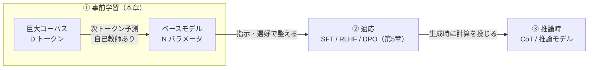
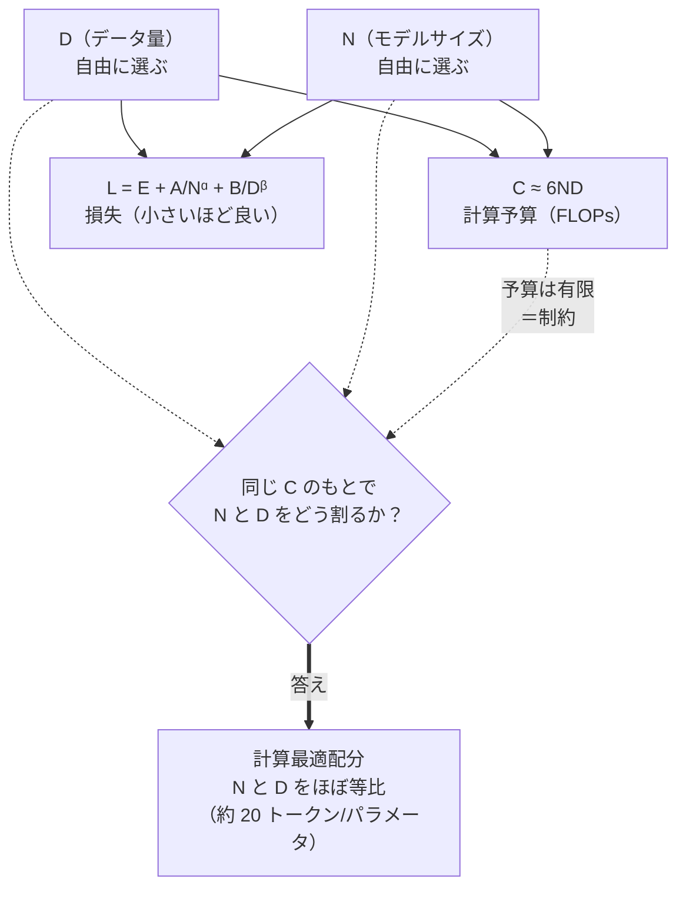
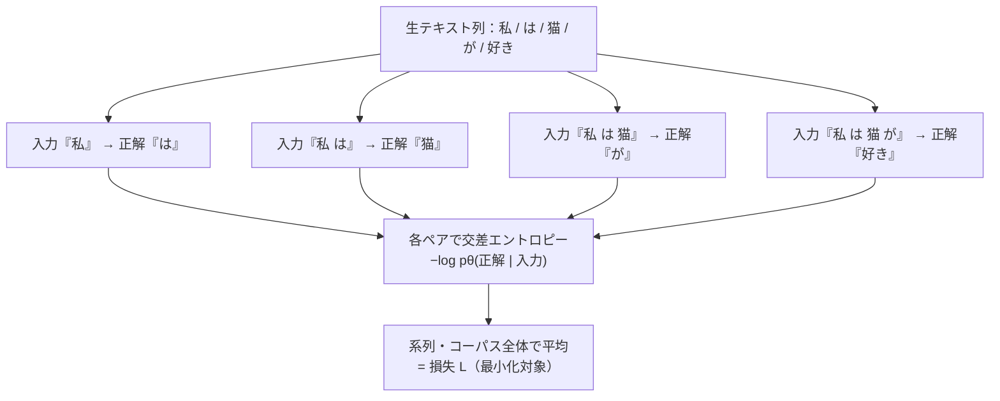
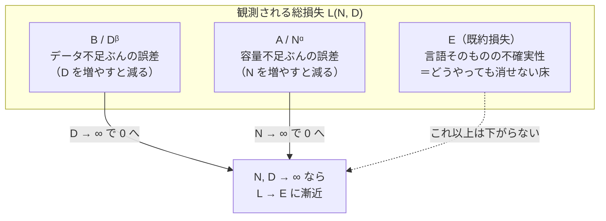
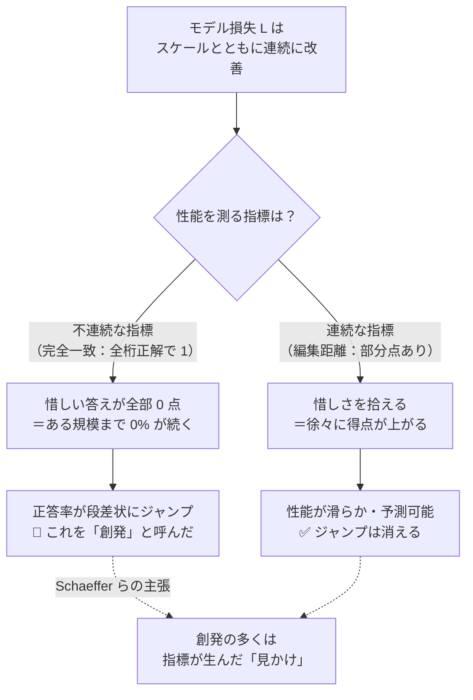
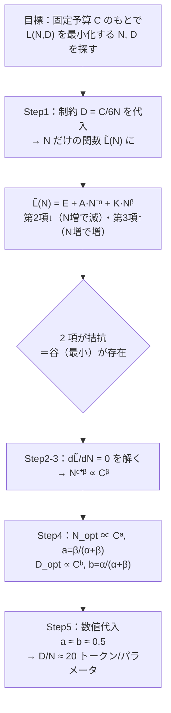

# 事前学習とスケーリング則

:::abstract[学習目標]
この章を読み終えると、次のことができるようになります。

- **事前学習**が「大規模コーパス上の自己教師あり次トークン予測」であることを、損失関数のレベルで説明できる
- 損失がモデルサイズ $N$・データ量 $D$・計算量 $C$ に対し **べき乗則 (power law)** で改善する、というスケーリング則を式で書ける
- **Chinchilla の計算最適 (compute-optimal) 配分**を導出し、「計算量一定下で $N$ と $D$ をほぼ等比に増やす（約 20 トークン/パラメータ）」結論を説明できる
- Kaplan (2020) と Chinchilla (2022) の処方の違い、および後年の再現研究が突きつけた **数値を鵜呑みにしない姿勢** を述べられる
- **創発的能力 (emergent abilities)** の主張と、それが評価指標の不連続性による「見かけ」だとする反論を **対比** できる
:::

## 前提知識

- 第3章 [Transformer の構造](/llm/03-transformer/)：デコーダ専用 Transformer、各層の attention と FFN、パラメータ数 $N$ が層数・隠れ次元から決まること
- 次トークン予測 (next-token prediction) と交差エントロピー損失の基礎（言語モデルの学習目的）
- 微分・対数・べき乗の操作（$\log$ をとると直線になる、程度の感覚）

第3章までで「Transformer という器」を組み立てました。本章は **その器に何を・どれだけ流し込むか** —— 学習の段階と、その規模を支配する経験則 —— を扱います。

## 直感

第3章で作った Transformer は、まだ何も知りません。重みは乱数です。ここに **大量のテキストを読ませて、次の単語を当てる練習をひたすらさせる** のが **事前学習 (pre-training)** です。ラベルは要りません。文章そのものが「次に来る語」という正解を内蔵しているからです（これを **自己教師あり (self-supervised)** と呼びます）。

すると素朴な疑問が湧きます。**「どれくらい大きいモデルに、どれくらいの量のテキストを、どれくらいの計算をかけて読ませればよいのか」**。直感的には「大きいほど・多いほど良い」ですが、計算資源（GPU 時間 = お金）は有限です。固定された予算の中で、**モデルを大きくする**か **データを増やす**か、配分を決めねばなりません。

ここで驚くべき経験則が登場します。モデルの賢さ（テスト損失）は、規模に対して **でたらめでなく、滑らかなべき乗則** で改善するのです。グラフを両対数 (log-log) で描くと、ほぼ **直線** になります。直線なら外挿できます。「この規模ならこの損失になる」と、学習する前に予測できる。これが **スケーリング則 (scaling laws)** です。本章のゴールは、この直線の正体と、限られた計算を最も賢く配分する処方箋（Chinchilla 最適）を、式のレベルで掴むことです。

「両対数で直線」が何を意味するかを、数字を 1 つずつ並べて体感します。べき乗則 $L \propto N^{-\alpha}$ では、$N$ を**等倍に**するたびに $L$ も**等倍に**下がります（線形軸の「等差で下がる」とは違う）。例えば $\alpha=0.5$ なら、$N$ を 4 倍にするたびに $L$ が半分になります。

| モデルサイズ $N$ | 損失 $L$（$\alpha=0.5$ の例） | 直前からの変化 |
| --- | --- | --- |
| $1$ | $1.00$ | — |
| $4$ | $0.50$ | ×0.5 |
| $16$ | $0.25$ | ×0.5 |
| $64$ | $0.125$ | ×0.5 |
| $256$ | $0.0625$ | ×0.5 |

$N$ を **4 倍ずつ**（等倍）増やすと $L$ が **半分ずつ**（等倍）減る —— この「倍率が一定」の関係が、両対数グラフでは**一定の傾きの直線**として現れます。普通の方眼紙では右下がりの曲線（最初は急、だんだん緩やか＝収穫逓減）に見えるものが、log-log にすると真っ直ぐになる。だから**少数の規模で測って直線を引き、まだ作っていない巨大モデルの損失を外挿できる** —— ここがスケーリング則の実務的な威力です。

## 全体像

LLM の一生は3段階に分かれます。本章はその **最初の段階（事前学習）** と、その規模を支配する法則を扱います。



スケーリング則は、この①の中で **3 つの量** の関係を定量化します。順方向（規模 → 損失）と逆方向（目標損失 → 必要な規模・予算）の両方に使えるのが要点です。

| 記号 | 名前 | 何を測るか | 単位の目安 |
| --- | --- | --- | --- |
| $N$ | モデルサイズ | 学習可能パラメータ数（埋め込みを除く本体） | 個（例 $7\times10^9$） |
| $D$ | データ量 | 学習に通したトークンの総数 | トークン（例 $15\times10^{12}$） |
| $C$ | 計算量 | 学習にかけた総 FLOPs | FLOPs（例 $10^{24}$） |
| $L$ | 損失 | テストデータ上の平均交差エントロピー（小さいほど良い） | nats/token |

3 量は独立ではありません。後で導く $C \approx 6ND$ が三者を結びます。つまり「計算予算 $C$ を決める」ことは「$N$ と $D$ の積をおよそ決める」ことであり、残る自由度は **その積をどう $N$ と $D$ に割り振るか** です。この配分問題こそ Chinchilla が答えたものです。

この「3 量の絡み合い」を、依存の流れとして 1 枚に描いておきます。$N$ と $D$ は独立に選べますが、計算予算 $C$ と損失 $L$ は両者から**従属的に決まる**のがポイントです。



図の読み方は 2 通りです。**順方向**（$N, D$ を決める → $C$ と $L$ が出る）はモデルを 1 つ設計したときの結果予測。**逆方向**（目標 $L$ または予算 $C$ から $N, D$ を逆算する）が実務で本当に欲しい使い方で、点線の制約と疑問符のループ —— 「有限の $C$ のもとで $L$ を最小にする $N, D$ の割り振り」 —— が本章後半で解く最適化問題そのものです。

スケーリング則以前と以後で「規模をどう決めるか」の発想は次のように変わりました。

| | スケーリング則以前 | スケーリング則以後（本章） |
| --- | --- | --- |
| 規模の決め方 | 経験と勘で「大きめに」 | 損失を**式で外挿**して決める |
| 学習前に分かること | ほぼ何も（走らせるまで不明） | 目標損失に必要な $N, D, C$ を**事前に見積もれる** |
| 予算配分 | $N$ と $D$ の比は場当たり的 | $C$ 固定下で**最適比が計算できる**（Chinchilla） |
| 失敗の典型 | 過大モデル・データ不足 | （回避可能）配分式に従えば under-trained を避けられる |

:::note[LLM 知識からの橋渡し]
事前学習の損失は、第3章で書いた自己回帰 LM の損失そのもの —— 各位置で次トークンの交差エントロピーを取り、系列・コーパス全体で平均するだけです。スケーリング則は「その損失が規模とともにどう下がるか」を外から眺めた経験則で、モデルの中身（attention の式など）には踏み込みません。**中身を知らなくても、規模だけで損失をかなり予測できる** —— これが衝撃的なのです。
:::

## 理論

### 事前学習：何を最小化しているのか

コーパスを 1 本の長いトークン列 $x_1, x_2, \dots, x_T$ とみなします。デコーダ専用 Transformer $p_\theta$ は、各位置 $t$ で **過去だけ** を見て次トークンの確率分布 $p_\theta(\cdot \mid x_{<t})$ を出します（第3章の causal mask）。学習目的は、実際に来たトークン $x_t$ にできるだけ高い確率を与えること、すなわち負の対数尤度の平均を最小化することです。

$$\mathcal{L}(\theta) = -\frac{1}{T}\sum_{t=1}^{T} \log p_\theta\!\left(x_t \mid x_{<t}\right)$$

- $x_t$：位置 $t$ の正解トークン（$\{1,\dots,V\}$ の整数、$V$ は語彙サイズ）。**データから来る**。
- $x_{<t}$：位置 $t$ より前の全トークン。モデルが条件にする文脈。
- $p_\theta(x_t \mid x_{<t})$：モデルが正解に与えた確率（$0$〜$1$）。これが $1$ に近いほど損失が小さい。
- $\theta$：Transformer の全パラメータ（$N$ 個）。**学習で更新される**。

この $\mathcal{L}$ が、スケーリング則で言う **損失 $L$** の正体です。単位は nats/token（自然対数なので）。

この「正解をテキスト自身から作る」仕組みを図にします。1 本のトークン列があれば、各位置で「そこまでが入力・次の 1 個が正解」という (入力, 正解) ペアが**位置の数だけ**自動的に生まれます。人手のアノテーションは一切要りません。



:::warning[「ラベルがない」を誤解しない]
自己教師ありは「教師信号がない」のではありません。**正解（次トークン $x_t$）はテキスト自身が持っている** ので、人手のラベル付けが要らない、という意味です。教師あり学習の (入力, 正解) ペアを、上図のように文章をずらすだけで無限に自動生成しているのが事前学習です。だからこそ Web 規模の生テキストをそのまま燃料にできます。
:::

### 学習時 vs 推論時：同じ式、違う使い方

同じ次トークン予測でも、訓練と本番で **データの出どころと損失の役割** が変わります。ここを分けて捉えることが後の議論（emergent abilities など）の土台になります。

| | 学習時 (training) | 推論時 (inference) |
| --- | --- | --- |
| 入力文脈 $x_{<t}$ | **データの真の前文**（teacher forcing） | **モデル自身が直前に生成した文** |
| $x_t$ の役割 | 正解として損失を計算し勾配を流す | 存在しない（これから生成する対象） |
| 何を測る/出す | スカラ損失 $L$（最小化対象） | 次トークンの確率分布（サンプリング元） |
| 規模との関係 | $L$ が $N, D, C$ のべき乗則で下がる | $L$ が低いほど生成が流暢・正確になりやすい |

スケーリング則が直接語るのは **学習時の損失 $L$** です。私たちが本当に欲しいのは推論時の賢さですが、両者は強く相関するので、$L$ を予測できれば実用性能もおおむね見通せる、というのがこの分野の前提です。

### スケーリング則：3 本のべき乗則

Kaplan ら (2020) は、ある量だけを変え他をボトルネックにならないよう十分に与えたとき、損失が各量の **べき乗則** で滑らかに下がることを観測しました。べき乗則とは $L \propto (\text{量})^{-\alpha}$ の形、つまり **両対数で直線** になる関係です。

$$
L(N) \approx \left(\frac{N_c}{N}\right)^{\alpha_N}, \qquad
L(D) \approx \left(\frac{D_c}{D}\right)^{\alpha_D}, \qquad
L(C) \approx \left(\frac{C_c}{C}\right)^{\alpha_C}
$$

各記号を定義します（ここが躓きやすい）。

- $N, D, C$：それぞれモデルサイズ・データ量・計算量。**横軸に置く「規模」**。
- $\alpha_N, \alpha_D, \alpha_C$：**べき指数 (scaling exponent)**。両対数グラフの直線の **傾き**（の符号反転）。大きいほど「規模を増やしたときの損失低下が急」。Kaplan の報告では概ね $\alpha_N \approx 0.076$、$\alpha_D \approx 0.095$ 前後の **小さな正の値**。
- $N_c, D_c, C_c$：**スケール定数**。「損失が $1$ nat になる規模」のような単位合わせの基準点で、$L$ と同じ単位の辻褄を合わせる役。値そのものより、$\alpha$ と組で曲線を決める係数だと捉えれば十分です。

:::warning[べき指数 $\alpha$ が小さいことの意味を取り違えない]
$\alpha_N \approx 0.08$ は「効果が小さい」のではありません。これは **両対数の傾き** です。$\alpha=0.08$ なら、損失を半分にするには $N$ を約 $2^{1/0.08} \approx 6000$ 倍にする必要がある、という意味です。つまり **改善は確実だが、対数スケールでしか進まない（指数的に金がかかる）**。スケーリングが「無限に賢くなる魔法」ではなく「収穫逓減との戦い」である理由がここにあります。本章末の numpy 実験では、計算の都合で $\alpha \approx 0.5$ という遥かに急な傾きを観測しますが、「両対数で直線＝べき乗則」という **形** が本物と同じであることを体感するのが狙いです。
:::

各法則が成り立つのは **その量だけがボトルネックのとき** です。$L(N)$ は「データも計算も潤沢で、モデルサイズだけが律速」の理想化。現実には 3 つが絡むので、次の 2 変数モデルが要ります。

### Chinchilla の損失曲面 $L(N, D)$

Hoffmann ら (2022, Chinchilla) は、$N$ と $D$ を **同時に** 動かしたときの損失を、次の 3 項でフィットしました。

$$L(N, D) = E + \frac{A}{N^{\alpha}} + \frac{B}{D^{\beta}}$$

- $E$：**既約損失 (irreducible loss)**。データ自体が持つ本質的な不確実性（自然言語のエントロピー）。どれだけ $N, D$ を増やしても $L$ はここより下がらない **床**。$N, D \to \infty$ で $L \to E$。
- $\dfrac{A}{N^{\alpha}}$：**有限のモデルサイズ** に由来する誤差。容量が足りず表現しきれないぶん。$N$ を増やすと減る。
- $\dfrac{B}{D^{\beta}}$：**有限のデータ** に由来する誤差。見た例が足りず推定しきれないぶん。$D$ を増やすと減る。
- $A, B, \alpha, \beta$：フィットで決める正の係数。Chinchilla の報告値は概数で $\alpha \approx 0.34$、$\beta \approx 0.28$、$E \approx 1.7$ nats/token。

この 3 項分解を、損失を「下げられない床」と「下げられる 2 つの余地」に分けた図で掴みます。総損失は床 $E$ の上に、容量不足ぶん $A/N^\alpha$ とデータ不足ぶん $B/D^\beta$ が**積み上がった**ものです。



この式の **読み方** が肝心です。損失を下げる経路は 2 本（$N$ を増やす／$D$ を増やす）あり、しかも **片方だけ増やしても他方の項が頭打ちになる**。だから両方をバランス良く増やすのが効率的 —— という直感が、次節の最適配分に結実します。

:::note[既約損失 $E$ をなぜ「消せない」のか]
$E$ は **言語そのものが持つ予測不可能性** です。完璧なモデルでも、「I had a cup of ___」の次が coffee か tea かは確率的にしか当たりません。これは雑音ではなく、自然言語の本質的なエントロピー（情報量）です。だから $N, D$ をいくら増やしても損失は $E$ より下がらない。逆に言えば、観測損失 $L$ から $E$ を引いた $L - E$ が「**まだ改善できる余地**」であり、スケーリング則が削っていくのはこの部分だけです。$E$ の正体は次のように整理できます。

| 損失の成分 | 正体 | 増やして消せるか |
| --- | --- | --- |
| $E$（既約損失） | 言語の本質的エントロピー（次語の本来的な曖昧さ） | 消せない（床） |
| $A/N^{\alpha}$ | モデル容量が足りず構造を表現しきれない | $N$↑ で消せる |
| $B/D^{\beta}$ | 学習データが足りず統計を推定しきれない | $D$↑ で消せる |
:::

:::warning[$N^\alpha$ の $\alpha$ と、Kaplan の $\alpha_N$ は別物]
記号が衝突しやすいので明示します。Kaplan の $\alpha_N \approx 0.08$ は **1 変数べき乗則 $L(N)\propto N^{-\alpha_N}$ の傾き**。Chinchilla の $\alpha \approx 0.34$ は **2 変数曲面 $L(N,D)$ のうち $N$ 項の指数** で、$D$ を最適に連動させた条件での値です。値が違うのは「他方の量をどう動かすか」の前提が違うため。同じ「$N$ の効き」でも、固定条件が変われば数値は変わります。
:::

### 計算量と規模を結ぶ $C \approx 6ND$

3 つ目の量 $C$（総 FLOPs）は、$N$ と $D$ から概算できます。Transformer の学習では、**1 トークンを 1 パラメータ分処理するのに、順伝播で約 2 回、逆伝播で約 4 回**、合計およそ 6 回の浮動小数点演算がかかります。総トークン数が $D$、パラメータ数が $N$ なので、

$$C \approx 6\,N\,D \quad [\text{FLOPs}]$$

**係数 6 の内訳** を分解しておきます。パラメータの大半は線形層の重みで、その演算は行列積です。1 つの重みは「掛け算 1 回 + 足し算 1 回 = 2 FLOPs」を生みます。これが順伝播・逆伝播の各段でどう積み上がるかが 6 の正体です。

| 段階 | 何をするか | パラメータ 1 個・トークン 1 個あたり |
| --- | --- | --- |
| 順伝播 (forward) | 入力 × 重み を計算（積和） | 約 2 FLOPs |
| 逆伝播・入力勾配 | 下流の勾配を入力側へ伝える | 約 2 FLOPs |
| 逆伝播・重み勾配 | 各重みの勾配を計算 | 約 2 FLOPs |
| **合計** | | **約 6 FLOPs** |

逆伝播が順伝播の **2 倍** かかる（勾配を「入力方向」と「重み方向」の 2 つ計算するため）のが効いて、$2 + 4 = 6$ になります。トークンが $D$ 個、パラメータが $N$ 個あるので、総計 $6ND$。これは attention の二次コストや埋め込み・正規化を無視した概算ですが、大規模学習ではパラメータ密な線形層が支配的なので、桁の見積もりとして実用上十分な精度を持ちます。

これは経験則の概算ですが極めて有用です。**計算予算 $C$ を決める ＝ 積 $ND$ をおよそ決める** ことを意味するからです。残った自由は「その積を $N$ と $D$ にどう割るか」だけ。これが次の最適化問題の制約になります。

:::warning[$C \approx 6ND$ は「学習」の式。推論は別物]
この 6 は **学習** の係数です。逆伝播を含むからこそ大きい。**推論（生成）時** は順伝播だけなので、1 トークンあたり約 $2N$ FLOPs に減ります（係数 6 → 2）。だから「学習に $6ND$ かかった」と「1 回の推論が安い」は両立します。後述のオーバートレーニングが合理的になるのも、まさにこの差 —— 学習は 1 回きりだが推論は何百万回も走らせる —— が効くからです。学習コストと推論コストを同じ式で語らないよう注意してください。
:::

### 創発的能力：質的ジャンプか、測り方の罠か

スケールを上げると、小モデルにはなかった能力（多段算術、記号推論など）が **ある規模で突然** 現れる —— これが **創発的能力 (emergent abilities, Wei ら 2022)** の主張です。損失は滑らかに下がるのに、特定タスクの正答率は **不連続にジャンプ** する、と。

これに Schaeffer ら (2023) が強い反論を出しました。創発の多くは **評価指標の不連続性が生む「見かけ (mirage)」** だ、というものです。

- **不連続な指標**（完全一致 Exact Match：全桁正解で 1、1 桁でも違えば 0）で測ると、損失が滑らかに改善していても正答率は段差状に跳ねる。
- **連続な指標**（編集距離など、惜しい答えを部分点で評価）に変えると、同じモデル群の性能は **滑らかで予測可能** な曲線になる。

この「同じ滑らかな改善が、測り方で段差にも滑らかにも見える」からくりを分岐図で整理します。出発点はどちらも **連続に改善する損失** です。分かれるのは**指標の選び方**だけ。



具体例で 1 ステップ歩きます。「5 桁の足し算を当てる」タスクを考えます。完璧に近づく途中のモデルは、まず 1〜2 桁を正しく出し、規模とともに正答桁が増えていきます。ところが **全 5 桁が揃って初めて 1 点**という採点だと、4 桁正解でも 0 点。だから「ある規模で急に 0% → 高得点」に見える。これを桁ごとの部分点（連続指標）で測り直すと、最初から滑らかに得点が伸びていた、と分かる —— というのが反論の骨子です。下の 2 つの指標がどう違うかを並べます。

| | 不連続な指標（例：完全一致） | 連続な指標（例：編集距離・対数尤度） |
| --- | --- | --- |
| 惜しい答えの扱い | 0 点（全か無か） | 部分点（近いほど高得点） |
| 損失が滑らかに改善すると | 正答率は**段差**で跳ねる | 性能は**滑らか**に伸びる |
| 見え方 | 創発（突然の質的ジャンプ） | 予測可能な連続改善 |
| 外挿のしやすさ | 困難（いつ跳ねるか読めない） | 容易（直線的に外挿できる） |

:::note[何が論争で何が合意か]
「スケールで性能が上がる」こと自体は両者とも認めています。争点は **「不連続なジャンプ（質的に新しい何か）が本当に起きているか」**。現在の整理は「多くの創発は指標の選び方による見かけで、滑らかな改善として説明できる」寄りです。教訓は実務的です —— **能力を測るなら、惜しさを拾える連続指標を選べ**。さもないと滑らかな進歩を段差と誤読します。
:::

## 数式の導出：計算最適な $N$ と $D$ の配分

Chinchilla の中心的結論 —— 「計算予算を固定したとき、$N$ と $D$ をほぼ等比で増やすべき」 —— を導きます。

導出は 5 ステップです。**やっていること**は「制約付き最小化」 —— 予算という縛りの中で損失を最小化する $N$ を探す —— で、流れは次の通りです。



谷（最小値）が存在する理由は図の分岐ノードにあります。$N$ を増やすと容量項 $A N^{-\alpha}$ は減りますが、予算固定ゆえ $D = C/6N$ が減り、データ項 $B D^{-\beta} = K N^{\beta}$ が増えます。**減る力と増える力が釣り合う一点**が計算最適 —— 「大きすぎても小さすぎても損」の正体です。以下、式で追います。

**設定。** 計算予算 $C$ を固定します。制約は $C \approx 6ND$、すなわち

$$D = \frac{C}{6N}. \tag{1}$$

この制約の下で損失 $L(N, D) = E + A N^{-\alpha} + B D^{-\beta}$ を最小化する $N$（と従属して $D$）を求めます。既約損失 $E$ は定数なので最小化に効きません。

**ステップ 1：制約を代入して 1 変数化する。** $(1)$ を $L$ に入れ、$N$ だけの関数 $\tilde L(N)$ にします。

$$
\tilde L(N) = E + A\,N^{-\alpha} + B\left(\frac{C}{6N}\right)^{-\beta}
= E + A\,N^{-\alpha} + B\left(\frac{6}{C}\right)^{\beta} N^{\beta}.
$$

第 2 項は $N$ の増加で減り（指数 $-\alpha<0$）、第 3 項は $N$ の増加で増えます（指数 $+\beta>0$）。**両者が拮抗する点に最小値がある** —— これが「大きすぎても小さすぎても損」の数学的正体です。

**ステップ 2：微分して 0 と置く。** $C$ は定数なので $K \equiv B\,(6/C)^{\beta}$ とまとめ、$N$ で微分します。

$$\frac{d\tilde L}{dN} = -\alpha A\,N^{-\alpha-1} + \beta K\,N^{\beta-1} = 0.$$

**ステップ 3：$N$ について解く。** 移項して両辺を整理します。

$$
\beta K\,N^{\beta-1} = \alpha A\,N^{-\alpha-1}
\;\Longrightarrow\;
N^{\beta-1-(-\alpha-1)} = \frac{\alpha A}{\beta K}
\;\Longrightarrow\;
N^{\,\alpha+\beta} = \frac{\alpha A}{\beta K}.
$$

$K = B\,(6/C)^{\beta} \propto C^{-\beta}$ なので $1/K \propto C^{\beta}$。したがって

$$
N^{\,\alpha+\beta} \propto C^{\beta}
\;\Longrightarrow\;
\boxed{\,N_{\mathrm{opt}}(C) \propto C^{\,a}, \quad a = \frac{\beta}{\alpha+\beta}.\,}
$$

**ステップ 4：$D$ の指数を出す。** 制約 $(1)$ から $D \propto C / N \propto C^{1-a}$。よって

$$D_{\mathrm{opt}}(C) \propto C^{\,b}, \qquad b = 1 - a = \frac{\alpha}{\alpha+\beta}.$$

**ステップ 5：数値を入れる。** Chinchilla の $\alpha \approx 0.34$、$\beta \approx 0.28$ を代入すると

$$a = \frac{0.28}{0.34+0.28} \approx 0.45, \qquad b = \frac{0.34}{0.34+0.28} \approx 0.55.$$

報告された経験値は $a \approx b \approx 0.5$、すなわち **$N$ と $D$ を計算予算の平方根におよそ比例して、ほぼ等比に増やす** です（フィット手法により $0.45$〜$0.55$ 程度の幅がある）。最適点では $D_{\mathrm{opt}}/N_{\mathrm{opt}}$ がほぼ一定になり、その値が

$$\frac{D_{\mathrm{opt}}}{N_{\mathrm{opt}}} \approx 20 \;\; [\text{トークン/パラメータ}]$$

という有名な目安です。$\blacksquare$

:::note[なぜこれが衝撃だったか：Kaplan からの修正]
Kaplan ら (2020) は当初「固定計算では **モデルを大きく** し、データは相対的に少なめで良い（$a$ が大きい）」と処方しました。Chinchilla はこれを覆し、$a \approx b \approx 0.5$ —— **データをもっと増やせ** と示しました。具体例として、70B の Chinchilla を 1.4T トークンで学習し、同じ計算で作られた 280B の Gopher（約 300B トークン）を上回ると実証。当時の巨大モデルは軒並み **データ不足 (under-trained)** だった、という指摘がフィールドの常識を転換させました。配分の式 $a=\beta/(\alpha+\beta)$ が示す通り、結論は **2 つのべき指数 $\alpha, \beta$ の比** で決まります。だから係数推定の正しさが死活的に重要になります。

2 つの処方を直接対比します。同じ「計算予算を固定して最適配分を求める」問題に、違う答えを出しました。

| | Kaplan ら (2020) | Chinchilla / Hoffmann ら (2022) |
| --- | --- | --- |
| 固定 $C$ での処方 | $N$ を大きく・$D$ は控えめ | $N$ と $D$ を**ほぼ等比**で増やす |
| $C$ 増分の主な振り先 | モデルサイズ $N$ | $N$ と $D$ に半々 |
| 最適比 $D/N$ の目安 | 小さめ（数トークン/パラメータ） | **約 20 トークン/パラメータ** |
| 当時のモデルへの含意 | （巨大化を後押し） | 軒並み **データ不足 (under-trained)** | 
| 検証手法 | $L(N)$ 曲線の外挿が主 | IsoFLOP 等 3 手法で交差検証 |
| 実証 | — | 70B Chinchilla が 280B Gopher を上回る |

**なぜ結論が割れたのか** は、フィットの前提と手続きの違いに帰着します。学習率スケジュールの扱い・小規模モデルの含め方・$N$ の数え方（埋め込みを含むか）などの差が、推定される $\alpha, \beta$ を動かし、その比 $a = \beta/(\alpha+\beta)$ を通じて最適配分を変えました。「式は同じでも係数が違えば処方が変わる」 —— これが係数を鵜呑みにしない姿勢の出発点です。
:::

:::note[最適点はどう「読む」か：IsoFLOP の発想]
Chinchilla が最適配分を実測した中心的な方法が **IsoFLOP（等計算量）曲線** です。発想は単純です。**計算予算 $C$ を 1 つ固定**し、その予算をいろいろな $(N, D)$ の割り方（制約 $C\approx 6ND$ 上を滑る）で使い切って学習し、得られた最終損失 $L$ を $N$ に対してプロットします。すると**谷（最小損失）を持つ U 字曲線**が描けます。その谷の底が、その予算での計算最適点 $N_{\mathrm{opt}}(C)$ です。


複数の予算で谷の位置を集め、$(C, N_{\mathrm{opt}})$ を両対数で結べば、その傾きが指数 $a$ —— 前段で導いた $a = \beta/(\alpha+\beta)$ —— になります。**導出（式）と IsoFLOP（実測）が同じ $a$ に行き着く**のがこの理論の強みです。式の左端は「$N$ 小・$D$ 大（データ過多）」、右端は「$N$ 大・$D$ 小（データ不足＝under-trained）」で、谷がちょうど両者のバランス点に当たります。
:::

:::warning[「20 トークン/パラメータ」を絶対視しない]
この比は **計算最適（＝学習 FLOPs を最小化する）** という 1 つの目的関数の答えにすぎません。実運用ではモデルを何百万回も推論するので、**推論コスト** を含めると話が変わります。小さいモデルを Chinchilla 比を大きく超えて学習する **オーバートレーニング (overtraining)** が合理的になるのです。Llama 3 (Meta, 2024) は 8B/70B を 15T 超トークン（比 $\gg 20$）で学習し、それでも対数線形に損失が改善し続けたと報告しました。「20」は出発点であって到達点ではありません。

何を最小化したいかで最適配分は変わります。「学習だけ最小化」と「学習＋推論の総コスト最小化」を場合分けで対比します。

| 目的関数 | 最適化するもの | 結論の方向 | 代表例 |
| --- | --- | --- | --- |
| **学習 FLOPs 最小**（Chinchilla） | 学習計算量のみ | $D/N \approx 20$ で等比 | Chinchilla 70B |
| **学習＋推論の総コスト最小** | 学習 + （推論回数 × 推論コスト） | **より小さい $N$・より多い $D$**（$D/N \gg 20$） | Llama 3 8B/70B |

直感はこうです。推論を膨大に回すサービスでは、**小さい $N$ ほど 1 回の推論が安い**（推論コストは約 $2N$ に比例、前述の注意書き参照）。だから学習段階で多少「無駄に」データを食わせてでも $N$ を抑え、同じ損失を小さいモデルで達成できれば、運用全体では得をします。Chinchilla 最適点を**わざと右（データ過多）にずらす**のがオーバートレーニング —— 「学習は 1 回、推論は何百万回」という非対称が、この判断を合理化します。
:::

## 実装：容量を増やすと当てはめ誤差が下がる「べき則」を体感する

スケーリング則の核心は **「容量を増やすと損失がべき乗則で下がる（両対数で直線）」** です。本物の LLM は学習できませんが、この **形** だけなら numpy の小実験で再現できます。

アイデアはこうです。複雑な非線形関数（「言語の規則性」の代役）を、**容量 $N$ を変えられるモデル** で当てはめます。モデルには **ランダム特徴 (random features)** を使います —— 入力をランダムな周波数の余弦に通し（この基底は固定・学習しない）、最後の線形層だけを最小二乗で解きます。基底の本数 $N$ が **モデル容量** に対応します。$N$ を増やすほど高周波の構造まで表現でき、当てはめ誤差（テスト損失）が下がるはずです。

```python title="scaling_toy.py"
import numpy as np

rng = np.random.default_rng(0)

# --- 真のデータ生成過程（"自然言語"の代役） ---
# 入力 x in [-1,1] に対し、複数の周波数を重ねた非線形関数を「正解」とする。
# 容量が小さいモデルは細かい構造を表現しきれず、容量を増やすほど誤差が下がる。
def target(x):
    return (np.sin(3.0 * np.pi * x)
            + 0.5 * np.sin(7.0 * np.pi * x)
            + 0.3 * np.sin(13.0 * np.pi * x))

# 学習データ（"コーパス"）とテストデータ（"未見テキスト"）
N_data = 4000
x_train = rng.uniform(-1.0, 1.0, size=(N_data, 1))
y_train = target(x_train)
x_test = np.linspace(-1.0, 1.0, 2000).reshape(-1, 1)
y_test = target(x_test)

def make_features(x, width):
    # ランダム特徴で容量 width を制御。重み・位相は固定（学習しない）。
    # 学習するのは最終線形層だけ＝凸問題で最適解まで解け、
    # "容量による下限"だけを純粋に観測できる。
    W = rng.normal(0.0, 6.0, size=(1, width))
    b = rng.uniform(0.0, 2.0 * np.pi, size=(1, width))
    return W, b

def featurize(x, W, b):
    return np.cos(x @ W + b)  # 形状 (n, width)

def fit_once(width):
    Wf, bf = make_features(x_train, width)
    Phi_tr = featurize(x_train, Wf, bf)
    Phi_te = featurize(x_test, Wf, bf)
    # 最小二乗（リッジ微小）で線形層を解く＝この容量での最良当てはめ
    A = Phi_tr.T @ Phi_tr + 1e-6 * np.eye(width)
    w = np.linalg.solve(A, Phi_tr.T @ y_train)
    train_mse = np.mean((Phi_tr @ w - y_train) ** 2)
    test_mse = np.mean((Phi_te @ w - y_test) ** 2)
    return train_mse, test_mse

def fit_and_eval(width, trials=8):
    # ランダム特徴の引きによるばらつきを均すため複数回平均する。
    trs, tes = [], []
    for _ in range(trials):
        tr, te = fit_once(width)
        trs.append(tr); tes.append(te)
    return float(np.mean(trs)), float(np.mean(tes))

widths = [2, 4, 8, 16, 32, 64, 128, 256]
print(f"{'capacity N':>10} | {'train loss':>12} | {'test loss':>12}")
print("-" * 40)
results = []
for w in widths:
    tr, te = fit_and_eval(w)
    results.append((w, te))
    print(f"{w:>10} | {tr:>12.5f} | {te:>12.5f}")

# べき乗則のフィット: log(loss) = log(Lc) - alpha * log(N)
Ns = np.array([r[0] for r in results], dtype=float)
Ls = np.array([r[1] for r in results], dtype=float)
slope, intercept = np.polyfit(np.log(Ns), np.log(Ls), 1)
print("-" * 40)
print(f"フィットしたべき指数 alpha_N ≈ {-slope:.3f}")
print(f"(loss ∝ N^(-alpha_N) の形。容量を 2 倍にすると loss が約 {2**slope:.3f} 倍)")
```

実行します。

```text title="出力"
capacity N |   train loss |    test loss
----------------------------------------
         2 |      0.56302 |      0.56709
         4 |      0.48988 |      0.49118
         8 |      0.26021 |      0.25994
        16 |      0.13950 |      0.13880
        32 |      0.12778 |      0.12749
        64 |      0.10644 |      0.10522
       128 |      0.08161 |      0.08028
       256 |      0.04942 |      0.04901
----------------------------------------
フィットしたべき指数 alpha_N ≈ 0.498
(loss ∝ N^(-alpha_N) の形。容量を 2 倍にすると loss が約 0.708 倍)
```

読み取りどころは 3 点です。

1. **容量 $N$ を増やすほどテスト損失が単調に下がる。** $N=2$ で $0.57$、$N=256$ で $0.05$。これがスケーリング則の最も素朴な姿です。
2. **両対数で直線（べき乗則）。** `np.polyfit` を $\log N$ と $\log L$ に当てると傾きが取れ、$L \propto N^{-0.498}$ とフィットできました。値そのもの（$\approx 0.5$）は本物の LLM の $\alpha_N \approx 0.08$ より遥かに急ですが（このトイ問題は構造が単純で容量の効きが強いため）、**「両対数で直線になる」という形は本物と同じ** です。
3. **train と test がほぼ一致。** データ $N_{\text{data}}=4000$ に対し容量が小さいので過学習が起きていません。本物の事前学習も、データが潤沢なら train/test 損失が近い領域で動きます。$L(N,D)$ の式で言えば「$D$ 項が十分小さく、$N$ 項が律速」の状況を見ていることになります。

:::warning[このトイが見せていないもの]
このおもちゃは $L(N)$（容量だけを動かす片側）を見せています。**データ量 $D$ の効果・計算予算 $C$ の制約・$N$ と $D$ の配分**（Chinchilla の本題）は含みません。また既約損失 $E$（床）もこの問題では実質ゼロです。本物のスケーリング則実験は、$N$ と $D$ を格子状に振って $L(N,D)$ 全体をフィットし、IsoFLOP 曲線から最適点を読みます。ここで掴むべきは「規模 → 損失が予測可能なべき乗則になる」という **一点** です。
:::

## 演習

::::question[演習 1: 計算予算を 2 倍にしたら $N$ と $D$ はどう増やすか]
Chinchilla の計算最適配分 $N_{\mathrm{opt}} \propto C^{a}$、$D_{\mathrm{opt}} \propto C^{b}$ で $a \approx b \approx 0.5$ とします。(a) 計算予算 $C$ を 2 倍にできたとき、$N$ と $D$ はそれぞれおよそ何倍にすべきですか。(b) このとき $C \approx 6ND$ の関係は保たれますか、確認してください。(c) もし「モデルだけ 2 倍にしてデータは据え置き」にすると、Chinchilla の観点では何が問題ですか。

:::details[解答]
(a) $a \approx b \approx 0.5$ なので、$N \propto C^{0.5}$、$D \propto C^{0.5}$。$C$ を 2 倍にすると $N$ も $D$ も $2^{0.5} \approx 1.41$ 倍、すなわち **両方を約 1.4 倍ずつ等比に増やす** のが最適です。

(b) $N$ と $D$ がそれぞれ $\sqrt{2}$ 倍なら、積 $ND$ は $\sqrt{2}\times\sqrt{2}=2$ 倍。$C \approx 6ND$ も 2 倍になり、予算 2 倍と整合します。配分の式は **制約 $C\approx 6ND$ を保ったまま** 損失を最小化する割り振りを与えている、と確認できます。

(c) モデルだけ 2 倍・データ据え置きだと、損失曲面 $L(N,D)=E+A/N^\alpha + B/D^\beta$ の **$D$ 項が下がらず頭打ち**になります。$N$ 項を減らしても $B/D^\beta$ が床として残るため、増やした計算（パラメータ）が活きません。これがまさに Chinchilla の言う **データ不足 (under-trained)** な状態で、同じ計算をデータ増にも回した方が損失が下がります。
:::
::::

::::question[演習 2: 損失を半分にするコスト]
1 変数べき乗則 $L(N) = (N_c/N)^{\alpha_N}$ を考えます。(a) 損失 $L$ を半分にするには $N$ を何倍にする必要がありますか、$\alpha_N$ で表してください。(b) $\alpha_N = 0.08$（本物の LLM の概数）と、本章の numpy 実験で得た $\alpha_N \approx 0.5$ で、それぞれ具体的に何倍か計算してください。(c) この差は何を意味しますか。

:::details[解答]
(a) $L \to L/2$ にしたい。$L \propto N^{-\alpha_N}$ なので、$N$ を $k$ 倍すると $L$ は $k^{-\alpha_N}$ 倍。これを $1/2$ にする条件は

$$k^{-\alpha_N} = \tfrac{1}{2} \;\Longrightarrow\; k = 2^{\,1/\alpha_N}.$$

よって $N$ を $2^{1/\alpha_N}$ 倍にする必要があります。

(b) $\alpha_N = 0.08$ なら $k = 2^{1/0.08} = 2^{12.5} \approx 5800$ **倍**。$\alpha_N = 0.5$ なら $k = 2^{1/0.5} = 2^{2} = 4$ **倍**。

(c) べき指数 $\alpha_N$ が小さいほど、同じ損失低下に **桁違いの規模拡大** が要ります。本物の LLM（$\alpha_N\approx 0.08$）では損失を半分にするのに約 5800 倍ものパラメータが必要で、これが「スケーリングは効くが指数的に金がかかる（収穫逓減）」の正体です。トイ問題（$\alpha_N\approx 0.5$）は構造が単純で容量がよく効くため傾きが急ですが、**両対数で直線という形** は共通です。
:::
::::

## まとめ

:::success[この章の要点]
- **事前学習** は大規模コーパス上の **自己教師あり次トークン予測**。損失は各位置の交差エントロピーの平均 $\mathcal{L}=-\frac1T\sum_t \log p_\theta(x_t\mid x_{<t})$ で、人手ラベルは不要（正解はテキスト自身が持つ）。
- 損失 $L$ はモデルサイズ $N$・データ量 $D$・計算量 $C$ に対し **べき乗則**（両対数で直線）で滑らかに下がる。べき指数 $\alpha$ は小さく、改善は確実だが対数スケール（収穫逓減）。
- 3 量は $C \approx 6ND$ で結ばれる。計算予算を固定する ＝ 積 $ND$ を決めること。残る自由は **$N$ と $D$ の配分**。
- **Chinchilla の計算最適**：損失曲面 $L(N,D)=E+A/N^\alpha+B/D^\beta$ を $C\approx 6ND$ の下で最小化すると $N_{\mathrm{opt}}\propto C^{a}$、$D_{\mathrm{opt}}\propto C^{b}$ で $a\approx b\approx 0.5$。$N$ と $D$ を **ほぼ等比**（約 20 トークン/パラメータ）に増やすのが最適。配分は **べき指数の比 $\beta/(\alpha+\beta)$** で決まる。
- 数値は固定的でない。Kaplan→Chinchilla の修正、再現研究（係数の丸めの指摘）、推論コストを見込んだ **オーバートレーニング**（Llama 3）が示す通り、係数も最適比も **検証して使う**。
- **創発的能力** の多くは、完全一致のような **不連続な評価指標** が生む「見かけ」。連続指標で測ると滑らかで予測可能になる。能力を測るときは惜しさを拾える指標を選ぶ。
:::

### 次に学ぶこと

事前学習で得たベースモデルは、Web を模倣する「次トークン予測機」であって、まだ **指示に従う** わけでも **人間の意図に沿う** わけでもありません。次章は、このベースモデルを **指示チューニング (SFT)・RLHF・DPO** で整える **適応 (adaptation)** の段階に進みます。ここで本テキストの横断軸である強化学習が言語モダリティと出会います。

→ [第5章 適応 — 指示チューニング・RLHF・DPO](/llm/05-adaptation-rlhf/)

→ [LLM ロードマップに戻る](/llm/)

## 用語ミニ辞典

| 用語 | 一言 |
| --- | --- |
| 事前学習 (pre-training) | 大規模コーパス上の自己教師あり次トークン予測でベースモデルを作る段階 |
| 自己教師あり (self-supervised) | 正解（次トークン）をデータ自身が持つので人手ラベル不要 |
| スケーリング則 (scaling law) | 損失が $N, D, C$ のべき乗則で改善するという経験則 |
| べき乗則 (power law) | $L\propto(\text{量})^{-\alpha}$。両対数で直線になる関係 |
| べき指数 $\alpha$ | 両対数の傾き。大きいほど規模の効きが急 |
| $N$ / $D$ / $C$ | モデルサイズ / データ量(トークン) / 計算量(FLOPs) |
| $C\approx 6ND$ | 学習計算量を $N,D$ で結ぶ概算式 |
| 計算最適 (compute-optimal) | 固定 $C$ で損失最小の $N,D$ 配分。Chinchilla 最適 |
| 20 トークン/パラメータ | 計算最適な $D/N$ の目安（Chinchilla） |
| 既約損失 $E$ | データ本来の不確実性。$N,D\to\infty$ でも残る床 |
| オーバートレーニング | 推論コスト削減のため Chinchilla 比を超えてデータを投入 |
| 創発的能力 (emergent ability) | スケールで突然現れるとされた能力。多くは指標の見かけ |

## 次のアクション

理論を手で定着させる。**最小の写経 → 動かす → 小実験** を 1 セットで。

1. 本章の `scaling_toy.py` を写経し、`uv run --with numpy python scaling_toy.py` で実行する。出力の両対数フィット（$\alpha_N \approx 0.5$）を確認する。
2. `target` 関数の周波数（`3,7,13`）をもっと高くする／成分を増やすと、各容量での損失とフィット傾き $\alpha_N$ がどう変わるか観察する。**問題を難しくすると同じ容量でも損失が上がる**（既約損失が見えてくる）ことを体感する。
3. 余力があれば、容量 $N$ を固定して **学習データ数 $N_{\text{data}}$** を $250, 500, 1000, 2000, 4000$ と振り、$L(D)$ のべき乗則（データ側のスケーリング）も両対数で直線になるか確かめる。$N$ と $D$ の **両方** に法則があることを自分の目で見る。

ここまでで「規模 → 損失が予測可能になる」という事前学習の骨格が手に入ります。次章 05 で、このベースモデルを人間の意図に沿わせる適応へ進みます。

## 参考文献

1. J. Kaplan, S. McCandlish, et al., "Scaling Laws for Neural Language Models," *arXiv:2001.08361*, OpenAI, 2020.（スケーリング則の確立）
2. T. Brown et al., "Language Models are Few-Shot Learners," *NeurIPS*, 2020.（GPT-3。in-context learning の実証）
3. J. Hoffmann et al., "Training Compute-Optimal Large Language Models," *NeurIPS*, 2022.（Chinchilla。計算最適配分）
4. J. Wei et al., "Emergent Abilities of Large Language Models," *TMLR*, 2022.（創発的能力の主張）
5. R. Schaeffer, B. Miranda, S. Koyejo, "Are Emergent Abilities of Large Language Models a Mirage?," *NeurIPS*, 2023.（創発＝指標の見かけ、という反論）
6. N. Muennighoff et al., "Scaling Data-Constrained Language Models," *NeurIPS*, 2023.（データ制約下のスケーリング）
7. T. Besiroglu et al., "Chinchilla Scaling: A Replication Attempt," *arXiv:2404.10102*, Epoch AI, 2024.（係数推定の再現・検証）
8. Penedo et al., "The FineWeb Datasets," *NeurIPS Datasets*, 2024.（事前学習データの品質工学）
9. Meta, "The Llama 3 Herd of Models," *arXiv:2407.21783*, 2024.（オーバートレーニングと大規模事前学習の実例）
10. DeepSeek-AI, "DeepSeek-V3 Technical Report," *arXiv:2412.19437*, 2024–2025.（MoE による低コスト大規模事前学習）
