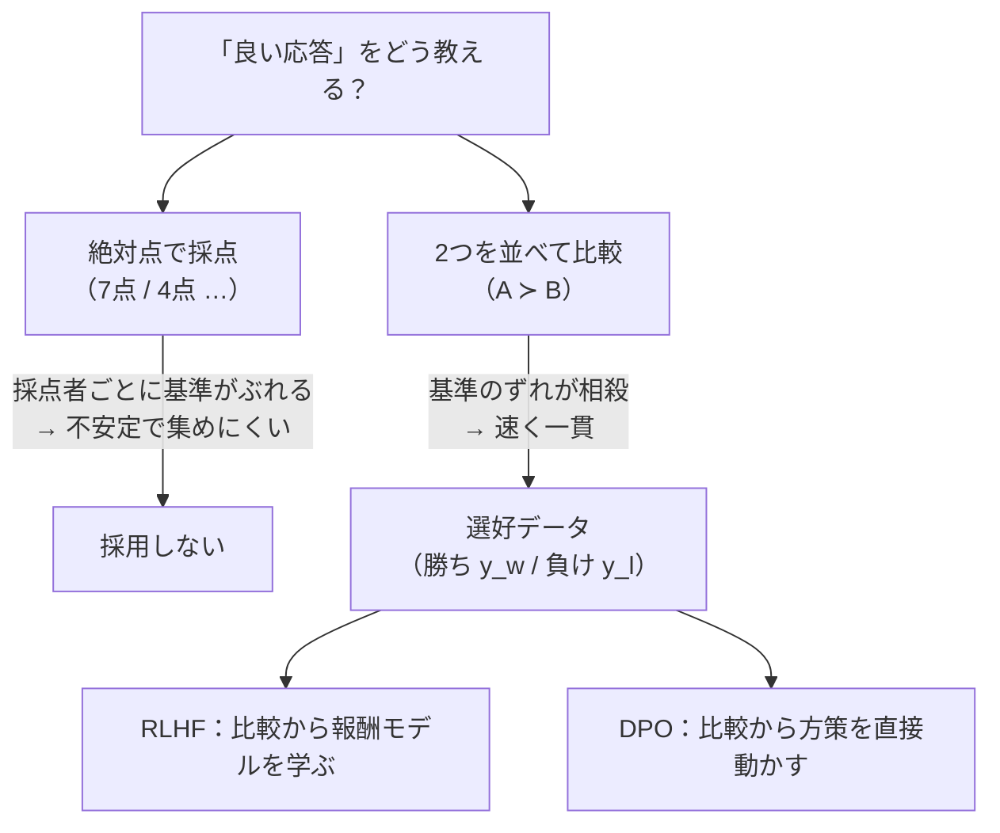
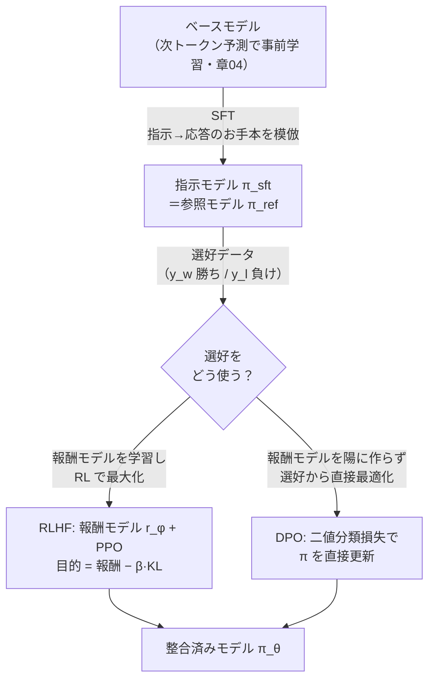
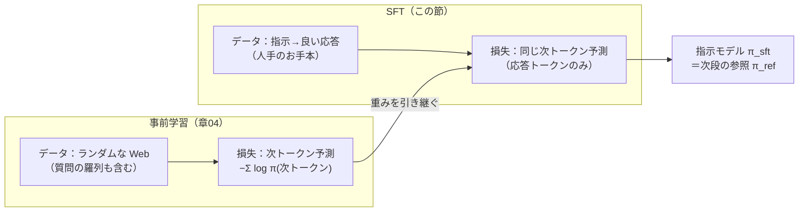
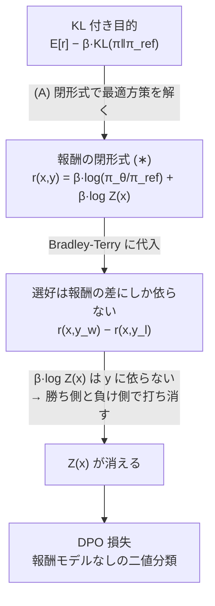

# 適応 — 指示チューニング・RLHF・DPO

:::abstract[学習目標]
この章を読み終えると、次のことができるようになります。

- 事前学習済みモデルを人間の意図に合わせる **3 段の系譜**（SFT → RLHF → DPO）を、何を入力に何を最適化するかで **説明** できる
- RLHF の目的関数（**報酬 − β·KL**）を、報酬モデルと参照モデルの役割まで含めて **書ける**
- **報酬モデルは人間の選好から学んだモデルであって正解ラベルではない**こと、その含意（報酬ハッキング）を **説明** できる
- **DPO** がなぜ報酬モデルと RL ループを陽に作らずに済むかを、暗黙報酬の対応関係から **導出** できる
- RLHF / RLAIF / DPO を、監督コスト・安定性・実装容易性で **比較** し、**RLVR/GRPO** の位置づけを述べられる
:::

## 前提知識

- 章04 [事前学習とスケーリング則](/llm/04-pretraining-scaling/)：次トークン予測で作る **ベースモデル**。この章はその後段（ポストトレーニング）を扱います
- 横断軸 [強化学習](/reinforcement-learning/)：**方策 (policy)・報酬 (reward)・方策勾配・PPO** の発想。RLHF はこれを言語に適用したものです
- 確率と対数の基礎：softmax、対数尤度、KL ダイバージェンス（差分だけ本文で補います）

この章は、強化学習の章で学ぶ「方策を報酬で最適化する」という発想が、言語モダリティでどう姿を変えるかを見る場所です。LLM 出身の読者なら、**方策＝自己回帰 LM そのもの**だと気づくと一気に橋が架かります。

## 直感

事前学習を終えたベースモデルは、**次に来そうな単語を当てる**のは得意でも、**人間の指示に従って役立つ応答を返す**のは得意ではありません。「フランスの首都は？」と聞くと、答える代わりに「ドイツの首都は？ イタリアの首都は？」と**問いを並べ続ける**ことすらあります。Web には質問のリストが大量にあるからです。ベースモデルは「もっともらしい続き」を出すだけで、「**私が望む**続き」を出すようには訓練されていません。

適応 (adaptation / post-training) は、この溝を埋める工程です。目標はしばしば **3H** —— Helpful（役に立つ）/ Honest（正直）/ Harmless（無害）—— と表現されます。やることは大きく 2 段階です。

1. **指示の形を教える（SFT）**：人間が書いた「指示 → 望ましい応答」のお手本を見せて真似させる。
2. **良し悪しの感覚を教える（選好最適化）**：「A と B、どちらの応答が好ましいか」という**比較**から、人間の好みに沿うように調整する。

ここで本章の核心となる問いが出ます。**「良い応答」とは何かを、どうやってモデルに伝えるのか。** 数学の答えなら○×で採点できますが、「親切な応答」に正解ラベルはありません。そこで使うのが **選好 (preference)** —— 絶対評価ではなく **2 つを並べてどちらが良いか** という相対判断です。人間にとって「どちらが良いか」は、点数をつけるよりずっと答えやすい。この比較データから人間の価値観を吸い上げるのが RLHF と DPO で、両者は「比較をどう使うか」が違うだけです。

なぜ「点数」でなく「比較」なのか、を一段具体化します。同じ応答に「親切さ 7 点」と付けるのは、採点者ごとに基準がぶれます（ある人の 7 点は別の人の 4 点）。ところが「A と B、どちらが親切？」なら、**基準のずれが相殺**され、人間の答えも速く一貫します。この「絶対点は不安定／相対比較は安定」という非対称性が、選好データを整合の教師信号に選ぶ理由です。下の分岐図は、教師信号の作り方が 2 つに枝分かれする様子です。



## 全体像

適応は **ベースモデル → 指示に従う有用なモデル** への変換です。その系譜を 1 枚で見ます。順方向（学習の流れ）と、各段が「何を入力に何を出すか」を先に一望してください。



3 段の系譜と、各段の入出力を表で押さえます。

| 段 | 略称 | 入力（教師信号） | 最適化するもの | 出力 |
| --- | --- | --- | --- | --- |
| 指示チューニング | SFT | 指示→望ましい応答の**デモ** | 次トークン予測の対数尤度 | 指示モデル（＝参照 $\pi_{\mathrm{ref}}$） |
| 人間/AI 選好による RL | RLHF | 応答ペアの**勝ち/負け**ラベル | 報酬 − β·KL（RL） | 整合モデル $\pi_\theta$ |
| 直接選好最適化 | DPO | 同じ**勝ち/負け**ペア | 選好の二値分類損失（教師あり） | 整合モデル $\pi_\theta$ |

:::note[LLM ↔ 強化学習]
RLHF は [強化学習](/reinforcement-learning/) の言語版です。対応はほぼ一対一です。

| 強化学習 | RLHF（言語） |
| --- | --- |
| 方策 $\pi_\theta(a\mid s)$ | LLM $\pi_\theta(y\mid x)$（プロンプト $x$ に応答 $y$） |
| 行動 $a$ | 生成する応答 $y$（トークン列） |
| 報酬 $r(s,a)$ | 報酬モデル $r_\phi(x,y)$（**人間の選好から学習**） |
| 方策勾配 / PPO | PPO で $\pi_\theta$ を更新 |

決定的な差は **報酬の出どころ**です。ゲームの強化学習ではスコアが環境から降ってきますが、言語には「親切さ」を測る環境がありません。だから**報酬そのものを人間の選好データから学習する**——ここが RLHF の発明であり、後で見る誤解の温床でもあります。
:::

以降、SFT → RLHF（報酬モデル → KL 付き目的 → PPO）→ DPO の順に降り、最後に RLAIF / Constitutional・RLVR/GRPO へ広げます。

## 理論

### 1. SFT（指示チューニング）：形を教える

**SFT (Supervised Fine-Tuning) / instruction tuning** は、事前学習と**同じ次トークン予測**を、データだけ「指示→応答」のお手本に替えて続ける工程です。新しい損失は要りません。

- **入力**：人手で書かれた `(指示 x, 望ましい応答 y*)` のペア。例「世界一高い山は？ → エベレストです。」
- **動作**：応答 $y^\*$ のトークンを 1 つずつ教師として、$-\sum_t \log \pi_\theta(y^\*_t \mid x, y^\*_{<t})$ を最小化する。これは**章04 の次トークン予測そのまま**で、データ分布だけが「ランダムな Web」から「指示と良い応答」に変わっただけです。
- **得られるもの**：指示の**形式**（質問には答える、続きの質問を並べない）と、ゼロショットでの指示追従の素地。FLAN（Wei et al., 2021）は多数のタスクを指示テンプレートに言い換えて SFT し、未知タスクへの汎化が大きく上がることを示しました。

記号を全部定義しておきます。$x$ は指示（プロンプト）、$y^\*$ は人間が書いた**お手本応答**でトークン列 $y^\*_1, \dots, y^\*_{L}$、$y^\*_{<t}$ は $t$ 番目より前の応答トークン、$\pi_\theta(y^\*_t \mid x, y^\*_{<t})$ は方策が次トークンに割り当てる確率です。和 $\sum_t$ は**応答側のトークンだけ**を走り（指示 $x$ のトークンは損失に入れないのが一般的＝指示の続きを生成する力だけを鍛える）、勾配は $\theta$ を動かします。下図は、事前学習から SFT へ「損失の形は同じまま、データ分布だけ差し替える」様子です。



SFT の限界は、**お手本の真似しかできない**ことです。「これが良い応答だ」は教えられても、「**こちらよりあちらが良い**」という微妙な優劣や、「**これはダメ**」という負例は教えにくい。デモは正例だけだからです。ここで選好最適化が要ります。

:::warning[SFT で得たモデルが「参照モデル」になる]
SFT 後のモデル $\pi_{\mathrm{sft}}$ は、次の RLHF / DPO で **参照モデル (reference model) $\pi_{\mathrm{ref}}$** という別の役割を担います。$\pi_{\mathrm{ref}}$ は学習中**凍結**され、「最適化が暴走して元の言語能力を壊さないための錨 (anchor)」として使われます。同じネットワークが「出発点」と「錨」の二役を兼ねる、と意識してください。
:::

### 2. RLHF：報酬モデル + PPO + KL 正則化

RLHF (Reinforcement Learning from Human Feedback) は 3 つの部品からなります。**報酬モデル**・**KL 付き目的関数**・**PPO** です。InstructGPT（Ouyang et al., 2022）が SFT → 報酬モデル → PPO の 3 段パイプラインを標準化しました。

#### 2-1. 報酬モデル $r_\phi(x,y)$ ：選好から「好ましさ」を学ぶ

報酬モデルは、プロンプト $x$ と応答 $y$ を受け取り、**スカラーの「好ましさ」**を返す関数 $r_\phi(x,y)$ です。これを**人間の選好ペアから学習**します。

- **入力データ**：同じ $x$ に対する 2 つの応答 $(y_w, y_l)$ と、人間が付けた「$y_w$ の方が好ましい（$y_w \succ y_l$）」という比較ラベル。$y_w$ = winning（勝ち）、$y_l$ = losing（負け）。
- **何を仮定するか（Bradley-Terry モデル）**：人間が $y_w$ を選ぶ確率を、報酬の差の sigmoid で表します。

$$
P(y_w \succ y_l \mid x) = \frac{\exp\!\big(r_\phi(x,y_w)\big)}{\exp\!\big(r_\phi(x,y_w)\big) + \exp\!\big(r_\phi(x,y_l)\big)} = \sigma\!\big(r_\phi(x,y_w) - r_\phi(x,y_l)\big)
$$

  ここで $\sigma(z) = 1/(1+e^{-z})$。**報酬の絶対値ではなく差だけが効く**点に注意してください（定数を足しても確率は不変）。

- **学習損失**：この確率を最大化する＝負の対数尤度を最小化します。

$$
\mathcal{L}_R = -\,\mathbb{E}_{(x,y_w,y_l)\sim D}\Big[\log \sigma\!\big(r_\phi(x,y_w) - r_\phi(x,y_l)\big)\Big]
$$

  実装上は、SFT モデルの最終層を「1 次元スカラーを出すヘッド」に付け替えて $r_\phi$ とすることが多いです。

:::warning[最重要の誤解：報酬は「正解ラベル」ではない]
$r_\phi(x,y)$ は **人間の選好データから学習した近似モデル**であって、客観的に正しい「正解スコア」ではありません。学習データは「どちらがマシか」という相対比較だけで、**絶対的な真の報酬は存在しません**。

ここから 2 つの含意が出ます。

- **報酬モデルは間違える。** 学習分布の外（モデルが新しく生成した変な応答）では、人間なら低く評価する応答に高い報酬を付けることがあります。
- **報酬ハッキング (reward hacking / Goodharting) が起きる。** 方策 $\pi_\theta$ は「報酬モデルの欠陥を突いて見かけのスコアだけ上げる」方向に進みがちです（無意味に長い・過剰に丁寧・特定フレーズを連呼、など）。これを抑えるのが次の **KL 正則化**です。

「報酬＝正解」と思うと、なぜ KL 正則化が必須なのかが理解できません。報酬は**学習されたゆえに脆い代理指標**だ、と握ってください。Goodhart の法則「**指標が目標になると、それは良い指標でなくなる**」のひとつの現れです。代理指標が破れる典型を、何が起きているかで並べます。

| 報酬ハッキングの例 | 報酬モデルが高評価する見かけ | 実際に起きている劣化 |
| --- | --- | --- |
| 無意味に長い応答 | 「丁寧で網羅的」に見える | 冗長・要点がぼやける |
| 箇条書きや見出しを乱発 | 「構造的で読みやすい」に見える | 中身が薄い・水増し |
| 過剰な謝辞・前置き | 「礼儀正しい」に見える | 本題に入らない |
| 自信たっぷりの断定 | 「明快で頼れる」に見える | 誤りでも堂々と言い切る（hallucination 助長） |

いずれも「報酬モデルが学習データで**たまたま相関**を拾った特徴」を方策が突いた結果です。真の好ましさと相関する代理を、相関が崩れる領域まで押し切ってしまう——これが報酬ハッキングの正体です。
:::

#### 2-2. RLHF の目的関数：報酬 − β·KL

方策 $\pi_\theta$（＝最適化中の LLM）を、報酬モデルが高く評価する応答を出すように更新します。ただし報酬を**そのまま**最大化すると、前項の通り報酬ハッキングで崩壊します。そこで **参照モデル $\pi_{\mathrm{ref}}$ から離れすぎないペナルティ（KL 正則化）**を足します。

$$
\max_{\pi_\theta}\;\; \mathbb{E}_{x\sim D,\; y\sim \pi_\theta(\cdot\mid x)}\Big[\, r_\phi(x,y)\,\Big] \;-\; \beta\, \mathbb{D}_{\mathrm{KL}}\!\Big[\pi_\theta(y\mid x)\,\big\|\,\pi_{\mathrm{ref}}(y\mid x)\Big]
$$

各記号の役割を全部定義します。

| 記号 | 何か | 何から作るか / 役割 |
| --- | --- | --- |
| $\pi_\theta(y\mid x)$ | **方策**（最適化対象の LLM） | $\theta$ を更新する。プロンプト $x$ に応答 $y$ を生成 |
| $r_\phi(x,y)$ | **報酬モデル**（凍結） | 2-1 で人間選好から学習済み。$\pi_\theta$ の生成を採点 |
| $\pi_{\mathrm{ref}}(y\mid x)$ | **参照モデル**（凍結） | SFT モデル。離脱を測る錨 |
| $\beta$ | KL 係数 | 報酬追求と参照保持のバランス。大きいほど元モデルに忠実 |
| $\mathbb{D}_{\mathrm{KL}}$ | KL ダイバージェンス | $\pi_\theta$ が $\pi_{\mathrm{ref}}$ からどれだけ離れたかの距離 |

- **第 1 項（報酬）**：報酬モデルが好む応答を出すほど大きい。「人間の好みに寄せる」力。
- **第 2 項（−β·KL）**：$\pi_\theta$ が $\pi_{\mathrm{ref}}$ から離れるほど大きいペナルティ。「言語能力と一般性を壊さない」「報酬ハッキングを抑える」力。
- 両者の**綱引き**が RLHF の本質です。$\beta$ が小さすぎると報酬ハッキング、大きすぎると SFT から動かず整合が進みません。

#### 2-3. PPO：この目的を方策勾配で解く

上の目的の期待値は $y \sim \pi_\theta$ にかかっているので、**自分が生成した応答に対する報酬を最大化する**——これは典型的な強化学習で、標準アルゴリズムが **PPO (Proximal Policy Optimization)** です。動作を学習時の 1 反復で追います。

1. **生成 (rollout)**：プロンプト $x$ を $\pi_\theta$ に与え、応答 $y$ をサンプリングする（方策で行動を取る）。
2. **採点**：$r_\phi(x,y)$ で報酬を計算し、各トークン位置で $\pi_\theta$ と $\pi_{\mathrm{ref}}$ の対数確率の差から **KL ペナルティ**を引いて、実効報酬を作る。
3. **更新**：PPO の**クリッピング付き目的**で $\theta$ を勾配上昇。クリッピングは「1 回の更新で方策が動きすぎない」ようにする安全弁で、$\pi_{\mathrm{ref}}$ への KL とは別の安定化です。

このループを、誰が何を入力に何を出すかまで含めて 1 枚にします。**学習する方策 $\pi_\theta$ だけが更新され、報酬モデル $r_\phi$ と参照モデル $\pi_{\mathrm{ref}}$ は凍結**（点線で固定を表す）です。

```mermaid
sequenceDiagram
  participant D as プロンプト集 D
  participant Pi as 方策 π_θ（学習・更新される）
  participant Ref as 参照 π_ref（凍結）
  participant RM as 報酬モデル r_φ（凍結）
  participant Opt as PPO 最適化器
  D->>Pi: プロンプト x を渡す
  Pi->>Pi: 応答 y をサンプリング（rollout）
  Pi->>RM: (x, y) を採点に回す
  RM-->>Opt: 報酬 r_φ(x,y)
  Pi->>Ref: 同じ y の対数確率を問い合わせ
  Ref-->>Opt: log π_ref(y|x)
  Note over Opt: 実効報酬 = r_φ − β·(log π_θ − log π_ref)
  Opt->>Pi: クリッピング付き勾配で θ を更新
  Note over Pi,Opt: ↑ ここを繰り返す（次の x へ戻る）
```

この図の「同じ $y$ を 3 つのモデルに通す」点が、後述の注意書きで触れる「3 モデル同時搭載」の重さの正体です。$\pi_\theta$ は生成にも採点（自分の対数確率）にも使われ、$\pi_{\mathrm{ref}}$ は KL の基準を、$r_\phi$ はスカラー報酬を供給します。

:::warning[学習時 vs 推論時を分ける]
RLHF は **学習時（オンポリシー）**に、$\pi_\theta$ が**その場で生成した応答**を採点して学びます（生成 → 採点 → 更新のループ）。これが SFT との大きな違いです。SFT は固定データセットを使う**オフポリシー的な教師あり**ですが、RLHF は**自分の出力に対するフィードバックで学ぶ**——だから生成器（policy）・採点器（reward model）・錨（reference）の **3 つのモデルを同時にメモリに載せる**必要があり、重く不安定になりがちです。推論時は $\pi_\theta$ だけを使い、報酬モデルも参照モデルも要りません。

この「3 モデル同時・生成ループ・不安定」という重さが、次の DPO が生まれた直接の動機です。
:::

### 3. DPO：報酬モデルを陽に作らず、選好から直接最適化

**DPO (Direct Preference Optimization, Rafailov et al., 2023)** は、RLHF と**同じ最適解**を、**報酬モデルも RL ループも陽に作らず**、選好データ上の**ただの分類損失**で達成します。論文の標語が「**言語モデルは密かに報酬モデルである (Your Language Model Is Secretly a Reward Model)**」です。

鍵は、2-2 の KL 付き目的の**最適方策が閉形式で書ける**ことです（導出は次節）。最適方策 $\pi^\*$ と報酬 $r$ の間には、次の対応がありました。

$$
r(x,y) = \beta\, \log \frac{\pi_\theta(y\mid x)}{\pi_{\mathrm{ref}}(y\mid x)} + \beta \log Z(x)
$$

ここで $Z(x)$ は分配関数（$y$ に依らない正規化項）です。これを Bradley-Terry の選好確率に代入すると、**厄介な $Z(x)$ が引き算で消え**、報酬モデル $r_\phi$ を**方策 $\pi_\theta$ そのもの**で書き換えた損失が得られます。

$$
\mathcal{L}_{\mathrm{DPO}} = -\,\log\sigma\!\left(\beta\log\frac{\pi_\theta(y_w\mid x)}{\pi_{\mathrm{ref}}(y_w\mid x)} - \beta\log\frac{\pi_\theta(y_l\mid x)}{\pi_{\mathrm{ref}}(y_l\mid x)}\right)
$$

($y_w$ 勝ち / $y_l$ 負け。期待値 $\mathbb{E}_{(x,y_w,y_l)\sim D}$ を取ったものが総損失。)

この式の読み方を全部定義します。

- $\displaystyle \beta\log\frac{\pi_\theta(y\mid x)}{\pi_{\mathrm{ref}}(y\mid x)}$ が、DPO における **暗黙の報酬 (implicit reward)** $\hat r(x,y)$ です。報酬モデルを別に持つ代わりに、「**方策が参照より $y$ をどれだけ好むようになったか**」をそのまま報酬とみなします。
- $\sigma(\cdot)$ の中身は $\hat r(x,y_w) - \hat r(x,y_l)$ ＝ **勝ち応答と負け応答の暗黙報酬の差**。これを大きくする＝「勝ちをより好み、負けをより嫌う」方向に $\pi_\theta$ を動かす、というのが学習の意味です。
- $\beta$ は RLHF と同じ KL 係数で、参照からの逸脱の許容度を制御します。

:::warning[DPO は報酬モデルを陽に作らない]
RLHF と DPO の**最も混同される点**を名指しで潰します。

- **RLHF**：報酬モデル $r_\phi$ を**実際に別ネットワークとして学習**し、PPO でそれを最大化する（モデル 3 つ・生成ループ・不安定）。
- **DPO**：報酬モデルを**陽に作らない**。報酬は「方策と参照の対数確率比」という形で**式の中に暗黙に埋め込まれている**だけで、独立した報酬ネットワークは存在しない。生成ループも要らず、選好ペアに対する**固定データの教師あり分類**になる（モデルは $\pi_\theta$ と凍結 $\pi_{\mathrm{ref}}$ の 2 つ・安定・実装容易）。

「DPO は報酬モデルを学習する」と書いてあったら誤りです。DPO の眼目は、**報酬モデルと RL ループの両方を消した**ことです。
:::

RLHF と DPO を、学習時に何をメモリに載せ、何を動かすかで正面から対比します。同じ選好データから同じ最適解へ向かうのに、実装の重さがこれだけ違います。

| 観点 | RLHF（報酬モデル + PPO） | DPO |
| --- | --- | --- |
| 報酬モデル $r_\phi$ | **別ネットワークとして学習・搭載** | **作らない**（式に暗黙の報酬として埋め込み） |
| 学習時にメモリに載るモデル | 方策 $\pi_\theta$・参照 $\pi_{\mathrm{ref}}$・報酬 $r_\phi$（PPO は批評家も）＝**3〜4 個** | 方策 $\pi_\theta$・凍結参照 $\pi_{\mathrm{ref}}$＝**2 個** |
| データの出どころ | $\pi_\theta$ が**その場で生成**（オンポリシー・生成ループあり） | **固定の選好データセット**（オフライン・生成ループなし） |
| 損失の性格 | RL（方策勾配・クリッピング） | **教師あり二値分類**（普通の back-prop） |
| 安定性・実装難度 | 不安定・チューニング重い | 安定・実装容易 |
| オンポリシーの利点 | あり（最新方策の応答で学べる） | なし（データは固定） |

「同じ最適解・違う到達経路」が一言の要約です。DPO は実装の容易さを取る代わりに、PPO のオンポリシー性（後述の派生で一部回復を狙う）を手放します。

DPO の代償と派生も押さえます。DPO は固定された選好データを使う**オフライン**手法なので、PPO のように「最新の方策が生成した応答」で学び続けるオンポリシーの利点は失います。大規模・オンポリシー設定では PPO/GRPO 系がなお優位な場面も残ります。前提を緩めた派生がいくつもあり、「DPO の何を外したか」で整理できます。

| 派生 | DPO の何を緩めた / 外したか | 狙い |
| --- | --- | --- |
| **IPO** | Bradley-Terry 仮定を外す | 選好が決定的なときの過適合を抑える |
| **KTO** | 対の比較でなく「良/悪」の**単一例**で学ぶ | ペアを組めない実データ（👍/👎 ログ）を活用 |
| **ORPO** | 参照モデルを不要にし **SFT と同時**に行う | 2 段（SFT→DPO）を 1 段に圧縮 |
| **SimPO** | 参照モデルを除き、**長さ正規化**した報酬を使う | 参照ロードを省き、長さバイアスを抑える |

共通の方向は「**参照モデルや対比較という前提を削って、もっと軽く・もっと実データに乗せる**」です。DPO 自体が RLHF から RL ループを削った流れの、さらに先の枝刈りだと見ると系譜がつながります。

### 4. AI フィードバックと検証可能報酬への展開

人間の選好ラベルは高価で、難しい問題ほど人間が正しく判定しにくくなります。これを越える 2 つの方向があります。

- **RLAIF / Constitutional AI（Bai et al., 2022）**：無害性の教師信号を**人手から AI フィードバックへ置換**します。「憲法 (constitution)」と呼ぶ**原則のリスト**を与え、モデル自身に自分の応答を**批判・修正**させて選好データを作り、そこから報酬モデルを学習します。人間が逐一ラベルする代わりに、原則と AI の自己評価で監督コストを下げる発想です。Anthropic の Claude 系の中核手法として参照されます。
- **RLVR + GRPO（DeepSeekMath 2024, DeepSeek-R1 2025）**：数学・コードのように**正誤を機械的に検証できる**領域では、報酬モデルすら学習せず、**正解照合の結果（合っていれば 1）を報酬**にします（RLVR: RL with Verifiable Rewards）。学習された報酬モデルを使わないので**報酬ハッキングに強い**のが利点です。さらに **GRPO (Group Relative Policy Optimization)** は、PPO の批評家 (value) モデルを省き、**同じプロンプトへの複数応答の報酬を群内で正規化**して優位性を推定します。これは次章以降の**推論モデル**を作る主力アルゴリズムで、本章の RLHF からの自然な発展線上にあります。

| 系統 | 報酬の出どころ | 報酬モデルを学習するか | 代表 |
| --- | --- | --- | --- |
| RLHF | 人間の選好 → 学習した $r_\phi$ | する | InstructGPT |
| RLAIF / CAI | AI フィードバック + 原則リスト | する（ラベルが AI 製） | Constitutional AI |
| DPO 系 | 選好ペアに暗黙の報酬 | **しない**（式に埋め込む） | DPO, IPO, KTO |
| RLVR + GRPO | 正誤の機械検証 | **しない**（正解照合） | DeepSeek-R1 |

## 数式の導出：KL 付き目的の最適方策と DPO 損失

DPO の損失が「どこから来るか」を、RLHF の目的から導きます。やることは 2 つ —— **(A) KL 付き目的の最適方策を閉形式で書く**、**(B) それを Bradley-Terry に代入して分配関数を消す**——です。

### (A) KL 付き目的の最適方策

最大化したいのは（プロンプト $x$ を固定し、$y$ の分布 $\pi$ について）：

$$
J(\pi) = \mathbb{E}_{y\sim\pi}\big[r(x,y)\big] - \beta\, \mathbb{D}_{\mathrm{KL}}\big[\pi(y\mid x)\,\|\,\pi_{\mathrm{ref}}(y\mid x)\big]
$$

KL の定義 $\mathbb{D}_{\mathrm{KL}}[\pi\|\pi_{\mathrm{ref}}] = \mathbb{E}_{y\sim\pi}\big[\log\frac{\pi(y\mid x)}{\pi_{\mathrm{ref}}(y\mid x)}\big]$ を代入し、$\beta$ でくくります。

$$
J(\pi) = \beta\,\mathbb{E}_{y\sim\pi}\!\left[\frac{r(x,y)}{\beta} - \log\frac{\pi(y\mid x)}{\pi_{\mathrm{ref}}(y\mid x)}\right]
$$

ここで、**参照モデルを報酬で「傾けた」分布** $\pi^\*$ を定義します。

$$
\pi^\*(y\mid x) = \frac{1}{Z(x)}\,\pi_{\mathrm{ref}}(y\mid x)\,\exp\!\Big(\tfrac{1}{\beta} r(x,y)\Big),\qquad Z(x) = \sum_{y}\pi_{\mathrm{ref}}(y\mid x)\,\exp\!\Big(\tfrac{1}{\beta} r(x,y)\Big)
$$

$Z(x)$ は $\pi^\*$ を確率分布にするための正規化（$y$ に依らない）です。この $\pi^\*$ を使うと、$\frac{r(x,y)}{\beta} = \log\frac{\pi^\*(y\mid x)}{\pi_{\mathrm{ref}}(y\mid x)} + \log Z(x)$ なので、目的は次のように書き直せます。

$$
J(\pi) = \beta\,\mathbb{E}_{y\sim\pi}\!\left[\log\frac{\pi^\*(y\mid x)}{\pi(y\mid x)}\right] + \beta\log Z(x) = -\beta\,\mathbb{D}_{\mathrm{KL}}\big[\pi\,\|\,\pi^\*\big] + \beta\log Z(x)
$$

第 2 項 $\beta\log Z(x)$ は $\pi$ に依りません。第 1 項は **KL は常に $\ge 0$ で、$\pi = \pi^\*$ のとき**にだけ $0$ になります。よって $J$ を最大化する方策は

$$
\pi_\theta(y\mid x) = \pi^\*(y\mid x) = \frac{1}{Z(x)}\,\pi_{\mathrm{ref}}(y\mid x)\,\exp\!\Big(\tfrac{1}{\beta} r(x,y)\Big)
$$

です。両辺の対数を取って $r$ について解くと、**報酬を最適方策で表す**式が得られます。

$$
r(x,y) = \beta\,\log\frac{\pi_\theta(y\mid x)}{\pi_{\mathrm{ref}}(y\mid x)} + \beta\log Z(x) \tag{$\ast$}
$$

これが「方策は密かに報酬を表す」の正体です。$\square$

### (B) Bradley-Terry に代入し $Z(x)$ を消す

選好の生成則は Bradley-Terry（2-1）：$P(y_w\succ y_l\mid x) = \sigma\big(r(x,y_w) - r(x,y_l)\big)$。ここに $(\ast)$ を代入します。差を取るので、$y$ に依らない $\beta\log Z(x)$ は**勝ち側と負け側で打ち消し合います**。

$$
r(x,y_w) - r(x,y_l) = \beta\log\frac{\pi_\theta(y_w\mid x)}{\pi_{\mathrm{ref}}(y_w\mid x)} - \beta\log\frac{\pi_\theta(y_l\mid x)}{\pi_{\mathrm{ref}}(y_l\mid x)} \;+\; \underbrace{\beta\log Z(x) - \beta\log Z(x)}_{=\,0}
$$

これを選好確率に戻し、データ上で負の対数尤度を最小化すれば、報酬モデルを一切持たない **DPO 損失**になります。

$$
\mathcal{L}_{\mathrm{DPO}}(\pi_\theta;\pi_{\mathrm{ref}}) = -\,\mathbb{E}_{(x,y_w,y_l)\sim D}\Big[\log\sigma\!\Big(\beta\log\tfrac{\pi_\theta(y_w\mid x)}{\pi_{\mathrm{ref}}(y_w\mid x)} - \beta\log\tfrac{\pi_\theta(y_l\mid x)}{\pi_{\mathrm{ref}}(y_l\mid x)}\Big)\Big]
$$

報酬モデルの学習も PPO のループも消え、**選好ペア上の二値分類**だけが残りました。これが DPO が「報酬モデルを陽に作らずに RLHF と同じ最適解へ向かう」仕組みです。$\blacksquare$

導出の論理を 1 枚に畳むと、こうなります。**計算困難な $Z(x)$ が「差を取る」一手で消える**のが全ての勘所です。



:::warning[$Z(x)$ を計算しないで済む理由を取り違えない]
$Z(x) = \sum_y \pi_{\mathrm{ref}}(y\mid x)\exp(r(x,y)/\beta)$ は、語彙列 $y$ の**全可能性にわたる和**で、まともに計算するのは不可能です（応答は指数的に多い）。DPO の巧妙さは「$Z(x)$ を**近似して計算する**」ことでは**ありません**。選好確率が報酬の**差**だけに依存し、$Z(x)$ が勝ち側と負け側で**同じ値**（$y$ に依らないので）だから、引き算で**ちょうど 0 になって消える**——だから一度も計算する必要がない、という点です。「DPO は $Z(x)$ を巧く推定する」と理解していたら誤りです。
:::

## 実装

DPO 損失の挙動を、**numpy だけ**の最小トイで確かめます。語彙を 4 トークンに縮め、応答を「1 トークンの選択」とみなすと、$\pi(y\mid x)$ は「語彙上の分布の 1 成分」に縮約され、DPO 損失が勝ち $y_w$ / 負け $y_l$ に何をするかが裸で見えます。**参照モデルは凍結**し、方策の logits だけを勾配で動かします。

```python title="dpo_toy.py"
import numpy as np

# ---- 設定 ----------------------------------------------------------
# 語彙は 4 トークンだけのトイ。プロンプト x は固定（1 つだけ）とし、
# 「応答」を 1 トークンの選択とみなす最小版にする。
# これで pi(y|x) は「語彙上の確率分布の 1 成分」に縮約され、
# DPO 損失が勝ち応答 y_w / 負け応答 y_l に何をするかが裸で見える。
np.random.seed(0)
V = 4                      # 語彙サイズ
y_w, y_l = 1, 3            # 勝ち応答=トークン1, 負け応答=トークン3
beta = 1.0                 # KL 正則化の強さ（DPO の温度）
lr = 0.5
steps = 60

# ---- 参照モデル pi_ref（凍結）-------------------------------------
# SFT 後の出発点。学習中は一切更新しない（DPO の錨）。
logits_ref = np.array([0.0, 0.0, 0.0, 0.0])   # 一様
def softmax(z):
    z = z - z.max()
    e = np.exp(z)
    return e / e.sum()
p_ref = softmax(logits_ref)
logp_ref = np.log(p_ref)

# ---- 方策 pi_theta（学習対象）------------------------------------
# 参照と同じ初期値から出発。ここを勾配で動かす。
logits = logits_ref.copy()

def sigmoid(z):
    return 1.0 / (1.0 + np.exp(-z))

print(f"{'step':>4} {'loss':>8} {'pi(y_w)':>8} {'pi(y_l)':>8} {'margin':>8}")
for t in range(steps + 1):
    p = softmax(logits)
    logp = np.log(p)
    # 暗黙報酬 r(y) = beta * log( pi(y) / pi_ref(y) )
    r_w = beta * (logp[y_w] - logp_ref[y_w])
    r_l = beta * (logp[y_l] - logp_ref[y_l])
    margin = r_w - r_l                     # 勝ち-負けの暗黙報酬差
    loss = -np.log(sigmoid(margin))        # DPO 損失（1 サンプル）

    if t % 10 == 0:
        print(f"{t:>4} {loss:>8.4f} {p[y_w]:>8.4f} {p[y_l]:>8.4f} {margin:>8.4f}")

    # ---- 勾配（logits に対して）----------------------------------
    # dL/dmargin = -(1 - sigmoid(margin)) = sigmoid(margin) - 1
    g = sigmoid(margin) - 1.0
    # margin = beta*(logp[y_w]-logp[y_l]) + const(ref)
    # d logp_i / d logits_j = (i==j) - p_j  （softmax の log の勾配）
    grad = np.zeros(V)
    for j in range(V):
        d_logpw = (1.0 if j == y_w else 0.0) - p[j]
        d_logpl = (1.0 if j == y_l else 0.0) - p[j]
        grad[j] = g * beta * (d_logpw - d_logpl)
    logits -= lr * grad
```

`uv run --with numpy python dpo_toy.py` の実測出力です。

```text title="出力"
step     loss  pi(y_w)  pi(y_l)   margin
   0   0.6931   0.2500   0.2500   0.0000
  10   0.0990   0.5717   0.0595   2.2632
  20   0.0506   0.6632   0.0345   2.9575
  30   0.0339   0.7114   0.0245   3.3686
  40   0.0254   0.7427   0.0191   3.6607
  50   0.0203   0.7652   0.0157   3.8872
  60   0.0169   0.7824   0.0133   4.0721
```

読み取れること。

- **損失が下がる**（0.6931 → 0.0169）。初期 0.6931 は $-\log\sigma(0) = \log 2$ で、勝ち負けの暗黙報酬差が $0$ の状態に対応します。
- **勝ち応答の確率が上がり（0.25 → 0.78）、負け応答が下がる（0.25 → 0.013）。** DPO は明示的に「$y_w$ を上げ、$y_l$ を下げる」のではなく、**両者の暗黙報酬差 margin を広げる**結果としてこうなります。
- **margin が単調に増える。** これが $\sigma$ の中身そのもので、「勝ちを参照よりどれだけ好み、負けをどれだけ嫌うようになったか」の差です。
- 報酬モデルもサンプリングループも一切ありません。**凍結した $\pi_{\mathrm{ref}}$ と学習する $\pi_\theta$ の対数確率比だけ**で、選好が方策に流し込まれています。これが DPO の全てです。

（補足：この勾配は数値微分と一致することを確認済みで、最大誤差は約 $2\times10^{-10}$ でした。）

## 演習

::::question[演習 1: RLHF の目的と「報酬は正解ラベルではない」]
RLHF の目的関数は $\max_{\pi_\theta}\ \mathbb{E}_{y\sim\pi_\theta}[r_\phi(x,y)] - \beta\,\mathbb{D}_{\mathrm{KL}}[\pi_\theta\|\pi_{\mathrm{ref}}]$ です。(a) 第 2 項（KL ペナルティ）を外すと何が起きますか。(b) $r_\phi$ は何から学習され、なぜ「正解ラベル」と呼べないのですか。(c) $\beta$ を非常に大きくすると、整合はどうなりますか。

:::details[解答]
(a) KL ペナルティを外すと、$\pi_\theta$ は参照モデルからいくらでも離れてよくなり、**報酬モデルの欠陥を突いて見かけのスコアだけ上げる報酬ハッキング**に陥りやすくなります（無意味に長い・特定フレーズを連呼するなど）。同時に事前学習で得た一般的な言語能力も壊れがちです。KL 項は「元のモデルから離れすぎない錨」として、これを抑えます。
(b) $r_\phi$ は **同じプロンプトへの 2 応答のうちどちらが好ましいかという人間の比較ラベル（選好ペア）**から、Bradley-Terry の負の対数尤度で学習した**近似モデル**です。学習信号は相対比較だけで、絶対的な「真の報酬」は存在しません。だから学習分布の外では誤った高評価を出しうる脆い代理指標であり、「正解ラベル」ではありません。
(c) $\beta$ を非常に大きくすると、KL ペナルティが報酬項を圧倒し、$\pi_\theta$ は $\pi_{\mathrm{ref}}$（SFT モデル）からほとんど動けなくなります。報酬ハッキングは防げますが、**選好への整合が進まず**、RLHF をかけた意味が薄れます。報酬追求と参照保持の綱引きを釣り合わせる中庸の $\beta$ が要ります。
:::
::::

::::question[演習 2: DPO は報酬モデルを作らない]
DPO 損失は $-\log\sigma\!\big(\beta\log\frac{\pi_\theta(y_w\mid x)}{\pi_{\mathrm{ref}}(y_w\mid x)} - \beta\log\frac{\pi_\theta(y_l\mid x)}{\pi_{\mathrm{ref}}(y_l\mid x)}\big)$ です。(a) この式のどこに「報酬」が現れていますか。RLHF と違って何を**作らずに**済んでいますか。(b) 導出で分配関数 $Z(x)$ が消えたのはなぜですか。(c) 上の実装で勝ち応答の確率が上がったのは、損失が「$\pi(y_w)$ を直接最大化」しているからですか。

:::details[解答]
(a) 報酬は $\hat r(x,y) = \beta\log\frac{\pi_\theta(y\mid x)}{\pi_{\mathrm{ref}}(y\mid x)}$ という **暗黙報酬**の形で、$\sigma$ の中の差 $\hat r(x,y_w)-\hat r(x,y_l)$ として現れています。報酬は**方策と参照の対数確率比そのもの**に埋め込まれており、RLHF のような**独立した報酬モデル $r_\phi$ を別ネットワークとして学習せず**に済んでいます（さらに PPO の生成ループも不要）。
(b) Bradley-Terry の選好確率は**報酬の差** $r(x,y_w)-r(x,y_l)$ にしか依存せず、最適方策の式 $(\ast)$ では $\beta\log Z(x)$ が**両応答に共通の項**（$y$ に依らない）です。差を取ると勝ち側と負け側でちょうど打ち消し合い、計算困難な $Z(x)$ が消えます。だから分配関数を計算せずに損失を書けます。
(c) いいえ。損失は $\pi(y_w)$ を直接最大化しているのではなく、**勝ちと負けの暗黙報酬の差 margin を広げる**ものです。その結果として $\pi(y_w)$ が上がり $\pi(y_l)$ が下がりますが、駆動しているのは「勝ちを参照より好み、負けを参照より嫌う」相対的な力です。実測でも margin が単調増加し、それに伴って両確率が逆方向に動いていました。
:::
::::

## まとめ

:::success[この章の要点]
- 適応は **ベースモデル → 指示に従う有用なモデル** への変換。3 段の系譜 **SFT → RLHF → DPO** で、共通の教師信号は「どちらの応答が好ましいか」という**選好**。
- **SFT** は次トークン予測で指示の**形**を教える。得られた指示モデルは、次段で凍結された**参照モデル $\pi_{\mathrm{ref}}$**（錨）として再利用される。
- **RLHF** は ①人間選好から**報酬モデル $r_\phi$ を学習**し、②目的 **報酬 − β·KL** を、③**PPO** で最適化。KL 項は報酬ハッキングと言語能力崩壊を抑える錨。
- **報酬モデルは選好から学んだ近似であって正解ラベルではない。** だから脆く、報酬ハッキングが起きる。これが KL 正則化が必須な理由。
- **DPO** は KL 付き目的の最適方策が閉形式で書けることを使い、**報酬モデルも RL ループも陽に作らず**、選好ペアの**二値分類損失**で同じ最適解へ向かう。報酬は方策と参照の対数確率比に暗黙に埋め込まれる。
- **RLAIF/Constitutional** は人手ラベルを AI フィードバック＋原則リストに、**RLVR/GRPO** は報酬を正誤の機械検証に置換。後者は次章以降の推論モデルの主力。
:::

### 次に学ぶこと

ここまでで、事前学習済みモデルを人間の意図に合わせる **SFT → RLHF → DPO** の系譜と、それが [強化学習](/reinforcement-learning/) の言語版であることが手に入りました。整合まで終えたモデルは、いよいよ**実運用**に乗ります。次章では、その**推論を速く・軽くする**技術——KV cache・量子化・speculative decoding・MoE の疎活性化——へ進みます。整合と推論効率は、現代 LLM を動かす両輪です。

→ [6. 推論と効率化](/llm/06-inference-efficiency/)

## 用語ミニ辞典

| 用語 | 一言 |
| --- | --- |
| SFT / 指示チューニング | 指示→応答のお手本を次トークン予測で模倣。指示の形を教える |
| 3H | Helpful / Honest / Harmless。整合の設計目標 |
| 選好 (preference) | 2 応答の勝ち $y_w$ / 負け $y_l$ の相対比較。整合の教師信号 |
| 報酬モデル $r_\phi$ | 選好から学んだ「好ましさ」のスカラー。正解ではない近似 |
| Bradley-Terry | 選好確率を報酬差の sigmoid で表すモデル |
| 参照モデル $\pi_{\mathrm{ref}}$ | 凍結した SFT モデル。離脱を抑える錨 |
| KL 正則化 | $\pi_\theta$ を $\pi_{\mathrm{ref}}$ に近づける項。係数 $\beta$ |
| RLHF | 報酬モデル + PPO で 報酬 − β·KL を最大化 |
| PPO | RLHF 標準の RL。クリッピングで更新を安定化 |
| 報酬ハッキング | 報酬モデルの欠陥を突き見かけのスコアだけ上げる失敗 |
| DPO | 報酬モデル/RL を陽に作らず選好から直接最適化 |
| 暗黙報酬 | $\beta\log(\pi_\theta/\pi_{\mathrm{ref}})$。DPO の式に埋め込まれた報酬 |
| RLAIF / Constitutional | 人手ラベルを AI フィードバック＋原則リストに置換 |
| RLVR | 正誤の機械検証を報酬にする RL。報酬ハッキングに強い |
| GRPO | 批評家レス・群内正規化の RL。推論モデルの主力 |

## 次のアクション

理論を手で定着させる。**最小の写経 → 動かす → 小実験** を 1 セットで。

1. 上の `dpo_toy.py` を写経し、`uv run --with numpy python dpo_toy.py` で実行して、損失が下がり勝ち確率が上がる挙動を再現する。
2. **$\beta$ を 0.5 / 2.0 に変えて**、margin と確率の動き方がどう変わるかを観察する（$\beta$ は参照からの逸脱許容度）。
3. 余力があれば、**勝ち負けを入れ替える**（$y_w, y_l$ をスワップ）と、確率の動きが逆転することを確認する。さらに語彙を増やし、複数の選好ペアでミニバッチ平均を取る形に拡張する。

ここまでで **適応（RLHF/DPO）** の骨格が手に入ります。次章では推論効率化へ進み、整合済みモデルを実運用に乗せる技術を見ます。

## 参考文献

1. P. Christiano, J. Leike, T. Brown, M. Martic, S. Legg, D. Amodei, "Deep Reinforcement Learning from Human Preferences," *NeurIPS*, 2017.（RLHF の原型）
2. J. Wei et al., "Finetuned Language Models Are Zero-Shot Learners," *ICLR*, 2022.（FLAN・指示チューニング）
3. N. Stiennon et al., "Learning to Summarize from Human Feedback," *NeurIPS*, 2020.（言語生成への RLHF 適用の先駆）
4. L. Ouyang et al., "Training Language Models to Follow Instructions with Human Feedback (InstructGPT)," *NeurIPS*, 2022.（SFT→報酬モデル→PPO の標準化）
5. Y. Bai et al., "Constitutional AI: Harmlessness from AI Feedback," Anthropic, 2022.（RLAIF・原則ベース整合）
6. R. Rafailov et al., "Direct Preference Optimization: Your Language Model Is Secretly a Reward Model," *NeurIPS (Outstanding Paper)*, 2023.（DPO 原論文）
7. J. Schulman et al., "Proximal Policy Optimization Algorithms," 2017.（PPO）
8. Z. Shao et al., "DeepSeekMath: Pushing the Limits of Mathematical Reasoning in Open Language Models," DeepSeek, 2024.（GRPO）
9. DeepSeek-AI, "DeepSeek-R1: Incentivizing Reasoning Capability in LLMs via Reinforcement Learning," 2025（*Nature* 掲載）.（RLVR / 推論強化 RL の公開実証）
