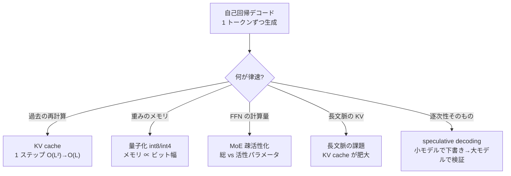

# 推論と効率化

:::abstract[学習目標]
この章を読み終えると、次のことができるようになります。

- 自己回帰デコードのコストが**どこから**生まれるかを、ステップごとの再計算として説明できる
- **KV cache** が計算量を 1 ステップ $O(L^2)$ から $O(L)$ へ落とす仕組みを、何をキャッシュし何を捨てるかまで述べられる
- **量子化**（int8 / int4）がメモリをビット幅で決めることを式で示し、何が**精度に効く**かを説明できる
- **Mixture-of-Experts** の「総パラメータ vs 活性パラメータ」の分離が、なぜ推論を安くするかを説明できる
- **長文脈** で何が律速になるか（計算量・KV cache メモリ）を切り分けられる
- **speculative decoding** が「品質を変えずに速くする」原理を、下書きと検証の役割分担で説明できる
:::

## 前提知識

- 第3章 [Transformer の構造](/llm/03-transformer/)：self-attention、$Q/K/V$ の projection、causal mask、自己回帰デコード
- self-attention の計算量が系列長 $L$ に対して $O(L^2)$ であること（第3章）
- 行列積の計算量の数え方（$m\times n$ と $n\times p$ の積は $O(mnp)$）

LLM の**学習**はここまでで扱いました。本章は **推論（inference・本番で文字を出す側）** の話です。学習が「重みを決める」工程なら、推論は「決まった重みで、ユーザーの入力に応答を生成する」工程。2024–2026 の実運用では、**推論コストこそが主戦場**になりました。

:::note[音声 streaming と同根]
本章の主役 **KV cache** は、音声 streaming ASR の **cache-aware 推論**（[/audio/04-asr/](/audio/04-asr/) の encoder 側 KV キャッシュ、[/audio/08-unified-streaming-tts/](/audio/08-unified-streaming-tts/)）とまったく同じ発想です。「過去に計算した $K/V$ を捨てずに使い回し、新しいぶんだけ計算する」——モダリティが違っても、自己回帰生成の効率化の心臓は共通です。
:::

## 直感

学習済みの LLM があるとします。プロンプトに続けて、トークンを**1 個ずつ**生成していく——これが自己回帰デコードです。問題は、素朴にやると **同じ計算を何度も繰り返してしまう** ことです。

100 トークン目を生成するとき、self-attention は過去 99 トークンすべてを参照します。では 101 トークン目は？ また過去 100 トークンを参照します。このとき、過去 99 トークンぶんの「参照のための準備（$K/V$ の計算）」は **100 トークン目のときとまったく同じ** です。なのに素朴な実装は毎回ゼロから作り直します。これが自己回帰デコードのコストの正体です。

本章は、この「ムダな再計算」を **KV cache** で消すところから始めます。そして、消したあとに残る本当のボトルネック——**メモリ帯域**——を、量子化・MoE・長文脈・speculative decoding の順に攻めていきます。すべては「同じ品質を、より少ない計算とメモリで」という一点を向いています。

## 全体像

推論を遅く・高価にする要因は 2 つあります。**計算量（FLOPs）** と **メモリ（容量と帯域）** です。本章の各手法は、このどちらか（または両方）を攻めます。



:::note[攻める対象の地図]
| 手法 | 主に減らすもの | 品質への影響 |
| --- | --- | --- |
| KV cache | 計算量（再計算） | **なし**（厳密に同じ出力） |
| 量子化 | メモリ容量・帯域 | 小（設計次第でほぼ無損失） |
| MoE | 計算量（FFN の FLOPs） | なし（設計上の選択） |
| speculative decoding | 実時間（逐次性） | **なし**（厳密に同じ分布） |
| 長文脈 | （課題側）KV cache が肥大 | — |

「品質への影響なし」が並ぶのが効率化技術の良いところです。**出力を変えずに速くする**——これが理想形で、KV cache と speculative decoding はそれを厳密に達成します。
:::

## 理論

### 自己回帰デコードのコスト：prefill と decode

推論は 2 つのフェーズに分かれます。区別を最初に押さえます。

- **prefill（プリフィル）**：プロンプト（入力の $L_0$ トークン）を **一度にまとめて** 処理し、最初の出力トークンを出す。全トークンが揃っているので並列に計算でき、行列積として効率が良い。
- **decode（デコード）**：以降、トークンを **1 個ずつ** 自己回帰生成する。各ステップで 1 トークンしか進まないので並列化できず、**逐次的**。

:::warning[prefill と decode のコストの質が違う]
prefill は「計算量が律速（compute-bound）」、decode は「メモリ帯域が律速（memory-bound）」になりがちです。理由：decode の 1 ステップでは新トークン **1 個** ぶんしか計算しないのに、**重み全体を GPU メモリから読み出す** 必要がある。計算は少ないのに読み出しは満額——だから「重みをどれだけ速く読めるか（帯域）」が効きます。量子化（後述）が効くのはここです。重みを 4bit に縮めれば、読み出すバイト数が 1/4 になります。
:::

### KV cache：何をキャッシュし、何を捨てるか

self-attention を思い出します（第3章）。トークン列 $x_1, \dots, x_L$ に対し、各トークンから 3 つのベクトルを作ります。

- **query** $q_i = x_i W_Q$：「自分は何を探しているか」
- **key** $k_i = x_i W_K$：「自分は何として参照されうるか」
- **value** $v_i = x_i W_V$：「参照されたとき何を返すか」

ここで $W_Q, W_K, W_V$ は **時間に依存しない固定の重み**（学習で決まり、推論中は変わらない）。各 $i$ について $q_i, k_i, v_i$ は **$x_i$ だけから決まり、他のトークンに依存しません**。

新しいトークン $x_{L+1}$ を生成するとき、その attention 出力に必要なのは：

$$\text{out}_{L+1} = \mathrm{softmax}\!\left(\frac{q_{L+1} [k_1, \dots, k_{L+1}]^\top}{\sqrt{d}}\right) [v_1, \dots, v_{L+1}]$$

ここで決定的に重要な観察があります。**$k_1, \dots, k_L$ と $v_1, \dots, v_L$ は、過去のステップで既に計算済み**です。$x_1$ は変わらないので $k_1 = x_1 W_K$ も変わりません。なのに素朴な実装は、$L+1$ 個ぶんの $k, v$ を毎ステップ作り直します。

**KV cache の動作**はこうです。

1. **prefill 時**：プロンプト $L_0$ トークンの $K = [k_1,\dots,k_{L_0}]$ と $V = [v_1,\dots,v_{L_0}]$ を計算し、**メモリに保持**する。
2. **decode の各ステップ**：新トークン $x_{L+1}$ の $q_{L+1}, k_{L+1}, v_{L+1}$ を **1 個だけ** 計算する。
3. キャッシュに $k_{L+1}, v_{L+1}$ を **追記** する。
4. キャッシュ全体（過去 + 今）に対して attention を計算し、出力を出す。

:::warning[Q はキャッシュしない・K と V だけ]
よくある誤解：「$Q$ もキャッシュすればいいのでは？」——いいえ。新トークンの出力に必要な query は **その新トークンの $q_{L+1}$ ただ 1 つ** です。過去の $q_1, \dots, q_L$ は **もう使いません**（過去トークンの出力は過去のステップで確定済み）。だから保持するのは $K$ と $V$ だけ。名前が "KV cache" であって "QKV cache" でないのはこのためです。
:::

これで何が変わるか。**過去の $k, v$ の再計算がゼロになります**。1 ステップあたりの projection 計算は $O(L)$（過去全部）から $O(1)$（新トークン 1 個）へ。attention のスコア計算自体は依然 $O(L)$（新 query と過去全 key の内積）残りますが、**重い projection の再計算が消える**のが本質です。

:::note[LLM ↔ Speech]
これは音声 streaming の **cache-aware 推論**（[/audio/04-asr/](/audio/04-asr/)）と同じものです。あちらは encoder の塊（chunk）ごとに過去の $K/V$ をキャッシュして再計算を避けました。こちらは decoder の 1 トークンごと。「自己回帰の各ステップで、過去の固定された表現を捨てずに使い回す」という骨格は、ASR でも TTS でも LLM でも同一です。
:::

### 量子化：メモリはビット幅で決まる

KV cache で計算量を削っても、decode は **memory-bound** のまま残ります。次に攻めるのはメモリそのもの——**量子化（quantization）** です。

重み 1 個を何ビットで表すか、を下げます。標準は fp16（16bit 浮動小数点）。これを **int8（8bit 整数）** や **int4（4bit）** に圧縮します。アイデアの核心は単純で、重みの値域 $[\min, \max]$ を $2^b$ 段階に区切り、各重みを最も近い格子点に丸めます。

$$w_q = \mathrm{round}\!\left(\frac{w - z}{s}\right), \qquad s = \frac{\max - \min}{2^b - 1}$$

ここで $b$ はビット幅、$s$ は **スケール（1 段の幅）**、$z$ は **ゼロ点（オフセット）**。$s$ と $z$ はブロックごと（例えば 128 重みごと）に 1 組ずつ持ち、推論時に $w \approx s \cdot w_q + z$ で近似的に復元します。

メモリは **ビット幅に正比例** します。パラメータ数 $N$、ビット幅 $b$ のとき、重みのメモリは

$$\text{memory} = N \cdot \frac{b}{8}\ \text{バイト}$$

:::warning[何が精度に効くか：外れ値（outlier）]
「単純に丸めればいい」わけではありません。LLM の活性化には、ごく一部に **桁違いに大きい値（outlier）** が出ます。値域全体を一様に区切ると、外れ値に引っ張られて格子が粗くなり、**大多数の小さい重み**の表現が潰れます。だから実用手法（GPTQ・AWQ など）は、外れ値を別扱いしたり、**どの重みが出力に効くか**を重み付けして丸め誤差を配分します。「ビットを減らす」だけなら自明、「品質を保ったまま減らす」のが研究の本体です。
:::

### Mixture-of-Experts：総パラメータと活性パラメータの分離

ここまでは「全パラメータを毎回使う（Dense）」前提でした。**MoE（Mixture-of-Experts）** はこの前提を崩します。

Transformer ブロックの FFN（位置ごとの全結合、第3章）を、**複数の専門家（expert・小さな FFN）** に置き換えます。各トークンごとに、**ゲート（router）** が「このトークンはどの専門家に送るか」を決め、**top-$k$ 個（例えば 8 個中 2 個）だけ** を起動します。

$$y = \sum_{i \in \text{top-}k} g_i(x)\, E_i(x), \qquad g(x) = \mathrm{TopK}\big(\mathrm{softmax}(x W_g)\big)$$

ここで $E_i$ は $i$ 番目の専門家、$g_i(x)$ はゲートが与える重み、$W_g$ はルーティング用の重み。**top-$k$ 以外の専門家は計算されません**（疎活性化）。

これが効くのは、**総パラメータと活性パラメータが分離する**からです。

- **総パラメータ**：全専門家を合わせた数。モデルの「知識の容量」。
- **活性パラメータ**：1 トークンの処理で実際に通るパラメータ数。**推論コストを決める**のはこちら。

例：8 専門家中 top-2 を起動するなら、総容量は Dense の約 8 倍持てるのに、1 トークンあたりの FFN の計算量は約 2/8 で済む。**容量を増やしながら、実効計算量を抑える**——これが MoE が大型フロンティアモデルの主流アーキテクチャになった理由です。

:::warning[MoE はメモリは減らさない]
誤解しやすい点：MoE が減らすのは **計算量（FLOPs）** であって、**メモリ容量ではありません**。8 専門家ぶんの重みは、たとえ毎回 2 個しか使わなくても、**全部 GPU メモリに載せておく**必要があります（どのトークンがどれを使うか事前に分からないので）。だから MoE は「計算は安いがメモリは食う」。量子化との組み合わせが効くのはこのためです。
:::

### 長文脈の課題：KV cache が肥大する

KV cache は救世主ですが、長文脈では**それ自身が問題**になります。文脈長 $L$ が伸びると、保持すべき $K/V$ の量が線形に増えます。

KV cache のメモリは、層数 $n_\text{layer}$、ヘッド数 $n_\text{head}$、ヘッド次元 $d_\text{head}$、ビット幅 $b$、文脈長 $L$、バッチ $B$ に対し：

$$\text{KV memory} = 2 \cdot B \cdot L \cdot n_\text{layer} \cdot n_\text{head} \cdot d_\text{head} \cdot \frac{b}{8}$$

先頭の $2$ は $K$ と $V$ の 2 つぶん。文脈が 128k トークンにもなると、KV cache が**重み本体に匹敵するか上回る**メモリを食います。

対策は 2 系統です。

- **KV を共有・圧縮**：複数の query ヘッドで $K/V$ を共有する **GQA（Grouped-Query Attention）**、$K/V$ を低ランク潜在ベクトルに圧縮する **MLA（Multi-head Latent Attention）**。上式の $n_\text{head}$ を実効的に小さくします。
- **attention を疎にする**：全トークンを見るのをやめ、近傍や重要トークンだけを見る（sliding window / sparse attention）。上式の $L$ を実効的に縮めます。

:::note[計算量とメモリは別の話]
混同しやすい：attention の **計算量**は素朴には $O(L^2)$（全ペアのスコア）。KV cache の **メモリ**は $O(L)$（各トークンの $K/V$ を 1 組）。長文脈では両方が問題になりますが、**律速は使い方による**。1 リクエストを長文脈で処理するなら計算量、多数のリクエストを同時に捌くなら（各々の KV cache が積み上がる）メモリ容量が先に天井を打ちます。
:::

### Speculative decoding：下書きと検証で逐次性を破る

decode の根本問題は **逐次性** です。$L+1$ 番目を出すには $L$ 番目が確定していないといけない——並列化できません。大モデルを 1 トークンごとに回すのは、重み全体を毎回読み出すので遅い。

**speculative decoding（投機的デコード）** はこれを「**小さい下書きモデルで複数トークン先読み → 大モデルで一括検証**」で破ります。

1. **下書き（draft）**：小さく速いモデルが、次の $\gamma$ トークンを**一気に**推測する（例：5 トークン）。
2. **検証（verify）**：大モデルが、その $\gamma$ トークンを **1 回の forward で並列に** スコアリングする。decode の逐次 forward $\gamma$ 回ぶんを、**prefill のように並列な forward 1 回**で済ませる。
3. **受理 / 棄却**：大モデルの分布と下書きの分布を比較し、先頭から合うところまで受理。最初に食い違ったトークンで打ち切り、そこから大モデル自身が 1 トークン出す。

ここが要点です。**出力分布は大モデル単独とまったく同じ**になります（受理・棄却を確率的に正しく設計するため）。下書きが当たれば一気に複数トークン進み、外れても大モデル単独と同じ 1 トークンは保証される。だから **品質を変えずに速くなる**。

:::warning[なぜこれで速くなるのか：律速の付け替え]
下書きが外れたら検証がムダでは？——いいえ。decode が遅いのは **memory-bound**（重み読み出しが律速）だからです。大モデルで $\gamma$ トークンを**並列検証**する 1 回の forward は、重み読み出しが 1 回ぶん。これを逐次に $\gamma$ 回やれば読み出しは $\gamma$ 回ぶん。**並列にまとめれば読み出し回数が減る**——下書きの当たり率が高いほど、この「まとめ」が効きます。計算量はむしろ増えますが、compute に余裕があり memory-bound な decode では、それが速度に直結します。
:::

## 数式の導出

KV cache が 1 ステップの計算量を $O(L^2)$ 相当から $O(L)$ へ落とすことを、projection の数で導きます。

**設定。** 隠れ次元を $d$、これまでに処理したトークン数を $L$ とします。$K/V$ の projection は 1 トークンあたり行列積 $x_i W$（$x_i \in \mathbb{R}^d$、$W \in \mathbb{R}^{d\times d}$）で、コストは $O(d^2)$。これを 1 単位として数えます。

**素朴な実装（cache なし）。** $L+1$ 番目のトークンを生成する 1 ステップで、過去 $L+1$ 個すべての $k, v$ を作り直します。projection 回数は

$$\text{cost}_\text{naive}(L) = \underbrace{2(L+1)}_{k,v\ \text{を}\ L+1\ \text{個}} + \underbrace{1}_{q_{L+1}} = 2L + 3 = O(L)\ \text{(1 ステップ)}$$

長さ $L$ の系列を**最初から最後まで**生成する総コストは、各ステップを足し上げて

$$\text{total}_\text{naive} = \sum_{t=1}^{L} (2t+1) = 2\cdot\frac{L(L+1)}{2} + L = L^2 + 2L = O(L^2)$$

**KV cache あり。** 各ステップで新トークン 1 個の $k, v, q$ だけを計算します。

$$\text{cost}_\text{cache}(L) = \underbrace{1}_{k_{L+1}} + \underbrace{1}_{v_{L+1}} + \underbrace{1}_{q_{L+1}} = 3 = O(1)\ \text{(1 ステップ・$L$ に依存しない)}$$

系列全体の総コストは

$$\text{total}_\text{cache} = \sum_{t=1}^{L} 3 = 3L = O(L)$$

**結論。** projection の再計算に関して、総コストは $O(L^2) \to O(L)$ へ落ちます。1 ステップで見れば $O(L) \to O(1)$。過去の $k, v$ が入力トークンだけで決まり**他のトークンに依存しない**こと、そして**過去の query はもう使わない**こと——この 2 つの性質が、再計算を完全に消せる根拠です。$\blacksquare$

（注：attention のスコア計算 $q_{L+1} K^\top$ 自体は cache ありでも 1 ステップ $O(L)$ 残ります。KV cache が消すのは重い **projection の再計算**で、これが decode の支配項です。）

## 実装

KV cache あり / なしを numpy で実装し、ステップごとの projection 回数を**実測**して比較します。重み $W_Q, W_K, W_V$ は固定（学習済みのつもり）、出力が**両者で厳密に一致する**こと（＝KV cache は品質を変えない）も確認します。

```python title="kvcache_toy.py"
import numpy as np

rng = np.random.default_rng(0)
d = 16  # 隠れ次元（小さく固定）

# 重み行列（時間で変わらない固定値。1 回作って使い回す）
Wq = rng.standard_normal((d, d)) / np.sqrt(d)
Wk = rng.standard_normal((d, d)) / np.sqrt(d)
Wv = rng.standard_normal((d, d)) / np.sqrt(d)


def attn_step_naive(tokens):
    """cache なし：毎ステップ、過去全トークンの K/V を再計算してから注意を計算。
    tokens は (L, d)。最後のトークンに対する出力と projection 回数を返す。"""
    L = tokens.shape[0]
    K = tokens @ Wk          # (L, d)  ← L 回ぶんの projection（ここがムダの本体）
    V = tokens @ Wv          # (L, d)
    q = tokens[-1] @ Wq      # 最新トークンの query だけ要る
    scores = K @ q / np.sqrt(d)
    w = np.exp(scores - scores.max()); w /= w.sum()
    out = w @ V
    proj = 2 * L + 1         # k,v を各 L 回 + q 1 回 = O(L)
    return out, proj


def attn_step_cached(token, cacheK, cacheV):
    """cache あり：新トークン 1 個だけ K/V/Q を計算し、過去はキャッシュから供給。"""
    k = token @ Wk           # 1 回
    v = token @ Wv           # 1 回
    q = token @ Wq           # 1 回
    cacheK = np.vstack([cacheK, k]) if cacheK is not None else k[None]
    cacheV = np.vstack([cacheV, v]) if cacheV is not None else v[None]
    scores = cacheK @ q / np.sqrt(d)
    w = np.exp(scores - scores.max()); w /= w.sum()
    out = w @ cacheV
    proj = 3                 # k,v,q を各 1 回。L に依存しない（O(1)）
    return out, cacheK, cacheV, proj


def run(L_total):
    seq = rng.standard_normal((L_total, d))
    naive_steps, cached_steps = [], []
    cK = cV = None
    for t in range(L_total):
        _, pn = attn_step_naive(seq[: t + 1]); naive_steps.append(pn)
        _, cK, cV, pc = attn_step_cached(seq[t], cK, cV); cached_steps.append(pc)
    return seq, naive_steps, cached_steps


L_total = 8
seq, naive_steps, cached_steps = run(L_total)

print("step |  naive(再計算) | cache | 出力は一致?")
cK = cV = None
for t in range(L_total):
    out_n, _ = attn_step_naive(seq[: t + 1])
    out_c, cK, cV, _ = attn_step_cached(seq[t], cK, cV)
    same = np.allclose(out_n, out_c, atol=1e-10)
    print(f"  {t+1:2d} |       {naive_steps[t]:4d}    |  {cached_steps[t]:3d}  |   {same}")

print(f"\nnaive 累計 projection : {sum(naive_steps)}")
print(f"cache 累計 projection : {sum(cached_steps)}")
print(f"削減率                 : {1 - sum(cached_steps)/sum(naive_steps):.1%}\n")

print("L_total |  naive累計 | cache累計 | naive/L^2 | cache/L")
for L in [8, 16, 32, 64, 128]:
    _, n_steps, c_steps = run(L)
    sn, sc = sum(n_steps), sum(c_steps)
    print(f"  {L:4d}  | {sn:8d}  | {sc:7d}   |  {sn/L**2:6.3f}  |  {sc/L:5.2f}")
```

実行すると次の出力が得られます。

```text title="出力"
step |  naive(再計算) | cache | 出力は一致?
   1 |          3    |    3  |   True
   2 |          5    |    3  |   True
   3 |          7    |    3  |   True
   4 |          9    |    3  |   True
   5 |         11    |    3  |   True
   6 |         13    |    3  |   True
   7 |         15    |    3  |   True
   8 |         17    |    3  |   True

naive 累計 projection : 80
cache 累計 projection : 24
削減率                 : 70.0%

L_total |  naive累計 | cache累計 | naive/L^2 | cache/L
     8  |       80  |      24   |   1.250  |   3.00
    16  |      288  |      48   |   1.125  |   3.00
    32  |     1088  |      96   |   1.062  |   3.00
    64  |     4224  |     192   |   1.031  |   3.00
   128  |    16640  |     384   |   1.016  |   3.00
```

読み取れること：

- **出力は全ステップで一致**（`True`）。KV cache は近似ではなく、**厳密に同じ結果**を返す。
- naive は 1 ステップごとに projection が $3,5,7,\dots$ と**線形に増える**（$2L+1$）。cache は**常に 3**（$O(1)$）。
- 総コストの列：`naive/L^2` がどの $L$ でも約 1.0 に張り付く＝naive は $O(L^2)$。`cache/L` が常に 3.00＝cache は厳密に $O(L)$。導出した式どおりです。

量子化のメモリも、同じく実測で確認します。

```python title="quant_toy.py"
N = 7_000_000_000  # 7B パラメータ（重みの総数。固定）
print("精度    | bits/param | メモリ(GB) | fp16比")
base = None
for name, bits in [("fp16", 16), ("int8", 8), ("int4", 4)]:
    gb = N * bits / 8 / 1e9           # memory = N * b / 8 バイト
    if base is None:
        base = gb
    print(f"{name:6s} |   {bits:2d}      |  {gb:6.1f}   |  {gb/base:4.2f}x")
```

```text title="出力"
精度    | bits/param | メモリ(GB) | fp16比
fp16   |   16      |    14.0   |  1.00x
int8   |    8      |     7.0   |  0.50x
int4   |    4      |     3.5   |  0.25x
```

ビット幅を半分にすればメモリも半分。式 $\text{memory} = N \cdot b / 8$ がそのまま効いています。7B モデルが fp16 で 14 GB、int4 なら 3.5 GB——量子化が「載らなかったモデルを載せる」「読み出しを速くする」両方に効くのが数字で見えます。

## 演習

::::question[演習 1: KV cache が消すコスト]
隠れ次元 $d$、これまでに $L$ トークン処理済みの状態で、次の 1 トークンを生成します。(a) cache なしの実装で、このステップに必要な $k, v$ の projection は何回ですか（$L+1$ 番目を作るとして）。(b) cache ありなら何回ですか。(c) なぜ過去の $q_1, \dots, q_L$ はキャッシュしなくてよいのですか。

:::details[解答]
(a) cache なしは過去 $L+1$ 個すべての $k$ と $v$ を作り直すので、$k$ で $L+1$ 回・$v$ で $L+1$ 回、合わせて $2(L+1)$ 回（$q$ を入れれば $2L+3$）。$O(L)$ です。
(b) cache ありは新トークン 1 個ぶんの $k, v$ だけ作るので **各 1 回・合わせて 2 回**（$q$ を入れて 3 回）。$L$ に依存しない $O(1)$ です。
(c) 新トークンの attention 出力に必要な query は **その新トークンの $q_{L+1}$ 1 つだけ**だからです。過去トークンの出力は過去のステップで既に確定しており、$q_1, \dots, q_L$ はもう使いません。だから保持するのは $K$ と $V$ だけ（QKV cache ではなく KV cache）。
:::
::::

::::question[演習 2: 効率化手法が攻める対象]
次の各手法について、それが主に減らすのは「計算量（FLOPs）」「メモリ容量」「実時間（逐次性）」のどれか、そして出力品質を変えるかどうかを答えてください。(a) int4 量子化、(b) MoE（top-2 / 8 専門家）、(c) speculative decoding。

:::details[解答]
(a) **int4 量子化**：主に減らすのは **メモリ容量**（と読み出し帯域）。式どおり fp16 の 1/4。品質は**わずかに落ちうる**が、外れ値を考慮した手法（GPTQ/AWQ 等）でほぼ無損失にできる。
(b) **MoE**：減らすのは **計算量（FFN の FLOPs）**。top-2/8 なら 1 トークンの実効計算は約 2/8。ただし**メモリ容量は減らない**——8 専門家ぶんの重みは全部載せておく必要がある。品質は設計上の選択で、損なうものではない。
(c) **speculative decoding**：減らすのは **実時間（逐次性）**。小モデルで下書きし大モデルで並列検証することで、memory-bound な逐次 forward の回数を減らす。**出力分布は大モデル単独と厳密に同じ**で、品質は変わらない。
:::
::::

## まとめ

:::success[この章の要点]
- 自己回帰デコードのコストは **過去の再計算** から生まれる。decode フェーズは **memory-bound**（重み読み出しが律速）。
- **KV cache** は、入力トークンだけで決まる $K/V$ を保持して再計算を消す。1 ステップ $O(L)\to O(1)$、系列全体 $O(L^2)\to O(L)$。出力は**厳密に不変**。保持するのは $K$ と $V$ だけ（過去の $Q$ は使わない）。
- **量子化** はメモリをビット幅で決める（$\text{memory}=N\cdot b/8$）。int4 で fp16 の 1/4。品質維持の鍵は**外れ値の扱い**。
- **MoE** は総パラメータと活性パラメータを分離し、**計算量**を抑えて容量を増やす。ただしメモリ容量は減らない。
- **長文脈** では KV cache が肥大（$O(L)$ メモリ）。GQA/MLA で $K/V$ を圧縮・共有、疎注意で実効長を縮める。
- **speculative decoding** は小モデルで下書き→大モデルで並列検証。逐次性を破り、**分布は不変**のまま高速化。
:::

### 次に学ぶこと

ここまでで、推論を実運用可能にする **標準装備**——KV cache・量子化・MoE・長文脈対策・speculative decoding——が地図上に並びました。これらは vLLM などの本番推論基盤に統合され、推論モデルやエージェントの大きな推論コストを支える土台になっています。

次章では、この土台の上に立つ **現代 LLM の地図**——推論モデル（応答前に長く「考える」モデル）・エージェント・研究トレンド——へ進みます。推論コストが主戦場になったことが、なぜ「推論時に計算を投じる」方向への重心移動を生んだのか、そのつながりが見えてきます。

→ [7. 現代 LLM の地図 — 推論モデル・エージェント・研究トレンド](/llm/07-llm-landscape/)

## 用語ミニ辞典

| 用語 | 一言 |
| --- | --- |
| prefill / decode | プロンプト一括処理 / 1 トークンずつ自己回帰生成 |
| compute-bound / memory-bound | 計算が律速 / メモリ読み出しが律速 |
| KV cache | 過去の $K/V$ を保持し再計算を避ける。$O(L^2)\to O(L)$ |
| 量子化 (quantization) | 重みを低ビット化。メモリ $\propto$ ビット幅 |
| outlier | 一部の桁違いに大きい値。量子化品質の鍵 |
| MoE | 専門家の一部だけ起動。総 vs 活性パラメータを分離 |
| 総 / 活性パラメータ | 全容量 / 1 トークンで実際に通る数（コストを決める） |
| GQA / MLA | KV ヘッドを共有 / 低ランク圧縮し KV cache を削減 |
| speculative decoding | 小モデルで下書き→大モデルで並列検証。分布不変 |
| draft / verify | 投機的デコードの下書き役 / 検証役 |

## 次のアクション

理論を手で定着させる。**最小の写経 → 動かす → 小実験** を 1 セットで。

1. 上の `kvcache_toy.py` を写経して動かし、出力が全ステップ一致すること・naive が $O(L^2)$、cache が $O(L)$ になることを自分の目で確かめる。
2. `attn_step_cached` を改造し、**スコア計算 $q K^\top$ の演算回数**も数えてみる。cache ありでも 1 ステップ $O(L)$ が残ること（projection だけが $O(1)$ になること）を観察する。
3. `quant_toy.py` に **KV cache のメモリ式**（$2\cdot B\cdot L\cdot n_\text{layer}\cdot n_\text{head}\cdot d_\text{head}\cdot b/8$）を足し、文脈長 $L$ を 1k→128k で動かして、KV cache が重み本体に追いつく長さを見積もる。

ここまでで、推論効率化を「計算量を攻めるか、メモリを攻めるか」で整理する目が手に入ります。

## 参考文献

1. N. Shazeer, "Fast Transformer Decoding: One Write-Head is All You Need," 2019.（MQA・KV cache 削減の起点）
2. J. Ainslie et al., "GQA: Training Generalized Multi-Query Transformer Models from Multi-Head Checkpoints," *EMNLP*, 2023.
3. DeepSeek-AI, "DeepSeek-V2 / V3 Technical Report," 2024–2025.（MLA・細粒度 MoE）
4. E. Frantar et al., "GPTQ: Accurate Post-Training Quantization for Generative Pre-trained Transformers," *ICLR*, 2023.
5. J. Lin et al., "AWQ: Activation-aware Weight Quantization for LLM Compression and Acceleration," *MLSys*, 2024.
6. N. Shazeer et al., "Outrageously Large Neural Networks: The Sparsely-Gated Mixture-of-Experts Layer," *ICLR*, 2017.
7. W. Fedus, B. Zoph, N. Shazeer, "Switch Transformers: Scaling to Trillion Parameter Models with Simple and Efficient Sparsity," *JMLR*, 2022.
8. Mistral AI, "Mixtral of Experts," 2024.（top-2 疎 MoE の実例）
9. Y. Leviathan, M. Kalman, Y. Matias, "Fast Inference from Transformers via Speculative Decoding," *ICML*, 2023.
10. C. Chen et al., "Accelerating Large Language Model Decoding with Speculative Sampling," 2023.
11. W. Kwon et al., "Efficient Memory Management for Large Language Model Serving with PagedAttention (vLLM)," *SOSP*, 2023.
