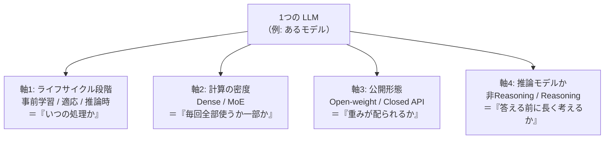
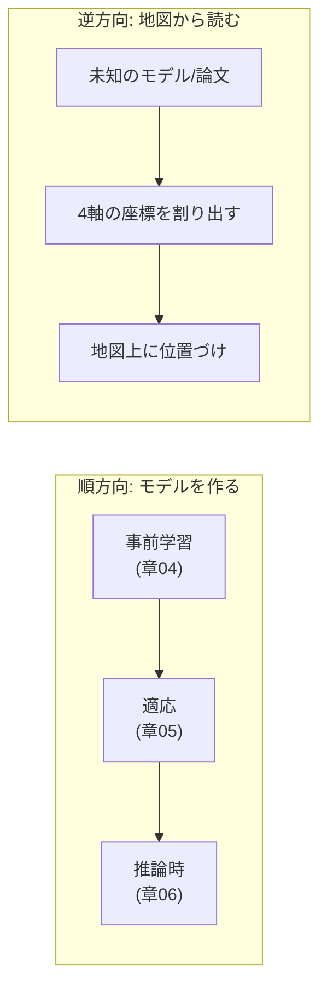
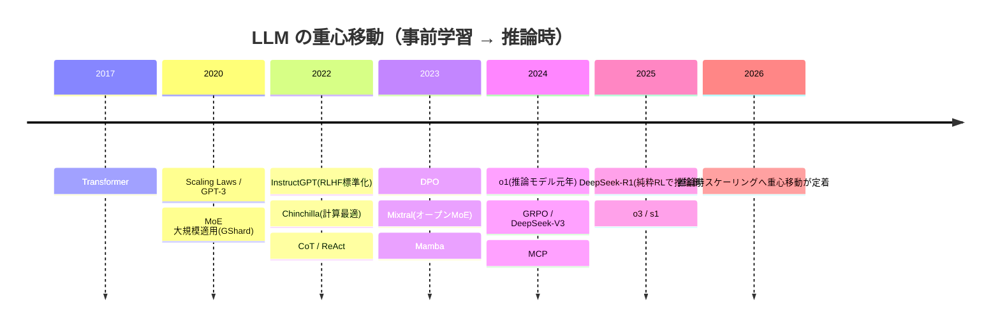

# 現代 LLM の地図 — 推論モデル・エージェント・研究トレンド

:::abstract[学習目標]
この章を読み終えると、次のことができるようになります。

- 現代 LLM を **4つの分類軸**（ライフサイクル段階 / Dense vs MoE / Open vs Closed / 推論モデルか）で **分類** できる
- 任意のモデルや論文を、これらの軸の **座標** として地図上に **位置づけ** られる
- **2017→2026 の年表** をたどり、Transformer から推論モデルへの流れを **説明** できる
- 2024–2026 の中心的トレンド（**事前学習スケーリングから推論時スケーリングへの重心移動**・RLVR・エージェント・MoE・長文脈・蒸留・評価の難しさ）を **論じ** られる
- 「**Dense と MoE の違い**」「**通常モデルと推論モデルの違い**」を、計算がどう流れるかのレベルで **対比** できる
:::

## 前提知識

この章は LLM 各論（01–06）の **総まとめ・俯瞰** です。次の3章を前提にします。

- [事前学習とスケーリング則](/llm/04-pretraining-scaling/)：次トークン予測で base model を作る段階、損失が $N$（パラメータ）・$D$（データ）・$C$（計算）のべき乗則で改善する **scaling law**、Chinchilla 最適（およそ20トークン/パラメータ）
- [適応 — 指示チューニング・RLHF・DPO](/llm/05-adaptation-rlhf/)：SFT → 報酬モデル → PPO の RLHF パイプライン、**DPO**（報酬モデルを省く直接最適化）、KL 正則化
- [推論と効率化](/llm/06-inference-efficiency/)：**KV cache**・量子化・**MoE**・長文脈、推論時のコスト構造

LLM 出身の読者（このテキストの想定読者）なら、各論で出てきた部品はすでに手の内にあります。本章はそれらを **1枚の地図** に並べ替える作業です。新しい数式は最小限で、代わりに **分類の論理** と **対比** を厚くします。

## 直感

LLM 各論を一通り終えると、こういう疑問が湧きます。

> 「o1 とか DeepSeek-R1 とか Mixtral とか Mamba とか、名前は聞くけど、これらは **互いにどういう関係** なのか？ 何が同じ系統で、何が直交した別の話なのか？」

この章はその地図を描きます。鍵は、**現代 LLM は1次元に並ばない** ことです。「GPT-3 → GPT-4 → o1」のような一本道ではなく、**いくつかの独立した軸** が張る空間に各モデルが点として置かれます。

たとえば「推論モデルかどうか」と「Dense か MoE か」は **直交** します。推論モデルにも Dense 版と MoE 版があり、非推論モデルにも両方あります。だから「o1 系 vs Llama 系」のような素朴な対立軸では地図になりません。**軸を分けて、各軸の上に置く** —— これが俯瞰の作法です。

そして 2024–2026 の地図には、**1つの大きな地殻変動** が走っています。**「もっと大きく事前学習する」から「推論時にもっと考えさせる」への重心移動** です。この一点を軸に、年表とトレンドを読み解いていきます。

:::note[この章の使い方]
これは「答えを覚える」章ではなく、**新しいモデルや論文に出会ったとき、自分で座標を割り出すための道具** を渡す章です。固有名や数値は時点に依存します（後述の注意書きを参照）。覚えるべきは **軸の構造** であって、特定モデルの順位ではありません。
:::

## 全体像

現代 LLM を分類する **4つの主要軸** と、それらが張る空間を1枚にします。各軸は **独立（直交）** していて、1つのモデルは「各軸の上の1点」の組として位置づきます。



4軸は次のように対応づくと、頭に入りやすいです。

| 軸 | 問い | 両極 | LLM 各論との接続 |
| --- | --- | --- | --- |
| ライフサイクル段階 | いつの処理か | 事前学習 ↔ 適応 ↔ 推論時 | 章04 ↔ 章05 ↔ 章06 |
| 計算の密度 | 毎回全パラメータを使うか | Dense ↔ MoE | 章06（MoE） |
| 公開形態 | 重みが配られるか | Open-weight ↔ Closed API | （横断的） |
| 推論モデルか | 答える前に長く考えるか | 非Reasoning ↔ Reasoning | 章05（RL）＋章06（test-time compute） |

:::warning[「軸」を混同しない —— 直交する別の話を1本にまとめない]
よくある混乱は、**異なる軸を1本の対立に潰してしまう** ことです。名指しで否定しておきます。

- 「**Open かどうか**」と「**推論モデルかどうか**」は別軸です。オープンな推論モデル（DeepSeek-R1, QwQ）も、クローズドな非推論モデルも存在します。
- 「**Dense/MoE**」と「**推論モデルか**」も別軸です。MoE な推論モデルもあれば、Dense な推論モデルもあります。
- 「**ライフサイクル段階**」は **モデルの種類ではなく処理のタイミング** です。同じ1つのモデルが、事前学習 → 適応 → 推論時の **3段すべてを通過** します。「事前学習モデル vs 推論モデル」と並べると軸を取り違えます（前者は段階、後者は別軸の性質）。

地図が描けないときは、たいてい **2つの軸を1本に潰している** のが原因です。
:::

第5の軸として **シーケンスモデル化の機構**（純Transformer / 疎注意 / SSM / ハイブリッド）もありますが、これはアーキテクチャ内部の話で章03・章06 の延長です。本章では4主軸を中心に据え、機構の軸は「研究トレンド」の節で扱います。

地図の **順方向**（モデルを作る流れ）と **逆方向**（地図からモデルを読む流れ）を一望しておきます。



## 理論

ここからが本章の中心です。4つの軸を1つずつ、**動作のレベル**（誰が・いつ・何を入力に・何を出すか）まで掘ります。

### 軸1: ライフサイクルの段階 —— 計算を「いつ」使うか

最も基本の軸は、**LLM のどの段階の処理を見ているか** です。1つのモデルは次の3段を順に通ります。

| 段階 | いつ | 何をする | 主な技術（章） |
| --- | --- | --- | --- |
| **事前学習** (pre-training) | 最初・1回 | 巨大コーパスで次トークン予測。base model を作る | scaling law・トークナイザ・データ品質（章04） |
| **適応** (post-training) | 事前学習の後 | 人間の意図・推論能力に合わせる | SFT・RLHF/DPO・RLVR（章05） |
| **推論時** (inference / test-time) | 本番・毎リクエスト | 生成しながら計算を投じる | CoT・self-consistency・speculative decoding（章06） |

**なぜこの軸が最重要か。** 2024–2026 の最大の地殻変動が、まさに **「どの段階に計算を割くか」の配分シフト** だからです。

- 2020–2023 は **事前学習** に計算を全振りする時代でした（scaling law に従って $N$ と $D$ を増やす）。
- 2024 以降、**推論時** に計算を投じる「考えるモデル」が台頭しました。同じ問題に長い思考連鎖（CoT）を展開したり、複数回サンプルして多数決を取ったりして、**生成時の計算量で性能を買う** 流れです。

:::warning[「段階」は排他ではない —— 全段階を同じモデルが通る]
「このモデルは推論時スケーリングのモデル」という言い方は、軸を取り違えています。推論モデルも **事前学習され、適応され、その上で推論時に長く考える**。3段すべてを通過します。正しくは「このモデルは **推論時段階に多くの計算を割り当てる設計** だ」です。段階は **モデルの種類ではなく、計算配分の話** です。
:::

:::note[LLM ↔ 地図]
LLM 各論を学んだ読者には、この軸は **章の並び順そのもの** です。章04（事前学習）→ 章05（適応）→ 章06（推論時）。本章はその3段を「計算配分の軸」として読み直しているだけ、と捉えると腑に落ちます。
:::

### 軸2: 計算の密度 —— Dense vs MoE

2つ目は、**推論時に全パラメータを使うか、一部だけ使うか** の軸です。章06 の MoE を「分類軸」として捉え直します。

**Dense（密）モデル** は、トークンごとに **全層・全パラメータ** を通します。だから **総パラメータ = 活性パラメータ**（毎回使うパラメータ）です。

**MoE（Mixture-of-Experts, 疎活性化）** は、各層の FFN を複数の「専門家（expert）」に分け、**ゲート（router）がトークンを top-$k$ 個の expert にだけ送ります**。残りの expert は **そのトークンについては一切計算しない**。結果、**総パラメータと活性パラメータが分離** します。

ここを動作レベルで歩きます。1つのトークン $x$ が MoE 層に来たとき：

1. **router** がスコアを計算：$x$ を各 expert に対して採点する（小さな線形層 $W_g$）。
2. **top-$k$ 選択**：スコア上位 $k$ 個の expert だけを選ぶ（残りは捨てる）。これが「疎」の正体。
3. **選ばれた expert だけ実行**：各 expert は普通の FFN。$k$ 個の出力をゲート重みで加重和して次へ。

:::warning[Dense と MoE の「パラメータ数」を混同しない]
MoE モデルの公称パラメータ数（例「671B」）は **総パラメータ** で、推論1トークンあたりに実際に計算される **活性パラメータ**（例「37B」）とは別物です。

- **総パラメータ** = モデルが持つ重みの総量（メモリ消費・知識容量に効く）
- **活性パラメータ** = 1トークンで実際に通る重み（**FLOPs・速度** に効く）

「Mixtral 8×7B」は **総 46.7B / 活性 約13B**、「DeepSeek-V3」は **総 671B / 活性 37B**。MoE の狙いは、**活性（＝計算コスト）を抑えたまま総（＝容量）を巨大化** することです。「パラメータが多い＝遅い」は Dense でのみ成り立ち、MoE では崩れます。
:::

| | Dense | MoE |
| --- | --- | --- |
| 1トークンで使うパラメータ | 全部 | top-$k$ の expert だけ |
| 総 vs 活性 | 等しい | **分離**（総 ≫ 活性） |
| 容量を増やすコスト | FLOPs が比例増 | FLOPs ほぼ据え置きで容量増 |
| 設計の要点 | シンプル | router・負荷分散・expert 容量 |
| 代表 | Llama 系・多くの小型モデル | Mixtral・DeepSeek-V3 |

**なぜ MoE がフロンティア大型モデルの主流になったか。** 事前学習の計算予算は有限です（章04 の scaling law）。Dense で容量を増やすと FLOPs がそのまま増えますが、MoE なら **活性パラメータ＝計算コストを一定に保ったまま総容量だけ増やせる**。「細粒度 expert ＋ 共有 expert」という設計（DeepSeek-MoE）でこの方向が定着しました。

:::note[LLM ↔ 地図]
MoE の router は、LLM のトークナイザや attention とは別種の「**ゲーティング**」です。あえて橋を架けるなら、**入力に応じて使うサブネットワークを切り替える条件付き計算**。「全部のニューロンを毎回使うのは無駄で、入力ごとに関係する一部だけ起動する」という、人間の脳の疎な発火にも似た発想です。
:::

### 軸3: 公開形態 —— Open-weight vs Closed

3つ目は、**モデルの重みが配布されるか、API 越しにしか使えないか** の軸です。

- **オープンウェイト**（Llama・Qwen・DeepSeek・Mistral・Gemma・Kimi など）：重みがダウンロードでき、ローカルで動かせる・fine-tune できる・中身を調べられる。多くが **事前学習レシピを詳細公開した技術レポート**（Llama 3・DeepSeek-V3・Qwen3 など）を伴い、知見を広く共有しました。
- **クローズド・フロンティア API**（GPT/o系・Gemini・Claude など）：重みは非公開で、API 越しにのみ使う。

**2026 年時点の地図** はこうです。オープンウェイトとクローズドの **性能差は、多くのタスクで数か月程度まで縮小** しました。ただし **最難関の抽象推論・長期エージェントタスク**（後述の ARC-AGI, HLE など）では、フロンティア API が依然リードする、という構図です。

:::warning[「Open かどうか」と「性能」「推論モデルか」を混同しない]
- Open ⇔ 弱い、ではありません。オープンウェイトの推論モデル（DeepSeek-R1）が、公開実証で大きなインパクトを与えました。
- Open/Closed は **配布形態の軸** であって、Dense/MoE や推論モデルかとは **直交** します。オープンな MoE 推論モデルも、クローズドな Dense 非推論モデルも存在しえます。

本章ではモデル名を **ベンダ宣伝ではなく、技術の実装例・評価対象** として中立に扱います。地図に名前を置くのは「この技術がどこで実証されたか」を示すためで、優劣のランキングではありません。
:::

### 軸4: 推論モデルか —— 非Reasoning vs Reasoning

4つ目が、2024–2025 で最も重要になった軸です。**応答の前に長い思考連鎖（CoT）を内部展開して「考える」か、即時応答するか**。

| | 非Reasoning（標準 instruct） | Reasoning（推論モデル / LRM） |
| --- | --- | --- |
| 応答前 | すぐ答え始める | 長い内部 CoT を展開してから答える |
| 推論時の計算 | 入力長に応じた1パス | **思考の長さぶん追加で計算** |
| 訓練 | SFT + RLHF/DPO | **RLVR**（検証可能報酬の RL）が中心 |
| 得意領域 | 一般的な対話・指示追従 | 数学・コード・科学（**正誤を自動判定できる** 領域） |
| 代表 | 標準的な instruct モデル | o1/o3 系・DeepSeek-R1・QwQ・Kimi k1.5 |

**動作の違いを歩きます。** 同じ質問「13×17は？」に対し：

- **非推論モデル**：トークンを順に生成し、すぐ「221」と答える（または間違える）。推論時の計算量は、出力したトークン数にほぼ比例します。
- **推論モデル**：答える前に「13×17 = 13×10 + 13×7 = 130 + 91 = 221。検算: …」のような **長い思考** を内部で展開し、その後に最終答えを出す。**思考が長いぶん、推論時の計算が増える**。

**なぜ推論モデルが効くのか（学習時 vs 推論時）。**

- **学習時**：**RLVR（Reinforcement Learning with Verifiable Rewards）** で訓練します。数学・コードのように **正解を機械で自動判定できる** 領域では、報酬モデルを学習せず「正解照合」そのものを報酬にできます。長く考えて正解に至った思考連鎖が強化され、モデルは「考える習慣」を獲得します。アルゴリズムは批評家（value model）を省く **GRPO** が標準（章05 の RL の発展形）。
- **推論時**：獲得した「考える習慣」を使い、難問では長い CoT を展開して計算を投じます。これが **test-time compute scaling**（推論時計算スケーリング）—— 推論時の計算を増やすほど難問の正答率が上がる、という関係です。

:::warning[推論モデルの「思考」は魔法ではない —— 失敗様式がある]
推論モデルにも固有の失敗があります。名指ししておきます。

- **overthinking**：簡単な問題に過剰に長く考え、計算を浪費する（遅く・高コストになる）。
- **underthinking**：難問なのに早々に思考を打ち切り、間違える。
- **reward hacking**：RLVR の報酬の穴を突き、**正答に見えるが本質的に正しくない** 出力で報酬を稼ぐ。
- **基盤モデルの上限**：RLVR は base model がそもそも持つ能力を **引き出す** 方向に働きやすく、base にない能力をゼロから創るわけではない、という指摘があります。

「考えるほど賢い」は一般には正しい傾向ですが、**無条件ではない** のが研究の最前線です。
:::

:::note[LLM ↔ 地図]
推論モデルは、章05（RL で整える）と章06（推論時に計算を投じる）の **合流点** です。「RL で `考える習慣` を訓練し、推論時にその習慣で計算を投じる」。RLHF が「人間の好みに合わせる RL」だったのに対し、RLVR は「正解に合わせる RL」。報酬の出どころが **人間の選好 → 機械検証可能な正誤** に変わったのが核心です。
:::

### 4軸を1つのモデルに当てる（座標の読み方）

地図の使い方は、**未知のモデルを4軸の座標として読む** ことです。例として「あるオープンな MoE 推論モデル」を読むと：

- 軸1（段階）：事前学習 → SFT → **RLVR** で適応 → 推論時に長 CoT（3段すべて通過、推論時に重く配分）
- 軸2（密度）：**MoE**（総 ≫ 活性）
- 軸3（公開）：**Open-weight**
- 軸4（推論）：**Reasoning**

逆に「ある標準的な小型 instruct モデル」なら（Dense / Open or Closed / 非Reasoning / 推論時は1パス）。**同じ4軸で、どんなモデルも座標化できる** —— これが地図の威力です。

### 代表研究・代表モデルの年表

軸が分かったところで、時間軸に並べます。**Transformer（2017）から推論モデル（2024–）への流れ** を、確認できた範囲で。モデル名は中立・教育的に扱います。

| 年 | 出来事 | どの軸の話か |
| --- | --- | --- |
| 2017 | **Transformer**（"Attention Is All You Need", Vaswani et al., NeurIPS）。自己注意＋FFN の残差スタックで全 LLM の基盤を確立 | 機構（全軸の土台） |
| 2017 | **RLHF の原型**（Christiano et al., NeurIPS）。ペア比較から報酬モデルを学習し RL で最大化 | 適応 |
| 2020 | **Scaling Laws**（Kaplan et al.）と **GPT-3**（Brown et al., NeurIPS）。べき乗則の確立と in-context learning の実証。**GShard** で MoE を大規模適用 | 事前学習・密度 |
| 2022 | **InstructGPT**（Ouyang et al., NeurIPS）。SFT → 報酬モデル → PPO の RLHF を標準化。**Constitutional AI**（AIフィードバック）。**Chinchilla**（計算最適：約20トークン/パラメータ） | 適応・事前学習 |
| 2022 | **Chain-of-Thought**（Wei et al.）・**ReAct**（Yao et al.）。推論とエージェントの起点 | 推論時 |
| 2023 | **DPO**（Rafailov et al., NeurIPS Outstanding）。報酬モデルと RL を省く直接最適化。**Mixtral 8×7B**（オープン MoE）・**Mamba**（post-Transformer 候補） | 適応・密度・機構 |
| 2024-09 | **o1**。RL で長い私的 CoT を訓練する初の本格的 **推論モデル**。test-time compute scaling を主流化 | **推論（重心移動の起点）** |
| 2024 | **DeepSeekMath/GRPO**（批評家レス RL）・**DeepSeek-V2/V3**（MLA + 細粒度 MoE）・**MCP**（ツール接続の標準プロトコル, 11月） | 適応・密度・エージェント |
| 2025-01 | **DeepSeek-R1 / R1-Zero**（Nature 掲載）。**純粋 RL での推論能力の創発** を公開実証。GRPO/RLVR を業界に普及 | **推論（オープン化）** |
| 2025-04 | **o3 / o4-mini**（推論第2世代、画像を CoT に統合）・**s1 budget forcing**（蒸留＋test-time scaling）・Kimi k1.5/QwQ（推論モデルのオープン化競争） | 推論・効率化 |
| 2026 | 地図の現状：標準スタック収束・MoE フロンティア・**推論時スケーリングへの重心移動** が定着。「ピークデータ」論争が中心論点。最難関（ARC-AGI/HLE）でフロンティアが先行 | 全軸 |



:::warning[年表の数値・固有名は時点依存]
ベンチマーク数値や「どのモデルが最強か」は **出典と時点に強く依存** し、変動が速いです。年表は **流れ（いつ何が軸を動かしたか）** を掴むためのもので、順位表ではありません。実装・調査の前には最新情報を引き直してください。
:::

## 研究トレンド（2024–2026）

地図の上で、いま **どの方向に流れているか** を節立てで論じます。これが本章の「動的な動作」にあたる部分です。

### トレンド1: 事前学習スケーリングから推論時スケーリングへ（最大の転換点）

最重要のトレンドです。2020–2023 は **事前学習に計算を全振り**（scaling law に従い $N, D$ を増やす）でした。2024 以降、**推論時に計算を投じる** 方向へ重心が移りました。

- きっかけは 2024-09 の o1。**「考える時間を増やすと賢くなる」** を製品レベルで示しました。
- 研究的には、**推論時計算を最適に配分すれば、パラメータを増やすより効果的になりうる**（小モデル＋多計算が大モデルを上回る場合がある）という実証が出ました。
- これにより、新しい研究軸が生まれました：**訓練計算と推論計算の最適配分**。「同じ予算を、事前学習に積むか、推論時に積むか」。

この章の **実装** 節で、この「推論時に計算を増やすと正答率が上がる」関係を numpy のトイで実測します。

### トレンド2: RLVR が推論モデル訓練の標準パラダイムに

推論モデルは **RLVR（検証可能報酬の RL）** で訓練するのが標準になりました。

- 数学・コードのように **正誤を機械で自動判定できる** 領域では、報酬モデルを学習せず「正解照合」を報酬にできます。
- 利点は **報酬ハッキング耐性とスケーラビリティ**：学習した報酬モデルは穴を突かれやすいですが、正解照合は穴が少ない（ただし皆無ではない）。
- アルゴリズムは批評家を省く **GRPO**（同一プロンプトへの複数応答の平均報酬を基準に相対優位を計算）が普及しました。PPO より軽量です。
- ただし、大規模オンポリシー設定では PPO/GRPO 系がなお優位な場面も残り、RL ループの簡素化（DPO 系）と推論強化（RLVR）は **目的が違う** 点に注意します。

### トレンド3: DeepSeek-R1 による「純粋 RL での推論創発」の公開

2025-01 の DeepSeek-R1 / R1-Zero は、**人手の CoT 注釈なしの純粋 RL** で、自己検証・反省・長い CoT が **創発** しうることを公開実証しました。

- これにより **推論モデルの作り方がオープン化** し、GRPO/RLVR が業界に広まりました。
- さらに、大型推論モデルの長 CoT を **蒸留**（distillation）で小モデルに移植する流れが加速。s1 の **budget forcing**（生成終了時に「Wait」を挿入して思考を延長する）のような、**少データ＋test-time scaling** で小モデルにも安価に推論を付ける手法が登場しました。

### トレンド4: エージェント・ツール使用の本格化

推論能力が上がると、それを **環境との相互作用** に使う方向（エージェント）が実用化します。

- **ReAct**（思考 Thought →行動 Action →観測 Observation の交互生成）が事実上の標準パターン。
- **function calling / computer use / コーディングエージェント / GUI 操作** が実用段階へ。**MCP**（Model Context Protocol, 2024-11）を中心にツール接続が標準化しました。
- **RL でエージェントを直接訓練する**（agentic RL）研究が急増。推論モデルの「考える」と、エージェントの「ツールを使って環境を変える」が融合しつつあります。

### トレンド5: MoE による効率化と長文脈

アーキテクチャ面のトレンドです（章03・章06 の延長）。

- **アーキテクチャの収束**：主要オープンモデルが **pre-norm + RMSNorm + RoPE + SwiGLU + GQA（または MLA）** という標準スタックにほぼ統一。アーキテクチャ選択が定型化し、差別化の焦点は **データ・ポストトレーニング・効率化** へ移りました。
- **MoE がフロンティアの主流に**：細粒度＋共有 expert で総と活性を分離（軸2 参照）。
- **効率化の焦点が「長文脈推論コスト」へ**：GQA 標準化に加え、KV を低ランク潜在に圧縮する **MLA**、学習段階から組み込む **Native Sparse Attention**、Transformer×SSM **ハイブリッド**（Jamba 系）が量産級で登場。ただし **純 SSM は Transformer を全面置換していない**（2026 時点はハイブリッドと注意の疎化が現実解）。

### トレンド6: 蒸留・データ・合成データ —— 「ピークデータ」論争

事前学習の燃料（高品質データ）が頭打ちになりつつある、という論点です。

- **「データの壁 / ピークデータ」論争**が 2025–2026 の中心論点。事前学習スケーリングの終焉を主張する側と、「壁はない」と反論する側が対立しています。
- 応答として、**合成データ**・**データ品質工学**（重複除去・フィルタ、FineWeb 等）・**オーバートレーニング**（推論コスト削減のため Chinchilla 比を大きく超えてトークンを投入）が常態化しました。
- **蒸留** は、大型推論モデルの能力を小モデルへ移す手段として、データ不足とコストの両面に効きます。

### トレンド7: 評価の難しさ —— 脱神話化とフロンティア化

最後に、**「賢さをどう測るか」自体が難しい** という横断トレンドです。

- **「創発的能力」の脱神話化**：スケールで突然現れるとされた能力の多くは、**評価指標の不連続性**（Exact Match 等）による **見かけ** だと整理されました。連続指標に変えると滑らかになります。
- **ベンチマークのフロンティア化**：飽和しやすい従来ベンチから、**飽和しにくく検証可能** なベンチ（GPQA・AIME・SWE-bench・ARC-AGI・HLE）へ移行。
- **注意点**：ベンチ汚染（テストデータが訓練に混入）、数値の時点依存。**単一スコアでモデルを序列化しない** のが誠実な読み方です。

:::warning[評価スコアの落とし穴]
「モデル A はベンチ X で Y点」という主張は、**ベンチの汚染・測定設定・時点** に依存します。とくに推論モデルは **推論時の計算量（思考の長さ・サンプル数）** でスコアが変わるため、「いくつ計算を投じたときのスコアか」を伴わない数値は比較になりません。地図では **スコアより軸の構造** を信頼します。
:::

## 数式の導出（軽め）

この章は地図なので導出は最小限です。中心トレンド（推論時スケーリング）を支える **2つの基本式** だけ、意味を確認します。

### test-time compute の基礎：周辺化と多数決

推論モデルの土台は **Chain-of-Thought** です。答え $a$ を、中間推論 $r$（思考連鎖）を経由して周辺化（marginalize）した確率として書けます。

$$
p(a \mid q) = \sum_{r} p(a \mid q, r)\, p(r \mid q)
$$

ここで $q$ は質問、$r$ は思考連鎖（理由づけ）、$a$ は最終答え。**「考える」とは、$r$ を明示的に生成してから $a$ を出す** ことです。1本の $r$ だけでなく **複数本サンプルして集約** すると精度が上がります。これが **self-consistency（多数決）** です。$N$ 本サンプルして最頻の答えを選ぶ：

$$
\hat{a} = \arg\max_{a} \sum_{i=1}^{N} \mathbb{1}\!\left[ a_i = a \right],
\qquad (r_i, a_i) \sim p_\theta(\cdot \mid q)
$$

$\mathbb{1}[\cdot]$ は指示関数（中が真なら1、偽なら0）。$a_i$ は $i$ 番目のサンプルの答え。$N$ を増やすほど **推論時計算が増え、多数決が安定** します。$\blacksquare$

### coverage：N 回中1回でも当たる確率

推論時計算を増やすもう1つの効き方が **coverage**（$N$ 回サンプルして少なくとも1回正解する確率）です。1サンプルの正答率を $p$、各サンプルが独立とすると、$N$ 回すべて外す確率は $(1-p)^N$ なので：

$$
\mathrm{coverage}(N) = 1 - (1 - p)^N
$$

$N \to \infty$ で $\mathrm{coverage} \to 1$。**検証器（verifier）があれば、$N$ 本の中から正解を拾える** ので、coverage が実効的な上限になります。多数決（self-consistency）は検証器なしで使える代わりに、coverage より緩やかにしか伸びません。実装節で **両者の伸びの違い** を実測します。$\blacksquare$

## 実装

地図の章ですが、**中心トレンド（推論時スケーリング）を手で確かめる** のが最も理解を定着させます。numpy だけで動くトイで、**推論時のサンプル数 $N$ を増やすと正答率がどう伸びるか** を実測します。

「1問あたり単体正答率 $p$ の生成器」を模し、**self-consistency（多数決）** と **coverage（$N$ 回中1回でも正解）** の伸びを比べます。これは上の2式（$\hat a$ の多数決と $1-(1-p)^N$）の検証です。

```python title="ttc_scaling.py"
import numpy as np

rng = np.random.default_rng(1)

# トイ: 推論時計算(test-time compute)を「サンプル数 N」で増やすと、
# (a) self-consistency(多数決)の正答率 と
# (b) coverage(N回中1回でも正解する確率)
# がどう伸びるかを実測する。1問あたり単体正答率 p の生成器を模した。

n_questions = 4000
n_options = 4          # 答えの候補(0..3)。正解は 0 とする
p = 0.45               # 1サンプルが正解する確率(単体では誤りがち)

def sample_answers(N):
    # 正解(0)を確率 p、誤り(1..3)を残り確率で一様に出す生成器
    correct = rng.random((n_questions, N)) < p
    wrong = rng.integers(1, n_options, size=(n_questions, N))
    return np.where(correct, 0, wrong)

# 奇数 N で多数決の同票を避ける
for N in [1, 3, 7, 15, 31, 63]:
    ans = sample_answers(N)
    # self-consistency: 各問で最頻値(多数決)を取り、それが正解(0)か
    maj = np.array([np.bincount(row, minlength=n_options).argmax() for row in ans])
    sc_acc = (maj == 0).mean()
    # coverage: N回中1回でも正解(0)が出た割合
    cov = (ans == 0).any(axis=1).mean()
    print(f"N={N:2d}  self-consistency={sc_acc:.3f}  coverage={cov:.3f}")
```

```text title="出力"
N= 1  self-consistency=0.452  coverage=0.452
N= 3  self-consistency=0.706  coverage=0.838
N= 7  self-consistency=0.750  coverage=0.984
N=15  self-consistency=0.849  coverage=1.000
N=31  self-consistency=0.955  coverage=1.000
N=63  self-consistency=0.994  coverage=1.000
```

読み取れること：

- **$N=1$ では正答率 0.45**（単体生成器そのもの）。これが「考えない」ベースライン。
- **$N$ を増やすほど両方とも伸びる** ＝ **推論時計算を増やすと賢くなる**（test-time compute scaling）を再現。
- **coverage の方が速く 1.0 に達する**：検証器で正解を拾えるなら $N$ をかけるほど確実に当たる（$1-(1-p)^N$）。
- **self-consistency は coverage より緩やか**：検証器なしの多数決は、誤答が割れて分散してくれて初めて多数決が効く。検証器の有無が伸びの差を生む、という上の式の含意がそのまま出ています。

この一実験が、本章の中心命題 **「事前学習を増やさなくても、推論時に計算を投じれば性能が買える」** の最小デモです。

:::note[補足: Dense と MoE の分離も数行で確かめられる]
軸2（Dense vs MoE）の「総と活性の分離」も numpy で実測できます。$n$ 個の expert のうち top-$k$ だけを起動すると、**総パラメータに対し活性パラメータが $\approx k/n$ に縮む** ことが、パラメータ数を数えるだけで確認できます（演習2で扱います）。
:::

## 演習

::::question[演習 1: モデルを4軸の座標に置く]
次の3つの（架空の）モデル記述を、本章の **4軸**（ライフサイクル段階での計算配分 / Dense・MoE / Open・Closed / 推論モデルか）で座標化してください。

- **モデル A**：重みが公開され、671B 総パラメータ・37B 活性。RLVR で訓練され、難問では長い思考連鎖を展開してから答える。
- **モデル B**：API 越しにのみ使え、全パラメータを毎トークン使う。指示にすぐ答え、内部で長く考える挙動はない。
- **モデル C**：重みが公開された 8B の小型モデル。大型推論モデルの思考連鎖を蒸留して学習し、難問では考えるが、毎トークン全パラメータを使う。

:::details[解答]
| | 段階（推論時配分） | 密度 | 公開 | 推論モデル |
| --- | --- | --- | --- | --- |
| **A** | 推論時に重く配分（長 CoT） | **MoE**（総 671B ≫ 活性 37B） | **Open** | **Reasoning** |
| **B** | 推論時は1パス（軽い） | **Dense**（全パラメータ起動） | **Closed** | 非Reasoning |
| **C** | 推論時に重く配分（蒸留で獲得） | **Dense**（8B 全起動） | **Open** | **Reasoning** |

ポイント：**A と C はともに推論モデルだが密度が違う**（MoE と Dense）。**4軸は直交** なので、推論モデルかどうかと Dense/MoE は別々に決まります。C のように「Dense な小型でも蒸留すれば推論モデルになりうる」点が、トレンド3（蒸留で推論を移植）の含意です。
:::
::::

::::question[演習 2: MoE の活性パラメータを数える]
MoE 層で、expert 数 $n=8$、各 expert の FFN が $W_1: d\to d_{ff}$ と $W_2: d_{ff}\to d$ の2行列（$d=16, d_{ff}=32$）、router $W_g: d\to n$、top-$k$ で $k=2$ とします。

(a) **総パラメータ**（全 expert + router）はいくつですか。
(b) **活性パラメータ**（1トークンで実際に使う：選ばれた $k$ expert + router）はいくつですか。
(c) 活性/総の比はおよそいくつで、$k, n$ とどう関係しますか。

:::details[解答]
1 expert あたりのパラメータは $d\cdot d_{ff} + d_{ff}\cdot d = 16\cdot32 + 32\cdot16 = 1024$。router は $d\cdot n = 16\cdot8 = 128$。

(a) 総 = $8 \times 1024 + 128 = 8320$。
(b) 活性 = $2 \times 1024 + 128 = 2176$（選ばれた2 expert と router のみ。残り6 expert は **このトークンでは1回も計算されない**）。
(c) 活性/総 $= 2176/8320 \approx 0.262$。router を無視すれば **およそ $k/n = 2/8 = 0.25$**。すなわち MoE は **計算コストを $\approx k/n$ に抑えたまま、総容量（知識）を $n/k$ 倍に増やせる**。これが「総と活性の分離」の正体です。

（この値は本章の MoE トイの実測 `活性/総 = 0.262` と一致します。）
:::
::::

## まとめ

:::success[この章の要点]
- 現代 LLM は **1次元に並ばない**。**4つの直交軸**（ライフサイクル段階 / Dense・MoE / Open・Closed / 推論モデルか）が張る空間に、各モデルを **座標** として置く。
- **軸1（段階）** は「いつ計算するか」。2024–2026 の地殻変動は **事前学習スケーリングから推論時スケーリングへの重心移動**。同じモデルが3段すべてを通る（段階は種類でなく配分の話）。
- **軸2（密度）** は Dense（総＝活性）vs MoE（総 ≫ 活性、$\approx k/n$ の計算で巨大容量）。公称パラメータ数は **総**、速度に効くのは **活性**。
- **軸3（公開）** は Open-weight vs Closed。性能差は多くのタスクで数か月に縮小、最難関ではフロンティアが先行。
- **軸4（推論モデルか）** は **RLVR で「考える習慣」を訓練し、推論時に長 CoT で計算を投じる**か。失敗様式（overthinking/underthinking/reward hacking）あり。
- 中心トレンド：**test-time compute scaling・RLVR・エージェント（ReAct/MCP）・MoE と長文脈・蒸留と合成データ（ピークデータ論争）・評価の脱神話化**。
:::

### 次に学ぶこと

ここまでで **言語（LLM）モダリティの基礎** が一通り揃いました。トークン化と Transformer（章01–03）、事前学習と scaling law（章04）、適応と RLHF/DPO（章05）、推論と効率化（章06）、そして本章でそれらを **1枚の地図** に並べ替えました。

次は2方向に広がります。

- **他モダリティへ**：言語で見た「トークン化 → 系列モデリング → 適応」の型は、**[視覚](/vision/)** や **[マルチモーダル](/multimodal/)** にそのまま橋渡しできます。言語が最も豊かに研究された土台なので、ここからの転用が効きます。
- **横断軸（強化学習）へ**：適応の RLHF/DPO と本章の RLVR は、**[強化学習](/reinforcement-learning/)** を言語に適用したもの。RL を横断軸として深掘りすると、推論モデル・エージェントの訓練が一段深く理解できます。

→ [LLM ロードマップに戻る](/llm/)

## 用語ミニ辞典

| 用語 | 一言 |
| --- | --- |
| ライフサイクル段階 | 事前学習 / 適応 / 推論時。「いつの処理か」の軸 |
| 推論時スケーリング | 推論時に計算を増やして性能を上げる（test-time compute） |
| Dense | 毎トークン全パラメータを使う。総＝活性 |
| MoE | top-$k$ expert だけ起動。総 ≫ 活性（$\approx k/n$ の計算） |
| 活性パラメータ | 1トークンで実際に通る重み。速度に効く |
| 総パラメータ | モデルが持つ重みの総量。容量・公称値 |
| Open-weight | 重みが配布され、ローカルで動かせる |
| 推論モデル (LRM) | 答える前に長い内部 CoT を展開するモデル |
| RLVR | 検証可能報酬の RL。正解照合を報酬にする |
| GRPO | 批評家を省く群相対の RL。推論訓練の標準 |
| self-consistency | 複数 CoT の多数決で精度を上げる推論時集約 |
| coverage | N 回中1回でも正解する確率。$1-(1-p)^N$ |
| 蒸留 | 大型モデルの能力を小モデルへ移す |
| エージェント | 推論・ツール・記憶を反復し環境と相互作用 |
| ReAct / MCP | 思考＋行動の標準パターン / ツール接続の標準プロトコル |
| ピークデータ | 高品質データが頭打ちという論争 |

## 次のアクション

地図を手で定着させる。**最小の写経 → 動かす → 小実験** を1セットで。

1. 本章の `ttc_scaling.py` を写経して `uv run --with numpy python ttc_scaling.py` で動かし、**$N$ を増やすと self-consistency と coverage が伸びる** のを自分の目で確認する。
2. 単体正答率 `p` を変えて（例 0.3 / 0.6）再実行し、**$p$ が低いと推論時スケーリングの効きが鈍る**（多数決が割れない・coverage の立ち上がりが遅い）ことを観察する。
3. 演習2の MoE のパラメータ計算を numpy で実装し、$k, n$ を変えて **活性/総 ≈ $k/n$** を実測する。さらに、手元の任意のモデル1つを選び、本章の **4軸の座標** に書き起こしてみる（地図に1点を置く練習）。

## 参考文献

1. A. Vaswani et al., "Attention Is All You Need," *NeurIPS*, 2017.（Transformer）
2. T. Brown et al., "Language Models are Few-Shot Learners," *NeurIPS*, 2020.（GPT-3・in-context learning）
3. J. Kaplan et al., "Scaling Laws for Neural Language Models," arXiv:2001.08361, 2020.
4. J. Hoffmann et al., "Training Compute-Optimal Large Language Models," *NeurIPS*, 2022.（Chinchilla）
5. L. Ouyang et al., "Training Language Models to Follow Instructions with Human Feedback," *NeurIPS*, 2022.（InstructGPT）
6. R. Rafailov et al., "Direct Preference Optimization," *NeurIPS*（Outstanding Paper）, 2023.（DPO）
7. J. Wei et al., "Chain-of-Thought Prompting Elicits Reasoning in Large Language Models," *NeurIPS*, 2022.
8. X. Wang et al., "Self-Consistency Improves Chain of Thought Reasoning," *ICLR*, 2023.
9. Z. Shao et al., "DeepSeekMath: Pushing the Limits of Mathematical Reasoning," arXiv, 2024.（GRPO）
10. DeepSeek-AI, "DeepSeek-R1: Incentivizing Reasoning Capability in LLMs via Reinforcement Learning," *Nature*, 2025.
11. A. Jiang et al., "Mixtral of Experts," Mistral AI, 2024.（オープン MoE）
12. DeepSeek-AI, "DeepSeek-V3 Technical Report," arXiv:2412.19437, 2024–2025.（MLA + 細粒度 MoE）
13. C. Snell et al., "Scaling LLM Test-Time Compute Optimally," arXiv, 2024.
14. N. Muennighoff et al., "s1: Simple Test-Time Scaling," *EMNLP*, 2025.（budget forcing・蒸留）
15. S. Yao et al., "ReAct: Synergizing Reasoning and Acting in Language Models," *ICLR*, 2023.
16. Anthropic, "Model Context Protocol (MCP)," 2024.（ツール接続の標準）
17. R. Schaeffer et al., "Are Emergent Abilities of Large Language Models a Mirage?," *NeurIPS*, 2023.（評価指標と創発）

（固有名・数値は 2025–26 時点。実装・調査前に最新情報を再確認してください。）
