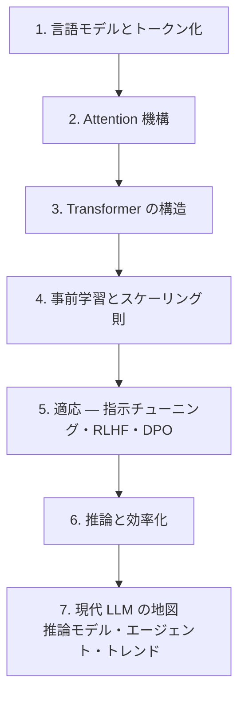

# 言語（LLM）

**言語（テキスト）モダリティ。** 大規模言語モデルを、トークン列の言語モデリングとして一から学びます。
音声（章03–08）で見た「トークン化 → 系列モデリング」の原型がここにあり、他モダリティの土台にもなります。

:::abstract[このモダリティで身につくこと]
- Transformer の各構成要素（attention, FFN, 正規化, 位置符号化）を説明・実装できる
- 言語モデルの学習目的（次トークン予測）・スケーリング則・評価指標を理解する
- 事前学習・指示チューニング・RLHF/DPO の違いを説明できる
- 推論時の効率化（KV cache・量子化・MoE・長文脈）と、推論モデル/エージェントの最前線を読める
:::

## North Star（最終目標）

1. **Transformer を一から実装** — attention・FFN・正規化をスクラッチで書ける
2. **事前学習 → 適応（RLHF/DPO）の全体像** — なぜ・どう整えるかを説明できる
3. **最前線を読む** — 推論モデル（o1 系）・エージェント・スケーリングの研究を地図上に位置づけられる

:::tip[横断軸との接続]
適応の **RLHF / DPO** は **[強化学習](/reinforcement-learning/)（横断的学習パラダイム）** を言語モダリティに適用したもの。第5章で深掘りします。
:::

## 前提知識

- 線形代数・微積分・確率の基礎
- 深層学習の基礎（多層パーセプトロン、誤差逆伝播）
- Python と PyTorch の基礎

## ロードマップ

## 章一覧

| # | 章 | 状態 |
| --- | --- | --- |
| 1 | [言語モデルとトークン化](/llm/01-language-model-and-tokenization/) | ✅ 公開 |
| 2 | [Attention 機構](/llm/02-attention/) | ✅ 公開 |
| 3 | [Transformer の構造](/llm/03-transformer/) | ✅ 公開 |
| 4 | [事前学習とスケーリング則](/llm/04-pretraining-scaling/) | ✅ 公開 |
| 5 | [適応 — 指示チューニング・RLHF・DPO](/llm/05-adaptation-rlhf/) | ✅ 公開 |
| 6 | [推論と効率化](/llm/06-inference-efficiency/) | ✅ 公開 |
| 7 | [現代 LLM の地図 — 推論モデル・エージェント・研究トレンド](/llm/07-llm-landscape/) | ✅ 公開 |

:::note[章は順次追加されます]
「次は◯◯の章を書いて」と指示すると、統一フォーマットで新しい章が追加されます。
:::
