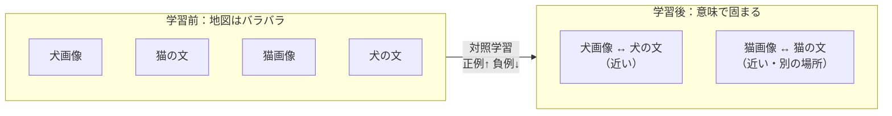
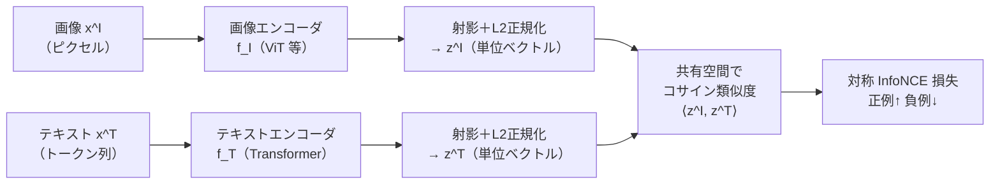
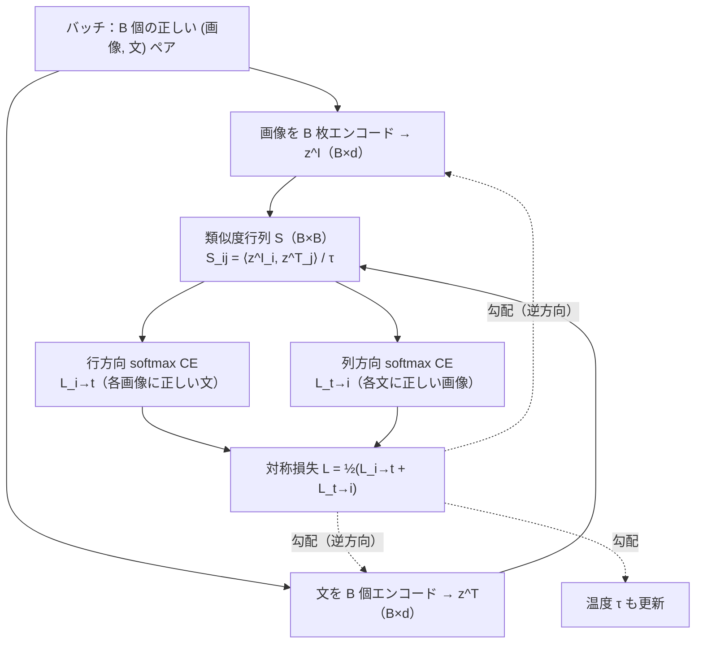
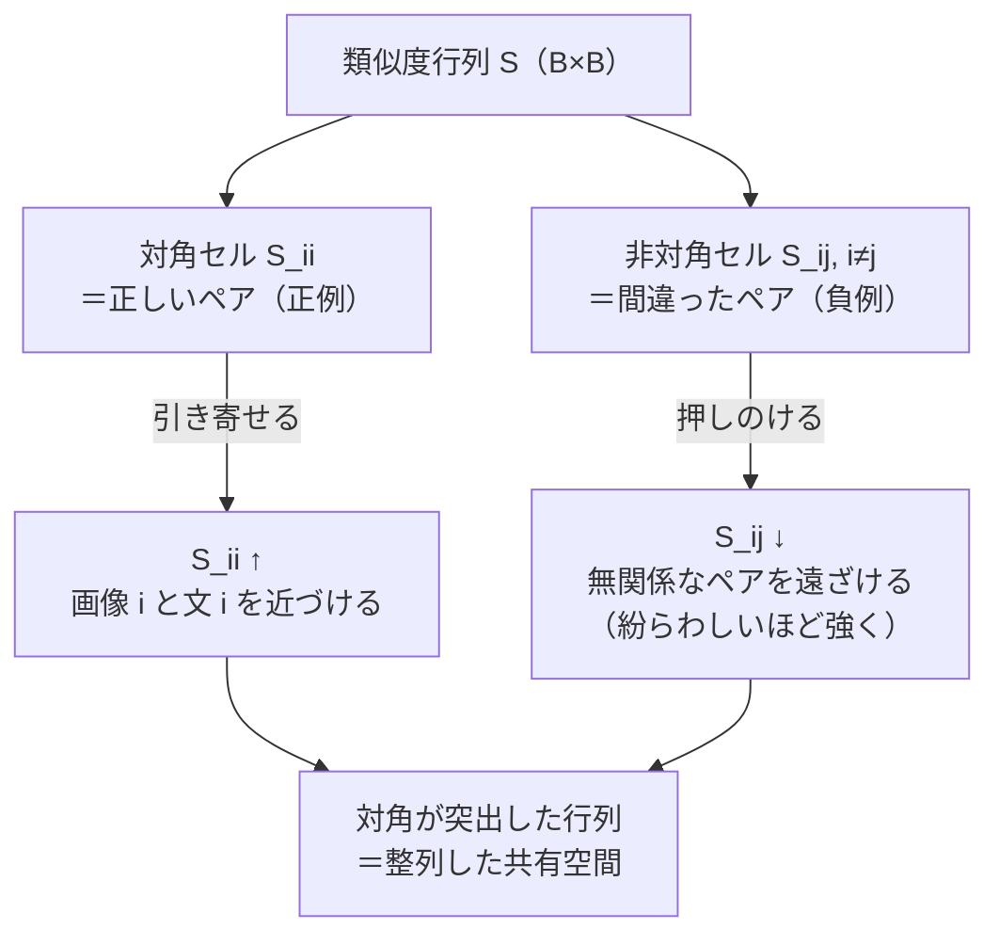
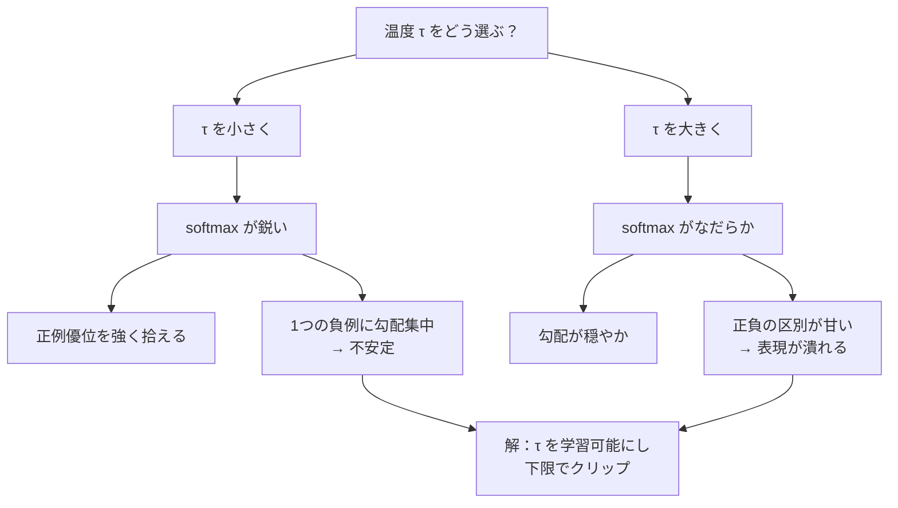
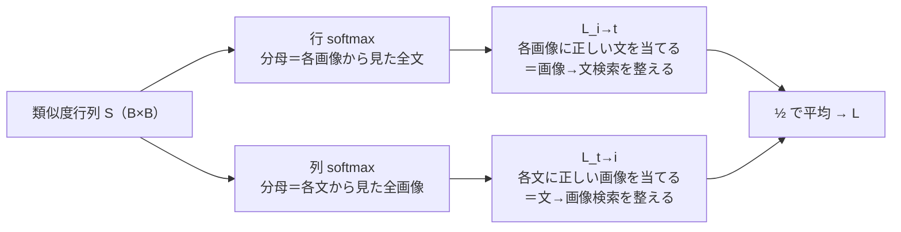
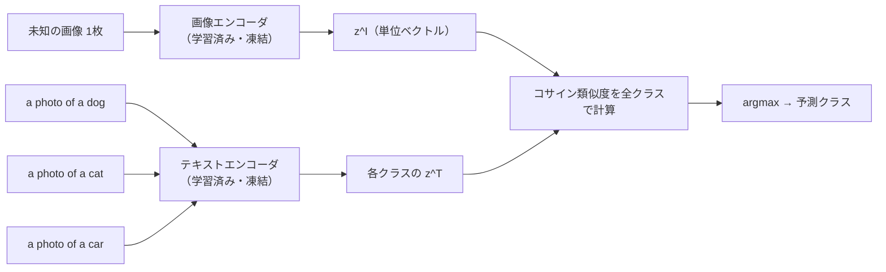

# マルチモーダルとは — 共通表現空間と対照学習 (CLIP)

:::abstract[学習目標]
この章を読み終えると、次のことができるようになります。

- **マルチモーダル**が解く中心課題 —— 別々のモダリティを**1つの共通表現空間**に揃える —— を説明できる
- **CLIP** の構成（2本のエンコーダ ＋ 射影 ＋ 共有空間でのコサイン類似度）を図で描ける
- **対称 InfoNCE 対照損失**を1行ずつ導出し、なぜ対角（正例）を上げ非対角（負例）を下げるのかを述べられる
- **温度 $\tau$** が損失の鋭さに与える影響を、数式と実測の両方で**説明**できる
- 学習した共有空間を使って**ゼロショット分類・検索**を行う手順を**書ける**
- 「CLIP は生成モデルではなく整列モデル」という区別を**誤解なく**言える
:::

## 前提知識

- [言語モデルとトークン化](/llm/01-language-model-and-tokenization/)：テキストを埋め込みベクトルへ写す流れ、softmax と cross-entropy。CLIP のテキスト側はこの延長です。
- [ViT（画像のパッチ＝トークン）](/vision/02-vit/)：画像を1本のベクトル（埋め込み）に潰す画像エンコーダ。CLIP の画像側に使います。
- [自己教師あり表現学習と InfoNCE](/vision/03-self-supervised/)：**正例を近づけ負例を遠ざける**対照学習の原理。本章の対照損失は、これを**画像とテキストの2モダリティ間**へ持ち込んだ同型です。

この章は、3つのモダリティ（[言語](/llm/) / [音声](/audio/) / [視覚](/vision/)）を**結ぶ**最初の一歩です。新しい数学はほとんど登場しません。すでに知っている対照学習を、**異なるモダリティをまたぐ**ように据え直すだけです。

## 直感

私たちは「犬の写真」と「a photo of a dog」という文を、**別物として**扱いがちです。前者はピクセルの2次元配列、後者は記号の列。形式がまったく違います。ところが**意味**は同じです。マルチモーダルが解きたいのは、この「形式は違うが意味は同じ」を機械に扱わせること —— つまり、**画像とテキストを、意味が近ければ近い場所に来るような共通の地図（埋め込み空間）に配置する**ことです。

いったん共通の地図ができれば、距離を測るだけで多くのことができます。

- ある画像に最も近い文を探す → **画像→テキスト検索**（キャプション当て）。
- ある文に最も近い画像を探す → **テキスト→画像検索**。
- 「犬」「猫」「車」というクラス名を文に変えて地図に置き、画像が一番近いクラスを選ぶ → **ゼロショット分類**（その分類器を一度も学習していないのに分類できる）。

「共通の地図」を、もう少し手触りのある絵にしてみます。下の図は、訓練が進む**前**と**後**で、この地図がどう変わるかを表します。学習前は画像と文がでたらめに散らばっていて、本当のペアが近いとは限りません。学習後は、**同じ意味を持つ画像と文が同じ近所に引き寄せられ**、意味の違うものは離れます。「犬の写真」と "a photo of a dog" が手をつなぎ、「猫の写真」と "a photo of a cat" が別の場所で手をつなぐ —— これが目指す状態です。



問題は「どうやって2つのモダリティを同じ地図に乗せるか」です。**CLIP (Contrastive Language–Image Pre-training)** の答えは明快です。**正しい (画像, 文) ペアは近く、間違ったペアは遠くなるように**、2本のエンコーダを同時に訓練する。これが対照学習です。この章のゴールは、その1本の損失関数を完全に理解し、手元の numpy で「整列すると損失が下がる」のを**実測**することです。

「正しいペアを近く、間違ったペアを遠く」を、具体例で1ステップだけ歩いてみます。いま手元に4つのペア（犬・猫・車・空）があるとします。画像「犬」を地図に置いたら、CLIP は次の力を同時にかけます —— 「犬の文」を**引き寄せ**、「猫の文」「車の文」「空の文」を**押しのける**。この「1つを引き、残り全部を押す」を、全ペア・両モダリティについて一斉にやるのが対照学習です。引く相手（正例）は人手で結ばれた本物のペア、押す相手（負例）は**同じバッチに偶然居合わせた他のペア**で、追加のラベルは一切要りません（理由はあとで詳しく見ます）。

## 全体像

CLIP は **2本の独立したエンコーダ**を持ちます。画像は画像エンコーダ（[ViT](/vision/02-vit/) など）、テキストはテキストエンコーダ（[Transformer](/llm/03-transformer/)）。それぞれの出力を**同じ次元の共有空間**へ射影し、**単位ベクトルに正規化**してから、コサイン類似度を測ります。



訓練は **順方向**（エンコード → 類似度 → 損失）で進み、勾配は **逆方向**（損失 → 2本のエンコーダ＋射影）へ流れて、両エンコーダを**同時に**動かします。学習が終わったあとは、損失は捨て、**2本のエンコーダと共有空間だけ**を使って検索・分類します。

この「順方向で測り、逆方向で直す」というループを、1ステップぶん描くと次のようになります。重要なのは、**勾配が2本のエンコーダの両方へ同時に流れ込む**こと —— 片方を固定してもう片方を合わせるのではなく、画像側もテキスト側も**一緒に動いて中間で出会う**点です。だから「共有空間」は最初からどこかに用意されているのではなく、両者が歩み寄った結果として生まれます。



実線が順方向（測る）、点線が逆方向（直す）です。1回のパラメータ更新で、画像エンコーダ・テキストエンコーダ・温度 $\tau$ の3つが同時に少しずつ動きます。これを何百万バッチ繰り返すと、共有空間が整っていきます。

学習時と推論時で「何を計算するか」がはっきり変わります。ここを最初に1枚で押さえます。

| | 学習時 (training) | 推論時 (inference) |
| --- | --- | --- |
| 入力 | $B$ 個の **正しい** (画像, 文) ペアのバッチ | 1枚の画像 ＋ 候補となる複数の文（クラス名や検索対象） |
| 計算 | $B\times B$ の類似度行列 → 対称損失 → 勾配で両エンコーダ更新 | 画像を1回エンコード、候補文を1回ずつエンコード、コサイン類似度で順位付け |
| 「負例」の出どころ | **同じバッチ内の他のペア**（追加ラベル不要） | （損失は使わない） |
| 出力 | 損失スカラー（学習信号） | 最も近い文（検索）／最も近いクラス（分類） |

:::note[LLM ↔ Multimodal の橋渡し]
LLM の埋め込み層は「トークン → ベクトル」の写像でした。CLIP は同じ発想を**モダリティ単位**に広げます。画像エンコーダ＝「画像 → 1本のベクトル」、テキストエンコーダ＝「文 → 1本のベクトル」。違いは、両者の**出力ベクトルが同じ空間を共有し、コサイン類似度で比較できる**ように訓練される点です。この「共有空間」こそがマルチモーダルの肝です。
:::

:::warning[CLIP は生成しない（最初に潰す誤解）]
CLIP は画像も文も**作りません**。やるのは**整列 (alignment)** だけ —— 既にある画像と既にある文を、近い/遠いで**並べる**ことです。だから得意なのは**検索**と**ゼロショット分類**であって、キャプション生成や画像生成ではありません。生成は、この共有空間の上に LLM やデコーダを載せる**次章以降**の仕事です（[/multimodal/02-vision-language-models/](/multimodal/02-vision-language-models/)）。「CLIP がキャプションを書く」と言ったら、それは間違いです。
:::

## 理論

### 共有空間と射影 —— なぜ「同じ次元・単位ベクトル」なのか

2本のエンコーダは中身が違うので、生の出力次元も意味も揃っていません。そこで各エンコーダの後ろに**射影 (projection head)** を置き、両モダリティを**同じ次元 $d$ の空間**へ写します。記号で整理します。

- $x^I_i$：バッチ内 $i$ 番目の**画像**（$i=1,\dots,B$、$B$ はバッチサイズ）。
- $x^T_i$：それと**正しく対応する**文（ペア $i$）。「正しく対応」とは、人手・ウェブ上の alt テキストなどで結ばれた本物のペアという意味です。
- $f_I(\cdot),\ f_T(\cdot)$：画像／テキストエンコーダ。出力を射影して $d$ 次元ベクトルにします。
- $z^I_i = \dfrac{f_I(x^I_i)}{\lVert f_I(x^I_i)\rVert}$、$z^T_i = \dfrac{f_T(x^T_i)}{\lVert f_T(x^T_i)\rVert}$：**L2 正規化**した画像／テキスト埋め込み。**単位ベクトル**（長さ 1）です。

この章で繰り返し出る記号を、1か所にまとめます。添字の衝突（$i$ と $j$ など）でつまずかないための早見表です。

| 記号 | 何を表すか | インデックス・個数 | 何から作るか |
| --- | --- | --- | --- |
| $B$ | バッチサイズ（ペア数） | スカラー | 設計値 |
| $d$ | 共有空間の次元 | スカラー | 設計値 |
| $z^I_i$ | 画像 $i$ の単位埋め込み | $i=1\dots B$、$B$ 本 | 画像エンコーダ＋射影＋L2正規化 |
| $z^T_j$ | 文 $j$ の単位埋め込み | $j=1\dots B$、$B$ 本 | テキストエンコーダ＋射影＋L2正規化 |
| $S_{ij}$ | 画像 $i$ と文 $j$ の類似度 | $B\times B$ 個 | $\langle z^I_i, z^T_j\rangle$（$\tau$ で割る前/後は文脈で明示） |
| 対角 $S_{ii}$ | 正例（正しいペア） | $B$ 個 | 上げたい |
| 非対角 $S_{ij},i\neq j$ | 負例（間違ったペア） | $B^2-B$ 個 | 下げたい |
| $\tau$ | 温度（softmax の鋭さ） | スカラー1つ | **学習対象** |

なぜ単位ベクトルにするのか。2本の単位ベクトルの内積は、**そのままコサイン類似度**になるからです。

$$
\langle z^I_i, z^T_j \rangle
= \frac{f_I(x^I_i)\cdot f_T(x^T_j)}{\lVert f_I(x^I_i)\rVert\,\lVert f_T(x^T_j)\rVert}
= \cos\theta_{ij}
$$

ここで $\theta_{ij}$ は2ベクトルのなす角。正規化のおかげで「ベクトルの長さ（自信の強さ・特徴の大きさ）」が**比較から消え、向き（意味の方向）だけ**が残ります。長いベクトルが不当に高い類似度を出すのを防ぐ、という固定的な前処理です。

:::note[固定 vs 学習をはっきり分ける]
L2 正規化とコサイン類似度の計算は**固定の演算**（学習パラメータなし）。学習されるのは2本のエンコーダ $f_I, f_T$ と射影、そして後述の**温度 $\tau$**（スカラー1つ）だけです。「共有空間」は明示的に作る構造物ではなく、損失を最小化した結果として**創発する**ものです。
:::

### 類似度行列 —— バッチが負例を無料で供給する

バッチに $B$ ペアあるとき、すべての画像とすべての文の組で類似度を測り、$B\times B$ の行列 $S$ を作ります。

$$
S_{ij} = \langle z^I_i, z^T_j \rangle
$$

<figure>
  <canvas id="clip-matrix" width="1600" height="940" aria-hidden="true"></canvas>
  <figcaption class="fig-cap"><span>バッチ B 個の「画像 × テキスト」類似度行列。対角（正しいペア＝正例）を上げ、非対角（他人ペア＝負例）を下げる——これが対照学習</span><span>濃いほど類似度が高い</span></figcaption>
</figure>

この行列の見方を**全部**定義します。

- **行 $i$** ＝ 画像 $i$ を固定し、$B$ 個すべての文との類似度を並べたもの。
- **列 $j$** ＝ 文 $j$ を固定し、$B$ 個すべての画像との類似度を並べたもの。
- **対角 $S_{ii}$** ＝ **正しいペア（正例）**の類似度。ここを**上げたい**。
- **非対角 $S_{ij}\ (i\neq j)$** ＝ **間違ったペア（負例）**の類似度。ここを**下げたい**。

この「対角＝正例、非対角＝負例」という構造を、$B=4$ の小さな行列で目に焼き付けます。下の表で、`◆` を付けたセルが対角（上げたい正例）、それ以外が非対角（下げたい負例）です。**行を横に見れば**「画像 $i$ から見た4つの文への類似度」、**列を縦に見れば**「文 $j$ から見た4つの画像への類似度」になります。

| $S_{ij}$ | 文1 | 文2 | 文3 | 文4 |
| --- | --- | --- | --- | --- |
| **画像1** | $S_{11}$ ◆ | $S_{12}$ | $S_{13}$ | $S_{14}$ |
| **画像2** | $S_{21}$ | $S_{22}$ ◆ | $S_{23}$ | $S_{24}$ |
| **画像3** | $S_{31}$ | $S_{32}$ | $S_{33}$ ◆ | $S_{34}$ |
| **画像4** | $S_{41}$ | $S_{42}$ | $S_{43}$ | $S_{44}$ ◆ |

「対角を上げ非対角を下げる」という1つの目標は、誰がどのセルにどの向きの力をかけるか、という流れに分解できます。次の図がその力の流れです。



肝は、**負例にラベルが要らない**ことです。バッチに $B$ ペア入れれば、各画像に対して「自分の正しい文 1 個」と「他の $B-1$ 個の文（＝負例）」が**自動で**揃います。$B$ を大きくするほど負例が増え、対比が厳しくなり、表現が鋭くなる —— CLIP が巨大バッチ（数万）で学習される理由です。

:::warning[「対角が正例」は座標の取り方の約束ごと]
対角 $S_{ii}$ が正例になるのは、**バッチを「画像 $i$ と文 $i$ が同じペア」になるように並べた**からです。ペアの並び順を勝手に画像とテキストでずらすと、正解は対角から外れて崩壊します。実装では「画像の $i$ 番目」と「文の $i$ 番目」を必ず同じペアにして渡す —— だから損失の正解ラベルが `np.arange(B)`（$0,1,\dots,B-1$）という対角の添字で済むのです。「正解がたまたま対角に来る」のではなく、「正解が対角に来るように積んでいる」が正しい理解です。
:::

:::note[Vision の InfoNCE ↔ CLIP の InfoNCE]
[自己教師ありの InfoNCE](/vision/03-self-supervised/) は、**同じ画像**の2つの拡張（crop など）を正例、バッチ内の**他画像**を負例にしました。CLIP は正例の作り方だけが違います —— **同じ意味の画像と文**を正例にする。損失の形（正例を分子、全候補を分母に置くソフトマックス）は**まったく同じ**です。片方のモダリティ内の対照を、**2モダリティ間の対照**に置き換えた、と一言で掴めます。
:::

対照学習の家系を1枚で対比しておきます。本章の CLIP は、この系統の「画像 ↔ テキスト版」です。

| 手法 | 正例（近づける） | 負例（遠ざける） | モダリティ | 損失の形 |
| --- | --- | --- | --- | --- |
| SimCLR | 同じ画像の2つの拡張 | バッチ内の他画像 | 画像のみ | 温度付き InfoNCE |
| MoCo | 同じ画像（query と key） | メモリバンクの古い key | 画像のみ | 温度付き InfoNCE |
| **CLIP** | **正しい (画像, 文) ペア** | **バッチ内の他ペア** | **画像 ↔ テキスト** | **対称 InfoNCE（行＋列）** |
| ImageBind | あるモダリティと画像のペア | バッチ内の他ペア | 6モダリティ ↔ 画像 | 対称 InfoNCE |

CLIP の特徴は「2モダリティ間」かつ「行と列の両方向を平均する対称形」である点です。SimCLR/MoCo は1モダリティ内なので片方向で十分でしたが、CLIP は画像→文も文→画像も検索に使うため、後述の数式の導出で両方向を足します。

### 温度 $\tau$ —— ソフトマックスの鋭さを決める1つのつまみ

類似度をそのまま softmax に入れる前に、**温度 (temperature)** $\tau>0$ で割ります。$S_{ij}/\tau$ を使います。

- $\tau$ が**小さい**（例 0.01）：$S_{ij}/\tau$ が大きく開く → softmax が**鋭く**なり、最大の類似度に確率が集中。少しの差を厳しく罰する。
- $\tau$ が**大きい**（例 1.0）：差が縮む → softmax が**なだらか**になり、正例・負例の区別が甘くなる。

$\tau$ を「つまみ」として、両端でどちらに転ぶかを1枚にまとめます。コサイン類似度は $[-1,1]$ に収まる狭い量なので、$\tau$ で割って引き伸ばさないと softmax がほとんど一様（差がつかない）になります。$\tau$ はその引き伸ばし率です。

| | $\tau$ が小さい（例 0.01） | $\tau$ が大きい（例 1.0） |
| --- | --- | --- |
| $S_{ij}/\tau$ の開き | 大きく開く | ほとんど開かない |
| softmax の形 | 鋭い（最大に集中） | なだらか（ほぼ一様） |
| 正例・負例の区別 | 厳しい（わずかな差も罰する） | 甘い（区別が曖昧） |
| 損失の絶対値 | 小さくなりやすい | 大きい（$\log B$ 寄り） |
| 勾配 | 一握りのハード負例に集中 → 鋭い・不安定になりうる | 全負例に薄く分散 → 穏やか・学習が遅い |
| 行きすぎると | 勾配が暴れて**学習が崩壊** | 表現が**潰れて区別不能** |



$\tau$ は学習対象（スカラー1つ）にするのが定番です（実装では数値安定のため $\log\tau$ を学習）。重要なのは、**$\tau$ が損失の絶対値を直接スケールする**こと。下の実装で、整列が同じでも $\tau$ を変えると損失が大きく動くのを実測します。

:::warning[温度 $\tau$ は「飾り」ではない]
$\tau$ を軽視すると学習が壊れます。大きすぎると正負の区別がつかず表現が潰れ、小さすぎると勾配が一握りの負例に集中して不安定になります。CLIP では $\tau$ を**学習可能**にしつつ上限でクリップするのが標準。「コサイン類似度を softmax に入れるだけ」と覚えると $\tau$ を落としますが、$\tau$ こそが対照学習の効き具合を決めるつまみです。
:::

## 数式の導出

対称 InfoNCE 損失をゼロから組み立てます。ゴールは

$$
\mathcal{L}=\tfrac{1}{2}\bigl(\mathcal{L}_{i\to t}+\mathcal{L}_{t\to i}\bigr)
$$

の中身を、1ステップずつ意味づけることです。

**ステップ1：画像 $i$ から見た「正しい文当て」を分類問題にする。** 画像 $i$ を固定し、「$B$ 個の文のうちどれが正しいペアか」を当てる $B$ クラス分類だと考えます。クラス $j$ のロジットを $S_{ij}/\tau$ とし、softmax で確率に変えます。画像 $i$ が文 $j$ を選ぶ確率は

$$
p_{i\to t}(j)=\frac{\exp\!\bigl(\langle z^I_i, z^T_j\rangle/\tau\bigr)}{\sum_{k=1}^{B}\exp\!\bigl(\langle z^I_i, z^T_k\rangle/\tau\bigr)}
$$

分子は「画像 $i$ と文 $j$」の類似度、分母は「画像 $i$ と**全部の文**」の類似度の和。これは行 $i$ に沿った softmax です。

**ステップ2：正解は対角。cross-entropy をとる。** 画像 $i$ の正しい文は $j=i$（対角）。正解 $i$ への負の対数尤度が、このペアの損失です。

$$
\ell_{i\to t}(i)=-\log p_{i\to t}(i)
=-\log\frac{\exp\!\bigl(\langle z^I_i, z^T_i\rangle/\tau\bigr)}{\sum_{k}\exp\!\bigl(\langle z^I_i, z^T_k\rangle/\tau\bigr)}
$$

これを小さくするには、**分子（正例 $S_{ii}$）を大きく**し、**分母の他項（負例 $S_{ik},\,k\neq i$）を小さく**するしかありません。正例を引き寄せ負例を押しのける、という対照学習そのものが、この1式に畳み込まれています。

**ステップ3：バッチ平均が画像→テキスト方向の損失。**

$$
\mathcal{L}_{i\to t}
=-\frac{1}{B}\sum_{i=1}^{B}\log\frac{\exp\!\bigl(\langle z^I_i, z^T_i\rangle/\tau\bigr)}{\sum_{j}\exp\!\bigl(\langle z^I_i, z^T_j\rangle/\tau\bigr)}
$$

**ステップ4：逆方向も同じ理屈で作る。** 今度は**文 $i$ を固定**し、「$B$ 枚の画像のうちどれが正しいか」を当てる分類にします。これは類似度行列 $S$ を**列方向**（＝転置 $S^\top$）で softmax することに相当します。

$$
\mathcal{L}_{t\to i}
=-\frac{1}{B}\sum_{i=1}^{B}\log\frac{\exp\!\bigl(\langle z^T_i, z^I_i\rangle/\tau\bigr)}{\sum_{j}\exp\!\bigl(\langle z^T_i, z^I_j\rangle/\tau\bigr)}
$$

**ステップ5：なぜ両方向を平均するのか。** $\mathcal{L}_{i\to t}$ は各**行**を正規化（各画像に正しい文を当てる）、$\mathcal{L}_{t\to i}$ は各**列**を正規化（各文に正しい画像を当てる）します。片方だけだと、検索が片方向にしか整わない。**検索は双方向で使う**（画像→文も文→画像も）ので、行と列の両方を整えるべく対称に平均します。

$$
\mathcal{L}=\tfrac{1}{2}\bigl(\mathcal{L}_{i\to t}+\mathcal{L}_{t\to i}\bigr)
$$

「同じ行列 $S$ を、行で正規化するのと列で正規化するので何が違うのか」を1枚で押さえます。同じセルでも、行 softmax では「分母＝その画像から見た全文」、列 softmax では「分母＝その文から見た全画像」と、**正規化の相手が変わる**のが要点です。



**ステップ6：下限と最小値の感覚。** 学習前（埋め込みがランダムで整列ゼロ）には、どの文も同じくらい近く見えるので、各画像の予測は $B$ クラスにほぼ一様。すると損失は1サンプルあたり

$$
-\log\frac{1}{B}=\log B
$$

に近づきます。これが**チャンスレベル（当てずっぽうの損失）**。逆に完全整列（対角だけが突出）に近づくと、正例の確率が 1 に近づき損失は 0 に向かいます。つまり $\mathcal{L}$ は $\log B$（無整列）から $0$（完全整列）へ下がる量で、**「共有空間がどれだけ整ったか」の物差し**になっています。$\blacksquare$

:::note[なぜ「分母に全候補」を置くと整列が進むのか]
分母 $\sum_j \exp(S_{ij}/\tau)$ には正例も負例も全部入ります。勾配を見ると、正例 $S_{ii}$ には**上げる向き**の力、各負例 $S_{ij}$ には**その負例の現在確率に比例して下げる向き**の力が働きます。＝「いま間違って近づいている負例ほど強く突き放す」。これが softmax 対照損失が**ハードネガティブ（紛らわしい負例）に自動で集中する**理由です。$\tau$ を小さくするとこの集中がさらに鋭くなります。
:::

### 勾配を1行だけ書き下す —— 「誰がどっちへ動くか」を式で確定する

上の注意書きで「正例は上げ、負例は下げ、ハード負例ほど強く」と言いました。これを式で確かめます。画像 $i$ の行の損失 $\ell_{i\to t}(i)=-\log p_{i\to t}(i)$ を、ロジット $S_{ij}/\tau$ で微分すると、**softmax cross-entropy の標準結果**が出ます。

$$
\frac{\partial \ell_{i\to t}(i)}{\partial (S_{ij}/\tau)} = p_{i\to t}(j) - \mathbb{1}[j=i]
$$

ここで $\mathbb{1}[j=i]$ は $j=i$（正例）のとき 1、それ以外（負例）0 を返す指示関数です。この1本の式が、力の向きと強さを**全部**決めます。

| 相手のセル | 勾配 $\partial\ell/\partial(S_{ij}/\tau)$ | 符号 | 損失を下げる更新の向き |
| --- | --- | --- | --- |
| 正例 $j=i$ | $p_{i\to t}(i)-1$ | **負**（$p\le 1$） | $S_{ii}$ を**上げる**（引き寄せ） |
| 負例 $j\neq i$ | $p_{i\to t}(j)$ | **正** | $S_{ij}$ を**下げる**（押しのけ） |

勾配降下はパラメータを「勾配の逆向き」に動かします。だから**負の勾配を持つ正例は類似度が上がり、正の勾配を持つ負例は下がる**。さらに負例の力 $p_{i\to t}(j)$ は**その負例の現在の確率に比例**します —— いま間違って近くにいる（確率が高い）負例ほど、強く押しのけられます。これが「ハードネガティブに自動で集中する」の正体です。

実際に1行ぶんの勾配を numpy で出して確かめます。正例の類似度 0.30、そこに紛らわしいハード負例（0.25）と遠い負例（−0.10, −0.20）を混ぜた状況です。

```python title="clip_grad.py"
import numpy as np

# image→text 方向、1行ぶんの softmax 勾配を手で確認する。
# 行 i の損失 ell = -log softmax(S[i])[i]。S は /tau 済みロジット。
# d ell / d S_ij = p_ij - 1{j==i}（softmax cross-entropy の標準結果）。
tau = 0.1
S_cos = np.array([0.30, 0.25, -0.10, -0.20])  # コサイン類似度（正例 0.30, ハード負例 0.25）
logits = S_cos / tau
p = np.exp(logits - logits.max())
p = p / p.sum()
grad = p.copy()
grad[0] -= 1.0  # 正解は j=0（正例）
print("コサイン類似度 :", S_cos.tolist())
print("softmax 確率   :", np.round(p, 4).tolist())
print("勾配 dL/dS     :", np.round(grad, 4).tolist())
```

```text title="出力"
コサイン類似度 : [0.3, 0.25, -0.1, -0.2]
softmax 確率   : [0.6129, 0.3717, 0.0112, 0.0041]
勾配 dL/dS     : [-0.3871, 0.3717, 0.0112, 0.0041]
```

読み取れること。**正例（先頭）の勾配は $-0.387$ で負** —— 類似度を上げる向きに引っ張られます。**負例の勾配はすべて正**で、値はその負例の softmax 確率と一致します。注目は2番目のハード負例で、勾配 $0.372$ は3・4番目（$0.011,\ 0.004$）の数十倍。**紛らわしい負例ほど確率が高く、確率が高いほど強く押し下げられる**ことが数値で見えます。遠い負例はほぼ放置（勾配が小さい）で、学習資源が「効く相手」に自動配分されています。これが、CLIP がバッチを大きくして紛らわしい負例を増やしたがる理由でもあります。$\blacksquare$

## 実装

numpy だけで、CLIP の中核 —— **類似度行列・対称対照損失・温度・ゼロショット検索** —— を確かめます。本物のエンコーダの代わりに、**「概念ベクトルから作ったトイ埋め込み」**を使います。各ペアに共通の意味ベクトル（concept）を置き、画像・テキスト埋め込みはそれにモダリティ固有のノイズを足したもの、という設計です。これで「正しいペアは似ている」状況を人工的に作れます。

```python title="clip_toy.py"
import numpy as np

rng = np.random.default_rng(0)
B, d = 5, 16  # バッチ 5 ペア、共有空間は 16 次元


def l2norm(x):
    # 各行を単位ベクトルに。これで内積＝コサイン類似度になる（理論の通り）。
    return x / np.linalg.norm(x, axis=1, keepdims=True)


def sim_matrix(ZI, ZT, tau):
    # S[i,j] = cos(画像 i, テキスト j) / tau。行=画像、列=テキスト。
    return ZI @ ZT.T / tau


def clip_loss(S):
    # 対称 InfoNCE。S はすでに /tau 済みのロジット行列。
    B = S.shape[0]
    tgt = np.arange(B)  # 正解は対角（ペア i のテキストは i）

    def ce_rows(logits):
        # 行方向 softmax の cross-entropy（最大値を引いて数値安定化）
        m = logits.max(axis=1, keepdims=True)
        logsumexp = m[:, 0] + np.log(np.exp(logits - m).sum(axis=1))
        return -(logits[np.arange(B), tgt] - logsumexp)

    Li2t = ce_rows(S).mean()    # 画像→テキスト方向（各行を正規化）
    Lt2i = ce_rows(S.T).mean()  # テキスト→画像方向（転置＝各列を正規化）
    return 0.5 * (Li2t + Lt2i)


# --- (1) 未整列（ランダム埋め込み）：構造なし。損失は log(B) 付近 ---
ZI = l2norm(rng.normal(size=(B, d)))
ZT = l2norm(rng.normal(size=(B, d)))
print("=== (1) 未整列（ランダム） ===")
print("コサイン類似度 (τ=1):")
print(np.round(sim_matrix(ZI, ZT, 1.0), 2))
print(f"対称対照損失 (τ=1)   = {clip_loss(sim_matrix(ZI, ZT, 1.0)):.4f}")
print(f"参考: チャンス log(B) = {np.log(B):.4f}")

# --- (2) 整列済み（共通の概念から作る）：対角が突出 ---
concepts = rng.normal(size=(B, d))           # 各ペアの共通の意味
img = concepts + 0.30 * rng.normal(size=(B, d))  # 画像エンコーダ出力（疑似）
txt = concepts + 0.30 * rng.normal(size=(B, d))  # テキストエンコーダ出力（疑似）
ZI, ZT = l2norm(img), l2norm(txt)
Sc = sim_matrix(ZI, ZT, 1.0)
print("\n=== (2) 整列済み ===")
print("コサイン類似度 (τ=1):")
print(np.round(Sc, 2))
diag, off = np.diag(Sc), Sc[~np.eye(B, dtype=bool)]
print(f"対角(正例)平均   = {diag.mean():.3f}")
print(f"非対角(負例)平均 = {off.mean():.3f}")
print(f"対称対照損失 (τ=0.1) = {clip_loss(sim_matrix(ZI, ZT, 0.1)):.4f}")

# --- (3) 温度 τ の効果（整列は同じ。τ だけ動かす）---
print("\n=== (3) 温度 τ の効果 ===")
for tau in [0.01, 0.05, 0.1, 0.3, 1.0]:
    print(f"  τ={tau:<5} loss={clip_loss(sim_matrix(ZI, ZT, tau)):.4f}")

# --- (4) ゼロショット検索（image→text の argmax）---
print("\n=== (4) ゼロショット検索 ===")
S = sim_matrix(ZI, ZT, 0.1)
pred = S.argmax(axis=1)
acc = float((pred == np.arange(B)).mean())
print(f"  予測={pred.tolist()}  正解={list(range(B))}  top-1 acc={acc}")
```

```text title="出力"
=== (1) 未整列（ランダム） ===
コサイン類似度 (τ=1):
[[ 0.1   0.36  0.19 -0.12  0.21]
 [-0.22  0.13  0.36  0.37  0.26]
 [ 0.62 -0.52 -0.05 -0.03 -0.47]
 [ 0.13  0.03  0.09  0.09  0.  ]
 [-0.34 -0.26  0.14 -0.39 -0.51]]
対称対照損失 (τ=1)   = 1.6993
参考: チャンス log(B) = 1.6094

=== (2) 整列済み ===
コサイン類似度 (τ=1):
[[ 0.94 -0.29 -0.46 -0.29 -0.27]
 [-0.14  0.82  0.22  0.41  0.37]
 [-0.47  0.13  0.91  0.31  0.03]
 [-0.39  0.36  0.49  0.94  0.04]
 [-0.09  0.27 -0.11  0.13  0.98]]
対角(正例)平均   = 0.918
非対角(負例)平均 = 0.014
対称対照損失 (τ=0.1) = 0.0088

=== (3) 温度 τ の効果 ===
  τ=0.01  loss=0.0000
  τ=0.05  loss=0.0001
  τ=0.1   loss=0.0088
  τ=0.3   loss=0.2688
  τ=1.0   loss=0.9859

=== (4) ゼロショット検索 ===
  予測=[0, 1, 2, 3, 4]  正解=[0, 1, 2, 3, 4]  top-1 acc=1.0
```

読み取れることを、理論と突き合わせます。

- **(1) 未整列だと損失はチャンス $\log B$ 付近**：$\log 5 \approx 1.609$ に対し実測 $1.699$。対角に構造が無く、どの文も画像から等距離に見えるためです（ステップ6の通り）。これが「学習前」の出発点です。
- **(2) 整列すると対角が突出**：正例平均 $0.918$、負例平均 $0.014$。対角だけが 1 に近く、$\tau=0.1$ での損失は $0.0088$ まで落ちます。共有空間が「正しいペアを近く」配置できている状態です。
- **(3) 温度が損失を直接スケール**：**整列はまったく同じ**なのに、$\tau=0.01$ では損失 $\approx0$、$\tau=1.0$ では $0.986$。$\tau$ が小さいほど softmax が鋭くなり、わずかな正例優位でも確率が 1 に張り付くため損失が消えます。$\tau$ は飾りでないことが数値で見えます。
- **(4) 検索が当たる**：各画像の最近傍テキストの argmax が対角と完全一致（top-1 正解率 1.0）。**これがゼロショット検索の正体** —— 損失は使わず、共有空間の距離だけで順位付けしています。

### チャンスレベル $\log B$ をバッチサイズで確かめる

ステップ6で「未整列なら損失は $\log B$ に近づく」と言いました。$B$ を変えながら、本当に $\log B$ へ寄るかを別の小実験で測ります。整列のない（ランダムな）埋め込みを毎回作り、複数試行で平均します。

```python title="clip_chance.py"
import numpy as np

rng = np.random.default_rng(0)


def l2norm(x):
    return x / np.linalg.norm(x, axis=1, keepdims=True)


def sim_matrix(ZI, ZT, tau):
    return ZI @ ZT.T / tau


def clip_loss(S):
    B = S.shape[0]
    tgt = np.arange(B)

    def ce_rows(logits):
        m = logits.max(axis=1, keepdims=True)
        logsumexp = m[:, 0] + np.log(np.exp(logits - m).sum(axis=1))
        return -(logits[np.arange(B), tgt] - logsumexp)

    return 0.5 * (ce_rows(S).mean() + ce_rows(S.T).mean())


print("=== バッチ B とチャンスレベル（未整列ランダム埋め込み）===")
d = 64
for B in [5, 50, 500, 5000]:
    # ランダムなので1回だと揺れる。5試行で平均する。
    losses = []
    for _ in range(5):
        ZI = l2norm(rng.normal(size=(B, d)))
        ZT = l2norm(rng.normal(size=(B, d)))
        losses.append(clip_loss(sim_matrix(ZI, ZT, 1.0)))
    print(f"  B={B:<5} 実測損失(τ=1)={np.mean(losses):.4f}  理論 log(B)={np.log(B):.4f}")
```

```text title="出力"
=== バッチ B とチャンスレベル（未整列ランダム埋め込み）===
  B=5     実測損失(τ=1)=1.6452  理論 log(B)=1.6094
  B=50    実測損失(τ=1)=3.9063  理論 log(B)=3.9120
  B=500   実測損失(τ=1)=6.2226  理論 log(B)=6.2146
  B=5000  実測損失(τ=1)=8.5251  理論 log(B)=8.5172
```

実測がどの $B$ でも理論の $\log B$ にほぼ一致します（$B$ が大きいほどランダム性が均されて誤差が縮みます）。**学習前の損失は $\log B$ から始まり、整列が進むほど $0$ に近づく** —— このスケールを知っていれば、訓練ログを見て「いま $\log B$ のどのへんまで下りたか」で整列の進み具合を読めます。バッチを大きくすると分類のクラス数（候補文の数）が増えるので、出発点の損失も $\log B$ ぶん高くなる、という対応も見て取れます。

:::tip[ゼロショット分類への一手]
上の (4) は「検索」ですが、**候補テキストをクラス名のプロンプト**（"a photo of a {dog}", "a photo of a {cat}", …）に差し替えれば、そのまま**ゼロショット分類**になります。画像を1回エンコードし、各クラスプロンプトの埋め込みとのコサイン類似度を測り、最大のクラスを選ぶ。**分類器を一度も訓練していない**のに分類できるのは、共有空間がクラス名の意味と画像の意味を同じ場所に置いているからです。
:::

ゼロショット分類の「検索との違い」を、データの流れで描いておきます。学習時に作った2本のエンコーダはそのまま（凍結して）使い、**候補側を検索対象の文からクラス名プロンプトに差し替えるだけ**です。



ここで効いているのは、訓練で「画像の意味」と「文の意味」を同じ座標に並べておいたことです。だから**一度も dog/cat/car を分類学習していなくても**、クラス名を文にして並べるだけで分類器が立ち上がります。これが「ゼロショット」の意味です。新しいクラスを増やしたければ、プロンプトを1行足すだけ —— 再学習は要りません。

## 演習

::::question[演習 1: 類似度行列の読み方と対称損失]
バッチ $B=3$ で、L2 正規化済み埋め込みのコサイン類似度行列 $S$（$\tau$ で割る**前**）が次だとします。行＝画像、列＝テキストです。

$$
S=\begin{pmatrix} 0.9 & 0.1 & 0.0 \\ 0.2 & 0.8 & 0.1 \\ 0.0 & 0.3 & 0.7 \end{pmatrix}
$$

(a) 正例（対角）と負例（非対角）はそれぞれどの要素ですか。(b) 画像→テキスト損失 $\mathcal{L}_{i\to t}$ は $S$ の行・列どちらに沿った softmax ですか。テキスト→画像損失 $\mathcal{L}_{t\to i}$ は？ (c) $S_{32}=0.3$ が学習で**下がる**と、損失全体は上がりますか下がりますか。理由も。

:::details[解答]
(a) 正例（対角）は $S_{11}=0.9,\ S_{22}=0.8,\ S_{33}=0.7$。これらを**上げたい**。負例（非対角）は残り6個（$S_{12}=0.1,\ S_{13}=0,\ S_{21}=0.2,\ S_{23}=0.1,\ S_{31}=0,\ S_{32}=0.3$）で、これらを**下げたい**。

(b) $\mathcal{L}_{i\to t}$ は各**行**に沿った softmax（画像 $i$ を固定し、$B$ 個の文への分布を作って正解 $j=i$ を当てる）。$\mathcal{L}_{t\to i}$ は各**列**に沿った softmax（＝ $S^\top$ の行 softmax。文 $i$ を固定し正しい画像を当てる）。対称損失は両者の平均です。

(c) **下がります**。$S_{32}=0.3$ は負例（画像3とテキスト2は無関係）。これは行3の softmax 分母にも、列2の softmax 分母にも入っています。負例 $S_{32}$ が下がると、行3では正例 $S_{33}$ の相対確率が上がり、列2では正例 $S_{22}$ の相対確率が上がる。両方向で正解の確率が上がるので、$\mathcal{L}_{i\to t}$ も $\mathcal{L}_{t\to i}$ も下がり、全体の損失が下がります。「紛らわしい負例を突き放すと損失が減る」が対照学習の駆動原理です。
:::
::::

::::question[演習 2: 温度 $\tau$ とチャンスレベル]
(a) 学習開始時、埋め込みがランダムで整列がゼロのとき、$B=1000$ なら対称対照損失はおよそいくつになりますか。(b) ある時点で整列は固定したまま、温度を $\tau=0.1$ から $\tau=0.5$ に**上げる**と、損失は上がりますか下がりますか。(c) $\tau\to 0$ の極限で何が起きますか。学習が不安定になりうる理由は。
:::details[解答]
(a) 整列ゼロだと各画像の予測は $B$ クラスにほぼ一様で、1サンプルあたりの損失は $-\log(1/B)=\log B$ に近づきます。$\log 1000 \approx 6.91$。（本章の実装の `clip_chance.py` でも、ランダム時の損失が $\log B$ に収束するのを $B=5,50,500,5000$ で確認しました。）これが**チャンスレベル**＝学習が始まる前の基準値です。

(b) **上がります**。$\tau$ を大きくすると $S_{ij}/\tau$ の差が縮み、softmax がなだらかになって正例と負例の区別が甘くなる → 正例の確率が下がる → 損失が増えます。実装の (3) でも $\tau=0.1$ で $0.0088$、$\tau=0.3$ で $0.269$ と、$\tau$ を上げると損失が増えています。

(c) $\tau\to 0$ では $S_{ij}/\tau$ が極端に開き、softmax がほぼ argmax（最大の類似度に確率1集中）になります。正例がわずかでも最大なら損失はほぼ 0。一方、勾配は**最も紛らわしい1つの負例**に集中して非常に鋭くなり、少しの埋め込みの揺れで勾配が暴れて**学習が不安定**になります。だから CLIP は $\tau$ を学習可能にしつつ**下限近くでクリップ**し、鋭くなりすぎないようにします。
:::
::::

::::question[演習 3: 勾配の向きとハードネガティブ]
画像 $i$ の行で、コサイン類似度が（正例, 負例A, 負例B）$=(0.4,\ 0.35,\ -0.3)$ だとします。$\tau=0.1$ とします。(a) softmax 確率 $p$ をおよそ求め、正例・各負例の勾配 $p-\mathbb{1}[j=i]$ の符号を答えてください。(b) 負例A と負例B では、どちらが強く押し下げられますか。理由は。(c) これが「大きいバッチで紛らわしい負例を増やすと表現が鋭くなる」ことと、どうつながりますか。
:::details[解答]
(a) ロジットは $(4,\ 3.5,\ -3)$。$\exp$ はおよそ $(54.6,\ 33.1,\ 0.0498)$、和 $\approx 87.8$。確率 $p\approx(0.622,\ 0.377,\ 0.0006)$。勾配は $p-\mathbb{1}[j=i]$ なので、正例 $0.622-1=-0.378$（**負**＝類似度を上げる向き）、負例A $+0.377$、負例B $+0.0006$（ともに**正**＝下げる向き）。

(b) **負例A** が圧倒的に強く押し下げられます。勾配の大きさは softmax 確率に比例し、負例A は確率 $0.377$、負例B は $0.0006$。負例A はコサイン類似度が正例（0.4）に肉薄する $0.35$ の**ハードネガティブ**で、いま間違って近くにいるぶん、強く突き放されます。負例B は遠い（$-0.3$）のでほぼ放置です。

(c) バッチを大きくすると、その中に**正例と紛らわしい負例**が含まれる確率が上がります。ハードネガティブほど勾配が大きく学習を強く駆動するので、紛らわしい相手を多く見せるほど境界が磨かれ、表現が鋭くなります。逆にバッチが小さいと簡単な負例ばかりで勾配がほぼ消え、学習が進みにくい。これが CLIP が数万規模のバッチを使う理由です。
:::
::::

## まとめ

:::success[この章の要点]
- **マルチモーダルの第一歩は共通表現空間**：画像とテキストを、意味が近ければ近い場所に来る1つの埋め込み空間へ揃える。距離を測るだけで検索・ゼロショット分類ができる。
- **CLIP ＝ 2本のエンコーダ ＋ 射影 ＋ L2正規化 ＋ コサイン類似度**。単位ベクトルにするので内積がそのままコサイン類似度になる。
- **対称 InfoNCE**：$B\times B$ 類似度行列の**対角（正例）を上げ非対角（負例）を下げる**。バッチが負例を無料で供給するのでラベル不要。行方向と列方向を平均して双方向の検索を整える。
- **勾配は「正例を上げ、負例を確率に比例して下げる」**。紛らわしいハードネガティブほど強く突き放され、学習資源が自動で効く相手に配分される。だから大きいバッチが効く。
- **温度 $\tau$ は損失の鋭さを決める必須のつまみ**。整列が同じでも $\tau$ で損失が大きく動く。小さすぎると不安定、大きすぎると区別が甘くなる。
- 損失は無整列の $\log B$（チャンス）から完全整列の $0$ へ下がる量＝**整列度の物差し**。実測で、整列すると対角が突出し損失が落ち、検索が当たることを確認した。
- **CLIP は整列モデルであって生成モデルではない**。得意は検索とゼロショット分類。生成は次章以降。
:::

### 次に学ぶこと

ここまでで、別モダリティを**1つの空間に並べる**機構と、その物差し（対称 InfoNCE）が手に入りました。共有空間は「画像と文の意味的距離を測る」までで、まだ**言葉で答える**ことはできません。次は、CLIP のような視覚エンコーダを **LLM につなぎ**、画像について自由に対話・回答する **vision-language モデル**へ進みます。「共有空間に並べる」から「画像を LLM の入力に差し込む」へ、橋渡しの設計（射影・クロスアテンション・Q-Former）を一望します。

→ [マルチモーダルとは — vision-language モデル](/multimodal/02-vision-language-models/)
→ [マルチモーダル ロードマップに戻る](/multimodal/)

## 用語ミニ辞典

| 用語 | 一言 |
| --- | --- |
| マルチモーダル | 複数のモダリティ（画像・テキスト等）を1モデルで結ぶ |
| 共通表現空間 (shared embedding space) | 別モダリティを同じ次元・同じ尺度で比較できる空間 |
| CLIP | 対照学習で画像とテキストを共有空間に整列する代表手法 |
| 画像/テキストエンコーダ | 各モダリティを1本のベクトルに写す2本のネットワーク |
| 射影 (projection head) | エンコーダ出力を共有空間の次元へ揃える層 |
| L2 正規化 | ベクトルを単位長に。内積＝コサイン類似度にする固定演算 |
| コサイン類似度 | 単位ベクトルの内積。向き（意味）の近さ |
| 類似度行列 $S$ | $S_{ij}$＝画像 $i$ と文 $j$ の類似度。対角が正例 |
| 正例 / 負例 | 正しいペア（対角）／間違ったペア（非対角） |
| ハードネガティブ | 正例に紛らわしい負例。勾配が大きく学習を強く駆動する |
| 対称 InfoNCE | 行・列双方向の softmax cross-entropy の平均 |
| 温度 $\tau$ | softmax の鋭さを決めるスカラー。学習可能 |
| ゼロショット分類 | クラス名を文にして共有空間で最近傍を選ぶ分類 |
| クロスモーダル検索 | 一方のモダリティで他方を距離順に探す |
| チャンスレベル $\log B$ | 無整列時の損失の基準値 |

## 次のアクション

理論を手で定着させる。**最小の写経 → 動かす → 小実験** を1セットで。

1. 上の `clip_toy.py` を写経して実行し、**未整列の損失が $\log B$ 付近**、整列で**対角が突出**して損失が落ちるのを自分の目で確認する。さらに `clip_chance.py` を回して、$B$ を変えると出発点の損失が $\log B$ に沿って動くこと、`clip_grad.py` でハードネガティブの勾配が最大になることを確かめる。
2. 概念ノイズ（`0.30 * rng.normal`）の係数を $0.1 / 0.5 / 1.0$ と変え、**ノイズが大きいほど整列が崩れ損失が上がる**ことを測る。これは「エンコーダの質が悪いと共有空間が濁る」のトイ版です。
3. **本物の埋め込みに差し替える**：`sentence-transformers` でクラス名を、軽量画像モデルで画像を埋め込み、同じ `clip_loss` と `argmax` 検索を回す。小さな画像セットで**ゼロショット分類の top-1 正解率**を測ると、トイから実用への距離が体感できます（学習が要るのは次章以降）。

ここまでで**共通表現空間と対照学習**の骨格が手に入ります。次稿 02（vision-language モデル）で、この視覚エンコーダを LLM につなぐ橋渡しへ。

## 参考文献

1. A. Radford, J. W. Kim, C. Hallacy, et al., "Learning Transferable Visual Models From Natural Language Supervision," *ICML*, 2021.（CLIP 原論文）
2. C. Jia, Y. Yang, Y. Xia, et al., "Scaling Up Visual and Vision-Language Representation Learning With Noisy Text Supervision," *ICML*, 2021.（ALIGN・対照学習のスケール則）
3. A. van den Oord, Y. Li, O. Vinyals, "Representation Learning with Contrastive Predictive Coding," arXiv:1807.03748, 2018.（InfoNCE の原典）
4. T. Chen, S. Kornblith, M. Norouzi, G. Hinton, "A Simple Framework for Contrastive Learning of Visual Representations (SimCLR)," *ICML*, 2020.（温度付き対照損失・正規化の効果）
5. J. Yu, Z. Wang, V. Vasudevan, et al., "CoCa: Contrastive Captioners are Image-Text Foundation Models," *TMLR*, 2022.（対照＋生成のハイブリッド）
6. R. Girdhar, A. El-Nouby, Z. Liu, et al., "ImageBind: One Embedding Space To Bind Them All," *CVPR*, 2023.（共有空間を6モダリティへ拡張）
