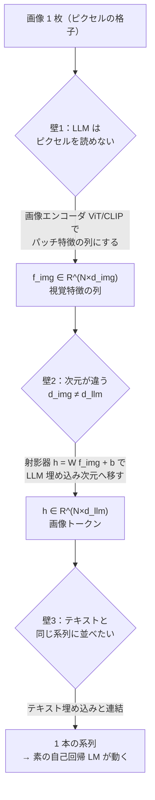
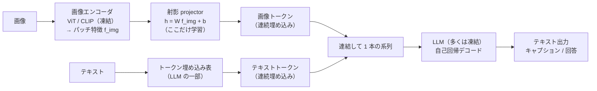
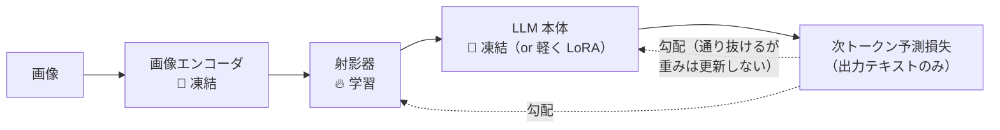
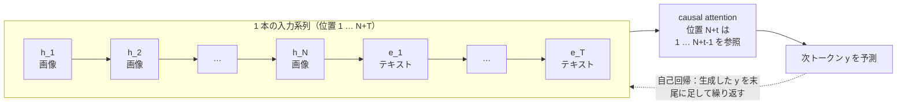
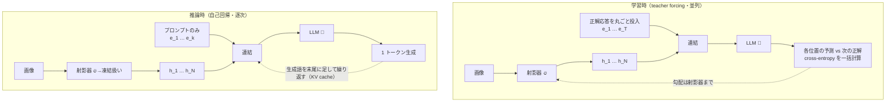
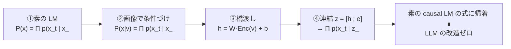
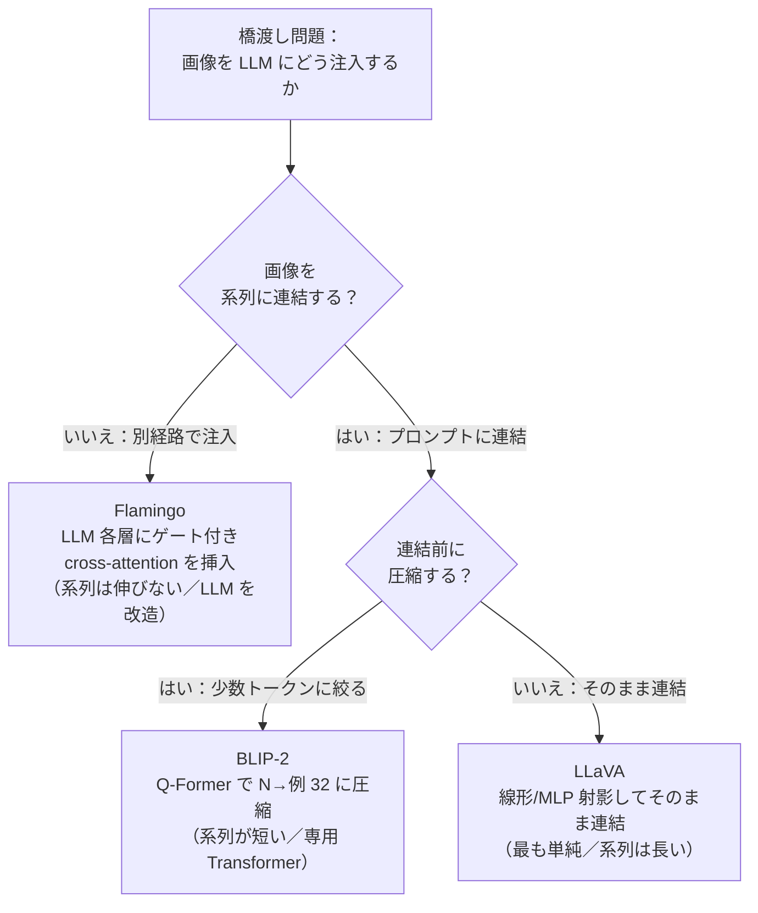
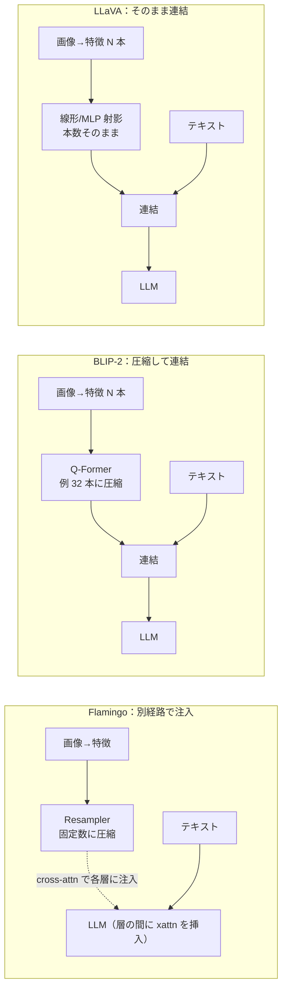
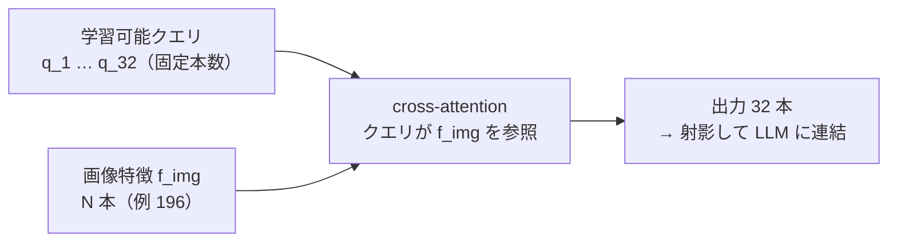
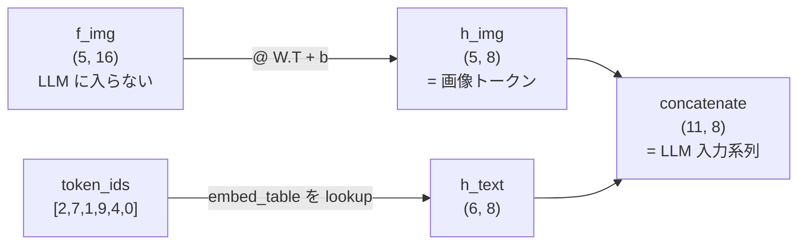

# Vision-Language モデル (VLM)

:::abstract[学習目標]
この章を読み終えると、次のことができるようになります。

- VLM の核心である **橋渡し問題**（凍結した画像エンコーダの出力を、凍結 LLM が読める入力空間へどう移すか）を説明できる
- 画像エンコーダ → **射影 (projector)** → LLM という共通の枠組みを描き、画像トークンが LLM の系列にどう載るかを **説明** できる
- 接続方式の3系統 **Flamingo (cross-attention)** / **BLIP-2 (Q-Former)** / **LLaVA (線形射影)** を、接続位置・学習パラメータ量・実装の簡単さで **比較** できる
- 射影 $h = W f_{\mathrm{img}} + b$ がなぜ「画像トークン」を作るのか、なぜ以降は素の自己回帰 LM に帰着するのかを **導出** できる
- 画像「トークン」が **語彙 ID ではなく連続埋め込み（soft prompt 的）** であること、**LLM 本体は凍結** されることが多いことを **誤解なく** 述べられる
:::

## 前提知識

- [言語（LLM）](/llm/)全般：トークン埋め込み・自己回帰デコード・KV cache。この章は「画像を LLM に食わせる」話なので、LLM の入力と出力の仕組みが土台です。
- [Transformer の構造](/llm/03-transformer/)：入口で**トークン埋め込み + 位置符号化** を作り、ブロックを通し、出口で**語彙への射影 + softmax** で次トークンを予測する流れ。射影後の画像はこの「入口の埋め込み」に並んで入ります。
- [ViT（Vision Transformer）](/vision/02-vit/)：画像を**パッチに分割してトークン列にし**、Transformer encoder で各パッチの特徴ベクトルを作る仕組み。VLM の画像エンコーダの中身がこれです。
- [対照学習による CLIP](/multimodal/01-contrastive-clip/)：画像とテキストを**共有埋め込み空間**に整列させる対照学習。多くの VLM は CLIP で学習済みの画像エンコーダをそのまま視覚バックボーンに使います。

LLM 出身の読者なら、「プロンプトの先頭に画像由来のベクトル列を差し込む」だけ、と一言で掴めます。差分だけを丁寧に積み上げます。

## 直感

[CLIP](/multimodal/01-contrastive-clip/) は画像とテキストを**同じ空間に並べて似ているか測る**だけでした。検索やゼロショット分類には強いですが、「この画像について**自由に説明させる**」「画像を見て**質問に答えさせる**」ことはできません。文章を生成する能力は LLM が持っています。

そこで自然な発想は、**画像を LLM に「見せて」、あとは LLM にしゃべらせる** ことです。LLM はトークン埋め込みの列しか受け取れません。だから問題はただ一点に集約されます ——

> **画像を、LLM が読めるトークン埋め込みの列に変換するにはどうするか。**

これが **橋渡し問題 (bridging)** です。この一点を「どう解くか」で VLM の主要手法が3つに分かれます。そして驚くべきことに、橋渡しさえ済めば**以降は素の LLM の自己回帰デコードがそのまま動きます**。画像はプロンプトの一部になるだけです。本章のゴールは、この橋渡しの3流儀を一望し、最も普及した線形射影を自分の手で実装することです。

### なぜ「橋渡し」が必要なのか —— 3つの壁を1ステップずつ

「画像を LLM に見せる」を素朴にやろうとすると、3つの壁に順に突き当たります。橋渡しはこの3つを同時に越える設計です。



- **壁1（形式）**：LLM はピクセルの格子を直接は理解しません。入口は[ViT/CLIP](/vision/02-vit/)が引き受け、画像を**意味を持つ特徴ベクトルの列** $f_{\mathrm{img}}$ に変えます。
- **壁2（次元）**：視覚側の次元 $d_{\mathrm{img}}$ と LLM の埋め込み次元 $d_{\mathrm{llm}}$ は**一般に一致しません**。射影器 $h = W f_{\mathrm{img}} + b$ がこの段差を埋めます。**ここだけが学習対象**になるのが「軽い・安い」設計の核心です。
- **壁3（系列）**：壁2を越えれば $h$ はテキスト埋め込みと**同じ次元**なので、ただ縦に積むだけで 1 本の系列になり、以降は[普通の causal LM](/llm/03-transformer/)が動きます。

この図の「壁 → それを越える部品」の対応が、本章の全構造です。以降は各部品を1つずつ深掘りします。

## 全体像

VLM は **画像 + テキスト → テキスト** のモデルです（この章で扱うのは「理解」方向。画像を**生成**する方向は次章）。骨格は3部品です。



順方向はこう読みます。

1. **画像エンコーダ**（[ViT/CLIP](/vision/02-vit/)）が画像を**パッチ特徴の列** $f_{\mathrm{img}}$ にする。各行が 1 パッチの視覚特徴。
2. **射影器 (projector)** が各パッチ特徴を **LLM の埋め込み次元** に移し、**画像トークン**にする。これが橋渡しの本体。
3. 画像トークンとテキストの埋め込みを**同じ系列に連結**し、LLM が[自己回帰](/llm/03-transformer/)で出力を生成する。

逆方向（学習）は、出力テキストの[次トークン予測](/llm/03-transformer/)損失を、**射影器（と場合により LLM の一部）まで誤差逆伝播**させます。多くの設計で**画像エンコーダと LLM 本体は凍結**し、橋渡しモジュールだけを学習します。これが「軽い・安い」設計の核心です。

### どこが凍結で、どこに勾配が流れるか

「凍結 (frozen)」と「学習 (trainable)」の境目を、勾配の流れで一望しておきます。VLM の設計思想は**ほぼこの図に集約**されます ——「両端は触らず、真ん中の橋だけ動かす」。



- 🧊 **凍結**：画像エンコーダと LLM 本体。重みを**更新しません**。両者ともすでに巨額の計算で事前学習済みだからです。
- 🔥 **学習**：射影器だけ。橋渡しに必要な「次元合わせと意味の整列」を担います。
- 損失は**出力テキストの位置だけ**に置きます（画像トークンの位置にはラベルを置きません）。勾配は LLM を**通り抜けて**射影器へ届きますが、凍結された LLM の重みは更新されません。

この「両端凍結・橋だけ学習」が、後述の[3系統](#3系統の比較)に共通する骨格です。違うのは**橋の作り方**だけです。

:::note[CLIP ↔ VLM]
[CLIP](/multimodal/01-contrastive-clip/) は画像とテキストを**並べて似ているか測る**（理解の整列）。VLM は画像を**プロンプトに差し込んで LLM にしゃべらせる**（条件付き生成）。CLIP は「物差し」、VLM は「画像を読む話し手」。多くの VLM は CLIP の画像エンコーダを**部品として再利用**します。
:::

:::note[LLM ↔ VLM]
LLM 出身の読者には、VLM は「**プロンプトの先頭に、テキストの埋め込みと同じ形をした「画像由来のベクトル」を数十〜数百本だけ差し込んだ LLM**」と一言で掴めます。差し込んだあとの動作（causal attention・自己回帰デコード・KV cache）は LLM と**完全に同一**です。新しいのは「画像をどうやってその数百本のベクトルにするか」だけ。だから既習の LLM 知識がほぼそのまま効きます。
:::

## 理論

### 部品1：画像エンコーダ → パッチ特徴 $f_{\mathrm{img}}$

画像エンコーダは画像を**特徴ベクトルの列**にする部品です。標準は [ViT](/vision/02-vit/)（多くは [CLIP](/multimodal/01-contrastive-clip/) で事前学習済みのもの）。

- **何を入力に**：1 枚の画像（ピクセル）。
- **何を出力するか**：パッチ特徴 $f_{\mathrm{img}} \in \mathbb{R}^{N \times d_{\mathrm{img}}}$。$N$ 行 ＝ パッチの本数（例：$14\times14=196$ パッチ、あるいは CLS トークンを足して 197）、$d_{\mathrm{img}}$ 列 ＝ 視覚特徴の次元（例 1024）。**$i$ 行目 ＝ 画像の $i$ 番目のパッチの視覚的な意味**。
- **凍結 (frozen)**：多くの VLM で重みを更新しません。CLIP がすでに「画像の意味」を捉えているので、そのまま使い回します（[§2 の「固定 vs 学習」](/multimodal/01-contrastive-clip/)の発想）。

ここでの壁は次元です。$d_{\mathrm{img}}$（視覚側）と LLM の埋め込み次元 $d_{\mathrm{llm}}$ は**一般に違う**ので、$f_{\mathrm{img}}$ をそのまま LLM に入れることは**できません**。だから射影が要ります。

:::note[$N$ は「パッチの本数」＝のちの画像トークン数]
$N$ は[ViT](/vision/02-vit/)のパッチ分割で決まります。$224\times224$ 画像をパッチサイズ $16$ で切ると $14\times14=196$ パッチ。これが**そのまま画像トークン数**になる（LLaVA の素の連結）か、Q-Former で**圧縮されて減る**（BLIP-2 で例 32）か、Perceiver Resampler で**固定数に揃う**（Flamingo）かが、後述の[3系統](#3系統の比較)の分かれ目の1つです。$N$ が大きいほど LLM の系列が伸び、attention コスト（系列長の二乗）が膨らみます。
:::

### 部品2：射影器 (projector) → 画像トークン $h$

射影器は $f_{\mathrm{img}}$ を **LLM の埋め込み空間** に移す唯一の橋です。最も単純で主流な形（LLaVA）は**線形写像**です。

$$
h = W\,f_{\mathrm{img}} + b
$$

- $W \in \mathbb{R}^{d_{\mathrm{llm}} \times d_{\mathrm{img}}}$：射影行列。**$d_{\mathrm{img}}$ 次元の視覚特徴を $d_{\mathrm{llm}}$ 次元へ**移す。**ここが主たる学習対象**。
- $b \in \mathbb{R}^{d_{\mathrm{llm}}}$：バイアス。
- $h \in \mathbb{R}^{N \times d_{\mathrm{llm}}}$：**画像トークン**。各行が LLM の埋め込み次元に着地したベクトル。これでテキスト埋め込みと**同じ次元・同じ系列**に並べられます。

「トークン」と呼ぶのは**系列の 1 要素**だからで、語彙の ID を持つわけではありません（後述の注意書きで潰します）。LLaVA は後に $W$ を **2 層の MLP**（GELU 挟み）に拡張しましたが、発想は同じ「次元を合わせて意味を整える小さな写像」です。

:::note[テキストの埋め込みは「表を引く」、画像トークンは「写像で作る」]
両者は「同じ系列に並ぶ同じ次元のベクトル」ですが、**作り方が根本的に違います**。テキストは語彙 ID（整数）で埋め込み表 $E$ の**行を引く**（lookup）。画像トークンは射影器が $f_{\mathrm{img}}$ を**計算して作る**（連続な写像）。表に「青い空」という行は無いので、画像トークンを表で逆引きすることはできません。この非対称性が、次の注意書きの「画像トークン ≠ 語彙 ID」の正体です。
:::

### 部品3：LLM → 自己回帰デコード

橋渡しが済んだら、あとは[Transformer](/llm/03-transformer/)の素の動作です。画像トークン $h$（$N$ 個）とテキスト埋め込み $e$（$T$ 個）を連結して 1 本の系列にし、LLM に入れます。

$$
\text{入力系列} = [\,\underbrace{h_1, \dots, h_N}_{\text{画像トークン}},\ \underbrace{e_1, \dots, e_T}_{\text{テキスト}}\,]\ \in\ \mathbb{R}^{(N+T)\times d_{\mathrm{llm}}}
$$

LLM は[この系列を条件](/llm/03-transformer/)に次トークンを自己回帰で予測します。画像トークンは**プロンプトの一部**として扱われ、causal attention を通じて後続のテキスト生成に影響します。LLM 本体は**多くの場合凍結**（または軽く LoRA 等で微調整）。



ポイントは、画像トークンが**系列の先頭 $N$ 個**に居座り、以降に生成されるどのテキストトークンも causal attention で**画像トークンを見られる**こと。だから「画像を踏まえた回答」が出ます。逆に、画像トークンより前には何も無いので、画像トークン同士は左から右へ（双方向ではなく）参照し合う点に注意します。

:::warning[画像「トークン」を語彙 ID と取り違えない]
テキストの「トークン」は**語彙表のどの行か** を指す**離散 ID**（整数）で、埋め込み表 $E$ を引いてベクトルになります。これに対し **VLM の画像トークン $h$ は、射影器が直接吐く連続値ベクトル** です。語彙 ID には対応しません（「青い空」を表す ID 番号は存在しない）。

- 性質は **soft prompt / prefix tuning に近い**：勾配で最適化される連続ベクトルを、プロンプトの先頭に差し込む。離散トークン列ではない。
- だから画像トークンを「単語に逆変換」することは原理的にできません。最近傍の語彙を引いても**ピッタリ一致しない**（後述の実装で実測します）。
- 量子化して**離散**トークンにする系統（Chameleon・Emu3）も別に存在しますが、本章の Flamingo/BLIP-2/LLaVA は**連続**埋め込みです。混同しないでください。
:::

連続トークンと離散トークンの違いは VLM 全体を貫く分岐点なので、表でも押さえておきます。

| | 連続 画像トークン（本章：Flamingo/BLIP-2/LLaVA） | 離散 画像トークン（Chameleon/Emu3、次章） |
| --- | --- | --- |
| 正体 | 射影器が吐く**連続ベクトル** $h \in \mathbb{R}^{d_{\mathrm{llm}}}$ | VQ コードブックの**整数 ID** |
| 作り方 | $h = W f_{\mathrm{img}} + b$（写像で計算） | 画像を量子化して最近傍コードに割り当て |
| 語彙 ID | **持たない**（soft prompt 的） | **持つ**（拡張語彙の 1 つ） |
| 単語/絵への逆変換 | できない（連続なので可逆な対応が無い） | できる（ID → コードブック → 画素） |
| 似た LLM 概念 | prefix tuning / soft prompt | 通常のトークン（語彙が画像にも拡張） |
| 用途の傾向 | 画像**理解**（読む） | 画像**生成**もできる（作る・次章） |

:::note[なぜ本章は連続トークンなのか]
理解だけなら「画像を可逆に作り直す」必要はなく、LLM に**意味が伝われば十分**です。連続ベクトルは量子化の情報損失が無く、凍結 CLIP の表現をそのまま活かせるので、理解方向では連続が素直で強い。一方、画像を**生成**したいなら「LLM が選べる離散の単位」が必要になり、離散トークン（次章）が要ります。この「理解＝連続 / 生成＝離散が要る」の対比が次章への橋になります。
:::

### 学習時 vs 推論時

「訓練と本番でデータの出どころが変わる」点を明示します（[ASR の teacher forcing と同じ問い](/audio/04-asr/)）。

| | 学習時 | 推論時 |
| --- | --- | --- |
| テキスト入力 | 正解応答を **teacher forcing** で一括投入し、$T$ 個の予測を並列に取る | 1 トークンずつ**自己回帰**で生成。KV cache が効く |
| 画像トークン $h$ | 正解画像から作り、損失を**射影器まで逆伝播** | 同じ射影器で作る。**勾配なし** |
| 何を更新するか | **射影器**（＋場合により LLM の一部）。画像エンコーダと LLM 本体は**凍結が定番** | 何も更新しない |
| 損失 | 出力テキストの[次トークン予測](/llm/03-transformer/)（cross-entropy）。画像部分にはラベルを置かない | — |

学習と推論で「画像トークンの位置」と「テキストの出どころ」がどう変わるかを、データの流れで対比すると次のようになります。



決定的な違いは**テキストの出どころ**です。学習時は正解応答を丸ごと与えて全位置の予測を一度に取る（並列・高速）。推論時は正解が無いので、自分が出した語を次の入力に回す（逐次・KV cache で加速）。**画像トークンの作り方は両者で同一**（同じ射影器）で、違うのは「勾配を流すか否か」だけです。これは[ASR の teacher forcing](/audio/04-asr/)や[LLM の学習/推論](/llm/03-transformer/)とまったく同じ構図です。

:::note[なぜ凍結するのか]
画像エンコーダ（CLIP）と LLM は**それぞれ巨額の計算で事前学習済み**です。全部を再学習すると高コストで、せっかくの能力を壊しかねません（catastrophic forgetting）。**橋渡しだけ学習**すれば、両者の能力を温存したまま安く繋げます。BLIP-2 が Flamingo より 54 倍少ない学習パラメータで上回った、という結果がこの設計思想の威力を示しました。
:::

## 数式の導出

「橋渡しが済めば素の自己回帰 LM に帰着する」を式で示します。導出の流れは「画像なしの LM → 画像で条件づけ → 画像を埋め込み列に変換 → 連結して元の式に帰着」の4ステップです。



**ステップ1：LLM の生成目的（画像なし）。** [Transformer](/llm/03-transformer/) の言語モデリングは、テキスト列 $x_{1:T}$ の同時確率を連鎖律で分解します。

$$
P(x_{1:T}) = \prod_{t=1}^{T} p\!\left(x_t \mid x_{<t}\right)
$$

各 $p(x_t \mid x_{<t})$ は、入力埋め込み列を LLM に通し、出口で語彙へ射影 + softmax したものです。

**ステップ2：画像で条件づける。** VLM は画像 $v$ を条件に足します。生成目的は**視覚条件づき言語モデリング**になります。

$$
P(x_{1:T} \mid v) = \prod_{t=1}^{T} p\!\left(x_t \mid x_{<t},\, v\right)
$$

問題は「$v$（画像）をどう $p(\cdot)$ に入れるか」です。LLM は埋め込み列しか食べられません。

**ステップ3：画像を埋め込み列に変換する（橋渡し）。** 画像エンコーダで $f_{\mathrm{img}} = \mathrm{Enc}(v) \in \mathbb{R}^{N \times d_{\mathrm{img}}}$、射影器で LLM 次元へ移します。

$$
h = W\,f_{\mathrm{img}} + b\ \in\ \mathbb{R}^{N \times d_{\mathrm{llm}}}
$$

$h$ の各行はテキスト埋め込みと**同じ次元** $d_{\mathrm{llm}}$ を持つので、同じ系列に並べられます。

**ステップ4：連結して自己回帰に帰着させる。** テキスト埋め込み $e_{1:T}$ と画像トークン $h_{1:N}$ を連結し、LLM の入力系列とします。

$$
z = [\,h_1, \dots, h_N,\ e_1, \dots, e_T\,]
$$

すると条件 $v$ は「系列の先頭に並んだ画像トークン $h$」として表現され、視覚条件づき言語モデリングは**普通の causal LM の式そのもの**になります。

$$
P(x_{1:T} \mid v) = \prod_{t=1}^{T} p\!\left(x_t \mid z_{<N+t}\right)
$$

つまり、画像トークンは「位置 $1$ から $N$ までに置かれたプロンプト」に過ぎず、**位置 $N+t$ のテキスト予測は、画像トークンを含む全先行位置に causal attention するだけ**です。LLM 側のアーキテクチャ変更は要りません。これが LLaVA 系が「単純な射影 + 既存 LLM」で成立する理由です。$\blacksquare$

:::note[3系統はこの「橋渡し」の作り方の違い]
上の導出は LLaVA（連結方式）です。Flamingo は $v$ を**連結せず cross-attention 層を LLM に挿入**して注入し、BLIP-2 は $f_{\mathrm{img}}$ を**少数トークンに圧縮してから**連結します。式 $P(x_t \mid x_{<t}, v)$ は共通で、**$v$ を注入する場所と圧縮の有無**だけが違います。次の比較表でまとめます。
:::

## 3系統の比較

橋渡しの作り方で VLM は3系統に分かれます。すべて「凍結エンコーダ + 凍結 LLM を軽く繋ぐ」点は共通で、**接続位置・圧縮方法・実装の重さ**が違います。まず「橋渡しをどう作るか」という1つの問いから3系統がどう枝分かれするかを、分類ツリーで一望します。



この2つの問い（「連結するか」「圧縮するか」）が、そのまま下の比較表の各行に対応します。

| | Flamingo | BLIP-2 | LLaVA |
| --- | --- | --- | --- |
| 接続方式 | **cross-attention 挿入** | **Q-Former**（クエリ抽出） | **線形 / MLP 射影** |
| 画像の注入位置 | LLM の各層に**ゲート付き cross-attn** を差し込む | 少数トークンに圧縮し**入力に連結** | そのまま射影し**入力に連結** |
| 画像トークン数 | Perceiver Resampler で固定数に圧縮 | Q-Former で**少数**（例 32）に圧縮 | パッチ数ぶん（例 576）そのまま |
| 系列が伸びるか | 伸びない（別経路注入） | わずか（圧縮済み） | 伸びる（パッチ数ぶん） |
| LLM 本体を改造するか | **する**（層を挿入） | しない | しない |
| 学習する部分 | resampler + cross-attn ゲート | **Q-Former のみ**（54× 少パラメータ） | **射影器のみ**（＋指示チューニング） |
| 実装の簡単さ | △（LLM に手を入れる） | △（専用 Transformer が要る） | **◎ 最も単純** |
| 代表 | Flamingo (2022) | BLIP-2 (2023) | LLaVA (2023) |

3系統の「画像の流れ方」を1枚で対比すると、違いが空間的に掴めます。



### Flamingo：cross-attention で「差し込む」

凍結 LLM の各層の**間にゲート付き cross-attention 層**（GATED XATTN-DENSE）を挿入し、テキスト側からの query で画像特徴を参照します。**Perceiver Resampler** が可変枚数の画像を固定数トークンに圧縮します。ゲートは初期値 0 から学習を始めるので、**最初は素の LLM と完全に同じ挙動**から滑らかに画像を効かせられます。少数例（few-shot）で多様な VL タスクを解いた原型です。

:::note[ゲート初期値 0 の意味]
挿入した cross-attention の出力に $\tanh(\alpha)$ のゲートを掛け、$\alpha=0$ から始めます。$\tanh(0)=0$ なので**学習開始時は画像経路が完全に無効**＝元の凍結 LLM とビット単位で同じ出力。そこから $\alpha$ を学習で徐々に開き、画像の寄与を**滑らかに**足します。いきなり画像を混ぜると凍結 LLM の能力を壊しかねない（catastrophic forgetting）ので、「無害な状態から始めて少しずつ効かせる」設計です。残差接続を初期 0 で入れる発想（[LLM の各種安定化](/llm/03-transformer/)）と同根です。
:::

:::note[LLM ↔ Flamingo]
cross-attention は**翻訳の encoder-decoder と同じ機構**です（[ASR の AED](/audio/04-asr/) と同根）。違いは「LLM 本体は凍結し、画像を見る cross-attn だけを後付けする」点。画像を**連結せず別経路で注入**するので、テキスト系列は長くならない代わりに LLM 内部に手を入れる必要があります。
:::

### BLIP-2：Q-Former で「少数トークンに絞る」

凍結画像エンコーダと凍結 LLM の間に軽量な **Q-Former (Querying Transformer)** を挟みます。Q-Former は**学習可能なクエリ埋め込み**（例 32 本）を持ち、cross-attention で $f_{\mathrm{img}}$ から「LLM に渡すべき少数トークン」を引き出します。196 パッチを 32 トークンに圧縮すれば LLM の系列が短くなり、計算も軽くなります。Q-Former だけを学習し、Flamingo より 54 倍少ない学習パラメータで上回りました。



ポイントは、Q-Former が**画像のどこを LLM に伝えるか**を学習可能クエリで「選び取る」こと。出力トークン数は**入力パッチ数 $N$ に依らず常にクエリの本数**（例 32）に固定されます。だから高解像度で $N$ が増えても LLM 側の系列長は一定に保てます。

:::note[なぜ圧縮するのか]
パッチをそのまま連結すると（LLaVA で 576 本）系列が長くなり、LLM の attention コスト（系列長の二乗）が膨らみます。Q-Former は「画像のどこを LLM に伝えるか」を学習可能クエリで**選び取る**ことで、少ないトークンに情報を凝縮します。代償は専用 Transformer の実装と学習の複雑さです。
:::

:::note[Q-Former のクエリ ↔ RNN-T の prediction net / DETR の object query]
「学習可能な少数のクエリで、大きな特徴列から必要分だけ引き出す」発想は、[ASR の attention 系](/audio/04-asr/)や物体検出の DETR（object query）と同根です。クエリは**データに依らない固定の学習パラメータ**で、推論時も同じものを使い回します（[§2 の「固定 vs 学習」](/multimodal/01-contrastive-clip/)）。画像ごとに変わるのはクエリではなく、クエリが cross-attention で引き出す**中身**です。
:::

### LLaVA：線形射影で「ただ繋ぐ」

最も単純で、いまの**事実上の主流**。CLIP の画像エンコーダ出力を**線形（後に MLP）射影**で LLM 次元へ移し、**そのまま連結**するだけ。圧縮も cross-attention 挿入もしません。代わりに、言語のみの GPT-4 で生成した「画像 - 指示 - 応答」データで**視覚指示チューニング (visual instruction tuning)** を行い、会話能力を付けます。安価・単純で、オープンな標準レシピになりました。

:::warning[「単純なのに主流」の理由を取り違えない]
LLaVA が主流なのは「賢いから」ではなく、**安く・スケールしやすいから** です。Q-Former や cross-attn のような専用機構は実装と学習が重く、データとモデルを大きくしたときの再現が難しい。線形射影は部品が `W f + b` ひとつで、**LLM もエンコーダも触らずに済む**。スケール時代には「単純で壊れにくい」が勝つ、という [LLM 側のトレンド](/llm/04-pretraining-scaling/)と同じ力学です。
:::

## 実装

LLaVA 流の橋渡しを numpy だけで最小再現します。**画像特徴を線形射影して LLM の埋め込み次元へ移し、テキスト埋め込みと連結して 1 本の系列にする**ところまでを、形状と連結で確かめます。深い LLM 本体は省き、橋渡しの骨格だけを露出させます。

実装で確かめる「橋渡しの骨格」は、形状の流れとしては次の一筋です。



```python title="vlm_toy.py"
import numpy as np

rng = np.random.default_rng(0)

# ---- 形状の設定（VLM の橋渡しの最小モデル）----
N_img   = 5     # 画像エンコーダ(ViT)が出すパッチ特徴の本数（例: CLS+4パッチ）
d_img   = 16    # 画像特徴の次元（ViT/CLIP の出力次元）
d_llm   = 8     # LLM の埋め込み次元（トークン埋め込みの次元）
T_text  = 6     # テキストトークンの本数（プロンプトの長さ）

# ---- 画像エンコーダ出力（凍結 ViT/CLIP のパッチ特徴）----
# 役割: 各行 = 1 パッチの視覚特徴。LLM はこの次元(16)を直接読めない。
f_img = rng.standard_normal((N_img, d_img))

# ---- 射影器 projector: 線形写像 h = W f + b （LLaVA の線形射影）----
# W は (d_llm, d_img)。画像特徴を LLM の埋め込み次元へ移す唯一の学習対象。
W = rng.standard_normal((d_llm, d_img)) * 0.1
b = np.zeros(d_llm)
h_img = f_img @ W.T + b          # (N_img, d_llm) ← LLM 埋め込み空間に着地

# ---- テキストトークンの埋め込み（語彙 ID → 埋め込み表。LLM 本体の一部）----
vocab = 12
embed_table = rng.standard_normal((vocab, d_llm))
token_ids = np.array([2, 7, 1, 9, 4, 0])   # プロンプトの語彙 ID 列
h_text = embed_table[token_ids]              # (T_text, d_llm)

# ---- 連結: 画像トークン(連続埋め込み) ++ テキストトークン ----
# 同じ d_llm 次元の系列として 1 本に並べる。これが LLM への入力。
seq = np.concatenate([h_img, h_text], axis=0)  # (N_img + T_text, d_llm)

print("f_img (画像特徴)       :", f_img.shape, "次元 d_img =", d_img)
print("W (射影行列)           :", W.shape)
print("h_img (射影後=画像トークン):", h_img.shape, "次元 d_llm =", d_llm)
print("h_text (テキスト埋め込み)  :", h_text.shape)
print("seq (LLM 入力系列)      :", seq.shape, "= 画像", N_img, "+ テキスト", T_text)
print()

# ---- 画像トークンは語彙 ID を持たない（soft prompt 的）ことの確認 ----
# 最近傍の語彙埋め込みとの距離を見ても、ピッタリ一致する ID は無い。
dists = np.linalg.norm(embed_table[None, :, :] - h_img[:, None, :], axis=2)  # (N_img, vocab)
nearest = dists.argmin(axis=1)
mindist = dists.min(axis=1)
print("各画像トークンの最近傍語彙 ID:", nearest)
print("その距離(0 なら ID と一致)   :", np.round(mindist, 3))
print("→ 距離が 0 でない = 画像トークンは語彙表のどの行とも一致しない（連続埋め込み）")
```

```text title="出力"
f_img (画像特徴)       : (5, 16) 次元 d_img = 16
W (射影行列)           : (8, 16)
h_img (射影後=画像トークン): (5, 8) 次元 d_llm = 8
h_text (テキスト埋め込み)  : (6, 8)
seq (LLM 入力系列)      : (11, 8) = 画像 5 + テキスト 6

各画像トークンの最近傍語彙 ID: [5 5 9 5 9]
その距離(0 なら ID と一致)   : [2.177 2.206 2.614 2.506 2.358]
→ 距離が 0 でない = 画像トークンは語彙表のどの行とも一致しない（連続埋め込み）
```

読み取りどころは3つです。

- **次元が揃う**：$f_{\mathrm{img}}$ は $(5, 16)$ で LLM には入らないが、射影後 $h$ は $(5, 8)$ ＝ LLM の埋め込み次元。射影行列 $W$ は $(8, 16)$ で、まさに「$16 \to 8$ に移す」形です。
- **連結が成立する**：画像トークン $(5,8)$ とテキスト $(6,8)$ を縦に積んで $(11, 8)$ の 1 系列に。あとはこれを LLM に入れれば[自己回帰](/llm/03-transformer/)が動きます。画像はプロンプトの先頭 5 トークンになっただけです。
- **語彙 ID と一致しない**：画像トークンの最近傍語彙を引いても距離が 0 でない（2.1〜2.6）＝**どの語彙にも対応しない連続ベクトル**。これが上の注意書きで述べた soft prompt 性の実測です。

:::note[実物との差分]
このトイは橋渡しの骨格だけです。実物との差は (1) 画像エンコーダが本物の [ViT/CLIP](/vision/02-vit/)（ここはランダム特徴で代用）、(2) 射影器が 2 層 MLP（LLaVA-1.5）、(3) 連結後に**深い Transformer** が乗り[自己回帰](/llm/03-transformer/)でテキストを出す、(4) 学習では出力テキストの次トークン予測損失を**射影器まで逆伝播**、の 4 点です。「次元を合わせて連結する」骨格は実物と同一です。
:::

## 演習

::::question[演習 1: 射影と連結の形状]
画像エンコーダが $N=196$ パッチ・各 $d_{\mathrm{img}}=1024$ 次元の特徴を出し、LLM の埋め込み次元は $d_{\mathrm{llm}}=4096$、テキストプロンプトは $T=20$ トークンとします。(a) 射影行列 $W$ の形は何ですか。(b) 射影後の画像トークン $h$ の形は何ですか。(c) LLM に入る連結後の系列の長さ（トークン数）はいくつですか。(d) この画像トークンを「単語に逆変換」できますか。理由も述べてください。

:::details[解答]
(a) $W$ は $d_{\mathrm{img}} \to d_{\mathrm{llm}}$ に移すので $\mathbb{R}^{4096 \times 1024}$。$h = W f_{\mathrm{img}} + b$ の形を合わせるための形です。
(b) $h$ は各パッチを LLM 次元に移したものなので $\mathbb{R}^{196 \times 4096}$。行数（パッチ数）は変わらず、列数だけ $1024 \to 4096$ になります。
(c) 画像トークン 196 + テキスト 20 = **216 トークン**。画像が**プロンプトの先頭 196 トークン**として系列に載ります。
(d) **できません**。画像トークンは射影器が吐く連続ベクトルで、語彙 ID に対応しません（soft prompt 的）。最近傍の語彙を引いてもピッタリ一致せず、可逆な単語列は存在しません。
:::
::::

::::question[演習 2: 3系統の使い分け]
(a) Flamingo・BLIP-2・LLaVA のうち、「LLM 本体に新しい層を挿入する」のはどれですか。(b) 「画像を少数トークンに圧縮してから連結する」のはどれですか。(c) 画像のパッチが 576 本あり、LLM の系列長コストを最も抑えたいとき、LLaVA 流の素の連結と BLIP-2 流の圧縮ではどちらが有利ですか。なぜですか。(d) それでも LLaVA 流が主流になったのはなぜですか。

:::details[解答]
(a) **Flamingo**。凍結 LLM の各層にゲート付き cross-attention を挿入し、画像を別経路で注入します。
(b) **BLIP-2**。Q-Former が学習可能クエリ（例 32 本）で $f_{\mathrm{img}}$ から少数トークンを引き出し、それを連結します。
(c) **BLIP-2 流の圧縮**が有利。LLaVA は 576 パッチをそのまま連結するので系列が長くなり、attention コスト（系列長の二乗）が膨らみます。Q-Former で 32 トークンに絞れば系列が短くなりコストが下がります。
(d) LLaVA は部品が線形射影ひとつで**実装が単純・LLM もエンコーダも触らず・スケールしやすい**から。専用機構（Q-Former / cross-attn）は実装と学習が重く再現が難しい。スケール時代は「単純で壊れにくい」設計が勝ちやすい、という力学です。
:::
::::

::::question[演習 3: 凍結と勾配の流れ]
標準的な LLaVA 流の学習を考えます。(a) 画像エンコーダ・射影器・LLM 本体のうち、勾配で重みが更新されるのはどれですか。(b) 損失（cross-entropy）は系列のどの位置に置きますか。画像トークンの位置にも置きますか。(c) 「射影器に勾配を届けるには、凍結された LLM を勾配が通り抜ける必要がある」は正しいですか。凍結なのに通り抜けるとはどういう意味か説明してください。

:::details[解答]
(a) **射影器のみ**（設計によっては LLM を軽く LoRA で微調整）。画像エンコーダと LLM 本体は**凍結**で更新しません。両者は事前学習済みの能力を温存します。
(b) 損失は**出力テキスト（応答）の位置**だけに置きます。画像トークンの位置には正解ラベルが無いので**置きません**（画像を「予測」させるのではなく、画像を踏まえたテキストを予測させる）。
(c) 正しいです。「凍結」は**重みを更新しない**という意味で、**勾配の計算（逆伝播）自体は通常どおり行われます**。損失からの勾配は LLM の各層を逆向きに伝わって射影器に届き、射影器の重みだけが更新されます。LLM の重みは勾配を受け取っても**更新ステップでスキップ**されるだけです。
:::
::::

## まとめ

:::success[この章の要点]
- VLM の核心は **橋渡し問題**：凍結した [ViT/CLIP](/vision/02-vit/) の出力を、凍結 [LLM](/llm/) が読める埋め込み列にどう移すか。
- 骨格は **画像エンコーダ → 射影 $h = W f_{\mathrm{img}} + b$ → 連結 → 自己回帰デコード**。橋渡しさえ済めば[素の causal LM の式](/llm/03-transformer/)に帰着し、LLM 側の改造は要らない。
- 接続方式は3系統：**Flamingo**（cross-attention 挿入）・**BLIP-2**（Q-Former で少数トークンに圧縮）・**LLaVA**（線形/MLP 射影 + 視覚指示チューニング）。**LLaVA が単純さとスケール性で事実上の主流**。
- 画像「トークン」は **語彙 ID でなく連続埋め込み（soft prompt 的）**。単語に逆変換はできない。**LLM 本体と画像エンコーダは凍結が定番**で、橋渡しだけ安く学習する。
:::

### 次に学ぶこと

ここまでで「画像を LLM に**読ませる**（理解方向）」の骨格 —— 橋渡し・3系統・連結・凍結 —— が手に入りました。次は逆向き、つまり LLM に画像を**作らせる**（生成方向）へ進みます。画像トークンを離散化する自己回帰系（Chameleon・Emu3）と、連続画像を拡散で扱うハイブリッド系（Transfusion）が、理解と生成の統一の二大アプローチとして競います。本章で押さえた「連続トークン（理解）」と、次章の「離散トークン（生成にも使える）」の対比が橋になります。

→ [マルチモーダル生成と統一モデルへ](/multimodal/03-multimodal-generation/)

## 用語ミニ辞典

| 用語 | 一言 |
| --- | --- |
| 橋渡し (bridging) | 凍結エンコーダと凍結 LLM を軽量な接続層だけで繋ぐ設計 |
| projector（射影器） | 画像特徴を LLM の埋め込み次元へ移す写像。$h = W f + b$ |
| 画像トークン | 射影後の連続埋め込み。語彙 ID でなく soft prompt 的 |
| soft prompt | 勾配で最適化される連続ベクトルをプロンプトに差し込む手法 |
| 凍結 (frozen) | 事前学習済みの重みを更新しないこと。能力温存とコスト削減 |
| Flamingo | ゲート付き cross-attention を LLM に挿入する接続方式 |
| ゲート (tanh gate) | 初期値 0 で画像経路を無効化し、学習で滑らかに開く仕組み |
| Perceiver Resampler | 可変枚数の画像を固定数トークンに圧縮（Flamingo） |
| Q-Former | 学習可能クエリで視覚特徴から少数トークンを抽出（BLIP-2） |
| 学習可能クエリ | データに依らない固定の学習パラメータ。中身を引き出す（Q-Former） |
| LLaVA | 線形/MLP 射影 + 視覚指示チューニング。事実上の標準 |
| 視覚指示チューニング | 画像-指示-応答データで会話能力を付ける学習 |
| 視覚条件づき言語モデリング | 画像を条件に次トークン予測する VLM の生成目的 |
| 連続 / 離散トークン | 連続＝射影が吐くベクトル（理解）／離散＝量子化 ID（生成にも） |

## 次のアクション

理論を手で定着させる。**最小の写経 → 動かす → 小実験** を1セットで。

1. 本章の `vlm_toy.py` を写経して動かし、$f_{\mathrm{img}}$・$W$・$h$・連結後 `seq` の**形状を自分の目で確認**する。次元が揃って初めて連結できることを掴む。
2. `d_llm` や `N_img` を変えて、射影行列 $W$ の形と連結後の系列長がどう動くか**実験**する。画像トークン数を増やすと系列が伸びることを体感する。
3. 余力があれば、射影器を**2 層 MLP**（GELU 挟み）に替え、出力形状が変わらないこと（橋渡しの役割は同じ）を確かめる。さらに本物の [CLIP 画像エンコーダ](/multimodal/01-contrastive-clip/) の出力を入力に差し替えてみる。

ここまでで VLM の橋渡しの骨格が手に入ります。次章で逆向き（画像生成）と理解・生成の統一へ進みます。

## 参考文献

1. J.-B. Alayrac et al., "Flamingo: a Visual Language Model for Few-Shot Learning," *NeurIPS*, 2022.（cross-attention 挿入・Perceiver Resampler）
2. J. Li et al., "BLIP-2: Bootstrapping Language-Image Pre-training with Frozen Image Encoders and Large Language Models," *ICML*, 2023.（Q-Former）
3. H. Liu et al., "Visual Instruction Tuning," *NeurIPS* (Oral), 2023.（LLaVA・線形射影）
4. H. Liu et al., "Improved Baselines with Visual Instruction Tuning," 2023.（LLaVA-1.5・MLP 射影）
5. A. Radford et al., "Learning Transferable Visual Models From Natural Language Supervision," *ICML*, 2021.（CLIP・視覚バックボーン）
6. A. Dosovitskiy et al., "An Image is Worth 16x16 Words: Transformers for Image Recognition at Scale," *ICLR*, 2021.（ViT）
7. X. L. Li, P. Liang, "Prefix-Tuning: Optimizing Continuous Prompts for Generation," *ACL*, 2021.（soft prompt / 連続プロンプトの基礎）
