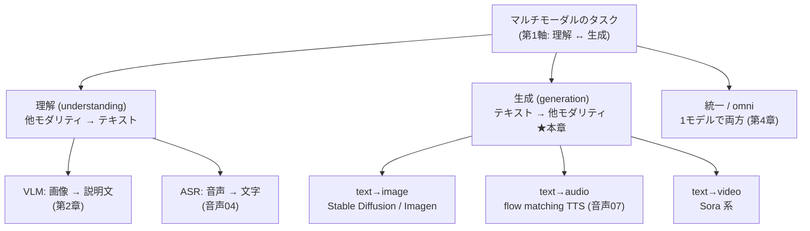
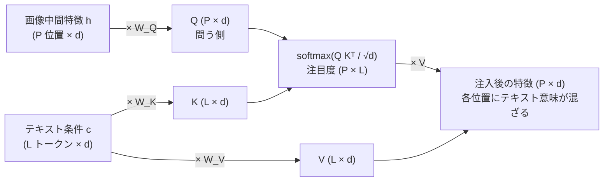
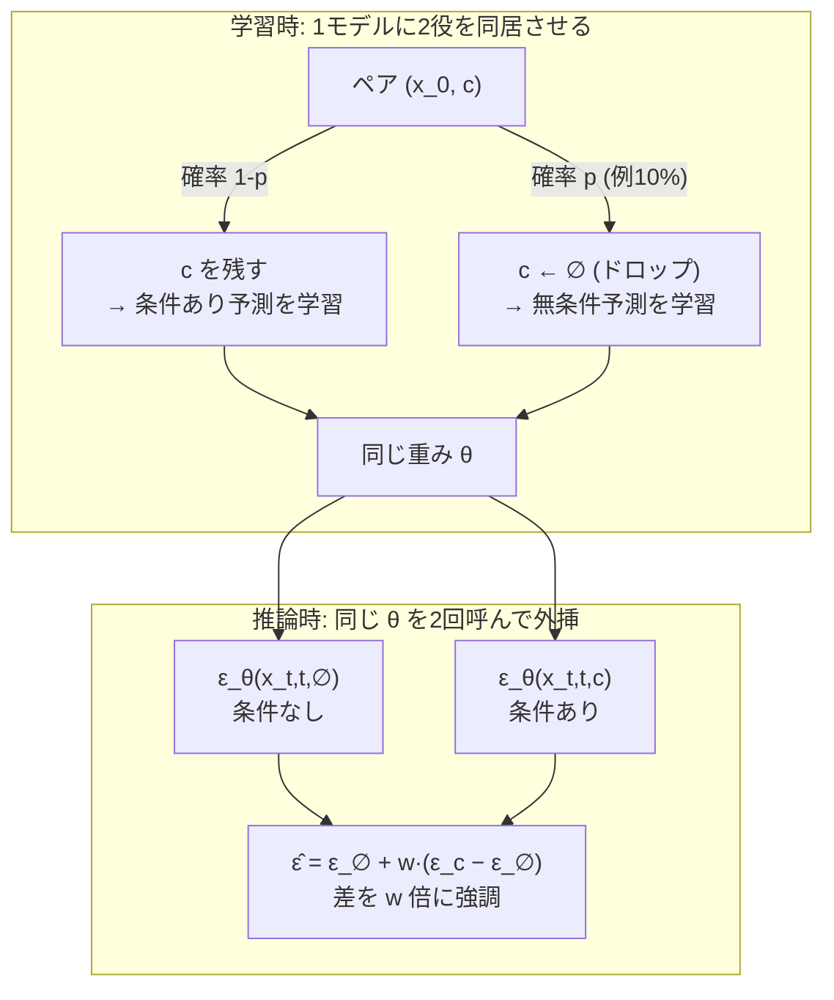
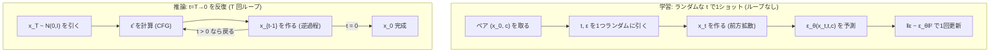

# マルチモーダル生成 — text→image / 音声・動画

:::abstract[学習目標]
この章を読み終えると、次のことができるようになります。

- **理解 (VLM) と生成は別問題**であることを説明し、両者で情報の流れる向きが逆だと**区別**できる
- **条件付き拡散の目的** $\lVert\epsilon-\epsilon_\theta(x_t,t,c)\rVert^2$ を、無条件拡散にテキスト条件 $c$ を足しただけの形として**導出**できる
- テキスト条件 $c$ が **cross-attention で生成器に注入**される仕組み（query=生成器側 / key・value=テキスト側）を**説明**できる
- text→image（Stable Diffusion / Imagen）・text→audio（章07 の flow matching TTS）・text→video が**同じ「条件付き生成」の骨格**を共有することを**対比**できる
- **classifier-free guidance**（条件あり/なしの差を強調する）の仕組みと、条件を「落として」学習する理由を**説明**できる
- numpy だけの条件付き 2D 拡散トイで、**損失が下がること**と**条件で生成先が分離すること**を**実測**で確かめられる
:::

## 前提知識

- [マルチモーダル 第2章 vision-language モデル](/multimodal/02-vision-language-models/)：CLIP のテキストエンコーダ・共有埋め込み・cross-attention によるモダリティ接続。本章は**その逆向き**——テキストから他モダリティを**作る**——を扱います
- [視覚 第4章 拡散による画像生成](/vision/04-diffusion-generation/)：無条件 diffusion（ノイズ予測 $\epsilon_\theta(x_t,t)$・前方/逆過程）。本章は**ここに条件 $c$ を足す**だけです
- [音声 第7章 連続生成 TTS（flow matching）](/audio/07-flow-matching-tts/)：ノイズから mel を一括生成する非自己回帰生成。**text→audio はこの章そのもの**で、条件がテキストになります
- [言語（LLM）](/llm/)：テキストを埋め込み列に変える方法（トークン化・Transformer）。条件 $c$ はテキストエンコーダの出力です

LLM 出身の読者へ。LLM の生成は「テキスト条件 → テキスト出力」の自己回帰でした。本章は**出力がテキストでなく画像・音声・動画に変わる**だけで、「条件に従って何かを生成する」骨格は同じです。違いは、出力が連続な高次元（画像・mel）なので自己回帰でなく**拡散/flow で一括生成**することが多い点です。

## 直感

[第2章](/multimodal/02-vision-language-models/)の VLM は「画像を読んでテキストで答える」**理解 (understanding)** でした。本章はその逆——「テキストを読んで画像・音声・動画を作る」**生成 (generation)** です。タクソノミーの第1軸「理解 ↔ 生成」のうち、生成側に降ります。この第1軸を1枚に置くと、本章がどこに立っているかが一目で分かります。



本章は右の枝（生成）の3葉——画像・音声・動画——を**1つの骨格で**説明します。左の枝（理解）は前章まで、根の上の「統一」は次章です。

ここで素朴な疑問が湧きます。「テキストから画像を作るなんて、どこから始めればいい?」。答えは拍子抜けするほど単純です。**すでに学んだ無条件の生成器（[視覚 04](/vision/04-diffusion-generation/) の拡散、[音声 07](/audio/07-flow-matching-tts/) の flow matching）に、テキスト条件を1つ足すだけ**です。

- [視覚 04](/vision/04-diffusion-generation/)：ノイズ → 画像。**何の画像かは指定できない**（無条件）。
- 本章：ノイズ + **「赤い丸」というテキスト** → その通りの画像。

具体例で一歩ずつ歩きます。無条件の拡散にプロンプト「赤い丸」を与えると、生成は次のように進みます。「`x_T`＝純ノイズ」から始まり、各除去ステップで生成器が「いま処理中のこのピクセルは、プロンプトの『赤』『丸』のどれに対応すべきか」を attention で問い、徐々に赤い丸へ収束します。プロンプトを「青い四角」に変えると——**初期ノイズが同じでも**——収束先が青い四角に変わります。条件 $c$ を差し替えるだけで出口が変わる、この1点が本章の核です。退化ケースとして、プロンプトを空（無条件）にすると「どのテキストでもない平均的な画像」が出ます（これが後述の classifier-free guidance の片側になります）。

つまり本章で新しく学ぶのは「生成の仕組み」ではなく、**「テキストという条件を生成器のどこに、どう差し込むか」**——たった1点です。その差し込み方の主役が **cross-attention**。text→image も text→audio も text→video も、この1点を共有します。本章のゴールは、この「条件付け (conditioning)」の仕組みを一望し、numpy で「条件が生成を変える」ことを手元で確かめることです。

## 全体像

マルチモーダル生成は **テキスト条件 $c$ → 他モダリティ $x$** の条件付き生成です。骨格は3モダリティで共通で、変わるのは出口（何を生成するか）だけです。


3モダリティは**同じ骨格・違う出口**です。ここを最初に掴むと、以降がすべて同じ話に見えます。

| | text→image | text→audio | text→video |
| --- | --- | --- | --- |
| 出力 $x$ | 画像（ピクセル or latent） | log-mel スペクトログラム | 動画（時間×画像） |
| 生成器 | 拡散（Stable Diffusion / Imagen） | flow matching / 拡散（[章07](/audio/07-flow-matching-tts/)） | 拡散 + 時間軸（Sora 系） |
| 条件 $c$ | テキスト埋め込み | テキスト（音素 + 内容） | テキスト埋め込み |
| 注入 | cross-attention | cross-attention | cross-attention |
| 出口 | そのまま画像 | vocoder で波形へ | フレーム列 → 動画 |

学習時と推論時で**やることが反転**します（[音声07](/audio/07-flow-matching-tts/) と同じ構図に、条件 $c$ が加わっただけ）。

| | 学習時（training） | 推論時（inference） |
| --- | --- | --- |
| 入力 | 本物のペア $(x_0, c)$（画像とそのキャプション）**両方** | 条件 $c$ **だけ**（ノイズは自分で引く） |
| 何をする | ノイズを足した $x_t$ から**ノイズ $\epsilon$ を予測**（教師あり回帰） | 予測ノイズを頼りに**逆過程で $x_0$ を作る** |
| $x_0$ は | **既知**（教師信号） | **未知**（これを生成する） |
| $c$ の役割 | 「このノイズはこの $c$ の画像のもの」と教える | 「この $c$ の画像を作れ」と命じる |

:::warning[理解 (VLM) と生成は別問題]
最大の誤解です。[第2章](/multimodal/02-vision-language-models/)の VLM（画像→テキスト）と本章（テキスト→画像）は、**情報の流れが逆**で、**別のモデル**です。

- **VLM（理解）**：画像を**入力**に取り、テキストを**出力**。画像は cross-attention の **key/value**（読まれる側）。
- **生成**：テキストを**条件**に取り、画像を**出力**。テキストは cross-attention の **key/value**（読まれる側）、生成中の画像が **query**（読む側）。

「CLIP があれば画像も生成できる」は誤りです。CLIP は画像とテキストを**整列**させる（似ているか測る）モデルで、画像を**生成**する能力は持ちません。生成には拡散/flow のような**別の生成器**が要り、CLIP/T5 はその**条件エンコーダ**として使われるだけです。理解と生成を1モデルに畳む「統一モデル」は[第4章](/multimodal/04-any-to-any-omni/)の主題で、本章ではまだ別物として扱います。
:::

## 理論

### 無条件生成から条件付き生成へ

出発点は[視覚 04](/vision/04-diffusion-generation/) の無条件拡散です。記号を全部定義し直します。

- $x_0$：本物のデータ（画像なら $H\times W\times 3$ のテンソル、mel なら時間×周波数の行列）。これを生成したい。
- $x_t$：$x_0$ に時刻 $t$ ぶんのノイズを足したもの。$t=0$ で本物、$t=T$ でほぼ純ノイズ。
- $t \in \{1,\dots,T\}$：拡散の時刻（ノイズの強さ）。$t$ が大きいほどノイズが多い。
- $\epsilon \sim \mathcal{N}(0, I)$：前方拡散で足した**真のノイズ**。$x_t$ と同じ形のテンソル。学習の**教師信号**。
- $\epsilon_\theta$：パラメータ $\theta$ を持つ**ノイズ予測ネットワーク**。$x_t$ と $t$ を見て、足されたノイズ $\epsilon$ を当てる。
- $\bar\alpha_t$：ノイズスケジュールの**累積積**。$\alpha_t = 1-\beta_t$（$\beta_t$＝時刻 $t$ で足すノイズの分散）とおき、$\bar\alpha_t = \prod_{s\le t}\alpha_s$ と定義する。$t{=}0$ で $\bar\alpha_0 \approx 1$、$t{=}T$ で $\bar\alpha_T \approx 0$。後の前方拡散 $x_t = \sqrt{\bar\alpha_t}\,x_0 + \sqrt{1-\bar\alpha_t}\,\epsilon$ で、$t$ が進むほど **$x_0$ の重み $\sqrt{\bar\alpha_t}$ が消えてノイズ $\epsilon$ の重み $\sqrt{1-\bar\alpha_t}$ が支配的になる**——これが「$t{=}T$ で純ノイズ」の正体です。

無条件拡散の学習目的は「足したノイズを当てる」回帰でした。

$$
L_{\text{uncond}} = \mathbb{E}_{x_0,\,\epsilon,\,t}\left[\;\bigl\lVert \epsilon - \epsilon_\theta(x_t, t) \bigr\rVert^2 \;\right]
$$

ここで $x_t = \sqrt{\bar\alpha_t}\,x_0 + \sqrt{1-\bar\alpha_t}\,\epsilon$（前方拡散の閉形式。$\bar\alpha_t$ はノイズスケジュールの累積積）です。

**条件付きにするのは、ネットワークの引数に条件 $c$ を1つ足すだけ**です。

$$
L_{\text{cond}} = \mathbb{E}_{(x_0, c),\,\epsilon,\,t}\left[\;\bigl\lVert \epsilon - \epsilon_\theta(x_t, t, c) \bigr\rVert^2 \;\right]
$$

新しい記号は $c$ だけです。

- $c$：**テキスト条件**。テキストエンコーダ（CLIP のテキスト塔、または T5）が文字列を変換した**埋め込み列**。形は $(\text{トークン数} \times d)$ の行列。各行が1トークンの意味ベクトル。
- 期待値が $x_0$ から **$(x_0, c)$ のペア**に変わった：学習データが「画像」から「画像とそのキャプションの**組**」になる。LAION のような大規模 (画像, テキスト) ペアがこれを支えます（[第2章](/multimodal/02-vision-language-models/)の CLIP と同じデータ源）。

:::note[なぜこれだけで条件付きになるのか]
$\epsilon_\theta(x_t, t, c)$ が「$c$ の画像に足されたノイズ」を当てるよう学習されると、逆過程（ノイズ除去）は自然に **$c$ の方向へ** $x_t$ を動かします。「赤い丸のノイズはこう」「青い四角のノイズはこう」を $c$ ごとに区別して覚えるので、推論時に $c$ を変えれば生成先が変わる——これだけです。難しい新概念はありません。
:::

### 条件 $c$ をどこに注入するか：cross-attention

問題は「$\epsilon_\theta$ の中で $c$ をどう使うか」です。$x_t$（画像状態）と $c$（テキスト）は形も意味も違うので、単純に足せません。ここで [第2章](/multimodal/02-vision-language-models/) の cross-attention が再登場します。**生成中の画像が「テキストのどの単語を見るか」を attention で選ぶ**のです。

U-Net（拡散の標準ネットワーク）や DiT（Transformer 版）の各ブロックに **cross-attention 層**を挟みます。動作はこうです。

- **query $Q$ = 画像側**：いま処理中の画像特徴（$x_t$ から作った中間表現）の各位置。「この場所は何を描くべき?」と問う側。
- **key $K$ / value $V$ = テキスト側**：条件 $c$（テキスト埋め込み列）。「赤」「丸」などの各単語。読まれる側。
- 各画像位置が、全テキストトークンへの注目度（attention 重み）を計算し、**関係するトークンの value を重み付き和**で引き込む。

データの流れを1枚にすると、誰が query で誰が key/value かが固定されます。



ここで $h$ は画像側の中間特徴、$c$ はテキスト条件、$W_Q, W_K, W_V$ は学習する射影行列です。記号を全部定義します。

- $h$：画像側の中間特徴。形は $(P \times d)$。$P$＝空間位置の数（U-Net のその層での画素/パッチ数）、$d$＝チャネル次元。各行が「画像の1か所」の特徴。
- $c$：テキスト条件。形は $(L \times d)$。$L$＝プロンプトのトークン数、各行が1単語の意味ベクトル。**全位置・全ステップで使い回す固定入力**（テキストエンコーダが推論開始時に1回計算し、以後据え置き）。
- $Q = hW_Q$：形 $(P \times d)$。画像の各位置を「問い」に変換。
- $K = cW_K,\ V = cW_V$：ともに形 $(L \times d)$。テキストを「鍵」と「中身」に変換。
- $QK^\top$：形 $(P \times L)$。要素 $(i,j)$＝画像位置 $i$ が単語 $j$ をどれだけ見るか。$\sqrt d$ で割って softmax し、行ごと（各画像位置ごと）に和が1の注目度にする。
- 出力：形 $(P \times d)$。各画像位置に「その位置が見るべき単語の意味」が混ざる。

$$
\mathrm{CrossAttn}(Q, K, V) = \mathrm{softmax}\!\left(\frac{Q K^\top}{\sqrt{d}}\right) V,\qquad Q = h\,W_Q,\;\; K = c\,W_K,\;\; V = c\,W_V
$$

「丸を描くべき画像位置」が「丸」というトークンを強く見て、その意味を引き込む——これがテキスト注入の実体です。

VLM（[第2章](/multimodal/02-vision-language-models/)）の cross-attention と**役割が真逆**になる点を、表で名指しして潰します。文字は同じ $Q/K/V$ でも中身が入れ替わります。

| | query $Q$（問う側） | key/value $K,V$（読まれる側） | 情報の向き |
| --- | --- | --- | --- |
| VLM（理解・第2章） | 生成中の**テキスト** | **画像**特徴 | 画像 → テキスト |
| 本章（生成） | 生成中の**画像** $h$ | **テキスト**条件 $c$ | テキスト → 画像 |

「読む側」と「読まれる側」が逆——これが理解と生成が別問題である理由の機構レベルの正体です。

:::warning[条件注入は「足し算」ではなく「cross-attention」が主役]
誤解しやすい点。「条件 $c$ を画像に足すだけ」と聞くと、$x_t + c$ のような単純加算を想像しがちですが、それは形が合わず意味も持ちません。実際は**各画像位置が cross-attention で必要なテキストトークンを選んで引き込む**のが本筋です。時刻 $t$ のような**スカラーに近い条件**は埋め込んで足し込む（FiLM/加算）こともありますが、**テキストのような系列条件は cross-attention**で注入するのが Stable Diffusion / Imagen の標準です。本章末の numpy トイは、まず簡単な「加算注入」で機構を見せ、その後に拡散トイで条件付けの効果を実測します。
:::

### classifier-free guidance：条件の効きを強める

条件付き拡散をそのまま学習すると、生成は $c$ に従いますが、**従い方が弱い**ことがあります（プロンプトを軽く無視する）。これを強めるのが **classifier-free guidance (CFG)** です。仕組みは2段階です。

**学習時**：条件 $c$ を確率 $p$（例 10%）で**ランダムに落として**（空の条件 $\varnothing$ に置き換えて）学習します。すると1つのネットワークが**条件あり $\epsilon_\theta(x_t,t,c)$ と条件なし $\epsilon_\theta(x_t,t,\varnothing)$ の両方**を予測できるようになります。

**推論時**：両者の差を「条件が引っ張る方向」とみなし、その方向を $w$ 倍に**強調**します。

$$
\hat\epsilon_\theta(x_t, t, c) = \epsilon_\theta(x_t, t, \varnothing) + w\,\bigl[\,\epsilon_\theta(x_t, t, c) - \epsilon_\theta(x_t, t, \varnothing)\,\bigr]
$$

CFG の「学習で同居・推論で外挿」という2段構えを1枚にすると、1つの重みが2役を担う様子が見えます。



- $w=1$：素の条件付き予測（強調なし）。
- $w>1$（例 7.5）：条件の効きを強める。プロンプト忠実度↑、多様性↓。
- $\epsilon_\theta(x_t,t,c) - \epsilon_\theta(x_t,t,\varnothing)$：「無条件からどれだけ $c$ の方へずれるか」というベクトル。これが**条件が生成を引っ張る向き**。

ガイダンス係数 $w$ の効きを、場合分けで一覧にします。

| $w$ の値 | $\hat\epsilon$ の中身 | 生成の挙動 |
| --- | --- | --- |
| $w=0$ | $\epsilon_\theta(x_t,t,\varnothing)$ | 条件を完全無視（無条件生成）。プロンプトに従わない |
| $w=1$ | $\epsilon_\theta(x_t,t,c)$ | 素の条件付き予測。強調なし |
| $w=7.5$ | $\epsilon_\varnothing + 7.5(\epsilon_c-\epsilon_\varnothing)$ | 実用の定番。忠実度と品質のバランス点 |
| $w$ 過大（例 20） | 差を過度に増幅 | 過飽和・不自然。条件方向に押し込みすぎ |

:::note[なぜ「条件を落として」学習するのか]
無条件 $\epsilon_\theta(x_t,t,\varnothing)$ を別途用意するなら2つネットワークが要りそうですが、**条件ドロップで1つに同居**させます。空の条件 $\varnothing$ を「どのテキストでもない平均的な画像」の予測器として同じ重みに学習させるわけです。これで推論時に「条件あり − 条件なし」の差分が取れ、その差を増幅できます。学習側のたった1行（確率 $p$ で $c \leftarrow \varnothing$）が、推論側の強力な制御を生む——設計の妙です。
:::

### 学習時 vs 推論時（条件付き拡散の動作）

3モダリティ共通の動作を、学習と推論で分けて並べます。

| ステップ | 学習時 | 推論時 |
| --- | --- | --- |
| 1 | ペア $(x_0, c)$ を取る（画像 + キャプション） | 条件 $c$ だけを取る（プロンプト） |
| 2 | 時刻 $t$ とノイズ $\epsilon$ をランダムに引く | $x_T \sim \mathcal{N}(0,I)$ を引く |
| 3 | $x_t = \sqrt{\bar\alpha_t}x_0 + \sqrt{1-\bar\alpha_t}\epsilon$ を作る | （なし） |
| 4 | 確率 $p$ で $c \leftarrow \varnothing$（CFG 用ドロップ） | （なし） |
| 5 | $\epsilon_\theta(x_t,t,c)$ を計算し $\lVert\epsilon-\epsilon_\theta\rVert^2$ で更新 | 各 $t$ で $\hat\epsilon$ を計算し $x_{t-1}$ を作る（逆過程） |
| 6 | （1 ステップ） | $t=T\to 0$ まで反復 → $x_0$ 完成 |

肝は **学習は1ステップだけ（ランダムな $t$ で1回ノイズを当てる）、推論は $T$ ステップの反復**だという非対称です。[音声07](/audio/07-flow-matching-tts/) の flow matching と同じ構図で、$c$ が加わっただけです。この非対称（学習＝1ショット回帰、推論＝逆過程ループ）を図にすると、なぜ訓練が速く推論が遅いかが直感で掴めます。



:::warning[学習の「1ステップ」と推論の「1ステップ」は別物]
混同しやすい点です。**学習の1ステップ**は「ランダムな1つの $t$ について1回だけノイズを当てる回帰」で、$T$ 個の時刻を順に辿りはしません（各 $t$ は独立にサンプリングされる）。**推論の1ステップ**は「逆過程ループの1回ぶん（$x_t \to x_{t-1}$）」で、これを $T$ 回繰り返して初めて1枚の画像になります。だから「学習1回」と「画像1枚の生成」では、ネットワーク呼び出し回数が**1 対 $T$**（CFG ありなら 1 対 $2T$）と大きく非対称です。
:::

## 数式の導出

条件付き拡散の目的 $\lVert\epsilon-\epsilon_\theta(x_t,t,c)\rVert^2$ が「無条件拡散に $c$ を足しただけ」であることを、最尤から導きます。

### ステップ1：生成したいのは条件付き分布 $p(x_0 \mid c)$

無条件生成は $p(x_0)$ を学びました。条件付き生成が学びたいのは $p(x_0 \mid c)$——「条件 $c$ のもとでの本物データの分布」です。最尤の目的は、

$$
\max_\theta\; \mathbb{E}_{(x_0, c)}\bigl[\log p_\theta(x_0 \mid c)\bigr]
$$

期待値が $(x_0, c)$ ペア上に変わっただけで、形は無条件の最尤と同じです。

### ステップ2：拡散の変分下界（ELBO）に $c$ を通す

無条件拡散では、$\log p_\theta(x_0)$ を直接最大化できないので、前方拡散 $q(x_t \mid x_0)$ を使った変分下界（ELBO）に落としました。条件付きでは、**前方拡散は $c$ に依存しない**（ノイズの足し方は条件と無関係）ことが鍵です。

$$
q(x_t \mid x_0, c) = q(x_t \mid x_0)
$$

つまり**条件 $c$ は前方過程に一切入らず、逆過程（生成）にだけ入る**。ELBO の各 KL 項のうち、$c$ が現れるのは逆過程 $p_\theta(x_{t-1} \mid x_t, c)$ だけです。

$$
\log p_\theta(x_0\mid c) \ge \mathbb{E}_q\Bigl[\sum_t \underbrace{D_{\mathrm{KL}}\!\bigl(q(x_{t-1}\mid x_t, x_0)\,\Vert\,p_\theta(x_{t-1}\mid x_t, c)\bigr)}_{c\text{ はここだけ}}\Bigr] + \text{const}
$$

### ステップ3：ガウス仮定で KL を二乗ノルムに

無条件の場合と同様、$q$ も $p_\theta$ もガウスと置くと、各 KL 項は平均の差の二乗になります。逆過程の平均を「予測ノイズ $\epsilon_\theta$」でパラメトライズする標準の書き換え（DDPM の reparametrization）を、**$\epsilon_\theta$ の引数に $c$ を足したまま**適用すると、

$$
D_{\mathrm{KL}}(\cdots) = \frac{(1-\alpha_t)^2}{2\sigma_t^2 \alpha_t (1-\bar\alpha_t)}\,\bigl\lVert \epsilon - \epsilon_\theta(x_t, t, c)\bigr\rVert^2 + \text{const}
$$

無条件の導出と**一字一句同じ**で、$\epsilon_\theta(x_t,t)$ が $\epsilon_\theta(x_t,t,c)$ に変わるだけです。$c$ は前方過程に入らないので、$\epsilon$（真のノイズ）の項にも、係数にも一切影響しません。

### ステップ4：重み付けを落とした実用目的

DDPM と同じく、$t$ ごとの係数を $1$ に簡略化（実験的に良いと知られる）すると、最終的な学習目的が得られます。

$$
L_{\text{cond}} = \mathbb{E}_{(x_0, c),\,\epsilon,\,t}\left[\;\bigl\lVert \epsilon - \epsilon_\theta(x_t, t, c) \bigr\rVert^2 \;\right]
$$

**結論**：条件付き拡散の目的は、無条件拡散の目的の $\epsilon_\theta$ に条件 $c$ を引数として足しただけ。$c$ が前方過程に入らない（ノイズの足し方が条件に無関係）という1点が、この「足すだけ」を正当化します。$\blacksquare$

## 実装

numpy だけで、**条件付き 2D 拡散**を最小実装します。データは2クラスの 2D 点群（クラス0=左下、クラス1=右上）。テキスト条件 $c$ の代役にクラスラベルを使い、**条件で生成先が変わる**ことを実測します。これは text→image の最小核——「$c$ を変えると $x_0$ が変わる」——を、画像を 2D 点に縮めて確かめるものです。

トイと本物の Stable Diffusion の対応を先に押さえると、何を縮めているかが明確になります。骨格（条件付き拡散の目的）は完全に同じで、出口と注入方法だけが豪華になります。

| 部品 | 本トイ（numpy） | 本物の Stable Diffusion |
| --- | --- | --- |
| 生成対象 $x_0$ | 2D 点 | 画像（VAE latent に圧縮） |
| 条件 $c$ | クラスラベル（0/1） | テキスト埋め込み列（CLIP/T5） |
| ネットワーク $\epsilon_\theta$ | 2層 MLP | U-Net / DiT |
| 条件注入 | $c$ を入力に連結（加算的） | 各ブロックで cross-attention |
| 条件ドロップ | `c ← -1`（確率 $p$） | `c ← ∅`（確率 $p$） |
| 学習目的 | $\lVert\epsilon-\epsilon_\theta(x_t,t,c)\rVert^2$ | **同じ** |
| サンプリング | DDPM 逆過程（$T=50$） | DDPM/DDIM 逆過程（+ CFG） |

「学習目的が同じ」が要点です。トイで損失が下がり条件で生成先が分かれれば、それは縮図のうえで Stable Diffusion と同じことが起きた、という意味になります。

まず、条件注入の機構を最小に見せます。**cross-attention で生成器がテキストトークンを選んで引き込む**様子です。

```python title="toy_cross_attention.py"
import numpy as np
rng = np.random.default_rng(0)

D_MODEL = 16; N_TOK = 4; D_OUT = 8
# 語彙: 各単語の固定テキスト埋め込み(本来はテキストエンコーダの出力)
VOCAB = {"red": rng.normal(size=D_MODEL), "blue": rng.normal(size=D_MODEL),
         "circle": rng.normal(size=D_MODEL), "square": rng.normal(size=D_MODEL),
         "<pad>": np.zeros(D_MODEL)}
Wq = rng.normal(size=(D_MODEL, D_MODEL))*0.3; Wk = rng.normal(size=(D_MODEL, D_MODEL))*0.3
Wv = rng.normal(size=(D_MODEL, D_MODEL))*0.3; Wout = rng.normal(size=(D_MODEL, D_OUT))*0.3

def softmax(x):
    e = np.exp(x - x.max()); return e / e.sum()

def text_embed(tokens):                       # 単語列 -> (N_TOK, D_MODEL)
    toks = (tokens + ["<pad>"]*N_TOK)[:N_TOK]
    return np.stack([VOCAB[t] for t in toks])

def generate(z, tokens):                       # ノイズ z にテキスト条件を cross 注入
    c = text_embed(tokens)
    q = z @ Wq; k = c @ Wk; v = c @ Wv         # query=生成器側 / key,value=テキスト側
    attn = softmax((k @ q) / np.sqrt(D_MODEL)) # どのトークンを見るか
    ctx = attn @ v                             # テキストの重み付き和
    out = np.tanh((z + ctx) @ Wout)            # 残差で条件を注入 -> 出力へ射影
    return out, attn

z = rng.normal(size=D_MODEL)                   # 同じノイズを固定し条件だけ変える
out_red, _ = generate(z, ["red", "circle"])
out_blue, _ = generate(z, ["blue", "circle"])
print("||out(red) - out(blue)|| =", round(float(np.linalg.norm(out_red - out_blue)), 4))
```

同じノイズでも条件を変えると出力が変わる（距離 > 0）ことが確認できます。次が本命の**条件付き拡散**で、$\lVert\epsilon-\epsilon_\theta(x_t,t,c)\rVert^2$ を実際に最小化します。

```python title="toy_conditional_diffusion.py"
import numpy as np
rng = np.random.default_rng(0)

# データ: 2クラスの 2D 点群。クラス0=左下、クラス1=右上。
N = 2000
mu = np.array([[-2.0, -2.0], [2.0, 2.0]])     # クラスごとの中心
labels = rng.integers(0, 2, size=N)
data = mu[labels] + rng.normal(size=(N, 2)) * 0.5   # 本物の x0

# 拡散スケジュール(線形 beta)
T = 50
betas = np.linspace(1e-4, 0.05, T)
alphas = 1.0 - betas
abar = np.cumprod(alphas)                     # \bar{alpha}_t

# ノイズ予測器 eps_theta(x_t, t, c): 入力に条件 c を連結して注入
C_DIM = 4
Wc = rng.normal(size=(2, C_DIM)) * 0.1        # クラス -> 条件埋め込み(学習対象)
H = 64
W1 = rng.normal(size=(2 + 1 + C_DIM, H)) / np.sqrt(2 + 1 + C_DIM); b1 = np.zeros(H)
W2 = rng.normal(size=(H, 2)) / np.sqrt(H);    b2 = np.zeros(2)

def cond_embed(c):                            # c<0 は無条件(0 ベクトル)
    e = np.zeros((len(c), C_DIM)); m = c >= 0; e[m] = Wc[c[m]]; return e

def relu(x): return np.maximum(x, 0.0)

def forward(xt, t, c):
    te = t[:, None] / T                       # 時刻を [0,1] に正規化
    inp = np.concatenate([xt, te, cond_embed(c)], axis=1)  # x_t, t, c を連結
    h = relu(inp @ W1 + b1)
    return inp, h, h @ W2 + b2                 # 予測ノイズ

# 学習: ||eps - eps_theta(x_t, t, c)||^2 を最小化(手書き SGD)
lr = 0.02; B = 256; drop_p = 0.1; losses = []
for step in range(4000):
    idx = rng.integers(0, N, size=B)
    x0 = data[idx]; c = labels[idx].copy()
    c[rng.random(B) < drop_p] = -1            # CFG 用に条件を一部ドロップ
    t = rng.integers(0, T, size=B)
    eps = rng.normal(size=(B, 2))             # 真のノイズ(教師信号)
    a = abar[t][:, None]
    xt = np.sqrt(a) * x0 + np.sqrt(1 - a) * eps   # 前方拡散
    inp, h, pred = forward(xt, t, c)
    diff = pred - eps
    losses.append(np.mean(np.sum(diff**2, axis=1)))
    # 逆伝播(MSE)
    g = (2.0 / B) * diff
    gW2 = h.T @ g; gb2 = g.sum(0)
    gh = g @ W2.T; gh[h <= 0] = 0
    gW1 = inp.T @ gh; gb1 = gh.sum(0)
    g_ce = (gh @ W1.T)[:, 3:]                  # 条件埋め込みへの勾配
    for cls in (0, 1):
        m = (c == cls)
        if m.any(): Wc[cls] -= lr * g_ce[m].sum(0)
    W2 -= lr*gW2; b2 -= lr*gb2; W1 -= lr*gW1; b1 -= lr*gb1

print("loss: step0 =", round(losses[0], 4), " 末尾平均 =", round(float(np.mean(losses[-100:])), 4))

# サンプリング: classifier-free guidance つき DDPM 逆過程
# 各ステップで条件あり/なしの両方を予測し、その差を w 倍に外挿する。
# w=1 なら素の条件付き(差そのまま)、w>1 で条件の効きを強調。
def sample(c_val, w=1.0, n=500, seed=1):
    r = np.random.default_rng(seed); x = r.normal(size=(n, 2))
    c = np.full(n, c_val); uncond = np.full(n, -1)        # -1 = 無条件 ∅
    for t in reversed(range(T)):
        tt = np.full(n, t)
        _, _, eps_c = forward(x, tt, c)                   # 条件あり ε_θ(x_t,t,c)
        _, _, eps_u = forward(x, tt, uncond)              # 条件なし ε_θ(x_t,t,∅)
        eps_hat = eps_u + w * (eps_c - eps_u)             # CFG 外挿
        a = alphas[t]; ab = abar[t]
        mean = (x - (1 - a) / np.sqrt(1 - ab) * eps_hat) / np.sqrt(a)
        x = mean + (np.sqrt(betas[t]) * r.normal(size=(n, 2)) if t > 0 else 0)
    return x

# w=1(素の条件付き) と w=5(条件強調) を比べる
for w in (1.0, 5.0):
    s0 = sample(0, w=w); s1 = sample(1, w=w)
    spread = 0.5 * (s0.std(0).mean() + s1.std(0).mean())   # 生成の広がり(標準偏差)
    print(f"w={w}: 条件0 平均={np.round(s0.mean(0),2)} 条件1 平均={np.round(s1.mean(0),2)} "
          f"広がり(std)={spread:.3f}")
```

実行結果（`uv run --with numpy python` で実測）:

```text title="出力"
# toy_cross_attention.py
||out(red) - out(blue)|| = 0.3452

# toy_conditional_diffusion.py
loss: step0 = 5.3319  末尾平均 = 1.0083
w=1.0: 条件0 平均=[-1.69 -1.76] 条件1 平均=[1.5  1.63] 広がり(std)=0.765
w=5.0: 条件0 平均=[-1.79 -1.95] 条件1 平均=[1.71 2.12] 広がり(std)=0.525
```

読み取れること:

- **損失が下がる**（5.33 → 約1.0）：ネットワークが「$c$ ごとのノイズ」を当てられるようになった。
- **条件で生成先が分離**：条件0 を与えると左下 $[-2,-2]$ 付近、条件1 を与えると右上 $[2,2]$ 付近に生成される。**同じノイズ初期値・同じネットワークでも、条件 $c$ だけで出力先が変わる**——これが text→image の核です。クラスラベルをテキスト埋め込みに、2D 点を画像に置き換えれば、Stable Diffusion の骨格そのものです。
- **CFG で「効きが強まる」**：$w$ を $1\to 5$ に上げると、生成の**広がり（std）が 0.765 → 0.525 に縮み**、各クラスの平均が真の中心（$[\pm2,\pm2]$）へ寄ります。無条件予測からの差を $w$ 倍に外挿することで、サンプルが条件の中心へより強く引き寄せられる——**忠実度↑・多様性↓**という CFG の効果が、トイでもそのまま観測できます（理論節の $w$ 一覧表どおり）。
- 末尾損失が 0 にならないのは、$x_t$ にノイズが乗っている以上ノイズを完璧には当てられない（理論的下限がある）ためで、異常ではありません。

:::tip[深層が必須の箇所は概念スケルトンで]
本物の Stable Diffusion は、(1) 画像を VAE で latent に圧縮、(2) U-Net/DiT の各ブロックに cross-attention でテキスト注入、(3) CFG で条件強調、という3点が加わるだけで、**学習目的は上のトイと同じ $\lVert\epsilon-\epsilon_\theta(x_t,t,c)\rVert^2$** です。text→audio（[章07](/audio/07-flow-matching-tts/)）は出力が mel に、損失が flow matching の速度回帰に変わります。text→video は出力に時間軸が増え、フレーム間の一貫性のため時間方向の attention が加わります。骨格は不変です。
:::

## 演習

::::question[演習 1: 理解と生成、条件の入り方]
(a) [第2章](/multimodal/02-vision-language-models/)の VLM（画像→テキスト）と本章（テキスト→画像）で、cross-attention の query・key/value にはそれぞれ何が入りますか。(b) 「CLIP があれば text→image ができる」は正しいですか。(c) 条件付き拡散の目的 $\lVert\epsilon-\epsilon_\theta(x_t,t,c)\rVert^2$ で、無条件の場合と比べて変わったのはどこですか。前方拡散 $x_t=\sqrt{\bar\alpha_t}x_0+\sqrt{1-\bar\alpha_t}\epsilon$ に $c$ は入りますか。

:::details[解答]
(a) **VLM（理解）**：画像が key/value（読まれる側）、生成中のテキストが query（読む側）。**生成**：テキスト条件 $c$ が key/value（読まれる側）、生成中の画像が query（読む側）。情報の流れが逆で、読む/読まれるが入れ替わります。
(b) 正しくありません。CLIP は画像とテキストを**整列**させる（似ているか測る）モデルで、画像を**生成**する能力は持ちません。生成には拡散/flow のような別の生成器が必要で、CLIP/T5 はその**条件エンコーダ**として使われるだけです。
(c) 変わったのは $\epsilon_\theta$ の引数に $c$ が加わった1点だけ（$\epsilon_\theta(x_t,t) \to \epsilon_\theta(x_t,t,c)$）。前方拡散には $c$ は**入りません**——ノイズの足し方は条件と無関係です。この「$c$ が前方過程に入らない」性質が、目的が「足すだけ」で済む理由でした。
:::
::::

::::question[演習 2: classifier-free guidance]
CFG で推論時に $\hat\epsilon = \epsilon_\theta(x_t,t,\varnothing) + w[\epsilon_\theta(x_t,t,c) - \epsilon_\theta(x_t,t,\varnothing)]$ を使います。(a) $w=1$ と $w=0$ のとき、それぞれどんな生成になりますか。(b) 学習時に条件を確率 $p$ でドロップするのはなぜですか。(c) $w$ を大きくする（例 15）と何が起きますか。

:::details[解答]
(a) $w=1$：$\hat\epsilon = \epsilon_\theta(x_t,t,c)$ となり、素の条件付き予測（強調なし）。$w=0$：$\hat\epsilon = \epsilon_\theta(x_t,t,\varnothing)$ となり、**条件を完全に無視した無条件生成**（プロンプトに従わない）。
(b) 1つのネットワークに**条件あり $\epsilon_\theta(\cdots,c)$ と条件なし $\epsilon_\theta(\cdots,\varnothing)$ の両方**を学習させるためです。空の条件 $\varnothing$ を「どのテキストでもない平均的な予測」として同じ重みに覚えさせると、推論時に「条件あり − 条件なし」の差分（条件が引っ張る向き）が取れます。
(c) プロンプト忠実度が上がる一方、多様性が下がり、過度に大きいと不自然・過飽和な出力になります（条件方向に押し込みすぎる）。実用では $w \approx 7.5$ 付近が定番です。
:::
::::

## まとめ

:::success[この章の要点]
- **理解 (VLM) と生成は別問題**。VLM は画像→テキスト、本章はテキスト→画像で、情報の流れが逆。CLIP は条件エンコーダにはなるが、それ自体は画像を生成できない。
- **条件付き拡散の目的は無条件に $c$ を足しただけ**：$\lVert\epsilon-\epsilon_\theta(x_t,t,c)\rVert^2$。前方拡散に $c$ が入らないことが、この「足すだけ」を正当化する。
- テキスト条件 $c$ は **cross-attention で注入**（query=生成器側 / key・value=テキスト側）。生成中の画像位置が必要な単語を選んで引き込む。
- **classifier-free guidance**：学習時に条件をドロップして条件あり/なし両方を1モデルに同居させ、推論時に差分を $w$ 倍して条件の効きを強める。
- **text→image / text→audio / text→video は同じ骨格・違う出口**。出力（画像 / mel / 動画）と生成器（拡散 / flow / 時間軸つき拡散）が変わるだけ。
- numpy の条件付き 2D 拡散トイで、**損失が下がる**ことと**条件で生成先が分離する**ことを実測した。これが text→image の最小核。
:::

### 次に学ぶこと

ここまでで「テキスト条件で他モダリティを生成する」骨格——条件付き拡散の目的、cross-attention 注入、CFG——が手に入りました。ここまでは**理解 (VLM) と生成を別モデル**として扱ってきました。次章では、この境界を取り払い、**1つのモデルで理解も生成も担う「統一モデル / omni」**（Chameleon・Emu3・Transfusion・GPT-4o・Qwen2.5-Omni）へ進みます。「全モダリティを離散トークンに畳む自己回帰」と「離散テキスト×連続画像拡散のハイブリッド」という二大アプローチを対比します。

→ [マルチモーダル 第4章 any-to-any / omni（統一モデル）](/multimodal/04-any-to-any-omni/)

→ [マルチモーダル ロードマップに戻る](/multimodal/)

## 用語ミニ辞典

| 用語 | 一言 |
| --- | --- |
| 条件付き生成 (conditional generation) | 条件 $c$ に従って $x$ を作る。本章の主題 |
| 条件 $c$ | テキストエンコーダ（CLIP/T5）が出すテキスト埋め込み列 |
| $\epsilon_\theta(x_t,t,c)$ | 条件付きノイズ予測器。無条件に $c$ を足しただけ |
| cross-attention 注入 | 生成器(query)がテキスト(key/value)を選んで引き込む |
| classifier-free guidance | 条件あり/なしの差を $w$ 倍して条件を強調 |
| 条件ドロップ | 学習時に確率 $p$ で $c\leftarrow\varnothing$。CFG の学習側 |
| Stable Diffusion / Imagen | text→image の代表（latent 拡散 / pixel 拡散） |
| text→audio | 出力が mel。[章07](/audio/07-flow-matching-tts/) の flow matching が条件付きに |
| text→video | 出力に時間軸。フレーム間一貫性に時間 attention |
| 理解 vs 生成 | VLM は画像→テキスト、本章はテキスト→他モダリティ |

## 次のアクション

理論を手で定着させる。**最小の写経 → 動かす → 小実験** を1セットで。

1. 上の `toy_conditional_diffusion.py` を写経し、`uv run --with numpy python` で動かす。**損失が下がる**ことと**条件0/1 で生成先が左下/右上に分かれる**ことを自分の目で確認する。
2. クラスを2→4 に増やし（中心を4隅に配置）、条件埋め込み `Wc` を `(4, C_DIM)` に拡張する。**4 クラスすべてが正しい隅に生成される**かを測る。
3. 上の `sample` には既に classifier-free guidance（$\hat\epsilon=\epsilon_\varnothing + w(\epsilon_c-\epsilon_\varnothing)$）が入っている。`w` を $0, 1, 3, 7, 15$ と振り、**$w=0$ で無条件**（条件0/1 の平均がほぼ一致＝条件が効かない）、**$w$ を上げると平均が真の中心へ寄り広がりが縮む**（忠実度↑・多様性↓）、**$w$ が過大だと逆に平均が中心を行き過ぎ広がりも増える**（過飽和の縮図）ことを実測する。理論節の $w$ 一覧表が、トイの数字でそのままなぞれることを確かめる。

ここまでで text→image の最小核が手に入ります。次章 04（any-to-any / omni）で、理解と生成を1モデルに統合する設計へ進みます。

## 参考文献

1. J. Ho, A. Jain, P. Abbeel, "Denoising Diffusion Probabilistic Models," *NeurIPS*, 2020.（DDPM・ノイズ予測目的の原典）
2. R. Rombach, A. Blattmann, D. Lorenz, P. Esser, B. Ommer, "High-Resolution Image Synthesis with Latent Diffusion Models," *CVPR*, 2022.（Stable Diffusion・latent 拡散 + cross-attention 条件付け）
3. C. Saharia et al., "Photorealistic Text-to-Image Diffusion Models with Deep Language Understanding," *NeurIPS*, 2022.（Imagen・T5 テキスト条件）
4. J. Ho, T. Salimans, "Classifier-Free Diffusion Guidance," *NeurIPS Workshop*, 2021.（CFG の原典）
5. A. Radford et al., "Learning Transferable Visual Models From Natural Language Supervision," *ICML*, 2021.（CLIP・テキストエンコーダ）
6. W. Peebles, S. Xie, "Scalable Diffusion Models with Transformers," *ICCV*, 2023.（DiT・Transformer 版拡散の条件付け）
7. Y. Lipman, R. T. Q. Chen, H. Ben-Hamu, M. Nickel, M. Le, "Flow Matching for Generative Modeling," *ICLR*, 2023.（text→audio の数理基盤・[章07](/audio/07-flow-matching-tts/) と地続き）
8. OpenAI, "Video generation models as world simulators (Sora)," 2024.（text→video。実装前に最新版を再確認）
