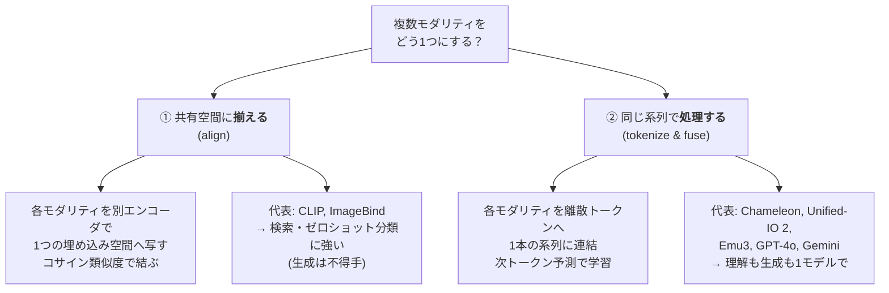

# 任意モダリティの統合 — any-to-any と omni モデル

:::abstract[学習目標]
この章を読み終えると、次のことができるようになります。

- **any-to-any** と **omni モデル** が何を指し、何を「1つにまとめる」のかを **説明** できる
- 統合の2大機構 —— **共有埋め込み空間に揃える**（ImageBind）と **統一トークン化で同じ系列を処理する**（Chameleon/Unified-IO/Emu3）—— を **対比** できる
- **統一トークン化 → 単一系列の次トークン予測** という early-fusion 学習を、損失の式まで **導出** できる
- **統合（単一モデル）** と **モジュラー（接続）** の違いを、誤解を避けて **切り分け** られる
- 音声章08の「単一モデルで複数ストリーム」が、この統合の **音声版** であると **位置づけ** られる
:::

## 前提知識

- 章01 [対照学習と CLIP](/multimodal/01-contrastive-clip/)：画像とテキストを **共有埋め込み空間** に写し、コサイン類似度で結ぶ仕組み（この章の「揃える」アプローチの出発点）
- 音声章03 [ニューラル音声コーデック](/audio/03-neural-audio-codecs/)：波形を **離散トークン列** に変える（VQ / RVQ）。「音声をトークン化する」道具立てがそのまま効きます
- 音声章08 [音声テキスト統合・全二重 streaming](/audio/08-unified-streaming-tts/)：テキスト＋音声を **単一の自己回帰モデル** で同時生成する。本章の統合を「音声で先取りした例」として参照します
- LLM の基礎 [トークン化](/llm/01-language-model-and-tokenization/) と [自己回帰デコード](/llm/03-transformer/)：次トークン予測・統一語彙・teacher forcing

LLM 出身の読者には、本章の核心がほぼそのまま橋渡しになります。「**全モダリティを1つの語彙に詰め込み、1本の系列にして次トークン予測する**」—— これは LLM の学習ループを、テキスト以外にも広げただけだからです。

## 直感

これまでの章では、**モダリティを1つずつ** 結んできました。章01で画像とテキストを対照学習で揃え、続く章で画像→言語の理解、音声→言語へと進みました。

この章で問うのは、もっと欲張った問いです。**「画像も音声もテキストも動画も、たった1つのモデルで読んで、たった1つのモデルで作れないか」**。これが **any-to-any**（任意の入力モダリティ → 任意の出力モダリティ）であり、それをリアルタイムに製品化したのが **omni モデル**（GPT-4o, Gemini, Qwen2.5-Omni）です。

なぜ「1つに」したいのか。理由は3つあります。

- **モダリティ間の知識を共有したい**：「犬」という概念は、犬の画像・"dog" という単語・吠え声の3つに共通します。別々のモデルだと、この共通性を学び直しになります。1モデルなら一度で済みます。
- **任意の組み合わせを扱いたい**：「この画像について音声で答えて」「この音を聞いて絵を描いて」のような、入出力モダリティの自由な組み合わせは、別々のモデルの寄せ集めでは破綻します。
- **継ぎ目をなくしたい**：別モデルを繋ぐと、変換のたびに情報が落ち、遅延が積み上がります。1モデルなら継ぎ目がありません。

ここで大事なのは、**「1つにする」には根本的に違う2つのやり方がある** ことです。それを次の全体像で先に一望します。

## 全体像

統合には大きく **2つの機構** があります。どちらも「複数モダリティを同じ土俵に乗せる」のですが、**乗せ方が決定的に違います**。



この2つを混同すると、論文を読んでも頭が整理されません。早めに違いを刻んでおきます。

| 観点 | ① 揃える（align） | ② 同じ系列で処理（tokenize & fuse） |
| --- | --- | --- |
| 何を共有する | **埋め込み空間**（1点1ベクトル） | **語彙と系列**（離散トークン列） |
| モダリティの結び方 | コサイン類似度（近い＝同じ意味） | 同じ Transformer で文脈として混ぜる |
| 主な用途 | **検索・分類・整列**（理解の入口） | **理解 + 生成**（読むことも作ることも） |
| 生成 | 苦手（点で表すので出力できない） | 得意（次トークンを出せば生成になる） |
| 代表 | CLIP（章01）, ImageBind | Chameleon, Unified-IO 2, Emu3, omni |
| この章での扱い | 前半（共有空間） | 後半（統一トークン化・主役） |

:::warning[「揃える」と「同じ系列で処理する」は別物（最重要の取り違え）]
両方とも「マルチモーダルを1つにする」と言うので混同されますが、**やっていることが違います**。

- **揃える（CLIP/ImageBind）**：画像を1つのベクトル、テキストを1つのベクトルにして、**2点が近いか** を測ります。中身はそのまま取り出せません。だから **検索や分類はできても、画像や音声を新しく生成することはできません**。
- **同じ系列で処理する（Chameleon/omni）**：画像も音声もテキストも **トークンの列** にして、**1本の系列** として Transformer に流します。次のトークンを予測できるので、**そのまま生成** になります。

「共有空間に揃える」＝点の整列、「同じ系列で処理する」＝列の混合。**整列は理解の入口、混合は生成まで届く** —— この一線を最後まで保ってください。
:::

:::note[LLM ↔ Multimodal]
②は LLM をそのまま拡張したものです。LLM は「テキストトークンを1本の系列にして次トークン予測」しました。omni は「**画像・音声・テキストのトークンを混ぜて1本の系列にして次トークン予測**」するだけ。学習ループも損失も LLM と同型です。違いは「語彙が複数モダリティ分に広がった」点だけ、と掴むと一気に楽になります。
:::

順方向（理解）と逆方向（生成）が同じモデルの中で表裏になっているのが②の妙です。入力側にどのモダリティを置き、出力側にどのモダリティを置くかを変えるだけで、理解にも生成にもなります。以降は、まず①の共有空間（ImageBind）を短く押さえ、次に②の統一トークン化を主役として掘り、最後に omni とモジュラー設計との違いを切り分けます。

## 理論

### ① 共有埋め込み空間：画像をハブに多モダリティを束ねる（ImageBind）

章01の CLIP は **画像とテキスト** の2つを共有空間に揃えました。**ImageBind**（Meta, 2023）はこれを **6モダリティ**（画像・テキスト・音声・深度・熱・IMU）に広げます。鍵となる発想は1つです。

**「画像をハブ（中心）にすれば、全ペアのデータは要らない」**。

CLIP 流に全モダリティ対を揃えるなら、$M$ モダリティで $\binom{M}{2}$ 通りのペアデータが必要です。6モダリティなら15通り。音声↔深度や熱↔IMU のペアデータは、現実にはほとんど存在しません。ImageBind はこれを回避します。

- **画像と各モダリティのペアだけ** で対照学習する（画像-音声、画像-深度、…）。これらは Web に大量にあります。
- 全モダリティを **同じ画像空間に向けて揃える** ので、結果として **画像を経由して間接的に** 全モダリティが1つの空間に乗ります。
- すると、**直接ペア学習していないモダリティ間**（例：音声↔深度）でも整列が **創発（emerge）** します。「同じ画像に揃えた者同士は、互いにも近い」からです。

:::note[なぜ「ハブ」で創発するのか（直感）]
3人 A, B, C が「同じ1点 P を指す」よう訓練されたとします。A も B も P の近くを指すなら、A と B は互いにも近い —— P を介して間接的に整列します。ImageBind の P が「画像」です。だから音声と深度を直接ペアにしなくても、両方が画像に揃っていれば互いに近くなります。
:::

学習の損失は CLIP と同じ **InfoNCE 対照損失** で、画像 $I$ と任意モダリティ $M$ の表現を揃えます。

$$
\mathcal{L}_{I,M} = -\frac{1}{N}\sum_{i=1}^{N} \log \frac{\exp(\mathbf{q}_i^\top \mathbf{k}_i / \tau)}{\sum_{j=1}^{N}\exp(\mathbf{q}_i^\top \mathbf{k}_j / \tau)}
$$

各記号の定義（章01の CLIP 損失と同じ形）：

- $\mathbf{q}_i$：$i$ 番目のサンプルの **画像** 表現（L2 正規化済み）。$N$ 個（バッチ内）。
- $\mathbf{k}_i$：同じサンプルの **モダリティ $M$**（音声・深度など）の表現（L2 正規化済み）。$\mathbf{q}_i$ と **同じ意味のペア**。
- $\mathbf{q}_i^\top \mathbf{k}_j$：画像 $i$ とモダリティ $j$ のコサイン類似度（正規化済みなので内積＝コサイン）。
- $\tau$：温度（temperature）。分布の鋭さを決める固定または学習スカラ。小さいほど「正解ペアだけ突出」させる。
- 分子＝正しいペア $(i,i)$ の類似度、分母＝バッチ内の **全モダリティ候補** との類似度の和。**正解を相対的に押し上げる**。

この $\mathcal{L}_{I,M}$ を各モダリティ $M$ について足し合わせて学習します。**動作のタイミング**を分けて押さえます。

| 時点 | 何が起きるか |
| --- | --- |
| **学習時** | 画像-$M$ ペアごとにバッチ内で対照損失を計算。各モダリティのエンコーダを、画像空間へ向けて更新。 |
| **推論時（検索）** | クエリ（任意モダリティ）を写像 → 候補集合との **コサイン類似度** を計算 → 上位を返す。再学習なし。 |
| **推論時（合成）** | 複数モダリティの埋め込みを **足す**（embedding arithmetic）と意味が合成される（例：鳥の画像 + 波の音 → 海辺の鳥）。 |

:::warning[共有空間は「生成」できない]
ImageBind ができるのは **検索・分類・整列・埋め込み合成** までです。「音声から画像を生成」と紹介されることがありますが、それは ImageBind 自身が画像を描くのではなく、**ImageBind の埋め込みを条件にして別の生成器（拡散モデル）が描く** のです。共有空間は「意味の地図」であって「絵筆」ではありません。生成まで1モデルでやるのが、次の②です。
:::

### ② 統一トークン化：全モダリティを1本の系列にする（early-fusion）

ここからが本章の主役です。考え方は驚くほど単純です。

1. **各モダリティを離散トークンに量子化する**（tokenize）。テキストは BPE、画像は VQ コードブック（VQ-GAN 等）、音声は neural codec（音声章03の RVQ）。
2. **全モダリティのトークンを1つの「統一語彙」に詰め込む**（unified vocabulary）。
3. **モダリティタグを挟みながら1本の系列に連結し**、ただの **次トークン予測** で学習する。

これが **統一トークン化（unified tokenization）** と **early-fusion（初期融合）** です。最初から混ぜて1つの系列にするので「early」です。

#### 統一語彙の作り方（記号を全部定義する）

統一語彙 $\mathcal{V}$ は、各モダリティの語彙を **重ならないようにオフセットして連結** したものです。

- $\mathcal{V}_{\text{special}}$：特殊トークン（`<bos>`, `<eos>`, 各モダリティの開始マーカ `<bom_text>` 等）。
- $\mathcal{V}_{\text{text}}$：テキストトークン（語彙サイズ $V_t$）。ID は $[0, V_t)$ をオフセットして配置。
- $\mathcal{V}_{\text{image}}$：画像コードブックのインデックス（$V_i$ 個）。テキストの **後ろ** にオフセット配置。
- $\mathcal{V}_{\text{audio}}$：音声コードブックのインデックス（$V_a$ 個）。さらに後ろに配置。
- 統一語彙サイズ $V = |\mathcal{V}_{\text{special}}| + V_t + V_i + V_a$。

「オフセットして連結」が肝です。画像のコード `3` と音声のコード `3` は、統一語彙では **別の ID** になります（例：画像 `3` → 統一 ID `11`、音声 `3` → 統一 ID `14`）。こうしないとモデルが両者を混同します。

#### モダリティタグ（begin-of-modality マーカ）の役割

連結するとき、**各モダリティの切れ目に開始マーカ** を挟みます。

`<bos> <bom_text> the cat sat <bom_image> i2 i0 i3 i1 <bom_audio> a1 a2 <eos>`

このマーカが効く理由を、誰が・いつ・何のために使うかで押さえます。

- **誰が見るか**：モデル（Transformer）が、系列の各位置でこのマーカを文脈として読みます。
- **何のために**：マーカ以降のトークンが「どのモダリティの語彙から来たか」を知らせます。`<bom_image>` の直後は画像コードブックのトークンが来る、という **構文** をモデルに教えます。
- **いつ生成するか**：生成時、モデルが `<bom_image>` を出力したら「次から画像を描き始める」という宣言になります。**出力モダリティの切り替えがマーカで制御** されます。

:::note[LLM ↔ Multimodal]
モダリティタグは LLM の `<|system|>` / `<|user|>` のような **特殊トークンによる区間制御** と同じ発想です。LLM が役割を特殊トークンで切り替えるように、omni はモダリティを特殊トークンで切り替えます。あなたが知っているチャットテンプレートの仕組みが、ほぼそのまま転用されています。
:::

#### 学習目標：たった1つの次トークン予測損失

連結した統一系列を $z_1, z_2, \dots, z_L$（各 $z_t \in \mathcal{V}$ は統一語彙の ID）とします。学習目標は、モダリティをまたいでも **完全に一様な次トークン予測** です。

$$
\mathcal{L}_{\text{AR}} = -\sum_{t=1}^{L} \log p_\theta(z_t \mid z_{<t})
$$

- $z_t$：系列の $t$ 番目のトークン（テキストでも画像でも音声でも区別なし）。
- $z_{<t}$：それ以前の全トークン（モダリティ混在の文脈）。
- $p_\theta$：単一の Transformer が出す **統一語彙上の** 確率分布（softmax over $V$）。
- **モダリティ別の損失も、モダリティ別のヘッドも無い**。1つの語彙、1つの損失、1つのモデル。

これが Chameleon・Emu3・Unified-IO 2 の核心です。**"Next-token prediction is all you need"**（Emu3）という主張は、「画像生成すら、専用の拡散モデルを使わず、この1式だけで学べる」という意味です。

:::warning[学習時と推論時で「次トークンの出どころ」が変わる]
LLM と同じ **teacher forcing / exposure bias** がここでも効きます。

- **学習時**：次トークンの正解は **データ（正解系列）から** 与えられます（teacher forcing）。画像トークンも音声トークンも、正解列を見ながら1ステップずつ予測します。
- **推論（生成）時**：次トークンは **自分が前ステップで出した出力** を入力に戻して、自己回帰的に1つずつ生成します。`<bom_image>` を出したら、以降は自分が出した画像トークンを条件に次の画像トークンを出し続けます。

学習では「正しい列」を見られたのに、本番では「自分の出力」しか無い —— この差（exposure bias）はマルチモーダルでも誤差蓄積を生みます。画像生成では特に、序盤のトークン誤りが画像全体を崩しやすいので、サンプリング戦略が重要になります。
:::

### 二大アプローチの競合：純自己回帰 vs 自己回帰×拡散ハイブリッド

②の中でも、**画像をどう扱うか** で2系統が競合しています。ここは2024–26の最前線なので、対比で押さえます。

| 系統 | 画像の扱い | 学習目標 | 代表 |
| --- | --- | --- | --- |
| **純自己回帰** | 画像を**離散トークンに量子化** | $\mathcal{L}_{\text{AR}}$（次トークン予測のみ） | Chameleon, Emu3, Unified-IO 2, Janus |
| **自己回帰×拡散** | 画像は**連続のまま**（量子化しない） | $\mathcal{L} = \mathcal{L}_{\text{LM}} + \lambda\,\mathcal{L}_{\text{DDPM}}$ | Transfusion |

**Transfusion**（Meta, 2024）は、テキストは次トークン予測（言語モデリング損失 $\mathcal{L}_{\text{LM}}$）、画像は拡散（denoising 損失 $\mathcal{L}_{\text{DDPM}}$）を、**同一の Transformer 上で混合系列に対して同時に最適化** します。

$$
\mathcal{L} = \mathcal{L}_{\text{LM}} + \lambda \, \mathcal{L}_{\text{DDPM}}
$$

- $\mathcal{L}_{\text{LM}} = -\sum_t \log p_\theta(z_t \mid z_{<t})$：テキスト部の次トークン予測（離散）。
- $\mathcal{L}_{\text{DDPM}} = \mathbb{E}_{x_0,\epsilon,t}\big[\|\epsilon - \epsilon_\theta(x_t, t, c)\|^2\big]$：画像部のノイズ予測（連続）。$c$ はテキスト等の条件。
- $\lambda$：2損失のバランス重み。

**なぜ量子化しないのか**。画像を離散トークンに潰すと情報が落ち、コードブックの表現力で品質が頭打ちになります。連続のまま拡散で扱う方が **良くスケールする** と報告されています（同規模で専用拡散モデル・LLM に匹敵）。Janus/Janus-Pro（DeepSeek）は別の解として、**視覚エンコーディングを理解用と生成用に分離** しつつ単一 Transformer で処理し、「理解と生成で視覚特徴に求める性質が衝突する」問題を緩和します。

:::note[Janus の「分離」と Transfusion の「融合」は対照的]
- **Transfusion**：1つの Transformer に離散テキストと連続画像を **融合**（損失を足す）。
- **Janus**：視覚の **入力経路を理解用/生成用に分離**（役割衝突の回避）しつつ処理は統一。

どちらも「理解と生成を1モデルで」を目指しますが、ぶつかる課題（情報損失 vs 役割衝突）への異なる処方箋です。
:::

### omni モデル：ネイティブ・リアルタイムの any-to-any

**omni モデル** は、②の統合をネイティブに（最初から混合モダリティで学習）かつ **リアルタイム** に実現したものです。

- **GPT-4o**（OpenAI, 2024–25）：テキスト・音声・画像・動画を入力し、テキスト・音声・画像を出力。音声を別モデルに頼らずネイティブに扱い、約 **232 ms** で応答（人間の会話遅延に近い）。2025年にネイティブ自己回帰画像生成を統合。
- **Gemini**（Google, 2024–）：設計段階からマルチモーダル。数百万〜1000万トークンの **超長文脈** で複数文書・長尺動画・音声を横断推論。後継系で会話的画像生成・編集（Nano Banana）。
- **Qwen2.5-Omni**（Alibaba, 2025）：オープンソースの代表。**Thinker-Talker** 構成（Thinker＝理解・テキスト生成、Talker＝高次表現から音声トークンを流暢に生成）で **ストリーミング音声出力**。動画と音声の時刻同期に **TMRoPE**（Time-aligned Multimodal RoPE）を導入。

#### 音声章08との接続：これは「統合の音声版」だった

ここで前提に挙げた音声章08を回収します。音声章08で学んだ **「テキスト＋音声を単一の自己回帰モデルで時間整合的に同時生成する」** 全二重 streaming は、**まさに本章②の統合を、テキストと音声の2モダリティに限定して先取りした例** です。

| 音声章08（2モダリティの統合） | 本章（多モダリティの統合） |
| --- | --- |
| テキストトークン + 音声トークンを1モデルで | + 画像・動画・深度… を1モデルで |
| 音声を codec（章03）で離散化 | 各モダリティを各々のトークナイザで離散化 |
| Inner Monologue（テキストを内部に流す） | モダリティタグで系列を構造化 |
| Delayed Streams Modeling（遅延設計で TTS/ASR/翻訳統一） | 入出力モダリティの配置で理解/生成を切り替え |
| RQ-Transformer（時間×段の2次元） | 統一系列の next-token（時間1次元に畳む） |

Qwen2.5-Omni の Thinker-Talker は、音声章08の「単一モデルで複数ストリーム」をそのまま多モダリティに一般化したもの、と見ると地続きに理解できます。**「omni は音声統合の自然な拡張」** という位置づけが、ここで腑に落ちます。

## 数式の導出：統一トークン化が「next-token 1式」に畳まれること

①と②を、**確率モデルとして** 並べて導きます。ゴールは「②がなぜ理解も生成も1式でこなせるか」を式から示すことです。

**① 共有空間（揃える）の目的関数。** モダリティ $A$ のサンプル $a$ とモダリティ $B$ のサンプル $b$ を、エンコーダ $f_A, f_B$ で写し、コサイン類似度で結びます。

$$
\mathrm{sim}(a,b) = \frac{f_A(a)^\top f_B(b)}{\|f_A(a)\|\,\|f_B(b)\|}
$$

これは **2点間の関係**（近いか遠いか）しか表しません。$f_A(a)$ から $a$ を復元する経路が無いので、**生成は定義できません**。①は「意味の地図」止まりです。

**② 統一系列（同じ系列で処理）の目的関数。** まず各モダリティを離散トークン化する写像を置きます。

$$
\text{tokenize}_m : (\text{modality } m \text{ の生データ}) \longrightarrow (z^{(m)}_1, \dots, z^{(m)}_{n_m}), \quad z^{(m)}_i \in \mathcal{V}_m
$$

- $m \in \{\text{text}, \text{image}, \text{audio}, \dots\}$：モダリティ。
- $\mathcal{V}_m$：モダリティ $m$ の語彙。これを統一語彙 $\mathcal{V} = \bigsqcup_m \mathcal{V}_m$（互いに素な和＝オフセット連結）に埋め込む。

次に、複数モダリティのトークン列を **モダリティタグ $\langle\text{bom}_m\rangle$ を挟んで連結** し、1本の系列にします。

$$
z = \big(\langle\text{bos}\rangle,\ \langle\text{bom}_{m_1}\rangle,\ z^{(m_1)}_{1:n_{m_1}},\ \langle\text{bom}_{m_2}\rangle,\ z^{(m_2)}_{1:n_{m_2}},\ \dots,\ \langle\text{eos}\rangle\big)
$$

この系列の **同時確率** を、自己回帰の連鎖律で分解します。

$$
p_\theta(z) = \prod_{t=1}^{L} p_\theta(z_t \mid z_{<t})
$$

ここが核心です。**$z_t$ がどのモダリティのトークンであっても、項の形は同じ** $p_\theta(z_t \mid z_{<t})$ です。だから対数尤度最大化は、モダリティに依らず1つの損失に畳まれます。

$$
\mathcal{L}_{\text{AR}} = -\log p_\theta(z) = -\sum_{t=1}^{L} \log p_\theta(z_t \mid z_{<t})
$$

**この1式が理解と生成を同時に表す** ことを確認します。系列を入力部 $z_{\le k}$（条件）と出力部 $z_{>k}$（生成対象）に分けると、

$$
p_\theta(z_{>k} \mid z_{\le k}) = \prod_{t=k+1}^{L} p_\theta(z_t \mid z_{<t})
$$

- **理解**（例：画像→テキスト）：$z_{\le k}$ に画像トークン、$z_{>k}$ にテキストトークンを置けば、これは「画像を条件にテキストを生成」＝VQA・キャプション。
- **生成**（例：テキスト→画像）：$z_{\le k}$ にテキスト、$z_{>k}$ に画像トークンを置けば、「テキストを条件に画像を生成」＝text-to-image。
- **any-to-any**：入力部・出力部に置くモダリティを自由に組み替えるだけ。**モデルも損失も変えない**。

つまり「入出力モダリティの配置」という1つのつまみだけで、理解・生成・任意変換が連続的につながります。これが統一トークン化の威力です $\blacksquare$

:::note[なぜ「同じ系列」だと生成までできるのか（①との決定的差）]
①は $a \mapsto f_A(a)$（1点へ潰す）方向しか持たないので、逆（点→データ）が無く生成できません。②は各トークンが語彙上の **離散シンボル** なので、$p_\theta(z_t \mid z_{<t})$ から **次のシンボルをサンプリングして並べれば、それがそのまま生成物** になります。「点に潰す」か「列として並べる」かが、生成可否を分ける数学的な分岐点です。
:::

## 実装

②の核心 —— **複数モダリティのトークン列を、モダリティタグ付きで1本の系列に連結し、単一の次トークン予測として扱う** —— を numpy だけで最小実装します。実際に走らせた実測出力を併記します。

```python title="omni_toy.py"
import numpy as np

# --- 1. 統一語彙 (unified vocabulary) を組み立てる ---
# 各モダリティは別トークナイザを持つが、最終的に
# 「ずらしたオフセット」で 1 つの語彙テーブルに詰め込む。
SPECIAL = ["<bos>", "<eos>", "<bom_text>", "<bom_image>", "<bom_audio>"]
TEXT_VOCAB  = ["the", "cat", "sat"]      # テキスト・トークン (語彙 3)
IMAGE_VOCAB = ["i0", "i1", "i2", "i3"]    # 画像コードブック (語彙 4)
AUDIO_VOCAB = ["a0", "a1", "a2"]          # 音声コードブック (語彙 3)

# 統一語彙: 特殊 → text → image → audio の順にオフセットして連結
vocab = SPECIAL + TEXT_VOCAB + IMAGE_VOCAB + AUDIO_VOCAB
tok2id = {t: i for i, t in enumerate(vocab)}
id2tok = {i: t for t, i in tok2id.items()}
V = len(vocab)
BOM = {"text": "<bom_text>", "image": "<bom_image>", "audio": "<bom_audio>"}

print(f"統一語彙サイズ V = {V}")
print(f"オフセット: text={tok2id['the']}.., image={tok2id['i0']}.., audio={tok2id['a0']}..")

# --- 2. 各モダリティのトークン列 (別々のトークナイザ出力) ---
streams = [
    ("text",  ["the", "cat", "sat"]),
    ("image", ["i2", "i0", "i3", "i1"]),
    ("audio", ["a1", "a2"]),
]

# --- 3. モダリティタグ付きで 1 本の系列に連結する ---
def build_sequence(streams):
    seq, seg = ["<bos>"], ["<bos>"]      # seg = 各位置のモダリティ記録
    for modality, toks in streams:
        seq.append(BOM[modality]); seg.append(modality)   # 開始マーカ
        for t in toks:
            seq.append(t); seg.append(modality)
    seq.append("<eos>"); seg.append("<eos>")
    return seq, seg

seq, seg = build_sequence(streams)
ids = np.array([tok2id[t] for t in seq], dtype=np.int64)

# --- 4. 次トークン予測ペア (teacher forcing): 1 本の系列をずらすだけ ---
inp, tgt = ids[:-1], ids[1:]

# --- 5. ごく小さな AR モデルの 1 ステップを実測 (ランダム重み) ---
rng = np.random.default_rng(0)
d = 8
E  = rng.standard_normal((V, d)) * 0.1   # 統一埋め込み (全モダリティ共有)
Wo = rng.standard_normal((d, V)) * 0.1   # 出力射影 (統一語彙へ)

def softmax(z):
    z = z - z.max(axis=-1, keepdims=True)
    e = np.exp(z); return e / e.sum(axis=-1, keepdims=True)

# 因果マスク付き平均プーリングで超簡易に文脈を作る (attention の代用)
h = E[inp]; L = len(inp)
ctx = np.stack([h[: t + 1].mean(axis=0) for t in range(L)])  # 過去のみ参照
probs = softmax(ctx @ Wo)
ce = -np.log(probs[np.arange(L), tgt] + 1e-9).mean()
print(f"\n統一系列の平均 CE 損失 (未学習) = {ce:.4f}  / 基準 log(V) = {np.log(V):.4f}")

# --- 6. 1 目的なのにモダリティ別に損失を分解して観察 ---
seg_in = seg[:-1]
for m in ["text", "image", "audio"]:
    mask = np.array([s == m for s in seg_in])
    ce_m = -np.log(probs[np.arange(L)[mask], tgt[mask]] + 1e-9).mean()
    print(f"  {m:<6} 区間の CE = {ce_m:.4f}  (位置数 {mask.sum()})")
```

```text title="出力"
統一語彙サイズ V = 15
オフセット: text=5.., image=8.., audio=12..

統一系列の平均 CE 損失 (未学習) = 2.7106  / 基準 log(V) = 2.7081
  text   区間の CE = 2.7109  (位置数 4)
  image  区間の CE = 2.7100  (位置数 5)
  audio  区間の CE = 2.7053  (位置数 3)
```

読み取れること：

- **統一語彙のオフセット**：画像 `i0` は ID 8、音声 `a0` は ID 12 から始まる。同じインデックス `0` でもモダリティが違えば別 ID になり、混同しない。
- **損失は1つ**：text・image・audio が混じった1本の系列に対し、**たった1つの次トークン予測損失** を計算している。モダリティ別ヘッドは無い。
- **未学習なので基準値付近**：CE ≈ 2.71 は一様分布の基準 $\log V$ ≈ 2.71 とほぼ一致（ランダム重みなので当然）。学習を回せば各区間が下がる。
- **分解は観察のためだけ**：モダリティ別 CE は事後に切り出しただけで、**学習目的は単一**。これが early-fusion の「1モデル・1損失」の姿。

次に、対比として①の **共有埋め込み空間（ImageBind 流）** を最小実装します。「画像をハブに揃えると、直接学習していないペアの整列が創発する」ことを実測で確かめます。

```python title="sharedspace_toy.py"
import numpy as np

rng = np.random.default_rng(1)
d, N = 16, 6  # N 個の「概念」(同じ意味の image/text/audio の三つ組)

def norm(x):
    return x / (np.linalg.norm(x, axis=-1, keepdims=True) + 1e-9)

def random_rotation(d):       # 各モダリティ固有の座標系 (ランダム直交行列)
    Q, _ = np.linalg.qr(rng.standard_normal((d, d))); return Q

concept = norm(rng.standard_normal((N, d)))   # 真の意味 (本来は未知)
Ri, Rt, Ra = random_rotation(d), random_rotation(d), random_rotation(d)
# 各モダリティは「概念」を別々の座標系で観測 → 生では整列していない
img = norm(concept @ Ri + 0.05 * rng.standard_normal((N, d)))
txt = norm(concept @ Rt + 0.05 * rng.standard_normal((N, d)))
aud = norm(concept @ Ra + 0.05 * rng.standard_normal((N, d)))

# 画像をハブに「揃える」: 各モダリティ→画像 の写像を最小二乗で学習
W_txt, *_ = np.linalg.lstsq(txt, img, rcond=None)   # img-text ペアのみ
W_aud, *_ = np.linalg.lstsq(aud, img, rcond=None)   # img-audio ペアのみ
# ※ text<->audio のペアは一度も使っていない (ここが肝)
txt_h, aud_h = norm(txt @ W_txt), norm(aud @ W_aud)

S = txt_h @ aud_h.T          # 写像後の text<->audio 類似度行列
print("text<->audio 類似度 (画像ハブ経由・直接学習なし):")
for i in range(N):
    print("  " + "  ".join(f"{S[i,j]:+.2f}" for j in range(N)))
print(f"対角が最大の割合 (検索 R@1) = {(S.argmax(1) == np.arange(N)).mean():.2f}")

S0 = txt @ aud.T             # 写像しない生の埋め込み (座標系が違う)
print(f"写像前 (生) の R@1 = {(S0.argmax(1) == np.arange(N)).mean():.2f}")
```

```text title="出力"
text<->audio 類似度 (画像ハブ経由・直接学習なし):
  +1.00  -0.43  -0.20  +0.14  -0.37  +0.11
  -0.43  +1.00  +0.20  -0.27  +0.10  +0.15
  -0.20  +0.20  +1.00  +0.22  +0.03  -0.22
  +0.14  -0.27  +0.22  +1.00  -0.23  +0.17
  -0.37  +0.10  +0.03  -0.23  +1.00  -0.17
  +0.11  +0.15  -0.22  +0.17  -0.17  +1.00
対角が最大の割合 (検索 R@1) = 1.00

写像前 (生) の R@1 = 0.50
```

読み取れること：

- **創発的整列**：text と audio は **直接ペア学習していない**（両方を画像にだけ揃えた）のに、写像後の類似度行列は **対角が最大**（R@1 = 1.00）。「同じ画像に揃えた者同士は互いにも近い」という ImageBind の主張が、ハブ経由で実際に成立している。
- **生では揃わない**：写像前の生の埋め込みは座標系が違うので R@1 = 0.50（半分は外れ）。画像ハブへの整列が、その隔たりを埋めている。
- **しかし生成はしていない**：ここで得たのは「近さ」だけ。①は検索・整列まで。生成まで1モデルでやりたいなら②（統一トークン化）が要る、という前節の主張が実装でも裏付けられる。

## 演習

::::question[演習 1: 統一語彙のオフセットと衝突]
3つのモダリティを統合します。特殊トークンが4個、テキスト語彙が $V_t = 100$、画像コードブックが $V_i = 1024$、音声コードブックが $V_a = 512$ です。「特殊 → text → image → audio」の順にオフセット連結するとき、(a) 統一語彙サイズ $V$ はいくつですか。(b) 画像コードブックのインデックス `0` は、統一語彙では ID いくつになりますか。(c) もしオフセットせず、各モダリティのインデックスをそのまま使うと何が起きますか。

:::details[解答]
(a) $V = 4 + 100 + 1024 + 512 = \mathbf{1640}$。
(b) 特殊(4) + text(100) を先に置くので、画像は ID `104` から始まります。画像インデックス `0` → 統一 ID **`104`**。（画像 `1` → `105`、…、画像 `1023` → `1127`。続いて音声が `1128` から。）
(c) オフセットしないと、画像インデックス `0`・音声インデックス `0`・テキスト ID `0` が **すべて同じ ID `0`** に潰れます。モデルは「画像の `0`」と「音声の `0`」を **同じトークンとして混同** し、どのモダリティを生成しているか分からなくなります。だから互いに素な語彙へオフセット連結する（$\mathcal{V} = \bigsqcup_m \mathcal{V}_m$）のが必須です。
:::
::::

::::question[演習 2: 「揃える」と「同じ系列で処理する」の使い分け]
次の3タスクを、①共有埋め込み空間（ImageBind 流）と ②統一トークン化（Chameleon/omni 流）のどちらで解くべきか、理由とともに答えてください。(a)「この音に最も似た画像をデータベースから検索する」。(b)「この風景写真に合うBGMを新しく作曲する」。(c)「この画像を見て音声で説明を読み上げる」。

:::details[解答]
(a) **①共有空間**。求めているのは「近さ」だけ（既存の候補から最も似たものを返す）。新しいデータを作る必要がないので、コサイン類似度で検索できる共有空間が最適。生成器は不要。
(b) **②統一トークン化**。「新しく作曲する」＝音声トークンを **生成** する必要がある。①は点に潰すので生成できない。音声を codec トークン化し、画像を条件に音声トークンを next-token 予測する②が要る。
(c) **②統一トークン化**。「画像→音声の説明」は入力モダリティ（画像）から別モダリティ（音声）を **生成** する any-to-any 変換。入力部に画像トークン、出力部に音声トークンを置き、$p_\theta(z_{>k}\mid z_{\le k})$ で生成する。これはまさに omni モデルがやること。

要点：**検索・分類・整列なら①、生成を含むなら②**。「揃える＝点の整列（理解の入口）」「同じ系列で処理＝列の混合（生成まで）」の一線がそのまま判断基準になります。
:::
::::

## まとめ

:::success[この章の要点]
- **any-to-any**＝任意の入力モダリティ→任意の出力モダリティ、**omni モデル**＝それをネイティブ・リアルタイムに1モデルで実現したもの（GPT-4o, Gemini, Qwen2.5-Omni）。
- 統合には2大機構がある。**①共有空間に揃える**（CLIP/ImageBind）は点の整列で **検索・分類** に強いが生成は不得手。**②統一トークン化で同じ系列を処理する**（Chameleon/Unified-IO 2/Emu3/omni）は列の混合で **理解も生成も** 1モデルでこなす。
- ②の核心は「全モダリティを離散トークン化 → 統一語彙へオフセット連結 → モダリティタグを挟んで1本の系列に → **たった1つの次トークン予測** $\mathcal{L}_{\text{AR}}=-\sum_t \log p_\theta(z_t\mid z_{<t})$ で学習」。入出力モダリティの配置を変えるだけで理解・生成・任意変換が連続的につながる。
- ②内でも **純自己回帰**（画像も量子化：Emu3/Chameleon）と **自己回帰×拡散ハイブリッド**（画像は連続：Transfusion）が競合。後者は量子化型より良くスケールすると報告。
- 音声章08の「単一モデルで複数ストリーム」は、この統合を **テキスト＋音声に限定して先取りした音声版**。Qwen2.5-Omni の Thinker-Talker はその多モダリティ一般化。
:::

### 次に学ぶこと

ここまでで、マルチモーダル統合の **2つの機構**（揃える／同じ系列で処理する）と、any-to-any・omni の設計原理が手に入りました。次章では、CLIP の対照学習から omni までの **マルチモーダル全体の景観** を俯瞰し、理解と生成の統一・モジュラーとネイティブの移り変わり・幻覚抑制アライメントといった、本モダリティの大きな流れを1枚に束ねます。

→ [マルチモーダルの全体景観へ](/multimodal/05-multimodal-landscape/)

## 用語ミニ辞典

| 用語 | 一言 |
| --- | --- |
| any-to-any | 任意の入力モダリティ → 任意の出力モダリティ |
| omni モデル | テキスト・音声・画像・動画を1モデルでネイティブ入出力 |
| 共有埋め込み空間 | 複数モダリティを1つのベクトル空間に揃える（点の整列） |
| ImageBind | 画像をハブに6モダリティを共有空間へ。未学習ペアの整列が創発 |
| 統一トークン化 | 全モダリティを離散トークンへ写し統一語彙に詰める |
| early-fusion | 最初から混合モダリティを1本の系列にして学習 |
| モダリティタグ | 系列中で「ここから別モダリティ」を示す特殊トークン |
| 統一語彙 | 各モダリティ語彙をオフセット連結した1つの語彙 |
| 純自己回帰 | 画像も量子化して next-token のみで統合（Emu3/Chameleon） |
| 自己回帰×拡散 | 離散テキスト next-token + 連続画像拡散を1モデルで（Transfusion） |
| Thinker-Talker | 理解・テキスト生成と音声トークン生成を分担（Qwen2.5-Omni） |
| TMRoPE | 動画と音声のタイムスタンプを揃える位置符号化（Qwen2.5-Omni） |

## 次のアクション

理論を手で定着させる。**最小の写経 → 動かす → 小実験** を1セットで。

1. `omni_toy.py` を写経して `uv run --with numpy python omni_toy.py` で動かす。**統一語彙のオフセット** と **1損失** をログで確認する。
2. `streams` に4つ目のモダリティ（例：`"video"` と語彙 `["v0","v1"]`）を足し、`BOM` と統一語彙を拡張する。**新モダリティを足すのに損失式は1文字も変えない** ことを体感する。
3. `sharedspace_toy.py` でモダリティ固有の回転やノイズの大きさを変え、**写像前後の R@1** がどう変わるかを測る。「画像ハブへの整列が崩れると創発も崩れる」境界を探す。
4. 余力があれば、`omni_toy.py` の文脈を「過去平均」から **小さな因果 self-attention** に差し替え、画像区間のトークンが画像区間だけを強く参照するか（モダリティタグの効果）を観察する。

ここまでで、any-to-any/omni の **設計原理を手で確かめた** ことになります。次章でマルチモーダル全体の景観に進みます。

## 参考文献

1. R. Girdhar et al., "ImageBind: One Embedding Space To Bind Them All," *CVPR Highlight*, 2023.（画像をハブにした6モダリティ共有空間・創発的整列）
2. J. Lu et al., "Unified-IO 2: Scaling Autoregressive Multimodal Models with Vision, Language, Audio, and Action," *CVPR*, 2024.（vision/language/audio/action の統一トークン化）
3. Chameleon Team (Meta FAIR), "Chameleon: Mixed-Modal Early-Fusion Foundation Models," arXiv:2405.09818, 2024.（全モダリティ離散トークン化・early-fusion スクラッチ学習）
4. X. Wang et al., "Emu3: Next-Token Prediction is All You Need," BAAI, arXiv:2409.18869, 2024.（純自己回帰で理解と生成を統合）
5. C. Zhou et al., "Transfusion: Predict the Next Token and Diffuse Images with One Multi-Modal Model," Meta FAIR, arXiv:2408.11039, 2024.（自己回帰×拡散ハイブリッド）
6. C. Wu et al., "Janus / Janus-Pro: Decoupling Visual Encoding for Unified Multimodal Understanding and Generation," DeepSeek, arXiv:2410.13848 / 2501.17811, 2024–25.
7. OpenAI, "Hello GPT-4o," 2024（音声/視覚 omni, 約232ms）／ ネイティブ画像生成統合, 2025.
8. Gemini Team (Google DeepMind), "Gemini 1.5: Unlocking Multimodal Understanding Across Millions of Tokens of Context," arXiv:2403.05530, 2024（超長文脈ネイティブマルチモーダル）。
9. J. Xu et al., "Qwen2.5-Omni Technical Report," Alibaba, arXiv:2503.20215, 2025.（Thinker-Talker・TMRoPE・ストリーミング音声生成）
10. Z. Tang et al., "Any-to-Any Generation via Composable Diffusion (CoDi)," Microsoft, *NeurIPS*, 2023 ／ S. Wu et al., "NExT-GPT: Any-to-Any Multimodal LLM," NUS, *ICML*, 2024.

:::warning[注意]
固有名・数値（応答遅延・文脈長・arXiv 番号など）は 2025–26 時点。実装・引用前に WebSearch 等で最新版を再確認してください（CLAUDE.md 方針）。
:::
