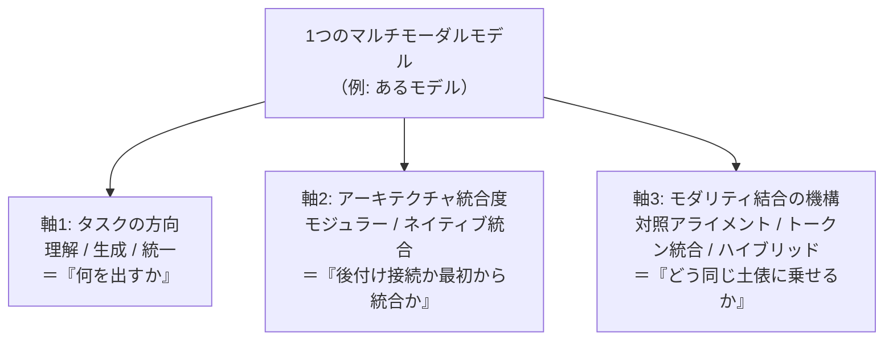
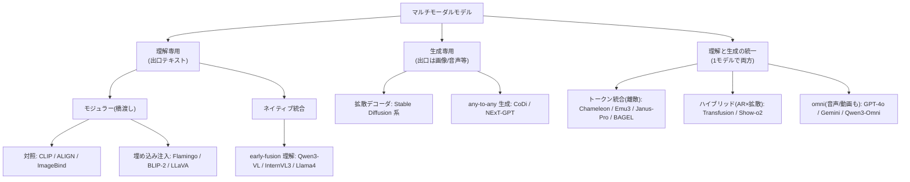
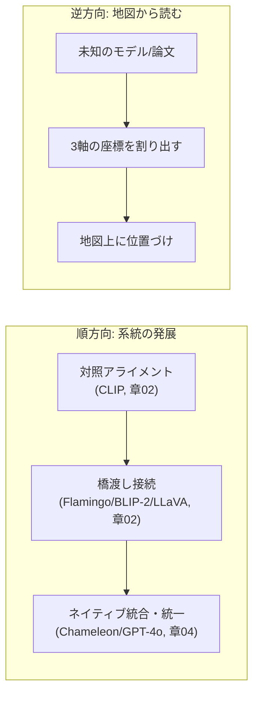
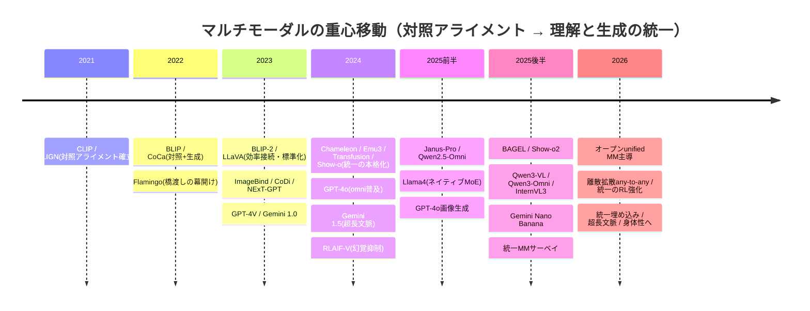

# 現代マルチモーダルの地図 — 基盤モデル・トレンド

:::abstract[学習目標]
この章を読み終えると、次のことができるようになります。

- マルチモーダルを **3つの分類軸**（理解↔生成 / 統合↔モジュラー / 対照アライメント↔トークン統合）で **分類** できる
- 任意のモデルや論文を、これらの軸の **座標** として地図上に **位置づけ** られる
- **CLIP→Flamingo→BLIP-2/LLaVA→ImageBind/Chameleon→GPT-4o/Gemini** の年表をたどり、対照アライメントから理解・生成の統一への流れを **説明** できる
- 2024–2026 の中心トレンド（**理解と生成の統一**・omni 化・any-to-any・効率化・幻覚抑制）を **論じ** られる
- 「**対照アライメントとトークン統合の違い**」「**モジュラー接続とネイティブ統合の違い**」を、データがどう流れるかのレベルで **対比** できる
:::

## 前提知識

この章はマルチモーダル各論の **総まとめ・俯瞰** です。次の2章を中心の前提にします。

- [Vision-Language モデル](/multimodal/02-vision-language-models/)：画像とテキストを共通空間に整列する **対照学習（CLIP）**、凍結エンコーダと LLM を橋渡しする **接続モジュール**（Flamingo / BLIP-2 / LLaVA）、**幻覚（hallucination）** とその抑制
- [any-to-any・omni](/multimodal/04-any-to-any-omni/)：任意のモダリティを入出力する設計、**統合トークン化**・**自己回帰×拡散ハイブリッド**・**omni モデル**

各モダリティ（[言語](/llm/) / [音声](/audio/) / [視覚](/vision/)）の基礎も土台になります。とくに言語章の [現代 LLM の地図](/llm/07-llm-landscape/)で身につけた **「分類軸で俯瞰する作法」** を、ここではモダリティ横断に拡張します。

LLM 出身の読者（このテキストの想定読者）なら、対照学習＝「埋め込みを揃える」、トークン統合＝「画像も次トークン予測」、接続モジュール＝「ソフトプロンプト注入」と読み替えられます。新しい数式は最小限で、代わりに **分類の論理** と **対比** を厚くします。

## 直感

マルチモーダル各論を一通り終えると、こういう疑問が湧きます。

> 「CLIP とか Flamingo とか LLaVA とか Chameleon とか GPT-4o とか、名前は聞くけど、これらは **互いにどういう関係** なのか？ 何が同じ系統で、何が直交した別の話なのか？」

この章はその地図を描きます。鍵は、言語章と同じく **マルチモーダルは1次元に並ばない** ことです。「CLIP → GPT-4o」のような一本道ではなく、**いくつかの独立した軸** が張る空間に各モデルが点として置かれます。

たとえば「理解か生成か」と「モジュラーかネイティブか」は **直交** します。理解モデルにもモジュラー版（LLaVA）とネイティブ版（Qwen2-VL）があり、生成モデルにも両方あります。だから「CLIP 系 vs GPT-4o 系」のような素朴な対立軸では地図になりません。**軸を分けて、各軸の上に置く** —— これが俯瞰の作法です。

そして 2024–2026 の地図には、**1つの大きな地殻変動** が走っています。**「読む（理解）」と「描く（生成）」を別モデルでやる時代から、1モデルに畳む（理解と生成の統一）時代への移行** です。この一点を軸に、年表とトレンドを読み解いていきます。

:::note[この章の使い方]
これは「答えを覚える」章ではなく、**新しいモデルや論文に出会ったとき、自分で座標を割り出すための道具** を渡す章です。固有名や数値は時点に依存します（後述の注意書きを参照）。覚えるべきは **軸の構造** であって、特定モデルの順位ではありません。
:::

## 全体像

マルチモーダルを分類する **3つの主要軸** と、それらが張る空間を1枚にします。各軸は **独立（直交）** していて、1つのモデルは「各軸の上の1点」の組として位置づきます。



3軸は次のように対応づくと、頭に入りやすいです。

| 軸 | 問い | 両極（値） | 各論との接続 |
| --- | --- | --- | --- |
| タスクの方向 | 何を出すか | 理解 ↔ 生成 ↔ 統一 | 章02（理解）↔ 章04（生成） |
| アーキテクチャ統合度 | 後付けか最初からか | モジュラー ↔ ネイティブ統合 | 章02（接続）↔ 章04（early-fusion） |
| モダリティ結合の機構 | どう同じ土俵に乗せるか | 対照 ↔ トークン統合 ↔ ハイブリッド | 章02（CLIP）↔ 章04（Chameleon/Transfusion） |

代表モデルを **分類ツリー** に落とすと、3軸がどう枝分かれするかが一望できます（葉が代表モデル）。同じ「統一」でも軸3（機構）で枝が割れる点に注目してください。



:::note[分類ツリーは「主たる居場所」を示すだけ]
ツリーは各モデルを1枚の葉に置きますが、実際には複数の性質をまたぐモデルもあります（例: Janus-Pro は「視覚エンコーディングを理解用と生成用に分離」する統一系で、トークン統合の枝に置きつつハイブリッド寄りの工夫も持つ）。ツリーは **最初の当たりをつける道具** であって、最終ラベルではありません。厳密には後述の3軸座標表で各軸ごとに読みます。
:::

:::warning[「軸」を混同しない —— 直交する別の話を1本にまとめない]
よくある混乱は、**異なる軸を1本の対立に潰してしまう** ことです。名指しで否定しておきます。

- 「**理解か生成か**」と「**モジュラーかネイティブか**」は別軸です。モジュラーな理解モデル（LLaVA）も、ネイティブな統一モデル（Chameleon）も、モジュラーな生成基盤（NExT-GPT）もあります。
- 「**対照かトークン統合か**」（軸3）と「**理解か生成か**」（軸1）も別軸です。対照アライメント（CLIP）は理解寄り、トークン統合（Emu3）は理解と生成の両方を担えます。機構の選択が、出力の方向をある程度 **制約** はしますが、同一ではありません。
- 「**ネイティブ統合**」は **アーキテクチャの統合度** であって、出力の方向（理解/生成）とは独立です。ネイティブでも理解専用（Qwen2-VL）もあれば、ネイティブで理解・生成両対応（GPT-4o）もあります。

地図が描けないときは、たいてい **2つの軸を1本に潰している** のが原因です。
:::

地図の **順方向**（モデルを作る流れ）と **逆方向**（地図からモデルを読む流れ）を一望しておきます。



## 理論

ここからが本章の中心です。3つの軸を1つずつ、**動作のレベル**（誰が・いつ・何を入力に・何を出すか）まで掘ります。

### 軸1: タスクの方向 —— 理解 / 生成 / 統一

最も基本の軸は、**モデルが何を出力するか** です。

- **理解**（understanding）：マルチモーダル入力（画像・音声・動画）を **読んで、テキストで答える**。VQA・キャプション・対話。CLIP / Flamingo / BLIP-2 / LLaVA / Qwen2-VL がここ。出口はテキストです。
- **生成**（generation）：テキスト等を入力に、**他モダリティ（画像・音声・動画）を作り出す**。拡散デコーダ・CoDi がここ。出口は非テキストです。
- **理解と生成の統一**（unified understanding & generation）：**1モデルで両方**。読むことも描くこともできる。Chameleon / Emu3 / Janus / Transfusion / GPT-4o の画像生成統合がここ。2024–2026 の核心テーマです。

**なぜこの軸が最重要か。** 2024–2026 の最大の地殻変動が、まさに **理解と生成の統一** だからです。

- 2021–2023 は **理解と生成が別世界** でした。CLIP/LLaVA は読む専門、拡散モデルは描く専門。両者は別のモデル・別の研究コミュニティでした。
- 2024 以降、**1つの Transformer で読むことも描くこともこなす** モデルが台頭しました。画像も離散トークンにして「次トークン予測」で生成したり（Emu3）、テキストは自己回帰・画像は拡散を同一モデルで担ったり（Transfusion）する流れです。

:::warning[「理解」と「生成」は排他のラベルではない —— 統一が第3の値]
「このモデルは理解モデル / 生成モデル」という二択で貼ると、**統一系を取りこぼします**。Chameleon や GPT-4o は「理解モデルか生成モデルか」ではなく、**両方を1モデルで担う**（軸1の第3の値「統一」）。正しくは「このモデルは **理解専用 / 生成専用 / 統一** のどれか」と3値で読みます。理解と生成は **同一モデルが両方持ちうる能力** であって、排他的なモデル種別ではありません。
:::

:::note[LLM ↔ マルチモーダル]
言語章の [現代 LLM の地図](/llm/07-llm-landscape/)で見た「軸1: ライフサイクル段階」と同様、この軸も **3値で、排他ではない** のがポイントです。LLM の段階軸が「同じモデルが3段を通る」だったのに対し、こちらは「同じモデルが理解と生成の両方を持ちうる」。値を二択に潰さない作法は共通です。
:::

### 軸2: アーキテクチャ統合度 —— モジュラー / ネイティブ統合

2つ目は、**別々に事前学習した部品を後付けで橋渡しするか、最初から単一ネットワークで統合学習するか** の軸です。

**モジュラー（橋渡し / bridging）** は、凍結した視覚エンコーダと凍結 LLM を、**橋渡しモジュールだけ学習** してつなぎます（章02）。安価で、強い既存部品を再利用できます。接続方式はさらに3系統に分かれます。

- **(a) クロスアテンション挿入**（Flamingo）：LLM の層間にゲート付きクロスアテンションを差し込み、画像を「横から」参照させる。
- **(b) クエリベース抽出 Q-Former**（BLIP-2）：学習可能クエリで視覚特徴から少数トークンを引き出す。
- **(c) 線形/MLP 射影**（LLaVA）：画像トークンを1枚の射影で LLM の入力空間へ写す。**最も単純で、事実上の主流**。

**ネイティブ統合（early-fusion）** は、最初から **混合モダリティを単一ネットワークでスクラッチ学習** します（章04）。Chameleon / Emu3 / GPT-4o / Gemini がここ。

ここを動作レベルで歩きます。1枚の画像 $v$ とテキスト $x$ が来たとき：

- **モジュラー（LLaVA 型）**：① 凍結視覚エンコーダが $v$ を特徴に変換 → ② 射影層が LLM の埋め込み次元に写し「画像トークン」にする → ③ それをテキストトークン列の頭に並べ、**凍結 LLM** に流す。学習されるのは射影層（＋必要なら LLM の一部）だけ。
- **ネイティブ（Chameleon 型）**：① 画像を **量子化して離散トークン** に → ② テキストトークンと同じ語彙の一系列に混ぜる → ③ **最初から訓練した単一 Transformer** が次トークン予測で全部を処理。視覚エンコーダも LLM も「別部品」ではなく、最初から1つです。

:::warning[「凍結バックボーン」と「ネイティブ統合」を混同しない]
モジュラーの肝は **既存の凍結部品を再利用** することで、ネイティブの肝は **最初から1つのネットワークをスクラッチ学習** することです。

- **モジュラー**：強い CLIP エンコーダ・強い LLM を **そのまま使い**、間の橋だけ学ぶ。学習コストが小さい（BLIP-2 は Flamingo の約54分の1の学習パラメータと報告）。
- **ネイティブ**：部品の再利用をやめ、混合モダリティで一から学ぶ。学習コストは大きいが、モダリティ境界の「継ぎ目」が消え、理解・生成の統一に向く。

「凍結エンコーダを使う＝弱い、ネイティブ＝強い」ではありません。モジュラーは **効率と再利用** の設計、ネイティブは **統合度と統一** の設計で、目的が違います。発展の重心は **モジュラー → ネイティブ** へ移っていますが、用途次第で両方が現役です。
:::

| | モジュラー（橋渡し） | ネイティブ統合（early-fusion） |
| --- | --- | --- |
| 部品 | 凍結エンコーダ + 凍結 LLM + 橋 | 最初から単一ネットワーク |
| 学習するもの | 橋渡しモジュールが中心 | 全体をスクラッチ |
| 学習コスト | 小（再利用） | 大（一から） |
| 接続方式 | cross-attn / Q-Former / 射影 | 不要（最初から1系列） |
| 向く方向 | 理解寄り（出口テキスト） | 理解・生成の統一 |
| 代表 | Flamingo・BLIP-2・**LLaVA** | Chameleon・GPT-4o・Gemini |

:::note[LLM ↔ マルチモーダル]
モジュラー接続の (c) 射影は、LLM 視点では **「画像をソフトプロンプトに変換して先頭に注入する」** ことです。LLaVA の射影層が出すのは、語彙にない連続ベクトル（ソフトトークン）で、それを通常のテキストトークンと並べて凍結 LLM に食わせます。「埋め込み空間に異種入力を写して prepend する」という、prefix-tuning に近い発想です。
:::

### 軸3: モダリティ結合の機構 —— 対照 / トークン統合 / ハイブリッド

3つ目が、**複数モダリティを「どう同じ土俵に乗せるか」** の機構軸です。これが各系統の数学的な核心です。

- **(1) 対照アライメント**（contrastive alignment）：画像とテキストを **共有埋め込み空間** に写し、**コサイン類似度** で一致ペアを近づけ不一致を遠ざける（CLIP / ALIGN / ImageBind）。検索・ゼロショット分類に強いが、生成は不得手（埋め込みからピクセルは復元しない）。
- **(2) トークン統合**（unified tokenization）：画像・音声・行動まで **離散トークンに量子化** し、言語と同じ **次トークン予測** で処理（Chameleon / Emu3 / Unified-IO 2）。理解と生成を1目的で統一できる。
- **(3) 自己回帰×拡散ハイブリッド**：離散テキストは **次トークン予測**、連続画像は **拡散** を、**同一 Transformer** 上で同時学習（Transfusion）。画像を量子化せず連続のまま扱う。

**3つの違いを動作で歩きます。** 「猫の画像」と「a cat」を扱うとき：

- **対照**：画像エンコーダが画像を1本のベクトルに、テキストエンコーダが "a cat" を1本のベクトルに。両者を **単位球面上で近づける**。出口は「似ているか（類似度）」であって、画像そのものは作れません。
- **トークン統合**：画像を `[img_17, img_88, ...]` のような **離散トークン列** に量子化。"a cat" のトークンと混ぜて1系列にし、次トークン予測。**画像トークンを予測すれば画像が生成できる** ので、理解（テキスト出力）と生成（画像トークン出力）が同じ仕組みに乗ります。
- **ハイブリッド**：テキスト部分は離散トークンで自己回帰、画像部分は **連続のパッチ表現にノイズを足して除去する拡散** を同じ Transformer 上で。量子化の情報損失を避けつつ統一します。

:::warning[「対照アライメント」は生成器ではない —— 検索と生成を取り違えない]
最もありがちな誤解です。**CLIP は画像を生成しません。** 対照アライメントが作るのは「画像とテキストがどれだけ似ているか」を測る **共有空間** であって、その空間から画像を **復元する逆写像はありません**。だから CLIP 単体でできるのは **検索・ゼロショット分類**（与えられた候補から最も近いものを選ぶ）であって、新しい画像の生成ではありません。

画像生成を担うのは別系統です —— トークン統合（画像トークンを予測）か、拡散（ノイズから画像を構成）。「CLIP で画像を作る」という言い回しを見たら、それは CLIP の埋め込みを **条件**（誘導信号）として拡散モデル等に渡している、という意味です。CLIP 自身は測る道具で、作る道具ではありません。
:::

| | 対照アライメント | トークン統合 | ハイブリッド |
| --- | --- | --- | --- |
| 何をする | 共有空間で類似度 | 全モダリティを離散トークン化 | 離散テキスト + 連続画像拡散 |
| 損失 | InfoNCE（対照） | 次トークン予測 | 言語 + 拡散の複合 |
| 得意 | 検索・ゼロショット分類 | 理解・生成の統一 | 統一（量子化損失を回避） |
| 生成 | **不可**（測るだけ） | 可（トークン予測） | 可（拡散） |
| 代表 | CLIP・ALIGN・ImageBind | Chameleon・Emu3・Unified-IO 2 | Transfusion |

:::note[LLM ↔ マルチモーダル]
トークン統合は LLM 視点では最も自然です —— **画像を「外国語」のトークン列とみなし、語彙を拡張して同じ次トークン予測で扱う** だけ。「Next-token prediction is all you need」（Emu3）はまさにこの主張です。対照アライメントは逆に、トークン化せず **埋め込み空間の幾何（コサイン類似度）** で勝負する別流儀。LLM の埋め込みを「揃える」のが対照、「予測する」のがトークン統合、と対比できます。
:::

### 3軸を1つのモデルに当てる（座標の読み方）

地図の使い方は、**未知のモデルを3軸の座標として読む** ことです。例として代表モデルを座標化すると：

| モデル | 軸1（方向） | 軸2（統合度） | 軸3（機構） |
| --- | --- | --- | --- |
| **CLIP** | 理解（厳密には整合） | モジュラー（2エンコーダ） | **対照** |
| **LLaVA** | 理解 | **モジュラー**（射影） | （埋め込み注入） |
| **Chameleon** | **統一** | **ネイティブ** | **トークン統合** |
| **Transfusion** | **統一** | **ネイティブ** | **ハイブリッド（AR×拡散）** |
| **Show-o2** | **統一** | **ネイティブ** | **ハイブリッド（離散拡散）** |
| **Llama 4** | 理解（ネイティブ VLM） | **ネイティブ**（early-fusion×MoE） | （埋め込み統合中心） |
| **Qwen3-Omni** | **統一**（omni） | **ネイティブ** | （自己回帰中心＋音声合成） |
| **GPT-4o** | **統一**（omni） | **ネイティブ** | （自己回帰中心） |

ポイント：**Chameleon・Transfusion・Show-o2 はいずれも統一・ネイティブだが、機構（軸3）が違う**（トークン統合 vs AR×拡散 vs 離散拡散）。**3軸は直交** なので、同じ「統一・ネイティブ」でも結合機構は別々に選べます。逆に **Llama 4 はネイティブ統合だが理解寄り** で、「ネイティブ＝統一」ではないこと（軸2と軸1の独立）を体現します。**同じ3軸で、どんなモデルも座標化できる** —— これが地図の威力です。

### 代表研究・代表モデルの年表

軸が分かったところで、時間軸に並べます。**CLIP（2021）から omni・統一（2024–）への流れ** を、確認できた範囲で。モデル名は中立・教育的に扱います。読み方は「いつ・どの軸が・どちらへ動いたか」です。

| 年 | 出来事 | どの軸の話か |
| --- | --- | --- |
| 2021 | **CLIP**（Radford et al., ICML）・**ALIGN**（Jia et al., ICML）。4億〜約10億の画像-テキストペアを対照学習で共有空間に整列。ゼロショット転移とスケール則を確立し、VL の視覚バックボーン標準を作る | 機構（対照）・理解 |
| 2022 | **BLIP**（Li et al., ICML）・**CoCa**（Yu et al., TMLR）が対照+生成のハイブリッド事前学習。**Flamingo**（Alayrac et al., NeurIPS）が凍結エンコーダ + LLM をクロスアテンションで橋渡しし few-shot VL を開く | 統合度（橋渡しの幕開け） |
| 2023 | **BLIP-2**（Q-Former で効率的接続）・**LLaVA**（線形射影 + 視覚指示チューニングでオープン標準化）。**ImageBind**（Meta）が6モダリティを画像をハブに整列、**CoDi/NExT-GPT** が any-to-any 生成、**GPT-4V** が商用 VLM 化、**Gemini 1.0** がネイティブ・マルチモーダルを掲げる | 統合度・機構・生成 |
| 2024 | 理解と生成の統一が本格化：**Chameleon**（全モダリティ離散トークン early-fusion）・**Emu3**（純次トークン予測）・**Transfusion**（自己回帰×拡散）・**Show-o**（離散拡散＋AR の統一）・**Unified-IO 2**（行動まで統合）。**GPT-4o** が omni を製品レベルで普及（約232ms 応答）、**Gemini 1.5** が数百万トークン超長文脈、**RLHF-V/RLAIF-V** で幻覚抑制アライメント | **方向（統一の本格化）** |
| 2025（前半） | **Janus-Pro**（DeepSeek, 視覚エンコーディング分離の統一理解・生成）・**Qwen2.5-Omni**（Alibaba, 3月, Thinker-Talker のリアルタイム omni）・**Llama 4 Scout/Maverick**（Meta, 4月, **ネイティブ early-fusion × MoE**、最大1000万トークン文脈）。**GPT-4o ネイティブ画像生成**（3月, 文字描画・追従に強い自己回帰画像）が話題に | 方向・統合度・omni |
| 2025（後半） | **BAGEL**（ByteDance, decoder-only 統一基盤）・**Show-o2**（離散拡散で生成を改善した統一）・**Qwen3-VL/Qwen3-Omni**（9–10月, ネイティブ omni と最大235B-A22B クラスのオープン VLM）・**InternVL3** が商用に肉薄。**Gemini 2.5 Flash Image（Nano Banana）** で会話的画像生成・編集・キャラクタ一貫性・ネイティブ TTS が標準機能化。**統一 MM サーベイ**（arXiv:2505.02567）が分類軸を整理 | 方向・効率化・omni |
| 2026（現状） | オープン unified MM が研究コミュニティをリード。**離散拡散ベースの any-to-any**（Omni-Diffusion 系）・**統一を強化学習で磨く**（理解駆動の内発報酬・UniGRPO 等）・**統一マルチモーダル埋め込み（検索/RAG）**・**超長文脈マルチモーダル**・**世界モデル/身体性（ロボティクス）** への接続が新たな競争軸に。Qwen3-Omni 系は版を重ね continual に更新中 | 全軸 |



統一系が増えてくると「同じ統一でも何が違うのか」を整理したくなります。統一 MM の **代表ファミリーを機構（軸3）で4系統** に分け、設計の核を対比します。

| ファミリー | 画像の扱い | 生成の損失 | 代表 | ねらい |
| --- | --- | --- | --- | --- |
| 純トークン統合（離散 AR） | 量子化して離散トークン | 次トークン予測のみ | Chameleon・Emu3・Janus-Pro・BAGEL | 単一目的の潔さ・LLM 流儀の素直な拡張 |
| AR×拡散ハイブリッド | 連続パッチ（量子化しない） | 言語AR + 連続拡散 | Transfusion | 量子化損失を避け、画質をスケール |
| 離散拡散ハイブリッド | 量子化トークンを並列に復元 | AR + 離散（マスク）拡散 | Show-o・Show-o2・Omni-Diffusion 系 | 並列デコードで生成を高速・効率化 |
| 視覚エンコーディング分離 | 理解用と生成用で別エンコーダ | 理解は AR・生成は別経路 | Janus / Janus-Pro | 「読む表現」と「描く表現」の干渉を減らす |

:::note[「統一」の中の対立軸 —— 離散か連続か / 経路を分けるか共有するか]
統一 MM の内側にも 2 つの小さな対立軸があります。**(i) 画像を離散トークンにするか連続のまま扱うか**（量子化損失 vs 実装の単純さ）。**(ii) 理解と生成で表現経路を共有するか分離するか**（パラメータ効率 vs タスク干渉の回避）。Janus 系が (ii) の「分離」、Chameleon/Emu3 が「共有」を代表します。フロンティアはまだこの 2 軸の最適点を探索中で、勝者は確定していません（後述の評価の注意書きも参照）。
:::

:::warning[年表の数値・固有名は時点依存]
「どのモデルが最強か」やベンチマーク数値は **出典と時点に強く依存** し、変動が速いです。年表は **流れ（いつ何が軸を動かしたか）** を掴むためのもので、順位表ではありません。実装・調査の前には最新情報を引き直してください（CLAUDE.md 方針）。
:::

## 研究トレンド（2024–2026）

地図の上で、いま **どの方向に流れているか** を節立てで論じます。これが本章の「動的な動作」にあたる部分です。

### トレンド1: 理解と生成の統一への収束（最大の転換点）

最重要のトレンドです。2021–2023 は **理解と生成が別世界**（CLIP/LLaVA は読む専門、拡散は描く専門）でした。2024 以降、**1モデルで認識タスクも生成タスクも担う** 方向へ収束しました（Chameleon・Emu3・Janus-Pro・Transfusion・Show-o2・BAGEL）。2025 にはこの動きを整理する **統一 MM サーベイ**（arXiv:2505.02567）が現れ、2023→2025 のモデル群を年代別・機構別に体系化しました。地図が必要になるほど系統が増えた、ということ自体がトレンドの証拠です。

**なぜ統一するのか（why）。** 単に「便利だから」ではありません。理解と生成を1モデルに畳むと、**理解で学んだ世界知識が生成を助け、生成で学んだ詳細が理解を助ける** という相互強化が期待できます（「描けるものは、より深く読める」）。2026 にはこの相互強化を **強化学習で明示的に磨く** 研究（理解駆動の内発報酬・UniGRPO 等、生成結果を自分の理解で採点して学ぶ自己報酬）が現れ、統一であることを能力に変換しようとしています。

統一には **三大アプローチ** があり、競合しています（上の系統表と対応）。

- **純自己回帰系**（Emu3・Chameleon・BAGEL）：全モダリティを **離散トークン化** し、画像も「次トークン予測」だけで生成。拡散を使わず単一目的で統一する潔さが魅力。
- **AR×拡散ハイブリッド系**（Transfusion）：離散テキストは次トークン予測、**連続画像は拡散** を同一 Transformer で。量子化の情報損失を避け、**画像トークン量子化型より良くスケールする** と報告されました。
- **離散拡散ハイブリッド系**（Show-o2・Omni-Diffusion 系）：画像は離散トークンだが、自己回帰の逐次デコードではなく **マスクを並列に復元する離散拡散** で生成。**並列デコードで生成を速く・効率的に** するねらいです。

どれが勝つかはまだ未確定です。離散は実装が単純で LLM 流儀に素直、連続拡散は画質に強い、離散拡散は速度に強い —— **トレードオフが残っている** のが 2026 時点の正直な姿です。

この章の **実装** 節で、統一の出発点である **対照アライメント** を numpy のトイで実測し、そこから「埋め込みを揃える」とは何かを手で確かめます。

### トレンド2: 橋渡し → ネイティブ統合への移行

アーキテクチャ統合度（軸2）の重心移動です。凍結バックボーンを接続する **モジュラー型**（Flamingo/BLIP-2/LLaVA）から、最初から混合モダリティでスクラッチ学習する **early-fusion/omni 型**（Chameleon/GPT-4o/Llama 4）へ移っています。

- ただし接続方式の内側でも収束が起きました：初期はクロスアテンション（Flamingo）・Q-Former（BLIP-2）が競いましたが、**単純な線形/MLP 射影（LLaVA 系）が学習の安価さとスケール性で事実上の主流** になりました。
- ネイティブ統合は「研究の言葉」から「製品の標準語」になりつつあります。**Llama 4**（2025-04）はオープンウェイトで **ネイティブ early-fusion を MoE（mixture-of-experts）と組み合わせ**、テキストと視覚トークンを最初から共通バックボーンに流す設計を採りました。「画像は後付けのアダプタ」ではなく「最初から第一級の入力」という思想が、フロンティアの既定値になったことを示します。
- モジュラーが消えたわけではありません。再利用と効率が要る場面では今も現役です（小型 VLM・オンデバイス・既存 LLM への後付け視覚など）。**重心が移った**のであって、二者択一ではありません。

### トレンド3: omni 化とリアルタイム any-to-any

テキスト・音声・画像・動画を **単一ネットワークでネイティブに入出力** する omni モデルが、製品レベルで普及しました。

- **低遅延の音声対話**：GPT-4o は音声を別モデルに頼らずネイティブに扱い、約232ms（報告値）で応答します。従来の「音声→ASR→LLM→TTS」の3段パイプラインを1モデルに畳むことで、声色・笑い・遮りといった **テキストに落ちない情報** を保ったまま会話できます。
- **ストリーミング音声生成**：Qwen2.5-Omni（2025-03）は **Thinker（理解・テキスト生成）と Talker（音声トークン生成）の二段構成** で、流暢な音声をストリーミング出力。動画と音声の時刻同期に **TMRoPE**（時刻整列マルチモーダル RoPE）を導入しました。**Qwen3-Omni**（2025-09）はこれを継承しつつ、テキスト・音声・画像・動画を **ネイティブに end-to-end** で扱い、リアルタイムの音声・テキスト同時出力を強化したオープン omni へと発展しました。
- 重心は **「画像 VLM」から「全モダリティ omni」へ** 広がっています。同じ Qwen 系でも、読む寄りの **Qwen3-VL**（視覚特化、最大235B-A22B クラス）と、入出力を全方位に広げた **Qwen3-Omni** が並走し、用途で棲み分ける構図になりました。
- これは音声章の [統合・全二重 streaming](/audio/08-unified-streaming-tts/) と地続きで、「単一モデルで複数ストリームを扱う」発想のマルチモーダル版です。

:::note[音声 ↔ マルチモーダル]
Thinker-Talker は、音声章で見た「理解（テキスト）と合成（音声）を1モデルで担う」構成の一般化です。Thinker = 理解担当の LLM コア、Talker = 音声を流暢に出す合成担当。omni はこれを画像・動画まで広げたものです。
:::

### トレンド4: ネイティブ画像生成の主流化

フロンティア omni が **会話的な画像生成・編集を内蔵** するようになりました。

- **GPT-4o の自己回帰画像生成**（2025-03 統合）：画像も自己回帰で生成し、文字描画・プロンプト追従に優れると話題に。
- **Gemini Nano Banana**（2.5/3 Flash Image, 2025）：ネイティブ画像生成・会話的編集・キャラクタ一貫性・ネイティブ音声（TTS）を統合。
- 共通するのは、**理解と生成を同じ対話の中でシームレスに行き来する** こと。「画像を読んで、編集して、また説明する」が1モデルで完結します。

### トレンド5: 効率化 —— any-to-any の低コスト設計と接続の単純化

統合の **コストを下げる** 工夫が並行して進みました。

- **投影層のみ学習**：NExT-GPT は LLM コアにマルチモーダルアダプタと拡散デコーダを接続し、**投影層（全体の約1%）だけ学習** する end-to-end any-to-any を実現。
- **接続の単純化**：軸2で見た通り、複雑な接続（Q-Former）より単純な射影（LLaVA）が主流化。**部品点数を減らすほどスケールしやすい**という経験則です。
- **積極的なダウンサンプル**：視覚トークン数を減らして長文脈・低遅延に効かせる方向（視覚章・FastConformer 的な発想）。

### トレンド6: アライメントの第一目標は幻覚抑制

マルチモーダル特有のアライメント問題が **幻覚（hallucination）** —— 画像に存在しない物体・関係を記述する誤りです（章02）。その抑制が進化しました。

- **RLHF-V**（2024, CVPR）：幻覚箇所への **セグメント単位の人手修正** を集め、dense DPO で行動アライメント。
- **RLAIF-V**（2024–2025）：**完全オープンな AI フィードバック** で幻覚を大幅低減（7B で物体幻覚 −80.7% と報告）。人手から AI フィードバックへ移り、安価で信頼性の高い選好データ生成へ。
- **mDPO / オンライン選好学習**：明示的報酬モデルを除く DPO が基盤化し、GRPO 等の RL 化・推論強化へ拡張。

これは LLM の RLHF/DPO（[適応章](/llm/05-adaptation-rlhf/)）をマルチモーダルに拡張したもので、**報酬の出どころが「人間の選好 → AI フィードバック」へ** 移った点が核心です。

### トレンド7: エージェント化・統一マルチモーダル埋め込み（検索/RAG）

統一モデルが十分賢くなると、それを **道具を使う主体（エージェント）** として動かす方向と、**検索の土台（埋め込み）** として使う方向が立ち上がります。

- **マルチモーダルエージェント**：VLM/omni を「目と耳を持つ意思決定者」として、画面を見てクリックする・動画を見て次の行動を選ぶ、といったループに組み込む流れ。テスト時に複数の専門モデルを協調させて「何でも理解する」設計（Agent-Omni 系, 2025–2026）も現れました。これは横断軸の [強化学習](/reinforcement-learning/) や身体性（[Physical AI](/physical-ai/)）と直結します。
- **統一マルチモーダル埋め込み（検索/RAG）**：CLIP の対照アライメント（軸3）の発展形として、**画像・テキスト・文書レイアウトを1つの空間に埋め込み、横断検索や RAG の土台** にする流れが製品化。「読む LLM」だけでなく「探す埋め込み」も統一の恩恵を受けています。本章の **実装** で手を動かす対照アライメントが、まさにこの埋め込み検索の最小核です。
- ポイントは、**統一は終点ではなく土台** だということ。1モデルで読めて描けることが、エージェント・検索・編集という上位の応用を開きます。

### トレンド8: モダリティと文脈の拡張、評価の精緻化

最後に、取り込む範囲と測り方の拡張です。

- **モダリティ拡張**：音声・**行動**（Unified-IO 2）・深度/熱/IMU（ImageBind）まで取り込み範囲が広がり、**世界モデル/身体性（ロボティクス）** への接続が新たな競争軸に。動画の理解と生成を統一する流れ（Omni-Video 系, 2025）もこの延長で、これは身体性モダリティ（[Physical AI](/physical-ai/)）と直接つながります。
- **超長文脈マルチモーダル**：数百万〜1000万トークンで文書・動画・音声を横断推論（Gemini 1.5+、Llama 4 Scout は1000万トークンを掲げる）。長い動画を丸ごと「読む」ことが現実的になりました。
- **評価の精緻化**：計数・構成性・低レベル視覚・幻覚など **VLM の弱点を突く専用ベンチマーク** が急増し、能力の限界が明示化されつつあります。統一系には「理解だけ・生成だけ強い」偏りが出やすく（モダリティ干渉・タスク間トレードオフ）、**理解と生成のバランスを測る** 評価も重視されています。**単一スコアで序列化しない** のが誠実な読み方です。

:::warning[評価スコアの落とし穴]
「モデル A はベンチ X で Y点」という主張は、**ベンチの汚染・測定設定・時点** に依存します。とくにマルチモーダルは入力解像度・プロンプト・評価対象モダリティで数値が動くため、条件を伴わない数値は比較になりません。統一系では「理解で勝っても生成で負ける（あるいは逆）」が常で、**1つの総合スコアでの序列化は特に危険** です。地図では **スコアより軸の構造** を信頼します。
:::

## 数式の導出（軽め）

この章は地図なので導出は最小限です。マルチモーダルの出発点である **対照アライメント** の中心式だけ、意味を確認します。

### コサイン類似度：共有空間で「近さ」を測る

対照アライメントは、画像とテキストを **共有埋め込み空間** の単位ベクトルに写し、その内積（＝コサイン類似度）で近さを測ります。画像エンコーダ出力を $f_I$、テキストエンコーダ出力を $f_T$ とすると、

$$
\mathrm{sim}(I, T) = \frac{f_I \cdot f_T}{\lVert f_I \rVert\, \lVert f_T \rVert}
$$

ここで $f_I$ は画像エンコーダが画像 $I$ から作るベクトル、$f_T$ はテキストエンコーダがテキスト $T$ から作るベクトル。分母の正規化で **長さを消し、向きだけ** を見ます。単位球面上では内積がそのままコサインになり、$-1$（真逆）から $+1$（同方向）の値を取ります。一致ペアは $+1$ 寄り、不一致ペアは $0$ 付近を目指します。$\blacksquare$

### InfoNCE：一致ペアを引き寄せ、不一致を遠ざける

$N$ 個の (画像, テキスト) ペアのバッチで、画像 $i$ にとって正解は同じ番号のテキスト $i$ です。**画像→テキスト方向** の対照損失（InfoNCE）は、画像 $i$ の類似度を全テキストで softmax したときに **正解 $i$ の確率を最大化** する形で書けます。

$$
L_{i2t} = -\frac{1}{N} \sum_{i=1}^{N} \log \frac{\exp(\mathrm{sim}(I_i, T_i)/\tau)}{\sum_{j=1}^{N} \exp(\mathrm{sim}(I_i, T_j)/\tau)}
$$

各記号の役割を押さえます。

- $\mathrm{sim}(I_i, T_j)$：画像 $i$ とテキスト $j$ のコサイン類似度。分子は **正解ペア $(i,i)$**、分母は **テキスト全候補** の和。
- $\tau$（温度）：類似度の鋭さを調整。小さいほど softmax が尖り、正解と不正解の差を強調します。
- 形は **$N$ クラス分類のクロスエントロピー** そのもの：「画像 $i$ を見て、$N$ 本のテキストから正解 $i$ を当てる」分類問題です。

CLIP は対称に、テキスト→画像方向 $L_{t2i}$（分母をテキスト固定・画像全候補にしたもの）も足して平均します。

$$
L_{\mathrm{CLIP}} = \tfrac{1}{2}\,(L_{i2t} + L_{t2i})
$$

この損失を下げると、**正解ペアの類似度（行列の対角）が上がり、不一致（非対角）が下がる** —— つまり共有空間で正しいペアが揃います。実装節で、ランダムな射影から始めてこの損失を下げると、**対角が立ち上がり検索精度が 0% → 100% になる** のを実測します。$\blacksquare$

:::note[LLM ↔ マルチモーダル]
InfoNCE は「画像を見て正しいテキストを $N$ 択で当てる分類」。LLM の次トークン予測（語彙の中から次トークンを softmax で当てる）と **同じクロスエントロピーの形** です。違いは、語彙ではなく **バッチ内の他サンプル** が「不正解候補」になる点（in-batch negatives）。だから **バッチが大きいほど負例が増え、対照学習が効く** —— CLIP が巨大バッチで訓練された理由です。
:::

## 実装

地図の章ですが、**マルチモーダルの出発点（対照アライメント）を手で確かめる** のが最も理解を定着させます。numpy だけで動くトイで、**画像とテキストを共有空間に整列させると、類似度行列の対角が立ち、クロスモーダル検索が当たる** ことを実測します。

設定は CLIP の縮小版です。各ペアに「潜在の意味ベクトル」を持たせ、画像・テキストはそれにノイズを足した **別表現**（次元も違う）にします。固定のランダム射影から始めて（整列前）、InfoNCE を下げる方向に射影を学習し（整列後）、両者の **類似度行列・損失・検索精度** を比べます。

```python title="clip_align_toy.py"
import numpy as np

rng = np.random.default_rng(0)

# トイ: CLIP 風の対照アライメント。
# 画像エンコーダ出力 / テキストエンコーダ出力を別々の射影で共有空間へ写し、
# コサイン類似度行列・対照損失(InfoNCE)・クロスモーダル検索を実測する。
# 「正しい画像-テキストペアは対角に来る」を数値で確認する。

N = 6          # バッチ内のペア数(画像 i とテキスト i が正解ペア)
d_img = 8      # 画像エンコーダの出力次元(視覚バックボーン由来)
d_txt = 5      # テキストエンコーダの出力次元(言語バックボーン由来・次元が違ってよい)
d = 4          # 共有埋め込み空間の次元

# 各ペアに「潜在の意味ベクトル」を持たせ、画像/テキストはそれにノイズを足した別表現にする。
# こうすると正解ペアどうしが本来似ているデータになる(完全独立な乱数だと学習対象がない)。
concept = rng.normal(size=(N, d))
img_feat = concept @ rng.normal(size=(d, d_img)) + 0.1 * rng.normal(size=(N, d_img))
txt_feat = concept @ rng.normal(size=(d, d_txt)) + 0.1 * rng.normal(size=(N, d_txt))

# 射影行列(本来は学習する。ここでは固定の乱数射影で「整列前」の状態を作る)
W_img = rng.normal(size=(d_img, d)) / np.sqrt(d_img)
W_txt = rng.normal(size=(d_txt, d)) / np.sqrt(d_txt)

def l2norm(x):
    return x / (np.linalg.norm(x, axis=1, keepdims=True) + 1e-9)

def sim_matrix(Wi, Wt):
    I = l2norm(img_feat @ Wi)   # (N, d) 単位ベクトル化
    T = l2norm(txt_feat @ Wt)
    return I @ T.T              # (N,N) コサイン類似度行列 S[i,j]=sim(画像 i, テキスト j)

def infonce(S, tau=0.07):
    logits = S / tau
    # 画像→テキスト方向: 各行で対角(正解)を分子に。数値安定のため行ごとに最大を引く
    z = logits - logits.max(axis=1, keepdims=True)
    logp = z - np.log(np.exp(z).sum(axis=1, keepdims=True))
    li2t = -np.diag(logp).mean()
    # テキスト→画像方向は転置して同じことを
    zt = logits.T - logits.T.max(axis=1, keepdims=True)
    logpt = zt - np.log(np.exp(zt).sum(axis=1, keepdims=True))
    lt2i = -np.diag(logpt).mean()
    return 0.5 * (li2t + lt2i)   # CLIP は対称平均

def retrieval_acc(S):
    # 画像 i のクエリで、最も似たテキストの index が i(対角)なら正解
    return (S.argmax(axis=1) == np.arange(N)).mean()

def report(tag, S):
    print(f"=== {tag} ===")
    print("類似度行列 S (行=画像 i, 列=テキスト j):")
    print(np.round(S, 2))
    off = S[~np.eye(N, dtype=bool)]
    print(f"対角平均(正解ペア)   = {np.diag(S).mean():.3f}")
    print(f"非対角平均(不一致)   = {off.mean():.3f}")
    print(f"InfoNCE 損失         = {infonce(S):.3f}")
    print(f"画像→テキスト検索Top-1 = {retrieval_acc(S):.3f}\n")

# --- 整列前(固定乱数射影) ---
report("整列前(ランダム射影)", sim_matrix(W_img, W_txt))

# --- 整列後: 射影行列を対照損失で学習(教育目的で数値勾配を使う) ---
Wi, Wt = W_img.copy(), W_txt.copy()
lr, eps = 0.5, 1e-4
loss = lambda Wi, Wt: infonce(sim_matrix(Wi, Wt))
for _ in range(400):
    base = loss(Wi, Wt)
    gi = np.zeros_like(Wi); gt = np.zeros_like(Wt)
    for idx in np.ndindex(Wi.shape):
        Wi[idx] += eps; gi[idx] = (loss(Wi, Wt) - base) / eps; Wi[idx] -= eps
    for idx in np.ndindex(Wt.shape):
        Wt[idx] += eps; gt[idx] = (loss(Wi, Wt) - base) / eps; Wt[idx] -= eps
    Wi -= lr * gi; Wt -= lr * gt

report("整列後(対照損失で射影を学習)", sim_matrix(Wi, Wt))
```

```text title="出力"
=== 整列前(ランダム射影) ===
類似度行列 S (行=画像 i, 列=テキスト j):
[[-0.76 -0.37  0.96  0.95  0.15  0.23]
 [-0.89 -0.57  0.98  0.92 -0.07  0.45]
 [ 0.69  0.36 -0.91 -0.84 -0.14 -0.11]
 [ 0.67  0.66 -0.6  -0.35  0.4  -0.36]
 [-0.97 -0.82  0.9   0.74 -0.41  0.68]
 [ 0.06 -0.12 -0.11 -0.32 -0.19 -0.17]]
対角平均(正解ペア)   = -0.527
非対角平均(不一致)   = 0.130
InfoNCE 損失         = 18.136
画像→テキスト検索Top-1 = 0.000

=== 整列後(対照損失で射影を学習) ===
類似度行列 S:
[[ 0.92  0.6  -0.41  0.17 -0.19 -0.44]
 [ 0.59  0.91  0.    0.19  0.41 -0.12]
 [-0.99 -0.25  0.76  0.26  0.33  0.17]
 [ 0.18 -0.18 -0.01  0.63 -0.78 -0.92]
 [-0.28  0.55  0.4  -0.2   0.97  0.67]
 [-0.37 -0.21 -0.05 -0.77  0.6   0.99]]
対角平均(正解ペア)   = 0.863
非対角平均(不一致)   = -0.035
InfoNCE 損失         = 0.008
画像→テキスト検索Top-1 = 1.000
```

読み取れること：

- **整列前は対角が −0.527・検索 0%**：ランダム射影では「正しいペア」が共有空間で近くにありません。類似度行列の **対角（正解）が非対角に埋もれて** います。
- **整列後は対角が 0.863・検索 100%**：対照損失を下げると、**対角（正解ペア）が立ち上がり、非対角（不一致）が押し下げられ**、損失が 18.1 → 0.008 に落ちます。
- **検索が 0% → 100%**：各画像クエリで最も似たテキストが、正しい相手（対角）になりました。これが **ゼロショット検索/分類** の正体 —— クラス名をテキスト化して「最も近いものを選ぶ」だけ。
- これは数式節の InfoNCE が **「対角を分子・全候補を分母にした $N$ 択分類」** であることの、行列としての可視化です。

この一実験が、マルチモーダルの最初の一歩 **「異なるモダリティを共有空間で揃える」** の最小デモです。トークン統合（画像も次トークン予測）やハイブリッド（拡散）は、ここから先の **生成** を担う別系統ですが、まず「揃える」が出発点になります。

:::note[補足: 整列後の類似度を「射影前」と取り違えない]
出力の「整列前」は射影行列 $W$ が **ランダムなまま** の状態で、エンコーダ出力 `img_feat / txt_feat` 自体は意味的に相関しています（同じ `concept` 由来）。学習しているのは **射影 $W_{img}, W_{txt}$ だけ** で、エンコーダは固定です。これは LLaVA 型の「凍結エンコーダ + 射影だけ学習」（軸2 モジュラー）の最小再現でもあります。
:::

## 演習

::::question[演習 1: モデルを3軸の座標に置く]
次の3つの（架空の）モデル記述を、本章の **3軸**（タスクの方向 / アーキテクチャ統合度 / モダリティ結合の機構）で座標化してください。

- **モデル P**：凍結した CLIP 視覚エンコーダと凍結 LLM を、1枚の線形射影でつなぎ、視覚指示データで学習。画像を読んでテキストで答えるが、画像は生成しない。
- **モデル Q**：画像・テキストを最初からすべて離散トークンに量子化し、単一 Transformer をスクラッチ学習。次トークン予測だけで、画像を読むことも描くこともできる。
- **モデル R**：2つのエンコーダ（画像用・テキスト用）で両者を共有空間に写し、コサイン類似度で検索・ゼロショット分類を行う。画像生成はしない。

:::details[解答]
| | 軸1（方向） | 軸2（統合度） | 軸3（機構） |
| --- | --- | --- | --- |
| **P** | 理解（出口テキスト） | **モジュラー**（凍結 + 射影） | 埋め込み注入（射影） |
| **Q** | **統一**（読む＋描く） | **ネイティブ**（スクラッチ） | **トークン統合**（次トークン予測） |
| **R** | 理解（整合・検索） | **モジュラー**（2エンコーダ） | **対照アライメント** |

ポイント：**P と R はどちらも理解寄り・モジュラーだが、機構（軸3）が違う** —— P は LLM への埋め込み注入（LLaVA 型）、R は共有空間の対照（CLIP 型）。**3軸は直交** なので、方向と統合度が同じでも結合機構は別々に決まります。Q だけが「統一・ネイティブ・トークン統合」で、これが 2024–2026 の主流方向（Chameleon/Emu3 型）です。
:::
::::

::::question[演習 2: 対照アライメントの類似度行列を読む]
本章の実装で、整列前の類似度行列の **対角平均が −0.527、非対角平均が 0.130**、整列後は **対角 0.863、非対角 −0.035** でした。

(a) 「整列が進んだ」とは、行列のどこがどう変化したことを指しますか。
(b) 画像→テキスト検索（各行の argmax が対角なら正解）が、整列前 0% から整列後 100% になったのはなぜですか。
(c) CLIP が **画像を生成できない** のは、この仕組みのどこに理由がありますか。

:::details[解答]
(a) **対角（正解ペアの類似度）が上がり（−0.527 → 0.863）、非対角（不一致ペア）が下がった**（0.130 → −0.035）ことです。対照損失 InfoNCE は「対角を分子・全候補を分母にした分類」なので、これを下げると対角が立ち、非対角が押し下げられます。

(b) 検索は「画像 $i$ のクエリで最も似たテキスト（行の最大）が正解 $i$（対角）か」を見ます。整列前は対角が非対角に埋もれて最大が別の列に来るので 0%。整列後は **各行で対角が最大** になるため、全画像で正しい相手が選ばれ 100% になります。

(c) 対照アライメントが作るのは「画像とテキストがどれだけ似ているか」を測る **共有空間** だけで、その空間から **画像を復元する逆写像がない** からです。CLIP は **測る道具**（検索・分類）であって作る道具ではありません。生成は別系統（トークン統合での画像トークン予測、または拡散）が担います。
:::
::::

## まとめ

:::success[この章の要点]
- マルチモーダルは **1次元に並ばない**。**3つの直交軸**（タスクの方向 / アーキテクチャ統合度 / モダリティ結合の機構）が張る空間に、各モデルを **座標** として置く。
- **軸1（方向）** は理解 / 生成 / **統一** の3値。2024–2026 の地殻変動は **理解と生成の統一**（Chameleon・Emu3・Janus-Pro・Transfusion）。
- **軸2（統合度）** はモジュラー（凍結 + 橋）vs **ネイティブ統合**（early-fusion）。接続は cross-attn/Q-Former → 単純な射影（LLaVA）へ収束し、重心はモジュラー → ネイティブへ移動。
- **軸3（機構）** は対照アライメント（CLIP・測るだけ・生成不可）/ トークン統合（Emu3・次トークン予測で統一）/ ハイブリッド（Transfusion の自己回帰×拡散・Show-o2 の離散拡散）。統一の中でも「離散か連続か」「経路を共有か分離か（Janus）」でなお分かれる。
- 中心トレンド：**理解と生成の統一（離散/連続/離散拡散の競合・RL で相互強化）・橋渡し→ネイティブ（Llama 4 のネイティブ MoE）・omni のリアルタイム化（Qwen3-Omni）・ネイティブ画像生成（GPT-4o/Nano Banana）・効率化（投影層のみ/単純接続）・幻覚抑制アライメント（RLHF-V/RLAIF-V）・エージェント化と統一埋め込み検索・モダリティと文脈の拡張（行動・超長文脈・世界モデル）**。
:::

### 次に学ぶこと

ここまでで、AI を **モダリティ（入出力の様式）を主軸** に学ぶ旅が一巡しました。

- **言語**（[LLM](/llm/)）：トークン化・Transformer・事前学習・適応・推論、そして[現代 LLM の地図](/llm/07-llm-landscape/)。
- **音声**（[Audio](/audio/)）：デジタル音声・特徴量・codec・ASR・TTS・[統合 streaming](/audio/08-unified-streaming-tts/)。
- **視覚**（[Vision](/vision/)）：画像の表現と認識・生成。
- **身体性・行動**（[Physical AI](/physical-ai/)）：運動学・制御・状態推定・sim2real。横断軸の [強化学習](/reinforcement-learning/) が制御と適応をつなぎます。
- **マルチモーダル**（本モダリティ）：それらを **結ぶ** 設計。本章でそれらを **1枚の地図** に並べ替えました。

そして気づくのは、各モダリティが **互いに地続き** だということです。LLM の次トークン予測は画像生成（トークン統合）に転用され、音声の Thinker-Talker は omni に広がり、行動（action）はマルチモーダルに取り込まれて **世界モデル/身体性** へ向かいます。マルチモーダルは、これら全モダリティの **交差点** です。

→ [マルチモーダル ロードマップに戻る](/multimodal/)
→ [テキストブック全体の地図に戻る](/)

## 用語ミニ辞典

| 用語 | 一言 |
| --- | --- |
| 対照アライメント | 共有空間でコサイン類似度を揃える（CLIP）。測るだけで生成不可 |
| 共有埋め込み空間 | 画像とテキストを同じベクトル空間に写し近さを測る |
| ゼロショット転移 | 再学習なしでクラス名をテキスト化し分類・検索 |
| InfoNCE | 対照損失。対角を分子・全候補を分母にした $N$ 択分類 |
| モジュラー（橋渡し） | 凍結エンコーダ + LLM を橋渡しモジュールだけ学習 |
| 接続3系統 | クロスアテンション / Q-Former / 線形射影 |
| ネイティブ統合 | 最初から混合モダリティをスクラッチ学習（early-fusion） |
| トークン統合 | 全モダリティを離散トークン化し次トークン予測 |
| ハイブリッド | 離散テキスト次トークン予測 × 連続画像拡散（Transfusion） |
| 離散拡散 | 量子化トークンをマスク復元で並列生成（Show-o2） |
| early-fusion × MoE | ネイティブ統合に mixture-of-experts を併用（Llama 4） |
| 視覚エンコーディング分離 | 理解用と生成用で別エンコーダ（Janus-Pro） |
| 理解と生成の統一 | 1モデルで読むことも描くこともできる |
| omni モデル | テキスト・音声・画像・動画を単一網でネイティブ入出力 |
| any-to-any | 任意モダリティ入力 → 任意モダリティ出力 |
| Thinker-Talker | 理解・テキスト生成 / 音声生成の二段（Qwen2.5/3-Omni） |
| 統一 MM 埋め込み | 画像・テキスト等を1空間に埋め込む横断検索/RAG 基盤 |
| マルチモーダルエージェント | 目と耳を持つ VLM/omni を行動主体として使う |
| 幻覚 (hallucination) | 画像にない物体・関係を記述する VLM 固有の誤り |
| RLHF-V / RLAIF-V | 幻覚抑制の選好最適化（人手修正 / AI フィードバック） |

## 次のアクション

地図を手で定着させる。**最小の写経 → 動かす → 小実験** を1セットで。

1. 本章の `clip_align_toy.py` を写経して `uv run --with numpy python clip_align_toy.py` で動かし、**整列前後で類似度行列の対角が立ち、検索が 0% → 100% になる** のを自分の目で確認する。
2. ペア数 `N` や温度 `tau`（例 0.2 / 0.5）を変えて再実行し、**バッチが小さい / 温度が大きいと整列が鈍る**（負例が減る・softmax が鈍る）ことを観察する。
3. 整列後の射影で **新しい1ペアを追加** し、その画像クエリが正しいテキストを引けるか（ゼロショット検索の般化）を試す。さらに、手元の任意のマルチモーダルモデル1つを選び、本章の **3軸の座標** に書き起こしてみる（地図に1点を置く練習）。

## 参考文献

1. A. Radford et al., "Learning Transferable Visual Models From Natural Language Supervision," *ICML*, 2021.（CLIP）
2. C. Jia et al., "Scaling Up Visual and Vision-Language Representation Learning With Noisy Text Supervision," *ICML*, 2021.（ALIGN）
3. J.-B. Alayrac et al., "Flamingo: a Visual Language Model for Few-Shot Learning," *NeurIPS*, 2022.
4. J. Li et al., "BLIP-2: Bootstrapping Language-Image Pre-training with Frozen Image Encoders and Large Language Models," *ICML*, 2023.
5. H. Liu et al., "Visual Instruction Tuning," *NeurIPS* (Oral), 2023.（LLaVA）
6. R. Girdhar et al., "ImageBind: One Embedding Space To Bind Them All," *CVPR* (Highlight), 2023.
7. C. Team (Meta FAIR), "Chameleon: Mixed-Modal Early-Fusion Foundation Models," arXiv:2405.09818, 2024.
8. X. Wang et al., "Emu3: Next-Token Prediction is All You Need," BAAI, arXiv:2409.18869, 2024.
9. C. Zhou et al., "Transfusion: Predict the Next Token and Diffuse Images with One Multi-Modal Model," Meta FAIR, arXiv:2408.11039, 2024.
10. C. Wu et al., "Janus / Janus-Pro: Decoupling Visual Encoding for Unified Multimodal Understanding and Generation," DeepSeek, arXiv:2410.13848 / 2501.17811, 2024–2025.
11. J. Xu et al., "Qwen2.5-Omni Technical Report," Alibaba, arXiv:2503.20215, 2025.（Thinker-Talker・TMRoPE）
12. T. Yu et al., "RLHF-V: Towards Trustworthy MLLMs via Behavior Alignment from Fine-grained Correctional Human Feedback," *CVPR*, 2024.
13. T. Yu et al., "RLAIF-V: Open-Source AI Feedback Leads to Super GPT-4V Trustworthiness," arXiv, 2024 / *CVPR* (Highlight), 2025.
14. S. Wu et al., "NExT-GPT: Any-to-Any Multimodal LLM," NUS, *ICML*, 2024.
15. OpenAI, "GPT-4o" / "Hello GPT-4o," 2024–2025.（omni・ネイティブ画像生成）
16. Gemini Team (Google DeepMind), "Gemini 1.5" arXiv:2403.05530, 2024 / Gemini 2.5 Flash Image (Nano Banana), 2025.
17. J. Xie et al., "Show-o: One Single Transformer to Unify Multimodal Understanding and Generation," arXiv:2408.12528, 2024 / "Show-o2: Improved Native Unified Multimodal Models," arXiv:2506.15564, 2025.
18. Meta AI, "The Llama 4 herd: natively multimodal, MoE early-fusion (Scout/Maverick)," 2025-04.
19. Qwen Team (Alibaba), "Qwen2.5-Omni Technical Report," arXiv:2503.20215, 2025 / "Qwen3-Omni Technical Report," arXiv:2509.17765, 2025 / "Qwen3-VL," 2025.
20. ByteDance, "BAGEL: Unified Multimodal Understanding and Generation (decoder-only)," 2025.
21. X. Zhang et al., "Unified Multimodal Understanding and Generation Models: Advances, Challenges, and Opportunities," arXiv:2505.02567, 2025.（統一 MM サーベイ）

（固有名・数値は 2025–26 時点。実装・調査前に最新情報を再確認してください。）
