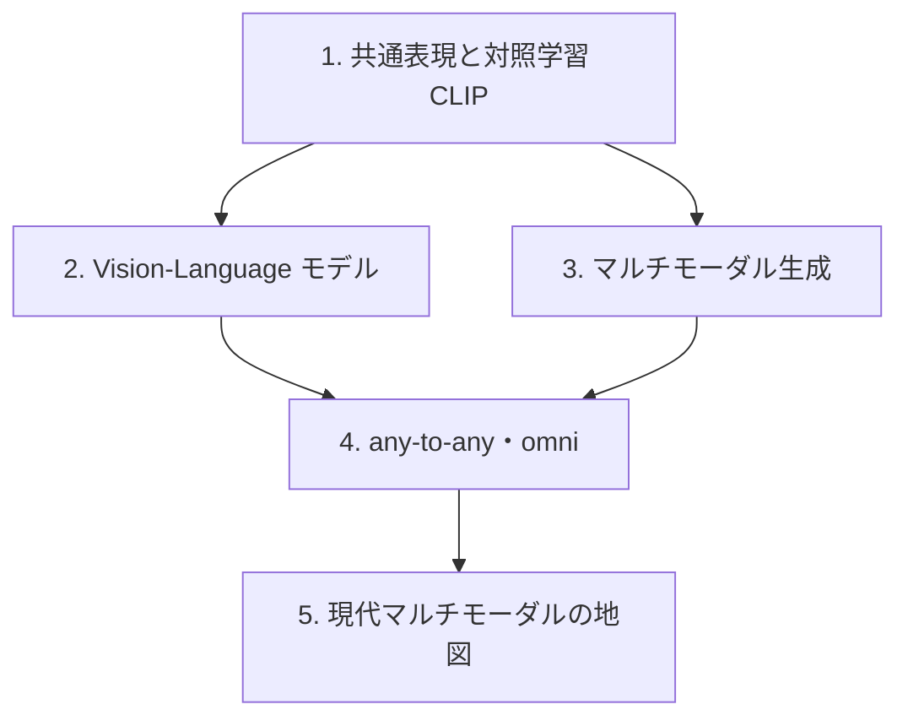

# マルチモーダル

**モダリティ横断。** 複数のモダリティを1つのモデルで結びます。
言語・音声・視覚の各モダリティを学んだ上で、それらをどう統合するかを扱います。

:::abstract[このモダリティで身につくこと]
- 異なるモダリティを共通の表現空間で結ぶ仕組み（対照学習 / 射影）を説明できる
- vision-language モデル（画像→言語）の構成を理解する
- マルチモーダル生成（text→image/音声）と any-to-any・omni の設計を理解する
- 音声章08の「単一モデルで複数ストリーム」がマルチモーダル統合の一形態だと位置づけられる
:::

:::tip[既習との接続]
- 前提モダリティ: [言語](/llm/) / [音声](/audio/) / [視覚](/vision/)。
- [音声の統合・全二重 streaming](/audio/08-unified-streaming-tts/)（テキスト＋音声を単一モデルで）は、マルチモーダル統合の音声版。
- 対照学習は [視覚の自己教師あり](/vision/03-self-supervised/) と同型。
:::

## ロードマップ

## 章一覧

| # | 章 | 状態 |
| --- | --- | --- |
| 1 | [共通表現空間と対照学習 (CLIP)](/multimodal/01-contrastive-clip/) | ✅ 公開 |
| 2 | [Vision-Language モデル (VLM)](/multimodal/02-vision-language-models/) | ✅ 公開 |
| 3 | [マルチモーダル生成](/multimodal/03-multimodal-generation/) | ✅ 公開 |
| 4 | [任意モダリティの統合 — any-to-any・omni](/multimodal/04-any-to-any-omni/) | ✅ 公開 |
| 5 | [現代マルチモーダルの地図](/multimodal/05-multimodal-landscape/) | ✅ 公開 |

:::note[章は順次追加されます]
「次は◯◯の章を書いて」と指示すると、統一フォーマットで新しい章が追加されます。
:::
