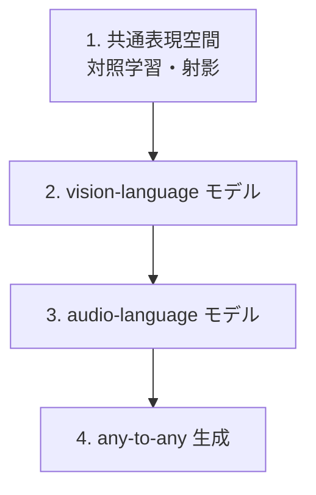

# マルチモーダル

**モダリティ横断。** 複数のモダリティを1つのモデルで結びます。
言語・音声・視覚の各モダリティを学んだ上で、それらをどう統合するかを扱います。

:::abstract[このモダリティで身につくこと（予定）]
- 異なるモダリティを共通の表現空間で結ぶ仕組み（対照学習 / 射影）を説明できる
- vision-language モデル（画像→言語）の構成を理解する
- audio-language・any-to-any（任意のモダリティ間生成）の設計を理解する
- 音声章08の「単一モデルで複数ストリーム」がマルチモーダル統合の一形態だと位置づけられる
:::

:::tip[既習との接続]
- [音声の統合・全二重 streaming](/audio/08-unified-streaming-tts/)（テキスト＋音声を単一モデルで）は、マルチモーダル統合の音声版。
- 各モダリティ（[言語](/llm/) / [音声](/audio/) / [視覚](/vision/)）の理解が前提。
:::

## ロードマップ（予定）

:::note[このモダリティはこれから着手します]
各モダリティが揃ってきたら、統合の章を追加します。
:::
