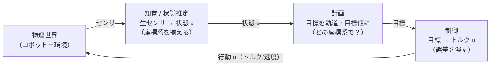
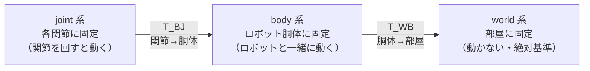

# Physical AI とは — 全体像と座標系

:::abstract[学習目標]
この章を読み終えると、次のことができるようになります。

- 身体性（embodied）AI が他モダリティと違う点を、**入出力が「行動」と「センサ知覚」である**ことから **説明** できる
- ロボットの制御を **知覚 → 計画 → 制御** の閉ループとして **描ける**
- **world / body / joint** の3種の座標系を **使い分け**、なぜ座標系を明示しないと話が壊れるかを **言える**
- 回転行列 $R \in SO(3)$ の3つの性質（直交・行列式 +1・列が正規直交基底）を **挙げ**、なぜ回転がこの集合になるかを **導ける**
- **同次変換** $T$ が回転と並進を1つの $4\times4$ 行列に束ねる仕組みと、合成 $T_{AC}=T_{AB}T_{BC}$ で座標系を渡り歩く方法を **計算** できる
:::

## 前提知識

- 線形代数：行列とベクトルの積、転置、逆行列、行列式、内積。とくに「行列をかける＝ベクトルを線形変換する」という見方。
- 三角関数：$\cos, \sin$ と回転の関係。
- 本章は身体性モダリティの **第1章** です。先行する章はありません。次章 [運動学 — kinematics](/physical-ai/02-kinematics/) は、この章の座標変換を「ロボットの関節をつなぐ」ために使います。

LLM 出身の読者へ。言語モデルの入出力は「トークン列 → トークン列」でした。身体性 AI の入出力は **「センサ知覚 → 行動（トルク・速度）」** です。トークンの代わりに連続値のベクトルが流れ、**それが物理世界を動かして次の入力を変える**——この閉ループが本質的な違いです。

## 直感

言語モデルは文章を、画像モデルは画素を相手にします。**身体性（embodied）AI が相手にするのは「物理世界そのもの」** です。違いは入口と出口に出ます。

- **出力が行動**：モデルが吐くのはテキストでも画像でもなく、**モーターへの指令**（トルク $[\text{N·m}]$、速度 $[\text{rad/s}]$、目標位置）です。
- **入力がセンサ知覚**：カメラ・関節角エンコーダ・IMU（慣性計測）・力センサからの**生の物理量**を読みます。
- **入力と出力が物理法則で繋がっている**：行動を出すとロボットが動き、世界が変わり、次のセンサ値が変わります。言語モデルが「次トークン」を相手の出方と無関係に決められたのとは違い、**自分の行動が次の入力を作る**閉ループです。

この閉ループを回すには、まず「**どこに何があるか**」を一意に言えないといけません。「腕を 10 cm 前へ」の「前」は、**ロボットの胴体から見た前**なのか、**部屋から見た前**なのか。これが曖昧だとロボットは正しく動けません。だから身体性 AI の土台は、**座標系（frame）と、座標系をまたぐ変換**です。本章はそこを固めます。

:::tip[なぜ第1章が座標変換なのか]
運動学（次章）・制御・知覚——身体性 AI の**すべての章**が「ある座標系の量を別の座標系で言い直す」操作を踏みます。カメラで見た物体の位置を、手先を動かすための関節座標へ。関節を回したときの手先の動きを、部屋の座標へ。**座標変換は身体性 AI の四則演算**です。ここを曖昧にしたまま先へ進むと、後の章すべてが砂上の楼閣になります。
:::

## 全体像

身体性 AI のシステムは、**知覚 → 計画 → 制御** の3段を、物理世界を介して**ぐるぐる回す**閉ループです。順方向（センサから行動へ）と逆方向（行動が世界を変えてセンサへ戻る）を一望します。



このループは、参考にする分類体系でいう **知覚-計画-制御スタック** そのものです。各段を一言で:

| 段 | 入力 | 出力 | この章/後章での扱い |
| --- | --- | --- | --- |
| **知覚 / 状態推定** | 生センサ（画素・関節角・IMU） | 状態 $x$（位置・速度・姿勢） | 第5章。**座標系を揃える**のはここの仕事 |
| **計画** | 状態 $x$・タスク目標 | 目標軌道・目標値 | 後章。**どの座標系で目標を書くか**が問題 |
| **制御** | 目標・現在の状態 | 行動 $u$（トルク等） | 第3〜4章（PID・最適制御） |
| **物理世界** | 行動 $u$ | 次のセンサ値 | シミュレータ or 実機 |

3段すべてに共通して **「座標系をまたぐ」** 操作が現れます。本章の主役はこの操作です。具体的には、ロボットまわりに現れる **3種類の座標系** と、それらをつなぐ **回転＋並進** を扱います。



矢印の向きが **変換の合成の向き** です。joint 系で書いた点を world 系まで運ぶには、$T_{WB} T_{BJ}$ と**右から順に**かけていきます。この「右から渡り歩く」規則を、本章の数式と実装で身につけます。

## 理論

### 座標系（frame）とは何か

**座標系（frame・coordinate frame）** とは、空間の中に固定した「原点 + 3本の直交した軸（基底ベクトル）」の組です。同じ1点でも、どの座標系で測るかで**数値（座標）が変わります**。

身体性 AI で頻出するのは次の3つです。役割を取り違えないように、**何に固定され・何と一緒に動くか**まで定義します。

| 座標系 | 何に固定 | 動くか | 典型的な使い道 |
| --- | --- | --- | --- |
| **world（世界）系** | 部屋・地面 | 動かない（絶対基準） | ロボットの絶対位置、ナビゲーション、地図 |
| **body（胴体）系** | ロボットの胴体 | ロボットと一緒に動く | 「ロボットから見て前/左」、IMU の基準 |
| **joint（関節）系** | 各関節・各リンク | その関節を回すと動く | リンクの姿勢、手先の位置の積み上げ |

:::warning[座標系を言わない座標は無意味]
「物体は $(1, 2, 0)$ にある」だけでは**何も決まりません**。world 系での $(1,2,0)$ と body 系での $(1,2,0)$ は、ロボットが動けば空間上の別の点を指します。座標は**必ず「どの座標系で測ったか」とセット**で初めて意味を持ちます。本章では下付き添字で明示します——$p_A$ は「点 $p$ を座標系 $A$ で測った座標」。$T_{AB}$ は「座標系 $B$ の座標を座標系 $A$ の座標へ変換する行列」と読みます（添字は右が入力、左が出力）。
:::

### 回転行列 $R$ と $SO(3)$

ある座標系を、**原点を動かさずに向きだけ変える**操作が **回転（rotation）** です。回転は行列 $R$ をかける線形変換で表せます。点 $p$ を回した先は $R p$ です。

回転を表す行列がすべて満たす条件を集めた集合が **特殊直交群 $SO(3)$（special orthogonal group）** です。$3\times3$ の実行列 $R$ が $SO(3)$ に属するとは、次の2条件を満たすことです。

:::note[$SO(3)$ の定義]
$$
SO(3) = \left\{\, R \in \mathbb{R}^{3\times3} \;\middle|\; R^\top R = I,\ \det R = +1 \,\right\}
$$
:::

ここで $I$ は単位行列、$R^\top$ は転置、$\det R$ は行列式です。各記号の役割を分解します。

- **$R^\top R = I$（直交性）**：$R$ の列ベクトルを $\mathbf{r}_1, \mathbf{r}_2, \mathbf{r}_3$ とすると、$(R^\top R)_{ij} = \mathbf{r}_i^\top \mathbf{r}_j$ です。これが単位行列に等しい——つまり **$\mathbf{r}_i^\top \mathbf{r}_j = \delta_{ij}$**（同じ列同士の内積は 1、違う列同士は 0）。**列が互いに直交した単位ベクトル（正規直交基底）** だ、ということです。これが「向きを変えるだけで、長さも角度も歪めない」回転の本質です。
- **$\det R = +1$（向きを保つ）**：直交行列の行列式は $\pm 1$ にしかなりません。$-1$ の方は**鏡映（reflection）** を含みます（右手系が左手系に裏返る）。物理的な回転では右手系のまま——だから $+1$ に限定します。この $+1$ 限定が「**特殊（special）**」の意味です。

回転行列の効能は、**長さと角度と原点を保つ**ことです。$\|Rp\| = \|p\|$（長さ不変）、$(Rp)^\top(Rq) = p^\top q$（内積＝角度不変）、$R\mathbf{0} = \mathbf{0}$（原点固定）。剛体（変形しない物体）の向きを変える操作にちょうど対応します。

具体形を1つ書いておきます。**$z$ 軸まわりに角 $\theta$ 回す**回転は

$$
R_z(\theta) = \begin{bmatrix} \cos\theta & -\sin\theta & 0 \\ \sin\theta & \cos\theta & 0 \\ 0 & 0 & 1 \end{bmatrix}
$$

左上 $2\times2$ が xy 平面の2D 回転、$z$ 成分はそのまま（3行3列が $1$）です。$y$ 軸・$x$ 軸まわりも同様に作れます。

:::warning[回転の合成は非可換——順序が効く]
2つの回転をこの順に適用するのと逆順では、**結果が違います**：一般に $R_1 R_2 \neq R_2 R_1$。スカラーの掛け算（$2\times3=3\times2$）の感覚で「順序はどうでもいい」と思うと必ず間違えます。直感的には、本を「机に伏せてから 90° 回す」のと「90° 回してから伏せる」で本の向きが変わるのと同じです。行列をかける順序が**操作の順序**であり、入れ替えると別の操作になります。後の実装で、差のノルムが $2.449\,(\neq 0)$ になることを数値で確かめます。
:::

### 同次変換 $T$：回転と並進を1つに束ねる

回転だけでは原点は動きません。実際のロボットでは「向きを変える」と「位置をずらす（**並進・translation**）」が同時に起きます。点 $p_B$ を座標系 $B$ から座標系 $A$ へ移すには、回転 $R$ をかけてから並進 $t$ を足します。

$$
p_A = R\, p_B + t
$$

ここで $R \in SO(3)$ は $B$ の軸を $A$ の軸へ合わせる回転、$t \in \mathbb{R}^3$ は $A$ から見た $B$ の原点の位置です。ところがこれは「行列積」と「ベクトル和」が混じった式で、**複数の座標系を連結すると掛け算と足し算が入り乱れて**扱いにくい。

そこで **同次変換（homogeneous transformation）** を使います。点を $4$ 次元の **同次座標** $\tilde p = \begin{bmatrix} p \\ 1 \end{bmatrix}$ に拡張し、回転と並進を $1$ つの $4\times4$ 行列 $T$ に束ねます。

:::note[同次変換行列]
$$
T = \begin{bmatrix} R & t \\ \mathbf{0}^\top & 1 \end{bmatrix}, \qquad R \in SO(3),\ t \in \mathbb{R}^3
$$
:::

ブロックの意味を全部言います。

- 左上 $3\times3$ の $R$：回転（$B$ の軸 → $A$ の軸）。
- 右上 $3\times1$ の $t$：並進（$A$ から見た $B$ の原点）。
- 左下 $1\times3$ の $\mathbf{0}^\top = [0\ 0\ 0]$：ゼロ行（同次座標の最後の成分を保つための詰め物）。
- 右下のスカラー $1$：同次座標の $1$ を $1$ のまま通す。

この $T$ を同次座標にかけると、**$1$ 回の行列積で「回転してから並進」が出ます**（次節で導出）。回転と並進を分けて持つ必要がなくなり、**複数の座標変換を行列積の連鎖だけで合成できる**のが最大の利点です。

:::warning[$T$ は「回転＋並進をまとめた1つの行列」——別物を2回かけるのではない]
よくある誤解は「$T$ は回転行列に並進を**外付け**しただけ」というもの。違います。$T$ は $4\times4$ の **1つの線形変換**で、同次座標の世界では「回転してから並進する」というアフィン変換が**1回の行列積**になります。だから $T_{AB} T_{BC}$ のように**ふつうに行列積を連鎖**するだけで、回転も並進も正しく合成されます——足し算を別途やる必要はありません。これが同次座標を導入する御利益そのものです。
:::

### 変換の合成 $T_{AC} = T_{AB} T_{BC}$

座標系が3つ（$A$=world, $B$=body, $C$=joint）あるとします。$C$ で測った点を $A$ で言い直したい。途中に $B$ を挟んで2段で渡ります。

$$
p_A = T_{AB}\, p_B, \qquad p_B = T_{BC}\, p_C \quad\Longrightarrow\quad p_A = T_{AB}\,(T_{BC}\, p_C) = (T_{AB} T_{BC})\, p_C
$$

よって **合成変換** は

$$
T_{AC} = T_{AB}\, T_{BC}
$$

**添字の連結に注目**します。$T_{A\underline{B}}\, T_{\underline{B}C}$ で、**隣り合う添字 $B$ が打ち消し合って** $T_{AC}$ が残ります。これは座標系を「$C \to B \to A$」と右から左へ渡り歩く順に対応します。何段あっても同じ規則で繋げます——$T_{AD} = T_{AB} T_{BC} T_{CD}$。**右から順に**かけるのを忘れないでください（順序が逆だと添字が繋がりません。回転の非可換性がここに効いています）。

:::tip[逆変換は転置で安く作れる]
$T_{AB}$ は $A \leftarrow B$。逆向き $T_{BA} = T_{AB}^{-1}$（$B \leftarrow A$）は一般の $4\times4$ 逆行列を計算せずに作れます。$R$ が直交なので $R^{-1} = R^\top$ を使い、
$$
T_{AB}^{-1} = \begin{bmatrix} R^\top & -R^\top t \\ \mathbf{0}^\top & 1 \end{bmatrix}
$$
転置と1回の行列・ベクトル積だけ。実装でこれも確かめます。
:::

## 数式の導出

同次変換の行列積が、なぜ「回転してから並進」になるのかを、ブロック行列の掛け算で**1ステップずつ**導きます。天下りにしません。

**ステップ1：同次座標の定義。** 3次元の点 $p_B \in \mathbb{R}^3$ を、末尾に $1$ を足して4次元にします。

$$
\tilde p_B = \begin{bmatrix} p_B \\ 1 \end{bmatrix} \in \mathbb{R}^4
$$

この $1$ が「並進を足し算でなく行列積で実現する」ための仕掛けです。

**ステップ2：$T$ を同次座標にかける。** 同次変換行列をブロックのまま掛けます。

$$
T\, \tilde p_B = \begin{bmatrix} R & t \\ \mathbf{0}^\top & 1 \end{bmatrix} \begin{bmatrix} p_B \\ 1 \end{bmatrix}
$$

**ステップ3：ブロック行列積を成分ごとに展開。** $2\times2$ のブロック行列の積として、上ブロックと下ブロックを別々に計算します。

$$
T\, \tilde p_B = \begin{bmatrix} R\, p_B + t \cdot 1 \\ \mathbf{0}^\top p_B + 1 \cdot 1 \end{bmatrix} = \begin{bmatrix} R\, p_B + t \\ 1 \end{bmatrix}
$$

上ブロック $R p_B + t$ は **まさに「回転してから並進」**。下ブロックは $\mathbf{0}^\top p_B + 1 = 1$ で、同次座標の末尾が $1$ のまま保たれます（だから結果もまた同次座標）。

**ステップ4：上3成分を取り出す。** 末尾の $1$ を捨てれば、求める変換後の点が出ます。

$$
p_A = R\, p_B + t
$$

これは理論節で書いた「回転＋並進」の式そのもの。**$4\times4$ 行列を1回かけるだけで、回転と並進が同時に実現された**わけです。

**ステップ5：合成も同じ仕組みで連鎖する。** 2段の変換 $\tilde p_A = T_{AB}\,\tilde p_B$, $\tilde p_B = T_{BC}\,\tilde p_C$ を代入で繋ぎます。

$$
\tilde p_A = T_{AB}\,\tilde p_B = T_{AB}\,(T_{BC}\,\tilde p_C) = (T_{AB} T_{BC})\,\tilde p_C
$$

行列積の結合法則 $(T_{AB} T_{BC})\tilde p_C = T_{AB}(T_{BC}\tilde p_C)$ がそのまま使えるので、**合成変換 $T_{AC} = T_{AB} T_{BC}$ を一度作っておけば、以後は1回の行列積で $C \to A$ が出ます**。並進の足し算を別管理する必要がない——これが同次座標の御利益でした。 $\blacksquare$

## 実装

numpy だけで、2D/3D の回転・同次変換を組み、合成して点を別の座標系へ運ぶトイを作ります。**$SO(3)$ の性質・回転の非可換・合成・逆変換**をすべて数値で確かめます。

```python title="toy_frames.py"
import numpy as np

np.set_printoptions(precision=4, suppress=True)

# --- 2D 回転行列 ---
def Rot2(theta):
    c, s = np.cos(theta), np.sin(theta)
    return np.array([[c, -s],
                     [s,  c]])

# --- 3D 回転行列（z 軸まわり）---
def RotZ(theta):
    c, s = np.cos(theta), np.sin(theta)
    return np.array([[c, -s, 0],
                     [s,  c, 0],
                     [0,  0, 1]])

# --- 3D 回転行列（y 軸まわり）---
def RotY(theta):
    c, s = np.cos(theta), np.sin(theta)
    return np.array([[ c, 0, s],
                     [ 0, 1, 0],
                     [-s, 0, c]])

# --- 同次変換行列を組む（R と t から 4x4 を作る）---
def make_T(R, t):
    T = np.eye(4)
    T[:3, :3] = R      # 左上 3x3 に回転
    T[:3,  3] = t      # 右上 3x1 に並進
    return T

# --- 同次変換で点を変換（末尾に 1 を足して 4x4 をかけ、上3成分を取る）---
def transform_point(T, p):
    p_h = np.append(p, 1.0)        # 同次座標 [x,y,z,1]
    q_h = T @ p_h
    return q_h[:3]

print("=== 1. SO(3) の性質を数値で確認 ===")
# 2つの回転を合成しても SO(3) に留まることを確認する
R = RotZ(np.deg2rad(30)) @ RotY(np.deg2rad(45))
print("R^T R = I か:\n", R.T @ R)            # 直交性
print("det(R) =", round(float(np.linalg.det(R)), 6))  # +1

print("\n=== 2. 回転の合成は非可換 ===")
A = RotZ(np.deg2rad(90))
B = RotY(np.deg2rad(90))
# 差が 0 でない = 順序を入れ替えると別物、を数値で示す
print("RotZ@RotY と RotY@RotZ の差(ノルム) =",
      round(float(np.linalg.norm(A @ B - B @ A)), 6))
v = np.array([1.0, 0.0, 0.0])
print("(Z先→Y) で x 軸が移る先:", (B @ A) @ v)
print("(Y先→Z) で x 軸が移る先:", (A @ B) @ v)

print("\n=== 3. 同次変換の合成で別座標系へ点を移す ===")
# world(A) <- body(B): body は world で z 90度回転 + (1,2,0) 平行移動
T_AB = make_T(RotZ(np.deg2rad(90)), np.array([1.0, 2.0, 0.0]))
# body(B) <- joint(C): joint は body で +x 方向に 0.5 オフセット（回転なし）
T_BC = make_T(np.eye(3), np.array([0.5, 0.0, 0.0]))
T_AC = T_AB @ T_BC            # 合成: world <- joint（添字 B が打ち消す）
print("T_AC = T_AB @ T_BC =\n", T_AC)
# joint 原点と joint の点 (1,0,0) を world で見ると？
print("joint原点 (0,0,0)_C を world で見た座標:",
      transform_point(T_AC, np.array([0., 0., 0.])))
print("joint の点 (1,0,0)_C を world で見た座標:",
      transform_point(T_AC, np.array([1., 0., 0.])))

print("\n=== 4. 逆変換 T_BA = T_AB^{-1}（転置で安く作る）===")
def invert_T(T):
    R = T[:3, :3]; t = T[:3, 3]
    Ti = np.eye(4)
    Ti[:3, :3] = R.T          # R^{-1} = R^T（直交だから）
    Ti[:3,  3] = -R.T @ t     # 並進は -R^T t
    return Ti
T_BA = invert_T(T_AB)
print("T_AB @ T_BA = I か:\n", T_AB @ T_BA)
print("world原点 (0,0,0)_A を body で見た座標:",
      transform_point(T_BA, np.array([0., 0., 0.])))

print("\n=== 5. 2D で順序の効きを可視化（回転と並進の順序）===")
p = np.array([2.0, 0.0])
R45 = Rot2(np.deg2rad(45))
t1 = np.array([3.0, 0.0])
print("回転してから並進:", R45 @ p + t1)
print("並進してから回転:", R45 @ (p + t1))
```

```text title="出力"
=== 1. SO(3) の性質を数値で確認 ===
R^T R = I か:
 [[ 1.  0. -0.]
 [ 0.  1.  0.]
 [-0.  0.  1.]]
det(R) = 1.0

=== 2. 回転の合成は非可換 ===
RotZ@RotY と RotY@RotZ の差(ノルム) = 2.44949
(Z先→Y) で x 軸が移る先: [ 0.  1. -0.]
(Y先→Z) で x 軸が移る先: [ 0.  0. -1.]

=== 3. 同次変換の合成で別座標系へ点を移す ===
T_AC = T_AB @ T_BC =
 [[ 0.  -1.   0.   1. ]
 [ 1.   0.   0.   2.5]
 [ 0.   0.   1.   0. ]
 [ 0.   0.   0.   1. ]]
joint原点 (0,0,0)_C を world で見た座標: [1.  2.5 0. ]
joint の点 (1,0,0)_C を world で見た座標: [1.  3.5 0. ]

=== 4. 逆変換 T_BA = T_AB^{-1}（転置で安く作る）===
T_AB @ T_BA = I か:
 [[ 1.  0.  0. -0.]
 [ 0.  1.  0.  0.]
 [ 0.  0.  1.  0.]
 [ 0.  0.  0.  1.]]
world原点 (0,0,0)_A を body で見た座標: [-2.  1.  0.]
```

出力を1つずつ読み解きます。

- **節1（$SO(3)$）**：2つの回転を合成した $R$ でも $R^\top R = I$（対角が $1$、非対角はほぼ $0$）かつ $\det R = 1.0$。**回転を合成しても回転のまま**——$SO(3)$ が掛け算で閉じている（群をなす）ことの数値的確認です。
- **節2（非可換）**：差のノルムが $2.449 \neq 0$。さらに、同じ x 軸単位ベクトルが、回転順序を変えると $[0,1,0]$ と $[0,0,-1]$ という**全く違う向き**に移ります。順序が結果を決めることが目で見えます。
- **節3（合成）**：$T_{AC}=T_{AB}T_{BC}$ の右上 $t$ が $(1, 2.5, 0)$ になりました。body の +x 方向（$0.5$ オフセット）が、body の $90°$ 回転によって world の **+y 方向** に化けて、$y$ が $2.0 \to 2.5$ に増えています。joint の点 $(1,0,0)$ も world では $y$ がさらに $+1$ されて $(1, 3.5, 0)$——**joint の x 軸が world の y 軸を向いている**ことが座標から読み取れます。
- **節4（逆変換）**：$T_{AB} T_{BA} = I$ で逆変換が正しいことを確認。world 原点を body で見ると $(-2, 1, 0)$——並進と回転の両方が逆向きに効いています。

ディスプレイされていない節5の出力も載せます。

```text title="出力（節5）"
=== 5. 2D で順序の効きを可視化（回転と並進の順序）===
回転してから並進: [4.4142 1.4142]
並進してから回転: [3.5355 3.5355]
```

同じ点・同じ回転・同じ並進でも、**回転と並進の順序**を変えると $(4.41, 1.41)$ と $(3.54, 3.54)$ という別の点に着きます。同次変換 $T=\begin{bmatrix}R & t\\ \mathbf 0^\top & 1\end{bmatrix}$ は、このうち **「回転してから並進」** を1つの行列に固定して符号化したものだ、と納得できます。

## 演習

::::question[演習 1: 座標系をまたいで点を運ぶ]
body 系 $B$ は world 系 $A$ から見て、$z$ 軸まわりに $+90°$ 回転し、原点が world の $(1, 2, 0)$ にあります。いま body 系で測った点 $p_B = (2, 0, 0)$ があります。(a) $T_{AB}$ を $4\times4$ で書いてください。(b) この点を world 座標 $p_A$ で表すと？　手計算してから、本文のコードで検算してください。(c) 直感的に、なぜ body の +x 方向が world ではその向きになるのか説明してください。

:::details[解答]
(a) $z$ 軸まわり $90°$ の回転は $\cos90°=0,\ \sin90°=1$ なので
$$
R_z(90°) = \begin{bmatrix} 0 & -1 & 0 \\ 1 & 0 & 0 \\ 0 & 0 & 1 \end{bmatrix}, \qquad
T_{AB} = \begin{bmatrix} 0 & -1 & 0 & 1 \\ 1 & 0 & 0 & 2 \\ 0 & 0 & 1 & 0 \\ 0 & 0 & 0 & 1 \end{bmatrix}
$$
(b) $p_A = R_z(90°)\,p_B + t = \begin{bmatrix}0&-1&0\\1&0&0\\0&0&1\end{bmatrix}\begin{bmatrix}2\\0\\0\end{bmatrix} + \begin{bmatrix}1\\2\\0\end{bmatrix} = \begin{bmatrix}0\\2\\0\end{bmatrix} + \begin{bmatrix}1\\2\\0\end{bmatrix} = \begin{bmatrix}1\\4\\0\end{bmatrix}$。
よって $p_A = (1, 4, 0)$。本文コードで `transform_point(T_AB, np.array([2.,0.,0.]))` を実行すると同じ値が出ます（コードの `T_AB` は本問と同一定義）。

(c) body の +x 軸は $z$ まわり $90°$ 回転で world の **+y 軸** を向きます（$R_z$ の第1列が $(0,1,0)$）。だから body での「+x に $2$ 進む」は world では「+y に $2$ 進む」になり、body 原点 $(1,2,0)$ に足して $(1,4,0)$ に着きます。
:::
::::

::::question[演習 2: 回転の非可換と $SO(3)$ の性質]
(a) 任意の $R \in SO(3)$ と任意の $3$ 次元ベクトル $p$ について、$\|Rp\| = \|p\|$（長さが変わらない）ことを、$SO(3)$ の定義 $R^\top R = I$ から導いてください。(b) $R_1, R_2 \in SO(3)$ のとき、合成 $R_1 R_2$ も $SO(3)$ に属することを示してください（直交性だけでよい）。(c) なぜ $\det R = +1$ に限定し、$-1$ を除くのですか。

:::details[解答]
(a) 長さの2乗を内積で書いて、$R^\top R = I$ を使います。
$$
\|Rp\|^2 = (Rp)^\top (Rp) = p^\top R^\top R\, p = p^\top I\, p = p^\top p = \|p\|^2
$$
両辺は非負なので $\|Rp\| = \|p\|$。回転は長さを保ちます $\blacksquare$。

(b) 直交性を確かめます。$(R_1 R_2)^\top (R_1 R_2) = R_2^\top R_1^\top R_1 R_2 = R_2^\top (R_1^\top R_1) R_2 = R_2^\top I R_2 = R_2^\top R_2 = I$。
よって $R_1 R_2$ も直交。行列式も $\det(R_1 R_2) = \det R_1 \det R_2 = 1\cdot 1 = 1$ なので $R_1 R_2 \in SO(3)$。**回転の合成は回転**——本文コードの節1がこれを数値で示しています $\blacksquare$。

(c) 直交行列の行列式は $\det(R^\top R) = (\det R)^2 = \det I = 1$ より $\det R = \pm 1$ の2択です。$-1$ の側は **鏡映（reflection）** を含み、右手系を左手系に裏返します（例：$\mathrm{diag}(1,1,-1)$ は $z$ を反転）。物理的な剛体回転は手系を裏返さないので、向きを保つ $\det R = +1$ だけを残します。これが「特殊（special）直交群」の「特殊」の意味です。
:::
::::

## まとめ

:::success[この章の要点]
- 身体性（embodied）AI は、入出力が **「行動（トルク・速度）」と「センサ知覚」** である点で他モダリティと違う。自分の行動が次の入力を作る **閉ループ** が本質。
- システムは **知覚 → 計画 → 制御** を物理世界を介して回す。各段に共通して「**座標系をまたぐ変換**」が現れる——座標変換は身体性 AI の四則演算。
- 座標系は **world / body / joint** の3種。座標は **必ず「どの座標系で測ったか」とセット**で初めて意味を持つ。
- 回転は $R \in SO(3)$（**$R^\top R = I$** かつ **$\det R = +1$**）。列が正規直交基底で、長さ・角度・原点を保つ。**回転の合成は非可換**——順序が結果を変える。
- 同次変換 $T=\begin{bmatrix}R & t\\ \mathbf 0^\top & 1\end{bmatrix}$ は **回転と並進を1つの $4\times4$ に束ね**、合成 $T_{AC}=T_{AB}T_{BC}$ で座標系を**右から順に渡り歩く**（隣り合う添字が打ち消す）。逆変換は転置で安く作れる。
:::

### 次に学ぶこと

座標系をまたぐ「回転＋並進」の道具立てが手に入りました。次章では、この同次変換を**いくつも連鎖**させて、ロボットの「関節角 → 手先の位置・姿勢」を計算します——これが **順運動学（forward kinematics）** です。本章の $T_{AC}=T_{AB}T_{BC}$ が、関節をつなぐ背骨になります。

→ [運動学 — kinematics](/physical-ai/02-kinematics/)

→ [Physical AI ロードマップに戻る](/physical-ai/)

## 用語ミニ辞典

| 用語 | 一言 |
| --- | --- |
| embodied AI | 入出力が「行動」と「センサ知覚」の、物理世界を相手にする AI |
| 知覚→計画→制御 | センサ→状態→目標→トルク と回る閉ループ |
| frame（座標系） | 原点＋3直交軸の組。座標はどの frame かで変わる |
| world 系 | 部屋に固定・動かない絶対基準 |
| body 系 | ロボット胴体に固定・ロボットと一緒に動く |
| joint 系 | 各関節に固定・その関節を回すと動く |
| 回転行列 $R$ | 向きだけ変える線形変換。点 $p$ を $Rp$ に移す |
| $SO(3)$ | $R^\top R=I$ かつ $\det R=+1$ の回転行列の集合 |
| 直交性 | 列が正規直交基底。長さ・角度を保つ |
| 並進 $t$ | 原点をずらすベクトル |
| 同次座標 | 末尾に $1$ を足した $4$ 次元表現。並進を行列積で実現 |
| 同次変換 $T$ | 回転＋並進を束ねた $4\times4$ 行列 |
| 合成 $T_{AB}T_{BC}$ | 座標系を右から渡り歩く。隣の添字が打ち消す |
| 非可換 | $R_1R_2\neq R_2R_1$。回転は順序が効く |

## 次のアクション

理論を手で定着させる。**最小の写経 → 動かす → 小実験** を1セットで。

1. 本文の `toy_frames.py` を写経し、`uv run --with numpy python toy_frames.py` で動かす。出力が本文の実測値と一致することを確認する。
2. `RotX(theta)`（$x$ 軸まわり）を自分で書き足し、`RotX @ RotY @ RotZ` を合成して $R^\top R = I,\ \det R = 1$ がまだ成り立つことを確かめる（$SO(3)$ が掛け算で閉じている）。
3. **小実験**：world → body → joint を3段つないだ $T_{AC}=T_{AB}T_{BC}$ を作り、joint 系の点を world へ運ぶ。次に逆変換 $T_{CA}=T_{AC}^{-1}$ を `invert_T` で作り、world の点を joint 系へ戻して、**往復すると元の点に戻る**ことを数値で確認する。

ここまでで座標変換の足場が固まります。次章 02 運動学では、これを関節の数だけ連鎖させて手先位置を求めます。

## 参考文献

1. R. M. Murray, Z. Li, S. S. Sastry, *A Mathematical Introduction to Robotic Manipulation*, CRC Press, 1994.（$SO(3)$・同次変換・剛体運動の定番）
2. K. M. Lynch, F. C. Park, *Modern Robotics: Mechanics, Planning, and Control*, Cambridge University Press, 2017.（座標系・$SE(3)$ を丁寧に。無料 PDF あり）
3. J. J. Craig, *Introduction to Robotics: Mechanics and Control*, 4th ed., Pearson, 2017.（座標フレームと同次変換の教科書的導入）
4. B. Siciliano, L. Sciavicco, L. Villani, G. Oriolo, *Robotics: Modelling, Planning and Control*, Springer, 2009.（運動学・制御を体系的に）
