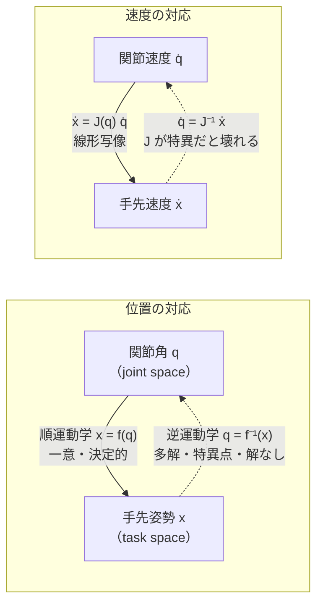

# 運動学 — 順運動学と Jacobian

:::abstract[学習目標]
この章を読み終えると、次のことができるようになります。

- **順運動学（forward kinematics）** が「関節角 → 手先姿勢」を **一意に** 決める合成写像であることを説明できる
- 2リンク平面アームの順運動学を **自分で導出** し、関節角から手先位置を計算できる
- **逆運動学（inverse kinematics）** がなぜ **多解・特異点** を持つのか、順運動学と対比して説明できる
- **Jacobian** $J(q)$ が「関節速度 → 手先速度」を写す線形写像であることを述べ、$\dot x = J(q)\,\dot q$ を導出できる
- Jacobian を **数値微分で計算** し、解析式と一致することを確認できる。$\det J = 0$ が **特異点** であることを判定できる
:::

## 前提知識

- 章01 [Physical AI とは — 全体像と座標系](/physical-ai/01-overview-and-frames/)：座標系（frame）・剛体の姿勢・回転の表し方。本章は「関節という回転を根元から積み上げると手先 frame がどこに来るか」を計算します。
- 線形代数：行列とベクトルの積、行列式（determinant）、偏微分。Jacobian は偏微分を並べた行列です。
- 三角関数の加法定理（順運動学の式変形で使います）。

LLM 出身の読者へ。順運動学は **決定的な forward pass**（入力 $q$ → 出力 $x$、分岐なし）で、Jacobian はその **ヤコビアン＝1次の感度**（$\partial x / \partial q$）です。逆運動学は「出力を指定して入力を逆算する」問題で、ここが非自明（多解・解なし）になります。backprop の chain rule が局所線形化（Jacobian）の積であることを思い出すと、橋渡しがききます。

## 直感

ロボットアームの根元には複数の **関節（joint）** があり、それぞれが角度 $q_i$ を持ちます。私たちが本当に知りたいのは「**手先（end-effector）が空間のどこにあって、どちらを向いているか**」です。運動学が答えるのは、まさにこの2つの向きの問いです。

- **順方向（forward）**：関節角 $q$ を全部決めたら、手先はどこに来るか？ → これは **一意に決まります**。各関節の回転を根元から順に合成するだけで、答えが1つに定まる。地図上で「北へ1km、次に東へ700m」と言われたら到達点が1つに決まるのと同じです。
- **逆方向（inverse）**：手先をある位置に置きたい。そのとき関節角はいくつにすればいいか？ → これは **一意とは限りません**。同じ場所に手先を置く関節角の組が **複数あったり（肘を上にも下にも曲げられる）**、**1つも無かったり（届かない）** します。

この **「順は一意・逆は多解／解なし」という非対称性** が運動学の最初の山です。そしてもう1つ、位置だけでなく **速度** の関係 —— 「関節をこの速さで回したら手先はどの向きにどれだけ速く動くか」 —— を線形に写すのが **Jacobian** です。これは制御（章03 以降で手先を目標へ動かす）に直結する道具になります。

## 全体像

運動学は、関節空間（joint space, 角度 $q$）と作業空間（task space, 手先姿勢 $x$）の間を行き来する2方向の写像です。位置の対応（運動学）と速度の対応（Jacobian）が層になっています。



| 軸 | 順方向（forward） | 逆方向（inverse） |
| --- | --- | --- |
| 位置 | $x = f(q)$。**一意**・閉じた式 | $q = f^{-1}(x)$。**多解 / 解なし / 無限解** |
| 速度 | $\dot x = J(q)\,\dot q$。線形・一意 | $\dot q = J^{-1}\dot x$。$\det J=0$（特異点）で破綻 |
| 難しさ | 易しい（合成するだけ） | 難しい（本章では概念、解法は後章で深掘り） |

:::note[LLM ↔ Robotics]
順運動学 $f$ は **学習しない固定の関数**（リンク長と関節構造というハードウェア仕様だけで決まる）です。データに依存しません。Jacobian $J$ は $f$ の **局所線形化**（その姿勢まわりの1次近似）で、姿勢 $q$ ごとに変わる「実行時に計算される行列」です。「固定の構造（$f$）」と「姿勢依存で再計算される量（$J$）」を分けて捉えるのが理解の鍵です。
:::

## 理論

### 関節空間と作業空間

記号を全部定義します。

- $q = (q_1, q_2, \dots, q_n)$：**関節角ベクトル**。$q_i$ は第 $i$ 関節の角度 $[\text{rad}]$。$n$ は関節数（自由度, DOF）。本章の2リンクアームでは $q = (q_1, q_2)$、$n=2$。
- $x$：**手先姿勢（end-effector pose）**。位置と向きをまとめたもの。平面 2D では $x = (x, y, \phi)$ の3成分（位置2 + 向き1）、空間 3D では位置3 + 向き3 の計6成分。
- $f$：**順運動学写像** $x = f(q)$。関節角を入れると手先姿勢が1つ返る関数。リンク長 $L_1, L_2, \dots$ は **固定パラメータ**（設計で決まる定数）。

:::warning[「手先姿勢 $x$」の $x$ と「x 座標」の $x$ を混同しない]
記号 $x$ を2つの意味で使います。**太字でない $x = (x, y, \phi)$ は手先姿勢ベクトル全体**、その第1成分の **$x$ が x 座標（横位置）** です。文脈で読み分けてください。曖昧さを避けたい箇所では手先位置を $p = (p_x, p_y)$ と書くこともあります。本章では2リンクアームの位置だけを扱うとき $x$ を位置ベクトル $(x, y)$ の意味で使います。
:::

### 順運動学：根元から積み上げる

順運動学の心臓は「**各関節の回転を根元から手先へ順に合成する**」という1点です。誰が・いつ・何を：設計時にリンク長と関節配置（構造）が固定され、実行時に関節角 $q$ が与えられると、根元の frame から1関節ずつ回転・並進を掛けていって手先 frame の位置・向きを出します。再計算は $q$ が変わるたび。状態は持ちません（同じ $q$ なら必ず同じ $x$）。

2リンク平面アーム（根元が原点に固定、2つの回転関節）で具体化します。

- 第1リンク：長さ $L_1$、根元から角度 $q_1$ の向きに伸びる。その先端（**肘**）の位置は

$$
p_{\text{elbow}} = \big(L_1\cos q_1,\ L_1\sin q_1\big).
$$

- 第2リンク：長さ $L_2$、肘から角度 $q_1 + q_2$ の向き（$q_2$ は **第1リンクに対する相対角**なので、絶対角は和になる）に伸びる。その先端が **手先**：

$$
p = \big(\underbrace{L_1\cos q_1 + L_2\cos(q_1+q_2)}_{x},\ \underbrace{L_1\sin q_1 + L_2\sin(q_1+q_2)}_{y}\big).
$$

- 手先の向き（平面なので向きはスカラー1個）は単純に $\phi = q_1 + q_2$。

これで $f$ が閉じた式で書けました。**入力 $q=(q_1,q_2)$ を入れれば $x=(x,y,\phi)$ が一意に出る**——これが順運動学の一意性です。

:::warning[$q_2$ は「絶対角」ではなく「相対角」]
よくある間違いは、第2リンクの向きを $q_2$ だと思うことです。$q_2$ は **第1リンクから測った相対角**なので、ワールド座標での第2リンクの絶対角は $q_1 + q_2$ です。だから手先位置の式に $\cos(q_1+q_2)$ が現れます。関節は根元から **積み上がる**（前の関節の角度が後ろに乗る）ことを忘れると、ここで符号・角度がずれます。
:::

### DH パラメータ（概要）

リンクが増えると「各リンクをどう数式化するか」を統一規則にしたくなります。それが **DH パラメータ（Denavit–Hartenberg parameters）** です。各関節 $i$ を4つの数 $(\theta_i, d_i, a_i, \alpha_i)$ で表します。

| 記号 | 名前 | 意味 |
| --- | --- | --- |
| $\theta_i$ | joint angle | 関節の回転角（回転関節ではこれが変数 $q_i$） |
| $d_i$ | link offset | 関節軸方向のずれ |
| $a_i$ | link length | リンクの長さ |
| $\alpha_i$ | link twist | 隣り合う関節軸のねじれ角 |

各リンクの変換を $4\times4$ の **同次変換行列（homogeneous transformation）** $T_i$ で書き、根元から手先まで掛け合わせると順運動学が出ます。

$$
T_0^{n} = T_1\, T_2 \cdots T_n .
$$

本章の2リンク平面アームは DH の特別な場合（$d_i = 0,\ \alpha_i = 0,\ a_i = L_i,\ \theta_i = q_i$）で、上で手で書いた式そのものになります。**DH は「リンクごとの変換を統一フォーマットで積む」ための記法**であって、新しい物理ではありません。多リンク・3次元になると効いてきます。詳細な軸の取り方は後段の参考文献に譲り、本章では「順運動学 = リンク変換の積」という構造だけ押さえます。

### 逆運動学：多解・特異点・解なし

逆運動学は $x$ を **指定して** $q$ を求める問題、$q = f^{-1}(x)$ です。ここが運動学で最も非自明です。

2リンクアームで手先位置 $(x, y)$ を目標にすると、余弦定理から

$$
\cos q_2 = \frac{x^2 + y^2 - L_1^2 - L_2^2}{2 L_1 L_2}.
$$

この $\cos q_2$ から $q_2$ を解くと **$\pm$ の2つ**が出ます（$\cos$ は偶関数）。

- $q_2 > 0$：**elbow-down**（肘が一方に曲がる配置）
- $q_2 < 0$：**elbow-up**（肘が逆に曲がる配置）

どちらも手先は同じ点に届きます。これが **多解（multiple solutions）** です。さらに、

- **解なし**：$|\cos q_2| > 1$、つまり目標が腕の届く範囲（半径 $L_1+L_2$ の円）の外なら解は存在しません。
- **無限解**：目標がちょうど $L_1 + L_2$（腕が伸びきる点）など特定の配置では、解が連続的につながる退化が起きます。冗長自由度（関節数 > task 次元）を持つアームでは一般に無限解です。

:::warning[順運動学は一意、逆運動学は多解・特異点あり — ここが運動学最大の非対称]
**順運動学 $x=f(q)$ は必ず一意な答えを返します**（関節角を決めれば手先位置は1つに決まる）。一方、**逆運動学 $q=f^{-1}(x)$ は一般に一意ではありません**：

- **多解**：肘を上にも下にも曲げられるので、同じ手先位置に複数の関節角（2リンクで典型的に2解、多関節ではさらに多い）。
- **解なし**：届かない目標には解が無い（ワークスペース外）。
- **特異点（singularity）**：腕が伸びきる／折りたたまる配置では、手先を動かせる方向が落ちて逆算が壊れる（次節の Jacobian で正体を見ます）。

「ニューラルネットの forward は一意だが、出力を固定して入力を逆算するのは ill-posed」というのと同じ構図です。だから実用の逆運動学は、解析解（2リンクのような単純系）か、数値解（Jacobian を使った反復・後章）か、複数解からの選択（関節制限・なめらかさで1つに絞る）を伴います。
:::

### Jacobian：関節速度から手先速度への線形写像

ここまでは **位置** の対応でした。次は **速度** です。関節を動かす速さ $\dot q$（各関節の角速度）と、その結果生じる手先の動く速さ $\dot x$ の関係を知りたい。これを結ぶのが **Jacobian** です。

順運動学 $x = f(q)$ の両辺を時間で微分すると（連鎖律）、

$$
\dot x = J(q)\,\dot q, \qquad J(q) = \frac{\partial f}{\partial q}.
$$

$J(q)$ は **Jacobian 行列**。記号を全部定義します。

- サイズは $(\text{task 次元}) \times (\text{関節数})$。2リンクで手先位置 $(x,y)$ だけ見るなら $2\times 2$。
- 第 $(i,j)$ 成分 $J_{ij} = \dfrac{\partial x_i}{\partial q_j}$：「第 $j$ 関節を微小に動かしたとき、手先の第 $i$ 成分がどれだけ動くか」。
- **列 $j$** は「第 $j$ 関節だけを単位速度で回したときの手先速度ベクトル」。だから $\dot x = J\dot q = \sum_j (\text{列}\,j)\,\dot q_j$ は各関節の寄与の重ね合わせです。
- $J$ は **姿勢 $q$ に依存します**（位置ごとに値が変わる）。固定行列ではなく、実行時にその姿勢で計算する量です。

:::note[Jacobian は「局所の線形化」]
$\dot x = J\dot q$ は、順運動学という非線形写像 $f$ を、いまいる姿勢 $q$ のまわりで **1次（線形）近似** したものです。微小変位なら $\Delta x \approx J\,\Delta q$。backprop の各層が局所 Jacobian の積であるのと同じ「局所線形化」です。$J$ が姿勢で変わるのは、$f$ が非線形だからです。
:::

### 特異点：Jacobian が落ちる場所

逆速度問題 $\dot q = J^{-1}\dot x$（手先をこう動かしたい → 関節をどう回す）は、$J$ が逆行列を持つときだけ解けます。$\det J = 0$ になる姿勢が **特異点（singularity）** で、ここでは：

- 手先を動かせる方向が **落ちる**（ある方向へ瞬間的に手先を動かせない）。
- 逆を取ると $J^{-1}$ が発散し、わずかな手先速度を出すのに **無限大の関節速度** が要る（実機では危険）。

2リンクアームでは $q_2 = 0$（腕が一直線に伸びきる）または $q_2 = \pi$（折りたたむ）で $\det J = 0$。直感的には、腕が伸びきると **半径方向（外向き）へはもう手先を動かせない**（どちらの関節を回しても接線方向にしか動かない）からです。次節でこれを数式と数値の両方で確かめます。

## 数式の導出

2リンク平面アームについて、順運動学から Jacobian を導き、特異点条件 $\det J = 0$ を閉じた形で出します。

**手先位置（順運動学）** を再掲します。

$$
\begin{aligned}
x &= L_1\cos q_1 + L_2\cos(q_1 + q_2),\\
y &= L_1\sin q_1 + L_2\sin(q_1 + q_2).
\end{aligned}
$$

**各成分を各関節角で偏微分**します。$q_1$ は両方の項に入り、$q_2$ は第2項だけに入ることに注意します（$q_1+q_2$ を $q_2$ で微分すると係数1）。

$$
\begin{aligned}
\frac{\partial x}{\partial q_1} &= -L_1\sin q_1 - L_2\sin(q_1+q_2),
& \frac{\partial x}{\partial q_2} &= -L_2\sin(q_1+q_2),\\[4pt]
\frac{\partial y}{\partial q_1} &= \ \ L_1\cos q_1 + L_2\cos(q_1+q_2),
& \frac{\partial y}{\partial q_2} &= \ \ L_2\cos(q_1+q_2).
\end{aligned}
$$

これを並べて **Jacobian** を得ます。

$$
J(q) =
\begin{bmatrix}
-L_1\sin q_1 - L_2\sin(q_1+q_2) & -L_2\sin(q_1+q_2)\\[4pt]
\ \ L_1\cos q_1 + L_2\cos(q_1+q_2) & \ \ L_2\cos(q_1+q_2)
\end{bmatrix}.
$$

**行列式**を計算します。$J_{11}J_{22} - J_{12}J_{21}$ を展開し、$s_1=\sin q_1$ 等の略記で整理します。

$$
\begin{aligned}
\det J
&= \big(-L_1 s_1 - L_2 s_{12}\big)\big(L_2 c_{12}\big) - \big(-L_2 s_{12}\big)\big(L_1 c_1 + L_2 c_{12}\big)\\[2pt]
&= -L_1 L_2 s_1 c_{12} - L_2^2 s_{12} c_{12} + L_1 L_2 s_{12} c_1 + L_2^2 s_{12} c_{12}\\[2pt]
&= L_1 L_2\big(s_{12} c_1 - c_{12} s_1\big)\\[2pt]
&= L_1 L_2 \sin\big((q_1+q_2) - q_1\big)\\[2pt]
&= L_1 L_2 \sin q_2.
\end{aligned}
$$

最後の行で **加法定理** $\sin(A-B) = \sin A\cos B - \cos A\sin B$ を逆向きに使いました（$A=q_1+q_2,\ B=q_1$）。結果は驚くほど簡潔です。

$$
\boxed{\ \det J = L_1 L_2 \sin q_2\ }
$$

したがって特異点は $\sin q_2 = 0$、すなわち $q_2 = 0$（腕が伸びきる）または $q_2 = \pi$（折りたたむ）。$q_1$ には依存せず、$q_2$ だけで決まります。腕が伸びきる／折りたたむと手先を動かせる方向が落ちる、という直感が式で裏付けられました。$\blacksquare$

## 実装

2リンク平面アームを numpy だけで実装し、(1) 順運動学、(2) Jacobian の解析式と数値微分の一致、(3) $\dot x = J\dot q$ の有限差分検証、(4) 特異点で $\det J \to 0$、を実測します。

```python title="arm2_kinematics.py"
import numpy as np

# 2リンク平面アーム（リンク長は固定値・データに依存しないハードウェア仕様）
L1, L2 = 1.0, 0.7

def forward_kinematics(q):
    """関節角 q=[q1,q2] [rad] -> 手先位置 [x,y] と手先姿勢 phi [rad].
    根元から順にリンクを積み上げる（順運動学＝一意な合成写像）。"""
    q1, q2 = q
    x = L1*np.cos(q1) + L2*np.cos(q1 + q2)   # 第1+第2リンクの x 成分
    y = L1*np.sin(q1) + L2*np.sin(q1 + q2)   # 同 y 成分
    phi = q1 + q2                            # 手先の向き（絶対角＝相対角の積み上げ）
    return np.array([x, y]), phi

def jacobian(q):
    """解析 Jacobian J（2x2）：手先位置の各関節角に対する偏微分。"""
    q1, q2 = q
    j11 = -L1*np.sin(q1) - L2*np.sin(q1 + q2)   # ∂x/∂q1
    j12 = -L2*np.sin(q1 + q2)                    # ∂x/∂q2
    j21 =  L1*np.cos(q1) + L2*np.cos(q1 + q2)   # ∂y/∂q1
    j22 =  L2*np.cos(q1 + q2)                    # ∂y/∂q2
    return np.array([[j11, j12],
                     [j21, j22]])

def jacobian_numeric(q, eps=1e-6):
    """数値微分（中心差分）で Jacobian を組む：各関節を eps だけ動かし手先の動きを見る。
    解析式を疑わずに『偏微分の定義そのもの』で J を作るので、答え合わせに使える。"""
    J = np.zeros((2, 2))
    for j in range(2):
        dq = np.zeros(2); dq[j] = eps
        p_plus, _  = forward_kinematics(q + dq)
        p_minus, _ = forward_kinematics(q - dq)
        J[:, j] = (p_plus - p_minus) / (2*eps)   # 列 j ＝ 関節 j を動かしたときの手先速度
    return J

# (1) 順運動学：関節角を変えて手先位置を出す
print("=== (1) 順運動学  q -> (x, y, phi) ===")
print(f"L1={L1}, L2={L2}")
for q1d, q2d in [(0, 0), (90, 0), (90, -90), (45, 45), (30, 60)]:
    q = np.radians([q1d, q2d])
    p, phi = forward_kinematics(q)
    print(f"q=({q1d:4d}, {q2d:4d}) deg -> (x,y)=({p[0]:+.4f}, {p[1]:+.4f}), "
          f"phi={np.degrees(phi):+7.2f} deg")

# (2) Jacobian：解析式と数値微分が一致するか（答え合わせ）
print("\n=== (2) Jacobian  解析 vs 数値（q=(30,60) deg）===")
q = np.radians([30, 60])
Ja, Jn = jacobian(q), jacobian_numeric(q)
print("解析 J =\n", np.array2string(Ja, precision=4, floatmode='fixed', suppress_small=True))
print(f"数値との最大差 = {np.max(np.abs(Ja - Jn)):.2e}  （ほぼ 0 ＝ 解析式は正しい）")

# (3) 関節速度 -> 手先速度  xdot = J qdot、有限差分でも確認
print("\n=== (3) xdot = J qdot ===")
qdot = np.array([0.5, -0.3])             # rad/s（各関節の角速度）
xdot = Ja @ qdot
dt = 1e-4
p0, _ = forward_kinematics(q)
p1, _ = forward_kinematics(q + qdot*dt)  # 微小時間だけ関節を回す
xdot_fd = (p1 - p0) / dt                  # 手先移動量 / dt ＝ 手先速度の実測
print(f"qdot = {qdot} rad/s")
print(f"J qdot     = ({xdot[0]:+.4f}, {xdot[1]:+.4f}) m/s")
print(f"有限差分    = ({xdot_fd[0]:+.4f}, {xdot_fd[1]:+.4f}) m/s   "
      f"差 = {np.linalg.norm(xdot - xdot_fd):.2e}")

# (4) 特異点：腕が伸びきる（q2 -> 0）と det J -> 0  （det J = L1 L2 sin q2）
print("\n=== (4) 特異点  q2 -> 0 で det J -> 0 ===")
for q2 in [np.pi/2, np.pi/6, 0.1, 0.01]:
    detJ = np.linalg.det(jacobian(np.array([0.5, q2])))
    print(f"q2 = {q2:5.3f} rad -> det J = {detJ:+.5f}")
```

実行（`uv run --with numpy python arm2_kinematics.py`）すると、次の実測出力になります。

```text title="出力"
=== (1) 順運動学  q -> (x, y, phi) ===
L1=1.0, L2=0.7
q=(   0,    0) deg -> (x,y)=(+1.7000, +0.0000), phi=  +0.00 deg
q=(  90,    0) deg -> (x,y)=(+0.0000, +1.7000), phi= +90.00 deg
q=(  90,  -90) deg -> (x,y)=(+0.7000, +1.0000), phi=  +0.00 deg
q=(  45,   45) deg -> (x,y)=(+0.7071, +1.4071), phi= +90.00 deg
q=(  30,   60) deg -> (x,y)=(+0.8660, +1.2000), phi= +90.00 deg

=== (2) Jacobian  解析 vs 数値（q=(30,60) deg）===
解析 J =
 [[-1.2000 -0.7000]
 [ 0.8660  0.0000]]
数値との最大差 = 4.95e-11  （ほぼ 0 ＝ 解析式は正しい）

=== (3) xdot = J qdot ===
qdot = [ 0.5 -0.3] rad/s
J qdot     = (-0.3900, +0.4330) m/s
有限差分    = (-0.3900, +0.4330) m/s   差 = 1.33e-05

=== (4) 特異点  q2 -> 0 で det J -> 0 ===
q2 = 1.571 rad -> det J = +0.70000
q2 = 0.524 rad -> det J = +0.35000
q2 = 0.100 rad -> det J = +0.06988
q2 = 0.010 rad -> det J = +0.00700
```

読み取りどころを順に挙げます。

- **(1) 順運動学は一意**：どの関節角を入れても手先位置 $(x,y)$ と向き $\phi$ が1組だけ返る。$q=(0,0)$ は腕が伸びきって $x=L_1+L_2=1.7$、$q=(90°,0)$ は真上で $y=1.7$。直感どおりです。
- **(2) 解析 Jacobian は正しい**：偏微分の定義そのままの数値微分と、最大差 $\sim 10^{-11}$ で一致。導出した式に符号ミスが無いことの実測証明です。
- **(3) $\dot x = J\dot q$ が成り立つ**：解析の $J\dot q$ と、関節を微小時間 $dt$ だけ回して測った手先速度（有限差分）が一致（差 $\sim 10^{-5}$、$dt$ の打ち切り誤差ぶん）。Jacobian が確かに「関節速度 → 手先速度」を写しています。
- **(4) 特異点で $\det J \to 0$**：$\det J = L_1 L_2\sin q_2 = 0.7\sin q_2$。$q_2=\pi/2$ で $0.7$、$q_2$ を小さくすると $0$ に向かう。$q_2=0.01$ で $0.007 = 0.7\times 0.01 \approx 0.7\sin(0.01)$。導出した閉じた式と完全に符合します。ここで $J^{-1}$ は発散へ向かい、逆速度問題が壊れます。

逆運動学の多解も、同じアームで確認できます（$\pm$ の2解）。

```python title="arm2_ik.py"
import numpy as np
L1, L2 = 1.0, 0.7

def forward_kinematics(q):
    q1, q2 = q
    x = L1*np.cos(q1) + L2*np.cos(q1 + q2)
    y = L1*np.sin(q1) + L2*np.sin(q1 + q2)
    return np.array([x, y])

def inverse_kinematics(target):
    """手先位置 -> 関節角の2解（elbow-down / elbow-up）。cos が偶関数なので ±2解。"""
    x, y = target
    c2 = (x*x + y*y - L1*L1 - L2*L2) / (2*L1*L2)
    c2 = np.clip(c2, -1.0, 1.0)          # 数値誤差や到達不能で |c2|>1 になるのを防ぐ
    sols = []
    for sign in (+1, -1):                # ± が肘の曲がり向き（2解の正体）
        s2 = sign*np.sqrt(1 - c2*c2)
        q2 = np.arctan2(s2, c2)
        q1 = np.arctan2(y, x) - np.arctan2(L2*s2, L1 + L2*c2)
        sols.append(np.array([q1, q2]))
    return sols

target = np.array([1.0, 0.7])
print("=== 逆運動学：1つの手先位置に2つの関節角 ===")
print(f"目標手先 = {target}")
for name, q in zip(["elbow-down", "elbow-up  "], inverse_kinematics(target)):
    p = forward_kinematics(q)
    print(f"{name}: q=({np.degrees(q[0]):+7.2f}, {np.degrees(q[1]):+7.2f}) deg "
          f"-> 手先=({p[0]:+.4f}, {p[1]:+.4f})  誤差={np.linalg.norm(p - target):.1e}")
```

```text title="出力"
=== 逆運動学：1つの手先位置に2つの関節角 ===
目標手先 = [1.  0.7]
elbow-down: q=(  +0.00,  +90.00) deg -> 手先=(+1.0000, +0.7000)  誤差=0.0e+00
elbow-up  : q=( +69.98,  -90.00) deg -> 手先=(+1.0000, +0.7000)  誤差=0.0e+00
```

**2つの全く違う関節角が、同じ手先位置 $(1.0, 0.7)$ に届いています**（どちらも誤差 0）。順運動学に通すと両方とも目標へ戻る——逆運動学の多解が数値で見えました。実機では関節制限や軌道のなめらかさで、この2解から1つを選びます。

## 演習

::::question[演習 1: Jacobian と手先速度]
2リンク平面アーム（$L_1=1.0,\ L_2=0.7$）が姿勢 $q = (q_1, q_2) = (90°, 0°)$ にあります。

(a) この姿勢での手先位置 $(x, y)$ を求めてください。
(b) この姿勢の Jacobian $J$ を、導出した式に代入して数値で書いてください。
(c) $\det J$ を求め、この姿勢が特異点かどうか判定してください。特異なら、手先を動かせなくなる方向はどちらですか。

:::details[解答]
(a) $q_1=\pi/2,\ q_2=0$ を順運動学に入れます。$x = L_1\cos 90° + L_2\cos 90° = 0$、$y = L_1\sin 90° + L_2\sin 90° = 1.0 + 0.7 = 1.7$。よって $(x,y) = (0,\ 1.7)$。腕がまっすぐ真上に伸びた配置です。

(b) $q_1+q_2 = 90°$ なので $\sin(q_1+q_2)=1,\ \cos(q_1+q_2)=0$、$\sin q_1 = 1,\ \cos q_1 = 0$。導出式へ代入すると

$$
J =
\begin{bmatrix}
-L_1\cdot 1 - L_2\cdot 1 & -L_2\cdot 1\\
\ \ L_1\cdot 0 + L_2\cdot 0 & \ \ L_2\cdot 0
\end{bmatrix}
=
\begin{bmatrix}
-1.7 & -0.7\\
\ \ 0 & \ \ 0
\end{bmatrix}.
$$

(c) $\det J = L_1 L_2\sin q_2 = 0.7\times\sin 0° = 0$。よって **特異点** です。$J$ の2行目が全て 0 ＝ どんな関節速度 $\dot q$ を与えても $\dot y = 0$。つまり手先を **$y$ 方向（この姿勢では腕の伸びる半径方向＝上下方向）に瞬間的に動かせません**。腕が伸びきると外向きに伸ばす自由度が消える、という直感どおりです。
:::
::::

::::question[演習 2: 順運動学は一意・逆運動学は多解]
(a) 「順運動学は一意なのに逆運動学は多解になる」のはなぜか、写像の向きの言葉で説明してください。
(b) 2リンクアームで手先位置 $(x,y)$ を1つ指定したとき、（特異でも到達不能でもない一般の点で）関節角の解はいくつありますか。その2解を区別する物理的な名前は何ですか。
(c) 目標手先位置を半径 $L_1+L_2$ より遠くに置くと、逆運動学の解はどうなりますか。実装ではどの行でそれを安全に処理していますか。

:::details[解答]
(a) 順運動学 $x=f(q)$ は **関数**（1つの入力 $q$ に1つの出力 $x$）なので、入力を決めれば出力は必ず1つに定まります。逆運動学はこの $f$ の **逆像** $f^{-1}(x)$ を求める問題で、$f$ は単射（1対1）ではない——複数の $q$ が同じ $x$ に写る——ため、逆像が複数になります。「関数の forward は一意だが、出力を固定した逆像は一般に複数」という非対称が正体です。

(b) 一般の到達可能点では **2解**。$\cos q_2$ が1つに決まっても、$q_2 = \pm\arccos(\cdot)$ の符号2通りがあるためです。2解は **elbow-up** と **elbow-down**（肘の曲がる向きの違い）で区別します。

(c) $x^2+y^2 > (L_1+L_2)^2$ では $\cos q_2 > 1$ となり、**実数解が存在しません**（到達不能）。実装では `c2 = np.clip(c2, -1.0, 1.0)` の行が $|\cos q_2|$ を 1 に丸め、`np.sqrt` で負の中身を取って NaN になるのを防いでいます（丸めた結果は最も近い到達可能点に対応し、本来は「解なし」と判定すべき状態です）。
:::
::::

## まとめ

:::success[この章の要点]
- **順運動学** $x = f(q)$ は関節角を手先姿勢へ写す **一意・決定的** な合成写像。各関節の回転を根元から積み上げる。2リンクでは $x = L_1\cos q_1 + L_2\cos(q_1+q_2)$ など閉じた式。
- **DH パラメータ** $(\theta,d,a,\alpha)$ は各リンク変換を統一フォーマットで書く記法。順運動学はリンク変換 $T_i$ の積。
- **逆運動学** $q = f^{-1}(x)$ は **多解（elbow-up/down）・解なし（到達不能）・無限解（冗長/退化）** を持つ。順が一意なのと対照的。
- **Jacobian** $J(q) = \partial f/\partial q$ は順運動学の局所線形化で、$\dot x = J(q)\,\dot q$ により関節速度を手先速度へ写す。姿勢ごとに変わる。
- **特異点**は $\det J = 0$。2リンクでは $\det J = L_1 L_2\sin q_2$ なので $q_2 = 0,\pi$（伸びきる／折りたたむ）。ここで手先の可動方向が落ち、$J^{-1}$ が発散する。
:::

### 次に学ぶこと

ここまでで「関節角 ↔ 手先姿勢」を位置と速度の両方で記述する道具（順運動学・逆運動学・Jacobian）が手に入りました。次は、手先（あるいは関節）を **目標へ実際に動かす** 制御に進みます。まずは最も基本的なフィードバック則 **PID** で、誤差から制御入力を作って目標に収束させる仕組みを学びます。Jacobian は「手先の目標誤差を関節の動きへ翻訳する」橋として、そこで再び効いてきます。

→ [3. 古典制御 — PID](/physical-ai/03-pid-control/)

## 用語ミニ辞典

| 用語 | 一言 |
| --- | --- |
| forward kinematics（順運動学） | 関節角 → 手先姿勢。一意・決定的な合成写像 $x=f(q)$ |
| inverse kinematics（逆運動学） | 手先姿勢 → 関節角。多解・解なし・特異点あり |
| end-effector（手先） | アーム先端の作用点。位置と向きを持つ |
| joint space / task space | 関節角 $q$ の空間／手先姿勢 $x$ の空間 |
| DOF（自由度） | 独立に動かせる関節の数 $n$ |
| DH parameters | リンク変換を $(\theta,d,a,\alpha)$ で統一記述する記法 |
| homogeneous transform | リンク変換を表す $4\times4$ 行列 $T_i$。積で順運動学 |
| Jacobian $J(q)$ | $\partial f/\partial q$。関節速度→手先速度の線形写像 |
| singularity（特異点） | $\det J=0$。手先の可動方向が落ち $J^{-1}$ が発散 |
| elbow-up / elbow-down | 逆運動学の2解（肘の曲がる向き） |
| workspace | 手先が到達できる領域。外は逆運動学の解なし |

## 次のアクション

理論を手で定着させる。**最小の写経 → 動かす → 小実験** を1セットで。

1. `arm2_kinematics.py` をそのまま写経し、`uv run --with numpy python arm2_kinematics.py` で実行する。(1)〜(4) の出力が本文の実測値と一致することを確認する。
2. リンク長を $L_2 = 0.7 \to 1.0$ に変えて再実行し、$\det J = L_1 L_2\sin q_2$ の係数が $0.7 \to 1.0$ に変わること、到達可能範囲（半径 $L_1+L_2$）が広がることを確かめる。
3. 小実験：手先速度の目標 $\dot x^{\text{des}} = (0.1, 0)$ を決め、$\dot q = J^{-1}\dot x^{\text{des}}$ で必要な関節速度を逆算する。$q_2$ を $\pi/2$ から $0.01$ へ近づけながら $\|\dot q\|$ を出力し、**特異点に近づくほど関節速度が爆発する**ことを数値で観察する（章03 の制御で「特異点を避ける」動機になる）。

## 参考文献

1. J. J. Craig, *Introduction to Robotics: Mechanics and Control*, 4th ed., Pearson, 2018.（順運動学・DH パラメータ・Jacobian の定番教科書）
2. M. W. Spong, S. Hutchinson, M. Vidyasagar, *Robot Modeling and Control*, 2nd ed., Wiley, 2020.（運動学・速度運動学・特異点を体系的に）
3. K. M. Lynch and F. C. Park, *Modern Robotics: Mechanics, Planning, and Control*, Cambridge University Press, 2017.（screw 理論ベースの現代的な運動学・Jacobian。無償 PDF あり）
4. J. Denavit and R. S. Hartenberg, "A Kinematic Notation for Lower-Pair Mechanisms Based on Matrices," *Journal of Applied Mechanics*, 1955.（DH パラメータ原典）
5. B. Siciliano, L. Sciavicco, L. Villani, G. Oriolo, *Robotics: Modelling, Planning and Control*, Springer, 2009.（逆運動学の多解・特異点の扱いが詳しい）
