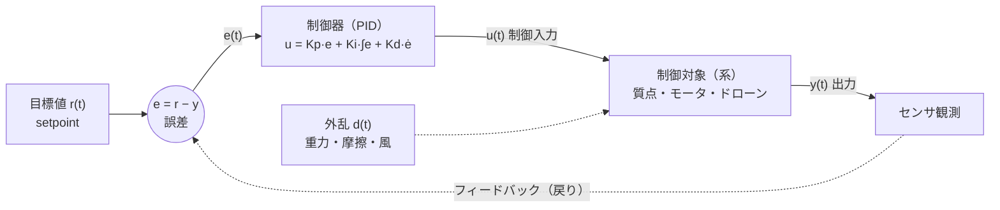
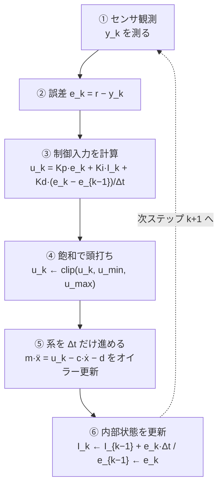
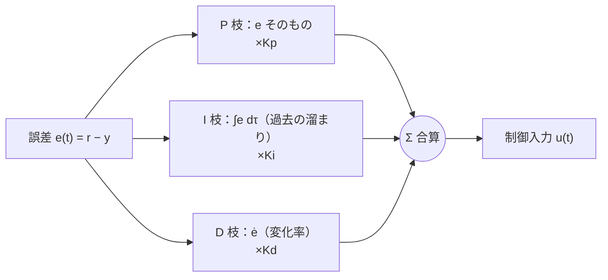
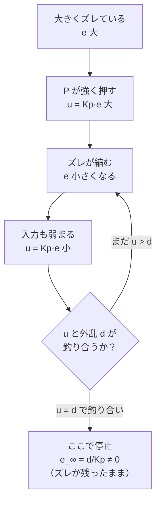
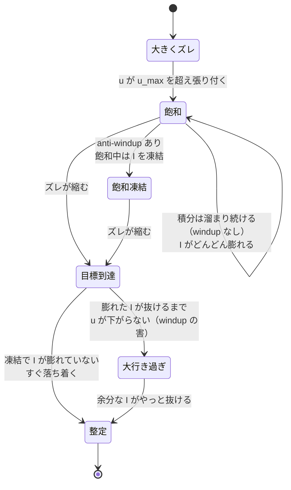
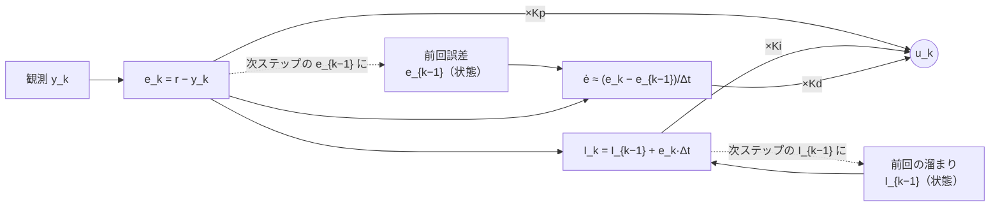
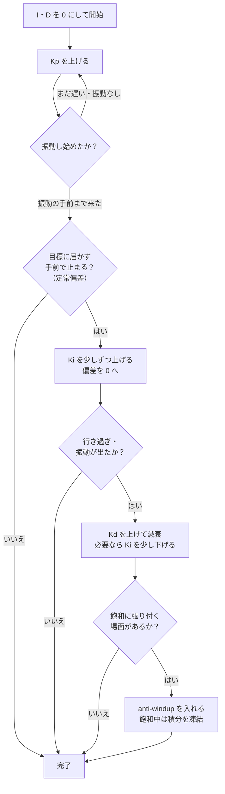

# 古典制御 — フィードバックと PID

:::abstract[学習目標]
この章を読み終えると、次のことができるようになります。

- **フィードバック制御**の輪（目標値 → 誤差 → 制御入力 → 系 → 観測 → 誤差…）を、各信号が何かまで含めて**説明**できる
- PID の各項 **P（比例）/ I（積分）/ D（微分）** が「誤差の何を見て」「何を直すか」を分けて**述べ**られる
- 連続形 $u(t)=K_p e + K_i\!\int e\,d\tau + K_d \dot e$ と、実装で使う**離散形**を**導出**できる
- **P だけでは定常偏差が残る／I がそれを消すが行き過ぎ（overshoot）とワインドアップを生む／D が振動を減衰させる**ことを、シミュレーションの数値で**確認**できる
- ゲイン $K_p, K_i, K_d$ を変えたとき、収束・オーバーシュート・整定時間がどう動くかを**調整**できる
:::

## 前提知識

- 章01 [Physical AI とは — 全体像と座標系](/physical-ai/01-overview-and-frames/)：ロボットの入力は**行動（トルク・速度・位置指令）**、出力は**センサ知覚**であること。制御とは「観測した状態から次の行動を決める写像」だという捉え方。
- 微積分の基礎：微分 $\dot e = de/dt$（誤差の変化率）と定積分 $\int_0^t e\,d\tau$（誤差の溜まり）。
- 常微分方程式の初歩：$m\dot v = F$ のような運動方程式を、時間を細かく刻んで数値的に更新する（オイラー法）こと。

:::note[LLM 出身の読者へ]
LLM の自己回帰デコードは「これまでの出力を見て次トークンを決める**離散時間のループ**」でした。制御も同じ**ループ**です。違いは、対象が**物理系**（連続時間・慣性・外乱あり）で、出力（行動）が次の観測を**物理法則で**変える点。「次トークン予測」を「次の制御入力の計算」に置き換えると、本章の構造はそのまま読めます。
:::

## 直感

ロボットの関節を「ちょうど 30 度」に保ちたい。ドローンを「高度 2 m」で止めたい。これらは**目標値 (setpoint) に現在値を一致させ続ける**問題です。

素朴な方法は「30 度になるトルクを事前に計算して与える」ことですが、これは脆い。重力・摩擦・風・ペイロードの重さ —— **モデルに書ききれない外乱**が必ずあり、計算した一発のトルクは現実とずれます。

そこで発想を変えます。**「目標とのズレ（誤差）を測り、ズレているぶんだけ修正する」** を高速に繰り返す。ズレが大きければ強く、小さければ弱く押す。これが**フィードバック制御**です。賢いのは、**外乱の正体を知らなくてよい**こと —— 外乱がズレを生めば、ズレを見て勝手に打ち消します。

:::note[2つの制御戦略：開ループ vs 閉ループ]
「事前に計算した一発のトルクを与える」素朴な方法を**フィードフォワード制御 / 開ループ (open-loop)**、「ズレを測って修正し続ける」方法を**フィードバック制御 / 閉ループ (closed-loop)** と呼びます。違いは**観測を使うか**の一点です。

| | 開ループ（フィードフォワード） | 閉ループ（フィードバック） |
| --- | --- | --- |
| 観測 $y$ を使うか | 使わない（出しっぱなし） | 使う（毎ステップ誤差を測る） |
| 外乱への強さ | 弱い（ズレてもそのまま） | 強い（ズレを見て打ち消す） |
| モデルの正確さ | **正確なモデルが必須** | モデルが粗くてよい |
| 例 | 「2秒だけ全力で押す」 | PID |

本章の PID は閉ループの代表です。実機では**両者を足す**（フィードフォワードで大まかに押し、フィードバックで残りのズレを潰す）のが定番ですが、まずは閉ループ単体を掴みます。
:::

PID は、この「ズレに応じて押す」を**3つの観点**で見るだけのものです。

- **今どれだけズレているか**（P：比例）
- **これまでズレが溜まっているか**（I：積分）
- **ズレが今どっちへ動いているか**（D：微分）

たった3つの数（ゲイン）で、世界中のモータ・ヒーター・ドローンの大半が動いています。最新の学習ベース方策ですら、いちばん下の層では PID/PD でトルクを追従させていることが多い —— **古典制御は消えず、学習方策の土台として残り続けています**。本章はその土台を、手を動かして掴みます。

## 全体像

フィードバック制御は**1本の輪 (loop)** です。順方向に「目標 → 誤差 → 制御器 → 系 → 出力」と流れ、出力が**逆方向に**戻って次の誤差を作ります。この「戻り」がフィードバックの本体です。



各信号の正体を最初に固定します（以降この記号で通します）。

| 記号 | 名前 | 何か | 軸・更新 |
| --- | --- | --- | --- |
| $r(t)$ | 目標値 (setpoint) | 到達したい値（例 30 度、2 m）。普通は人/上位層が与える定数 | 時刻 $t$ の関数。多くは一定 |
| $y(t)$ | 出力 (process variable) | センサで測った現在値。系の状態の一部 | 毎ステップ観測 |
| $e(t)$ | 誤差 | $e = r - y$。目標と現在の差。**正なら足りない、負なら行き過ぎ** | $r,y$ から毎ステップ計算 |
| $u(t)$ | 制御入力 | 制御器がアクチュエータへ出す指令（トルク・電圧・推力） | 毎ステップ $e$ から計算 |
| $d(t)$ | 外乱 | モデル外の力（重力・摩擦・風）。制御器は値を知らない | 系に勝手に加わる |

:::warning[「制御器が出力 y を作る」のではない]
制御器が直接決めるのは**制御入力 $u$ だけ**です。$u$ は系（物理法則）を通じて初めて $y$ を変えます。間に**慣性・抵抗・外乱**が挟まるので、「$u$ を上げた＝即 $y$ が上がる」ではありません。この「$u$ と $y$ の間に系が挟まる」ことが、後で見るオーバーシュート（行き過ぎ）の根本原因です。
:::

:::note[設計時 vs 実行時]
**設計時**に決めるのは3つのゲイン $K_p, K_i, K_d$（固定値・1度決めたら走行中は変えない）。**実行時**に毎ステップ動くのは $e, u$ と内部状態（積分の溜まり・前回誤差）。「何が固定で何が動くか」を切り分けると PID は一気に簡単になります。

| | 設計時に1度決める | 実行時に毎ステップ動く |
| --- | --- | --- |
| 量 | ゲイン $K_p, K_i, K_d$、制御周期 $\Delta t$、飽和限界 $u_{\min},u_{\max}$ | 誤差 $e_k$、制御入力 $u_k$ |
| 内部状態 | （なし） | 積分の溜まり $I_{k-1}$、前回誤差 $e_{k-1}$ |
| 由来 | 人/調整アルゴリズムが固定 | センサ観測 $y_k$ から計算 |

LLM のアナロジーで言えば、ゲインは**学習で決まる重み**（推論中は固定）、内部状態は**KV cache**（デコード中に持ち回る）に対応します。
:::

ここで、この輪が**1ステップだけ**どう回るかを時間方向にほどいて見ます（上の図は空間的な配線、下の図は時間的な手順）。1ステップは「観測 → 誤差 → 入力 → 系の更新 → 次の観測」という決まった順番で進みます。



この6ステップが $\Delta t$ ごとに延々と回り続けるのが PID の全実体です。理論・数式・実装は、すべてこの6ステップのどこを語っているかに位置づけられます（③ が PID 則、⑥ が状態の持ち回り）。

## 理論

### 誤差 — すべての出発点

PID は出力 $y$ そのものではなく、**誤差 $e = r - y$ だけ**を見ます。これが「**目標がいくつであろうと、ズレを 0 にすれば仕事は終わる**」という汎用性を生みます。制御器は系の中身（質量・摩擦の値）を知る必要がなく、誤差という1本の信号に反応するだけです。

PID 全体は、この1本の誤差信号を**3つの観点に分岐させ、それぞれ重み付けして足し戻す**構造をしています。下の図がその分岐と合流です。以降の P / I / D 各小節は、この3本の枝を1本ずつ詳しく見ていきます。



3本の枝は**同じ誤差を別の時間断面で見ている**だけです。P は「今」、I は「過去（時刻 0 から今までの積み上げ）」、D は「これから（変化率＝次の傾向）」。同じ材料を時間軸の3か所から切り出して合成するのが PID だ、と掴むと全体が見通せます。

### P（比例）— 今のズレに比例して押す

$$u_P(t) = K_p\, e(t)$$

いま $e$ だけズレていれば、その $K_p$ 倍だけ押す。$K_p$ を上げると応答は速くなりますが、**速くしすぎると行き過ぎて振動**します（後で実測します）。

:::warning[P だけでは定常偏差 (steady-state error) が残る]
これは PID で最初に出会う重要な事実です。一定の外乱 $d$（例：重力で常に下へ引く力）があると、**P 制御は必ずズレを残して止まります**。

理由を1ステップで歩きます。系が止まった（定常）状態では、釣り合いの式から制御入力が外乱を打ち消している必要があります：$u = d$。ところが P 制御の入力は $u = K_p e$ しかありません。すると

$$
K_p\, e_\infty = d \quad\Longrightarrow\quad e_\infty = \frac{d}{K_p} \neq 0
$$

つまり**誤差が完全に 0 になると入力も 0 になり、外乱を支えられない**。だから P 制御は「少しズレたまま」で釣り合います。$K_p$ を上げれば $e_\infty$ は小さくなりますが、**0 にはならず**、上げすぎると振動が出ます。この残るズレを消すのが次の I 項です。
:::

定常偏差が「なぜ残るか」を、P 制御の輪が落ち着く先として図でも掴んでおきます。誤差が小さくなると入力も小さくなり、外乱を支えきれなくなって**ある一点で釣り合って止まる** —— その釣り合い点が $e_\infty = d/K_p$ です。



### I（積分）— 溜まったズレを消す

$$u_I(t) = K_i \int_0^t e(\tau)\, d\tau$$

**過去の誤差を時間で積み上げた量**に比例して押します。ズレが少しでも残っていれば積分はじわじわ増え続け、入力 $u$ を押し上げます。**ズレが 0 になるまで積分は伸びるのを止めない** —— だから I 項は定常偏差を**原理的に 0 にできます**。

なぜ 0 にできるか。定常状態では積分の値が一定（$de_\infty/dt$ ぶんが溜まり終わる）。このとき $u = d$ を**誤差 0 のまま**満たせます：$e_\infty = 0$ でも積分項 $K_i\!\int e\,d\tau$ が外乱 $d$ ちょうどを供給できるからです。P と違い、入力源が「現在の誤差」から切り離されているのが効いています。

:::note[P と I の決定的な違い：入力源が誤差から切り離されているか]
P と I はどちらも「ズレを押し返す」枝ですが、**入力が何にぶら下がっているか**が違います。この一点が定常偏差を残すか消すかを決めます。

| | P 枝 | I 枝 |
| --- | --- | --- |
| 入力の式 | $u_P = K_p e$ | $u_I = K_i \int e\,d\tau$ |
| 入力源 | **今の誤差**そのもの | 過去の**積み上げ**（誤差の履歴） |
| $e=0$ のとき | $u_P = 0$（消える） | $u_I \neq 0$（**溜まった値が残る**） |
| 定常で外乱 $d$ を支えられるか | $e_\infty=d/K_p$ ぶんズレないと支えられない | $e_\infty=0$ でも積分が $d$ を供給できる |

つまり I 項は「誤差が消えても入力が消えない」唯一の枝です。これが定常偏差を 0 にできる仕組みの核心です。
:::

:::warning[I の代償：オーバーシュートとワインドアップ]
I は無料ではありません。

- **オーバーシュート（行き過ぎ）**：積分はズレが消えるまで溜まり続けるので、目標に達した瞬間にはすでに**溜まりすぎ**ている。その余分が目標を**通り越させ**ます。溜まった分が抜けるまで反対側へ行き、振動が増えます。
- **ワインドアップ (integral windup)**：アクチュエータには限界（最大トルク）があります。大きくズレている間、出力は限界に張り付くのに**積分は誤差を溜め続ける**。やがてズレが消えても、**膨れ上がった積分**が抜けるまで制御入力が下がらず、大きく行き過ぎます。対策が **anti-windup**（飽和中は積分を凍結する等）。後で実測でその差を見ます。
:::

ワインドアップが起きる流れは、状態の遷移として描くと一目で分かります。「飽和」と「積分が膨れる」が**同時に進行**するのが厄介な点です。anti-windup は、その同時進行を断ち切る（飽和中は積分を凍結する）対策だ、と図の分岐で掴めます。



### D（微分）— ズレの動きを先読みして抑える

$$u_D(t) = K_d\, \dot e(t) = K_d\, \frac{de(t)}{dt}$$

**誤差の変化率**に比例して押します。$\dot e$ は「ズレが今どっちへ、どれだけ速く動いているか」。ズレが急速に縮んでいる（目標へ猛スピードで近づいている）なら、$\dot e < 0$ で D 項はブレーキをかけます。

D の役割は**減衰 (damping)** です。目標に近づく勢いを早めに殺し、行き過ぎを防ぐ。P や I が「現在・過去」を見るのに対し、D だけが**未来の傾向を先読み**します。

:::note[符号で読む D の動作：いつブレーキ、いつアクセルか]
D が「ブレーキ」になるか「アクセル」になるかは $\dot e$ の符号で決まります。$e = r - y$ で目標 $r$ が一定なら $\dot e = -\dot y$ なので、結局**出力 $y$ の動く向き**を見ています。

| 状況 | $\dot e$ の符号 | $u_D = K_d\dot e$ | 効果 |
| --- | --- | --- | --- |
| 目標へ猛スピードで近づく（$y$ が急上昇） | $\dot e < 0$ | 負 | **ブレーキ**（行き過ぎを防ぐ） |
| 目標から離れていく（$y$ が下がる） | $\dot e > 0$ | 正 | 押し戻す（アクセル方向） |
| 止まっている（$\dot e = 0$） | 0 | 0 | **何もしない**（だから定常偏差は直せない） |

D が「未来を先読み」と言われるのは、**まだ誤差が残っていても、縮む勢いが強ければ先にブレーキを踏む**からです。P が「今の大きさ」しか見ないのに対し、D は「この勢いだと行き過ぎる」を変化率から察知します。
:::

:::warning[D は単独では使わない・ノイズに弱い]
$\dot e$ は微分なので、センサノイズの高周波成分を**増幅**します（小さなギザギザが、変化率にすると巨大になる）。だから実機では D に**ローパスフィルタ**をかけるのが定番。また D は「動いていないとき（$\dot e=0$）」何もしないので、**単独では目標へ寄せられません**。D は常に P や I と組み合わせ、「減衰係数」として効かせます。
:::

### 3項の役割を1枚で

| 項 | 式 | 誤差の何を見る | 時間断面 | 何を直す | 代償 |
| --- | --- | --- | --- | --- | --- |
| **P** | $K_p e$ | 今の大きさ | 現在 | 速く目標へ寄せる | 定常偏差が残る／強いと振動 |
| **I** | $K_i \int e\,d\tau$ | 過去の溜まり | 過去（0→今） | 定常偏差を 0 に | 行き過ぎ・ワインドアップ |
| **D** | $K_d \dot e$ | 今の変化率 | 未来の傾向 | 振動を減衰（ブレーキ） | ノイズ増幅・単独不可 |

<figure>
  <canvas id="pid-response" width="1600" height="640" aria-hidden="true"></canvas>
  <figcaption class="fig-cap"><span>目標値（破線）へのステップ応答。P は定常偏差が残って届かない／PI は届くが行き過ぎて振動／PID はなめらかに整定する</span><span>横軸 = 時間</span></figcaption>
</figure>

:::note[アナロジー：車を駐車位置に止める]
- **P** = 「目標線まで遠いほど強くアクセル」。近いと弱い。
- **I** = 「ずっと手前で止まってる（坂で下がる）なら、じわじわ踏み増す」。坂（＝定常外乱）を消す。
- **D** = 「目標線へ近づく速さが速いほどブレーキ」。オーバーランを防ぐ。

3つの感覚を足し合わせたのがあなたの足です。それが PID です。
:::

## 数式の導出

### 連続形 PID 則

3つの寄与を線形に足したものが PID 制御則です。

$$
u(t) = K_p\, e(t) + K_i \int_0^t e(\tau)\, d\tau + K_d\, \dot e(t)
$$

- $e(t) = r(t) - y(t)$：誤差。
- $K_p, K_i, K_d \ge 0$：比例・積分・微分ゲイン（**設計時に固定**する3つの数）。
- 第1項は現在、第2項は過去（時刻 0 から今までの積分）、第3項は未来の傾向（変化率）。**時間の3つの断面**を1本の入力に合成しています。

### 離散形 — 実機・コードで動かすために

実機やシミュレータは連続時間を扱えません。サンプリング周期 $\Delta t$（例 5 ms）ごとに動く**離散時間ループ**へ落とします。ステップ番号を $k=0,1,2,\dots$、時刻 $t_k = k\,\Delta t$、$e_k = e(t_k)$ と書きます。

連続形の3つの項を、離散の世界では下の対応で置き換えます。導出はこの表の各行を1つずつ近似していく作業です。

| 連続形 | 離散の近似 | 近似の名前 | 持ち回す状態 |
| --- | --- | --- | --- |
| $e(t)$ | $e_k = r - y_k$ | （そのまま） | なし |
| $\int_0^t e\,d\tau$ | $I_k = I_{k-1} + e_k\Delta t$ | 矩形近似（左リーマン和） | 前回の溜まり $I_{k-1}$ |
| $\dot e(t)$ | $(e_k - e_{k-1})/\Delta t$ | 後退差分 | 前回誤差 $e_{k-1}$ |

**積分**は、矩形近似（各ステップで $e_k \Delta t$ ずつ溜める）で累積和に置き換えます。$I_k$ を「ステップ $k$ までの積分の溜まり」とすると、

$$
\int_0^{t_k} e(\tau)\, d\tau \;\approx\; \sum_{j=0}^{k} e_j\, \Delta t \;=\; I_k,\qquad I_k = I_{k-1} + e_k\,\Delta t
$$

積分は**毎ステップ前回値に足すだけ**（$I_{k-1}$ を状態として持ち回す）で計算できます。ここが LLM の KV cache と同じ「状態を使い回す」発想です。

**微分**は、後退差分（今と1つ前の誤差の差を $\Delta t$ で割る）で近似します。

$$
\dot e(t_k) \;\approx\; \frac{e_k - e_{k-1}}{\Delta t}
$$

これらを連続形に代入すると、**離散 PID 則**が得られます。

$$
u_k = K_p\, e_k + K_i\, I_k + K_d\, \frac{e_k - e_{k-1}}{\Delta t}
$$

各ステップで持ち回す状態は**たった2つ**：積分の溜まり $I_{k-1}$ と前回誤差 $e_{k-1}$。これが PID 実装の全てです。$\blacksquare$

導出した離散則を、実装でどう回すかをデータの流れで確かめます。下の図で「左から入ってくる新しい観測 $y_k$」と「上から持ち越される2つの状態 $I_{k-1}, e_{k-1}$」が合流して $u_k$ を作り、状態が次ステップへ更新されていく様子が、上の数式とそのまま対応します。



:::note[なぜこの近似で十分か]
$\Delta t$ が系の動きより十分速ければ（ロボットなら 1–10 ms が定番）、矩形・後退差分という素朴な近似でも実用十分です。$\Delta t$ を大きくしすぎると、誤差を見て反応するまでの遅れが効いて**不安定化**します。これが「制御周期は速いほど安全」の理由です。
:::

:::warning[$K_i, K_d$ と $\Delta t$ の関係を取り違えない]
離散形では積分に $\Delta t$ を**掛け**、微分は $\Delta t$ で**割り**ます。$\Delta t$ を変えると同じ $K_i, K_d$ でも実効的な効きが変わる、と誤解しがちですが、上の式のように $\Delta t$ を式に明示的に含めておけば、ゲイン $K_i, K_d$ は $\Delta t$ に依らず同じ意味を保ちます（連続形の係数そのもの）。$\Delta t$ をゲインに吸収させて書く流儀もありますが、本章は連続形と対応が取れる上の形を使います。
:::

## 実装

抵抗付き質点を**目標位置へ動かす**2次系で、P / PD / PI / PID の挙動を実測します。系の運動方程式は

$$
m\,\ddot x = u - c\,\dot x - d
$$

- $x$：位置（出力 $y$）、$\dot x$：速度、$m$：質量、$c$：粘性抵抗、$d$：**一定外乱**（重力のように常に下へ引く力）。
- 目標 $x^\ast = 1.0$。外乱 $d=5$ を入れることで「P だけだと定常偏差が残る」が**はっきり**見えます。

この系は**慣性 $m$ を持つ2次系**なので、押しすぎると行き過ぎる（オーバーシュート）—— D の出番が自然に現れます。

:::note[なぜ「2次系」か・なぜ慣性があると行き過ぎるか]
運動方程式に $\ddot x$（加速度）が出るので、入力 $u$ から出力 $x$ までに**積分が2段**挟まります：$u \to$（割って加速度）$\to$（積分して）速度 $\dot x \to$（もう一度積分して）位置 $x$。この「入力が位置に届くまで2段の積分を通る」のが**2次系**の意味です。

慣性 $m$ があると、目標に着いた瞬間でも**速度 $\dot x$ がまだ残っている**。速度はすぐには 0 にならない（質量を止めるのに力と時間が要る）ので、その勢いで目標を**通り越す** —— これがオーバーシュートの物理的な正体です。D 項が「速度（＝$-\dot e$）が大きいうちに先にブレーキ」をかけるのは、まさにこの残り速度を殺すためです。
:::

```python title="pid_mass.py"
import numpy as np

# 2次系: m*x'' = u - c*x' - d （位置 x を目標へ・一定外乱 d 付き）
def sim(Kp, Ki, Kd, m=1.0, c=2.0, d=5.0, target=1.0, dt=0.005, T=8.0,
        u_min=-50.0, u_max=50.0, windup=True):
    n = int(T / dt)
    x, xd, integ = 0.0, 0.0, 0.0          # 位置・速度・積分の溜まり（状態）
    e_prev = target - x                    # 前回誤差（微分用の状態）
    xs = np.zeros(n + 1); xs[0] = x
    for k in range(n):
        e  = target - x                    # 誤差 e = r - y
        de = (e - e_prev) / dt             # 後退差分で微分を近似
        integ_try = integ + e * dt         # 矩形近似で積分を1ステップ溜める
        u = Kp * e + Ki * integ_try + Kd * de
        u_clamped = np.clip(u, u_min, u_max)
        # anti-windup: 飽和中で誤差と入力が同符号なら積分を凍結（溜め込まない）
        if u != u_clamped and (e * u > 0) and windup:
            u = np.clip(Kp * e + Ki * integ + Kd * de, u_min, u_max)
        else:
            integ = integ_try              # 飽和していなければ積分を確定
            u = u_clamped
        x_dd = (u - c * xd - d) / m        # 運動方程式（オイラー法で更新）
        xd  += x_dd * dt
        x   += xd  * dt
        e_prev = e
        xs[k + 1] = x
    return xs

def metrics(xs, target, dt):
    n = len(xs); t = np.arange(n) * dt
    ss = target - xs[-1]                    # 定常偏差（最終値の残りズレ）
    overshoot = max(0.0, (xs.max() - target) / target * 100)  # 行き過ぎ[%]
    band = 0.02 * abs(target); settled = None                 # ±2%整定時間
    for i in range(n):
        if np.all(np.abs(xs[i:] - target) <= band):
            settled = t[i]; break
    return ss, overshoot, settled

target, dt = 1.0, 0.005
print("=== 2次系（質点+抵抗+一定外乱 d=5）位置制御 目標 x*=1.0 ===")
for name, (Kp, Ki, Kd) in [
    ("P のみ (Kp=20)",          (20.0,  0.0,  0.0)),
    ("PD (Kp=20,Kd=10)",        (20.0,  0.0, 10.0)),
    ("PI (Kp=20,Ki=40)",        (20.0, 40.0,  0.0)),
    ("PID (Kp=20,Ki=40,Kd=10)", (20.0, 40.0, 10.0)),
]:
    xs = sim(Kp, Ki, Kd, target=target, dt=dt)
    ss, ov, st = metrics(xs, target, dt)
    st_s = f"{st:.2f}s" if st is not None else "未整定"
    print(f"{name:26s} 最終値={xs[-1]:.4f} 定常偏差={ss:+.4f} "
          f"行過ぎ={ov:5.1f}% 整定={st_s}")

# anti-windup の効果（強い飽和 |u|<=8 のもとで比較）
print("\n=== anti-windup 効果（Kp=20,Ki=40,Kd=10, |u|<=8 で飽和） ===")
for label, w in [("anti-windup あり", True), ("anti-windup なし", False)]:
    xs = sim(20.0, 40.0, 10.0, target=target, dt=dt, u_max=8.0, u_min=-8.0, windup=w)
    ss, ov, st = metrics(xs, target, dt)
    st_s = f"{st:.2f}s" if st is not None else "未整定"
    print(f"{label:18s} 最終値={xs[-1]:.4f} 行過ぎ={ov:5.1f}% 整定={st_s}")
```

実行（`uv run --with numpy python pid_mass.py`）の実測出力：

```text title="出力"
=== 2次系（質点+抵抗+一定外乱 d=5）位置制御 目標 x*=1.0 ===
P のみ (Kp=20)               最終値=0.7502 定常偏差=+0.2498 行過ぎ= 11.4% 整定=未整定
PD (Kp=20,Kd=10)           最終値=0.7500 定常偏差=+0.2500 行過ぎ=  0.0% 整定=未整定
PI (Kp=20,Ki=40)           最終値=1.2256 定常偏差=-0.2256 行過ぎ= 78.1% 整定=未整定
PID (Kp=20,Ki=40,Kd=10)    最終値=1.0008 定常偏差=-0.0008 行過ぎ= 33.9% 整定=5.16s

=== anti-windup 効果（Kp=20,Ki=40,Kd=10, |u|<=8 で飽和） ===
anti-windup あり     最終値=0.9991 行過ぎ= 23.3% 整定=4.41s
anti-windup なし     最終値=0.9981 行過ぎ= 64.3% 整定=5.98s
```

この数値は理論をそのまま裏づけます。1行ずつ読みます。

- **P のみ**：定常偏差 $+0.2498$ が残る。理論値は $e_\infty = d/K_p = 5/20 = 0.25$ —— **実測とぴったり一致**。$K_p$ を上げれば縮むが 0 にはならない。
- **PD**：D を足すと**行き過ぎが 11.4% → 0.0%** に消える（D の減衰）。だが**定常偏差 $+0.25$ は残ったまま** —— **D は定常偏差を直さない**（$\dot e=0$ では D は無力）。
- **PI**：I が定常偏差を消しにいくが、減衰が無いので**行き過ぎ 78.1%** と大暴れし、整定しない。I 単独の危うさ（溜め込みすぎ）が出ています。
- **PID**：3項そろうと最終値 $1.0008$（**定常偏差ほぼ 0**）で**整定（5.16s）**。I が偏差を消し、D が振動を抑える分業ができています。
- **anti-windup**：アクチュエータを $|u|\le 8$ に絞ると、凍結なしは積分が膨れて**行き過ぎ 64.3%**。凍結ありは **23.3%** に収まる —— ワインドアップ対策の効果が数値で見えます。

この4行を「どの指標が・どの項のせいで・どう動いたか」で一望すると、各項の分業がはっきりします。

| 構成 | 定常偏差 | 行き過ぎ | 整定 | 読み（どの項が効いた/欠けた） |
| --- | --- | --- | --- | --- |
| **P** | $+0.25$（残る） | 11.4% | 未整定 | I が無く偏差が残る・減衰も足りない |
| **PD** | $+0.25$（残る） | **0.0%** | 未整定 | D が振動を消すが、I が無いので偏差は残ったまま |
| **PI** | $-0.23$（消えかけ） | **78.1%** | 未整定 | I が偏差を消しにいくが D が無く大暴れ |
| **PID** | $-0.0008$（ほぼ 0） | 33.9% | **5.16s** | I が偏差を消し D が振動を抑え、初めて整定 |

:::warning[「PD で行き過ぎ 0%」を「PD が一番良い」と読まない]
PD は行き過ぎ 0.0% で一見きれいですが、**目標 1.0 に対して 0.75 で止まっており、そもそも目標に届いていません**（偏差 0.25 が残ったまま）。行き過ぎないのは当然で、目標を**下回ったまま動かない**からです。指標は1つだけ見ると誤読します —— 行き過ぎ・定常偏差・整定時間を**3つ揃えて**読み、「速いが届かない（P/PD）」「届くが暴れる（PI）」「届いて落ち着く（PID）」の三者を区別してください。
:::

:::note[ゲイン調整の指針（この実測から読み取れること）]
手で回すときの定石（Ziegler–Nichols の前段）：まず I・D を切り **P だけ上げて**振動の手前まで持っていく → 残る定常偏差を **I で消す**（上げすぎると行き過ぎ）→ 行き過ぎを **D で抑える**。上の表は、まさにこの順に項を足したときの各段階のスナップショットになっています。
:::

その調整の手順を、症状から次の一手へ進む分岐図にしておきます。実機で「どこから手を付けるか／次に何をいじるか」に迷ったとき、この分岐をたどると上の P→I→D の順序を再現できます。



## 演習

::::question[演習 1: P 制御の定常偏差]
質量 $m=1$、粘性 $c=2$ の質点に一定外乱 $d=8$ がかかっています。P 制御（$K_i=K_d=0$）でゲイン $K_p=40$、目標 $x^\ast=2.0$ とします。(a) 定常状態で釣り合う条件を式で書いてください。(b) 残る定常偏差 $e_\infty$ はいくつですか。(c) 偏差を半分にするには $K_p$ をどうしますか。また、それでも 0 にできないのはなぜですか。

:::details[解答]
(a) 定常状態では $\dot x = \ddot x = 0$ なので運動方程式 $m\ddot x = u - c\dot x - d$ は $0 = u - d$、すなわち**制御入力が外乱を支える** $u = d = 8$ が条件です（粘性項は $\dot x=0$ で消える）。

(b) P 制御では $u = K_p e_\infty$。これが $d$ に等しいので

$$
K_p\, e_\infty = d \;\Longrightarrow\; e_\infty = \frac{d}{K_p} = \frac{8}{40} = 0.2
$$

目標 $x^\ast=2.0$ に対し、$0.2$ 足りない $x_\infty = 1.8$ で止まります。

(c) $e_\infty = d/K_p$ なので $K_p$ を**2倍（$=80$）**にすれば偏差は半分（$0.1$）。しかし $K_p \to \infty$ でしか $e_\infty \to 0$ にならず、有限の $K_p$ では**必ず残ります**。理由は「誤差が 0 になると P の入力も 0 になり、外乱 $d$ を支えられない」から。これを構造的に消すのが I 項です。
:::
::::

::::question[演習 2: 各項の役割の切り分け]
あるロボット関節を PID で目標角へ動かしたところ、(i) 目標へ着くが**毎回少し手前で止まる**、(ii) 別の調整では目標を**大きく行き過ぎて何度も振動**する、という2つの症状が出ました。(a) (i) (ii) はそれぞれどの項の不足/過剰が疑わしいですか。(b) D 項を強めると (i) は直りますか。(c) 「アクチュエータが限界に張り付いた後、ズレが消えても入力が下がらず大きく行き過ぎる」のは何という現象で、対策は何ですか。

:::details[解答]
(a) (i) 手前で止まる＝**定常偏差**。原因は **I 項の不足**（外乱や摩擦を支えきれていない）。$K_i$ を上げて溜まりで押し切ります。(ii) 大きく行き過ぎて振動＝**減衰不足**。**D 項の不足**（または $K_p,K_i$ の過剰）。$K_d$ を上げてブレーキをかけ、必要なら $K_i$ を下げます。

(b) **直りません。** D は $\dot e$ に比例し、止まっている（$\dot e=0$）ときは何も出しません。定常偏差は変化率 0 の状態なので D は無力。定常偏差を消すのは **I 項**の仕事です。D を強めても「止まる手前のズレ」はそのまま残ります。

(c) **integral windup（積分ワインドアップ）**。大きくズレている間にアクチュエータが飽和（最大トルクに張り付き）しても積分が誤差を溜め続け、膨れ上がった積分が抜けるまで入力が下がらず大きく行き過ぎます。対策は **anti-windup** —— 飽和中は積分を凍結する（conditional integration）、積分値に上限を設ける（clamping）、飽和量を積分にフィードバックする（back-calculation）などです。本章の実装では「飽和中かつ誤差と入力が同符号なら積分を更新しない」凍結方式を使い、行き過ぎが 64.3% → 23.3% に減ることを実測しました。
:::
::::

::::question[演習 3: 離散化と状態の持ち回り]
離散 PID 則 $u_k = K_p e_k + K_i I_k + K_d (e_k - e_{k-1})/\Delta t$、$I_k = I_{k-1} + e_k\Delta t$ を考えます。(a) 各ステップで次のステップへ持ち越す必要がある内部状態は何と何ですか。(b) 制御周期 $\Delta t$ を 5 ms から 50 ms へ広げると、同じゲインでも何が起きやすくなりますか。理由も述べてください。(c) 積分の溜まり $I_k$ を計算する前にプログラムを再起動して $I$ を 0 に戻してしまうと、定常状態の振る舞いはどう変わりますか。

:::details[解答]
(a) **積分の溜まり $I_{k-1}$** と **前回誤差 $e_{k-1}$** の2つだけです。$I_{k-1}$ は積分項の累積に、$e_{k-1}$ は微分の後退差分 $(e_k-e_{k-1})/\Delta t$ に使います。この2変数を持っていれば、新しい観測 $y_k$ から $u_k$ を計算でき、それ以外の履歴は不要です（LLM の KV cache が「過去全部」でなく必要な状態だけを持つのと同じ発想）。

(b) **不安定化（振動・発散）しやすくなります。** $\Delta t$ が大きいと、誤差を見てから反応するまでの遅れが大きくなり、系がすでに行き過ぎてから初めて修正がかかる、という後追いが起きます。後退差分の微分近似も粗くなり、D の減衰が効きにくくなります。これが「制御周期は速いほど安全」の理由です。

(c) **定常偏差が一時的に復活します。** $I$ を 0 に戻すと、それまで外乱 $d$ を支えていた積分の溜まりが消え、瞬間的に P 制御と同じ「$e_\infty = d/K_p$ の偏差が残る」状態に戻ります。その後 I 項が再び溜まり直して偏差を 0 へ戻しますが、戻るまでに過渡的なズレが出ます。実機で「電源を入れ直したら一瞬下がった」がこれです。
:::
::::

## まとめ

:::success[この章の要点]
- **フィードバック制御**は「目標 → 誤差 $e=r-y$ → 制御入力 $u$ → 系 → 出力 → 誤差…」の閉じた輪。外乱の正体を知らなくても、誤差を見て勝手に打ち消すのが強み。観測を使わない開ループ（フィードフォワード）との違いは「ズレを測って直すか」の一点。
- **PID** は誤差を3つの時間断面で見る：**P**（今の大きさ）・**I**（過去の溜まり）・**D**（今の変化率）。$u = K_p e + K_i\!\int e\,d\tau + K_d \dot e$。同じ誤差を3本の枝に分岐させ、重み付けして足し戻す構造。
- **P だけでは定常偏差 $e_\infty=d/K_p$ が残る**（誤差 0 で入力 0 になり外乱を支えられない）。**I がこれを 0 にする**（入力源が現在の誤差から切り離されている）が、溜め込みすぎで**オーバーシュート**と**ワインドアップ**を生む。**D は変化率にブレーキをかけ振動を減衰**させるが、定常偏差は直さずノイズに弱い。
- 実装は離散形 $u_k = K_p e_k + K_i I_k + K_d (e_k - e_{k-1})/\Delta t$。持ち回す状態は**積分の溜まりと前回誤差の2つだけ**。
- ゲイン調整は **P を上げ → I で偏差消し → D で振動抑制** の順。飽和があるときは **anti-windup** を必ず入れる。
:::

### 次に学ぶこと

PID は「モデルを陽に持たず、誤差にその場で反応する」最も基本的なフィードバック則でした。ゲインは試行錯誤（あるいは経験則）で決めるしかなく、複数の状態・入力が絡む系では手調整が破綻します。次章では**系のモデル（状態方程式）とコスト関数を与え、最適なフィードバックゲインを数学的に導く**最適制御へ進みます。PID の $K_p, K_d$ を「勘で決める」代わりに、Riccati 方程式から**最適に決める**のが LQR です。

→ [4. 最適制御](/physical-ai/04-optimal-control/)

## 用語ミニ辞典

| 用語 | 一言 |
| --- | --- |
| feedback control | 誤差を測り、ズレぶん修正する輪。外乱の正体を知らなくてよい |
| feedforward control | 観測を使わず事前計算した入力を出す開ループ。モデルが正確なら有効 |
| setpoint $r$ | 到達したい目標値 |
| error $e=r-y$ | 目標と現在の差。PID が見る唯一の信号 |
| P（比例） | $K_p e$。今のズレに比例。速いが定常偏差が残る |
| I（積分） | $K_i\!\int e\,d\tau$。溜まったズレで定常偏差を 0 に。行き過ぎを生む |
| D（微分） | $K_d \dot e$。変化率にブレーキ。振動を減衰。ノイズに弱い |
| steady-state error | 定常偏差。止まったときに残るズレ。P で $d/K_p$ |
| overshoot | 行き過ぎ。目標を通り越す量。主に I 過剰・減衰不足 |
| integral windup | 飽和中に積分が膨れ、抜けるまで入力が下がらず大行き過ぎ |
| anti-windup | 飽和中の積分凍結・上限・back-calculation でワインドアップ防止 |
| settling time | 整定時間。目標の±数%帯に収まり続けるまでの時間 |
| 2次系 | 入力から出力まで積分が2段（加速度→速度→位置）。慣性ゆえ行き過ぎる |
| ゲイン $K_p,K_i,K_d$ | 設計時に固定する3つの数。走行中は変えない |

## 次のアクション

理論を手で定着させる。**最小の写経 → 動かす → 小実験** を1セットで。

1. 上の `pid_mass.py` を写経して `uv run --with numpy python pid_mass.py` で動かし、**P / PD / PI / PID の4行と anti-windup 2行が再現**することを確かめる。
2. `Kp` を 10 → 20 → 40 と上げて、**P のみの定常偏差が $d/K_p$ に従って縮む**ことを数値で確認する（理論値と突き合わせる）。
3. PID で `Ki` を上げる/下げる、`Kd` を上げる/下げると、**行き過ぎ（overshoot）と整定時間がどう動くか**を表にして、§実装の調整指針（P→I→D の順）を自分の手で再発見する。余力があれば、外乱 $d$ をステップ的に途中で変える（風が吹く）よう改造し、I 項が新しい外乱を吸収して再び偏差 0 へ戻る様子を観察する。

ここまでで、学習方策の最下層に今も残る**フィードバック制御の土台**が手に入ります。次章 [最適制御](/physical-ai/04-optimal-control/) で、ゲインを勘でなく**最適に**決める枠組みへ進みます。

## 参考文献

1. K. J. Åström, R. M. Murray, *Feedback Systems: An Introduction for Scientists and Engineers*, 2nd ed., Princeton University Press, 2021.（フィードバック制御・PID の定番入門）
2. K. J. Åström, T. Hägglund, *PID Controllers: Theory, Design, and Tuning*, 2nd ed., ISA, 1995.（PID とチューニング・anti-windup の標準書）
3. J. G. Ziegler, N. B. Nichols, "Optimum Settings for Automatic Controllers," *Transactions of the ASME*, 1942.（Ziegler–Nichols ゲイン調整則の原典）
4. G. F. Franklin, J. D. Powell, A. Emami-Naeini, *Feedback Control of Dynamic Systems*, 8th ed., Pearson, 2019.（制御工学の標準教科書）
5. R. C. Dorf, R. H. Bishop, *Modern Control Systems*, 13th ed., Pearson, 2017.（古典制御・安定性の定番）
