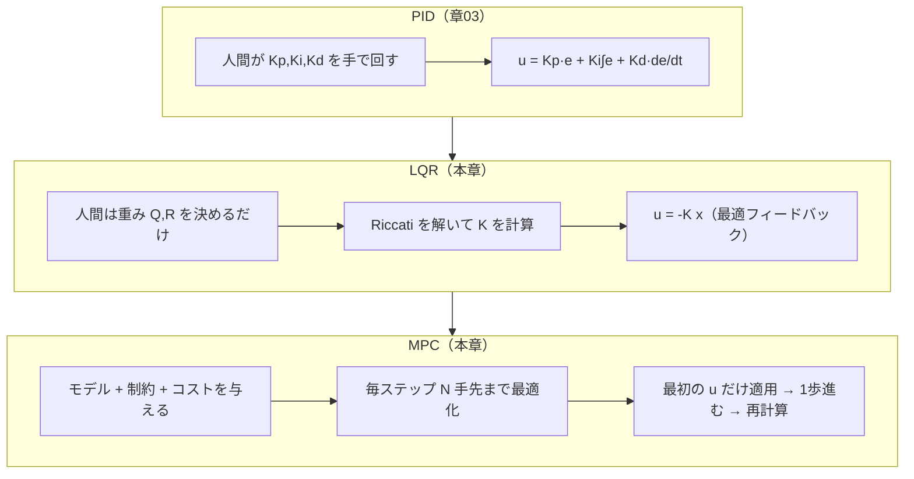
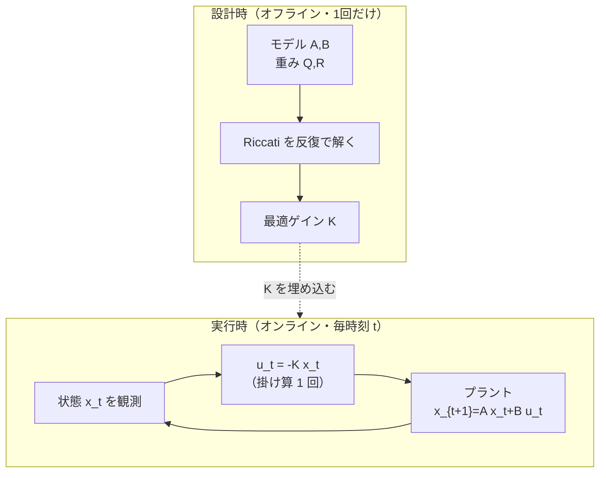
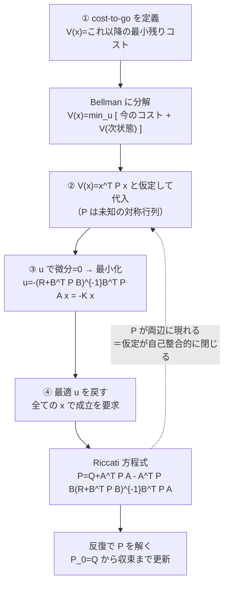
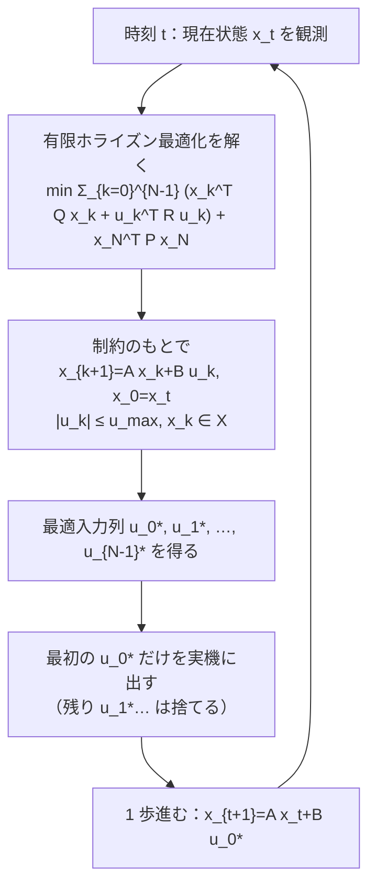
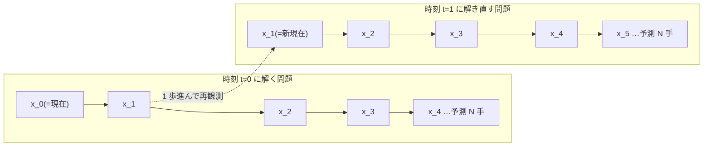
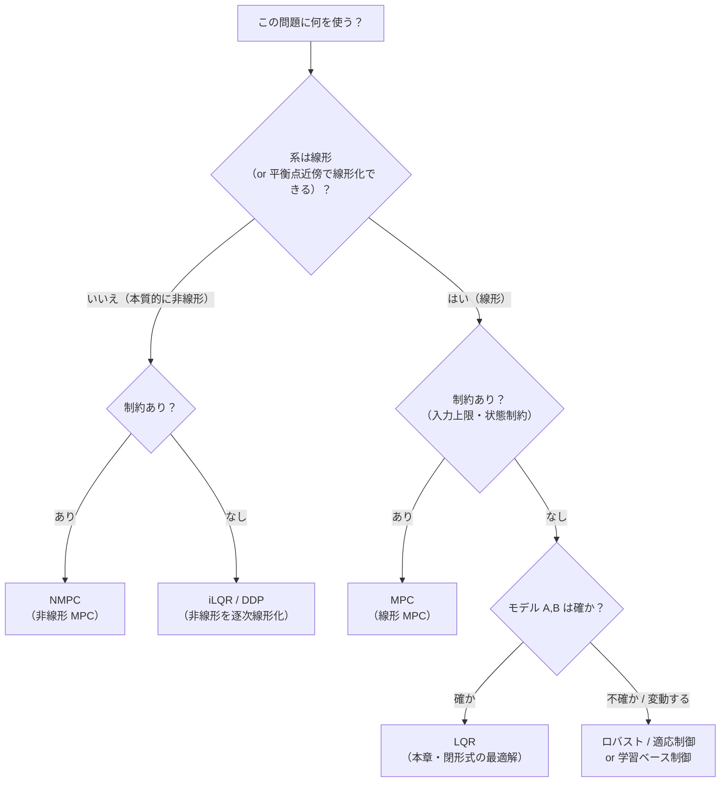

# 最適制御 — LQR と MPC

:::abstract[学習目標]
この章を読み終えると、次のことができるようになります。

- PID の「ゲインを手で回す」設計と、最適制御の「コストを決めて最適ゲインを**計算する**」設計の違いを説明できる
- **LQR**（線形系・2次コスト）で、なぜ最適制御則が $u_t = -K x_t$ という**状態の線形フィードバック**になるのかを述べられる
- 離散 **Riccati 方程式**を反復で解いてゲイン $K$ を求める手順を説明できる
- **MPC**（後退ホライズン）が LQR と何が違い、なぜ**制約**を扱えるのかを説明できる
- LQR が「最適」であるための**前提**（線形系・2次コスト・モデル既知）を列挙し、破れる場面を判別できる
:::

## 前提知識

- 章03 [古典制御 — PID](/physical-ai/03-pid-control/)：誤差の比例・積分・微分からフィードバックを作る考え方、ゲインを手で調整するということの意味
- 線形代数：行列・ベクトルの積、転置、逆行列、固有値（安定性の判定に使います）
- 状態空間モデルの発想：時刻 $t$ の状態 $x_t$ が、次の時刻 $x_{t+1}$ にどう移るかを行列で書くこと（本章で復習します）

PID を「手で回すダイヤル」だとすると、本章は「コスト関数というダイヤルの**目盛り**を決めれば、最適なダイヤル位置が自動で出てくる」話です。差分だけを丁寧に積み上げます。

## 直感

章03 の PID では、比例ゲイン $K_p$・積分ゲイン $K_i$・微分ゲイン $K_d$ を**人間が手で回して**、行き過ぎ（overshoot）と遅さのバランスを探りました。1 入力 1 出力の系ならこれで十分です。

しかし状態が増える（位置・速度・姿勢…）と、手調整は急に難しくなります。「位置の誤差を 3 倍重く見て、速度の誤差は軽く、制御のエネルギーはほどほどに抑えたい」——こういう**複数の願い**を、3 つのダイヤルだけで同時に満たすのは無理が出ます。

最適制御の発想は逆向きです。**ゲインを探すのをやめ、「何を良しとするか」を先に式で書く。** たとえば「状態の誤差と制御の大きさを、ずっと足し合わせた総量を最小にしたい」と決める。すると——線形な系と 2 次のコストという条件のもとでは——**最適なフィードバックゲイン $K$ が計算で一発で出てきます**。手で回す代わりに、コストの**重み**を決めるだけ。これが **LQR (Linear-Quadratic Regulator)** です。

さらに、現実には「アクチュエータの出力には上限がある」「壁にぶつかってはいけない」といった**制約**があります。LQR はこれを扱えません。そこで「少し先の未来までシミュレーションして、制約を守りつつ最善の一手を選び、1 ステップ進んでまた考え直す」——これが **MPC (Model Predictive Control)** です。本章はこの 2 つを、最小の実装で動かして確かめます。

## 全体像

制御則の設計を「何を人間が与え、何が自動で出るか」で並べると、PID → LQR → MPC は連続したスペクトル上にあります。



向きを揃えて見ると、こうです。

- **順方向（設計時）**：人間が「良さの基準」を式で与える。LQR では重み行列 $Q, R$、MPC では加えて制約。
- **逆方向（実行時）**：その基準から導いた制御則が、毎時刻 $x_t$ を見て $u_t$ を吐く。LQR は $u_t = -K x_t$ という**固定ゲインの掛け算 1 回**だけ。MPC は毎時刻**最適化問題を解き直す**。

| | PID | LQR | MPC |
| --- | --- | --- | --- |
| 人間が与えるもの | ゲイン $K_p,K_i,K_d$（直接） | 重み $Q, R$ | モデル・コスト・**制約** |
| モデルを使うか | 使わない | **使う**（$A, B$ 既知） | **使う**（$f$ 既知） |
| 制約（入力上限など） | 扱えない | 扱えない | **扱える** |
| 設計時の計算 | 手調整 | Riccati を 1 回解く | （無制約なら）Riccati |
| 実行時の計算 | 掛け算と積分 | 掛け算 $-Kx$ 1 回 | **毎ステップ最適化** |
| 最適性 | 保証なし | **大域最適**（前提下） | ホライズン内で最適 |

:::note[PID は LQR の特別な場合とも見える]
状態を $x=[e, \int e, \dot e]$ と置けば、$u=-Kx$ は「誤差・積分・微分の線形結合」＝ PID と同じ形です。つまり PID は「ゲインを手で置いた $u=-Kx$」、LQR は「同じ形のゲインをコストから**最適に計算**した $u=-Kx$」。連続した話だと掴んでおくと、章03 からの橋渡しが楽になります。
:::

この章の中心となる「制御ループ」を、設計時に作った固定ゲイン $K$ を実機が毎時刻どう回すかという**動作**の視点で 1 枚にしておきます。設計時（上の箱）と実行時（下のループ）が時間軸で完全に分かれていること、実行時に回るのは掛け算 1 回だけであることが、この図の主張です。



注意してほしいのは、`Riccati を解く` 箱は実行ループの**外**にいることです。重い計算は事前に 1 回だけ済ませ、ループの中には残さない。これが「設計時 vs 実行時」を分けて考える価値で、後述の MPC ではこの境界が崩れます（最適化がループの中に入る）。

## 理論

### 線形な系：状態空間モデル

最適制御を語るには、まず系の動きを式にします。**状態 (state)** $x_t \in \mathbb{R}^n$ を、その時刻のシステムを完全に表す最小の量とします（例：位置と速度）。**制御入力 (control input)** $u_t \in \mathbb{R}^m$ を、私たちが選べる量とします（例：加速度・トルク）。

系が**線形**で時間によらない（LTI: Linear Time-Invariant）とき、次の状態は行列の積で書けます。

$$
x_{t+1} = A x_t + B u_t
$$

- $x_t \in \mathbb{R}^n$：時刻 $t$ の状態ベクトル。$n$ 個の成分（位置・速度…）を持つ。
- $u_t \in \mathbb{R}^m$：時刻 $t$ の制御入力。$m$ 個の成分（各アクチュエータ）。
- $A \in \mathbb{R}^{n\times n}$：**システム行列**。入力が無いとき状態が自然にどう移るか（慣性・減衰など）。データに依存しない、系の物理で決まる**固定値**。
- $B \in \mathbb{R}^{n\times m}$：**入力行列**。入力 $u_t$ が状態にどう効くか。これも物理で決まる固定値。

:::warning[$A, B$ は「学習」しない・「既知」が前提]
LQR/MPC では $A, B$ は**設計者がモデルから与える既知の行列**です。観測データから推定するわけでも、勾配で学習するわけでもありません（それは system identification や学習ベース制御の話で、本章の範囲外）。「モデルが既知」という前提はあとで誤解の節（[$\to$](#誤解先回りlqr-は最適だが前提付き)）でもう一度名指しします。
:::

### コスト関数：何を良しとするか

PID では「良さ」を式に書きませんでした。LQR は**コスト関数 (cost function)** $J$ を陽に書き、これを最小化します。状態が原点 $x=0$（目標）に近く、かつ制御 $u$ が小さいほど良い、と決めます。

$$
J = \sum_{t=0}^{\infty} \left( x_t^\top Q\, x_t + u_t^\top R\, u_t \right)
$$

各記号を全部定義します。

- $x_t^\top Q\, x_t$：**状態コスト**。状態が原点からどれだけ外れているかのペナルティ。
- $Q \in \mathbb{R}^{n\times n}$：状態の重み行列。**半正定値**（$Q \succeq 0$）。対角成分 $Q_{ii}$ が大きいほど「$i$ 番目の状態の誤差を強く嫌う」。たとえば $Q=\mathrm{diag}(1, 0.1)$ なら「位置の誤差は速度の誤差の 10 倍重く見る」。
- $u_t^\top R\, u_t$：**制御コスト**。入力の大きさのペナルティ。
- $R \in \mathbb{R}^{m\times m}$：入力の重み行列。**正定値**（$R \succ 0$、これは逆行列を取るため必須）。$R$ が大きいほど「制御を節約せよ」＝ゆっくり穏やかに動く。$R$ が小さいほど「エネルギーを惜しまず速く動け」。
- $\sum_{t=0}^{\infty}$：無限ホライズン。「ずっと先までの総量」を見る（有限で打ち切る版もある。MPC はそれ）。

なぜ**2 次形式**（$x^\top Q x$ の形）なのか。理由は 2 つです。(1) 誤差の符号によらずペナルティが正になる（$+1$ も $-1$ も同じ大きさで罰する）。(2) 2 次なので微分が線形になり、**最小化が閉形式で解ける**（ここが線形系と噛み合う核心）。

:::note[「2 次コスト」は二乗誤差そのもの]
$x^\top Q x$ は、$Q=I$ なら $\|x\|^2 = x_1^2 + x_2^2 + \dots$ ——ただの二乗ノルムです。LLM 出身の読者には MSE 損失と同じ形だと言えば早い。$Q$ は「どの成分の二乗誤差を重く見るか」の重みづけ、$R$ は「入力の二乗をどれだけ罰するか」の重みづけ。LQR は要するに「状態と入力の重み付き二乗和」を最小にする問題です。
:::

### 最適制御則はなぜ $u_t = -K x_t$ になるのか

驚くべき結論を先に置きます。上の問題の最適解は、

$$
u_t = -K\, x_t
$$

という、**現在の状態を定数行列 $K$ に掛けるだけ**の制御則です。$K \in \mathbb{R}^{m\times n}$ を**最適フィードバックゲイン**と呼びます。

ここで効いてくる直感が 2 つあります。

1. **未来を知らなくてよい。** $u_t$ は $x_t$ だけで決まり、過去の履歴も未来の予定も要りません。これは状態 $x_t$ が「系の今を完全に表す」（マルコフ性）からです。状態にすべての情報が畳み込まれているので、今を見れば最善手が決まる。
2. **ゲイン $K$ は時間によらない定数。** 無限ホライズンで系が時間不変なら、時刻 $t$ が変わっても「最善のやり方」は変わらない。だから $K$ は 1 回計算すれば使い回せます。

:::warning[$K$ は「誤差」でなく「状態」に掛ける]
$u=-Kx$ の $x$ は**状態ベクトル全体**（位置も速度も含む）です。PID の「誤差 $e$ に $K_p$ を掛ける」とは見た目が似ていますが、LQR は**全状態を同時に**見て、速度成分にも別のゲインを掛けます（$K$ は行ベクトル）。目標が原点でないとき（$x_{\text{ref}}\neq 0$）は誤差 $x-x_{\text{ref}}$ に掛けるよう一般化しますが、レギュレーション（原点へ戻す）では $x$ そのものです。
:::

なぜこの形になるのか——それを次節で導きます。

### 設計時と実行時を分ける

混乱しやすいので、いつ何が起きるかを表で固定します。

| | 何をする | いつ | 入力 | 出力 |
| --- | --- | --- | --- | --- |
| **設計時（オフライン）** | Riccati を反復で解く | 1 回だけ、事前に | $A, B, Q, R$ | ゲイン $K$ |
| **実行時（オンライン）** | $u_t = -K x_t$ を計算 | 毎時刻 $t$ | 現在の状態 $x_t$ | 入力 $u_t$ |

設計時の計算は重い（行列反転を含む反復）が**事前に 1 回**。実行時は**掛け算 1 回**だけなので、組込みマイコンでも高周波で回せます。これが LQR が実機で愛される理由です。MPC はここが違い、実行時にも最適化を回します（後述）。

## 数式の導出

最適制御則 $u_t=-K x_t$ と、$K$ を決める Riccati 方程式を、**動的計画法 (dynamic programming)** で導きます。鍵は「**最適コスト（cost-to-go）は状態の 2 次形式 $V(x)=x^\top P x$ になる**」という構造です。

導出は 4 ステップで、各ステップが「前のステップで得た形を次に代入する」連鎖です。迷子にならないよう、全体の流れを先に 1 枚で見ておきます。点線の「自己整合」が要で、$V=x^\top P x$ という**仮定**が、最後に $P$ の方程式へ戻って**矛盾なく閉じる**——だから仮定が正当化されます。



この図の「③ で $u=-Kx$ が出る」「④ で $P$ の方程式が出る」の 2 つが、導出の二大成果です。以下、ステップを 1 つずつ降りていきます。

### ステップ 1：cost-to-go を定義する

状態 $x$ から出発し、以降ずっと最適に制御したときの**残りコストの最小値**を $V(x)$ と書きます（**価値関数 / cost-to-go**）。

$$
V(x) = \min_{u_0, u_1, \dots} \sum_{t=0}^{\infty} \left( x_t^\top Q\, x_t + u_t^\top R\, u_t \right), \quad x_0 = x
$$

ここで「最適性の原理」（Bellman）を使います。**今の最善手 $u$ を 1 回打ち、その後も最適に振る舞う**——これに分解できます。$x' = Ax + Bu$ を次状態として、

$$
V(x) = \min_{u} \Big[\, x^\top Q\, x + u^\top R\, u + V(Ax + Bu) \,\Big]
$$

「今 1 ステップ分のコスト」＋「次状態からの最適な残りコスト」。これが Bellman 方程式です。

### ステップ 2：$V(x)=x^\top P x$ と仮定して代入する

コストが 2 次形式、系が線形なら、cost-to-go も**状態の 2 次形式**になると仮定します（あとで自己整合的に成り立つことが確認できます）。$P \in \mathbb{R}^{n\times n}$ を対称な未知行列として、

$$
V(x) = x^\top P\, x
$$

これを Bellman 方程式の右辺の $V(Ax+Bu)$ に代入します。

$$
x^\top P x = \min_{u} \Big[\, x^\top Q x + u^\top R u + (Ax + Bu)^\top P (Ax + Bu) \,\Big]
$$

### ステップ 3：$u$ について最小化する（微分してゼロ）

右辺の $[\cdot]$ を $u$ で展開し、$u$ に関する項を集めます。$(Ax+Bu)^\top P (Ax+Bu)$ を開くと、

$$
= x^\top Q x + u^\top R u + x^\top A^\top P A x + 2 u^\top B^\top P A x + u^\top B^\top P B u
$$

これを $u$ で微分してゼロと置きます（2 次形式の最小化なので $\partial/\partial u$ が線形になり、唯一の最小点が出ます）。

$$
\frac{\partial}{\partial u} = 2 R u + 2 B^\top P A x + 2 B^\top P B u = 0
$$

$u$ についてまとめると、

$$
(R + B^\top P B)\, u = -\, B^\top P A\, x
$$

$R + B^\top P B$ は正定値（$R\succ 0$、$B^\top P B \succeq 0$）なので逆行列が存在し、

$$
u = -\,(R + B^\top P B)^{-1} B^\top P A\, x \;=\; -K x, \qquad K = (R + B^\top P B)^{-1} B^\top P A
$$

**最適制御則が状態の線形フィードバック $u=-Kx$ になることが、ここで導けました。** ゲイン $K$ は未知行列 $P$ で書けています。あとは $P$ を決めるだけです。

### ステップ 4：最適 $u$ を戻して Riccati 方程式を得る

$u=-Kx$ をステップ 2 の式に戻し、両辺が**すべての $x$ について**成り立つことを要求すると、$x$ を挟む行列同士が等しくなければなりません。整理すると（途中計算は $x^\top(\cdot)x$ の中身を比較するだけ）、

$$
P = Q + A^\top P A - A^\top P B\,(R + B^\top P B)^{-1} B^\top P A
$$

これが**離散時間代数 Riccati 方程式 (DARE: Discrete Algebraic Riccati Equation)** です。$P$ について非線形（$P$ が両辺に、しかも逆行列の中にも入る）なので、一般に閉形式では解けません。そこで**反復**で解きます。$P_0 = Q$ から始め、右辺に現在の $P$ を入れて新しい $P$ を作る操作を、変化が十分小さくなるまで繰り返します。

$$
P \leftarrow Q + A^\top P A - A^\top P B\,(R + B^\top P B)^{-1} B^\top P A
$$

これは「有限ホライズン $N$ の最適制御を、$N\to\infty$ へ後ろ向きに伸ばしていく」操作とちょうど対応します（各反復が 1 ステップ手前の cost-to-go を作る）。可制御性などの条件下で、この反復は唯一の安定化解 $P\succ 0$ に収束します。$\blacksquare$

導出で登場した記号を、役割と「いつ・何から決まるか」まで一覧にしておきます。とくに $P$ と $K$、$Q$ と $R$ の混同が起きやすいので、軸を揃えて並べます。

| 記号 | 形 | 何から決まる | いつ決まる | 役割 |
| --- | --- | --- | --- | --- |
| $A, B$ | $n\times n$, $n\times m$ | 系の物理（モデル） | 既知・固定 | 状態の遷移と入力の効き方 |
| $Q, R$ | $n\times n$, $m\times m$ | **設計者が選ぶ** | 設計時 | 状態誤差・制御の重み（ダイヤル） |
| $V(x)$ | スカラ | $P$（と $x$） | 概念上 | その状態以降の最適残りコスト |
| $P$ | $n\times n$ 対称 $\succ 0$ | Riccati の解 | 設計時に反復で | cost-to-go の係数 $V=x^\top P x$ |
| $K$ | $m\times n$ | $P,A,B,R$ から計算 | 設計時に 1 回 | 最適フィードバックゲイン $u=-Kx$ |
| $x_t, u_t$ | $n$次, $m$次 | 観測 / 計算 | 実行時に毎時刻 | 現在状態 / 現在入力 |

:::warning[$P$ と $K$ を混同しない・$Q$ と $R$ を逆に置かない]
- $P$ は **cost-to-go の係数**（$V=x^\top P x$、$n\times n$ 対称）、$K$ は **入力を作るゲイン**（$u=-Kx$、$m\times n$）。$P$ から $K$ が**派生**します（$K=(R+B^\top P B)^{-1}B^\top P A$）。実装で「ゲインのつもりで $P$ を掛ける」のは典型バグです。
- $Q$ は**状態**の重み、$R$ は**入力**の重み。逆に置くと「状態誤差を放置して入力だけ罰する」設計になり、いつまでも原点へ戻りません。$R$ は逆行列を取るので**正定値**（$\succ 0$）が必須、$Q$ は半正定値（$\succeq 0$）で可、という非対称性も覚えておくと取り違えに気づけます。
:::

:::note[cost-to-go の正体と検算]
収束した $P$ から、初期状態 $x_0$ の**最適総コスト**は $J^* = x_0^\top P x_0$ で読めます。実装では、シミュレーションで積み上げた実コストが $x_0^\top P x_0$ に一致するか確かめると、導出と実装の両方を同時に検算できます（後述の実装でこれを実測します）。
:::

## 実装

二重積分器（double integrator）——「加速度を入力に、位置と速度を動かす」最小の力学系——に LQR を適用します。Riccati を反復で解いて $K$ を求め、シミュレーションして手調整 PD と比べます。`numpy` だけで動きます。

```python title="lqr_double_integrator.py"
import numpy as np

# 二重積分器（double integrator）。状態 x=[位置 p, 速度 v]、入力 u=加速度。
# 連続系 p'=v, v'=u を、サンプリング間隔 dt で離散化した A, B。
dt = 0.1
A = np.array([[1.0, dt],
              [0.0, 1.0]])
B = np.array([[0.5 * dt * dt],
              [dt]])

# コスト J = sum_t (x^T Q x + u^T R u)。Q=状態誤差の重み、R=制御の重み。
# 位置の誤差(1.0)を速度の誤差(0.1)より重く、制御は安め(0.05)に置く。
Q = np.array([[1.0, 0.0],
              [0.0, 0.1]])
R = np.array([[0.05]])


# 離散 Riccati を後ろ向き反復で解く。P_0=Q から始め、収束まで更新。
# 収束した P から最適ゲイン K = (R + B^T P B)^{-1} B^T P A。
def solve_dare(A, B, Q, R, iters=10000, tol=1e-12):
    P = Q.copy()
    for i in range(iters):
        BtPA = B.T @ P @ A
        K = np.linalg.solve(R + B.T @ P @ B, BtPA)   # ゲイン候補
        P_next = Q + A.T @ P @ A - BtPA.T @ K          # Riccati 更新
        # 変化が十分小さければ収束とみなす
        if np.max(np.abs(P_next - P)) < tol:
            return P_next, K, i + 1
        P = P_next
    K = np.linalg.solve(R + B.T @ P @ B, B.T @ P @ A)
    return P, K, iters


P, K, n_iter = solve_dare(A, B, Q, R)
print("Riccati 収束まで反復:", n_iter)
print("P =\n", np.round(P, 4))
print("K =", np.round(K, 4))


# シミュレーション。control(x) はスカラ入力 u を返す。
def simulate(control, x0, steps=60):
    x = x0.astype(float).copy()
    xs, us = [x.copy()], []
    cost = 0.0
    for t in range(steps):
        u = float(control(x))
        cost += float(x @ Q @ x + R[0, 0] * u * u)     # 1 ステップ分のコストを積む
        x = A @ x + B.flatten() * u                    # 状態を 1 歩進める
        xs.append(x.copy())
        us.append(u)
    return np.array(xs), np.array(us), cost


x0 = np.array([1.0, 0.0])   # 位置 1.0、速度 0 から原点へ戻す

# LQR: u = -K x（最適フィードバック）。K@x は 1 要素配列なので [0] を取る。
lqr_ctrl = lambda x: float(-(K @ x)[0])

# 手調整 PD: u = -Kp*p - Kd*v。ゲインは手で「それっぽく」置いた値。
# LQR のような最適性の保証はない（章03 の手調整に対応）。
Kp, Kd = 4.0, 2.0
pd_ctrl = lambda x: -Kp * x[0] - Kd * x[1]

xs_lqr, us_lqr, cost_lqr = simulate(lqr_ctrl, x0)
xs_pd, us_pd, cost_pd = simulate(pd_ctrl, x0)

print()
print("初期状態 x0 =", x0)
print(f"LQR    総コスト J = {cost_lqr:.4f}")
print(f"手調整PD 総コスト J = {cost_pd:.4f}")
print(f"理論最適コスト x0^T P x0 = {float(x0 @ P @ x0):.4f}")   # LQR と一致するはず


# 整定（位置が 0.02 以内に収まり続ける最初の時刻）を測る
def settle_step(xs, tol=0.02):
    p = np.abs(xs[:, 0])
    for t in range(len(p)):
        if np.all(p[t:] < tol):
            return t
    return -1


s_lqr, s_pd = settle_step(xs_lqr), settle_step(xs_pd)
print(f"LQR    整定 (|p|<0.02): {s_lqr} ステップ (= {s_lqr * dt:.1f} 秒)")
print(f"手調整PD 整定 (|p|<0.02): {s_pd} ステップ (= {s_pd * dt:.1f} 秒)")

print()
print(" 時刻 | LQR位置  LQR速度  LQR入力 | PD位置   PD速度   PD入力")
for t in [0, 2, 4, 6, 8, 10, 15, 20, 30]:
    print(f" {t * dt:4.1f} | {xs_lqr[t, 0]:7.4f} {xs_lqr[t, 1]:7.4f} {us_lqr[t]:7.4f} | "
          f"{xs_pd[t, 0]:7.4f} {xs_pd[t, 1]:7.4f} {us_pd[t]:7.4f}")
```

`uv run --with numpy python lqr_double_integrator.py` の実測出力:

```text title="出力"
Riccati 収束まで反復: 91
P =
 [[7.9218 2.2417]
 [2.2417 1.7137]]
K = [[3.7911 3.0032]]

初期状態 x0 = [1. 0.]
LQR    総コスト J = 7.9218
手調整PD 総コスト J = 8.8703
理論最適コスト x0^T P x0 = 7.9218
LQR    整定 (|p|<0.02): 18 ステップ (= 1.8 秒)
手調整PD 整定 (|p|<0.02): 40 ステップ (= 4.0 秒)

 時刻 | LQR位置  LQR速度  LQR入力 | PD位置   PD速度   PD入力
  0.0 |  1.0000  0.0000 -3.7911 |  1.0000  0.0000 -4.0000
  0.2 |  0.9302 -0.6372 -1.6130 |  0.9244 -0.7120 -2.2736
  0.4 |  0.7743 -0.8841 -0.2803 |  0.7405 -1.0882 -0.7854
  0.6 |  0.5940 -0.8977  0.4441 |  0.5101 -1.1845  0.3284
  0.8 |  0.4243 -0.7890  0.7610 |  0.2818 -1.0787  1.0300
  1.0 |  0.2820 -0.6312  0.8265 |  0.0877 -0.8522  1.3535
  1.5 |  0.0640 -0.2620  0.5443 | -0.1687 -0.1898  1.0543
  2.0 | -0.0098 -0.0603  0.2183 | -0.1557  0.1773  0.2682
  3.0 | -0.0113  0.0174 -0.0095 |  0.0203  0.0802 -0.2418
```

読み取れることが 3 つあります。

1. **理論と実装が一致する。** LQR の実測総コスト $7.9218$ が、理論値 $x_0^\top P x_0 = 7.9218$ とぴったり一致しました（$x_0=[1,0]$ なので $x_0^\top P x_0$ は $P$ の左上成分 $7.9218$ そのもの）。導出の「cost-to-go は $x^\top P x$」が数値で裏づけられています。
2. **LQR の方がコストが低く、速い。** 手調整 PD のコスト $8.8703$ に対し LQR は $7.9218$。LQR は「このコスト関数を最小にする」ので、当然これ以上良い制御則は存在しません。整定も $1.8$ 秒 vs $4.0$ 秒で、PD は途中で原点を行き過ぎ（$t=1.5$ で位置 $-0.1687$）て振動しているのに対し、LQR は滑らかに減衰しています。
3. **ゲイン $K=[3.7911, 3.0032]$ は手で作っていない。** $Q, R$ を決めただけで、位置への係数 $3.79$ と速度への係数 $3.00$ が Riccati から**計算で**出ました。PD の $K_p=4, K_d=2$ は人間の勘です。

### 重み $R$ を変えると挙動が連続的に変わる

$R$（制御コストの重み）を振ると、設計者の意図がそのままゲインに反映されることを確かめます。

```python title="lqr_sweep_R.py"
import numpy as np

dt = 0.1
A = np.array([[1.0, dt], [0.0, 1.0]])
B = np.array([[0.5 * dt * dt], [dt]])
Q = np.array([[1.0, 0.0], [0.0, 0.1]])


def solve_dare(A, B, Q, R, iters=10000, tol=1e-12):
    P = Q.copy()
    for _ in range(iters):
        BtPA = B.T @ P @ A
        K = np.linalg.solve(R + B.T @ P @ B, BtPA)
        P_next = Q + A.T @ P @ A - BtPA.T @ K
        if np.max(np.abs(P_next - P)) < tol:
            return P_next, K
        P = P_next
    return P, np.linalg.solve(R + B.T @ P @ B, B.T @ P @ A)


print(" R      K(位置)  K(速度)  初手の|u|")
for r in [0.01, 0.05, 0.5, 5.0]:
    P, K = solve_dare(A, B, Q, np.array([[r]]))
    u0 = abs(float((K @ np.array([1.0, 0.0]))[0]))   # x0=[1,0] での初手
    print(f"{r:5.2f}  {K[0,0]:7.4f}  {K[0,1]:7.4f}  {u0:7.4f}")
```

`uv run --with numpy python lqr_sweep_R.py` の実測出力:

```text title="出力"
 R      K(位置)  K(速度)  初手の|u|
 0.01   7.6130   4.5849   7.6130
 0.05   3.7911   3.0032   3.7911
 0.50   1.2964   1.6616   1.2964
 5.00   0.4263   0.9332   0.4263
```

$R$ を小さくする（制御を惜しまない）ほどゲインが大きくなり、初手の入力 $|u|$ が $7.61 \to 0.43$ と大きく変わります。$R$ 小は「エネルギーを使ってでも速く戻す（アグレッシブ）」、$R$ 大は「ゆっくり穏やかに戻す（省エネ）」。**手で何度もチューニングする代わりに、重みのダイヤルを 1 つ回すだけ**で挙動が連続的に動く——これが最適制御の設計体験です。

## MPC：制約を扱うための「毎ステップ最適化」

ここまでの LQR は強力ですが、決定的な弱点が 1 つあります。**制約を一切扱えない**ことです。$u=-Kx$ は「アクチュエータの上限 $|u|\le u_{\max}$」も「壁 $p\ge 0$」も知りません。実機で初手 $u=-3.79$ を要求しても、モータが $-2$ までしか出せなければそこで頭打ち（飽和）になり、設計時の最適性は崩れます。

**MPC (Model Predictive Control)** は、この制約を**最適化問題に直接書き込む**ことで解決します。発想はこうです——「いま 1 手だけ決めればよい。ならば、少し先（$N$ ステップ）までモデルでシミュレーションし、制約を守りつつ総コストが最小になる入力列を求め、その**最初の 1 手だけ**を実機に出す。1 歩進んだら、新しい状態から**また同じことを最初からやり直す**」。この「予測して最適化し、最初の一手だけ使い、毎ステップ解き直す」枠組みを**後退ホライズン (receding horizon)** と呼びます。

### 後退ホライズンの動作（毎ステップのループ）

MPC が毎時刻で何をするかを、入力・処理・出力の順に追います。LQR と違い、この箱の中身が**実行ループの内側**にいることに注意してください。



ここで**「残りを捨てて毎回解き直す」のが無駄に見える**——これは最初に必ず引っかかる点です。後述の注意書きで先回りして潰しますが、要点は「捨てるおかげで誤差やモデルずれに強くなる（フィードバックになる）」ことです。

### 予測ホライズンが「窓のように滑る」

なぜ "receding"（後退する／退いていく）と呼ぶのか。各時刻で見据える $N$ ステップ先の窓が、時間が進むたびに**そのぶん前へ滑る**からです。窓は常に「今から $N$ 手先まで」を見続けます。



時刻 0 では $x_0 \dots x_4$ を予測して $u_0$ だけ適用、時刻 1 では窓が 1 つ右へずれて $x_1 \dots x_5$ を予測して $u_1$ だけ適用……と続きます。各回の最適化は独立に解き直され、前回の予測の続きをそのまま使うわけではありません。

:::warning[「残りの入力列を捨てる」のは無駄ではない]
$N$ 手ぶん計算して最初の 1 手しか使わないのは一見もったいないですが、これは**設計上わざとそうしています**。理由は 2 つです。

1. **フィードバックになる。** 残り $u_1\dots u_{N-1}$ をそのまま使い続けると、モデル誤差・外乱で実際の状態が予測からずれたとき、**ずれを無視して古い計画を盲信**することになります。毎ステップ実状態 $x_t$ を観測し直して解き直すからこそ、ずれを取り込んで修正できる。これは LQR の $u=-Kx$ が毎時刻の $x_t$ を見るのと同じ「閉ループ」の精神です。
2. **末端の予測は不正確。** ホライズン末尾（$N$ 手先）の予測は遠い未来ほど当てにならず、終端コスト $x_N^\top P x_N$ で近似しているにすぎません。確かなのは手前だけなので、確かな最初の 1 手だけ使うのが理にかなっています。
:::

### MPC と LQR の関係：無制約なら一致する

ここが本章で最も大事な接続です。**制約が一切なく、ホライズンが無限で、コストが 2 次なら、MPC が毎ステップ解く最適化の答えはちょうど $u=-Kx$（LQR）になります。** つまり：

- **LQR は「制約のない MPC」の閉形式解。** 無制約なら、わざわざ毎ステップ最適化を回さなくても、Riccati を 1 回解いて得た固定ゲイン $K$ を掛けるだけで同じ答えが出ます。
- **MPC は「制約と有限ホライズンに対応した LQR の一般化」。** 制約や非線形性が入って閉形式が消える場面で、その都度数値最適化で解くのが MPC です。

この関係を、上の終端コストの式で確認できます。MPC の目的関数の末尾に置いた $x_N^\top P x_N$（終端コスト）の $P$ は、まさに LQR の Riccati 解です。「ホライズンの先は LQR で締める」ことで、有限ホライズンでも無限ホライズンの最適性に近づけます。制約も外乱もなければ $N$ を大きくするほど MPC の初手は $-Kx$ に収束します。

| 観点 | LQR | MPC |
| --- | --- | --- |
| ホライズン | 無限 | 有限 $N$ 手 |
| 最適化を解くタイミング | 設計時に 1 回（Riccati） | **実行時に毎ステップ** |
| 制約（入力上限・状態制約） | 扱えない | **陽に書き込める** |
| 実行時の計算量 | 掛け算 $-Kx$ 1 回（軽い） | 最適化 1 回（重い） |
| 出力 | 固定ゲイン $K$ | 入力列の最初の 1 手 $u_0^*$ |
| 非線形系 | 不可（線形化が前提） | 拡張版（NMPC）で可 |
| 無制約・2 次・無限ホライズンのとき | そのもの | LQR に一致する |

:::note[実行ループの「内」か「外」か、が LQR と MPC の本質的な差]
本章冒頭の制御ループ図では、LQR の `Riccati を解く` 箱は実行ループの**外**にいました（事前に 1 回）。MPC では `最適化を解く` 箱が実行ループの**内**に入ります（毎時刻）。だから MPC は計算が重く高周波で回しにくい反面、制約や予測を毎ステップ作り直せる柔軟さを持ちます。「重い計算をループの外に出せるか／中に置かざるを得ないか」が、この 2 手法を分ける一番の軸です。
:::

## 演習

::::question[演習 1: 設計時と実行時、どちらが重いか]
LQR について、(a) Riccati 方程式を解くのは「設計時」「実行時」のどちらですか。(b) 実機が毎時刻（たとえば 1 kHz で）行う計算は何ですか。(c) ゲイン $K$ は時刻ごとに作り直す必要がありますか、その理由は。

:::details[解答]
(a) **設計時（オフライン）**です。Riccati の反復は行列の逆行列を含み比較的重いですが、$A,B,Q,R$ が決まれば**事前に 1 回**解くだけで済みます。

(b) **$u_t = -K x_t$ の掛け算 1 回**だけです。$K$ は $m\times n$、$x_t$ は $n$ 次元なので、ごく軽い行列ベクトル積。だから組込みマイコンでも高周波（kHz）で回せます。

(c) **作り直す必要はありません。** 無限ホライズンで系が時間不変（$A,B,Q,R$ が一定）なら、最適なやり方は時刻によらず一定です。だから $K$ は 1 回計算して使い回す**定数**です。（系が時変、または有限ホライズンなら $K_t$ が時刻ごとに変わります。）
:::
::::

::::question[演習 2: なぜ LQR では制約を扱えないのか、MPC は何が違うのか]
アクチュエータの加速度に $|u|\le 2$ という上限があるとします。(a) LQR の $u=-Kx$ はこの上限を尊重しますか。実装の出力で初手 $u=-3.79$ はどうなりますか。(b) MPC はこの制約をどう扱いますか。(c) 制約が一切ない（無制約・無限ホライズン・2 次コスト）とき、MPC と LQR の関係はどうなりますか。

:::details[解答]
(a) **尊重しません。** $u=-Kx$ は制約を知らない式なので、初手 $u=-3.7911$ をそのまま要求します。実機では $-2$ に飽和（saturation）し、設計時の最適性が崩れます（飽和が続くと積分項のある系では windup も起きます）。

(b) MPC は最適化問題に制約を**陽に書き込みます**。$\min \sum \ell(x_k,u_k)$ を「$x_{k+1}=Ax_k+Bu_k$ かつ $|u_k|\le 2$」という制約のもとで解くので、上限を**守った上で**最善の入力列を求めます。毎ステップ $N$ 手先まで解き、最初の $u$ だけ適用して 1 歩進み、また解き直す（後退ホライズン / receding horizon）。

(c) **一致します。** 制約がなく、ホライズンが無限で、コストが 2 次なら、MPC が毎ステップ解く最適化の答えはまさに $u=-Kx$（LQR）になります。つまり LQR は「制約のない MPC」の閉形式解、MPC は「制約と有限ホライズンに対応した LQR の一般化」と見られます。
:::
::::

## まとめ

:::success[この章の要点]
- 最適制御は「ゲインを手で回す」のをやめ、**コスト関数 $J=\sum_t (x_t^\top Q x_t + u_t^\top R u_t)$ を決めて最適ゲインを計算する**設計。人間が触るのは重み $Q,R$ だけ。
- 線形系＋2 次コストでは、最適制御則が**状態の線形フィードバック $u_t=-K x_t$** になる。これは cost-to-go が $x^\top P x$ という 2 次形式になることから動的計画法で導ける。
- ゲインは **離散 Riccati 方程式** $P = Q + A^\top P A - A^\top P B (R+B^\top P B)^{-1}B^\top P A$ の解 $P$ から $K=(R+B^\top P B)^{-1}B^\top P A$ で得る。Riccati は反復で解ける。
- **設計時に 1 回 Riccati を解き、実行時は $-Kx$ の掛け算 1 回**。だから実機で軽い。二重積分器の実測でも、LQR は手調整 PD よりコストが低く（$7.92$ vs $8.87$）、速く整定した。
- **MPC** は未来 $N$ 手を毎ステップ最適化し最初の一手だけ使う（後退ホライズン）。**制約を陽に扱える**のが LQR との決定的差。無制約・無限ホライズン・2 次コストでは MPC は LQR に一致する。
:::

:::warning[LQR は最適だが「前提付き」]{#誤解先回りlqr-は最適だが前提付き}
LQR の「最適性」は、次の **3 つが同時に成り立つときだけ**保証されます。どれか 1 つでも破れると、LQR は最適でも安定でもなくなり得ます。

- **線形系**：$x_{t+1}=Ax_t+Bu_t$ と書ける。実ロボットは非線形（回転・接触・摩擦）なので、平衡点まわりで**線形化**して使うのが普通。線形化が効くのは平衡点の近くだけ。
- **2 次コスト**：$x^\top Q x + u^\top R u$ の形。「とにかく速く・滑らかに原点へ」なら自然だが、「壁にぶつかるな」のような**制約**は 2 次コストでは表せない（無限大のペナルティを 2 次関数では作れない）。
- **モデル既知**：$A,B$ が正確に分かっている。モデル誤差があると、計算上の最適ゲインが実機で最適とは限らない。

非線形・制約あり・モデル不確かのいずれかが本質的なら、MPC（制約）、iLQR/DDP（非線形）、ロバスト/適応制御（モデル誤差）、あるいは学習ベース制御へ進みます。「最適制御＝万能」ではなく、「**この前提が成り立つ範囲で**閉形式の最適解が手に入る強力な道具」と捉えてください。
:::

どの前提が破れたら何へ進むか——この判断を分類ツリーで 1 枚にしておきます。手元の問題が「線形か」「制約があるか」「モデルは確かか」を上から順に問うていけば、選ぶべき道具に降りられます。



このツリーの最上段「線形か」で「はい」かつ制約なしかつモデル既知、という**3 つの幸運が重なったときだけ**、右下の LQR にたどり着けます。LQR が「強力だが前提付き」と言われる所以が、このツリーの深さ（条件の多さ）に表れています。

### 次に学ぶこと

LQR/MPC はどちらも「**状態 $x_t$ が正確に分かっている**」ことを暗黙に仮定しました。しかし実機ではセンサにノイズが乗り、状態を直接は測れません（速度をエンコーダの差分から推定する、など）。次章はこの**状態推定**——ノイズだらけの観測から状態を最適に復元する **Kalman フィルタ**——へ進みます。面白いことに、Kalman フィルタは LQR と**双対**の構造を持ち、線形ガウス系では「推定（Kalman）」と「制御（LQR）」を独立に設計してよい（分離原理 / LQG）ことが示せます。

→ [知覚と状態推定](/physical-ai/05-perception-state-estimation/)

→ [Physical AI ロードマップに戻る](/physical-ai/)

## 用語ミニ辞典

| 用語 | 一言 |
| --- | --- |
| 状態空間モデル | $x_{t+1}=Ax_t+Bu_t$。系の動きを行列で書いた式 |
| 状態 $x_t$ | 系の今を完全に表す最小の量（位置・速度など） |
| 制御入力 $u_t$ | 私たちが選べる量（加速度・トルク） |
| $A,B$ | システム行列・入力行列。物理で決まる既知の固定値 |
| コスト関数 $J$ | 最小化したい「悪さ」の総量。$\sum(x^\top Q x + u^\top R u)$ |
| $Q,R$ | 状態誤差・制御の重み行列。設計者が決めるダイヤル |
| LQR | 線形系＋2 次コストの最適レギュレータ。$u=-Kx$ |
| フィードバックゲイン $K$ | 状態に掛ける定数行列。Riccati から計算 |
| cost-to-go $V(x)$ | その状態以降の最適残りコスト。$=x^\top P x$ |
| Riccati 方程式 | ゲインを決める非線形行列方程式。反復で解く |
| MPC | 毎ステップ $N$ 手先を最適化し最初の手だけ使う |
| 後退ホライズン | 1 歩進むたびに最適化を解き直す MPC の枠組み。窓が前へ滑る |
| 終端コスト | MPC の目的関数の末尾 $x_N^\top P x_N$。$P$ は LQR の Riccati 解 |
| 分離原理 / LQG | 線形ガウス系で推定と制御を独立設計してよい性質 |

## 次のアクション

理論を手で定着させる。**最小の写経 → 動かす → 小実験** を 1 セットで。

1. 上の `lqr_double_integrator.py` を写経し、`uv run --with numpy python lqr_double_integrator.py` で実行する。**実測総コストが $x_0^\top P x_0$ と一致**することを自分の目で確かめる（導出と実装の検算）。
2. $Q$ の対角を $\mathrm{diag}(1, 0.1) \to \mathrm{diag}(10, 0.1)$ に変える（位置の誤差をさらに重く見る）。ゲイン $K$ と整定の速さがどう変わるかを観察し、なぜそうなるか言葉で説明する。
3. 余力があれば、初手に $|u|\le 2$ の飽和（`u = np.clip(u, -2, 2)`）を入れて再シミュレーションし、コストがどれだけ悪化するかを測る。これが「LQR は制約を扱えない」の体感であり、MPC が要る理由になります。

ここまでで、PID（手調整）→ LQR（最適・無制約）→ MPC（最適・制約あり）という制御設計のスペクトルが手に入りました。次章の状態推定（Kalman）と組み合わせると、LQG という古典最適制御の完成形にたどり着きます。

## 参考文献

1. R. E. Kalman, "Contributions to the Theory of Optimal Control," *Boletín de la Sociedad Matemática Mexicana*, 1960.（LQR の原典）
2. R. E. Kalman, "A New Approach to Linear Filtering and Prediction Problems," *Trans. ASME, J. Basic Eng.*, 1960.（Kalman フィルタ・次章への接続）
3. D. P. Bertsekas, *Dynamic Programming and Optimal Control*, Athena Scientific, 2017.（動的計画法・Bellman・Riccati の標準教科書）
4. B. D. O. Anderson, J. B. Moore, *Optimal Control: Linear Quadratic Methods*, Prentice-Hall, 1990.（LQR/LQG の定番）
5. J. B. Rawlings, D. Q. Mayne, M. M. Diehl, *Model Predictive Control: Theory, Computation, and Design*, Nob Hill, 2017.（MPC の標準教科書）
6. S. Boyd, L. Vandenberghe, *Convex Optimization*, Cambridge University Press, 2004.（2 次形式の最小化・凸最適化の基礎）
