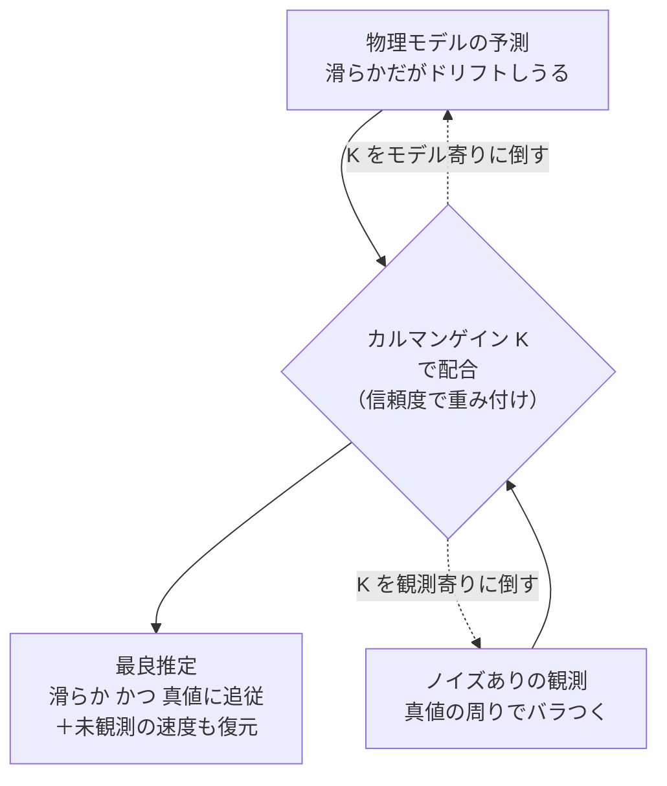
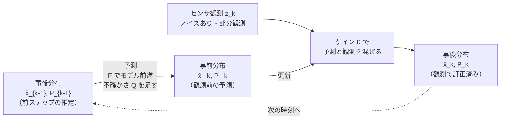
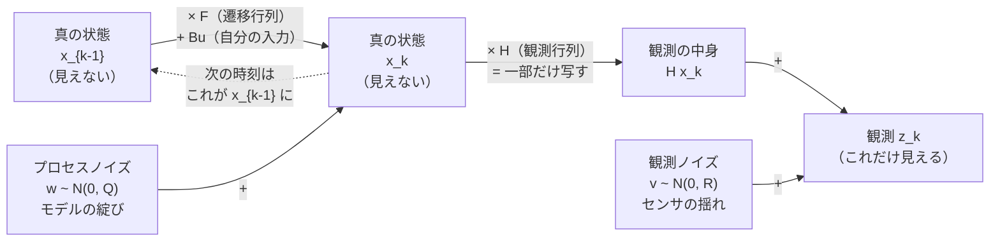
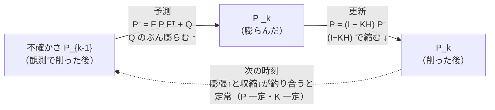
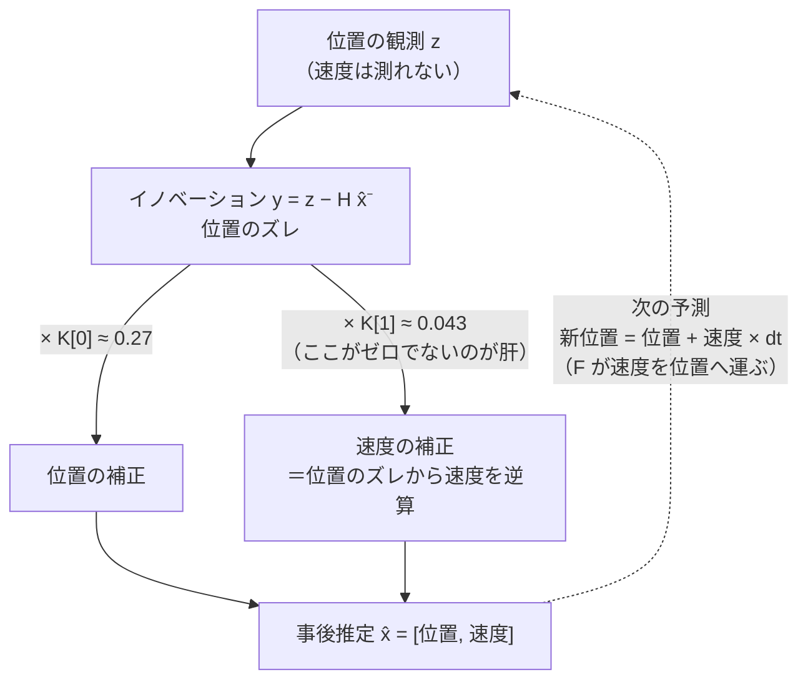

# 知覚と状態推定 — カルマンフィルタ

:::abstract[学習目標]
この章を読み終えると、次のことができるようになります。

- センサが **ノイズあり・部分観測** であるとき、なぜ生の観測をそのまま使ってはいけないかを **説明** できる
- 状態推定を **ベイズフィルタ**（予測 → 更新の再帰）として定式化できる
- 線形ガウス系で、ベイズフィルタが **カルマンフィルタ**（予測ステップ + 更新ステップ）に閉じることを **導出** できる
- **カルマンゲイン $K$** が「モデルの予測」と「センサの観測」の信頼度を釣り合わせる重みであることを **解釈** できる
- numpy で 1 次元の位置・速度追跡にカルマンフィルタを **実装** し、推定誤差が生の観測より小さくなることを数値で **確認** できる
:::

## 前提知識

- 章01 [Physical AI とは — 全体像と座標系](/physical-ai/01-overview-and-frames/)：ロボットの「状態 (state)」「観測 (observation)」「座標系」という言葉づかい。本章はこの「状態」を、見えないところからどう復元するかの話です。
- 線形代数：行列・ベクトルの積、転置 $A^\top$、逆行列 $A^{-1}$。
- 確率の基礎：平均（期待値）と分散・共分散、ガウス分布（正規分布）。多次元ガウス $\mathcal{N}(\boldsymbol{\mu}, \Sigma)$ が「平均 $\boldsymbol{\mu}$ と共分散 $\Sigma$ だけで決まる」こと。
- ベイズの定理：$p(a \mid b) \propto p(b \mid a)\,p(a)$。

LLM 出身の読者へ。自己回帰デコードが「過去のトークンから次の確率分布を出し、観測したトークンで条件付けて状態を更新する」のと同じ骨格が、ここでは「過去の状態から次の状態分布を予測し、センサ観測で条件付けて更新する」という形で現れます。違いは、扱うのが離散トークンではなく **連続なガウス分布の平均と共分散** である点だけです。

## 直感

ロボットは自分の状態（位置・速度・姿勢など）を **直接は知りません**。知っているのはセンサの値だけで、それには 2 つの厄介な性質があります。

1. **ノイズがある**：GPS は数メートル揺れ、IMU は積分するとドリフトし、エンコーダは量子化される。同じ場所に止まっていても値はバラつきます。
2. **部分観測である**：欲しい量の一部しか測れない。位置センサは位置を返すが **速度は返さない**。それでもロボットは速度を知りたい（次にどこへ行くか予測するため）。

素朴な対処は 2 つ考えられますが、どちらも不十分です。

- **生の観測をそのまま信じる** → ノイズがそのまま制御に乗り、ガクガク動く。速度のような測れない量は永遠に手に入らない。
- **物理モデルだけで予測する** → 「等速で進むはず」という運動方程式を積分すれば滑らかな軌跡は出るが、モデルは完璧ではない（風、摩擦、滑り）ので、時間とともに真値からズレていく。誰も訂正してくれない。

この 2 つの素朴な対処と、これから学ぶカルマンフィルタを並べると、どこが足りないかが一目で見えます。

| 対処 | 滑らかさ | 真値への追従 | 速度（未観測量）の復元 | 不確かさの管理 |
| --- | --- | --- | --- | --- |
| 生の観測をそのまま使う | ✗ ノイズ丸出し | ○ 平均的には合う | ✗ 永遠に手に入らない | ✗ なし |
| 物理モデルだけで予測 | ○ 滑らか | ✗ 時間とともにドリフト | △ モデル次第・訂正なし | ✗ なし |
| カルマンフィルタ（融合） | ○ 滑らか | ○ 観測で常に引き戻す | ○ 副産物として復元 | ○ 共分散 $P$ で常時把握 |

カルマンフィルタの発想は単純です。**モデルの予測と、ノイズありの観測を、それぞれの信頼度で重み付けて混ぜる。** モデルが信頼できるときは予測を重視し、センサが信頼できるときは観測を重視する。この「混ぜる重み」が **カルマンゲイン** で、両者の不確かさ（分散）から自動的に決まります。結果として、生の観測より滑らかで正確な推定が得られ、しかも **直接測っていない速度まで** 副産物として手に入ります。

この「予測と観測を信頼度で混ぜる」という一文を、もう少しだけ動作として描いておきます。下図は、モデルが立てた予測（やや外れているかもしれない）と、ノイズで揺れた観測（一発ごとはバラつく）を、ゲイン $K$ という 1 つのつまみで配合し、両者の真ん中あたりに最良推定を置く流れです。$K$ を観測寄りに倒せば観測に張り付き、モデル寄りに倒せば滑らかになります。



これは状態推定そのものであり、SLAM・センサフュージョン・脚ロボットの姿勢推定の土台です。そして次章以降の学習ベース制御も、結局「いま自分はどの状態にいるか」を知らなければ動けません。**制御は状態推定とペアで初めて成立します。**

## 全体像

カルマンフィルタは、状態の確率分布（ガウス）を **予測 → 更新** の 2 ステップで毎時刻くるくると回す再帰です。順方向（時間を進める予測）と、逆向き的な訂正（観測で引き戻す更新）が交互に来る、と一望してください。



| 量 | 記号 | 意味 | いつ作られるか |
| --- | --- | --- | --- |
| 事後分布 | $\hat{x}_{k-1}, P_{k-1}$ | 前ステップで観測まで取り込んだ最良推定 | 前ステップの更新後 |
| 事前分布 | $\hat{x}^-_k, P^-_k$ | モデルだけで一歩進めた予測（まだ観測を見ていない） | 予測ステップ |
| 観測 | $z_k$ | センサが返す生の値 | 各時刻にセンサから到着 |
| カルマンゲイン | $K_k$ | 予測と観測を混ぜる重み | 更新ステップの冒頭 |
| 事後分布 | $\hat{x}_k, P_k$ | 観測で訂正した最良推定 | 更新ステップ |

ここで $\hat{x}$ は **状態の平均（点推定）**、$P$ は **その共分散（推定の不確かさ）** です。カルマンフィルタは「点」ではなく「ガウス分布まるごと」を運ぶ、という点が最初の山です。$P$ が小さいほど「自信がある」、大きいほど「曖昧」を意味します。

:::note[LLM ↔ 状態推定]
自己回帰 LM では、隠れ状態から次トークンの分布 $p(x_t \mid x_{<t})$ を出し、実際に観測したトークンで条件付けて先へ進みます。カルマンフィルタも同型で、(1) 予測ステップ＝「次の状態の事前分布を出す」、(2) 更新ステップ＝「観測で条件付けて事後分布にする」。違いは分布が softmax（離散）ではなくガウス（連続）で、状態が KV cache ではなく $(\hat{x}, P)$ に圧縮されている点です。
:::

## 理論

### システムの設定：何を仮定するか

カルマンフィルタが対象にするのは **線形ガウス** の系です。次の 2 つの式（状態空間モデル）で世界を記述します。

状態遷移（プロセスモデル）：

$$
x_k = F x_{k-1} + B u_{k-1} + w_{k-1}, \qquad w_{k-1} \sim \mathcal{N}(0, Q)
$$

観測モデル：

$$
z_k = H x_k + v_k, \qquad v_k \sim \mathcal{N}(0, R)
$$

記号をすべて定義します。

- $x_k \in \mathbb{R}^n$：時刻 $k$ の **真の状態**ベクトル。本章の例では $x = [p, v]^\top$（位置と速度）の $n=2$ 次元。直接は見えません。
- $F \in \mathbb{R}^{n\times n}$：**状態遷移行列**。「1 ステップで状態がどう変わるか」を表す既知の固定行列。等速モデルなら「新しい位置 = 古い位置 + 速度 × $dt$」を符号化します。データに依存しない設計値で、1 度決めたら使い回します。
- $u_{k-1} \in \mathbb{R}^m$：**制御入力**（前章で計算したトルクや加速度指令など）。$B \in \mathbb{R}^{n\times m}$ がそれを状態の変化に変換する **入力行列**。自分が加えた力は既知なので、予測に足し込めます。本章の追跡例では外部入力がないので $u=0$ とし、$Bu$ の項は落とします。
- $w_{k-1} \in \mathbb{R}^n$：**プロセスノイズ**。モデルが捉えきれないふらつき（風・摩擦・滑り）。平均 0・共分散 $Q$ のガウスと仮定します。$Q$ が大きい＝「モデルを信じきれない」。
- $z_k \in \mathbb{R}^p$：時刻 $k$ の **観測**ベクトル。本章では位置だけ測るので $p=1$。
- $H \in \mathbb{R}^{p\times n}$：**観測行列**。状態のどの成分が・どんな重みで観測に現れるかを表す既知の固定行列。位置だけ測るなら $H = [1\ 0]$ で、これは「状態の第 1 成分（位置）だけを観測に写し、速度は写さない」という **部分観測** をそのまま符号化しています。
- $v_k \in \mathbb{R}^p$：**観測ノイズ**（センサノイズ）。平均 0・共分散 $R$ のガウス。$R$ が大きい＝「センサを信じきれない」。

この 2 本の式が「世界をどう生成するか」を表しています。下図は、真の状態 $x_{k-1}$ がどう次の状態 $x_k$ になり、そこからどう観測 $z_k$ が生まれるか、という **データの生成過程** を一枚にしたものです。左の流れ（状態が状態を生む）が状態遷移、下に落ちる流れ（状態が観測を生む）が観測モデルです。$F$ と $H$ は **設計者が決める固定行列**、$Q$ と $R$ は **そこに注入されるノイズの大きさ** であることに注意してください。フィルタはこの図を逆向きにたどり、見える $z$ から見えない $x$ を復元します。



| 記号 | 種類 | 誰が決めるか | 大きいと何が起きるか |
| --- | --- | --- | --- |
| $F$ | 行列（固定） | 設計者（物理モデル） | — 状態がどう前進するかの形 |
| $H$ | 行列（固定） | 設計者（センサ構成） | — 状態のどこを観測に写すか |
| $Q$ | 共分散（固定値だが調整対象） | 設計者がチューニング | モデルを疑い観測を信じる方向へ |
| $R$ | 共分散（固定値だが調整対象） | 設計者がチューニング | センサを疑いモデルを信じる方向へ |

:::warning[$Q$ と $R$ は別物・混同しやすい]
$Q$（プロセスノイズ）は **モデルの不確かさ**、$R$（観測ノイズ）は **センサの不確かさ** です。役割が真逆で、後で見るカルマンゲインはこの 2 つの比で決まります。$Q$ を大きくすると「モデルを疑い観測を信じる」方向に、$R$ を大きくすると「センサを疑いモデルを信じる」方向に推定が傾きます。両者を取り違えると、フィルタの挙動の直感が反転します。
:::

### ベイズフィルタ：すべての土台

カルマンフィルタは天下りの公式ではなく、**ベイズフィルタという一般原理の、線形ガウスでの特殊解** です。まずベイズフィルタを押さえます。

私たちが知りたいのは、これまでの全観測 $z_{1:k}$ を踏まえた状態の分布 $p(x_k \mid z_{1:k})$ です。これを 2 ステップの再帰で更新します。

**予測ステップ（時間更新）**：前ステップの事後分布 $p(x_{k-1}\mid z_{1:k-1})$ から、状態遷移モデルで「観測を見る前の」分布を作ります。

$$
p(x_k \mid z_{1:k-1}) = \int p(x_k \mid x_{k-1})\, p(x_{k-1}\mid z_{1:k-1})\, dx_{k-1}
$$

これは「前の状態がどこにいたか」の各可能性に、遷移モデルを掛けて足し合わせる（周辺化する）操作です。観測をまだ使っていないので、不確かさは一般に増えます。

**更新ステップ（観測更新）**：観測 $z_k$ が来たら、ベイズの定理で条件付けます。

$$
p(x_k \mid z_{1:k}) = \frac{p(z_k \mid x_k)\, p(x_k \mid z_{1:k-1})}{p(z_k \mid z_{1:k-1})}
$$

ここで $p(z_k \mid x_k)$ は観測モデルが与える **尤度**、$p(x_k \mid z_{1:k-1})$ は予測ステップが作った **事前分布**、分母は正規化定数です。事前（予測）に尤度（観測）を掛けて事後（訂正後）にする、というベイズそのものです。

:::note[なぜ「フィルタ」と呼ぶか]
過去の全観測 $z_{1:k}$ を毎回保持して計算し直すのではなく、**1 ステップ前の要約 $p(x_{k-1}\mid z_{1:k-1})$ だけ** を持ち越して再帰する点が肝です。履歴を 1 つの分布に畳み込む（filter する）ので「フィルタ」。状態が再帰の十分統計量になっている、という意味で LLM の隠れ状態と同じ役割です。
:::

問題は、一般のベイズフィルタの積分が解析的に解けないことです。ところが **すべてが線形・ガウス** なら、ガウスは線形変換とベイズ条件付けで閉じる（ガウスのまま）ので、積分が **平均と共分散の更新式** に落ちます。その閉じた形こそカルマンフィルタです。

## 数式の導出

ガウスが線形変換とベイズ条件付けで閉じることを使って、ベイズフィルタの 2 ステップを平均・共分散の式に落とします。前ステップの事後分布を $\hat{x}_{k-1} = \mathbb{E}[x_{k-1}\mid z_{1:k-1}]$、$P_{k-1} = \mathrm{Cov}[x_{k-1}\mid z_{1:k-1}]$ とします。

### 予測ステップの導出

事前分布の平均は、遷移式 $x_k = F x_{k-1} + B u_{k-1} + w_{k-1}$ に期待値を取るだけです。$w$ は平均 0 なので、

$$
\hat{x}^-_k = \mathbb{E}[F x_{k-1} + B u_{k-1} + w_{k-1}] = F\hat{x}_{k-1} + B u_{k-1}
$$

共分散は、誤差 $e^-_k = x_k - \hat{x}^-_k = F(x_{k-1}-\hat{x}_{k-1}) + w_{k-1}$ の二次モーメントです。前ステップ誤差 $x_{k-1}-\hat{x}_{k-1}$ とプロセスノイズ $w_{k-1}$ は独立なので交差項が消え、

$$
P^-_k = \mathbb{E}[e^-_k (e^-_k)^\top] = F\, P_{k-1}\, F^\top + Q
$$

第 1 項 $F P_{k-1} F^\top$ は「前の不確かさを遷移で写したぶん」、第 2 項 $Q$ は「モデルが新たに持ち込む不確かさ」。**予測は不確かさを増やす操作** だと式から読めます。

### 更新ステップの導出

観測が来たので、事前ガウス $\mathcal{N}(\hat{x}^-_k, P^-_k)$ に尤度 $\mathcal{N}(z_k; H x_k, R)$ を掛けて事後を求めます。まず観測の予測値 $H\hat{x}^-_k$ と実際の観測 $z_k$ の差を **イノベーション（残差）** と呼びます。

$$
y_k = z_k - H\hat{x}^-_k
$$

その共分散（イノベーション共分散）は、$z_k = H x_k + v_k$ を使い、状態の不確かさ $P^-_k$ を観測空間に写した $H P^-_k H^\top$ にセンサノイズ $R$ を足したものです。

$$
S_k = H\, P^-_k\, H^\top + R
$$

線形ガウスの条件付けは、結合ガウス $(x_k, z_k)$ の共分散ブロックから最小分散推定（条件付き平均）を取ると得られます。状態と観測の相互共分散は $\mathrm{Cov}(x_k, z_k) = P^-_k H^\top$ なので、条件付き平均の係数として **カルマンゲイン** が

$$
K_k = P^-_k H^\top S_k^{-1} = P^-_k H^\top \big(H P^-_k H^\top + R\big)^{-1}
$$

と定まります。$K_k$ は「観測空間でのズレ $y_k$ を、状態空間の補正にどれだけ反映するか」の変換行列です。これを使って事後の平均と共分散を書くと、

$$
\hat{x}_k = \hat{x}^-_k + K_k\, y_k = \hat{x}^-_k + K_k\big(z_k - H\hat{x}^-_k\big)
$$

$$
P_k = (I - K_k H)\, P^-_k
$$

平均の式は「予測 $\hat{x}^-_k$ に、観測のズレ $y_k$ をゲイン倍して足し戻す」訂正です。共分散の式は $(I - K_k H)$ という 1 未満の係数が掛かるので、**更新は不確かさを減らす操作** です。予測で増えた不確かさを、観測で削る。この増減の往復がフィルタの本体です。$\blacksquare$

ここまでの導出を、**不確かさ $P$ がどう増減するか** という一点に絞って図にすると、フィルタの呼吸が見えます。予測で $Q$ のぶん膨らみ、更新で $(I-KH)$ のぶん縮む。この「膨らんでは縮む」を毎時刻くり返し、やがて膨張と収縮が釣り合う **定常状態**（$P$ がほぼ一定、$K$ もほぼ一定）に落ち着きます。実装の出力で「定常カルマンゲイン」と呼んでいるのは、この釣り合った後の $K$ のことです。



予測ステップと更新ステップは、入力・出力・不確かさへの作用がきれいに対になっています。次の表で並べて確認してください。両者を取り違えると、後述の注意書きにあるとおりフィルタの直感が反転します。

| 観点 | 予測ステップ（時間更新） | 更新ステップ（観測更新） |
| --- | --- | --- |
| 何を使うか | 物理モデル $F, B, Q$ のみ | 観測 $z_k$ とセンサモデル $H, R$ |
| 観測 $z$ を見るか | **見ない** | **見る**（ここで初めて入る） |
| 平均の式 | $\hat{x}^-_k = F\hat{x}_{k-1} + Bu_{k-1}$ | $\hat{x}_k = \hat{x}^-_k + K_k(z_k - H\hat{x}^-_k)$ |
| 共分散の式 | $P^-_k = FP_{k-1}F^\top + Q$ | $P_k = (I - K_kH)P^-_k$ |
| 不確かさ $P$ | **増える**（$+Q$） | **減る**（$\times(I-KH)$） |
| 直感 | モデルが言うことを立てる | センサが言うことをぶつけて訂正 |

### カルマンゲインの意味を読み解く

導出した $K_k = P^-_k H^\top (H P^-_k H^\top + R)^{-1}$ を、1 次元で極端な場合に潰すと意味が透けます。$H=1$ とすると $K = \dfrac{P^-}{P^- + R}$ です。

- **センサが正確（$R \to 0$）** → $K \to 1$。$\hat{x}_k \to \hat{x}^-_k + (z_k - \hat{x}^-_k) = z_k$。つまり **観測をほぼ全面採用** し、予測を捨てる。
- **センサが当てにならない（$R \to \infty$）** → $K \to 0$。$\hat{x}_k \to \hat{x}^-_k$。つまり **観測を無視してモデルの予測を維持** する。
- **モデルの不確かさが大きい（$P^- \to \infty$）** → $K \to 1$。予測を疑い観測を信じる。

つまり $K$ は **予測の信頼度（$P^-$）と観測の信頼度（$R$）の綱引きの釣り合い点** です。両者の分散を見て、自動的に「今回はどちらをどれだけ信じるか」を決めます。手で調整するのは $Q$ と $R$（信頼度の前提）だけで、ゲイン自体は毎時刻フィルタが計算します。

:::warning[「予測はモデル・更新は観測」を取り違えない]
予測ステップ（$\hat{x}^-=F\hat{x}+Bu$, $P^-=FPF^\top+Q$）は **物理モデルだけ** で動き、観測 $z$ を一切使いません。更新ステップ（$K$, $\hat{x}=\hat{x}^-+K(z-H\hat{x}^-)$）で初めて観測が入ります。よくある誤解は「予測のときに観測を覗いて補正する」ですが、それは誤りです。2 つは情報源がきれいに分かれています ——「モデルが言うこと」を予測で立て、「センサが言うこと」を更新でぶつける。そして両者の信頼度を釣り合わせる重みが、ただ 1 か所、カルマンゲイン $K$ に集約されています。$Q$ や $R$ をいじったときにフィルタがどう傾くかは、すべてこの $K$ の式を通して理解できます。
:::

## 実装

1 次元の位置・速度追跡を、numpy だけで実装します。真の物体は **等速直線運動**（位置が一定速度で増える）に少しのプロセスノイズが乗ったもの。センサは **位置だけ** をノイズ込みで観測します（速度は一切測れない＝部分観測）。カルマンフィルタが、(1) 生の観測より正確に位置を推定し、(2) 一度も観測していない速度まで復元することを数値で確認します。

```python title="kf_toy.py"
import numpy as np

# 再現性のため乱数シードを固定（毎回同じ図・同じ数値にする）
rng = np.random.default_rng(0)

# --- 1. 真のシステム（等速直線運動 + プロセスノイズ） ---
dt = 1.0                 # サンプリング周期 [s]
n_steps = 50             # ステップ数

# 状態 x = [位置 p, 速度 v]^T。等速モデル: p_{k+1}=p_k+v_k dt, v_{k+1}=v_k
F = np.array([[1.0, dt],
              [0.0, 1.0]])
# 観測は位置だけ（速度は測れない＝部分観測）
H = np.array([[1.0, 0.0]])

# プロセスノイズ共分散 Q（速度がふらつく＝モデルの不確かさ）
q = 0.01
Q = q * np.array([[dt**3 / 3, dt**2 / 2],
                  [dt**2 / 2, dt]])
# 観測ノイズ分散 R（位置センサのノイズの大きさ）
R = np.array([[4.0]])     # 標準偏差 2.0 のセンサ

# 真の初期状態：位置 0、速度 1
x_true = np.array([0.0, 1.0])

trues, measurements = [], []
for _ in range(n_steps):
    # 真の状態を1ステップ進める（プロセスノイズを注入）
    w = rng.multivariate_normal([0, 0], Q)
    x_true = F @ x_true + w
    # ノイズありの観測（位置のみ）
    z = H @ x_true + rng.normal(0, np.sqrt(R[0, 0]))
    trues.append(x_true.copy())
    measurements.append(z[0])

trues = np.array(trues)
measurements = np.array(measurements)

# --- 2. カルマンフィルタ ---
# 推定の初期値（わざと真値からずらす：位置も速度も知らない前提）
x_hat = np.array([0.0, 0.0])
P = np.eye(2) * 1.0        # 初期共分散（最初は自信がない）

estimates = []
for k in range(n_steps):
    # 予測ステップ（モデルで一歩進める。入力 u は無いので Bu は省略）
    x_pred = F @ x_hat
    P_pred = F @ P @ F.T + Q

    # 更新ステップ（観測 z で補正）
    z = np.array([measurements[k]])
    S = H @ P_pred @ H.T + R            # 観測予測の共分散（残差の不確かさ）
    K = P_pred @ H.T @ np.linalg.inv(S)  # カルマンゲイン
    y = z - H @ x_pred                   # イノベーション（観測 - 予測）
    x_hat = x_pred + K @ y
    P = (np.eye(2) - K @ H) @ P_pred

    estimates.append(x_hat.copy())

estimates = np.array(estimates)

# --- 3. 誤差を比較（推定 vs 生の観測） ---
true_pos = trues[:, 0]
est_pos = estimates[:, 0]

# 過渡（最初の数ステップ）を除いて定常的な精度を見る
warmup = 5
rmse_meas = np.sqrt(np.mean((measurements[warmup:] - true_pos[warmup:]) ** 2))
rmse_est = np.sqrt(np.mean((est_pos[warmup:] - true_pos[warmup:]) ** 2))

# 速度の推定誤差（速度は一度も直接観測していないことに注意）
true_vel = trues[:, 1]
est_vel = estimates[:, 1]
rmse_vel = np.sqrt(np.mean((est_vel[warmup:] - true_vel[warmup:]) ** 2))

print(f"観測ノイズ標準偏差 (sqrt R) : {np.sqrt(R[0,0]):.3f}")
print(f"生の観測 位置 RMSE         : {rmse_meas:.3f}")
print(f"KF 推定  位置 RMSE         : {rmse_est:.3f}")
print(f"位置誤差の削減率           : {(1 - rmse_est / rmse_meas) * 100:.1f}%")
print(f"KF 推定  速度 RMSE         : {rmse_vel:.3f}  (速度は未観測)")
print(f"定常カルマンゲイン K        : {K.ravel()}")
```

実行します（`uv run --with numpy python kf_toy.py`）。

```text title="出力"
観測ノイズ標準偏差 (sqrt R) : 2.000
生の観測 位置 RMSE         : 1.834
KF 推定  位置 RMSE         : 1.123
位置誤差の削減率           : 38.8%
KF 推定  速度 RMSE         : 0.294  (速度は未観測)
定常カルマンゲイン K        : [0.2711065  0.04268765]
```

読み取れることが 3 つあります。

1. **推定が観測より正確**：生の観測の位置 RMSE は 1.834（センサの標準偏差 2.0 とほぼ一致）。カルマンフィルタの推定は 1.123 で、**約 39% 誤差が減りました**。過去の観測とモデルの予測を融合した結果、単一観測のノイズが平均化されています。
2. **未観測の速度を復元**：速度は一度も測っていない（$H=[1\ 0]$ は位置しか見ない）のに、速度 RMSE は 0.294 まで下がりました。位置の時間変化からモデルが速度を逆算しています。これが状態空間モデルを持つ最大の御利益です。
3. **ゲインの値**：定常カルマンゲイン $K \approx [0.27,\ 0.043]^\top$。位置成分 0.27 は「観測のズレの 27% を位置補正に使う」（残り 73% は予測を維持）。$R$（センサ分散 4.0）が $P^-$ より大きめなので観測を控えめに信じる、という綱引きの結果です。$Q$ を大きくすればこの値は 1 へ寄ります。

では「位置しか測っていないのに、なぜ速度が直る」のでしょうか。鍵は、ゲインベクトルの **速度成分 $K[1]\approx 0.043$ がゼロでない** ことと、状態遷移行列 $F$ が位置と速度を結びつけていることです。観測のズレ $y$（位置のズレ）が、ゲインの速度成分を通じて速度の補正へ流れ込み、さらに次の予測で $F$ が速度を位置へ運ぶ —— この循環で情報が両者を行き来します。下図はその流れを一周ぶん追ったものです。



:::warning[速度が直るのは「魔法」ではなくモデル構造のおかげ]
$H=[1\ 0]$ は速度を一切観測しません。にもかかわらず速度が改善されるのは、共分散 $P$ の **非対角成分（位置と速度の相関）** が育っているからです。「位置がこれだけズレていたなら、速度はこれくらいズレているはず」という相関を $P$ が持ち、その相関を通じてカルマンゲインの速度成分 $K[1]$ が非ゼロになります。もし位置と速度が無相関なら（$F$ が両者を結ばないモデルなら）$K[1]=0$ となり、速度は永遠に初期値のまま動きません。**観測していない量が直るかどうかは、状態遷移モデル $F$ がその量を観測される量と結んでいるか**で決まります。これは SLAM で「ロボットの位置観測がランドマーク位置の推定を直す」のと同じ仕組みです。
:::

:::note[「学習」はどこにある？ —— 訓練時 vs 実行時]
カルマンフィルタは、ニューラルネットのような勾配学習を **しません**。固定パラメータ $F, H, Q, R$ は実行前に **設計・チューニング**で決め（ここが LLM でいう「学習」に最も近い工程）、実行時はそれらを使って $\hat{x}, P, K$ を毎時刻 **計算するだけ**です。つまり「重みの学習」に当たるのは $Q, R$ をデータに合わせて調整する作業で、「推論」に当たるのが予測 → 更新の再帰です。ここが学習ベースの状態推定（次章以降）との分かれ目で、カルマンは構造を人間が書き下す代わりに、データがほとんど要らず・挙動が完全に解釈可能、という性格を持ちます。
:::

:::tip[手を動かして確かめる]
`R` を `np.array([[16.0]])`（センサをもっとノイジーに）に変えると、$K$ の位置成分が小さくなり推定がより滑らか（モデル寄り）になります。逆に `q = 1.0` にしてプロセスノイズを上げると $K$ が 1 に近づき、推定が観測に張り付きます。$Q$ と $R$ の比だけでフィルタの性格が決まることを、$K$ の値で追ってください。
:::

## 演習

::::question[演習 1: カルマンゲインの極限]
1 次元・位置のみ観測（$H=1$）で、カルマンゲインは $K = \dfrac{P^-}{P^- + R}$ です。(a) センサがほぼ無ノイズ（$R \to 0$）のとき $K$ と事後推定 $\hat{x}_k$ はどうなりますか。(b) センサが極端にノイジー（$R \to \infty$）のときはどうですか。(c) この 2 つの極限から、$K$ が「何と何を釣り合わせる重み」だと言えますか。

:::details[解答]
(a) $R \to 0$ で $K \to \dfrac{P^-}{P^-} = 1$。事後推定は $\hat{x}_k = \hat{x}^-_k + 1\cdot(z_k - \hat{x}^-_k) = z_k$ となり、**観測を全面採用**して予測を捨てます（センサが完璧なら当然）。
(b) $R \to \infty$ で $K \to 0$。事後推定は $\hat{x}_k = \hat{x}^-_k$ となり、**観測を無視してモデルの予測を維持**します（センサが当てにならないなら使わない）。
(c) $K$ は **モデルの予測の信頼度（$P^-$）とセンサ観測の信頼度（$R$）を釣り合わせる重み**です。予測が曖昧（$P^-$ 大）か観測が正確（$R$ 小）なら観測寄り、その逆ならモデル寄りに、毎時刻自動で配分します。
:::
::::

::::question[演習 2: 予測ステップと更新ステップの役割分担]
カルマンフィルタは予測（$\hat{x}^-=F\hat{x}+Bu$, $P^-=FPF^\top+Q$）と更新（$K$, $\hat{x}=\hat{x}^-+K(z-H\hat{x}^-)$, $P=(I-KH)P^-$）からなります。(a) 観測 $z$ はどちらのステップで初めて使われますか。(b) 不確かさ $P$ は予測で増えますか減りますか、更新では？ それぞれ式のどの項からそう言えますか。(c) ロボットの速度のように直接観測できない量が、なぜ更新で改善されるのですか。

:::details[解答]
(a) 観測 $z$ は **更新ステップだけ** で使われます（イノベーション $z - H\hat{x}^-$）。予測ステップは物理モデル $F, B, Q$ だけで動き、観測を一切見ません。「予測のときに観測で補正する」は誤解です。
(b) 予測では $P^- = FPF^\top + Q$ で、$Q$（プロセスノイズ）が必ず足されるので不確かさは **増えます**（モデルだけで進むと自信が減る）。更新では $P = (I - KH)P^-$ で、$0 \le KH \le I$ により $(I-KH)$ が縮小係数となり不確かさは **減ります**（観測で訂正すると自信が増す）。
(c) 状態遷移行列 $F$ が位置と速度を結びつけている（位置 = 前の位置 + 速度 × $dt$）からです。位置の観測で位置の推定が訂正されると、その情報が共分散 $P$ の非対角成分（位置と速度の相関）を通じて速度の推定にも伝播します。$H$ が速度を直接見なくても、**モデルの構造を介して間接的に観測情報が速度へ流れ込む**ので、速度が改善されます。
:::
::::

## まとめ

:::success[この章の要点]
- センサは **ノイズあり・部分観測**。生の観測をそのまま使うとガクガクし、測れない量（速度など）は手に入らない。状態推定はこのギャップを埋める。
- 状態推定は **ベイズフィルタ**（予測 → 更新の再帰）。線形ガウス系では積分が平均・共分散の更新式に閉じ、それが **カルマンフィルタ**。
- **予測ステップはモデルだけ**（$\hat{x}^-=F\hat{x}+Bu$, $P^-=FPF^\top+Q$）で不確かさを増やし、**更新ステップは観測**（$K$, $\hat{x}=\hat{x}^-+K(z-H\hat{x}^-)$, $P=(I-KH)P^-$）で不確かさを減らす。観測が入るのは更新だけ。
- **カルマンゲイン $K=P^-H^\top(HP^-H^\top+R)^{-1}$** は、予測の信頼度 $P^-$ とセンサの信頼度 $R$ を釣り合わせる唯一の重み。$R$ 小で観測寄り、$Q$ 大でも観測寄り。
- 実測：位置 RMSE が生観測 1.834 → 推定 1.123（約 39% 減）、未観測の速度も RMSE 0.294 まで復元。モデル構造を介して観測情報が未観測量へ伝播する。
:::

### 次に学ぶこと

ここまでで「いま自分はどの状態にいるか」をノイズ下で最適に推定する枠組みが手に入りました。線形ガウス系では、この最適推定（カルマン）と最適制御（前章の LQR）を **独立に設計してよい**（分離原理・LQG）という美しい結果があり、推定と制御がきれいに分業できます。次章は、こうした手で書き下すモデルベースの枠組みを離れ、データから方策を学ぶ **学習ベース制御** と、シミュレーションで学んだものを実機へ運ぶ **sim-to-real** の課題へ進みます。状態推定はそこでも、学習方策に「いまの状態」を渡す土台として効き続けます。

→ [6. 学習ベース制御と sim-to-real](/physical-ai/06-learning-based-control-sim2real/)

→ [Physical AI ロードマップに戻る](/physical-ai/)

## 用語ミニ辞典

| 用語 | 一言 |
| --- | --- |
| 状態 (state) $x$ | ロボットの真の内部量（位置・速度など）。直接は見えない |
| 観測 (observation) $z$ | センサが返す値。ノイズあり・部分観測 |
| 状態遷移行列 $F$ | 1 ステップで状態がどう変わるかの既知行列（モデル） |
| 観測行列 $H$ | 状態のどの成分が観測に現れるかの既知行列。部分観測を符号化 |
| プロセスノイズ $Q$ | モデルの不確かさ（捉えきれないふらつき）の共分散 |
| 観測ノイズ $R$ | センサの不確かさの共分散 |
| 共分散 $P$ | 推定の不確かさ。小さいほど自信あり |
| 事前分布 $\hat{x}^-, P^-$ | 観測前・モデルだけの予測 |
| 事後分布 $\hat{x}, P$ | 観測で訂正した最良推定 |
| イノベーション $y$ | 観測 − 予測観測 $z - H\hat{x}^-$。訂正の元 |
| カルマンゲイン $K$ | 予測と観測の信頼度を釣り合わせる重み |
| ベイズフィルタ | 予測 → 更新で状態分布を再帰更新する一般原理 |
| 分離原理 / LQG | 線形ガウスで推定（Kalman）と制御（LQR）を独立設計してよい |

## 次のアクション

理論を手で定着させる。**最小の写経 → 動かす → 小実験** を 1 セットで。

1. 上の `kf_toy.py` をそのまま写経し、`uv run --with numpy python kf_toy.py` で実行する。位置 RMSE が生観測より小さく、速度（未観測）が復元されることを自分の目で確認する。
2. `R` を 16.0 に上げ、`q` を 1.0 に上げて、それぞれ定常カルマンゲイン $K$ がどう動くか（観測寄り／モデル寄り）を観察する。推定軌跡の滑らかさの変化と $K$ の値を結びつける。
3. 余力があれば、真値・生の観測・推定の 3 本を matplotlib でプロットし、推定が観測のノイズを平滑化しつつ真値を追う様子を可視化する。さらに観測モデルを非線形（例：距離センサ $z=\sqrt{p^2+c}$）に変え、$H$ をヤコビアンで線形近似する **拡張カルマンフィルタ (EKF)** へ拡張してみる。

## 参考文献

1. R. E. Kalman, "A New Approach to Linear Filtering and Prediction Problems," *Transactions of the ASME — Journal of Basic Engineering*, 1960.（カルマンフィルタ原論文）
2. S. Thrun, W. Burgard, D. Fox, *Probabilistic Robotics*, MIT Press, 2005.（ベイズフィルタ・カルマン・EKF・SLAM の定番教科書）
3. D. Simon, *Optimal State Estimation: Kalman, H∞, and Nonlinear Approaches*, Wiley, 2006.
4. G. Welch and G. Bishop, "An Introduction to the Kalman Filter," Technical Report TR 95-041, University of North Carolina, 1995.（簡潔な入門）
5. Y. Bar-Shalom, X. R. Li, T. Kirubarajan, *Estimation with Applications to Tracking and Navigation*, Wiley, 2001.（位置・速度追跡の実務）
