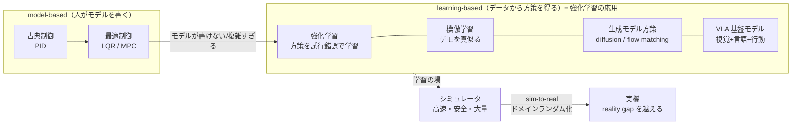

# 学習ベース制御と sim-to-real

:::abstract[学習目標]
この章を読み終えると、次のことができるようになります。

- **学習ベース制御**が、前章までの [古典制御・最適制御](/physical-ai/04-optimal-control/) と「設計時に何を人が書き、何をデータから得るか」でどう違うかを **説明**できる
- 学習ベース制御を **[強化学習](/reinforcement-learning/) を身体性に適用したもの**として位置づけ、報酬・方策・価値の記号を身体性の文脈で **定義**できる
- **模倣学習**・**diffusion policy**・**VLA 基盤モデル**（RT-2 / OpenVLA / π0）を、行動の表し方と知識の出どころで **比較**できる
- **sim-to-real ギャップ（reality gap）** がなぜ生じるかを述べ、**ドメインランダム化**がそれをどう埋めるかを **説明**できる
- ドメインランダム化の頑健化目的を導出し、numpy のトイで「ズレた本番でも頑健になる」様子を **実測**できる
:::

## 前提知識

- [4. 最適制御](/physical-ai/04-optimal-control/)：状態方程式 $\dot{x}=f(x,u)$ とコスト最小化で制御入力を導く枠組み。LQR/MPC は **正確な物理モデルを人が書く** model-based の代表。本章はその「モデルが書けない/複雑すぎる」場合を扱います。
- [5. 知覚と状態推定](/physical-ai/05-perception-state-estimation/)：観測ノイズ下で状態 $x$ を推定する話。学習方策も「推定された状態 or 生の観測」を入力に取ります。
- [強化学習（横断軸）](/reinforcement-learning/)：MDP・方策 $\pi$・価値関数・[方策勾配](/reinforcement-learning/06-policy-gradient/)・[Actor-Critic](/reinforcement-learning/07-actor-critic/)。本章は **RL を身体（ロボット）に適用したもの**として読みます。RL 側の記号をそのまま使います。
- 視覚・言語の基盤モデル（後半 VLA で参照）：[視覚モダリティ](/vision/)・[言語モダリティ](/llm/)・[マルチモーダル](/multimodal/)。

この章は身体性ロードマップの **締め**です。これまでの「モデルを人が書く制御」に対し、「データから方策を学ぶ制御」と、その実用化を支える sim-to-real を一望します。

## 直感

前章までの制御は、**人が方程式を書く**ことが出発点でした。LQR なら「線形ダイナミクス $\dot{x}=Ax+Bu$ と二次コスト」を、MPC なら「未来を予測する動的モデル $f$」を、全身制御なら「剛体の逆動力学」を —— **設計者が陽に書き下した**モデルから最適入力を導きます。

ところが、ロボットが相手にする世界はしばしば **書き下せない**。柔らかい布をたたむ、未知の物体をつかむ、雪や泥のうえを歩く、脚のアクチュエータの非線形な遅れ —— これらを正確な方程式にするのは絶望的です。ここで発想を反転させます。

> **モデルとコストを人が書く代わりに、データから方策そのものを学習する。**

これが **学習ベース制御（learning-based control）** です。そして「試行錯誤で報酬を最大化する方策を学ぶ」という枠組みは、まさに [強化学習](/reinforcement-learning/) そのもの。**学習ベース制御とは、横断軸の強化学習を「身体（physical agent）」に適用したもの**だ、と一言で掴めます。専門家のデモを真似る **模倣学習**、行動を生成モデルで表す **diffusion policy**、Web 規模の視覚言語知識を制御へ持ち込む **VLA 基盤モデル** —— すべてこの「データから方策を得る」系譜に乗っています。

ただし身体性には言語・画像にない難所があります。**実機での試行は遅く・高コスト・危険**です。1 エピソードに数秒〜数分、転倒すれば壊れる。だから高速・安全な **シミュレータで学習して実機へ移す（sim-to-real）** のが中核戦略になり、その際の **シムと現実のズレ（reality gap）** をどう埋めるかが最大の実務課題になります。本章はこの 2 本柱 —— 学習ベース制御の系譜と、sim-to-real を支えるドメインランダム化 —— を降りていきます。

## 全体像

制御は「センサ入力 → アクチュエータ出力」の写像を**どう設計するか**で一本のスペクトル上に並びます。左ほどモデルを人が陽に書き、右ほどデータから方策を得ます。重要なのは、**右が左を置き換えるのではなく、階層的に併存する**こと（高レベル方策が低レベルの PD/トルク追従の上に乗る）です。



順方向（学習時）は「シミュレータで方策を学ぶ」、逆方向（本番）は「実機で方策を走らせる」。この 2 つの間に reality gap が口を開けています。下の対比表で、設計時に**何を人が書き / 何をデータから得るか**を一望します。

| 手法 | 人が書くもの | データから得るもの | モデル依存 | 横断軸との対応 |
| --- | --- | --- | --- | --- |
| PID | 制御則の形 + ゲイン | （なし） | model-free だが手設計 | — |
| LQR / MPC | 動的モデル $f$・コスト | （最適化で解くだけ） | **model-based** | 最適制御 |
| 強化学習（RL）制御 | 報酬 $r$ | **方策 $\pi_\theta$**（試行錯誤） | 多くは **model-free** | [強化学習](/reinforcement-learning/) |
| 模倣学習 | （報酬すら不要） | 方策 $\pi_\theta$（デモ教師あり） | model-free | 教師あり学習 |
| diffusion policy | 行動の生成過程 | 行動分布（拡散で生成） | model-free | [拡散モデル](/vision/) |
| VLA 基盤モデル | （事前学習済み VLM を流用） | 行動（言語+画像から） | model-free | [視覚](/vision/)+[言語](/llm/) |

:::warning[「学習ベースが制御工学を置き換えた」ではない]
よくある誤解です。実態は **階層併存**。VLA や RL 方策が出すのは多くの場合「目標位置・速度」や「中レベルの行動チャンク」で、その**下層**では PD 制御やトルク追従（[古典制御](/physical-ai/03-pid-control/)）、安全フィルタ、ときに MPC が動いています。「高レベル＝学習、低レベル＝古典」の分業だと捉えてください。前章までの内容は土台として生き続けます。
:::

## 理論

### 1. 強化学習としての制御 —— 記号を身体性に翻訳する

[強化学習](/reinforcement-learning/) の枠組みをそのまま身体に当てはめます。記号の中身を**身体性の文脈で**定義し直すのがこの節の肝です。

- **状態 $s_t$**：時刻 $t$ のロボットの状況。脚ロボなら「関節角・関節速度・胴体の姿勢（[状態推定](/physical-ai/05-perception-state-estimation/)で得る）・足の接地」など。**何を入力に取るか**が設計の核心で、固有受容感覚（proprioception）だけか、視覚も入れるかで方策の性質が変わります。
- **行動 $a_t$**：アクチュエータへの指令。**生のトルク**のこともあれば、**目標関節角**（その下を PD が追従）のこともあります。後者が「高レベル学習＋低レベル古典」の分業です。
- **報酬 $r(s_t, a_t)$**：設計者が書く唯一のもの。「前進速度 − 転倒ペナルティ − エネルギー − 関節限界違反」のような **shaping** された和。**報酬設計が方策の挙動を決める**ので、ここに設計者の意図が集約されます。
- **方策 $\pi_\theta(a_t \mid s_t)$**：状態から行動（の分布）への写像。パラメータ $\theta$（ニューラルネット）を学習で決めます。これが「人が書く制御則」を置き換える主役です。

目的は、割引報酬の期待値（収益）を最大化する $\theta$ を見つけること:

$$
\max_{\theta}\ J(\theta) = \mathbb{E}_{\tau \sim p_{\pi_\theta}}\!\left[\sum_{t=0}^{T} \gamma^t\, r(s_t, a_t)\right]
$$

ここで $\tau = (s_0, a_0, s_1, a_1, \dots)$ は軌跡（trajectory）、$p_{\pi_\theta}$ は方策 $\pi_\theta$ と環境ダイナミクスが生む軌跡の分布、$\gamma \in [0,1)$ は割引率です。これは [方策勾配の章](/reinforcement-learning/06-policy-gradient/) の目的関数と**同一**で、身体性では $s,a,r$ の中身が「関節・トルク・歩行報酬」になっただけです。

ロボット制御で支配的なのは **PPO**（[Actor-Critic 系](/reinforcement-learning/07-actor-critic/)）です。クリップ付き代理目的で安定に方策を更新します:

$$
L^{\text{CLIP}}(\theta) = \mathbb{E}_t\!\left[\min\!\Big(\rho_t(\theta)\,\hat{A}_t,\ \mathrm{clip}\big(\rho_t(\theta),\, 1-\epsilon,\, 1+\epsilon\big)\,\hat{A}_t\Big)\right],
\qquad
\rho_t(\theta) = \frac{\pi_\theta(a_t \mid s_t)}{\pi_{\theta_{\text{old}}}(a_t \mid s_t)}
$$

$\rho_t$ は新旧方策の確率比、$\hat{A}_t$ は[アドバンテージ](/reinforcement-learning/07-actor-critic/)（その行動が平均よりどれだけ良いか）の推定、$\epsilon$（例 0.2）はクリップ幅です。詳細は RL 側に譲ります。身体性で重要なのは、**この試行錯誤を実機でやると遅く危険**なので、次の sim-to-real が必須になる点です。

:::note[RL ↔ 身体性]
「カートポールを倒さない方策を学ぶ」と「ANYmal を歩かせる方策を学ぶ」は、**MDP として同じ**です。違いは (1) 状態・行動が連続で高次元、(2) 試行が物理的に高コスト、(3) シミュレータと実機が違う、の 3 点。RL のアルゴリズム（PPO 等）はそのまま、**学習環境**に身体性固有の工夫が乗る、という構図です。
:::

### 2. 模倣学習 —— 報酬すら書かず、デモを真似る

報酬の設計が難しいタスク（「きれいに皿を並べる」を数式にできますか？）では、**専門家のデモを真似る** 模倣学習（imitation learning）が有効です。最も素朴な **行動クローン（behavioral cloning, BC）** は、デモ集合 $\mathcal{D} = \{(s, a)\}$ に対する教師あり学習です:

$$
\min_{\theta}\ \mathbb{E}_{(s,a)\sim \mathcal{D}}\big[-\log \pi_\theta(a \mid s)\big]
$$

「この状態でこの専門家が取った行動 $a$ の確率を上げる」だけ。RL の試行錯誤が要らず、デモさえあれば学べます。ただし致命的な弱点があります。

:::warning[BC の急所：分布シフト（covariate shift）と誤差累積]
BC はデモが通った状態 $s$ でしか学びません。本番で方策がわずかにミスすると、**デモに無い状態**へ漂流し、そこでまたミスし、誤差が雪だるま式に累積します（compounding error）。デモは「正しく走った軌跡」しか含まないので、「ズレからの復帰」を学べないのです。

対策の系譜が後述の **action chunking**（時間方向に行動をまとめて予測し、各ステップの独立な誤差を減らす）と **生成モデル方策**（マルチモーダルなデモを安定に表現する）です。
:::

### 3. 生成モデル方策 —— diffusion policy と flow matching

人間のデモは **マルチモーダル**です。同じ状態でも「左から回り込む/右から回り込む」両方が正解になりうる。素朴な BC（ガウス回帰）はこれを平均してしまい「真ん中に突っ込む」最悪手を出します。そこで行動を**生成モデル**で表す手法が 2023 年に標準化しました。

**Diffusion Policy** は、行動系列（チャンク）$A$ をノイズから反復デノイジングで生成します。観測 $O$ に条件づけて、ノイズ $A^K$ から $A^0$ へ徐々に整えます:

$$
A^{k-1} = \alpha\big(A^{k} - \gamma\, \epsilon_\theta(O, A^{k}, k)\big) + \mathcal{N}(0, \sigma^2 I)
$$

$\epsilon_\theta$ はステップ $k$ のノイズ推定ネット、$\alpha,\gamma,\sigma$ はスケジュール係数です（[拡散モデル](/vision/)の逆過程と同じ形）。マルチモーダルな分布を素直に表現でき、学習が安定でハイパラ調整がほぼ不要なのが効いて、接触リッチな器用操作の分水嶺になりました。

**flow matching**（π0 が採用）は、ノイズ $x_0$ から目標行動 $x_1$ へ向かう**速度場** $v_\theta$ を回帰します:

$$
\min_{\theta}\ \mathbb{E}_{t, x_0, x_1}\Big[\big\lVert v_\theta(x_t, t) - (x_1 - x_0)\big\rVert^2\Big],
\qquad x_t = (1-t)\,x_0 + t\,x_1
$$

推論時は $a_0 \sim \mathcal{N}(0,I)$ から $\frac{da_t}{dt}=v_\theta(a_t, t)$ を数ステップ積分して行動を得ます。拡散より少ないステップで滑らかな連続行動を出せ、高周波制御ループに乗せやすいのが利点です。

:::note[なぜ「行動チャンク（action chunking）」か]
ACT / ALOHA・Diffusion Policy・π0 はいずれも 1 ステップでなく **〜16 ステップぶんの行動系列**をまとめて予測します。理由は 2 つ。(1) 各ステップの独立な誤差が累積するのを防ぐ（BC の急所への対策）、(2) 非マルコフな人間デモ（「いま腕を引いているのは 3 手先の動作の準備」）を表現できる。LLM の「1 トークンずつ」に対し、ロボットは「数手まとめて」が効くのが対照的です。
:::

### 4. VLA 基盤モデル —— 視覚・言語の知識を行動へ

2023 年以降の最前線が **VLA（Vision-Language-Action）** です。発想は明快: **インターネット規模で事前学習した視覚言語モデル（VLM/LLM）の知識を、ロボット行動の出力に転用する**。「赤いマグカップを取って」という指示の "赤い" "マグカップ" の意味は、すでに Web 学習済みの VLM が知っています。それを制御へ繋ぐわけです。

- **RT-2**（2023, Google DeepMind）：事前学習 VLM をロボット軌跡と Web の視覚言語タスクで**共同微調整**し、**行動を言語トークンとして出力**。Web 知識が制御へ転移し、未知シナリオ性能を 32%→62% に。"VLA" の呼称を定着させました。
- **Open X-Embodiment / RT-X**（2023）：22 種のロボット実体・100 万超の軌道を統一フォーマットに集約。**機種横断（cross-embodiment）学習**で単一方策が複数の体に汎化することを実証。
- **OpenVLA**（2024）：Open X-Embodiment の約 97 万エピソードで学習した **7B のオープンソース VLA**。LoRA で新環境へ迅速適応。VLA 研究の標準ベースライン。
- **π0 / π0.5**（2024–25, Physical Intelligence）：事前学習 VLM 上に **flow matching** の行動ヘッドを載せ、連続行動を生成。π0.5 は学習環境の多様性（家 3→104 軒）が汎化の鍵と実証し、未知の家庭での長期タスクを示しました。
- **NVIDIA Isaac GR00T N1**（2025）：ヒューマノイド向け基盤モデル。熟慮的な **System 2**（VLM が指示・環境を解釈）と高速な **System 1**（拡散 Transformer が運動を生成）の**デュアルシステム**構成。

:::note[VLA はマルチモーダルの一形態]
VLA は [視覚](/vision/) と [言語](/llm/) を入力に取り、**行動**という第三のモダリティを出力します。これは [マルチモーダル](/multimodal/) の枠組みそのもの —— 「画像＋テキスト → 別モダリティ」という構図に、出力が **アクチュエータ指令**である点だけを足したものです。VLM が「画像＋テキスト → テキスト」だったのを、「→ 行動」に差し替えた、と捉えると橋がかかります。
:::

### 5. sim-to-real と reality gap

学習ベース制御の試行錯誤を実機でやるのは遅く危険なので、**高速・安全・大量**なシミュレータで学習します（Isaac Gym なら GPU 上で数千環境を並列し、脚ロコモーションを数分で学習）。問題は、シムで完璧な方策が**実機で動かない**ことです。原因が **reality gap**:

| ギャップの源 | 具体例 |
| --- | --- |
| 物理パラメータ | 質量・摩擦・慣性・ばね定数・重心位置がシムと実機で違う |
| アクチュエータ | 実モータの非線形な遅れ・飽和・摩擦をシムが再現しきれない |
| 観測 | センサノイズ・遅延・キャリブレーションのズレ |
| 見た目（視覚方策） | テクスチャ・照明・カメラ位置が合成画像と実画像で違う |

方策がシムの**特定のパラメータ値に過適合**すると、ズレた実機で破綻します。これを埋める標準手法が次のドメインランダム化です。

### 6. ドメインランダム化 —— 「現実をシムの一変種に見せる」

**ドメインランダム化（domain randomization, DR）** の発想は逆説的です。「シムを現実に**近づける**」のではなく、「シムのパラメータを**わざと大きくばらつかせて学習**する」。質量・摩擦・遅延・テクスチャ・照明をエピソードごとにランダムに振れば、方策は**どの値でも動くように**学ばざるをえません。すると本物の現実も「学習中に見た無数のバリエーションの一つ」に見え、ゼロショットで転移できる、という理屈です。

- **視覚 DR**（Tobin 2017）：レンダリングの見た目（テクスチャ・照明・カメラ）をランダム化。合成 RGB だけで実機転移を初めて確立。
- **物理 DR**（OpenAI Dactyl 2018）：質量・摩擦などの物理をランダム化し、シムのみの RL で器用な手内操作を実機転移。Rubik's Cube（2019）では **ADR（自動ドメインランダム化）** で難易度を方策の習熟に応じて自動で広げました。
- **脚ロボの周辺技術**：実機データで学んだ **Actuator Network**（Hwangbo 2019）をシムに組み込んでギャップを縮める、シムだけで得られる**特権情報の Teacher** を観測のみの **Student** に蒸留する（Lee 2020）など。

DR の目的関数は、§1 の RL 目的を**環境パラメータ $\xi$ について期待値を取る**形に拡張したものです（次節で導出）。

## 数式の導出

ドメインランダム化が「何を最適化しているのか」を、通常の RL 目的から導きます。

**通常の RL 目的（単一環境）。** §1 のとおり、固定された環境パラメータ $\xi_0$（名目モデルの質量・摩擦など）のもとで収益を最大化します:

$$
\max_{\theta}\ J(\theta;\, \xi_0) = \mathbb{E}_{\tau \sim p_{\pi_\theta,\, \xi_0}}\!\left[\sum_{t} \gamma^t\, r(s_t, a_t)\right]
$$

ここで $p_{\pi_\theta,\,\xi_0}$ は「方策 $\pi_\theta$ と**パラメータ $\xi_0$ の環境**」が生む軌跡分布です。問題は、実機のパラメータ $\xi_{\text{real}}$ が $\xi_0$ と違うこと。$\theta$ を $\xi_0$ だけで最適化すると、$J(\theta; \xi_0)$ は高いが $J(\theta; \xi_{\text{real}})$ は低い —— **$\xi_0$ への過適合**が起きます。

**真に最大化したいもの。** 本当は、未知の実機 $\xi_{\text{real}}$ での性能 $J(\theta; \xi_{\text{real}})$ を上げたい。しかし $\xi_{\text{real}}$ は学習時に分かりません。そこで、$\xi_{\text{real}}$ が含まれていそうな**範囲** $p(\xi)$ を仮定し、その範囲**全体での平均性能**を最大化します:

$$
\max_{\theta}\ J_{\text{DR}}(\theta) = \mathbb{E}_{\xi \sim p(\xi)}\Big[\, J(\theta;\, \xi)\,\Big]
= \mathbb{E}_{\xi \sim p(\xi)}\ \mathbb{E}_{\tau \sim p_{\pi_\theta,\,\xi}}\!\left[\sum_{t} \gamma^t\, r(s_t, a_t)\right]
$$

これが **ドメインランダム化の頑健化目的**です。$p(\xi)$ は質量・摩擦・遅延などを一様分布などで振る「ランダム化分布」。

**なぜこれが頑健性を生むか。** $p(\xi)$ が実機の真値 $\xi_{\text{real}}$ を含む（$p(\xi_{\text{real}}) > 0$）かぎり、平均 $J_{\text{DR}}$ を上げるには $\xi_{\text{real}}$ 付近でも報酬を稼ぐ必要があります。形式的には、平均は下限を押し上げます:

$$
J(\theta;\, \xi_{\text{real}}) \;\ge\; \min_{\xi \in \mathrm{supp}\,p}\, J(\theta;\, \xi)
$$

DR は各 $\xi$ での性能の**最悪値を引き上げる**方向に働く（厳密な min-max ではないが、平均を上げる過程で最悪ケースも底上げされる）ので、$\xi_{\text{real}}$ がランダム化範囲の内側にあれば一定の性能が保証されます。**代償**は、特定の $\xi_0$ への最適性を捨てること —— 名目モデル**だけ**での性能は単一最適化に劣ります。これが「頑健性 vs 名目性能」のトレードオフです。$\blacksquare$

:::note[ADR（自動ドメインランダム化）への一歩]
$p(\xi)$ の幅を**広げすぎる**と、不可能なほど多様な環境で動く方策を求めて学習が進みません（あるいは無難すぎて性能が頭打ち）。**狭すぎる**と実機を含まず転移に失敗します。ADR はこの幅を、方策の習熟度に応じて**自動で少しずつ広げる**カリキュラム。手動調整を不要にし、転移を安定させます。
:::

## 実装

ドメインランダム化の本質 —— 「名目モデル**だけ**で調整した制御は、ズレた本番で脆い。物理をランダム化して鍛えた制御は頑健」—— を、numpy だけの最小トイで実測します。

題材は **質量・ばね・ダンパ系を目標位置 0 へ整定させる PD 制御**（[古典制御](/physical-ai/03-pid-control/)の方策をデータで「選ぶ」設定）です。現実味を出すため**アクチュエータ遅延**を入れます。遅延があると高ゲイン制御は名目では速いが、パラメータがズレた本番で振動・破綻しやすい —— これが reality gap の典型です。

2 つの方策を、ランダムサーチという最小限の「試行錯誤更新」で作ります。

- **(A) 名目のみ**：公称モデル 1 つだけでコスト最小のゲインを選ぶ（$\xi_0$ への最適化）。
- **(B) ドメインランダム化**：物理（質量・減衰・剛性）と遅延を毎回ランダムに振り、その**平均コスト**を最小化する（$\mathbb{E}_{\xi}[\,\cdot\,]$ の最適化）。

そして両者を、名目から広くズレた未知の物理 3000 通りで評価します。

```python title="domain_randomization.py"
import numpy as np

# 課題: 質量・ばね・ダンパ系を目標位置 0 へ整定させる PD 制御。
#   m * x'' = u_applied - c*x' - k*x
# ただし現実のアクチュエータには「遅延 d ステップ」がある:
#   時刻 t に指令した u が、実際に効くのは t+d ステップ後。
# 遅延 d と物理 (m,c,k) はシム⇄実機でズレる。
# (A) 名目モデル1つだけで最適化  → 名目に過適合し本番で脆い
# (B) 物理+遅延をランダム化して平均性能を最適化(ドメインランダム化)

rng = np.random.default_rng(0)   # 決定的(毎回同じ結果)
DT, STEPS, X0 = 0.02, 300, 1.0   # 制御周期 / 1ep=6秒 / 初期ずれ

def rollout(Kp, Kd, m, c, k, delay):
    """遅延付きダイナミクスで整定コストを返す。発散時は大ペナルティ。"""
    x, v = X0, 0.0
    buf = [0.0] * (delay + 1)              # アクチュエータ遅延バッファ
    cost = 0.0
    for _ in range(STEPS):
        u_cmd = -Kp * x - Kd * v           # PD 方策
        u_cmd = np.clip(u_cmd, -50.0, 50.0)  # 飽和(現実的な制約)
        buf.append(u_cmd)
        u_app = buf.pop(0)                 # delay ステップ前の指令が今効く
        a = (u_app - c * v - k * x) / m    # 運動方程式
        v += a * DT
        x += v * DT
        cost += (x * x + 0.001 * u_app * u_app) * DT  # 位置誤差+制御労力
        if abs(x) > 50 or not np.isfinite(cost):
            return 1e6                      # 発散(不安定)
    return cost

NOM = dict(m=1.0, c=0.2, k=1.0, delay=2)   # 名目(公称)モデル

def avg_cost(Kp, Kd, params_list):
    return float(np.mean([rollout(Kp, Kd, **p) for p in params_list]))

def optimize(params_sampler, n_iter=6000):
    """ランダムサーチでゲインを最適化(RL 風の試行錯誤更新)。"""
    best_g, best_c = None, np.inf
    for _ in range(n_iter):
        Kp, Kd = rng.uniform(0, 60), rng.uniform(0, 30)
        c = avg_cost(Kp, Kd, params_sampler())   # 評価対象の環境集合でコスト
        if c < best_c:
            best_c, best_g = c, (Kp, Kd)
    return best_g

# (A) 名目のみ: 1つの公称モデルだけ見てゲインを決める
KpA, KdA = optimize(lambda: [NOM])

# (B) ドメインランダム化: 毎評価で物理+遅延をばらつかせ平均コストを最小化
def dr_sampler():
    return [dict(
        m=NOM['m'] * rng.uniform(0.6, 1.6),
        c=NOM['c'] * rng.uniform(0.0, 2.5),
        k=NOM['k'] * rng.uniform(0.6, 1.5),
        delay=int(rng.integers(0, 6)),      # 遅延も 0..5 でランダム化
    ) for _ in range(8)]
KpB, KdB = optimize(dr_sampler)

print(f"(A) 名目のみ最適化      : Kp={KpA:6.2f}, Kd={KdA:6.2f}")
print(f"(B) ドメインランダム化  : Kp={KpB:6.2f}, Kd={KdB:6.2f}")

# 本番(実機)テスト: 名目から広くズレた未知の物理+遅延 2000 通り
test_params = [dict(
    m=NOM['m'] * rng.uniform(0.5, 1.8),
    c=NOM['c'] * rng.uniform(0.0, 3.0),
    k=NOM['k'] * rng.uniform(0.5, 1.7),
    delay=int(rng.integers(0, 7)),
) for _ in range(2000)]

def eval_robust(Kp, Kd):
    costs = np.array([rollout(Kp, Kd, **p) for p in test_params])
    diverged = float(np.mean(costs >= 1e6) * 100.0)
    finite = costs[costs < 1e6]
    return finite.mean(), np.percentile(finite, 90), diverged

mA, p90A, dA = eval_robust(KpA, KdA)
mB, p90B, dB = eval_robust(KpB, KdB)
print("\n本番(ズレた物理+遅延 2000 通り)での性能:")
print(f"  (A) 名目のみ   : 平均コスト={mA:6.3f}  P90={p90A:6.3f}")
print(f"  (B) ランダム化 : 平均コスト={mB:6.3f}  P90={p90B:6.3f}")
print(f"  → 平均コスト {(mA-mB)/mA*100:.1f}% 削減")

# 名目モデル(ズレ無し)での性能 — トレードオフを確認
print("\n名目モデル(ズレ無し)での性能:")
print(f"  (A) 名目のみ   : コスト={rollout(KpA, KdA, **NOM):.3f}")
print(f"  (B) ランダム化 : コスト={rollout(KpB, KdB, **NOM):.3f}")
```

実行します。

```bash title="実行"
uv run --with numpy python domain_randomization.py
```

```text title="出力"
(A) 名目のみ最適化      : Kp= 19.08, Kd=  6.50
(B) ドメインランダム化  : Kp= 17.57, Kd=  5.85

本番(ズレた物理+遅延 2000 通り)での性能:
  (A) 名目のみ   : 平均コスト= 1.014  P90= 0.606
  (B) ランダム化 : 平均コスト= 0.772  P90= 0.532
  → 平均コスト 23.9% 削減

名目モデル(ズレ無し)での性能:
  (A) 名目のみ   : コスト=0.288
  (B) ランダム化 : コスト=0.288
```

数値を読み解きます。

- **名目モデルでは互角**（両方 0.288）。名目だけ見れば、わざわざランダム化する利得は見えません。ここが落とし穴です。
- **本番（ズレた物理）では (B) が明確に優位**：平均コスト 1.014 → 0.772 で **約 24% 削減**、最悪寄りの **P90 も 0.606 → 0.532** と下がります。テールが効く制御では P90 の改善が安全性に直結します。
- (B) のゲインは (A) より**やや控えめ**（$K_p$ 19.08→17.57, $K_d$ 6.50→5.85）。ランダム化された遅延・質量のもとで暴れない「ほどよく保守的な」ゲインが選ばれた —— これが「名目への過適合を避ける」の正体です。

:::success[このトイで体感できたこと]
**§数式の導出で書いた「頑健性 vs 名目性能」のトレードオフ**が、そのまま数字に出ました。名目では同点、本番では DR が勝つ。実機の真値（質量・遅延）が**ランダム化範囲の内側**にあれば、方策はそのバリエーションの一つとして既に対処を学んでいる —— これが sim-to-real が動く理由の核です。実際の脚ロボ RL では、この $\xi$ が数十次元（全関節の摩擦・各リンクの質量・センサ遅延…）に広がります。
:::

## 演習

::::question[演習 1: ドメインランダム化の目的関数]
ドメインランダム化の頑健化目的は次の式でした。

$$
\max_{\theta}\ J_{\text{DR}}(\theta) = \mathbb{E}_{\xi \sim p(\xi)}\ \mathbb{E}_{\tau \sim p_{\pi_\theta,\,\xi}}\!\left[\sum_{t} \gamma^t\, r(s_t, a_t)\right]
$$

(a) この式の $\xi$ は何で、$p(\xi)$ は何を表しますか。(b) 通常の単一環境 RL 目的と、式の上でどこが違いますか。(c) 実機の真値 $\xi_{\text{real}}$ がランダム化範囲 $p(\xi)$ の**外側**にあるとき、転移はどうなると予想されますか。

:::details[解答]
(a) $\xi$ は **環境のパラメータ**（質量・摩擦・遅延・テクスチャなど、シムと実機でズレうる量）。$p(\xi)$ はそれをわざとばらつかせる **ランダム化分布**（例: 質量を一様 $[0.6, 1.6]\,m_0$ で振る）。

(b) 通常の RL は固定パラメータ $\xi_0$ 一つでの期待収益 $\mathbb{E}_{\tau \sim p_{\pi_\theta, \xi_0}}[\cdots]$ を最大化します。DR は**さらに外側に $\mathbb{E}_{\xi \sim p(\xi)}[\,\cdot\,]$ を被せ**、$\xi$ について平均した性能を最大化します。「一つの環境で最適」から「分布全体で平均的に良い」へ変わるのが唯一の差です。

(c) **転移は失敗しがち**です。DR が性能を保証するのは「$\xi_{\text{real}}$ がランダム化範囲の内側（$p(\xi_{\text{real}})>0$）」のとき。範囲の外側なら、方策は本番の物理を一度も学習中に見ておらず、過適合と同じ破綻が起きます。だから範囲を「実機を含むよう広く、しかし広すぎず」取るのが肝で、ADR がそれを自動化します。実装トイでも、テスト範囲（質量 $0.5$–$1.8$）を学習範囲（$0.6$–$1.6$）よりわずかに広く取っており、外側では (B) の優位も縮みます。
:::
::::

::::question[演習 2: 手法の選択]
次の各タスクに、本章のどの学習ベース手法（RL / 行動クローン BC / diffusion policy / VLA 基盤モデル）が最も適すると考えられますか。理由を一言添えてください。

(a) 数千環境を GPU で並列でき、報酬（前進速度・転倒ペナルティ）を明確に書ける四足歩行。
(b) 「同じ状態でも複数の正解経路がある」皿並べを、人間デモ 200 件から学ぶ。
(c) 「テーブルの上の赤い物を全部かごに入れて」という自然言語指示に、見たことのない物体配置で従う。

:::details[解答]
(a) **RL（PPO）**。報酬が書けて高速並列シミュレータがあるなら、試行錯誤で方策を最適化するのが王道です（Isaac Gym で数分学習、ドメインランダム化で実機転移）。デモは不要。

(b) **diffusion policy**（または ACT）。「複数の正解経路」＝マルチモーダルなデモは、素朴な BC（ガウス回帰）だと平均して最悪手を出します。行動を生成モデルで表す diffusion policy はこの多峰性を素直に表現でき、デモ数百件規模の器用操作で標準です。報酬は不要（模倣学習）。

(c) **VLA 基盤モデル**（RT-2 / OpenVLA / π0）。"赤い" "物" の意味理解と、未知配置への汎化が要点。これは Web 規模で事前学習した視覚言語の知識が効く領域で、まさに VLA が狙う「自然言語指示 × 未知環境」の汎用方策です。視覚と言語を入力に行動を出す[マルチモーダル](/multimodal/)の応用。
:::
::::

## まとめ

:::success[この章の要点]
- **学習ベース制御 = [強化学習](/reinforcement-learning/) を身体に適用したもの**。モデルとコストを人が書く代わりに、データから方策 $\pi_\theta$ を得る。記号（$s,a,r,\pi$）は RL と同一で、中身が「関節・トルク・歩行報酬」になる。
- 系譜は **RL（報酬を最大化）→ 模倣学習（デモを真似る）→ 生成モデル方策（diffusion / flow matching で行動分布を表現）→ VLA 基盤モデル（視覚・言語の知識を行動へ）**。後者ほど「人が書くもの」が減り、事前学習知識への依存が増える。
- 学習ベースは古典・最適制御を**置き換えず階層併存**する。高レベル＝学習方策、低レベル＝ PD/トルク追従・安全フィルタ。
- 実機の試行は遅く危険なので **sim-to-real** が必須。シムと現実の **reality gap**（物理・アクチュエータ・観測・見た目）を **ドメインランダム化**（パラメータをわざとばらつかせて鍛える）で埋める。目的は $\mathbb{E}_{\xi \sim p(\xi)}[J(\theta;\xi)]$ の最大化。
- DR は **「頑健性 vs 名目性能」のトレードオフ**。名目では単一最適化に劣る（トイでは同点）が、ズレた本番で勝つ —— トイで平均コスト約 24% 削減・P90 改善として実測した。
:::

### 次に学ぶこと

身体性モダリティの基礎が揃いました。座標系（章1）・運動学（章2）から、古典制御（章3）・最適制御（章4）・状態推定（章5）、そして本章の学習ベース制御と sim-to-real まで —— 「センサ → 行動」の写像を、人が書く制御から学ぶ制御まで一望できる地図ができました。

ここからの接続は 3 方向です。

- **横断軸へ深掘り**：本章で「応用」として使った [強化学習](/reinforcement-learning/) の本体（[方策勾配](/reinforcement-learning/06-policy-gradient/)・[Actor-Critic](/reinforcement-learning/07-actor-critic/)）を学べば、PPO の中身が分かり、報酬設計を自分で詰められます。
- **他モダリティとの統合（VLA の先）**：[視覚](/vision/) の知覚・[言語](/llm/) の指示理解・[マルチモーダル](/multimodal/) の融合が、VLA という形で身体性に合流します。各モダリティを学ぶほど VLA の理解が深まります。
- **ロードマップへ**：身体性の全体像と次の一歩は ↓ から。

→ [身体性・行動（Physical AI）ロードマップに戻る](/physical-ai/)

## 用語ミニ辞典

| 用語 | 一言 |
| --- | --- |
| 学習ベース制御 | モデル/コストを書かず、データから方策を学ぶ制御。RL の身体性応用 |
| 方策 $\pi_\theta$ | 状態 → 行動（の分布）の写像。学習で決める制御則 |
| 報酬設計 | RL 制御で唯一人が書くもの。挙動を決める |
| PPO | クリップ付き代理目的で安定に方策更新。ロボ RL の主力 |
| 模倣学習 / BC | 専門家デモを教師あり学習で真似る。報酬不要 |
| 分布シフト | BC でデモに無い状態へ漂流し誤差累積する急所 |
| action chunking | 数手まとめて行動を予測し誤差累積を抑える |
| diffusion policy | 行動をノイズから反復デノイジングで生成。多峰性に強い |
| flow matching | ノイズ→行動の速度場を回帰（π0）。少ステップで滑らか |
| VLA | 視覚+言語から行動を出す基盤モデル方策（RT-2/OpenVLA/π0） |
| cross-embodiment | 異機種データを統合し単一方策で複数の体を制御 |
| sim-to-real | シムで学んだ方策を実機へ移す |
| reality gap | シムと現実のズレ（物理・観測・見た目） |
| ドメインランダム化 | パラメータをわざとばらつかせて方策を頑健化 |
| ADR | ランダム化幅を習熟度に応じ自動拡大するカリキュラム |

## 次のアクション

理論を手で定着させる。**最小の写経 → 動かす → 小実験** を1セットで。

1. 上の `domain_randomization.py` を写経して `uv run --with numpy python domain_randomization.py` で動かし、(A)/(B) と名目/本番の数値が本文と一致することを確かめる。
2. **ランダム化範囲を変える小実験**：`dr_sampler` の質量・遅延の幅を狭めて（例 `delay=int(rng.integers(0, 2))`）、本番の優位がどう縮むか測る。「狭すぎる DR は転移しない」を数値で体感する。
3. **テスト範囲を学習範囲の外へ**：`test_params` の質量を `rng.uniform(0.3, 2.5)` まで広げ、ランダム化範囲の外側で (B) の優位が消える（演習1c の予想）ことを確かめる。
4. 余力があれば、ランダムサーチを[方策勾配](/reinforcement-learning/06-policy-gradient/)の最小実装に置き換え、「ゲインを試行錯誤で選ぶ」を「勾配で更新する」に発展させる。

## 参考文献

1. J. Tobin et al., "Domain Randomization for Transferring Deep Neural Networks from Simulation to the Real World," *IROS*, 2017.（arXiv:1703.06907・ドメインランダム化の原典）
2. OpenAI et al., "Learning Dexterous In-Hand Manipulation," 2018（arXiv:1808.00177）／ "Solving Rubik's Cube with a Robot Hand," 2019（arXiv:1910.07113・ADR）.
3. J. Hwangbo et al., "Learning Agile and Dynamic Motor Skills for Legged Robots," *Science Robotics*, 2019.（arXiv:1901.08652・Actuator Network）
4. J. Lee et al., "Learning Quadrupedal Locomotion over Challenging Terrain," *Science Robotics*, 2020.（Teacher-Student 特権学習）
5. N. Rudin et al., "Learning to Walk in Minutes Using Massively Parallel Deep RL," *CoRL*, 2022.（legged_gym / Isaac Gym）
6. J. Schulman et al., "Proximal Policy Optimization Algorithms," 2017.（arXiv:1707.06347・PPO）
7. C. Chi et al., "Diffusion Policy: Visuomotor Policy Learning via Action Diffusion," *RSS*, 2023.（arXiv:2303.04137）
8. T. Z. Zhao et al., "Learning Fine-Grained Bimanual Manipulation with Low-Cost Hardware," *RSS*, 2023.（ACT / ALOHA・arXiv:2304.13705）
9. A. Brohan et al., "RT-2: Vision-Language-Action Models Transfer Web Knowledge to Robotic Control," Google DeepMind, 2023.（arXiv:2307.15818）
10. Open X-Embodiment Collaboration, "Open X-Embodiment: Robotic Learning Datasets and RT-X Models," *NeurIPS*, 2023.（arXiv:2310.08864）
11. M. J. Kim et al., "OpenVLA: An Open-Source Vision-Language-Action Model," *CoRL*, 2024.
12. K. Black et al., "π0: A Vision-Language-Action Flow Model for General Robot Control," Physical Intelligence, 2024（arXiv:2410.24164）／ π0.5（arXiv:2504.16054, 2025）.
13. NVIDIA, "GR00T N1: An Open Foundation Model for Generalist Humanoid Robots," 2025.（arXiv:2503.14734。固有名・数値は 2025–26 時点。実装前に最新版を再確認）
