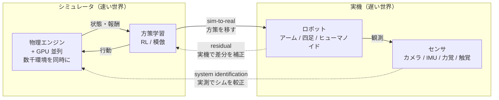
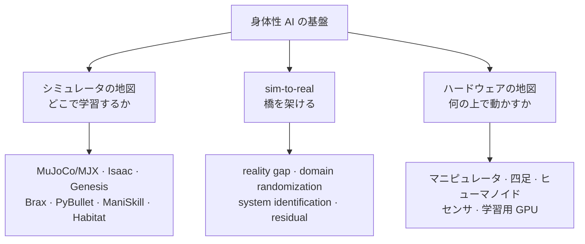
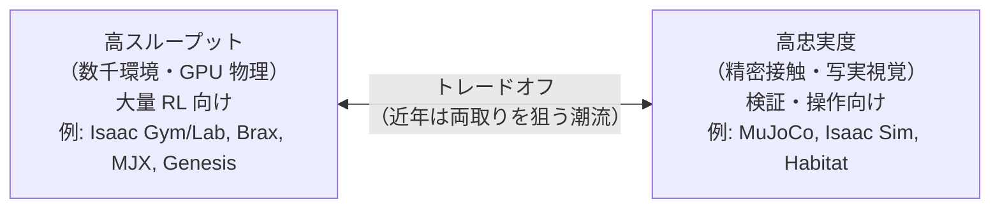
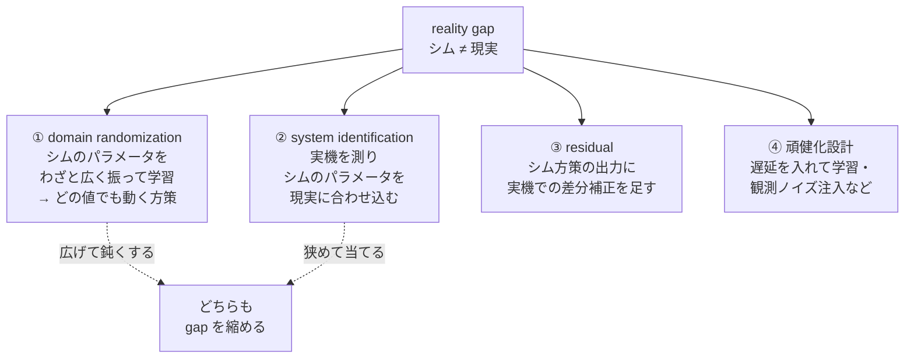

# シミュレーション環境とハードウェア

:::abstract[学習目標]
この章を読み終えると、次のことができるようになります。

- **なぜシミュレータで学習するのか**（実機は遅い・壊れる・危険・高価）を述べ、**GPU 並列シミュレーション**が学習を変えた理由を **説明** できる
- 主要シミュレータ（MuJoCo/MJX・NVIDIA Isaac Gym/Isaac Sim/Isaac Lab・Genesis・Brax・PyBullet・SAPIEN/ManiSkill・Habitat）を **物理エンジン・GPU 並列・用途・忠実度** で **比較** できる
- **sim-to-real** を構成する4つの道具 —— reality gap の正体・**domain randomization**・**system identification**・**residual** —— を **使い分け** られる
- 主要ハードウェア（マニピュレータ Franka/UR・グリッパ・四足 ANYmal/Unitree・ヒューマノイド Unitree G1/Figure 02/Optimus/1X/Apptronik・センサ・学習用 GPU）を **アクチュエータ・自由度・用途** で **対照** できる
- 2020–2026 の年表（GPU 並列 sim の台頭・ヒューマノイド競争・sim2real の実用化）から **いま全体がどちらへ動いているか** を **指し示せる**
:::

## 前提知識

- 章03 [古典制御（PID）](/physical-ai/03-pid-control/)：PD 制御・ゲイン・アクチュエータ遅延・整定。本章の domain randomization トイは PD ゲインを「データで選ぶ」設定で、章03 の制御則がそのまま土台です。
- 章06 [学習ベース制御・sim-to-real](/physical-ai/06-learning-based-control-sim2real/)：**reality gap** と **domain randomization** の概念、$\mathbb{E}_{\xi \sim p(\xi)}[J(\theta;\xi)]$ という目的関数、PPO による方策学習。本章はその概念を **「どんな道具・どんな機械の上で」** 実現するかの地図として読みます。
- 強化学習の基礎（[横断軸](/reinforcement-learning/)）：方策 $\pi$・報酬・エピソード・並列環境。「サンプル効率」という言葉を本章で多用します。

章06 は「学習で制御を獲得する考え方」を、本章は **「その学習をどこで回し、得た方策をどの機械で動かすか」のインフラ地図** を扱います。前者が *アルゴリズム*、後者が *基盤* です。

## 直感

章06 で「実機での試行は遅く・高コスト・危険だから、シミュレータで学習して実機へ移す」と述べました。本章はその一文を **地図** に展開します。問いは2つです。

1. **どこで学習するか** —— どのシミュレータを選ぶか。物理の忠実度が高いほど現実に近いが遅い。GPU で何千環境も並列できるほど速いが、物理が簡略化されがち。この **忠実度 ↔ 速度（スループット）** のトレードオフが、シミュレータ選びの本質です。
2. **何の上で動かすか** —— どのロボット（自由度・アクチュエータ・センサ）を相手にするか。アーム1本と二足ヒューマノイドでは、難しさも、必要な学習量も、危険度も桁違いです。

そして両者を繋ぐのが **sim-to-real** —— 「速い世界で学んだものを、遅くて壊れる本物の世界へ移す」橋です。橋が架からなければ、どれだけ速く学習しても無意味です。

この章のゴールは、新しいシミュレータやロボットが出てきても「ああ、これは GPU 並列の RL 用だな」「これは高忠実だが遅いオフライン検証用だな」「このヒューマノイドは電動 18 自由度か」と **即座に座標を打てる地図** を手に入れることです。

:::tip[RL 出身の読者へ]
強化学習で「環境（environment）」と一言で済ませていたものの **正体** が、身体性ではシミュレータとロボットです。Atari や MuJoCo Gym のタスクは、本章の地図でいえば「物理シミュレータの上に載った1つの環境」。サンプル効率の議論（何ステップで解けるか）は、身体性では「何 GPU 時間で・実機を壊さずに」という現実的制約に化けます。
:::

## 全体像

身体性 AI の開発は、**実機 ⇄ シミュレータ ⇄ 学習** の3者をぐるぐる回すループです。まずこのループを一望します。



ループは3本の矢印で閉じます。**順方向（学習時）** はシミュレータ内で方策を高速に鍛える。**転移（本番）** は学んだ方策を実機へ移す（sim-to-real）。**逆方向（較正）** は実機の挙動を測ってシミュレータや方策を現実へ寄せる（system identification・residual）。この章はこの3本の矢印を、1本ずつ道具立てとともに降ります。

次に、本章で扱う **2つの地図**（シミュレータ・ハードウェア）と、それを繋ぐ sim-to-real の関係を俯瞰します。



:::warning[「シミュレータが現実に近いほど良い」とは限らない]
直感に反しますが、**最高忠実のシミュレータが常に正解ではありません**。RL で方策を学ぶには「何千環境 × 何億ステップ」の試行が要り、1ステップが遅いと学習が終わりません。だから RL では **多少物理が粗くても GPU で超並列に回せるシミュレータ**（Isaac Gym 系）がしばしば勝ちます。一方、最終検証や接触リッチな操作では **高忠実だが遅いシミュレータ**（MuJoCo の精密接触）が要る。**目的（大量学習か / 精密検証か）でシミュレータを選ぶ** —— これが地図の読み方の核心です。
:::

## 理論①：なぜシミュレーションか、なぜ GPU 並列か

### 実機学習の4つの壁

なぜわざわざ仮想世界を作るのか。実機で直接学習しない理由は4つです。

| 壁 | 中身 | 数字の感覚 |
| --- | --- | --- |
| **遅い** | 1エピソードが実時間で数秒〜数分。RL は数百万〜数十億ステップ要る | 実機で歩行 RL を回すと数週間〜数ヶ月 |
| **壊れる** | 学習途中の方策は転倒・衝突する。試行錯誤＝破損 | 1台数百万円のヒューマノイドが転んで故障 |
| **危険** | 高出力アクチュエータが暴れると人・周囲に危害 | 人の隣で未収束方策を走らせられない |
| **高価** | 並列化するには実機を物理的に何台も買う必要 | 1000 環境並列＝実機 1000 台は非現実的 |

シミュレータはこの4つを一気に外します。**速い**（実時間より速く回せる）・**壊れない**（仮想ロボットは何度転んでもタダ）・**安全**（誰も傷つかない）・**安い**（GPU 1枚で何千環境）。

### GPU 並列シミュレーションが学習を変えた

身体性 RL の歴史を二分したのが **GPU 上で物理シミュレーションそのものを並列実行する** 発想です（NVIDIA Isaac Gym, 2021 / Brax, 2021）。従来は CPU で物理を回し、GPU は学習だけ —— その間 CPU↔GPU のデータ転送がボトルネックでした。GPU 内で物理も学習も完結させると、この転送が消えます。

なぜこれが効くか。RL のスループットは大まかに次で決まります。

$$\text{学習速度} \approx \underbrace{N_{\text{env}}}_{\text{並列環境数}} \times \underbrace{f_{\text{step}}}_{\text{1環境の物理ステップ/秒}}$$

ここで $N_{\text{env}}$ は同時にシミュレートする環境数、$f_{\text{step}}$ は1環境あたりの物理更新の速さです。CPU 物理では $N_{\text{env}}$ がコア数（数十）で頭打ちでしたが、GPU 物理では $N_{\text{env}}$ が **数千〜数万** に跳ね上がります。結果、**CPU で数日かかった脚ロコモーション学習が、GPU 1枚で数分** になりました（章06 で触れた「Isaac Gym で数分」の正体がこれです）。

:::note[なぜ「数分」が決定的か]
学習が数分で終わると、**研究の試行回数が爆発的に増えます**。報酬設計を変えて再学習、ランダム化範囲を変えて再学習、を1日に何十回も回せる。これが「数週間に1回しか実験できない実機学習」との決定的な差です。アルゴリズムが同じでも、**回せる実験の数** が研究速度を決めます。GPU 並列 sim は、いわば身体性 AI 版の「学習の高速化」革命でした。
:::

:::warning[「環境を増やせば必ず速く学べる」ではない]
$N_{\text{env}}$ を増やすとスループットは上がりますが、**サンプル効率（1ステップあたりの学習の進み）は上がりません**。むしろバッチが大きすぎると勾配のノイズが減りすぎて探索が鈍ることもあります。GPU 並列が効くのは「壁時計時間（実時間）」であって、「必要総ステップ数」ではありません。両者を取り違えないでください。
:::

## 理論②：シミュレータの地図

### 何で分類するか（4つの軸）

シミュレータは次の4軸で座標を打てます。

1. **物理エンジン**：剛体・接触・摩擦をどう解くか。接触の解き方（ソルバ）が忠実度と速度を大きく左右する。
2. **GPU 並列**：物理ステップ自体を GPU でベクトル化できるか（できれば数千環境）。RL 適性の核。
3. **忠実度（fidelity）**：接触・摩擦・センサ（特に視覚）が現実にどれだけ近いか。high なほど sim-to-real が楽だが遅い。
4. **用途**：ロコモーション（脚）／マニピュレーション（操作）／ナビゲーション（移動）のどれに強いか。

### 主要シミュレータ対照表

各シミュレータを4軸で並べます。**「忠実度 ↔ 並列スループット」のトレードオフ** が一望できます。

| シミュレータ | 物理エンジン | GPU 並列 | 忠実度 | 主用途 | 一言 |
| --- | --- | --- | --- | --- | --- |
| **MuJoCo** | MuJoCo（精密接触ソルバ） | △（単体は CPU 中心） | **高**（接触・摩擦） | 操作・ロコモ・研究標準 | 接触が正確。RL 研究のデファクト。2021 に DeepMind が買収しオープン化 |
| **MuJoCo MJX** | MuJoCo を JAX で再実装 | **◎**（GPU/TPU 並列） | 高 | GPU 上の大量 RL | MuJoCo の物理を GPU でベクトル化。忠実度と並列の両取りを狙う |
| **NVIDIA Isaac Gym** | PhysX（GPU 物理） | **◎**（数千〜数万環境） | 中 | 脚ロコモ RL の起点 | GPU 物理 RL を切り開いた。後継 Isaac Lab に移行中（旧称 preview） |
| **NVIDIA Isaac Sim** | PhysX + RTX レンダ | ○ | **高**（写実的視覚） | 検証・合成データ・デジタルツイン | フォトリアルな視覚。視覚 sim-to-real・データ生成向け |
| **NVIDIA Isaac Lab** | PhysX（Isaac Sim 上） | **◎** | 高 | RL/IL の統合フレームワーク | Isaac Gym + Isaac Sim を束ねる現行の標準窓口（2024〜） |
| **Genesis** | 独自（マルチ物理・微分可能） | **◎**（超高速を標榜） | 中〜高 | 汎用・生成的シミュレーション | 2024 末公開。極端な高速性と多様な物理（剛体・流体・軟体）を掲げる新顔 |
| **Brax** | 独自（JAX 製・微分可能） | **◎**（TPU/GPU） | 中 | 微分可能物理・大量 RL | JAX ネイティブ。end-to-end 微分や進化戦略に強い |
| **PyBullet** | Bullet | △（CPU 中心） | 中 | 教育・プロトタイピング | 導入が容易で軽い。学習用の入門に最適 |
| **SAPIEN / ManiSkill** | PhysX | **◎**（GPU 並列） | 中〜高 | **マニピュレーション** ベンチ | 操作タスクの標準ベンチ。多関節・接触リッチな操作に特化 |
| **Habitat** | Bullet 系 | ○（高 FPS レンダ） | 高（視覚） | **ナビゲーション**・embodied AI | 屋内 3D 空間の移動・探索。視覚ナビの定番 |

:::note[微分可能シミュレータ（differentiable simulation）とは]
Brax・Genesis・MJX などは **物理ステップを通して勾配を流せる**（微分可能）点が特徴です。普通のシミュレータは「行動 → 次状態」を計算するだけですが、微分可能シミュレータは「次状態を行動でどう微分するか」まで返せます。これにより、RL の試行錯誤なしに **物理を通した直接の勾配降下** で方策やパラメータを最適化できます。接触は不連続で勾配が荒れるという難所もあり、万能ではありませんが、system identification（後述）やパラメータ較正と相性が良いです。
:::

:::warning[Isaac の名前が紛らわしい（Gym / Sim / Lab）]
NVIDIA の「Isaac」は3つあり、混同しやすいので整理します。

| 名前 | 正体 | いま使うべきか |
| --- | --- | --- |
| **Isaac Gym** | GPU 物理 RL を切り開いた初代（preview） | 役割は Isaac Lab へ移行。新規は Lab を推奨 |
| **Isaac Sim** | フォトリアルなロボティクス・シミュレータ本体 | 視覚・検証・データ生成の基盤 |
| **Isaac Lab** | Isaac Sim 上の RL/IL 学習フレームワーク（旧 Orbit） | **現行の標準窓口**。Gym の RL ワークフローはここに集約 |

「Isaac Gym で学習」と書かれた論文（2021–2023）は多いですが、**2024 以降の新規開発では Isaac Lab が入口** です。実装前に最新の対応関係を再確認してください。
:::

### トレードオフを1枚で

シミュレータ選びは結局、次の対立軸の上のどこに座標を打つかです。



近年（MJX・Genesis）は「忠実度と並列スループットの両取り」を狙う流れですが、原理的なトレードオフは残ります。**用途で選ぶ** が鉄則です。

## 理論③：sim-to-real —— 橋を架ける4つの道具

シミュレータでどれだけ完璧に学習しても、実機で動かなければ価値はゼロです。シムと現実のズレ（**reality gap**）を埋めるのが sim-to-real。章06 で domain randomization の数式（$\mathbb{E}_{\xi \sim p(\xi)}[J(\theta;\xi)]$）は導出したので、ここでは **4つの道具をいつ・どう使い分けるか** を地図にします。

### reality gap の正体（どこがズレるか）

まず「何がズレるのか」を4層に分けます。これが分からないと対策を打てません。

| 層 | ズレの正体 | 例 |
| --- | --- | --- |
| **物理** | 質量・摩擦・剛性・重心がシムと実機で違う | 摩擦係数を 0.8 と仮定したが実機は 0.5 |
| **アクチュエータ** | モータの遅延・トルク飽和・ギアのバックラッシュ | シムは遅延 0、実機は制御指令が数 ms 遅れて効く |
| **観測（センサ）** | ノイズ・遅延・バイアス・欠損 | IMU にドリフト、カメラに動きブレ |
| **見た目（視覚）** | テクスチャ・照明・影がシムと現実で違う | レンダした机と本物の机の質感差 |

### 4つの道具を使い分ける

reality gap への対処は、大きく4つです。図でループのどこに効くかを示します。



それぞれの思想を対比します。**①と②は正反対の発想** であることに注意してください。

| 道具 | 思想 | いつ使う | 代償 |
| --- | --- | --- | --- |
| **① domain randomization** | シムを現実に近づけず、**わざと広くばらつかせて** どの値でも動く方策にする | 真のパラメータが測りにくい／変動する | ランダム範囲が広すぎると過度に保守的（性能が鈍る） |
| **② system identification** | 実機を測定し、**シムを現実に合わせ込む** | パラメータが安定して測れる | 測り切れない要素（接触の微妙さ等）は残る |
| **③ residual** | シム方策を土台に、**実機での差分だけ** を別途学習・補正 | シム方策がそこそこ動くが微妙にズレる | 実機データ収集が要る |
| **④ 頑健化設計** | 学習時に遅延・ノイズを注入し、現実の悪条件に **先に慣れさせる** | gap の主因が遅延・ノイズと分かっている | 注入のモデル化が雑だと逆効果 |

:::warning[domain randomization と system identification は対立ではなく補完]
「①広げる」と「②当てに行く」は逆向きに見えますが、実務では **併用** します。まず ② で測れるパラメータ（質量・リンク長）はシムを合わせ込み、測りにくいパラメータ（摩擦・接触・遅延のばらつき）だけ ① で広く振る —— こうすると「無駄に保守的にならず、かつ未知のばらつきには頑健」という両取りができます。「DR か SysID か」の二択ではありません。
:::

:::note[residual の発想（RL 出身者向け）]
residual policy / residual RL は「ゼロから学ばず、**既にそこそこ動く土台の上に差分だけを学ぶ**」発想です。シムで学んだ方策 $\pi_{\text{sim}}$ を固定し、実機での補正項 $\Delta\pi$ だけを少量の実機データで学習して $\pi = \pi_{\text{sim}} + \Delta\pi$ とします。ゼロから実機学習するより圧倒的にサンプル効率が良い。LLM でいう「事前学習モデルに LoRA で差分を足す」のと同じ構図です。
:::

## 理論④：ハードウェアの地図

「何の上で動かすか」を地図にします。ロボット本体・センサ・学習用 GPU の3つを順に。

### ロボット本体：自由度とアクチュエータで対照

ロボットは **形態（アーム／四足／ヒューマノイド）** で大別し、**自由度（DoF: degrees of freedom＝独立に動かせる関節の数）** と **アクチュエータ（何で関節を駆動するか）** で性格が決まります。

| 形態 | 代表 | 自由度の目安 | アクチュエータ | 主用途 | 難しさ |
| --- | --- | --- | --- | --- | --- |
| **マニピュレータ（腕）** | Franka Emika, Universal Robots (UR5/UR10) | 6〜7 DoF | 電動（トルク制御可） | 工場の組立・研究の操作タスク | 中（固定基部で安定） |
| **グリッパ／ハンド** | 平行 2 指, Robotiq, 多指ハンド (Shadow/Allegro) | 1〜20+ DoF | 電動・腱駆動 | 把持・器用な操作 | 高（接触・滑り） |
| **四足（quadruped）** | ANYmal, Unitree Go2/B2, Boston Dynamics Spot | 12 DoF（脚 3×4） | 電動（高トルク密度） | 巡回・点検・不整地移動 | 高（動的バランス） |
| **ヒューマノイド（二足）** | Unitree G1/H1, Figure 02, Tesla Optimus, 1X NEO, Apptronik Apollo | 20〜40+ DoF | 主に電動（一部に油圧の歴史） | 汎用作業・人の環境での労働 | **最高**（高 DoF・不安定・全身協調） |

:::note[電動 vs 油圧（なぜ今は電動が主流か）]
かつて高出力の脚ロボット（初期の Boston Dynamics Atlas）は **油圧（hydraulic）** を使いました。油圧は瞬発力・トルク密度が高い一方、ポンプ・配管・漏れ・騒音・効率の問題を抱えます。近年のヒューマノイド（Unitree・Figure・Optimus・新型 Atlas）はほぼ **電動（electric / quasi-direct-drive）** です。電動はトルク制御が素直（＝RL/制御と相性が良い）・静か・メンテが楽で、モータとパワーエレクトロニクスの進歩で必要な出力が出せるようになったため、主流が移りました。**「トルクを直接・正確に指令できる」ことが学習ベース制御では決定的** です。
:::

:::warning[自由度（DoF）が増えると何が難しくなるか]
DoF はただの関節数ではありません。**制御・学習が探索する空間の次元** です。7 DoF のアームと 30 DoF のヒューマノイドでは、方策が出力する行動ベクトルの次元が4倍以上違い、安定領域（転ばない姿勢の集合）も狭くなります。だからヒューマノイドは「シミュレータで大量に・安全に試せる」ことの恩恵が最も大きい形態です。GPU 並列 sim とヒューマノイド競争が同時期に盛り上がったのは偶然ではありません。
:::

### センサ：何で世界を測るか

方策の入力（観測）を作るのがセンサです。章05（[知覚と状態推定](/physical-ai/05-perception-state-estimation/)）の入力源にあたります。

| センサ | 測るもの | sim での再現しやすさ | 役割 |
| --- | --- | --- | --- |
| **カメラ（RGB / depth）** | 視覚・物体・空間 | 中（写実レンダが要る＝視覚 gap が大きい） | 知覚・把持点推定・ナビ |
| **IMU（慣性計測）** | 加速度・角速度（姿勢） | 高（数式モデルが素直） | バランス・姿勢推定（四足/二足の要） |
| **力覚（force/torque）** | 関節・手首にかかる力 | 中（接触モデル依存） | 接触制御・組立・嵌合 |
| **触覚（tactile）** | 指先の接触分布・滑り | 低（接触の微細物理が難所） | 器用な把持・滑り検知 |
| **関節エンコーダ** | 各関節の角度・速度 | 高 | 全制御の基礎（自己受容感覚） |

:::note[なぜ視覚の sim-to-real が特に難しいか]
物理（質量・摩擦）のズレは数パラメータですが、**視覚のズレは画素全体に広がる高次元のズレ** です。シムのレンダと実カメラの「見た目」の差を埋めるのが難しく、ここに視覚版の domain randomization（テクスチャ・照明・カメラ位置をランダム化）や写実レンダ（Isaac Sim の RTX）が要ります。触覚はさらに難しく、接触の微細物理をシムで正確に出すのが現状の最前線です。
:::

### 学習用 GPU：計算基盤

GPU 並列 sim も大規模方策学習も GPU の上で回ります。本テキストの実習基盤（Slurm 上の H200 など）もここです。

| 用途 | 必要な計算 | 感覚 |
| --- | --- | --- |
| **GPU 並列 sim + RL** | 物理 + 方策を GPU 内で並列実行 | 1枚で数千環境を回せる（Isaac Lab / Brax） |
| **大規模模倣学習 / VLA 学習** | 大量デモ・基盤モデルの訓練 | 複数 GPU・大メモリ（次章 VLA の前提） |
| **推論（実機搭載）** | 学習済み方策の実行 | エッジ GPU（Jetson 等）で省電力推論 |

学習は大型 GPU、実機搭載は省電力エッジ GPU、と **学習時と推論時でハードが分かれる** のが身体性の特徴です（学習は壊れない速い世界＝データセンタ、推論は本物の機体の上）。

## 理論⑤：年表とトレンド（2020–2026）

地図に時間軸を入れます。各マイルストーンが「どの軸を動かしたか」を併記します。

| 年 | マイルストーン | 動かした軸 |
| --- | --- | --- |
| 2018–2020 | OpenAI **Dactyl**（ルービックキューブを片手操作、大規模 domain randomization） | sim-to-real：DR で器用な操作が実機転移できると実証 |
| 2021 | NVIDIA **Isaac Gym**（GPU 物理 RL）／ Google **Brax**（JAX 微分可能物理） | シミュレータ：**GPU 並列 sim の台頭**。学習が数日→数分へ |
| 2021 | DeepMind が **MuJoCo を買収しオープンソース化** | シミュレータ：研究標準の物理エンジンが無償開放、普及加速 |
| 2022 | **legged_gym / Learning to Walk in Minutes**（Isaac Gym で脚 RL を数分で） | sim-to-real：四足ロコモの実用的レシピが確立 |
| 2022–2023 | ANYmal / Unitree の四足 RL が **不整地・野外で実用化** | ハードウェア：四足 sim2real が製品水準に |
| 2023 | **MuJoCo MJX**（GPU/TPU 並列の MuJoCo） | シミュレータ：高忠実と並列の両取りへ |
| 2023–2024 | **ヒューマノイド競争の本格化**（Figure 01/02・Tesla Optimus・1X・Apptronik） | ハードウェア：**ヒューマノイド競争**。電動・高 DoF が一斉に登場 |
| 2024 | NVIDIA **Isaac Lab**（Gym + Sim を統合する学習基盤） | シミュレータ：RL/IL の窓口が統合 |
| 2024 | Unitree **G1**（低価格ヒューマノイド）が研究コミュニティに普及 | ハードウェア：ヒューマノイドの研究アクセスが民主化 |
| 2024 末 | **Genesis**（超高速・マルチ物理・生成的シミュレーション）公開 | シミュレータ：速度と汎用物理の新基準を標榜 |
| 2025 | NVIDIA **Isaac GR00T**（ヒューマノイド向け基盤モデル）／合成データ生成の本格活用 | 橋渡し：sim での大量データ生成 → 基盤モデルへ（次章 VLA へ接続） |
| 2025–2026 | sim2real が **ヒューマノイド全身制御** にも適用拡大・on-device 推論 | 全体：GPU 並列 sim × ヒューマノイド × 基盤モデルの収束 |

### トレンドを4つの潮流で読む

**トレンド1：GPU 並列 sim の標準化。** 「物理を GPU で並列に回す」は 2021 の Isaac Gym / Brax を起点に、いまや脚ロコモ・全身制御 RL の **標準** です。学習が数分で終わることが研究の試行回数を爆発させ、身体性 RL の進歩を加速しました。

**トレンド2：忠実度と速度の両取りへ。** かつて「速い（粗い物理）」か「正確（遅い）」の二択だったのが、MJX・Genesis のように **両取りを狙う** 流れに移りました。原理的なトレードオフは残りますが、その境界が押し広げられています。

**トレンド3：ヒューマノイド競争。** Figure・Optimus・1X・Apptronik・Unitree が 2023–2026 に一斉に実機を出し、**電動・高 DoF** が共通解になりました。高 DoF ゆえ「安全に大量試行できる sim」の恩恵が最大で、GPU 並列 sim とヒューマノイドは相互に駆動し合っています。

**トレンド4：sim2real の実用化と基盤モデルへの接続。** DR を中心とする sim2real が四足では製品水準に達し、ヒューマノイド全身制御へ広がりつつあります。さらに **シムで大量の合成データを生成し、それで基盤モデル（VLA）を学習する** 流れ（Isaac GR00T 等）が立ち上がり、本章の地図は次章 VLA へ直結します。

:::success[トレンドを1行で]
**物理が GPU 並列で爆速になり（数日→数分）、忠実度と速度の両取りが進み、ヒューマノイドが電動・高 DoF で一斉に登場し、sim2real が実用化してシムが基盤モデルのデータ源になった** —— これが 2020–2026 の地図の動きです。
:::

:::warning[固有名・数値は時点情報]
本章の固有名（製品名・社名）・年・自由度・スループット等は **2024–2026 時点で確認できた範囲** です。この領域は進展が非常に速いため、**実装前に各公式ドキュメント / WebSearch で最新版を再確認** してください（CLAUDE.md 方針）。とくにシミュレータの推奨窓口（Isaac Gym → Isaac Lab）やヒューマノイドの仕様は頻繁に更新されます。
:::

## 数式の導出：domain randomization が「頑健性」を選ぶ仕組み

地図の章なので導出は軽くします。章06 で示した DR の目的関数を、本章の「シミュレータで学んで実機へ移す」文脈で **「なぜ頑健な方策が選ばれるか」** に絞って確認します。

通常の学習（nominal）は、シミュレータの **1点のパラメータ** $\xi_0$（設計者が「これだろう」と置いた値）の下で性能 $J$ を最大化します。

$$\theta^{\star}_{\text{nom}} = \arg\max_{\theta}\ J(\theta;\xi_0)$$

ここで $\theta$ は方策のパラメータ（本章の実装では PD ゲイン $(k_p, k_d)$）、$\xi$ は物理パラメータ（質量・摩擦・遅延など）、$J$ は性能（コストの符号反転）です。問題は、実機の真のパラメータ $\xi_{\text{real}}$ が $\xi_0$ とズレること —— これが reality gap です。$\theta^{\star}_{\text{nom}}$ は $\xi_0$ に過適合し、$\xi_{\text{real}}$ で破綻し得ます。

domain randomization は、$\xi$ を **分布 $p(\xi)$ から振った期待性能** を最大化します。

$$\theta^{\star}_{\text{DR}} = \arg\max_{\theta}\ \mathbb{E}_{\xi \sim p(\xi)}\big[\,J(\theta;\xi)\,\big]$$

この期待値最大化が頑健性に効く理由を1ステップで詰めます。期待値は分布上の平均なので、**ある $\xi$ で大きく破綻する（$J$ が極端に低い）方策は、その分だけ平均が下がり選ばれにくくなります**。逆に、$p(\xi)$ の **広い範囲でそこそこ動く** 方策が高い平均を得やすい。

$$
\mathbb{E}_{\xi \sim p(\xi)}[J(\theta;\xi)]\ \text{を上げる}\ \Longrightarrow\ \text{分布の広い範囲で}\ J\ \text{が低すぎない}\ \theta\ \text{を選びやすい}
$$

:::warning[期待値最大化は「全域で無破綻」を保証しない]
上は **平均** の話で、向きも一方向（最大化 → 広く頑健になりやすい）です。$p(\xi)$ に**まれな極端ケース**があると、期待値最大化は「**他の大多数で稼げるなら、一部の $\xi$ で破綻してもよい**」方策を選びえます（破綻が低確率なら平均にほぼ響かない）。台（support）の**全域で破綻しない**ことを本当に担保したいなら、平均ではなく **最悪ケース**（robust RL）や **CVaR（下側テールの条件付き期待値）** を目的に据える必要があります。DR の期待値最大化は「広く頑健になりやすい」のであって、「全域での無破綻」を約束するものではありません。
:::

ここでカギになるのが **$\xi_{\text{real}}$ が分布 $p(\xi)$ の台（support＝振った範囲）の内側にあること** です。もし実機の真値がランダム化範囲の内側なら、$\xi_{\text{real}}$ は「学習中に見た無数のバリエーションの一つ」になり、方策は既にその対処を学んでいます。これがゼロショット転移が動く核心でした（章06）。

代償も式から読めます。$p(\xi)$ を広げるほど「どの値でも動く」制約が強まり、**特定の $\xi_0$ での最高性能は犠牲** になります（保守化）。次の実装で、この **「名目では劣るが本番では勝つ」** トレードオフを実測します。$\blacksquare$

## 実装：domain randomization で方策が頑健化することを実測する

章06 では DR の概念を扱いました。ここでは **「シムで学んで実機へ移す」という本章の主題そのもの** を最小トイで体感します。題材は章03 の PD 制御（質量-ばね-ダンパ系を目標 0 へ整定）。シミュレータの中で2通りにゲインを選び、reality gap のある「本番」で比べます。

- **(A) nominal**：名目パラメータ1点だけで最適ゲインを選ぶ（reality gap を考えない素朴な学習）。
- **(B) DR**：物理パラメータを広くばらつかせた分布の平均コストで最適ゲインを選ぶ。

本番（real）では、**名目が無視した「アクチュエータ遅延」** を実在させ、質量・剛性もズラします。遅延は reality gap の典型要因です（章03・章06）。

```python title="domain_randomization_toy.py"
"""domain randomization(DR)が方策を頑健化することを示す最小トイ。
質量-ばね-ダンパ系 + アクチュエータ遅延を PD ゲイン(kp,kd)で目標 0 へ整定させる。
 (A) nominal: 名目パラメータ1点だけで最適ゲインを選ぶ
 (B) DR     : 物理パラメータを広くばらつかせた分布の平均コストで最適ゲインを選ぶ
本番では真パラメータを名目からズラし(reality gap)、どちらが破綻せず良いかを比べる。"""

import numpy as np

rng = np.random.default_rng(0)

DT, T, X0 = 0.02, 250, 1.0  # 制御周期[s] / ステップ数 / 初期ズレ（目標は 0）


def simulate(kp, kd, mass, damping, stiffness, delay_steps):
    """遅延付き PD 制御を回し、平均二乗位置誤差を返す。発散したら大コストで打ち切り。"""
    x, v = X0, 0.0
    buf = [0.0] * (delay_steps + 1)  # アクチュエータ遅延のリングバッファ
    cost = 0.0
    for _ in range(T):
        buf.append(-kp * x - kd * v)      # PD 指令：位置と速度を 0 へ
        u = buf.pop(0)                    # delay_steps 前の指令が「今」効く
        a = (u - damping * v - stiffness * x) / mass  # m x'' + c x' + k x = u
        v += a * DT
        x += v * DT
        if abs(x) > 50:                   # 発散＝制御破綻
            return 1e6
        cost += x * x
    return cost / T


# 名目パラメータ：設計者が「これだろう」と置いた値。遅延を 0 と誤認しているのが罠。
NOM = dict(mass=1.0, damping=0.4, stiffness=3.0, delay_steps=0)


def cost_nominal(kp, kd):
    return simulate(kp, kd, **NOM)


def cost_dr(kp, kd, n=60):
    """ランダム化分布上の平均コスト（DR の目的 E[J]）。遅延も 0〜5 まで広く振る。"""
    tot = 0.0
    for _ in range(n):
        tot += simulate(
            kp, kd,
            mass=rng.uniform(0.7, 2.0),
            damping=rng.uniform(0.1, 1.5),
            stiffness=rng.uniform(1.5, 5.0),
            delay_steps=int(rng.integers(0, 6)),
        )
    return tot / n


# シミュレータ内でグリッド探索：(A)名目最適 と (B)DR最適 をそれぞれ求める
KP = np.linspace(2.0, 80.0, 40)
KD = np.linspace(0.5, 20.0, 40)
best_n, best_d = (None, 1e18), (None, 1e18)
for kp in KP:
    for kd in KD:
        cn = cost_nominal(kp, kd)
        if cn < best_n[1]:
            best_n = ((kp, kd), cn)
        cd = cost_dr(kp, kd)
        if cd < best_d[1]:
            best_d = ((kp, kd), cd)

(kp_n, kd_n), _ = best_n
(kp_d, kd_d), _ = best_d
print(f"nominal最適ゲイン : kp={kp_n:5.1f}, kd={kd_n:5.1f}  (遅延を無視→高ゲイン)")
print(f"DR最適ゲイン      : kp={kp_d:5.1f}, kd={kd_d:5.1f}  (遅延に備え→穏やか)")

# 本番(real)：名目が無視した遅延(3step)が実在し、質量・剛性もズレる＝reality gap
REAL = dict(mass=1.6, damping=0.2, stiffness=4.0, delay_steps=3)
print("\n--- 本番(real, 遅延3stepあり)での整定コスト（小さいほど良い）---")
print(f"  nominal方策 : {simulate(kp_n, kd_n, **REAL):10.3f}")
print(f"  DR方策      : {simulate(kp_d, kd_d, **REAL):10.3f}")
print("\n--- 名目(設計時の見かけ)での整定コスト ---")
print(f"  nominal方策 : {simulate(kp_n, kd_n, **NOM):10.3f}")
print(f"  DR方策      : {simulate(kp_d, kd_d, **NOM):10.3f}")
```

```text title="出力"
nominal最適ゲイン : kp= 80.0, kd= 10.5  (遅延を無視→高ゲイン)
DR最適ゲイン      : kp= 34.0, kd=  9.5  (遅延に備え→穏やか)

--- 本番(real, 遅延3stepあり)での整定コスト（小さいほど良い）---
  nominal方策 :      0.078
  DR方策      :      0.044

--- 名目(設計時の見かけ)での整定コスト ---
  nominal方策 :      0.019
  DR方策      :      0.033
```

この出力に sim-to-real の核心が全部出ています。

1. **ゲインの違い**：nominal は遅延を無視できる前提なので、攻めた高ゲイン（$k_p=80$）を選びます。DR は「遅延が 0〜5 のどれでも動け」と縛られるので、**穏やかなゲイン**（$k_p=34$）を選ばざるをえません。高ゲイン制御は遅延があると振動・発散しやすい（章03）ので、DR は自然に保守化します。
2. **名目（設計時の見かけ）では nominal が勝つ**：0.019 < 0.033。攻めたゲインの方が、遅延ゼロの理想世界では速く整定します。**ここだけ見ると DR は損に見えます。**
3. **本番（reality gap あり）では DR が勝つ**：0.044 < 0.078。名目が無視した遅延が実在すると、攻めすぎた nominal は揺れて整定が悪化し、保守的な DR が逆転します。

つまり **「名目では劣るが本番で勝つ」** という数式の導出どおりの結果です。実機の真値（遅延 3step・質量 1.6 倍）が DR のランダム化範囲（遅延 0〜5・質量 0.7〜2.0）の **内側** にあるから、DR 方策は既にそのバリエーションを学習済み —— これが sim-to-real が動く理由の核です。実際のヒューマノイド RL では、この $\xi$ が全関節の摩擦・各リンクの質量・センサ遅延…と数十次元に広がります。

### MuJoCo / Isaac の最小の触り方（手順）

実シミュレータに触れる最小手順も置きます（重み・GPU が要るのでここでは手順のみ）。

1. **MuJoCo（高忠実・入門）**：`pip install mujoco` → 付属の `humanoid.xml` 等のモデルを読み込み、`mujoco.viewer` でビューア起動 → ランダム行動でロボットが倒れる様子を観察。物理の「正確さ」を体感する。
2. **Isaac Lab（GPU 並列 RL）**：公式手順で Isaac Sim をインストール → Isaac Lab を入れ、`Isaac-Velocity-Flat-Anymal-C` 等の用意された四足ロコモ・タスクを学習スクリプトで実行 → 数千環境が同時に学習する様子と、数分で歩行が立ち上がる速度を体感する。
3. **対比**：同じ「歩く」を MuJoCo（精密・少環境）と Isaac Lab（粗め・大量並列）で回し、**忠実度 ↔ スループット** のトレードオフを自分の手で確かめる。

:::warning[実行前の前提]
上の手順は GPU・ライセンス確認・それなりのセットアップを要します。バージョンで API・推奨窓口（とくに Isaac Gym → Isaac Lab）が変わるため、**実装前に各公式 README を必ず参照** してください。本トイ（numpy）はその前段の「DR がなぜ効くか」を依存ゼロで掴むためのものです。
:::

## 演習

::::question[演習 1: シミュレータを地図に配置する]
次の状況それぞれに、最も適したシミュレータの **タイプ**（高スループット並列型／高忠実型）を選び、本章の対照表から代表を1つ挙げて理由を述べてください。

(a) 四足ロボットの歩行方策を RL で数分のうちに学習したい。
(b) 接触リッチな嵌合（ peg-in-hole）の最終挙動を、実機投入前に精密検証したい。
(c) 屋内を移動するロボットの視覚ナビゲーションを学習したい。

また (d) 「シミュレータは現実に近いほど良い」が必ずしも正しくない理由を1文で述べてください。

:::details[解答]
(a) **高スループット並列型**。例：Isaac Lab（旧 Isaac Gym）／ Brax ／ MJX。脚ロコモ RL は数百万〜数十億ステップ要るので、GPU で数千環境を並列に回せることが決定的。多少物理が粗くても、回せる試行数の多さが勝つ。

(b) **高忠実型**。例：MuJoCo（精密接触ソルバ）。嵌合は接触・摩擦の微妙な物理が結果を支配するので、忠実度が最優先。学習の大量試行より、本番前の正確な検証が目的。

(c) **高忠実（視覚）型**。例：Habitat（屋内 3D ナビの定番）／ Isaac Sim（写実レンダ）。視覚ナビは「見た目」の忠実度が要で、視覚 sim-to-real のために写実的なレンダリングが効く。

(d) RL は「何千環境 × 何億ステップ」の試行を要するので、1ステップが遅い高忠実シミュレータでは学習が終わらず、**多少粗くても超並列に回せる方が結果的に良い方策を速く得られる** から（目的が大量学習か精密検証かで最適が変わる）。
:::
::::

::::question[演習 2: sim-to-real の道具を使い分ける]
ある四足ロボットを sim で学習して実機へ移したところ、実機でだけ脚が小刻みに振動して安定しません。原因を切り分けると「制御指令がモータに効くまでの遅延を、シムでは 0 と仮定していた」ことが分かりました。

(a) この振動の正体は reality gap の4層（物理／アクチュエータ／観測／見た目）のどれに当たりますか。
(b) この gap を埋めるのに、**system identification**（実機を測ってシムを合わせ込む）と **domain randomization**（パラメータを広く振る）はそれぞれどう使えますか。
(c) なぜ「両方を併用する」のが実務的に良いのか、1文で述べてください。

:::details[解答]
(a) **アクチュエータ層**の gap です。モータの遅延・トルク飽和・バックラッシュはこの層に属し、シムが遅延 0 と仮定すると実機との差が振動として現れます。

(b) **system identification**：実機で「指令を出してから実際に効くまでの時間」を測定し、シムの `delay_steps` をその実測値に合わせ込む（測れるなら当てに行く）。**domain randomization**：遅延を1点に固定せず、0〜数 step の範囲で **エピソードごとにランダムに振って学習** し、どの遅延でも動く方策にする（測り切れない変動に備える）。本章の実装トイがまさにこれで、DR 方策は遅延を含む真パラメータでも振動せず整定しました。

(c) 測れる遅延の中心値は ② で当てに行き、その周りの**ばらつき**（個体差・温度・経年）は ① で広く振ると、無駄に保守的にならず未知のばらつきにも頑健になるから。
:::
::::

## まとめ

:::success[この章の要点]
- 実機学習は **遅い・壊れる・危険・高価** の4つの壁を持つ。シミュレータがこれを外し、**GPU 並列シミュレーション**（Isaac Gym/Brax, 2021〜）が物理を数千環境で並列化して学習を数日→数分に短縮し、研究の試行回数を爆発させた。
- シミュレータは **物理エンジン・GPU 並列・忠実度・用途** で対照する。**高スループット並列型**（Isaac Lab/Brax/MJX/Genesis）と **高忠実型**（MuJoCo/Isaac Sim/Habitat）のトレードオフが核で、**目的（大量学習か精密検証か）で選ぶ**。
- **sim-to-real** は4つの道具で橋を架ける：reality gap の正体を4層（物理/アクチュエータ/観測/見た目）で捉え、**domain randomization**（広げて鈍くする）・**system identification**（当てに行く）・**residual**（差分だけ補正）・頑健化設計を使い分け・併用する。
- ハードウェアは **形態（アーム/四足/ヒューマノイド）× 自由度 × アクチュエータ** で対照する。近年は **電動・高 DoF** が主流で、高 DoF ゆえヒューマノイドは GPU 並列 sim の恩恵が最大。学習は大型 GPU、実機推論はエッジ GPU と分かれる。
- 2020–2026 の動きは **GPU 並列 sim の爆速化 → 忠実度と速度の両取り → ヒューマノイド競争（電動・高 DoF）→ sim2real 実用化 → シムが基盤モデル（VLA）のデータ源へ**。
:::

### 次に学ぶこと

「どこで学習し、何の上で動かすか」の地図が手に入りました。GPU 並列 sim で大量のデータを生成し、それで方策を学ぶ —— この流れの先にあるのが、シムや実機のデータで **言語・視覚・行動を1つの基盤モデルに統合する** VLA です。本章の「シムを基盤モデルのデータ源にする」というトレンドの行き先を、次章で深掘りします。

→ [第08章 VLA と基盤モデル](/physical-ai/08-vla-foundation-models/) へ。

→ [身体性 AI ロードマップに戻る](/physical-ai/)

## 用語ミニ辞典

| 用語 | 一言 |
| --- | --- |
| シミュレータ | 物理を仮想的に再現し、安全・高速に試行する環境 |
| 物理エンジン | 剛体・接触・摩擦を解く計算の中核（MuJoCo/PhysX/Bullet 等） |
| GPU 並列シミュレーション | 物理ステップ自体を GPU で数千環境ベクトル化（Isaac Gym/Brax） |
| 忠実度 (fidelity) | シムが現実にどれだけ近いか。高いほど転移が楽だが遅い |
| 微分可能シミュレータ | 物理を通して勾配を流せる（Brax/MJX/Genesis） |
| Isaac Gym/Sim/Lab | 初代 GPU 物理 RL / 写実シミュレータ本体 / 現行の学習統合窓口 |
| sim-to-real | シムで学んだ方策を実機へ移すこと |
| reality gap | シムと現実のズレ（物理/アクチュエータ/観測/見た目の4層） |
| domain randomization | シムのパラメータを広く振り、どの値でも動く方策にする |
| system identification | 実機を測ってシムのパラメータを現実に合わせ込む |
| residual | シム方策の上に実機での差分補正だけを足す |
| 自由度 (DoF) | 独立に動かせる関節の数＝制御・学習が探索する空間の次元 |
| アクチュエータ | 関節を駆動する装置。近年は電動が主流（油圧は過去主流） |
| マニピュレータ/四足/ヒューマノイド | 腕（6-7DoF）/ 四脚（12DoF）/ 二足（20-40+DoF） |
| エッジ GPU | 実機搭載の省電力推論用 GPU（Jetson 等） |

## 次のアクション

地図を手で定着させる。**最小の写経 → 動かす → 小実験** を1セットで。

1. **写経**：上の `domain_randomization_toy.py` をそのまま打ち、`nominal 最適ゲイン` と `DR 最適ゲイン`、そして「名目では nominal が勝つが本番では DR が勝つ」逆転を出力で確認する。
2. **動かす**：`REAL` の `delay_steps` を 0 → 5 まで動かして再実行し、遅延が大きいほど nominal が崩れ DR が安定する（gap が広がるほど DR の優位が増す）様子を測る。
3. **小実験**：DR の `cost_dr` のランダム化範囲（質量・遅延の上下限）をわざと狭め、**真値が範囲の外に出たとき DR も破綻する** ことを確認する。「実機の真値はランダム化範囲の内側になければならない」という sim-to-real の前提を自分の手で壊して理解する。

余力があれば、MuJoCo（`pip install mujoco`）の付属モデルをビューアで眺め、本章の「高忠実だが少環境」を体感してから、次章 VLA へ進んでください。

## 参考文献

1. E. Todorov, T. Erez, Y. Tassa, "MuJoCo: A physics engine for model-based control," *IROS*, 2012.（MuJoCo。2021 に DeepMind がオープンソース化）
2. V. Makoviychuk et al., "Isaac Gym: High Performance GPU-Based Physics Simulation For Robot Learning," NVIDIA, *arXiv:2108.10470*, 2021.
3. C. D. Freeman et al., "Brax — A Differentiable Physics Engine for Large Scale Rigid Body Simulation," Google, *arXiv:2106.13281*, 2021.
4. M. Mittal et al., "Orbit / Isaac Lab: A Unified Simulation Framework for Interactive Robot Learning Environments," NVIDIA, 2023–2024.
5. OpenAI et al., "Solving Rubik's Cube with a Robot Hand" (Dactyl, 大規模 domain randomization), *arXiv:1910.07113*, 2019.
6. J. Tobin et al., "Domain Randomization for Transferring Deep Neural Networks from Simulation to the Real World," *IROS*, 2017.
7. N. Rudin et al., "Learning to Walk in Minutes Using Massively Parallel Deep Reinforcement Learning," *CoRL*, 2022.（legged_gym / Isaac Gym）
8. T. Johannink et al., "Residual Reinforcement Learning for Robot Control," *ICRA*, 2019.
9. J. Gu et al., "ManiSkill: Generalizable Manipulation Skill Benchmark" / SAPIEN, 2021–2023.（マニピュレーション・ベンチ）
10. M. Savva et al., "Habitat: A Platform for Embodied AI Research," *ICCV*, 2019.
11. NVIDIA, "Isaac GR00T: Foundation Model for Humanoid Robots," 2025.（シムでの合成データ → 基盤モデル）
12. Genesis（汎用・高速・生成的シミュレーション）, 2024–2025。固有名・数値は 2024–2026 時点。実装前に公式ドキュメント / WebSearch で最新版を再確認してください。
