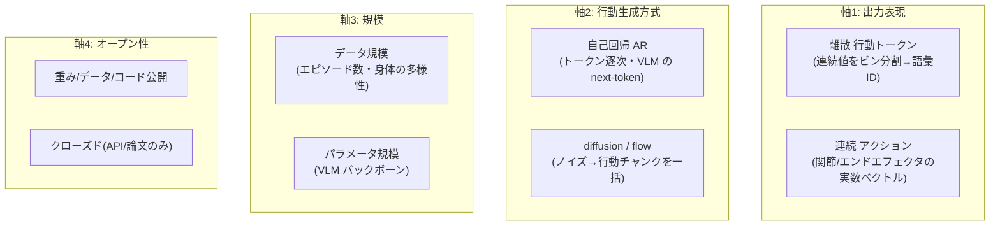
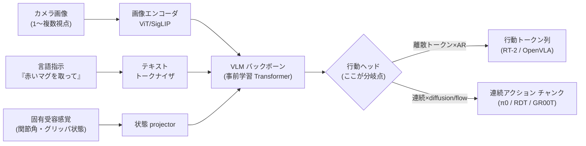
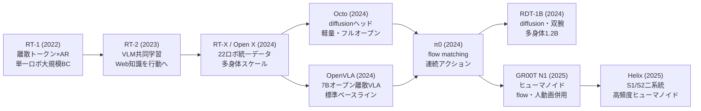

# VLA とロボット基盤モデル — π0・RT-2・OpenVLA・GR00T

:::abstract[学習目標]
この章を読み終えると、次のことができるようになります。

- ロボットを動かす **VLA（Vision-Language-Action）基盤モデル** が「視覚＋言語 → 行動」をどう解くかを **説明** できる
- VLA を **4つの分類軸**（出力＝離散トークン/連続アクション、生成方式＝自己回帰/diffusion・flow、規模＝データ/パラメータ、オープン性）で **整理** できる
- **RT-1/RT-2 → RT-X/Open X-Embodiment → OpenVLA/Octo → π0/RDT-1B → GR00T/Helix** の代表モデルを時系列に並べ、各研究が「どの軸のどの課題を解いたか」を **対応づけ** られる
- **行動の離散トークン化（RT-2）→ diffusion policy → flow matching policy（π0）** という生成系譜が、[音声の flow matching TTS](/audio/07-flow-matching-tts/) や [画像の拡散生成](/vision/04-diffusion-generation/) と **同じ数理が行動に来た** ものだと **接続** できる
- 2024–2026 の主要トレンド（連続アクション生成・データスケール・ヒューマノイド・汎化）を **列挙** し、なぜその方向へ進んだかを **説明** できる
:::

## 前提知識

- 章06 [学習ベース制御と sim-to-real](/physical-ai/06-learning-based-control-sim2real/)：**行動クローン（BC）**・**diffusion policy**・**action chunking（数手まとめて予測）**・VLA の導入。本章はこの最後の節を一気に深掘りします。「VLA は視覚＋言語＋行動のマルチモーダル」「高レベル＝学習・低レベル＝古典制御の分業」という枠組みを土台にします。
- 章07 [シミュレーションとハードウェア](/physical-ai/07-simulation-and-hardware/)：VLA の学習データがどこから来るか（実機テレオペ・シミュレータ・大規模データセット）、評価をどこで回すか。本章の「データスケール」はこの上に立ちます。
- 橋渡し [Vision-Language モデル (VLM)](/multimodal/02-vision-language-models/)：画像エンコーダ → projector → LLM トークン空間という構図。**VLA はこの VLM のバックボーンを流用して出力を「行動」に差し替えたもの**です。
- 橋渡し [画像生成 — 拡散モデル](/vision/04-diffusion-generation/)：ノイズ → データの生成過程。本章の diffusion policy / flow matching はこれの行動版です。
- 横断軸 [強化学習](/reinforcement-learning/)：大規模模倣（BC）の後に方策を微調整する文脈で参照します。

LLM 出身の読者は、本章を **「LLM/VLM で確立した基盤モデルのレシピ（Web 規模事前学習 → 下流タスクへ転移）を、ロボット行動という新しい出力モダリティに持ち込む試み」の地図** として読むと早いです。テキスト生成で「離散トークンを自己回帰で出すか、連続埋め込みを拡散で出すか」を選んだのと同じ問いを、ロボットのアクチュエータ指令で解いています。

## 直感

ロボットに「テーブルの赤いマグカップを取って」と言って、その通りに動いてほしい。この一文には、これまで章を分けて学んできた難所が全部詰まっています。**「赤い」「マグカップ」の意味を知る**（言語・視覚）、**机の上のどこにあるか見る**（知覚、章05）、**腕をどう動かすか決める**（制御、章03–04）、そして **見たことのない机・見たことのないマグカップでも動く**（汎化）。

従来は、これを別々のモジュール（物体検出 → 姿勢推定 → 動作計画 → 軌道追従）のパイプラインで解いていました。各モジュールを別々に作り、繋ぎ目で誤差が積もる。新しい物体が来るたびに作り直す。これが脆さの源でした。

VLA（Vision-Language-Action）の発想は明快です。**インターネット規模で事前学習した視覚言語モデル（VLM）は、すでに「赤い」「マグカップ」を知っている。** その知識を捨てずに、出力だけを「テキスト」から「ロボットの行動」に差し替えれば、パイプラインを1つの大きなニューラルネットに畳める。Web で学んだ常識（"プレッツェルは塩味"、"いちごは赤い"）が、そのまま「未知の机の上の未知の物体」への汎化に効く —— これが VLA が起こした転換です。

この章の役割は1つ —— **「視覚＋言語 → 行動」を解く基盤モデルの設計空間を、少数の軸で切って、代表モデルに座標を打つ** ことです。地図さえあれば、新しいモデルが出てきても「これは離散トークン×自己回帰の RT-2 系か」「連続アクション×flow の π0 系か」と即座に位置づけられます。そして、行動の生成方式が **離散トークン → diffusion → flow matching** と進化した道筋が、[音声](/audio/07-flow-matching-tts/) や [画像](/vision/04-diffusion-generation/) で見たのと**同じ数理**だと気づけます。

鍵になる問いは4つです。

1. **何を出力するか** —— 離散の行動トークンか、連続のアクションベクトルか。
2. **どう生成するか** —— 1個ずつ自己回帰か、ノイズから一括の diffusion/flow か。
3. **どれだけの規模で学ぶか** —— データ（エピソード数・身体の種類）とパラメータ。
4. **どれだけ開いているか** —— 重み・データ・コードのオープン性。

## 全体像

まず4つの分類軸を1枚で一望します。各軸は独立で、組合せが代表モデルの座標を決めます。



次に、この4軸が生まれる根っこ —— **VLM をどう「行動が出るモデル」に改造するか** —— を一望します。VLM（章 [02](/multimodal/02-vision-language-models/)）の出力ヘッドを差し替えるのが VLA の共通骨格です。



4軸の組合せで、代表モデルを表に固定します。**座標が近いほど系譜が近い**（例：OpenVLA と RT-2 はどちらも離散トークン×AR）。

| モデル | 出力 | 生成方式 | 規模（データ/パラメータ） | オープン性 |
| --- | --- | --- | --- | --- |
| RT-1 (2022) | 離散トークン | AR | 13万エピソード / 35M | クローズド寄り |
| RT-2 (2023) | 離散トークン | AR | RT-1データ + Web VQA / 〜55B | クローズド |
| Octo (2024) | **連続**（diffusion ヘッド） | diffusion | Open X 80万軌跡 / 27M–93M | **フルオープン** |
| OpenVLA (2024) | 離散トークン | AR | Open X 97万エピソード / 7B | **フルオープン** |
| π0 (2024) | **連続** チャンク | **flow matching** | 自社+Open X 1万時間 / 〜3B | 重み公開 |
| RDT-1B (2024) | **連続** チャンク | **diffusion** | 多身体 100万+ / 1.2B | **フルオープン** |
| GR00T N1 (2025) | **連続** チャンク | **flow matching** | ヒューマノイド+人動画 / 2B級 | 重み公開 |
| Figure Helix (2025) | **連続**（高頻度） | 2系統(S1/S2) | 自社ヒューマノイド | クローズド |

:::note[LLM ↔ VLA]
この4軸は、テキスト生成・音声生成で見たものとほぼ同型です。「離散 vs 連続」＝トークン生成 vs 連続埋め込み拡散（[音声地図](/audio/05-tts-landscape/) の軸1）、「AR vs diffusion/flow」＝GPT 流逐次デコード vs 拡散/flow の一括生成（同・軸2）。**VLA は、テキスト LLM・音声で確立した設計選択を「行動」という連続制御信号に持ち込む試み** だと捉えると、地図が一気に読みやすくなります。出力が言葉でも音でもなく**モータ指令**になっただけです。
:::

:::warning[「VLA＝1枚岩のモデル」ではない]
代表モデルは互いに排他的な箱**ではありません**。むしろ 2024–2026 の潮流は **離散トークン×AR（RT-2/OpenVLA）から連続アクション×flow/diffusion（π0/RDT/GR00T）への重心移動**という連続したスペクトラムです。「このモデルはどの箱か」と問うのではなく、「4軸のどこに座標を打つか」と読んでください。とくに**離散か連続かは行動の表し方の選択であって、規模やオープン性とは独立**です（小さいフルオープンな連続モデル Octo も、巨大クローズドな離散モデル RT-2 も両方あります）。
:::

## 理論：VLA を構成する4つの決定

ここから VLA を、軸ごとに「何を・なぜ選ぶか」を1つずつ降ります。**この4つの決定が、そのまま代表モデルの設計を説明** します。

### 軸1：出力表現 —— 行動を「言葉」にするか「数」のまま出すか

VLA が最終的に出すのは、ロボットへの**行動指令** $\mathbf{a}$ です。中身は典型的に、エンドエフェクタ（手先）の **並進3 + 回転3 + グリッパ開閉1 = 7次元**の連続ベクトル、あるいは関節角の差分です。問題は「この連続ベクトルを、VLM にどう吐かせるか」です。

**離散トークン化（RT-2・OpenVLA）。** 各次元の連続値を、例えば 256 段階に**ビン分割**して整数 ID にします。並進 $x$ の値域 $[-1, 1]$ を 256 等分し、いま $0.31$ なら「168 番目のビン」のように。すると行動は 7 個の整数トークン列になり、**VLM の語彙にそのまま流し込めます**。VLM は「次のトークンを予測する」機構をそのまま使い、行動トークンを1個ずつ自己回帰で吐く。

:::note[記号の定義]
- $\mathbf{a} \in \mathbb{R}^{d}$：1ステップの連続行動ベクトル。$d$ は自由度（例 $d=7$：xyz 並進 + rpy 回転 + グリッパ）。
- $a^{(j)}$：$\mathbf{a}$ の第 $j$ 次元（$j=1,\dots,d$）。例 $a^{(1)}$＝x 方向の並進量。
- $\mathrm{bin}(a^{(j)}) \in \{0,1,\dots,B-1\}$：第 $j$ 次元を $B$ 段階（典型 $B=256$）に量子化した整数 ID。これが「行動トークン」。
- $\mathbf{A} = (\mathbf{a}_1, \dots, \mathbf{a}_H) \in \mathbb{R}^{H \times d}$：**行動チャンク**。$H$ ステップ分（例 $H=16$）をまとめたもの。連続系（π0 等）が予測する単位。
:::

なぜビン分割が成立するのか。OpenVLA は LLM の語彙のうち**使われない 256 個のトークン ID** を行動ビンに割り当てます。LLM 側から見れば「珍しい単語を並べているだけ」で、事前学習した next-token 予測の機構が一切改造なしに動く —— ここが「VLM をそのまま流用する」の核心です。代償は**量子化誤差**（256 段階の解像度しかない）と、**次元間の独立性**（各トークンを別々に出すので、xyz が連動する滑らかな軌道を表しにくい）。

**連続アクション（π0・RDT・GR00T・Octo）。** 量子化せず、実数ベクトルを直接生成します。VLM の出力に**専用の行動ヘッド**（diffusion / flow のデコーダ）を足し、連続値を回帰する。解像度が無限で、滑らかな高頻度制御（50Hz 等）に向く。代償は「next-token 予測の機構をそのまま使えない」こと —— だから軸2（生成方式）が連動します。

:::warning[「離散＝粗い・連続＝細かい」と単純化しすぎない]
離散トークンでも $B$ を大きくすれば解像度は上げられますし、行動チャンク全体を見ればトークン列で滑らかな軌道も近似できます。本質的な差は解像度ではなく、**「VLM の next-token 予測をそのまま使えるか（離散）／専用ヘッドが要るか（連続）」**という実装上の分岐です。離散の真の強みは「VLM をいじらなくていい」、連続の真の強みは「高頻度・多自由度の滑らかな制御を素直に表せる・多峰なデモを表現できる」点にあります。
:::

### 軸2：行動生成方式 —— 自己回帰か、diffusion/flow か

**自己回帰（AR）。** 行動トークン $\mathrm{bin}(a^{(1)}), \dots, \mathrm{bin}(a^{(d)})$ を、$y_u$ を $y_{<u}$ に条件づけて1個ずつ予測します。VLM の next-token デコードそのもの。利点は VLM 機構の完全流用と、言語タスクとの共同学習のしやすさ。欠点は**推論が遅い**（次元数ぶん逐次デコード）ことと、**多峰性（複数の正解動作）を表しにくい**こと。

**diffusion / flow。** 行動チャンク $\mathbf{A}$ を、ノイズ $\mathbf{A}_0 \sim \mathcal{N}(0, I)$ から**一括で**生成します。観測 $O$（画像・言語・状態）に条件づけて、ノイズを徐々にデータへ運ぶ。**1回の前向き計算で $H \times d$ 次元の連続チャンク全体が出る**ので、自由度が大きくても速い。多峰なデモ（同じ場面で複数の正解経路）を素直に表せる（章06 で見た diffusion policy の強み）。

ここが本章の系譜の核心です。**行動の生成は、画像（[拡散](/vision/04-diffusion-generation/)）・音声（[flow matching TTS](/audio/07-flow-matching-tts/)）で確立した「ノイズ→データ」の数理を、そのまま行動空間に持ってきた** ものです。生成対象が画像のピクセル・音声の mel・行動のベクトルと変わるだけで、学習する関数（ノイズを除去する／速度場を回帰する）は同じ形をしています。

| | 画像生成（vision/04） | 連続 TTS（audio/07） | VLA の行動生成（本章） |
| --- | --- | --- | --- |
| 生成対象 | 画像ピクセル/潜在 | mel スペクトログラム | 行動チャンク $\mathbf{A}$ |
| 条件 | テキスト（CLIP） | テキスト＋話者 | 画像＋言語＋ロボ状態 |
| 学習する関数 | ノイズ予測 $\epsilon_\theta$ / 速度場 $v_\theta$ | 速度場 $v_\theta$ | 速度場 $v_\theta$（π0）/ ノイズ $\epsilon_\theta$（RDT） |
| 推論 | ノイズ→画像を反復/少ステップ | ノイズ→mel を少ステップ | ノイズ→行動を少ステップ |
| 代表 | DDPM, Stable Diffusion | F5-TTS | Diffusion Policy, π0, RDT-1B |

:::note[同じ数理が3分野に来た]
[画像章](/vision/04-diffusion-generation/) で「ノイズから画像」、[音声章](/audio/07-flow-matching-tts/) で「ノイズから mel」を学びました。本章は **「ノイズから行動」**。これは偶然ではなく、**連続・高次元・多峰なデータを生成する一般道具として diffusion/flow が確立し、それが行動という新しいデータ型に適用された** からです。flow matching の「直線軌道で少ステップ」という速度優位（音声章07で詳述）は、ロボット制御の**実時間性**（50Hz で行動を出し続ける）に直結するので、特に効きます。
:::

### 軸3：規模 —— データの多様性がパラメータより効く

VLA の性能は2つの規模で決まります。**パラメータ規模**（VLM バックボーンの大きさ、35M〜55B）と、**データ規模**（エピソード数・身体の多様性）。LLM のスケーリング則と同じく両方効きますが、ロボットでは特に**データの「多様性」**が汎化を決めます。

ここで決定的だったのが **Open X-Embodiment（RT-X, 2024）** です。21機関・22種類のロボット・100万エピソードを**1つのフォーマットに統一**した協調データセットで、「単一ロボの単一タスク」から「多数の身体（embodiment）を横断する1つの方策」への道を開きました。π0.5 の「学習する家を 3 → 104 軒に増やすと未知の家庭で長期タスクが回る」という結果（章06で言及）も、この**多様性スケール**の系譜です。

:::warning[embodiment gap（身体差）という固有の難所]
LLM のデータは「全部テキスト」で均質ですが、ロボットデータは**身体ごとに行動空間が違う**（7自由度アーム / 移動台車 / 二足ヒューマノイド…）。同じ「コップを取る」でも、出すべきモータ指令はロボットごとに別物です。だから複数身体で学ぶには「**どの身体か**」をモデルに教える（embodiment ID やプロンプト）か、共通の中間表現（エンドエフェクタ姿勢）に揃える工夫が要ります。「データを混ぜれば自動で汎化する」わけではない、というのがテキスト基盤モデルとの大きな違いです。
:::

### 軸4：オープン性 —— エコシステムを誰が回すか

VLA は研究の進展が**オープン性に強く依存**します。RT-2 はクローズド（Google 内部）でしたが、**OpenVLA・Octo・RDT-1B** が重み・データ・学習コードをフル公開したことで、研究室レベルでの微調整・ベースライン比較が一気に進みました。NVIDIA **GR00T** も重みとデータ生成パイプラインを公開し、ヒューマノイド研究の共通基盤を狙っています。一方、**Figure Helix**（商用ヒューマノイド）はクローズドです。オープン性は技術軸ではありませんが、**どのモデルが標準ベースラインになるか**を左右する実務上重要な軸です。

## 数式の導出：4軸を1つの確率モデルで束ねる

地図の章なので導出は軽くします。代表モデルが結局 **同じ条件付き行動分布 $P(\mathbf{A} \mid O)$ の異なる表現** であることを式で確認します。ここで $O$ は観測（画像・言語指示・ロボ状態）をまとめた条件、$\mathbf{A}$ は行動（1ステップ $\mathbf{a}$ かチャンク $\mathbf{A}=(\mathbf{a}_1,\dots,\mathbf{a}_H)$）です。すべての VLA は $P(\mathbf{A} \mid O)$ をモデル化し、推論時にそこからサンプルします。違いは $\mathbf{A}$ を何にして $P$ をどう表すか、だけです。

**離散トークン×AR（RT-2/OpenVLA）** は、各次元をビン化したトークン列を自己回帰で因子分解します。

$$
P(\mathbf{a} \mid O) = \prod_{j=1}^{d} p\!\left(\mathrm{bin}(a^{(j)}) \mid \mathrm{bin}(a^{(<j)}),\, O\right)
$$

ここで $a^{(<j)}$ は既に出した次元のトークン、各 $p$ は VLM の softmax（語彙＝行動ビン256個）。**学習時** はデモの行動をビン化し、next-token のクロスエントロピーを取る（teacher forcing）。**推論時** は $O$ を条件に1トークンずつサンプリングして $d$ 個出し、ビンを連続値へ戻す。VLM の言語モデリング損失と完全に同じ形です。

**連続×flow matching（π0）** は、行動チャンク $\mathbf{A}_1$（添字1は「データ側」、時刻ではない）をノイズ $\mathbf{A}_0 \sim \mathcal{N}(0,I)$ から運ぶ**速度場** $v_\theta$ を学びます。これは [音声章07](/audio/07-flow-matching-tts/) の Conditional Flow Matching と**同一の式**で、生成対象が mel から行動チャンクに変わっただけです。

$$
\mathcal{L}_{\mathrm{CFM}} = \mathbb{E}_{\tau,\,\mathbf{A}_1,\,\mathbf{A}_0}\,\big\| v_\theta(\mathbf{A}_\tau, \tau, O) - (\mathbf{A}_1 - \mathbf{A}_0) \big\|^2,
\qquad
\mathbf{A}_\tau = (1-\tau)\,\mathbf{A}_0 + \tau\,\mathbf{A}_1
$$

ここで $\tau \in [0,1]$ は flow の時刻（ロボットの制御時刻 $t$ とは別軸 —— 混同しないこと）、$\mathbf{A}_\tau$ はノイズとデータの線形補間、目標速度は定数 $\mathbf{A}_1 - \mathbf{A}_0$。**学習時** は $\tau$ とノイズをサンプルして補間点での速度を回帰（シミュレーションフリー＝ODE を解かずに学習）。**推論時** は $\mathbf{A}_0$ から出発し $\frac{d\mathbf{A}}{d\tau} = v_\theta(\mathbf{A}_\tau, \tau, O)$ を数ステップの Euler 法で積分して行動チャンク $\mathbf{A}_1$ を得る。

なぜ「少ステップで速い」か（音声章07の結論の再掲＋行動での意味）。OT 線形補間は**生成軌道がほぼ直線**なので Euler 法の離散化誤差が小さく、**数ステップ（時に数回）**で品質が保てます。ロボットは 50Hz で行動を出し続ける必要があるので、この少ステップ性は**実時間制御の生命線**です。

**連続×diffusion（RDT-1B・Diffusion Policy）** は、同じ連続チャンクをノイズ予測で学ぶ版です。flow が「速度場」を学ぶのに対し、diffusion は「各ステップのノイズ $\boldsymbol{\epsilon}$」を予測し、逆過程で除去します（章 [vision/04](/vision/04-diffusion-generation/) と同形）。flow より反復ステップが多めですが、定式化は等価な仲間です。

$$
\mathcal{L}_{\mathrm{diff}} = \mathbb{E}_{k,\,\mathbf{A}_0,\,\boldsymbol{\epsilon}}\,\big\| \boldsymbol{\epsilon}_\theta(\mathbf{A}_k, k, O) - \boldsymbol{\epsilon} \big\|^2,
\qquad
\mathbf{A}_k = \sqrt{\bar{\alpha}_k}\,\mathbf{A}_0 + \sqrt{1-\bar{\alpha}_k}\,\boldsymbol{\epsilon}
$$

ここで $k$ は拡散ステップ、$\bar{\alpha}_k$ はノイズスケジュール、$\mathbf{A}_0$ はクリーンな行動チャンク（diffusion 文献の慣習で添字0がデータ側）。

**まとめ。** RT-2/OpenVLA・π0・RDT はすべて $P(\mathbf{A} \mid O)$ の表現の違いに過ぎません。離散×AR は softmax の積、連続×flow は速度場の ODE、連続×diffusion はノイズ除去。**同じ条件付き行動分布を、言語モデリング・flow・拡散のどの道具で表すか** が4ブランチの正体です。これが地図の数学的な背骨です。$\blacksquare$

## 代表研究の系譜

地図に時間軸を入れます。各研究が「どの軸のどの課題を解いたか」を併記します。**固有名・年・規模は 2024–2026 時点で確認できた範囲であり、研究の進展が速いため実装前に最新を再確認してください**（後述の注意書きで再掲）。



| 年 | マイルストーン | 解いた課題・軸 |
| --- | --- | --- |
| 2022 | **RT-1**（Google）：13万エピソードの実機 BC、行動を離散トークン化して Transformer で予測 | 離散×AR の起点。「ロボット行動をトークン列として扱う」を確立 |
| 2023 | **RT-2**（Google DeepMind）：事前学習 VLM をロボ軌跡 + Web VQA で**共同微調整**、行動を言語トークンとして出力 | 軸1+3。**Web 知識を制御へ転移**。未知シナリオ性能 32%→62%。"VLA" の呼称を定着 |
| 2023 | **Diffusion Policy**（章06）：行動チャンクを拡散で生成 | 軸2。連続×diffusion の源流。多峰なデモを表現 |
| 2024 | **RT-X / Open X-Embodiment**：21機関・22ロボ・100万エピソードを統一フォーマットに | 軸3。**多身体データスケール**の協調基盤を構築 |
| 2024 | **Octo**：Open X で学習、Transformer + **diffusion 行動ヘッド**、27M–93M の軽量 | 軸2+4。連続生成を**フルオープン・軽量**で。新観測/行動空間へ柔軟適応 |
| 2024 | **OpenVLA**：Open X 97万で学習した **7B オープン離散 VLA**、LoRA で迅速適応 | 軸1+4。**離散×AR のオープン標準ベースライン**。RT-2 を再現可能に |
| 2024 | **π0**（Physical Intelligence）：VLM 上に **flow matching** 行動ヘッド、50Hz 連続チャンク | 軸2。**flow matching policy** を確立、高頻度・滑らか・多自由度 |
| 2024 | **RDT-1B**（清華）：1.2B の **diffusion** 双腕 VLA、多身体 100万+で事前学習 | 軸2+3。連続×diffusion を大規模・双腕器用操作・フルオープンで |
| 2025 | **π0.5**：学習環境の多様性（家 3→104 軒）で未知家庭の長期タスクへ汎化 | 軸3。**データ多様性が汎化を決める**ことを実証 |
| 2025 | **GR00T N1**（NVIDIA）：ヒューマノイド向け、System1/2 風の階層 + flow、**人間動画も学習に併用** | 軸2+3。**ヒューマノイド基盤モデル**。人動画でデータ不足を補う |
| 2025 | **Figure Helix**：高頻度制御 S1 + 推論 S2 の二系統、商用ヒューマノイド | 軸2+3。**高速制御と高レベル推論の分業**を1モデルで |
| 2025–26 | 連続アクション生成の主流化・データ多様性スケール・ヒューマノイド・少ステップ化・世界モデル併用 | 離散→連続の収束、汎化と実時間性が焦点 |

:::warning[固有名・数値の扱い]
本章の固有名・年・規模（パラメータ数、エピソード数、性能値）は **2024–2026 時点で確認できた範囲** です。VLA は研究領域の進展が極めて速いため、**実装前に各モデルの公式リポジトリ / 論文 / Hugging Face で最新版を再確認** してください（CLAUDE.md 方針）。とくにヒューマノイド系（GR00T・Helix）と商用モデルは仕様が頻繁に更新されます。
:::

## 研究トレンド（2024–2026）

地図の上で「いま全体がどちらへ動いているか」を4つの潮流で論じます。

### トレンド1：離散トークンから連続アクション生成への重心移動

VLA の出発点（RT-2/OpenVLA）は**離散トークン×AR**でした。VLM をいじらず流用できる利点が大きかったからです。しかし量子化誤差・次元独立性・逐次デコードの遅さが、高頻度・多自由度の器用操作で壁になりました。そこで重心が **連続アクション×diffusion/flow**（π0・RDT・GR00T）へ移りました。これは [音声 TTS](/audio/05-tts-landscape/) で起きた「離散 codec トークンから flow matching への重心移動」と**同型の動き**です。連続表現が高忠実な制御信号を素直に表せ、flow の少ステップ性が実時間制御に効く —— 同じ理由で同じ方向に動いています。

### トレンド2：データの「多様性」スケール

LLM が「テキスト量」でスケールしたのに対し、VLA は**身体・環境・タスクの多様性**でスケールします。Open X-Embodiment（22ロボ統一）が口火を切り、π0.5（家 3→104 軒）が「多様性こそ汎化の鍵」を実証しました。さらにデータ不足を補うため、**人間の作業動画**（GR00T が併用）や**シミュレータでの大量生成**（章07）を実機データと混ぜる流れが強まっています。実機テレオペは高コストなので、「実機 + シミュレータ + Web/人動画」の混合がデータ戦略の主軸です。

### トレンド3：ヒューマノイドへの集中

汎用人型ロボット（GR00T N1・Figure Helix・各社ヒューマノイド）が 2025 の焦点になりました。理由は2つ。(1) **人間の環境（ドア・階段・道具）にそのまま入れる**汎用性。(2) **人間の動画・モーションキャプチャを学習データに転用できる**（身体が人間に近いほど転用が効く）。GR00T は人間動画を学習に併用し、Helix は高頻度制御（S1）と推論（S2）を分けて全身制御を狙います。

### トレンド4：階層化と世界モデルの併用

VLA は「**高レベル＝学習・低レベル＝古典制御**」の分業（章06）を保ったまま、内部でも階層化が進みました。Helix の S1（高速反射）/S2（遅い推論）や、GR00T の System1/2 風構成がその例です。さらに、行動の良し悪しを**頭の中でシミュレートする世界モデル**（learned dynamics）を VLA に併用し、行動生成を導く研究も増えています。「言語で考え（chain-of-thought）→ 行動を生成 → 世界モデルで先読み」という、LLM のエージェント化と重なる方向です。

:::success[トレンドを1行で]
**離散トークンから連続アクション生成（diffusion/flow）へ収束し、データは多様性でスケールし、形態はアーム単体から全身ヒューマノイドへ、構造は単一ヘッドから階層・世界モデル併用へ** —— これが 2024–2026 の VLA の地図の動きです。そして連続アクション生成の数理は、[画像](/vision/04-diffusion-generation/)・[音声](/audio/07-flow-matching-tts/) と共通の diffusion/flow です。
:::

## 実装：π0 風の条件付き flow matching policy（numpy トイ）

π0 の核心 —— **「観測+言語条件 → flow matching で連続アクションを数ステップ生成」** —— を、最小の numpy トイで実証します。実際のロボットの代わりに **2D の連続アクション**を題材にし、「言語条件（離散の指示 ID）に応じて、ノイズから目標方向のアクションを少ステップで生成する」flow matching policy を学習・推論します。本物の VLA は VLM バックボーンが条件 $O$ を作りますが、ここでは条件のエッセンス（「指示が行動分布を決める」）だけを取り出します。

設計：4種類の言語指示（「上/下/左/右へ」）に対応する 2D 行動のガウス（中心が上下左右）をデモ分布とし、Conditional Flow Matching で速度場 $v_\theta(\mathbf{a}_\tau, \tau, c)$ を学習。推論時はノイズから Euler 法5ステップで行動を生成し、指示通りの方向に出るかを実測します。**多峰性のデモ**（「左右どちらでも可」という曖昧指示）も用意し、flow が両方の峰を表せることを見ます。

```python title="pi0_flow_policy_toy.py"
"""π0 風: 観測+言語条件 → flow matching で連続アクションを数ステップ生成する最小トイ。
本物の VLA は VLM が条件 O を作るが、ここでは『言語指示 c が行動分布を決める』
という条件付き flow matching policy の核だけを 2D 行動で取り出す。
依存は numpy のみ。実機の代わりに 2D アクションの方向制御を題材にする。"""

import numpy as np

rng = np.random.default_rng(0)

# --- 言語指示（条件 c）と、その指示に対応するデモ行動分布の中心 ---
# 4つの単峰指示（上下左右）＋1つの多峰指示（左右どちらでも可）。
# VLA でいう「赤いマグを取って → 行動分布」の最小版。条件が分布を決める。
DIRS = {0: [(0, 1)], 1: [(0, -1)], 2: [(-1, 0)], 3: [(1, 0)],
        4: [(-1, 0), (1, 0)]}  # 指示4は多峰（左 or 右）
N_COND = len(DIRS)


def sample_demo(c):
    """指示 c に対する 2D デモ行動 a1 をサンプル（複数中心なら一様選択＝多峰）。"""
    centers = DIRS[c]
    cx, cy = centers[rng.integers(len(centers))]
    return np.array([cx, cy], float) + 0.12 * rng.standard_normal(2)


def onehot(c):
    v = np.zeros(N_COND)
    v[c] = 1.0
    return v


# --- 速度場 v_theta(a_tau, tau, c) の小さな MLP（2隠れ層・tanh） ---
# 入力 = [行動2次元, flow時刻tau 1次元, 条件 one-hot]、出力 = 速度2次元。
D_IN = 2 + 1 + N_COND
H = 64


def init(n_in, n_out):
    return rng.standard_normal((n_in, n_out)) * np.sqrt(2.0 / n_in)


W1, b1 = init(D_IN, H), np.zeros(H)
W2, b2 = init(H, H), np.zeros(H)
W3, b3 = init(H, 2), np.zeros(2)


def forward(a, tau, c_oh):
    """速度場の順伝播。a:(N,2) tau:(N,1) c_oh:(N,N_COND) -> v:(N,2)。"""
    x = np.concatenate([a, tau, c_oh], axis=1)
    h1 = np.tanh(x @ W1 + b1)
    h2 = np.tanh(h1 @ W2 + b2)
    v = h2 @ W3 + b3
    return v, (x, h1, h2)


def backward(cache, dv):
    """手書き逆伝播（CFM 損失の勾配）。"""
    x, h1, h2 = cache
    dW3 = h2.T @ dv; db3 = dv.sum(0)
    dh2 = (dv @ W3.T) * (1 - h2 ** 2)
    dW2 = h1.T @ dh2; db2 = dh2.sum(0)
    dh1 = (dh2 @ W2.T) * (1 - h1 ** 2)
    dW1 = x.T @ dh1; db1 = dh1.sum(0)
    return dW1, db1, dW2, db2, dW3, db3


# --- 学習: Conditional Flow Matching 損失 ||v_theta - (a1 - a0)||^2 ---
# a0~N(0,I) ノイズ, a1 デモ行動, a_tau=(1-tau)a0+tau a1, 目標速度=a1-a0。
# 音声章07・VLA(π0) と同一の式。生成対象が mel/行動に変わるだけ。
lr, BATCH, STEPS = 2e-2, 256, 4000
for step in range(STEPS):
    cs = rng.integers(N_COND, size=BATCH)
    a1 = np.array([sample_demo(c) for c in cs])           # デモ行動 (BATCH,2)
    a0 = rng.standard_normal((BATCH, 2))                  # ノイズ
    tau = rng.random((BATCH, 1))                          # flow 時刻 [0,1]
    a_tau = (1 - tau) * a0 + tau * a1                     # OT 線形補間
    target = a1 - a0                                      # 目標速度（定数）
    c_oh = np.array([onehot(c) for c in cs])

    v, cache = forward(a_tau, tau, c_oh)
    dv = 2 * (v - target) / BATCH                         # MSE 勾配
    g = backward(cache, dv)
    for P, dP in zip([W1, b1, W2, b2, W3, b3], g):
        P -= lr * dP

    if step % 1000 == 0:
        loss = ((v - target) ** 2).mean()
        print(f"step {step:4d}  CFM loss {loss:.4f}")


# --- 推論: ノイズから Euler 法 5 ステップで行動生成（少ステップ＝実時間制御） ---
def generate(c, n=400, n_steps=5):
    """指示 c の条件で、ノイズ a0 から速度場を積分して行動 a1 を生成。"""
    a = rng.standard_normal((n, 2))                       # a0 ~ N(0,I)
    c_oh = np.tile(onehot(c), (n, 1))
    for s in range(n_steps):
        tau = np.full((n, 1), s / n_steps)
        v, _ = forward(a, tau, c_oh)
        a = a + v / n_steps                               # Euler 1 ステップ
    return a


print("\n指示ごとの生成行動の平均（括弧内は目標方向）:")
names = {0: "上 (0,+1)", 1: "下 (0,-1)", 2: "左 (-1,0)", 3: "右 (+1,0)"}
for c in [0, 1, 2, 3]:
    a = generate(c)
    print(f"  指示{c} {names[c]:12s} -> 生成平均 ({a[:,0].mean():+.2f}, {a[:,1].mean():+.2f})")

# 多峰指示4（左 or 右）: x の符号で2峰に分かれるはず
a4 = generate(4)
left = (a4[:, 0] < 0).mean()
print(f"\n多峰指示4 (左 or 右): 左寄り {left*100:.0f}% / 右寄り {(1-left)*100:.0f}%"
      f"  -> 単峰平均化せず両方の峰を表現")
```

```text title="出力"
step    0  CFM loss 2.0706
step 1000  CFM loss 0.3442
step 2000  CFM loss 0.3678
step 3000  CFM loss 0.3799

指示ごとの生成行動の平均（括弧内は目標方向）:
  指示0 上 (0,+1)     -> 生成平均 (-0.01, +0.99)
  指示1 下 (0,-1)     -> 生成平均 (-0.03, -1.01)
  指示2 左 (-1,0)     -> 生成平均 (-1.02, -0.01)
  指示3 右 (+1,0)     -> 生成平均 (+0.98, -0.02)

多峰指示4 (左 or 右): 左寄り 53% / 右寄り 47%  -> 単峰平均化せず両方の峰を表現
```

CFM 損失が 0.34 付近で下げ止まるのは、デモが「ノイズ→上下左右4方向（＋多峰）」という**本質的にばらつく分布**で、速度場の二乗誤差はそのばらつき分だけ残るためです（誤差0が達成不可能＝学習が失敗しているわけではありません）。重要なのは損失の絶対値でなく、下で見るように**生成された行動が指示通りの方向を再現する**ことです。

この出力が π0 系の本質を3点で示しています。

1. **言語条件が行動分布を決める。** 同じノイズ $\mathbf{a}_0$ から出発しても、条件 $c$（指示）が変われば生成される行動が上下左右に切り替わる。これが「視覚＋言語 → 行動」の最小核です（本物は条件 $O$ を VLM が作る）。
2. **flow matching で少ステップ生成。** わずか5ステップの Euler 積分で目標方向（平均 ±1.0 程度、デモの中心 ±1 とほぼ一致）を再現。直線軌道だから少ステップで足りる —— これが実時間制御（50Hz）を可能にする。
3. **多峰性を平均化しない。** 「左 or 右」という曖昧指示で、約50/50 に2峰へ分かれた。素朴な BC（ガウス回帰）なら中心(0,0)＝「動かない」最悪手を出すところを、flow は**両方の正解**を表せる（章06 の diffusion policy の強みと同根）。

実際の π0 は、この速度場 MLP を VLM バックボーンに接続し、条件 $O$ に「複数視点カメラ画像＋言語指示＋ロボ状態」を入れ、行動を 2D でなく $H \times d$ 次元（数手×多自由度）のチャンクで出します。骨格はこのトイと同じです。

:::tip[本物の VLA を触る最小の手順]
学習済み VLA を動かす最短ルートは **OpenVLA**（離散×AR・フルオープン・7B）です。Hugging Face から重みを取得し、(1) カメラ画像＋言語指示を入力に行動トークン列を得る → (2) ビンを連続値へ戻す、というインターフェースを読むのが理解に直結します。連続系を触るなら **Octo**（軽量・diffusion ヘッド）か **π0**（公開実装）。いずれも GPU が要り、シミュレータ（章07）上での評価が現実的です。実機接続の前に、まずシミュレータで「観測 → 行動」のループを1周回すのを勧めます。具体的な依存とコマンドは各公式 README を実装前に確認してください。
:::

## 演習

::::question[演習 1: モデルを地図に座標づけする]
次の3つのモデルを、本章の軸（出力＝離散/連続、生成方式＝AR/diffusion・flow、規模、オープン性）で座標づけしてください。(a) RT-2、(b) π0、(c) OpenVLA。また、(d) 「OpenVLA と π0 はどちらも VLM をバックボーンに使うのに、なぜ片方は離散トークン、もう片方は連続アクションを出すのか」を、軸1と軸2の関係から説明してください。

:::details[解答]
(a) **RT-2**：離散トークン × AR × 大規模（〜55B、RT-1データ+Web VQA で共同学習）× クローズド。VLM の語彙に行動トークンを混ぜ、Web 知識を制御へ転移した起点。

(b) **π0**：連続アクションチャンク × **flow matching** × 中規模（〜3B、自社+Open X 1万時間）× 重み公開。VLM 上に flow の行動ヘッドを載せ、50Hz の高頻度・多自由度を滑らかに生成。

(c) **OpenVLA**：離散トークン × AR × 7B（Open X 97万）× **フルオープン**。RT-2 を再現可能にしたオープン標準ベースライン。LoRA で新環境へ迅速適応。

(d) 軸1（出力）と軸2（生成方式）は連動します。**離散トークンを選ぶと、VLM の next-token 予測（AR）をそのまま流用できる**ので「VLM をいじらない」のが利点（OpenVLA/RT-2）。一方**連続アクションを選ぶと next-token 機構が使えない**ので、専用の生成ヘッド（diffusion/flow）が必要になり、その代わり高頻度・多自由度・多峰を素直に表せる（π0）。つまり「VLM 流用の手軽さ」を取るか「連続制御の表現力」を取るかのトレードオフが、軸1の選択を通じて軸2を規定しています。
:::
::::

::::question[演習 2: なぜ行動生成が diffusion/flow に来たか]
2024–2026 に VLA の行動生成の重心が、離散トークン×AR から連続×diffusion/flow へ移りました。(a) 離散トークン×AR の欠点を、高頻度・多自由度の器用操作という観点で2つ挙げてください。(b) flow matching が「少ステップで生成できる」ことが、なぜロボット制御で特に重要かを述べてください。(c) この重心移動が、[音声 TTS](/audio/05-tts-landscape/) や [画像生成](/vision/04-diffusion-generation/) と「同じ数理」だと言える根拠を1つ挙げてください。

:::details[解答]
(a) ①**量子化誤差**：各次元を 256 段階等にビン分割するので解像度が有限で、滑らかな高頻度軌道を表しにくい。②**逐次デコードの遅さ＋次元独立性**：行動次元数ぶんトークンを1個ずつ出すので推論が遅く、各次元を別トークンで出すため xyz が連動する滑らかな動きや多峰なデモを表現しにくい。

(b) ロボットは 50Hz など高頻度で行動を出し続ける必要があり、**1ステップの推論に使える時間が極めて短い**からです。flow matching は OT 線形補間で生成軌道がほぼ直線になり、Euler 法の少ステップ（時に数回）で品質を保てるので、実時間制御の予算に収まります。多ステップ必須の素朴な拡散より実機向きです。

(c) いずれも **「ノイズ $\to$ データ」の条件付き生成** であり、学習する関数（速度場 $v_\theta$ を回帰、またはノイズ $\epsilon_\theta$ を予測）が同一の形をしているからです。生成対象が画像ピクセル・mel スペクトログラム・行動チャンクと変わるだけで、Conditional Flow Matching 損失 $\|v_\theta - (\mathbf{x}_1 - \mathbf{x}_0)\|^2$ は3分野で同じです。連続・高次元・多峰なデータの一般的な生成道具として diffusion/flow が確立し、それが行動という新しいデータ型に適用されました。
:::
::::

## まとめ

:::success[この章の要点]
- **VLA（Vision-Language-Action）基盤モデル** は、Web 規模で事前学習した VLM のバックボーンを流用し、出力を「テキスト」から「ロボット行動」に差し替えたもの。「視覚＋言語 → 行動」を1つのネットで解き、Web 知識を未知環境への汎化に効かせる。
- VLA は **4軸**（出力＝離散トークン/連続アクション、生成方式＝AR/diffusion・flow、規模＝データ多様性/パラメータ、オープン性）で整理でき、代表モデルはその座標で並ぶ。
- 系譜は **RT-1（離散×AR の起点）→ RT-2（Web 知識を行動へ）→ RT-X/Open X（多身体データ統一）→ OpenVLA/Octo（オープン化）→ π0（flow）/RDT-1B（diffusion）→ GR00T/Helix（ヒューマノイド）**。
- 行動生成は **離散トークン化（RT-2）→ diffusion policy → flow matching policy（π0）** と進化し、これは [画像](/vision/04-diffusion-generation/)・[音声](/audio/07-flow-matching-tts/) と**同じ「ノイズ→データ」の数理**が行動に来たもの。flow の少ステップ性が実時間制御に効く。
- すべての VLA は **同じ条件付き行動分布 $P(\mathbf{A}\mid O)$ の異なる表現**（softmax の積 / 速度場 ODE / ノイズ除去）に過ぎない。
- トレンドは **連続アクション生成への収束・データ多様性スケール・ヒューマノイド集中・階層化と世界モデル併用**。
:::

### 次に学ぶこと

これで身体性モダリティの最前線 —— ロボットを視覚＋言語から動かす基盤モデル —— まで到達しました。本章は **Physical AI ロードマップの capstone**（締め）です。運動学・制御・知覚・学習ベース制御・sim2real・ハードウェアと積み上げてきた土台の上に、VLA という「すべてのモダリティが行動に合流する地点」が立っていることを確認できました。

ここから先は**横断軸との往復**で深まります。

- 大規模模倣（BC）の後の **方策微調整**は [強化学習](/reinforcement-learning/) へ。報酬設計・sim2real（章06）と合わせて、VLA をオンラインで磨く。
- VLA の入力側 —— 視覚の知覚は [視覚モダリティ](/vision/)、言語指示の理解は [マルチモーダル VLM](/multimodal/02-vision-language-models/)、生成の数理は [画像拡散](/vision/04-diffusion-generation/)・[音声 flow matching](/audio/07-flow-matching-tts/) —— を深めるほど、VLA の理解が立体的になります。

→ [Physical AI ロードマップに戻る](/physical-ai/)

## 用語ミニ辞典

| 用語 | 一言 |
| --- | --- |
| VLA (Vision-Language-Action) | 視覚＋言語を入力に行動を出す基盤モデル。VLM の出力を行動に差し替えたもの |
| 行動トークン化 | 連続行動を $B$ 段階にビン分割して整数 ID にし、VLM 語彙に流す（RT-2/OpenVLA） |
| 連続アクション | 量子化せず実数ベクトルを直接生成。専用ヘッド（diffusion/flow）が要る |
| action chunking | 1ステップでなく数手分（$H$ ステップ）の行動をまとめて予測（章06） |
| flow matching policy | ノイズ→行動の速度場 $v_\theta$ を回帰。少ステップで滑らか（π0） |
| diffusion policy | ノイズ→行動をノイズ除去で生成。多峰に強い（RDT-1B、章06） |
| Open X-Embodiment (RT-X) | 22ロボ・100万エピソードの統一データセット。多身体スケールの基盤 |
| embodiment gap | 身体ごとに行動空間が違う難所。データを混ぜるだけでは汎化しない |
| 固有受容感覚 (proprioception) | 関節角・グリッパ状態などロボ自身の内部状態。VLA の入力の一部 |
| ヒューマノイド基盤モデル | 全身人型ロボ向け VLA（GR00T/Helix）。人動画を学習に転用しやすい |
| RT-2 / OpenVLA | 離散トークン×AR の代表（クローズド / フルオープン） |
| π0 / RDT-1B | 連続アクションの代表（flow matching / diffusion） |

## 次のアクション

地図を手で定着させる。**最小の写経 → 動かす → 小実験** を1セットで。

1. **写経**：上の `pi0_flow_policy_toy.py` をそのまま打ち、`uv run --with numpy python pi0_flow_policy_toy.py` で実行する。CFM 損失が下がり、指示ごとに行動が上下左右へ切り替わり、多峰指示が50/50に分かれることを確認する。π0 の核（条件 → flow → 連続行動）を手で確かめる。
2. **動かす**：オープンソースの学習済み VLA を1つ選んで推論する。**OpenVLA**（離散×AR）が触りやすい。Hugging Face から重みを取り、画像＋言語指示を入れて行動トークン列が返るインターフェースを読む。シミュレータ（章07）上で「観測 → 行動」を1周回す。
3. **小実験**：トイの flow ステップ数を 5 → 1 → 2 → 10 と変え、生成行動の精度（目標方向への近さ）がどう変わるか測る。「少ステップでどこまで足りるか」を自分の手で見て、実時間制御の予算と品質のトレードオフを掴む。余力があれば連続系（Octo/π0）も呼び出し、OpenVLA との入力・出力・推論速度の違いを表に書く。

ここまでで Physical AI モダリティの全体 —— 古典制御から VLA 基盤モデルまで —— が手に入ります。あとは横断軸（強化学習）や他モダリティ（視覚・言語・マルチモーダル）と往復しながら、身体性の最前線を追い続けてください。

## 参考文献

1. A. Brohan et al., "RT-1: Robotics Transformer for Real-World Control at Scale," Google, *arXiv:2212.06817*, 2022.
2. A. Brohan et al., "RT-2: Vision-Language-Action Models Transfer Web Knowledge to Robotic Control," Google DeepMind, *arXiv:2307.15818*, 2023.
3. Open X-Embodiment Collaboration, "Open X-Embodiment: Robotic Learning Datasets and RT-X Models," *arXiv:2310.08864*, 2023–24.
4. Octo Model Team, "Octo: An Open-Source Generalist Robot Policy," *RSS*, 2024（*arXiv:2405.12213*）.
5. M. J. Kim et al., "OpenVLA: An Open-Source Vision-Language-Action Model," *CoRL*, 2024（*arXiv:2406.09246*）.
6. K. Black et al., "π0: A Vision-Language-Action Flow Model for General Robot Control," Physical Intelligence, *arXiv:2410.24164*, 2024 ／ π0.5（*arXiv:2504.16054*, 2025）.
7. S. Liu et al., "RDT-1B: a Diffusion Foundation Model for Bimanual Manipulation," Tsinghua, *arXiv:2410.07864*, 2024.
8. NVIDIA, "GR00T N1: An Open Foundation Model for Generalist Humanoid Robots," *arXiv:2503.14734*, 2025.
9. C. Chi et al., "Diffusion Policy: Visuomotor Policy Learning via Action Diffusion," *RSS*, 2023（*arXiv:2303.04137*）.
10. Y. Lipman et al., "Flow Matching for Generative Modeling," *ICLR*, 2023（*arXiv:2210.02747*, 2022）.
11. Figure AI, "Helix: A Vision-Language-Action Model for Generalist Humanoid Control," 2025（技術発表）.
12. 各モデルの固有名・数値は 2024–2026 時点。実装前に公式リポジトリ / 論文 / Hugging Face で最新版を再確認してください。
