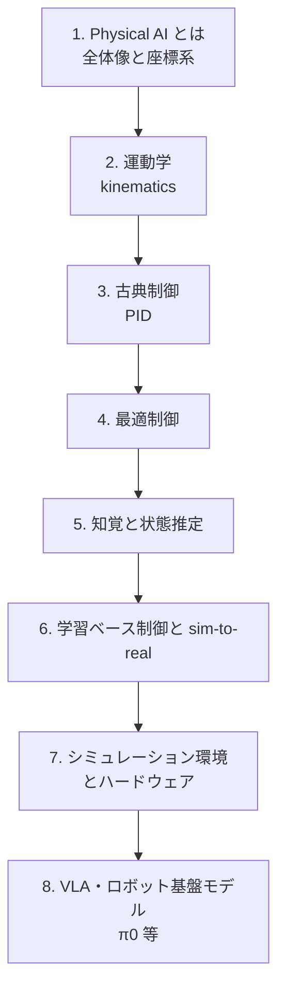

# 身体性・行動（Physical AI）

**身体性（embodiment）モダリティ。** ロボットなど物理世界で動くシステムの知能を学びます。
入出力が「**行動**（トルク・速度）」と「**センサ知覚**」である点が、言語・音声・視覚と決定的に違います。
制御・知覚・学習を統合し、シミュレーションから実機へ橋渡しするまでを扱います。

:::abstract[このモダリティで身につくこと]
- ロボットの運動と座標変換（kinematics）を記述できる
- 古典制御（PID）と最適制御の基本を理解する
- センサからの知覚（state estimation）の枠組みを理解する
- 学習ベース制御と sim-to-real の課題を説明できる
:::

:::tip[横断軸との接続]
学習ベース制御は **[強化学習](/reinforcement-learning/)（横断的学習パラダイム）** を身体性モダリティに適用したもの。
報酬設計・sim-to-real ギャップがここでの鍵です。
:::

## 前提知識

- 線形代数・微積分（行列・微分方程式）
- 力学の基礎（運動方程式）
- 強化学習の基礎（学習ベース制御の章で利用）

## ロードマップ

## 章一覧

| # | 章 | 状態 |
| --- | --- | --- |
| 1 | [Physical AI とは — 全体像と座標系](/physical-ai/01-overview-and-frames/) | ✅ 公開 |
| 2 | [運動学 — kinematics](/physical-ai/02-kinematics/) | ✅ 公開 |
| 3 | [古典制御 — PID](/physical-ai/03-pid-control/) | ✅ 公開 |
| 4 | [最適制御 — LQR](/physical-ai/04-optimal-control/) | ✅ 公開 |
| 5 | [知覚と状態推定 — カルマンフィルタ](/physical-ai/05-perception-state-estimation/) | ✅ 公開 |
| 6 | [学習ベース制御と sim-to-real](/physical-ai/06-learning-based-control-sim2real/) | ✅ 公開 |
| 7 | [シミュレーション環境とハードウェア](/physical-ai/07-simulation-and-hardware/) | ✅ 公開 |
| 8 | [VLA とロボット基盤モデル（π0 等）](/physical-ai/08-vla-foundation-models/) | ✅ 公開 |

:::note[章は順次追加されます]
「次は◯◯の章を書いて」と指示すると、統一フォーマットで新しい章が追加されます。
:::
