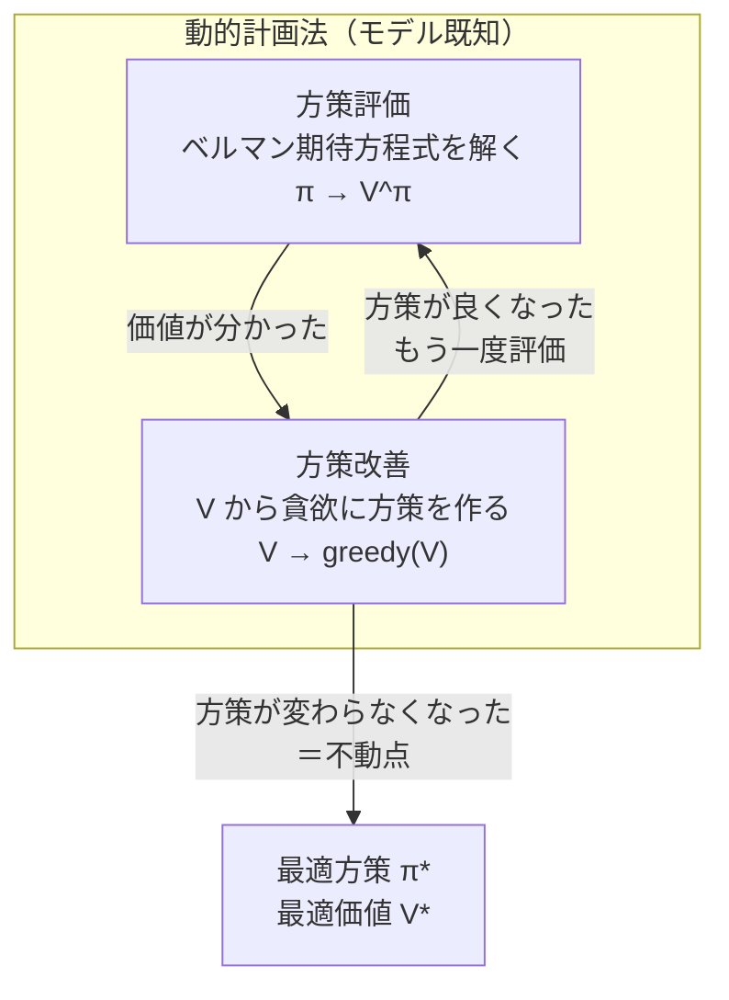

# 動的計画法 — 価値反復と方策反復

:::abstract[学習目標]
この章を読み終えると、次のことができるようになります。

- **ベルマン期待方程式**（ある方策の価値）と**ベルマン最適方程式**（最適価値）の違いを式と言葉で説明できる
- **方策評価**（ある方策の $V^\pi$ を求める）と**方策改善**（$V$ から貪欲方策を作る）を区別し、それぞれを実装できる
- **方策反復**と**価値反復**を、何を繰り返すか・1ラウンドのコスト・収束の速さで**比較**できる
- **一般化方策反復 (GPI)** の枠組みで、ほとんどの強化学習アルゴリズムが「評価と改善の押し合い」だと**捉え直せる**
- numpy だけで gridworld に価値反復を回し、$V^*$ への収束（反復数）と**最適方策の抽出**を数値で**確かめられる**
- 動的計画法が**環境のモデル $p(s',r\mid s,a)$ を知っている**前提に立つことを述べ、次章でそれを外す動機を**説明**できる
:::

## 前提知識

- 章01 [強化学習とは — 問題設定と MDP](/reinforcement-learning/01-mdp/)：状態 $s$・行動 $a$・遷移確率 $p(s',r\mid s,a)$・報酬 $r$・割引率 $\gamma$・方策 $\pi$、そして**価値関数 $V^\pi,\ Q^\pi$ とベルマン方程式**の定義。本章はその「ベルマン方程式を**実際に解く**」回です。
- 確率・期待値の基礎（$\mathbb{E}[\cdot]$、条件付き期待値）。
- 行列・ベクトルの基礎（線形連立方程式が「解ける」感覚）。

LLM 出身の読者へ。ここでの「方策 $\pi$」は**次の行動を決める分布**で、LLM の「次トークン分布」とほぼ同じ役回りです。違うのは、トークンに即時の正誤がつくのではなく、**遅れて届く報酬の総和**を最大化する点。その「遅れて届く価値」を解くのがこの章です。

## 直感

章01 で、私たちは強化学習の問題を **MDP** として書き、各状態の良さを表す**価値関数**とその再帰式（ベルマン方程式）を手に入れました。ですが式を**眺める**のと、式を**解いて最適方策を取り出す**のは別物です。

この章のテーマはただ一つ。

> **環境のルール（遷移と報酬）が完全に分かっているとき、最適方策をどう計算するか。**

ここで「環境のルールが分かっている」とは、どの状態でどの行動を取ると、**どの状態へどんな確率で飛び、いくら報酬がもらえるか**——つまり $p(s',r\mid s,a)$——を**全部知っている**という意味です。迷路の地図を上から見ている状況を想像してください。各マスでどちらに進めるか、ゴールがどこかを**実際に歩く前から**知っている。この「地図が手元にある」状況を解くのが**動的計画法 (dynamic programming, DP)** です。

:::warning[この章の最大の前提：モデルが既知]
動的計画法は **環境のモデル $p(s',r\mid s,a)$ を完全に知っている**ことを前提にします。だから「試しに動いてみる」必要がありません——頭の中（計算の中）だけで最適方策まで到達できます。

**現実の強化学習はたいていモデルを知りません。** ロボットは物理法則の式を持たず、ゲーム AI は相手の手を読めません。次章 [モデルフリー予測](/reinforcement-learning/03-model-free-prediction/) で、この「地図が無い」状況——実際に動いて経験からしか学べない世界——へ進みます。**本章はその出発点となる「答え合わせ用の理想ケース」**だと思ってください。DP が出す $V^*$ は、後のアルゴリズムが目指す正解になります。
:::

なぜ「動的計画法」と大層な名前か。ベルマン最適方程式は、**大きな問題（最適価値を全状態で求める）を、小さな部分問題（隣の状態の価値）に分解して再帰的に解く**という構造を持ちます。これはまさに動的計画法（部分問題の解を使い回す手法）の典型です。本章で見る価値反復・方策反復は、その再帰を**反復で解く**具体的な手続きです。

## 全体像

DP は2つの操作の組み合わせで成り立ちます。**評価 (evaluation)** と **改善 (improvement)** です。

- **評価**：いま手元の方策 $\pi$ が「どれくらい良いか」を価値 $V^\pi$ として測る。
- **改善**：いま分かっている価値 $V$ を見て、各状態で「一番良さそうな行動」に方策を貪欲に張り替える。

この2つを交互に回すと、方策はどんどん良くなり、最後に**最適方策 $\pi^*$ と最適価値 $V^*$** に行き着きます。これが本章の背骨です。



この「評価 ⇄ 改善」のループの**回し方の違い**が、2つの代表アルゴリズムを生みます。

| | 方策反復 (policy iteration) | 価値反復 (value iteration) |
| --- | --- | --- |
| 評価のやり方 | $V^\pi$ を**収束まで**きっちり解いてから改善 | 評価を**1スイープだけ**やって即改善（融合） |
| 1ラウンドの中身 | 評価ループ（多スイープ）＋改善1回 | $\max_a$ 込みの更新を1スイープ |
| 改善ラウンド数 | **少ない**（本章の例で2回） | やや多い（本章の例で4回） |
| 直感 | 「正確に測ってから動く」 | 「測りながら動く」 |

どちらも同じ $V^*$ に着きます。そして両者は**一般化方策反復 (GPI)** という1つの枠組みの両端——「評価をどこまで丁寧にやるか」のスライダーの両端——にすぎない、というのが本章のクライマックスです。

:::note[LLM ↔ RL]
「評価 → 改善 → 評価 → …」は、LLM の **RLHF/RLVR** の骨格とそっくりです。報酬（価値）でモデルを測り、その信号で方策（次トークン分布）を改善し、また測る。DP はその最も純粋な——**モデルが既知で、勾配でなく厳密更新で回す**——理想形です。PPO や GRPO は「評価も改善もサンプルと勾配で近似する GPI」だと見ると、この章の構造が後でそのまま効いてきます。
:::

## 理論

### 記号の確認（章01 から引き継ぐもの）

本章で使う量を、すべて「何から作るか・何でインデックスされ何個あるか・役割」まで明示します。

| 記号 | 何か | 何でインデックス / 何個 | 役割 |
| --- | --- | --- | --- |
| $s,\ s'$ | 状態（現在・次） | 状態空間 $\mathcal{S}$ の要素・$\lvert\mathcal{S}\rvert$ 個 | エージェントの「今どこにいるか」 |
| $a$ | 行動 | 行動空間 $\mathcal{A}$ の要素・$\lvert\mathcal{A}\rvert$ 個 | 各状態で選ぶ手 |
| $r$ | 即時報酬 | スカラー | その遷移でもらえる点数 |
| $p(s',r\mid s,a)$ | **モデル**（環境のルール） | $(s,a)$ ごとに $(s',r)$ 上の分布 | $s$ で $a$ を取ると $s'$ へ行き $r$ もらう確率。**本章では既知** |
| $\gamma\in[0,1]$ | 割引率 | スカラー（固定） | 未来の報酬をどれだけ重視するか |
| $\pi(a\mid s)$ | 方策 | 各 $s$ ごとに $\mathcal{A}$ 上の分布 | 行動の選び方。決定的なら $\pi(s)=a$ |
| $V^\pi(s)$ | 状態価値 | 状態ごと・$\lvert\mathcal{S}\rvert$ 個 | 方策 $\pi$ で $s$ から始めた**期待リターン** |
| $Q^\pi(s,a)$ | 行動価値 | $(s,a)$ ごと・$\lvert\mathcal{S}\rvert\!\times\!\lvert\mathcal{A}\rvert$ 個 | $s$ で $a$ を取り、その後 $\pi$ に従う期待リターン |
| $V^*,\ Q^*$ | 最適価値 | 上と同じ形 | 全方策の中で最大の価値 |

リターン（収益）は割引累積報酬 $G_t=\sum_{k=0}^{\infty}\gamma^k r_{t+k+1}$ で、$V^\pi(s)=\mathbb{E}_\pi[G_t\mid s_t=s]$ でした（章01）。

### ベルマン期待方程式：ある方策の価値の再帰

ある固定した方策 $\pi$ の価値 $V^\pi$ は、次の**自分自身を含む再帰式**を満たします（章01 で導入したもの）。

$$
V^\pi(s)=\sum_a \pi(a\mid s)\sum_{s',r} p(s',r\mid s,a)\,\bigl[\,r+\gamma V^\pi(s')\,\bigr]
$$

読み下すと：「状態 $s$ の価値は、$\pi$ が選ぶ各行動 $a$ について（外側の和）、その行動で起こりうる各 $(s',r)$ について（内側の和）、**即時報酬 $r$ ＋ 割引した次状態の価値 $\gamma V^\pi(s')$** を、起こる確率で重み付けて足したもの」。**未来の価値 $V^\pi(s')$ を使って現在の価値 $V^\pi(s)$ を表す**——これが再帰（ブートストラップ）の核です。

これは $V^\pi$ について**線形**な連立方程式です（$V^\pi(s')$ が1次でしか出てこない）。だから原理的には $\lvert\mathcal{S}\rvert$ 元連立を直接解いて $V^\pi$ を得られます。が、状態が多いと行列を解くのが重いので、**反復**で解くのが DP の流儀です（後述「方策評価」）。

### ベルマン最適方程式：最適価値の再帰

最適価値 $V^*$ は、**各状態で「最も良い行動」を選んだとき**の価値です。期待方程式の「$\pi$ が選ぶ各行動の平均（$\sum_a \pi$）」が、「最良の行動を1つ選ぶ（$\max_a$）」に変わります。

$$
V^*(s)=\max_a \sum_{s',r} p(s',r\mid s,a)\,\bigl[\,r+\gamma V^*(s')\,\bigr]
$$

行動価値版も同じ精神で書けます。

$$
Q^*(s,a)=\sum_{s',r} p(s',r\mid s,a)\,\Bigl[\,r+\gamma \max_{a'} Q^*(s',a')\,\Bigr]
$$

:::warning[期待方程式と最適方程式を混同しない]
2つの方程式は形が似ていますが、別物です。

| | ベルマン**期待**方程式 | ベルマン**最適**方程式 |
| --- | --- | --- |
| 行動の扱い | $\sum_a \pi(a\mid s)$（方策で**平均**） | $\max_a$（最良を**選ぶ**） |
| 線形か | **線形**（直接解ける） | **非線形**（$\max$ のせい） |
| 何を表すか | **与えた $\pi$ の**価値 $V^\pi$ | **最適**価値 $V^*$ |
| 使う場面 | 方策**評価** | 価値**反復** |

$\max_a$ が入った瞬間に式は**非線形**になり、もう連立方程式として一発で解けません。だから「反復で不動点に追い込む」価値反復が要るのです。ここが本章の技術的な要です。
:::

### 最適方策は $V^*$ から1ステップで取り出せる

$V^*$ が分かれば、最適方策は**貪欲 (greedy)** に決まります。各状態で「1ステップ先を読んで一番良い行動」を選ぶだけです。

$$
\pi^*(s)=\arg\max_a \sum_{s',r} p(s',r\mid s,a)\,\bigl[\,r+\gamma V^*(s')\,\bigr]
$$

これが効くのは**最適価値の定義**そのものから来ます。$V^*$ は「最良の行動を取り続けたときの価値」なので、その「最良の行動」を各状態で読み出せば、それが最適方策です。

:::note[なぜ $V$ だけで方策が出るのにモデルが要るのか]
$V(s)$ は「状態の良さ」しか教えてくれません。**どの行動がその良い次状態へ連れて行くか**を知るには、$p(s',r\mid s,a)$（モデル）で1ステップ先を**展開**する必要があります。これが「$V$ から方策を取り出すのにモデルが要る」理由であり、**モデルが無いと $V$ だけでは行動を選べない**という次章の出発点でもあります。一方 $Q(s,a)$ なら $\arg\max_a Q(s,a)$ で**モデル無しに**行動が選べます——だから次章以降は $Q$ が主役になります。
:::

### 方策評価：期待方程式を反復で解く（学習時の手続き）

固定した $\pi$ の $V^\pi$ を求める手続きです。**期待方程式を「左辺←右辺」の代入規則として反復**します。

$$
V_{k+1}(s)\leftarrow \sum_a \pi(a\mid s)\sum_{s',r} p(s',r\mid s,a)\,\bigl[\,r+\gamma V_k(s')\,\bigr]
$$

任意の初期値 $V_0$（ふつう全 0）から始め、$k$ を増やすと $V_k\to V^\pi$ に収束します。$0\le\gamma<1$ なら必ず収束します（この更新が**縮小写像**だから——後述「数式の導出」で証明）。

- **同期更新 (synchronous)**：全状態の新値 $V_{k+1}$ を**古い $V_k$ から**一斉に計算し、最後に差し替える。$V_k$ と $V_{k+1}$ の2枚を持つ。
- **その場更新 (in-place / Gauss-Seidel)**：1枚の配列を順に上書きし、更新済みの新値を**同じスイープ内で**すぐ使う。**メモリ半分・収束も速い**ことが多い。本章の実装はこちら。

1回の「全状態を一巡する更新」を**スイープ (sweep)** と呼びます。

### 方策改善：価値を見て方策を張り替える

$V^\pi$ が手に入ったら、各状態で**現在の方策より良い行動があれば乗り換え**ます。

$$
\pi'(s)=\arg\max_a \sum_{s',r} p(s',r\mid s,a)\,\bigl[\,r+\gamma V^\pi(s')\,\bigr]
$$

このとき必ず $V^{\pi'}\ge V^\pi$（全状態で）が成り立ちます。これが**方策改善定理**で、方策反復が「悪くならずに進む」ことの保証です（後述「数式の導出」で証明）。改善後に方策が**1つも変わらなければ**、それは最適方策に到達した証拠です。

### 学習時 vs 実行時

DP は「学習時（計画時）」にすべての計算が終わります。実行時（推論時）はほぼ表引きです。ここを分けて押さえます。

| | 学習（計画）時 | 実行（推論）時 |
| --- | --- | --- |
| やること | 評価・改善を反復し $V^*,\ \pi^*$ を求める | 状態 $s$ を見て $\pi^*(s)$ を引く |
| モデル $p$ | **使う**（毎更新で全 $(s',r)$ を展開） | **使わない**（$\pi^*$ が表で持っている） |
| コスト | $O(\lvert\mathcal{S}\rvert^2\lvert\mathcal{A}\rvert)$／スイープ ×反復回数 | $O(1)$ の表引き |
| 出力 | 全状態の最適行動テーブル | その状態での1手 |

つまり DP は**オフラインで全状態の答えを先に解いておく**手法です。状態が膨大だと「全状態を一巡」自体が重く、これが関数近似（章05 以降）へ進む動機になります。

## 数式の導出

ここでは DP が正しく動くことの**核**を3つ導きます。(1) 価値反復が必ず収束すること、(2) 方策改善で価値が悪化しないこと、(3) GPI がこの2つの合わせ技であること。

### ① ベルマン最適作用素は縮小写像 → 価値反復は収束する

価値反復の1スイープを、価値ベクトル $V$ に作用する**作用素 $T$** として書きます。

$$
(TV)(s)=\max_a \sum_{s',r} p(s',r\mid s,a)\,\bigl[\,r+\gamma V(s')\,\bigr]
$$

価値反復は $V_{k+1}=TV_k$ の反復です。$V^*$ はこの作用素の**不動点** $TV^*=V^*$（＝ベルマン最適方程式）。任意の2つの価値 $U,V$ について、$\sup$ ノルム $\lVert V\rVert_\infty=\max_s\lvert V(s)\rvert$ で $T$ が距離を $\gamma$ 倍に縮めることを示します。

任意の状態 $s$ で、$U$ について最大を達成する行動を $a^*$ とすると、

$$
(TU)(s)-(TV)(s)\le \sum_{s',r} p(s',r\mid s,a^*)\,\gamma\bigl[\,U(s')-V(s')\,\bigr]
$$

これは「$U$ の最良手 $a^*$ を $V$ 側でも使う」と $V$ 側の $\max$ は $a^*$ 以上だから、差が上から押さえられる、という不等式です。即時報酬 $r$ は両辺で打ち消し合い、残るのは割引した価値差だけ。右辺の差を絶対値の最大で抑えると、

$$
(TU)(s)-(TV)(s)\le \gamma \sum_{s',r} p(s',r\mid s,a^*)\,\lVert U-V\rVert_\infty=\gamma\,\lVert U-V\rVert_\infty
$$

（確率の総和は 1 なので $\sum p=1$。）$U,V$ を入れ替えて同じ議論をすれば下からも押さえられ、両側合わせて

$$
\lVert TU-TV\rVert_\infty\le \gamma\,\lVert U-V\rVert_\infty
$$

を得ます。$0\le\gamma<1$ なら $T$ は**縮小率 $\gamma$ の縮小写像**。バナッハの不動点定理より、$T$ の不動点は**ただ1つ存在**し、任意の $V_0$ から $V_{k+1}=TV_k$ は**幾何級数的に**その不動点 $V^*$ へ収束します。

$$
\lVert V_k-V^*\rVert_\infty\le \gamma^k\,\lVert V_0-V^*\rVert_\infty
$$

これが「価値反復は必ず、しかも指数的に速く収束する」ことの保証です。$\gamma$ が小さいほど速く、$\gamma\to 1$ で遅くなります。$\blacksquare$

（方策評価の作用素 $T^\pi$——$\max_a$ を $\sum_a\pi$ に替えたもの——も全く同じ議論で縮小写像になり、$V_k\to V^\pi$ が言えます。）

### ② 方策改善定理：貪欲に張り替えると悪くならない

方策 $\pi$ の価値 $V^\pi$ から貪欲方策 $\pi'(s)=\arg\max_a Q^\pi(s,a)$ を作ります。ここで $Q^\pi(s,a)=\sum_{s',r}p(s',r\mid s,a)[r+\gamma V^\pi(s')]$。貪欲に選んだので、すべての $s$ で

$$
Q^\pi\bigl(s,\pi'(s)\bigr)=\max_a Q^\pi(s,a)\ \ge\ Q^\pi\bigl(s,\pi(s)\bigr)=V^\pi(s)
$$

が成り立ちます（最良手は現在手以上）。この不等式を**右辺に再帰的に代入**していきます。$s$ から $\pi'$ で1歩進み、以降も $\pi'$ を使うと、

$$
V^\pi(s)\le Q^\pi(s,\pi'(s))=\mathbb{E}_{\pi'}\bigl[r+\gamma V^\pi(s')\mid s\bigr]\le \mathbb{E}_{\pi'}\bigl[r+\gamma Q^\pi(s',\pi'(s'))\mid s\bigr]\le\cdots
$$

各ステップで $V^\pi(s')\le Q^\pi(s',\pi'(s'))$ を使って $\pi'$ を1歩ずつ展開すると、右辺は $\pi'$ に従い続けたときの期待リターン、すなわち $V^{\pi'}(s)$ に収束します。したがって

$$
V^{\pi'}(s)\ge V^\pi(s)\qquad(\forall s)
$$

**全状態で価値が悪化しない**。さらに、もし $\pi'=\pi$（張り替えても何も変わらない）なら、上の貪欲性の式は $V^\pi(s)=\max_a Q^\pi(s,a)$——**ベルマン最適方程式そのもの**——になり、$\pi$ は最適方策です。状態・行動が有限なら方策の種類も有限なので、改善は有限回で止まり、止まった先が $\pi^*$。これが方策反復の収束保証です。$\blacksquare$

### ③ 価値反復＝「評価1回＋改善」を融合したもの

方策反復は「評価を**収束まで**やってから改善」でした。では評価を**1スイープだけ**にしたらどうなるか。改善（$\max_a$）と1スイープ評価をまとめて1つの更新にすると、

$$
V_{k+1}(s)=\max_a \sum_{s',r} p(s',r\mid s,a)\,\bigl[\,r+\gamma V_k(s')\,\bigr]
$$

これは①の $V_{k+1}=TV_k$、まさに**価値反復**です。つまり価値反復は「評価を1スイープで打ち切る方策反復」と見なせます。方策反復と価値反復は別物ではなく、**評価をどこまで丁寧にやるかという1本のスライダー**の両端だった——これが一般化方策反復 (GPI) の見立てです。$\blacksquare$

:::note[GPI の見立て]
評価（$V\to V^\pi$ へ近づける力）と改善（$\pi\to$ greedy へ近づける力）が互いに引っ張り合い、**両方が同時に満たされる点＝最適**で釣り合う。評価を毎回フルにやれば方策反復、1スイープなら価値反復、その中間（数スイープ）なら**modified policy iteration**。ほとんどの RL アルゴリズムはこの GPI の変種です。
:::

## 実装

理論を gridworld で確かめます。**$4\times 4$ の格子**、左上(0)と右下(15)が**終端（ゴール）**、各ステップの報酬は $-1$（早くゴールするほどリターンが高い）。行動は上下左右の4つで決定的、壁にぶつかると留まります。$\gamma=1$ の**未割引**設定（ゴールに必ず着くので発散しない）。

このセットは Sutton & Barto の Example 4.1 と同じで、答え合わせができます。まず**価値反復**を回し、$V^*$ への収束（スイープ数）と**最適方策の抽出**を見ます。

```python title="value_iteration_gridworld.py"
import numpy as np

# --- 4x4 gridworld の定義 ---
# 状態 s は 0..15（行優先）。左上(0)と右下(15)がゴール（終端）。
n_rows, n_cols = 4, 4
n_states = n_rows * n_cols
n_actions = 4                      # 0:上 1:下 2:左 3:右
gamma = 1.0                        # 未割引（終端に必ず到達するので発散しない）
terminals = {0, 15}
moves = {0: (-1, 0), 1: (1, 0), 2: (0, -1), 3: (0, 1)}

def step(s, a):
    """モデル p(s',r|s,a)。決定的なので (次状態, 報酬) を直接返す。
    終端は吸収状態（動かず報酬0）。壁にぶつかると同じ状態に留まる。"""
    if s in terminals:
        return s, 0.0
    r, c = divmod(s, n_cols)
    dr, dc = moves[a]
    nr, nc = r + dr, c + dc
    # 盤外なら留まる（壁）。これも「モデルを知っている」の一部。
    ns = nr * n_cols + nc if (0 <= nr < n_rows and 0 <= nc < n_cols) else s
    return ns, -1.0                # どの遷移も即時報酬 -1

# --- 価値反復：V_{k+1}(s) = max_a [ r + γ V_k(s') ] ---
# in-place 更新（同じ配列を上書き）。収束は |ΔV| < threshold で判定。
V = np.zeros(n_states)
threshold = 1e-9
sweep = 0
while True:
    delta = 0.0
    for s in range(n_states):
        if s in terminals:
            continue                       # 終端の価値は 0 に固定
        # 各行動について 1 ステップ先を展開し、最良を採る（これが max_a）
        candidates = [r + gamma * V[ns] for ns, r in (step(s, a) for a in range(n_actions))]
        v_new = max(candidates)
        delta = max(delta, abs(v_new - V[s]))
        V[s] = v_new
    sweep += 1
    if delta < threshold:                  # もうほとんど動かない＝不動点
        break

print("収束までのスイープ数:", sweep)
print("V*:")
print(np.round(V.reshape(n_rows, n_cols), 1))

# --- 最適方策の抽出：π*(s) = argmax_a [ r + γ V*(s') ] ---
# V* から 1 ステップ先読みで貪欲に行動を選ぶ。ここでもモデル step を使う。
arrows = {0: "↑", 1: "↓", 2: "←", 3: "→"}
policy = []
for s in range(n_states):
    if s in terminals:
        policy.append("G")
        continue
    qs = [r + gamma * V[ns] for ns, r in (step(s, a) for a in range(n_actions))]
    policy.append(arrows[int(np.argmax(qs))])

print("最適方策（貪欲）:")
for row in range(n_rows):
    print(" ".join(policy[row * n_cols:(row + 1) * n_cols]))
```

```text title="出力"
収束までのスイープ数: 4
V*:
[[ 0. -1. -2. -3.]
 [-1. -2. -3. -2.]
 [-2. -3. -2. -1.]
 [-3. -2. -1.  0.]]
最適方策（貪欲）:
G ← ← ↓
↑ ↑ ↑ ↓
↑ ↑ ↓ ↓
↑ → → G
```

読み取りましょう。

- **わずか4スイープで収束**しました。①で示した「指数的収束」が効いています（gridworld の直径ぶんで止まる）。
- **$V^*(s)$ は「最も近いゴールまでの最短歩数のマイナス」**になっています。例えば中央近くの状態は $-3$、ゴール隣接は $-1$。$-1$/step で最短経路を歩く価値なので、これが正解です。
- **最適方策はどの状態でも「最も近いゴールへ向かう矢印」**。左上半分は左上ゴールへ、右下半分は右下ゴールへ吸い込まれます。`step` が決める1手先の価値だけを見て、大域的な最短経路が自動的に出てくる——これがベルマン最適方程式の威力です。

### 方策反復と比べる（GPI の両端を数値で）

同じ gridworld で、評価を**収束までやってから**改善する**方策反復**も回し、価値反復と並べてみます。出発点は一様ランダム方策の価値から作った貪欲方策です。

```python title="policy_iteration_gridworld.py"
import numpy as np
# step / 定数は前掲と同じ（n_states, n_actions, gamma, terminals, moves, step）。

def eval_policy(pi, V, theta=1e-9):
    """ベルマン期待方程式を in-place 反復で解く（決定的方策 pi の V^pi）。"""
    sweeps = 0
    while True:
        delta = 0.0
        for s in range(n_states):
            if s in terminals:
                continue
            ns, r = step(s, pi[s])
            v = r + gamma * V[ns]
            delta = max(delta, abs(v - V[s])); V[s] = v
        sweeps += 1
        if delta < theta:
            break
    return V, sweeps

def greedy(V):
    """V から貪欲方策を作る（方策改善）。"""
    pi = np.zeros(n_states, dtype=int)
    for s in range(n_states):
        if s in terminals:
            continue
        qs = [r + gamma * V[ns] for ns, r in (step(s, a) for a in range(n_actions))]
        pi[s] = int(np.argmax(qs))
    return pi

# 一様ランダム方策の評価（出発点 & Sutton-Barto Fig.4.1 の答え合わせ）
V = np.zeros(n_states); sw0 = 0
while True:
    delta = 0.0
    for s in range(n_states):
        if s in terminals:
            continue
        v = sum(0.25 * (r + gamma * V[ns]) for ns, r in (step(s, a) for a in range(n_actions)))
        delta = max(delta, abs(v - V[s])); V[s] = v
    sw0 += 1
    if delta < 1e-9:
        break
print("ランダム方策の評価スイープ数:", sw0)
print("V^random:\n", np.round(V.reshape(4, 4), 1))

# 方策反復本体：評価（収束まで）→ 改善 を方策が変わらなくなるまで
pi = greedy(V)
rounds, total_eval = 0, 0
while True:
    V, sw = eval_policy(pi, V); total_eval += sw
    new_pi = greedy(V); rounds += 1
    if np.array_equal(new_pi, pi):
        break
    pi = new_pi
print("方策改善ラウンド数:", rounds, "/ 評価の総スイープ数:", total_eval)
print("V*:\n", np.round(V.reshape(4, 4), 1))
```

```text title="出力"
ランダム方策の評価スイープ数: 246
V^random:
 [[  0. -14. -20. -22.]
 [-14. -18. -20. -20.]
 [-20. -20. -18. -14.]
 [-22. -20. -14.   0.]]
方策改善ラウンド数: 2 / 評価の総スイープ数: 4
V*:
 [[ 0. -1. -2. -3.]
 [-1. -2. -3. -2.]
 [-2. -3. -2. -1.]
 [-3. -2. -1.  0.]]
```

3点読み取れます。

- **ランダム方策の価値 $-14,-20,-22,-18$ は Sutton & Barto Fig.4.1 と一致**します。実装が正しい証拠です。でたらめに歩くと、ゴールから遠い隅で $-22$ ステップもかかる——方策の悪さが数字で見えます。
- そのランダム方策の評価は **246 スイープ**もかかりました（$\gamma=1$ かつ遠回りするので収束が遅い）。一方**改善は2ラウンドで最適**に到達。「評価は重いが、改善は驚くほど速い」という GPI の非対称性が出ています。
- 方策反復が出した **$V^*$ は価値反復のものと完全一致**。同じ不動点に、違う道筋（評価を丁寧に vs 評価を1回で）で着いた——③で示した「両者は GPI の両端」が数値で確認できました。

:::note[$\gamma=1$ なのに評価が止まる理由]
一般に $\gamma=1$ だと縮小写像の議論が崩れますが、この gridworld は**どの方策でもいつかは終端に吸収される**（proper な MDP）ので、リターンは有限に収まり評価も収束します。ランダム方策が 246 スイープと遅いのは、$\gamma<1$ の幾何級数的減衰が無く、確率的な遠回りの寄与がじわじわ伝わるためです。実務で $\gamma<1$ を使うのは、まさにこの収束を速め発散を防ぐためでもあります。
:::

## 演習

::::question[演習 1: 期待方程式と最適方程式の使い分け]
gridworld で状態 $s$（終端でない）に注目します。(a) この状態の**ランダム方策の価値** $V^\pi(s)$ を更新する式と、**最適価値** $V^*(s)$ を更新する式は、どこが違いますか。(b) 一様ランダム方策で状態が4つの隣（上下左右、ここでは壁で留まる場合も含む）へ等確率で進み、それぞれの次状態価値が $V=[-1,-3,-2,-1]$（上下左右の順）、各報酬 $-1$、$\gamma=1$ のとき、$V^\pi(s)$ の更新値はいくつですか。(c) 同じ数値で $V^*(s)$ の更新値はいくつですか。
:::details[解答]
(a) 期待方程式は行動を**方策で平均**します（$\sum_a \pi(a\mid s)[\cdots]$）。最適方程式は行動の中の**最良を選びます**（$\max_a[\cdots]$）。前者は「与えた方策の良さ」、後者は「最適の良さ」を測ります。$\max$ が入る分、最適方程式は非線形です。

(b) 一様ランダムなので各行動 $0.25$ ずつ。各候補は $r+\gamma V(s')=-1+V(s')$ で、$[-1-1,\,-1-3,\,-1-2,\,-1-1]=[-2,-4,-3,-2]$。平均は $0.25\times(-2-4-3-2)=0.25\times(-11)=\mathbf{-2.75}$。

(c) 同じ候補 $[-2,-4,-3,-2]$ の**最大**を採るので $\max=\mathbf{-2}$。最良手（価値 $-1$ の隣へ進む手）だけを選ぶので、平均より良い値になります。
:::
::::

::::question[演習 2: 縮小写像と収束速度]
割引率を $\gamma=0.9$ に変え、初期値 $V_0$ が真値 $V^*$ から $\sup$ ノルムで最大 $\lVert V_0-V^*\rVert_\infty=10$ ずれているとします。(a) $k$ スイープ後の誤差の上界はどう表せますか。(b) 誤差を $10^{-3}$ 以下にするには最低何スイープ必要ですか（$\log_{10}0.9\approx-0.0458$ を使う）。(c) $\gamma$ を $0.99$ に上げると、この所要スイープ数は増えますか減りますか。理由も述べてください。
:::details[解答]
(a) 縮小写像の不等式 $\lVert V_k-V^*\rVert_\infty\le\gamma^k\lVert V_0-V^*\rVert_\infty$ より、上界は $\mathbf{10\cdot 0.9^k}$ です。

(b) $10\cdot 0.9^k\le 10^{-3}$ を解きます。両辺を 10 で割ると $0.9^k\le 10^{-4}$。常用対数を取ると $k\log_{10}0.9\le -4$、すなわち $k\ge \dfrac{-4}{\log_{10}0.9}=\dfrac{-4}{-0.0458}\approx 87.3$。よって最低 **88 スイープ**。

(c) **増えます。** $\gamma$ が 1 に近いほど縮小率が 1 に近く、1スイープあたりの誤差の減り方が緩やかになるためです。$\gamma=0.99$ なら $\log_{10}0.99\approx-0.00436$ で、同じ計算は $k\ge -4/(-0.00436)\approx 917$ スイープと約10倍に膨らみます。これが「遠い未来まで見たい（$\gamma\to1$）ほど計画が重くなる」というトレードオフです。
:::
::::

## まとめ

:::success[この章の要点]
- 動的計画法は**環境のモデル $p(s',r\mid s,a)$ が既知**のとき、ベルマン方程式を**反復で解いて**最適方策を計算する手法。現実はモデルを知らないことが多く、本章は後続アルゴリズムの「正解（$V^*$）」を与える理想ケース。
- **ベルマン期待方程式**（$\sum_a\pi$・線形・$V^\pi$ 用）と**ベルマン最適方程式**（$\max_a$・非線形・$V^*$ 用）を区別する。$\max$ が入ると一発で解けず、反復が要る。
- **方策評価**（期待方程式を反復して $V^\pi$）と**方策改善**（$V$ から貪欲に方策）を交互に回すと最適に着く。**方策反復**＝評価を収束までやって改善、**価値反復**＝評価1スイープと改善を融合（$V_{k+1}=\max_a\sum p[r+\gamma V_k]$）。
- 価値反復の収束は**ベルマン最適作用素が縮小写像**であることから保証され、誤差は $\gamma^k$ で指数的に減る。改善は**方策改善定理**で「悪化しない」が保証される。
- 両者は**一般化方策反復 (GPI)**——評価をどこまで丁寧にやるかのスライダー——の両端。ほとんどの RL アルゴリズムはこの GPI の変種。
- gridworld で価値反復は**4スイープで $V^*$（＝最短歩数のマイナス）に収束**し、貪欲に**最短経路の最適方策**が抽出できた。
:::

### 次に学ぶこと

本章は「**地図が手元にある**」理想的な世界でした。最適方策まで計算できたのは、各更新で $p(s',r\mid s,a)$ を展開して**全ての枝を読めた**からです。

ですが現実のエージェントは地図を持ちません。ロボットも、ゲーム AI も、**実際に動いてみるまで次に何が起こるか分からない**。次章 [モデルフリー予測 — モンテカルロ・TD](/reinforcement-learning/03-model-free-prediction/) では、この前提を外します。モデル $p$ を使えないとき、**経験（実際に通った状態・行動・報酬の列）だけ**から価値を推定する2つの道——エピソードを最後まで走らせて平均する**モンテカルロ法**と、本章のブートストラップ（次状態の価値を使う）を経験に持ち込む**TD 学習**——を学びます。本章の方策評価が「式から」だったのが、次章では「経験から」になります。

→ [強化学習ロードマップに戻る](/reinforcement-learning/)

## 用語ミニ辞典

| 用語 | 一言 |
| --- | --- |
| 動的計画法 (DP) | モデル既知で、ベルマン方程式を反復で解く手法 |
| モデル $p(s',r\mid s,a)$ | 環境のルール。$s$ で $a$ を取ると $s'$ へ行き $r$ もらう確率 |
| ベルマン期待方程式 | $\sum_a\pi$ で平均する、$V^\pi$ の再帰式（線形） |
| ベルマン最適方程式 | $\max_a$ で最良を選ぶ、$V^*$ の再帰式（非線形） |
| 方策評価 | 与えた $\pi$ の $V^\pi$ を反復で求める |
| 方策改善 | $V$ を見て各状態で貪欲に方策を張り替える |
| 方策反復 | 評価（収束まで）→改善 を繰り返す |
| 価値反復 | 評価1スイープと改善を融合した更新を繰り返す |
| 貪欲方策 | 各状態で1ステップ先の価値が最大の行動を選ぶ |
| スイープ | 全状態を一巡する1回の更新 |
| in-place 更新 | 1枚の配列を上書きし新値をすぐ使う（収束が速い） |
| 縮小写像 | 距離を一定率 $<1$ で縮める写像。不動点へ収束 |
| 不動点 | $TV=V$ を満たす $V$。ここでは $V^*$ |
| 方策改善定理 | 貪欲に張り替えると価値が悪化しない保証 |
| 一般化方策反復 (GPI) | 評価と改善を押し合わせる枠組み。RL の共通骨格 |

## 次のアクション

理論を手で定着させます。**最小の写経 → 動かす → 小実験** を1セットで。

1. 上の `value_iteration_gridworld.py` をそのまま写経して動かし、**4スイープで収束**・**$V^*$ が最短歩数のマイナス**・**矢印が最寄りゴールを指す**ことを自分の目で確認する。
2. `gamma` を $1.0\to 0.9\to 0.5$ と変え、**収束スイープ数と $V^*$ の値の変化**を観察する。$\gamma$ が小さいほど未来を軽視し、遠いゴールの価値が薄れる（矢印が変わる状態が出る）はず。演習2の見立て（小さい $\gamma$ ほど速く収束）と照合する。
3. 報酬を「ゴールで $+1$・他は $0$」に変え、$\gamma=0.9$ で回す。$-1$/step 版と**最適方策が同じか**（最短経路を選ぶか）を確かめ、「報酬の与え方が変わっても最適方策が保たれる条件」を考える。
4. 余力があれば `policy_iteration_gridworld.py` を写経し、**改善ラウンド数（少）と評価スイープ数（多）**の非対称を再現。評価を「収束まで」でなく「$k$ スイープで打ち切る」modified policy iteration に変え、$k=1$ で価値反復に一致することを確認する。

ここまでで GPI の骨格——評価と改善の押し合い——が手に入ります。次章で、この評価を「経験から」やる方法へ進みます。

## 参考文献

1. R. S. Sutton and A. G. Barto, *Reinforcement Learning: An Introduction*, 2nd ed., MIT Press, 2018.（4章「Dynamic Programming」、Example 4.1 の gridworld と Fig.4.1 が本章の題材）
2. R. Bellman, *Dynamic Programming*, Princeton University Press, 1957.（動的計画法とベルマン方程式の原典）
3. R. A. Howard, *Dynamic Programming and Markov Processes*, MIT Press, 1960.（方策反復 (policy iteration) の原典）
4. D. P. Bertsekas, *Dynamic Programming and Optimal Control*, Vol. 1–2, Athena Scientific.（縮小写像・収束解析の標準的扱い）
5. C. Szepesvári, *Algorithms for Reinforcement Learning*, Morgan & Claypool, 2010.（DP から RL への橋渡しを簡潔にまとめた定番）
