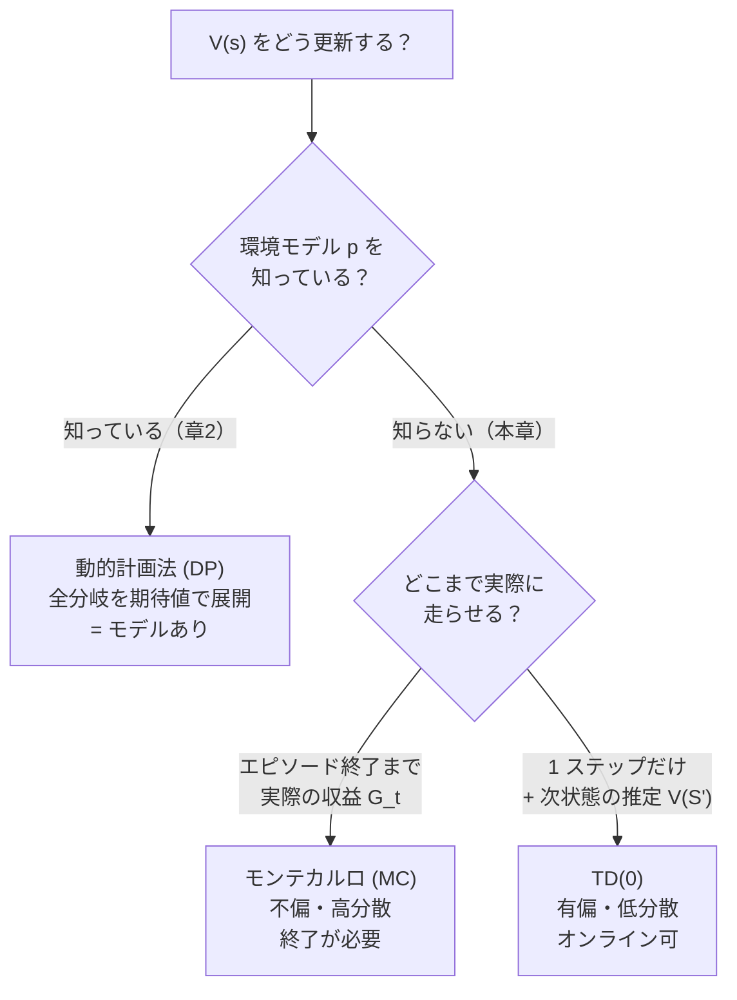
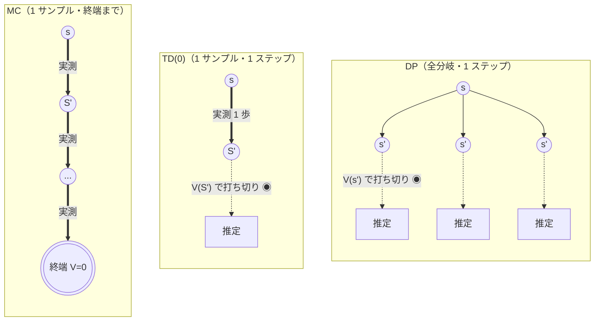
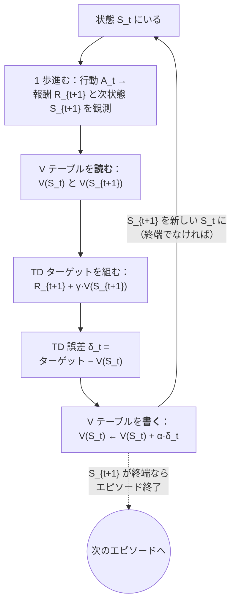
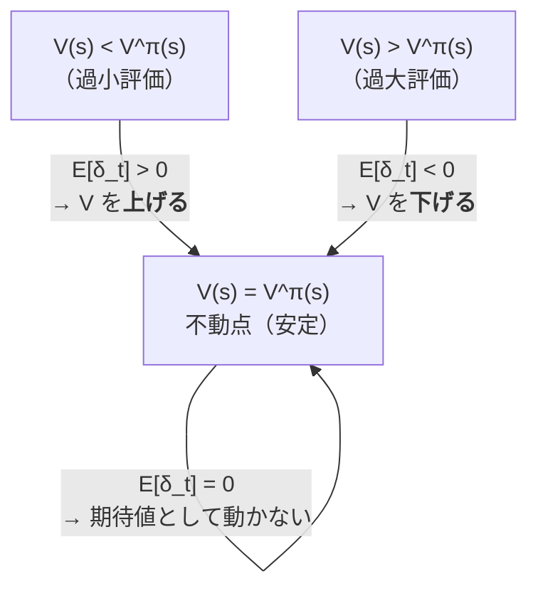

# モデルフリー予測 — モンテカルロと TD 学習

:::abstract[学習目標]
この章を読み終えると、次のことができるようになります。

- **モデルフリー予測**の問題設定（遷移確率 $p$ を知らずに、固定方策 $\pi$ の価値 $V^\pi$ を経験だけから推定する）を説明できる
- **モンテカルロ (MC)** 法を、完全な収益 $G_t$ による更新として導出し、なぜ**エピソード終了が必要**かを述べられる
- **TD(0)** を、次状態の推定 $V(S_{t+1})$ で現状態を更新する**ブートストラップ**として導出し、**TD 誤差** $\delta_t$ の意味を説明できる
- MC と TD の **バイアス-分散のトレードオフ**を、不偏／低分散・オンライン更新の観点で**対比**できる
- gridworld で両手法を回し、**収束の速さと推定のばらつきの違い**を数値で**確認**できる
:::

## 前提知識

- 章2 [動的計画法 — 価値反復・方策反復](/reinforcement-learning/02-dynamic-programming/)：状態価値 $V^\pi$、ベルマン期待方程式、そして**遷移確率 $p(s'\mid s,a)$ と報酬 $r$ を「知っている」前提で** $V$ を求める反復方策評価（policy evaluation）。本章はこの前提を外します。
- 割引累積報酬（収益）$G_t = \sum_{k=0}^{\infty}\gamma^k R_{t+k+1}$ と、価値の定義 $V^\pi(s)=\mathbb{E}_\pi[G_t\mid S_t=s]$。
- 確率・期待値の基礎（標本平均が母平均に収束する、分散の概念）。

:::note[LLM 出身の読者へ]
価値 $V^\pi(s)$ は「状態 $s$ から固定の方策で動いたとき、将来もらえる報酬の割引総和の**期待値**」です。LLM でいえば「あるプレフィックスから、固定のデコード方策で続きを生成したときの、期待される報酬」に相当します。本章は**その期待値を、サンプル（実際に走らせた軌跡）からどう推定するか**の話です。
:::

## 直感

章2では、サイコロの出目の確率（遷移確率 $p$）を**全部知っている**前提で、各マスの価値を電卓で解析的に計算しました。しかし現実の多くの問題では、環境のルールは**未知**です。ロボットを動かすまで次にどこへ転ぶか分からない。ユーザーがどう反応するか試すまで分からない。**遷移確率も報酬関数も与えられていない** —— これが**モデルフリー (model-free)** の世界です。

ではどうするか。**実際に環境を走らせて、経験を集める**しかありません。本章のゴールは、固定された方策 $\pi$ のもとで環境を試行し、その軌跡（状態・報酬の列）だけから状態価値 $V^\pi(s)$ を推定することです。これを**予測 (prediction)** または**方策評価 (policy evaluation)** と呼びます（「この方策に従うと各状態はどれくらい良いか」を測るので予測）。次章では、推定した価値を使って**方策を改善する制御 (control)** へ進みます。本章はその土台です。

経験から価値を推定する流儀は、大きく2つに分かれます。

- **モンテカルロ (MC)**：エピソードを**最後まで**走らせ、実際に得られた**完全な収益**で価値を更新する。「結果を全部見てから採点する」。
- **TD(0)**：1ステップ進むごとに、**次の状態の現在の推定値**を使って価値を更新する。「途中の見積もりで途中採点する」。

この「最後まで待つ vs 途中で見積もる」という1つの違いが、収束の速さ・推定のばらつき・オンライン更新の可否を決定づけます。

## 全体像

まず3つの方法の位置関係を一望します。**動的計画法 (DP)**・**モンテカルロ (MC)**・**TD** は、価値の推定に「**深さ（何ステップ先まで実際に見るか）**」と「**幅（全分岐を見るか1サンプルか）**」の2軸で並びます。



3手法の関係を1枚の表にまとめます（順方向＝更新ターゲットの作り方、逆方向＝何に依存するか）。

| | 動的計画法 (DP) | モンテカルロ (MC) | TD(0) |
| --- | --- | --- | --- |
| 環境モデル $p$ | **必要** | 不要（経験のみ） | 不要（経験のみ） |
| 更新ターゲット | $\sum_{s'} p(s'\mid s)[r+\gamma V(s')]$ | $G_t$（実際の収益） | $R_{t+1}+\gamma V(S_{t+1})$ |
| ブートストラップ | する（$V(s')$ を使う） | **しない**（実測のみ） | **する**（$V(S_{t+1})$ を使う） |
| サンプリング | しない（全分岐） | する（1 軌跡） | する（1 遷移） |
| 更新タイミング | 全状態を掃く | エピソード終了後 | 1 ステップごと（オンライン） |
| バイアス | なし | **なし（不偏）** | **あり（有偏）** |
| 分散 | なし | **大** | **小** |

この「深さ（どこまで先を実際に見るか）」と「幅（全分岐か1サンプルか）」の2軸を、価値の**バックアップ図 (backup diagram)** として並べると、3手法が「同じベルマン方程式を、どこまで実測しどこから推定で代用するか」の違いに過ぎないことが一目で分かります。図の各ノードは状態 $s$ から始まる軌跡の枝で、**「実測で歩く枝（太線）」と「推定 $V$ で打ち切る点（◉）」**に注目してください。



3手法は同じ「価値 = 即時報酬 + 割引した次状態の価値」を計算しています。違いは2つだけ —— **幅**（DP は全分岐を期待値で展開、MC・TD は実際に通った1本だけ）と、**深さ**（TD・DP は1歩で打ち切り推定 $V$ で代用、MC は終端まで歩いて推定を一切使わない）。本章で学ぶ MC と TD は、この図の右2つ、すなわち「幅は1サンプル」で共通し、「深さ」だけが違う兄弟です。

:::note[ブートストラップとは]
**ブートストラップ (bootstrapping)** とは、「ある推定値を更新するのに、別の（まだ正確とは限らない）推定値を使う」ことです。DP も TD もブートストラップします（$V(s')$ を使う）。MC だけはブートストラップせず、実際に最後まで観測した収益 $G_t$ だけを使います。この語は統計学の「リサンプリング法」とは**別物**なので注意してください（RL では「自分の推定で自分を引き上げる」の意）。
:::

## 理論

記号を固定します。固定方策 $\pi$ のもとで環境を走らせ、1 エピソードとして状態・行動・報酬の列

$$
S_0,\ A_0,\ R_1,\ S_1,\ A_1,\ R_2,\ \dots,\ S_{T-1},\ A_{T-1},\ R_T,\ S_T
$$

が得られたとします。各記号の意味は次の通りです。

- $S_t$：時刻 $t$ の**状態**。$S_T$ は**終端状態**（エピソードの終わり）で、$V(S_T)=0$ と定義します（終端から先に報酬はない）。
- $A_t$：時刻 $t$ に方策 $\pi$ が選んだ**行動**。本章の予測では $\pi$ は固定なので、$A_t$ は更新の対象ではありません。
- $R_{t+1}$：状態 $S_t$ で $A_t$ を取った直後にもらう**報酬**。添字に注意 —— $S_t$ から得る報酬は $R_t$ ではなく **$R_{t+1}$** です（行動の「結果」として次に届く、という時間の約束）。
- $\gamma \in [0,1]$：**割引率**。将来の報酬をどれだけ割り引くか。
- $\alpha \in (0,1]$：**ステップサイズ（学習率）**。1 回の更新でどれだけ動かすか。

そして**収益 (return)** $G_t$ を、時刻 $t$ 以降に実際に受け取った報酬の割引総和とします。

$$
G_t = R_{t+1} + \gamma R_{t+2} + \gamma^2 R_{t+3} + \dots = \sum_{k=0}^{T-t-1}\gamma^k R_{t+k+1}
$$

価値の定義は $V^\pi(s)=\mathbb{E}_\pi[G_t\mid S_t=s]$ —— 「状態 $s$ から始めたときの収益の**期待値**」です。MC も TD も、この**期待値を、観測したサンプルから推定する**手法だ、というのが本章の核心です。

### モンテカルロ：標本平均で期待値を近似する

期待値を推定する最も素直な方法は**標本平均**です。状態 $s$ を訪れたエピソードを何本も集め、それぞれの収益 $G_t$ を平均すれば、大数の法則で $V^\pi(s)$ に収束します。これが**モンテカルロ (Monte Carlo, MC)** 法です。

実装上は、平均を**逐次更新**の形で書くと便利です。$s$ を訪れるたびに

$$
V(S_t)\ \leftarrow\ V(S_t) + \alpha\,\bigl[\,G_t - V(S_t)\,\bigr]
$$

と更新します。$\alpha = 1/(\text{訪問回数})$ にすれば厳密な標本平均、$\alpha$ を小さな定数にすれば「最近の経験を重く見る指数移動平均」になります（非定常環境に有効）。

**MC の動作を時系列で追う（誰が・いつ・何を）。** MC は「まず1エピソードを最後まで走らせきる → 終わってから後ろ向きに収益を組み立て、訪れた各状態をまとめて更新する」という2フェーズで動きます。ここで肝になるのが、収益 $G_t$ を**終端から逆順**に積み上げる漸化式 $G_t = R_{t+1} + \gamma G_{t+1}$（$G_T=0$）です。前向きに $\sum \gamma^k R$ を毎回計算し直すと無駄ですが、後ろから1回なめれば全時刻の $G_t$ が線形時間で得られます。


図の通り、**更新が起きるのはフェーズ2、つまりエピソードが終わってから**です。走っている最中（フェーズ1）は1つも更新しません —— これが「MC はオフラインに近い／終端が必要」の正体です。後の実装の `mc_predict` で `reversed(traj)` を回しているのが、まさにこのフェーズ2の逆順スキャンに対応します。

- **ターゲットは $G_t$ そのもの**。実際に最後まで観測した収益なので、**$\mathbb{E}[G_t\mid S_t=s]=V^\pi(s)$**、すなわち **MC のターゲットは不偏 (unbiased)** です。
- ただし $G_t$ は **1 エピソード分の運**を丸ごと含みます。途中で何度コインを投げたか（確率的な遷移・行動）に応じて、$G_t$ は大きく揺れます。**だから分散が大きい**。
- そして $G_t$ を計算するには**エピソードが終わるまで待つ**必要があります。終端のない（continuing な）タスクや、終わるまで非常に長いタスクには使いにくい。

:::warning[MC は「初回訪問」か「全訪問」かで2流派ある]
1 つのエピソードで同じ状態 $s$ を複数回訪れたとき、**first-visit MC** は「最初の訪問の $G_t$ だけ」を、**every-visit MC** は「訪れた全ての時刻の $G_t$」を平均に使います。両者は収束先は同じですが、収束の理論が少し違います（first-visit は各エピソードで独立なサンプル1個を足すので解析が素直）。本章の実装は実装が単純な every-visit 系（定数 $\alpha$）です。混同しないでください。
:::

### TD(0)：ベルマン方程式で「途中採点」する

MC は「最後まで待つ」のが弱点でした。ここで章2のベルマン期待方程式を思い出します。

$$
V^\pi(s) = \mathbb{E}_\pi\bigl[\,R_{t+1} + \gamma\,V^\pi(S_{t+1})\ \big|\ S_t = s\,\bigr]
$$

これは「価値 = 即時報酬 + 割引した次状態の価値」という**再帰的**な関係です。DP ではこの期待値を $p$ を使って全分岐展開しましたが、$p$ は未知です。そこで**1 サンプルで期待値を近似**します —— 実際に 1 ステップ進んで $(R_{t+1}, S_{t+1})$ を観測し、$V^\pi(S_{t+1})$ を**現在の推定値 $V(S_{t+1})$ で代用**します。これが**ブートストラップ**です。すると更新式は

$$
V(S_t)\ \leftarrow\ V(S_t) + \alpha\,\bigl[\,\underbrace{R_{t+1} + \gamma V(S_{t+1})}_{\text{TD ターゲット}} - V(S_t)\,\bigr]
$$

ここで角括弧の中身を **TD 誤差 (TD error)** と呼び、$\delta_t$ と書きます。

$$
\delta_t\ \equiv\ R_{t+1} + \gamma V(S_{t+1}) - V(S_t)
$$

**TD(0) の動作を1ステップ分、誰が何を読み書きするかで追う。** MC が「走りきってから後ろ向きにまとめて更新」だったのに対し、TD(0) は**1歩進むたびにその場で更新を閉じる**ループです。1サイクルの中で、$V$ テーブルは**読み手であると同時に書き手**になります —— ここが「自分の推定で自分を引き上げる（ブートストラップ）」が起きている現場です。



このループで決定的に重要なのは **C と F が同じ $V$ テーブルを触る**ことです。C で読んだ $V(S_{t+1})$（まだ不正確かもしれない推定）をターゲットに使い、F でその結果を $V(S_t)$ に書き戻す。**まだ確定していない推定を、別の推定の更新材料にしている** —— だから初期は歪み（バイアス）が出るが、ループを回すうちに全状態の $V$ が互いに整合し、真値へ収束していきます。MC の図にあった「フェーズ1で走り、フェーズ2でまとめて更新」という2分割は、ここには存在しません。**観測（B）と更新（F）が1歩ごとに溶け合っている** —— これがオンライン更新の本質です。

- **$\delta_t$ の意味**：「1 ステップ進んで得た新しい見積もり（$R_{t+1}+\gamma V(S_{t+1})$）」と「進む前の見積もり（$V(S_t)$）」の**ズレ**です。$\delta_t > 0$ なら「思ったより良かった」→ $V(S_t)$ を上げる。$\delta_t < 0$ なら下げる。**推定が一貫していれば $\delta_t$ の期待値は 0**（ベルマン方程式が成り立つ点）。
- **ターゲットが $V(S_{t+1})$ を含む**ので、**$V$ がまだ正確でない間はターゲットも歪む** → **TD は有偏 (biased)** です。
- しかしターゲットは「1 ステップ分の報酬 $R_{t+1}$ の運」しか含みません（残りは推定値で固定）。**MC の $G_t$ が抱えた「全ステップ分の運」に比べ、分散がずっと小さい**。
- そして**1 ステップごとに更新できる** —— エピソードの終了を待たず、**オンライン**に学べます。終わらないタスクにも使えます。

:::warning[ここが本章の肝：TD と MC の決定的な違い]
混同しやすい3点を名指しで潰します。

| | モンテカルロ (MC) | TD(0) |
| --- | --- | --- |
| ターゲット | $G_t$（**実測の収益**） | $R_{t+1}+\gamma V(S_{t+1})$（**1 報酬 + 推定**） |
| ブートストラップ | **しない** | **する**（他の推定 $V(S_{t+1})$ を使う） |
| バイアス | **なし（不偏）** | **あり（有偏）** ← 推定でターゲットを作るから |
| 分散 | **大**（全ステップの運を含む） | **小**（1 ステップの運だけ） |
| 更新タイミング | エピソード**終了後** | **1 ステップごと（オンライン）** |
| 終端が必要か | **必要** | **不要**（continuing でも可） |

誤解しやすい点1：「TD は近似だから MC より劣る」は**誤り**。データが限られているとき、TD の低分散はしばしば MC の不偏性に勝ります（後の実測で確認）。
誤解しやすい点2：「MC はブートストラップの一種」も**誤り**。MC は他の推定値を一切使わず、実測 $G_t$ だけで更新します。ブートストラップするのは DP と TD だけです。
:::

:::note[アナロジー：山登りの所要時間予測]
家から山頂までの所要時間を学習する状況で考えます。**MC** は「実際に山頂まで登り切ってから、各地点での残り時間の予測を実測値に修正する」。正確（不偏）だが、登り切るまで何も学べず、その日の天候・体調という運を丸ごと拾う（高分散）。**TD** は「1 区間進むごとに、『今の区間にかかった時間 + 次の地点での残り時間予測』で、出発時の予測を即修正する」。途中の予測（推定）に頼るので最初はズレる（有偏）が、毎区間オンラインで学べ、その日の運の一部しか拾わない（低分散）。これがそのまま $G_t$ と $\delta_t$ の対比です。

具体例で1段だけ歩きます。山頂までの真の残り時間が「家から 60 分」だとして、いつもより渋滞のひどい日に登り、家を出て最初の区間に **20 分**かかり、次の地点での残り時間予測が **35 分**だったとします。**TD** は出発時の予測を「20 + 35 = 55 分」で即修正します —— 使うのは最初の区間の運（20 分）だけで、残りは予測（35 分）で固定。一方 **MC** はその日の渋滞・体調を最後まで全部拾い、たまたま山頂到着が **90 分**かかれば、出発時の予測を 90 分という大きく外れた実測へ引っ張ります。**1 区間の運しか乗らない TD の更新が安定し、全行程の運が乗る MC の更新が暴れる** —— 分散の差はこの「拾う運の量」の差に尽きます。
:::

:::note[既知とのアナロジー：LLM の学習と TD]
LLM 出身の読者向けに橋を架けます。LLM の教師あり学習では、次トークンの**正解（実測の教師ラベル）**で損失を作ります —— これは「実測のターゲットで更新する」点で **MC 寄り**の発想です。対して、価値推定で別の状態の**自分の予測**をターゲットに混ぜる TD は、「**モデルの出力を、別の入力に対するモデル自身の出力で教える**」という自己参照的な構図 —— 知識蒸留で生徒が教師（=過去の自分）の出力を真似る、あるいは EMA（指数移動平均）でターゲットネットを作る半教師あり学習に近い匂いがあります。「実測ラベルで教える MC」対「自分の予測で自分を引き上げる TD」という対比は、LLM の世界の「ハードラベル学習」対「自己蒸留・自己学習」の対比とパラレルに掴めます。
:::

### 学習時 vs 実行（推論）時

予測は**学習時**の営みです。固定方策 $\pi$ で環境を繰り返し走らせ、軌跡から $V$ のテーブルを更新し続けます。十分に収束したら、**実行時**には $V$ は**読むだけ**（更新しない）。たとえば「状態 $s$ と $s'$ のどちらが良いか」を $V(s)$ と $V(s')$ の比較で答える、といった用途に使います。次章の制御では、この $V$（や行動価値 $Q$）を使って**方策そのものを改善**しますが、本章では方策は固定したまま、その方策の「成績表」$V^\pi$ を作ることに集中します。

学習時と実行時で「$V$ テーブルがどう扱われるか」を表で切り分けます。MC と TD の差が出るのは**学習時の更新の仕方だけ**で、出来上がった $V$ の使い方（実行時）は両者まったく同じである点に注意してください。

| | 学習時（$V$ を更新する） | 実行時（$V$ を読むだけ） |
| --- | --- | --- |
| 方策 $\pi$ | 固定（更新しない） | 固定（同じものを使う） |
| $V$ テーブル | 軌跡から繰り返し更新 | **凍結**（書き換えない） |
| 環境を走らせるか | 走らせて経験を集める | 走らせなくてよい（テーブル参照のみ） |
| MC と TD の違い | あり（ターゲットの作り方が違う） | **なし**（同じ $V$ を引くだけ） |
| 典型用途 | $V^\pi$ を精度よく作る | $V(s)$ と $V(s')$ の比較・次章の方策改善の材料 |

## 数式の導出：TD(0) が正しい価値に収束する理由

TD(0) のターゲットが「正しい価値 $V^\pi$ を不動点に持つ」ことを示します。これが、有偏なターゲットを使うにもかかわらず TD が正しい答えへ向かう根拠です。

**ステップ1：ベルマン期待方程式を出発点に置く。** 章2より、固定方策 $\pi$ の価値は次を満たします。

$$
V^\pi(s) = \mathbb{E}_\pi\bigl[\,R_{t+1} + \gamma\,V^\pi(S_{t+1})\ \big|\ S_t = s\,\bigr]
$$

**ステップ2：TD 誤差の期待値を、真の価値 $V^\pi$ のもとで評価する。** 推定 $V$ がちょうど真値 $V^\pi$ に一致していると仮定し、状態 $s$ での TD 誤差の期待値を取ります。

$$
\mathbb{E}_\pi[\delta_t \mid S_t = s] = \mathbb{E}_\pi\bigl[\,R_{t+1} + \gamma V^\pi(S_{t+1}) - V^\pi(s)\ \big|\ S_t=s\,\bigr]
$$

**ステップ3：期待値の線形性で $V^\pi(s)$ を外に出す。** $V^\pi(s)$ は $S_t=s$ の条件下で定数なので、

$$
\mathbb{E}_\pi[\delta_t \mid S_t=s] = \underbrace{\mathbb{E}_\pi\bigl[R_{t+1} + \gamma V^\pi(S_{t+1})\mid S_t=s\bigr]}_{=\,V^\pi(s)\ (\text{ステップ1})} - V^\pi(s) = 0
$$

**ステップ4：不動点を読む。** $V=V^\pi$ のとき TD 誤差の期待値は 0 です。すなわち更新 $V(s)\leftarrow V(s)+\alpha\,\mathbb{E}[\delta_t]$ は $V^\pi$ で動きを止めます。**真の価値 $V^\pi$ は TD(0) 更新の不動点**です。逆に $V\neq V^\pi$ なら $\mathbb{E}[\delta_t]\neq 0$ の状態が存在し、そこへ向けて $V$ が動きます。

**ステップ5：収束条件。** ステップサイズ $\alpha$ がロビンス-モンロー条件 $\sum_n \alpha_n = \infty,\ \sum_n \alpha_n^2 < \infty$（例：$\alpha_n = 1/n$）を満たし、全状態を無限回訪れるなら、tabular TD(0) は確率1で $V^\pi$ に収束します（Sutton 1988）。定数 $\alpha$ でも、真値の近傍で揺れながら留まります。$\blacksquare$

この「不動点に向かって動く」様子を、$V$ の現在地ごとに $\mathbb{E}[\delta_t]$ の符号がどう更新を引っ張るかで図にすると、TD が**一方向に押し戻される**力学であることが見えます。$V^\pi$ は谷底（安定不動点）で、そこから外れるほど復元力（$\mathbb{E}[\delta_t]$）が働きます。



ロビンス-モンロー条件が「なぜ2式に分かれるか」も一言で。$\sum_n \alpha_n = \infty$（和が発散）は「どんなに遠い初期値からでも、累積した歩幅で不動点まで**到達できる**」ことを保証します（早く $\alpha$ が 0 になりすぎると途中で止まる）。$\sum_n \alpha_n^2 < \infty$（2乗和が収束）は「歩幅が十分速く縮むので、不動点付近の**ノイズで暴れ続けない**」ことを保証します。$\alpha_n=1/n$ はこの両立点で、これは MC の「標本平均＝$\alpha=1/(\text{訪問回数})$」とまったく同じ縮め方です —— **MC も TD も、収束を支える歩幅の縮め方は共通**で、違うのはターゲットの作り方だけ、という点を押さえてください。

| | モンテカルロ (MC) | TD(0) |
| --- | --- | --- |
| 収束先 | $V^\pi$（真の価値） | $V^\pi$（真の価値・同じ） |
| 収束の根拠 | 大数の法則（$G_t$ の標本平均） | 不動点 $\mathbb{E}[\delta_t]=0$（ベルマン方程式） |
| ターゲットの不偏性 | 最初から不偏（$V$ を使わない） | $V=V^\pi$ で初めて $\mathbb{E}[\delta]=0$ |
| 必要な歩幅条件 | ロビンス-モンロー（$\alpha_n=1/n$ 等） | ロビンス-モンロー（同じ） |
| 有限データでの主な誤差源 | **分散**（運を多く拾う） | **バイアス**（推定でターゲットを作る） |

:::note[MC のターゲットが不偏であること]
対比のため MC も一言で。$\mathbb{E}_\pi[G_t\mid S_t=s] = V^\pi(s)$ は価値の**定義そのもの**です。だから MC のターゲット $G_t$ は最初から不偏 —— 推定 $V$ を一切使わないので、$V$ がどれだけ間違っていてもターゲットは歪みません。TD は不動点を経由してしか不偏性を持てない（$V=V^\pi$ で初めて $\mathbb{E}[\delta_t]=0$）のと対照的です。$\blacksquare$
:::

:::warning[MC と TD は「有限データでは別の答え」に収束しうる]
収束先はどちらも真値 $V^\pi$ —— ただしそれは**無限のデータ**があるときの話です。**有限のデータを繰り返し使い切る（batch 更新）と、MC と TD は異なる答えに落ち着く**ことが知られています（Sutton & Barto の有名な AB 例）。直感はこうです。MC は与えられたデータ上で**観測した収益の二乗誤差を最小化**する答え（＝各状態で観測収益の平均）へ向かいます。一方 TD は、データから推定した**遷移の構造（最尤の MDP）の上でベルマン方程式を満たす**答え、すなわち **certainty-equivalence（確実性等価）解**へ向かいます。後者は「データが示唆する環境のモデルを暗に組み立て、その上で DP を解いた」のと同じ答えです。だから TD は、状態間の**つながり（マルコフ構造）を活用**して、まだ十分観測していない状態にも推定を伝播できます。「TD は単なる近似で MC の劣化版」という見方が誤りなのは、まさにこの構造活用ゆえです（後の実測で TD が MC を上回るのも一因）。
:::

## 実装

4×4 の gridworld（Sutton & Barto Example 4.1 と同型）で、MC と TD(0) を回します。**遷移確率は使いません**（モデルフリー）。代わりに環境を実際に `step` させて経験を集めます。答え合わせ用に、章2の DP（反復方策評価）で**真の $V$ を厳密計算**しておき、推定の RMSE で収束を測ります。方策は一様ランダム（上下左右 25%）固定です。

```python title="model_free_prediction.py"
import numpy as np

# 4x4 gridworld（Sutton & Barto Example 4.1 と同型）。
# 状態 0..15。左上(0)と右下(15)が終端。各遷移の報酬は -1（早く着くほど良い）。
# 方策は固定（上下左右 25% ずつ）。壁にぶつかると同じ場所に留まる。
# gamma=1。この設定の真の V は DP（章2）で厳密に計算できる → 答え合わせに使う。
GAMMA = 1.0
N = 16
TERMINALS = {0, 15}
ACTIONS = [(-1, 0), (1, 0), (0, -1), (0, 1)]  # 上 下 左 右


def step(s, a):
    """状態 s で行動 a を取った次状態を返す（壁は留まる）。終端なら自分自身。"""
    if s in TERMINALS:
        return s
    r, c = divmod(s, 4)
    dr, dc = ACTIONS[a]
    nr, nc = r + dr, c + dc
    if 0 <= nr < 4 and 0 <= nc < 4:
        return nr * 4 + nc
    return s  # 盤外 → 留まる


def true_V():
    """固定方策（一様ランダム）の真の V を DP（反復方策評価）で厳密に求める。"""
    V = np.zeros(N)
    for _ in range(2000):
        V_new = V.copy()
        for s in range(N):
            if s in TERMINALS:
                continue
            v = 0.0
            for a in range(4):
                s2 = step(s, a)
                v += 0.25 * (-1.0 + GAMMA * V[s2])  # 報酬 -1 で次状態へ
            V_new[s] = v
        if np.max(np.abs(V_new - V)) < 1e-9:
            V = V_new; break
        V = V_new
    return V


def run_episode(rng):
    """一様ランダム方策で 1 エピソード。(状態, 報酬) 列を返す。各遷移 -1。"""
    s = rng.choice([x for x in range(N) if x not in TERMINALS])
    traj = []
    while s not in TERMINALS:
        a = rng.integers(0, 4)
        s2 = step(s, a)
        traj.append((s, -1.0))
        s = s2
    return traj


def mc_predict(episodes, alpha, seed=0):
    """定数ステップ MC：エピソード終了後、完全な収益 G で更新。"""
    rng = np.random.default_rng(seed)
    V = np.zeros(N)
    for _ in range(episodes):
        traj = run_episode(rng)
        G = 0.0
        for s, r in reversed(traj):           # 後ろから収益を累積（終了が必須）
            G = r + GAMMA * G
            V[s] += alpha * (G - V[s])        # ターゲット = 実測の収益 G
    return V


def td0_predict(episodes, alpha, seed=0):
    """TD(0)：1 ステップごとに次状態の推定 V(S') を使って更新（ブートストラップ）。"""
    rng = np.random.default_rng(seed)
    V = np.zeros(N)
    for _ in range(episodes):
        s = rng.choice([x for x in range(N) if x not in TERMINALS])
        while s not in TERMINALS:
            a = rng.integers(0, 4)
            s2 = step(s, a)
            target = -1.0 + GAMMA * V[s2]      # 推定 V(S') で推定を更新（終端は V=0）
            V[s] += alpha * (target - V[s])    # 角括弧の中身が TD 誤差 δ_t
            s = s2
    return V


def rmse(V, Vt):
    mask = [s for s in range(N) if s not in TERMINALS]  # 終端は除外
    return np.sqrt(np.mean((V[mask] - Vt[mask]) ** 2))


Vt = true_V()
print("真の V（DP で厳密計算・4x4 を行ごと表示）:")
print(np.array2string(Vt.reshape(4, 4), precision=1, floatmode="fixed"))
print()

for ep in [10, 100, 1000]:
    v_mc = mc_predict(ep, alpha=0.02, seed=0)
    v_td = td0_predict(ep, alpha=0.05, seed=0)
    print(f"--- {ep:4d} エピソード後の RMSE（対 真の V） ---")
    print(f"  MC : {rmse(v_mc, Vt):.3f}    TD0: {rmse(v_td, Vt):.3f}")

# バイアス-分散：1000 エピソード後の推定を 50 試行で比較（状態 5 = 2 行 2 列目）。
S = 5
print()
print(f"=== 1000 エピソード後の V[{S}] を 50 試行で比較（真値={Vt[S]:.1f}）===")
mc_s = np.array([mc_predict(1000, 0.02, seed)[S] for seed in range(50)])
td_s = np.array([td0_predict(1000, 0.05, seed)[S] for seed in range(50)])
print(f"  MC : 平均={mc_s.mean():.2f}  標準偏差={mc_s.std():.3f}")
print(f"  TD0: 平均={td_s.mean():.2f}  標準偏差={td_s.std():.3f}")
```

実行結果（`uv run --with numpy python model_free_prediction.py`）:

```text title="出力"
真の V（DP で厳密計算・4x4 を行ごと表示）:
[[  0.0 -14.0 -20.0 -22.0]
 [-14.0 -18.0 -20.0 -20.0]
 [-20.0 -20.0 -18.0 -14.0]
 [-22.0 -20.0 -14.0   0.0]]

---   10 エピソード後の RMSE（対 真の V） ---
  MC : 16.058    TD0: 18.030
---  100 エピソード後の RMSE（対 真の V） ---
  MC : 5.171    TD0: 13.840
--- 1000 エピソード後の RMSE（対 真の V） ---
  MC : 2.307    TD0: 0.880

=== 1000 エピソード後の V[5] を 50 試行で比較（真値=-18.0）===
  MC : 平均=-17.99  標準偏差=3.500
  TD0: 平均=-17.58  標準偏差=0.847
```

このコードがバックアップ図のどこに対応するかを、関数の1行ずつで対応づけます（理論で見た「幅は1サンプル・深さだけ違う兄弟」が、そのまま実装の差になっています）。

| バックアップ図の要素 | `mc_predict` の対応 | `td0_predict` の対応 |
| --- | --- | --- |
| 幅（1サンプル） | `run_episode` が通った1軌跡だけ | `step` で進む1遷移だけ |
| 深さ（どこで打ち切るか） | 終端まで歩く（打ち切らない） | 1歩で打ち切り `V[s2]` で代用 |
| ターゲット | `G = r + GAMMA * G`（実測の収益） | `-1.0 + GAMMA * V[s2]`（推定を含む） |
| 更新のタイミング | `reversed(traj)`＝終了後にまとめて | `while` ループ内＝1歩ごと |
| ブートストラップ | なし（$V$ を読まない） | あり（`V[s2]` を読んで使う） |

読み解きます。

- **真の $V$ の答え合わせ**：DP で出た $-14, -20, -22, -18$ は Sutton & Barto Example 4.1 の既知の解と一致します。左上・右下の終端に近いマスほど $V$ が高い（負が浅い＝早く着ける）。これが「正解」です。
- **両者とも収束する**：MC・TD0 ともエピソードを増やすと RMSE が下がり、推定が真の $V$ に近づきます。50 試行の平均はどちらも真値 $-18.0$ にほぼ一致 —— **両手法とも正しい価値へ向かう**ことが数値で確認できます。
- **収束の仕方が違う**：1000 エピソード後、**TD0 の RMSE (0.880) が MC (2.307) を下回りました**。データが十分あるとき、TD の**低分散**が MC の不偏性に勝つ典型例です。
- **バイアス-分散がはっきり出る**：状態 5 の推定を 50 回繰り返すと、**MC の標準偏差は 3.500、TD0 は 0.847** —— **TD は MC の約 1/4 のばらつき**。MC は毎回「そのエピソード群の運」を大きく拾うので試行ごとに大きく揺れ、TD は 1 ステップの運しか拾わないので安定します。これが理論の「MC=高分散／TD=低分散」のそのままの可視化です。

:::tip[ステップサイズの選び方に注意]
MC と TD で $\alpha$ を変えています（MC=0.02, TD=0.05）。MC のターゲット $G_t$ は分散が大きいので、$\alpha$ を大きくすると更新が暴れます。だから MC は小さめの $\alpha$ が安定。TD は低分散なので少し大きい $\alpha$ でも安定して速く進めます。$\alpha$ を共通にして比較すると、この差で誤解しやすいので分けています。
:::

## 演習

::::question[演習 1: TD 誤差を手で計算する]
$\gamma = 1$、ある状態 $S_t = s$ で、現在の推定が $V(s) = -5,\ V(s') = -3$ だとします。1 ステップ進んで報酬 $R_{t+1} = -1$ を受け取り、次状態 $s'$ に遷移しました。(a) TD 誤差 $\delta_t$ を求めてください。(b) $\alpha = 0.5$ のとき、更新後の $V(s)$ はいくつになりますか。(c) このとき MC なら、同じ 1 ステップだけで $V(s)$ を更新できますか。理由も述べてください。

:::details[解答]
(a) $\delta_t = R_{t+1} + \gamma V(s') - V(s) = -1 + 1\cdot(-3) - (-5) = -1 - 3 + 5 = \mathbf{+1}$。「思ったより 1 だけ良かった」という意味です（$V(s)$ を上げる方向）。

(b) $V(s) \leftarrow V(s) + \alpha\,\delta_t = -5 + 0.5\times 1 = \mathbf{-4.5}$。$-5$ から $-4.5$ へ、TD 誤差の分だけ近づきました。

(c) **できません**。MC のターゲットは**完全な収益 $G_t$** で、これはエピソードが終端に達するまで残りの報酬 $R_{t+2}, R_{t+3}, \dots$ を全部観測しないと確定しません。TD はターゲットに $V(s')$（次状態の現在の推定）を使うので、1 ステップの観測だけで即更新できます —— これが「TD はオンライン／MC はエピソード終了が必要」の正体です。
:::
::::

::::question[演習 2: バイアスと分散、どちらが効くか]
本章の実測で、10 エピソード時点では MC の RMSE (16.058) が TD0 (18.030) を下回り、1000 エピソード時点では逆転して TD0 (0.880) が MC (2.307) を下回りました。(a) なぜ序盤は MC が有利になりやすいのですか。(b) なぜ十分なデータがあると TD が有利になりやすいのですか。(c) この観察から、「TD は近似だから常に MC より精度が劣る」という主張は正しいと言えますか。

:::details[解答]
(a) **序盤は TD のバイアスが効くから**です。TD のターゲット $R_{t+1}+\gamma V(S_{t+1})$ は推定 $V(S_{t+1})$ を含み、学習初期の $V$ はまだデタラメ（ここでは初期値 0）なので、ターゲットが大きく歪みます。MC は推定を一切使わず実測 $G_t$ だけなので、データが少なくてもターゲット自体は歪みません（不偏）。ただしこの差は試行や設定に依存するので、「序盤は必ず MC が勝つ」とまでは言えません。

(b) **データが増えると TD の低分散が効くから**です。$V$ が真値に近づくとバイアスは小さくなり、残るのは分散の差。各更新で MC は「全ステップ分の運」を、TD は「1 ステップ分の運」しか拾わないので、TD の推定は安定して真値に張り付きます（実測の標準偏差 0.847 vs 3.500）。

(c) **正しくありません**。バイアスがあること（有偏）と、最終的な推定精度が劣ることは別問題です。本章の実測の通り、有限データでは TD の低分散がバイアスを補って余りあり、しばしば MC より低い誤差に達します。「不偏 > 有偏」と短絡せず、**バイアスと分散の総合（平均二乗誤差）で評価する**のが正しい見方です。
:::
::::

::::question[演習 3: バックアップ図と更新のタイミング]
全体像のバックアップ図（DP / MC / TD の3枚）と、MC・TD それぞれの動作図を踏まえて答えてください。(a) MC と TD の更新が「いつ起きるか」を、エピソードの進行に沿って一言で対比してください。(b) TD のループ図で、$V$ テーブルを「読む」工程と「書く」工程が同じテーブルを触ることが、なぜバイアスの原因になりますか。(c) バックアップ図で、TD と DP が共有する性質と、TD と MC が共有する性質をそれぞれ1つ挙げてください。

:::details[解答]
(a) **MC はエピソードが終端に達してから**、後ろ向きに収益 $G_t$ を組み立て、訪れた全状態をまとめて更新します（走行中は1つも更新しない）。**TD は1ステップ進むたびに**その場で $V(S_t)$ を更新します（終端を待たない・オンライン）。動作図でいえば、MC は「フェーズ1で走り、フェーズ2でまとめて更新」の2分割、TD は「観測と更新が1歩ごとに溶け合う」1ループ、という違いです。

(b) TD のターゲット $R_{t+1}+\gamma V(S_{t+1})$ は、テーブルから**読んだ推定 $V(S_{t+1})$** を含みます。この推定が真値からズレていれば、それを材料に作ったターゲットも歪み、書き戻す $V(S_t)$ も歪みます。「まだ正確でない自分の推定で、自分を更新している（ブートストラップ）」ことが、$V$ が真値に達するまでターゲットが偏る理由 —— これが TD のバイアスの正体です。MC は読む工程が無く（実測 $G_t$ だけ）、この経路が存在しません。

(c) **TD と DP の共有性質**：どちらも**ブートストラップする**（次状態の推定 $V(s')$ をターゲットに使い、1ステップで打ち切る＝深さが浅い）。**TD と MC の共有性質**：どちらも**1サンプルで更新する**（環境モデル $p$ を使わず、実際に通った1本の軌跡・遷移だけを使う＝幅が1）。DP だけが全分岐を期待値で展開し（幅が全）、MC だけが終端まで歩いて推定を使いません（深さが終端まで）。
:::
::::

## まとめ

:::success[この章の要点]
- **モデルフリー予測**＝遷移確率 $p$ を知らずに、固定方策 $\pi$ の価値 $V^\pi$ を**経験だけ**から推定すること。章2の DP が $p$ を要求したのと対照的。
- **モンテカルロ (MC)**＝エピソードを最後まで走らせ、**実測の完全な収益 $G_t$** で更新。**不偏だが高分散**、エピソード**終了が必要**。
- **TD(0)**＝1 ステップ進むごとに**次状態の推定 $V(S_{t+1})$** でターゲットを作り更新（**ブートストラップ**）。**有偏だが低分散・オンライン更新可**。
- **TD 誤差** $\delta_t = R_{t+1}+\gamma V(S_{t+1})-V(S_t)$ は「進む前後の見積もりのズレ」。$V=V^\pi$ で $\mathbb{E}[\delta_t]=0$ となり、真の価値が TD 更新の不動点。
- gridworld の実測で、**両手法とも真の $V$ に収束**しつつ、**TD は MC の約 1/4 の分散**で安定すること、有限データでは TD が低 RMSE に達することを確認した（バイアス-分散のトレードオフ）。
:::

### 次に学ぶこと

ここまでは方策 $\pi$ を**固定**して、その「成績表」$V^\pi$ を作る**予測**に専念しました。次章では、推定した価値を使って**方策そのものを良くする制御 (control)** へ進みます。状態価値 $V$ ではなく**行動価値 $Q(s,a)$** を推定し、TD の発想を制御に拡張した **SARSA（on-policy）と Q 学習（off-policy）** を学びます。本章の TD 誤差 $\delta_t$ が、そのまま制御の心臓部になります。

→ [4. モデルフリー制御 — Q 学習・SARSA](/reinforcement-learning/04-model-free-control/)

## 用語ミニ辞典

| 用語 | 一言 |
| --- | --- |
| モデルフリー (model-free) | 遷移確率 $p$・報酬関数を知らず、経験だけから学ぶ |
| 予測 (prediction) | 固定方策の価値 $V^\pi$ を推定すること（方策評価） |
| 収益 $G_t$ | 時刻 $t$ 以降の割引報酬の総和。MC のターゲット |
| モンテカルロ (MC) | 完全な収益 $G_t$ で更新。不偏・高分散・要終了 |
| TD(0) | $R_{t+1}+\gamma V(S_{t+1})$ で更新。有偏・低分散・オンライン |
| ブートストラップ | 推定値を更新するのに別の推定値を使うこと（DP/TD が該当） |
| バックアップ図 | 更新ターゲットを「幅×深さ」で表す図。DP/MC/TD の位置づけ |
| TD 誤差 $\delta_t$ | $R_{t+1}+\gamma V(S_{t+1})-V(S_t)$。見積もりのズレ |
| TD ターゲット | $R_{t+1}+\gamma V(S_{t+1})$。1 報酬 + 次状態の推定 |
| バイアス-分散 | 不偏だが揺れる(MC) vs 偏るが安定(TD) のトレードオフ |
| ステップサイズ $\alpha$ | 1 回の更新で動かす割合（学習率） |
| 不動点 | $V=V^\pi$ で更新が止まる点。TD の収束先 |
| 確実性等価解 | データから組んだ最尤 MDP 上のベルマン解。TD の batch 収束先 |

## 次のアクション

理論を手で定着させる。**最小の写経 → 動かす → 小実験** を1セットで。

1. 上の `model_free_prediction.py` を写経し、`uv run --with numpy python model_free_prediction.py` で実行する。真の $V$（$-14, -20, -22, -18$）と推定の RMSE が出ることを確認する。
2. `mc_predict` と `td0_predict` の $\alpha$ を変えて（例：両方 0.05、両方 0.1）、RMSE と分散がどう動くか観察する。MC は大きい $\alpha$ で暴れ、TD は比較的安定なはず。
3. 小実験：エピソード数を 10, 30, 100, 300, 1000 と振り、MC と TD の RMSE をそれぞれプロット（print でも可）して**収束曲線**を描く。序盤と終盤で優劣がどう入れ替わるかを自分の目で確かめる。余力があれば $n$ ステップ TD（$G_t^{(n)}=R_{t+1}+\dots+\gamma^{n-1}R_{t+n}+\gamma^n V(S_{t+n})$）を実装し、MC（$n=\infty$）と TD($n=1$) の中間を体感する。

## 参考文献

1. R. S. Sutton, A. G. Barto, *Reinforcement Learning: An Introduction*, 2nd ed., MIT Press, 2018.（第5章 Monte Carlo Methods・第6章 Temporal-Difference Learning。Example 4.1 / 6.2 が本章の題材）
2. R. S. Sutton, "Learning to Predict by the Methods of Temporal Differences," *Machine Learning*, vol. 3, pp. 9–44, 1988.（TD 学習の原論文・収束の理論）
3. C. J. C. H. Watkins, "Learning from Delayed Rewards," PhD thesis, University of Cambridge, 1989.（次章 Q 学習につながる TD 制御の源流）
