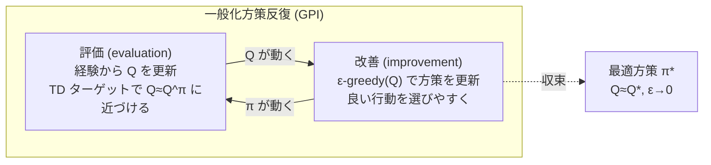

# モデルフリー制御 — SARSA と Q 学習

:::abstract[学習目標]
この章を読み終えると、次のことができるようになります。

- **予測 (prediction)** と **制御 (control)** の違いを述べ、制御が **一般化方策反復 (GPI)** の枠で進むことを説明できる
- なぜ制御では $V$ ではなく **行動価値 $Q(s,a)$** を学ぶのか、その必然性を述べられる
- **ε-greedy** 探索が「探索と活用のトレードオフ」をどう解くか、なぜ純粋な貪欲方策では失敗するかを説明できる
- **SARSA**（on-policy）と **Q 学習**（off-policy）の更新式を導出し、ターゲットの違い（$Q(S',A')$ vs $\max_{a'} Q(S',a')$）を指摘できる
- **on-policy / off-policy** の意味を、「どの方策を評価しているか」のレベルで正確に区別できる
- Cliff Walking で SARSA と Q 学習の**学ぶ経路が変わる**理由を、探索リスクの観点から説明できる
:::

## 前提知識

- 章03 [モデルフリー予測 — モンテカルロ・TD](/reinforcement-learning/03-model-free-prediction/)：**TD(0) 更新**（$V(S)\leftarrow V(S)+\alpha[R+\gamma V(S')-V(S)]$）、**ブートストラップ**、**TD 誤差** $\delta$、状態価値 $V^\pi$ の意味。本章はこれを「行動価値 $Q$ の制御版」に拡張します。
- 章02 [動的計画法 — 価値反復・方策反復](/reinforcement-learning/02-dynamic-programming/)：**方策反復**（評価 → 改善の交互反復）と**ベルマン最適方程式**。本章の制御はこの「モデルなし版」です。
- 章01 [強化学習とは — 問題設定と MDP](/reinforcement-learning/01-mdp/)：MDP の $(S,A,P,R,\gamma)$、方策 $\pi$、割引累積報酬 $G_t$。

:::note[LLM 出身の読者へ]
$Q(s,a)$ は「状態 $s$ で行動 $a$ を選んだときの期待リターン」です。LLM の文脈に橋渡しするなら、$s$ がプロンプト（文脈）、$a$ が次トークン、$Q(s,a)$ が「そのトークンを選んだあと最終的にどれだけ報酬がもらえそうか」の見積もり、と思うと近いです。RLHF の value head が状態価値 $V$ を出すのと同根の量です。
:::

## 直感

章03 までで私たちは **予測 (prediction)** を学びました。「**与えられた方策 $\pi$** に従ったとき、各状態の価値はいくつか」を経験から当てる問題です。でも本当にやりたいのは**予測ではなく制御 (control)** —— 「**最も良い方策そのもの**を経験から見つける」ことです。

しかも環境のルール（遷移確率 $P$ や報酬 $R$）は**知らない**とします。これが**モデルフリー制御**です。手元にあるのは、環境を実際に動かして得た $(S, A, R, S', \dots)$ の生の経験だけ。地図（モデル）を持たずに、歩き回った足跡だけから最短ルートを学ぶ、というのがこの章の挑戦です。

カギは2つあります。

1. **どこを評価するか**：状態価値 $V(s)$ ではなく、**行動価値 $Q(s,a)$** を学ぶ。なぜなら $V$ だけ知っていても、モデルがないと「どの行動が良いか」を選べないからです（後述）。
2. **どう探索するか**：いつも最善手だけ打っていると、試したことのない行動の良し悪しが永遠に分からない。だから時々わざと**ランダムに動く（ε-greedy 探索）**必要があります。

この土台の上に、たった一文字違いに見える2つのアルゴリズム —— **SARSA** と **Q 学習** —— が乗ります。両者は更新式の1項しか違いません。でもその1項が、**「実際に取る方策を評価する (on-policy)」か「貪欲方策を評価する (off-policy)」か**という、強化学習で最も重要な区別を生みます。そしてその違いは、崖っぷちの世界 (Cliff Walking) で**学ぶ経路が物理的に変わる**という形で、目に見えて現れます。

## 全体像

制御は「**評価**して**改善**する」を交互に繰り返します。これを**一般化方策反復 (GPI: Generalized Policy Iteration)** と呼びます。章02 の方策反復と骨格は同じですが、評価をモデルなしの **TD 更新**で、改善を **ε-greedy** で行うのがモデルフリー版です。



評価と改善は**完全収束を待たずに**少しずつ交互に進みます（章02 の「完全な評価 → 改善」ではなく、1ステップ評価 → 即改善）。Q が動けば方策が動き、方策が動けば Q が動く。この二人三脚が最適方策 $\pi_*$ に収束します。

その「評価」の中身が、本章の主役である SARSA と Q 学習です。両者を1枚で対比します。

| | SARSA | Q 学習 (Q-learning) |
| --- | --- | --- |
| ターゲットに使う次の価値 | $Q(S',A')$（**実際に取った** $A'$） | $\max_{a'} Q(S',a')$（**貪欲な**仮想行動） |
| 何を評価しているか | **行動方策そのもの**（探索込み） | **貪欲方策**（探索を無視） |
| 種別 | **on-policy** | **off-policy** |
| 更新に必要なもの | $(S,A,R,S',A')$ の5つ組 | $(S,A,R,S')$ の4つ組 |
| 学ぶ経路（Cliff） | **安全**（崖から離れる） | **最適**（崖ぎわ最短） |
| 学習中の成績 | 良い（崖に落ちにくい） | 悪い（探索で落ちる） |

「SARSA」という名前は、更新に使う5つ組 **S**tate, **A**ction, **R**eward, next **S**tate, next **A**ction の頭文字そのものです。一方 Q 学習は次の行動 $A'$ を使わない（$\max$ で済ます）ので4つ組で更新できます。この「$A'$ を使うか・$\max$ を使うか」が全ての違いの源です。

## 理論

### なぜ $V$ ではなく $Q$ を学ぶのか

章03 では状態価値 $V^\pi(s)$ を学びました。しかし**制御**では行動価値 $Q^\pi(s,a)$ を学びます。理由は一行で言えます —— **モデルがないと、$V$ から行動を選べない**から。

方策改善は「各状態で最も価値の高い行動を選ぶ」ことです。モデル（$P,R$）があれば、$V$ から

$$
\pi'(s) = \arg\max_{a}\ \sum_{s'} P(s'\mid s,a)\,\bigl[\,R(s,a,s') + \gamma V(s')\,\bigr]
$$

と1手先読みで行動を選べます。ところが**モデルフリーでは $P,R$ を知らない**ので、この和を計算できません。$V(s)$ をいくら正確に知っていても、「行動 $a$ を取ると次にどの状態へ行くか」が分からなければ、$a$ の良し悪しを比べられないのです。

そこで $Q(s,a)$ を直接学びます。$Q$ さえ手元にあれば、改善はモデル不要で

$$
\pi'(s) = \arg\max_{a}\ Q(s,a)
$$

と**テーブルを引くだけ**で済みます。これがモデルフリー制御で行動価値を学ぶ必然性です。

- $Q(s,a)$：状態 $s$ で行動 $a$ を取り、その後は方策 $\pi$ に従ったときの期待リターン。$s$（状態）と $a$（行動）の2軸でインデックスされ、状態数 $\times$ 行動数の表。
- $V(s)$：状態 $s$ から方策 $\pi$ に従ったときの期待リターン。$V^\pi(s) = \sum_a \pi(a\mid s)\,Q^\pi(s,a)$ の関係にあります（$V$ は $Q$ を方策で平均したもの）。

:::warning[$V$ と $Q$ を取り違えない]
$V(s)$ は**状態だけ**の関数、$Q(s,a)$ は**状態と行動の組**の関数です。制御で $Q$ を使うのは「$Q$ の方が情報量が多いから」ではなく、**モデルなしで行動を比較できる唯一の量だから**です。予測（章03）では $V$ で十分でしたが、制御に進んだ瞬間に $Q$ が必須になります。この切り替えが章03 → 章04 の本質的な一歩です。
:::

### 探索と活用：なぜ純粋な貪欲はダメか

$Q$ を学びながら $\arg\max_a Q(s,a)$ で行動すると、深刻な罠にはまります。**まだ試していない行動の価値は初期値（例えば 0）のまま**で、たまたま最初に良く見えた行動ばかり選び続け、**本当はもっと良い行動を永遠に試さない**のです。これを**探索不足**といいます。

例え話をします。新しい街で毎晩夕食を食べるとき、初日にたまたま入った店がそこそこ美味しかったとします。「貪欲」な人は、それ以降ずっとその店だけに通います。隣にもっと美味しい店があっても、**入ったことがない＝価値が分からない**ので試しません。最適化のつもりが、局所最適に閉じ込められます。

解決策が **ε-greedy 方策**です。確率 $1-\varepsilon$ で貪欲行動（活用 exploitation）、確率 $\varepsilon$ で**一様ランダムな行動**（探索 exploration）を取ります。

$$
\pi(a\mid s)=
\begin{cases}
1-\varepsilon+\dfrac{\varepsilon}{|A|} & a=\arg\max_{a'} Q(s,a')\ \text{(貪欲行動)}\\[2ex]
\dfrac{\varepsilon}{|A|} & \text{それ以外の行動}
\end{cases}
$$

- $\varepsilon$：探索率。$\varepsilon=0.1$ なら 10% の頻度でランダムに動く。
- $|A|$：行動数。貪欲行動も「ランダムくじ」で当たる可能性があるので、その確率 $\varepsilon/|A|$ を $1-\varepsilon$ に足してあります。
- すべての行動が確率 $\ge \varepsilon/|A| > 0$ で選ばれる ＝ **すべての行動を無限回試す保証**がつき、$Q$ が真値に収束する道が開けます。

実務では $\varepsilon$ を学習が進むにつれ**徐々に小さく**します（最初は大きく探索 → 後半は活用へ）。$\varepsilon \to 0$ かつ「全行動を無限回訪問」を満たす条件は **GLIE (Greedy in the Limit with Infinite Exploration)** と呼ばれ、表形式の制御が $\pi_*$ に収束する十分条件です。

:::tip[探索の他の流儀（予告）]
ε-greedy は最も素朴な探索です。後の章で出る **エントロピー正則化**（SAC・PPO）、**楽観的初期値**、**UCB**、**内発的報酬**（好奇心）などは、「どこを探索すべきか」をより賢く決める発展形です。まずは ε-greedy で「探索は明示的に注入する必要がある」という感覚を掴みます。
:::

### SARSA：on-policy 制御

SARSA は TD(0)（章03）を**行動価値 $Q$ に持ち上げた**ものです。状態 $S$ で行動 $A$ を取り、報酬 $R$ を受けて次状態 $S'$ に進み、**そこで方策が次に選ぶ行動 $A'$** まで観測してから更新します。

$$
Q(S,A)\ \leftarrow\ Q(S,A)+\alpha\,\bigl[\,R+\gamma\,Q(S',A')-Q(S,A)\,\bigr]
$$

- $\alpha$：学習率（ステップサイズ）。新しい情報をどれだけ取り込むか。
- 角括弧の中が **TD 誤差 $\delta = R+\gamma Q(S',A')-Q(S,A)$**。「実際に観測した1歩先の見積もり」と「今の見積もり」のズレ。
- $A'$ は **ε-greedy 方策が実際に選んだ次の行動**。だから探索でたまたまランダムに選ばれた行動も、そのまま $Q(S',A')$ としてターゲットに混ざります。

ここが SARSA の核心です。**ターゲット $R+\gamma Q(S',A')$ は、行動方策（探索込み）が実際に辿る未来を反映します。** だから SARSA が収束する $Q$ は「最適方策の $Q$」ではなく、「**今まさに使っている ε-greedy 方策の $Q^\pi$**」です。自分が実際にやっている（探索でフラフラする）方策を、正直に評価している —— これが **on-policy** の意味です。

**動作のタイミング**（1ステップを逐次で）:

1. 状態 $S$ にいる。ε-greedy で行動 $A$ を選ぶ。
2. $A$ を実行 → 報酬 $R$、次状態 $S'$ を観測。
3. **$S'$ で ε-greedy で次の行動 $A'$ を先に選ぶ**（まだ実行はしない）。
4. $Q(S,A)$ を上の式で更新する（$A'$ の価値を使う）。
5. $S\leftarrow S'$, $A\leftarrow A'$ として次のステップへ（**選んだ $A'$ をそのまま次の $A$ として使う**）。

### Q 学習：off-policy 制御

Q 学習は、ターゲットの $Q(S',A')$ を $\max_{a'} Q(S',a')$ に置き換えるだけです。

$$
Q(S,A)\ \leftarrow\ Q(S,A)+\alpha\,\bigl[\,R+\gamma\,\max_{a'} Q(S',a')-Q(S,A)\,\bigr]
$$

たった1項の違いですが、意味は大きく変わります。ターゲットが「**$S'$ で貪欲に振る舞ったときの価値**」になりました。実際に次に取る行動 $A'$ が探索でランダムだったとしても、Q 学習は**それを無視して** $\max$（貪欲な仮想行動）を使います。

つまり Q 学習が学ぶ $Q$ は、**行動方策が何であれ、貪欲方策（＝最適方策の候補）の $Q$** に近づきます。これが**ベルマン最適方程式**

$$
Q_*(s,a)=\mathbb{E}\Bigl[\,R+\gamma\max_{a'} Q_*(s',a')\ \big|\ s,a\,\Bigr]
$$

の標本版になっていて、$\alpha$ の条件と無限訪問のもとで $Q\to Q_*$ に収束します。**データを集める方策（探索込み）と、評価・改善する方策（貪欲）が別物** —— これが **off-policy** の意味です。

**SARSA との対比（動作の差は1点だけ）**：Q 学習のステップは SARSA とほぼ同じですが、更新後に次の行動を選ぶ順序が違います。

1. 状態 $S$ で ε-greedy で行動 $A$ を選び、実行 → $R, S'$ を観測。
2. $Q(S,A)$ を **$\max_{a'} Q(S',a')$** で更新する（次の実際の行動を待たない）。
3. $S\leftarrow S'$ とし、改めて $S'$ で ε-greedy で次の行動を選ぶ。

SARSA はステップ3で選んだ $A'$ を**更新にもその後の実行にも使う**のに対し、Q 学習は更新には $\max$（仮想行動）を使い、実際の次行動はその後で別に引き直します。

:::warning[on-policy vs off-policy — ここが本章で最も誤解される点]
よくある誤解：「SARSA は探索する／Q 学習は探索しない」。**これは誤りです。** どちらも ε-greedy で探索します（探索しないと $Q$ が収束しません）。違いは**探索するかどうか**ではなく、**どの方策を評価しているか**です。

- **SARSA (on-policy)**：自分が**実際に取る方策**（＝探索込みの ε-greedy）を評価する。ターゲットに「実際に取った $A'$」を入れるので、**探索のリスクが価値に織り込まれる**。「ときどきフラついて崖に落ちる自分」を込みで賢い経路を学ぶ。
- **Q 学習 (off-policy)**：**貪欲方策**（探索しない理想の自分）を評価する。ターゲットの $\max$ は「もし探索しなければ取る最善手」。だから**探索のリスクを価値に織り込まない**。「フラつかない理想の自分」にとっての最短経路を学ぶ。

別の言い方をすると、Q 学習は「探索しながら集めたデータで、**探索しない方策の価値**を学ぶ」。集める方策（behavior policy）と評価する方策（target policy）が**ズレている (off)** から off-policy。SARSA は両者が**一致する (on)** から on-policy。この一致／不一致こそが本質で、探索の有無ではありません。
:::

:::note[なぜ off-policy が後で重要になるか]
off-policy であることは「過去の・他人の経験を再利用できる」を意味します。Q 学習のターゲットが行動方策に依存しない（$\max$ だけで決まる）ので、**昔の方策で集めた古いデータでも、貪欲方策の更新に使える**のです。これが章05 の **DQN** で出る**経験再生 (experience replay)** —— 過去の遷移をバッファに貯めて何度も使い回す —— を可能にする理屈です。SARSA は on-policy なので、方策が変わると古いデータが使えず、この再利用ができません。
:::

## 数式の導出

### SARSA 更新の導出（行動価値版ベルマン期待方程式から）

方策 $\pi$ に従うときの行動価値は、定義より「1歩の報酬 ＋ 次の行動価値の割引」を満たします（**ベルマン期待方程式**の $Q$ 版）。

$$
Q^\pi(s,a)=\mathbb{E}_{\pi}\Bigl[\,R_{t+1}+\gamma\,Q^\pi(S_{t+1},A_{t+1})\ \big|\ S_t=s,\ A_t=a\,\Bigr]
$$

ここで期待は、遷移 $S_{t+1}\sim P$ と**方策が選ぶ次の行動** $A_{t+1}\sim\pi(\cdot\mid S_{t+1})$ の両方について取ります。右辺の目標値を**真の期待ではなく1サンプル**で置き換えます。実際に経験した遷移 $(S,A,R,S',A')$（$A'\sim\pi(\cdot\mid S')$）を使うと、目標の**1標本推定**は

$$
\hat{y}=R+\gamma\,Q(S',A')
$$

です。この $\hat y$ を「正解」とみなし、現在値 $Q(S,A)$ をその方向へ学習率 $\alpha$ だけ動かします（確率的近似 / SGD の発想）。

$$
Q(S,A)\ \leftarrow\ Q(S,A)+\alpha\,\bigl(\hat{y}-Q(S,A)\bigr)
=Q(S,A)+\alpha\,\bigl[\,R+\gamma Q(S',A')-Q(S,A)\,\bigr]
$$

これが SARSA です。$A'$ を方策 $\pi$ からサンプルしているので、評価対象は $\pi$ 自身 ＝ on-policy。$\blacksquare$

### Q 学習更新の導出（ベルマン最適方程式から）

今度は**最適**行動価値 $Q_*$ の満たす式 —— **ベルマン最適方程式** —— から出発します。違いは、次の行動を方策でサンプルするのではなく、**貪欲に最大化**する点です。

$$
Q_*(s,a)=\mathbb{E}\Bigl[\,R_{t+1}+\gamma\,\max_{a'} Q_*(S_{t+1},a')\ \big|\ S_t=s,\ A_t=a\,\Bigr]
$$

期待は遷移 $S_{t+1}\sim P$ のみについて取ります（次の行動は $\max$ で決め打ちなので方策に依存しない）。経験した遷移 $(S,A,R,S')$ で目標を1標本推定すると、

$$
\hat{y}=R+\gamma\,\max_{a'} Q(S',a')
$$

同じく現在値をこの目標へ $\alpha$ だけ動かします。

$$
Q(S,A)\ \leftarrow\ Q(S,A)+\alpha\,\bigl[\,R+\gamma\,\max_{a'} Q(S',a')-Q(S,A)\,\bigr]
$$

これが Q 学習です。目標が行動方策に依存しない（$\max$ だけ）ので、**どんな方策で集めたデータでも**この更新が使えます ＝ off-policy。$\blacksquare$

### 2つの更新の差分を1行で

両者の TD 誤差を並べると、違いはターゲット内の1項だけです。

$$
\delta^{\text{SARSA}}=R+\gamma\,\underbrace{Q(S',A')}_{\text{実際に取る }A'}-Q(S,A),
\qquad
\delta^{\text{Q}}=R+\gamma\,\underbrace{\max_{a'} Q(S',a')}_{\text{貪欲な仮想行動}}-Q(S,A)
$$

$\max_{a'} Q(S',a') \ge Q(S',A')$ が常に成り立つ（$\max$ は任意の選択以上）ことに注目してください。**Q 学習のターゲットは SARSA 以上に楽観的**です。「探索で損する分」を見ないので価値を高く見積もる —— この一見小さな差が、次節の経路の違いを生みます。$\blacksquare$

## 実装

**Cliff Walking**（Sutton & Barto, Example 6.6）で SARSA と Q 学習を回します。$4\times12$ グリッド、左下 S から右下 G へ。下端の崖（C）に踏み込むと報酬 $-100$ でスタートに戻されます。それ以外の1歩は $-1$。割引なし（$\gamma=1$）、$\varepsilon=0.1$。**狙いは「学ぶ経路が変わる」ことを目で見ること**です。

```python title="cliff_walking.py"
import numpy as np

# Cliff Walking (Sutton & Barto, Example 6.6)
# 4x12 グリッド。S=(3,0) 左下スタート, G=(3,11) 右下ゴール。
# 下端の col 1..10 が「崖」: 落ちると -100 でスタートに戻る。
# それ以外の移動は報酬 -1。割引なし (gamma=1)。
ROWS, COLS = 4, 12
START, GOAL = (3, 0), (3, 11)
ACTIONS = [(-1, 0), (0, 1), (1, 0), (0, -1)]  # up, right, down, left
nA = 4

def step(s, a):
    r, c = s
    dr, dc = ACTIONS[a]
    nr = min(max(r + dr, 0), ROWS - 1)      # 壁にぶつかったらその場
    nc = min(max(c + dc, 0), COLS - 1)
    if nr == 3 and 1 <= nc <= 10:            # 崖に踏み込んだ
        return START, -100.0, False          # スタートに戻る (終端ではない)
    ns = (nr, nc)
    return ns, -1.0, (ns == GOAL)

def eps_greedy(Q, s, eps, rng):
    if rng.random() < eps:
        return int(rng.integers(nA))         # 探索: ランダム行動
    return int(np.argmax(Q[s]))              # 活用: 貪欲行動

def train(method, episodes=500, alpha=0.5, gamma=1.0, eps=0.1, seed=0):
    rng = np.random.default_rng(seed)
    Q = np.zeros((ROWS, COLS, nA))
    online_returns = []
    for _ in range(episodes):
        s = START
        a = eps_greedy(Q, s, eps, rng)       # 最初の行動も方策で選ぶ
        G, done = 0.0, False
        while not done:
            ns, r, done = step(s, a)
            G += r
            if method == "sarsa":            # on-policy: 実際に次に取る行動 a' で更新
                na = eps_greedy(Q, ns, eps, rng)
                target = r + (0.0 if done else gamma * Q[ns][na])
                Q[s][a] += alpha * (target - Q[s][a])
                s, a = ns, na                # 選んだ a' をそのまま次の a に使う
            else:                            # q-learning (off-policy): max で更新
                target = r + (0.0 if done else gamma * np.max(Q[ns]))
                Q[s][a] += alpha * (target - Q[s][a])
                s = ns
                a = eps_greedy(Q, s, eps, rng)  # 次の行動は更新後に引き直す
        online_returns.append(G)
    return Q, online_returns

def greedy_path(Q):
    s, path = START, [START]
    for _ in range(100):
        ns, _, done = step(s, int(np.argmax(Q[s])))
        if ns == s:
            break
        path.append(ns); s = ns
        if done:
            break
    return path

def render(path):
    g = [["." for _ in range(COLS)] for _ in range(ROWS)]
    for c in range(1, 11):
        g[3][c] = "C"
    g[3][0], g[3][11] = "S", "G"
    for (r, c) in path:
        if g[r][c] == ".":
            g[r][c] = "*"
    return "\n".join("".join(r) for r in g)

Qs, ret_s = train("sarsa", seed=0)
Qq, ret_q = train("qlearning", seed=0)

print("=== SARSA (on-policy) が学んだ貪欲方策 ===")
print(render(greedy_path(Qs)))
print("=== Q-learning (off-policy) が学んだ貪欲方策 ===")
print(render(greedy_path(Qq)))
print()
print(f"学習中の平均リターン  SARSA  : {np.mean(ret_s):6.1f}")
print(f"学習中の平均リターン  Q学習  : {np.mean(ret_q):6.1f}")
```

実行します。

```bash
uv run --with numpy python cliff_walking.py
```

```text title="出力"
=== SARSA (on-policy) が学んだ貪欲方策 ===
.***********
**..........
*...........
SCCCCCCCCCCG
=== Q-learning (off-policy) が学んだ貪欲方策 ===
............
............
************
SCCCCCCCCCCG

学習中の平均リターン  SARSA  :  -37.2
学習中の平均リターン  Q学習  :  -56.7
```

`*` が**学習後に貪欲方策で歩いた経路**、`C` が崖です。2つを見比べてください。

- **Q 学習**は崖のすぐ上（row 2）を**最短距離**で突っ切ります。これが本当の最適経路（13 歩 ≒ リターン $-13$）です。Q 学習は**貪欲方策**を評価するので、「探索でフラついて落ちる」可能性を**価値に入れません**。だから崖ぎわの最短路を堂々と学びます。
- **SARSA**は崖から**1〜2行離れた安全な遠回り**を学びます。SARSA は**実際に取る ε-greedy 方策（探索込み）**を評価するので、崖ぎわにいると「10% の探索でうっかり崖（$-100$）へ踏み出すリスク」が $Q$ に織り込まれます。その結果、崖ぎわは「危険で価値が低い」と評価され、安全な遠回りを選びます。

決定的なのは**学習中の平均リターン**です。SARSA（$-37.2$）が Q 学習（$-56.7$）より**良い**。これは矛盾ではありません —— Q 学習は「最適だが危険な」経路を学ぶため、**学習中は ε-greedy の探索で頻繁に崖へ落ちて $-100$ を食らう**のです。SARSA は安全な経路なので、たまに探索でフラついても崖まで遠く、落ちにくい。

:::warning[「どちらが優れているか」は問いの立て方次第]
- **最終的に得た貪欲方策の質**なら **Q 学習の勝ち**（真の最適経路 $-13$ を学んだ）。$\varepsilon\to0$ にして本番運用するなら Q 学習の経路の方が短い。
- **学習中ずっと ε-greedy で振る舞い続けるときの累積成績**なら **SARSA の勝ち**（落ちにくい）。探索を続けながら運用する状況（実機で試行錯誤コストが痛い等）では、SARSA の「探索リスクを織り込んだ安全運転」が効きます。

これは on-policy / off-policy の違いが**実害として現れる**教科書的な例です。バグではなく、設計思想の差です。
:::

### なぜこの結果が「学習が収束し方策が改善した」証拠なのか

初期は $Q$ が全部 0 なので、貪欲方策はデタラメ（壁にぶつかったり崖に落ちたり）でゴールに辿り着けません。500 エピソード後、**両手法とも貪欲方策が S から G まで一直線に到達**しています。これは GPI（評価 ↔ 改善）が回って $Q$ が真値に近づき、方策が「ゴールに最短で向かう」へ**改善した**ことの直接の証拠です。経路の形（崖ぎわ vs 遠回り）の違いが、評価している方策の違い（貪欲 vs 探索込み）を可視化しています。

## 演習

::::question[演習 1: 1ステップ更新で on-policy / off-policy の差を手計算する]
状態 $S$ で行動 $A$ を取り、報酬 $R=-1$ を受けて次状態 $S'$ に進んだとします。$\alpha=0.5$, $\gamma=1.0$, 現在 $Q(S,A)=0$。$S'$ での行動価値は $[\,Q(S',\text{up})=2,\ Q(S',\text{right})=8,\ Q(S',\text{down})=-100,\ Q(S',\text{left})=3\,]$ とします。

(a) ε-greedy が次の行動を**探索で left** に選んだとき、**SARSA** が更新する $Q(S,A)$ の新しい値は？
(b) **Q 学習**が更新する $Q(S,A)$ の新しい値は？（次の行動が left であっても）
(c) (a) と (b) がなぜ違うのか、「どの方策を評価しているか」の言葉で説明してください。

:::details[解答]
(a) **SARSA** は実際に取る行動 left の価値 $Q(S',\text{left})=3$ をターゲットに使います。
ターゲット $=R+\gamma Q(S',\text{left})=-1+1.0\times3=2.0$。
更新 $Q(S,A)\leftarrow 0+0.5\times(2.0-0)=\mathbf{1.00}$。

(b) **Q 学習**は次の行動に関係なく $\max_{a'} Q(S',a')=8$（right）をターゲットに使います。
ターゲット $=-1+1.0\times8=7.0$。
更新 $Q(S,A)\leftarrow 0+0.5\times(7.0-0)=\mathbf{3.50}$。

（コードで確認すると確かに SARSA は 1.00、Q 学習は 3.50 になります。）

(c) SARSA は**実際に取った行動 left の価値**を使うので、「探索で left を選んでしまう自分」を込みで評価しています（on-policy）。一方 Q 学習は left を無視して**最善手 right を取る貪欲方策**を評価します（off-policy）。down（$-100$）の崖が隣にある状況なら、SARSA は探索でそこへ落ちるリスクを価値に織り込み、Q 学習は織り込みません。これが Cliff Walking で経路が分かれる理由のミクロな正体です。
:::
::::

::::question[演習 2: ε-greedy の確率と探索の必要性]
行動数 $|A|=4$、探索率 $\varepsilon=0.1$ の ε-greedy 方策を考えます。

(a) 貪欲行動が選ばれる確率はいくつですか。貪欲でない各行動の確率は？ 合計が 1 になることを確かめてください。
(b) もし $\varepsilon=0$（純粋な貪欲）にすると、なぜ最適方策に収束しないことがあるのですか。Cliff Walking の文脈で具体的に述べてください。
(c) 学習が進むにつれ $\varepsilon$ を 0 へ減衰させるのはなぜですか。on-policy の SARSA で特に重要になる理由も添えてください。

:::details[解答]
(a) 貪欲行動：$1-\varepsilon+\varepsilon/|A| = 0.9 + 0.1/4 = 0.9+0.025 = \mathbf{0.925}$。
貪欲でない各行動（3つ）：$\varepsilon/|A| = 0.1/4 = \mathbf{0.025}$。
合計：$0.925 + 3\times0.025 = 0.925 + 0.075 = 1.0$。✓

(b) $\varepsilon=0$ だと、初期の $Q$（全部 0 など）でたまたま高く見えた行動だけを選び続け、**試していない行動の価値が初期値のまま更新されません**。Cliff Walking なら、最初に「下（崖方向）は危険」と一度学ぶ前に別の方向に固まると、ゴールへ向かう正しい行動を試さず、壁際でループするなど局所最適に陥り得ます。「全行動を無限回試す」保証が消えるため、$Q$ が真値に収束しません。

(c) 最適方策は**決定的**（各状態で1つの最善手）です。$\varepsilon>0$ のままだと、ε-greedy 方策は常にランダム成分を含み、厳密な最適方策にはなりません。だから最終的に $\varepsilon\to0$ へ減衰させ、貪欲＝最適へ収束させます（GLIE 条件）。**SARSA は on-policy** なので、評価している方策そのものが ε-greedy です。$\varepsilon$ が残ったままだと SARSA が収束する先は「ε-greedy 方策の $Q$」であって最適方策の $Q_*$ ではありません。$\varepsilon\to0$ で初めて両者が一致します（Q 学習は off-policy で常に貪欲方策＝$Q_*$ を目指すので、$\varepsilon$ が残っても学ぶ対象は $Q_*$ のまま）。
:::
::::

## まとめ

:::success[この章の要点]
- **制御**は最適方策そのものを経験から学ぶ問題。モデルがないため $V$ では行動を選べず、**行動価値 $Q(s,a)$** を学んで $\arg\max_a Q$ で改善する。
- 進め方は **一般化方策反復 (GPI)**：TD で $Q$ を**評価**し、ε-greedy で方策を**改善**する二人三脚。
- **ε-greedy** は探索を明示的に注入する仕組み。$\varepsilon$ の確率でランダム行動 → 全行動を無限回試す保証（GLIE で $\varepsilon\to0$）が収束を支える。
- **SARSA**（on-policy）はターゲットに**実際に取る $A'$** を使い、自分が使う ε-greedy 方策（探索込み）を評価する。**Q 学習**（off-policy）はターゲットに $\max_{a'} Q(S',a')$ を使い、**貪欲方策**（＝最適方策の候補）を評価する。違いはこの1項だけ。
- on-policy / off-policy の差は「探索するか」ではなく「**どの方策を評価するか**」。Cliff Walking では SARSA が**安全な遠回り**を、Q 学習が**崖ぎわの最短路**を学び、学習中の成績では SARSA が、最終方策の質では Q 学習が勝つ。
:::

### 次に学ぶこと

ここまで $Q$ は**状態×行動の表**でした。状態が膨大／連続（画像・センサ）になると表は持てません。次章は $Q$ を**ニューラルネットで近似**し、Q 学習を深層化します。本章で見た **off-policy だから過去データを再利用できる**という性質が、そこで**経験再生 (experience replay)** として活き、**DQN** が Atari を解く土台になります。

→ [関数近似と DQN](/reinforcement-learning/05-function-approximation-dqn/)

## 用語ミニ辞典

| 用語 | 一言 |
| --- | --- |
| 予測 (prediction) | 与えられた方策の価値を当てる問題（章03） |
| 制御 (control) | 最適方策そのものを学ぶ問題（本章） |
| 行動価値 $Q(s,a)$ | 状態 $s$ で行動 $a$ を取った後の期待リターン。制御の主役 |
| GPI | 評価 ↔ 改善を交互に回す一般化方策反復 |
| ε-greedy | 確率 $\varepsilon$ でランダム、$1-\varepsilon$ で貪欲に選ぶ探索方策 |
| 探索 / 活用 | 未知を試す / 既知の最善を取る。両者のバランスが要 |
| GLIE | $\varepsilon\to0$＋全行動無限訪問。表形式制御の収束十分条件 |
| TD 誤差 $\delta$ | ターゲット $-$ 現在値。更新量の核 |
| SARSA | $Q(S',A')$ で更新する on-policy 制御。5つ組 S,A,R,S,A |
| Q 学習 | $\max_{a'}Q(S',a')$ で更新する off-policy 制御 |
| on-policy | 自分が実際に取る方策を評価する（探索込み） |
| off-policy | データ収集と別の（貪欲な）方策を評価する |
| 行動方策 / 目標方策 | データを集める方策 / 評価・改善する方策 |

## 次のアクション

理論を手で定着させる。**最小の写経 → 動かす → 小実験** を1セットで。

1. 上の `cliff_walking.py` をそのまま写経して `uv run --with numpy python cliff_walking.py` で動かし、**SARSA の遠回り経路と Q 学習の崖ぎわ経路**を自分の目で確認する。
2. `eps` を `0.1 → 0.0` に変えて再実行する。$\varepsilon=0$ だと SARSA の経路がどう変わるか観察する（探索リスクが消えるので Q 学習に近づくはず）。逆に `eps=0.3` と大きくすると SARSA の遠回りがさらに保守的になることも見る。
3. 余力があれば、学習中のリターンをエピソードごとに記録して移動平均をプロットし、**SARSA の方が学習中ずっと高い**こと（崖に落ちにくい）を曲線で確かめる。さらに $\varepsilon$ を線形に減衰させ、両者の最終方策が一致へ近づくかを見る。

ここまでで**表形式のモデルフリー制御**が手に入ります。次章 05 で $Q$ を関数近似（ニューラルネット）に載せ替え、DQN へ進みます。

## 参考文献

1. R. S. Sutton, A. G. Barto, *Reinforcement Learning: An Introduction*, 2nd ed., MIT Press, 2018.（第6章：TD 学習・SARSA・Q 学習・Cliff Walking の出典）
2. C. J. C. H. Watkins, "Learning from Delayed Rewards," PhD thesis, University of Cambridge, 1989.（Q 学習の原典）
3. C. J. C. H. Watkins, P. Dayan, "Q-learning," *Machine Learning*, vol. 8, pp. 279–292, 1992.（Q 学習の収束証明）
4. G. A. Rummery, M. Niranjan, "On-line Q-learning using connectionist systems," Technical Report CUED/F-INFENG/TR 166, Cambridge University, 1994.（SARSA の原典。当時は "modified connectionist Q-learning" と呼ばれ、後に Sutton が SARSA と命名）
5. V. Mnih et al., "Human-level control through deep reinforcement learning," *Nature*, vol. 518, pp. 529–533, 2015.（次章 DQN。off-policy Q 学習＋経験再生の深層化）
