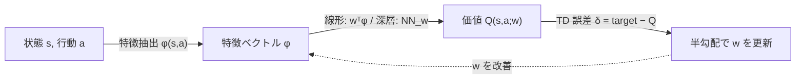

# 関数近似と DQN

:::abstract[学習目標]
この章を読み終えると、次のことができるようになります。

- 表形式 (tabular) が破綻する理由を **状態数の爆発** と **汎化の欠如** の2点で説明できる
- 価値関数を **線形** $Q(s,a;\mathbf{w})=\mathbf{w}^\top\boldsymbol\phi(s,a)$ で近似し、**半勾配 TD 更新** を導出できる
- **deadly triad**（関数近似 + ブートストラップ + off-policy）がなぜ発散を招くかを説明できる
- **DQN** の損失と、**経験再生 (experience replay)** と **ターゲットネットワーク** が「なぜ」必要かを述べられる
- 線形関数近似 Q 学習を numpy で実装し、表より少ないパラメータで方策が改善することを確認できる
:::

## 前提知識

- 章04 [モデルフリー制御 — Q学習・SARSA](/reinforcement-learning/04-model-free-control/)：Q 学習の更新則 $Q(s,a)\leftarrow Q(s,a)+\alpha[r+\gamma\max_{a'}Q(s',a')-Q(s,a)]$、TD ターゲット、off-policy、$\varepsilon$-greedy 探索
- ベルマン最適方程式 $Q^*(s,a)=\mathbb{E}[r+\gamma\max_{a'}Q^*(s',a')]$（章02–03）
- 線形代数（内積・勾配）と確率的勾配降下 (SGD) の基礎

LLM 出身の読者へ：表 → 関数近似の移行は、「単語ごとに別々の埋め込みを暗記する」状態から「**パラメータを共有して未知の入力にも汎化する**ニューラルネット」へ移る話と同じ構図です。本章はその橋渡しを丁寧に積みます。

## 直感

章04 までの Q 学習は、状態と行動の組ごとに値を **テーブル** に書き込んでいました。$25$ 状態 × $4$ 行動なら $100$ マスのノートです。これは小さな迷路なら完璧に動きます。

ところが Atari のように **画面が状態** だと、状態数は天文学的になります。$210\times160$ ピクセル × $128$ 色なら、状態の総数は $128^{210\times160}$ ——宇宙の原子数をはるかに超えます。テーブルには入りません。連続値（ロボットの関節角度など）に至っては状態が **無限個** で、原理的にマスを用意できません。

さらに深刻なのは **汎化の欠如** です。テーブルは各マスが独立なので、「画面の右上に敵がいる」状況をいくら学んでも、「右上から 1 ピクセルずれた」よく似た状況には **何も転移しません**。新しいマスはゼロから学び直しです。

解決は1つ。価値を **テーブルではなく関数** $Q(s,a;\mathbf{w})$ で表すこと。状態を特徴ベクトル $\boldsymbol\phi(s,a)$ に変換し、少数のパラメータ $\mathbf{w}$ を共有して値を **計算** します。似た状態は似た特徴 → 似た値、と自動的に汎化します。線形 → 深層へと近似器を強くしていくのが本章の道です。

ただし関数近似は **タダではありません**。表形式では保証されていた収束が、関数近似 + ブートストラップ + off-policy の3つが揃うと壊れます（**deadly triad**）。DQN はこの不安定さを **経験再生** と **ターゲットネットワーク** という2つの工夫で抑え込み、生のピクセルから Atari 49 ゲームを人間級に攻略しました。本章のゴールは、この「破綻 → 安定化」の物語を導出と実測で掴むことです。

## 全体像

価値の表現を **テーブル → 関数** に置き換えるのが全体の骨格です。順方向（値を計算する）と逆方向（誤差で $\mathbf{w}$ を更新する）を先に一望します。



| | 表形式 (tabular) | 関数近似 (function approximation) |
| --- | --- | --- |
| 価値の保持 | 状態×行動ごとに値を1マス | 共有パラメータ $\mathbf{w}$ で計算 |
| パラメータ数 | 状態数 × 行動数（爆発する） | $\dim(\mathbf{w})$（状態数と無関係に固定） |
| 汎化 | **なし**（マスは独立） | **あり**（似た特徴→似た値） |
| 連続・大規模状態 | 不可 | 可 |
| 収束保証 | あり（Q 学習は確率1で最適へ） | **崩れうる**（deadly triad） |
| 安定化の工夫 | 不要 | 経験再生・ターゲットネット等が要る |

この表の最下行が本章後半の主題です。表では「ただ動いた」ものが、関数近似では **動かすために工夫が要る**。その工夫の正体が DQN です。

:::note[LLM ↔ RL]
表 → 関数近似は、LLM でいう「ルックアップテーブル → 学習された埋め込み + ネットワーク」への移行とほぼ同型です。ただし1点だけ RL 固有の罠があります。教師あり学習では正解ラベルが固定ですが、RL の学習目標 $r+\gamma\max_{a'}Q(s',a';\mathbf{w})$ は **自分のパラメータ $\mathbf{w}$ に依存して動く**（ブートストラップ）。この「自分で自分の正解を作る」性質が、関数近似と組むと不安定さを生みます。
:::

## 理論

### 価値関数を関数で近似する

価値関数 $Q(s,a)$ を、パラメータ $\mathbf{w}\in\mathbb{R}^d$ を持つ関数で近似します。

$$
\hat{Q}(s,a;\mathbf{w}) \approx Q^*(s,a)
$$

ここで各記号を定義します。

- $s$：状態。離散でも連続でも、画像でもよい。
- $a$：行動。本章では離散（有限個）を前提にします。
- $\mathbf{w}\in\mathbb{R}^d$：**学習されるパラメータ**。$d$ は状態数と無関係に固定します。これが表との決定的な違い —— 状態が $10^{100}$ 個あっても $\mathbf{w}$ の次元は変わりません。
- $\boldsymbol\phi(s,a)\in\mathbb{R}^d$：**特徴ベクトル (feature vector)**。状態と行動を $d$ 次元の数値ベクトルへ変換する写像。線形近似では設計者が決める固定の関数（学習しない）、深層では生の入力（ピクセル等）から **ネットワーク自身が特徴を学習** します。

#### 線形関数近似

最も単純な近似器は、特徴ベクトルとパラメータの **内積** です。

$$
\hat{Q}(s,a;\mathbf{w}) = \mathbf{w}^\top \boldsymbol\phi(s,a) = \sum_{i=1}^{d} w_i\,\phi_i(s,a)
$$

- $\phi_i(s,a)$：$i$ 番目の特徴。$d$ 個あり、各々が「状態・行動の何らかの性質」を数値化します。例：迷路なら「ゴールまでの距離」「現在の行」「壁に近いか」など。
- $w_i$：$i$ 番目の特徴の **重み**。「その特徴が価値にどれだけ効くか」を表す学習対象のスカラー。
- 役割：似た状態は似た $\boldsymbol\phi$ を持つので、内積も近くなり、**汎化** が起きます。

:::warning[特徴は「固定」か「学習」か —— 線形と深層を取り違えない]
線形関数近似では $\boldsymbol\phi(s,a)$ は **設計者が事前に決める固定の関数** で、学習されるのは重み $\mathbf{w}$ だけです。一方 DQN（深層）では $\boldsymbol\phi$ にあたる「特徴」も **ニューラルネットの中間層がデータから学習** します。
「線形 = 表現力が弱い」のではなく「**特徴を人手で良く設計できれば線形でも強い**」「特徴設計が難しい（画像など）なら深層に任せる」という棲み分けです。DQN の本質は『Q を非線形にした』ことより『**特徴抽出を学習に委ねた**』ことにあります。
:::

#### 表形式は関数近似の特殊ケース

表形式は、実は関数近似の特別な場合です。特徴を **状態×行動の one-hot ベクトル**（その組だけ1、他は0）にとれば、$\mathbf{w}^\top\boldsymbol\phi(s,a)$ はちょうど「その組の重み $w_{(s,a)}$」を取り出すだけ。つまり $\mathbf{w}$ がテーブルそのものになります。

- このとき各重みが独立に更新される → 汎化ゼロ → 章04 の表形式 Q 学習に一致。
- 特徴をもっと **重なりのあるもの**（distributed representation）にすると、1回の更新が複数の状態に波及し汎化が生まれます。

これが「表 ⊂ 関数近似」という包含関係です。本章は one-hot を捨てて、重なる特徴に移ります。

### 学習の目的：射影されたベルマン誤差

理想は $\hat{Q}(\cdot;\mathbf{w})$ を真の $Q^*$ に近づけることですが、$Q^*$ は未知です。代わりに、章03–04 と同じく **TD ターゲット** を「正解の代用」に使います。1ステップ TD ターゲットは

$$
y = r + \gamma \max_{a'} \hat{Q}(s',a';\mathbf{w})
$$

で、これと現在の予測 $\hat{Q}(s,a;\mathbf{w})$ の二乗誤差を最小化します。

$$
J(\mathbf{w}) = \mathbb{E}_{(s,a,r,s')}\Big[\big(\,y - \hat{Q}(s,a;\mathbf{w})\,\big)^2\Big]
$$

- $\mathbb{E}_{(s,a,r,s')}$：環境から得た遷移サンプルについての期待値。実際にはサンプル平均で近似します。
- $y$：TD ターゲット。**自分のパラメータ $\mathbf{w}$ を含む**点が教師あり学習との決定的な差。正解が固定ではなく動きます。

ここで動作のタイミングを整理します。学習時は遷移 $(s,a,r,s')$ を環境から集めながら $\mathbf{w}$ を更新します。推論（実行）時は $\mathbf{w}$ を固定し、各状態で $\arg\max_a \hat{Q}(s,a;\mathbf{w})$ をとるだけ —— ターゲットも誤差も計算しません。

## 数式の導出

### 半勾配 TD 更新

$J(\mathbf{w})$ を $\mathbf{w}$ で最小化するため、勾配降下を考えます。1サンプルの損失を $\ell = \tfrac{1}{2}(y-\hat{Q})^2$ とし（係数 $\tfrac{1}{2}$ は微分を綺麗にするためで結果は変わりません）、$\mathbf{w}$ で微分します。

まず素朴に、$y$ も $\hat{Q}$ も $\mathbf{w}$ に依存することを認めて連鎖律を適用すると、

$$
\nabla_{\mathbf{w}}\ell = -\big(y - \hat{Q}(s,a;\mathbf{w})\big)\Big(\nabla_{\mathbf{w}}\hat{Q}(s,a;\mathbf{w}) - \nabla_{\mathbf{w}} y\Big)
$$

となります。$y$ の中の $\max_{a'}\hat{Q}(s',a';\mathbf{w})$ も $\mathbf{w}$ を含むため $\nabla_{\mathbf{w}} y \neq \mathbf{0}$ です。

ここで TD 学習は **意図的に $\nabla_{\mathbf{w}} y = \mathbf{0}$ と置きます**。つまりターゲット $y$ を「定数（正解の固定値）」とみなし、$\mathbf{w}$ で微分しません。これを **半勾配 (semi-gradient)** と呼びます。すると

$$
\nabla_{\mathbf{w}}\ell = -\big(y - \hat{Q}(s,a;\mathbf{w})\big)\,\nabla_{\mathbf{w}}\hat{Q}(s,a;\mathbf{w})
$$

勾配降下 $\mathbf{w}\leftarrow\mathbf{w}-\alpha\nabla_{\mathbf{w}}\ell$ に代入すると、**半勾配 TD 更新** が得られます。

$$
\mathbf{w} \leftarrow \mathbf{w} + \alpha\,\underbrace{\big(\,y - \hat{Q}(s,a;\mathbf{w})\,\big)}_{\text{TD 誤差 }\delta}\,\nabla_{\mathbf{w}}\hat{Q}(s,a;\mathbf{w})
$$

線形の場合は $\nabla_{\mathbf{w}}\hat{Q}(s,a;\mathbf{w}) = \boldsymbol\phi(s,a)$ なので、

$$
\mathbf{w} \leftarrow \mathbf{w} + \alpha\,\big(\,r + \gamma \max_{a'}\mathbf{w}^\top\boldsymbol\phi(s',a') - \mathbf{w}^\top\boldsymbol\phi(s,a)\,\big)\,\boldsymbol\phi(s,a)
$$

$\blacksquare$

:::warning[なぜ「半」勾配なのか —— $y$ を微分しない理由]
$y$ も $\mathbf{w}$ を含むのだから、$\nabla_{\mathbf{w}} y$ も入れた「完全な」勾配にすべきでは？と思うのが自然です。が、それをやると **自分の予測値を追いかけて自分を動かす**形になり、目標が更新のたびに逃げ、学習が不安定化・発散しやすくなります（これがブートストラップの危うさの源）。
半勾配は「ターゲットを一旦固定された正解とみなして、予測をそこへ寄せる」という安定な見方を選びます。one-hot 特徴（=表形式）なら章04 の Q 学習更新に厳密に一致し、収束も保証されます。**「半」は手抜きではなく、安定性のための設計上の選択** です。
:::

### tabular Q 学習との一致を確認

特徴を one-hot $\boldsymbol\phi(s,a)=\mathbf{e}_{(s,a)}$（その組だけ1）にとると、$\mathbf{w}^\top\boldsymbol\phi(s,a)=w_{(s,a)}$ で、更新は

$$
w_{(s,a)} \leftarrow w_{(s,a)} + \alpha\,\big(\,r + \gamma\max_{a'}w_{(s',a')} - w_{(s,a)}\,\big)
$$

となり、章04 の表形式 Q 学習 $Q(s,a)\leftarrow Q(s,a)+\alpha[r+\gamma\max_{a'}Q(s',a')-Q(s,a)]$ と **完全に一致** します。関数近似は表形式の真の一般化です。$\blacksquare$

### deadly triad：3つが揃うと壊れる

表形式の Q 学習は確率1で最適へ収束しました。ところが関数近似に移ると、**次の3要素が同時に揃うとき発散しうる** ことが知られています。これを **deadly triad（死の三つ組）** と呼びます。

| 要素 | 内容 | この章での該当 |
| --- | --- | --- |
| ① 関数近似 | 値をパラメータ共有で近似（汎化が誤差を伝播させる） | $\hat{Q}(s,a;\mathbf{w})$ |
| ② ブートストラップ | ターゲットに自分の推定値を使う（モンテカルロでなく TD） | $y=r+\gamma\max_{a'}\hat{Q}(\cdots)$ |
| ③ off-policy | 学習対象と異なる方策でデータを集める | $\varepsilon$-greedy で集め greedy で bootstrap |

3つが揃うと、ある状態の更新が **汎化を通じて別の状態の予測を動かし、それがターゲットを動かし、さらに元の状態を動かす** という正のフィードバックループが生じ、$\mathbf{w}$ が発散することがあります。3つのうち **どれか1つを外せば** 安定します（例：on-policy にする、モンテカルロにする、表形式に戻す）。しかし価値ベース深層 RL は3つすべてが欲しい（汎化・標本効率・過去データ再利用）ので、**外す代わりに緩和する**のが DQN の戦略です。

:::warning[deadly triad は「必ず発散する」ではない]
誤解しやすい点：deadly triad は「3つ揃えば常に発散する」という主張ではありません。「3つ揃うと **発散しうる**（収束保証が一般には失われる）」が正確です。実際には多くの場合うまく動きますが、保証がないので **特定の条件で静かに崩れる** ことがある。だから経験再生・ターゲットネットワークのような安定化が **保険として効く**のです。「動くことが多いが保証はない、だから工夫で確率を上げる」が実態です。
:::

## DQN：deadly triad を飼いならす

**DQN (Deep Q-Network, Mnih et al. 2015, Nature 518)** は、$\hat{Q}$ を畳み込みニューラルネット (CNN) にして生のピクセルから Q を近似し、deadly triad の不安定さを2つの工夫で抑えました。損失は本質的に前述の二乗 TD 誤差です。

$$
L(\mathbf{w}) = \mathbb{E}_{(s,a,r,s')\sim D}\Big[\big(\,r + \gamma \max_{a'} \hat{Q}(s',a';\mathbf{w}^-) - \hat{Q}(s,a;\mathbf{w})\,\big)^2\Big]
$$

ここで新しい記号が2つあります。

- $D$：**経験再生バッファ (replay buffer)**。過去の遷移 $(s,a,r,s')$ を貯めた集合。ここからランダムに取り出して学習します。
- $\mathbf{w}^-$：**ターゲットネットワーク** のパラメータ。学習中の $\mathbf{w}$ とは別に保持し、$\mathbf{w}$ のコピーを **遅れて（数千ステップごとに）** 更新します。

### 工夫① 経験再生 (experience replay)

集めた遷移を即座に1回だけ使って捨てるのではなく、バッファ $D$ に貯めて **ランダムサンプリングして繰り返し学習** します。

- **なぜ必要か（相関を切る）**：環境を逐次に進めると、連続するサンプル $(s_t,\ldots)$ と $(s_{t+1},\ldots)$ は強く相関します。相関したサンプルで SGD すると勾配が偏り、ミニバッチが i.i.d. を仮定する SGD の前提が崩れ、学習が振動・発散しやすい。ランダムに取り出すと時間的相関が切れ、勾配が安定します。
- **なぜ必要か（標本効率）**：1つの遷移を **何度も再利用** できるので、高コストな環境相互作用を無駄にしません。
- これは off-policy だからこそ可能です（過去の方策が集めた古いデータを再利用しても、Q 学習の更新は最適 Q への射影なので正当）。

### 工夫② ターゲットネットワーク (target network)

TD ターゲット中の Q を、学習中のネット $\mathbf{w}$ ではなく **固定したコピー $\mathbf{w}^-$** で計算します。$\mathbf{w}^-$ は数千ステップごとに $\mathbf{w}$ で上書きするだけで、その間は凍結されます。

- **なぜ必要か（動く標的を止める）**：ブートストラップでは正解 $y$ が $\mathbf{w}$ に依存します。もし同じ $\mathbf{w}$ で予測もターゲットも作ると、$\mathbf{w}$ を更新するたびにターゲットも一緒に動き、**自分が追いかける的が自分の動きで逃げる**。これが半勾配でも残る不安定さの主因です。$\mathbf{w}^-$ を一定期間凍結すると、ターゲットがその間 **固定された正解** になり、教師あり回帰に近い安定した問題になります。
- 凍結期間が短すぎると標的が動いて不安定、長すぎると古い値を追って学習が遅い。**更新頻度がトレードオフ**です。

:::warning[replay とターゲットネットは「何のため」が違う]
2つを混同しないでください。役割が直交しています。

| 工夫 | 潰す問題 | deadly triad の対応 |
| --- | --- | --- |
| 経験再生 | サンプル間の **時間相関**（と低い標本効率） | off-policy 由来の偏りを緩和 |
| ターゲットネット | ブートストラップの **動く標的** | ②ブートストラップの不安定を緩和 |

経験再生は「データの集め方」、ターゲットネットは「正解の作り方」の問題に効きます。両方あって初めて、関数近似 + ブートストラップ + off-policy の3つを揃えたまま安定して学習できます。
:::

### Rainbow：DQN 改良の集大成

**Rainbow (Hessel et al. 2018, AAAI)** は、DQN への独立した6つの改良を1つに統合し、Atari でデータ効率・最終性能とも当時の SOTA を達成しました。各要素が何を直すかだけ押さえます。

| 改良 | 直す問題 |
| --- | --- |
| Double Q-learning | $\max$ による Q 値の **過大評価バイアス** |
| Prioritized Replay | TD 誤差の大きい遷移を優先サンプル（学習効率） |
| Dueling Network | 状態価値 $V$ と advantage $A$ を分離 |
| Multi-step (n-step) | 1ステップ TD と MC の中間でバイアス-分散調整 |
| Distributional RL (C51) | リターンの **期待値でなく分布** を学習 |
| Noisy Net | パラメータ空間ノイズによる探索（$\varepsilon$-greedy 代替） |

これらは本章の範囲を超えますが、「DQN は出発点で、改良の方向が多数ある」ことだけ掴んでおけば十分です。

## 実装

線形関数近似 Q 学習（半勾配 TD）を numpy だけで実装します。$5\times5$ の gridworld を、**表（$25\times4=100$ エントリ）ではなく $16$ 個のパラメータ** で解き、方策が最適経路へ改善することを実測します。特徴は「行・列・ゴールまでの距離・バイアス」の4次元を行動ごとに並べたものです。

```python title="linear_fa_q.py"
import numpy as np

# 5x5 gridworld。左上(0,0)スタート、右下(4,4)がゴール(+1)。
# 各ステップ -0.01 のコストで「短い経路」を促す。行動は上下左右の4つ。
GRID = 5
GOAL = (GRID - 1, GRID - 1)
ACTIONS = [(-1, 0), (1, 0), (0, -1), (0, 1)]  # up, down, left, right
NA = len(ACTIONS)

def step(s, a):
    dr, dc = ACTIONS[a]
    nr, nc = s[0] + dr, s[1] + dc
    if not (0 <= nr < GRID and 0 <= nc < GRID):
        nr, nc = s  # 壁にぶつかったら留まる
    ns = (nr, nc)
    if ns == GOAL:
        return ns, 1.0, True
    return ns, -0.01, False

# 特徴 phi(s,a): 状態を [row/4, col/4, ゴールまでの正規化距離, バイアス] の4次元にし、
# 行動ごとにブロックを分けて NA*4=16 次元へ並べる(行動 one-hot × 状態特徴)。
# → 表(25状態×4行動=100エントリ)より少ない 16 パラメータで Q を近似する。
SF, DIM = 4, NA * 4

def state_feat(s):
    r, c = s
    dist = (abs(GOAL[0] - r) + abs(GOAL[1] - c)) / (2 * (GRID - 1))
    return np.array([r / (GRID - 1), c / (GRID - 1), dist, 1.0])

def phi(s, a):
    v = np.zeros(DIM)
    v[a * SF:(a + 1) * SF] = state_feat(s)
    return v

def q(w, s, a):            # 線形近似 Q(s,a;w) = wᵀφ(s,a)
    return w @ phi(s, a)

def greedy(w, s):          # 貪欲行動とその Q 値
    qs = [q(w, s, a) for a in range(NA)]
    return int(np.argmax(qs)), max(qs)

# 線形 Q 学習(半勾配 TD)。off-policy: eps-greedy で集め greedy で bootstrap。
# 更新: w <- w + alpha * (r + gamma*max_a' Q(s',a') - Q(s,a)) * phi(s,a)
rng = np.random.default_rng(0)
w = np.zeros(DIM)
gamma, alpha, eps, EPISODES = 0.95, 0.1, 0.2, 400

ep_returns = []
for ep in range(EPISODES):
    s, total, done, t = (0, 0), 0.0, False, 0
    while not done and t < 100:
        a = rng.integers(NA) if rng.random() < eps else greedy(w, s)[0]
        ns, r, done = step(s, a)
        target = r if done else r + gamma * greedy(w, ns)[1]
        td = target - q(w, s, a)
        w += alpha * td * phi(s, a)          # 半勾配更新(target は微分しない)
        s, total, t = ns, total + r, t + 1
    ep_returns.append(total)

def rollout(w):            # 学習後の貪欲方策で歩く
    s, path, done, t = (0, 0), [(0, 0)], False, 0
    while not done and t < 50:
        s, _, done = step(s, greedy(w, s)[0])  # done を受けてゴールで停止
        path.append(s); t += 1
    return path, t

path, steps = rollout(w)
print(f"params: {DIM} (table would be {GRID*GRID*NA})")
print(f"avg return  first 20 ep: {np.mean(ep_returns[:20]):.3f}")
print(f"avg return  last  20 ep: {np.mean(ep_returns[-20:]):.3f}")
print(f"greedy path length: {steps} (optimal = {2*(GRID-1)})")
A = ['U', 'D', 'L', 'R']
print("greedy action per state (row-major):")
for r in range(GRID):
    print(' '.join(A[greedy(w, (r, c))[0]] if (r, c) != GOAL else 'G'
                   for c in range(GRID)))
```

実行すると次の出力が得られます（`uv run --with numpy python linear_fa_q.py`、seed 固定で再現可能）。

```text title="出力"
params: 16 (table would be 100)
avg return  first 20 ep: 0.764
avg return  last  20 ep: 0.910
greedy path length: 8 (optimal = 8)
greedy action per state (row-major):
D D D D D
D D D D D
R R D D D
R R R R D
R R R R G
```

読み取れること：

- **パラメータは 16 個**。表形式なら 100 エントリ必要なところを、特徴共有で $1/6$ に圧縮できました。状態が増えてもパラメータ数は固定です。
- 平均リターンが **0.764 → 0.910 に改善**。学習が進み、無駄なステップ（$-0.01$ のコスト）が減っています。
- 貪欲方策の経路長が **8 = 最短**（$(0,0)\to(4,4)$ のマンハッタン距離）に到達。最後の方策テーブルを見ると、全状態でゴール（右下）へ向かう「下 (D) / 右 (R)」が選ばれており、**近似した Q から正しい方策が読み出せている** ことが確認できます。

DQN 本体は、この `phi` と `q` を **CNN** に、`step` ループに **経験再生バッファ** と **ターゲットネット** を足したものです。概念スケルトンを示します（そのまま動く完全コードではなく、構造の対応を示すためのもの）。

```python title="dqn_skeleton.py（概念スケルトン）"
# 線形版との対応: q() → q_net(s) が全行動の Q をまとめて返す CNN。
# 追加要素は (1) replay buffer と (2) target network の2つ。
from collections import deque
import random

replay = deque(maxlen=100_000)          # 工夫①: 経験再生バッファ
q_net = build_cnn()                     # 学習対象 w
target_net = build_cnn(); copy(q_net, target_net)  # 工夫②: w⁻ (凍結コピー)

for step_i in range(TOTAL_STEPS):
    a = eps_greedy(q_net, s)            # off-policy で収集
    s2, r, done = env.step(a)
    replay.append((s, a, r, s2, done))  # 即学習せず貯める(相関を切る)
    s = env.reset() if done else s2

    batch = random.sample(replay, 32)   # ランダム取り出し → i.i.d. に近づける
    # ターゲットは凍結した target_net (w⁻) で計算 = 動く標的を止める
    y = r + gamma * target_net(s2).max(axis=1) * (1 - done)
    loss = mse(y, q_net(s)[a])          # 半勾配: y 側は勾配を流さない
    sgd_step(q_net, loss)

    if step_i % 10_000 == 0:            # 数千〜万ステップごとに
        copy(q_net, target_net)         # w⁻ ← w (遅延コピー)
```

線形トイとの差は本質的に2点 —— `q()` が CNN になり、`replay` と `target_net` が加わるだけ —— という対応が掴めれば十分です。

## 演習

::::question[演習 1: 表形式は関数近似の特殊ケース]
線形近似 $\hat{Q}(s,a;\mathbf{w})=\mathbf{w}^\top\boldsymbol\phi(s,a)$ において、特徴 $\boldsymbol\phi(s,a)$ を「状態×行動の組ごとの one-hot ベクトル」にとったとします。(a) このとき $\hat{Q}(s,a;\mathbf{w})$ は具体的に何になりますか。(b) 半勾配 TD 更新は章04 のどの式に一致しますか。(c) この設定で「汎化」が起きないのはなぜですか。

:::details[解答]
(a) one-hot $\boldsymbol\phi(s,a)=\mathbf{e}_{(s,a)}$ は組 $(s,a)$ の位置だけ1なので、内積 $\mathbf{w}^\top\boldsymbol\phi(s,a)$ はその位置の重み $w_{(s,a)}$ を取り出すだけ。つまり $\hat{Q}(s,a;\mathbf{w})=w_{(s,a)}$ で、$\mathbf{w}$ がテーブルそのものになります。

(b) 更新の勾配 $\nabla_{\mathbf{w}}\hat{Q}=\boldsymbol\phi(s,a)=\mathbf{e}_{(s,a)}$ は1成分だけ1なので、その成分だけが
$w_{(s,a)}\leftarrow w_{(s,a)}+\alpha[r+\gamma\max_{a'}w_{(s',a')}-w_{(s,a)}]$
と更新されます。これは章04 の表形式 Q 学習 $Q(s,a)\leftarrow Q(s,a)+\alpha[r+\gamma\max_{a'}Q(s',a')-Q(s,a)]$ に **完全一致** します。

(c) one-hot は組ごとに重なりが全くない（直交している）ので、ある $(s,a)$ の更新は他の成分 $w_{(s',a')}$ を一切動かしません。1マスの学習が他のマスへ波及しない＝**汎化ゼロ**。重なりのある特徴にして初めて、1回の更新が複数状態の値を動かし汎化が生まれます。
:::
::::

::::question[演習 2: deadly triad を1つ外す]
ある価値ベース手法が、関数近似 + ブートストラップ + off-policy の3つすべてを使っていて、学習が発散しました。(a) deadly triad のどれか1つを外して安定化させる方法を、3通りそれぞれ具体的に述べてください。(b) DQN はなぜ「どれも外さず」、代わりに経験再生とターゲットネットワークを使うのですか。

:::details[解答]
(a) 3通り：
- **関数近似を外す** → 表形式に戻す（状態が小さければ）。one-hot 特徴にすれば収束保証が復活する。
- **ブートストラップを外す** → TD でなくモンテカルロ (MC) にする。ターゲットを実際のリターン $G_t$ にすれば自分の推定値に依存しないので「動く標的」問題が消える（ただし分散は増える）。
- **off-policy を外す** → on-policy にする（収集方策と学習方策を一致させる）。SARSA 系や方策勾配がこれにあたり、分布のずれが消えて安定する。

(b) DQN（価値ベース深層 RL）は3つすべてが **欲しい**からです。関数近似は大規模・連続状態への汎化に必須、ブートストラップは MC より標本効率が高く、off-policy は経験再生で過去データを再利用できる。どれも捨てたくない。そこで「外す」代わりに、ブートストラップの動く標的を **ターゲットネットワーク** で凍結し、off-policy 由来のサンプル相関を **経験再生** で切る。つまり deadly triad の各要素は残したまま、発散の引き金になる部分だけを **緩和** する設計です。
:::
::::

## まとめ

:::success[この章の要点]
- 表形式は **状態数の爆発** と **汎化の欠如** で大規模・連続状態に破綻する。価値を関数 $\hat{Q}(s,a;\mathbf{w})$ で近似し、パラメータを共有して汎化する。
- 線形近似 $\hat{Q}=\mathbf{w}^\top\boldsymbol\phi(s,a)$ の **半勾配 TD 更新** は、ターゲット $y$ を定数とみなして微分しない（安定性のための設計）。one-hot 特徴にとれば章04 の表形式 Q 学習に一致する。
- **deadly triad**（関数近似 + ブートストラップ + off-policy）が揃うと収束保証が失われ発散しうる。常に発散するわけではないが、保証がないので安定化が要る。
- **DQN** は3つを外さず緩和する。**経験再生** がサンプルの時間相関を切り標本効率を上げ、**ターゲットネットワーク** がブートストラップの動く標的を凍結する。役割は直交している。
- 線形関数近似 Q 学習は 16 パラメータ（表なら 100 エントリ）で gridworld を最短経路へ解け、方策の改善が数値で確認できる。
:::

### 次に学ぶこと

ここまでで **価値ベース** の系譜 —— Q を関数で近似し $\arg\max$ で行動を選ぶ —— が、深層化（DQN）まで一通り手に入りました。しかし価値ベースは離散行動が前提で、$\arg\max$ が連続行動では使えません。次章では発想を変え、**方策 $\pi_\theta$ を勾配で直接最適化** する方策勾配法へ進みます。連続行動・確率的方策を自然に扱え、現在の LLM の RLHF/RLVR でも標準となる系譜の入口です。

→ [6. 方策勾配法](/reinforcement-learning/06-policy-gradient/)

## 用語ミニ辞典

| 用語 | 一言 |
| --- | --- |
| 関数近似 (function approximation) | 価値をテーブルでなくパラメトリック関数 $\hat{Q}(s,a;\mathbf{w})$ で表す |
| 特徴ベクトル $\boldsymbol\phi(s,a)$ | 状態・行動を数値ベクトルに変換。線形は固定、深層は学習 |
| 線形近似 | $\hat{Q}=\mathbf{w}^\top\boldsymbol\phi$。重みと特徴の内積 |
| 半勾配 (semi-gradient) | TD ターゲット $y$ を定数とみなし微分しない更新 |
| TD 誤差 $\delta$ | $y-\hat{Q}(s,a;\mathbf{w})$。更新の駆動力 |
| deadly triad | 関数近似 + ブートストラップ + off-policy。揃うと発散しうる |
| ブートストラップ | ターゲットに自分の推定値を使う（TD の核心） |
| DQN | CNN で Q を近似し replay + target net で安定化（Mnih 2015） |
| 経験再生 (replay) | 過去遷移をバッファに貯めランダム再利用。相関を切る |
| ターゲットネット $\mathbf{w}^-$ | 遅延コピーで凍結したパラメータ。動く標的を止める |
| Rainbow | DQN への6改良を統合（Hessel 2018） |

## 次のアクション

理論を手で定着させる。**最小の写経 → 動かす → 小実験** を1セットで。

1. 上の `linear_fa_q.py` を写経し、`uv run --with numpy python linear_fa_q.py` で実行する。出力の最終方策テーブルが「全状態でゴールへ向かう」ことを確認する。
2. 特徴 `state_feat` の中身を変えてみる。例えば「ゴールまでの距離」項を削ると、汎化のヒントが減って学習が遅く/不安定になることを `avg return` で観察する。
3. 余力があれば、特徴を **状態×行動の one-hot**（$DIM=100$）に差し替え、表形式 Q 学習に一致することと、汎化が消えて収束が遅くなることを比較する。deadly triad を体感したい場合は、`gamma` を 0.99 に上げ特徴をわざと相関させて発散を誘発してみる。

ここまでで価値ベース深層 RL の骨格が手に入ります。次章 06 で方策勾配へ進み、連続行動と LLM 整合への橋を架けます。

## 参考文献

1. V. Mnih et al., "Human-level control through deep reinforcement learning," *Nature*, vol. 518, pp. 529–533, 2015.（DQN 原論文。経験再生 + ターゲットネット）
2. M. Hessel et al., "Rainbow: Combining Improvements in Deep Reinforcement Learning," *AAAI*, 2018.（DQN 改良の統合）
3. R. S. Sutton and A. G. Barto, *Reinforcement Learning: An Introduction*, 2nd ed., MIT Press, 2018.（11章で関数近似と deadly triad を扱う定番教科書）
4. J. N. Tsitsiklis and B. Van Roy, "An Analysis of Temporal-Difference Learning with Function Approximation," *IEEE Trans. Automatic Control*, 1997.（線形 TD と off-policy 発散の理論）
5. C. J. C. H. Watkins and P. Dayan, "Q-learning," *Machine Learning*, vol. 8, pp. 279–292, 1992.（表形式 Q 学習の収束証明。関数近似の出発点）
