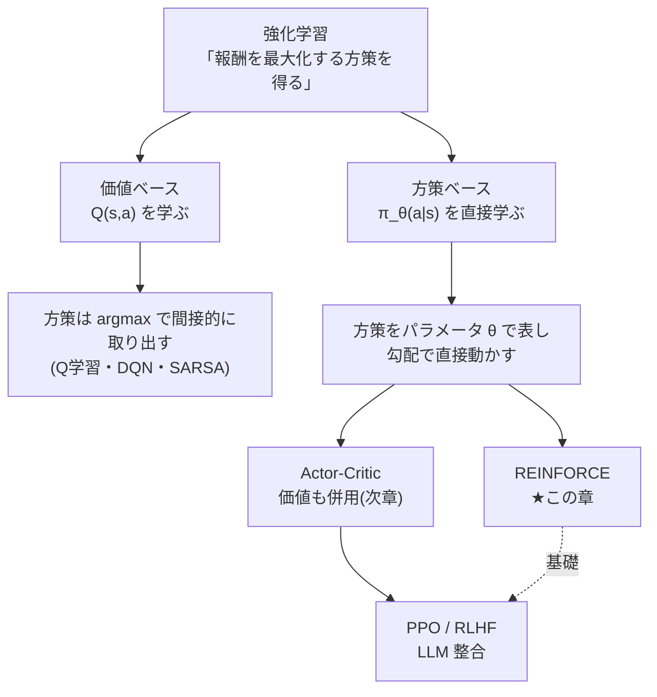
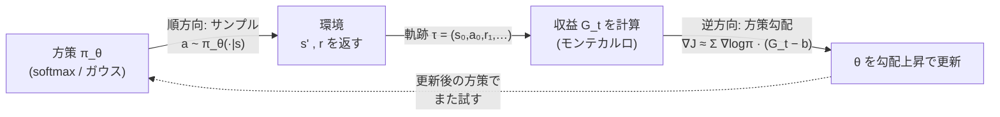
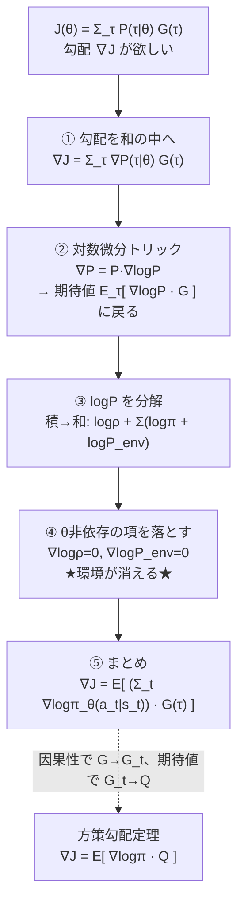
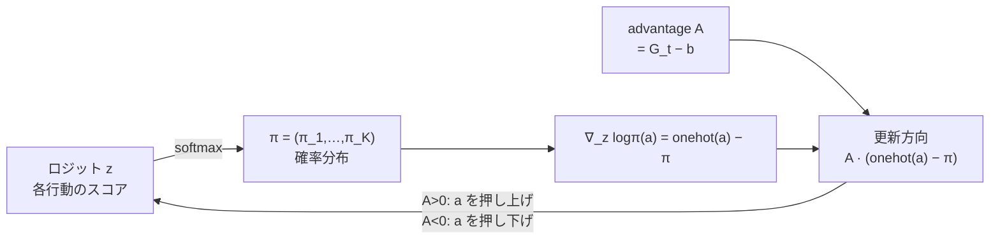
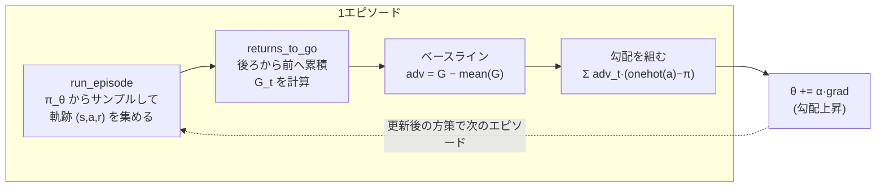

# 方策勾配法 — REINFORCE と方策勾配定理

:::abstract[学習目標]
この章を読み終えると、次のことができるようになります。

- **価値ベース**と**方策ベース**の違いを、「Q を学んで argmax する」vs「方策 $\pi_\theta$ を直接動かす」という軸で **説明** できる
- 目的関数 $J(\theta)=\mathbb{E}_{\pi_\theta}[G]$ の勾配を、**対数微分（尤度比）トリック**から **方策勾配定理** へ **自力で導出** できる
- **REINFORCE** の更新式を書き下し、なぜ「$\nabla\log\pi$ × 収益」になるのかを **説明** できる
- **ベースライン**が方策勾配推定量の**分散を下げる一方でバイアスを増やさない**ことを **証明** し、**advantage** との関係を述べられる
- softmax 方策の REINFORCE を numpy で実装し、収益が上がる（方策が改善する）ことを **数値で確認** できる
- これが LLM の **RLHF / PPO** の直接の祖先であることを **位置づけ** られる
:::

## 前提知識

- 章01 [強化学習とは — 問題設定と MDP](/reinforcement-learning/01-mdp/)：状態 $s$・行動 $a$・報酬 $r$・割引率 $\gamma$、方策 $\pi(a\mid s)$、割引累積報酬（収益）$G_t=\sum_{k\ge 0}\gamma^k r_{t+k+1}$、価値関数 $V^\pi(s)$ と行動価値 $Q^\pi(s,a)$。本章はこれらを**所与**として進めます。
- 確率の基礎：期待値、$\mathbb{E}[f(X)]=\sum_x p(x)f(x)$、独立な確率の積。
- 微分の基礎：合成関数の微分（chain rule）、$\frac{d}{dx}\log f(x)=\frac{f'(x)}{f(x)}$。
- softmax と、その勾配（本文で導出します）。

LLM 出身の読者へ：**方策 $\pi_\theta$ は「条件付き言語モデル」とほぼ同じもの**です。状態 $s$ がプロンプト、行動 $a$ が次トークン、$\pi_\theta(a\mid s)$ がトークン確率にあたります。この章で学ぶ REINFORCE が、そのまま RLHF / PPO の骨格になります。

## 直感

価値ベース（Q 学習など）では、まず**行動価値 $Q(s,a)$ を学び**、本番では各状態で $\arg\max_a Q(s,a)$ を選んで方策を**間接的に**取り出していました。「価値表が良くなれば、そこから読み出す方策も良くなる」という二段構えです。

方策勾配法はこの二段構えをやめます。**価値を経由せず、方策そのもの $\pi_\theta$ をパラメータ $\theta$ で表し、$\theta$ を勾配で直接動かして「良い方策」へ登っていく**のです。やりたいことは一言で言えば、

> 「うまくいった行動の確率を上げ、まずかった行動の確率を下げる」

これだけです。サイコロ（確率的方策）を振って行動し、結果（収益）が良ければその目が出やすくなるよう重みを調整する。多数回繰り返せば、良い目に偏ったサイコロ＝良い方策になります。

なぜわざわざ価値を捨てて方策を直接いじるのか。三つ理由があります。

- **連続行動を自然に扱える。** $\arg\max_a Q(s,a)$ は行動が離散で有限でないと計算できません。ロボットの「関節トルク 0.37」のような連続行動では $\arg\max$ が解けません。方策を $\pi_\theta(a\mid s)=\mathcal{N}(\mu_\theta(s),\sigma_\theta(s))$ のような分布にすれば、$\max$ を取らずに「分布から1個サンプルする」だけで済みます。
- **確率的方策を直接表せる。** じゃんけんのように「最適方策が確率的（グー・チョキ・パーを 1/3 ずつ）」な問題では、決定的な $\arg\max$ は負けます。方策勾配は確率そのものを出力します。
- **方策が滑らかに変わる。** $Q$ がほんの少し変わると $\arg\max$ がガクッと別の行動に飛ぶ（不連続）。方策を直接パラメータ化すると、$\theta$ を少し動かせば確率も少し動く。この滑らかさが、後述の RLHF/PPO の安定化（KL 制約・クリッピング）の土台になります。

これが現代の LLM 整合（RLHF）・推論強化（RLVR）まで一直線に効いてくる、強化学習のもう一つの大黒柱です。

強化学習の手法を「何を学ぶか」で分類すると、価値ベースと方策ベースの二系統に大きく分かれます。本章はその右の枝（方策ベース）を降りていきます。



価値ベースと方策ベースは、同じ「良い方策が欲しい」というゴールへの**2 つの登り口**です。要点を対比で押さえておきます。

| 観点 | 価値ベース（Q 学習など） | 方策ベース（本章） |
| --- | --- | --- |
| 何を学ぶか | 行動価値 $Q(s,a)$ | 方策 $\pi_\theta(a\mid s)$ そのもの |
| 方策の取り出し方 | $\arg\max_a Q(s,a)$（間接） | $\pi_\theta$ から直接サンプル／$\arg\max$ |
| 連続行動 | $\arg\max$ が解けず苦手 | 分布からサンプルするだけで自然に扱える |
| 確率的方策 | 表現しにくい（決定的になりがち） | 確率を直接出力できる |
| $\theta$ を少し動かすと | $\arg\max$ がガクッと別行動へ飛ぶ（不連続） | 確率がなめらかに変わる（連続） |
| 代表 | DQN、SARSA | REINFORCE、PPO、RLHF |
| 弱点 | 連続・確率的に弱い | 分散が大きい（後でベースラインで対処） |

「滑らかに変わる」という最後から 2 番目の行が、後で効いてきます。$\theta$ を少しずつ動かして登る勾配法は、出力が滑らかに変わる方策ベースと相性が良いのです。価値ベースの $\arg\max$ は微分できない段差なので、勾配で直接登るのが難しい —— これが「方策を直接パラメータ化する」動機の核心です。

## 全体像

方策勾配法の構造は「**ロールアウト（試行）→ 収益を測る → 良かった行動の確率を上げる**」というループです。順方向（行動を生成する推論）と逆方向（勾配で方策を更新する学習）を一望します。



| 段 | 何をするか | いつ | LLM での対応 |
| --- | --- | --- | --- |
| 順方向（推論） | $\pi_\theta$ から行動 $a$ をサンプルし、環境を進める | 毎ステップ | プロンプトから応答を生成（自己回帰デコード） |
| 収益 | 軌跡全体の報酬から各時刻の収益 $G_t$ を計算 | エピソード終了後 | 応答に報酬モデル / 検証器でスコアを付ける |
| 逆方向（学習） | $\nabla_\theta J\approx\sum_t \nabla_\theta\log\pi_\theta(a_t\mid s_t)\,(G_t-b)$ で $\theta$ を更新 | エピソード（バッチ）ごと | 報酬で対数尤度を重み付けして勾配上昇 |

:::note[LLM ↔ RL]
**方策 $\pi_\theta$ ＝ 条件付き言語モデル**、**サンプル ＝ 自己回帰デコード**、**報酬 ＝ 報酬モデル / 検証器のスコア**、**更新 ＝「良い応答の対数尤度を上げる」**。RLHF/PPO はこの図の「収益→更新」を、報酬モデルとクリッピングで安定化しただけです。本章を理解すれば RLHF の骨格はもう手の中にあります。
:::

この章の核心は逆方向の一行 —— **「方策勾配 $\nabla_\theta J$ をどう計算するか」** です。問題は、$J$ が「環境という微分できない箱」を通った期待値だという点。これを乗り越えるのが**方策勾配定理**と、その心臓部である**対数微分トリック**です。順に降りていきます。

## 理論

### 何を最大化するのか — 目的関数 $J(\theta)$

方策 $\pi_\theta(a\mid s)$ をパラメータ $\theta$（ニューラルネットの重み、あるいは後のトイでは状態ごとのロジット表）で表します。良し悪しの尺度は「この方策で行動したとき、どれだけ報酬を稼げるか」の**期待値**です。

$$
J(\theta)=\mathbb{E}_{\tau\sim\pi_\theta}\!\big[G(\tau)\big],\qquad G(\tau)=\sum_{t=0}^{T-1}\gamma^{t}\,r_{t+1}
$$

各記号の意味を全部押さえます。

- $\tau=(s_0,a_0,r_1,s_1,a_1,r_2,\dots,s_T)$ は**軌跡（trajectory）**。1 回のエピソードで実際に通った状態・行動・報酬の列です。
- $\tau\sim\pi_\theta$ は「軌跡 $\tau$ が、方策 $\pi_\theta$ で行動した結果として確率的に生成される」こと。**$\theta$ が変わると、生成される軌跡の分布が変わる** —— ここが後で勾配を取りにくくする元凶です。
- $G(\tau)$ はその軌跡の**収益**（割引累積報酬）。$\gamma\in[0,1]$ は割引率（章01）。
- $J(\theta)$ は軌跡をまたいだ**平均収益**。これを $\theta$ について**最大化**したい。

本章で使う記号を一覧にしておきます（何から作るか・どの軸でインデックスされるか・役割まで）。

| 記号 | 何か | 何から作るか / 軸 | 役割 |
| --- | --- | --- | --- |
| $\theta$ | 方策のパラメータ | NN の重み、トイでは状態×行動のロジット表 | 動かす対象（勾配上昇の主語） |
| $\pi_\theta(a\mid s)$ | 方策 | $\theta$ と状態 $s$ から、行動 $a$ ごとの確率 | サイコロ。LLM のトークン確率に対応 |
| $\tau$ | 軌跡 | 1 エピソードの $(s_0,a_0,r_1,\dots,s_T)$ の列 | 勾配を推定する 1 サンプル |
| $r_{t+1}$ | 即時報酬 | 時刻 $t$ で $a_t$ を打った結果として環境が返す | 良し悪しの瞬間信号 |
| $G(\tau)$ | 収益（軌跡全体） | $\sum_t \gamma^t r_{t+1}$ | 軌跡 1 本の総合点 |
| $G_t$ | reward-to-go | $\sum_{k\ge t}\gamma^{k-t}r_{k+1}$（時刻 $t$ 以降だけ） | $a_t$ の貢献を測る重み |
| $J(\theta)$ | 目的関数 | 軌跡をまたいだ $G(\tau)$ の期待値 | 最大化したいスコア |
| $b(s)$ | ベースライン | 状態 $s$ だけの関数（$a$ に依存しない） | 分散低減の基準点 |
| $A(s,a)$ | advantage | $Q(s,a)-V(s)$ | 「平均よりどれだけ得か」 |

:::warning[$G(\tau)$ と $G_t$ を混同しない]
$G(\tau)$ は**軌跡 1 本の総得点**（時刻 0 から末尾まで全部）で、軌跡ごとに 1 つの数です。一方 $G_t$ は**各時刻ごと**に定義され、「**その時刻 $t$ 以降**の報酬だけ」を足した値です。後で因果性を入れる節で、全時刻一律の $G(\tau)$ を時刻ごとの $G_t$ に差し替えます。同じ「$G$」でも、添字が無いか・$t$ が付くかで指すものが違うことに注意してください。
:::

目的が「最小化」でなく「最大化」なので、更新は勾配**降下**でなく勾配**上昇**になります（符号に注意）。

$$
\theta \leftarrow \theta + \alpha\,\nabla_\theta J(\theta)
$$

残る問題はただ一つ、**$\nabla_\theta J(\theta)$ をどうやって計算するか**です。

### なぜ素朴には微分できないのか

$J(\theta)=\sum_\tau P(\tau\mid\theta)\,G(\tau)$ と書けます。ここで軌跡の生成確率は

$$
P(\tau\mid\theta)=\underbrace{\rho(s_0)}_{\text{初期状態}}\prod_{t=0}^{T-1}\underbrace{\pi_\theta(a_t\mid s_t)}_{\text{方策(微分可)}}\underbrace{P(s_{t+1}\mid s_t,a_t)}_{\text{環境の遷移(未知・微分不可)}}
$$

です。$\theta$ で微分しようとすると $\nabla_\theta P(\tau\mid\theta)$ が要りますが、$P(\tau\mid\theta)$ の中には**環境の遷移確率 $P(s_{t+1}\mid s_t,a_t)$ が掛かっています**。これは未知で、しかも「環境という箱」の中身なので $\theta$ で微分できません。

:::warning[よくある誤解：環境を微分する必要はない]
「方策勾配を計算するには環境のモデル（遷移確率や報酬関数の式）が要るのでは？」と思いがちですが、**要りません**。次に導く対数微分トリックの最大の御利益は、**環境の遷移 $P(s'\mid s,a)$ が勾配の式から完全に消える**ことです。だから model-free（モデルなし）で、サンプルした軌跡だけから勾配を推定できます。これが方策勾配が実用になった理由です。
:::

### 対数微分（尤度比）トリック

鍵になるのは、$\log$ の微分が作る次の恒等式です。任意の $\theta$ 依存の確率 $p_\theta(x)>0$ について、

$$
\nabla_\theta p_\theta(x)=p_\theta(x)\,\frac{\nabla_\theta p_\theta(x)}{p_\theta(x)}=p_\theta(x)\,\nabla_\theta\log p_\theta(x)
$$

「$\nabla p = p\cdot\nabla\log p$」というだけの式ですが、これが効きます。左辺の「確率の勾配」を、右辺の「**確率 × 対数確率の勾配**」に置き換えると、確率 $p_\theta(x)$ が前に出てきて**期待値の形 $\mathbb{E}_{p_\theta}[\cdots]$ に戻せる**のです。期待値に戻せれば、サンプル平均で推定できます。なぜこれが「環境を消す」のかは、次節の導出で見えます。

なぜ「期待値の形に戻す」ことがそんなに嬉しいのか。順を追うとこうです。

| 状態 | 式の形 | 計算できるか |
| --- | --- | --- |
| 素朴 | $\nabla J=\sum_\tau \nabla P(\tau\mid\theta)\,G(\tau)$ | ✗ 全軌跡の和（指数的に多い）。しかも $\nabla P$ に環境が絡む |
| トリック適用後 | $\nabla J=\mathbb{E}_{\tau\sim\pi_\theta}[\nabla\log P\cdot G]$ | ✓ 期待値＝「方策を走らせてサンプル平均を取る」だけ |

期待値 $\mathbb{E}_{\tau\sim\pi_\theta}[\cdots]$ は、定義上「方策 $\pi_\theta$ で軌跡を実際に生成して、中身を平均する」ことに他なりません。つまり**環境を走らせてサンプルを集めるだけで勾配が推定できる**形になるのです。和を期待値に変換できるかどうかが、机上の式と実行可能なアルゴリズムの分かれ目になります。

:::warning[対数微分トリックは「微分の公式」を変えていない]
$\nabla p=p\,\nabla\log p$ は近似でも仮定でもなく、**ただの恒等式**（チェインルール $\frac{d}{dx}\log f=\frac{f'}{f}$ を移項しただけ）です。何かを失う変形ではありません。同じ量を「サンプル平均で書ける形」に**見た目だけ**書き換えているだけ。だから推定量は**不偏**（期待値が真の勾配と一致）です。後でベースラインを引いても不偏性が保たれるのは、この素性の良さが効いています。
:::

## 数式の導出

### 方策勾配定理を導く

目的 $J(\theta)=\sum_\tau P(\tau\mid\theta)\,G(\tau)$ の勾配を、対数微分トリックで計算します。導出は 5 ステップ。先に全体の流れを 1 枚で見ておきます —— 山場は**ステップ 4 で環境が消える**ところです。



**ステップ 1：勾配を中に入れる。** 和と勾配は交換できるので、

$$
\nabla_\theta J(\theta)=\sum_\tau \nabla_\theta P(\tau\mid\theta)\,G(\tau)
$$

**ステップ 2：対数微分トリックを適用する。** $\nabla_\theta P=P\,\nabla_\theta\log P$ を代入すると、$P(\tau\mid\theta)$ が前に出て期待値の形になります。

$$
\nabla_\theta J(\theta)=\sum_\tau P(\tau\mid\theta)\,\nabla_\theta\log P(\tau\mid\theta)\,G(\tau)=\mathbb{E}_{\tau\sim\pi_\theta}\!\big[\nabla_\theta\log P(\tau\mid\theta)\,G(\tau)\big]
$$

**ステップ 3：$\log P$ を分解する。** 軌跡確率 $P(\tau\mid\theta)=\rho(s_0)\prod_t \pi_\theta(a_t\mid s_t)\,P(s_{t+1}\mid s_t,a_t)$ の対数を取ると、積が和になります。

$$
\log P(\tau\mid\theta)=\log\rho(s_0)+\sum_{t=0}^{T-1}\Big[\log\pi_\theta(a_t\mid s_t)+\log P(s_{t+1}\mid s_t,a_t)\Big]
$$

**ステップ 4：$\theta$ に依存しない項を落とす。** $\nabla_\theta$ を取ると、$\theta$ を含まない項（初期状態分布 $\rho(s_0)$ と遷移 $P(s_{t+1}\mid s_t,a_t)$）の勾配は **0** です。**ここで環境が消えます。**

$$
\nabla_\theta\log P(\tau\mid\theta)=\sum_{t=0}^{T-1}\nabla_\theta\log\pi_\theta(a_t\mid s_t)
$$

**ステップ 5：まとめる。** ステップ 2 に戻して、

$$
\nabla_\theta J(\theta)=\mathbb{E}_{\tau\sim\pi_\theta}\!\left[\Big(\sum_{t=0}^{T-1}\nabla_\theta\log\pi_\theta(a_t\mid s_t)\Big)\,G(\tau)\right]
$$

これでもう、サンプルした軌跡だけで勾配を推定できる形になりました。環境の式は一切要りません。$\quad\blacksquare$

### 因果性を入れて整える（収益を $G_t$ に絞る）

上式は「軌跡全体の収益 $G(\tau)$」を全時刻の $\nabla\log\pi$ に一律に掛けています。しかし**時刻 $t$ の行動 $a_t$ は、それより前の報酬には影響できません**（因果性）。過去の報酬を掛けても期待値としては 0 に均されますが、ノイズ（分散）を増やすだけ無駄です。そこで $G(\tau)$ を、各時刻について「**その時刻以降の収益**」$G_t=\sum_{k\ge t}\gamma^{k-t}r_{k+1}$（reward-to-go）に差し替えます。

$$
\nabla_\theta J(\theta)=\mathbb{E}_{\pi_\theta}\!\left[\sum_{t=0}^{T-1}\nabla_\theta\log\pi_\theta(a_t\mid s_t)\,G_t\right]
$$

さらに、$G_t$ は「状態 $s_t$ で行動 $a_t$ を取ったときの収益のサンプル」ですから、その期待値は定義より $Q^{\pi_\theta}(s_t,a_t)$ です。サンプル $G_t$ を真の期待値 $Q^{\pi_\theta}$ に置き換えれば、**方策勾配定理**の標準形になります。

$$
\nabla_\theta J(\theta)=\mathbb{E}_{\pi_\theta}\!\big[\nabla_\theta\log\pi_\theta(a\mid s)\,Q^{\pi_\theta}(s,a)\big]
$$

これが章の中心定理です。意味はこうです —— **各行動の対数確率を、その行動の「価値 $Q$」で重み付けして勾配を取る**。価値が高い行動は対数確率を押し上げ（確率を上げ）、低い行動は押し下げる。$\quad\blacksquare$

:::note[2 つの形は何が違う？]
- $G_t$（モンテカルロのサンプル）を使う形 → これが **REINFORCE**。$Q$ を別に学ばなくてよい代わり、$G_t$ がエピソードごとに大きくばらつく（高分散）。
- $Q^{\pi_\theta}(s,a)$（真の期待値、実際には別に推定）を使う形 → これを **critic** で推定するのが次章の **Actor-Critic**。分散は下がるがバイアスが入りうる。

本章は前者（REINFORCE）を実装します。
:::

### REINFORCE：モンテカルロ方策勾配

定理の期待値を、実際に走らせたエピソードの**サンプル平均**で置き換えれば、そのまま使えるアルゴリズムになります。1 エピソード分の確率的勾配は、

$$
\widehat{\nabla_\theta J}=\sum_{t=0}^{T-1}\nabla_\theta\log\pi_\theta(a_t\mid s_t)\,G_t
$$

更新は勾配上昇 $\theta\leftarrow\theta+\alpha\,\widehat{\nabla_\theta J}$。これが **REINFORCE**（Williams, 1992）です。手順を逐次で書くと：

1. 現在の方策 $\pi_\theta$ で 1 エピソード走らせ、軌跡 $(s_0,a_0,r_1,\dots,s_T)$ を得る。
2. 各時刻の reward-to-go $G_t=\sum_{k\ge t}\gamma^{k-t}r_{k+1}$ を、**後ろから前へ**累積して計算する。
3. 各時刻で $\nabla_\theta\log\pi_\theta(a_t\mid s_t)\,G_t$ を足し合わせ、勾配上昇で $\theta$ を更新する。
4. 1 に戻る。

:::warning[学習時 vs 実行時で「サンプル」の意味が違う]
- **学習時**：方策は**わざと確率的**にサンプルします（$a\sim\pi_\theta$）。これが**探索**です。決定的に最善手だけ打つと、まだ試していない良い行動に出会えず、勾配の推定もできません。
- **実行（推論）時**：探索はもう要らないので、**最も確率の高い行動 $\arg\max_a\pi_\theta(a\mid s)$ を決定的に選ぶ**のが普通です（greedy 評価）。

この「学習時はサンプル、実行時は greedy」は、LLM のデコードで「学習・探索時は temperature 付きサンプリング、評価時は greedy/低温」と切り替えるのと**同じ構図**です。
:::

### ベースライン：分散を下げる、しかしバイアスは増やさない

REINFORCE の弱点は**分散が大きい**ことです。$G_t$ はエピソードごとに大きく揺れ、勾配推定がノイズだらけになります。そこで $G_t$ から、行動に依存しない基準値 $b(s)$（**ベースライン**）を引きます。

$$
\nabla_\theta J(\theta)=\mathbb{E}_{\pi_\theta}\!\big[\nabla_\theta\log\pi_\theta(a\mid s)\,(G_t-b(s))\big]
$$

直感は「**平均より良かったか・悪かったか**で押し引きする」。全部の行動が高収益（$G_t$ がどれも大きい）なら、差を取らないと「全部の確率を上げる」無意味な力が働きます。$b(s)$ を平均的な収益にすれば、平均超えの行動だけ確率を上げ、平均以下は下げる、という意味のある信号になります。

**重要な性質：ベースラインを引いても勾配の期待値（＝真の勾配）は変わりません（不偏のまま）。** 証明します。追加で入った項 $\mathbb{E}_{\pi_\theta}[\nabla_\theta\log\pi_\theta(a\mid s)\,b(s)]$ が **0** であることを示せば十分です。状態 $s$ を固定して期待値を取ると、

$$
\mathbb{E}_{a\sim\pi_\theta}\!\big[\nabla_\theta\log\pi_\theta(a\mid s)\big]\,b(s)
=b(s)\sum_a \pi_\theta(a\mid s)\,\frac{\nabla_\theta\pi_\theta(a\mid s)}{\pi_\theta(a\mid s)}
=b(s)\,\nabla_\theta\!\sum_a \pi_\theta(a\mid s)
=b(s)\,\nabla_\theta 1=0
$$

途中で対数微分トリックを逆向きに使い、最後は「確率は和が 1（定数）→ その勾配は 0」を使いました。$b(s)$ が**行動 $a$ に依存しない**ことが効いています（$a$ に依存すると和の外に出せず 0 にならない）。よって**バイアスは増えず、分散だけ下がる**。$\quad\blacksquare$

ベースラインの選び方を対比しておきます（どれも不偏。違うのは分散低減の効きと実装コストだけ）。

| ベースライン $b(s)$ | 重み $G_t-b$ | 分散低減 | 実装 | 備考 |
| --- | --- | --- | --- | --- |
| $b=0$（なし） | $G_t$ | なし | 最も簡単 | 素の REINFORCE。高分散 |
| 収益の平均 $b=\bar{G}$ | $G_t-\bar{G}$ | 中 | バッチ平均を引くだけ | 本章のトイで採用 |
| 状態価値 $b=V^\pi(s)$ | $G_t-V^\pi(s)\approx A(s,a)$ | **最良** | $V$ を別に推定（critic） | advantage。次章 Actor-Critic |

行を下に行くほど分散が下がりますが、$V^\pi(s)$ は別に推定が要る（次章の critic）ぶん手間が増えます。本章のトイでは中段の「バッチ収益の平均」を使い、最良の $V^\pi(s)$ は次章に回します。

:::warning[ベースラインを引いても「報酬を書き換えた」わけではない]
$G_t-b$ を見ると「報酬を減らした」ように見えますが、最適化している目的 $J(\theta)$ は**一切変わっていません**。さきほど証明したとおり、引いた項の期待値は 0 だからです。変わるのは推定量の**ばらつき（分散）**だけ。目的地は同じで、そこへ向かう推定の**手ぶれが減る**、と捉えるのが正確です。
:::

最良のベースラインは状態価値 $b(s)=V^{\pi_\theta}(s)$ です。このとき重みは

$$
G_t-V^{\pi_\theta}(s_t)\ \approx\ Q^{\pi_\theta}(s_t,a_t)-V^{\pi_\theta}(s_t)=A^{\pi_\theta}(s_t,a_t)
$$

となり、これが **advantage（アドバンテージ）** $A(s,a)=Q(s,a)-V(s)$ です。「その行動が、その状態での平均と比べてどれだけ得か」を表します。advantage で重み付けるのが分散低減の決定版で、次章の Actor-Critic（critic が $V$ を推定）、そして PPO の GAE（[LLM 適応の章](/llm/05-adaptation-rlhf/)で再会します）へ直結します。

### softmax 方策の勾配 $\nabla_z\log\pi=\text{onehot}(a)-\pi$ を導く

実装の心臓部は「$\nabla_z\log\pi(a\mid s)=\text{onehot}(a)-\pi$」という 1 行です。天下りにせず導いておきます（後のトイのコードはこの式そのものです）。方策を**ロジット $z=(z_1,\dots,z_K)$ の softmax** で表します。

$$
\pi(k)=\frac{e^{z_k}}{\sum_{j}e^{z_j}},\qquad \log\pi(a)=z_a-\log\sum_j e^{z_j}
$$

$z_i$ で偏微分します。第 1 項 $z_a$ の微分は「$i=a$ なら 1、そうでなければ 0」＝ $\mathbb{1}[i=a]$（これが onehot です）。第 2 項は

$$
\frac{\partial}{\partial z_i}\log\sum_j e^{z_j}=\frac{e^{z_i}}{\sum_j e^{z_j}}=\pi(i)
$$

なので、

$$
\frac{\partial\log\pi(a)}{\partial z_i}=\mathbb{1}[i=a]-\pi(i)\quad\Longrightarrow\quad \nabla_z\log\pi(a)=\text{onehot}(a)-\pi
$$

意味はこうです。**選んだ行動 $a$ の成分だけ $1-\pi(a)>0$ で「押し上げ」、それ以外の成分は $-\pi(i)<0$ で「押し下げ」る。** ベクトル全体の和は $1-\sum_i\pi(i)=0$ なので、確率の山を $a$ の方へ寄せる「ゼロ和の押し引き」になっています。これに収益（または advantage）を掛けると、

- 良かった（$A>0$）→ $a$ の確率を上げる向きへ
- まずかった（$A<0$）→ $a$ の確率を下げる向きへ

という、直感そのままの更新になります。下の図はこの押し引きを表したものです。



## 実装

numpy だけで動く REINFORCE を、**1 次元 gridworld** で回します。状態は一列に並んだマス $s=0,\dots,N-1$。左端 $s=0$ からスタートし、右端 $s=N-1$（ゴール）に着けば報酬 $+1$、それ以外は 1 歩あたり $-0.05$（早く着くほど得）。行動は「左 / 右」の 2 つ。方策は**状態ごとのロジット表 $\theta[s,:]$ の softmax** です（線形＝tabular 近似）。最適方策は明らか「どの状態でも右へ」ですが、それを**報酬だけから方策勾配で学習**できるかを見ます。

下が gridworld の盤面と、コードの各関数がデータをどう受け渡すかです。`run_episode`（試す）→`returns_to_go`（測る）→ 勾配を組んで `theta` を更新（直す）という 1 周が、`train` の中で何百回も回ります。

```text
盤面（N=7）:   [S] - 1 - 2 - 3 - 4 - 5 - [G]
                s=0                      s=6
   行動 a=1(右→) でゴールへ近づく / a=0(左←) で戻る
   報酬: ゴール到達=+1 , それ以外の1歩=-0.05
```



```python title="reinforce_gridworld.py"
import numpy as np

# 1次元 gridworld: 状態 s = 0..N-1。左端 s=0 から出発、右端 s=N-1 がゴール。
#   行動 a: 0=左, 1=右。ゴール到達で +1、それ以外は毎ステップ -0.05。
#   方策 π_θ(a|s) = softmax(θ[s, :]) ＝ 状態ごとの行動ロジット表（tabular）。
N, n_actions, gamma = 7, 2, 0.99

def policy_probs(theta, s):
    z = theta[s] - theta[s].max()      # 数値安定化のため最大値を引く（softmax の常套）
    e = np.exp(z)
    return e / e.sum()

def step(s, a):
    s2 = min(s + 1, N - 1) if a == 1 else max(s - 1, 0)  # 端では止まる
    if s2 == N - 1:
        return s2, 1.0, True            # ゴール到達
    return s2, -0.05, False             # 1歩あたりのコスト（早く着く動機）

def run_episode(theta, rng):
    s, states, actions, rewards = 0, [], [], []
    for _ in range(100):               # 無限ループ防止の上限
        a = rng.choice(n_actions, p=policy_probs(theta, s))  # 学習時はサンプル＝探索
        s2, r, done = step(s, a)
        states.append(s); actions.append(a); rewards.append(r)
        s = s2
        if done:
            break
    return states, actions, rewards

def returns_to_go(rewards):
    G, acc = np.zeros(len(rewards)), 0.0
    for t in reversed(range(len(rewards))):
        acc = rewards[t] + gamma * acc # G_t = r_t + γ G_{t+1} を後ろから前へ累積
        G[t] = acc
    return G

def train(use_baseline, seed=0, alpha=0.1, episodes=800):
    rng = np.random.default_rng(seed)
    theta = np.zeros((N, n_actions))   # ロジット 0 ＝ 一様ランダム方策から出発
    hist = []
    for _ in range(episodes):
        states, actions, rewards = run_episode(theta, rng)
        G = returns_to_go(rewards)
        adv = G - G.mean() if use_baseline else G   # ベースライン＝収益の平均
        grad = np.zeros_like(theta)
        for t, (s, a) in enumerate(zip(states, actions)):
            p = policy_probs(theta, s)
            g = -p.copy(); g[a] += 1.0  # ∇_z log π(a|s) = onehot(a) − π（softmax 勾配）
            grad[s] += adv[t] * g       # × アドバンテージ で重み付け
        theta += alpha * grad           # 勾配「上昇」（J を最大化するので符号は +）
        hist.append(sum(rewards))
    return theta, np.array(hist)

theta, hist = train(use_baseline=True, seed=0)
print("学習曲線（直近100エピソードの平均収益）:")
for k in range(100, 801, 200):
    print(f"  ep {k:3d}: {hist[k-100:k].mean():+.3f}")
print(f"\n初期50エピソード平均: {hist[:50].mean():+.3f}")
print(f"最終50エピソード平均: {hist[-50:].mean():+.3f}  （ほぼ最適 ≈ +0.71）")
print("\n学習後の方策（各状態で右→を選ぶ確率）:")
print("  " + "  ".join(f"s{s}:{policy_probs(theta, s)[1]:.2f}" for s in range(N - 1)))
```

`uv run --with numpy python reinforce_gridworld.py` の実測出力：

```text title="出力"
学習曲線（直近100エピソードの平均収益）:
  ep 100: +0.294
  ep 300: +0.652
  ep 500: +0.672
  ep 700: +0.697

初期50エピソード平均: +0.164
最終50エピソード平均: +0.706  （ほぼ最適 ≈ +0.71）

学習後の方策（各状態で右→を選ぶ確率）:
  s0:0.93  s1:0.92  s2:0.94  s3:0.94  s4:0.94  s5:0.91
```

読み取れること：

- **方策が改善している。** 一様ランダム（右 50%）から始めて、平均収益が $+0.164 \to +0.706$ へ上がりました。最適（最短 6 歩で $-0.05\times5+1$ を割引した付近 $\approx +0.71$）にほぼ届いています。
- **報酬しか与えていない。** 「右が正解」とは一度も教えていません。$\nabla\log\pi\times(G_t-b)$ の押し引きだけで、全状態で $P(\text{右})\approx 0.93$ という方策が**創発**しました。これが方策勾配の本質です。
- **`onehot(a) − π` が softmax 勾配。** コードの肝はこの 1 行（$\nabla_z\log\pi(a\mid s)=\text{onehot}(a)-\pi$）。選んだ行動 $a$ のロジットを押し上げ、他を押し下げる向きで、それを advantage で重み付けています。

### ベースラインの分散低減を直接測る

「ベースラインは分散を下げるがバイアスは増やさない」を、固定方策で勾配推定量を 2 万回サンプルして直接確かめます。1 状態・3 行動の bandit です。

```python title="baseline_variance.py"
import numpy as np
rng = np.random.default_rng(0)
q = np.array([1.0, 1.2, 0.8])          # 各行動の真の期待報酬
theta = np.array([0.0, 0.1, -0.1])     # ある固定方策
p = np.exp(theta - theta.max()); p /= p.sum()

def grad_logpi(a):
    g = -p.copy(); g[a] += 1.0; return g  # onehot(a) − π

def collect(use_baseline, n=20000):
    b = (p * q).sum() if use_baseline else 0.0  # ベースライン＝期待報酬の推定
    samples = []
    for _ in range(n):
        a = rng.choice(3, p=p)
        G = q[a] + rng.normal(0, 0.5)  # ノイズ付き収益
        samples.append((G - b) * grad_logpi(a))  # 方策勾配推定量
    return np.array(samples)

for ub in [False, True]:
    s = collect(ub)
    print(f"baseline={'あり' if ub else 'なし'}: "
          f"分散(trace)={s.var(axis=0).sum():.4f}  平均={s.mean(axis=0).round(4)}")
```

実測出力：

```text title="出力"
baseline=なし: 分散(trace)=0.8438  平均=[-0.0137  0.0724 -0.0587]
baseline=あり: 分散(trace)=0.1752  平均=[-0.0037  0.0657 -0.062 ]
```

- **分散は約 5 分の 1 に下がった**（$0.844 \to 0.175$）。勾配推定がはるかに安定します。
- **平均（＝真の勾配の向き）はほぼ不変**（$[-0.01,0.07,-0.06]\approx[-0.00,0.07,-0.06]$）。さきほど証明した「ベースラインは不偏」が数値でも確認できました。これが「タダで分散だけ下げられる」という主張の実体です。

## 演習

::::question[演習 1: ベースラインの不偏性を、なぜ「$a$ 非依存」が要るのか]
ベースライン項 $\mathbb{E}_{a\sim\pi_\theta}[\nabla_\theta\log\pi_\theta(a\mid s)\,b]$ が 0 になる証明では、$b$ が**行動 $a$ に依存しない**ことを使いました。(a) もし誰かが「行動依存のベースライン $b(s,a)$ を引いても、$a$ に依存するんだから良い基準では？」と言ったら、何が壊れるか説明してください。(b) では advantage で使う $V^{\pi}(s)$ は $a$ に依存しないのに、なぜ「その行動が得か」を測れるのですか。

:::details[解答]
(a) 証明の核心は $\sum_a \pi_\theta(a\mid s)\,\frac{\nabla\pi_\theta(a\mid s)}{\pi_\theta(a\mid s)}=\nabla\sum_a\pi_\theta(a\mid s)=\nabla 1=0$ でした。$b$ が $a$ に依存しないからこそ和の外に括り出せて、この計算が成立します。$b(s,a)$ が $a$ に依存すると $\sum_a \nabla\pi_\theta(a\mid s)\,b(s,a)$ となり、もう「確率の和の勾配」に畳めず、一般に 0 になりません。つまり**バイアスが入り**、最適化が間違った点へ引っ張られる恐れがあります。だから安全なベースラインは「状態だけの関数 $b(s)$」に限ります。

(b) $V^{\pi}(s)$ は状態 $s$ での**全行動を平均した**価値（$V=\sum_a\pi(a\mid s)Q(s,a)$）です。これ自体は $a$ に依存しない「その状態の平均点」。一方で、引かれる相手の $G_t$（または $Q(s,a)$）は**実際に取った行動 $a$ のサンプル**で、$a$ に依存します。差 $A(s,a)=Q(s,a)-V(s)$ は「**取った行動が、その状態の平均と比べてどれだけ得か**」を測ります。基準（$V$）は $a$ 非依存に保ったまま、比較対象（$Q$）の方が $a$ を含む —— だから不偏性を壊さずに「行動の良し悪し」を測れるのです。
:::
::::

::::question[演習 2: REINFORCE の更新を 1 ステップ手で回す]
2 行動 $\{L, R\}$、ロジット $\theta=(\theta_L,\theta_R)=(0,0)$ の softmax 方策を考えます（よって $\pi(L)=\pi(R)=0.5$）。あるエピソードで行動 $R$ を取り、reward-to-go が $G=+2$、ベースライン $b=0$ だったとします。学習率 $\alpha=0.1$。(a) $\nabla_\theta\log\pi(R)$ を求めてください（$\nabla_z\log\pi(a)=\text{onehot}(a)-\pi$ を使う）。(b) 更新後の $\theta$ と $\pi(R)$ を求め、確率が上がったか下がったか答えてください。(c) もし $G=-2$ だったら向きはどうなりますか。

:::details[解答]
(a) $\pi=(0.5,0.5)$、行動は $R$ なので onehot$(R)=(0,1)$。よって
$$
\nabla_\theta\log\pi(R)=\text{onehot}(R)-\pi=(0,1)-(0.5,0.5)=(-0.5,\,+0.5)
$$
$L$ 成分は $-0.5$（押し下げ）、$R$ 成分は $+0.5$（押し上げ）。

(b) 勾配（advantage $=G-b=2$ で重み付け）：$\widehat{\nabla J}=2\times(-0.5,+0.5)=(-1.0,+1.0)$。勾配上昇で
$$
\theta\leftarrow(0,0)+0.1\times(-1.0,+1.0)=(-0.1,\,+0.1)
$$
新しい確率は $\pi(R)=\frac{e^{0.1}}{e^{-0.1}+e^{0.1}}=\frac{1.105}{0.905+1.105}\approx 0.550$。**$0.5\to0.55$ に上がりました。** 良い結果（$G>0$）だった行動 $R$ の確率が増える —— REINFORCE の狙い通りです。

(c) $G=-2$ なら advantage $=-2$ となり、勾配は $(-2)\times(-0.5,+0.5)=(+1.0,-1.0)$。更新は $\theta\leftarrow(+0.1,-0.1)$ で $\pi(R)\approx 0.45$ に**下がります**。まずかった行動の確率を下げる、という逆向きの押し引きが効きます。
:::
::::

## まとめ

:::success[この章の要点]
- **方策ベース**は価値を経由せず、方策 $\pi_\theta$ を**直接**勾配で最適化する。連続行動・確率的方策に強く、$\theta$ に対して滑らかに変わる。
- 目的は $J(\theta)=\mathbb{E}_{\pi_\theta}[G]$。素朴には環境（遷移確率）が微分の邪魔をするが、**対数微分トリック**（$\nabla p=p\,\nabla\log p$）で**環境が勾配の式から消え**、サンプルだけで推定できる。
- **方策勾配定理**：$\nabla_\theta J=\mathbb{E}_{\pi_\theta}[\nabla_\theta\log\pi_\theta(a\mid s)\,Q^{\pi_\theta}(s,a)]$。「対数確率を価値で重み付けて勾配上昇」。
- **REINFORCE** は $Q$ をモンテカルロ収益 $G_t$ で置く実装。高分散が弱点。
- **ベースライン** $b(s)$ を引くと、**バイアスを増やさず分散だけ下がる**（証明済み・実測で約 5 分の 1）。最良は $V^\pi(s)$ で、差が **advantage** $A=Q-V$。
- numpy の gridworld で、報酬だけから「全状態で右へ」という方策が創発し、平均収益が $+0.16\to+0.71$ に改善するのを実測した。
:::

### 次に学ぶこと

REINFORCE は「$Q$ をエピソード末まで待ってモンテカルロで測る」ため高分散でした。次章 [Actor-Critic](/reinforcement-learning/07-actor-critic/) では、$Q$（や advantage）を**別ネットワーク（critic）でブートストラップ推定**し、方策（actor）を毎ステップ更新します。これで分散が下がり、オンラインで学べるようになります。

そして方策勾配は LLM へまっすぐ伸びます。[LLM の適応 — RLHF](/llm/05-adaptation-rlhf/) では、本章の $\nabla\log\pi\times A$ を土台に、報酬モデルで $A$ を作り、参照方策からの **KL 制約**と**クリッピング**（PPO）で更新を安定化します。**本章の REINFORCE が、ChatGPT を支える RLHF/PPO の直接の祖先**です。

→ [強化学習ロードマップに戻る](/reinforcement-learning/)

## 用語ミニ辞典

| 用語 | 一言 |
| --- | --- |
| 方策 $\pi_\theta(a\mid s)$ | 状態から行動への（確率）写像。パラメータ $\theta$ で表す。LLM の条件付き言語モデルに対応 |
| 目的 $J(\theta)$ | 方策で稼ぐ期待収益 $\mathbb{E}_{\pi_\theta}[G]$。これを最大化する |
| 対数微分トリック | $\nabla p=p\,\nabla\log p$。期待値の形に戻し、環境を勾配から消す鍵 |
| 方策勾配定理 | $\nabla J=\mathbb{E}[\nabla\log\pi\cdot Q]$。対数確率を価値で重み付け |
| REINFORCE | $Q$ をモンテカルロ収益 $G_t$ で置く方策勾配。高分散 |
| reward-to-go $G_t$ | その時刻以降の割引累積報酬。因果性で過去報酬を切る |
| ベースライン $b(s)$ | 行動非依存の基準値。引いても不偏、分散だけ下がる |
| advantage $A(s,a)$ | $Q(s,a)-V(s)$。平均と比べた行動の得。分散低減の決定版 |
| 勾配上昇 | $\theta\leftarrow\theta+\alpha\nabla J$。最大化なので符号が $+$ |
| softmax 勾配 | $\nabla_z\log\pi(a)=\text{onehot}(a)-\pi$。実装の中核 1 行 |

## 次のアクション

理論を手で定着させる。**最小の写経 → 動かす → 小実験** を 1 セットで。

1. 上の `reinforce_gridworld.py` を写経して動かし、学習曲線が上がることを自分の目で確認する。
2. `train(use_baseline=False)` に切り替え、**ベースライン無し**だと学習曲線がどれだけガタつく / 遅くなるかを比べる（同じ seed で）。
3. 報酬を変えて挙動を観察する：ゴール報酬を $+1\to+10$ にする、1 歩コストを $-0.05\to0$ にする（早く着く動機が消えると何が起きるか）、$N$ を大きくして難しくする。
4. 余力があれば、行動を 2 値でなく**連続**（ガウス方策 $a\sim\mathcal{N}(\mu_\theta(s),\sigma)$）にして、$\arg\max$ の要らない方策勾配の強みを体感する。

ここまでで、方策を直接最適化する系譜の骨格 —— 方策勾配定理・REINFORCE・ベースライン —— が手に入ります。次章 Actor-Critic で critic を足し、その先で RLHF/PPO へつながります。

## 参考文献

1. R. J. Williams, "Simple Statistical Gradient-Following Algorithms for Connectionist Reinforcement Learning," *Machine Learning*, vol. 8, 1992.（REINFORCE 原論文）
2. R. S. Sutton, D. McAllester, S. Singh, Y. Mansour, "Policy Gradient Methods for Reinforcement Learning with Function Approximation," *NeurIPS*, 1999.（方策勾配定理の定式化）
3. R. S. Sutton, A. G. Barto, *Reinforcement Learning: An Introduction*, 2nd ed., MIT Press, 2018.（第 13 章「Policy Gradient Methods」、定番教科書）
4. J. Schulman, S. Levine, P. Moritz, M. Jordan, P. Abbeel, "Trust Region Policy Optimization," *ICML*, 2015.（TRPO・方策勾配の安定化）
5. J. Schulman, F. Wolski, P. Dhariwal, A. Radford, O. Klimov, "Proximal Policy Optimization Algorithms," arXiv:1707.06347, 2017.（PPO・RLHF の中核）
6. L. Ouyang et al., "Training Language Models to Follow Instructions with Human Feedback," *NeurIPS*, 2022.（InstructGPT / RLHF・方策勾配の LLM 応用）
