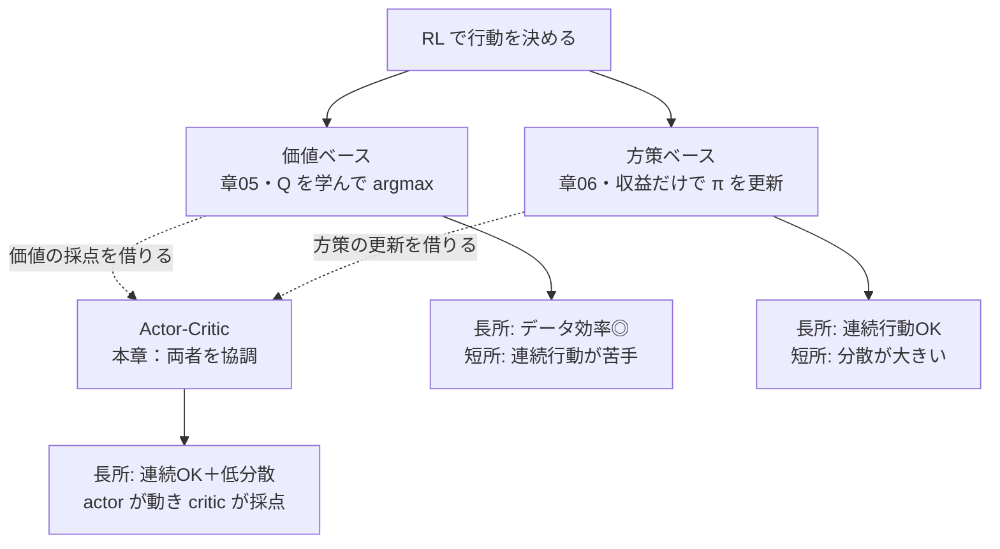
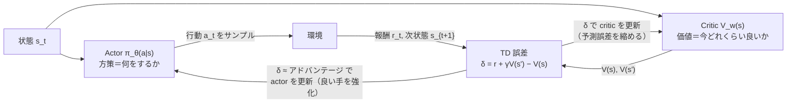
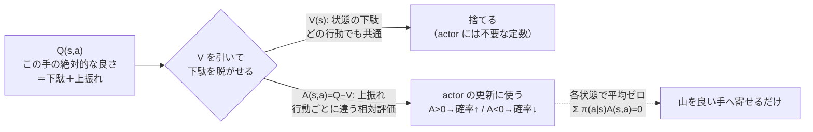
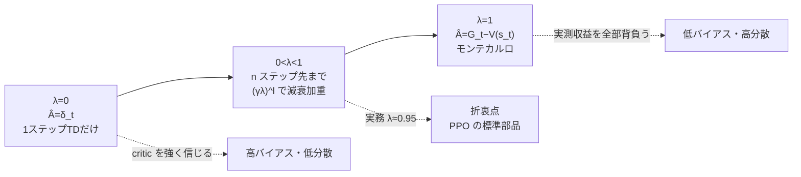
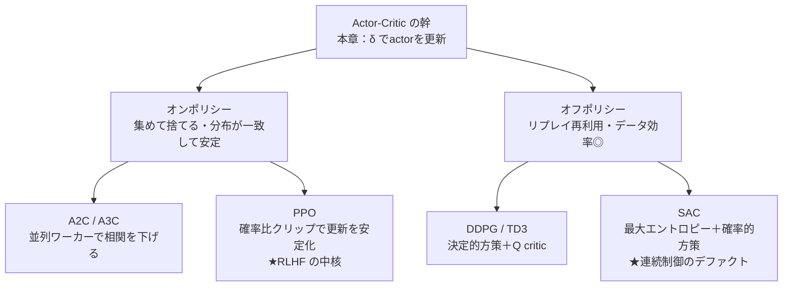
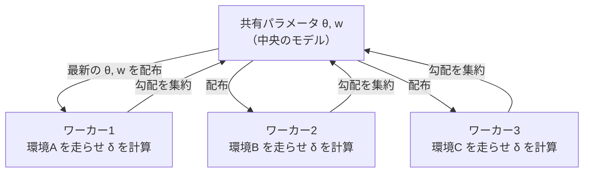
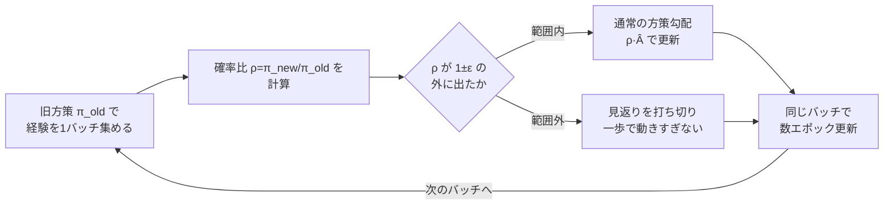

# Actor-Critic — 価値と方策の協調

:::abstract[学習目標]
この章を読み終えると、次のことができるようになります。

- Actor-Critic が **方策勾配（actor）** と **価値関数（critic）** をどう協調させるかを、それぞれの入力・出力・更新タイミングまで分けて説明できる
- **アドバンテージ** $A^\pi(s,a)=Q^\pi(s,a)-V^\pi(s)$ がなぜ方策勾配の **分散を下げる**のかを、ベースラインの不偏性から導出できる
- critic を **TD ブートストラップ**で更新する式と、actor を **advantage 付き方策勾配**で更新する式を書き下せる
- **A2C / A3C** がどこを並列化し、**GAE** が λ で何を調整するかを述べられる
- 現代手法 **PPO（RLHF の主役）** と **SAC（連続制御のデファクト）** が Actor-Critic のどの枝にあたるかを位置づけられる
- numpy だけで softmax actor + 線形 critic の Actor-Critic を実装し、収益が上がることを確かめられる
:::

## 前提知識

- 章06 [方策勾配法](/reinforcement-learning/06-policy-gradient/)：方策勾配定理 $\nabla_\theta J = \mathbb{E}[\nabla_\theta \log \pi_\theta(a\mid s)\,G_t]$、対数微分（尤度比）トリック、REINFORCE、ベースラインによる分散低減
- 章03 [モデルフリー予測](/reinforcement-learning/03-model-free-prediction/)：モンテカルロ収益 $G_t$ と **TD 誤差** $\delta_t = r_t + \gamma V(s_{t+1}) - V(s_t)$、ブートストラップ
- 章05 [関数近似と DQN](/reinforcement-learning/05-function-approximation-dqn/)：価値関数をパラメータで近似する発想（本章の critic はその最小形）
- 割引累積報酬 $G_t = \sum_{k\ge 0}\gamma^k r_{t+k+1}$、状態価値 $V^\pi$、行動価値 $Q^\pi$ の定義

LLM 出身の読者なら、actor は「方策＝確率的トークン生成器」、critic は「各状態の良し悪しを採点する value head」と読み替えると橋が架かります。RLHF の PPO は本章の Actor-Critic そのものです。

## 直感

章06 の REINFORCE には、ひとつの実用上の弱点がありました。**方策勾配の分散が大きすぎる**ことです。

REINFORCE は、ある行動 $a_t$ を「良かったか悪かったか」で評価するのに、**エピソード終端まで待って実際の収益 $G_t$** を測ります。ところが $G_t$ は、その後に起きた全ての偶然（次の行動選択、環境の確率的遷移）を丸ごと含むので、同じ $(s_t, a_t)$ でも試行ごとに大きくばらつきます。結果、勾配の向きはおおむね正しくても、推定がノイズだらけで学習が遅く不安定になります。

そこで2つのアイデアを足します。

1. **「平均的にどれくらい良いか（基準値）」を引く。** その状態の平均的な価値 $V(s_t)$ を引き、「平均より上振れしたか下振れしたか」＝**アドバンテージ** $A_t = G_t - V(s_t)$ で評価する。これなら良し悪しの**相対**だけが残り、ばらつきが激減します。
2. **終端まで待たず、すぐ評価する。** その $V$ を別のネットワーク（**critic**）に推定させ、1 ステップ先の TD 誤差で「今の一手が予想を上回ったか」を**毎ステップ**測る。終端を待たなくてよくなります。

この「**方策（actor）が動き、価値（critic）が採点する**」協調が Actor-Critic です。actor は「何をするか」、critic は「今いる状況・選んだ手はどれくらい良いか」を担当し、critic の採点（アドバンテージ）で actor を更新します。価値ベース（章05）と方策ベース（章06）を統合した、現代 RL の主流アーキです。

3 系譜の関係を 1 枚で見ると、Actor-Critic は両者の「いいとこ取り」の位置にいます。



価値ベースは「Q を学んで一番良い手を選ぶ」（章05 の DQN）。方策ベースは「価値を介さず収益だけで方策を直接更新する」（章06 の REINFORCE）。Actor-Critic は、方策を直接更新する骨格（方策ベース）に、価値の採点（価値ベース）を組み込んだ第三の道です。これにより、方策ベースの「連続行動を扱える」長所を保ったまま、その弱点だった「分散の大きさ」を価値の採点で抑えます。

## 全体像

Actor-Critic は、章06 の方策勾配の「重み」を、実測収益 $G_t$ から **critic が推定するアドバンテージ** に差し替えたものです。actor と critic が**同じ経験**を見て、互いに別の量を更新します。



順方向（実行＝行動を出す）と逆方向（学習＝両者を更新）を一望すると、こうなります。

| | 順方向（推論・実行時） | 逆方向（学習時） |
| --- | --- | --- |
| Actor $\pi_\theta$ | $s_t$ から行動 $a_t$ をサンプル | $\delta_t$（アドバンテージ）で $\nabla_\theta \log\pi$ を重み付け更新 |
| Critic $V_w$ | $V_w(s_t)$ を出力（採点） | TD 誤差 $\delta_t$ を縮めるよう回帰更新 |
| 共有する量 | 観測した $(s_t, a_t, r_t, s_{t+1})$ | **同じ $\delta_t$** が両者の更新に使われる |

:::note[ひとつの $\delta_t$ が二役をこなす]
TD 誤差 $\delta_t = r_t + \gamma V(s_{t+1}) - V(s_t)$ が要です。**critic にとっては**「予測 $V(s_t)$ が外れた量＝縮めるべき回帰の誤差」。**actor にとっては**「実際にやってみたら予想よりどれだけ良かったか＝アドバンテージの 1 ステップ推定」。同じ 1 つの数が、価値の修正と方策の改善という別々の仕事に使い回されます。
:::

:::note[LLM ↔ RL]
RLHF の PPO は文字どおりこの図です。actor＝学習中の LLM（方策）、critic＝各トークン位置の価値を出す value head。報酬モデルが報酬 $r$ を与え、アドバンテージ（GAE）で actor を更新します。本章の softmax actor + 線形 critic は、その骨格を最小化したものです。
:::

解き方は2つに分かれます。**critic で何を推定し、actor の重みに何を使うか**。本章はまず最も基本の「1 ステップ TD アドバンテージ」を組み、次にそれを λ で一般化する **GAE**、並列化する **A2C/A3C**、更新を安定化する **PPO**、エントロピーを足す **SAC** へと降りていきます。

## 理論

### actor と critic：2つの別物を区別する

Actor-Critic には**役割の異なる 2 つのパラメータ集合**があります。混同が最大のつまずきどころなので、入力・出力・依存先を分けて押さえます。

:::warning[actor と critic は別物（ここが肝）]
| | Actor $\pi_\theta(a\mid s)$ | Critic $V_w(s)$ |
| --- | --- | --- |
| 何を表す | **方策**：状態 $s$ での行動の確率分布 | **価値**：状態 $s$ から先に期待される割引収益 |
| パラメータ | $\theta$（方策パラメータ） | $w$（価値パラメータ）。**$\theta$ とは別** |
| 出力 | 行動 $a$ 上の分布（離散なら softmax、連続なら $\mathcal{N}$ の平均・分散） | スカラー $V_w(s) \in \mathbb{R}$ |
| 更新の重み | アドバンテージ $A_t$（critic 由来） | 自分の予測誤差 $\delta_t$ |
| 目的 | **収益を最大化**（勾配上昇） | **予測誤差を最小化**（回帰・勾配降下） |
| 役割 | 「何をするか」を決める | 「今どれくらい良いか」を採点する |

actor は収益を**最大化**、critic は誤差を**最小化** —— 向きが逆の 2 つの最適化を同時に回します。両者は別パラメータですが、入力の特徴抽出層を**共有**する実装（shared backbone）も一般的です（A2C など）。
:::

critic が出すのは**スカラーの価値**であって、行動を選ぶわけではありません。行動を選ぶのは常に actor です。critic は「採点係」に徹し、actor は採点を頼りに自分を改善します。この分業が、価値ベース（Q を学んで argmax で行動）とも方策ベース（価値を使わず収益だけで更新）とも違う、Actor-Critic の本質です。

### なぜアドバンテージか：状態価値という「下駄」を脱がせる

REINFORCE の勾配（章06）は $\mathbb{E}[\nabla_\theta \log\pi_\theta(a_t\mid s_t)\,G_t]$ でした。ここで $G_t$ をそのまま使うと、**状態そのものの良し悪し**が混入します。

例で考えます。ゴール直前の良い状態では、どの行動を選んでも $G_t$ は大きい（例 $+0.9$）。出発点の悪い状態では、どの行動を選んでも $G_t$ は小さい（例 $+0.1$）。すると勾配は「良い状態で取った行動を一律に強化、悪い状態で取った行動を一律に抑制」してしまい、**同じ状態内でどの行動が相対的に良かったか**という肝心の信号が、状態ごとの「下駄（オフセット）」に埋もれます。

そこで各状態の**平均的な価値 $V(s_t)$ を引いて下駄を脱がせます**。残るのが

$$
A^\pi(s,a) = Q^\pi(s,a) - V^\pi(s)
$$

アドバンテージ（advantage）です。$Q^\pi(s,a)$ は「状態 $s$ で行動 $a$ を取り、以後 $\pi$ に従ったときの期待収益」、$V^\pi(s)=\sum_a \pi(a\mid s)Q^\pi(s,a)$ は「その状態で $\pi$ に従ったときの期待収益＝行動を平均したもの」。差を取ると「**その状態の平均と比べて、行動 $a$ がどれだけ得か**」だけが残ります。定義から $\sum_a \pi(a\mid s)A^\pi(s,a)=0$ —— アドバンテージは各状態で平均ゼロです。これが下駄を脱がせる正体です。

行動価値 $Q$ を「状態の下駄 $V$」と「行動の上振れ $A$」に分解する図にすると、何を引いて何を残すかが一目で分かります。



下駄 $V(s)$ は「その状態にいる時点でどの行動を選んでも共通に乗る価値」なので、actor が**行動を選び分ける**際には邪魔な定数です。これを引いて、行動ごとに違う上振れ $A(s,a)$ だけを残す —— actor はこの相対評価だけを見て、各状態の中で確率の山を良い手へ寄せます。状態間の絶対的な良し悪し（下駄の大小）は critic の仕事として切り離せるのが、この分解の効きどころです。

:::warning[アドバンテージの符号は「相対」であって「絶対の良し悪し」ではない]
$A(s,a)<0$ は「その行動が悪い」ではなく「**その状態の平均より下**」という意味です。全行動が良い状態でも、相対的に劣る行動の $A$ は負になります。actor は $A>0$ の行動の確率を上げ、$A<0$ の行動を下げる —— 各状態内で**確率の山を良い手へ寄せる**だけで、状態間の絶対的な価値は critic 側に任せます。
:::

### critic の更新：TD ブートストラップ

critic $V_w(s)$ は、章03 の TD 学習でそのまま更新します。理想は真の $V^\pi$ ですが、それは未知なので、**ベルマン期待方程式の右辺で自分自身を教師にします（ブートストラップ）**。

$$
V^\pi(s_t) = \mathbb{E}\!\left[r_t + \gamma V^\pi(s_{t+1})\right]
$$

1 サンプルでこの右辺を近似した $r_t + \gamma V_w(s_{t+1})$ を**目標値**とし、現在の予測 $V_w(s_t)$ との差を縮めます。差が TD 誤差です。

$$
\delta_t = r_t + \gamma V_w(s_{t+1}) - V_w(s_t)
$$

critic は二乗誤差 $\tfrac{1}{2}\delta_t^2$ を最小化する向きに動きます。線形 critic $V_w(s)=w^\top \phi(s)$（$\phi$ は状態特徴）なら勾配は $\delta_t \phi(s_t)$ なので、

$$
w \leftarrow w + \alpha_w\, \delta_t\, \phi(s_t)
$$

:::warning[目標値の $V_w(s_{t+1})$ は「動かさない定数」とみなす]
$\delta_t$ には $V_w(s_{t+1})$ が入りますが、勾配を取るときこれは**目標（教師）側なので微分しません**（semi-gradient TD）。微分するのは予測側 $V_w(s_t)$ だけ。深層版では目標を別ネットワーク（target network、章05）に固定するのが、この「動かさない」を徹底する装置です。両方を微分すると目標が自分を追って逃げ、学習が不安定になります。
:::

### actor の更新：1 ステップ TD アドバンテージ

actor は方策勾配で更新しますが、重みに $G_t$ ではなく**アドバンテージ**を使います。問題は $A^\pi(s,a)=Q^\pi-V^\pi$ の $Q^\pi$ をどう得るかです。critic は $V$ しか持っていません。

ここで**同じ TD 誤差 $\delta_t$ が、アドバンテージの不偏推定になっている**という事実を使います（導出は次節）。直感的には、$r_t + \gamma V(s_{t+1})$ が「行動 $a_t$ を取った後の $Q(s_t,a_t)$ の 1 サンプル推定」、$V(s_t)$ がその状態の平均価値なので、差 $\delta_t \approx Q(s_t,a_t) - V(s_t) = A(s_t,a_t)$ です。よって actor は

$$
\theta \leftarrow \theta + \alpha_\theta\, \delta_t\, \nabla_\theta \log \pi_\theta(a_t\mid s_t)
$$

これで critic を 1 つ持つだけで、actor の分散低減アドバンテージが手に入ります。critic が $V$ だけで済む（$Q$ を行動の数だけ持たなくてよい）のが、この設計の効率の良さです。

### 学習時 vs 実行時

| | 学習時 | 実行（推論）時 |
| --- | --- | --- |
| Actor | 確率的にサンプル（探索のため）、$\delta_t$ で更新 | $\arg\max_a \pi(a\mid s)$ または分布のまま使う。更新しない |
| Critic | TD 誤差で更新 | **不要（捨ててよい）**。価値の採点は学習のためだけ |
| 必要な情報 | $(s_t,a_t,r_t,s_{t+1})$ の系列 | 状態 $s$ のみ |

:::warning[critic は推論時に要らない]
critic は actor を**訓練するための足場**です。学習が終われば、行動を決めるのは actor だけ。RLHF でも、デプロイされる LLM に value head は付いていません。「critic がないと行動できない」は誤解です。critic 無しで行動はできますが、critic 無しだと**学習が遅く不安定**になる、が正しい理解です。
:::

### オンポリシー：集めて捨てる

ここまでの Actor-Critic（A2C/A3C 系）は**オンポリシー**です。$\delta_t$ と方策勾配は「**今の方策 $\pi_\theta$ が生成した経験**」でしか正しくありません。$\theta$ を更新したら過去の経験は分布がずれて使えなくなる（捨てる）ので、データ効率は劣ります。代わりに分布が一致するぶん安定です。

この「集めて捨てる」を緩めて過去データを再利用する（リプレイバッファ）のがオフポリシー Actor-Critic（DDPG/TD3/SAC、後述）で、データ効率と引き換えに分布シフト対策が要ります。この対比は章03〜05 の on/off-policy 軸の続きです。

## 数式の導出

### アドバンテージはベースラインを引いても勾配を変えない

なぜ $G_t$ から $V(s_t)$ を引いてよいのか —— 引いても方策勾配の**期待値（向き）は変わらず、分散だけ下がる**ことを示します。

章06 の方策勾配定理から出発します。

$$
\nabla_\theta J(\theta) = \mathbb{E}_{\pi_\theta}\!\left[\nabla_\theta \log \pi_\theta(a_t\mid s_t)\, G_t\right]
$$

ここで、行動に依存しない任意の関数 $b(s_t)$（**ベースライン**）を引いた項の期待値がゼロであることを示します。状態 $s_t$ を固定し、行動についての期待を取ります。

$$
\mathbb{E}_{a_t\sim\pi}\!\left[\nabla_\theta \log \pi_\theta(a_t\mid s_t)\, b(s_t)\right]
= b(s_t)\sum_{a} \pi_\theta(a\mid s_t)\,\nabla_\theta \log \pi_\theta(a\mid s_t)
$$

$b(s_t)$ は行動に依らないので和の外に出しました。ここで対数微分の恒等式 $\pi\,\nabla\log\pi = \nabla\pi$ を使います。

$$
= b(s_t)\sum_{a} \nabla_\theta \pi_\theta(a\mid s_t)
= b(s_t)\,\nabla_\theta \underbrace{\sum_{a} \pi_\theta(a\mid s_t)}_{=\,1}
= b(s_t)\,\nabla_\theta 1 = 0
$$

確率の総和は恒等的に 1 なので、その勾配はゼロです。したがって任意のベースライン $b(s_t)$ について

$$
\nabla_\theta J(\theta) = \mathbb{E}\!\left[\nabla_\theta \log \pi_\theta(a_t\mid s_t)\,\big(G_t - b(s_t)\big)\right]
$$

が成り立ちます。**期待値（＝真の勾配）は不変**です。$b(s_t)=V^\pi(s_t)$ と選べば $G_t - V^\pi(s_t)$ がアドバンテージの推定になり、状態ごとの「下駄」を引いたぶん**分散が下がります**（最適なベースラインは厳密には $V$ そのものではありませんが、$V$ は実用上ほぼ最適で計算しやすい）。$\blacksquare$

### TD 誤差はアドバンテージの不偏推定

次に、critic で $G_t$ も置き換える——**1 ステップ TD 誤差 $\delta_t$ がアドバンテージ $A^\pi(s_t,a_t)$ の不偏推定**であることを示します。真の $V^\pi$ を使った $\delta_t$ の期待を、行動 $a_t$ を固定して環境の遷移について取ります。

$$
\mathbb{E}\!\left[\delta_t \mid s_t, a_t\right]
= \mathbb{E}\!\left[r_t + \gamma V^\pi(s_{t+1}) - V^\pi(s_t)\mid s_t,a_t\right]
$$

$V^\pi(s_t)$ は $s_t$ で決まる定数なので外に出ます。残りは $Q^\pi$ の定義そのものです。

$$
= \underbrace{\mathbb{E}\!\left[r_t + \gamma V^\pi(s_{t+1})\mid s_t,a_t\right]}_{=\,Q^\pi(s_t,a_t)} - V^\pi(s_t)
= Q^\pi(s_t,a_t) - V^\pi(s_t) = A^\pi(s_t,a_t)
$$

よって $\mathbb{E}[\delta_t\mid s_t,a_t] = A^\pi(s_t,a_t)$。critic が真の $V^\pi$ なら $\delta_t$ はアドバンテージの**不偏**推定です（実際の critic $V_w$ は近似なので少しバイアスが入りますが、終端まで待つ $G_t$ よりはるかに低分散）。これで actor 更新

$$
\nabla_\theta J(\theta) \approx \mathbb{E}\!\left[\nabla_\theta \log \pi_\theta(a_t\mid s_t)\,\delta_t\right]
$$

が正当化されます。$\blacksquare$

### GAE：バイアスと分散を λ で連続的に混ぜる

1 ステップ TD（$\delta_t$）は**低分散だが高バイアス**（critic の誤差を 1 ステップで信じる）、モンテカルロ収益（$G_t$）は**高分散だが低バイアス**（実測だが終端の偶然を全部背負う）。この両極端を $\lambda \in [0,1]$ で連続的に補間するのが **GAE (Generalized Advantage Estimation)** です。

$n$ ステップ TD 誤差を考え、それを指数重み $(\gamma\lambda)^l$ で足し合わせます。

$$
\hat{A}_t^{\mathrm{GAE}(\gamma,\lambda)} = \sum_{l=0}^{\infty}(\gamma\lambda)^l\,\delta_{t+l},\qquad
\delta_t = r_t + \gamma V(s_{t+1}) - V(s_t)
$$

- $\lambda = 0$：$\hat{A}_t = \delta_t$（1 ステップ TD。低分散・高バイアス）
- $\lambda = 1$：$\hat{A}_t = \sum_l \gamma^l \delta_{t+l} = G_t - V(s_t)$（モンテカルロ。高分散・低バイアス）

$\lambda$ を 0 から 1 へ動かすと、何ステップ先まで実測 $\delta$ を信じるかが連続的に変わり、バイアスと分散がシーソーのように入れ替わります。



左端（$\lambda=0$）は critic の 1 ステップ予測だけを信じるので、critic がまだ下手なうちはバイアスが乗りますが、終端の偶然を背負わないので分散は小さい。右端（$\lambda=1$）は実測収益そのものなのでバイアスは無いが、終端までの全ステップの偶然を背負うので分散が爆発する。途中の $\lambda$（実務では 0.95 前後）が、ちょうど良いバイアス-分散の折衷点になります。GAE は PPO 実装の事実上の標準部品です。$\blacksquare$

## 実装

numpy だけで、**softmax 線形 actor + 線形 critic** の 1 ステップ Actor-Critic を書き、小さなコリドー環境で収益が上がることを実測します。深層は不要 —— 関数近似の最小形（one-hot 特徴の線形モデル）で、収束する様子を数値で見ます。

### トイ環境：1 次元コリドー

状態 $0,\dots,6$ が一列に並び、右端 $6$ がゴール。各状態で「左／右」を選べます。ゴール到達で $+1$、それ以外は 1 ステップごとに $-0.01$（早く着くほど良い）。最適方策は「常に右」で、出発点 $0$ からは 6 歩でゴールします。

```python title="actor_critic.py"
import numpy as np

# ---- 環境: 1次元コリドー ----
N, GOAL, START, GAMMA = 7, 6, 0, 0.99

def step(s, a):
    ns = min(s + 1, N - 1) if a == 1 else max(s - 1, 0)  # a=1:右, a=0:左
    if ns == GOAL:
        return ns, 1.0, True       # ゴールで +1・終端
    return ns, -0.01, False        # それ以外は時間ペナルティ

rng = np.random.default_rng(0)

# actor: softmax 線形方策 θ[s,a]（状態ごとの行動ロジット）
theta = np.zeros((N, 2))
# critic: 線形価値 V(s)=w·onehot(s)（状態ごとの価値）
w = np.zeros(N)
alpha_actor, alpha_critic = 0.1, 0.1

def policy(s):
    z = theta[s] - theta[s].max()  # オーバーフロー回避
    p = np.exp(z)
    return p / p.sum()

def run_episode(learn=True, max_steps=100):
    s, total, steps = START, 0.0, 0
    for _ in range(max_steps):
        p = policy(s)
        a = rng.choice(2, p=p)           # 学習時は探索のため確率サンプル
        ns, r, done = step(s, a)
        total += r; steps += 1
        if learn:
            # 同じ δ を critic と actor の両方に使う（本章の肝）
            delta = r + GAMMA * (0.0 if done else w[ns]) - w[s]
            w[s] += alpha_critic * delta                       # critic: 予測誤差を縮める
            grad = -p; grad[a] += 1.0                          # ∇logπ(a|s)=onehot(a)-p
            theta[s] += alpha_actor * delta * grad             # actor: アドバンテージで強化
        s = ns
        if done:
            break
    return total, steps

returns = []
for ep in range(1, 401):
    g, st = run_episode(learn=True)
    returns.append(g)
    if ep % 50 == 0:
        avg = np.mean(returns[-50:])
        greedy_right = sum(1 for s in range(N - 1) if policy(s)[1] > 0.5)
        print(f"ep {ep:3d} | avg return(last50) {avg:+.3f} | "
              f"右を選ぶ状態数 {greedy_right}/{N-1} | steps {st}")

print("\n学習後の各状態の方策 P(右) と価値 V:")
for s in range(N - 1):
    print(f"  s={s}: P(右)={policy(s)[1]:.3f}  V={w[s]:+.3f}")
```

実行（`uv run --with numpy python actor_critic.py`）すると、次の実測出力が得られます。

```text title="出力"
ep  50 | avg return(last50) +0.846 | 右を選ぶ状態数 6/6 | steps 13
ep 100 | avg return(last50) +0.915 | 右を選ぶ状態数 6/6 | steps 9
ep 150 | avg return(last50) +0.920 | 右を選ぶ状態数 6/6 | steps 8
ep 200 | avg return(last50) +0.919 | 右を選ぶ状態数 6/6 | steps 8
ep 250 | avg return(last50) +0.928 | 右を選ぶ状態数 6/6 | steps 7
ep 300 | avg return(last50) +0.937 | 右を選ぶ状態数 6/6 | steps 9
ep 350 | avg return(last50) +0.936 | 右を選ぶ状態数 6/6 | steps 6
ep 400 | avg return(last50) +0.932 | 右を選ぶ状態数 6/6 | steps 6

学習後の各状態の方策 P(右) と価値 V:
  s=0: P(右)=0.794  V=+0.872
  s=1: P(右)=0.879  V=+0.895
  s=2: P(右)=0.906  V=+0.918
  s=3: P(右)=0.901  V=+0.941
  s=4: P(右)=0.896  V=+0.972
  s=5: P(右)=0.883  V=+0.998
```

読み取れること：

- **収益が上がる**：平均収益が $+0.85 \to +0.93$ へ単調に改善。エピソード長も多ステップから最適の 6 歩付近に縮みます。
- **方策が改善する**：全 6 状態で「右」の確率が 0.5 を超え、正しい方向を学習。
- **critic が筋の通った価値を学ぶ**：ゴールに近い状態ほど $V$ が大きい（$s=0$ の $+0.872 \to s=5$ の $+0.998$）。critic は誰にも「正解の $V$」を教わっていないのに、TD ブートストラップだけでこの単調な勾配を獲得しています。actor の改善と critic の採点が**協調して**収束した証拠です。

### アドバンテージの分散低減を実測する

「アドバンテージは勾配の向きを変えず分散だけ下げる」という導出を、同じ軌跡集合で数値確認します。固定方策のもとでロールアウトし、(A) 生の収益 $G_t$ を重みにした方策勾配推定量と、(B) アドバンテージ $G_t - V(s_t)$ を重みにした推定量の **分散** を比べます。

```python title="advantage_variance.py"
import numpy as np

N, GOAL, START, GAMMA = 7, 6, 0, 0.99
def step(s, a):
    ns = min(s + 1, N - 1) if a == 1 else max(s - 1, 0)
    if ns == GOAL: return ns, 1.0, True
    return ns, -0.01, False

rng = np.random.default_rng(1)
def policy(s):  return np.array([0.3, 0.7])   # 固定の確率的方策

def rollout(s0):
    s, traj = s0, []
    for _ in range(100):
        a = rng.choice(2, p=policy(s))
        ns, r, done = step(s, a); traj.append((s, a, r)); s = ns
        if done: break
    return traj

# 真の V を大量ロールアウトのモンテカルロ平均で推定（正確なベースライン）
V, cnt = np.zeros(N), np.zeros(N)
for _ in range(20000):
    G = 0.0
    for (s, a, r) in reversed(rollout(START)):
        G = r + GAMMA * G; V[s] += G; cnt[s] += 1
V = np.where(cnt > 0, V / np.maximum(cnt, 1), 0.0)

def grad_logpi_right(s, a):  # スカラー化のため a=右 成分のみ
    return (1.0 if a == 1 else 0.0) - policy(s)[1]

est_G, est_A = [], []
for _ in range(4000):
    G, Gs = 0.0, []
    for (s, a, r) in reversed(rollout(START)):
        G = r + GAMMA * G; Gs.append((s, a, G))
    gG = sum(grad_logpi_right(s, a) * G        for (s, a, G) in Gs)
    gA = sum(grad_logpi_right(s, a) * (G - V[s]) for (s, a, G) in Gs)
    est_G.append(gG); est_A.append(gA)

est_G, est_A = np.array(est_G), np.array(est_A)
print(f"baseline なし(G_t)   : mean {est_G.mean():+.4f}  var {est_G.var():.4f}")
print(f"advantage (G_t-V)    : mean {est_A.mean():+.4f}  var {est_A.var():.4f}")
print(f"分散の比 → 約 {est_G.var()/est_A.var():.1f}x 小さい")
```

```text title="出力"
baseline なし(G_t)   : mean +0.1816  var 1.5040
advantage (G_t-V)    : mean +0.1972  var 0.0894
分散の比 → 約 16.8x 小さい
```

**平均（＝勾配の向き）はほぼ一致**（$+0.18$ vs $+0.20$、同符号・同程度）なのに、**分散が約 17 倍小さい**。これが導出した「ベースラインは不偏・分散低減」の数値的な証拠です。アドバンテージを使うだけで、同じ向きの勾配をはるかに少ないノイズで推定できます。

## 現代の主役へ：A2C / A3C・PPO・SAC

ここまでで組んだ「1 ステップ TD アドバンテージで actor を更新する」骨格は、現代手法すべての共通の幹です。実用アルゴリズムは、この幹に **(1) 経験をどう集めるか（並列・on/off-policy）**、**(2) actor の更新をどう安定化するか（クリップ・エントロピー）** という枝を足したものに過ぎません。どれも「actor が動き、critic が採点する」を捨てていません。系譜を 1 枚で押さえます。



幹から見ると、**A2C/A3C はデータ収集を並列化した枝**、**PPO は actor の一歩を踏み外させない安全装置を足した枝**、**SAC は経験を使い回しつつ探索を保つ枝**です。critic（価値の採点）はどの枝でも生きています。

### A2C / A3C：経験の相関を並列で下げる

オンポリシー Actor-Critic（本章）には、ひとつ実用上の弱点があります。**1 本の軌跡から連続して取った経験は時間的に強く相関している**ことです。同じ状態の近くを連続して通るので、勾配の各サンプルが似通い、SGD が前提とする「独立な勾配サンプル」から外れて学習が不安定になります。DQN（章05）はこれをリプレイバッファ（過去のバラバラな経験を混ぜる）で解きましたが、オンポリシーではバッファが使えません。

そこで **複数のワーカーが別々の環境を同時に走らせ、互いに無相関な経験を同時刻に集める**のが A2C / A3C のアイデアです。1 本の軌跡内の相関を、ワーカー間の独立性で薄めます。



A3C（Asynchronous）と A2C（Advantage、同期版）の違いは、この集約のタイミングだけです。

| | A3C（非同期） | A2C（同期） |
| --- | --- | --- |
| 集約タイミング | 各ワーカーが**終わり次第バラバラに**中央へ勾配を送り、即反映 | 全ワーカーが**揃うのを待って**まとめて 1 回更新 |
| ハードウェア相性 | CPU 多コア（待ち合わせ不要） | GPU バッチ（揃えて一括前進が効率的） |
| 再現性 | ワーカーの順序に依存しやすい | 揃えるので**決定的・再現しやすい** |
| 古い勾配問題 | 配布後に θ が動くと**stale な勾配**が混じりうる | 揃えるので stale が出ない |
| 現在の主流 | 歴史的に重要 | **実務はほぼ A2C/PPO**（GPU と相性が良い） |

:::warning[A2C/A3C は新しい損失ではない]
A2C/A3C は本章の actor 更新・critic 更新の式を**何ひとつ変えていません**。変えたのは「経験をどう集めるか」だけ。同じ $\delta_t$ を、1 本の軌跡からではなく複数ワーカーから集めて平均するという**データ収集の工夫**です。アルゴリズムの心臓は本章の 1 ステップ Actor-Critic のままです。
:::

### PPO：actor の一歩を踏み外させない

オンポリシー方策勾配の怖さは、**1 回の更新で方策が大きく動きすぎると、集めた経験がもう今の方策の分布と合わなくなり**、次の勾配が見当違いになって性能が崩落することです（オンポリシーは「今の方策の経験」でしか正しくない、を思い出してください）。学習率を小さくすれば安全ですが遅い。

**PPO (Proximal Policy Optimization)** は、新旧方策の**確率比** $\rho_t(\theta) = \dfrac{\pi_\theta(a_t\mid s_t)}{\pi_{\theta_{\text{old}}}(a_t\mid s_t)}$ を**クリップ**して、一歩で動ける幅に上限を設けます。

$$
L^{\text{CLIP}}(\theta) = \mathbb{E}\!\left[\min\!\big(\rho_t\,\hat{A}_t,\ \mathrm{clip}(\rho_t,\,1-\epsilon,\,1+\epsilon)\,\hat{A}_t\big)\right]
$$

直感はこうです。アドバンテージ $\hat A_t>0$（良い手）なら確率を上げたいが、$\rho_t$ が $1+\epsilon$ を超えたら**それ以上の見返りを打ち切る**（クリップ）ので、actor はその手を一気に強化しすぎません。$\hat A_t<0$（悪い手）なら下げたいが、$1-\epsilon$ より下げる見返りを打ち切る。**min** を取るのは「クリップで得をする方向にだけ甘くならないよう、つねに保守的な側を採用する」ためです。



このクリップのおかげで PPO は **同じバッチを数エポック使い回しても崩れにくく**（純オンポリシーより少しデータ効率が上がる）、ハイパーパラメータに鈍感で安定します。これが PPO が **RLHF の事実上の標準** になった理由です。RLHF では「報酬モデルが報酬を与え、参照方策からの KL を罰し、PPO で LLM を更新」しますが、その核は本章のアドバンテージ付き actor 更新に、このクリップを足しただけです。

### SAC：経験を使い回し、探索を保つ

PPO までは**オンポリシー**（集めて捨てる）でした。**SAC (Soft Actor-Critic)** は**オフポリシー**で、過去の経験をリプレイバッファに溜めて何度も再利用します。連続制御（ロボット）ではサンプル収集が高価なので、このデータ効率が効きます。

SAC のもう一つの肝が**最大エントロピー**です。通常の収益最大化に、方策のエントロピー $\mathcal{H}(\pi(\cdot\mid s))$ を報酬として足します。

$$
J(\pi) = \mathbb{E}\!\left[\sum_t \gamma^t\big(r_t + \alpha\,\mathcal{H}(\pi(\cdot\mid s_t))\big)\right]
$$

これは「**できるだけ高い収益を、できるだけランダムなまま達成せよ**」という目的です。エントロピー項が方策を 1 点に尖らせすぎないよう押し戻すので、**探索が自然に持続**し、局所解に早く嵌まりません。critic は $V$ ではなく $Q$ を 2 つ持つ（過大評価を抑える double-Q、TD3 由来）など本章より部品は増えますが、「actor が動き critic が採点する」骨格は同じです。

### 4 手法を 1 表で位置づける

学習目標の「PPO と SAC が Actor-Critic のどの枝かを位置づける」を、本章の幹からの差分として一覧にします。

| | A2C / A3C | PPO | DDPG / TD3 | SAC |
| --- | --- | --- | --- | --- |
| on / off-policy | on | on | off | off |
| critic が学ぶ量 | $V$ | $V$（GAE 用） | $Q$ | $Q$（double-Q） |
| actor の方策 | 確率的 | 確率的 | 決定的 | 確率的 |
| actor 安定化の工夫 | 並列で相関低減 | **確率比クリップ** | 目標ネット遅延更新 | **最大エントロピー** |
| データ効率 | 低（捨てる） | 中（数エポック再利用） | 高（リプレイ） | 高（リプレイ） |
| 得意領域 | 一般・並列計算 | **離散/連続・RLHF** | 連続制御 | **連続制御・探索が要る課題** |
| 本章からの差分 | データ収集を並列化 | クリップを追加 | $Q$ critic＋決定的 actor | $Q$ critic＋エントロピー |

:::note[LLM ↔ RL]
言語の整合（RLHF）が **PPO**（オンポリシー・確率比クリップ）、身体性の制御が **SAC/TD3**（オフポリシー・最大エントロピー）—— 進む先のモダリティで主役の枝が分かれますが、根はどちらも本章の Actor-Critic です。「次に学ぶこと」で、それぞれの章へ橋を架けます。
:::

## 演習

::::question[演習 1: 同じ $\delta_t$ が actor と critic を別々に更新する]
ある遷移で $V_w(s_t)=0.5$、$V_w(s_{t+1})=0.9$、$r_t=0.0$、$\gamma=0.9$ でした。選んだ行動は $a_t=$「右」で、現在の方策は $\pi(\text{右}\mid s_t)=0.6,\ \pi(\text{左}\mid s_t)=0.4$ です。学習率は $\alpha_w=\alpha_\theta=0.1$。

(a) TD 誤差 $\delta_t$ を求めなさい。(b) critic の価値 $w[s_t]$ はどちら向きにいくつ動きますか。(c) actor は「右」の確率を上げますか下げますか。理由も述べなさい。

:::details[解答]
(a) $\delta_t = r_t + \gamma V_w(s_{t+1}) - V_w(s_t) = 0.0 + 0.9\times 0.9 - 0.5 = 0.81 - 0.5 = \mathbf{0.31}$。予想 $0.5$ より実際は良かった（次状態の価値が高い）という上振れです。

(b) critic は $w[s_t] \leftarrow w[s_t] + \alpha_w\,\delta_t = 0.5 + 0.1\times 0.31 = \mathbf{0.531}$。予測が低すぎたので**上に**動きます（目標 $0.81$ に近づく向き）。

(c) **上げます**。$\delta_t=0.31>0$ はアドバンテージが正（その状態の平均より良い手だった）を意味します。actor 更新 $\theta \leftarrow \theta + \alpha_\theta\,\delta_t\,\nabla\log\pi$ は、$\delta_t>0$ のとき選んだ行動「右」の確率を上げる向きに働きます（$\nabla\log\pi(\text{右})=\text{onehot}(\text{右})-p=(−0.6,+0.4)$ の右成分が正）。同じ $\delta_t$ が、critic の価値を上方修正しつつ actor に「右」を強化させています。
:::
::::

::::question[演習 2: GAE の両端と分散低減の意味]
GAE のアドバンテージ $\hat{A}_t^{\mathrm{GAE}(\gamma,\lambda)} = \sum_{l\ge 0}(\gamma\lambda)^l \delta_{t+l}$ について。

(a) $\lambda=0$ と $\lambda=1$ で $\hat{A}_t$ はそれぞれ何になりますか。(b) それぞれのバイアスと分散の傾向を述べなさい。(c) 本章の実装で「右」の重みに $G_t$ ではなくアドバンテージを使うと分散が約 17 倍下がりました。なぜ分散が下がるのに、学習が間違った方向に行かないのですか。

:::details[解答]
(a) $\lambda=0$ では第 0 項だけ残り $\hat{A}_t=\delta_t$（**1 ステップ TD**）。$\lambda=1$ では $\hat{A}_t=\sum_l \gamma^l \delta_{t+l}$ で、TD 誤差の telescoping により $=G_t - V(s_t)$（**モンテカルロ**アドバンテージ）。

(b) $\lambda=0$（TD）は critic の予測を 1 ステップで信じるので**低分散・高バイアス**。$\lambda=1$（MC）は実測収益を使うので**低バイアス・高分散**（終端までの偶然を全部背負う）。$\lambda$ を 0〜1 で動かすと両者を連続に補間でき、実務では 0.95 前後が好まれます。

(c) ベースライン $V(s_t)$ は**行動 $a_t$ に依存しない**（状態だけの関数）からです。数式の導出で示したとおり、行動に依存しないベースラインを引いても方策勾配の**期待値はゼロ寄与＝不変**で、減るのは状態ごとの「下駄」が生む余計なばらつき（分散）だけ。だから向きは保たれたまま、推定がきれいになります。実測の「平均は一致・分散だけ 17 倍減」が、まさにこの不偏性と分散低減の現れです。
:::
::::

## まとめ

:::success[この章の要点]
- Actor-Critic は **方策（actor $\pi_\theta$）** と **価値（critic $V_w$）** を同時に学ぶ。actor は「何をするか」を決めて収益を**最大化**、critic は「今どれくらい良いか」を採点して予測誤差を**最小化**。別パラメータの 2 つの最適化を協調させる。
- 鍵は **アドバンテージ** $A^\pi(s,a)=Q^\pi(s,a)-V^\pi(s)$。状態ごとの「下駄」$V$ を引いて行動の**相対**評価だけを残し、方策勾配の分散を下げる。ベースライン $V(s)$ は行動に依らないので**勾配の向きは不変**（不偏）。
- **1 つの TD 誤差** $\delta_t=r_t+\gamma V(s_{t+1})-V(s_t)$ が二役。critic にとっては縮めるべき回帰誤差、actor にとってはアドバンテージの不偏推定。critic は semi-gradient（目標は微分しない）で更新。
- **GAE** は $\lambda$ で TD（低分散・高バイアス）と MC（高分散・低バイアス）を連続補間。**A2C/A3C** は複数ワーカーの並列で経験の相関を下げて安定化（A3C 非同期 / A2C 同期）。
- 現代の主役へ直結：**PPO**（確率比クリップで更新を安定化、RLHF の中核）と **SAC**（最大エントロピーのオフポリシー、連続制御のデファクト）はどちらも Actor-Critic の枝。
- 実測：softmax actor + 線形 critic が収益 $+0.85\to+0.93$ へ改善し、critic はゴールに向かって単調増加する価値を獲得。アドバンテージで勾配の分散は約 17 倍縮小（向きは不変）。
:::

### 次に学ぶこと

これで強化学習の基礎が一通り揃いました —— MDP（章01）、動的計画法（章02）、モデルフリーの予測（章03）と制御（章04）、関数近似と DQN（章05）、方策勾配（章06）、そして本章の Actor-Critic。価値ベース・方策ベース・Actor-Critic という3系譜と、それを安定化・効率化する道具（アドバンテージ・GAE・クリップ・エントロピー）が手に入りました。

ここから先は、この共通言語が**各モダリティでどう現れるか**です。

- 🔤 **言語**：本章の Actor-Critic（PPO）が、人間の選好で LLM を整える **RLHF** の主役になります。報酬モデルが報酬を与え、KL 正則化で参照方策から離れすぎないよう抑える —— その骨格は本章そのものです。→ [LLM の適応と RLHF](/llm/05-adaptation-rlhf/)
- 🦾 **身体性**：連続行動の制御（ロボットの歩行・器用操作）は **SAC/TD3** が定番。本章のオンポリシー Actor-Critic を、オフポリシー・最大エントロピーへ拡張した先にあります。→ [身体性 AI](/physical-ai/)

現代の RL は、PPO → DPO → RLVR/GRPO（推論 LLM）という整合手法の進化と、SAC/TD3・世界モデルによる制御の高度化が二大潮流です。どちらも本章の actor と critic の協調が出発点です。

→ [強化学習ロードマップに戻る](/reinforcement-learning/)

## 用語ミニ辞典

| 用語 | 一言 |
| --- | --- |
| actor | 方策 $\pi_\theta(a\mid s)$。何をするかを決める側 |
| critic | 価値 $V_w(s)$。今どれくらい良いかを採点する側 |
| advantage $A(s,a)$ | $Q(s,a)-V(s)$。その状態の平均と比べた行動の得（相対評価） |
| TD 誤差 $\delta_t$ | $r+\gamma V(s')-V(s)$。critic の回帰誤差かつ actor のアドバンテージ推定 |
| baseline | 方策勾配から引く行動非依存の関数。$V(s)$ が定番。分散を下げ向きは変えない |
| semi-gradient | TD 更新で目標 $V(s')$ を定数扱いし微分しないこと |
| GAE | TD と MC を $\lambda$ で補間するアドバンテージ推定。PPO の標準部品 |
| A2C / A3C | 並列ワーカーの Advantage Actor-Critic（同期 / 非同期） |
| on-policy | 今の方策で集めた経験のみ使い、更新後は捨てる（A2C/PPO） |
| PPO | 確率比クリップで更新を安定化する on-policy 法。RLHF の中核 |
| SAC | 最大エントロピーの off-policy Actor-Critic。連続制御のデファクト |

## 次のアクション

理論を手で定着させる。**最小の写経 → 動かす → 小実験** を1セットで。

1. 上の `actor_critic.py` を写経して動かし、出力の「収益が上がる・全状態で右を選ぶ・$V$ がゴールへ単調増加」を自分の目で確認する。
2. `alpha_actor` / `alpha_critic` を変えて挙動を観察する。critic の学習率を 0 に固定（critic を凍結）すると、アドバンテージがでたらめになり学習が崩れる（または遅くなる）ことを確かめる —— critic の役割を体感する実験です。
3. 余力があれば critic の更新を **1 ステップ TD から $n$ ステップ（または GAE）** に拡張し、$\lambda$ を 0→1 と動かして学習速度・安定性がどう変わるかを測る。$\lambda=1$（実質モンテカルロ）でばらつきが増えるのを観察する。

ここまでで Actor-Critic の骨格が手に入ります。次は各モダリティへ —— 言語の [RLHF](/llm/05-adaptation-rlhf/)（PPO が主役）と、身体性の [制御](/physical-ai/)（SAC/TD3）へ進みます。

## 参考文献

1. R. S. Sutton, D. McAllester, S. Singh, Y. Mansour, "Policy Gradient Methods for Reinforcement Learning with Function Approximation," *NeurIPS*, 2000.（方策勾配定理・Actor-Critic の理論的基礎）
2. V. Konda, J. Tsitsiklis, "Actor-Critic Algorithms," *NeurIPS*, 2000.（Actor-Critic の収束解析）
3. V. Mnih et al., "Asynchronous Methods for Deep Reinforcement Learning," *ICML*, 2016.（A3C / A2C）
4. J. Schulman, P. Moritz, S. Levine, M. Jordan, P. Abbeel, "High-Dimensional Continuous Control Using Generalized Advantage Estimation," *ICLR*, 2016.（GAE）
5. J. Schulman, F. Wolski, P. Dhariwal, A. Radford, O. Klimov, "Proximal Policy Optimization Algorithms," arXiv:1707.06347, 2017.（PPO）
6. T. Haarnoja, A. Zhou, P. Abbeel, S. Levine, "Soft Actor-Critic: Off-Policy Maximum Entropy Deep Reinforcement Learning with a Stochastic Actor," *ICML*, 2018.（SAC）
7. L. Ouyang et al., "Training Language Models to Follow Instructions with Human Feedback," *NeurIPS*, 2022.（InstructGPT / RLHF。Actor-Critic = PPO の LLM 応用）
8. R. S. Sutton, A. G. Barto, *Reinforcement Learning: An Introduction*, 2nd ed., MIT Press, 2018.（定番教科書。13 章が方策勾配・Actor-Critic）
