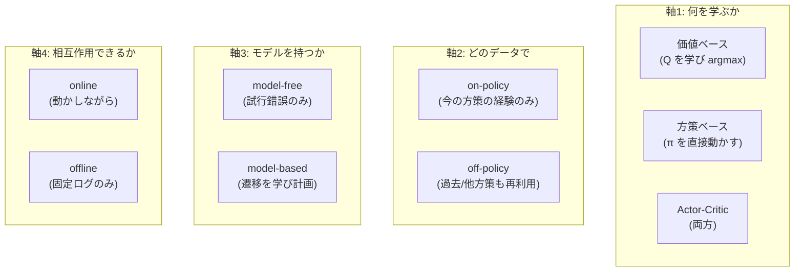
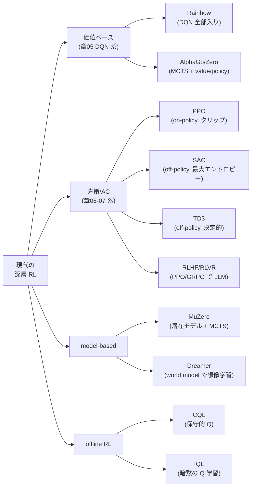

# 現代の深層強化学習 — アルゴリズムの地図・応用・研究トレンド

:::abstract[学習目標]
この章を読み終えると、次のことができるようになります。

- 現代の深層 RL を **4つの分類軸**（価値ベース/方策ベース/Actor-Critic、on/off-policy、model-free/based、online/offline）で **整理** できる
- **PPO**（クリップ目的）・**SAC**（最大エントロピー）・**TD3**・**Rainbow**・**MuZero/Dreamer**（モデルベース）・**AlphaGo/Zero/Star**・**offline RL**（CQL/IQL）が、それぞれ「**何を直したか**」を1-2行で **言える**
- 各代表手法を分類軸の座標として **打ち**、なぜその設計を選んだか（探索・分散・安定性・データ効率のどれを買ったか）を **説明** できる
- 応用（ゲーム / ロボット制御 / LLM の RLHF / 科学）と、横断接続（[/llm/05-adaptation-rlhf/](/llm/05-adaptation-rlhf/)・[/physical-ai/](/physical-ai/)）を **対応づけ** られる
- 代表研究を **時系列に並べ**、2024-2026 の主要トレンド（offline RL・model-based・RLHF→RLVR・基盤モデル化）を **列挙** し、なぜその方向へ進んだかを **説明** できる
- PPO のクリップ目的の最小トイを numpy で動かし、**良い行動と悪い行動でクリップが非対称に効く** ことを **数値で確認** できる
:::

## 前提知識

- 章06 [方策勾配法](/reinforcement-learning/06-policy-gradient/)：方策勾配定理 $\nabla_\theta J=\mathbb{E}[\nabla_\theta\log\pi_\theta(a\mid s)\,G_t]$、対数微分（尤度比）トリック、REINFORCE、ベースラインによる分散低減。**PPO のクリップ目的はこの方策勾配の "重み付け" を作り替えたもの** です。
- 章07 [Actor-Critic](/reinforcement-learning/07-actor-critic/)：actor（方策 $\pi_\theta$）と critic（価値 $V_w$）の協調、**アドバンテージ** $A^\pi(s,a)=Q^\pi(s,a)-V^\pi(s)$、TD 誤差 $\delta_t=r_t+\gamma V(s_{t+1})-V(s_t)$、GAE、A2C/A3C。本章の PPO・SAC・TD3 はすべてこの枝です。
- 章05 [関数近似と DQN](/reinforcement-learning/05-function-approximation-dqn/)：価値関数をニューラルネットで近似する発想、experience replay、target network。Rainbow はこの DQN の改良の束です。
- 章01-04（MDP・動的計画法・モデルフリー予測/制御）：状態 $s$・行動 $a$・報酬 $r$・割引率 $\gamma$、$Q$ 学習と SARSA、on-policy / off-policy の区別。

LLM 出身の読者へ：本章は **「方策勾配（章06）と Actor-Critic（章07）の上に、現代 RL の主役たちがどう積み上がったか」の地図** です。とくに PPO は、人間の選好で LLM を整える RLHF の中核そのもの（[/llm/05-adaptation-rlhf/](/llm/05-adaptation-rlhf/)）。この地図を持つと、新しい論文が出ても「これは off-policy×最大エントロピーの SAC 系だな」「これは model-based の Dreamer 系か」と即座に座標を打てます。

## 直感

章01-07 で、RL の **基礎の語彙**（MDP・価値・方策・TD・方策勾配・Actor-Critic）が手に入りました。でもそこから先 —— 実際に Atari を超人級でプレイし、囲碁で世界王者を破り、ロボットを歩かせ、ChatGPT を整えた **現代の深層 RL** —— は、論文の洪水です。PPO・SAC・TD3・Rainbow・MuZero・Dreamer・AlphaZero・CQL・IQL… 名前だけで溺れます。

この章の役割は1つ —— **現代の深層 RL を、少数の軸で切って地図にする** ことです。地図があれば、どの手法も「基礎章のどの量を、どんな問題を解くために、どう作り替えたか」として読めます。実は、ほとんどの現代手法は **基礎章の素朴なアルゴリズムが持つ "病" を1つずつ治療した結果** です。

| 基礎章の病 | それを治した現代手法 |
| --- | --- |
| 方策勾配の更新が大きすぎて壊れる（章06） | **PPO**（更新幅をクリップで制限） |
| Q 学習が価値を過大評価する（章05） | **TD3**（2つの Q の小さい方を使う） |
| 決定的方策は探索が下手 | **SAC**（エントロピー報酬で探索を促す） |
| DQN は単体だと不安定・非効率（章05） | **Rainbow**（6つの改良を全部入り） |
| model-free はサンプルを大量に食う | **MuZero/Dreamer**（環境モデルを学んで頭の中で計画） |
| online は実環境との相互作用が必須 | **offline RL**（過去ログだけで学ぶ・CQL/IQL） |

だから「何を直したか」を軸に読むのが、この地図のいちばん速い歩き方です。鍵になる問いは4つだけです。

1. **何を学ぶか** —— 価値（$Q$）か、方策（$\pi$）か、両方（Actor-Critic）か。
2. **どのデータで学ぶか** —— 今の方策で集めた経験だけ（on-policy）か、過去・他方策の経験も使う（off-policy）か。
3. **環境モデルを持つか** —— 試行錯誤だけ（model-free）か、遷移 $P(s'\mid s,a)$ を学んで計画する（model-based）か。
4. **環境と相互作用できるか** —— 動かしながら学ぶ（online）か、固定ログだけで学ぶ（offline）か。

この4軸の組合せが、現代 RL の主要系統になります。

## 全体像

まず、4つの分類軸を1枚で一望します。各軸は独立で、組合せが手法の座標を決めます。



次に、代表手法をこの軸の上に並べた **分類ツリー** です。基礎章（DQN・REINFORCE・Actor-Critic）からどう枝分かれしたかを一望します。



各代表手法の4軸座標を1枚の表で固定します。**座標がそのまま「どんな問題に向くか」を語ります。**

| 手法 | 何を学ぶ | データ | モデル | 相互作用 | 主戦場 |
| --- | --- | --- | --- | --- | --- |
| **Rainbow** | 価値（Q） | off-policy | model-free | online | 離散行動・ゲーム（Atari） |
| **PPO** | Actor-Critic | **on-policy** | model-free | online | 汎用・連続/離散・**RLHF** |
| **SAC** | Actor-Critic | **off-policy** | model-free | online | **連続制御**（ロボット） |
| **TD3** | Actor-Critic | off-policy | model-free | online | 連続制御（決定的方策） |
| **MuZero** | 価値+方策+モデル | off-policy | **model-based** | online | ボード/Atari（計画） |
| **Dreamer** | Actor-Critic+モデル | off-policy | **model-based** | online | 連続制御・高サンプル効率 |
| **AlphaZero** | 価値+方策 | on-policy(自己対戦) | model-based(既知ルール) | online(自己対戦) | 完全情報ゲーム |
| **CQL / IQL** | 価値(+方策) | off-policy | model-free | **offline** | ログからの学習・医療/自動運転 |

:::note[LLM ↔ RL]
この4軸は、LLM の経験ともつながります。「価値 vs 方策」＝報酬モデル（採点器）を学ぶか方策（生成器）を直接動かすか。「on vs off-policy」＝今のモデルの生成だけで学ぶ（PPO/GRPO）か過去の生成も再利用するか。「online vs offline」＝対話しながら学ぶ（RLHF）か固定の選好データだけで学ぶ（DPO は offline 寄り）か。**RLHF は本章の PPO そのもの** で、状態＝プロンプト、行動＝トークン列、報酬＝報酬モデルの採点です。
:::

:::warning[「軸の値＝手法の箱」ではない]
4軸は互いに独立で、手法は **組合せ（座標）** です。よくある誤解は「Actor-Critic ＝ on-policy」「価値ベース＝ off-policy」と決めつけること。実際は **PPO は Actor-Critic でも on-policy**、**SAC は Actor-Critic でも off-policy** です。同じ Actor-Critic でも軸2が違えば別物。座標で読んでください。
:::

## 理論：代表手法を「何を直したか」で降りる

ここから各手法を、**何を直したか（1-2行）→ どう直したか（仕組み）→ 学習時 vs 推論時 → 座標** の順で1つずつ降ります。基礎章のどの病を治療したかを毎回明示します。

### PPO（Proximal Policy Optimization）— 更新の大きさをクリップで制限

:::note[何を直したか]
**方策勾配（章06）は、1回の更新が大きすぎると方策が壊れて二度と回復しない** という弱点を持ちます。PPO は「**確率比 $r=\pi_{\text{new}}/\pi_{\text{old}}$ が 1 から離れすぎたら目的をクリップして、それ以上の更新で得しないようにする**」ことで、安定に大きく学習できるようにしました。実装が簡単で頑健、現在の **汎用デフォルト**・RLHF の中核です。
:::

**どう直したか。** 章07 で、方策勾配の重みは収益 $G_t$ からアドバンテージ $A_t$ へ進みました。PPO はさらにその一歩先で、**「今の方策と更新前の方策の比」** で重み付けします。確率比を

$$r_t(\theta)=\frac{\pi_\theta(a_t\mid s_t)}{\pi_{\theta_{\text{old}}}(a_t\mid s_t)}$$

と定義します（$\pi_{\theta_\text{old}}$ はデータを集めた時点の方策＝固定、$\pi_\theta$ はいま更新中の方策）。素朴な目的 $r_t A_t$ をそのまま最大化すると、$A_t>0$（良い行動）のとき $r_t$ をいくらでも大きくしたくなり、方策が暴走します。PPO のクリップ目的はここに上限・下限を入れます。

$$
L^{\text{CLIP}}(\theta)=\mathbb{E}_t\!\left[\min\!\Big(r_t(\theta)\,A_t,\ \operatorname{clip}\!\big(r_t(\theta),\,1-\epsilon,\,1+\epsilon\big)\,A_t\Big)\right]
$$

ここで $\epsilon$ はクリップ幅（標準 $0.2$）、$\operatorname{clip}(r,1-\epsilon,1+\epsilon)$ は $r$ を $[1-\epsilon,1+\epsilon]$ に押し込む関数、$A_t$ は GAE（章07）で推定したアドバンテージです。$\min$ を取るのが肝で、これにより **「更新して得する方向」だけがクリップされ、「損する方向」は罰として残る** という非対称性が生まれます（後述の実装で数値確認します）。

**学習時 vs 推論時。** 学習時は (1) 現方策 $\pi_{\theta_\text{old}}$ でロールアウトして経験を貯め、(2) その固定データ上で $L^{\text{CLIP}}$ を **数エポック繰り返し最適化**（だからサンプルを使い回せる＝ REINFORCE より効率的）、(3) 方策を更新したら古い経験は捨てて再収集（on-policy）。推論時はクリップは無関係で、$\pi_\theta$ から行動をサンプルするだけです。

:::warning[PPO は off-policy ではない]
「確率比で重み付けする＝重要度サンプリング＝ off-policy」と誤解しがちですが、PPO は **on-policy** です。$\pi_{\theta_\text{old}}$ は「**直前の自分**」であって別方策ではなく、数エポック回したら必ず再収集します。確率比はあくまで「1回の収集データで安全に複数回更新する」ための仕掛けで、SAC のように何世代も前の経験を replay buffer から再利用するのとは別物です。
:::

**座標：** Actor-Critic × **on-policy** × model-free × online。

### SAC（Soft Actor-Critic）— エントロピー報酬で探索と安定性を同時に買う

:::note[何を直したか]
**決定的・貪欲な方策は探索が下手で局所解に嵌まりやすく、連続制御では特に脆い。** SAC は報酬に「**方策のエントロピー（ランダムさ）**」を足し、「報酬を最大化しつつ、できるだけランダムに行動し続ける」最大エントロピー RL を解くことで、探索の良さ・学習の安定性・off-policy のサンプル効率を同時に手に入れました。**連続制御のデファクト** です。
:::

**どう直したか。** 通常の RL は累積報酬 $\mathbb{E}[\sum_t r_t]$ を最大化します。SAC は各時刻の報酬に **方策エントロピー** $\mathcal{H}(\pi(\cdot\mid s_t))=-\mathbb{E}_a[\log\pi(a\mid s_t)]$ を温度 $\alpha$ で加えた目的を最大化します。

$$
J(\pi)=\sum_t \mathbb{E}_{(s_t,a_t)\sim\pi}\big[\,r_t+\alpha\,\mathcal{H}(\pi(\cdot\mid s_t))\,\big]
$$

エントロピー項 $\alpha\mathcal{H}$ は「**確率を1点に集中させすぎるな**」という圧力です。温度 $\alpha$ が探索（ランダムさ）と活用（報酬）のバランスを決め、SAC は $\alpha$ も自動調整します。この目的の下では、価値（soft Q）の更新も「次状態での価値＋エントロピー」を含む形になります。

**なぜ連続制御で効くか。** (1) エントロピー報酬が方策を広げ続けるので、決定的方策（TD3）が陥る早期収束を避けられる。(2) 確率的方策の reparameterization（$a=\mu_\theta(s)+\sigma_\theta(s)\odot\xi,\ \xi\sim\mathcal{N}(0,I)$）で勾配が低分散に流れる。(3) off-policy なので replay buffer で過去経験を再利用でき、サンプル効率が PPO より高い。ロボットのように1回の試行が高コストな領域でこれが効きます。

**座標：** Actor-Critic × **off-policy** × model-free × online。PPO との対比は次の通りです。

| | PPO | SAC |
| --- | --- | --- |
| データ | on-policy（毎回再収集） | off-policy（replay 再利用） |
| 方策 | 確率的（汎用） | 確率的（最大エントロピー） |
| 安定化の鍵 | 確率比クリップ | エントロピー報酬 + soft Q |
| サンプル効率 | 中（実環境試行が多め） | 高（過去経験を再利用） |
| 主戦場 | 汎用・RLHF・並列シミュ | 連続制御・実ロボット |

### TD3（Twin Delayed DDPG）— Q の過大評価を双子 Q で抑える

:::note[何を直したか]
**DDPG（決定的方策の off-policy Actor-Critic）は Q を過大評価して学習が崩れる。** TD3 は (1) **2つの Q ネットの小さい方** を使い（twin・過大評価を抑制）、(2) **方策更新を Q より遅らせ**（delayed・critic が落ち着いてから actor を動かす）、(3) ターゲット行動に**ノイズを足して**平滑化、の3点で安定化しました。決定的方策が要る連続制御の定番です。
:::

ターゲット値の核は **clipped double-Q** です。2つの critic $Q_{w_1},Q_{w_2}$ を持ち、ターゲットに小さい方を使います。

$$
y=r+\gamma\,\min_{i=1,2}Q_{w_i'}\!\big(s',\ \pi_{\theta'}(s')+\epsilon\big),\qquad \epsilon\sim\operatorname{clip}(\mathcal{N}(0,\sigma),-c,c)
$$

$\min$ を取ることで、片方の Q がたまたま過大評価しても引きずられにくくなります。SAC も同じ double-Q を使う一方、SAC は確率的方策＋エントロピー、TD3 は決定的方策＋行動ノイズ、という違いです（探索を「方策の確率性」で出すか「決定的方策＋外部ノイズ」で出すか）。

**座標：** Actor-Critic × off-policy × model-free × online。

### Rainbow — DQN の改良6点を全部入りにする

:::note[何を直したか]
**素の DQN（章05）は不安定でサンプル効率が悪い。** Rainbow は、独立に提案された6つの DQN 改良を**全部組み合わせる** と相乗効果で大きく伸びることを示しました。「単一の新発明」ではなく「**良い部品の統合が効く**」という教訓そのものです。
:::

組み合わせた6部品（各々が章05 のどの病を治したか）。

| 部品 | 直した病 |
| --- | --- |
| Double DQN | Q の過大評価（max の楽観バイアス） |
| Prioritized Replay | 一様サンプリングの非効率（誤差大の経験を優先） |
| Dueling Network | 価値 $V$ とアドバンテージ $A$ を分離して学習効率化 |
| Multi-step（n-step）TD | 1ステップ TD のバイアス↔分散の調整 |
| Distributional RL（C51） | 価値を点でなく**分布**で予測（情報量↑） |
| Noisy Nets | $\epsilon$-greedy より賢い探索（重みにノイズ） |

**座標：** 価値ベース × off-policy × model-free × online。離散行動（Atari など）の強力なベースラインです。

### MuZero / Dreamer — 環境モデルを学び「頭の中で」計画する（model-based）

:::note[何を直したか]
**model-free は実環境との相互作用を大量に必要とする（サンプル非効率）。** model-based RL は **環境のダイナミクス（次状態・報酬）を学習** し、その学習済みモデルの中で先読み計画や想像上のロールアウトを行うことで、実環境の試行を大幅に減らします。
:::

2つの代表は計画の仕方が違います。

- **MuZero（DeepMind, 2019）：潜在空間モデル + MCTS。** ルールを知らなくても、観測を潜在状態に符号化する表現関数・潜在で次状態と報酬を予測する**ダイナミクス関数**・各潜在状態の方策と価値を出す**予測関数**の3つを学びます。推論時はこの学習済みモデルの中で **Monte Carlo Tree Search（MCTS）** を回して行動を選びます。「**ルール未知でも、価値・報酬の予測に必要な分だけのモデルを学ぶ**」のが核心（ピクセルを完全再現はしない）。AlphaZero（後述）をルール既知から**ルール未知**へ一般化した到達点です。
- **Dreamer（v1-v3, 2019-2023）：world model + 想像内 Actor-Critic。** 観測を潜在状態に圧縮する RSSM（recurrent state-space model）を学び、**その潜在世界モデルの中で想像上の軌道を大量にロールアウト**し、Actor-Critic（章07）を学習します。実環境はデータ収集にだけ使い、方策学習は「想像の中」で行うのでサンプル効率が非常に高い。DreamerV3 は調整なしで多様な領域（Atari・連続制御・Minecraft のダイヤ採掘）を1セットのハイパーパラメータで解いた汎用性が注目されました。

**学習時 vs 推論時（model-based 共通の注意）。** 学習時は「実環境データでモデルを学ぶ」と「モデル内で方策/価値を学ぶ」の2つのループが回ります。推論時は MuZero なら学習済みモデルで MCTS を実行、Dreamer なら学習済み方策をそのまま使う（計画はしない）点が異なります。

:::warning[model-based ＝「ピクセルを完全に予測する」ではない]
model-based というと「環境を完璧にシミュレートする」と思いがちですが、MuZero は**観測を再構成しません**。価値・方策・報酬を当てるのに必要な潜在表現だけを学びます。「制御に役立つ分だけのモデル」で十分、というのが現代 model-based の要点です。
:::

**座標：** MuZero ＝ 価値+方策+モデル × off-policy × **model-based** × online。Dreamer ＝ Actor-Critic+モデル × off-policy × **model-based** × online。

### AlphaGo / AlphaZero / AlphaStar — 探索（MCTS）と学習（NN）の融合

:::note[何を直したか]
**囲碁のような巨大な探索空間は、ヒューリスティック探索だけでは超人級に届かない。** AlphaGo 系は **MCTS（先読み探索）と、方策ネット（手の絞り込み）・価値ネット（局面の評価）を融合** し、さらに**自己対戦**で人間データなしに強くなる道（AlphaZero）を開きました。RL が「人間を超える」ことを世に示した系譜です。
:::

進化を1行ずつ。

| モデル | 何を足したか |
| --- | --- |
| AlphaGo (2016) | 人間棋譜で初期化＋自己対戦 RL、MCTS に policy/value net を融合、李世乭に勝利 |
| AlphaGo Zero (2017) | **人間データを全廃**、自己対戦のみ・単一ネット（policy+value）で AlphaGo を凌駕 |
| AlphaZero (2017) | 囲碁・将棋・チェスを**同一アルゴリズム**で制覇（ゲーム固有知識なし、ルールのみ） |
| MuZero (2019) | **ルールすら未知**に一般化（前述・モデルを学ぶ） |
| AlphaStar (2019) | StarCraft II（不完全情報・長期・巨大行動空間）でグランドマスター級 |

AlphaZero は「**ルール既知の model-based**」（遷移は既知＝シミュレータが正確）で、自己対戦で生成したデータに MCTS の探索結果を教師として方策・価値を蒸留します。AlphaStar は不完全情報・長期信用割当という困難を、大規模方策勾配＋リーグ自己対戦（多様な相手を生成）で攻めた点が新しい。

**座標（AlphaZero）：** 価値+方策 × 自己対戦 × model-based（ルール既知） × online。

### offline RL（CQL / IQL）— 固定ログだけで学ぶ

:::note[何を直したか]
**online RL は環境と相互作用して探索する必要があるが、医療・自動運転・産業制御では「試しに危険な行動を取る」ことが許されない。** offline RL は **過去に集めた固定データセットだけ** から方策を学びます。最大の敵は **分布シフト**（学習データに無い行動を Q が過大評価し、実行すると破綻する）で、CQL/IQL はこれを別々のやり方で抑えます。
:::

offline 特有の病と対策。

- **病：外挿エラー。** データに無い行動 $(s,a)$ に対し Q が無根拠に高い値を付け、方策がそこへ突っ込む。online なら実際に試して訂正できるが、offline は訂正の機会がない。
- **CQL（Conservative Q-Learning, 2020）：保守的に下駄を履かせる。** 通常の Q 損失に「**データ外の行動の Q を押し下げ、データ内の行動の Q を押し上げる**」正則化項を足し、未知行動を過大評価しないようにします。Q を「保守的な下界」にする。
- **IQL（Implicit Q-Learning, 2021）：データ外の行動を一切評価しない。** $\max_a Q(s,a)$ を取る代わりに、**expectile 回帰**でデータ内の良い行動だけから価値を推定し、その価値に近い行動を真似る（advantage 重み付き行動クローン）。データ外の行動を Q に問い合わせないので外挿エラーが構造的に起きません。

**座標：** 価値(+方策) × off-policy × model-free × **offline**。online RL との根本的な違いは「探索ができない」こと —— だから保守性が設計の中心になります。

### 探索（exploration）— RL 全体を貫く横断課題

報酬が疎な環境（成功するまで報酬 0 が続く）では、ランダム探索では一生ゴールに当たりません。主な戦略を一望します。

| 戦略 | 仕組み | 代表 |
| --- | --- | --- |
| $\epsilon$-greedy | 確率 $\epsilon$ でランダム行動 | DQN（章05） |
| エントロピー報酬 | 方策のランダムさを報酬に加える | SAC（前述） |
| 楽観的初期化 / UCB | 未訪問を「良いかも」と扱う | bandit・MCTS |
| 内発的報酬（好奇心） | 予測誤差・新規性をボーナスに | RND, ICM |
| Noisy Nets | 重みにノイズを乗せて探索 | Rainbow（前述） |

内発的報酬（好奇心駆動）は「**自分が予測できない＝新しい状況に行くこと自体に報酬を与える**」発想で、Montezuma's Revenge のような超疎報酬ゲームを攻略しました。LLM の RLVR でも「探索＝多様な推論経路の生成」が暗に効いています。

## 代表研究の年表

地図に時間軸を入れます。各研究が「**どの軸のどの病を治したか**」を併記します。基礎章（DQN・方策勾配・Actor-Critic）の上に、現代手法がどう積み上がったかが一望できます。

| 年 | マイルストーン | 治した病・座標 |
| --- | --- | --- |
| 2013-15 | **DQN**（Atari・Nature 2015） | 価値ベースの深層化。replay + target net で不安定さを抑制（章05） |
| 2015 | **TRPO** / **DDPG** | 方策更新の信頼領域（TRPO）／決定的方策の off-policy 連続制御（DDPG） |
| 2016 | **A3C** / **AlphaGo** | 並列 Actor-Critic（章07）／MCTS+NN で囲碁世界王者に勝利 |
| 2017 | **PPO** / **AlphaGo Zero** / **AlphaZero** / **Rainbow** | クリップで安定 on-policy（汎用デフォルト）／自己対戦のみ／同一アルゴリズムで多ゲーム／DQN 全部入り |
| 2018 | **SAC** / **TD3** | 最大エントロピーの off-policy（連続制御デファクト）／双子 Q で過大評価抑制 |
| 2019 | **MuZero** / **AlphaStar** / **Dreamer(v1)** | ルール未知の model-based 計画／不完全情報ゲーム／world model 想像学習 |
| 2020-21 | **CQL** / **IQL** / **Decision Transformer** | offline RL の分布シフト対策（保守的 Q／暗黙 Q／系列モデル化） |
| 2022 | **InstructGPT (RLHF)** / **DreamerV3** | PPO を LLM 整合へ（言語応用の起点）／1セットの設定で多領域を解く汎用 model-based |
| 2023-24 | **DPO** / **TD-MPC2** など | 報酬モデルなしの offline 整合／model-based 連続制御の汎用化 |
| 2025-26 | **GRPO / RLVR**（DeepSeek-R1 ほか）・基盤モデル化 | 検証可能報酬で推論を強化、RL が大規模基盤モデルの後段学習の主役へ |

:::warning[固有名・年・数値の扱い]
本章の固有名・年・会議・数値は **2024-2026 時点で確認できた範囲** です。RL は進展が速く、とくに LLM 後段学習（RLVR/GRPO 系）は数か月単位で更新されます。**実装前に公式実装・最新論文を再確認** してください（CLAUDE.md 方針）。
:::

## 研究トレンド（2024-2026）

地図の上で「いま全体がどちらへ動いているか」を4つの潮流で論じます。

### トレンド1：offline RL の実用化

実環境で探索できない領域（医療・自動運転・産業制御・推薦）向けに、**過去ログだけで学ぶ** offline RL が実用フェーズに入りました。CQL/IQL の保守化に加え、軌道を系列としてモデル化する Decision Transformer 系（RL を「条件付き系列生成」として解く）や、offline で学んで少量の online で微調整する offline-to-online が焦点です。LLM の DPO も「固定の選好データだけで学ぶ＝ offline 整合」として同じ潮流にあります。

### トレンド2：model-based の汎用化とサンプル効率

実環境試行が高コストなロボット・実機制御で、**world model（環境モデル）を学んで想像の中で方策を鍛える** model-based が伸びました。DreamerV3 が「**1セットのハイパーパラメータで多領域を解く**」汎用性を示し、TD-MPC2 などが連続制御で続きます。「制御に必要な分だけのモデル」を学ぶ MuZero 流の割り切りが共通の設計思想です。

### トレンド3：RLHF から RLVR へ（LLM 後段学習の主役化）

RL の最大の応用先が **LLM の後段学習** になりました。人間の選好で整える **RLHF（PPO）** から、報酬モデルを省いて選好データで直接最適化する **DPO**、そして数学・コードのように**答え合わせ（検証可能報酬）で推論を強化する RLVR/GRPO** へ進んでいます。GRPO は価値ネット（critic）を群サンプルの相対比較で置き換え、PPO を LLM 規模で軽量化したもの。**本章の PPO のクリップ目的が、そのまま推論 LLM の学習に効いている** のが現在地です。

### トレンド4：基盤モデルとの融合・汎用エージェント

単一タスクの方策から、**多タスク・多環境を1つのモデルで扱う汎用エージェント**（Gato 系）や、大規模事前学習＋RL 後段学習という LLM 流のレシピが RL 全般に広がりました。「方策＝条件付き系列生成器」「critic＝価値ヘッド」という LLM との構造的共通性が、両分野の道具（Transformer・スケーリング・系列モデル化）を相互に流用させています。

:::success[トレンドを1行で]
**offline と model-based でサンプル効率を稼ぎ、RL の重心は LLM 後段学習（RLHF→DPO→RLVR/GRPO）と汎用エージェントへ** —— これが 2024-2026 の地図の動きです。基礎は変わらず方策勾配（章06）と Actor-Critic（章07）で、PPO のクリップが最前線でも生き続けています。
:::

## 数式の導出：PPO のクリップが「片側だけ」効くことを示す

地図章なので導出は核心1つに絞ります。**なぜ $L^{\text{CLIP}}$ の $\min$ が「更新して得する方向だけ」を抑えるのか** を、$A_t$ の符号で場合分けして確かめます。これが PPO の安定性の数学的な背骨です。

クリップ目的を1サンプル分で書きます（$r=r_t(\theta)$、$A=A_t$）。

$$
L^{\text{CLIP}}=\min\!\big(rA,\ \operatorname{clip}(r,1-\epsilon,1+\epsilon)\,A\big)
$$

**ケース1：$A>0$（良い行動、確率を上げたい）。** 方策改善は $r$ を大きくする方向です。

- $r\le 1+\epsilon$ のとき：$\operatorname{clip}(r,\dots)=r$ なので両項とも $rA$、$L^{\text{CLIP}}=rA$。$r$ を上げると目的が増える＝**更新が効く**。
- $r>1+\epsilon$ のとき：クリップ項は $(1+\epsilon)A$（定数）、未クリップ項は $rA>(1+\epsilon)A$。$\min$ は小さい方＝$(1+\epsilon)A$ を選ぶ。$r$ を上げても目的は **$(1+\epsilon)A$ で頭打ち**＝勾配 0。

つまり $A>0$ では **$r>1+\epsilon$ への暴走を止める**（それ以上確率を上げても得しない）。

**ケース2：$A<0$（悪い行動、確率を下げたい）。** 方策改善は $r$ を小さくする方向です。$A<0$ なので $rA$ は $r$ が小さいほど大きい。

- $r\ge 1-\epsilon$ のとき：$\operatorname{clip}=r$、$L^{\text{CLIP}}=rA$。$r$ を下げると目的が増える＝**更新が効く**。
- $r<1-\epsilon$ のとき：クリップ項は $(1-\epsilon)A$、未クリップ項は $rA$。$A<0$ より $r<1-\epsilon$ では $rA>(1-\epsilon)A$、$\min$ は $(1-\epsilon)A$ を選ぶ＝**頭打ち**。

つまり $A<0$ では **$r<1-\epsilon$ への暴走を止める**（それ以上確率を下げても得しない）。

**まとめ。** クリップは **「方策を改善する方向に行きすぎたとき」だけ** 勾配を 0 にし、逆に「すでに行きすぎた状態をさらに悪化させる方向」には罰を残します（$\min$ がそれを保証）。だから1回の更新で確率比が $[1-\epsilon,1+\epsilon]$ から大きく外れても安全 —— これが「proximal（近接）」の意味であり、信頼領域（TRPO の KL 制約）を**一次の clip で安価に近似**した正体です。$\blacksquare$

## 実装：PPO のクリップ目的を最小トイで観察する

PPO の核は上で導いた **クリップの非対称性** です。状態1個・行動2個のバンディットを使い、確率比 $r$ を動かしながら未クリップ目的とクリップ目的を比較し、**勾配がどこで 0（頭打ち）になるか** を数値で確かめます。学習ループ全体ではなく「目的関数の形」を読むのが目的です（前提のアドバンテージ $A$ は章07 の通り与えられたものとします）。

```python title="ppo_clip_toy.py"
"""PPO のクリップ目的の挙動を最小トイで観察する。
ある行動のアドバンテージ A が正/負のとき、確率比 r=pi_new/pi_old を動かしながら
未クリップ目的 r*A と クリップ目的 min(r*A, clip(r,1-eps,1+eps)*A) を比較し、
方策更新で r が動くと目的の勾配がどこで 0（頭打ち）になるかを数値勾配で見る。"""

import numpy as np

eps = 0.2          # クリップ幅（PPO 標準値）

def unclipped(r, A):
    return r * A

def clipped(r, A):
    # min を取るのが肝：更新して得する方向だけがクリップされる
    return np.minimum(r * A, np.clip(r, 1 - eps, 1 + eps) * A)

# A>0（良い行動：確率を上げたい）と A<0（悪い行動：下げたい）の両方を見る
rs = np.array([0.5, 0.8, 1.0, 1.2, 1.5, 2.0])
print("確率比 r ごとの目的値（クリップ幅 eps=0.2）")
print(f"{'r':>6} | {'A=+1: 未clip':>12} {'clip':>8} | {'A=-1: 未clip':>12} {'clip':>8}")
print("-" * 60)
for r in rs:
    print(f"{r:>6.2f} | {unclipped(r,+1.):>12.3f} {clipped(r,+1.):>8.3f} | "
          f"{unclipped(r,-1.):>12.3f} {clipped(r,-1.):>8.3f}")

# 勾配が 0 になる（=それ以上 r を動かしても得しない）領域を数値勾配で確認
print("\nクリップ目的の数値勾配 d/dr （0 ならクリップで頭打ち）")
h = 1e-5
for r in [0.7, 1.1, 1.3, 1.6]:
    g_p = (clipped(r + h, +1.) - clipped(r - h, +1.)) / (2 * h)
    g_n = (clipped(r + h, -1.) - clipped(r - h, -1.)) / (2 * h)
    tag = lambda g: "頭打ち" if abs(g) < 1e-6 else "更新あり"
    print(f"r={r:>4.2f}  A=+1: grad={g_p:>5.2f} ({tag(g_p)})   "
          f"A=-1: grad={g_n:>5.2f} ({tag(g_n)})")
```

```text title="出力"
確率比 r ごとの目的値（クリップ幅 eps=0.2）
     r |  A=+1: 未clip     clip |  A=-1: 未clip     clip
------------------------------------------------------------
  0.50 |        0.500    0.500 |       -0.500   -0.800
  0.80 |        0.800    0.800 |       -0.800   -0.800
  1.00 |        1.000    1.000 |       -1.000   -1.000
  1.20 |        1.200    1.200 |       -1.200   -1.200
  1.50 |        1.500    1.200 |       -1.500   -1.500
  2.00 |        2.000    1.200 |       -2.000   -2.000

クリップ目的の数値勾配 d/dr （0 ならクリップで頭打ち）
r=0.70  A=+1: grad= 1.00 (更新あり)   A=-1: grad= 0.00 (頭打ち)
r=1.10  A=+1: grad= 1.00 (更新あり)   A=-1: grad=-1.00 (更新あり)
r=1.30  A=+1: grad= 0.00 (頭打ち)   A=-1: grad=-1.00 (更新あり)
r=1.60  A=+1: grad= 0.00 (頭打ち)   A=-1: grad=-1.00 (更新あり)
```

出力が、上で導いた非対称性をそのまま見せています。

- **$A=+1$（良い行動）：** $r$ が $1.2=1+\epsilon$ を超えると clip 値は $1.2$ で頭打ち（$r=1.5,2.0$ でも $1.200$）。勾配も $r=1.3,1.6$ で 0 ＝「これ以上確率を上げても得しない」。一方 $r<1$ 側（$r=0.5$）はクリップされず素通り（罰が残る）。
- **$A=-1$（悪い行動）：** 逆向きに、$r$ が $0.8=1-\epsilon$ を下回ると clip 値は $-0.8$ で頭打ち（$r=0.5$ で $-0.800$）。勾配も $r=0.7$ で 0 ＝「これ以上確率を下げても得しない」。$r>1$ 側はクリップされず罰が残る。

**良い行動は「上げすぎ」を、悪い行動は「下げすぎ」を止める** —— この片側だけのブレーキが、PPO が1回の収集データで複数エポック回しても壊れない理由です。章07 の Actor-Critic の方策勾配に、この1行のクリップを足しただけで RLHF まで使える堅牢さが手に入ります。

## 演習

::::question[演習 1: 手法を地図に配置する]
次の4手法を、本章の4軸（何を学ぶ＝価値/方策/Actor-Critic、データ＝on/off-policy、モデル＝model-free/based、相互作用＝online/offline）で座標づけしてください。(a) SAC、(b) MuZero、(c) IQL、(d) PPO。また (e) 「Actor-Critic ならどれも on-policy」という主張がなぜ誤りかを述べてください。

:::details[解答]
(a) **SAC**：Actor-Critic × **off-policy** × model-free × online。最大エントロピー目的＋ replay buffer 再利用。連続制御のデファクト。

(b) **MuZero**：価値+方策+モデル × off-policy × **model-based** × online。潜在空間でダイナミクスを学び MCTS で計画。ルール未知に一般化。

(c) **IQL**：価値(+方策) × off-policy × model-free × **offline**。expectile 回帰でデータ内の行動だけから価値を推定し、データ外の行動を Q に問い合わせない（外挿エラー回避）。

(d) **PPO**：Actor-Critic × **on-policy** × model-free × online。確率比クリップで安定化。RLHF の中核。

(e) **PPO は Actor-Critic だが on-policy、SAC は Actor-Critic だが off-policy** だからです。軸1（何を学ぶか）と軸2（どのデータか）は独立で、「Actor-Critic＝on-policy」は成立しません。座標は軸の組合せで読みます。
:::
::::

::::question[演習 2: PPO のクリップが片側だけ効く理由]
アドバンテージ $A_t>0$（良い行動）の状況で、確率比が $r_t=1.5$、クリップ幅 $\epsilon=0.2$ とします。(a) クリップ目的 $L^{\text{CLIP}}$ の値はいくつですか。(b) この点で $r_t$ をさらに上げると目的はどう動きますか（勾配は？）。(c) 同じ $r_t=1.5$ でも $A_t<0$ ならクリップは効きますか。(d) この非対称性が「方策が壊れない」ことにどう寄与するか1文で述べてください。

:::details[解答]
(a) $r_t=1.5>1+\epsilon=1.2$ なので、未クリップ項 $r_tA_t=1.5A_t$ とクリップ項 $(1+\epsilon)A_t=1.2A_t$ のうち $\min$ は小さい方。$A_t>0$ では $1.2A_t<1.5A_t$ なので $L^{\text{CLIP}}=1.2A_t$。実装出力で $A=+1$, $r=1.5$ の clip 値が $1.200$ なのと一致します。

(b) $r_t$ を上げても $L^{\text{CLIP}}$ は $1.2A_t$ で**頭打ち＝勾配 0**。「これ以上良い行動の確率を上げても得しない」ので暴走が止まります（出力で $r=1.6$, $A=+1$ の勾配が 0）。

(c) **効きません。** $A_t<0$（悪い行動）では「確率を下げたい」ので改善方向は $r_t<1$。$r_t=1.5>1$ は改善方向と逆＝罰が残る方向なので、$\min$ はクリップせず未クリップ項 $1.5A_t$（$=-1.5$）を残します（出力で $A=-1$, $r=1.5$ の clip 値が $-1.500$）。

(d) **「方策改善方向に行きすぎたときだけ勾配を 0 にする」ので、1回の収集データで複数エポック更新しても確率比が信頼領域を超えて方策が壊れることがない** から。
:::
::::

## まとめ

:::success[この章の要点]
- 現代の深層 RL は **4軸**（何を学ぶ＝価値/方策/Actor-Critic、データ＝on/off-policy、モデル＝model-free/based、相互作用＝online/offline）の **座標** で整理でき、ほとんどの手法は **基礎章のアルゴリズムの "病" を1つ治した結果** として読める。
- **PPO**＝方策勾配の更新暴走を確率比クリップ $L^{\text{CLIP}}$ で抑えた on-policy Actor-Critic（RLHF の中核）。**SAC**＝エントロピー報酬で探索と安定性を買う off-policy 最大エントロピー法（連続制御のデファクト）。**TD3**＝双子 Q で過大評価を抑える決定的方策。**Rainbow**＝DQN 改良6点の統合。
- **MuZero/Dreamer**＝環境モデルを学んで頭の中で計画/想像する model-based でサンプル効率を稼ぐ。**AlphaGo/Zero/Star**＝MCTS（探索）と方策/価値ネット（学習）と自己対戦の融合。**CQL/IQL**＝固定ログだけで学ぶ offline RL（分布シフトを保守性で抑える）。
- PPO のクリップは **片側だけ効く非対称ブレーキ**：良い行動の「上げすぎ」と悪い行動の「下げすぎ」だけを頭打ちにし、改善と逆向きの罰は残す。これが信頼領域の安価な一次近似。
- 応用は **ゲーム（AlphaZero/MuZero）・ロボット制御（SAC/TD3・Dreamer）・LLM の RLHF/RLVR（PPO/GRPO）・科学**。RL は「モダリティに直交する学び方」として各分野に現れる。
:::

### 次に学ぶこと

地図が手に入りました。各座標の中身を深掘りする道は2方向です。

- 🔤 **言語**：本章の PPO が、人間の選好で LLM を整える **RLHF** の主役になります。報酬モデルが報酬を与え、KL 正則化で参照方策から離れすぎないよう抑える骨格は本章そのもの。近年は PPO → DPO（報酬モデルなしの offline 整合）→ RLVR/GRPO（検証可能報酬で推論を強化）と進化しています。→ [LLM の適応と RLHF](/llm/05-adaptation-rlhf/)
- 🦾 **身体性**：連続制御（歩行・器用操作）は **SAC/TD3** が定番、サンプル効率を world model（**Dreamer**）で稼ぐ流れも主流。sim-to-real（シミュレータで学んで実機へ）が実用の鍵です。→ [身体性 AI](/physical-ai/)

→ [強化学習ロードマップに戻る](/reinforcement-learning/)

## 用語ミニ辞典

| 用語 | 一言 |
| --- | --- |
| on-policy / off-policy | 軸2。今の方策の経験のみ / 過去・他方策も再利用 |
| model-free / model-based | 軸3。試行錯誤のみ / 遷移を学び計画 |
| online / offline | 軸4。動かしながら / 固定ログのみ |
| PPO | 確率比クリップ $L^{\text{CLIP}}$ で更新を安定化する on-policy Actor-Critic。RLHF 中核 |
| クリップ目的 $L^{\text{CLIP}}$ | $\min(rA,\operatorname{clip}(r,1\pm\epsilon)A)$。片側だけ頭打ちにする非対称ブレーキ |
| SAC | 最大エントロピーの off-policy Actor-Critic。連続制御のデファクト |
| エントロピー報酬 | 方策のランダムさ $\alpha\mathcal{H}$ を報酬に加え探索を促す |
| TD3 | 双子 Q の min で過大評価を抑える決定的方策の off-policy 法 |
| Rainbow | Double/Prioritized/Dueling/multi-step/分布/Noisy の DQN 全部入り |
| MCTS | Monte Carlo Tree Search。先読み探索（AlphaZero/MuZero の中核） |
| MuZero | 潜在空間モデル＋MCTS。ルール未知でも計画する model-based |
| Dreamer | world model 内で想像ロールアウトし Actor-Critic を学ぶ |
| AlphaZero | 自己対戦のみ・同一アルゴリズムで囲碁/将棋/チェス制覇 |
| offline RL | 固定ログだけで学ぶ。敵は分布シフト（外挿エラー） |
| CQL / IQL | データ外の Q を押し下げる / データ外を評価しない、の2流派 |
| 内発的報酬 | 予測誤差・新規性をボーナス化する好奇心駆動の探索 |
| RLHF / RLVR | 人間の選好 / 検証可能報酬で LLM を整える（PPO/GRPO） |

## 次のアクション

地図を手で定着させる。**最小の写経 → 動かす → 小実験** を1セットで。

1. **写経**：上の `ppo_clip_toy.py` を `uv run --with numpy python ppo_clip_toy.py` で動かし、$A>0$ と $A<0$ でクリップが**逆向きの境界**（$1+\epsilon$ と $1-\epsilon$）で効くこと、頭打ち領域で勾配が 0 になることを目で追う。
2. **動かす**：`eps` を $0.1$ や $0.4$ に変え、クリップが効き始める $r$ の境界が $1\pm\epsilon$ に連動して動くことを確認する。$\epsilon$ を大きくすると「大きな更新」を許す＝速いが不安定、を体感する。
3. **小実験**：章07 の `actor_critic.py` の方策更新を、収益重み $A_t$ から **クリップ目的の勾配**（古い方策の確率を保存して比を取る）に差し替え、学習が安定するかを比べる。これが「Actor-Critic → PPO」の最小の一歩です。

ここまでで現代 RL の **地図** と PPO の核が手に入ります。次は各モダリティへ —— 言語の [RLHF](/llm/05-adaptation-rlhf/)（PPO/GRPO が主役）と身体性の [制御](/physical-ai/)（SAC/TD3・Dreamer）。

## 参考文献

1. J. Schulman, F. Wolski, P. Dhariwal, A. Radford, O. Klimov, "Proximal Policy Optimization Algorithms," *arXiv:1707.06347*, 2017.（PPO・クリップ目的）
2. J. Schulman et al., "Trust Region Policy Optimization," *ICML*, 2015.（TRPO・PPO の前身、信頼領域）
3. T. Haarnoja, A. Zhou, P. Abbeel, S. Levine, "Soft Actor-Critic: Off-Policy Maximum Entropy Deep RL with a Stochastic Actor," *ICML*, 2018.（SAC）
4. S. Fujimoto, H. van Hoof, D. Meger, "Addressing Function Approximation Error in Actor-Critic Methods," *ICML*, 2018.（TD3）
5. M. Hessel et al., "Rainbow: Combining Improvements in Deep Reinforcement Learning," *AAAI*, 2018.（Rainbow）
6. V. Mnih et al., "Human-level Control through Deep Reinforcement Learning," *Nature*, 2015.（DQN）
7. D. Silver et al., "Mastering the Game of Go without Human Knowledge," *Nature*, 2017.（AlphaGo Zero）
8. D. Silver et al., "A General Reinforcement Learning Algorithm that Masters Chess, Shogi, and Go through Self-Play," *Science*, 2018.（AlphaZero）
9. O. Vinyals et al., "Grandmaster Level in StarCraft II using Multi-Agent Reinforcement Learning," *Nature*, 2019.（AlphaStar）
10. J. Schrittwieser et al., "Mastering Atari, Go, Chess and Shogi by Planning with a Learned Model," *Nature*, 2020.（MuZero）
11. D. Hafner et al., "Mastering Diverse Domains through World Models," *arXiv:2301.04104*, 2023.（DreamerV3）
12. A. Kumar, A. Zhou, G. Tucker, S. Levine, "Conservative Q-Learning for Offline Reinforcement Learning," *NeurIPS*, 2020.（CQL）
13. I. Kostrikov, A. Nair, S. Levine, "Offline Reinforcement Learning with Implicit Q-Learning," *ICLR*, 2022.（IQL）
14. S. Levine, A. Kumar, G. Tucker, J. Fu, "Offline Reinforcement Learning: Tutorial, Review, and Perspectives on Open Problems," *arXiv:2005.01643*, 2020.（offline RL 総説）
15. L. Ouyang et al., "Training Language Models to Follow Instructions with Human Feedback," *NeurIPS*, 2022.（InstructGPT / RLHF）
16. DeepSeek-AI, "DeepSeek-R1: Incentivizing Reasoning Capability in LLMs via Reinforcement Learning," *arXiv:2501.12948*, 2025.（GRPO / RLVR、推論強化）
17. R. S. Sutton, A. G. Barto, *Reinforcement Learning: An Introduction*, 2nd ed., MIT Press, 2018.（定番教科書）
18. 各手法の固有名・数値は 2024-2026 時点の確認に基づく。実装前に公式実装・最新論文を再確認してください。
