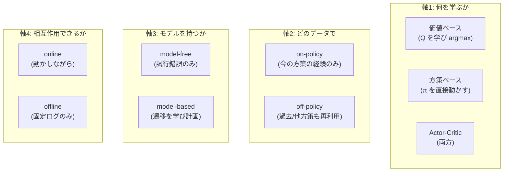
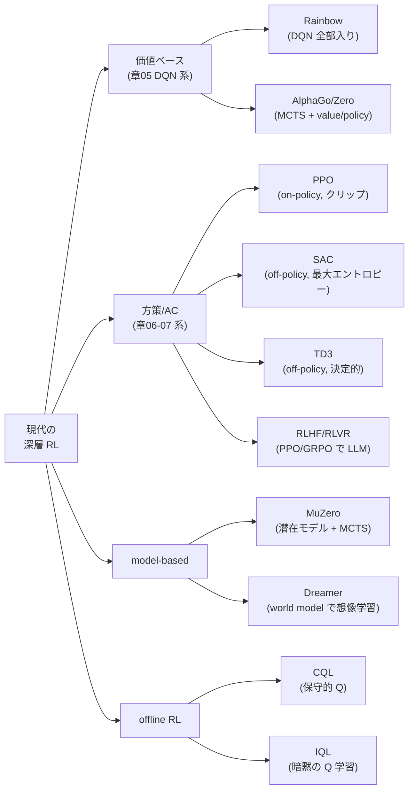
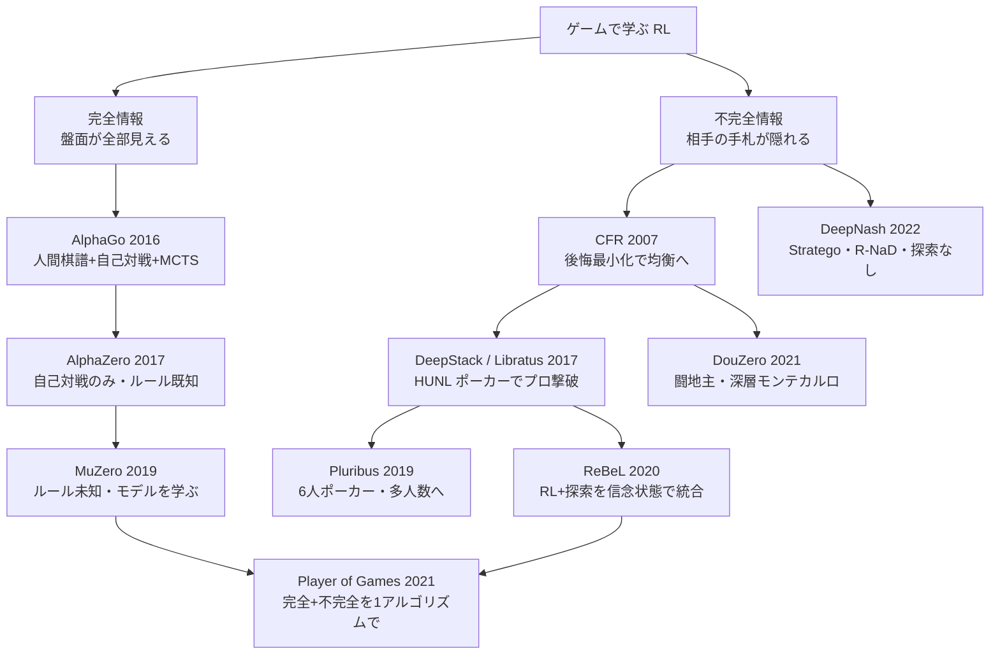

# 現代の深層強化学習 — アルゴリズムの地図・応用・研究トレンド

:::abstract[学習目標]
この章を読み終えると、次のことができるようになります。

- 現代の深層 RL を **4つの分類軸**（価値ベース/方策ベース/Actor-Critic、on/off-policy、model-free/based、online/offline）で **整理** できる
- **PPO**（クリップ目的）・**SAC**（最大エントロピー）・**TD3**・**Rainbow**・**MuZero/Dreamer**（モデルベース）・**AlphaGo/Zero/Star**・**offline RL**（CQL/IQL）が、それぞれ「**何を直したか**」を1-2行で **言える**
- 各代表手法を分類軸の座標として **打ち**、なぜその設計を選んだか（探索・分散・安定性・データ効率のどれを買ったか）を **説明** できる
- 応用（ゲーム / ロボット制御 / LLM の RLHF / 科学）と、横断接続（[/llm/05-adaptation-rlhf/](/llm/05-adaptation-rlhf/)・[/physical-ai/](/physical-ai/)）を **対応づけ** られる
- 代表研究を **時系列に並べ**、2024-2026 の主要トレンド（offline RL・model-based・RLHF→RLVR・基盤モデル化）を **列挙** し、なぜその方向へ進んだかを **説明** できる
- PPO のクリップ目的の最小トイを numpy で動かし、**良い行動と悪い行動でクリップが非対称に効く** ことを **数値で確認** できる
:::

## 前提知識

- 章06 [方策勾配法](/reinforcement-learning/06-policy-gradient/)：方策勾配定理 $\nabla_\theta J=\mathbb{E}[\nabla_\theta\log\pi_\theta(a\mid s)\,G_t]$、対数微分（尤度比）トリック、REINFORCE、ベースラインによる分散低減。**PPO のクリップ目的はこの方策勾配の "重み付け" を作り替えたもの** です。
- 章07 [Actor-Critic](/reinforcement-learning/07-actor-critic/)：actor（方策 $\pi_\theta$）と critic（価値 $V_w$）の協調、**アドバンテージ** $A^\pi(s,a)=Q^\pi(s,a)-V^\pi(s)$、TD 誤差 $\delta_t=r_t+\gamma V(s_{t+1})-V(s_t)$、GAE、A2C/A3C。本章の PPO・SAC・TD3 はすべてこの枝です。
- 章05 [関数近似と DQN](/reinforcement-learning/05-function-approximation-dqn/)：価値関数をニューラルネットで近似する発想、experience replay、target network。Rainbow はこの DQN の改良の束です。
- 章01-04（MDP・動的計画法・モデルフリー予測/制御）：状態 $s$・行動 $a$・報酬 $r$・割引率 $\gamma$、$Q$ 学習と SARSA、on-policy / off-policy の区別。

LLM 出身の読者へ：本章は **「方策勾配（章06）と Actor-Critic（章07）の上に、現代 RL の主役たちがどう積み上がったか」の地図** です。とくに PPO は、人間の選好で LLM を整える RLHF の中核そのもの（[/llm/05-adaptation-rlhf/](/llm/05-adaptation-rlhf/)）。この地図を持つと、新しい論文が出ても「これは off-policy×最大エントロピーの SAC 系だな」「これは model-based の Dreamer 系か」と即座に座標を打てます。

## 直感

章01-07 で、RL の **基礎の語彙**（MDP・価値・方策・TD・方策勾配・Actor-Critic）が手に入りました。でもそこから先 —— 実際に Atari を超人級でプレイし、囲碁で世界王者を破り、ロボットを歩かせ、ChatGPT を整えた **現代の深層 RL** —— は、論文の洪水です。PPO・SAC・TD3・Rainbow・MuZero・Dreamer・AlphaZero・CQL・IQL… 名前だけで溺れます。

この章の役割は1つ —— **現代の深層 RL を、少数の軸で切って地図にする** ことです。地図があれば、どの手法も「基礎章のどの量を、どんな問題を解くために、どう作り替えたか」として読めます。実は、ほとんどの現代手法は **基礎章の素朴なアルゴリズムが持つ "病" を1つずつ治療した結果** です。

| 基礎章の病 | それを治した現代手法 |
| --- | --- |
| 方策勾配の更新が大きすぎて壊れる（章06） | **PPO**（更新幅をクリップで制限） |
| Q 学習が価値を過大評価する（章05） | **TD3**（2つの Q の小さい方を使う） |
| 決定的方策は探索が下手 | **SAC**（エントロピー報酬で探索を促す） |
| DQN は単体だと不安定・非効率（章05） | **Rainbow**（6つの改良を全部入り） |
| model-free はサンプルを大量に食う | **MuZero/Dreamer**（環境モデルを学んで頭の中で計画） |
| online は実環境との相互作用が必須 | **offline RL**（過去ログだけで学ぶ・CQL/IQL） |

だから「何を直したか」を軸に読むのが、この地図のいちばん速い歩き方です。鍵になる問いは4つだけです。

1. **何を学ぶか** —— 価値（$Q$）か、方策（$\pi$）か、両方（Actor-Critic）か。
2. **どのデータで学ぶか** —— 今の方策で集めた経験だけ（on-policy）か、過去・他方策の経験も使う（off-policy）か。
3. **環境モデルを持つか** —— 試行錯誤だけ（model-free）か、遷移 $P(s'\mid s,a)$ を学んで計画する（model-based）か。
4. **環境と相互作用できるか** —— 動かしながら学ぶ（online）か、固定ログだけで学ぶ（offline）か。

この4軸の組合せが、現代 RL の主要系統になります。

## 全体像

まず、4つの分類軸を1枚で一望します。各軸は独立で、組合せが手法の座標を決めます。



次に、代表手法をこの軸の上に並べた **分類ツリー** です。基礎章（DQN・REINFORCE・Actor-Critic）からどう枝分かれしたかを一望します。



各代表手法の4軸座標を1枚の表で固定します。**座標がそのまま「どんな問題に向くか」を語ります。**

| 手法 | 何を学ぶ | データ | モデル | 相互作用 | 主戦場 |
| --- | --- | --- | --- | --- | --- |
| **Rainbow** | 価値（Q） | off-policy | model-free | online | 離散行動・ゲーム（Atari） |
| **PPO** | Actor-Critic | **on-policy** | model-free | online | 汎用・連続/離散・**RLHF** |
| **SAC** | Actor-Critic | **off-policy** | model-free | online | **連続制御**（ロボット） |
| **TD3** | Actor-Critic | off-policy | model-free | online | 連続制御（決定的方策） |
| **MuZero** | 価値+方策+モデル | off-policy | **model-based** | online | ボード/Atari（計画） |
| **Dreamer** | Actor-Critic+モデル | off-policy | **model-based** | online | 連続制御・高サンプル効率 |
| **AlphaZero** | 価値+方策 | on-policy(自己対戦) | model-based(既知ルール) | online(自己対戦) | 完全情報ゲーム |
| **CQL / IQL** | 価値(+方策) | off-policy | model-free | **offline** | ログからの学習・医療/自動運転 |

:::note[LLM ↔ RL]
この4軸は、LLM の経験ともつながります。「価値 vs 方策」＝報酬モデル（採点器）を学ぶか方策（生成器）を直接動かすか。「on vs off-policy」＝今のモデルの生成だけで学ぶ（PPO/GRPO）か過去の生成も再利用するか。「online vs offline」＝対話しながら学ぶ（RLHF）か固定の選好データだけで学ぶ（DPO は offline 寄り）か。**RLHF は本章の PPO そのもの** で、状態＝プロンプト、行動＝トークン列、報酬＝報酬モデルの採点です。
:::

:::warning[「軸の値＝手法の箱」ではない]
4軸は互いに独立で、手法は **組合せ（座標）** です。よくある誤解は「Actor-Critic ＝ on-policy」「価値ベース＝ off-policy」と決めつけること。実際は **PPO は Actor-Critic でも on-policy**、**SAC は Actor-Critic でも off-policy** です。同じ Actor-Critic でも軸2が違えば別物。座標で読んでください。
:::

## 理論：代表手法を「何を直したか」で降りる

ここから各手法を、**何を直したか（1-2行）→ どう直したか（仕組み）→ 学習時 vs 推論時 → 座標** の順で1つずつ降ります。基礎章のどの病を治療したかを毎回明示します。

### PPO（Proximal Policy Optimization）— 更新の大きさをクリップで制限

:::note[何を直したか]
**方策勾配（章06）は、1回の更新が大きすぎると方策が壊れて二度と回復しない** という弱点を持ちます。PPO は「**確率比 $r=\pi_{\text{new}}/\pi_{\text{old}}$ が 1 から離れすぎたら目的をクリップして、それ以上の更新で得しないようにする**」ことで、安定に大きく学習できるようにしました。実装が簡単で頑健、現在の **汎用デフォルト**・RLHF の中核です。
:::

**どう直したか。** 章07 で、方策勾配の重みは収益 $G_t$ からアドバンテージ $A_t$ へ進みました。PPO はさらにその一歩先で、**「今の方策と更新前の方策の比」** で重み付けします。確率比を

$$r_t(\theta)=\frac{\pi_\theta(a_t\mid s_t)}{\pi_{\theta_{\text{old}}}(a_t\mid s_t)}$$

と定義します（$\pi_{\theta_\text{old}}$ はデータを集めた時点の方策＝固定、$\pi_\theta$ はいま更新中の方策）。素朴な目的 $r_t A_t$ をそのまま最大化すると、$A_t>0$（良い行動）のとき $r_t$ をいくらでも大きくしたくなり、方策が暴走します。PPO のクリップ目的はここに上限・下限を入れます。

$$
L^{\text{CLIP}}(\theta)=\mathbb{E}_t\!\left[\min\!\Big(r_t(\theta)\,A_t,\ \operatorname{clip}\!\big(r_t(\theta),\,1-\epsilon,\,1+\epsilon\big)\,A_t\Big)\right]
$$

ここで $\epsilon$ はクリップ幅（標準 $0.2$）、$\operatorname{clip}(r,1-\epsilon,1+\epsilon)$ は $r$ を $[1-\epsilon,1+\epsilon]$ に押し込む関数、$A_t$ は GAE（章07）で推定したアドバンテージです。$\min$ を取るのが肝で、これにより **「更新して得する方向」だけがクリップされ、「損する方向」は罰として残る** という非対称性が生まれます（後述の実装で数値確認します）。

**学習時 vs 推論時。** 学習時は (1) 現方策 $\pi_{\theta_\text{old}}$ でロールアウトして経験を貯め、(2) その固定データ上で $L^{\text{CLIP}}$ を **数エポック繰り返し最適化**（だからサンプルを使い回せる＝ REINFORCE より効率的）、(3) 方策を更新したら古い経験は捨てて再収集（on-policy）。推論時はクリップは無関係で、$\pi_\theta$ から行動をサンプルするだけです。

:::warning[PPO は off-policy ではない]
「確率比で重み付けする＝重要度サンプリング＝ off-policy」と誤解しがちですが、PPO は **on-policy** です。$\pi_{\theta_\text{old}}$ は「**直前の自分**」であって別方策ではなく、数エポック回したら必ず再収集します。確率比はあくまで「1回の収集データで安全に複数回更新する」ための仕掛けで、SAC のように何世代も前の経験を replay buffer から再利用するのとは別物です。
:::

**座標：** Actor-Critic × **on-policy** × model-free × online。

### SAC（Soft Actor-Critic）— エントロピー報酬で探索と安定性を同時に買う

:::note[何を直したか]
**決定的・貪欲な方策は探索が下手で局所解に嵌まりやすく、連続制御では特に脆い。** SAC は報酬に「**方策のエントロピー（ランダムさ）**」を足し、「報酬を最大化しつつ、できるだけランダムに行動し続ける」最大エントロピー RL を解くことで、探索の良さ・学習の安定性・off-policy のサンプル効率を同時に手に入れました。**連続制御のデファクト** です。
:::

**どう直したか。** 通常の RL は累積報酬 $\mathbb{E}[\sum_t r_t]$ を最大化します。SAC は各時刻の報酬に **方策エントロピー** $\mathcal{H}(\pi(\cdot\mid s_t))=-\mathbb{E}_a[\log\pi(a\mid s_t)]$ を温度 $\alpha$ で加えた目的を最大化します。

$$
J(\pi)=\sum_t \mathbb{E}_{(s_t,a_t)\sim\pi}\big[\,r_t+\alpha\,\mathcal{H}(\pi(\cdot\mid s_t))\,\big]
$$

エントロピー項 $\alpha\mathcal{H}$ は「**確率を1点に集中させすぎるな**」という圧力です。温度 $\alpha$ が探索（ランダムさ）と活用（報酬）のバランスを決め、SAC は $\alpha$ も自動調整します。この目的の下では、価値（soft Q）の更新も「次状態での価値＋エントロピー」を含む形になります。

**なぜ連続制御で効くか。** (1) エントロピー報酬が方策を広げ続けるので、決定的方策（TD3）が陥る早期収束を避けられる。(2) 確率的方策の reparameterization（$a=\mu_\theta(s)+\sigma_\theta(s)\odot\xi,\ \xi\sim\mathcal{N}(0,I)$）で勾配が低分散に流れる。(3) off-policy なので replay buffer で過去経験を再利用でき、サンプル効率が PPO より高い。ロボットのように1回の試行が高コストな領域でこれが効きます。

**座標：** Actor-Critic × **off-policy** × model-free × online。PPO との対比は次の通りです。

| | PPO | SAC |
| --- | --- | --- |
| データ | on-policy（毎回再収集） | off-policy（replay 再利用） |
| 方策 | 確率的（汎用） | 確率的（最大エントロピー） |
| 安定化の鍵 | 確率比クリップ | エントロピー報酬 + soft Q |
| サンプル効率 | 中（実環境試行が多め） | 高（過去経験を再利用） |
| 主戦場 | 汎用・RLHF・並列シミュ | 連続制御・実ロボット |

### TD3（Twin Delayed DDPG）— Q の過大評価を双子 Q で抑える

:::note[何を直したか]
**DDPG（決定的方策の off-policy Actor-Critic）は Q を過大評価して学習が崩れる。** TD3 は (1) **2つの Q ネットの小さい方** を使い（twin・過大評価を抑制）、(2) **方策更新を Q より遅らせ**（delayed・critic が落ち着いてから actor を動かす）、(3) ターゲット行動に**ノイズを足して**平滑化、の3点で安定化しました。決定的方策が要る連続制御の定番です。
:::

ターゲット値の核は **clipped double-Q** です。2つの critic $Q_{w_1},Q_{w_2}$ を持ち、ターゲットに小さい方を使います。

$$
y=r+\gamma\,\min_{i=1,2}Q_{w_i'}\!\big(s',\ \pi_{\theta'}(s')+\epsilon\big),\qquad \epsilon\sim\operatorname{clip}(\mathcal{N}(0,\sigma),-c,c)
$$

$\min$ を取ることで、片方の Q がたまたま過大評価しても引きずられにくくなります。SAC も同じ double-Q を使う一方、SAC は確率的方策＋エントロピー、TD3 は決定的方策＋行動ノイズ、という違いです（探索を「方策の確率性」で出すか「決定的方策＋外部ノイズ」で出すか）。

**座標：** Actor-Critic × off-policy × model-free × online。

### Rainbow — DQN の改良6点を全部入りにする

:::note[何を直したか]
**素の DQN（章05）は不安定でサンプル効率が悪い。** Rainbow は、独立に提案された6つの DQN 改良を**全部組み合わせる** と相乗効果で大きく伸びることを示しました。「単一の新発明」ではなく「**良い部品の統合が効く**」という教訓そのものです。
:::

組み合わせた6部品（各々が章05 のどの病を治したか）。

| 部品 | 直した病 |
| --- | --- |
| Double DQN | Q の過大評価（max の楽観バイアス） |
| Prioritized Replay | 一様サンプリングの非効率（誤差大の経験を優先） |
| Dueling Network | 価値 $V$ とアドバンテージ $A$ を分離して学習効率化 |
| Multi-step（n-step）TD | 1ステップ TD のバイアス↔分散の調整 |
| Distributional RL（C51） | 価値を点でなく**分布**で予測（情報量↑） |
| Noisy Nets | $\epsilon$-greedy より賢い探索（重みにノイズ） |

**座標：** 価値ベース × off-policy × model-free × online。離散行動（Atari など）の強力なベースラインです。

### MuZero / Dreamer — 環境モデルを学び「頭の中で」計画する（model-based）

:::note[何を直したか]
**model-free は実環境との相互作用を大量に必要とする（サンプル非効率）。** model-based RL は **環境のダイナミクス（次状態・報酬）を学習** し、その学習済みモデルの中で先読み計画や想像上のロールアウトを行うことで、実環境の試行を大幅に減らします。
:::

2つの代表は計画の仕方が違います。

- **MuZero（DeepMind, 2019）：潜在空間モデル + MCTS。** ルールを知らなくても、観測を潜在状態に符号化する**表現関数**・潜在で次状態と報酬を予測する**ダイナミクス関数**・各潜在状態の方策と価値を出す**予測関数**の3つを学びます。推論時はこの学習済みモデルの中で **Monte Carlo Tree Search（MCTS）** を回して行動を選びます。「**ルール未知でも、価値・報酬の予測に必要な分だけのモデルを学ぶ**」のが核心（ピクセルを完全再現はしない）。AlphaZero（後述）をルール既知から**ルール未知**へ一般化した到達点です。

  3関数のシグネチャと shape を固定します（$k$ は潜在ロールアウトの深さ＝先読み何手目か。$k=0$ が現時点）。

  | 関数 | 記号・シグネチャ | 入力 | 出力 | 役割 |
  | --- | --- | --- | --- | --- |
  | 表現 (representation) | $h:o_{1:t}\mapsto s^0$ | 観測履歴 $o_{1:t}$ | 初期潜在状態 $s^0$ | 生の観測を潜在へ符号化（最初に1回） |
  | ダイナミクス (dynamics) | $g:(s^k,a^k)\mapsto(s^{k+1},r^{k+1})$ | 潜在 $s^k$・行動 $a^k$ | 次の潜在 $s^{k+1}$・即時報酬 $r^{k+1}$ | 潜在の中で1手進める（環境の代役） |
  | 予測 (prediction) | $f:s^k\mapsto(\pi^k,v^k)$ | 潜在 $s^k$ | 方策 $\pi^k$・価値 $v^k$ | 各潜在で「次の手の分布」と「局面の良さ」を出す |

  ここで $o_{1:t}$ は時刻 $t$ までの観測列、$s^k$ は深さ $k$ の**潜在状態**（観測空間ではない —— 環境のピクセルとは無関係な内部表現）、$a^k$ は深さ $k$ で選ぶ行動、$r^{k+1}$ は $g$ が予測する即時報酬、$\pi^k$ は行動上の分布、$v^k$ はスカラ価値です。重要なのは **$g$ が環境を一切呼ばずに「潜在 → 次の潜在」だけで先読みを進める**こと。だから「頭の中」で MCTS の木を何手も展開できます。1回の行動選択は次の流れです。

  ```mermaid
  flowchart LR
    O["観測履歴<br/>o₁:ₜ"] -->|"h: 表現関数<br/>encode"| S0["潜在 s⁰"]
    S0 -->|"f: 予測"| PV0["π⁰, v⁰"]
    S0 -->|"g: ダイナミクス<br/>(s⁰,a⁰)"| S1["潜在 s¹<br/>+報酬 r¹"]
    S1 -->|"f: 予測"| PV1["π¹, v¹"]
    S1 -->|"g: (s¹,a¹)"| S2["潜在 s²<br/>+報酬 r²"]
    S2 -->|"f"| PV2["π², v²"]
    S2 -.->|"g を繰り返し<br/>MCTS で木を展開"| DOTS["…"]
    PV0 & PV1 & PV2 -.->|"探索結果を集約"| ACT["実環境で打つ<br/>行動 aₜ"]
  ```

  観測は $h$ で**一度だけ**潜在へ符号化し、その後は $g$ を繰り返して潜在のまま MCTS のロールアウトを進め、各ノードで $f$ が $(\pi,v)$ を返す。木の探索結果（訪問回数の分布）を集約して実環境で打つ手を決め、その探索方策と実際に得た価値・報酬を教師に $h,g,f$ を同時に学習します。
- **Dreamer（v1-v3, 2019-2023）：world model + 想像内 Actor-Critic。** 観測を潜在状態に圧縮する RSSM（recurrent state-space model）を学び、**その潜在世界モデルの中で想像上の軌道を大量にロールアウト**し、Actor-Critic（章07）を学習します。実環境はデータ収集にだけ使い、方策学習は「想像の中」で行うのでサンプル効率が非常に高い。

  RSSM の潜在は **決定的な部分 $h_t$（RNN の隠れ状態で過去を要約・連続的に引き継ぐ）と確率的な部分 $z_t$（各時刻の不確実性をサンプルで表す）の2つに分割**されます。決定的部分が「これまでの流れ」を保ち、確率的部分が「次に何が起きるか分からない」ゆらぎを担うことで、長期の一貫性とランダム性を両立します。学習した world model の中で、現在の潜在から **$H$ 歩（典型 15 歩）先まで想像でロールアウト**し、その想像軌道上で Actor（方策）と Critic（価値）を学習します（実環境は1歩も使わない）。DreamerV3 は調整なしで多様な領域（Atari・連続制御・Minecraft のダイヤ採掘）を1セットのハイパーパラメータで解いた汎用性が注目されました。

**学習時 vs 推論時（model-based 共通の注意）。** 学習時は「実環境データでモデルを学ぶ」と「モデル内で方策/価値を学ぶ」の2つのループが回ります。推論時は MuZero なら学習済みモデルで MCTS を実行、Dreamer なら学習済み方策をそのまま使う（計画はしない）点が異なります。

:::warning[model-based ＝「ピクセルを完全に予測する」ではない]
model-based というと「環境を完璧にシミュレートする」と思いがちですが、MuZero は**観測を再構成しません**。価値・方策・報酬を当てるのに必要な潜在表現だけを学びます。「制御に役立つ分だけのモデル」で十分、というのが現代 model-based の要点です。
:::

**座標：** MuZero ＝ 価値+方策+モデル × off-policy × **model-based** × online。Dreamer ＝ Actor-Critic+モデル × off-policy × **model-based** × online。

### AlphaGo / AlphaZero / AlphaStar — 探索（MCTS）と学習（NN）の融合

:::note[何を直したか]
**囲碁のような巨大な探索空間は、ヒューリスティック探索だけでは超人級に届かない。** AlphaGo 系は **MCTS（先読み探索）と、方策ネット（手の絞り込み）・価値ネット（局面の評価）を融合** し、さらに**自己対戦**で人間データなしに強くなる道（AlphaZero）を開きました。RL が「人間を超える」ことを世に示した系譜です。
:::

進化を1行ずつ。

| モデル | 何を足したか |
| --- | --- |
| AlphaGo (2016) | 人間棋譜で初期化＋自己対戦 RL、MCTS に policy/value net を融合、李世乭に勝利 |
| AlphaGo Zero (2017) | **人間データを全廃**、自己対戦のみ・単一ネット（policy+value）で AlphaGo を凌駕 |
| AlphaZero (2017) | 囲碁・将棋・チェスを**同一アルゴリズム**で制覇（ゲーム固有知識なし、ルールのみ） |
| MuZero (2019) | **ルールすら未知**に一般化（前述・モデルを学ぶ） |
| AlphaStar (2019) | StarCraft II（不完全情報・長期・巨大行動空間）でグランドマスター級 |

AlphaZero は「**ルール既知の model-based**」（遷移は既知＝シミュレータが正確）で、自己対戦で生成したデータに MCTS の探索結果を教師として方策・価値を蒸留します。AlphaStar は不完全情報・長期信用割当という困難を、大規模方策勾配＋リーグ自己対戦（多様な相手を生成）で攻めた点が新しい。

**座標（AlphaZero）：** 価値+方策 × 自己対戦 × model-based（ルール既知） × online。

### 分散・大規模 RL（A3C → IMPALA → Ape-X/R2D2 → SEED）— スループットでサンプルを買う

:::note[何を直したか]
**RL は経験を大量に必要とする（サンプル非効率）。** ならば **多数のアクターを並列に走らせて経験を高速生成** すればよい —— が、並列にすると「経験を集めた時点の方策」と「学習器のいまの方策」がズレます（**方策ラグ＝事実上の off-policy**）。分散 RL は、このラグを **補正** しつつスループットを桁違いに上げる工夫の系譜です。アルゴリズムの病を治すのではなく、**同じアルゴリズムを膨大な経験量で回す** ための土台です。
:::

**問題の核心。** 1プロセスで1ステップずつ集めると GPU が遊び、学習が「経験生成待ち」になります。そこで **経験を生むアクター群** と **勾配を計算する学習器** を分離し、数百〜数千のアクターを並列に回す。ところがアクターは学習器より少し古い方策 $\mu$ で行動しているので、集めた経験は最新方策 $\pi$ から見ると off-policy。素朴に方策勾配を当てると **バイアス** が乗ります。

代表手法を「何を並列化したか」と「方策ラグの直し方」で並べます。

| 手法 | 何を並列化 | 方策ラグの扱い | 系譜 |
| --- | --- | --- | --- |
| **A3C**（2016） | 多数アクターが**各自勾配を計算**し非同期に反映 | 各自が最新近くを使うので軽微（が勾配の不整合は残る） | Actor-Critic（章07） |
| **IMPALA**（2018） | アクターは**軌跡だけ**送り、学習器が一括で勾配 | **V-trace**（後述）でクリップ付き重要度補正 | Actor-Critic |
| **Ape-X**（2018） | 多数アクターが**経験を共有 replay** に投入 | 価値ベースは replay 前提で off-policy が自然 | DQN（章05）＋優先度 replay |
| **R2D2**（2019） | Ape-X に**再帰（LSTM）**を足し部分観測へ | replay に「系列」を保存し状態を引き継ぐ | DQN＋RNN |
| **SEED RL**（2020） | **推論も中央のアクセラレータ**に集約 | IMPALA/R2D2 を高効率インフラで回す | システム最適化 |

**V-trace（IMPALA の核心）。** アクターの行動方策を $\mu$、学習器の現方策を $\pi$ とし、価値 $V$ の学習ターゲット $v_t$ を、重要度比を **クリップ** しながら作ります。

$$
v_t = V(s_t) + \sum_{k=t}^{t+n-1} \gamma^{k-t}\Big(\textstyle\prod_{i=t}^{k-1} c_i\Big)\,\delta_k,\qquad
\delta_k = \rho_k\big(r_k + \gamma V(s_{k+1}) - V(s_k)\big)
$$

ここで $\rho_k=\min\!\big(\bar\rho,\ \tfrac{\pi(a_k\mid s_k)}{\mu(a_k\mid s_k)}\big)$、$c_i=\min\!\big(\bar c,\ \tfrac{\pi(a_i\mid s_i)}{\mu(a_i\mid s_i)}\big)$ は、上限 $\bar\rho,\bar c$ で **クリップした重要度比** です（$k=t$ では積 $\prod_{i=t}^{k-1}c_i$ は空積＝1）。役割は2つ：$\rho_k$ は「この TD 誤差 $\delta_k$ をどれだけ信じるか」＝**収束先の方策** を制御し、$c_i$ は「過去の誤差をどこまで先へ伝えるか」＝**分散** を抑えます。比をクリップするので、$\mu$ と $\pi$ がズレても **分散が爆発せず**、かつ正しい価値へ収束する —— これが「アクターが少し古くてもよい」を数式で支える正体です。

**V-MPO（2019）。** IMPALA 系インフラの上で動く **on-policy** の大規模手法。重要度重み付けを使わず、MPO（最大事後方策最適化）を **学習した状態価値 $V$** ベースに直したもので、Atari-57・DMLab-30 のマルチタスクや 22〜56 自由度のヒューマノイド制御で、エントロピー正則化や個体群調整なしに強い結果を出しました。**「IMPALA＝off-policy 補正で回す」「V-MPO＝on-policy のまま大規模に回す」** という2択、と捉えると整理できます。

**学習時 vs 推論時。** これらは **学習を速くする工夫** で、推論時の方策の形は変わりません（学習済み $\pi$ を普通に使うだけ）。「桁違いの経験量」を現実的な時間で回せるようにしたことが、AlphaStar や OpenAI Five のような大規模成果の土台になりました。

**座標：** 既存アルゴリズム（Actor-Critic / 価値ベース）× **大規模分散実行**。軸そのものは変えず、**スループット** という直交した第5の関心事を足したもの、と読めます。

### offline RL（CQL / IQL）— 固定ログだけで学ぶ

:::note[何を直したか]
**online RL は環境と相互作用して探索する必要があるが、医療・自動運転・産業制御では「試しに危険な行動を取る」ことが許されない。** offline RL は **過去に集めた固定データセットだけ** から方策を学びます。最大の敵は **分布シフト**（学習データに無い行動を Q が過大評価し、実行すると破綻する）で、CQL/IQL はこれを別々のやり方で抑えます。
:::

offline 特有の病と対策。

- **病：外挿エラー。** データに無い行動 $(s,a)$ に対し Q が無根拠に高い値を付け、方策がそこへ突っ込む。online なら実際に試して訂正できるが、offline は訂正の機会がない。
- **CQL（Conservative Q-Learning, 2020）：保守的に下駄を履かせる。** 通常の Q 損失に「**データ外の行動の Q を押し下げ、データ内の行動の Q を押し上げる**」正則化項を足し、未知行動を過大評価しないようにします。Q を「保守的な下界」にする。
- **IQL（Implicit Q-Learning, 2021）：データ外の行動を一切評価しない。** $\max_a Q(s,a)$ を取る代わりに、**expectile 回帰**でデータ内の良い行動だけから価値を推定し、その価値に近い行動を真似る（advantage 重み付き行動クローン）。データ外の行動を Q に問い合わせないので外挿エラーが構造的に起きません。

**座標：** 価値(+方策) × off-policy × model-free × **offline**。online RL との根本的な違いは「探索ができない」こと —— だから保守性が設計の中心になります。

### 探索（exploration）— RL 全体を貫く横断課題

報酬が疎な環境（成功するまで報酬 0 が続く）では、ランダム探索では一生ゴールに当たりません。主な戦略を一望します。

| 戦略 | 仕組み | 代表 |
| --- | --- | --- |
| $\epsilon$-greedy | 確率 $\epsilon$ でランダム行動 | DQN（章05） |
| エントロピー報酬 | 方策のランダムさを報酬に加える | SAC（前述） |
| 楽観的初期化 / UCB | 未訪問を「良いかも」と扱う | bandit・MCTS |
| 内発的報酬（好奇心） | 予測誤差・新規性をボーナスに | RND, ICM |
| Noisy Nets | 重みにノイズを乗せて探索 | Rainbow（前述） |

内発的報酬（好奇心駆動）は「**自分が予測できない＝新しい状況に行くこと自体に報酬を与える**」発想で、Montezuma's Revenge のような超疎報酬ゲームを攻略しました。LLM の RLVR でも「探索＝多様な推論経路の生成」が暗に効いています。

## ゲームの情報構造で見る RL：完全情報 vs 不完全情報

ここまでの AlphaGo/Zero/MuZero は **完全情報ゲーム**（盤面が全部見える）でした。ところが **ポーカー・麻雀・闘地主（Dou Dizhu）** のように **相手の手札が見えない**＝**不完全情報ゲーム** になると、RL の前提が1つ崩れます。この節は「情報が隠れると何が変わるか」と、その攻略の系譜を地図にします（ご質問の **DouZero・不完全情報/完全情報** の論点はここに集約します）。

### なぜ「隠れた情報」で価値最大化が壊れるのか

:::question[完全情報なら通用した発想]
完全情報では、ある局面 $s$ に **確定した価値** があり、木を先読みすれば「最善の一手」が（原理的に）決まります。AlphaZero の自己対戦＋MCTS は、この「局面 → 最善手」を当てにいく仕組みでした。
:::

不完全情報では、これが2つの理由で崩れます。

1. **局面の価値が「信念」と「相手の戦略」に依存する。** 自分に見える情報が同じでも、相手の手札の分布（**信念 belief**）が違えば最善手も価値も変わる。価値は局面単体では決まりません。
2. **最善の手はしばしば「ランダム（混合戦略）」。** ポーカーで「強い手のときだけベット」すると相手に読まれて搾取されます。**一定確率でブラフ** する —— つまり **確率的に混ぜる（混合戦略）** のが最適で、決定的な「最善手」を出す発想自体が負けます。

:::warning[「常に最善応答」は不完全情報では搾取される]
完全情報の直感「いつも相手への最善応答を取る」は、不完全情報では **自分の手の内が読まれる** ため逆に弱い。解くべきは「相手にどう応答されても損しない」点＝**ナッシュ均衡（Nash equilibrium）** です。2人ゼロサムなら均衡戦略は「相手が何をしても期待で負けない」不動点になります。RL の目標が **「収益の最大化」から「均衡への収束」へ** 移るのが、不完全情報ゲームの本質です。
:::

### 攻略の道具：後悔最小化（CFR）と自己対戦

均衡へ近づく王道が **CFR（Counterfactual Regret Minimization, 2007）** です。各 **情報集合**（自分から見て区別できない局面の集まり）で「**あの行動を取っておけばどれだけ得したか＝後悔（regret）**」を積み、後悔の大きい行動の確率を上げていく。これを自己対戦で反復すると **平均戦略がナッシュ均衡へ収束** します（2人ゼロサム）。完全情報の「価値を上げる」に対し、不完全情報は「**後悔を均して 0 にする**」 —— これが攻略の背骨です。

### 2つの系譜（完全情報 vs 不完全情報）



| 系譜 | 解の概念 | 探索の対象 | 代表 |
| --- | --- | --- | --- |
| 完全情報 | 最適方策（最善手） | 状態の木（MCTS） | AlphaZero / MuZero |
| 不完全情報 | **ナッシュ均衡** | **信念・公開状態**の上の木 | CFR / DeepStack / ReBeL |

各マイルストーンを1行で。

| 研究 | 何が新しいか |
| --- | --- |
| **CFR**（2007） | 後悔最小化で2人ゼロサムを均衡へ。以降の不完全情報 AI の数学的土台 |
| **DeepStack / Libratus**（2017） | ヘッズアップ無制限ポーカーで **プロに勝利**。深層の反実価値ネット＋部分木の再解（continual re-solving / nested solving） |
| **Pluribus**（2019） | **6人**ポーカーを攻略（2人ゼロサムの外＝多人数へ）。ブループリント戦略＋深さ制限探索 |
| **ReBeL**（2020） | **公開信念状態（public belief state）** で不完全情報を「連続状態の完全情報ゲーム」に還元し、**RL＋探索** を一般的手法として統合 |
| **DouZero**（2021） | **闘地主（3人・協力と競争・巨大で可変な行動空間）** を **Deep Monte-Carlo**（素朴な MC＋深層網＋カード行列の行動符号化）で攻略。CFR を使わず Botzone で344エージェント中1位 |
| **Player of Games**（2021） | **完全情報も不完全情報も同一アルゴリズム**で（チェス・囲碁・ポーカー・Scotland Yard）。成長木 CFR＋自己対戦＋探索 |
| **DeepNash**（2022） | **Stratego**（木が約 $10^{535}$・囲碁の175倍・隠れ駒）を **R-NaD（正則化ナッシュ動力学）** で。**探索なし** の model-free RL で均衡へ直接収束し人間専門家級 |

:::tip[DouZero が面白い理由（ご質問の主役）]
DouZero は「不完全情報＝CFR が常道」という流れの中で、**あえて古典のモンテカルロ法**（章03 の MC をそのまま深層化）で挑んで勝ちました。鍵は2つ —— (1) **行動をカード行列で符号化** して「見たことのない手」へ汎化させた（闘地主は合法手が状況で激変する巨大行動空間）、(2) 多数アクターで **毎秒数千サンプル** を生成。「**洗練された理論より、良い表現＋大量経験が効く領域もある**」という、前述の分散 RL と地続きの教訓です。
:::

:::note[AlphaStar はどちらの系譜か]
StarCraft II は不完全情報ですが、AlphaStar は CFR 系ではなく **大規模方策勾配＋リーグ自己対戦**（多様な相手＝exploiter を生成し、搾取される穴を塞ぐ）で攻めました。「均衡を厳密に解く」より「**多様な相手に強い方策を経験で鍛える**」近似で、巨大行動空間・長期戦に対応した点が、CFR 系ポーカーとは別アプローチです。同じ不完全情報でも **解き方は1つではない** ことを示します。
:::

## 代表研究の年表

地図に時間軸を入れます。各研究が「**どの軸のどの病を治したか**」を併記します。基礎章（DQN・方策勾配・Actor-Critic）の上に、現代手法がどう積み上がったかが一望できます。

| 年 | マイルストーン | 治した病・座標 |
| --- | --- | --- |
| 2007 | **CFR** | 不完全情報を後悔最小化でナッシュ均衡へ。以降のポーカー AI 系譜の数学的土台 |
| 2013-15 | **DQN**（Atari・Nature 2015） | 価値ベースの深層化。replay + target net で不安定さを抑制（章05） |
| 2015 | **TRPO** / **DDPG** | 方策更新の信頼領域（TRPO）／決定的方策の off-policy 連続制御（DDPG） |
| 2016 | **A3C** / **AlphaGo** | 並列 Actor-Critic（章07）／MCTS+NN で囲碁世界王者に勝利 |
| 2017 | **PPO** / **AlphaGo Zero** / **AlphaZero** / **Rainbow** / **DeepStack・Libratus** | クリップで安定 on-policy（汎用デフォルト）／自己対戦のみ／同一アルゴリズムで多ゲーム／DQN 全部入り／**HUNL ポーカーでプロ撃破（不完全情報）** |
| 2018 | **SAC** / **TD3** / **IMPALA・Ape-X** | 最大エントロピーの off-policy（連続制御デファクト）／双子 Q で過大評価抑制／**分散 RL（V-trace 補正・分散優先度 replay）** |
| 2019 | **MuZero** / **AlphaStar** / **Dreamer(v1)** / **Pluribus** / **R2D2・V-MPO** | ルール未知の model-based 計画／不完全情報 RTS／world model 想像学習／**6人ポーカー**／**分散・大規模（再帰 replay・on-policy 大規模）** |
| 2020-21 | **CQL** / **IQL** / **Decision Transformer** / **ReBeL・DouZero・Player of Games** | offline RL の分布シフト対策（保守的 Q／暗黙 Q／系列モデル化）／**不完全情報の RL＋探索・闘地主・完全/不完全の統一** |
| 2022 | **InstructGPT (RLHF)** / **DreamerV3** / **DeepNash** | PPO を LLM 整合へ（言語応用の起点）／1セットの設定で多領域を解く汎用 model-based／**Stratego を R-NaD で（探索なしで均衡へ）** |
| 2023-24 | **DPO** / **TD-MPC2** など | 報酬モデルなしの offline 整合／model-based 連続制御の汎用化 |
| 2025-26 | **GRPO / RLVR**（DeepSeek-R1 ほか）・基盤モデル化 | 検証可能報酬で推論を強化、RL が大規模基盤モデルの後段学習の主役へ |

:::warning[固有名・年・数値の扱い]
本章の固有名・年・会議・数値は **2024-2026 時点で確認できた範囲** です。RL は進展が速く、とくに LLM 後段学習（RLVR/GRPO 系）は数か月単位で更新されます。**実装前に公式実装・最新論文を再確認** してください（CLAUDE.md 方針）。
:::

## 研究トレンド（2024-2026）

地図の上で「いま全体がどちらへ動いているか」を4つの潮流で論じます。

### トレンド1：offline RL の実用化

実環境で探索できない領域（医療・自動運転・産業制御・推薦）向けに、**過去ログだけで学ぶ** offline RL が実用フェーズに入りました。CQL/IQL の保守化に加え、軌道を系列としてモデル化する Decision Transformer 系（RL を「条件付き系列生成」として解く）や、offline で学んで少量の online で微調整する offline-to-online が焦点です。LLM の DPO も「固定の選好データだけで学ぶ＝ offline 整合」として同じ潮流にあります。

### トレンド2：model-based の汎用化とサンプル効率

実環境試行が高コストなロボット・実機制御で、**world model（環境モデル）を学んで想像の中で方策を鍛える** model-based が伸びました。DreamerV3 が「**1セットのハイパーパラメータで多領域を解く**」汎用性を示し、TD-MPC2 などが連続制御で続きます。「制御に必要な分だけのモデル」を学ぶ MuZero 流の割り切りが共通の設計思想です。

### トレンド3：RLHF から RLVR へ（LLM 後段学習の主役化）

RL の最大の応用先が **LLM の後段学習** になりました。人間の選好で整える **RLHF（PPO）** から、報酬モデルを省いて選好データで直接最適化する **DPO**、そして数学・コードのように**答え合わせ（検証可能報酬）で推論を強化する RLVR/GRPO** へ進んでいます。GRPO は価値ネット（critic）を群サンプルの相対比較で置き換え、PPO を LLM 規模で軽量化したもの。**本章の PPO のクリップ目的が、そのまま推論 LLM の学習に効いている** のが現在地です。

**GRPO の中身（critic を群平均で置き換える）。** PPO はアドバンテージ $A_t$ を作るために critic（価値ネット $V(s)$）を別に学習し、ベースラインとして引いていました（章07）。critic は LLM では巨大で、学習も不安定。GRPO（Group Relative Policy Optimization）は **critic を丸ごと捨て、その役割を「同じプロンプトへの複数応答の群内比較」で代用**します。手順は3段です。

1. **群サンプル**：1つのプロンプトに対し、現方策で $G$ 個の応答 $o_1,\dots,o_G$ を生成する（典型 $G=8\sim64$）。
2. **検証報酬**：各応答に検証器（数学なら答え合わせ、コードならテスト通過）でスカラ報酬 $r_i$ を付ける。$\mathbf r=(r_1,\dots,r_G)$。
3. **群内正規化 → クリップ**：群の平均・標準偏差で各報酬を正規化してアドバンテージを作り、PPO と同じクリップ目的へ流す。

$$
\hat A_i=\frac{r_i-\operatorname{mean}(\mathbf r)}{\operatorname{std}(\mathbf r)}
$$

ここで $\operatorname{mean}(\mathbf r)=\frac1G\sum_j r_j$、$\operatorname{std}(\mathbf r)$ は群内の標準偏差です。**$\operatorname{mean}(\mathbf r)$ がちょうど critic のベースライン $V(s)$ の代役** —— 「この問題で平均してどれくらい取れるか」を、価値ネットの予測ではなく**同じ問題への他の応答の実測平均**で見積もります。$\hat A_i$ をそのまま PPO のクリップ目的 $L^{\text{CLIP}}$（前述）の $A_t$ に差し込むだけで、critic 抜きの方策更新が回ります。

数値例（$G=3$、報酬 $\mathbf r=[1,0,0]$ ＝ 3 応答中1つだけ正解）。$\operatorname{mean}=1/3\approx0.33$、$\operatorname{std}=\sqrt{\tfrac13\big((1-\tfrac13)^2+2(0-\tfrac13)^2\big)}=\sqrt{2/9}\approx0.47$。正規化すると

$$
\hat A_1=\frac{1-0.33}{0.47}\approx+1.41,\qquad \hat A_2=\hat A_3=\frac{0-0.33}{0.47}\approx-0.71
$$

正解した応答 $o_1$ は $\hat A>0$ で確率を上げる方向、外した $o_2,o_3$ は $\hat A<0$ で下げる方向へ、クリップ付きで更新されます。**絶対の報酬（1 か 0）ではなく「群平均より上か下か」で押し引きする**のがミソです。

これは章07 の**ベースラインの不偏性**そのものの応用です。章07 で「行動に依存しないベースライン $b(s)$ を引いても勾配は不偏（期待値は変わらず分散だけ下がる）」を示しました。GRPO の $\operatorname{mean}(\mathbf r)$ は**同じプロンプト（状態）に対する応答全体で1つの値**＝個々の応答 $o_i$ には依存しない $b(s)$ なので、引いても方策勾配は不偏のまま分散だけ下がります。critic を学ぶ代わりに**群のモンテカルロ平均**でベースラインを作った、というのが理論的な位置づけです（$\operatorname{std}$ で割るのは応答間で報酬スケールを揃える正規化で、これも群内一定なので符号の向きを変えません）。

### トレンド4：基盤モデルとの融合・汎用エージェント

単一タスクの方策から、**多タスク・多環境を1つのモデルで扱う汎用エージェント**（Gato 系）や、大規模事前学習＋RL 後段学習という LLM 流のレシピが RL 全般に広がりました。「方策＝条件付き系列生成器」「critic＝価値ヘッド」という LLM との構造的共通性が、両分野の道具（Transformer・スケーリング・系列モデル化）を相互に流用させています。

:::success[トレンドを1行で]
**offline と model-based でサンプル効率を稼ぎ、RL の重心は LLM 後段学習（RLHF→DPO→RLVR/GRPO）と汎用エージェントへ** —— これが 2024-2026 の地図の動きです。基礎は変わらず方策勾配（章06）と Actor-Critic（章07）で、PPO のクリップが最前線でも生き続けています。
:::

## 数式の導出：PPO のクリップが「片側だけ」効くことを示す

地図章なので導出は核心1つに絞ります。**なぜ $L^{\text{CLIP}}$ の $\min$ が「更新して得する方向だけ」を抑えるのか** を、$A_t$ の符号で場合分けして確かめます。これが PPO の安定性の数学的な背骨です。

クリップ目的を1サンプル分で書きます（$r=r_t(\theta)$、$A=A_t$）。

$$
L^{\text{CLIP}}=\min\!\big(rA,\ \operatorname{clip}(r,1-\epsilon,1+\epsilon)\,A\big)
$$

**ケース1：$A>0$（良い行動、確率を上げたい）。** 方策改善は $r$ を大きくする方向です。

- $r\le 1+\epsilon$ のとき：$\operatorname{clip}(r,\dots)=r$ なので両項とも $rA$、$L^{\text{CLIP}}=rA$。$r$ を上げると目的が増える＝**更新が効く**。
- $r>1+\epsilon$ のとき：クリップ項は $(1+\epsilon)A$（定数）、未クリップ項は $rA>(1+\epsilon)A$。$\min$ は小さい方＝$(1+\epsilon)A$ を選ぶ。$r$ を上げても目的は **$(1+\epsilon)A$ で頭打ち**＝勾配 0。

つまり $A>0$ では **$r>1+\epsilon$ への暴走を止める**（それ以上確率を上げても得しない）。

**ケース2：$A<0$（悪い行動、確率を下げたい）。** 方策改善は $r$ を小さくする方向です。$A<0$ なので $rA$ は $r$ が小さいほど大きい。

- $r\ge 1-\epsilon$ のとき：$\operatorname{clip}=r$、$L^{\text{CLIP}}=rA$。$r$ を下げると目的が増える＝**更新が効く**。
- $r<1-\epsilon$ のとき：クリップ項は $(1-\epsilon)A$、未クリップ項は $rA$。$A<0$ より $r<1-\epsilon$ では $rA>(1-\epsilon)A$、$\min$ は $(1-\epsilon)A$ を選ぶ＝**頭打ち**。

つまり $A<0$ では **$r<1-\epsilon$ への暴走を止める**（それ以上確率を下げても得しない）。

**まとめ。** クリップは **「方策を改善する方向に行きすぎたとき」だけ** 勾配を 0 にし、逆に「すでに行きすぎた状態をさらに悪化させる方向」には罰を残します（$\min$ がそれを保証）。これで **改善方向への過剰な更新インセンティブが消える** ので、1回の収集データで複数エポック回しても方策が大きく崩れにくくなります。ただしこれは **ソフトな抑制** で、確率比や KL を厳密に信頼領域内へ抑える保証ではありません（だから実装では target-KL での早期終了を併用する）。クリップは信頼領域（TRPO の KL 制約）を **一次で安価に近似** した仕掛け —— これが「proximal（近接）」の正体です。$\blacksquare$

## 実装：PPO のクリップ目的を最小トイで観察する

PPO の核は上で導いた **クリップの非対称性** です。状態1個・行動2個のバンディットを使い、確率比 $r$ を動かしながら未クリップ目的とクリップ目的を比較し、**勾配がどこで 0（頭打ち）になるか** を数値で確かめます。学習ループ全体ではなく「目的関数の形」を読むのが目的です（前提のアドバンテージ $A$ は章07 の通り与えられたものとします）。

```python title="ppo_clip_toy.py"
"""PPO のクリップ目的の挙動を最小トイで観察する。
ある行動のアドバンテージ A が正/負のとき、確率比 r=pi_new/pi_old を動かしながら
未クリップ目的 r*A と クリップ目的 min(r*A, clip(r,1-eps,1+eps)*A) を比較し、
方策更新で r が動くと目的の勾配がどこで 0（頭打ち）になるかを数値勾配で見る。"""

import numpy as np

eps = 0.2          # クリップ幅（PPO 標準値）

def unclipped(r, A):
    return r * A

def clipped(r, A):
    # min を取るのが肝：更新して得する方向だけがクリップされる
    return np.minimum(r * A, np.clip(r, 1 - eps, 1 + eps) * A)

# A>0（良い行動：確率を上げたい）と A<0（悪い行動：下げたい）の両方を見る
rs = np.array([0.5, 0.8, 1.0, 1.2, 1.5, 2.0])
print("確率比 r ごとの目的値（クリップ幅 eps=0.2）")
print(f"{'r':>6} | {'A=+1: 未clip':>12} {'clip':>8} | {'A=-1: 未clip':>12} {'clip':>8}")
print("-" * 60)
for r in rs:
    print(f"{r:>6.2f} | {unclipped(r,+1.):>12.3f} {clipped(r,+1.):>8.3f} | "
          f"{unclipped(r,-1.):>12.3f} {clipped(r,-1.):>8.3f}")

# 勾配が 0 になる（=それ以上 r を動かしても得しない）領域を数値勾配で確認
print("\nクリップ目的の数値勾配 d/dr （0 ならクリップで頭打ち）")
h = 1e-5
for r in [0.7, 1.1, 1.3, 1.6]:
    g_p = (clipped(r + h, +1.) - clipped(r - h, +1.)) / (2 * h)
    g_n = (clipped(r + h, -1.) - clipped(r - h, -1.)) / (2 * h)
    tag = lambda g: "頭打ち" if abs(g) < 1e-6 else "更新あり"
    print(f"r={r:>4.2f}  A=+1: grad={g_p:>5.2f} ({tag(g_p)})   "
          f"A=-1: grad={g_n:>5.2f} ({tag(g_n)})")
```

```text title="出力"
確率比 r ごとの目的値（クリップ幅 eps=0.2）
     r |  A=+1: 未clip     clip |  A=-1: 未clip     clip
------------------------------------------------------------
  0.50 |        0.500    0.500 |       -0.500   -0.800
  0.80 |        0.800    0.800 |       -0.800   -0.800
  1.00 |        1.000    1.000 |       -1.000   -1.000
  1.20 |        1.200    1.200 |       -1.200   -1.200
  1.50 |        1.500    1.200 |       -1.500   -1.500
  2.00 |        2.000    1.200 |       -2.000   -2.000

クリップ目的の数値勾配 d/dr （0 ならクリップで頭打ち）
r=0.70  A=+1: grad= 1.00 (更新あり)   A=-1: grad= 0.00 (頭打ち)
r=1.10  A=+1: grad= 1.00 (更新あり)   A=-1: grad=-1.00 (更新あり)
r=1.30  A=+1: grad= 0.00 (頭打ち)   A=-1: grad=-1.00 (更新あり)
r=1.60  A=+1: grad= 0.00 (頭打ち)   A=-1: grad=-1.00 (更新あり)
```

出力が、上で導いた非対称性をそのまま見せています。

- **$A=+1$（良い行動）：** $r$ が $1.2=1+\epsilon$ を超えると clip 値は $1.2$ で頭打ち（$r=1.5,2.0$ でも $1.200$）。勾配も $r=1.3,1.6$ で 0 ＝「これ以上確率を上げても得しない」。一方 $r<1$ 側（$r=0.5$）はクリップされず素通り（罰が残る）。
- **$A=-1$（悪い行動）：** 逆向きに、$r$ が $0.8=1-\epsilon$ を下回ると clip 値は $-0.8$ で頭打ち（$r=0.5$ で $-0.800$）。勾配も $r=0.7$ で 0 ＝「これ以上確率を下げても得しない」。$r>1$ 側はクリップされず罰が残る。

**良い行動は「上げすぎ」を、悪い行動は「下げすぎ」を止める** —— この片側だけのブレーキが、PPO が1回の収集データで複数エポック回しても壊れない理由です。章07 の Actor-Critic の方策勾配に、この1行のクリップを足しただけで RLHF まで使える堅牢さが手に入ります。

## 演習

::::question[演習 1: 手法を地図に配置する]
次の4手法を、本章の4軸（何を学ぶ＝価値/方策/Actor-Critic、データ＝on/off-policy、モデル＝model-free/based、相互作用＝online/offline）で座標づけしてください。(a) SAC、(b) MuZero、(c) IQL、(d) PPO。また (e) 「Actor-Critic ならどれも on-policy」という主張がなぜ誤りかを述べてください。

:::details[解答]
(a) **SAC**：Actor-Critic × **off-policy** × model-free × online。最大エントロピー目的＋ replay buffer 再利用。連続制御のデファクト。

(b) **MuZero**：価値+方策+モデル × off-policy × **model-based** × online。潜在空間でダイナミクスを学び MCTS で計画。ルール未知に一般化。

(c) **IQL**：価値(+方策) × off-policy × model-free × **offline**。expectile 回帰でデータ内の行動だけから価値を推定し、データ外の行動を Q に問い合わせない（外挿エラー回避）。

(d) **PPO**：Actor-Critic × **on-policy** × model-free × online。確率比クリップで安定化。RLHF の中核。

(e) **PPO は Actor-Critic だが on-policy、SAC は Actor-Critic だが off-policy** だからです。軸1（何を学ぶか）と軸2（どのデータか）は独立で、「Actor-Critic＝on-policy」は成立しません。座標は軸の組合せで読みます。
:::
::::

::::question[演習 2: PPO のクリップが片側だけ効く理由]
アドバンテージ $A_t>0$（良い行動）の状況で、確率比が $r_t=1.5$、クリップ幅 $\epsilon=0.2$ とします。(a) クリップ目的 $L^{\text{CLIP}}$ の値はいくつですか。(b) この点で $r_t$ をさらに上げると目的はどう動きますか（勾配は？）。(c) 同じ $r_t=1.5$ でも $A_t<0$ ならクリップは効きますか。(d) この非対称性が「方策が壊れない」ことにどう寄与するか1文で述べてください。

:::details[解答]
(a) $r_t=1.5>1+\epsilon=1.2$ なので、未クリップ項 $r_tA_t=1.5A_t$ とクリップ項 $(1+\epsilon)A_t=1.2A_t$ のうち $\min$ は小さい方。$A_t>0$ では $1.2A_t<1.5A_t$ なので $L^{\text{CLIP}}=1.2A_t$。実装出力で $A=+1$, $r=1.5$ の clip 値が $1.200$ なのと一致します。

(b) $r_t$ を上げても $L^{\text{CLIP}}$ は $1.2A_t$ で**頭打ち＝勾配 0**。「これ以上良い行動の確率を上げても得しない」ので暴走が止まります（出力で $r=1.6$, $A=+1$ の勾配が 0）。

(c) **効きません。** $A_t<0$（悪い行動）では「確率を下げたい」ので改善方向は $r_t<1$。$r_t=1.5>1$ は改善方向と逆＝罰が残る方向なので、$\min$ はクリップせず未クリップ項 $1.5A_t$（$=-1.5$）を残します（出力で $A=-1$, $r=1.5$ の clip 値が $-1.500$）。

(d) **「方策改善方向に行きすぎたときだけ勾配を 0 にする」ので、1回の収集データで複数エポック更新しても方策が壊れるリスクを大きく下げられる** から。ただしクリップは **ハードな制約ではない**：勾配が消えるのは「サンプルした行動の確率比が範囲外」のときだけで、学習率が大きい・エポックを回しすぎる・サンプルしていない行動などでは確率比や KL が信頼領域を出ることはありえます。実用では **目標 KL を超えたら更新を早期終了する（target-KL early stopping）** を併用して、この残りリスクを抑えます。
:::
::::

## まとめ

:::success[この章の要点]
- 現代の深層 RL は **4軸**（何を学ぶ＝価値/方策/Actor-Critic、データ＝on/off-policy、モデル＝model-free/based、相互作用＝online/offline）の **座標** で整理でき、ほとんどの手法は **基礎章のアルゴリズムの "病" を1つ治した結果** として読める。
- **PPO**＝方策勾配の更新暴走を確率比クリップ $L^{\text{CLIP}}$ で抑えた on-policy Actor-Critic（RLHF の中核）。**SAC**＝エントロピー報酬で探索と安定性を買う off-policy 最大エントロピー法（連続制御のデファクト）。**TD3**＝双子 Q で過大評価を抑える決定的方策。**Rainbow**＝DQN 改良6点の統合。
- **MuZero/Dreamer**＝環境モデルを学んで頭の中で計画/想像する model-based でサンプル効率を稼ぐ。**AlphaGo/Zero/Star**＝MCTS（探索）と方策/価値ネット（学習）と自己対戦の融合。**CQL/IQL**＝固定ログだけで学ぶ offline RL（分布シフトを保守性で抑える）。
- PPO のクリップは **片側だけ効く非対称ブレーキ**：良い行動の「上げすぎ」と悪い行動の「下げすぎ」だけを頭打ちにし、改善と逆向きの罰は残す。これが信頼領域の安価な一次近似。
- 応用は **ゲーム（AlphaZero/MuZero）・ロボット制御（SAC/TD3・Dreamer）・LLM の RLHF/RLVR（PPO/GRPO）・科学**。RL は「モダリティに直交する学び方」として各分野に現れる。
:::

### 次に学ぶこと

地図が手に入りました。各座標の中身を深掘りする道は2方向です。

- 🔤 **言語**：本章の PPO が、人間の選好で LLM を整える **RLHF** の主役になります。報酬モデルが報酬を与え、KL 正則化で参照方策から離れすぎないよう抑える骨格は本章そのもの。近年は PPO → DPO（報酬モデルなしの offline 整合）→ RLVR/GRPO（検証可能報酬で推論を強化）と進化しています。→ [LLM の適応と RLHF](/llm/05-adaptation-rlhf/)
- 🦾 **身体性**：連続制御（歩行・器用操作）は **SAC/TD3** が定番、サンプル効率を world model（**Dreamer**）で稼ぐ流れも主流。sim-to-real（シミュレータで学んで実機へ）が実用の鍵です。→ [身体性 AI](/physical-ai/)

→ [強化学習ロードマップに戻る](/reinforcement-learning/)

## 用語ミニ辞典

| 用語 | 一言 |
| --- | --- |
| on-policy / off-policy | 軸2。今の方策の経験のみ / 過去・他方策も再利用 |
| model-free / model-based | 軸3。試行錯誤のみ / 遷移を学び計画 |
| online / offline | 軸4。動かしながら / 固定ログのみ |
| PPO | 確率比クリップ $L^{\text{CLIP}}$ で更新を安定化する on-policy Actor-Critic。RLHF 中核 |
| クリップ目的 $L^{\text{CLIP}}$ | $\min(rA,\operatorname{clip}(r,1\pm\epsilon)A)$。片側だけ頭打ちにする非対称ブレーキ |
| SAC | 最大エントロピーの off-policy Actor-Critic。連続制御のデファクト |
| エントロピー報酬 | 方策のランダムさ $\alpha\mathcal{H}$ を報酬に加え探索を促す |
| TD3 | 双子 Q の min で過大評価を抑える決定的方策の off-policy 法 |
| Rainbow | Double/Prioritized/Dueling/multi-step/分布/Noisy の DQN 全部入り |
| MCTS | Monte Carlo Tree Search。先読み探索（AlphaZero/MuZero の中核） |
| MuZero | 潜在空間モデル＋MCTS。ルール未知でも計画する model-based |
| Dreamer | world model 内で想像ロールアウトし Actor-Critic を学ぶ |
| AlphaZero | 自己対戦のみ・同一アルゴリズムで囲碁/将棋/チェス制覇 |
| offline RL | 固定ログだけで学ぶ。敵は分布シフト（外挿エラー） |
| CQL / IQL | データ外の Q を押し下げる / データ外を評価しない、の2流派 |
| 内発的報酬 | 予測誤差・新規性をボーナス化する好奇心駆動の探索 |
| RLHF / RLVR | 人間の選好 / 検証可能報酬で LLM を整える（PPO/GRPO） |
| 完全情報 / 不完全情報 | 盤面が全部見える / 相手の手札が隠れる。解の概念が変わる |
| ナッシュ均衡 | 相手がどう応じても期待で損しない不動点。不完全情報ゲームの解 |
| 後悔最小化 / CFR | 各情報集合で後悔を積み均衡へ。不完全情報攻略の数学的土台 |
| 混合戦略 | 行動を確率的に混ぜる（ブラフ等）。不完全情報では最適がこれ |
| 公開信念状態 (PBS) | 公開情報＋手札の分布。ReBeL が探索する「状態」 |
| Deep Monte-Carlo | 古典 MC を深層網＋行動符号化で大規模化（DouZero） |
| 分散 RL | アクター群と学習器を分離し大量経験を高速生成（IMPALA など） |
| V-trace | クリップ付き重要度比で方策ラグ（off-policy）を補正する価値ターゲット |

## 次のアクション

地図を手で定着させる。**最小の写経 → 動かす → 小実験** を1セットで。

1. **写経**：上の `ppo_clip_toy.py` を `uv run --with numpy python ppo_clip_toy.py` で動かし、$A>0$ と $A<0$ でクリップが**逆向きの境界**（$1+\epsilon$ と $1-\epsilon$）で効くこと、頭打ち領域で勾配が 0 になることを目で追う。
2. **動かす**：`eps` を $0.1$ や $0.4$ に変え、クリップが効き始める $r$ の境界が $1\pm\epsilon$ に連動して動くことを確認する。$\epsilon$ を大きくすると「大きな更新」を許す＝速いが不安定、を体感する。
3. **小実験**：章07 の `actor_critic.py` の方策更新を、収益重み $A_t$ から **クリップ目的の勾配**（古い方策の確率を保存して比を取る）に差し替え、学習が安定するかを比べる。これが「Actor-Critic → PPO」の最小の一歩です。

ここまでで現代 RL の **地図** と PPO の核が手に入ります。次は各モダリティへ —— 言語の [RLHF](/llm/05-adaptation-rlhf/)（PPO/GRPO が主役）と身体性の [制御](/physical-ai/)（SAC/TD3・Dreamer）。

## 参考文献

1. J. Schulman, F. Wolski, P. Dhariwal, A. Radford, O. Klimov, "Proximal Policy Optimization Algorithms," *arXiv:1707.06347*, 2017.（PPO・クリップ目的）
2. J. Schulman et al., "Trust Region Policy Optimization," *ICML*, 2015.（TRPO・PPO の前身、信頼領域）
3. T. Haarnoja, A. Zhou, P. Abbeel, S. Levine, "Soft Actor-Critic: Off-Policy Maximum Entropy Deep RL with a Stochastic Actor," *ICML*, 2018.（SAC）
4. S. Fujimoto, H. van Hoof, D. Meger, "Addressing Function Approximation Error in Actor-Critic Methods," *ICML*, 2018.（TD3）
5. M. Hessel et al., "Rainbow: Combining Improvements in Deep Reinforcement Learning," *AAAI*, 2018.（Rainbow）
6. V. Mnih et al., "Human-level Control through Deep Reinforcement Learning," *Nature*, 2015.（DQN）
7. D. Silver et al., "Mastering the Game of Go without Human Knowledge," *Nature*, 2017.（AlphaGo Zero）
8. D. Silver et al., "A General Reinforcement Learning Algorithm that Masters Chess, Shogi, and Go through Self-Play," *Science*, 2018.（AlphaZero）
9. O. Vinyals et al., "Grandmaster Level in StarCraft II using Multi-Agent Reinforcement Learning," *Nature*, 2019.（AlphaStar）
10. J. Schrittwieser et al., "Mastering Atari, Go, Chess and Shogi by Planning with a Learned Model," *Nature*, 2020.（MuZero）
11. D. Hafner et al., "Mastering Diverse Domains through World Models," *arXiv:2301.04104*, 2023.（DreamerV3）
12. A. Kumar, A. Zhou, G. Tucker, S. Levine, "Conservative Q-Learning for Offline Reinforcement Learning," *NeurIPS*, 2020.（CQL）
13. I. Kostrikov, A. Nair, S. Levine, "Offline Reinforcement Learning with Implicit Q-Learning," *ICLR*, 2022.（IQL）
14. S. Levine, A. Kumar, G. Tucker, J. Fu, "Offline Reinforcement Learning: Tutorial, Review, and Perspectives on Open Problems," *arXiv:2005.01643*, 2020.（offline RL 総説）
15. L. Ouyang et al., "Training Language Models to Follow Instructions with Human Feedback," *NeurIPS*, 2022.（InstructGPT / RLHF）
16. DeepSeek-AI, "DeepSeek-R1: Incentivizing Reasoning Capability in LLMs via Reinforcement Learning," *arXiv:2501.12948*, 2025.（GRPO / RLVR、推論強化）
17. R. S. Sutton, A. G. Barto, *Reinforcement Learning: An Introduction*, 2nd ed., MIT Press, 2018.（定番教科書）
18. M. Zinkevich, M. Johanson, M. Bowling, C. Piccione, "Regret Minimization in Games with Incomplete Information," *NeurIPS*, 2007.（CFR・後悔最小化）
19. M. Moravčík et al., "DeepStack: Expert-Level Artificial Intelligence in Heads-Up No-Limit Poker," *Science*, 2017.（DeepStack）
20. N. Brown, T. Sandholm, "Superhuman AI for Heads-Up No-Limit Poker: Libratus Beats Top Professionals," *Science*, 2018.（Libratus）
21. N. Brown, T. Sandholm, "Superhuman AI for Multiplayer Poker," *Science*, 2019.（Pluribus・6人ポーカー）
22. N. Brown, A. Bakhtin, A. Lerer, Q. Gong, "Combining Deep Reinforcement Learning and Search for Imperfect-Information Games," *NeurIPS*, 2020.（ReBeL）
23. D. Zha et al., "DouZero: Mastering DouDizhu with Self-Play Deep Reinforcement Learning," *ICML*, 2021.（DouZero・Deep Monte-Carlo）
24. M. Schmid et al., "Player of Games," *arXiv:2112.03178*, 2021.（完全/不完全情報の統一アルゴリズム）
25. J. Perolat et al., "Mastering the Game of Stratego with Model-Free Multiagent Reinforcement Learning," *Science*, 2022.（DeepNash・R-NaD）
26. L. Espeholt et al., "IMPALA: Scalable Distributed Deep-RL with Importance Weighted Actor-Learner Architectures," *ICML*, 2018.（IMPALA・V-trace）
27. H. F. Song et al., "V-MPO: On-Policy Maximum a Posteriori Policy Optimization for Discrete and Continuous Control," *arXiv:1909.12238*, 2019.（V-MPO）
28. 各手法の固有名・数値は 2024-2026 時点の確認に基づく。実装前に公式実装・最新論文を再確認してください。
