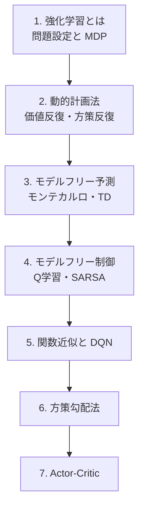

# 強化学習（Reinforcement Learning）

エージェントが環境との相互作用を通じて、試行錯誤しながら最適な行動を学ぶ枠組みを学びます。

:::abstract[この分野で身につくこと]
- 強化学習の問題設定をマルコフ決定過程 (MDP) として定式化できる
- 価値関数・方策・ベルマン方程式を理解し、導出できる
- 動的計画法・モンテカルロ法・TD 学習の違いを説明できる
- 深層強化学習（DQN, 方策勾配, Actor-Critic）の基本を実装できる
:::

## 前提知識

- 確率・期待値の基礎
- 線形代数・微積分の基礎
- Python と、できれば深層学習フレームワークの基礎（後半の章）

## ロードマップ

## 章一覧

| # | 章 | 状態 |
| --- | --- | --- |
| 1 | 強化学習とは — 問題設定と MDP | 🚧 予定 |
| 2 | 動的計画法 — 価値反復・方策反復 | 🚧 予定 |
| 3 | モデルフリー予測 — モンテカルロ・TD | 🚧 予定 |
| 4 | モデルフリー制御 — Q 学習・SARSA | 🚧 予定 |
| 5 | 関数近似と DQN | 🚧 予定 |
| 6 | 方策勾配法 | 🚧 予定 |
| 7 | Actor-Critic | 🚧 予定 |

:::note[章は順次追加されます]
「次は◯◯の章を書いて」と指示すると、統一フォーマットで新しい章が追加されます。
:::
