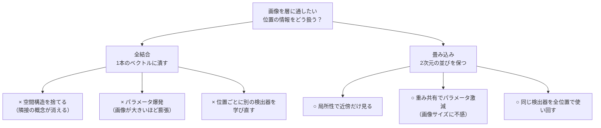
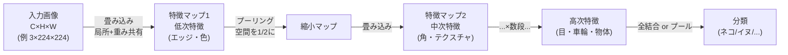
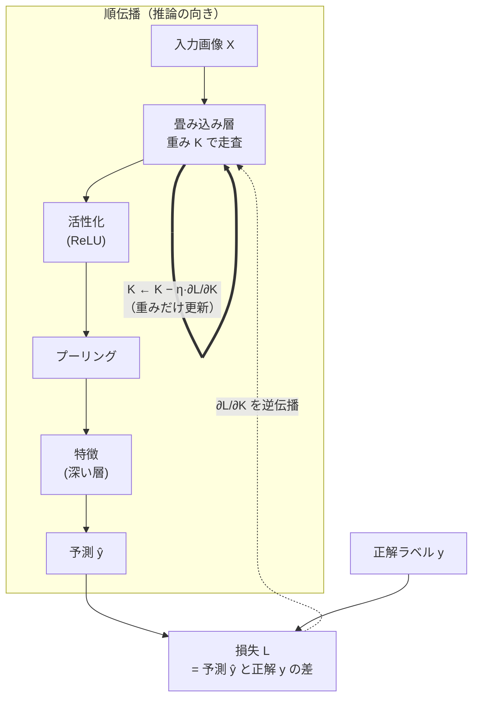
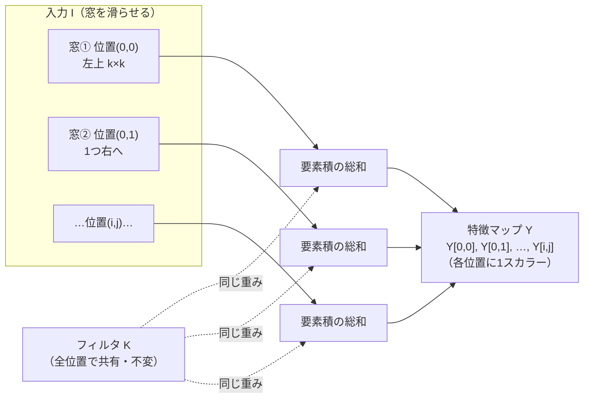
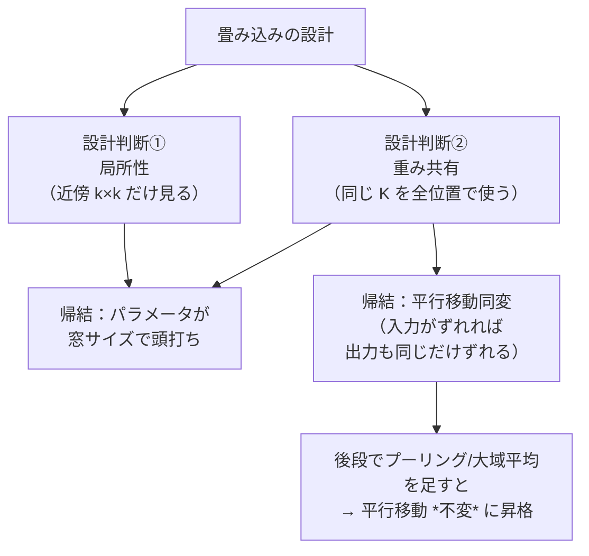
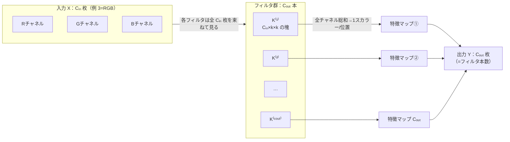
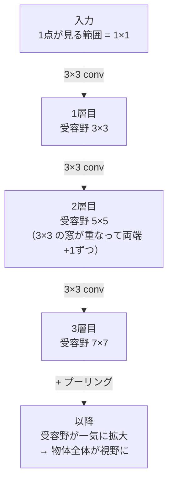
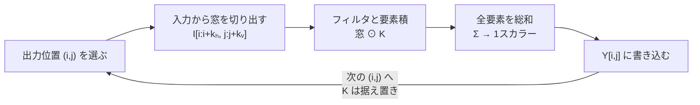

# 画像表現の基礎 — 畳み込みニューラルネット (CNN)

:::abstract[学習目標]
この章を読み終えると、次のことができるようになります。

- 画像を **チャネル付きの2次元グリッド** $\mathbf{X} \in \mathbb{R}^{C\times H\times W}$ として定式化し、各添字が何を指すか **説明** できる
- 畳み込みの3つの性質 —— **局所性 (locality)**・**重み共有 (weight sharing)**・**平行移動同変 (translation equivariance)** —— を、それぞれ式と直感で **区別** できる
- 「なぜ画像に全結合ではなく畳み込みを使うのか」を、**パラメータ数**と**帰納バイアス**の2軸で **論証** できる
- **フィルタ**・**プーリング**・**階層的特徴**が、エッジ → 部品 → 物体という特徴の積み上げをどう実現するか **説明** できる
- numpy だけで 2D 畳み込みを実装し、エッジ検出フィルタを画像に適用して応答を **確認** できる
:::

## 前提知識

- [言語モデルとトークン化](/llm/01-language-model-and-tokenization/)：入力を「並んだ単位（トークン）」として扱い、各単位を埋め込みベクトルにする発想。本章の「ピクセル/パッチ」はその空間版です。
- [Attention 機構](/llm/02-attention/)・[Transformer の構造](/llm/03-transformer/)：「位置ごとに独立な全結合 (FFN)」と「位置をまたいで混ぜる層」という役割分担。畳み込みは後者の **局所版**にあたります。次章の ViT への橋渡しにもなります。
- 線形代数の基礎：行列・ベクトルの積、要素積（アダマール積）と総和。

LLM 出身の読者へ。LLM では入力は **1次元の系列**で、attention が「どの位置とどの位置を結ぶか」をデータから学びました。画像は **2次元のグリッド**で、しかも「近いピクセルほど関係が強い」という強い事前知識があります。畳み込みは、その事前知識を**構造として最初から組み込んだ層**です。差分だけを丁寧に積み上げます。

## 直感

画像は数百万個のピクセルの集まりです。ネコの写真を「ネコ」と言い当てるには、このピクセルの海から **意味**を取り出さなければなりません。

素朴には、全ピクセルを1本のベクトルに並べて全結合層（LLM の FFN と同じもの）に流せばよさそうです。ところがこれは2つの理由で破綻します。

1. **パラメータが爆発する。** $224\times224\times3$ の画像を1000次元へ全結合すると、重みは約 1.5 億個。1層でこれです。
2. **位置が変わると別物扱いになる。** 左上のネコと右下のネコは、全結合層にとって「まったく違う入力」です。同じ「ネコらしさ」を、画面のあらゆる位置で別々に学び直さねばなりません。

人間の視覚はそうではありません。「エッジ」「角」「目」のような **局所的な部品**を、画面の**どこにあっても同じように**見つけます。畳み込みは、この「**小さな窓を画像全体で滑らせ、同じパターン検出器を使い回す**」というアイデアをそのまま層にしたものです。これが視覚モダリティのほぼすべての土台になります。

この「全結合か畳み込みか」という分岐が、何を引き換えに何を得るのかを、最初に一望しておきます。次の節以降は、この分岐の右側（畳み込み）を一段ずつ降りていく旅です。



## 全体像

CNN は、小さなフィルタを画像上で滑らせて **特徴マップ**を作り、それをプーリングで間引き、これを何段も積むことで **エッジ → 部品 → 物体**へと特徴を抽象化していきます。



順方向は上の通り「ピクセル → 意味」です。逆方向（学習）では、出力の誤差を逆伝播して **フィルタの重みそのもの**を更新します。つまり「どんな局所パターンを検出すべきか」を、人手で設計せずデータから学びます。古典的画像処理では Sobel などのフィルタを人が決めましたが、CNN では**フィルタが学習対象**になる —— ここが革命でした。

この「順方向で推論し、逆方向で誰の何を更新するか」を、学習ループとして1枚にしておきます。更新されるのは入力画像でも特徴マップでもなく、**フィルタの重み（とバイアス）だけ**である点に注目してください。



ここで $\eta$ は学習率です。逆方向の点線は「損失の勾配がフィルタへ伝わる」流れ、太い矢印は「その勾配で **フィルタ $K$ 自身が書き換わる**」更新を表します。入力画像 $X$ は固定（与えられたデータ）で、書き換わらないことを強調しておきます —— これは LLM の学習で「埋め込み行列や重みは更新されるが、入力トークン列そのものは固定」なのと同じ構図です。

:::note[LLM ↔ Vision]
| | LLM (Transformer) | Vision (CNN) |
| --- | --- | --- |
| 入力 | 1次元トークン列 | 2次元（チャネル付き）グリッド |
| 位置の混ぜ方 | self-attention（全位置と結べる・学習） | 畳み込み（近傍だけ・固定の接続パターン） |
| 位置ごとの処理 | FFN（位置独立の全結合） | 1×1 畳み込み（位置独立の全結合に等価） |
| 事前知識 | 弱い（データで決める） | 強い（局所性・平行移動同変を構造で強制） |

畳み込みは「**近傍に限定し、同じ重みを全位置で使い回す attention**」のようなもの、と捉えると橋が架かります。次章の ViT は、この近傍制限を外して attention に戻す試みです。
:::

## 理論

### 画像とは何か：チャネル付き2次元グリッド

画像は **3階のテンソル** $\mathbf{X} \in \mathbb{R}^{C\times H\times W}$ です。各添字を全部定義します。

- **$C$（チャネル, channel）**：色や特徴の本数。入力画像なら $C=3$（赤・緑・青の R/G/B）。中間層では $C$ は「フィルタの本数」になり、64・128・…と増えます。各チャネルは「ある特徴がどこにどれだけあるか」を表す **1枚の地図**です。
- **$H$（高さ, height）・$W$（幅, width）**：縦・横のピクセル数。空間的な位置をインデックスします。
- 要素 $\mathbf{X}[c, i, j]$ は「チャネル $c$ の、縦 $i$ 行・横 $j$ 列の地点の値」。入力なら「ピクセル $(i,j)$ の色 $c$ の明るさ」、中間層なら「位置 $(i,j)$ にチャネル $c$ の特徴がどれだけ強く現れたか」です。

:::warning[ピクセルの並びは「ただのベクトル」ではない]
全結合層に流すとき、私たちは画像を $C\cdot H\cdot W$ 次元の1本のベクトルに**平らに潰し**ます。このとき「隣り合うピクセルが隣り合う」という空間構造は**完全に失われます**。全結合層から見れば、ピクセルをランダムに並べ替えても（毎回同じ並べ替えを使う限り）まったく同じ問題です。画像の本質である「近いものほど関係が強い」を、全結合は一切活用できません。畳み込みはこの構造を**捨てずに保つ**層です。
:::

### 畳み込み：3つの性質

畳み込み層の心臓は **フィルタ（カーネル, kernel）** $\mathbf{K} \in \mathbb{R}^{k_h\times k_w}$ です（多チャネルは後述）。$k_h\times k_w$ は典型的に $3\times3$ や $5\times5$ という**小さな窓**です。このフィルタを画像の上で滑らせ、各位置で「窓の中身とフィルタの要素積の総和」を取ります。これが出力の特徴マップ $\mathbf{Y}$ になります。

<figure>
  <canvas id="conv-slide" width="1600" height="760" aria-hidden="true"></canvas>
  <figcaption class="fig-cap"><span>3×3 カーネルを入力で滑らせ、各位置で「窓の9マス → 出力の1マス」を作る。同じ重みを全位置で使い回す（重み共有）のが畳み込みの肝</span><span>入力 7×7 → 出力 5×5</span></figcaption>
</figure>

この「滑らせて要素積の総和を取る」動作を、誰が・いつ・何を入力に・何を出力するかという順で1枚にします。同じフィルタ $K$ が窓の位置を変えながら何度も使われ、各位置で1つのスカラー（応答）を出力に書き込んでいく、というループです。



読み方は次の通りです。**入力の窓**は位置を変えながら次々に切り出され（局所性：各窓は近傍 $k\times k$ だけ）、**フィルタ $K$** は全部の窓に対して**同じ重み**で掛かり（重み共有：点線がすべて同じ $K$ を指す）、各窓から出た1つのスカラーが**出力の対応する1マス**に書き込まれます。窓が右下まで到達すれば特徴マップ1枚が完成します。「窓ごとに別の検出器を持つのではなく、1つの検出器を画像全体で使い回す」ことが図の点線で見て取れます。

ここから、畳み込みを定義づける3つの性質が出ます。お互いに別の概念なので、混同しないよう1つずつ分けます。

**1. 局所性 (locality)。** 出力 $\mathbf{Y}[i,j]$ は、入力のうち $(i,j)$ の**近傍 $k_h\times k_w$ だけ**を見ます。遠くのピクセルは（その層では）一切関与しません。全結合が「出力1点が入力全点を見る」のと正反対です。直感：エッジや角は局所的なパターンなので、それを見つけるのに画像全体は要りません。

**2. 重み共有 (weight sharing / parameter sharing)。** 同じフィルタ $\mathbf{K}$ を、**すべての出力位置で使い回します**。位置 $(0,0)$ も $(50,50)$ も、まったく同じ重みでパターンを探します。直感：「縦エッジ検出器」は画面のどこでも縦エッジ検出器であるべきで、位置ごとに別々の検出器を持つ必要はありません。これがパラメータ激減の正体です。

**3. 平行移動同変 (translation equivariance)。** 入力を $\Delta$ だけ平行移動すると、出力も**同じだけ平行移動**します（端の効果を除く）。式で書くと、平行移動を $T_\Delta$、畳み込みを $\mathrm{Conv}$ として

$$
\mathrm{Conv}(T_\Delta \mathbf{X}) = T_\Delta\,\mathrm{Conv}(\mathbf{X})
$$

が成り立ちます。直感：ネコが右に動けば、「ネコらしさの応答」も右に動くだけ。検出する内容は変わりません。これは重み共有の**論理的帰結**です（同じ検出器を全位置で使うから、入力がずれれば応答もそのままずれる）。

3つの性質は独立ではなく、**局所性と重み共有という2つの設計判断から、平行移動同変が自動的に導かれる**という依存関係を持ちます。「何を設計で決め、何が結果として付いてくるか」を木で整理します。



この木で押さえるべきは、**同変は設計者が直接書き込んだ性質ではなく、重み共有から自動的に出てくる帰結**だという点です。そして最終的に欲しい「位置によらず同じラベル」という不変性は、同変な畳み込みだけでは届かず、後段の位置を畳む操作（次に説明するプーリング）を足して初めて得られます。すぐ下の注意書きで、この同変と不変の取り違えを名指しで潰します。

3つの性質と、それぞれが「設計か帰結か」「何を得るか」を一覧にしておきます。

| 性質 | 一言の定義 | 設計 / 帰結 | 直接の効果 | 全結合との対比 |
| --- | --- | --- | --- | --- |
| 局所性 | 出力1点は近傍 $k\times k$ だけ見る | 設計で強制 | 計算と接続を近傍に限定 | 全結合は出力1点が入力全点を見る |
| 重み共有 | 同じ $K$ を全位置で使い回す | 設計で強制 | パラメータが画像サイズに不感 | 全結合は位置ごとに別の重み |
| 平行移動同変 | 入力がずれれば出力も同じだけずれる | 重み共有の帰結 | 位置不問の特徴検出 | 全結合は位置がずれると別物扱い |
| 平行移動不変 | 入力がずれても出力が変わらない | プーリング等を足して獲得 | 「どこにあるか」を捨て「あるか」を残す | 単体の層では得られない |

:::warning[同変 (equivariance) と不変 (invariance) は違う]
**同変**は「入力がずれたら出力も**ずれる**（一緒に動く）」。**不変 (invariance)** は「入力がずれても出力が**変わらない**」。畳み込み自体は**同変**であって不変ではありません。「位置によらず同じラベルを出す」という不変性は、畳み込みだけでは得られず、後段の **プーリングや大域平均**（位置情報を畳んで捨てる操作）で初めて獲得されます。「CNN は平行移動に強い」を「畳み込み層が不変」と早合点しないこと —— 同変な層と、位置を畳む層の**合わせ技**で頑健性が出ます。
:::

### 多チャネルへの拡張

実際のフィルタは入力の全チャネルを束ねて見ます。入力 $\mathbf{X}\in\mathbb{R}^{C_{\text{in}}\times H\times W}$ に対し、1つのフィルタは $\mathbf{K}\in\mathbb{R}^{C_{\text{in}}\times k_h\times k_w}$ という**3次元の塊**です。各出力位置で、全入力チャネル・全窓位置にわたって要素積を総和し、**1つのスカラー**を出します。これを $C_{\text{out}}$ 本のフィルタで行うので、出力は $\mathbf{Y}\in\mathbb{R}^{C_{\text{out}}\times H'\times W'}$ になります。

ここでチャネルの本数がどう変わるか —— 入力の $C_{\text{in}}$ 枚が各フィルタ内で潰れて消え、フィルタの**本数** $C_{\text{out}}$ が出力の枚数になる —— を図で押さえます。「入力チャネル数」と「出力チャネル数」を取り違えやすいので、データの流れとして見るのが確実です。



この図から読み取るべき動作は2つです。第一に、**1本のフィルタは入力の全 $C_{\text{in}}$ 枚を束ねて見て、たった1枚の特徴マップを出す**（チャネル方向に総和して潰すから）。第二に、**特徴マップの枚数 $C_{\text{out}}$ はフィルタの本数で決まる**（入力チャネル数とは無関係に、何種類の特徴を探すか＝何本フィルタを置くかで決まる）。だから $3\times224\times224$ の RGB 画像に 64 本のフィルタを当てれば、出力は $64\times H'\times W'$ になります。

- 入力チャネル $C_{\text{in}}$ は窓の中で**潰れて消えます**（総和されるので、出力には残らない）。
- 出力チャネル $C_{\text{out}}$ は**フィルタの本数**そのもの。フィルタ1本＝特徴1種類で、「縦エッジ」「赤い斑点」「斜め線」のように、本数ぶんの異なる特徴地図を作ります。

:::warning[「入力チャネルごとに別の特徴マップが出る」ではない]
よくある誤解は「入力が RGB の3枚だから、畳み込み後も3枚出る」というものです。違います。**1本のフィルタは RGB の3枚を同時に見て、それらをチャネル方向に総和して1枚に潰します**。3枚に分かれたままにはなりません。出力が何枚になるかは、入力の枚数ではなく**フィルタを何本置いたか**だけで決まります。RGB 入力に 64 本置けば、出力は 3 枚でも 64×3 枚でもなく、ちょうど **64 枚**です。
:::

:::note[1×1 畳み込みは「位置ごとの全結合」]
$k_h=k_w=1$ の畳み込みは、空間を一切混ぜず、各位置で $C_{\text{in}}$ 次元 → $C_{\text{out}}$ 次元の線形変換をするだけです。これは **LLM の FFN（位置独立の全結合）とまったく同じ操作**です。「attention＝位置を混ぜる／FFN＝チャネルを混ぜる」という LLM の役割分担が、Vision では「$k>1$ の畳み込み＝空間を混ぜる／$1\times1$ 畳み込み＝チャネルを混ぜる」に対応します。
:::

### プーリング：空間を畳んで頑健性と効率を得る

**プーリング (pooling)** は、特徴マップを小さな窓（典型的に $2\times2$）に区切り、各窓を**1つの値に要約**する操作です。代表は **max pooling**（窓内の最大値を取る）と **average pooling**（平均を取る）。

- **空間を $1/2$ に縮める** → 後段の計算量とパラメータが減り、受容野（後述）が相対的に広がる。
- **小さな平行移動への頑健性** → 窓内のどこにエッジがあっても最大値はほぼ同じ。前述の「不変性」はここで初めて少し得られます。
- **学習パラメータを持たない**（max/average は固定の集約操作）。重みを増やさずに空間を要約できるのが利点です。

max と average は「窓を1値にする」点では同じですが、何を残し何を捨てるかが違います。場面で選び分けるための対比を置きます。

| | max pooling | average pooling |
| --- | --- | --- |
| 窓の要約 | 最大値（最も強い応答） | 平均値（窓全体のならし） |
| 残すもの | 「その特徴がどこかにあったか」 | 「その特徴が全体としてどれくらいか」 |
| 平行移動への頑健性 | 強い（位置が窓内なら最大値は不変） | 中（位置が変わると平均も少し動く） |
| 典型的な使い所 | 中間層（部品の有無を拾う） | 最終段の **global average pooling**（空間を全部畳む） |
| 学習パラメータ | なし | なし |

### 階層的特徴と受容野

畳み込みとプーリングを**何段も積む**と、各層が見る範囲 —— **受容野 (receptive field)** —— が深くなるほど広がります。$3\times3$ 畳み込みを2段重ねると、出力1点は入力の $5\times5$ を、3段で $7\times7$ を見ます。プーリングを挟めばさらに加速します。

**なぜ重ねると広がるのか**を1ステップずつ歩きます。2層目の出力1点は、1層目の出力の $3\times3$ を見ます。ところが**その $3\times3$ の各点が、すでに入力の $3\times3$ を見ている**ので、隣り合う窓が1ずつずれて重なりながら、入力側では $5\times5$ の範囲をカバーします。これがもう1段増えるごとに両端に1ずつ広がり、$3\times3$ を $n$ 段で受容野は $(2n+1)\times(2n+1)$ になります。



プーリングで空間を $1/2$ にすると、同じ $3\times3$ 窓が**元の解像度では $2$ 倍の範囲**を覆うことになるので、受容野の拡大はさらに加速します（だから上図の最後で一気に広がります）。「層を深くする」とは、計算量の都合だけでなく、**1点が画像のより広い文脈を見られるようにする**ための装置でもあるわけです。

この結果、特徴は自然に階層化します。

| 層の深さ | 受容野 | 学習される特徴の例 | LLM での対応 |
| --- | --- | --- | --- |
| 浅い（1〜2層目） | 狭い（数ピクセル） | エッジ・色・明暗の境界 | 浅い層：表層的な統計・文字種 |
| 中間 | 中（数十ピクセル） | 角・曲線・テクスチャ・簡単な部品 | 中間層：句・構文的なまとまり |
| 深い（最終付近） | 広い（画像の大部分） | 目・車輪・顔・物体全体 | 深い層：抽象的な意味・文全体 |

:::warning[この階層は人が設計したのではない]
「浅い層がエッジ、深い層が物体」という分業は、**設計で強制したものではなく、分類誤差を下げるよう学習した結果として創発したもの**です。誰も「1層目はエッジを検出せよ」とは命じていません。にもかかわらず、訓練済み CNN の第1層フィルタを可視化すると、ほぼ必ず Gabor 様のエッジ・色検出器が現れます。これは、エッジが画像を説明する効率的な「語彙」だからです。LLM の浅い層が表層的な統計、深い層が抽象的な意味を捉えるのと同じ現象が、空間版で起きています。
:::

### 学習時 vs 推論時

| | 学習時 (training) | 推論時 (inference) |
| --- | --- | --- |
| フィルタの重み | 逆伝播で**更新**される | **固定**（学習済みの値を読むだけ） |
| 計算の向き | 順伝播 → 損失 → 逆伝播 | 順伝播のみ |
| 何が動くか | フィルタが「何を検出するか」を獲得していく | 各フィルタが画像を走査して応答を出す |

推論時、畳み込みは「**学習で決まった固定のフィルタ群を画像上で滑らせるだけ**」の決定的な操作です。古典画像処理で Sobel フィルタを当てるのと計算は同型 —— 違いは「そのフィルタが人手設計か、データから学習されたか」だけです。

:::warning[「畳み込みは固定のエッジ検出器」ではない]
Sobel や Gaussian ぼかしのような古典フィルタは**人が値を決め打ちした固定の道具**です。CNN のフィルタは形こそ同じ小窓ですが、**中身の数値が学習で決まる変数**です。だから「畳み込み層＝決まったエッジ検出器」と理解すると半分しか合っていません。正しくは「**どんな局所パターンを探すかをデータから獲得した、学習済みの検出器の束**」です。推論時に固定なのは、あくまで学習が終わって値が確定した後の話です。
:::

## 数式の導出

### 2D 畳み込み（相互相関）の定義

単一チャネルで、出力位置 $(i,j)$ の値を導きます。フィルタ $K\in\mathbb{R}^{k_h\times k_w}$ を入力 $I$ の上に置き、フィルタ内の各オフセット $(m,n)$ について「入力の対応ピクセル × フィルタ重み」を取り、フィルタ全体で総和します。

$$
(I * K)[i,j] = \sum_{m}\sum_{n} I[i+m,\,j+n]\,K[m,n]
$$

ここで各記号を定義します。

- $I[i+m,\,j+n]$：出力位置 $(i,j)$ を起点に、フィルタ内オフセット $(m,n)$ だけずれた**入力ピクセル**。$(m,n)$ がフィルタの $k_h\times k_w$ 個を走るので、参照する入力は $(i,j)$ 近傍の小窓だけ（＝**局所性**）。
- $K[m,n]$：フィルタの $(m,n)$ 番目の**重み**。$(i,j)$ に依存しない —— どの出力位置でも同じ $K$ を使う（＝**重み共有**）。
- $\sum_m\sum_n$：窓内・全オフセットの**総和**。要素積の合計が、その位置でのフィルタとの「一致度（応答）」になります。

この式が「窓を1つ置いて1スカラーを出す」までの流れを、$(i,j)$ を1点に固定して逐次で歩きます。出力1マスの計算は次の3ステップに分解できます。



ループの肝は最後の戻り矢印です。$(i,j)$ を次の位置へ進めても **$K$ は据え置き**で、窓だけがずれていきます。これが「同じ検出器を全位置で使い回す」重み共有の、計算としての姿です。この $3\times3$ なら9個の積を足すだけの操作が、後述の実装の `np.sum(patch * K)` の1行に対応します。

:::note[なぜ「畳み込み」なのに反転しないのか]
数学の畳み込みは厳密には $K[m,n]$ ではなく $K[-m,-n]$（カーネルを反転）を使い、上の式は正しくは **相互相関 (cross-correlation)** です。CNN では慣習的に反転せず、上の形をそのまま「畳み込み」と呼びます。フィルタは学習されるので、反転の有無は学習で吸収され、結果に本質的な差はありません。本章・実装ともこの慣習に従います。
:::

### 多チャネル・多フィルタへの一般化

入力チャネル $C_{\text{in}}$、出力チャネル $c_{\text{out}}$ のフィルタ $K^{(c_{\text{out}})}\in\mathbb{R}^{C_{\text{in}}\times k_h\times k_w}$ を使うと、

$$
Y[c_{\text{out}},\,i,\,j] = b_{c_{\text{out}}} + \sum_{c=1}^{C_{\text{in}}}\sum_{m}\sum_{n} X[c,\,i+m,\,j+n]\;K^{(c_{\text{out}})}[c,\,m,\,n]
$$

- 入力チャネル $c$ について総和 → $C_{\text{in}}$ が出力で**消える**。
- $b_{c_{\text{out}}}$ は出力チャネルごとのバイアス。
- これを $c_{\text{out}}=1,\dots,C_{\text{out}}$ について繰り返すと、$C_{\text{out}}$ 枚の特徴マップが揃う。

### パラメータ共有の効果（全結合 vs 畳み込み）

なぜ畳み込みが有利かを**数で**示します。入力 $C_{\text{in}}\times H\times W$ を、同じ空間サイズ $C_{\text{out}}\times H\times W$ の出力へ写すとします。

**全結合**なら、出力の各要素が入力の全要素に重みを持つので、重みの数は

$$
N_{\text{fc}} = (C_{\text{in}}\,H\,W)\times(C_{\text{out}}\,H\,W)
$$

**畳み込み**なら、$C_{\text{out}}$ 本のフィルタが各 $C_{\text{in}}\times k_h\times k_w$ の重みを持ち、全位置で共有するので

$$
N_{\text{conv}} = C_{\text{out}}\times(C_{\text{in}}\,k_h\,k_w) + C_{\text{out}}
$$

決定的なのは、$N_{\text{conv}}$ が **$H,W$ に依存しない**ことです。画像が大きくなっても重みは増えません（全結合は $H^2W^2$ で増える）。比を取ると、$C_{\text{in}}=3,\,C_{\text{out}}=16,\,H=W=32,\,k=3$ のとき後述の実装で **約 11 万倍**の差になります。

両者が画像サイズ $H=W$ に対してどう増えるかを、式の形で並べておきます。ここが「畳み込みが勝つ」理由の核心です。

| | パラメータ数 | $H=W$ への依存 | $H,W$ を2倍にすると |
| --- | --- | --- | --- |
| 全結合 | $C_{\text{in}}C_{\text{out}}\,(HW)^2$ | $\propto (HW)^2 = H^2W^2$ | **16 倍**に膨張 |
| 畳み込み | $C_{\text{out}}C_{\text{in}}k_hk_w + C_{\text{out}}$ | **依存しない（定数）** | **不変**（同じ重み数） |

これは2つの恩恵を同時に生みます。

1. **記憶容量の節約**：少ない重みで同じ空間サイズを処理できる。
2. **汎化（帰納バイアス）**：「位置によらず同じ特徴を探す」という**正しい事前知識**を構造で強制するので、少ないデータで学べ、過学習しにくい。全結合はこの制約がない分、表現力は高いが、画像では**自由すぎて**データを浪費します。$\blacksquare$

## 実装

numpy だけで 2D 畳み込みを実装し、エッジ検出フィルタをトイ画像に当てて、3つの性質（局所性・重み共有・平行移動同変）とパラメータ削減を実測で確かめます。

```python title="conv_toy.py"
import numpy as np

# ---- 2D 相互相関（CNN の「畳み込み」） ----
def conv2d_valid(I, K):
    """I: (H, W) の入力, K: (kh, kw) のフィルタ。valid モード（パディングなし）。
    出力サイズは (H-kh+1, W-kw+1)。CNN の慣習どおり相互相関（カーネルを反転しない）で実装する。"""
    H, W = I.shape
    kh, kw = K.shape
    oh, ow = H - kh + 1, W - kw + 1
    out = np.zeros((oh, ow), dtype=float)
    for i in range(oh):
        for j in range(ow):
            patch = I[i:i+kh, j:j+kw]      # 出力位置 (i,j) に対応する局所窓（局所性）
            out[i, j] = np.sum(patch * K)  # 要素積の総和 = フィルタ応答
    return out

# ---- 8x8 のトイ画像：左半分が暗(0)、右半分が明(1)。中央に縦エッジ。 ----
img = np.zeros((8, 8))
img[:, 4:] = 1.0
print("入力画像 (8x8):")
print(img.astype(int))

# ---- 縦エッジ検出フィルタ (Sobel 風)：横方向の明暗差に反応する ----
Kx = np.array([[-1, 0, 1],
               [-2, 0, 2],
               [-1, 0, 1]], dtype=float)
fx = conv2d_valid(img, Kx)
print("\n縦エッジ応答 (Sobel-x):")
print(np.round(fx, 1))

# ---- 横エッジ検出フィルタ。横方向には変化がないので応答は 0 になるはず ----
Ky = Kx.T
fy = conv2d_valid(img, Ky)
print("\n横エッジ応答 (Sobel-y) max abs:", round(float(np.abs(fy).max()), 4))

# ---- 平行移動同変の確認：入力を右に1列ずらすと、応答も右に1列ずれる ----
img_shift = np.zeros((8, 8))
img_shift[:, 5:] = 1.0
fx_shift = conv2d_valid(img_shift, Kx)
print("\n平行移動: 元の応答のピーク列 =", int(np.argmax(np.abs(fx).sum(0))),
      "/ ずらした応答のピーク列 =", int(np.argmax(np.abs(fx_shift).sum(0))))

# ---- パラメータ数の比較：全結合 vs 畳み込み（重み共有の効果） ----
H = W = 32
Cin, Cout = 3, 16
k = 3
fc_params = (H*W*Cin) * (H*W*Cout)            # 同じ空間サイズへ全結合した場合
conv_params = (k*k*Cin) * Cout + Cout          # 重み共有のフィルタ + バイアス
print("\n--- パラメータ数 (32x32x3 -> 32x32x16) ---")
print("全結合:", f"{fc_params:,}")
print("畳み込み(3x3):", f"{conv_params:,}")
print("比率:", f"{fc_params/conv_params:,.0f}x")

# ---- max pooling 2x2：空間を間引き、小さなズレに頑健にする ----
def maxpool2x2(X):
    H, W = X.shape
    out = np.zeros((H//2, W//2))
    for i in range(H//2):
        for j in range(W//2):
            out[i, j] = X[2*i:2*i+2, 2*j:2*j+2].max()
    return out

absfx = np.abs(fx)
pooled = maxpool2x2(absfx[:6, :6])  # 6x6 -> 3x3
print("\nプーリング前 (|縦エッジ応答| の左上 6x6):")
print(np.round(absfx[:6, :6], 1))
print("max pooling 2x2 後 (3x3):")
print(np.round(pooled, 1))
```

```text title="出力"
入力画像 (8x8):
[[0 0 0 0 1 1 1 1]
 [0 0 0 0 1 1 1 1]
 [0 0 0 0 1 1 1 1]
 [0 0 0 0 1 1 1 1]
 [0 0 0 0 1 1 1 1]
 [0 0 0 0 1 1 1 1]
 [0 0 0 0 1 1 1 1]
 [0 0 0 0 1 1 1 1]]

縦エッジ応答 (Sobel-x):
[[0. 0. 4. 4. 0. 0.]
 [0. 0. 4. 4. 0. 0.]
 [0. 0. 4. 4. 0. 0.]
 [0. 0. 4. 4. 0. 0.]
 [0. 0. 4. 4. 0. 0.]
 [0. 0. 4. 4. 0. 0.]]

横エッジ応答 (Sobel-y) max abs: 0.0

平行移動: 元の応答のピーク列 = 2 / ずらした応答のピーク列 = 3

--- パラメータ数 (32x32x3 -> 32x32x16) ---
全結合: 50,331,648
畳み込み(3x3): 448
比率: 112,347x

プーリング前 (|縦エッジ応答| の左上 6x6):
[[0. 0. 4. 4. 0. 0.]
 [0. 0. 4. 4. 0. 0.]
 [0. 0. 4. 4. 0. 0.]
 [0. 0. 4. 4. 0. 0.]
 [0. 0. 4. 4. 0. 0.]
 [0. 0. 4. 4. 0. 0.]]
max pooling 2x2 後 (3x3):
[[0. 4. 0.]
 [0. 4. 0.]
 [0. 4. 0.]]
```

このトイ実験の各ブロックが、本文のどの主張を検証しているかを対応づけておきます。コードを読むときの地図にしてください。

| コードのブロック | 検証している主張 | 出力で見るべき数 |
| --- | --- | --- |
| `Kx` の縦エッジ応答 | 局所性＋特徴選択性 | 中央2列だけ $\pm4$、平坦部は $0$ |
| `Ky`（横エッジ）の応答 | フィルタは「探すパターン」を選ぶ | max abs が **$0$** |
| `img_shift` のピーク列比較 | 平行移動同変 | ピーク列が $2\to3$ へ同じだけ移動 |
| `fc_params` vs `conv_params` | 重み共有の効果 | 比率 **約 11 万倍** |
| `maxpool2x2` | プーリングが情報を保って間引く | 強い応答 $4$ を残し $6\times6\to3\times3$ |

実測から3点を読み取れます。

- **局所性＋特徴選択性**：縦エッジ検出器は、明暗が切り替わる**中央2列だけ**で強く応答（$\pm4$）し、平坦な領域は $0$。同じ入力に横エッジ検出器を当てると応答は **完全に $0$**（横方向に変化がないため）。フィルタが「探すパターン」を選んでいることが数で見えます。
- **平行移動同変**：入力の境界を1列右にずらすと、応答のピーク列も $2\to3$ へ**同じだけ移動**しました。検出する内容は不変で、位置だけがついてくる —— これが同変です。
- **重み共有の威力**：同じ空間サイズへの全結合が約 5000 万重みなのに対し、$3\times3$ 畳み込みはわずか **448** 重み。**約 11 万倍**の差です。しかも畳み込みのこの数は画像サイズに依存しません。

最後の max pooling は、$\pm$ を取った応答（左上6×6）を $2\times2$ で要約し、中央のエッジ列の強い応答 $4$ を保ったまま空間を $1/2$ に縮めています。これが「情報を保ちつつ間引く」プーリングの働きです。

## 演習

::::question[演習 1: なぜ全結合ではなく畳み込みか]
$64\times64$ のグレースケール画像（$C_{\text{in}}=1$）を入力に、同じ空間サイズ $C_{\text{out}}=8$ チャネルの特徴マップを作りたいとします。(a) 全結合層なら重みは何個ですか（バイアスは無視）。(b) $5\times5$ 畳み込み（バイアス込み・8 フィルタ）なら何個ですか。(c) 画像を $128\times128$ に大きくしたとき、それぞれの重み数はどう変わりますか。(d) この比較から、畳み込みが持つ「正しい事前知識（帰納バイアス）」を一言で述べてください。

:::details[解答]
(a) 全結合：出力 $8\times64\times64=32768$ 要素のそれぞれが入力 $1\times64\times64=4096$ 要素と重みを持つので、$32768\times4096 = 134{,}217{,}728$（約 1.3 億）個。

(b) 畳み込み：8 本のフィルタが各 $1\times5\times5=25$ の重みを持ち、バイアスが 8 個。$8\times25 + 8 = 208$ 個。

(c) $128\times128$ にすると、**全結合**は入力 $16384$・出力 $131072$ で $16384\times131072 \approx 2.1\times10^9$（約 21 億）へ **16 倍**に膨張します（$H^2W^2$ で増える）。**畳み込み**はフィルタサイズが空間に依存しないので **208 のまま不変**です。

(d) 「**探すべき特徴は画面のどの位置でも同じ（平行移動同変）であり、局所的な近傍だけ見れば十分**」という事前知識。重み共有と局所性でこれを構造に焼き込むため、パラメータが激減し、しかも画像サイズに不感です。
:::
::::

::::question[演習 2: 同変と不変、プーリングの役割]
ある CNN が、画像中のどこにネコがいても「ネコ」と1つのラベルを出します（平行移動**不変**な分類）。(a) 畳み込み層**だけ**で平行移動不変は達成できますか。理由とともに答えてください。(b) 達成できないなら、不変性はネットワークのどこで・どんな操作で得られますか。(c) max pooling が「小さなズレに頑健」になる理由を、$2\times2$ 窓の最大値という観点から説明してください。

:::details[解答]
(a) できません。畳み込みは平行移動**同変**であって不変ではないからです。入力のネコが右に動けば、特徴マップ上の「ネコらしさの応答」も右に動きます（位置が出力に残る）。ラベルは1つに定まりません。

(b) 位置情報を**畳んで捨てる**操作で得られます。具体的には、プーリングを繰り返して空間を縮め、最終的に **大域平均プーリング（global average pooling）** や全結合で空間軸を潰すと、「どこにあったか」が消え「あったかどうか」だけが残ります。同変な畳み込み層と、位置を畳む層の**合わせ技**で不変性が出ます。

(c) $2\times2$ 窓の最大値は、エッジがその窓内の4つのどのセルにあっても**同じ最大値**を返します。つまり 1 ピクセル程度のズレでは出力が変わりません。プーリングを重ねるほど、許容されるズレ幅が広がり、小さな平行移動への頑健性が積み上がります。
:::
::::

::::question[演習 3: 多チャネルの本数を追う]
入力が $C_{\text{in}}=3$（RGB）・$H=W=32$ の画像です。これに $3\times3$ のフィルタを $C_{\text{out}}=64$ 本、パディングで空間サイズを保って適用します。(a) 1本のフィルタは何個の重みを持ちますか（バイアス除く）。(b) 出力の特徴マップは何枚・各何×何ですか。(c) この層を通った後、続けて $1\times1$ 畳み込みで $64\to16$ チャネルにします。この $1\times1$ 畳み込みは LLM のどの部品と同じ働きですか。

:::details[解答]
(a) 1本のフィルタは入力の全 $C_{\text{in}}=3$ 枚を束ねて見るので、$3\times3\times3 = 27$ 個の重み。

(b) 出力の枚数は**フィルタの本数** $C_{\text{out}}=64$ 枚。空間はパディングで保たれるので各 $32\times32$。よって $64\times32\times32$。入力が3枚でも出力が3枚にならない（フィルタ本数で決まる）点が要点です。

(c) $1\times1$ 畳み込みは空間を一切混ぜず、各位置で $64$ 次元 → $16$ 次元の線形変換をするだけです。これは **LLM の FFN（位置ごと・位置独立のチャネル混合）と同じ働き**です。「空間を混ぜる $k>1$ 畳み込み」と「チャネルを混ぜる $1\times1$ 畳み込み」の役割分担が、LLM の「attention と FFN」に対応します。
:::
::::

## まとめ

:::success[この章の要点]
- 画像は **チャネル付き2次元グリッド** $\mathbf{X}\in\mathbb{R}^{C\times H\times W}$。全結合に潰すと空間構造が失われる。畳み込みはこの構造を保つ層。
- 畳み込みの3性質 —— **局所性**（近傍だけ見る）・**重み共有**（同じフィルタを全位置で使う）・**平行移動同変**（入力がずれれば出力も同じだけずれる）—— は別概念。同変は重み共有の帰結で、**不変ではない**。
- なぜ畳み込みか：重み共有で**パラメータが激減**（実測で約 11 万倍）し画像サイズに不感、かつ「位置不問の局所特徴」という**正しい帰納バイアス**で少データでも汎化する。
- **プーリング**が空間を畳んで効率と頑健性（小さなズレへの不変性）を生み、層を積むと**受容野**が広がってエッジ → 部品 → 物体という**階層的特徴**が創発する。
- 学習時はフィルタの重みが更新され、推論時はそれを固定して画像を走査するだけ。フィルタが**学習対象**であることが古典画像処理との決定的な差。
:::

### 次に学ぶこと

畳み込みは「近傍に限定し、同じ重みを全位置で使い回す」強い事前知識でパラメータと汎化を稼ぎました。しかしその局所性ゆえに、画像全体にまたがる**大域的な関係**（離れた2点の対応）を捉えるには層を深く積む必要があります。次章では、この局所制限を取り払い、画像を**パッチ（＝トークン）の列**に変えて [Attention](/llm/02-attention/) で全パッチを直接結ぶ **Vision Transformer (ViT)** に進みます。LLM の Transformer がそのまま画像へ移植される、橋渡しの章です。

→ [画像表現の基礎 — Vision Transformer (ViT)](/vision/02-vit/)

## 用語ミニ辞典

| 用語 | 一言 |
| --- | --- |
| チャネル (channel) | 色や特徴の本数。入力は R/G/B の3、中間層はフィルタ本数 |
| フィルタ / カーネル | 画像上を滑らせる小さな重み窓。学習対象。1本＝特徴1種類 |
| 特徴マップ (feature map) | 1本のフィルタが画像全体に出した応答の地図 |
| 局所性 (locality) | 出力1点は入力の近傍だけを見る性質 |
| 重み共有 (weight sharing) | 同じフィルタを全位置で使い回す。パラメータ激減の源 |
| 平行移動同変 (equivariance) | 入力がずれたら出力も同じだけずれる（不変とは別） |
| 平行移動不変 (invariance) | 入力がずれても出力が変わらない。プーリングで得る |
| プーリング (pooling) | 窓を1値に要約し空間を縮める。max / average |
| 受容野 (receptive field) | 出力1点が見る入力範囲。層を積むと広がる |
| 帰納バイアス | モデルに焼き込んだ事前知識。畳み込みは局所性＋同変 |
| 階層的特徴 | エッジ→部品→物体と深さで抽象化する特徴 |
| 1×1 畳み込み | 空間を混ぜずチャネルだけ混ぜる。FFN に等価 |

## 次のアクション

理論を手で定着させる。**最小の写経 → 動かす → 小実験** を1セットで。

1. 上の `conv_toy.py` をそのまま写経し、`uv run --with numpy python conv_toy.py` で実行して、縦エッジ応答が $\pm4$・横エッジ応答が $0$・パラメータ比が約 11 万倍になることを**自分の目で確認**する。
2. フィルタ $K$ を自分で差し替える：恒等（中央だけ 1）、ぼかし（全要素 $1/9$）、斜めエッジ（対角成分）を作り、同じ画像への応答がどう変わるか見る。「フィルタ＝探すパターン」を体感する。
3. 小実験：`conv2d_valid` に **ストライド** と **パディング** の引数を足し、出力サイズが $\lfloor (H + 2p - k)/s \rfloor + 1$ になることを実測で確かめる。次章 ViT の「パッチ分割」は、実はストライド＝パッチサイズの畳み込みと等価であることに気づけると橋が架かります。

ここまでで視覚モダリティの**土台（CNN）**が手に入ります。次章 ViT で、この局所制限を attention に置き換える発想へ進みます。

## 参考文献

1. Y. LeCun, B. Boser, J. S. Denker, et al., "Backpropagation Applied to Handwritten Zip Code Recognition," *Neural Computation*, 1989.（畳み込み＋逆伝播の原型）
2. Y. LeCun, L. Bottou, Y. Bengio, P. Haffner, "Gradient-Based Learning Applied to Document Recognition," *Proceedings of the IEEE*, 1998.（LeNet-5・CNN の古典）
3. A. Krizhevsky, I. Sutskever, G. E. Hinton, "ImageNet Classification with Deep Convolutional Neural Networks," *NeurIPS*, 2012.（AlexNet・深層学習革命の起点）
4. K. He, X. Zhang, S. Ren, J. Sun, "Deep Residual Learning for Image Recognition," *CVPR*, 2016.（ResNet・残差接続で超深層 CNN を可能に）
5. I. Goodfellow, Y. Bengio, A. Courville, *Deep Learning*, MIT Press, 2016, Ch. 9（畳み込みネットワークの教科書的整理）。
6. Z. Liu, H. Mao, C.-Y. Wu, et al., "A ConvNet for the 2020s," *CVPR*, 2022.（ConvNeXt・CNN と Transformer の設計収束）
