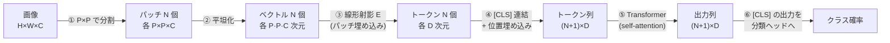

# Vision Transformer (ViT)

:::abstract[学習目標]
この章を読み終えると、次のことができるようになります。

- 画像を **パッチに分割して1トークン化** する発想を、LLM のトークン化と対応づけて **説明** できる
- パッチ数 $N=(H/P)(W/P)$ を **導出** し、**パッチ埋め込み**・**位置埋め込み**・**[CLS]** の役割をそれぞれ **述べ** られる
- ViT の self-attention が LLM の scaled dot-product attention と **同一**であることを **確認** できる
- CNN（局所性・並進不変性）と ViT（弱い帰納バイアス）の差を **比較** し、**なぜ ViT が大量データを要するか** を **説明** できる
- numpy で画像をパッチに分割 → 平坦化 → 線形埋め込みまでを **実装** し、各段階の **形（shape）** を言える
:::

## 前提知識

- 章01 [CNN](/vision/01-cnn/)：畳み込みの **局所性 (locality)** と **並進不変性 (translation equivariance)** という帰納バイアス。この章はその「帰納バイアスを捨てたらどうなるか」の話です。
- 章 [言語モデルとトークン化](/llm/01-language-model-and-tokenization/)：テキストを離散トークン列に変換し、各トークンを埋め込みベクトルにする発想。ViT は **画像を「視覚トークン列」に変換**します。
- 章 [Attention](/llm/02-attention/)：scaled dot-product attention、Query/Key/Value、softmax。ViT の中身は **この attention そのまま**です。新しい数式はほぼ出ません。

LLM 出身の読者なら、本章の核心は一文で済みます ——「**パッチを1トークンと思えば、画像も Transformer で処理できる**」。差分（どうやって画像をトークンにするか、なぜデータが要るか）だけを丁寧に積み上げます。

## 直感

[章01 の CNN](/vision/01-cnn/) は、画像を **小さな窓（カーネル）で局所的に**舐めていく仕組みでした。隣り合うピクセルは関係が深い、という前提（局所性）と、同じ模様は画像のどこにあっても同じ特徴、という前提（並進不変性）を**最初から構造に焼き込んで**います。この「焼き込み」が帰納バイアスです。

ViT (Vision Transformer) は、その帰納バイアスを**ほぼ捨てて**、代わりに [Attention 章](/llm/02-attention/) の Transformer を画像にそのまま適用します。問題は1つだけ —— **Transformer はトークン列を食べる装置**で、画像は2次元のピクセル格子です。この溝をどう埋めるか。

ViT の答えは拍子抜けするほど単純です。**画像を $16 \times 16$ などの正方形パッチに切り分け、各パッチを1個のトークンとみなす**。あとは [LLM のトークン化](/llm/01-language-model-and-tokenization/) と同じく、各トークン（パッチ）を埋め込みベクトルにして Transformer に流すだけ。タイトルの原論文名 "An Image is Worth 16x16 Words"（画像は $16 \times 16$ の単語に値する）が、この発想をそのまま言い表しています。

:::note[なぜこれが面白いか]
CNN は「画像とはこういうもの（局所・並進不変）」という知識を**人間が設計で与えて**いました。ViT はその知識を抜き、「全部のパッチ同士を見比べてよい」という最大限の自由を与えます。自由なぶん、**何が画像にとって良い構造かを、データから自分で学ぶ**必要があります。だから ViT は大量データで初めて CNN を超えます（後述の帰納バイアス節が核心）。
:::

## 全体像

ViT のパイプラインは「画像 → パッチ列 → トークン埋め込み列 → Transformer → 分類」の一本道です。順方向（推論）と、その各段で何が起きるかを先に一望します。



| 段 | 入力 | 出力 | 何をするか |
| --- | --- | --- | --- |
| ① 分割 | $H \times W \times C$ の画像 | $N$ 個の $P \times P \times C$ パッチ | 格子を正方形タイルに切る |
| ② 平坦化 | $P \times P \times C$ パッチ | 長さ $P^2 C$ のベクトル | タイルを1列に伸ばす |
| ③ パッチ埋め込み | $P^2 C$ ベクトル | $D$ 次元トークン | 学習行列 $E$ で射影 |
| ④ [CLS]＋位置 | $N$ 個のトークン | $N{+}1$ 個のトークン | 集約用トークンと位置情報を足す |
| ⑤ Transformer | $(N{+}1) \times D$ | $(N{+}1) \times D$ | self-attention で全パッチを混ぜる |
| ⑥ 分類 | [CLS] の出力 $D$ 次元 | クラス確率 | 線形ヘッド＋softmax |

:::note[LLM ↔ Vision]
この図は [言語モデルとトークン化](/llm/01-language-model-and-tokenization/) の「テキスト → トークン化 → 埋め込み → Transformer」と**同じ骨格**です。違いは入口だけ —— LLM は文字列を BPE でサブワードに割り、ViT は画像をパッチに割る。**中央の Transformer は完全に共通**で、ViT 固有の新しい層は ①〜④ の入口だけです。逆に言えば、入口さえ作れば LLM の全知識（attention, multi-head, 残差, LayerNorm）がそのまま効きます。
:::

学習時はこの順方向で [CLS] の出力から分類損失（cross-entropy）を計算し、誤差逆伝播で **$E$・位置埋め込み・[CLS]・Transformer の全パラメータ**を同時に更新します。推論時は同じ順方向を1回流すだけです（自己回帰デコードはありません —— ViT 分類器は**全パッチを一度に**見て1回で答えを出す、encoder-only モデルです）。

## 理論

入口の ①〜④ を1段ずつ、§2 の深さで定義します。⑤ の self-attention は [Attention 章](/llm/02-attention/) と同一なので、本章では「同一であること」と「画像で何が変わるか」だけ確認します。

### ① パッチ分割と ② 平坦化

画像は $H \times W \times C$ のテンソルです（$H$=高さ、$W$=幅、$C$=チャネル数。RGB なら $C=3$）。これを一辺 $P$ の正方形パッチに切ります。$P$ は **パッチサイズ**（ViT-Base なら $P=16$）。$H, W$ は $P$ で割り切れるとします。

- **縦方向のパッチ数** $= H/P$、**横方向** $= W/P$。
- 各パッチは $P \times P \times C$ の小さな画像。これを1列に**平坦化 (flatten)** すると、長さ $P \cdot P \cdot C = P^2 C$ のベクトルになります。

:::warning[パッチは「重ならない」タイル張り]
CNN のカーネルは stride によって**重なりながら**スライドしますが、ViT のパッチは原則 **stride = $P$ で重なりなく敷き詰める**（タイル張り）。だからパッチ総数はちょうど $(H/P)(W/P)$ で、端数なくぴったり割り切れます。「畳み込みのように1ピクセルずつずらす」のとは違う、と最初に押さえてください。
:::

### ③ パッチ埋め込み（patch embedding）

平坦化した各パッチベクトル $\mathbf{x}_p \in \mathbb{R}^{P^2 C}$ を、**学習行列** $E \in \mathbb{R}^{(P^2 C) \times D}$ で $D$ 次元に射影します。$D$ は **埋め込み次元**（トークンのベクトル長。ViT-Base なら $D=768$）。

$$\mathbf{z}_p = \mathbf{x}_p\, E \in \mathbb{R}^{D}$$

- $E$ は **データから学習する**パラメータです（固定値ではない）。1回学習したら推論時は使い回します。
- これは [LLM の埋め込み行列](/llm/01-language-model-and-tokenization/) と**役割が同じ**です。LLM はトークン ID（離散の整数）を埋め込み表から引きますが、ViT は**連続のパッチベクトルを線形射影**します。「離散→表引き」か「連続→射影」かの違いだけで、どちらも「トークンを $D$ 次元ベクトルにする」担当。
- 実装上は「$P \times P$・stride $P$ の畳み込み」1層と等価です（パッチ分割＋平坦化＋線形射影をまとめて1つの conv で書ける）。原論文の実装もこの形ですが、概念は上の射影と同じです。

### ④ [CLS] トークンと位置埋め込み

ここで ViT 固有の2つの仕掛けが入ります。

**[CLS] トークン（class token）。** $N$ 個のパッチトークンの**先頭に、学習可能な特別なトークン1個**を連結します。これが [CLS] です。中身は画像に依存しない**学習パラメータ**（1本の $D$ 次元ベクトル）で、最初は乱数、学習で育ちます。

- 役割：self-attention を通すうちに、[CLS] は**全パッチの情報を集約**したベクトルになります。最後にこの [CLS] の出力だけを分類ヘッドに渡します。「画像全体を1ベクトルに要約する受け皿」です。
- なぜ要るか：パッチは $N$ 個あるので、「画像全体を表す1本」が欲しい。$N$ 個を平均してもよい（実際そういう変種もある）が、[CLS] なら**どのパッチをどれだけ集約するかを attention に学ばせられる**ので柔軟です。
- LLM アナロジー：BERT の `[CLS]` トークンとまったく同じ発想です（文全体の表現を集める受け皿）。ViT は BERT の `[CLS]` を画像に持ち込みました。

**位置埋め込み（positional embedding）。** [CLS] を含む $N+1$ 個のトークンそれぞれに、**位置を表すベクトル**を足します。

- なぜ要るか：**self-attention は順序を区別しません**。トークン列をシャッフルしても attention の出力は（同じくシャッフルされるだけで）変わらない。だがパッチは「左上」「右下」という**空間位置に意味がある**。位置埋め込みがないと、ViT は「どのパッチが画像のどこにあったか」を完全に失います。
- 中身：ViT は**学習可能な位置埋め込み**（$N+1$ 本の $D$ 次元ベクトル）を使い、対応するトークンに加算します。LLM の位置埋め込みと同じ役割です。

:::warning[位置情報は「足す」のであって「並び」では伝わらない]
よくある誤解：「トークンを左上→右下の順に並べたから、Transformer は位置を知っているはず」。違います。**self-attention は並び順に不変**なので、並べただけでは位置情報はゼロです。位置は**各トークンのベクトルに加算する位置埋め込みによってのみ**注入されます。並べ方は人間の都合（実装の便宜）であって、モデルには伝わりません。
:::

こうして得た $(N+1) \times D$ のトークン列が、⑤ の Transformer の入力です。

### ⑤ self-attention は LLM と同一

Transformer エンコーダの中身は [Attention 章](/llm/02-attention/) と**完全に同じ** scaled dot-product attention です。トークン列 $Z \in \mathbb{R}^{(N+1) \times D}$ から $Q = ZW_Q$、$K = ZW_K$、$V = ZW_V$ を作り、

$$\mathrm{Attention}(Q,K,V)=\mathrm{softmax}\!\left(\frac{QK^\top}{\sqrt{d_k}}\right)V$$

で混ぜます。$d_k$ は各ヘッドの Key 次元、$\sqrt{d_k}$ で割る理由（softmax の飽和を防ぐ分散正規化）は [Attention 章の導出](/llm/02-attention/) のまま。multi-head・残差接続・LayerNorm・FFN も同一です。

:::warning[ViT の attention に causal mask は「ない」]
LLM の言語生成は「未来を見ない」ために [causal mask](/llm/02-attention/) を掛けますが、**ViT 分類器は掛けません**。画像は全パッチが同時に手元にあり、自己回帰生成もしないので、**どのパッチも全パッチ（自分含む）を自由に見てよい**（双方向 attention）。これは BERT が双方向なのと同じ理由です。「Transformer = causal」という思い込みは LLM 由来の早とちりで、ViT では全パッチが互いを参照します。
:::

画像で変わるのは中身ではなく**コスト**です。attention は系列長 $N+1$ に対し $O(N^2)$。パッチが増えると二乗で重くなります（$224 \times 224$・$P=16$ で $N=196$。解像度を上げると急増する）。これが後続の Swin（ウィンドウ注意で線形化）などの動機になりますが、本章の素の ViT は全パッチ同士の全結合 attention です。

### 帰納バイアス：CNN と何が違うか（この章の核心）

ここが ViT を理解する上で最重要です。**帰納バイアス (inductive bias)** とは、モデルが**学習前から構造として持っている前提**のこと。少ないデータでも妥当な答えに辿り着かせる「事前知識」です。

| | CNN（章01） | ViT |
| --- | --- | --- |
| 局所性 (locality) | **あり**（カーネルが隣接ピクセルのみ見る） | **なし**（最下層から全パッチを見る） |
| 並進不変性 | **あり**（同じカーネルを全位置で共有） | **弱い／なし**（位置埋め込みで位置を区別） |
| 2次元構造の知識 | **あり**（格子構造が畳み込みに内蔵） | **ほぼなし**（パッチを1次元列に並べて学ぶ） |
| 前提を入れる場所 | アーキテクチャ（設計で焼き込み） | **データ**（学習で獲得） |

- **CNN は前提が強い**：「隣は関係深い・模様は位置不変」を最初から知っている。だから**少ないデータでもそこそこ学べる**。ただし前提が画像に合っていなければ天井も低い。
- **ViT は前提が弱い**：「全パッチを自由に見比べてよい」だけ。局所性も並進不変性も**与えられていない**ので、**それらを含めて全部データから学ぶ**必要がある。

:::warning[ViT は CNN の局所バイアスを「持たない」＝大量データか蒸留が要る]
ここを取り違えないでください。**ViT は CNN の帰納バイアス（局所性・並進不変性）を持っていません。** だから:

- **中規模データ（ImageNet-1k だけ）では ViT は同規模 CNN(ResNet) に負ける**ことが多い。事前知識が無いぶん、データから構造を発見しきれないからです。
- **大規模データ（JFT-300M など、数億枚クラス）で事前学習すると ViT は CNN を逆転**します。十分なデータがあれば、ViT は局所性すら「必要に応じて」学習し、CNN の固定バイアスより柔軟な表現に到達するからです。
- 大量データが無いなら、**強い CNN 教師からの蒸留 (distillation)**（DeiT）や**強いデータ拡張**で「足りない事前知識」を補います。

一言でいうと **「ViT は自由なぶん、その自由を埋めるだけのデータ（か蒸留）を要求する」**。CNN は窮屈なぶん少データで動く。これがバックボーン選択の最重要トレードオフです。
:::

なお、この「データさえあれば設計バイアスより学習が勝つ」という観察は、[LLM の事前学習・スケーリング](/llm/04-pretraining-scaling/) で見た「データとモデルを大きくすると性能が伸びる」哲学と地続きです。ViT は**視覚にスケーリング則を持ち込んだ**モデルでもあります。

## 数式の導出：パッチ数 $N$ と系列長

ViT の系列長（トークン数）がいくつになるかを、画像サイズとパッチサイズから導きます。これが attention コスト $O(N^2)$ を決めるので、設計上いちばん効く数です。

**ステップ1：縦・横のパッチ数。** 高さ $H$ を一辺 $P$ のタイルで重なりなく敷くと、縦に並ぶパッチ数は $H/P$ 個です（$H$ は $P$ で割り切れると仮定）。同様に横は $W/P$ 個。

**ステップ2：パッチ総数。** 縦 $H/P$ 列 × 横 $W/P$ 列の格子なので、総数は積になります。

$$N = \frac{H}{P}\cdot\frac{W}{P} = \frac{HW}{P^2}$$

**ステップ3：1パッチの次元。** 各パッチは $P \times P$ ピクセル × $C$ チャネルなので、平坦化すると長さは

$$P \cdot P \cdot C = P^2 C$$

**ステップ4：Transformer 入力の形。** パッチ埋め込みで各パッチを $D$ 次元にし、[CLS] を1本足すので、入力トークン列は

$$(N+1) \times D = \left(\frac{HW}{P^2}+1\right)\times D$$

**ステップ5：具体値で確かめる。** ViT-Base は $H=W=224$、$P=16$。

$$N = \frac{224 \times 224}{16^2} = \frac{50176}{256} = 196,\qquad N+1 = 197 \text{ トークン}$$

196 パッチ ＋ [CLS] 1 個 ＝ **197 トークン**の系列です。attention コストは $O(197^2)$。解像度を $448 \times 448$ に倍にすると $N = 784$ となり、コストは約 16 倍（$N$ が4倍、二乗で16倍）に跳ねます —— だから高解像度 ViT はパッチを大きくするか、ウィンドウ注意などで $O(N^2)$ を避けます。$\blacksquare$

## 実装

numpy だけで、**画像 → パッチ分割 → 平坦化 → パッチ埋め込み → [CLS]＋位置** までを書き、各段の **形（shape）** を実測します。Transformer 本体は [Attention 章の実装](/llm/02-attention/) と同一なので、ここでは ViT 固有の**入口**に集中します。reshape がパッチを正しく切り出していることも assert で検証します。

```python title="vit_patch_embed.py"
import numpy as np

rng = np.random.default_rng(0)

# 1枚の画像（H x W x C）。小さく作って形を目で追えるようにする。
H, W, C = 8, 8, 3      # 高さ・幅・チャネル（RGB なら C=3）
P = 4                   # パッチの一辺。H, W は P で割り切れる必要がある
D = 16                  # パッチ埋め込みの次元（トークンのベクトル長）

assert H % P == 0 and W % P == 0, "H,W は P で割り切れること"

# 実画像の代わりに乱数（形の確認が目的。0-1 に正規化）
img = rng.integers(0, 256, size=(H, W, C)).astype(np.float32) / 255.0
print("画像 img の形:", img.shape)

# --- ① パッチに分割する（重なりなしのタイル張り）---
n_h, n_w = H // P, W // P          # 縦・横方向のパッチ数
N = n_h * n_w                       # パッチ総数 = トークン数
print(f"縦 {n_h} x 横 {n_w} = N={N} 個のパッチ")

# (n_h, P, n_w, P, C) に並べ替えてからパッチ軸をまとめる
patches = img.reshape(n_h, P, n_w, P, C)        # 高さ→(n_h,P)、幅→(n_w,P)
patches = patches.transpose(0, 2, 1, 3, 4)      # (n_h, n_w, P, P, C)
patches = patches.reshape(N, P, P, C)           # N 個の (P,P,C) パッチ
print("patches の形:", patches.shape)

# --- ② 各パッチを平坦化する ---
flat = patches.reshape(N, P * P * C)            # 各パッチ → 長さ P*P*C のベクトル
print("平坦化後 flat の形:", flat.shape, "（各パッチ長 =", P * P * C, "）")

# --- ③ 線形埋め込み（パッチ埋め込み）---
# 学習対象の射影行列 E。ここでは乱数で初期化（本来は学習で更新）。
E = rng.normal(0, 0.02, size=(P * P * C, D))    # 射影: (P*P*C) -> D
patch_emb = flat @ E                            # (N, D)
print("パッチ埋め込み patch_emb の形:", patch_emb.shape)

# --- ④ [CLS] トークンを先頭に連結し、位置埋め込みを足す ---
cls = rng.normal(0, 0.02, size=(1, D))          # 学習可能な集約用トークン
tokens = np.concatenate([cls, patch_emb], axis=0)   # (N+1, D)
pos = rng.normal(0, 0.02, size=(N + 1, D))      # 学習可能な位置埋め込み
tokens = tokens + pos                            # 位置情報は「加算」で注入する
print("Transformer 入力 tokens の形:", tokens.shape, "（[CLS] + N パッチ）")

# --- 検証: reshape がパッチを正しく切り出しているか ---
# 左上パッチ(index 0)は img[0:P, 0:P, :] と一致するはず
assert np.allclose(patches[0], img[0:P, 0:P, :]), "左上パッチが不一致"
# 右下パッチ(index N-1)は img[H-P:H, W-P:W, :] と一致するはず
assert np.allclose(patches[N - 1], img[H - P:H, W - P:W, :]), "右下パッチが不一致"
print("検証OK: パッチは画像の正しい矩形領域を切り出している")

# --- 実寸の ViT-Base 設定で N だけ確認 ---
H2, W2, P2 = 224, 224, 16
N2 = (H2 // P2) * (W2 // P2)
print(f"ViT-Base (224x224, P=16): N = (224/16)x(224/16) = {N2} パッチ (+CLS = {N2 + 1} トークン)")
```

```text title="出力"
画像 img の形: (8, 8, 3)
縦 2 x 横 2 = N=4 個のパッチ
patches の形: (4, 4, 4, 3)
平坦化後 flat の形: (4, 48) （各パッチ長 = 48 ）
パッチ埋め込み patch_emb の形: (4, 16)
Transformer 入力 tokens の形: (5, 16) （[CLS] + N パッチ）
検証OK: パッチは画像の正しい矩形領域を切り出している
ViT-Base (224x224, P=16): N = (224/16)x(224/16) = 196 パッチ (+CLS = 197 トークン)
```

読み取れること:

1. **パッチ数の実測**：$8 \times 8$ 画像を $P=4$ で割ると $N = (8/4)(8/4) = 4$ パッチ。導出の $N = HW/P^2$ と一致します。
2. **次元の流れ**：各パッチ $4 \times 4 \times 3 = 48$ 次元に平坦化 → $E$ で $D=16$ に射影 → [CLS] を足して $5$ トークン。`flat (4,48)` → `patch_emb (4,16)` → `tokens (5,16)` と形が階段状に変わるのが、上の理論の ①→②→③→④ にそのまま対応します。
3. **reshape の正しさ**：assert が通ったので、`reshape→transpose→reshape` がピクセルをスクランブルせず、**画像の正しい矩形領域**を各パッチとして切り出していることが保証されます（左上パッチ＝画像左上、右下パッチ＝画像右下）。ここを間違えると静かにバグるので、形だけでなく中身も検証するのが大事です。
4. **実寸**：ViT-Base（$224 \times 224$, $P=16$）では $N=196$、[CLS] を足して **197 トークン**。導出のステップ5と一致します。

ここから先（$Z = $ `tokens` を $Q,K,V$ に射影して self-attention で混ぜ、[CLS] の出力を分類ヘッドへ）は、[Attention 章の scaled dot-product attention 実装](/llm/02-attention/) を causal mask 抜きで適用するだけです。**ViT の新規部分は上の入口だけ**で、中身は LLM と共有である、という本章の主張が実装でも確認できます。

## 演習

::::question[演習 1: パッチ数と系列長]
入力画像が $H=W=384$、チャネル $C=3$、パッチサイズ $P=16$、埋め込み次元 $D=768$ の ViT を考えます。(a) パッチ数 $N$ はいくつですか。(b) 1パッチを平坦化したベクトルの長さはいくつですか。(c) パッチ埋め込み行列 $E$ の形はどうなりますか。(d) [CLS] を含めた Transformer 入力トークン列の形（系列長 × 次元）はどうなりますか。

:::details[解答]
(a) $N = (H/P)(W/P) = (384/16)(384/16) = 24 \times 24 = \mathbf{576}$ パッチ。
(b) $P^2 C = 16 \times 16 \times 3 = \mathbf{768}$。各パッチを1列に伸ばした長さです。
(c) $E$ は「平坦化パッチ次元 → 埋め込み次元」の射影なので $(P^2C) \times D = \mathbf{768 \times 768}$。（この例ではたまたま入力次元と $D$ が両方 768 で一致しますが、別物です —— 左は $P^2C$、右は $D$。）
(d) [CLS] を1本足すので $(N+1) \times D = \mathbf{577 \times 768}$。attention コストは $O(577^2)$ で、$224$ 入力（$N{+}1=197$）の約 $(577/197)^2 \approx 8.6$ 倍になります。解像度を上げると二乗で効く、を体感してください。
:::
::::

::::question[演習 2: 帰納バイアスとデータ量]
(a) ViT が CNN に対して「持っていない」帰納バイアスを2つ挙げてください。(b) その結果、ViT を中規模データ（ImageNet-1k だけ）で学習すると同規模 CNN に対してどうなりがちですか。(c) ViT が CNN を上回るには何が必要ですか。2つの方策を挙げてください。(d) self-attention は順序に不変なのに、ViT がパッチの空間位置を区別できるのはなぜですか。

:::details[解答]
(a) **局所性 (locality)**（隣接ピクセルだけ見る前提）と **並進不変性**（同じ模様はどこでも同じ特徴とみなす前提）。CNN は畳み込みの構造でこれらを最初から持ちますが、ViT は持ちません（最下層から全パッチを自由に見る）。
(b) 事前知識が無いぶんデータから構造を発見しきれず、**同規模 CNN(ResNet) に負けがち**です。帰納バイアスは少データでの強みなので、データが足りないと ViT は不利です。
(c) ① **大規模データでの事前学習**（JFT-300M など数億枚クラス）。十分なデータがあれば ViT は局所性すら学習し、固定バイアスの CNN を逆転します。② **強い CNN 教師からの蒸留（DeiT）や強いデータ拡張**で、足りない事前知識を補う。
(d) 並べ順では位置は伝わりません（self-attention は並びに不変）。**各トークンのベクトルに位置埋め込みを加算**することで初めて、ViT は「どのパッチが画像のどこにあったか」を区別できます。位置情報の注入口は加算だけ、と押さえてください。
:::
::::

## まとめ

:::success[この章の要点]
- ViT は画像を $P \times P$ の**パッチに分割し各パッチを1トークン化**して純 Transformer に入れる。発想は [LLM のトークン化](/llm/01-language-model-and-tokenization/) と同じで、新規部分は**入口（パッチ埋め込み・[CLS]・位置埋め込み）だけ**。
- パッチ数は $N = HW/P^2$（ViT-Base で 196）、[CLS] を足して系列長 $N+1$。attention コストは $O(N^2)$ なので解像度を上げると二乗で重くなる。
- 中身の self-attention は [Attention 章](/llm/02-attention/) と**完全に同一**。ただし ViT 分類器は**双方向**（causal mask なし）で、全パッチが互いを参照する。
- **[CLS]** は全パッチを集約する受け皿（BERT 由来）、**位置埋め込み**は加算で空間位置を注入する（並び順では伝わらない）。
- ViT は CNN の**局所性・並進不変性という帰納バイアスを持たない**。だから**大量データでの事前学習か蒸留**が要る。これは [LLM のスケーリング哲学](/llm/04-pretraining-scaling/)（データとモデルを大きくすると学習が設計バイアスに勝つ）と地続き。
:::

### 次に学ぶこと

ここまでで、画像を Transformer で扱う「入口」と、CNN との設計トレードオフが手に入りました。ただし ViT は本領を発揮するのに**大量データ**を要します —— ラベル付き数億枚は現実には集めにくい。そこで次は、**ラベル無し**で大量画像から表現を学ぶ枠組みへ進みます。「同じ画像の2つの見え方を近づける」対照学習や、「画像の一部を隠して当てる」マスク再構成（MAE）など、ViT を**ラベル無しで事前学習する**方法が主役になります。

→ [自己教師あり学習へ](/vision/03-self-supervised/)

## 用語ミニ辞典

| 用語 | 一言 |
| --- | --- |
| ViT | 画像をパッチ列にして純 Transformer に入れる視覚モデル |
| パッチ (patch) | 画像を区切った $P\times P$ の正方形タイル。1トークン |
| パッチサイズ $P$ | パッチの一辺（ViT-Base は 16） |
| パッチ埋め込み | 平坦化パッチを学習行列 $E$ で $D$ 次元に射影 |
| 位置埋め込み | 各トークンに加算して空間位置を注入する学習ベクトル |
| [CLS] トークン | 全パッチを集約し分類に使う学習トークン（BERT 由来） |
| 帰納バイアス | 学習前から構造で持つ前提（局所性・並進不変性など） |
| 局所性 (locality) | 隣接ピクセルだけ見る CNN の前提。ViT は持たない |
| 並進不変性 | 模様の位置に依らず同じ特徴とする CNN の前提 |
| $N=HW/P^2$ | パッチ数（= トークン数）。系列長は $N+1$ |
| 双方向 attention | causal mask 無し。全パッチが互いを参照（BERT/ViT） |
| 蒸留 (distillation) | CNN 教師から ViT が学ぶ。少データを補う（DeiT） |

## 次のアクション

理論を手で定着させる。**最小の写経 → 動かす → 小実験** を1セットで。

1. 上の `vit_patch_embed.py` を写経し、`uv run --with numpy python vit_patch_embed.py` で動かす。各段の形（`(4,48)→(4,16)→(5,16)`）が出力と一致することを確認する。
2. $P$ を $4 \to 2$ に変え、$N$ が $4 \to 16$ に増えることを確認する。**$P$ を小さくすると系列長（＝計算量）が増える**を体感する。$H,W$ を $8 \to 16$ に変えても試す。
3. 余力があれば、[Attention 章の実装](/llm/02-attention/) の scaled dot-product attention を **causal mask 抜き**で `tokens` に適用し、$(5,16)$ の出力列が出ること、先頭（[CLS]）の出力ベクトルが全パッチの加重和になっていることを確かめる。これで ViT エンコーダ1ブロックの最小版が完成する。

## 参考文献

1. A. Dosovitskiy et al., "An Image is Worth 16x16 Words: Transformers for Image Recognition at Scale," *ICLR*, 2021.（ViT 原論文。arXiv:2010.11929）
2. A. Vaswani et al., "Attention Is All You Need," *NeurIPS*, 2017.（Transformer / scaled dot-product attention の原典）
3. J. Devlin et al., "BERT: Pre-training of Deep Bidirectional Transformers for Language Understanding," *NAACL*, 2019.（[CLS] トークンと双方向 encoder の出典）
4. H. Touvron et al., "Training data-efficient image transformers & distillation through attention," *ICML*, 2021.（DeiT。蒸留で少データ ViT を実現）
5. Z. Liu et al., "Swin Transformer: Hierarchical Vision Transformer using Shifted Windows," *ICCV*, 2021.（ウィンドウ注意で $O(N^2)$ を線形化）
