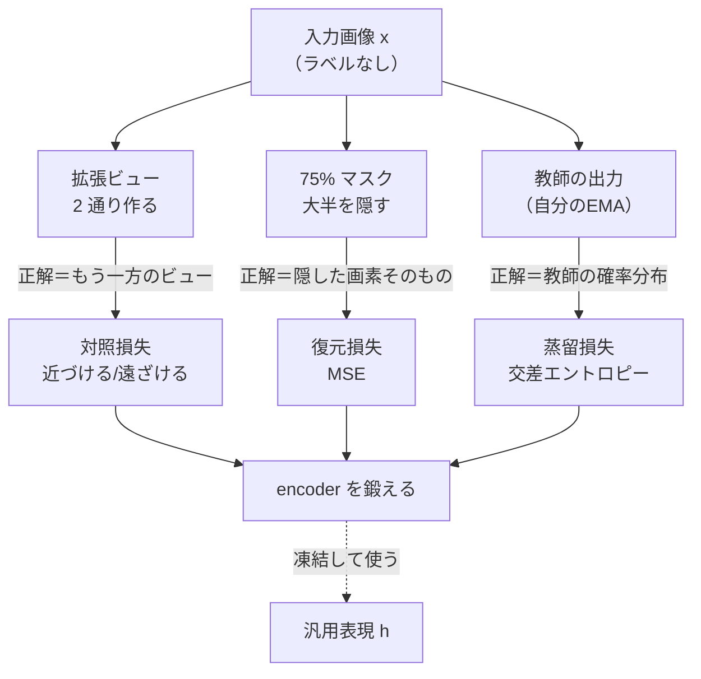
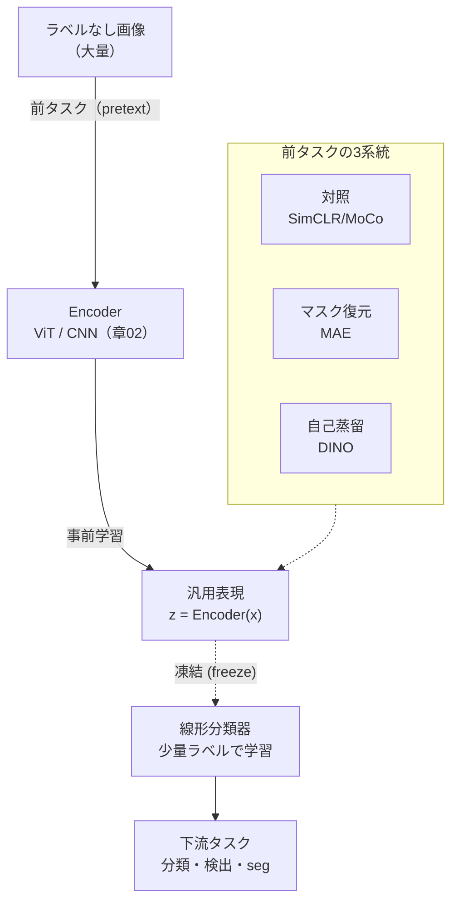
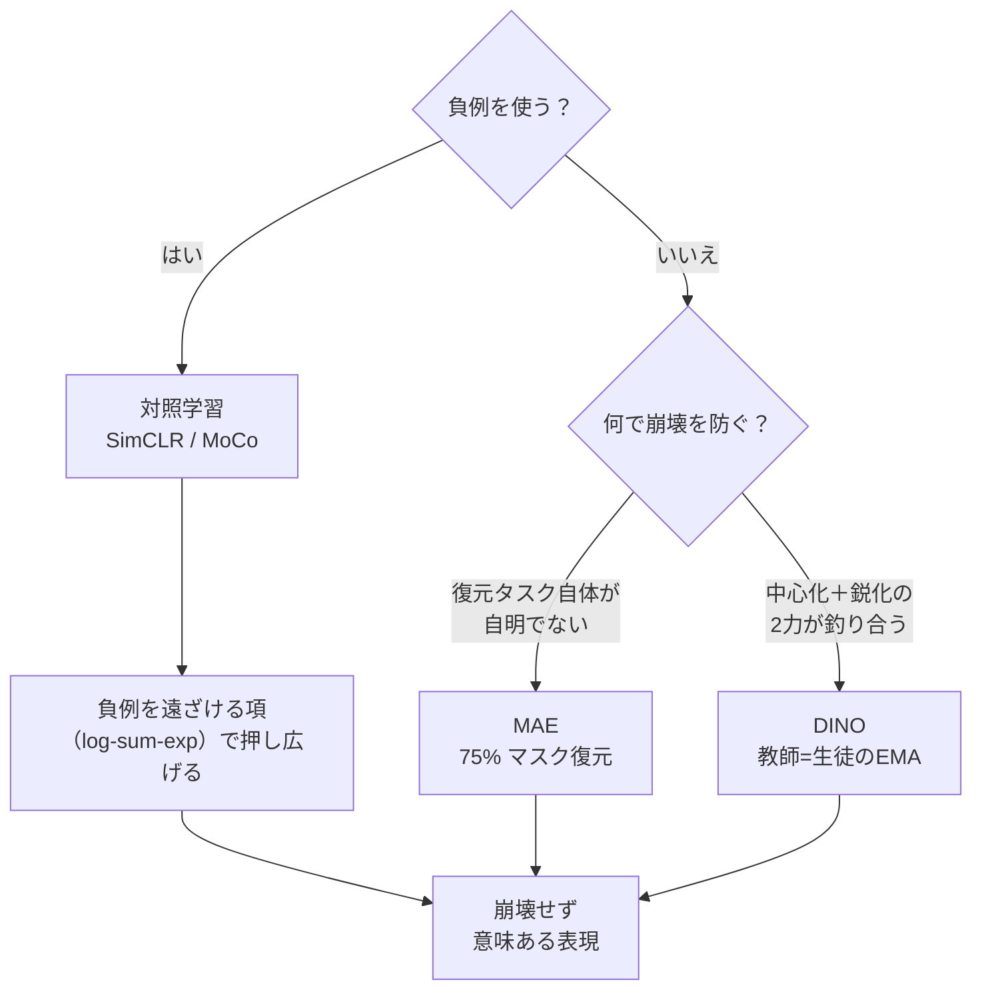
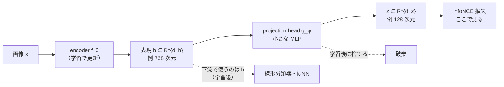
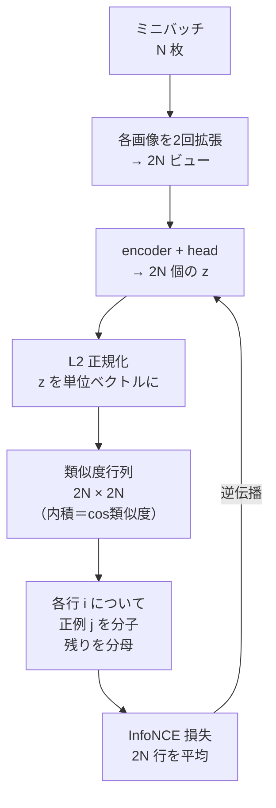
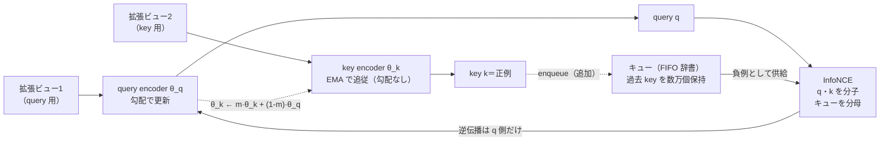
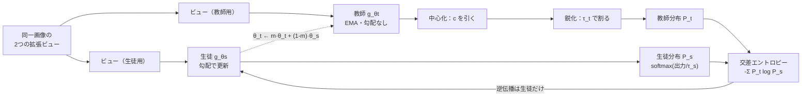
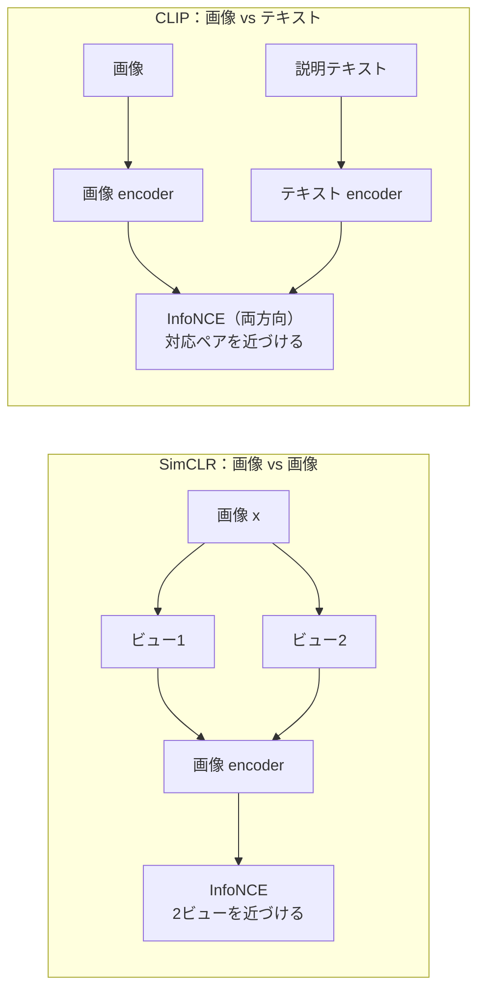
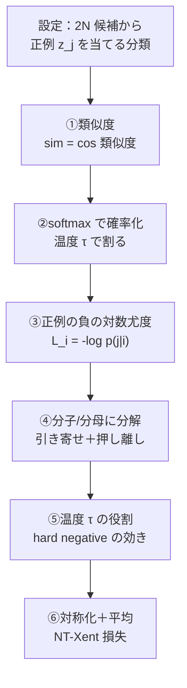
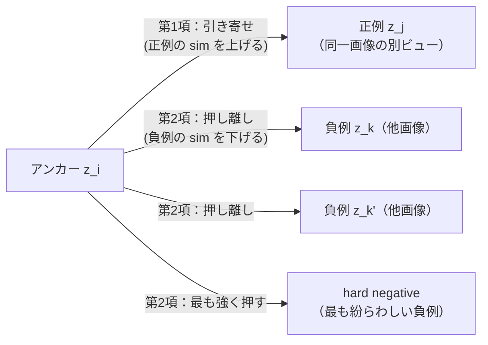

# 自己教師あり表現学習 — 対照学習・MAE・DINO

:::abstract[学習目標]
この章を読み終えると、次のことができるようになります。

- **自己教師あり学習 (SSL)** がなぜ必要かを、ラベルのコストと「表現を学ぶ＝下流タスクの前段」という観点で **説明** できる
- **対照学習**（SimCLR / MoCo）の仕組みを、正例＝同一画像の2拡張ビュー、負例＝他画像、という設計で **説明** できる
- **InfoNCE 損失** を、温度付き softmax として **導出** し、なぜ「負例の取り方」が肝なのかを **述べられる**
- **MAE**（マスク復元）と **DINO**（自己蒸留）が、対照学習とは別の原理で表現崩壊を避けることを **比較** できる
- **CLIP**（画像-テキスト対照）が SSL の道具立てを使って [マルチモーダル](/multimodal/) への入口になることを **位置づけ** られる
- numpy だけで InfoNCE を実装し、正例ペアが近いほど損失が下がることを **実測** できる
:::

## 前提知識

- 章02 [Vision Transformer (ViT)](/vision/02-vit/)：画像を16×16パッチ列に分割しTransformerでエンコードするとパッチがトークンになりCLSトークンが画像全体の表現になる、という枠組み。本章の encoder はこの ViT（または CNN）を流用します。
- 内積・コサイン類似度・softmax・交差エントロピーの基礎。
- LLM 出身の読者向け：BERT の **masked language modeling**（穴埋め）と、埋め込み空間で「似た意味は近い」という発想がそのまま橋渡しになります。差分だけを積み上げます。

:::note[LLM ↔ Vision]
LLM の事前学習は「次トークン予測」や「マスクトークン予測」という **ラベル不要の前タスク** でした。視覚も同じで、ラベルの代わりに **画像そのものから教師信号を作る**。本章はその「教師信号の作り方」が主役です。
:::

## 直感

画像分類を教師ありで学ぶには、何百万枚もの画像に「これは猫」「これは犬」とラベルを付ける必要があります。これは高価で、ラベルの種類（1000クラスなど）に縛られた表現しか得られません。

そこで問いを変えます。**ラベルを一切使わず、画像だけから「良い表現」を学べないか。** ここで「良い表現」とは、**後から少量のラベルで分類器を載せるだけで、多くの下流タスク（分類・検出・セグメンテーション）に効く汎用の特徴**のことです。これが **自己教師あり学習 (self-supervised learning, SSL)** です。

鍵は「画像そのものが教師信号を持っている」という発見です。3つの作り方があります。

- **対照学習**：同じ画像を2通りに加工しても「中身は同じ」はず。だから **2つの加工版を近づけ、別画像を遠ざける**。
- **マスク復元 (MAE)**：画像の大部分を隠し、**残りから隠した部分を当てさせる**（BERT の穴埋めの画像版）。
- **自己蒸留 (DINO)**：**自分の少し過去のコピー（教師）の出力に、今の自分（生徒）を合わせる**。ラベルも負例も使わない。

どれも「人手のラベル」を「画像に内在する制約」で置き換えています。この章のゴールは、この3系統を一望し、中核の **InfoNCE 損失** を導出・実装することです。

この「ラベルのいらない教師信号を、どこから捻り出すか」を1枚で見ておきます。3系統はすべて、**1枚の入力画像 $x$ から、人手なしで「正解」を作る**点で共通しています。違うのは作り方だけです。



3系統に共通する着眼は「**人手のラベルがなくても、入力画像の中に『正解』が隠れている**」ことです。対照学習はもう一方の拡張ビューを、MAE は隠した画素そのものを、DINO は自分の過去コピーの出力を、それぞれ「正解」として使います。教師信号を**外（人間）から**ではなく**内（画像 $x$）から**取り出す、これが SSL の発明の核です。

## 全体像

SSL は2段階です。**事前学習（ラベルなしで表現を学ぶ）→ 下流適応（凍結特徴に小さな分類器を載せる）**。



順方向（事前学習）：画像 → encoder → 表現 → 前タスクの損失で encoder を鍛える。逆方向の使い方（評価・適応）：学習済み encoder を**凍結**し、その出力（凍結特徴, frozen features）の上に線形分類器を1枚載せて少量ラベルで学ぶ。これを **線形評価 (linear probing)** と呼び、表現の質を測る標準指標です。

この2段階は「**いつ・誰の重みが・何で動くか**」が前半と後半で入れ替わります。混同しやすいので時系列で並べておきます。

| 段階 | 入力データ | 動かす重み | 凍結する重み | 損失 | 出力 |
| --- | --- | --- | --- | --- | --- |
| ① 事前学習 | 大量のラベルなし画像 | encoder $f_\theta$ ＋ head $g_\phi$ | （なし） | 前タスク損失（InfoNCE / MSE / 蒸留） | 鍛えられた表現 $h$ |
| ② 下流適応 | 少量のラベル付き画像 | 線形分類器のみ | encoder $f_\theta$ を**凍結** | 交差エントロピー（教師あり） | 下流タスクの予測 |

ここで決定的なのは、②で **encoder を一切動かさない**点です。②で encoder まで微調整 (fine-tuning) する流儀もありますが、表現の質を素直に測りたいなら凍結（線形評価）が基準になります。「①でラベルなしに作った表現が、そのまま②で役立つか」を測るのが評価の本質だからです。

:::warning[誤解の先回り：表現学習はゴールではなく「前段」]
SSL の目的は **画像を復元すること自体でも、2ビューを一致させること自体でもありません**。それらは表現を鍛えるための **口実（前タスク, pretext task）** です。本当のゴールは「凍結したまま多数の下流タスクに効く表現」を得ること。MAE の復元画像のきれいさや、対照学習の損失の小ささを最終目的と取り違えないでください。評価は常に **下流タスクの性能**（線形評価・k-NN・微調整）で行います。
:::

3系統を1枚で対比します。

|  | 対照（SimCLR/MoCo） | マスク復元（MAE） | 自己蒸留（DINO） |
| --- | --- | --- | --- |
| 教師信号 | 同一画像の2ビューの一致 | 隠した画素の復元 | 教師（自分のEMA）の出力分布 |
| 負例 | **必要**（他画像） | 不要 | 不要 |
| 崩壊回避 | 負例で押し広げる | 復元タスクが自明でない | 中心化＋鋭化（後述） |
| 主な部品 | 2 encoder + projection head | 非対称 enc-dec（高マスク率） | 生徒・教師 ViT（EMA） |
| 代表的な強み | 線形評価が強い | 微調整が強い・効率的 | 注意マップに物体が創発 |

3系統が「どう崩壊を避けるか」を1本の枝分かれで掴むと、設計思想の違いが一目で見えます。SSL の最大の敵は**表現崩壊**（全画像が同じ表現に潰れる失敗。後述）で、各系統はそれを別の道具で防ぎます。



最初の分かれ道は「**負例を使うかどうか**」です。使うのが対照学習で、使わない場合はさらに「復元の難しさ」（MAE）か「2力のバランス」（DINO）かで分かれます。この章を読み進めるとき、いま読んでいる手法がこの木のどこにいるかを意識すると迷子になりません。

## 理論

### 何を学ぶか：表現と射影ヘッド

encoder $f_\theta$ は画像 $x$ を表現ベクトル $h = f_\theta(x) \in \mathbb{R}^{d_h}$ に写します。$h$ が下流タスクで使う **表現 (representation)** です。ただし対照学習では、損失を計算する空間を別に用意します。**射影ヘッド (projection head)** $g_\phi$（小さなMLP）を通した $z = g_\phi(h) \in \mathbb{R}^{d_z}$ の上で損失を測り、下流には $h$ を使います。

- $h$：encoder の出力。**下流タスクで使う本命**。次元 $d_h$（ViT なら CLS トークン次元、例 768）。
- $z$：射影ヘッドの出力。**損失計算専用で、学習後は捨てる**。次元 $d_z$（例 128）。
- なぜ分けるのか：対照損失は「2ビューを完全一致」へ強く引っぱるので、その圧力を $z$ に肩代わりさせ、$h$ には情報をより多く残す。経験的に $h$ の線形評価が数%上がります（SimCLR の発見）。

データが encoder と head をどう流れ、どこで損失が掛かり、学習後に何が残って何が捨てられるか、を一本の流れで見ます。



流れの要点：損失を測るのは**右端の $z$ 空間**ですが、学習が終わって実際に持ち出すのは**途中の $h$**（head の手前）です。head $g_\phi$ は「対照損失の強い引っぱりを吸収するクッション」で、用が済めば外します。

:::warning[$h$ と $z$ を取り違えない]
損失を下げるのは $z$ の空間ですが、**下流で評価・転用するのは $h$**（射影ヘッド $g_\phi$ を外したあと）です。「対照損失が小さい＝良い表現」ではなく、$z$ で過度に潰しても $h$ に情報が残るように層を1枚噛ませている、という分業です。
:::

### データ拡張：教師信号の源

対照学習の正例ペアは、1枚の画像 $x$ に**異なるランダム拡張**を2回かけて作ります。$x \to (\tilde x_1, \tilde x_2)$。拡張は **random crop / resize・color jitter・grayscale・Gaussian blur・flip** などです。

- **なぜ拡張が中核か**：「どんな変形を加えても不変であってほしい」をモデルに教えるのが拡張。crop は「物体の一部からでも同じ物体と分かる」、color jitter は「色が変わっても同じ」を学ばせます。
- **拡張が弱すぎると**：2ビューがほぼ同一画素 → モデルは色ヒストグラムなど浅い手がかりで一致でき、意味的な表現が育たない。SimCLR は **強い拡張が決定的**だと示しました。

主な拡張が「何を変える操作で、何への不変性を教えるのか」を整理します。各拡張は「この変化を受けても同じ物体だ」という教師信号を1つずつ注入していると読めます。

| 拡張 | 何を変える | 教える不変性 | 弱いとどうなるか |
| --- | --- | --- | --- |
| random crop / resize | 画像の一部を切り出し拡大 | 物体の一部 ↔ 全体が同じ | 位置・スケールに過敏な表現 |
| color jitter | 明度・彩度・色相をずらす | 色が変わっても同じ物体 | 色ヒストグラムで楽に一致（浅い） |
| grayscale 化 | 色情報を捨てる | 色に頼らず形で判断 | 色だけで区別する近道を許す |
| Gaussian blur | 高周波（細部）をぼかす | 細部が潰れても同じ | テクスチャの近道を許す |
| horizontal flip | 左右反転 | 鏡像でも同じ物体 | 向きに依存した表現 |

:::warning[誤解の先回り：拡張は「水増し」ではなく「教師信号そのもの」]
教師あり学習の拡張はデータ**水増し**（同じラベルのサンプルを増やす）が目的でした。対照学習では役割が違います。**「拡張で作った2ビューを一致させよ」という制約そのものが学習の正解**です。だから「どの拡張を選ぶか」が、そのまま「どんな不変性を持つ表現になるか」を決めます。色不変が要らない下流タスク（例：色で種を見分ける）では color jitter が逆効果になり得る、というように、拡張の選択は下流タスクと結びついた設計判断です。
:::

### 対照学習：正例を近づけ負例を遠ざける

1ステップの中身を順を追って書きます（学習時の動作）。

1. ミニバッチで $N$ 枚の画像を取る。
2. 各画像を2回拡張し、$2N$ 個のビューを作る。
3. 各ビューを encoder → projection head に通し、$2N$ 個の $z$ を得る。
4. すべての $z$ を **L2正規化**（単位ベクトル化）。これで内積＝コサイン類似度になる。
5. 全 $2N \times 2N$ のペア類似度を計算。各ビュー $i$ について、**もう一方のビュー**（正例）を分子、**残り $2N-2$ 個**（負例）を分母に入れた **InfoNCE 損失**を取る。
6. 損失を逆伝播し、encoder と head を更新。

この6ステップを、1枚の画像 $x_1$ から $2N$ 個のビューが生まれ、類似度行列を経て損失に至るまでの**データの流れ**として描きます。



正例ペア $(i, j)$ が類似度行列のどこに居て、同じ行の残りがどう負例になるかを、$N=2$（4ビュー）の小さな行列で具体的に見ます。ビュー $0,1$ が画像 A の2ビュー、$2,3$ が画像 B の2ビューだとすると、行列の各セルは「行ビューと列ビューの類似度」です。

| 行＼列 | 0 (A) | 1 (A) | 2 (B) | 3 (B) |
| --- | --- | --- | --- | --- |
| **0 (A)** | − (自分) | ◎ 正例 | × 負例 | × 負例 |
| **1 (A)** | ◎ 正例 | − (自分) | × 負例 | × 負例 |
| **2 (B)** | × 負例 | × 負例 | − (自分) | ◎ 正例 |
| **3 (B)** | × 負例 | × 負例 | ◎ 正例 | − (自分) |

行 0 の InfoNCE は「◎（列1）を分子、×（列2,3）を分母」に入れた $-\log$ です。対角（自分自身）は分母から外します。実装の `np.fill_diagonal(sim, -np.inf)` がこの「自分を除く」に対応し、`targets` 配列が「行 $i$ の◎の列番号」を与えます。

:::warning[誤解の先回り：肝は「負例の取り方」]
対照学習で見落とされがちなのが **負例 (negatives) の質と量** です。InfoNCE は「正例を近づける」より「**正例を、たくさんの紛らわしい負例の中で際立たせる**」損失です。だから——

- **負例が少ない**と区別が易しすぎて表現が育たない → SimCLR は **大バッチ（数千）** で負例を稼ぐ。
- **負例を増やすのにバッチを巨大化するのは高価** → MoCo は **モメンタムキュー（過去バッチの $z$ を貯めた辞書）** で、バッチサイズと負例数を切り離す。
- **偽の負例 (false negative)**：同じクラスの別画像を負例にすると「本当は近いものを遠ざける」害が出る。SSL はラベルを見ないので原理的に避けきれず、ここが対照学習の弱点です。

「正例をどう作るか（＝拡張）」と並んで「**負例をどう供給するか**」が対照学習の設計の半分を占めます。
:::

「負例をどう供給するか」で3つの流儀があります。供給源とコストを並べておきます。

| 負例の供給法 | 供給源 | 負例数 | コスト | 代表 |
| --- | --- | --- | --- | --- |
| 大バッチ | 同じバッチ内の他画像 | バッチサイズ依存（〜数千） | バッチを巨大化＝高メモリ | SimCLR |
| モメンタムキュー | 過去バッチの key を貯めた辞書 | 辞書サイズ（〜数万） | バッチと独立・安価 | MoCo |
| 負例を使わない | （なし） | 0 | 崩壊回避を別途設計 | BYOL / DINO / MAE |

### MoCo：モメンタムキューで一貫した負例

巨大バッチを使わずに大量の負例を持つために、MoCo は2つの工夫をします。

- **キュー (queue)**：過去ミニバッチで計算した key（負例の $z$）を FIFO で貯める辞書。バッチが小さくても、辞書には数千〜数万の負例が入る。
- **モメンタム更新の key encoder**：負例を貯めている間に encoder が動くと、古い key と新しい query が**別物の空間**になり比較が壊れる。そこで key 側 encoder $\theta_k$ を、query 側 $\theta_q$ の **指数移動平均 (EMA)** でゆっくり追従させ、辞書の一貫性を保つ。

$$
\theta_k \leftarrow m\,\theta_k + (1-m)\,\theta_q
$$

ここで $m$（例 0.999）はモメンタム係数で、$\theta_k$（key encoder の重み）が $\theta_q$（query encoder の重み、勾配で直接更新される側）にどれだけゆっくり追従するかを決めます。$m$ が1に近いほど辞書は安定です。

MoCo の1ステップで「query 側」と「key 側」が**非対称**に動く様子を図にします。勾配が流れるのは query 側だけで、key 側は EMA でゆっくり追従し、その出力がキューに積まれて未来の負例になります。



:::warning[誤解の先回り：なぜ key encoder に勾配を流さないのか]
「key 側も勾配で一緒に学習すれば、もっと良い key になるのでは」と思いがちですが、それをすると**キューの一貫性が壊れます**。キューには「数千ステップ前の key encoder が作った古い key」が残っています。key encoder を勾配で速く動かすと、古い key と今の key が別空間になり、比較が無意味になります。EMA でゆっくり（$m=0.999$）動かすからこそ、キュー全体がほぼ同じ空間に保たれ、過去の key を負例として再利用できます。**速く正確に動かすこと**より**ゆっくり一貫させること**を選ぶ、ここが MoCo の設計判断です。
:::

:::note[LLM ↔ Vision]
EMA の教師は LLM 出身者には馴染みが薄いですが、「**自分の少し過去の平均コピーを安定した参照点にする**」発想です。MoCo は負例辞書の一貫性のため、後述の DINO/BYOL は教師そのものとして、同じ EMA を使います。
:::

### MAE：マスク復元（負例も対照もいらない）

**MAE (Masked Autoencoder)** は発想が全く違います。BERT の穴埋めを画像に持ち込みます。

1. 画像をパッチ列にする（章02 の ViT パッチ分割）。
2. **75%のパッチをランダムに捨てる**（高マスク率）。
3. **encoder は残り25%の可視パッチだけ**を処理（非対称設計：軽い）。
4. 捨てたパッチ位置にマスクトークンを挿し、**軽量 decoder が全パッチの画素を復元**。
5. 損失は **マスクした領域の画素の平均二乗誤差 (MSE)** のみ。

この非対称設計（重い encoder は可視パッチだけ・軽い decoder が全パッチ）が、データの流れのどこで効くかを図にします。マスクトークンが encoder を**通らず**、decoder の直前で初めて挿入される点が MAE の効率の急所です。


- **なぜ75%も隠すか**：少ししか隠さないと、隣のパッチの内挿で当たってしまい、意味を学ばない。大胆に隠して初めて「これは犬の顔だから耳があるはず」という**意味的な穴埋め**が必要になる。
- **なぜ可視パッチだけ encode するか**：encoder は全体の25%しか見ないので計算が軽く、ViT を大規模・高速に事前学習できる。これが MAE の効率の源です。
- **負例も拡張の妙技も不要**：復元タスク自体が自明でないので、表現が潰れる心配が少ない。

:::warning[誤解の先回り：損失を測るのは「隠した所」だけ]
復元した全パッチに損失を掛けると思いがちですが、MAE の損失は**マスクした（隠した）領域の画素 MSE だけ**です。可視パッチは「答えを見ながら写すだけ」なので、そこで誤差を測っても意味を学ぶ圧力になりません。隠した所を当てさせる、そこにだけ損失を掛ける——これが「自明でないタスク」を成立させ、崩壊（定数出力）を自然に防ぎます。BERT が `[MASK]` トークンの位置でだけ損失を取るのと同じ設計です。
:::

:::note[LLM ↔ Vision]
MAE は **BERT の masked language modeling の画像版**です。違いは2つ。(1) BERT のマスク率は15%程度だが MAE は75%（画像は隣接パッチの冗長性が高く、軽く隠すと内挿で当たるため大胆に隠す）。(2) BERT は離散トークンを分類で当てるが、MAE は連続画素を回帰（MSE）で当てる。「穴埋めで表現を学ぶ」骨格は同じです。
:::

### DINO：自己蒸留（教師＝生徒のEMA）

**DINO (self-DIstillation with NO labels)** はラベルも負例も使わず、**生徒ネットワークが教師ネットワークの出力分布に一致**するよう学びます。教師は生徒の EMA コピーです。

- 生徒 $g_{\theta_s}$ と教師 $g_{\theta_t}$ は同じ ViT 構造。教師は $\theta_t \leftarrow m\,\theta_t + (1-m)\,\theta_s$ で更新（勾配は流さない）。
- 同じ画像の異なる拡張ビューを両者に入れ、**教師の出力分布に生徒を交差エントロピーで合わせる**。
- 出力は語彙ではなく $K$ 次元の確率分布（softmax）。「画像をどの prototype に振り分けるか」の分布です。

生徒と教師がどう非対称に動き、勾配がどちらに流れるかを図にします。MoCo と似た EMA 構造ですが、ここでは EMA コピーが**負例辞書のためではなく、合わせるべき目標（教師）そのもの**として使われる点が違います。



ここで自然な疑問：教師も生徒も自分のコピーなら、**全画像を同じ分布に出力して一致させればゼロ損失で楽できる**のでは？ これが **表現崩壊 (representation collapse)** です。DINO は2つの仕掛けで防ぎます。

- **中心化 (centering)**：教師出力からバッチ平均 $c$ を引く。特定次元に張り付く崩壊を防ぐ。
- **鋭化 (sharpening)**：教師側の温度 $\tau_t$ を小さく（分布を尖らせる）。一様分布への崩壊を防ぐ。

この2つは逆向きに働き、釣り合った点で**意味のある分布**に落ち着きます。2つの力が「どの崩壊を、どう防ぎ、単独だとどう失敗するか」を対比します。片方だけでは別方向に潰れる、という綱引きの構造が肝です。

| 仕掛け | 何をする | 防ぐ崩壊 | これ単独だと |
| --- | --- | --- | --- |
| 中心化 (centering) | 教師出力からバッチ平均 $c$ を引く | 1次元に全画像が張り付く崩壊 | （鋭化なしだと）一様分布へ潰れる |
| 鋭化 (sharpening) | 教師温度 $\tau_t$ を小さく（分布を尖らせる） | 一様分布への崩壊 | （中心化なしだと）1次元へ張り付く |

驚くべき副産物として、DINO の ViT の **注意マップに物体のセグメンテーションが教師なしで創発**します。

$$
P_t(x) = \mathrm{softmax}\!\left(\frac{g_{\theta_t}(x) - c}{\tau_t}\right),\qquad
P_s(x) = \mathrm{softmax}\!\left(\frac{g_{\theta_s}(x)}{\tau_s}\right)
$$

損失は $\mathcal{L} = -\sum_x P_t(x)\,\log P_s(x)$（教師の分布を目標にした交差エントロピー）です。

:::warning[誤解の先回り：教師は「正しい先生」ではなく「少し先を行く自分」]
「教師」という言葉から、別途用意した高精度モデルを想像しがちですが、DINO の教師は**生徒自身の過去の移動平均**です。最初は教師も生徒も無知で、両者は一緒に賢くなっていきます。EMA で教師がほんの少しだけ生徒より「安定して先を行く」ので、生徒はその安定した目標を追いかけられます。教師が完全な生徒のコピーだと「自分に合わせるだけ」で何も学ばない（崩壊）ので、EMA の遅れ＋中心化＋鋭化が「自明な一致」を禁じる仕掛けになっています。
:::

### CLIP：マルチモーダルへの入口

ここまでは画像だけでした。**CLIP** は対照学習の正例を「**同じ画像の2ビュー**」ではなく「**(画像, それを説明するテキスト)のペア**」に置き換えます。

- 画像 encoder と テキスト encoder を別々に持ち、**対応する画像とテキストを近づけ、対応しない組を遠ざける**（InfoNCE を画像↔テキストの両方向で）。
- web から集めた4億の(画像, テキスト)ペアで学習。ラベルではなく**自然言語が監督信号**（弱教師あり）。
- 結果：「犬の写真」というテキストを encode して、未知のクラスでも **ゼロショット分類**ができる。

CLIP が SimCLR と「正例の作り方だけ違って、損失は同一」であることを、データの流れで対比します。SimCLR は画像から2ビューを作って同じ encoder に通すのに対し、CLIP は画像とテキストを**別々の encoder**に通して同じ空間に並べます。



CLIP は本章の道具（InfoNCE・正例/負例・温度）をそのまま使い、視覚と言語を同じ埋め込み空間に並べます。これが現在の視覚言語モデル (VLM) の視覚エンコーダの基盤であり、[マルチモーダル](/multimodal/) への直接の入口です。詳細はマルチモーダル分野で扱います。

:::note[LLM ↔ Vision]
SimCLR/MoCo は「画像 vs 画像」、CLIP は「画像 vs テキスト」。損失（InfoNCE）も「正例を負例の海で際立たせる」構造も同一です。違うのは**ペアの作り方**だけ。対照学習を理解すれば CLIP は「正例の定義を差し替えただけ」と見えます。
:::

## 数式の導出：InfoNCE

対照損失 **InfoNCE (Noise-Contrastive Estimation の情報量版)** を、第一原理から組み立てます。

導出の地図を先に出します。「正例を当てる多クラス分類」という設定から出発し、類似度 → 確率 → 負の対数尤度 → 引き寄せ/押し離しの分解 → 温度の役割 → 対称化、と6段で本章の中心式に至ります。



**問題設定。** アンカー（基準）ビュー $i$ の埋め込みを $z_i$ とし、その正例（同一画像のもう一方のビュー）を $z_j$ とします。バッチには他に多数のビューがあり、それらが負例です。やりたいのは「$2N$ 個の候補の中から、正例 $z_j$ を当てる多クラス分類」です。

**ステップ1：類似度を定義。** 単位ベクトル同士の内積＝コサイン類似度を使います。

$$
\mathrm{sim}(u, v) = \frac{u^\top v}{\lVert u\rVert\,\lVert v\rVert}
$$

L2正規化済みなら分母は1で $\mathrm{sim}(u,v)=u^\top v \in [-1, 1]$。「近いほど大きい」スコアです。

**ステップ2：類似度を確率に変換。** アンカー $i$ から見て「候補 $k$ が正例である確率」を softmax で定義します。温度 $\tau>0$ で割ってスケールを調整します。

$$
p(k \mid i) = \frac{\exp\!\big(\mathrm{sim}(z_i, z_k)/\tau\big)}{\sum_{m \neq i}\exp\!\big(\mathrm{sim}(z_i, z_m)/\tau\big)}
$$

分母は自分自身 $i$ を除く全候補にわたる和（正例1個＋負例多数）。

**ステップ3：正例の対数尤度を最大化＝負の対数尤度を最小化。** 正解は $k=j$（真の正例）なので、損失は $-\log p(j\mid i)$ です。これを書き下すと本章の中心式になります。

$$
\mathcal{L}_{i} = -\log\frac{\exp\!\big(\mathrm{sim}(z_i, z_j)/\tau\big)}{\sum_{k \neq i}\exp\!\big(\mathrm{sim}(z_i, z_k)/\tau\big)}
$$

**ステップ4：分子と分母を分けて意味を読む。** 対数の商を差に開きます。

$$
\mathcal{L}_{i} = \underbrace{-\frac{\mathrm{sim}(z_i, z_j)}{\tau}}_{\text{正例を近づける}} + \underbrace{\log\sum_{k \neq i}\exp\!\Big(\frac{\mathrm{sim}(z_i, z_k)}{\tau}\Big)}_{\text{全候補（負例込み）を遠ざける}}
$$

第1項は正例の類似度を上げると下がる（**引き寄せ**）。第2項は log-sum-exp で、負例の類似度が高いと上がる（**押し離し**）。両項のせめぎ合いで、正例だけが際立つよう埋め込みが配置されます。

この2項が埋め込み空間で**引っぱり合う**様子を図にします。第1項は正例ペアを矢印で引き寄せ、第2項は各負例を押し離す。釣り合った配置が「正例だけが際立つ」表現です。



**ステップ5：温度 $\tau$ の役割。** $\tau$ は softmax の鋭さを決めます。$\tau$ を小さくすると分布が尖り、**最も紛らわしい負例（hard negative）に強くペナルティ**が掛かる一方、勾配が暴れやすい。大きいと緩やかですが区別が甘くなる。典型値は $\tau \in [0.05, 0.2]$。実装節でこの感度を実測します。

温度 $\tau$ を大小に振ったときの効きを対比します。$\tau$ は「どれだけ紛らわしい負例を重点的に罰するか」のつまみで、小さいほど hard negative に集中し鋭いが不安定、大きいほど全負例を均等に扱い緩やか、という両極です。

| $\tau$ | softmax の分布 | hard negative の効き | 勾配の安定 | 区別の鋭さ |
| --- | --- | --- | --- | --- |
| 小さい（例 0.05） | 尖る | **強い**（最も近い負例に集中） | 暴れやすい | 鋭い |
| 大きい（例 1.0） | 平ら | 弱い（全負例を均等に） | 安定 | 甘い |
| 典型 0.05〜0.2 | 中庸 | バランス | 実用域 | 実用域 |

**ステップ6：対称化とバッチ平均。** 各ビューをアンカーにして $\mathcal{L}_i$ を計算し、$2N$ 個を平均します（正例ペア $(i,j)$ と $(j,i)$ の両方が入るので自然に対称）。

$$
\mathcal{L} = \frac{1}{2N}\sum_{i=1}^{2N}\mathcal{L}_i
$$

これが SimCLR の **NT-Xent (normalized temperature-scaled cross entropy)** 損失です。$\blacksquare$

:::note[なぜ「log-sum-exp = 押し離し」なのか]
$\log\sum_k \exp(s_k)$ は「最大の $s_k$ にほぼ等しい滑らかな max」です。負例の類似度 $s_k$ のどれかが高いと、その項が和を支配して損失が増える。だから勾配は「最も近い負例」を最も強く押し離します。これが hard negative が効く理由で、$\tau$ を下げるほどこの効果が鋭くなります。
:::

## 実装

numpy だけで InfoNCE を実装し、(A) 正例ペアが近いほど損失が下がること、(B) 温度の感度、を実測します。さらに埋め込み行列を勾配で動かし、損失が下がっていくのを確認します。

```python title="infonce.py"
import numpy as np

def l2_normalize(z):
    # 各行（=1サンプルの埋め込み）を単位ベクトルに。内積=コサイン類似度になる。
    return z / (np.linalg.norm(z, axis=1, keepdims=True) + 1e-12)

def info_nce(z1, z2, tau):
    """対称 InfoNCE 損失。z1[i] と z2[i] は同じ画像の2拡張ビュー（正例ペア）。
    バッチ内の他の全画像（両ビュー）が負例。"""
    z1, z2 = l2_normalize(z1), l2_normalize(z2)
    N = z1.shape[0]
    z = np.concatenate([z1, z2], axis=0)        # (2N, d) 全ビューを縦に積む
    sim = z @ z.T / tau                          # (2N, 2N) 類似度/温度
    np.fill_diagonal(sim, -np.inf)               # 自分自身は分母から除外
    # 行 i の正例: i<N なら i+N、i>=N なら i-N（もう一方のビュー）
    targets = np.concatenate([np.arange(N, 2 * N), np.arange(0, N)])
    m = np.max(sim, axis=1, keepdims=True)       # log-sum-exp の数値安定化
    log_denom = np.log(np.sum(np.exp(sim - m), axis=1)) + m[:, 0]
    log_num = sim[np.arange(2 * N), targets]
    return -(log_num - log_denom).mean()         # 各行 -log(正例/全体) の平均

rng = np.random.default_rng(0)
N, d, tau = 4, 8, 0.1
base = rng.standard_normal((N, d))               # 各画像の「真の」埋め込み

print(f"tau={tau}")
print("[A] 2ビューの食い違い（noise）を増やすと損失は上がる:")
for noise in [0.05, 0.3, 1.0, 3.0]:
    v1 = base + noise * rng.standard_normal((N, d))
    v2 = base + noise * rng.standard_normal((N, d))
    print(f"  noise={noise:>4}  loss={info_nce(v1, v2, tau):.4f}")

print("[B] 温度 tau を変えると損失感度が変わる:")
v1 = base + 0.3 * rng.standard_normal((N, d))
v2 = base + 0.3 * rng.standard_normal((N, d))
for t in [0.05, 0.1, 0.5, 1.0]:
    print(f"  tau={t:>4}  loss={info_nce(v1, v2, t):.4f}")
```

実行（`uv run --with numpy python infonce.py`）した実測出力です。

```text title="出力"
tau=0.1
[A] 2ビューの食い違い（noise）を増やすと損失は上がる:
  noise=0.05  loss=0.0018
  noise= 0.3  loss=0.0094
  noise= 1.0  loss=1.7930
  noise= 3.0  loss=5.5799
[B] 温度 tau を変えると損失感度が変わる:
  tau=0.05  loss=0.0000
  tau= 0.1  loss=0.0070
  tau= 0.5  loss=0.7422
  tau= 1.0  loss=1.2486
```

読み取り：**[A]** 2ビューがほぼ同じ（noise=0.05）なら正例が際立ち損失はほぼ0、ビューが食い違う（noise=3.0）と正例を負例から区別できず損失が急増します。これが「正例を近づける」学習圧力の正体です。**[B]** 同じ埋め込みでも $\tau$ を下げると損失が小さく見え、上げると大きく見える。$\tau$ は損失のスケールと「どれだけ紛らわしい負例を罰するか」を同時に変えます。

このコードが導出のどのステップに対応するかを対応づけておくと、式とコードが1対1で読めます。

| コード行 | 導出ステップ | 役割 |
| --- | --- | --- |
| `l2_normalize` | ステップ1 | 単位ベクトル化 → 内積＝cos類似度 |
| `z @ z.T / tau` | ステップ1,2,5 | 全ペア類似度を温度で割る |
| `np.fill_diagonal(sim, -inf)` | ステップ2 | 分母から自分自身を除く（$m\neq i$） |
| `targets` | ステップ3 | 行 $i$ の正例 $j$ の列番号 |
| `log_denom`（log-sum-exp） | ステップ4 第2項 | 押し離し（全候補の和） |
| `log_num` | ステップ4 第1項 | 引き寄せ（正例の類似度） |
| `.mean()` | ステップ6 | $2N$ 行の対称平均 |

次に、埋め込み行列そのものを学習対象にして、**正例が近づくよう勾配降下すると損失が下がる**ことを実測します。トイなので勾配は有限差分で求めます。

```python title="infonce_train.py"
import numpy as np
from infonce import info_nce          # 上のファイルを再利用

rng = np.random.default_rng(0)
N, d, tau = 6, 16, 0.2
# 各画像 i に固定の「2ビュー摂動」を1セット用意（学習中は同じものを使う）。
n1 = 0.15 * rng.standard_normal((N, d))
n2 = 0.15 * rng.standard_normal((N, d))
emb = rng.standard_normal((N, d))     # 学習対象：各画像の埋め込み（最初はランダム）

def loss_of(E):
    return info_nce(E + n1, E + n2, tau)   # E に2ビュー摂動を足して損失

lr, eps = 2.0, 1e-4
print(f"N={N} d={d} tau={tau}")
for step in range(0, 121, 20):
    print(f"step {step:>3}  loss={loss_of(emb):.4f}")
    if step == 120:
        break
    for _ in range(20):                    # 有限差分で勾配を作り emb を更新
        base = loss_of(emb)
        g = np.zeros_like(emb)
        for i in range(N):
            for j in range(d):
                e = emb.copy(); e[i, j] += eps
                g[i, j] = (loss_of(e) - base) / eps
        emb -= lr * g
```

実測出力です。

```text title="出力"
N=6 d=16 tau=0.2
step   0  loss=0.1328
step  20  loss=0.0623
step  40  loss=0.0474
step  60  loss=0.0405
step  80  loss=0.0365
step 100  loss=0.0339
step 120  loss=0.0320
```

埋め込みを動かすと損失が単調に下がります。学習は「同じ画像の2ビューを近づけ、他画像を相対的に遠ざける」方向に埋め込みを配置していて、これがまさに対照学習が encoder に課す圧力です。実際の SSL では `emb` の代わりに **ViT/CNN の重み**を逆伝播で更新しますが、損失が表現を組織化する仕組みはこのトイと同じです。

:::warning[このトイで「効率は」測れない]
ここでは埋め込みを直接学習しましたが、本物の対照学習は **encoder の重み**を学びます。また負例はバッチ内の他画像で、$N$ が小さいと負例が乏しく学習が弱い（前述「負例の取り方が肝」）。トイは原理確認用で、MoCo のキューや SimCLR の大バッチが必要な理由は、まさにこの「負例の数」を稼ぐためだと押さえてください。
:::

:::warning[誤解の先回り：トイの「埋め込み学習」と本物の「encoder 学習」]
このトイは各画像の埋め込み `emb[i]` を**直接**勾配で動かします。本物の SSL はそうではありません。動かすのは **encoder の重み $\theta$** で、埋め込みは $z = g_\phi(f_\theta(x))$ として毎回 encoder から**計算**されます。だから本物では「未知の新しい画像」にも encoder を通せば表現が得られますが、トイの `emb` は学習に使った $N$ 枚にしか対応しません。トイは「損失が表現をどう配置するか」だけを切り出した最小モデルで、汎化を担う encoder は省いている、と区別してください。
:::

## 演習

::::question[演習 1: 温度 $\tau$ と負例の効き]
InfoNCE 損失 $\mathcal{L}_i = -\log\frac{\exp(\mathrm{sim}(z_i,z_j)/\tau)}{\sum_{k\neq i}\exp(\mathrm{sim}(z_i,z_k)/\tau)}$ について。(a) $\tau$ を小さくすると、紛らわしい負例（$\mathrm{sim}$ が高い負例）への勾配の効きは強くなりますか、弱くなりますか。(b) バッチサイズ $N$ を大きくすると分母の項数はどう変わり、なぜ表現の質が上がりやすいですか。(c) 同じクラスの別画像が負例に混ざる「偽の負例」は、なぜ SSL では原理的に避けきれないのですか。

:::details[解答]
(a) **強くなります**。$\tau$ を小さくすると $\mathrm{sim}/\tau$ の差が拡大し softmax が尖るので、最も類似度の高い負例（hard negative）に確率質量が集中し、それを押し離す勾配が大きくなります（導出ステップ5・log-sum-exp の節）。ただし勾配が暴れやすくなるトレードオフがあります。

(b) 分母は $i$ 以外の全候補にわたる和なので、$N$ を増やすと**負例の項数が増えます**（$2N-2$ 個）。負例が多いほど「正例を、より多くの紛らわしい候補の中で際立たせる」難しい識別問題になり、浅い手がかりでは解けず意味的な表現が育ちます。だから SimCLR は大バッチ、MoCo はキューで負例を稼ぎます。

(c) SSL は**ラベルを一切見ない**ので、「この負例は実はアンカーと同じクラスだ」と判定する術がありません。バッチ内の他画像を機械的に負例にする以上、同クラスの別画像が混ざり「本来近いものを遠ざける」害が原理的に残ります。これが対照学習の弱点で、DINO/MAE が負例を使わない動機の一つです。
:::
::::

::::question[演習 2: 3系統の崩壊回避]
表現崩壊（全画像が同じベクトル/分布に潰れる）を、(a) 対照学習（SimCLR/MoCo）、(b) MAE、(c) DINO はそれぞれどう防いでいますか。(d) 「対照損失が小さい」ことを最終目標にしてはいけない理由を、本章の用語で述べてください。

:::details[解答]
(a) **負例で押し広げる**。全表現が同一ベクトルに潰れると、正例も負例も同じ類似度になり InfoNCE の分母が分子を相殺して損失が下がらない。負例を遠ざける第2項（log-sum-exp）が崩壊を罰します。

(b) **復元タスクが自明でないこと**。75%マスクの画素を当てるには画像の意味を捉える必要があり、定数を出すだけでは MSE が下がらない。負例なしでも崩壊しにくい設計です。

(c) **中心化と鋭化のバランス**。中心化（バッチ平均を引く）が特定次元への張り付きを、鋭化（教師温度を小さく）が一様分布への潰れを防ぎ、逆向きの2力が釣り合った非自明な分布に落ち着きます。教師は生徒の EMA で安定化されています。

(d) 損失は表現を鍛えるための **前タスク (pretext task) の口実**であって、本当のゴールは**凍結特徴の下流タスク性能**（線形評価・k-NN・微調整）です。損失だけを下げても、ショートカット（拡張の浅い手がかり）で達成された損失は良い表現を意味しません。評価は常に下流タスクで行います（「表現学習は下流の前段」の節）。
:::
::::

::::question[演習 3: MoCo の EMA と CLIP への橋渡し]
(a) MoCo で key encoder $\theta_k$ を query encoder $\theta_q$ と**同じ速度で**勾配更新したら、なぜ負例キューが壊れますか。本章のキューの一貫性の観点で述べてください。(b) CLIP は SimCLR と「ほぼ同じ損失」を使うのに、正例と負例の定義はどう変わりますか。$N$ 組の(画像,テキスト)ペアのバッチで、ある画像にとっての正例と負例を具体的に述べてください。

:::details[解答]
(a) キューには「数千ステップ前の key encoder が作った古い key」が FIFO で残っています（前述「MoCo」）。$\theta_k$ を $\theta_q$ と同速で動かすと、key encoder が毎ステップ大きく変わり、古い key と今 query が**別空間**になって内積（類似度）が無意味になります。EMA（$\theta_k \leftarrow m\theta_k + (1-m)\theta_q$、$m=0.999$）でゆっくり追従させるからこそ、キュー全体がほぼ同じ空間に保たれ、過去 key を負例として再利用できます。一貫性のために「速く正確に」より「ゆっくり安定に」を選ぶ設計です。

(b) 正例の作り方だけが変わり、損失（InfoNCE）と「正例を負例の海で際立たせる」構造は同一です（前述「CLIP」）。$N$ 組のペア $(I_1,T_1),\dots,(I_N,T_N)$ のバッチで、画像 $I_a$ にとって**正例は対応するテキスト $T_a$**、**負例は他の $N-1$ 個のテキスト $T_{b\neq a}$** です（SimCLR の「同一画像の別ビュー＝正例／他画像＝負例」が「対応テキスト＝正例／他テキスト＝負例」に差し替わっただけ）。テキスト $T_a$ 側から見ても対称に画像で同じことをします（画像↔テキストの両方向）。
:::
::::

## まとめ

:::success[この章の要点]
- **自己教師あり学習 (SSL)** はラベルなしの画像から汎用表現を学ぶ。**前タスクで encoder を鍛え → 凍結特徴に小さな分類器を載せて下流に適応**する2段構え。表現学習はゴールでなく**下流タスクの前段**。
- **対照学習（SimCLR/MoCo）** は同一画像の2拡張ビューを正例、他画像を負例として **InfoNCE** で「正例を負例の海で際立たせる」。肝は **負例の取り方**（大バッチ or MoCo のモメンタムキュー）。
- **InfoNCE** は温度付き softmax の負の対数尤度として導出でき、分子＝引き寄せ・分母（log-sum-exp）＝押し離し。温度 $\tau$ が hard negative の効きを制御する。
- **MAE**（75%マスク画素の復元）と **DINO**（教師＝生徒EMAへの自己蒸留＋中心化/鋭化）は、**負例なし**で崩壊を避ける別系統。DINO は注意マップに物体が創発する。
- **CLIP** は正例を「同一画像の2ビュー」から「(画像,テキスト)ペア」に差し替えただけで、対照学習を **マルチモーダル** へ橋渡しする。
:::

### 次に学ぶこと

ここまでで「ラベルなしで良い表現を学ぶ」3系統が手に入りました。表現（認識側）の次は、いよいよ **生成側** —— ノイズから画像を作る拡散モデルへ進みます。音声章07の flow matching と同じ数理で、視覚の生成を組み立てます。

→ [4. 拡散モデルによる画像生成](/vision/04-diffusion-generation/)

CLIP で開いた画像-テキストの対照学習は、視覚と言語を統合する [マルチモーダル](/multimodal/) 分野へ続きます。

## 用語ミニ辞典

| 用語 | 一言 |
| --- | --- |
| 自己教師あり学習 (SSL) | ラベルなしで前タスクから表現を学ぶ |
| 前タスク (pretext task) | 表現を鍛えるための口実となる課題 |
| 線形評価 (linear probing) | 凍結特徴の上に線形分類器を載せ表現の質を測る |
| 対照学習 | 正例を近づけ負例を遠ざける表現学習 |
| 正例 / 負例 | 同一画像の別ビュー / 他画像 |
| InfoNCE / NT-Xent | 温度付き softmax の対照損失 |
| 温度 $\tau$ | softmax の鋭さ。hard negative の効きを制御 |
| 射影ヘッド | 損失計算用の小MLP。下流では外す |
| 表現崩壊 (collapse) | 全表現が同一に潰れる失敗 |
| モメンタム / EMA | 自分の過去平均コピーを安定参照に使う |
| MoCo | キュー＋EMAで負例を大量・一貫に供給 |
| MAE | 75%マスク画素を復元する自己符号化 |
| DINO | 教師(生徒EMA)への自己蒸留。負例不要 |
| 中心化 / 鋭化 | DINO の崩壊回避の2力 |
| CLIP | 画像-テキスト対照。マルチモーダルの入口 |
| 凍結特徴 (frozen features) | 微調整せず使う事前学習済み表現 |

## 次のアクション

理論を手で定着させる。**最小の写経 → 動かす → 小実験** を1セットで。

1. 上の `infonce.py` を写経し、`uv run --with numpy python infonce.py` で [A][B] の出力を再現する。`noise` と `tau` の表が本章の値と一致することを確認する。
2. `infonce_train.py` を動かし、損失が `0.1328 → 0.0320` と下がるのを再現する。`lr` や `tau` を変えて学習の安定性が変わるのを観察する。
3. 小実験：バッチ $N$ を 2/4/8/16 と変え、同じ `noise` での損失を比べる。$N$（=負例数）が増えると損失がどう動くか（識別が難しくなる方向か）を自分で確かめ、「負例の取り方が肝」を体感する。
4. 余力があれば、`info_nce` を画像 encoder（ViT, 章02）の出力に繋ぎ、本物の SimCLR の最小版を組む（重い依存が必要なので分野の後半で）。

## 参考文献

1. T. Chen, S. Kornblith, M. Norouzi, G. Hinton, "A Simple Framework for Contrastive Learning of Visual Representations (SimCLR)," *ICML*, 2020.
2. K. He, H. Fan, Y. Wu, S. Xie, R. Girshick, "Momentum Contrast for Unsupervised Visual Representation Learning (MoCo)," *CVPR*, 2020.
3. J.-B. Grill et al., "Bootstrap Your Own Latent (BYOL): A New Approach to Self-Supervised Learning," *NeurIPS*, 2020.
4. K. He, X. Chen, S. Xie, Y. Li, P. Dollár, R. Girshick, "Masked Autoencoders Are Scalable Vision Learners (MAE)," *CVPR*, 2022.
5. M. Caron et al., "Emerging Properties in Self-Supervised Vision Transformers (DINO)," *ICCV*, 2021.
6. M. Oquab et al., "DINOv2: Learning Robust Visual Features without Supervision," *arXiv:2304.07193*, 2023.
7. A. Radford et al., "Learning Transferable Visual Models From Natural Language Supervision (CLIP)," *ICML*, 2021.
8. A. van den Oord, Y. Li, O. Vinyals, "Representation Learning with Contrastive Predictive Coding (InfoNCE)," *arXiv:1807.03748*, 2018.
